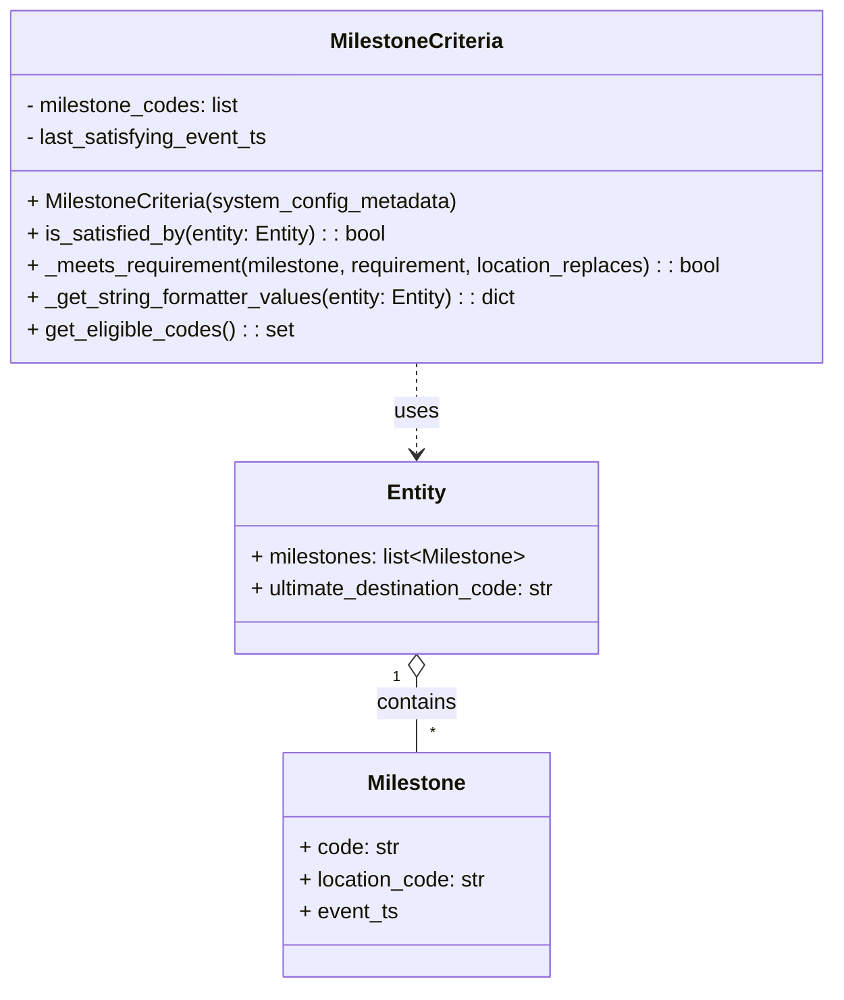

# Diagram: entity_core/entity_service/entity_service/entity/criteria/milestone.py

> Auto-generated by Obscura crawlers

## Mermaid

### SVG

<svg id="container" width="635.484375" xmlns="http://www.w3.org/2000/svg" class="classDiagram" height="740" viewBox="0 0 635.484375 740" role="graphics-document document" aria-roledescription="class"><g><defs><marker id="container_class-aggregationStart" class="marker aggregation class" refX="18" refY="7" markerWidth="190" markerHeight="240" orient="auto"><path d="M 18,7 L9,13 L1,7 L9,1 Z"></path></marker></defs><defs><marker id="container_class-aggregationEnd" class="marker aggregation class" refX="1" refY="7" markerWidth="20" markerHeight="28" orient="auto"><path d="M 18,7 L9,13 L1,7 L9,1 Z"></path></marker></defs><defs><marker id="container_class-extensionStart" class="marker extension class" refX="18" refY="7" markerWidth="190" markerHeight="240" orient="auto"><path d="M 1,7 L18,13 V 1 Z"></path></marker></defs><defs><marker id="container_class-extensionEnd" class="marker extension class" refX="1" refY="7" markerWidth="20" markerHeight="28" orient="auto"><path d="M 1,1 V 13 L18,7 Z"></path></marker></defs><defs><marker id="container_class-compositionStart" class="marker composition class" refX="18" refY="7" markerWidth="190" markerHeight="240" orient="auto"><path d="M 18,7 L9,13 L1,7 L9,1 Z"></path></marker></defs><defs><marker id="container_class-compositionEnd" class="marker composition class" refX="1" refY="7" markerWidth="20" markerHeight="28" orient="auto"><path d="M 18,7 L9,13 L1,7 L9,1 Z"></path></marker></defs><defs><marker id="container_class-dependencyStart" class="marker dependency class" refX="6" refY="7" markerWidth="190" markerHeight="240" orient="auto"><path d="M 5,7 L9,13 L1,7 L9,1 Z"></path></marker></defs><defs><marker id="container_class-dependencyEnd" class="marker dependency class" refX="13" refY="7" markerWidth="20" markerHeight="28" orient="auto"><path d="M 18,7 L9,13 L14,7 L9,1 Z"></path></marker></defs><defs><marker id="container_class-lollipopStart" class="marker lollipop class" refX="13" refY="7" markerWidth="190" markerHeight="240" orient="auto"><circle stroke="black" fill="transparent" cx="7" cy="7" r="6"></circle></marker></defs><defs><marker id="container_class-lollipopEnd" class="marker lollipop class" refX="1" refY="7" markerWidth="190" markerHeight="240" orient="auto"><circle stroke="black" fill="transparent" cx="7" cy="7" r="6"></circle></marker></defs><g class="root"><g class="clusters"></g><g class="edgePaths"><path d="M317.742,272L317.742,278.167C317.742,284.333,317.742,296.667,317.742,308C317.742,319.333,317.742,329.667,317.742,334.833L317.742,340" id="id_MilestoneCriteria_Entity_1" class="edge-thickness-normal edge-pattern-dashed relation" style=";;;" data-edge="true" data-et="edge" data-id="id_MilestoneCriteria_Entity_1" data-points="W3sieCI6MzE3Ljc0MjE4NzUsInkiOjI3Mn0seyJ4IjozMTcuNzQyMTg3NSwieSI6MzA5fSx7IngiOjMxNy43NDIxODc1LCJ5IjozNDZ9XQ==" marker-end="url(#container_class-dependencyEnd)"></path><path d="M317.742,507.25L317.742,510.542C317.742,513.833,317.742,520.417,317.742,529.875C317.742,539.333,317.742,551.667,317.742,557.833L317.742,564" id="id_Entity_Milestone_2" class="edge-thickness-normal edge-pattern-solid relation" style=";;;" data-edge="true" data-et="edge" data-id="id_Entity_Milestone_2" data-points="W3sieCI6MzE3Ljc0MjE4NzUsInkiOjQ5MH0seyJ4IjozMTcuNzQyMTg3NSwieSI6NTI3fSx7IngiOjMxNy43NDIxODc1LCJ5Ijo1NjR9XQ==" marker-start="url(#container_class-aggregationStart)"></path></g><g class="edgeLabels"><g class="edgeLabel" transform="translate(317.7421875, 309)"><g class="label" data-id="id_MilestoneCriteria_Entity_1" transform="translate(-16.4921875, -12)"><foreignObject width="32.984375" height="24">

uses

</foreignObject></g></g><g class="edgeLabel" transform="translate(317.7421875, 527)"><g class="label" data-id="id_Entity_Milestone_2" transform="translate(-30.890625, -12)"><foreignObject width="61.78125" height="24">

contains

</foreignObject></g></g><g class="edgeTerminals" transform="translate(302.74218875, 507.5000010714286)"><g class="inner" transform="translate(0, 0)"><foreignObject style="width: 9px; height: 12px;">
1
</foreignObject></g></g><g class="edgeTerminals" transform="translate(327.7421887499999, 541.5000010714285)"><g class="inner" transform="translate(0, 0)"></g><foreignObject style="width: 9px; height: 12px;">
*
</foreignObject></g></g><g class="nodes"><g class="node default" id="classId-MilestoneCriteria-0" transform="translate(317.7421875, 140)"><g class="basic label-container"><path d="M-309.7421875 -132 L309.7421875 -132 L309.7421875 132 L-309.7421875 132" stroke="none" stroke-width="0" fill="#ECECFF" style=""></path><path d="M-309.7421875 -132 C-140.08395336427432 -132, 29.574280771451356 -132, 309.7421875 -132 M-309.7421875 -132 C-181.9543818354868 -132, -54.1665761709736 -132, 309.7421875 -132 M309.7421875 -132 C309.7421875 -67.2008843907777, 309.7421875 -2.401768781555404, 309.7421875 132 M309.7421875 -132 C309.7421875 -56.23810388614051, 309.7421875 19.523792227718985, 309.7421875 132 M309.7421875 132 C94.2781784652476 132, -121.18583056950479 132, -309.7421875 132 M309.7421875 132 C68.29255078421005 132, -173.1570859315799 132, -309.7421875 132 M-309.7421875 132 C-309.7421875 69.92715690295836, -309.7421875 7.8543138059167035, -309.7421875 -132 M-309.7421875 132 C-309.7421875 76.85443403721973, -309.7421875 21.70886807443948, -309.7421875 -132" stroke="#9370DB" stroke-width="1.3" fill="none" stroke-dasharray="0 0" style=""></path></g><g class="annotation-group text" transform="translate(0, -108)"></g><g class="label-group text" transform="translate(-62.984375, -108)"><g class="label" style="font-weight: bolder" transform="translate(0,-12)"><foreignObject width="125.96875" height="24">

MilestoneCriteria

</foreignObject></g></g><g class="members-group text" transform="translate(-297.7421875, -60)"><g class="label" style="" transform="translate(0,-12)"><foreignObject width="163.34375" height="24">

- milestone_codes: list

</foreignObject></g><g class="label" style="" transform="translate(0,12)"><foreignObject width="184.28125" height="24">

- last_satisfying_event_ts

</foreignObject></g></g><g class="methods-group text" transform="translate(-297.7421875, 12)"><g class="label" style="" transform="translate(0,-12)"><foreignObject width="326.1875" height="24">

+ MilestoneCriteria(system_config_metadata)

</foreignObject></g><g class="label" style="" transform="translate(0,12)"><foreignObject width="274.484375" height="24">

+ is_satisfied_by(entity: Entity) : : bool

</foreignObject></g><g class="label" style="" transform="translate(0,36)"><foreignObject width="532.5" height="24">

+ _meets_requirement(milestone, requirement, location_replaces) : : bool

</foreignObject></g><g class="label" style="" transform="translate(0,60)"><foreignObject width="373.53125" height="24">

+ _get_string_formatter_values(entity: Entity) : : dict

</foreignObject></g><g class="label" style="" transform="translate(0,84)"><foreignObject width="199.21875" height="24">

+ get_eligible_codes() : : set

</foreignObject></g></g><g class="divider" style=""><path d="M-309.7421875 -84 C-145.11739214337203 -84, 19.50740321325594 -84, 309.7421875 -84 M-309.7421875 -84 C-172.10350367427185 -84, -34.4648198485437 -84, 309.7421875 -84" stroke="#9370DB" stroke-width="1.3" fill="none" stroke-dasharray="0 0" style=""></path></g><g class="divider" style=""><path d="M-309.7421875 -12 C-75.61298011888584 -12, 158.5162272622283 -12, 309.7421875 -12 M-309.7421875 -12 C-146.77884590568175 -12, 16.184495688636503 -12, 309.7421875 -12" stroke="#9370DB" stroke-width="1.3" fill="none" stroke-dasharray="0 0" style=""></path></g></g><g class="node default" id="classId-Entity-1" transform="translate(317.7421875, 418)"><g class="basic label-container"><path d="M-139.875 -72 L139.875 -72 L139.875 72 L-139.875 72" stroke="none" stroke-width="0" fill="#ECECFF" style=""></path><path d="M-139.875 -72 C-41.35687623113773 -72, 57.161247537724535 -72, 139.875 -72 M-139.875 -72 C-67.12912954165962 -72, 5.6167409166807545 -72, 139.875 -72 M139.875 -72 C139.875 -21.58323597502244, 139.875 28.83352804995512, 139.875 72 M139.875 -72 C139.875 -16.051988450287396, 139.875 39.89602309942521, 139.875 72 M139.875 72 C58.6253111665776 72, -22.624377666844794 72, -139.875 72 M139.875 72 C73.90990829742562 72, 7.944816594851233 72, -139.875 72 M-139.875 72 C-139.875 15.009270200113058, -139.875 -41.981459599773885, -139.875 -72 M-139.875 72 C-139.875 36.0548739150531, -139.875 0.10974783010620115, -139.875 -72" stroke="#9370DB" stroke-width="1.3" fill="none" stroke-dasharray="0 0" style=""></path></g><g class="annotation-group text" transform="translate(0, -48)"></g><g class="label-group text" transform="translate(-21.28125, -48)"><g class="label" style="font-weight: bolder" transform="translate(0,-12)"><foreignObject width="42.5625" height="24">

Entity

</foreignObject></g></g><g class="members-group text" transform="translate(-127.875, 0)"><g class="label" style="" transform="translate(0,-12)"><foreignObject width="208.96875" height="24">

+ milestones: list&lt;Milestone&gt;

</foreignObject></g><g class="label" style="" transform="translate(0,12)"><foreignObject width="234.46875" height="24">

+ ultimate_destination_code: str

</foreignObject></g></g><g class="methods-group text" transform="translate(-127.875, 72)"></g><g class="divider" style=""><path d="M-139.875 -24 C-54.6201748118972 -24, 30.6346503762056 -24, 139.875 -24 M-139.875 -24 C-56.30741962649827 -24, 27.260160747003454 -24, 139.875 -24" stroke="#9370DB" stroke-width="1.3" fill="none" stroke-dasharray="0 0" style=""></path></g><g class="divider" style=""><path d="M-139.875 48 C-67.06430643978409 48, 5.7463871204318195 48, 139.875 48 M-139.875 48 C-52.9142890354519 48, 34.0464219290962 48, 139.875 48" stroke="#9370DB" stroke-width="1.3" fill="none" stroke-dasharray="0 0" style=""></path></g></g><g class="node default" id="classId-Milestone-2" transform="translate(317.7421875, 648)"><g class="basic label-container"><path d="M-100.828125 -84 L100.828125 -84 L100.828125 84 L-100.828125 84" stroke="none" stroke-width="0" fill="#ECECFF" style=""></path><path d="M-100.828125 -84 C-49.3599114323548 -84, 2.1083021352904012 -84, 100.828125 -84 M-100.828125 -84 C-34.56835280602017 -84, 31.691419387959655 -84, 100.828125 -84 M100.828125 -84 C100.828125 -39.71988519365158, 100.828125 4.560229612696844, 100.828125 84 M100.828125 -84 C100.828125 -31.05678894177872, 100.828125 21.88642211644256, 100.828125 84 M100.828125 84 C49.28190492465276 84, -2.264315150694486 84, -100.828125 84 M100.828125 84 C30.136331023958306 84, -40.55546295208339 84, -100.828125 84 M-100.828125 84 C-100.828125 35.865804498177624, -100.828125 -12.268391003644751, -100.828125 -84 M-100.828125 84 C-100.828125 46.676137855604594, -100.828125 9.352275711209188, -100.828125 -84" stroke="#9370DB" stroke-width="1.3" fill="none" stroke-dasharray="0 0" style=""></path></g><g class="annotation-group text" transform="translate(0, -60)"></g><g class="label-group text" transform="translate(-35.8125, -60)"><g class="label" style="font-weight: bolder" transform="translate(0,-12)"><foreignObject width="71.625" height="24">

Milestone

</foreignObject></g></g><g class="members-group text" transform="translate(-88.828125, -12)"><g class="label" style="" transform="translate(0,-12)"><foreignObject width="74.703125" height="24">

+ code: str

</foreignObject></g><g class="label" style="" transform="translate(0,12)"><foreignObject width="141.84375" height="24">

+ location_code: str

</foreignObject></g><g class="label" style="" transform="translate(0,36)"><foreignObject width="73.8125" height="24">

+ event_ts

</foreignObject></g></g><g class="methods-group text" transform="translate(-88.828125, 84)"></g><g class="divider" style=""><path d="M-100.828125 -36 C-23.069953668940556 -36, 54.68821766211889 -36, 100.828125 -36 M-100.828125 -36 C-49.05018340063809 -36, 2.7277581987238193 -36, 100.828125 -36" stroke="#9370DB" stroke-width="1.3" fill="none" stroke-dasharray="0 0" style=""></path></g><g class="divider" style=""><path d="M-100.828125 60 C-22.30854570760785 60, 56.2110335847843 60, 100.828125 60 M-100.828125 60 C-50.589394627683276 60, -0.3506642553665529 60, 100.828125 60" stroke="#9370DB" stroke-width="1.3" fill="none" stroke-dasharray="0 0" style=""></path></g></g></g></g></g></svg>
