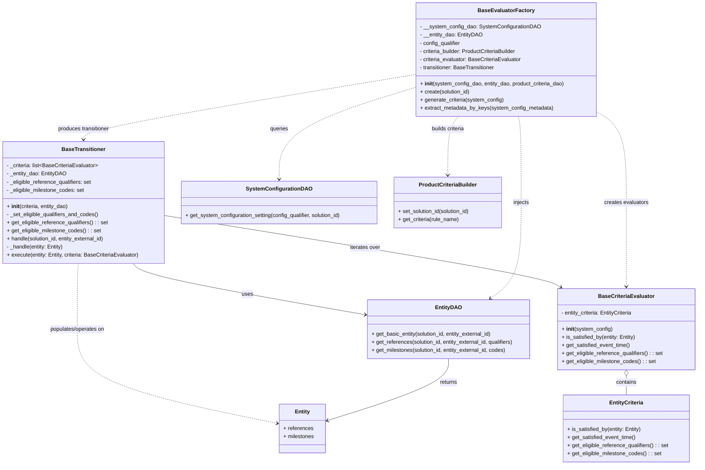

# Diagram: entity_core/entity_service/entity_service/entity/entity/base_criteria_engine.py

> Auto-generated by Obscura crawlers

## Mermaid

### SVG

<svg id="container" width="2076.19921875" xmlns="http://www.w3.org/2000/svg" class="classDiagram" height="1372" viewBox="0 0 2076.19921875 1372" role="graphics-document document" aria-roledescription="class"><g><defs><marker id="container_class-aggregationStart" class="marker aggregation class" refX="18" refY="7" markerWidth="190" markerHeight="240" orient="auto"><path d="M 18,7 L9,13 L1,7 L9,1 Z"></path></marker></defs><defs><marker id="container_class-aggregationEnd" class="marker aggregation class" refX="1" refY="7" markerWidth="20" markerHeight="28" orient="auto"><path d="M 18,7 L9,13 L1,7 L9,1 Z"></path></marker></defs><defs><marker id="container_class-extensionStart" class="marker extension class" refX="18" refY="7" markerWidth="190" markerHeight="240" orient="auto"><path d="M 1,7 L18,13 V 1 Z"></path></marker></defs><defs><marker id="container_class-extensionEnd" class="marker extension class" refX="1" refY="7" markerWidth="20" markerHeight="28" orient="auto"><path d="M 1,1 V 13 L18,7 Z"></path></marker></defs><defs><marker id="container_class-compositionStart" class="marker composition class" refX="18" refY="7" markerWidth="190" markerHeight="240" orient="auto"><path d="M 18,7 L9,13 L1,7 L9,1 Z"></path></marker></defs><defs><marker id="container_class-compositionEnd" class="marker composition class" refX="1" refY="7" markerWidth="20" markerHeight="28" orient="auto"><path d="M 18,7 L9,13 L1,7 L9,1 Z"></path></marker></defs><defs><marker id="container_class-dependencyStart" class="marker dependency class" refX="6" refY="7" markerWidth="190" markerHeight="240" orient="auto"><path d="M 5,7 L9,13 L1,7 L9,1 Z"></path></marker></defs><defs><marker id="container_class-dependencyEnd" class="marker dependency class" refX="13" refY="7" markerWidth="20" markerHeight="28" orient="auto"><path d="M 18,7 L9,13 L14,7 L9,1 Z"></path></marker></defs><defs><marker id="container_class-lollipopStart" class="marker lollipop class" refX="13" refY="7" markerWidth="190" markerHeight="240" orient="auto"><circle stroke="black" fill="transparent" cx="7" cy="7" r="6"></circle></marker></defs><defs><marker id="container_class-lollipopEnd" class="marker lollipop class" refX="1" refY="7" markerWidth="190" markerHeight="240" orient="auto"><circle stroke="black" fill="transparent" cx="7" cy="7" r="6"></circle></marker></defs><g class="root"><g class="clusters"></g><g class="edgePaths"><path d="M1866.168,1109.25L1866.168,1112.542C1866.168,1115.833,1866.168,1122.417,1866.168,1131.875C1866.168,1141.333,1866.168,1153.667,1866.168,1159.833L1866.168,1166" id="id_BaseCriteriaEvaluator_EntityCriteria_1" class="edge-thickness-normal edge-pattern-solid relation" style=";;;" data-edge="true" data-et="edge" data-id="id_BaseCriteriaEvaluator_EntityCriteria_1" data-points="W3sieCI6MTg2Ni4xNjc5Njg3NSwieSI6MTA5Mn0seyJ4IjoxODY2LjE2Nzk2ODc1LCJ5IjoxMTI5fSx7IngiOjE4NjYuMTY3OTY4NzUsInkiOjExNjZ9XQ==" marker-start="url(#container_class-aggregationStart)"></path><path d="M487.391,635.949L675.88,665.791C864.37,695.633,1241.349,755.316,1438.728,790.79C1636.108,826.263,1653.888,837.526,1662.778,843.158L1671.668,848.789" id="id_BaseTransitioner_BaseCriteriaEvaluator_2" class="edge-thickness-normal edge-pattern-solid relation" style=";;;" data-edge="true" data-et="edge" data-id="id_BaseTransitioner_BaseCriteriaEvaluator_2" data-points="W3sieCI6NDg3LjM5MDYyNSwieSI6NjM1Ljk0ODgwOTAwMTMxNjd9LHsieCI6MTYxOC4zMjgxMjUsInkiOjgxNX0seyJ4IjoxNjc2LjczNjI0MTA0Mjk5MzcsInkiOjg1Mn1d" marker-end="url(#container_class-dependencyEnd)"></path><path d="M397.856,778L403.001,784.167C408.145,790.333,418.434,802.667,533.485,827.816C648.537,852.966,868.351,890.931,978.258,909.914L1088.166,928.897" id="id_BaseTransitioner_EntityDAO_3" class="edge-thickness-normal edge-pattern-solid relation" style=";;;" data-edge="true" data-et="edge" data-id="id_BaseTransitioner_EntityDAO_3" data-points="W3sieCI6Mzk3Ljg1NjI0Mjc5OTUzOTEzLCJ5Ijo3Nzh9LHsieCI6NDI4LjcyMjY1NjI1LCJ5Ijo4MTV9LHsieCI6MTA5NC4wNzgxMjUsInkiOjkyOS45MTc4ODc0NTQwNzI4fV0=" marker-end="url(#container_class-dependencyEnd)"></path><path d="M232.56,778L232.042,784.167C231.523,790.333,230.486,802.667,229.968,835C229.449,867.333,229.449,919.667,229.449,972C229.449,1024.333,229.449,1076.667,328.854,1122.987C428.259,1169.307,627.068,1209.614,726.473,1229.768L825.877,1249.922" id="id_BaseTransitioner_Entity_4" class="edge-thickness-normal edge-pattern-dashed relation" style=";;;" data-edge="true" data-et="edge" data-id="id_BaseTransitioner_Entity_4" data-points="W3sieCI6MjMyLjU2MDMwMzg1OTQ0NywieSI6Nzc4fSx7IngiOjIyOS40NDkyMTg3NSwieSI6ODE1fSx7IngiOjIyOS40NDkyMTg3NSwieSI6OTcyfSx7IngiOjIyOS40NDkyMTg3NSwieSI6MTEyOX0seyJ4Ijo4MzEuNzU3ODEyNSwieSI6MTI1MS4xMTM3MDUwNTE2ODE2fV0=" marker-end="url(#container_class-dependencyEnd)"></path><path d="M1337.727,1059L1337.727,1070.667C1337.727,1082.333,1337.727,1105.667,1277.184,1136.154C1216.642,1166.642,1095.557,1204.284,1035.014,1223.105L974.472,1241.926" id="id_EntityDAO_Entity_5" class="edge-thickness-normal edge-pattern-solid relation" style=";;;" data-edge="true" data-et="edge" data-id="id_EntityDAO_Entity_5" data-points="W3sieCI6MTMzNy43MjY1NjI1LCJ5IjoxMDU5fSx7IngiOjEzMzcuNzI2NTYyNSwieSI6MTEyOX0seyJ4Ijo5NjguNzQyMTg3NSwieSI6MTI0My43MDc1NzM2MjAwMTU0fV0=" marker-end="url(#container_class-dependencyEnd)"></path><path d="M1241.605,256.39L1172.803,277.158C1104,297.927,966.395,339.463,897.592,384.898C828.789,430.333,828.789,479.667,828.789,504.333L828.789,529" id="id_BaseEvaluatorFactory_SystemConfigurationDAO_6" class="edge-thickness-normal edge-pattern-dashed relation" style=";;;" data-edge="true" data-et="edge" data-id="id_BaseEvaluatorFactory_SystemConfigurationDAO_6" data-points="W3sieCI6MTI0MS42MDU0Njg3NSwieSI6MjU2LjM4OTc5ODYyOTkyNDI2fSx7IngiOjgyOC43ODkwNjI1LCJ5IjozODF9LHsieCI6ODI4Ljc4OTA2MjUsInkiOjUzNX1d" marker-end="url(#container_class-dependencyEnd)"></path><path d="M1544.705,344L1546.055,350.167C1547.405,356.333,1550.105,368.667,1551.455,411C1552.805,453.333,1552.805,525.667,1552.805,598C1552.805,670.333,1552.805,742.667,1537.63,789.91C1522.455,837.154,1492.106,859.308,1476.931,870.385L1461.756,881.462" id="id_BaseEvaluatorFactory_EntityDAO_7" class="edge-thickness-normal edge-pattern-dashed relation" style=";;;" data-edge="true" data-et="edge" data-id="id_BaseEvaluatorFactory_EntityDAO_7" data-points="W3sieCI6MTU0NC43MDQ1OTIyMjU2MDk4LCJ5IjozNDR9LHsieCI6MTU1Mi44MDQ2ODc1LCJ5IjozODF9LHsieCI6MTU1Mi44MDQ2ODc1LCJ5Ijo1OTh9LHsieCI6MTU1Mi44MDQ2ODc1LCJ5Ijo4MTV9LHsieCI6MTQ1Ni45MDk5ODIwODU5ODcyLCJ5Ijo4ODV9XQ==" marker-end="url(#container_class-dependencyEnd)"></path><path d="M1363.752,344L1358.46,350.167C1353.168,356.333,1342.584,368.667,1337.292,397.5C1332,426.333,1332,471.667,1332,494.333L1332,517" id="id_BaseEvaluatorFactory_ProductCriteriaBuilder_8" class="edge-thickness-normal edge-pattern-dashed relation" style=";;;" data-edge="true" data-et="edge" data-id="id_BaseEvaluatorFactory_ProductCriteriaBuilder_8" data-points="W3sieCI6MTM2My43NTI0NTgwNzkyNjgzLCJ5IjozNDR9LHsieCI6MTMzMiwieSI6MzgxfSx7IngiOjEzMzIsInkiOjUyM31d" marker-end="url(#container_class-dependencyEnd)"></path><path d="M1774.246,328.399L1789.566,337.166C1804.887,345.933,1835.527,363.466,1850.848,408.4C1866.168,453.333,1866.168,525.667,1866.168,598C1866.168,670.333,1866.168,742.667,1866.168,784C1866.168,825.333,1866.168,835.667,1866.168,840.833L1866.168,846" id="id_BaseEvaluatorFactory_BaseCriteriaEvaluator_9" class="edge-thickness-normal edge-pattern-dashed relation" style=";;;" data-edge="true" data-et="edge" data-id="id_BaseEvaluatorFactory_BaseCriteriaEvaluator_9" data-points="W3sieCI6MTc3NC4yNDYwOTM3NSwieSI6MzI4LjM5ODc1Njk1MTI1OTQzfSx7IngiOjE4NjYuMTY3OTY4NzUsInkiOjM4MX0seyJ4IjoxODY2LjE2Nzk2ODc1LCJ5Ijo1OTh9LHsieCI6MTg2Ni4xNjc5Njg3NSwieSI6ODE1fSx7IngiOjE4NjYuMTY3OTY4NzUsInkiOjg1Mn1d" marker-end="url(#container_class-dependencyEnd)"></path><path d="M1241.605,219.322L1075.954,246.268C910.302,273.215,578.999,327.107,413.347,359.22C247.695,391.333,247.695,401.667,247.695,406.833L247.695,412" id="id_BaseEvaluatorFactory_BaseTransitioner_10" class="edge-thickness-normal edge-pattern-dashed relation" style=";;;" data-edge="true" data-et="edge" data-id="id_BaseEvaluatorFactory_BaseTransitioner_10" data-points="W3sieCI6MTI0MS42MDU0Njg3NSwieSI6MjE5LjMyMTk2ODAxODAwMjY1fSx7IngiOjI0Ny42OTUzMTI1LCJ5IjozODF9LHsieCI6MjQ3LjY5NTMxMjUsInkiOjQxOH1d" marker-end="url(#container_class-dependencyEnd)"></path></g><g class="edgeLabels"><g class="edgeLabel" transform="translate(1866.16796875, 1129)"><g class="label" data-id="id_BaseCriteriaEvaluator_EntityCriteria_1" transform="translate(-30.890625, -12)"><foreignObject width="61.78125" height="24">

contains

</foreignObject></g></g><g class="edgeLabel" transform="translate(1087.0047, 730.88033)"><g class="label" data-id="id_BaseTransitioner_BaseCriteriaEvaluator_2" transform="translate(-45.5234375, -12)"><foreignObject width="91.046875" height="24">

iterates over

</foreignObject></g></g><g class="edgeLabel" transform="translate(737.6597, 868.35853)"><g class="label" data-id="id_BaseTransitioner_EntityDAO_3" transform="translate(-16.4921875, -12)"><foreignObject width="32.984375" height="24">

uses

</foreignObject></g></g><g class="edgeLabel" transform="translate(229.44921875, 972)"><g class="label" data-id="id_BaseTransitioner_Entity_4" transform="translate(-83.40625, -12)"><foreignObject width="166.8125" height="24">

populates/operates on

</foreignObject></g></g><g class="edgeLabel" transform="translate(1337.7265625, 1129)"><g class="label" data-id="id_EntityDAO_Entity_5" transform="translate(-26.265625, -12)"><foreignObject width="52.53125" height="24">

returns

</foreignObject></g></g><g class="edgeLabel" transform="translate(828.7890625, 381)"><g class="label" data-id="id_BaseEvaluatorFactory_SystemConfigurationDAO_6" transform="translate(-27.2421875, -12)"><foreignObject width="54.484375" height="24">

queries

</foreignObject></g></g><g class="edgeLabel" transform="translate(1552.8046875, 598)"><g class="label" data-id="id_BaseEvaluatorFactory_EntityDAO_7" transform="translate(-23.9921875, -12)"><foreignObject width="47.984375" height="24">

injects

</foreignObject></g></g><g class="edgeLabel" transform="translate(1332, 381)"><g class="label" data-id="id_BaseEvaluatorFactory_ProductCriteriaBuilder_8" transform="translate(-50.6015625, -12)"><foreignObject width="101.203125" height="24">

builds criteria

</foreignObject></g></g><g class="edgeLabel" transform="translate(1866.16796875, 598)"><g class="label" data-id="id_BaseEvaluatorFactory_BaseCriteriaEvaluator_9" transform="translate(-66.1953125, -12)"><foreignObject width="132.390625" height="24">

creates evaluators

</foreignObject></g></g><g class="edgeLabel" transform="translate(247.6953125, 381)"><g class="label" data-id="id_BaseEvaluatorFactory_BaseTransitioner_10" transform="translate(-78.2734375, -12)"><foreignObject width="156.546875" height="24">

produces transitioner

</foreignObject></g></g></g><g class="nodes"><g class="node default" id="classId-BaseCriteriaEvaluator-0" transform="translate(1866.16796875, 972)"><g class="basic label-container"><path d="M-202.03125 -120 L202.03125 -120 L202.03125 120 L-202.03125 120" stroke="none" stroke-width="0" fill="#ECECFF" style=""></path><path d="M-202.03125 -120 C-70.50133180610953 -120, 61.02858638778093 -120, 202.03125 -120 M-202.03125 -120 C-52.026839499690595 -120, 97.97757100061881 -120, 202.03125 -120 M202.03125 -120 C202.03125 -66.18539105507178, 202.03125 -12.370782110143551, 202.03125 120 M202.03125 -120 C202.03125 -67.97535937321138, 202.03125 -15.950718746422737, 202.03125 120 M202.03125 120 C72.12461483757244 120, -57.782020324855125 120, -202.03125 120 M202.03125 120 C89.64510926883422 120, -22.741031462331563 120, -202.03125 120 M-202.03125 120 C-202.03125 64.59873339341394, -202.03125 9.197466786827889, -202.03125 -120 M-202.03125 120 C-202.03125 49.706609253634994, -202.03125 -20.58678149273001, -202.03125 -120" stroke="#9370DB" stroke-width="1.3" fill="none" stroke-dasharray="0 0" style=""></path></g><g class="annotation-group text" transform="translate(0, -96)"></g><g class="label-group text" transform="translate(-79.140625, -96)"><g class="label" style="font-weight: bolder" transform="translate(0,-12)"><foreignObject width="158.28125" height="24">

BaseCriteriaEvaluator

</foreignObject></g></g><g class="members-group text" transform="translate(-190.03125, -48)"><g class="label" style="" transform="translate(0,-12)"><foreignObject width="214.921875" height="24">

- entity_criteria: EntityCriteria

</foreignObject></g></g><g class="methods-group text" transform="translate(-190.03125, 0)"><g class="label" style="" transform="translate(0,-12)"><foreignObject width="149.015625" height="24">

+ <strong>init</strong>(system_config)

</foreignObject></g><g class="label" style="" transform="translate(0,12)"><foreignObject width="221.203125" height="24">

+ is_satisfied_by(entity: Entity)

</foreignObject></g><g class="label" style="" transform="translate(0,36)"><foreignObject width="203.796875" height="24">

+ get_satisfied_event_time()

</foreignObject></g><g class="label" style="" transform="translate(0,60)"><foreignObject width="300.921875" height="24">

+ get_eligible_reference_qualifiers() : : set

</foreignObject></g><g class="label" style="" transform="translate(0,84)"><foreignObject width="279.21875" height="24">

+ get_eligible_milestone_codes() : : set

</foreignObject></g></g><g class="divider" style=""><path d="M-202.03125 -72 C-114.73077339236418 -72, -27.43029678472837 -72, 202.03125 -72 M-202.03125 -72 C-43.0311365396272 -72, 115.9689769207456 -72, 202.03125 -72" stroke="#9370DB" stroke-width="1.3" fill="none" stroke-dasharray="0 0" style=""></path></g><g class="divider" style=""><path d="M-202.03125 -24 C-83.2976184607702 -24, 35.43601307845961 -24, 202.03125 -24 M-202.03125 -24 C-103.6066596969295 -24, -5.1820693938589955 -24, 202.03125 -24" stroke="#9370DB" stroke-width="1.3" fill="none" stroke-dasharray="0 0" style=""></path></g></g><g class="node default" id="classId-EntityCriteria-1" transform="translate(1866.16796875, 1265)"><g class="basic label-container"><path d="M-186.69140625 -99 L186.69140625 -99 L186.69140625 99 L-186.69140625 99" stroke="none" stroke-width="0" fill="#ECECFF" style=""></path><path d="M-186.69140625 -99 C-47.684921063805604 -99, 91.32156412238879 -99, 186.69140625 -99 M-186.69140625 -99 C-86.59031119365774 -99, 13.51078386268452 -99, 186.69140625 -99 M186.69140625 -99 C186.69140625 -53.29490361076808, 186.69140625 -7.589807221536162, 186.69140625 99 M186.69140625 -99 C186.69140625 -29.7380261438462, 186.69140625 39.5239477123076, 186.69140625 99 M186.69140625 99 C90.91478034910003 99, -4.861845551799945 99, -186.69140625 99 M186.69140625 99 C98.34989532431068 99, 10.00838439862136 99, -186.69140625 99 M-186.69140625 99 C-186.69140625 48.32624660658312, -186.69140625 -2.347506786833762, -186.69140625 -99 M-186.69140625 99 C-186.69140625 48.256357644683966, -186.69140625 -2.4872847106320677, -186.69140625 -99" stroke="#9370DB" stroke-width="1.3" fill="none" stroke-dasharray="0 0" style=""></path></g><g class="annotation-group text" transform="translate(0, -75)"></g><g class="label-group text" transform="translate(-48.4609375, -75)"><g class="label" style="font-weight: bolder" transform="translate(0,-12)"><foreignObject width="96.921875" height="24">

EntityCriteria

</foreignObject></g></g><g class="members-group text" transform="translate(-174.69140625, -27)"></g><g class="methods-group text" transform="translate(-174.69140625, 3)"><g class="label" style="" transform="translate(0,-12)"><foreignObject width="221.203125" height="24">

+ is_satisfied_by(entity: Entity)

</foreignObject></g><g class="label" style="" transform="translate(0,12)"><foreignObject width="203.796875" height="24">

+ get_satisfied_event_time()

</foreignObject></g><g class="label" style="" transform="translate(0,36)"><foreignObject width="300.921875" height="24">

+ get_eligible_reference_qualifiers() : : set

</foreignObject></g><g class="label" style="" transform="translate(0,60)"><foreignObject width="279.21875" height="24">

+ get_eligible_milestone_codes() : : set

</foreignObject></g></g><g class="divider" style=""><path d="M-186.69140625 -51 C-103.17293907611244 -51, -19.654471902224884 -51, 186.69140625 -51 M-186.69140625 -51 C-65.07588387846901 -51, 56.53963849306197 -51, 186.69140625 -51" stroke="#9370DB" stroke-width="1.3" fill="none" stroke-dasharray="0 0" style=""></path></g><g class="divider" style=""><path d="M-186.69140625 -27 C-53.919184965173486 -27, 78.85303631965303 -27, 186.69140625 -27 M-186.69140625 -27 C-74.21271595872425 -27, 38.26597433255151 -27, 186.69140625 -27" stroke="#9370DB" stroke-width="1.3" fill="none" stroke-dasharray="0 0" style=""></path></g></g><g class="node default" id="classId-BaseTransitioner-2" transform="translate(247.6953125, 598)"><g class="basic label-container"><path d="M-239.6953125 -180 L239.6953125 -180 L239.6953125 180 L-239.6953125 180" stroke="none" stroke-width="0" fill="#ECECFF" style=""></path><path d="M-239.6953125 -180 C-89.0925804671916 -180, 61.51015156561681 -180, 239.6953125 -180 M-239.6953125 -180 C-57.65961074581642 -180, 124.37609100836715 -180, 239.6953125 -180 M239.6953125 -180 C239.6953125 -98.73002154218634, 239.6953125 -17.46004308437267, 239.6953125 180 M239.6953125 -180 C239.6953125 -70.93805804479486, 239.6953125 38.123883910410285, 239.6953125 180 M239.6953125 180 C137.23298980998675 180, 34.770667119973524 180, -239.6953125 180 M239.6953125 180 C95.39346097605542 180, -48.908390547889155 180, -239.6953125 180 M-239.6953125 180 C-239.6953125 99.58257544722062, -239.6953125 19.16515089444124, -239.6953125 -180 M-239.6953125 180 C-239.6953125 59.40979198585944, -239.6953125 -61.180416028281115, -239.6953125 -180" stroke="#9370DB" stroke-width="1.3" fill="none" stroke-dasharray="0 0" style=""></path></g><g class="annotation-group text" transform="translate(0, -156)"></g><g class="label-group text" transform="translate(-61.90625, -156)"><g class="label" style="font-weight: bolder" transform="translate(0,-12)"><foreignObject width="123.8125" height="24">

BaseTransitioner

</foreignObject></g></g><g class="members-group text" transform="translate(-227.6953125, -108)"><g class="label" style="" transform="translate(0,-12)"><foreignObject width="272.890625" height="24">

- _criteria: list&lt;BaseCriteriaEvaluator&gt;

</foreignObject></g><g class="label" style="" transform="translate(0,12)"><foreignObject width="175.71875" height="24">

- _entity_dao: EntityDAO

</foreignObject></g><g class="label" style="" transform="translate(0,36)"><foreignObject width="254.140625" height="24">

- _eligible_reference_qualifiers: set

</foreignObject></g><g class="label" style="" transform="translate(0,60)"><foreignObject width="232.4375" height="24">

- _eligible_milestone_codes: set

</foreignObject></g></g><g class="methods-group text" transform="translate(-227.6953125, 12)"><g class="label" style="" transform="translate(0,-12)"><foreignObject width="184.203125" height="24">

+ <strong>init</strong>(criteria, entity_dao)

</foreignObject></g><g class="label" style="" transform="translate(0,12)"><foreignObject width="274.328125" height="24">

- _set_eligible_qualifiers_and_codes()

</foreignObject></g><g class="label" style="" transform="translate(0,36)"><foreignObject width="300.921875" height="24">

+ get_eligible_reference_qualifiers() : : set

</foreignObject></g><g class="label" style="" transform="translate(0,60)"><foreignObject width="279.21875" height="24">

+ get_eligible_milestone_codes() : : set

</foreignObject></g><g class="label" style="" transform="translate(0,84)"><foreignObject width="294.5" height="24">

+ handle(solution_id, entity_external_id)

</foreignObject></g><g class="label" style="" transform="translate(0,108)"><foreignObject width="171.46875" height="24">

- _handle(entity: Entity)

</foreignObject></g><g class="label" style="" transform="translate(0,132)"><foreignObject width="393.484375" height="24">

+ execute(entity: Entity, criteria: BaseCriteriaEvaluator)

</foreignObject></g></g><g class="divider" style=""><path d="M-239.6953125 -132 C-48.52708385895605 -132, 142.6411447820879 -132, 239.6953125 -132 M-239.6953125 -132 C-115.9773104889325 -132, 7.740691522134995 -132, 239.6953125 -132" stroke="#9370DB" stroke-width="1.3" fill="none" stroke-dasharray="0 0" style=""></path></g><g class="divider" style=""><path d="M-239.6953125 -12 C-97.93678305067658 -12, 43.82174639864684 -12, 239.6953125 -12 M-239.6953125 -12 C-77.79575285417243 -12, 84.10380679165513 -12, 239.6953125 -12" stroke="#9370DB" stroke-width="1.3" fill="none" stroke-dasharray="0 0" style=""></path></g></g><g class="node default" id="classId-EntityDAO-3" transform="translate(1337.7265625, 972)"><g class="basic label-container"><path d="M-243.6484375 -87 L243.6484375 -87 L243.6484375 87 L-243.6484375 87" stroke="none" stroke-width="0" fill="#ECECFF" style=""></path><path d="M-243.6484375 -87 C-65.78729409794383 -87, 112.07384930411234 -87, 243.6484375 -87 M-243.6484375 -87 C-112.7264170112683 -87, 18.195603477463408 -87, 243.6484375 -87 M243.6484375 -87 C243.6484375 -39.35537664185358, 243.6484375 8.289246716292837, 243.6484375 87 M243.6484375 -87 C243.6484375 -20.240213218388945, 243.6484375 46.51957356322211, 243.6484375 87 M243.6484375 87 C101.9433544573771 87, -39.761728585245805 87, -243.6484375 87 M243.6484375 87 C119.88606677718259 87, -3.8763039456348167 87, -243.6484375 87 M-243.6484375 87 C-243.6484375 40.94451545584318, -243.6484375 -5.110969088313638, -243.6484375 -87 M-243.6484375 87 C-243.6484375 34.18949701220098, -243.6484375 -18.621005975598038, -243.6484375 -87" stroke="#9370DB" stroke-width="1.3" fill="none" stroke-dasharray="0 0" style=""></path></g><g class="annotation-group text" transform="translate(0, -63)"></g><g class="label-group text" transform="translate(-36.578125, -63)"><g class="label" style="font-weight: bolder" transform="translate(0,-12)"><foreignObject width="73.15625" height="24">

EntityDAO

</foreignObject></g></g><g class="members-group text" transform="translate(-231.6484375, -15)"></g><g class="methods-group text" transform="translate(-231.6484375, 15)"><g class="label" style="" transform="translate(0,-12)"><foreignObject width="362.5" height="24">

+ get_basic_entity(solution_id, entity_external_id)

</foreignObject></g><g class="label" style="" transform="translate(0,12)"><foreignObject width="426.71875" height="24">

+ get_references(solution_id, entity_external_id, qualifiers)

</foreignObject></g><g class="label" style="" transform="translate(0,36)"><foreignObject width="405.015625" height="24">

+ get_milestones(solution_id, entity_external_id, codes)

</foreignObject></g></g><g class="divider" style=""><path d="M-243.6484375 -39 C-89.86060515721144 -39, 63.927227185577124 -39, 243.6484375 -39 M-243.6484375 -39 C-58.42494451385764 -39, 126.79854847228472 -39, 243.6484375 -39" stroke="#9370DB" stroke-width="1.3" fill="none" stroke-dasharray="0 0" style=""></path></g><g class="divider" style=""><path d="M-243.6484375 -15 C-133.16603566015817 -15, -22.683633820316345 -15, 243.6484375 -15 M-243.6484375 -15 C-56.23754951730939 -15, 131.17333846538122 -15, 243.6484375 -15" stroke="#9370DB" stroke-width="1.3" fill="none" stroke-dasharray="0 0" style=""></path></g></g><g class="node default" id="classId-Entity-4" transform="translate(900.25, 1265)"><g class="basic label-container"><path d="M-68.4921875 -72 L68.4921875 -72 L68.4921875 72 L-68.4921875 72" stroke="none" stroke-width="0" fill="#ECECFF" style=""></path><path d="M-68.4921875 -72 C-25.489573005561027 -72, 17.513041488877946 -72, 68.4921875 -72 M-68.4921875 -72 C-27.410435807710464 -72, 13.671315884579073 -72, 68.4921875 -72 M68.4921875 -72 C68.4921875 -31.61935396692835, 68.4921875 8.761292066143298, 68.4921875 72 M68.4921875 -72 C68.4921875 -30.91946308036887, 68.4921875 10.161073839262258, 68.4921875 72 M68.4921875 72 C31.58267478367351 72, -5.326837932652978 72, -68.4921875 72 M68.4921875 72 C21.54874650439855 72, -25.3946944912029 72, -68.4921875 72 M-68.4921875 72 C-68.4921875 36.80753261103448, -68.4921875 1.6150652220689636, -68.4921875 -72 M-68.4921875 72 C-68.4921875 35.61418359143485, -68.4921875 -0.7716328171302962, -68.4921875 -72" stroke="#9370DB" stroke-width="1.3" fill="none" stroke-dasharray="0 0" style=""></path></g><g class="annotation-group text" transform="translate(0, -48)"></g><g class="label-group text" transform="translate(-21.28125, -48)"><g class="label" style="font-weight: bolder" transform="translate(0,-12)"><foreignObject width="42.5625" height="24">

Entity

</foreignObject></g></g><g class="members-group text" transform="translate(-56.4921875, 0)"><g class="label" style="" transform="translate(0,-12)"><foreignObject width="87.875" height="24">

+ references

</foreignObject></g><g class="label" style="" transform="translate(0,12)"><foreignObject width="91.703125" height="24">

+ milestones

</foreignObject></g></g><g class="methods-group text" transform="translate(-56.4921875, 72)"></g><g class="divider" style=""><path d="M-68.4921875 -24 C-25.167864785455507 -24, 18.156457929088987 -24, 68.4921875 -24 M-68.4921875 -24 C-17.32488255258442 -24, 33.84242239483116 -24, 68.4921875 -24" stroke="#9370DB" stroke-width="1.3" fill="none" stroke-dasharray="0 0" style=""></path></g><g class="divider" style=""><path d="M-68.4921875 48 C-27.066610700951593 48, 14.358966098096815 48, 68.4921875 48 M-68.4921875 48 C-33.6302411577632 48, 1.2317051844735971 48, 68.4921875 48" stroke="#9370DB" stroke-width="1.3" fill="none" stroke-dasharray="0 0" style=""></path></g></g><g class="node default" id="classId-BaseEvaluatorFactory-5" transform="translate(1507.92578125, 176)"><g class="basic label-container"><path d="M-266.3203125 -168 L266.3203125 -168 L266.3203125 168 L-266.3203125 168" stroke="none" stroke-width="0" fill="#ECECFF" style=""></path><path d="M-266.3203125 -168 C-107.38864493801253 -168, 51.543022623974935 -168, 266.3203125 -168 M-266.3203125 -168 C-130.32721045040384 -168, 5.665891599192321 -168, 266.3203125 -168 M266.3203125 -168 C266.3203125 -36.66942968750661, 266.3203125 94.66114062498679, 266.3203125 168 M266.3203125 -168 C266.3203125 -74.58320707461274, 266.3203125 18.83358585077451, 266.3203125 168 M266.3203125 168 C115.75931407045604 168, -34.801684359087915 168, -266.3203125 168 M266.3203125 168 C94.24886470595848 168, -77.82258308808304 168, -266.3203125 168 M-266.3203125 168 C-266.3203125 89.98513400308553, -266.3203125 11.970268006171068, -266.3203125 -168 M-266.3203125 168 C-266.3203125 48.51130177945228, -266.3203125 -70.97739644109544, -266.3203125 -168" stroke="#9370DB" stroke-width="1.3" fill="none" stroke-dasharray="0 0" style=""></path></g><g class="annotation-group text" transform="translate(0, -144)"></g><g class="label-group text" transform="translate(-78.5625, -144)"><g class="label" style="font-weight: bolder" transform="translate(0,-12)"><foreignObject width="157.125" height="24">

BaseEvaluatorFactory

</foreignObject></g></g><g class="members-group text" transform="translate(-254.3203125, -96)"><g class="label" style="" transform="translate(0,-12)"><foreignObject width="352.25" height="24">

- __system_config_dao: SystemConfigurationDAO

</foreignObject></g><g class="label" style="" transform="translate(0,12)"><foreignObject width="183.875" height="24">

- __entity_dao: EntityDAO

</foreignObject></g><g class="label" style="" transform="translate(0,36)"><foreignObject width="123.046875" height="24">

- config_qualifier

</foreignObject></g><g class="label" style="" transform="translate(0,60)"><foreignObject width="293.640625" height="24">

- criteria_builder: ProductCriteriaBuilder

</foreignObject></g><g class="label" style="" transform="translate(0,84)"><foreignObject width="303.171875" height="24">

- criteria_evaluator: BaseCriteriaEvaluator

</foreignObject></g><g class="label" style="" transform="translate(0,108)"><foreignObject width="226.140625" height="24">

- transitioner: BaseTransitioner

</foreignObject></g></g><g class="methods-group text" transform="translate(-254.3203125, 72)"><g class="label" style="" transform="translate(0,-12)"><foreignObject width="430.078125" height="24">

+ <strong>init</strong>(system_config_dao, entity_dao, product_criteria_dao)

</foreignObject></g><g class="label" style="" transform="translate(0,12)"><foreignObject width="149.6875" height="24">

+ create(solution_id)

</foreignObject></g><g class="label" style="" transform="translate(0,36)"><foreignObject width="247.6875" height="24">

+ generate_criteria(system_config)

</foreignObject></g><g class="label" style="" transform="translate(0,60)"><foreignObject width="395.421875" height="24">

+ extract_metadata_by_keys(system_config_metadata)

</foreignObject></g></g><g class="divider" style=""><path d="M-266.3203125 -120 C-148.00064637024423 -120, -29.680980240488424 -120, 266.3203125 -120 M-266.3203125 -120 C-131.5192239147104 -120, 3.281864670579182 -120, 266.3203125 -120" stroke="#9370DB" stroke-width="1.3" fill="none" stroke-dasharray="0 0" style=""></path></g><g class="divider" style=""><path d="M-266.3203125 48 C-149.75514480651952 48, -33.18997711303905 48, 266.3203125 48 M-266.3203125 48 C-77.21748801802025 48, 111.8853364639595 48, 266.3203125 48" stroke="#9370DB" stroke-width="1.3" fill="none" stroke-dasharray="0 0" style=""></path></g></g><g class="node default" id="classId-SystemConfigurationDAO-6" transform="translate(828.7890625, 598)"><g class="basic label-container"><path d="M-291.3984375 -63 L291.3984375 -63 L291.3984375 63 L-291.3984375 63" stroke="none" stroke-width="0" fill="#ECECFF" style=""></path><path d="M-291.3984375 -63 C-88.70149477983136 -63, 113.99544794033727 -63, 291.3984375 -63 M-291.3984375 -63 C-61.42290781658161 -63, 168.55262186683677 -63, 291.3984375 -63 M291.3984375 -63 C291.3984375 -17.80214892808882, 291.3984375 27.395702143822362, 291.3984375 63 M291.3984375 -63 C291.3984375 -24.429107058892072, 291.3984375 14.141785882215856, 291.3984375 63 M291.3984375 63 C133.93186498389073 63, -23.534707532218533 63, -291.3984375 63 M291.3984375 63 C149.2762120464238 63, 7.153986592847616 63, -291.3984375 63 M-291.3984375 63 C-291.3984375 37.25220299358033, -291.3984375 11.504405987160666, -291.3984375 -63 M-291.3984375 63 C-291.3984375 23.2291058658056, -291.3984375 -16.5417882683888, -291.3984375 -63" stroke="#9370DB" stroke-width="1.3" fill="none" stroke-dasharray="0 0" style=""></path></g><g class="annotation-group text" transform="translate(0, -39)"></g><g class="label-group text" transform="translate(-91.21875, -39)"><g class="label" style="font-weight: bolder" transform="translate(0,-12)"><foreignObject width="182.4375" height="24">

SystemConfigurationDAO

</foreignObject></g></g><g class="members-group text" transform="translate(-279.3984375, 9)"></g><g class="methods-group text" transform="translate(-279.3984375, 39)"><g class="label" style="" transform="translate(0,-12)"><foreignObject width="467.578125" height="24">

+ get_system_configuration_setting(config_qualifier, solution_id)

</foreignObject></g></g><g class="divider" style=""><path d="M-291.3984375 -15 C-74.6464788026839 -15, 142.1054798946322 -15, 291.3984375 -15 M-291.3984375 -15 C-71.12412159347576 -15, 149.15019431304847 -15, 291.3984375 -15" stroke="#9370DB" stroke-width="1.3" fill="none" stroke-dasharray="0 0" style=""></path></g><g class="divider" style=""><path d="M-291.3984375 9 C-72.19394948555563 9, 147.01053852888873 9, 291.3984375 9 M-291.3984375 9 C-170.31727809165494 9, -49.23611868330991 9, 291.3984375 9" stroke="#9370DB" stroke-width="1.3" fill="none" stroke-dasharray="0 0" style=""></path></g></g><g class="node default" id="classId-ProductCriteriaBuilder-7" transform="translate(1332, 598)"><g class="basic label-container"><path d="M-161.8125 -75 L161.8125 -75 L161.8125 75 L-161.8125 75" stroke="none" stroke-width="0" fill="#ECECFF" style=""></path><path d="M-161.8125 -75 C-87.3507918273061 -75, -12.889083654612193 -75, 161.8125 -75 M-161.8125 -75 C-89.53268664311149 -75, -17.25287328622298 -75, 161.8125 -75 M161.8125 -75 C161.8125 -29.224848240748265, 161.8125 16.55030351850347, 161.8125 75 M161.8125 -75 C161.8125 -35.53865599045265, 161.8125 3.922688019094707, 161.8125 75 M161.8125 75 C71.25009345643346 75, -19.312313087133077 75, -161.8125 75 M161.8125 75 C75.03320614447004 75, -11.746087711059914 75, -161.8125 75 M-161.8125 75 C-161.8125 31.93589065907537, -161.8125 -11.128218681849262, -161.8125 -75 M-161.8125 75 C-161.8125 38.81362066786525, -161.8125 2.6272413357305027, -161.8125 -75" stroke="#9370DB" stroke-width="1.3" fill="none" stroke-dasharray="0 0" style=""></path></g><g class="annotation-group text" transform="translate(0, -51)"></g><g class="label-group text" transform="translate(-82.28125, -51)"><g class="label" style="font-weight: bolder" transform="translate(0,-12)"><foreignObject width="164.5625" height="24">

ProductCriteriaBuilder

</foreignObject></g></g><g class="members-group text" transform="translate(-149.8125, -3)"></g><g class="methods-group text" transform="translate(-149.8125, 27)"><g class="label" style="" transform="translate(0,-12)"><foreignObject width="217.34375" height="24">

+ set_solution_id(solution_id)

</foreignObject></g><g class="label" style="" transform="translate(0,12)"><foreignObject width="182.46875" height="24">

+ get_criteria(rule_name)

</foreignObject></g></g><g class="divider" style=""><path d="M-161.8125 -27 C-75.90394361113302 -27, 10.004612777733968 -27, 161.8125 -27 M-161.8125 -27 C-35.20759934809492 -27, 91.39730130381017 -27, 161.8125 -27" stroke="#9370DB" stroke-width="1.3" fill="none" stroke-dasharray="0 0" style=""></path></g><g class="divider" style=""><path d="M-161.8125 -3 C-82.50229016120375 -3, -3.1920803224074916 -3, 161.8125 -3 M-161.8125 -3 C-51.984709122741506 -3, 57.84308175451699 -3, 161.8125 -3" stroke="#9370DB" stroke-width="1.3" fill="none" stroke-dasharray="0 0" style=""></path></g></g></g></g></g></svg>
