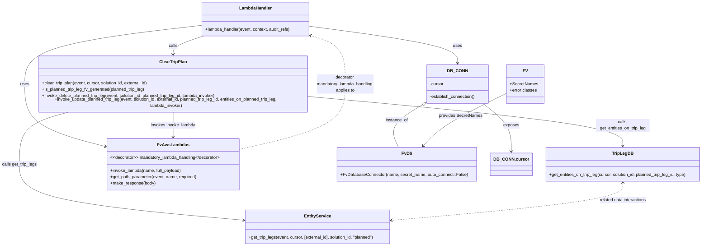

# Diagram: entity_core/entity_service/entity_service/entity/entity/clear_entity_trip_plan.py


> Auto-generated by Obscura crawlers

## Diagram 1

```mermaid
flowchart TD
  LH[lambda_handler(event, context, audit_refs)] --> Log[log event json]
  Log --> Conn[DB_CONN.establish_connection()]
  Conn --> Cursor[cursor = DB_CONN.cursor]
  Cursor --> GetSolution[solution_id = get_path_parameter(event, "solution_id")]
  GetSolution --> GetEntity[external_id = get_path_parameter(event, "entity_id")]
  GetEntity --> Clear[clear_trip_plan(event, cursor, solution_id, external_id)]
  Clear --> GetTripLegs[entity_planned_trip_legs = get_trip_legs(event, cursor, [external_id], solution_id, "planned")]
  GetTripLegs --> CheckEmpty{entity_planned_trip_legs empty?}
  CheckEmpty -- Yes --> Raise[raise BadRequestError("Entity does not exist in solution")]
  CheckEmpty -- No --> Extract[planned_trip_legs = entity_planned_trip_legs[0].trip_legs]
  Extract --> ForLoop[for planned_trip_leg in planned_trip_legs]
  ForLoop --> GetPLID[planned_trip_leg_id = planned_trip_leg.id]
  GetPLID --> IsFV{is_planned_trip_leg_fv_generated(planned_trip_leg)?}
  IsFV -- True --> Continue[continue]
  IsFV -- False --> GetEntities[entities_on_planned_trip_leg = get_entities_on_trip_leg(cursor, solution_id, planned_trip_leg_id, "planned")]
  GetEntities --> SingleCheck{len(entities_on_planned_trip_leg) == 1?}
  SingleCheck -- Yes --> InvokeDelete[invoke_delete_planned_trip_leg(event, solution_id, planned_trip_leg_id, invoke_lambda)]
  SingleCheck -- No --> InvokeUpdate[invoke_update_planned_trip_leg(event, solution_id, external_id, planned_trip_leg_id, entities_on_planned_trip_leg, invoke_lambda)]
  InvokeDelete --> LoopEnd
  InvokeUpdate --> LoopEnd
  LoopEnd --> End[return make_response({})]
```

> SVG rendering failed for this diagram.

## Diagram 2



### SVG

<svg id="container" width="2658.83203125" xmlns="http://www.w3.org/2000/svg" class="classDiagram" height="904" viewBox="0 0 2658.83203125 904" role="graphics-document document" aria-roledescription="class"><style>#container{font-family:"trebuchet ms",verdana,arial,sans-serif;font-size:16px;fill:#333;}@keyframes edge-animation-frame{from{stroke-dashoffset:0;}}@keyframes dash{to{stroke-dashoffset:0;}}#container .edge-animation-slow{stroke-dasharray:9,5!important;stroke-dashoffset:900;animation:dash 50s linear infinite;stroke-linecap:round;}#container .edge-animation-fast{stroke-dasharray:9,5!important;stroke-dashoffset:900;animation:dash 20s linear infinite;stroke-linecap:round;}#container .error-icon{fill:#552222;}#container .error-text{fill:#552222;stroke:#552222;}#container .edge-thickness-normal{stroke-width:1px;}#container .edge-thickness-thick{stroke-width:3.5px;}#container .edge-pattern-solid{stroke-dasharray:0;}#container .edge-thickness-invisible{stroke-width:0;fill:none;}#container .edge-pattern-dashed{stroke-dasharray:3;}#container .edge-pattern-dotted{stroke-dasharray:2;}#container .marker{fill:#333333;stroke:#333333;}#container .marker.cross{stroke:#333333;}#container svg{font-family:"trebuchet ms",verdana,arial,sans-serif;font-size:16px;}#container p{margin:0;}#container g.classGroup text{fill:#9370DB;stroke:none;font-family:"trebuchet ms",verdana,arial,sans-serif;font-size:10px;}#container g.classGroup text .title{font-weight:bolder;}#container .nodeLabel,#container .edgeLabel{color:#131300;}#container .edgeLabel .label rect{fill:#ECECFF;}#container .label text{fill:#131300;}#container .labelBkg{background:#ECECFF;}#container .edgeLabel .label span{background:#ECECFF;}#container .classTitle{font-weight:bolder;}#container .node rect,#container .node circle,#container .node ellipse,#container .node polygon,#container .node path{fill:#ECECFF;stroke:#9370DB;stroke-width:1px;}#container .divider{stroke:#9370DB;stroke-width:1;}#container g.clickable{cursor:pointer;}#container g.classGroup rect{fill:#ECECFF;stroke:#9370DB;}#container g.classGroup line{stroke:#9370DB;stroke-width:1;}#container .classLabel .box{stroke:none;stroke-width:0;fill:#ECECFF;opacity:0.5;}#container .classLabel .label{fill:#9370DB;font-size:10px;}#container .relation{stroke:#333333;stroke-width:1;fill:none;}#container .dashed-line{stroke-dasharray:3;}#container .dotted-line{stroke-dasharray:1 2;}#container #compositionStart,#container .composition{fill:#333333!important;stroke:#333333!important;stroke-width:1;}#container #compositionEnd,#container .composition{fill:#333333!important;stroke:#333333!important;stroke-width:1;}#container #dependencyStart,#container .dependency{fill:#333333!important;stroke:#333333!important;stroke-width:1;}#container #dependencyStart,#container .dependency{fill:#333333!important;stroke:#333333!important;stroke-width:1;}#container #extensionStart,#container .extension{fill:transparent!important;stroke:#333333!important;stroke-width:1;}#container #extensionEnd,#container .extension{fill:transparent!important;stroke:#333333!important;stroke-width:1;}#container #aggregationStart,#container .aggregation{fill:transparent!important;stroke:#333333!important;stroke-width:1;}#container #aggregationEnd,#container .aggregation{fill:transparent!important;stroke:#333333!important;stroke-width:1;}#container #lollipopStart,#container .lollipop{fill:#ECECFF!important;stroke:#333333!important;stroke-width:1;}#container #lollipopEnd,#container .lollipop{fill:#ECECFF!important;stroke:#333333!important;stroke-width:1;}#container .edgeTerminals{font-size:11px;line-height:initial;}#container .classTitleText{text-anchor:middle;font-size:18px;fill:#333;}#container .label-icon{display:inline-block;height:1em;overflow:visible;vertical-align:-0.125em;}#container .node .label-icon path{fill:currentColor;stroke:revert;stroke-width:revert;}#container :root{--mermaid-font-family:"trebuchet ms",verdana,arial,sans-serif;}</style><g><defs><marker id="container_class-aggregationStart" class="marker aggregation class" refX="18" refY="7" markerWidth="190" markerHeight="240" orient="auto"><path d="M 18,7 L9,13 L1,7 L9,1 Z"></path></marker></defs><defs><marker id="container_class-aggregationEnd" class="marker aggregation class" refX="1" refY="7" markerWidth="20" markerHeight="28" orient="auto"><path d="M 18,7 L9,13 L1,7 L9,1 Z"></path></marker></defs><defs><marker id="container_class-extensionStart" class="marker extension class" refX="18" refY="7" markerWidth="190" markerHeight="240" orient="auto"><path d="M 1,7 L18,13 V 1 Z"></path></marker></defs><defs><marker id="container_class-extensionEnd" class="marker extension class" refX="1" refY="7" markerWidth="20" markerHeight="28" orient="auto"><path d="M 1,1 V 13 L18,7 Z"></path></marker></defs><defs><marker id="container_class-compositionStart" class="marker composition class" refX="18" refY="7" markerWidth="190" markerHeight="240" orient="auto"><path d="M 18,7 L9,13 L1,7 L9,1 Z"></path></marker></defs><defs><marker id="container_class-compositionEnd" class="marker composition class" refX="1" refY="7" markerWidth="20" markerHeight="28" orient="auto"><path d="M 18,7 L9,13 L1,7 L9,1 Z"></path></marker></defs><defs><marker id="container_class-dependencyStart" class="marker dependency class" refX="6" refY="7" markerWidth="190" markerHeight="240" orient="auto"><path d="M 5,7 L9,13 L1,7 L9,1 Z"></path></marker></defs><defs><marker id="container_class-dependencyEnd" class="marker dependency class" refX="13" refY="7" markerWidth="20" markerHeight="28" orient="auto"><path d="M 18,7 L9,13 L14,7 L9,1 Z"></path></marker></defs><defs><marker id="container_class-lollipopStart" class="marker lollipop class" refX="13" refY="7" markerWidth="190" markerHeight="240" orient="auto"><circle stroke="black" fill="transparent" cx="7" cy="7" r="6"></circle></marker></defs><defs><marker id="container_class-lollipopEnd" class="marker lollipop class" refX="1" refY="7" markerWidth="190" markerHeight="240" orient="auto"><circle stroke="black" fill="transparent" cx="7" cy="7" r="6"></circle></marker></defs><g class="root"><g class="clusters"></g><g class="edgePaths"><path d="M792.52,93.409L675.975,106.341C559.43,119.273,326.34,145.136,209.795,180.735C93.25,216.333,93.25,261.667,93.25,309C93.25,356.333,93.25,405.667,147.25,443.915C201.251,482.164,309.251,509.328,363.251,522.91L417.252,536.492" id="id_LambdaHandler_FvAwsLambdas_1" class="edge-thickness-normal edge-pattern-solid relation" style=";;;" data-edge="true" data-et="edge" data-id="id_LambdaHandler_FvAwsLambdas_1" data-points="W3sieCI6NzkyLjUxOTUzMTI1LCJ5Ijo5My40MDg3OTM2MDkzNzYxNX0seyJ4Ijo5My4yNSwieSI6MTcxfSx7IngiOjkzLjI1LCJ5IjozMDd9LHsieCI6OTMuMjUsInkiOjQ1NX0seyJ4Ijo0MjMuMDcwMzEyNSwieSI6NTM3Ljk1NTExMDYxNDIyMjN9XQ==" marker-end="url(#container_class-dependencyEnd)"></path><path d="M1196.426,97.441L1290.067,109.701C1383.708,121.96,1570.99,146.48,1664.631,168.407C1758.271,190.333,1758.271,209.667,1758.271,219.333L1758.271,229" id="id_LambdaHandler_DB_CONN_2" class="edge-thickness-normal edge-pattern-solid relation" style=";;;" data-edge="true" data-et="edge" data-id="id_LambdaHandler_DB_CONN_2" data-points="W3sieCI6MTE5Ni40MjU3ODEyNSwieSI6OTcuNDQwNjE3Mjg4Njg2MDN9LHsieCI6MTc1OC4yNzE0ODQzNzUsInkiOjE3MX0seyJ4IjoxNzU4LjI3MTQ4NDM3NSwieSI6MjM1fV0=" marker-end="url(#container_class-dependencyEnd)"></path><path d="M792.52,133.193L772.059,139.494C751.598,145.795,710.676,158.398,690.215,169.866C669.754,181.333,669.754,191.667,669.754,196.833L669.754,202" id="id_LambdaHandler_ClearTripPlan_3" class="edge-thickness-normal edge-pattern-solid relation" style=";;;" data-edge="true" data-et="edge" data-id="id_LambdaHandler_ClearTripPlan_3" data-points="W3sieCI6NzkyLjUxOTUzMTI1LCJ5IjoxMzMuMTkzMjQ0MTUzNTk0NDZ9LHsieCI6NjY5Ljc1MzkwNjI1LCJ5IjoxNzF9LHsieCI6NjY5Ljc1MzkwNjI1LCJ5IjoyMDh9XQ==" marker-end="url(#container_class-dependencyEnd)"></path><path d="M270.741,406L237.826,414.167C204.911,422.333,139.08,438.667,106.165,471C73.25,503.333,73.25,551.667,73.25,598C73.25,644.333,73.25,688.667,214.824,723.37C356.397,758.073,639.544,783.146,781.118,795.682L922.691,808.219" id="id_ClearTripPlan_EntityService_4" class="edge-thickness-normal edge-pattern-solid relation" style=";;;" data-edge="true" data-et="edge" data-id="id_ClearTripPlan_EntityService_4" data-points="W3sieCI6MjcwLjc0MTE1ODE1MDMzNzgsInkiOjQwNn0seyJ4Ijo3My4yNSwieSI6NDU1fSx7IngiOjczLjI1LCJ5Ijo2MDB9LHsieCI6NzMuMjUsInkiOjczM30seyJ4Ijo5MjguNjY3OTY4NzUsInkiOjgwOC43NDc4MzgxMTgyOTgyfV0=" marker-end="url(#container_class-dependencyEnd)"></path><path d="M1194.766,352.993L1388.833,369.994C1582.901,386.995,1971.036,420.998,2165.104,450.666C2359.172,480.333,2359.172,505.667,2359.172,518.333L2359.172,531" id="id_ClearTripPlan_TripLegDB_5" class="edge-thickness-normal edge-pattern-solid relation" style=";;;" data-edge="true" data-et="edge" data-id="id_ClearTripPlan_TripLegDB_5" data-points="W3sieCI6MTE5NC43NjU2MjUsInkiOjM1Mi45OTMxOTc1NDYzMDczM30seyJ4IjoyMzU5LjE3MTg3NSwieSI6NDU1fSx7IngiOjIzNTkuMTcxODc1LCJ5Ijo1Mzd9XQ==" marker-end="url(#container_class-dependencyEnd)"></path><path d="M669.754,406L669.754,414.167C669.754,422.333,669.754,438.667,669.754,454C669.754,469.333,669.754,483.667,669.754,490.833L669.754,498" id="id_ClearTripPlan_FvAwsLambdas_6" class="edge-thickness-normal edge-pattern-solid relation" style=";;;" data-edge="true" data-et="edge" data-id="id_ClearTripPlan_FvAwsLambdas_6" data-points="W3sieCI6NjY5Ljc1MzkwNjI1LCJ5Ijo0MDZ9LHsieCI6NjY5Ljc1MzkwNjI1LCJ5Ijo0NTV9LHsieCI6NjY5Ljc1MzkwNjI1LCJ5Ijo1MDR9XQ==" marker-end="url(#container_class-dependencyEnd)"></path><path d="M1628.222,381.28L1606.711,393.566C1585.199,405.853,1542.176,430.427,1527.385,456.38C1512.594,482.333,1526.037,509.667,1532.758,523.333L1539.479,537" id="id_DB_CONN_FvDb_7" class="edge-thickness-normal edge-pattern-solid relation" style=";;;" data-edge="true" data-et="edge" data-id="id_DB_CONN_FvDb_7" data-points="W3sieCI6MTY0My4yMDExNzE4NzUsInkiOjM3Mi43MjQyMzA5ODA4NjIxNn0seyJ4IjoxNDk5LjE1MjM0Mzc1LCJ5Ijo0NTV9LHsieCI6MTUzOS40Nzg1ODI5NzQxMzgsInkiOjUzN31d" marker-start="url(#container_class-extensionStart)"></path><path d="M1849.639,379L1865.713,391.667C1881.787,404.333,1913.934,429.667,1930.008,458.5C1946.082,487.333,1946.082,519.667,1946.082,535.833L1946.082,552" id="id_DB_CONN_DB_CONN.cursor_8" class="edge-thickness-normal edge-pattern-solid relation" style=";;;" data-edge="true" data-et="edge" data-id="id_DB_CONN_DB_CONN.cursor_8" data-points="W3sieCI6MTg0OS42Mzg3Nzc0NDkzMjQ0LCJ5IjozNzl9LHsieCI6MTk0Ni4wODIwMzEyNSwieSI6NDU1fSx7IngiOjE5NDYuMDgyMDMxMjUsInkiOjU1OH1d" marker-end="url(#container_class-dependencyEnd)"></path><path d="M1929.822,339.772L1890.374,358.977C1850.926,378.181,1772.031,416.591,1721.666,448.699C1671.302,480.806,1649.469,506.613,1638.552,519.516L1627.636,532.419" id="id_FV_FvDb_9" class="edge-thickness-normal edge-pattern-solid relation" style=";;;" data-edge="true" data-et="edge" data-id="id_FV_FvDb_9" data-points="W3sieCI6MTkyOS44MjIyNjU2MjUsInkiOjMzOS43NzIwMzk4MzI5NTg1N30seyJ4IjoxNjkzLjEzNDc2NTYyNSwieSI6NDU1fSx7IngiOjE2MjMuNzYwNjAwNzU0MzEwNCwieSI6NTM3fV0=" marker-end="url(#container_class-dependencyEnd)"></path><path d="M916.438,546.533L986.822,531.277C1057.206,516.022,1197.974,485.511,1268.358,445.589C1338.742,405.667,1338.742,356.333,1338.742,309C1338.742,261.667,1338.742,216.333,1315.983,187.056C1293.224,157.778,1247.706,144.557,1224.947,137.946L1202.188,131.335" id="id_FvAwsLambdas_LambdaHandler_10" class="edge-thickness-normal edge-pattern-dashed relation" style=";;;" data-edge="true" data-et="edge" data-id="id_FvAwsLambdas_LambdaHandler_10" data-points="W3sieCI6OTE2LjQzNzUsInkiOjU0Ni41MzI1MTQ2OTk3ODU3fSx7IngiOjEzMzguNzQyMTg3NSwieSI6NDU1fSx7IngiOjEzMzguNzQyMTg3NSwieSI6MzA3fSx7IngiOjEzMzguNzQyMTg3NSwieSI6MTcxfSx7IngiOjExOTYuNDI1NzgxMjUsInkiOjEyOS42NjEzNDEzODE3NzUzfV0=" marker-end="url(#container_class-dependencyEnd)"></path><path d="M2359.172,669L2359.172,679.667C2359.172,690.333,2359.172,711.667,2213.044,734.967C2066.916,758.268,1774.66,783.536,1628.532,796.17L1482.403,808.804" id="id_TripLegDB_EntityService_11" class="edge-thickness-normal edge-pattern-dashed relation" style=";;;" data-edge="true" data-et="edge" data-id="id_TripLegDB_EntityService_11" data-points="W3sieCI6MjM1OS4xNzE4NzUsInkiOjY2M30seyJ4IjoyMzU5LjE3MTg3NSwieSI6NzMzfSx7IngiOjE0NzYuNDI1NzgxMjUsInkiOjgwOS4zMjA4NTUzOTgyNDkzfV0=" marker-start="url(#container_class-dependencyStart)" marker-end="url(#container_class-dependencyEnd)"></path></g><g class="edgeLabels"><g class="edgeLabel" transform="translate(93.25, 307)"><g class="label" data-id="id_LambdaHandler_FvAwsLambdas_1" transform="translate(-16.4921875, -12)"><foreignObject width="32.984375" height="24"><div xmlns="http://www.w3.org/1999/xhtml" class="labelBkg" style="display: table-cell; white-space: nowrap; line-height: 1.5; max-width: 200px; text-align: center;"><span class="edgeLabel"><p>uses</p></span></div></foreignObject></g></g><g class="edgeLabel" transform="translate(1758.271484375, 171)"><g class="label" data-id="id_LambdaHandler_DB_CONN_2" transform="translate(-16.4921875, -12)"><foreignObject width="32.984375" height="24"><div xmlns="http://www.w3.org/1999/xhtml" class="labelBkg" style="display: table-cell; white-space: nowrap; line-height: 1.5; max-width: 200px; text-align: center;"><span class="edgeLabel"><p>uses</p></span></div></foreignObject></g></g><g class="edgeLabel" transform="translate(669.75390625, 171)"><g class="label" data-id="id_LambdaHandler_ClearTripPlan_3" transform="translate(-16.4453125, -12)"><foreignObject width="32.890625" height="24"><div xmlns="http://www.w3.org/1999/xhtml" class="labelBkg" style="display: table-cell; white-space: nowrap; line-height: 1.5; max-width: 200px; text-align: center;"><span class="edgeLabel"><p>calls</p></span></div></foreignObject></g></g><g class="edgeLabel" transform="translate(73.25, 600)"><g class="label" data-id="id_ClearTripPlan_EntityService_4" transform="translate(-65.25, -12)"><foreignObject width="130.5" height="24"><div xmlns="http://www.w3.org/1999/xhtml" class="labelBkg" style="display: table-cell; white-space: nowrap; line-height: 1.5; max-width: 200px; text-align: center;"><span class="edgeLabel"><p>calls get_trip_legs</p></span></div></foreignObject></g></g><g class="edgeLabel" transform="translate(2359.171875, 455)"><g class="label" data-id="id_ClearTripPlan_TripLegDB_5" transform="translate(-100, -24)"><foreignObject width="200" height="48"><div xmlns="http://www.w3.org/1999/xhtml" class="labelBkg" style="display: table; white-space: break-spaces; line-height: 1.5; max-width: 200px; text-align: center; width: 200px;"><span class="edgeLabel"><p>calls get_entities_on_trip_leg</p></span></div></foreignObject></g></g><g class="edgeLabel" transform="translate(669.75390625, 455)"><g class="label" data-id="id_ClearTripPlan_FvAwsLambdas_6" transform="translate(-84.875, -12)"><foreignObject width="169.75" height="24"><div xmlns="http://www.w3.org/1999/xhtml" class="labelBkg" style="display: table-cell; white-space: nowrap; line-height: 1.5; max-width: 200px; text-align: center;"><span class="edgeLabel"><p>invokes invoke_lambda</p></span></div></foreignObject></g></g><g class="edgeLabel" transform="translate(1531.50247, 436.52271)"><g class="label" data-id="id_DB_CONN_FvDb_7" transform="translate(-41.7734375, -12)"><foreignObject width="83.546875" height="24"><div xmlns="http://www.w3.org/1999/xhtml" class="labelBkg" style="display: table-cell; white-space: nowrap; line-height: 1.5; max-width: 200px; text-align: center;"><span class="edgeLabel"><p>instance_of</p></span></div></foreignObject></g></g><g class="edgeLabel" transform="translate(1946.08203125, 455)"><g class="label" data-id="id_DB_CONN_DB_CONN.cursor_8" transform="translate(-29.4296875, -12)"><foreignObject width="58.859375" height="24"><div xmlns="http://www.w3.org/1999/xhtml" class="labelBkg" style="display: table-cell; white-space: nowrap; line-height: 1.5; max-width: 200px; text-align: center;"><span class="edgeLabel"><p>exposes</p></span></div></foreignObject></g></g><g class="edgeLabel" transform="translate(1763.19201, 420.89362)"><g class="label" data-id="id_FV_FvDb_9" transform="translate(-80.84375, -12)"><foreignObject width="161.6875" height="24"><div xmlns="http://www.w3.org/1999/xhtml" class="labelBkg" style="display: table-cell; white-space: nowrap; line-height: 1.5; max-width: 200px; text-align: center;"><span class="edgeLabel"><p>provides SecretNames</p></span></div></foreignObject></g></g><g class="edgeLabel" transform="translate(1338.7421875, 307)"><g class="label" data-id="id_FvAwsLambdas_LambdaHandler_10" transform="translate(-108.9765625, -36)"><foreignObject width="217.953125" height="72"><div xmlns="http://www.w3.org/1999/xhtml" class="labelBkg" style="display: table; white-space: break-spaces; line-height: 1.5; max-width: 200px; text-align: center; width: 200px;"><span class="edgeLabel"><p>decorator mandatory_lambda_handling applies to</p></span></div></foreignObject></g></g><g class="edgeLabel" transform="translate(2359.171875, 733)"><g class="label" data-id="id_TripLegDB_EntityService_11" transform="translate(-89.6328125, -12)"><foreignObject width="179.265625" height="24"><div xmlns="http://www.w3.org/1999/xhtml" class="labelBkg" style="display: table-cell; white-space: nowrap; line-height: 1.5; max-width: 200px; text-align: center;"><span class="edgeLabel"><p>related data interactions</p></span></div></foreignObject></g></g></g><g class="nodes"><g class="node default" id="classId-LambdaHandler-0" transform="translate(994.47265625, 71)"><g class="basic label-container"><path d="M-201.953125 -63 L201.953125 -63 L201.953125 63 L-201.953125 63" stroke="none" stroke-width="0" fill="#ECECFF" style=""></path><path d="M-201.953125 -63 C-99.55370109231498 -63, 2.8457228153700385 -63, 201.953125 -63 M-201.953125 -63 C-44.83178054590391 -63, 112.28956390819218 -63, 201.953125 -63 M201.953125 -63 C201.953125 -37.010265435034256, 201.953125 -11.02053087006852, 201.953125 63 M201.953125 -63 C201.953125 -24.406934128745576, 201.953125 14.186131742508849, 201.953125 63 M201.953125 63 C60.66591739996335 63, -80.6212902000733 63, -201.953125 63 M201.953125 63 C94.18289248961446 63, -13.58734002077108 63, -201.953125 63 M-201.953125 63 C-201.953125 29.304203969290462, -201.953125 -4.391592061419075, -201.953125 -63 M-201.953125 63 C-201.953125 16.046088480952385, -201.953125 -30.90782303809523, -201.953125 -63" stroke="#9370DB" stroke-width="1.3" fill="none" stroke-dasharray="0 0" style=""></path></g><g class="annotation-group text" transform="translate(0, -39)"></g><g class="label-group text" transform="translate(-58.21875, -39)"><g class="label" style="font-weight: bolder" transform="translate(0,-12)"><foreignObject width="116.4375" height="24"><div xmlns="http://www.w3.org/1999/xhtml" style="display: table-cell; white-space: nowrap; line-height: 1.5; max-width: 167px; text-align: center;"><span class="nodeLabel markdown-node-label" style=""><p>LambdaHandler</p></span></div></foreignObject></g></g><g class="members-group text" transform="translate(-189.953125, 9)"></g><g class="methods-group text" transform="translate(-189.953125, 39)"><g class="label" style="" transform="translate(0,-12)"><foreignObject width="321.6875" height="24"><div xmlns="http://www.w3.org/1999/xhtml" style="display: table-cell; white-space: nowrap; line-height: 1.5; max-width: 379px; text-align: center;"><span class="nodeLabel markdown-node-label" style=""><p>+lambda_handler(event, context, audit_refs)</p></span></div></foreignObject></g></g><g class="divider" style=""><path d="M-201.953125 -15 C-51.94844059622636 -15, 98.05624380754728 -15, 201.953125 -15 M-201.953125 -15 C-49.03569541603645 -15, 103.8817341679271 -15, 201.953125 -15" stroke="#9370DB" stroke-width="1.3" fill="none" stroke-dasharray="0 0" style=""></path></g><g class="divider" style=""><path d="M-201.953125 9 C-119.2231233374557 9, -36.49312167491141 9, 201.953125 9 M-201.953125 9 C-44.9876289764226 9, 111.9778670471548 9, 201.953125 9" stroke="#9370DB" stroke-width="1.3" fill="none" stroke-dasharray="0 0" style=""></path></g></g><g class="node default" id="classId-ClearTripPlan-1" transform="translate(669.75390625, 307)"><g class="basic label-container"><path d="M-525.01171875 -99 L525.01171875 -99 L525.01171875 99 L-525.01171875 99" stroke="none" stroke-width="0" fill="#ECECFF" style=""></path><path d="M-525.01171875 -99 C-136.9371910692484 -99, 251.1373366115032 -99, 525.01171875 -99 M-525.01171875 -99 C-166.49570821474504 -99, 192.02030232050993 -99, 525.01171875 -99 M525.01171875 -99 C525.01171875 -59.36461173050945, 525.01171875 -19.729223461018904, 525.01171875 99 M525.01171875 -99 C525.01171875 -37.448309836554074, 525.01171875 24.103380326891852, 525.01171875 99 M525.01171875 99 C248.3083696181098 99, -28.394979513780413 99, -525.01171875 99 M525.01171875 99 C250.6564195616117 99, -23.698879626776602 99, -525.01171875 99 M-525.01171875 99 C-525.01171875 20.264456817850828, -525.01171875 -58.471086364298344, -525.01171875 -99 M-525.01171875 99 C-525.01171875 57.44227083338023, -525.01171875 15.884541666760455, -525.01171875 -99" stroke="#9370DB" stroke-width="1.3" fill="none" stroke-dasharray="0 0" style=""></path></g><g class="annotation-group text" transform="translate(0, -75)"></g><g class="label-group text" transform="translate(-49.1640625, -75)"><g class="label" style="font-weight: bolder" transform="translate(0,-12)"><foreignObject width="98.328125" height="24"><div xmlns="http://www.w3.org/1999/xhtml" style="display: table-cell; white-space: nowrap; line-height: 1.5; max-width: 147px; text-align: center;"><span class="nodeLabel markdown-node-label" style=""><p>ClearTripPlan</p></span></div></foreignObject></g></g><g class="members-group text" transform="translate(-513.01171875, -27)"></g><g class="methods-group text" transform="translate(-513.01171875, 3)"><g class="label" style="" transform="translate(0,-12)"><foreignObject width="400.03125" height="24"><div xmlns="http://www.w3.org/1999/xhtml" style="display: table-cell; white-space: nowrap; line-height: 1.5; max-width: 457px; text-align: center;"><span class="nodeLabel markdown-node-label" style=""><p>+clear_trip_plan(event, cursor, solution_id, external_id)</p></span></div></foreignObject></g><g class="label" style="" transform="translate(0,12)"><foreignObject width="387.265625" height="24"><div xmlns="http://www.w3.org/1999/xhtml" style="display: table-cell; white-space: nowrap; line-height: 1.5; max-width: 445px; text-align: center;"><span class="nodeLabel markdown-node-label" style=""><p>+is_planned_trip_leg_fv_generated(planned_trip_leg)</p></span></div></foreignObject></g><g class="label" style="" transform="translate(0,36)"><foreignObject width="660.546875" height="24"><div xmlns="http://www.w3.org/1999/xhtml" style="display: table-cell; white-space: nowrap; line-height: 1.5; max-width: 718px; text-align: center;"><span class="nodeLabel markdown-node-label" style=""><p>+invoke_delete_planned_trip_leg(event, solution_id, planned_trip_leg_id, lambda_invoker)</p></span></div></foreignObject></g><g class="label" style="" transform="translate(0,60)"><foreignObject width="976.859375" height="24"><div xmlns="http://www.w3.org/1999/xhtml" style="display: table-cell; white-space: nowrap; line-height: 1.5; max-width: 1034px; text-align: center;"><span class="nodeLabel markdown-node-label" style=""><p>+invoke_update_planned_trip_leg(event, solution_id, external_id, planned_trip_leg_id, entities_on_planned_trip_leg, lambda_invoker)</p></span></div></foreignObject></g></g><g class="divider" style=""><path d="M-525.01171875 -51 C-292.3739791887647 -51, -59.7362396275293 -51, 525.01171875 -51 M-525.01171875 -51 C-192.31664335545656 -51, 140.37843203908687 -51, 525.01171875 -51" stroke="#9370DB" stroke-width="1.3" fill="none" stroke-dasharray="0 0" style=""></path></g><g class="divider" style=""><path d="M-525.01171875 -27 C-141.43436782963266 -27, 242.14298309073467 -27, 525.01171875 -27 M-525.01171875 -27 C-119.24948523492117 -27, 286.51274828015767 -27, 525.01171875 -27" stroke="#9370DB" stroke-width="1.3" fill="none" stroke-dasharray="0 0" style=""></path></g></g><g class="node default" id="classId-TripLegDB-2" transform="translate(2359.171875, 600)"><g class="basic label-container"><path d="M-291.66015625 -63 L291.66015625 -63 L291.66015625 63 L-291.66015625 63" stroke="none" stroke-width="0" fill="#ECECFF" style=""></path><path d="M-291.66015625 -63 C-172.12583391405144 -63, -52.59151157810291 -63, 291.66015625 -63 M-291.66015625 -63 C-132.33307000880168 -63, 26.994016232396632 -63, 291.66015625 -63 M291.66015625 -63 C291.66015625 -15.572868482329412, 291.66015625 31.854263035341177, 291.66015625 63 M291.66015625 -63 C291.66015625 -27.626509326753236, 291.66015625 7.746981346493527, 291.66015625 63 M291.66015625 63 C167.86404454671984 63, 44.06793284343968 63, -291.66015625 63 M291.66015625 63 C127.42000988708631 63, -36.82013647582738 63, -291.66015625 63 M-291.66015625 63 C-291.66015625 31.774038917293666, -291.66015625 0.5480778345873318, -291.66015625 -63 M-291.66015625 63 C-291.66015625 35.56983496771966, -291.66015625 8.139669935439315, -291.66015625 -63" stroke="#9370DB" stroke-width="1.3" fill="none" stroke-dasharray="0 0" style=""></path></g><g class="annotation-group text" transform="translate(0, -39)"></g><g class="label-group text" transform="translate(-37.1953125, -39)"><g class="label" style="font-weight: bolder" transform="translate(0,-12)"><foreignObject width="74.390625" height="24"><div xmlns="http://www.w3.org/1999/xhtml" style="display: table-cell; white-space: nowrap; line-height: 1.5; max-width: 123px; text-align: center;"><span class="nodeLabel markdown-node-label" style=""><p>TripLegDB</p></span></div></foreignObject></g></g><g class="members-group text" transform="translate(-279.66015625, 9)"></g><g class="methods-group text" transform="translate(-279.66015625, 39)"><g class="label" style="" transform="translate(0,-12)"><foreignObject width="522.125" height="24"><div xmlns="http://www.w3.org/1999/xhtml" style="display: table-cell; white-space: nowrap; line-height: 1.5; max-width: 579px; text-align: center;"><span class="nodeLabel markdown-node-label" style=""><p>+get_entities_on_trip_leg(cursor, solution_id, planned_trip_leg_id, type)</p></span></div></foreignObject></g></g><g class="divider" style=""><path d="M-291.66015625 -15 C-84.85818976918193 -15, 121.94377671163613 -15, 291.66015625 -15 M-291.66015625 -15 C-130.56312201206353 -15, 30.53391222587294 -15, 291.66015625 -15" stroke="#9370DB" stroke-width="1.3" fill="none" stroke-dasharray="0 0" style=""></path></g><g class="divider" style=""><path d="M-291.66015625 9 C-160.6755893212576 9, -29.691022392515208 9, 291.66015625 9 M-291.66015625 9 C-110.4163337278653 9, 70.82748879426941 9, 291.66015625 9" stroke="#9370DB" stroke-width="1.3" fill="none" stroke-dasharray="0 0" style=""></path></g></g><g class="node default" id="classId-EntityService-3" transform="translate(1202.546875, 833)"><g class="basic label-container"><path d="M-273.87890625 -63 L273.87890625 -63 L273.87890625 63 L-273.87890625 63" stroke="none" stroke-width="0" fill="#ECECFF" style=""></path><path d="M-273.87890625 -63 C-110.59210760315696 -63, 52.69469104368608 -63, 273.87890625 -63 M-273.87890625 -63 C-161.05435981393163 -63, -48.22981337786325 -63, 273.87890625 -63 M273.87890625 -63 C273.87890625 -24.370184082798332, 273.87890625 14.259631834403336, 273.87890625 63 M273.87890625 -63 C273.87890625 -27.084126137772934, 273.87890625 8.831747724454132, 273.87890625 63 M273.87890625 63 C152.2727275189089 63, 30.666548787817817 63, -273.87890625 63 M273.87890625 63 C137.63203339646643 63, 1.3851605429328515 63, -273.87890625 63 M-273.87890625 63 C-273.87890625 32.81274680289407, -273.87890625 2.6254936057881437, -273.87890625 -63 M-273.87890625 63 C-273.87890625 15.287406996221506, -273.87890625 -32.42518600755699, -273.87890625 -63" stroke="#9370DB" stroke-width="1.3" fill="none" stroke-dasharray="0 0" style=""></path></g><g class="annotation-group text" transform="translate(0, -39)"></g><g class="label-group text" transform="translate(-47.9296875, -39)"><g class="label" style="font-weight: bolder" transform="translate(0,-12)"><foreignObject width="95.859375" height="24"><div xmlns="http://www.w3.org/1999/xhtml" style="display: table-cell; white-space: nowrap; line-height: 1.5; max-width: 144px; text-align: center;"><span class="nodeLabel markdown-node-label" style=""><p>EntityService</p></span></div></foreignObject></g></g><g class="members-group text" transform="translate(-261.87890625, 9)"></g><g class="methods-group text" transform="translate(-261.87890625, 39)"><g class="label" style="" transform="translate(0,-12)"><foreignObject width="475.828125" height="24"><div xmlns="http://www.w3.org/1999/xhtml" style="display: table-cell; white-space: nowrap; line-height: 1.5; max-width: 533px; text-align: center;"><span class="nodeLabel markdown-node-label" style=""><p>+get_trip_legs(event, cursor, [external_id], solution_id, "planned")</p></span></div></foreignObject></g></g><g class="divider" style=""><path d="M-273.87890625 -15 C-112.9129832500144 -15, 48.05293974997119 -15, 273.87890625 -15 M-273.87890625 -15 C-136.0546530742285 -15, 1.7696001015430056 -15, 273.87890625 -15" stroke="#9370DB" stroke-width="1.3" fill="none" stroke-dasharray="0 0" style=""></path></g><g class="divider" style=""><path d="M-273.87890625 9 C-83.27830654557118 9, 107.32229315885763 9, 273.87890625 9 M-273.87890625 9 C-83.95391180458222 9, 105.97108264083556 9, 273.87890625 9" stroke="#9370DB" stroke-width="1.3" fill="none" stroke-dasharray="0 0" style=""></path></g></g><g class="node default" id="classId-FvAwsLambdas-4" transform="translate(669.75390625, 600)"><g class="basic label-container"><path d="M-246.68359375 -96 L246.68359375 -96 L246.68359375 96 L-246.68359375 96" stroke="none" stroke-width="0" fill="#ECECFF" style=""></path><path d="M-246.68359375 -96 C-108.2356502802451 -96, 30.212293189509808 -96, 246.68359375 -96 M-246.68359375 -96 C-73.67780409065719 -96, 99.32798556868562 -96, 246.68359375 -96 M246.68359375 -96 C246.68359375 -26.19840269641317, 246.68359375 43.60319460717366, 246.68359375 96 M246.68359375 -96 C246.68359375 -55.9116619843915, 246.68359375 -15.823323968783, 246.68359375 96 M246.68359375 96 C63.73752093436164 96, -119.20855188127672 96, -246.68359375 96 M246.68359375 96 C63.8687871960783 96, -118.9460193578434 96, -246.68359375 96 M-246.68359375 96 C-246.68359375 43.175954713948364, -246.68359375 -9.648090572103271, -246.68359375 -96 M-246.68359375 96 C-246.68359375 49.168938167160206, -246.68359375 2.3378763343204128, -246.68359375 -96" stroke="#9370DB" stroke-width="1.3" fill="none" stroke-dasharray="0 0" style=""></path></g><g class="annotation-group text" transform="translate(0, -72)"></g><g class="label-group text" transform="translate(-55.2109375, -72)"><g class="label" style="font-weight: bolder" transform="translate(0,-12)"><foreignObject width="110.421875" height="24"><div xmlns="http://www.w3.org/1999/xhtml" style="display: table-cell; white-space: nowrap; line-height: 1.5; max-width: 159px; text-align: center;"><span class="nodeLabel markdown-node-label" style=""><p>FvAwsLambdas</p></span></div></foreignObject></g></g><g class="members-group text" transform="translate(-234.68359375, -24)"><g class="label" style="" transform="translate(0,-12)"><foreignObject width="414.15625" height="24"><div xmlns="http://www.w3.org/1999/xhtml" style="display: table-cell; white-space: nowrap; line-height: 1.5; max-width: 582px; text-align: center;"><span class="nodeLabel markdown-node-label" style=""><p>&lt;&lt;decorator&gt;&gt; mandatory_lambda_handling&lt;/decorator&gt;</p></span></div></foreignObject></g></g><g class="methods-group text" transform="translate(-234.68359375, 24)"><g class="label" style="" transform="translate(0,-12)"><foreignObject width="267.234375" height="24"><div xmlns="http://www.w3.org/1999/xhtml" style="display: table-cell; white-space: nowrap; line-height: 1.5; max-width: 325px; text-align: center;"><span class="nodeLabel markdown-node-label" style=""><p>+invoke_lambda(name, full_payload)</p></span></div></foreignObject></g><g class="label" style="" transform="translate(0,12)"><foreignObject width="324.703125" height="24"><div xmlns="http://www.w3.org/1999/xhtml" style="display: table-cell; white-space: nowrap; line-height: 1.5; max-width: 382px; text-align: center;"><span class="nodeLabel markdown-node-label" style=""><p>+get_path_parameter(event, name, required)</p></span></div></foreignObject></g><g class="label" style="" transform="translate(0,36)"><foreignObject width="168.140625" height="24"><div xmlns="http://www.w3.org/1999/xhtml" style="display: table-cell; white-space: nowrap; line-height: 1.5; max-width: 226px; text-align: center;"><span class="nodeLabel markdown-node-label" style=""><p>+make_response(body)</p></span></div></foreignObject></g></g><g class="divider" style=""><path d="M-246.68359375 -48 C-132.78375542468555 -48, -18.883917099371104 -48, 246.68359375 -48 M-246.68359375 -48 C-146.98144631456321 -48, -47.27929887912643 -48, 246.68359375 -48" stroke="#9370DB" stroke-width="1.3" fill="none" stroke-dasharray="0 0" style=""></path></g><g class="divider" style=""><path d="M-246.68359375 0 C-58.54601512152777 0, 129.59156350694445 0, 246.68359375 0 M-246.68359375 0 C-102.75348643661081 0, 41.17662087677837 0, 246.68359375 0" stroke="#9370DB" stroke-width="1.3" fill="none" stroke-dasharray="0 0" style=""></path></g></g><g class="node default" id="classId-FvDb-5" transform="translate(1570.4609375, 600)"><g class="basic label-container"><path d="M-254.19140625 -63 L254.19140625 -63 L254.19140625 63 L-254.19140625 63" stroke="none" stroke-width="0" fill="#ECECFF" style=""></path><path d="M-254.19140625 -63 C-117.0784490639615 -63, 20.034508122077 -63, 254.19140625 -63 M-254.19140625 -63 C-104.17295753828333 -63, 45.845491173433345 -63, 254.19140625 -63 M254.19140625 -63 C254.19140625 -26.02719748788867, 254.19140625 10.945605024222658, 254.19140625 63 M254.19140625 -63 C254.19140625 -19.348457959152185, 254.19140625 24.30308408169563, 254.19140625 63 M254.19140625 63 C62.94386359569779 63, -128.30367905860442 63, -254.19140625 63 M254.19140625 63 C136.83683794971466 63, 19.4822696494293 63, -254.19140625 63 M-254.19140625 63 C-254.19140625 37.31859753492812, -254.19140625 11.637195069856233, -254.19140625 -63 M-254.19140625 63 C-254.19140625 35.92174076470073, -254.19140625 8.843481529401465, -254.19140625 -63" stroke="#9370DB" stroke-width="1.3" fill="none" stroke-dasharray="0 0" style=""></path></g><g class="annotation-group text" transform="translate(0, -39)"></g><g class="label-group text" transform="translate(-17.7109375, -39)"><g class="label" style="font-weight: bolder" transform="translate(0,-12)"><foreignObject width="35.421875" height="24"><div xmlns="http://www.w3.org/1999/xhtml" style="display: table-cell; white-space: nowrap; line-height: 1.5; max-width: 85px; text-align: center;"><span class="nodeLabel markdown-node-label" style=""><p>FvDb</p></span></div></foreignObject></g></g><g class="members-group text" transform="translate(-242.19140625, 9)"></g><g class="methods-group text" transform="translate(-242.19140625, 39)"><g class="label" style="" transform="translate(0,-12)"><foreignObject width="466.671875" height="24"><div xmlns="http://www.w3.org/1999/xhtml" style="display: table-cell; white-space: nowrap; line-height: 1.5; max-width: 524px; text-align: center;"><span class="nodeLabel markdown-node-label" style=""><p>+FvDatabaseConnector(name, secret_name, auto_connect=False)</p></span></div></foreignObject></g></g><g class="divider" style=""><path d="M-254.19140625 -15 C-83.06946807418333 -15, 88.05247010163333 -15, 254.19140625 -15 M-254.19140625 -15 C-78.26603497435238 -15, 97.65933630129524 -15, 254.19140625 -15" stroke="#9370DB" stroke-width="1.3" fill="none" stroke-dasharray="0 0" style=""></path></g><g class="divider" style=""><path d="M-254.19140625 9 C-78.04851701894438 9, 98.09437221211124 9, 254.19140625 9 M-254.19140625 9 C-85.2260373447973 9, 83.73933156040539 9, 254.19140625 9" stroke="#9370DB" stroke-width="1.3" fill="none" stroke-dasharray="0 0" style=""></path></g></g><g class="node default" id="classId-DB_CONN-6" transform="translate(1758.271484375, 307)"><g class="basic label-container"><path d="M-115.0703125 -72 L115.0703125 -72 L115.0703125 72 L-115.0703125 72" stroke="none" stroke-width="0" fill="#ECECFF" style=""></path><path d="M-115.0703125 -72 C-47.01280399945725 -72, 21.044704501085505 -72, 115.0703125 -72 M-115.0703125 -72 C-63.791560781582405 -72, -12.51280906316481 -72, 115.0703125 -72 M115.0703125 -72 C115.0703125 -40.863297803688376, 115.0703125 -9.726595607376751, 115.0703125 72 M115.0703125 -72 C115.0703125 -24.433282618450065, 115.0703125 23.13343476309987, 115.0703125 72 M115.0703125 72 C67.31528644128889 72, 19.560260382577766 72, -115.0703125 72 M115.0703125 72 C62.84909029429896 72, 10.627868088597921 72, -115.0703125 72 M-115.0703125 72 C-115.0703125 35.990911460410345, -115.0703125 -0.018177079179309885, -115.0703125 -72 M-115.0703125 72 C-115.0703125 39.35317629204572, -115.0703125 6.706352584091434, -115.0703125 -72" stroke="#9370DB" stroke-width="1.3" fill="none" stroke-dasharray="0 0" style=""></path></g><g class="annotation-group text" transform="translate(0, -48)"></g><g class="label-group text" transform="translate(-34.40625, -48)"><g class="label" style="font-weight: bolder" transform="translate(0,-12)"><foreignObject width="68.8125" height="24"><div xmlns="http://www.w3.org/1999/xhtml" style="display: table-cell; white-space: nowrap; line-height: 1.5; max-width: 119px; text-align: center;"><span class="nodeLabel markdown-node-label" style=""><p>DB_CONN</p></span></div></foreignObject></g></g><g class="members-group text" transform="translate(-103.0703125, 0)"><g class="label" style="" transform="translate(0,-12)"><foreignObject width="52.1875" height="24"><div xmlns="http://www.w3.org/1999/xhtml" style="display: table-cell; white-space: nowrap; line-height: 1.5; max-width: 110px; text-align: center;"><span class="nodeLabel markdown-node-label" style=""><p>-cursor</p></span></div></foreignObject></g></g><g class="methods-group text" transform="translate(-103.0703125, 48)"><g class="label" style="" transform="translate(0,-12)"><foreignObject width="171.734375" height="24"><div xmlns="http://www.w3.org/1999/xhtml" style="display: table-cell; white-space: nowrap; line-height: 1.5; max-width: 229px; text-align: center;"><span class="nodeLabel markdown-node-label" style=""><p>-establish_connection()</p></span></div></foreignObject></g></g><g class="divider" style=""><path d="M-115.0703125 -24 C-63.17451767094604 -24, -11.278722841892076 -24, 115.0703125 -24 M-115.0703125 -24 C-63.60327685922112 -24, -12.136241218442237 -24, 115.0703125 -24" stroke="#9370DB" stroke-width="1.3" fill="none" stroke-dasharray="0 0" style=""></path></g><g class="divider" style=""><path d="M-115.0703125 24 C-50.725988952273354 24, 13.618334595453291 24, 115.0703125 24 M-115.0703125 24 C-46.9262236073844 24, 21.2178652852312 24, 115.0703125 24" stroke="#9370DB" stroke-width="1.3" fill="none" stroke-dasharray="0 0" style=""></path></g></g><g class="node default" id="classId-FV-7" transform="translate(1997.138671875, 307)"><g class="basic label-container"><path d="M-67.31640625 -72 L67.31640625 -72 L67.31640625 72 L-67.31640625 72" stroke="none" stroke-width="0" fill="#ECECFF" style=""></path><path d="M-67.31640625 -72 C-30.906538219878364 -72, 5.503329810243272 -72, 67.31640625 -72 M-67.31640625 -72 C-25.869720768835485 -72, 15.57696471232903 -72, 67.31640625 -72 M67.31640625 -72 C67.31640625 -24.60650006067815, 67.31640625 22.786999878643698, 67.31640625 72 M67.31640625 -72 C67.31640625 -35.6245685076419, 67.31640625 0.7508629847162069, 67.31640625 72 M67.31640625 72 C38.64971958213473 72, 9.983032914269458 72, -67.31640625 72 M67.31640625 72 C18.308376179238408 72, -30.699653891523184 72, -67.31640625 72 M-67.31640625 72 C-67.31640625 38.422201806612115, -67.31640625 4.84440361322423, -67.31640625 -72 M-67.31640625 72 C-67.31640625 32.05750232808283, -67.31640625 -7.884995343834333, -67.31640625 -72" stroke="#9370DB" stroke-width="1.3" fill="none" stroke-dasharray="0 0" style=""></path></g><g class="annotation-group text" transform="translate(0, -48)"></g><g class="label-group text" transform="translate(-8.4609375, -48)"><g class="label" style="font-weight: bolder" transform="translate(0,-12)"><foreignObject width="16.921875" height="24"><div xmlns="http://www.w3.org/1999/xhtml" style="display: table-cell; white-space: nowrap; line-height: 1.5; max-width: 67px; text-align: center;"><span class="nodeLabel markdown-node-label" style=""><p>FV</p></span></div></foreignObject></g></g><g class="members-group text" transform="translate(-55.31640625, 0)"><g class="label" style="" transform="translate(0,-12)"><foreignObject width="102.171875" height="24"><div xmlns="http://www.w3.org/1999/xhtml" style="display: table-cell; white-space: nowrap; line-height: 1.5; max-width: 160px; text-align: center;"><span class="nodeLabel markdown-node-label" style=""><p>+SecretNames</p></span></div></foreignObject></g><g class="label" style="" transform="translate(0,12)"><foreignObject width="100.125" height="24"><div xmlns="http://www.w3.org/1999/xhtml" style="display: table-cell; white-space: nowrap; line-height: 1.5; max-width: 157px; text-align: center;"><span class="nodeLabel markdown-node-label" style=""><p>+error classes</p></span></div></foreignObject></g></g><g class="methods-group text" transform="translate(-55.31640625, 72)"></g><g class="divider" style=""><path d="M-67.31640625 -24 C-36.632867048633216 -24, -5.949327847266439 -24, 67.31640625 -24 M-67.31640625 -24 C-28.627524406639566 -24, 10.061357436720868 -24, 67.31640625 -24" stroke="#9370DB" stroke-width="1.3" fill="none" stroke-dasharray="0 0" style=""></path></g><g class="divider" style=""><path d="M-67.31640625 48 C-28.365909693936835 48, 10.58458686212633 48, 67.31640625 48 M-67.31640625 48 C-17.47251922428667 48, 32.37136780142666 48, 67.31640625 48" stroke="#9370DB" stroke-width="1.3" fill="none" stroke-dasharray="0 0" style=""></path></g></g><g class="node default" id="classId-DB_CONN.cursor-8" transform="translate(1946.08203125, 600)"><g class="basic label-container"><path d="M-71.4296875 -42 L71.4296875 -42 L71.4296875 42 L-71.4296875 42" stroke="none" stroke-width="0" fill="#ECECFF" style=""></path><path d="M-71.4296875 -42 C-21.180483160752253 -42, 29.068721178495494 -42, 71.4296875 -42 M-71.4296875 -42 C-20.552182081737776 -42, 30.32532333652445 -42, 71.4296875 -42 M71.4296875 -42 C71.4296875 -18.25173393986336, 71.4296875 5.4965321202732795, 71.4296875 42 M71.4296875 -42 C71.4296875 -17.76913138842106, 71.4296875 6.461737223157883, 71.4296875 42 M71.4296875 42 C30.38737494563869 42, -10.65493760872262 42, -71.4296875 42 M71.4296875 42 C30.09128105142848 42, -11.247125397143037 42, -71.4296875 42 M-71.4296875 42 C-71.4296875 11.43675125122737, -71.4296875 -19.12649749754526, -71.4296875 -42 M-71.4296875 42 C-71.4296875 16.34748611049742, -71.4296875 -9.305027779005158, -71.4296875 -42" stroke="#9370DB" stroke-width="1.3" fill="none" stroke-dasharray="0 0" style=""></path></g><g class="annotation-group text" transform="translate(0, -18)"></g><g class="label-group text" transform="translate(-59.4296875, -18)"><g class="label" style="font-weight: bolder" transform="translate(0,-12)"><foreignObject width="118.859375" height="24"><div xmlns="http://www.w3.org/1999/xhtml" style="display: table-cell; white-space: nowrap; line-height: 1.5; max-width: 169px; text-align: center;"><span class="nodeLabel markdown-node-label" style=""><p>DB_CONN.cursor</p></span></div></foreignObject></g></g><g class="members-group text" transform="translate(-59.4296875, 30)"></g><g class="methods-group text" transform="translate(-59.4296875, 60)"></g><g class="divider" style=""><path d="M-71.4296875 6 C-38.56631007166518 6, -5.702932643330357 6, 71.4296875 6 M-71.4296875 6 C-24.787042946659255 6, 21.85560160668149 6, 71.4296875 6" stroke="#9370DB" stroke-width="1.3" fill="none" stroke-dasharray="0 0" style=""></path></g><g class="divider" style=""><path d="M-71.4296875 24 C-30.946270337644798 24, 9.537146824710405 24, 71.4296875 24 M-71.4296875 24 C-38.79633198473241 24, -6.162976469464823 24, 71.4296875 24" stroke="#9370DB" stroke-width="1.3" fill="none" stroke-dasharray="0 0" style=""></path></g></g></g></g></g></svg>
