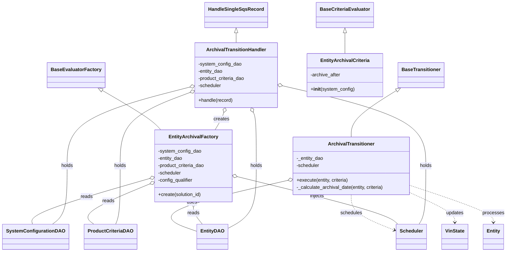
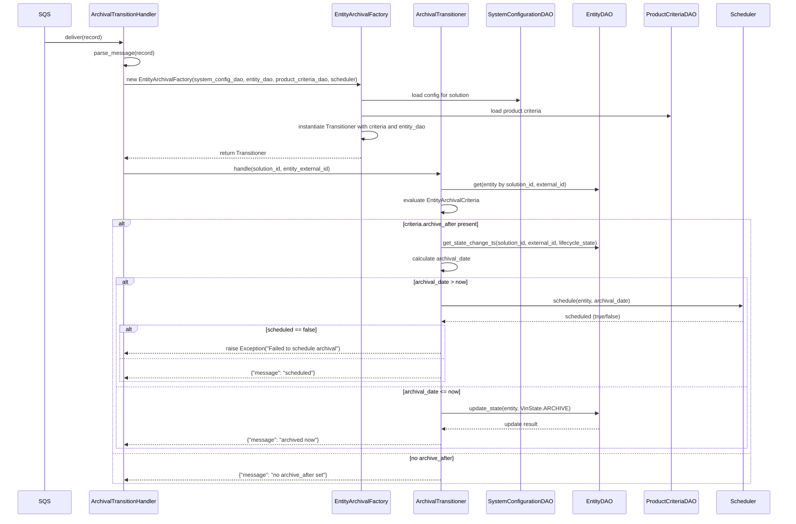

# Diagram: entity_core/entity_service/entity_service/entity/entity/entity_archival_engine.py

> Auto-generated by Obscura crawlers

## Diagram 1

### SVG

<svg id="container" width="1665.701171875" xmlns="http://www.w3.org/2000/svg" class="classDiagram" height="838" viewBox="0 0 1665.701171875 838" role="graphics-document document" aria-roledescription="class"><g><defs><marker id="container_class-aggregationStart" class="marker aggregation class" refX="18" refY="7" markerWidth="190" markerHeight="240" orient="auto"><path d="M 18,7 L9,13 L1,7 L9,1 Z"></path></marker></defs><defs><marker id="container_class-aggregationEnd" class="marker aggregation class" refX="1" refY="7" markerWidth="20" markerHeight="28" orient="auto"><path d="M 18,7 L9,13 L1,7 L9,1 Z"></path></marker></defs><defs><marker id="container_class-extensionStart" class="marker extension class" refX="18" refY="7" markerWidth="190" markerHeight="240" orient="auto"><path d="M 1,7 L18,13 V 1 Z"></path></marker></defs><defs><marker id="container_class-extensionEnd" class="marker extension class" refX="1" refY="7" markerWidth="20" markerHeight="28" orient="auto"><path d="M 1,1 V 13 L18,7 Z"></path></marker></defs><defs><marker id="container_class-compositionStart" class="marker composition class" refX="18" refY="7" markerWidth="190" markerHeight="240" orient="auto"><path d="M 18,7 L9,13 L1,7 L9,1 Z"></path></marker></defs><defs><marker id="container_class-compositionEnd" class="marker composition class" refX="1" refY="7" markerWidth="20" markerHeight="28" orient="auto"><path d="M 18,7 L9,13 L1,7 L9,1 Z"></path></marker></defs><defs><marker id="container_class-dependencyStart" class="marker dependency class" refX="6" refY="7" markerWidth="190" markerHeight="240" orient="auto"><path d="M 5,7 L9,13 L1,7 L9,1 Z"></path></marker></defs><defs><marker id="container_class-dependencyEnd" class="marker dependency class" refX="13" refY="7" markerWidth="20" markerHeight="28" orient="auto"><path d="M 18,7 L9,13 L14,7 L9,1 Z"></path></marker></defs><defs><marker id="container_class-lollipopStart" class="marker lollipop class" refX="13" refY="7" markerWidth="190" markerHeight="240" orient="auto"><circle stroke="black" fill="transparent" cx="7" cy="7" r="6"></circle></marker></defs><defs><marker id="container_class-lollipopEnd" class="marker lollipop class" refX="1" refY="7" markerWidth="190" markerHeight="240" orient="auto"><circle stroke="black" fill="transparent" cx="7" cy="7" r="6"></circle></marker></defs><g class="root"><g class="clusters"></g><g class="edgePaths"><path d="M1114.051,109.25L1114.051,110.542C1114.051,111.833,1114.051,114.417,1114.051,125.875C1114.051,137.333,1114.051,157.667,1114.051,167.833L1114.051,178" id="id_BaseCriteriaEvaluator_EntityArchivalCriteria_1" class="edge-thickness-normal edge-pattern-solid relation" style=";;;" data-edge="true" data-et="edge" data-id="id_BaseCriteriaEvaluator_EntityArchivalCriteria_1" data-points="W3sieCI6MTExNC4wNTA3ODEyNSwieSI6OTJ9LHsieCI6MTExNC4wNTA3ODEyNSwieSI6MTE3fSx7IngiOjExMTQuMDUwNzgxMjUsInkiOjE3OH1d" marker-start="url(#container_class-extensionStart)"></path><path d="M1285.423,301.738L1262.697,317.282C1239.97,332.825,1194.517,363.913,1171.791,389.623C1149.064,415.333,1149.064,435.667,1149.064,445.833L1149.064,456" id="id_BaseTransitioner_ArchivalTransitioner_2" class="edge-thickness-normal edge-pattern-solid relation" style=";;;" data-edge="true" data-et="edge" data-id="id_BaseTransitioner_ArchivalTransitioner_2" data-points="W3sieCI6MTI5OS42NjE3MTg3NSwieSI6MjkyfSx7IngiOjExNDkuMDY0NDUzMTI1LCJ5IjozOTV9LHsieCI6MTE0OS4wNjQ0NTMxMjUsInkiOjQ1Nn1d" marker-start="url(#container_class-extensionStart)"></path><path d="M322.781,300.997L348.41,316.664C374.04,332.331,425.299,363.666,456.417,385.499C487.535,407.333,498.51,419.667,503.998,425.833L509.486,432" id="id_BaseEvaluatorFactory_EntityArchivalFactory_3" class="edge-thickness-normal edge-pattern-solid relation" style=";;;" data-edge="true" data-et="edge" data-id="id_BaseEvaluatorFactory_EntityArchivalFactory_3" data-points="W3sieCI6MzA4LjA2MjU4MDgxODk2NTUsInkiOjI5Mn0seyJ4Ijo0NzYuNTU4NTkzNzUsInkiOjM5NX0seyJ4Ijo1MDkuNDg2NDAyNzY2NzE5NywieSI6NDMyfV0=" marker-start="url(#container_class-extensionStart)"></path><path d="M756,109.25L756,110.542C756,111.833,756,114.417,756,119.875C756,125.333,756,133.667,756,137.833L756,142" id="id_HandleSingleSqsRecord_ArchivalTransitionHandler_4" class="edge-thickness-normal edge-pattern-solid relation" style=";;;" data-edge="true" data-et="edge" data-id="id_HandleSingleSqsRecord_ArchivalTransitionHandler_4" data-points="W3sieCI6NzU2LCJ5Ijo5Mn0seyJ4Ijo3NTYsInkiOjExN30seyJ4Ijo3NTYsInkiOjE0Mn1d" marker-start="url(#container_class-extensionStart)"></path><path d="M936.085,600.285L856.163,618.404C776.242,636.523,616.398,672.762,565.716,701.192C515.034,729.623,573.513,750.246,602.753,760.557L631.992,770.869" id="id_ArchivalTransitioner_EntityDAO_5" class="edge-thickness-normal edge-pattern-solid relation" style=";;;" data-edge="true" data-et="edge" data-id="id_ArchivalTransitioner_EntityDAO_5" data-points="W3sieCI6OTUyLjkwODIwMzEyNSwieSI6NTk2LjQ3MDg5ODE0Mjc5NDd9LHsieCI6NDU2LjU1NDY4NzUsInkiOjcwOX0seyJ4Ijo2MzEuOTkyMTg3NSwieSI6NzcwLjg2ODczMTI1NDc5NTN9XQ==" marker-start="url(#container_class-aggregationStart)"></path><path d="M1149.064,648L1149.064,658.167C1149.064,668.333,1149.064,688.667,1174.215,708.512C1199.366,728.358,1249.667,747.715,1274.818,757.394L1299.969,767.073" id="id_ArchivalTransitioner_Scheduler_6" class="edge-thickness-normal edge-pattern-dashed relation" style=";;;" data-edge="true" data-et="edge" data-id="id_ArchivalTransitioner_Scheduler_6" data-points="W3sieCI6MTE0OS4wNjQ0NTMxMjUsInkiOjY0OH0seyJ4IjoxMTQ5LjA2NDQ1MzEyNSwieSI6NzA5fSx7IngiOjEzMDUuNTY4MzU5Mzc1LCJ5Ijo3NjkuMjI3NDg0NjM0NTU5M31d" marker-end="url(#container_class-dependencyEnd)"></path><path d="M1345.221,640.798L1370.331,652.165C1395.441,663.532,1445.661,686.266,1470.771,702.8C1495.881,719.333,1495.881,729.667,1495.881,734.833L1495.881,740" id="id_ArchivalTransitioner_VinState_7" class="edge-thickness-normal edge-pattern-dashed relation" style=";;;" data-edge="true" data-et="edge" data-id="id_ArchivalTransitioner_VinState_7" data-points="W3sieCI6MTM0NS4yMjA3MDMxMjUsInkiOjY0MC43OTc3OTI0MTk4OTA3fSx7IngiOjE0OTUuODgwODU5Mzc1LCJ5Ijo3MDl9LHsieCI6MTQ5NS44ODA4NTkzNzUsInkiOjc0Nn1d" marker-end="url(#container_class-dependencyEnd)"></path><path d="M1345.221,617.13L1391.336,632.442C1437.451,647.753,1529.682,678.377,1575.797,698.855C1621.912,719.333,1621.912,729.667,1621.912,734.833L1621.912,740" id="id_ArchivalTransitioner_Entity_8" class="edge-thickness-normal edge-pattern-dashed relation" style=";;;" data-edge="true" data-et="edge" data-id="id_ArchivalTransitioner_Entity_8" data-points="W3sieCI6MTM0NS4yMjA3MDMxMjUsInkiOjYxNy4xMjk5MjI1OTMzM30seyJ4IjoxNjIxLjkxMjEwOTM3NSwieSI6NzA5fSx7IngiOjE2MjEuOTEyMTA5Mzc1LCJ5Ijo3NDZ9XQ==" marker-end="url(#container_class-dependencyEnd)"></path><path d="M469.858,595.782L406.751,614.651C343.643,633.521,217.429,671.261,155.883,696.297C94.338,721.333,97.461,733.667,99.022,739.833L100.584,746" id="id_EntityArchivalFactory_SystemConfigurationDAO_9" class="edge-thickness-normal edge-pattern-solid relation" style=";;;" data-edge="true" data-et="edge" data-id="id_EntityArchivalFactory_SystemConfigurationDAO_9" data-points="W3sieCI6NDg2LjM4NDc2NTYyNSwieSI6NTkwLjgzOTg4MjAwODUzMzJ9LHsieCI6OTEuMjE0ODQzNzUsInkiOjcwOX0seyJ4IjoxMDAuNTgzNzYxODY3MDg4NjEsInkiOjc0Nn1d" marker-start="url(#container_class-aggregationStart)"></path><path d="M470.526,614.366L433.665,630.138C396.804,645.911,323.081,677.455,293.881,699.394C264.68,721.333,280,733.667,287.66,739.833L295.32,746" id="id_EntityArchivalFactory_ProductCriteriaDAO_10" class="edge-thickness-normal edge-pattern-solid relation" style=";;;" data-edge="true" data-et="edge" data-id="id_EntityArchivalFactory_ProductCriteriaDAO_10" data-points="W3sieCI6NDg2LjM4NDc2NTYyNSwieSI6NjA3LjU4MDA4NzYxNzA0MDF9LHsieCI6MjQ5LjM1OTM3NSwieSI6NzA5fSx7IngiOjI5NS4zMjAzMTI1LCJ5Ijo3NDZ9XQ==" marker-start="url(#container_class-aggregationStart)"></path><path d="M616.279,689.25L616.279,692.542C616.279,695.833,616.279,702.417,621.298,711.875C626.316,721.333,636.353,733.667,641.372,739.833L646.39,746" id="id_EntityArchivalFactory_EntityDAO_11" class="edge-thickness-normal edge-pattern-solid relation" style=";;;" data-edge="true" data-et="edge" data-id="id_EntityArchivalFactory_EntityDAO_11" data-points="W3sieCI6NjE2LjI3OTI5Njg3NSwieSI6NjcyfSx7IngiOjYxNi4yNzkyOTY4NzUsInkiOjcwOX0seyJ4Ijo2NDYuMzkwMjc4ODc2NTgyMywieSI6NzQ2fV0=" marker-start="url(#container_class-aggregationStart)"></path><path d="M762.945,587.283L847.271,607.569C931.597,627.855,1100.249,668.428,1191.245,694.881C1282.241,721.333,1295.581,733.667,1302.251,739.833L1308.921,746" id="id_EntityArchivalFactory_Scheduler_12" class="edge-thickness-normal edge-pattern-solid relation" style=";;;" data-edge="true" data-et="edge" data-id="id_EntityArchivalFactory_Scheduler_12" data-points="W3sieCI6NzQ2LjE3MzgyODEyNSwieSI6NTgzLjI0ODUxNzA5NzUyMTV9LHsieCI6MTI2OC45MDAzOTA2MjUsInkiOjcwOX0seyJ4IjoxMzA4LjkyMDkxMDc5OTA1MDcsInkiOjc0Nn1d" marker-start="url(#container_class-aggregationStart)"></path><path d="M725.713,374.763L724.895,378.136C724.076,381.509,722.438,388.254,717.514,397.794C712.59,407.333,704.379,419.667,700.274,425.833L696.168,432" id="id_ArchivalTransitionHandler_EntityArchivalFactory_13" class="edge-thickness-normal edge-pattern-solid relation" style=";;;" data-edge="true" data-et="edge" data-id="id_ArchivalTransitionHandler_EntityArchivalFactory_13" data-points="W3sieCI6NzI5Ljc4MjY1MDg2MjA2OSwieSI6MzU4fSx7IngiOjcyMC44MDA3ODEyNSwieSI6Mzk1fSx7IngiOjY5Ni4xNjgzMjk1MTgzMTIxLCJ5Ijo0MzJ9XQ==" marker-start="url(#container_class-aggregationStart)"></path><path d="M911.708,285.036L993.158,303.364C1074.608,321.691,1237.508,358.345,1318.958,402.839C1400.408,447.333,1400.408,499.667,1400.408,552C1400.408,604.333,1400.408,656.667,1396.813,689C1393.218,721.333,1386.027,733.667,1382.432,739.833L1378.836,746" id="id_ArchivalTransitionHandler_Scheduler_14" class="edge-thickness-normal edge-pattern-solid relation" style=";;;" data-edge="true" data-et="edge" data-id="id_ArchivalTransitionHandler_Scheduler_14" data-points="W3sieCI6ODk0Ljg3ODkwNjI1LCJ5IjoyODEuMjQ5NTExMjcwMzMzNH0seyJ4IjoxNDAwLjQwODIwMzEyNSwieSI6Mzk1fSx7IngiOjE0MDAuNDA4MjAzMTI1LCJ5Ijo1NTJ9LHsieCI6MTQwMC40MDgyMDMxMjUsInkiOjcwOX0seyJ4IjoxMzc4LjgzNjQ1NjY4NTEyNjcsInkiOjc0Nn1d" marker-start="url(#container_class-aggregationStart)"></path><path d="M824.272,373.085L826.298,376.737C828.324,380.39,832.376,387.695,834.402,417.514C836.428,447.333,836.428,499.667,836.428,552C836.428,604.333,836.428,656.667,818.548,691.896C800.668,727.126,764.908,745.251,747.028,754.314L729.148,763.377" id="id_ArchivalTransitionHandler_EntityDAO_15" class="edge-thickness-normal edge-pattern-solid relation" style=";;;" data-edge="true" data-et="edge" data-id="id_ArchivalTransitionHandler_EntityDAO_15" data-points="W3sieCI6ODE1LjkwNDc5NTI1ODYyMDcsInkiOjM1OH0seyJ4Ijo4MzYuNDI3NzM0Mzc1LCJ5IjozOTV9LHsieCI6ODM2LjQyNzczNDM3NSwieSI6NTUyfSx7IngiOjgzNi40Mjc3MzQzNzUsInkiOjcwOX0seyJ4Ijo3MjkuMTQ4NDM3NSwieSI6NzYzLjM3NzAzNDc5OTkzNDh9XQ==" marker-start="url(#container_class-aggregationStart)"></path><path d="M600.448,291.261L535.265,308.551C470.082,325.84,339.717,360.42,274.534,403.877C209.352,447.333,209.352,499.667,209.352,552C209.352,604.333,209.352,656.667,201.691,689C194.031,721.333,178.711,733.667,171.051,739.833L163.391,746" id="id_ArchivalTransitionHandler_SystemConfigurationDAO_16" class="edge-thickness-normal edge-pattern-solid relation" style=";;;" data-edge="true" data-et="edge" data-id="id_ArchivalTransitionHandler_SystemConfigurationDAO_16" data-points="W3sieCI6NjE3LjEyMTA5Mzc1LCJ5IjoyODYuODM4MDExNDYxODkxMzd9LHsieCI6MjA5LjM1MTU2MjUsInkiOjM5NX0seyJ4IjoyMDkuMzUxNTYyNSwieSI6NTUyfSx7IngiOjIwOS4zNTE1NjI1LCJ5Ijo3MDl9LHsieCI6MTYzLjM5MDYyNSwieSI6NzQ2fV0=" marker-start="url(#container_class-aggregationStart)"></path><path d="M600.994,308.84L563.165,323.2C525.335,337.56,449.676,366.28,411.847,406.807C374.018,447.333,374.018,499.667,374.018,552C374.018,604.333,374.018,656.667,371.947,689C369.876,721.333,365.735,733.667,363.665,739.833L361.594,746" id="id_ArchivalTransitionHandler_ProductCriteriaDAO_17" class="edge-thickness-normal edge-pattern-solid relation" style=";;;" data-edge="true" data-et="edge" data-id="id_ArchivalTransitionHandler_ProductCriteriaDAO_17" data-points="W3sieCI6NjE3LjEyMTA5Mzc1LCJ5IjozMDIuNzE4MjQxMDgzOTgzMX0seyJ4IjozNzQuMDE3NTc4MTI1LCJ5IjozOTV9LHsieCI6Mzc0LjAxNzU3ODEyNSwieSI6NTUyfSx7IngiOjM3NC4wMTc1NzgxMjUsInkiOjcwOX0seyJ4IjozNjEuNTk0MjkzOTA4MjI3OCwieSI6NzQ2fV0=" marker-start="url(#container_class-aggregationStart)"></path></g><g class="edgeLabels"><g class="edgeLabel"><g class="label" data-id="id_BaseCriteriaEvaluator_EntityArchivalCriteria_1" transform="translate(0, 0)"><foreignObject width="0" height="0">

</foreignObject></g></g><g class="edgeLabel"><g class="label" data-id="id_BaseTransitioner_ArchivalTransitioner_2" transform="translate(0, 0)"><foreignObject width="0" height="0">

</foreignObject></g></g><g class="edgeLabel"><g class="label" data-id="id_BaseEvaluatorFactory_EntityArchivalFactory_3" transform="translate(0, 0)"><foreignObject width="0" height="0">

</foreignObject></g></g><g class="edgeLabel"><g class="label" data-id="id_HandleSingleSqsRecord_ArchivalTransitionHandler_4" transform="translate(0, 0)"><foreignObject width="0" height="0">

</foreignObject></g></g><g class="edgeLabel" transform="translate(614.01992, 673.3008)"><g class="label" data-id="id_ArchivalTransitioner_EntityDAO_5" transform="translate(-16.4921875, -12)"><foreignObject width="32.984375" height="24">

uses

</foreignObject></g></g><g class="edgeLabel" transform="translate(1149.064453125, 709)"><g class="label" data-id="id_ArchivalTransitioner_Scheduler_6" transform="translate(-36.453125, -12)"><foreignObject width="72.90625" height="24">

schedules

</foreignObject></g></g><g class="edgeLabel" transform="translate(1495.880859375, 709)"><g class="label" data-id="id_ArchivalTransitioner_VinState_7" transform="translate(-29.4140625, -12)"><foreignObject width="58.828125" height="24">

updates

</foreignObject></g></g><g class="edgeLabel" transform="translate(1621.912109375, 709)"><g class="label" data-id="id_ArchivalTransitioner_Entity_8" transform="translate(-35.7890625, -12)"><foreignObject width="71.578125" height="24">

processes

</foreignObject></g></g><g class="edgeLabel" transform="translate(270.5158, 655.38706)"><g class="label" data-id="id_EntityArchivalFactory_SystemConfigurationDAO_9" transform="translate(-20.0078125, -12)"><foreignObject width="40.015625" height="24">

reads

</foreignObject></g></g><g class="edgeLabel" transform="translate(340.74898, 669.89564)"><g class="label" data-id="id_EntityArchivalFactory_ProductCriteriaDAO_10" transform="translate(-20.0078125, -12)"><foreignObject width="40.015625" height="24">

reads

</foreignObject></g></g><g class="edgeLabel" transform="translate(616.279296875, 709)"><g class="label" data-id="id_EntityArchivalFactory_EntityDAO_11" transform="translate(-20.0078125, -12)"><foreignObject width="40.015625" height="24">

reads

</foreignObject></g></g><g class="edgeLabel" transform="translate(1034.03299, 652.49833)"><g class="label" data-id="id_EntityArchivalFactory_Scheduler_12" transform="translate(-23.9921875, -12)"><foreignObject width="47.984375" height="24">

injects

</foreignObject></g></g><g class="edgeLabel" transform="translate(719.0344, 397.65326)"><g class="label" data-id="id_ArchivalTransitionHandler_EntityArchivalFactory_13" transform="translate(-26.171875, -12)"><foreignObject width="52.34375" height="24">

creates

</foreignObject></g></g><g class="edgeLabel" transform="translate(1400.408203125, 552)"><g class="label" data-id="id_ArchivalTransitionHandler_Scheduler_14" transform="translate(-20.1875, -12)"><foreignObject width="40.375" height="24">

holds

</foreignObject></g></g><g class="edgeLabel" transform="translate(836.427734375, 552)"><g class="label" data-id="id_ArchivalTransitionHandler_EntityDAO_15" transform="translate(-20.1875, -12)"><foreignObject width="40.375" height="24">

holds

</foreignObject></g></g><g class="edgeLabel" transform="translate(209.3515625, 552)"><g class="label" data-id="id_ArchivalTransitionHandler_SystemConfigurationDAO_16" transform="translate(-20.1875, -12)"><foreignObject width="40.375" height="24">

holds

</foreignObject></g></g><g class="edgeLabel" transform="translate(374.017578125, 552)"><g class="label" data-id="id_ArchivalTransitionHandler_ProductCriteriaDAO_17" transform="translate(-20.1875, -12)"><foreignObject width="40.375" height="24">

holds

</foreignObject></g></g></g><g class="nodes"><g class="node default" id="classId-BaseCriteriaEvaluator-0" transform="translate(1114.05078125, 50)"><g class="basic label-container"><path d="M-91.140625 -42 L91.140625 -42 L91.140625 42 L-91.140625 42" stroke="none" stroke-width="0" fill="#ECECFF" style=""></path><path d="M-91.140625 -42 C-26.49666022758143 -42, 38.14730454483714 -42, 91.140625 -42 M-91.140625 -42 C-23.54427091841525 -42, 44.0520831631695 -42, 91.140625 -42 M91.140625 -42 C91.140625 -22.90696464587997, 91.140625 -3.8139292917599406, 91.140625 42 M91.140625 -42 C91.140625 -21.035344791944457, 91.140625 -0.07068958388891389, 91.140625 42 M91.140625 42 C43.96320453113879 42, -3.2142159377224147 42, -91.140625 42 M91.140625 42 C38.343862179106004 42, -14.452900641787991 42, -91.140625 42 M-91.140625 42 C-91.140625 19.0921918618425, -91.140625 -3.815616276314998, -91.140625 -42 M-91.140625 42 C-91.140625 15.599340014265138, -91.140625 -10.801319971469724, -91.140625 -42" stroke="#9370DB" stroke-width="1.3" fill="none" stroke-dasharray="0 0" style=""></path></g><g class="annotation-group text" transform="translate(0, -18)"></g><g class="label-group text" transform="translate(-79.140625, -18)"><g class="label" style="font-weight: bolder" transform="translate(0,-12)"><foreignObject width="158.28125" height="24">

BaseCriteriaEvaluator

</foreignObject></g></g><g class="members-group text" transform="translate(-79.140625, 30)"></g><g class="methods-group text" transform="translate(-79.140625, 60)"></g><g class="divider" style=""><path d="M-91.140625 6 C-18.8328052874558 6, 53.4750144250884 6, 91.140625 6 M-91.140625 6 C-47.83392754271634 6, -4.527230085432677 6, 91.140625 6" stroke="#9370DB" stroke-width="1.3" fill="none" stroke-dasharray="0 0" style=""></path></g><g class="divider" style=""><path d="M-91.140625 24 C-53.45251752070593 24, -15.764410041411864 24, 91.140625 24 M-91.140625 24 C-20.175780186899445 24, 50.78906462620111 24, 91.140625 24" stroke="#9370DB" stroke-width="1.3" fill="none" stroke-dasharray="0 0" style=""></path></g></g><g class="node default" id="classId-BaseTransitioner-1" transform="translate(1361.0703125, 250)"><g class="basic label-container"><path d="M-73.90625 -42 L73.90625 -42 L73.90625 42 L-73.90625 42" stroke="none" stroke-width="0" fill="#ECECFF" style=""></path><path d="M-73.90625 -42 C-44.26731882032546 -42, -14.628387640650914 -42, 73.90625 -42 M-73.90625 -42 C-22.29914464799287 -42, 29.307960704014263 -42, 73.90625 -42 M73.90625 -42 C73.90625 -13.30081742105694, 73.90625 15.398365157886118, 73.90625 42 M73.90625 -42 C73.90625 -8.477024411732323, 73.90625 25.045951176535354, 73.90625 42 M73.90625 42 C26.611578799376865 42, -20.68309240124627 42, -73.90625 42 M73.90625 42 C20.144080391582776 42, -33.61808921683445 42, -73.90625 42 M-73.90625 42 C-73.90625 8.588946735151062, -73.90625 -24.822106529697876, -73.90625 -42 M-73.90625 42 C-73.90625 11.959691188059786, -73.90625 -18.08061762388043, -73.90625 -42" stroke="#9370DB" stroke-width="1.3" fill="none" stroke-dasharray="0 0" style=""></path></g><g class="annotation-group text" transform="translate(0, -18)"></g><g class="label-group text" transform="translate(-61.90625, -18)"><g class="label" style="font-weight: bolder" transform="translate(0,-12)"><foreignObject width="123.8125" height="24">

BaseTransitioner

</foreignObject></g></g><g class="members-group text" transform="translate(-61.90625, 30)"></g><g class="methods-group text" transform="translate(-61.90625, 60)"></g><g class="divider" style=""><path d="M-73.90625 6 C-21.33568047510137 6, 31.23488904979726 6, 73.90625 6 M-73.90625 6 C-22.290012991436008 6, 29.326224017127984 6, 73.90625 6" stroke="#9370DB" stroke-width="1.3" fill="none" stroke-dasharray="0 0" style=""></path></g><g class="divider" style=""><path d="M-73.90625 24 C-22.86021979825084 24, 28.185810403498323 24, 73.90625 24 M-73.90625 24 C-22.99738366861476 24, 27.91148266277048 24, 73.90625 24" stroke="#9370DB" stroke-width="1.3" fill="none" stroke-dasharray="0 0" style=""></path></g></g><g class="node default" id="classId-BaseEvaluatorFactory-2" transform="translate(239.35546875, 250)"><g class="basic label-container"><path d="M-90.5625 -42 L90.5625 -42 L90.5625 42 L-90.5625 42" stroke="none" stroke-width="0" fill="#ECECFF" style=""></path><path d="M-90.5625 -42 C-49.82479984870726 -42, -9.087099697414516 -42, 90.5625 -42 M-90.5625 -42 C-44.55446714785023 -42, 1.4535657042995354 -42, 90.5625 -42 M90.5625 -42 C90.5625 -15.625979361798745, 90.5625 10.74804127640251, 90.5625 42 M90.5625 -42 C90.5625 -16.016477572343437, 90.5625 9.967044855313127, 90.5625 42 M90.5625 42 C30.024192044953907 42, -30.514115910092187 42, -90.5625 42 M90.5625 42 C35.33984110688312 42, -19.88281778623376 42, -90.5625 42 M-90.5625 42 C-90.5625 22.39550193522452, -90.5625 2.791003870449039, -90.5625 -42 M-90.5625 42 C-90.5625 22.468347009878254, -90.5625 2.9366940197565086, -90.5625 -42" stroke="#9370DB" stroke-width="1.3" fill="none" stroke-dasharray="0 0" style=""></path></g><g class="annotation-group text" transform="translate(0, -18)"></g><g class="label-group text" transform="translate(-78.5625, -18)"><g class="label" style="font-weight: bolder" transform="translate(0,-12)"><foreignObject width="157.125" height="24">

BaseEvaluatorFactory

</foreignObject></g></g><g class="members-group text" transform="translate(-78.5625, 30)"></g><g class="methods-group text" transform="translate(-78.5625, 60)"></g><g class="divider" style=""><path d="M-90.5625 6 C-44.64055115854023 6, 1.2813976829195468 6, 90.5625 6 M-90.5625 6 C-26.87255088072139 6, 36.81739823855722 6, 90.5625 6" stroke="#9370DB" stroke-width="1.3" fill="none" stroke-dasharray="0 0" style=""></path></g><g class="divider" style=""><path d="M-90.5625 24 C-44.366332137339185 24, 1.8298357253216295 24, 90.5625 24 M-90.5625 24 C-30.687329421146032 24, 29.187841157707936 24, 90.5625 24" stroke="#9370DB" stroke-width="1.3" fill="none" stroke-dasharray="0 0" style=""></path></g></g><g class="node default" id="classId-HandleSingleSqsRecord-3" transform="translate(756, 50)"><g class="basic label-container"><path d="M-99.078125 -42 L99.078125 -42 L99.078125 42 L-99.078125 42" stroke="none" stroke-width="0" fill="#ECECFF" style=""></path><path d="M-99.078125 -42 C-30.57282667864017 -42, 37.93247164271966 -42, 99.078125 -42 M-99.078125 -42 C-50.58155218665233 -42, -2.0849793733046624 -42, 99.078125 -42 M99.078125 -42 C99.078125 -16.119301396853917, 99.078125 9.761397206292166, 99.078125 42 M99.078125 -42 C99.078125 -11.589145718835677, 99.078125 18.821708562328645, 99.078125 42 M99.078125 42 C31.851366604521132 42, -35.375391790957735 42, -99.078125 42 M99.078125 42 C35.393549833078666 42, -28.29102533384267 42, -99.078125 42 M-99.078125 42 C-99.078125 17.342859017793963, -99.078125 -7.314281964412075, -99.078125 -42 M-99.078125 42 C-99.078125 8.96209521620635, -99.078125 -24.0758095675873, -99.078125 -42" stroke="#9370DB" stroke-width="1.3" fill="none" stroke-dasharray="0 0" style=""></path></g><g class="annotation-group text" transform="translate(0, -18)"></g><g class="label-group text" transform="translate(-87.078125, -18)"><g class="label" style="font-weight: bolder" transform="translate(0,-12)"><foreignObject width="174.15625" height="24">

HandleSingleSqsRecord

</foreignObject></g></g><g class="members-group text" transform="translate(-87.078125, 30)"></g><g class="methods-group text" transform="translate(-87.078125, 60)"></g><g class="divider" style=""><path d="M-99.078125 6 C-27.58623409591827 6, 43.90565680816346 6, 99.078125 6 M-99.078125 6 C-54.17743834163823 6, -9.276751683276458 6, 99.078125 6" stroke="#9370DB" stroke-width="1.3" fill="none" stroke-dasharray="0 0" style=""></path></g><g class="divider" style=""><path d="M-99.078125 24 C-57.94563525167157 24, -16.813145503343137 24, 99.078125 24 M-99.078125 24 C-49.97876561961762 24, -0.8794062392352373 24, 99.078125 24" stroke="#9370DB" stroke-width="1.3" fill="none" stroke-dasharray="0 0" style=""></path></g></g><g class="node default" id="classId-EntityArchivalCriteria-4" transform="translate(1114.05078125, 250)"><g class="basic label-container"><path d="M-123.11328125 -72 L123.11328125 -72 L123.11328125 72 L-123.11328125 72" stroke="none" stroke-width="0" fill="#ECECFF" style=""></path><path d="M-123.11328125 -72 C-55.96890672163745 -72, 11.175467806725095 -72, 123.11328125 -72 M-123.11328125 -72 C-34.15691999826589 -72, 54.79944125346822 -72, 123.11328125 -72 M123.11328125 -72 C123.11328125 -38.27550947249442, 123.11328125 -4.55101894498884, 123.11328125 72 M123.11328125 -72 C123.11328125 -40.83584060292914, 123.11328125 -9.671681205858278, 123.11328125 72 M123.11328125 72 C46.769635901181715 72, -29.57400944763657 72, -123.11328125 72 M123.11328125 72 C54.24744408327963 72, -14.618393083440736 72, -123.11328125 72 M-123.11328125 72 C-123.11328125 26.457220093108724, -123.11328125 -19.085559813782552, -123.11328125 -72 M-123.11328125 72 C-123.11328125 34.58367484413179, -123.11328125 -2.8326503117364155, -123.11328125 -72" stroke="#9370DB" stroke-width="1.3" fill="none" stroke-dasharray="0 0" style=""></path></g><g class="annotation-group text" transform="translate(0, -48)"></g><g class="label-group text" transform="translate(-77.4609375, -48)"><g class="label" style="font-weight: bolder" transform="translate(0,-12)"><foreignObject width="154.921875" height="24">

EntityArchivalCriteria

</foreignObject></g></g><g class="members-group text" transform="translate(-111.11328125, 0)"><g class="label" style="" transform="translate(0,-12)"><foreignObject width="100.859375" height="24">

-archive_after

</foreignObject></g></g><g class="methods-group text" transform="translate(-111.11328125, 48)"><g class="label" style="" transform="translate(0,-12)"><foreignObject width="144.765625" height="24">

+<strong>init</strong>(system_config)

</foreignObject></g></g><g class="divider" style=""><path d="M-123.11328125 -24 C-45.64946196030358 -24, 31.814357329392834 -24, 123.11328125 -24 M-123.11328125 -24 C-53.323119649075764 -24, 16.467041951848472 -24, 123.11328125 -24" stroke="#9370DB" stroke-width="1.3" fill="none" stroke-dasharray="0 0" style=""></path></g><g class="divider" style=""><path d="M-123.11328125 24 C-60.72783372132298 24, 1.6576138073540392 24, 123.11328125 24 M-123.11328125 24 C-29.414945208875693 24, 64.28339083224861 24, 123.11328125 24" stroke="#9370DB" stroke-width="1.3" fill="none" stroke-dasharray="0 0" style=""></path></g></g><g class="node default" id="classId-ArchivalTransitioner-5" transform="translate(1149.064453125, 552)"><g class="basic label-container"><path d="M-196.15625 -96 L196.15625 -96 L196.15625 96 L-196.15625 96" stroke="none" stroke-width="0" fill="#ECECFF" style=""></path><path d="M-196.15625 -96 C-53.65694769036341 -96, 88.84235461927318 -96, 196.15625 -96 M-196.15625 -96 C-109.34206797312551 -96, -22.52788594625102 -96, 196.15625 -96 M196.15625 -96 C196.15625 -32.25782539174684, 196.15625 31.484349216506317, 196.15625 96 M196.15625 -96 C196.15625 -55.03854613544129, 196.15625 -14.077092270882574, 196.15625 96 M196.15625 96 C98.42263006073574 96, 0.6890101214714832 96, -196.15625 96 M196.15625 96 C113.88613954570522 96, 31.61602909141044 96, -196.15625 96 M-196.15625 96 C-196.15625 43.988034597282336, -196.15625 -8.023930805435327, -196.15625 -96 M-196.15625 96 C-196.15625 23.19009190442918, -196.15625 -49.61981619114164, -196.15625 -96" stroke="#9370DB" stroke-width="1.3" fill="none" stroke-dasharray="0 0" style=""></path></g><g class="annotation-group text" transform="translate(0, -72)"></g><g class="label-group text" transform="translate(-73.390625, -72)"><g class="label" style="font-weight: bolder" transform="translate(0,-12)"><foreignObject width="146.78125" height="24">

ArchivalTransitioner

</foreignObject></g></g><g class="members-group text" transform="translate(-184.15625, -24)"><g class="label" style="" transform="translate(0,-12)"><foreignObject width="90.265625" height="24">

-_entity_dao

</foreignObject></g><g class="label" style="" transform="translate(0,12)"><foreignObject width="78.0625" height="24">

-scheduler

</foreignObject></g></g><g class="methods-group text" transform="translate(-184.15625, 48)"><g class="label" style="" transform="translate(0,-12)"><foreignObject width="175.703125" height="24">

+execute(entity, criteria)

</foreignObject></g><g class="label" style="" transform="translate(0,12)"><foreignObject width="294.921875" height="24">

-_calculate_archival_date(entity, criteria)

</foreignObject></g></g><g class="divider" style=""><path d="M-196.15625 -48 C-68.34871844955042 -48, 59.458813100899164 -48, 196.15625 -48 M-196.15625 -48 C-48.0024996041154 -48, 100.1512507917692 -48, 196.15625 -48" stroke="#9370DB" stroke-width="1.3" fill="none" stroke-dasharray="0 0" style=""></path></g><g class="divider" style=""><path d="M-196.15625 24 C-48.618964469413896 24, 98.91832106117221 24, 196.15625 24 M-196.15625 24 C-105.83262050132453 24, -15.508991002649054 24, 196.15625 24" stroke="#9370DB" stroke-width="1.3" fill="none" stroke-dasharray="0 0" style=""></path></g></g><g class="node default" id="classId-EntityArchivalFactory-6" transform="translate(616.279296875, 552)"><g class="basic label-container"><path d="M-129.89453125 -120 L129.89453125 -120 L129.89453125 120 L-129.89453125 120" stroke="none" stroke-width="0" fill="#ECECFF" style=""></path><path d="M-129.89453125 -120 C-74.2311344178867 -120, -18.567737585773386 -120, 129.89453125 -120 M-129.89453125 -120 C-48.137268544594264 -120, 33.61999416081147 -120, 129.89453125 -120 M129.89453125 -120 C129.89453125 -64.14021709332343, 129.89453125 -8.280434186646858, 129.89453125 120 M129.89453125 -120 C129.89453125 -52.939373507306655, 129.89453125 14.12125298538669, 129.89453125 120 M129.89453125 120 C47.28917220807388 120, -35.31618683385224 120, -129.89453125 120 M129.89453125 120 C38.53296237966482 120, -52.82860649067035 120, -129.89453125 120 M-129.89453125 120 C-129.89453125 52.84120118023836, -129.89453125 -14.317597639523285, -129.89453125 -120 M-129.89453125 120 C-129.89453125 70.96294595630073, -129.89453125 21.92589191260147, -129.89453125 -120" stroke="#9370DB" stroke-width="1.3" fill="none" stroke-dasharray="0 0" style=""></path></g><g class="annotation-group text" transform="translate(0, -96)"></g><g class="label-group text" transform="translate(-76.8828125, -96)"><g class="label" style="font-weight: bolder" transform="translate(0,-12)"><foreignObject width="153.765625" height="24">

EntityArchivalFactory

</foreignObject></g></g><g class="members-group text" transform="translate(-117.89453125, -48)"><g class="label" style="" transform="translate(0,-12)"><foreignObject width="144.109375" height="24">

-system_config_dao

</foreignObject></g><g class="label" style="" transform="translate(0,12)"><foreignObject width="83.546875" height="24">

-entity_dao

</foreignObject></g><g class="label" style="" transform="translate(0,36)"><foreignObject width="158.90625" height="24">

-product_criteria_dao

</foreignObject></g><g class="label" style="" transform="translate(0,60)"><foreignObject width="78.0625" height="24">

-scheduler

</foreignObject></g><g class="label" style="" transform="translate(0,84)"><foreignObject width="118.8125" height="24">

-config_qualifier

</foreignObject></g></g><g class="methods-group text" transform="translate(-117.89453125, 96)"><g class="label" style="" transform="translate(0,-12)"><foreignObject width="145.453125" height="24">

+create(solution_id)

</foreignObject></g></g><g class="divider" style=""><path d="M-129.89453125 -72 C-40.64322496464172 -72, 48.608081320716565 -72, 129.89453125 -72 M-129.89453125 -72 C-46.47157342323693 -72, 36.951384403526134 -72, 129.89453125 -72" stroke="#9370DB" stroke-width="1.3" fill="none" stroke-dasharray="0 0" style=""></path></g><g class="divider" style=""><path d="M-129.89453125 72 C-29.19330987562489 72, 71.50791149875022 72, 129.89453125 72 M-129.89453125 72 C-62.133488284231774 72, 5.627554681536452 72, 129.89453125 72" stroke="#9370DB" stroke-width="1.3" fill="none" stroke-dasharray="0 0" style=""></path></g></g><g class="node default" id="classId-ArchivalTransitionHandler-7" transform="translate(756, 250)"><g class="basic label-container"><path d="M-138.87890625 -108 L138.87890625 -108 L138.87890625 108 L-138.87890625 108" stroke="none" stroke-width="0" fill="#ECECFF" style=""></path><path d="M-138.87890625 -108 C-81.50359569061261 -108, -24.128285131225226 -108, 138.87890625 -108 M-138.87890625 -108 C-81.82693757990663 -108, -24.774968909813254 -108, 138.87890625 -108 M138.87890625 -108 C138.87890625 -37.72591011002697, 138.87890625 32.548179779946054, 138.87890625 108 M138.87890625 -108 C138.87890625 -57.46298741562188, 138.87890625 -6.925974831243764, 138.87890625 108 M138.87890625 108 C38.320669774908524 108, -62.23756670018295 108, -138.87890625 108 M138.87890625 108 C72.69118115709038 108, 6.503456064180767 108, -138.87890625 108 M-138.87890625 108 C-138.87890625 43.694185859416976, -138.87890625 -20.61162828116605, -138.87890625 -108 M-138.87890625 108 C-138.87890625 40.777374117623665, -138.87890625 -26.44525176475267, -138.87890625 -108" stroke="#9370DB" stroke-width="1.3" fill="none" stroke-dasharray="0 0" style=""></path></g><g class="annotation-group text" transform="translate(0, -84)"></g><g class="label-group text" transform="translate(-94.8515625, -84)"><g class="label" style="font-weight: bolder" transform="translate(0,-12)"><foreignObject width="189.703125" height="24">

ArchivalTransitionHandler

</foreignObject></g></g><g class="members-group text" transform="translate(-126.87890625, -36)"><g class="label" style="" transform="translate(0,-12)"><foreignObject width="144.109375" height="24">

-system_config_dao

</foreignObject></g><g class="label" style="" transform="translate(0,12)"><foreignObject width="83.546875" height="24">

-entity_dao

</foreignObject></g><g class="label" style="" transform="translate(0,36)"><foreignObject width="158.90625" height="24">

-product_criteria_dao

</foreignObject></g><g class="label" style="" transform="translate(0,60)"><foreignObject width="78.0625" height="24">

-scheduler

</foreignObject></g></g><g class="methods-group text" transform="translate(-126.87890625, 84)"><g class="label" style="" transform="translate(0,-12)"><foreignObject width="115.0625" height="24">

+handle(record)

</foreignObject></g></g><g class="divider" style=""><path d="M-138.87890625 -60 C-50.99379019957664 -60, 36.89132585084673 -60, 138.87890625 -60 M-138.87890625 -60 C-48.98987071968209 -60, 40.899164810635824 -60, 138.87890625 -60" stroke="#9370DB" stroke-width="1.3" fill="none" stroke-dasharray="0 0" style=""></path></g><g class="divider" style=""><path d="M-138.87890625 60 C-72.07224047962279 60, -5.265574709245584 60, 138.87890625 60 M-138.87890625 60 C-75.95024526235059 60, -13.02158427470117 60, 138.87890625 60" stroke="#9370DB" stroke-width="1.3" fill="none" stroke-dasharray="0 0" style=""></path></g></g><g class="node default" id="classId-Entity-8" transform="translate(1621.912109375, 788)"><g class="basic label-container"><path d="M-33.28125 -42 L33.28125 -42 L33.28125 42 L-33.28125 42" stroke="none" stroke-width="0" fill="#ECECFF" style=""></path><path d="M-33.28125 -42 C-16.07623154089778 -42, 1.1287869182044403 -42, 33.28125 -42 M-33.28125 -42 C-17.38264118868672 -42, -1.4840323773734418 -42, 33.28125 -42 M33.28125 -42 C33.28125 -11.880318963107747, 33.28125 18.239362073784505, 33.28125 42 M33.28125 -42 C33.28125 -11.145250633099813, 33.28125 19.709498733800373, 33.28125 42 M33.28125 42 C16.656257742869037 42, 0.03126548573807497 42, -33.28125 42 M33.28125 42 C16.09620005495375 42, -1.0888498900924972 42, -33.28125 42 M-33.28125 42 C-33.28125 12.24791117535407, -33.28125 -17.50417764929186, -33.28125 -42 M-33.28125 42 C-33.28125 20.011327278460616, -33.28125 -1.977345443078768, -33.28125 -42" stroke="#9370DB" stroke-width="1.3" fill="none" stroke-dasharray="0 0" style=""></path></g><g class="annotation-group text" transform="translate(0, -18)"></g><g class="label-group text" transform="translate(-21.28125, -18)"><g class="label" style="font-weight: bolder" transform="translate(0,-12)"><foreignObject width="42.5625" height="24">

Entity

</foreignObject></g></g><g class="members-group text" transform="translate(-21.28125, 30)"></g><g class="methods-group text" transform="translate(-21.28125, 60)"></g><g class="divider" style=""><path d="M-33.28125 6 C-15.448163296130144 6, 2.384923407739713 6, 33.28125 6 M-33.28125 6 C-13.998916922416043 6, 5.283416155167913 6, 33.28125 6" stroke="#9370DB" stroke-width="1.3" fill="none" stroke-dasharray="0 0" style=""></path></g><g class="divider" style=""><path d="M-33.28125 24 C-14.648366241015008 24, 3.9845175179699837 24, 33.28125 24 M-33.28125 24 C-17.49113276027568 24, -1.7010155205513584 24, 33.28125 24" stroke="#9370DB" stroke-width="1.3" fill="none" stroke-dasharray="0 0" style=""></path></g></g><g class="node default" id="classId-EntityDAO-9" transform="translate(680.5703125, 788)"><g class="basic label-container"><path d="M-48.578125 -42 L48.578125 -42 L48.578125 42 L-48.578125 42" stroke="none" stroke-width="0" fill="#ECECFF" style=""></path><path d="M-48.578125 -42 C-20.573287571078808 -42, 7.431549857842384 -42, 48.578125 -42 M-48.578125 -42 C-18.156486506740695 -42, 12.26515198651861 -42, 48.578125 -42 M48.578125 -42 C48.578125 -20.751003151136022, 48.578125 0.49799369772795643, 48.578125 42 M48.578125 -42 C48.578125 -18.711783985937195, 48.578125 4.576432028125609, 48.578125 42 M48.578125 42 C23.62642834863366 42, -1.325268302732681 42, -48.578125 42 M48.578125 42 C11.704940618549195 42, -25.16824376290161 42, -48.578125 42 M-48.578125 42 C-48.578125 18.13665540843019, -48.578125 -5.726689183139619, -48.578125 -42 M-48.578125 42 C-48.578125 22.139230411919566, -48.578125 2.278460823839133, -48.578125 -42" stroke="#9370DB" stroke-width="1.3" fill="none" stroke-dasharray="0 0" style=""></path></g><g class="annotation-group text" transform="translate(0, -18)"></g><g class="label-group text" transform="translate(-36.578125, -18)"><g class="label" style="font-weight: bolder" transform="translate(0,-12)"><foreignObject width="73.15625" height="24">

EntityDAO

</foreignObject></g></g><g class="members-group text" transform="translate(-36.578125, 30)"></g><g class="methods-group text" transform="translate(-36.578125, 60)"></g><g class="divider" style=""><path d="M-48.578125 6 C-13.155299051310287 6, 22.267526897379426 6, 48.578125 6 M-48.578125 6 C-10.430568625961776 6, 27.71698774807645 6, 48.578125 6" stroke="#9370DB" stroke-width="1.3" fill="none" stroke-dasharray="0 0" style=""></path></g><g class="divider" style=""><path d="M-48.578125 24 C-17.126522636595894 24, 14.325079726808212 24, 48.578125 24 M-48.578125 24 C-10.856195202159817 24, 26.865734595680365 24, 48.578125 24" stroke="#9370DB" stroke-width="1.3" fill="none" stroke-dasharray="0 0" style=""></path></g></g><g class="node default" id="classId-ProductCriteriaDAO-10" transform="translate(347.4921875, 788)"><g class="basic label-container"><path d="M-83.0546875 -42 L83.0546875 -42 L83.0546875 42 L-83.0546875 42" stroke="none" stroke-width="0" fill="#ECECFF" style=""></path><path d="M-83.0546875 -42 C-36.01519999998359 -42, 11.024287500032827 -42, 83.0546875 -42 M-83.0546875 -42 C-34.12305456548628 -42, 14.808578369027444 -42, 83.0546875 -42 M83.0546875 -42 C83.0546875 -17.98245131574244, 83.0546875 6.0350973685151175, 83.0546875 42 M83.0546875 -42 C83.0546875 -16.311282519572273, 83.0546875 9.377434960855453, 83.0546875 42 M83.0546875 42 C30.564082123479153 42, -21.926523253041694 42, -83.0546875 42 M83.0546875 42 C17.66866675630051 42, -47.71735398739898 42, -83.0546875 42 M-83.0546875 42 C-83.0546875 10.396173527005999, -83.0546875 -21.207652945988002, -83.0546875 -42 M-83.0546875 42 C-83.0546875 21.95058644173199, -83.0546875 1.9011728834639783, -83.0546875 -42" stroke="#9370DB" stroke-width="1.3" fill="none" stroke-dasharray="0 0" style=""></path></g><g class="annotation-group text" transform="translate(0, -18)"></g><g class="label-group text" transform="translate(-71.0546875, -18)"><g class="label" style="font-weight: bolder" transform="translate(0,-12)"><foreignObject width="142.109375" height="24">

ProductCriteriaDAO

</foreignObject></g></g><g class="members-group text" transform="translate(-71.0546875, 30)"></g><g class="methods-group text" transform="translate(-71.0546875, 60)"></g><g class="divider" style=""><path d="M-83.0546875 6 C-27.881379308858882 6, 27.291928882282235 6, 83.0546875 6 M-83.0546875 6 C-34.260439977848755 6, 14.53380754430249 6, 83.0546875 6" stroke="#9370DB" stroke-width="1.3" fill="none" stroke-dasharray="0 0" style=""></path></g><g class="divider" style=""><path d="M-83.0546875 24 C-45.48112617724029 24, -7.907564854480583 24, 83.0546875 24 M-83.0546875 24 C-28.74760780638077 24, 25.55947188723846 24, 83.0546875 24" stroke="#9370DB" stroke-width="1.3" fill="none" stroke-dasharray="0 0" style=""></path></g></g><g class="node default" id="classId-SystemConfigurationDAO-11" transform="translate(111.21875, 788)"><g class="basic label-container"><path d="M-103.21875 -42 L103.21875 -42 L103.21875 42 L-103.21875 42" stroke="none" stroke-width="0" fill="#ECECFF" style=""></path><path d="M-103.21875 -42 C-30.21141239480356 -42, 42.79592521039288 -42, 103.21875 -42 M-103.21875 -42 C-32.28893154394626 -42, 38.640886912107476 -42, 103.21875 -42 M103.21875 -42 C103.21875 -10.011345390188456, 103.21875 21.977309219623088, 103.21875 42 M103.21875 -42 C103.21875 -15.421595902356383, 103.21875 11.156808195287233, 103.21875 42 M103.21875 42 C21.08784532802484 42, -61.04305934395032 42, -103.21875 42 M103.21875 42 C60.70708358992124 42, 18.19541717984248 42, -103.21875 42 M-103.21875 42 C-103.21875 12.310546024610744, -103.21875 -17.378907950778512, -103.21875 -42 M-103.21875 42 C-103.21875 19.34616485987012, -103.21875 -3.3076702802597566, -103.21875 -42" stroke="#9370DB" stroke-width="1.3" fill="none" stroke-dasharray="0 0" style=""></path></g><g class="annotation-group text" transform="translate(0, -18)"></g><g class="label-group text" transform="translate(-91.21875, -18)"><g class="label" style="font-weight: bolder" transform="translate(0,-12)"><foreignObject width="182.4375" height="24">

SystemConfigurationDAO

</foreignObject></g></g><g class="members-group text" transform="translate(-91.21875, 30)"></g><g class="methods-group text" transform="translate(-91.21875, 60)"></g><g class="divider" style=""><path d="M-103.21875 6 C-59.87966625703591 6, -16.540582514071815 6, 103.21875 6 M-103.21875 6 C-23.808359066065336 6, 55.60203186786933 6, 103.21875 6" stroke="#9370DB" stroke-width="1.3" fill="none" stroke-dasharray="0 0" style=""></path></g><g class="divider" style=""><path d="M-103.21875 24 C-27.21703300649932 24, 48.78468398700136 24, 103.21875 24 M-103.21875 24 C-36.669289430931286 24, 29.880171138137428 24, 103.21875 24" stroke="#9370DB" stroke-width="1.3" fill="none" stroke-dasharray="0 0" style=""></path></g></g><g class="node default" id="classId-Scheduler-12" transform="translate(1354.349609375, 788)"><g class="basic label-container"><path d="M-48.78125 -42 L48.78125 -42 L48.78125 42 L-48.78125 42" stroke="none" stroke-width="0" fill="#ECECFF" style=""></path><path d="M-48.78125 -42 C-24.283909408859913 -42, 0.21343118228017488 -42, 48.78125 -42 M-48.78125 -42 C-21.996759980466223 -42, 4.787730039067554 -42, 48.78125 -42 M48.78125 -42 C48.78125 -21.179466131451886, 48.78125 -0.358932262903771, 48.78125 42 M48.78125 -42 C48.78125 -10.730220267943086, 48.78125 20.53955946411383, 48.78125 42 M48.78125 42 C21.944146010355926 42, -4.892957979288148 42, -48.78125 42 M48.78125 42 C12.821343953635953 42, -23.138562092728094 42, -48.78125 42 M-48.78125 42 C-48.78125 14.653666891372545, -48.78125 -12.69266621725491, -48.78125 -42 M-48.78125 42 C-48.78125 15.222681575323396, -48.78125 -11.554636849353209, -48.78125 -42" stroke="#9370DB" stroke-width="1.3" fill="none" stroke-dasharray="0 0" style=""></path></g><g class="annotation-group text" transform="translate(0, -18)"></g><g class="label-group text" transform="translate(-36.78125, -18)"><g class="label" style="font-weight: bolder" transform="translate(0,-12)"><foreignObject width="73.5625" height="24">

Scheduler

</foreignObject></g></g><g class="members-group text" transform="translate(-36.78125, 30)"></g><g class="methods-group text" transform="translate(-36.78125, 60)"></g><g class="divider" style=""><path d="M-48.78125 6 C-28.728573347910455 6, -8.67589669582091 6, 48.78125 6 M-48.78125 6 C-27.836757301884578 6, -6.892264603769156 6, 48.78125 6" stroke="#9370DB" stroke-width="1.3" fill="none" stroke-dasharray="0 0" style=""></path></g><g class="divider" style=""><path d="M-48.78125 24 C-16.135525360578313 24, 16.510199278843373 24, 48.78125 24 M-48.78125 24 C-10.642508977820356 24, 27.49623204435929 24, 48.78125 24" stroke="#9370DB" stroke-width="1.3" fill="none" stroke-dasharray="0 0" style=""></path></g></g><g class="node default" id="classId-VinState-13" transform="translate(1495.880859375, 788)"><g class="basic label-container"><path d="M-42.75 -42 L42.75 -42 L42.75 42 L-42.75 42" stroke="none" stroke-width="0" fill="#ECECFF" style=""></path><path d="M-42.75 -42 C-22.686255733765 -42, -2.6225114675300034 -42, 42.75 -42 M-42.75 -42 C-14.099928028106497 -42, 14.550143943787006 -42, 42.75 -42 M42.75 -42 C42.75 -12.231789208628758, 42.75 17.536421582742484, 42.75 42 M42.75 -42 C42.75 -21.93404095680579, 42.75 -1.868081913611583, 42.75 42 M42.75 42 C23.697379804313154 42, 4.644759608626309 42, -42.75 42 M42.75 42 C24.420958410758374 42, 6.091916821516747 42, -42.75 42 M-42.75 42 C-42.75 9.26585504169671, -42.75 -23.46828991660658, -42.75 -42 M-42.75 42 C-42.75 9.254558693502148, -42.75 -23.490882612995705, -42.75 -42" stroke="#9370DB" stroke-width="1.3" fill="none" stroke-dasharray="0 0" style=""></path></g><g class="annotation-group text" transform="translate(0, -18)"></g><g class="label-group text" transform="translate(-30.75, -18)"><g class="label" style="font-weight: bolder" transform="translate(0,-12)"><foreignObject width="61.5" height="24">

VinState

</foreignObject></g></g><g class="members-group text" transform="translate(-30.75, 30)"></g><g class="methods-group text" transform="translate(-30.75, 60)"></g><g class="divider" style=""><path d="M-42.75 6 C-17.299791393836042 6, 8.150417212327916 6, 42.75 6 M-42.75 6 C-21.784747673858845 6, -0.819495347717691 6, 42.75 6" stroke="#9370DB" stroke-width="1.3" fill="none" stroke-dasharray="0 0" style=""></path></g><g class="divider" style=""><path d="M-42.75 24 C-23.405630055110983 24, -4.061260110221966 24, 42.75 24 M-42.75 24 C-8.778219159890071 24, 25.193561680219858 24, 42.75 24" stroke="#9370DB" stroke-width="1.3" fill="none" stroke-dasharray="0 0" style=""></path></g></g></g></g></g></svg>

## Diagram 2

### SVG

<svg id="container" width="2321.5" xmlns="http://www.w3.org/2000/svg" height="1531" viewBox="-50 -10 2321.5 1531" role="graphics-document document" aria-roledescription="sequence"><g><rect x="2071.5" y="1445" fill="#eaeaea" stroke="#666" width="150" height="65" name="Scheduler" rx="3" ry="3" class="actor actor-bottom"></rect><text x="2146.5" y="1477.5" dominant-baseline="central" alignment-baseline="central" class="actor actor-box" style="text-anchor: middle; font-size: 16px; font-weight: 400;"><tspan x="2146.5" dy="0">Scheduler</tspan></text></g><g><rect x="1861.5" y="1445" fill="#eaeaea" stroke="#666" width="160" height="65" name="ProductCriteriaDAO" rx="3" ry="3" class="actor actor-bottom"></rect><text x="1941.5" y="1477.5" dominant-baseline="central" alignment-baseline="central" class="actor actor-box" style="text-anchor: middle; font-size: 16px; font-weight: 400;"><tspan x="1941.5" dy="0">ProductCriteriaDAO</tspan></text></g><g><rect x="1661.5" y="1445" fill="#eaeaea" stroke="#666" width="150" height="65" name="EntityDAO" rx="3" ry="3" class="actor actor-bottom"></rect><text x="1736.5" y="1477.5" dominant-baseline="central" alignment-baseline="central" class="actor actor-box" style="text-anchor: middle; font-size: 16px; font-weight: 400;"><tspan x="1736.5" dy="0">EntityDAO</tspan></text></g><g><rect x="1412.5" y="1445" fill="#eaeaea" stroke="#666" width="199" height="65" name="SystemConfigDAO" rx="3" ry="3" class="actor actor-bottom"></rect><text x="1512" y="1477.5" dominant-baseline="central" alignment-baseline="central" class="actor actor-box" style="text-anchor: middle; font-size: 16px; font-weight: 400;"><tspan x="1512" dy="0">SystemConfigurationDAO</tspan></text></g><g><rect x="1197.5" y="1445" fill="#eaeaea" stroke="#666" width="165" height="65" name="Transitioner" rx="3" ry="3" class="actor actor-bottom"></rect><text x="1280" y="1477.5" dominant-baseline="central" alignment-baseline="central" class="actor actor-box" style="text-anchor: middle; font-size: 16px; font-weight: 400;"><tspan x="1280" dy="0">ArchivalTransitioner</tspan></text></g><g><rect x="947" y="1445" fill="#eaeaea" stroke="#666" width="171" height="65" name="Factory" rx="3" ry="3" class="actor actor-bottom"></rect><text x="1032.5" y="1477.5" dominant-baseline="central" alignment-baseline="central" class="actor actor-box" style="text-anchor: middle; font-size: 16px; font-weight: 400;"><tspan x="1032.5" dy="0">EntityArchivalFactory</tspan></text></g><g><rect x="200" y="1445" fill="#eaeaea" stroke="#666" width="209" height="65" name="Handler" rx="3" ry="3" class="actor actor-bottom"></rect><text x="304.5" y="1477.5" dominant-baseline="central" alignment-baseline="central" class="actor actor-box" style="text-anchor: middle; font-size: 16px; font-weight: 400;"><tspan x="304.5" dy="0">ArchivalTransitionHandler</tspan></text></g><g><rect x="0" y="1445" fill="#eaeaea" stroke="#666" width="150" height="65" name="SQS" rx="3" ry="3" class="actor actor-bottom"></rect><text x="75" y="1477.5" dominant-baseline="central" alignment-baseline="central" class="actor actor-box" style="text-anchor: middle; font-size: 16px; font-weight: 400;"><tspan x="75" dy="0">SQS</tspan></text></g><g><line id="actor7" x1="2146.5" y1="65" x2="2146.5" y2="1445" class="actor-line 200" stroke-width="0.5px" stroke="#999" name="Scheduler"></line><g id="root-7"><rect x="2071.5" y="0" fill="#eaeaea" stroke="#666" width="150" height="65" name="Scheduler" rx="3" ry="3" class="actor actor-top"></rect><text x="2146.5" y="32.5" dominant-baseline="central" alignment-baseline="central" class="actor actor-box" style="text-anchor: middle; font-size: 16px; font-weight: 400;"><tspan x="2146.5" dy="0">Scheduler</tspan></text></g></g><g><line id="actor6" x1="1941.5" y1="65" x2="1941.5" y2="1445" class="actor-line 200" stroke-width="0.5px" stroke="#999" name="ProductCriteriaDAO"></line><g id="root-6"><rect x="1861.5" y="0" fill="#eaeaea" stroke="#666" width="160" height="65" name="ProductCriteriaDAO" rx="3" ry="3" class="actor actor-top"></rect><text x="1941.5" y="32.5" dominant-baseline="central" alignment-baseline="central" class="actor actor-box" style="text-anchor: middle; font-size: 16px; font-weight: 400;"><tspan x="1941.5" dy="0">ProductCriteriaDAO</tspan></text></g></g><g><line id="actor5" x1="1736.5" y1="65" x2="1736.5" y2="1445" class="actor-line 200" stroke-width="0.5px" stroke="#999" name="EntityDAO"></line><g id="root-5"><rect x="1661.5" y="0" fill="#eaeaea" stroke="#666" width="150" height="65" name="EntityDAO" rx="3" ry="3" class="actor actor-top"></rect><text x="1736.5" y="32.5" dominant-baseline="central" alignment-baseline="central" class="actor actor-box" style="text-anchor: middle; font-size: 16px; font-weight: 400;"><tspan x="1736.5" dy="0">EntityDAO</tspan></text></g></g><g><line id="actor4" x1="1512" y1="65" x2="1512" y2="1445" class="actor-line 200" stroke-width="0.5px" stroke="#999" name="SystemConfigDAO"></line><g id="root-4"><rect x="1412.5" y="0" fill="#eaeaea" stroke="#666" width="199" height="65" name="SystemConfigDAO" rx="3" ry="3" class="actor actor-top"></rect><text x="1512" y="32.5" dominant-baseline="central" alignment-baseline="central" class="actor actor-box" style="text-anchor: middle; font-size: 16px; font-weight: 400;"><tspan x="1512" dy="0">SystemConfigurationDAO</tspan></text></g></g><g><line id="actor3" x1="1280" y1="65" x2="1280" y2="1445" class="actor-line 200" stroke-width="0.5px" stroke="#999" name="Transitioner"></line><g id="root-3"><rect x="1197.5" y="0" fill="#eaeaea" stroke="#666" width="165" height="65" name="Transitioner" rx="3" ry="3" class="actor actor-top"></rect><text x="1280" y="32.5" dominant-baseline="central" alignment-baseline="central" class="actor actor-box" style="text-anchor: middle; font-size: 16px; font-weight: 400;"><tspan x="1280" dy="0">ArchivalTransitioner</tspan></text></g></g><g><line id="actor2" x1="1032.5" y1="65" x2="1032.5" y2="1445" class="actor-line 200" stroke-width="0.5px" stroke="#999" name="Factory"></line><g id="root-2"><rect x="947" y="0" fill="#eaeaea" stroke="#666" width="171" height="65" name="Factory" rx="3" ry="3" class="actor actor-top"></rect><text x="1032.5" y="32.5" dominant-baseline="central" alignment-baseline="central" class="actor actor-box" style="text-anchor: middle; font-size: 16px; font-weight: 400;"><tspan x="1032.5" dy="0">EntityArchivalFactory</tspan></text></g></g><g><line id="actor1" x1="304.5" y1="65" x2="304.5" y2="1445" class="actor-line 200" stroke-width="0.5px" stroke="#999" name="Handler"></line><g id="root-1"><rect x="200" y="0" fill="#eaeaea" stroke="#666" width="209" height="65" name="Handler" rx="3" ry="3" class="actor actor-top"></rect><text x="304.5" y="32.5" dominant-baseline="central" alignment-baseline="central" class="actor actor-box" style="text-anchor: middle; font-size: 16px; font-weight: 400;"><tspan x="304.5" dy="0">ArchivalTransitionHandler</tspan></text></g></g><g><line id="actor0" x1="75" y1="65" x2="75" y2="1445" class="actor-line 200" stroke-width="0.5px" stroke="#999" name="SQS"></line><g id="root-0"><rect x="0" y="0" fill="#eaeaea" stroke="#666" width="150" height="65" name="SQS" rx="3" ry="3" class="actor actor-top"></rect><text x="75" y="32.5" dominant-baseline="central" alignment-baseline="central" class="actor actor-box" style="text-anchor: middle; font-size: 16px; font-weight: 400;"><tspan x="75" dy="0">SQS</tspan></text></g></g><g></g><defs><symbol id="computer" width="24" height="24"><path transform="scale(.5)" d="M2 2v13h20v-13h-20zm18 11h-16v-9h16v9zm-10.228 6l.466-1h3.524l.467 1h-4.457zm14.228 3h-24l2-6h2.104l-1.33 4h18.45l-1.297-4h2.073l2 6zm-5-10h-14v-7h14v7z"></path></symbol></defs><defs><symbol id="database" fill-rule="evenodd" clip-rule="evenodd"><path transform="scale(.5)" d="M12.258.001l.256.004.255.005.253.008.251.01.249.012.247.015.246.016.242.019.241.02.239.023.236.024.233.027.231.028.229.031.225.032.223.034.22.036.217.038.214.04.211.041.208.043.205.045.201.046.198.048.194.05.191.051.187.053.183.054.18.056.175.057.172.059.168.06.163.061.16.063.155.064.15.066.074.033.073.033.071.034.07.034.069.035.068.035.067.035.066.035.064.036.064.036.062.036.06.036.06.037.058.037.058.037.055.038.055.038.053.038.052.038.051.039.05.039.048.039.047.039.045.04.044.04.043.04.041.04.04.041.039.041.037.041.036.041.034.041.033.042.032.042.03.042.029.042.027.042.026.043.024.043.023.043.021.043.02.043.018.044.017.043.015.044.013.044.012.044.011.045.009.044.007.045.006.045.004.045.002.045.001.045v17l-.001.045-.002.045-.004.045-.006.045-.007.045-.009.044-.011.045-.012.044-.013.044-.015.044-.017.043-.018.044-.02.043-.021.043-.023.043-.024.043-.026.043-.027.042-.029.042-.03.042-.032.042-.033.042-.034.041-.036.041-.037.041-.039.041-.04.041-.041.04-.043.04-.044.04-.045.04-.047.039-.048.039-.05.039-.051.039-.052.038-.053.038-.055.038-.055.038-.058.037-.058.037-.06.037-.06.036-.062.036-.064.036-.064.036-.066.035-.067.035-.068.035-.069.035-.07.034-.071.034-.073.033-.074.033-.15.066-.155.064-.16.063-.163.061-.168.06-.172.059-.175.057-.18.056-.183.054-.187.053-.191.051-.194.05-.198.048-.201.046-.205.045-.208.043-.211.041-.214.04-.217.038-.22.036-.223.034-.225.032-.229.031-.231.028-.233.027-.236.024-.239.023-.241.02-.242.019-.246.016-.247.015-.249.012-.251.01-.253.008-.255.005-.256.004-.258.001-.258-.001-.256-.004-.255-.005-.253-.008-.251-.01-.249-.012-.247-.015-.245-.016-.243-.019-.241-.02-.238-.023-.236-.024-.234-.027-.231-.028-.228-.031-.226-.032-.223-.034-.22-.036-.217-.038-.214-.04-.211-.041-.208-.043-.204-.045-.201-.046-.198-.048-.195-.05-.19-.051-.187-.053-.184-.054-.179-.056-.176-.057-.172-.059-.167-.06-.164-.061-.159-.063-.155-.064-.151-.066-.074-.033-.072-.033-.072-.034-.07-.034-.069-.035-.068-.035-.067-.035-.066-.035-.064-.036-.063-.036-.062-.036-.061-.036-.06-.037-.058-.037-.057-.037-.056-.038-.055-.038-.053-.038-.052-.038-.051-.039-.049-.039-.049-.039-.046-.039-.046-.04-.044-.04-.043-.04-.041-.04-.04-.041-.039-.041-.037-.041-.036-.041-.034-.041-.033-.042-.032-.042-.03-.042-.029-.042-.027-.042-.026-.043-.024-.043-.023-.043-.021-.043-.02-.043-.018-.044-.017-.043-.015-.044-.013-.044-.012-.044-.011-.045-.009-.044-.007-.045-.006-.045-.004-.045-.002-.045-.001-.045v-17l.001-.045.002-.045.004-.045.006-.045.007-.045.009-.044.011-.045.012-.044.013-.044.015-.044.017-.043.018-.044.02-.043.021-.043.023-.043.024-.043.026-.043.027-.042.029-.042.03-.042.032-.042.033-.042.034-.041.036-.041.037-.041.039-.041.04-.041.041-.04.043-.04.044-.04.046-.04.046-.039.049-.039.049-.039.051-.039.052-.038.053-.038.055-.038.056-.038.057-.037.058-.037.06-.037.061-.036.062-.036.063-.036.064-.036.066-.035.067-.035.068-.035.069-.035.07-.034.072-.034.072-.033.074-.033.151-.066.155-.064.159-.063.164-.061.167-.06.172-.059.176-.057.179-.056.184-.054.187-.053.19-.051.195-.05.198-.048.201-.046.204-.045.208-.043.211-.041.214-.04.217-.038.22-.036.223-.034.226-.032.228-.031.231-.028.234-.027.236-.024.238-.023.241-.02.243-.019.245-.016.247-.015.249-.012.251-.01.253-.008.255-.005.256-.004.258-.001.258.001zm-9.258 20.499v.01l.001.021.003.021.004.022.005.021.006.022.007.022.009.023.01.022.011.023.012.023.013.023.015.023.016.024.017.023.018.024.019.024.021.024.022.025.023.024.024.025.052.049.056.05.061.051.066.051.07.051.075.051.079.052.084.052.088.052.092.052.097.052.102.051.105.052.11.052.114.051.119.051.123.051.127.05.131.05.135.05.139.048.144.049.147.047.152.047.155.047.16.045.163.045.167.043.171.043.176.041.178.041.183.039.187.039.19.037.194.035.197.035.202.033.204.031.209.03.212.029.216.027.219.025.222.024.226.021.23.02.233.018.236.016.24.015.243.012.246.01.249.008.253.005.256.004.259.001.26-.001.257-.004.254-.005.25-.008.247-.011.244-.012.241-.014.237-.016.233-.018.231-.021.226-.021.224-.024.22-.026.216-.027.212-.028.21-.031.205-.031.202-.034.198-.034.194-.036.191-.037.187-.039.183-.04.179-.04.175-.042.172-.043.168-.044.163-.045.16-.046.155-.046.152-.047.148-.048.143-.049.139-.049.136-.05.131-.05.126-.05.123-.051.118-.052.114-.051.11-.052.106-.052.101-.052.096-.052.092-.052.088-.053.083-.051.079-.052.074-.052.07-.051.065-.051.06-.051.056-.05.051-.05.023-.024.023-.025.021-.024.02-.024.019-.024.018-.024.017-.024.015-.023.014-.024.013-.023.012-.023.01-.023.01-.022.008-.022.006-.022.006-.022.004-.022.004-.021.001-.021.001-.021v-4.127l-.077.055-.08.053-.083.054-.085.053-.087.052-.09.052-.093.051-.095.05-.097.05-.1.049-.102.049-.105.048-.106.047-.109.047-.111.046-.114.045-.115.045-.118.044-.12.043-.122.042-.124.042-.126.041-.128.04-.13.04-.132.038-.134.038-.135.037-.138.037-.139.035-.142.035-.143.034-.144.033-.147.032-.148.031-.15.03-.151.03-.153.029-.154.027-.156.027-.158.026-.159.025-.161.024-.162.023-.163.022-.165.021-.166.02-.167.019-.169.018-.169.017-.171.016-.173.015-.173.014-.175.013-.175.012-.177.011-.178.01-.179.008-.179.008-.181.006-.182.005-.182.004-.184.003-.184.002h-.37l-.184-.002-.184-.003-.182-.004-.182-.005-.181-.006-.179-.008-.179-.008-.178-.01-.176-.011-.176-.012-.175-.013-.173-.014-.172-.015-.171-.016-.17-.017-.169-.018-.167-.019-.166-.02-.165-.021-.163-.022-.162-.023-.161-.024-.159-.025-.157-.026-.156-.027-.155-.027-.153-.029-.151-.03-.15-.03-.148-.031-.146-.032-.145-.033-.143-.034-.141-.035-.14-.035-.137-.037-.136-.037-.134-.038-.132-.038-.13-.04-.128-.04-.126-.041-.124-.042-.122-.042-.12-.044-.117-.043-.116-.045-.113-.045-.112-.046-.109-.047-.106-.047-.105-.048-.102-.049-.1-.049-.097-.05-.095-.05-.093-.052-.09-.051-.087-.052-.085-.053-.083-.054-.08-.054-.077-.054v4.127zm0-5.654v.011l.001.021.003.021.004.021.005.022.006.022.007.022.009.022.01.022.011.023.012.023.013.023.015.024.016.023.017.024.018.024.019.024.021.024.022.024.023.025.024.024.052.05.056.05.061.05.066.051.07.051.075.052.079.051.084.052.088.052.092.052.097.052.102.052.105.052.11.051.114.051.119.052.123.05.127.051.131.05.135.049.139.049.144.048.147.048.152.047.155.046.16.045.163.045.167.044.171.042.176.042.178.04.183.04.187.038.19.037.194.036.197.034.202.033.204.032.209.03.212.028.216.027.219.025.222.024.226.022.23.02.233.018.236.016.24.014.243.012.246.01.249.008.253.006.256.003.259.001.26-.001.257-.003.254-.006.25-.008.247-.01.244-.012.241-.015.237-.016.233-.018.231-.02.226-.022.224-.024.22-.025.216-.027.212-.029.21-.03.205-.032.202-.033.198-.035.194-.036.191-.037.187-.039.183-.039.179-.041.175-.042.172-.043.168-.044.163-.045.16-.045.155-.047.152-.047.148-.048.143-.048.139-.05.136-.049.131-.05.126-.051.123-.051.118-.051.114-.052.11-.052.106-.052.101-.052.096-.052.092-.052.088-.052.083-.052.079-.052.074-.051.07-.052.065-.051.06-.05.056-.051.051-.049.023-.025.023-.024.021-.025.02-.024.019-.024.018-.024.017-.024.015-.023.014-.023.013-.024.012-.022.01-.023.01-.023.008-.022.006-.022.006-.022.004-.021.004-.022.001-.021.001-.021v-4.139l-.077.054-.08.054-.083.054-.085.052-.087.053-.09.051-.093.051-.095.051-.097.05-.1.049-.102.049-.105.048-.106.047-.109.047-.111.046-.114.045-.115.044-.118.044-.12.044-.122.042-.124.042-.126.041-.128.04-.13.039-.132.039-.134.038-.135.037-.138.036-.139.036-.142.035-.143.033-.144.033-.147.033-.148.031-.15.03-.151.03-.153.028-.154.028-.156.027-.158.026-.159.025-.161.024-.162.023-.163.022-.165.021-.166.02-.167.019-.169.018-.169.017-.171.016-.173.015-.173.014-.175.013-.175.012-.177.011-.178.009-.179.009-.179.007-.181.007-.182.005-.182.004-.184.003-.184.002h-.37l-.184-.002-.184-.003-.182-.004-.182-.005-.181-.007-.179-.007-.179-.009-.178-.009-.176-.011-.176-.012-.175-.013-.173-.014-.172-.015-.171-.016-.17-.017-.169-.018-.167-.019-.166-.02-.165-.021-.163-.022-.162-.023-.161-.024-.159-.025-.157-.026-.156-.027-.155-.028-.153-.028-.151-.03-.15-.03-.148-.031-.146-.033-.145-.033-.143-.033-.141-.035-.14-.036-.137-.036-.136-.037-.134-.038-.132-.039-.13-.039-.128-.04-.126-.041-.124-.042-.122-.043-.12-.043-.117-.044-.116-.044-.113-.046-.112-.046-.109-.046-.106-.047-.105-.048-.102-.049-.1-.049-.097-.05-.095-.051-.093-.051-.09-.051-.087-.053-.085-.052-.083-.054-.08-.054-.077-.054v4.139zm0-5.666v.011l.001.02.003.022.004.021.005.022.006.021.007.022.009.023.01.022.011.023.012.023.013.023.015.023.016.024.017.024.018.023.019.024.021.025.022.024.023.024.024.025.052.05.056.05.061.05.066.051.07.051.075.052.079.051.084.052.088.052.092.052.097.052.102.052.105.051.11.052.114.051.119.051.123.051.127.05.131.05.135.05.139.049.144.048.147.048.152.047.155.046.16.045.163.045.167.043.171.043.176.042.178.04.183.04.187.038.19.037.194.036.197.034.202.033.204.032.209.03.212.028.216.027.219.025.222.024.226.021.23.02.233.018.236.017.24.014.243.012.246.01.249.008.253.006.256.003.259.001.26-.001.257-.003.254-.006.25-.008.247-.01.244-.013.241-.014.237-.016.233-.018.231-.02.226-.022.224-.024.22-.025.216-.027.212-.029.21-.03.205-.032.202-.033.198-.035.194-.036.191-.037.187-.039.183-.039.179-.041.175-.042.172-.043.168-.044.163-.045.16-.045.155-.047.152-.047.148-.048.143-.049.139-.049.136-.049.131-.051.126-.05.123-.051.118-.052.114-.051.11-.052.106-.052.101-.052.096-.052.092-.052.088-.052.083-.052.079-.052.074-.052.07-.051.065-.051.06-.051.056-.05.051-.049.023-.025.023-.025.021-.024.02-.024.019-.024.018-.024.017-.024.015-.023.014-.024.013-.023.012-.023.01-.022.01-.023.008-.022.006-.022.006-.022.004-.022.004-.021.001-.021.001-.021v-4.153l-.077.054-.08.054-.083.053-.085.053-.087.053-.09.051-.093.051-.095.051-.097.05-.1.049-.102.048-.105.048-.106.048-.109.046-.111.046-.114.046-.115.044-.118.044-.12.043-.122.043-.124.042-.126.041-.128.04-.13.039-.132.039-.134.038-.135.037-.138.036-.139.036-.142.034-.143.034-.144.033-.147.032-.148.032-.15.03-.151.03-.153.028-.154.028-.156.027-.158.026-.159.024-.161.024-.162.023-.163.023-.165.021-.166.02-.167.019-.169.018-.169.017-.171.016-.173.015-.173.014-.175.013-.175.012-.177.01-.178.01-.179.009-.179.007-.181.006-.182.006-.182.004-.184.003-.184.001-.185.001-.185-.001-.184-.001-.184-.003-.182-.004-.182-.006-.181-.006-.179-.007-.179-.009-.178-.01-.176-.01-.176-.012-.175-.013-.173-.014-.172-.015-.171-.016-.17-.017-.169-.018-.167-.019-.166-.02-.165-.021-.163-.023-.162-.023-.161-.024-.159-.024-.157-.026-.156-.027-.155-.028-.153-.028-.151-.03-.15-.03-.148-.032-.146-.032-.145-.033-.143-.034-.141-.034-.14-.036-.137-.036-.136-.037-.134-.038-.132-.039-.13-.039-.128-.041-.126-.041-.124-.041-.122-.043-.12-.043-.117-.044-.116-.044-.113-.046-.112-.046-.109-.046-.106-.048-.105-.048-.102-.048-.1-.05-.097-.049-.095-.051-.093-.051-.09-.052-.087-.052-.085-.053-.083-.053-.08-.054-.077-.054v4.153zm8.74-8.179l-.257.004-.254.005-.25.008-.247.011-.244.012-.241.014-.237.016-.233.018-.231.021-.226.022-.224.023-.22.026-.216.027-.212.028-.21.031-.205.032-.202.033-.198.034-.194.036-.191.038-.187.038-.183.04-.179.041-.175.042-.172.043-.168.043-.163.045-.16.046-.155.046-.152.048-.148.048-.143.048-.139.049-.136.05-.131.05-.126.051-.123.051-.118.051-.114.052-.11.052-.106.052-.101.052-.096.052-.092.052-.088.052-.083.052-.079.052-.074.051-.07.052-.065.051-.06.05-.056.05-.051.05-.023.025-.023.024-.021.024-.02.025-.019.024-.018.024-.017.023-.015.024-.014.023-.013.023-.012.023-.01.023-.01.022-.008.022-.006.023-.006.021-.004.022-.004.021-.001.021-.001.021.001.021.001.021.004.021.004.022.006.021.006.023.008.022.01.022.01.023.012.023.013.023.014.023.015.024.017.023.018.024.019.024.02.025.021.024.023.024.023.025.051.05.056.05.06.05.065.051.07.052.074.051.079.052.083.052.088.052.092.052.096.052.101.052.106.052.11.052.114.052.118.051.123.051.126.051.131.05.136.05.139.049.143.048.148.048.152.048.155.046.16.046.163.045.168.043.172.043.175.042.179.041.183.04.187.038.191.038.194.036.198.034.202.033.205.032.21.031.212.028.216.027.22.026.224.023.226.022.231.021.233.018.237.016.241.014.244.012.247.011.25.008.254.005.257.004.26.001.26-.001.257-.004.254-.005.25-.008.247-.011.244-.012.241-.014.237-.016.233-.018.231-.021.226-.022.224-.023.22-.026.216-.027.212-.028.21-.031.205-.032.202-.033.198-.034.194-.036.191-.038.187-.038.183-.04.179-.041.175-.042.172-.043.168-.043.163-.045.16-.046.155-.046.152-.048.148-.048.143-.048.139-.049.136-.05.131-.05.126-.051.123-.051.118-.051.114-.052.11-.052.106-.052.101-.052.096-.052.092-.052.088-.052.083-.052.079-.052.074-.051.07-.052.065-.051.06-.05.056-.05.051-.05.023-.025.023-.024.021-.024.02-.025.019-.024.018-.024.017-.023.015-.024.014-.023.013-.023.012-.023.01-.023.01-.022.008-.022.006-.023.006-.021.004-.022.004-.021.001-.021.001-.021-.001-.021-.001-.021-.004-.021-.004-.022-.006-.021-.006-.023-.008-.022-.01-.022-.01-.023-.012-.023-.013-.023-.014-.023-.015-.024-.017-.023-.018-.024-.019-.024-.02-.025-.021-.024-.023-.024-.023-.025-.051-.05-.056-.05-.06-.05-.065-.051-.07-.052-.074-.051-.079-.052-.083-.052-.088-.052-.092-.052-.096-.052-.101-.052-.106-.052-.11-.052-.114-.052-.118-.051-.123-.051-.126-.051-.131-.05-.136-.05-.139-.049-.143-.048-.148-.048-.152-.048-.155-.046-.16-.046-.163-.045-.168-.043-.172-.043-.175-.042-.179-.041-.183-.04-.187-.038-.191-.038-.194-.036-.198-.034-.202-.033-.205-.032-.21-.031-.212-.028-.216-.027-.22-.026-.224-.023-.226-.022-.231-.021-.233-.018-.237-.016-.241-.014-.244-.012-.247-.011-.25-.008-.254-.005-.257-.004-.26-.001-.26.001z"></path></symbol></defs><defs><symbol id="clock" width="24" height="24"><path transform="scale(.5)" d="M12 2c5.514 0 10 4.486 10 10s-4.486 10-10 10-10-4.486-10-10 4.486-10 10-10zm0-2c-6.627 0-12 5.373-12 12s5.373 12 12 12 12-5.373 12-12-5.373-12-12-12zm5.848 12.459c.202.038.202.333.001.372-1.907.361-6.045 1.111-6.547 1.111-.719 0-1.301-.582-1.301-1.301 0-.512.77-5.447 1.125-7.445.034-.192.312-.181.343.014l.985 6.238 5.394 1.011z"></path></symbol></defs><defs><marker id="arrowhead" refX="7.9" refY="5" markerUnits="userSpaceOnUse" markerWidth="12" markerHeight="12" orient="auto-start-reverse"><path d="M -1 0 L 10 5 L 0 10 z"></path></marker></defs><defs><marker id="crosshead" markerWidth="15" markerHeight="8" orient="auto" refX="4" refY="4.5"><path fill="none" stroke="#000000" stroke-width="1pt" d="M 1,2 L 6,7 M 6,2 L 1,7" style="stroke-dasharray: 0, 0;"></path></marker></defs><defs><marker id="filled-head" refX="15.5" refY="7" markerWidth="20" markerHeight="28" orient="auto"><path d="M 18,7 L9,13 L14,7 L9,1 Z"></path></marker></defs><defs><marker id="sequencenumber" refX="15" refY="15" markerWidth="60" markerHeight="40" orient="auto"><circle cx="15" cy="15" r="6"></circle></marker></defs><g><line x1="293.5" y1="957" x2="1291" y2="957" class="loopLine"></line><line x1="1291" y1="957" x2="1291" y2="1123" class="loopLine"></line><line x1="293.5" y1="1123" x2="1291" y2="1123" class="loopLine"></line><line x1="293.5" y1="957" x2="293.5" y2="1123" class="loopLine"></line><line x1="293.5" y1="1055" x2="1291" y2="1055" class="loopLine" style="stroke-dasharray: 3, 3;"></line><polygon points="293.5,957 343.5,957 343.5,970 335.1,977 293.5,977" class="labelBox"></polygon><text x="319" y="970" text-anchor="middle" dominant-baseline="middle" alignment-baseline="middle" class="labelText" style="font-size: 16px; font-weight: 400;">alt</text><text x="817.25" y="975" text-anchor="middle" class="loopText" style="font-size: 16px; font-weight: 400;"><tspan x="817.25">[scheduled == false]</tspan></text></g><g><line x1="283.5" y1="816" x2="2157.5" y2="816" class="loopLine"></line><line x1="2157.5" y1="816" x2="2157.5" y2="1322" class="loopLine"></line><line x1="283.5" y1="1322" x2="2157.5" y2="1322" class="loopLine"></line><line x1="283.5" y1="816" x2="283.5" y2="1322" class="loopLine"></line><line x1="283.5" y1="1138" x2="2157.5" y2="1138" class="loopLine" style="stroke-dasharray: 3, 3;"></line><polygon points="283.5,816 333.5,816 333.5,829 325.1,836 283.5,836" class="labelBox"></polygon><text x="309" y="829" text-anchor="middle" dominant-baseline="middle" alignment-baseline="middle" class="labelText" style="font-size: 16px; font-weight: 400;">alt</text><text x="1245.5" y="834" text-anchor="middle" class="loopText" style="font-size: 16px; font-weight: 400;"><tspan x="1245.5">[archival_date &gt; now]</tspan></text><text x="1220.5" y="1156" text-anchor="middle" class="loopText" style="font-size: 16px; font-weight: 400;">[archival_date &lt;= now]</text></g><g><line x1="273.5" y1="645" x2="2167.5" y2="645" class="loopLine"></line><line x1="2167.5" y1="645" x2="2167.5" y2="1425" class="loopLine"></line><line x1="273.5" y1="1425" x2="2167.5" y2="1425" class="loopLine"></line><line x1="273.5" y1="645" x2="273.5" y2="1425" class="loopLine"></line><line x1="273.5" y1="1337" x2="2167.5" y2="1337" class="loopLine" style="stroke-dasharray: 3, 3;"></line><polygon points="273.5,645 323.5,645 323.5,658 315.1,665 273.5,665" class="labelBox"></polygon><text x="299" y="658" text-anchor="middle" dominant-baseline="middle" alignment-baseline="middle" class="labelText" style="font-size: 16px; font-weight: 400;">alt</text><text x="1245.5" y="663" text-anchor="middle" class="loopText" style="font-size: 16px; font-weight: 400;"><tspan x="1245.5">[criteria.archive_after present]</tspan></text><text x="1220.5" y="1355" text-anchor="middle" class="loopText" style="font-size: 16px; font-weight: 400;">[no archive_after]</text></g><text x="188" y="80" text-anchor="middle" dominant-baseline="middle" alignment-baseline="middle" class="messageText" dy="1em" style="font-size: 16px; font-weight: 400;">deliver(record)</text><line x1="76" y1="113" x2="300.5" y2="113" class="messageLine0" stroke-width="2" stroke="none" marker-end="url(#arrowhead)" style="fill: none;"></line><text x="306" y="128" text-anchor="middle" dominant-baseline="middle" alignment-baseline="middle" class="messageText" dy="1em" style="font-size: 16px; font-weight: 400;">parse_message(record)</text><path d="M 305.5,161 C 365.5,151 365.5,191 305.5,181" class="messageLine0" stroke-width="2" stroke="none" marker-end="url(#arrowhead)" style="fill: none;"></path><text x="667" y="206" text-anchor="middle" dominant-baseline="middle" alignment-baseline="middle" class="messageText" dy="1em" style="font-size: 16px; font-weight: 400;">new EntityArchivalFactory(system_config_dao, entity_dao, product_criteria_dao, scheduler)</text><line x1="305.5" y1="239" x2="1028.5" y2="239" class="messageLine0" stroke-width="2" stroke="none" marker-end="url(#arrowhead)" style="fill: none;"></line><text x="1271" y="254" text-anchor="middle" dominant-baseline="middle" alignment-baseline="middle" class="messageText" dy="1em" style="font-size: 16px; font-weight: 400;">load config for solution</text><line x1="1033.5" y1="287" x2="1508" y2="287" class="messageLine0" stroke-width="2" stroke="none" marker-end="url(#arrowhead)" style="fill: none;"></line><text x="1486" y="302" text-anchor="middle" dominant-baseline="middle" alignment-baseline="middle" class="messageText" dy="1em" style="font-size: 16px; font-weight: 400;">load product criteria</text><line x1="1033.5" y1="335" x2="1937.5" y2="335" class="messageLine0" stroke-width="2" stroke="none" marker-end="url(#arrowhead)" style="fill: none;"></line><text x="1034" y="350" text-anchor="middle" dominant-baseline="middle" alignment-baseline="middle" class="messageText" dy="1em" style="font-size: 16px; font-weight: 400;">instantiate Transitioner with criteria and entity_dao</text><path d="M 1033.5,383 C 1093.5,373 1093.5,413 1033.5,403" class="messageLine0" stroke-width="2" stroke="none" marker-end="url(#arrowhead)" style="fill: none;"></path><text x="670" y="428" text-anchor="middle" dominant-baseline="middle" alignment-baseline="middle" class="messageText" dy="1em" style="font-size: 16px; font-weight: 400;">return Transitioner</text><line x1="1031.5" y1="461" x2="308.5" y2="461" class="messageLine1" stroke-width="2" stroke="none" marker-end="url(#arrowhead)" style="stroke-dasharray: 3, 3; fill: none;"></line><text x="791" y="476" text-anchor="middle" dominant-baseline="middle" alignment-baseline="middle" class="messageText" dy="1em" style="font-size: 16px; font-weight: 400;">handle(solution_id, entity_external_id)</text><line x1="305.5" y1="509" x2="1276" y2="509" class="messageLine0" stroke-width="2" stroke="none" marker-end="url(#arrowhead)" style="fill: none;"></line><text x="1507" y="524" text-anchor="middle" dominant-baseline="middle" alignment-baseline="middle" class="messageText" dy="1em" style="font-size: 16px; font-weight: 400;">get(entity by solution_id, external_id)</text><line x1="1281" y1="557" x2="1732.5" y2="557" class="messageLine0" stroke-width="2" stroke="none" marker-end="url(#arrowhead)" style="fill: none;"></line><text x="1281" y="572" text-anchor="middle" dominant-baseline="middle" alignment-baseline="middle" class="messageText" dy="1em" style="font-size: 16px; font-weight: 400;">evaluate EntityArchivalCriteria</text><path d="M 1281,605 C 1341,595 1341,635 1281,625" class="messageLine0" stroke-width="2" stroke="none" marker-end="url(#arrowhead)" style="fill: none;"></path><text x="1507" y="695" text-anchor="middle" dominant-baseline="middle" alignment-baseline="middle" class="messageText" dy="1em" style="font-size: 16px; font-weight: 400;">get_state_change_ts(solution_id, external_id, lifecycle_state)</text><line x1="1281" y1="728" x2="1732.5" y2="728" class="messageLine0" stroke-width="2" stroke="none" marker-end="url(#arrowhead)" style="fill: none;"></line><text x="1281" y="743" text-anchor="middle" dominant-baseline="middle" alignment-baseline="middle" class="messageText" dy="1em" style="font-size: 16px; font-weight: 400;">calculate archival_date</text><path d="M 1281,776 C 1341,766 1341,806 1281,796" class="messageLine0" stroke-width="2" stroke="none" marker-end="url(#arrowhead)" style="fill: none;"></path><text x="1712" y="866" text-anchor="middle" dominant-baseline="middle" alignment-baseline="middle" class="messageText" dy="1em" style="font-size: 16px; font-weight: 400;">schedule(entity, archival_date)</text><line x1="1281" y1="899" x2="2142.5" y2="899" class="messageLine0" stroke-width="2" stroke="none" marker-end="url(#arrowhead)" style="fill: none;"></line><text x="1715" y="914" text-anchor="middle" dominant-baseline="middle" alignment-baseline="middle" class="messageText" dy="1em" style="font-size: 16px; font-weight: 400;">scheduled (true/false)</text><line x1="2145.5" y1="947" x2="1284" y2="947" class="messageLine1" stroke-width="2" stroke="none" marker-end="url(#arrowhead)" style="stroke-dasharray: 3, 3; fill: none;"></line><text x="794" y="1007" text-anchor="middle" dominant-baseline="middle" alignment-baseline="middle" class="messageText" dy="1em" style="font-size: 16px; font-weight: 400;">raise Exception("Failed to schedule archival")</text><line x1="1279" y1="1040" x2="308.5" y2="1040" class="messageLine1" stroke-width="2" stroke="none" marker-end="url(#arrowhead)" style="stroke-dasharray: 3, 3; fill: none;"></line><text x="794" y="1080" text-anchor="middle" dominant-baseline="middle" alignment-baseline="middle" class="messageText" dy="1em" style="font-size: 16px; font-weight: 400;">{"message": "scheduled"}</text><line x1="1279" y1="1113" x2="308.5" y2="1113" class="messageLine1" stroke-width="2" stroke="none" marker-end="url(#arrowhead)" style="stroke-dasharray: 3, 3; fill: none;"></line><text x="1507" y="1183" text-anchor="middle" dominant-baseline="middle" alignment-baseline="middle" class="messageText" dy="1em" style="font-size: 16px; font-weight: 400;">update_state(entity, VinState.ARCHIVE)</text><line x1="1281" y1="1216" x2="1732.5" y2="1216" class="messageLine0" stroke-width="2" stroke="none" marker-end="url(#arrowhead)" style="fill: none;"></line><text x="1510" y="1231" text-anchor="middle" dominant-baseline="middle" alignment-baseline="middle" class="messageText" dy="1em" style="font-size: 16px; font-weight: 400;">update result</text><line x1="1735.5" y1="1264" x2="1284" y2="1264" class="messageLine1" stroke-width="2" stroke="none" marker-end="url(#arrowhead)" style="stroke-dasharray: 3, 3; fill: none;"></line><text x="794" y="1279" text-anchor="middle" dominant-baseline="middle" alignment-baseline="middle" class="messageText" dy="1em" style="font-size: 16px; font-weight: 400;">{"message": "archived now"}</text><line x1="1279" y1="1312" x2="308.5" y2="1312" class="messageLine1" stroke-width="2" stroke="none" marker-end="url(#arrowhead)" style="stroke-dasharray: 3, 3; fill: none;"></line><text x="794" y="1382" text-anchor="middle" dominant-baseline="middle" alignment-baseline="middle" class="messageText" dy="1em" style="font-size: 16px; font-weight: 400;">{"message": "no archive_after set"}</text><line x1="1279" y1="1415" x2="308.5" y2="1415" class="messageLine1" stroke-width="2" stroke="none" marker-end="url(#arrowhead)" style="stroke-dasharray: 3, 3; fill: none;"></line></svg>
