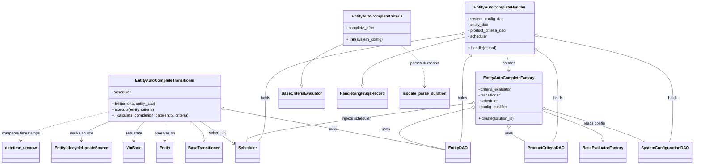

# Diagram: entity_core/entity_service/entity_service/entity/entity/entity_auto_complete_engine.py


> Auto-generated by Obscura crawlers

## Diagram 1



### SVG

<svg id="container" width="2792.814453125" xmlns="http://www.w3.org/2000/svg" class="classDiagram" height="680" viewBox="0 0 2792.814453125 680" role="graphics-document document" aria-roledescription="class"><style>#container{font-family:"trebuchet ms",verdana,arial,sans-serif;font-size:16px;fill:#333;}@keyframes edge-animation-frame{from{stroke-dashoffset:0;}}@keyframes dash{to{stroke-dashoffset:0;}}#container .edge-animation-slow{stroke-dasharray:9,5!important;stroke-dashoffset:900;animation:dash 50s linear infinite;stroke-linecap:round;}#container .edge-animation-fast{stroke-dasharray:9,5!important;stroke-dashoffset:900;animation:dash 20s linear infinite;stroke-linecap:round;}#container .error-icon{fill:#552222;}#container .error-text{fill:#552222;stroke:#552222;}#container .edge-thickness-normal{stroke-width:1px;}#container .edge-thickness-thick{stroke-width:3.5px;}#container .edge-pattern-solid{stroke-dasharray:0;}#container .edge-thickness-invisible{stroke-width:0;fill:none;}#container .edge-pattern-dashed{stroke-dasharray:3;}#container .edge-pattern-dotted{stroke-dasharray:2;}#container .marker{fill:#333333;stroke:#333333;}#container .marker.cross{stroke:#333333;}#container svg{font-family:"trebuchet ms",verdana,arial,sans-serif;font-size:16px;}#container p{margin:0;}#container g.classGroup text{fill:#9370DB;stroke:none;font-family:"trebuchet ms",verdana,arial,sans-serif;font-size:10px;}#container g.classGroup text .title{font-weight:bolder;}#container .nodeLabel,#container .edgeLabel{color:#131300;}#container .edgeLabel .label rect{fill:#ECECFF;}#container .label text{fill:#131300;}#container .labelBkg{background:#ECECFF;}#container .edgeLabel .label span{background:#ECECFF;}#container .classTitle{font-weight:bolder;}#container .node rect,#container .node circle,#container .node ellipse,#container .node polygon,#container .node path{fill:#ECECFF;stroke:#9370DB;stroke-width:1px;}#container .divider{stroke:#9370DB;stroke-width:1;}#container g.clickable{cursor:pointer;}#container g.classGroup rect{fill:#ECECFF;stroke:#9370DB;}#container g.classGroup line{stroke:#9370DB;stroke-width:1;}#container .classLabel .box{stroke:none;stroke-width:0;fill:#ECECFF;opacity:0.5;}#container .classLabel .label{fill:#9370DB;font-size:10px;}#container .relation{stroke:#333333;stroke-width:1;fill:none;}#container .dashed-line{stroke-dasharray:3;}#container .dotted-line{stroke-dasharray:1 2;}#container #compositionStart,#container .composition{fill:#333333!important;stroke:#333333!important;stroke-width:1;}#container #compositionEnd,#container .composition{fill:#333333!important;stroke:#333333!important;stroke-width:1;}#container #dependencyStart,#container .dependency{fill:#333333!important;stroke:#333333!important;stroke-width:1;}#container #dependencyStart,#container .dependency{fill:#333333!important;stroke:#333333!important;stroke-width:1;}#container #extensionStart,#container .extension{fill:transparent!important;stroke:#333333!important;stroke-width:1;}#container #extensionEnd,#container .extension{fill:transparent!important;stroke:#333333!important;stroke-width:1;}#container #aggregationStart,#container .aggregation{fill:transparent!important;stroke:#333333!important;stroke-width:1;}#container #aggregationEnd,#container .aggregation{fill:transparent!important;stroke:#333333!important;stroke-width:1;}#container #lollipopStart,#container .lollipop{fill:#ECECFF!important;stroke:#333333!important;stroke-width:1;}#container #lollipopEnd,#container .lollipop{fill:#ECECFF!important;stroke:#333333!important;stroke-width:1;}#container .edgeTerminals{font-size:11px;line-height:initial;}#container .classTitleText{text-anchor:middle;font-size:18px;fill:#333;}#container .label-icon{display:inline-block;height:1em;overflow:visible;vertical-align:-0.125em;}#container .node .label-icon path{fill:currentColor;stroke:revert;stroke-width:revert;}#container :root{--mermaid-font-family:"trebuchet ms",verdana,arial,sans-serif;}</style><g><defs><marker id="container_class-aggregationStart" class="marker aggregation class" refX="18" refY="7" markerWidth="190" markerHeight="240" orient="auto"><path d="M 18,7 L9,13 L1,7 L9,1 Z"></path></marker></defs><defs><marker id="container_class-aggregationEnd" class="marker aggregation class" refX="1" refY="7" markerWidth="20" markerHeight="28" orient="auto"><path d="M 18,7 L9,13 L1,7 L9,1 Z"></path></marker></defs><defs><marker id="container_class-extensionStart" class="marker extension class" refX="18" refY="7" markerWidth="190" markerHeight="240" orient="auto"><path d="M 1,7 L18,13 V 1 Z"></path></marker></defs><defs><marker id="container_class-extensionEnd" class="marker extension class" refX="1" refY="7" markerWidth="20" markerHeight="28" orient="auto"><path d="M 1,1 V 13 L18,7 Z"></path></marker></defs><defs><marker id="container_class-compositionStart" class="marker composition class" refX="18" refY="7" markerWidth="190" markerHeight="240" orient="auto"><path d="M 18,7 L9,13 L1,7 L9,1 Z"></path></marker></defs><defs><marker id="container_class-compositionEnd" class="marker composition class" refX="1" refY="7" markerWidth="20" markerHeight="28" orient="auto"><path d="M 18,7 L9,13 L1,7 L9,1 Z"></path></marker></defs><defs><marker id="container_class-dependencyStart" class="marker dependency class" refX="6" refY="7" markerWidth="190" markerHeight="240" orient="auto"><path d="M 5,7 L9,13 L1,7 L9,1 Z"></path></marker></defs><defs><marker id="container_class-dependencyEnd" class="marker dependency class" refX="13" refY="7" markerWidth="20" markerHeight="28" orient="auto"><path d="M 18,7 L9,13 L14,7 L9,1 Z"></path></marker></defs><defs><marker id="container_class-lollipopStart" class="marker lollipop class" refX="13" refY="7" markerWidth="190" markerHeight="240" orient="auto"><circle stroke="black" fill="transparent" cx="7" cy="7" r="6"></circle></marker></defs><defs><marker id="container_class-lollipopEnd" class="marker lollipop class" refX="1" refY="7" markerWidth="190" markerHeight="240" orient="auto"><circle stroke="black" fill="transparent" cx="7" cy="7" r="6"></circle></marker></defs><g class="root"><g class="clusters"></g><g class="edgePaths"><path d="M1391.621,181.519L1364.008,194.766C1336.396,208.013,1281.171,234.506,1253.558,262.045C1225.945,289.583,1225.945,318.167,1225.945,332.458L1225.945,346.75" id="id_EntityAutoCompleteCriteria_BaseCriteriaEvaluator_1" class="edge-thickness-normal edge-pattern-solid relation" style=";;;" data-edge="true" data-et="edge" data-id="id_EntityAutoCompleteCriteria_BaseCriteriaEvaluator_1" data-points="W3sieCI6MTM5MS42MjEwOTM3NSwieSI6MTgxLjUxOTQ3NjMyMzQwNzh9LHsieCI6MTIyNS45NDUzMTI1LCJ5IjoyNjF9LHsieCI6MTIyNS45NDUzMTI1LCJ5IjozNjR9XQ==" marker-end="url(#container_class-extensionEnd)"></path><path d="M769.764,502L778.617,510.167C787.47,518.333,805.177,534.667,814.03,546.125C822.883,557.583,822.883,564.167,822.883,567.458L822.883,570.75" id="id_EntityAutoCompleteTransitioner_BaseTransitioner_2" class="edge-thickness-normal edge-pattern-solid relation" style=";;;" data-edge="true" data-et="edge" data-id="id_EntityAutoCompleteTransitioner_BaseTransitioner_2" data-points="W3sieCI6NzY5Ljc2NDI3ODAxNzI0MTQsInkiOjUwMn0seyJ4Ijo4MjIuODgyODEyNSwieSI6NTUxfSx7IngiOjgyMi44ODI4MTI1LCJ5Ijo1ODh9XQ==" marker-end="url(#container_class-extensionEnd)"></path><path d="M2196.797,458.458L2236.966,473.881C2277.136,489.305,2357.475,520.153,2397.645,538.868C2437.814,557.583,2437.814,564.167,2437.814,567.458L2437.814,570.75" id="id_EntityAutoCompleteFactory_BaseEvaluatorFactory_3" class="edge-thickness-normal edge-pattern-solid relation" style=";;;" data-edge="true" data-et="edge" data-id="id_EntityAutoCompleteFactory_BaseEvaluatorFactory_3" data-points="W3sieCI6MjE5Ni43OTY4NzUsInkiOjQ1OC40NTc3MDY0NTA5NjIyM30seyJ4IjoyNDM3LjgxNDQ1MzEyNSwieSI6NTUxfSx7IngiOjI0MzcuODE0NDUzMTI1LCJ5Ijo1ODh9XQ==" marker-end="url(#container_class-extensionEnd)"></path><path d="M1877.795,153.694L1809.19,171.578C1740.585,189.462,1603.374,225.231,1534.769,257.407C1466.164,289.583,1466.164,318.167,1466.164,332.458L1466.164,346.75" id="id_EntityAutoCompleteHandler_HandleSingleSqsRecord_4" class="edge-thickness-normal edge-pattern-solid relation" style=";;;" data-edge="true" data-et="edge" data-id="id_EntityAutoCompleteHandler_HandleSingleSqsRecord_4" data-points="W3sieCI6MTg3Ny43OTQ5MjE4NzUsInkiOjE1My42OTM1NzQ0OTYwMjY4Nn0seyJ4IjoxNDY2LjE2NDA2MjUsInkiOjI2MX0seyJ4IjoxNDY2LjE2NDA2MjUsInkiOjM2NH1d" marker-end="url(#container_class-extensionEnd)"></path><path d="M917.039,452.616L1005.449,469.014C1093.859,485.411,1270.68,518.205,1418.097,546.181C1565.514,574.156,1683.529,597.312,1742.536,608.89L1801.543,620.468" id="id_EntityAutoCompleteTransitioner_EntityDAO_5" class="edge-thickness-normal edge-pattern-solid relation" style=";;;" data-edge="true" data-et="edge" data-id="id_EntityAutoCompleteTransitioner_EntityDAO_5" data-points="W3sieCI6OTAwLjA3ODEyNSwieSI6NDQ5LjQ3MDU4NTg4NDAyMjM0fSx7IngiOjE0NDcuNSwieSI6NTUxfSx7IngiOjE4MDEuNTQyOTY4NzUsInkiOjYyMC40NjgyNzkxNDczODM5fV0=" marker-start="url(#container_class-aggregationStart)"></path><path d="M665.695,502L665.695,510.167C665.695,518.333,665.695,534.667,665.695,548C665.695,561.333,665.695,571.667,665.695,576.833L665.695,582" id="id_EntityAutoCompleteTransitioner_Entity_6" class="edge-thickness-normal edge-pattern-dashed relation" style=";;;" data-edge="true" data-et="edge" data-id="id_EntityAutoCompleteTransitioner_Entity_6" data-points="W3sieCI6NjY1LjY5NTMxMjUsInkiOjUwMn0seyJ4Ijo2NjUuNjk1MzEyNSwieSI6NTUxfSx7IngiOjY2NS42OTUzMTI1LCJ5Ijo1ODh9XQ==" marker-end="url(#container_class-dependencyEnd)"></path><path d="M582.254,502L575.156,510.167C568.057,518.333,553.861,534.667,546.762,548C539.664,561.333,539.664,571.667,539.664,576.833L539.664,582" id="id_EntityAutoCompleteTransitioner_VinState_7" class="edge-thickness-normal edge-pattern-solid relation" style=";;;" data-edge="true" data-et="edge" data-id="id_EntityAutoCompleteTransitioner_VinState_7" data-points="W3sieCI6NTgyLjI1MzkzMzE4OTY1NTIsInkiOjUwMn0seyJ4Ijo1MzkuNjY0MDYyNSwieSI6NTUxfSx7IngiOjUzOS42NjQwNjI1LCJ5Ijo1ODh9XQ==" marker-end="url(#container_class-dependencyEnd)"></path><path d="M443.561,502L424.664,510.167C405.767,518.333,367.973,534.667,349.077,548C330.18,561.333,330.18,571.667,330.18,576.833L330.18,582" id="id_EntityAutoCompleteTransitioner_EntityLifecycleUpdateSource_8" class="edge-thickness-normal edge-pattern-solid relation" style=";;;" data-edge="true" data-et="edge" data-id="id_EntityAutoCompleteTransitioner_EntityLifecycleUpdateSource_8" data-points="W3sieCI6NDQzLjU2MDgyOTc0MTM3OTMsInkiOjUwMn0seyJ4IjozMzAuMTc5Njg3NSwieSI6NTUxfSx7IngiOjMzMC4xNzk2ODc1LCJ5Ijo1ODh9XQ==" marker-end="url(#container_class-dependencyEnd)"></path><path d="M807.14,502L819.173,510.167C831.205,518.333,855.271,534.667,878.854,550.244C902.437,565.821,925.538,580.642,937.089,588.053L948.639,595.463" id="id_EntityAutoCompleteTransitioner_Scheduler_9" class="edge-thickness-normal edge-pattern-solid relation" style=";;;" data-edge="true" data-et="edge" data-id="id_EntityAutoCompleteTransitioner_Scheduler_9" data-points="W3sieCI6ODA3LjE0MDE0MDA4NjIwNjksInkiOjUwMn0seyJ4Ijo4NzkuMzM1OTM3NSwieSI6NTUxfSx7IngiOjk1My42ODk0NTMxMjUsInkiOjU5OC43MDMyNDM3MTQ4MDY4fV0=" marker-end="url(#container_class-dependencyEnd)"></path><path d="M2213.291,452.889L2266.688,469.241C2320.085,485.592,2426.879,518.296,2491.823,540.815C2556.767,563.333,2579.86,575.667,2591.407,581.833L2602.954,588" id="id_EntityAutoCompleteFactory_SystemConfigurationDAO_10" class="edge-thickness-normal edge-pattern-solid relation" style=";;;" data-edge="true" data-et="edge" data-id="id_EntityAutoCompleteFactory_SystemConfigurationDAO_10" data-points="W3sieCI6MjE5Ni43OTY4NzUsInkiOjQ0Ny44Mzc2Nzc1MjQ3Mzl9LHsieCI6MjUzMy42NzM4MjgxMjUsInkiOjU1MX0seyJ4IjoyNjAyLjk1MzY5MzYzMTMyOTMsInkiOjU4OH1d" marker-start="url(#container_class-aggregationStart)"></path><path d="M1906.856,445.721L1839.127,463.267C1771.399,480.814,1635.942,515.907,1618.389,544.791C1600.837,573.675,1701.19,596.349,1751.367,607.687L1801.543,619.024" id="id_EntityAutoCompleteFactory_EntityDAO_11" class="edge-thickness-normal edge-pattern-solid relation" style=";;;" data-edge="true" data-et="edge" data-id="id_EntityAutoCompleteFactory_EntityDAO_11" data-points="W3sieCI6MTkyMy41NTQ2ODc1LCJ5Ijo0NDEuMzk0NjA5MTk0NTE5ODN9LHsieCI6MTUwMC40ODQzNzUsInkiOjU1MX0seyJ4IjoxODAxLjU0Mjk2ODc1LCJ5Ijo2MTkuMDIzODMwNTM4MzkzN31d" marker-start="url(#container_class-aggregationStart)"></path><path d="M2060.176,531.25L2060.176,534.542C2060.176,537.833,2060.176,544.417,2072.199,553.875C2084.221,563.333,2108.267,575.667,2120.29,581.833L2132.312,588" id="id_EntityAutoCompleteFactory_ProductCriteriaDAO_12" class="edge-thickness-normal edge-pattern-solid relation" style=";;;" data-edge="true" data-et="edge" data-id="id_EntityAutoCompleteFactory_ProductCriteriaDAO_12" data-points="W3sieCI6MjA2MC4xNzU3ODEyNSwieSI6NTE0fSx7IngiOjIwNjAuMTc1NzgxMjUsInkiOjU1MX0seyJ4IjoyMTMyLjMxMjQyNTgzMDY5NiwieSI6NTg4fV0=" marker-start="url(#container_class-aggregationStart)"></path><path d="M1906.463,426.978L1755.003,447.648C1603.543,468.319,1300.623,509.659,1149.535,536.496C998.447,563.333,999.192,575.667,999.564,581.833L999.936,588" id="id_EntityAutoCompleteFactory_Scheduler_13" class="edge-thickness-normal edge-pattern-solid relation" style=";;;" data-edge="true" data-et="edge" data-id="id_EntityAutoCompleteFactory_Scheduler_13" data-points="W3sieCI6MTkyMy41NTQ2ODc1LCJ5Ijo0MjQuNjQ1MjQwODcwMTY5NDZ9LHsieCI6OTk3LjcwMzEyNSwieSI6NTUxfSx7IngiOjk5OS45MzYwNDEzMzcwMjU0LCJ5Ijo1ODh9XQ==" marker-start="url(#container_class-aggregationStart)"></path><path d="M2183.865,149.876L2272.146,168.397C2360.426,186.918,2536.988,223.959,2625.268,266.646C2713.549,309.333,2713.549,357.667,2713.549,406C2713.549,454.333,2713.549,502.667,2711.055,533C2708.56,563.333,2703.572,575.667,2701.078,581.833L2698.583,588" id="id_EntityAutoCompleteHandler_SystemConfigurationDAO_14" class="edge-thickness-normal edge-pattern-solid relation" style=";;;" data-edge="true" data-et="edge" data-id="id_EntityAutoCompleteHandler_SystemConfigurationDAO_14" data-points="W3sieCI6MjE2Ni45ODI0MjE4NzUsInkiOjE0Ni4zMzQ2Mzg4ODI3NjYxN30seyJ4IjoyNzEzLjU0ODgyODEyNSwieSI6MjYxfSx7IngiOjI3MTMuNTQ4ODI4MTI1LCJ5Ijo0MDZ9LHsieCI6MjcxMy41NDg4MjgxMjUsInkiOjU1MX0seyJ4IjoyNjk4LjU4MzQ0MDQ2Njc3MiwieSI6NTg4fV0=" marker-start="url(#container_class-aggregationStart)"></path><path d="M1895.109,235.824L1890.652,240.02C1886.195,244.216,1877.281,252.608,1872.824,280.971C1868.367,309.333,1868.367,357.667,1868.367,406C1868.367,454.333,1868.367,502.667,1866.943,533C1865.519,563.333,1862.67,575.667,1861.246,581.833L1859.822,588" id="id_EntityAutoCompleteHandler_EntityDAO_15" class="edge-thickness-normal edge-pattern-solid relation" style=";;;" data-edge="true" data-et="edge" data-id="id_EntityAutoCompleteHandler_EntityDAO_15" data-points="W3sieCI6MTkwNy42NjkyMjE0NDM5NjU0LCJ5IjoyMjR9LHsieCI6MTg2OC4zNjcxODc1LCJ5IjoyNjF9LHsieCI6MTg2OC4zNjcxODc1LCJ5Ijo0MDZ9LHsieCI6MTg2OC4zNjcxODc1LCJ5Ijo1NTF9LHsieCI6MTg1OS44MjE1NDg2NTUwNjMyLCJ5Ijo1ODh9XQ==" marker-start="url(#container_class-aggregationStart)"></path><path d="M2181.671,214.072L2194.374,221.893C2207.077,229.715,2232.483,245.357,2245.186,277.345C2257.889,309.333,2257.889,357.667,2257.889,406C2257.889,454.333,2257.889,502.667,2254.478,533C2251.068,563.333,2244.247,575.667,2240.836,581.833L2237.426,588" id="id_EntityAutoCompleteHandler_ProductCriteriaDAO_16" class="edge-thickness-normal edge-pattern-solid relation" style=";;;" data-edge="true" data-et="edge" data-id="id_EntityAutoCompleteHandler_ProductCriteriaDAO_16" data-points="W3sieCI6MjE2Ni45ODI0MjE4NzUsInkiOjIwNS4wMjc5OTg5Mzg0Mjg4OH0seyJ4IjoyMjU3Ljg4ODY3MTg3NSwieSI6MjYxfSx7IngiOjIyNTcuODg4NjcxODc1LCJ5Ijo0MDZ9LHsieCI6MjI1Ny44ODg2NzE4NzUsInkiOjU1MX0seyJ4IjoyMjM3LjQyNTYwODE4ODI5MTMsInkiOjU4OH1d" marker-start="url(#container_class-aggregationStart)"></path><path d="M1860.745,140.861L1730.557,160.884C1600.369,180.907,1339.993,220.954,1209.805,265.144C1079.617,309.333,1079.617,357.667,1079.617,406C1079.617,454.333,1079.617,502.667,1073.595,533C1067.573,563.333,1055.529,575.667,1049.507,581.833L1043.485,588" id="id_EntityAutoCompleteHandler_Scheduler_17" class="edge-thickness-normal edge-pattern-solid relation" style=";;;" data-edge="true" data-et="edge" data-id="id_EntityAutoCompleteHandler_Scheduler_17" data-points="W3sieCI6MTg3Ny43OTQ5MjE4NzUsInkiOjEzOC4yMzg3ODY0OTAxMzE1M30seyJ4IjoxMDc5LjYxNzE4NzUsInkiOjI2MX0seyJ4IjoxMDc5LjYxNzE4NzUsInkiOjQwNn0seyJ4IjoxMDc5LjYxNzE4NzUsInkiOjU1MX0seyJ4IjoxMDQzLjQ4NTI4OTc1NDc0NjksInkiOjU4OH1d" marker-start="url(#container_class-aggregationStart)"></path><path d="M2050.534,224L2052.141,230.167C2053.748,236.333,2056.962,248.667,2058.569,260C2060.176,271.333,2060.176,281.667,2060.176,286.833L2060.176,292" id="id_EntityAutoCompleteHandler_EntityAutoCompleteFactory_18" class="edge-thickness-normal edge-pattern-solid relation" style=";;;" data-edge="true" data-et="edge" data-id="id_EntityAutoCompleteHandler_EntityAutoCompleteFactory_18" data-points="W3sieCI6MjA1MC41MzM1NTMzNDA1MTczLCJ5IjoyMjR9LHsieCI6MjA2MC4xNzU3ODEyNSwieSI6MjYxfSx7IngiOjIwNjAuMTc1NzgxMjUsInkiOjI5OH1d" marker-end="url(#container_class-dependencyEnd)"></path><path d="M1620.562,188L1636.17,200.167C1651.778,212.333,1682.995,236.667,1698.603,265C1714.211,293.333,1714.211,325.667,1714.211,341.833L1714.211,358" id="id_EntityAutoCompleteCriteria_isodate_parse_duration_19" class="edge-thickness-normal edge-pattern-dashed relation" style=";;;" data-edge="true" data-et="edge" data-id="id_EntityAutoCompleteCriteria_isodate_parse_duration_19" data-points="W3sieCI6MTYyMC41NjE2OTE4MTAzNDQ5LCJ5IjoxODh9LHsieCI6MTcxNC4yMTA5Mzc1LCJ5IjoyNjF9LHsieCI6MTcxNC4yMTA5Mzc1LCJ5IjozNjR9XQ==" marker-end="url(#container_class-dependencyEnd)"></path><path d="M431.313,464.82L374.078,479.183C316.844,493.547,202.375,522.273,145.141,541.803C87.906,561.333,87.906,571.667,87.906,576.833L87.906,582" id="id_EntityAutoCompleteTransitioner_datetime_utcnow_20" class="edge-thickness-normal edge-pattern-dashed relation" style=";;;" data-edge="true" data-et="edge" data-id="id_EntityAutoCompleteTransitioner_datetime_utcnow_20" data-points="W3sieCI6NDMxLjMxMjUsInkiOjQ2NC44MTk5MjIzODczMzMyfSx7IngiOjg3LjkwNjI1LCJ5Ijo1NTF9LHsieCI6ODcuOTA2MjUsInkiOjU4OH1d" marker-end="url(#container_class-dependencyEnd)"></path></g><g class="edgeLabels"><g class="edgeLabel"><g class="label" data-id="id_EntityAutoCompleteCriteria_BaseCriteriaEvaluator_1" transform="translate(0, 0)"><foreignObject width="0" height="0"><div xmlns="http://www.w3.org/1999/xhtml" class="labelBkg" style="display: table-cell; white-space: nowrap; line-height: 1.5; max-width: 200px; text-align: center;"><span class="edgeLabel"></span></div></foreignObject></g></g><g class="edgeLabel"><g class="label" data-id="id_EntityAutoCompleteTransitioner_BaseTransitioner_2" transform="translate(0, 0)"><foreignObject width="0" height="0"><div xmlns="http://www.w3.org/1999/xhtml" class="labelBkg" style="display: table-cell; white-space: nowrap; line-height: 1.5; max-width: 200px; text-align: center;"><span class="edgeLabel"></span></div></foreignObject></g></g><g class="edgeLabel"><g class="label" data-id="id_EntityAutoCompleteFactory_BaseEvaluatorFactory_3" transform="translate(0, 0)"><foreignObject width="0" height="0"><div xmlns="http://www.w3.org/1999/xhtml" class="labelBkg" style="display: table-cell; white-space: nowrap; line-height: 1.5; max-width: 200px; text-align: center;"><span class="edgeLabel"></span></div></foreignObject></g></g><g class="edgeLabel"><g class="label" data-id="id_EntityAutoCompleteHandler_HandleSingleSqsRecord_4" transform="translate(0, 0)"><foreignObject width="0" height="0"><div xmlns="http://www.w3.org/1999/xhtml" class="labelBkg" style="display: table-cell; white-space: nowrap; line-height: 1.5; max-width: 200px; text-align: center;"><span class="edgeLabel"></span></div></foreignObject></g></g><g class="edgeLabel" transform="translate(1351.16116, 533.1322)"><g class="label" data-id="id_EntityAutoCompleteTransitioner_EntityDAO_5" transform="translate(-16.4921875, -12)"><foreignObject width="32.984375" height="24"><div xmlns="http://www.w3.org/1999/xhtml" class="labelBkg" style="display: table-cell; white-space: nowrap; line-height: 1.5; max-width: 200px; text-align: center;"><span class="edgeLabel"><p>uses</p></span></div></foreignObject></g></g><g class="edgeLabel" transform="translate(665.6953125, 551)"><g class="label" data-id="id_EntityAutoCompleteTransitioner_Entity_6" transform="translate(-43.2890625, -12)"><foreignObject width="86.578125" height="24"><div xmlns="http://www.w3.org/1999/xhtml" class="labelBkg" style="display: table-cell; white-space: nowrap; line-height: 1.5; max-width: 200px; text-align: center;"><span class="edgeLabel"><p>operates on</p></span></div></foreignObject></g></g><g class="edgeLabel" transform="translate(539.6640625, 551)"><g class="label" data-id="id_EntityAutoCompleteTransitioner_VinState_7" transform="translate(-34.890625, -12)"><foreignObject width="69.78125" height="24"><div xmlns="http://www.w3.org/1999/xhtml" class="labelBkg" style="display: table-cell; white-space: nowrap; line-height: 1.5; max-width: 200px; text-align: center;"><span class="edgeLabel"><p>sets state</p></span></div></foreignObject></g></g><g class="edgeLabel" transform="translate(330.1796875, 551)"><g class="label" data-id="id_EntityAutoCompleteTransitioner_EntityLifecycleUpdateSource_8" transform="translate(-48.1484375, -12)"><foreignObject width="96.296875" height="24"><div xmlns="http://www.w3.org/1999/xhtml" class="labelBkg" style="display: table-cell; white-space: nowrap; line-height: 1.5; max-width: 200px; text-align: center;"><span class="edgeLabel"><p>marks source</p></span></div></foreignObject></g></g><g class="edgeLabel" transform="translate(879.3359375, 551)"><g class="label" data-id="id_EntityAutoCompleteTransitioner_Scheduler_9" transform="translate(-36.453125, -12)"><foreignObject width="72.90625" height="24"><div xmlns="http://www.w3.org/1999/xhtml" class="labelBkg" style="display: table-cell; white-space: nowrap; line-height: 1.5; max-width: 200px; text-align: center;"><span class="edgeLabel"><p>schedules</p></span></div></foreignObject></g></g><g class="edgeLabel" transform="translate(2402.78469, 510.91763)"><g class="label" data-id="id_EntityAutoCompleteFactory_SystemConfigurationDAO_10" transform="translate(-43.90625, -12)"><foreignObject width="87.8125" height="24"><div xmlns="http://www.w3.org/1999/xhtml" class="labelBkg" style="display: table-cell; white-space: nowrap; line-height: 1.5; max-width: 200px; text-align: center;"><span class="edgeLabel"><p>reads config</p></span></div></foreignObject></g></g><g class="edgeLabel" transform="translate(1562.62761, 534.90047)"><g class="label" data-id="id_EntityAutoCompleteFactory_EntityDAO_11" transform="translate(-16.4921875, -12)"><foreignObject width="32.984375" height="24"><div xmlns="http://www.w3.org/1999/xhtml" class="labelBkg" style="display: table-cell; white-space: nowrap; line-height: 1.5; max-width: 200px; text-align: center;"><span class="edgeLabel"><p>uses</p></span></div></foreignObject></g></g><g class="edgeLabel" transform="translate(2060.17578125, 551)"><g class="label" data-id="id_EntityAutoCompleteFactory_ProductCriteriaDAO_12" transform="translate(-16.4921875, -12)"><foreignObject width="32.984375" height="24"><div xmlns="http://www.w3.org/1999/xhtml" class="labelBkg" style="display: table-cell; white-space: nowrap; line-height: 1.5; max-width: 200px; text-align: center;"><span class="edgeLabel"><p>uses</p></span></div></foreignObject></g></g><g class="edgeLabel" transform="translate(997.703125, 551)"><g class="label" data-id="id_EntityAutoCompleteFactory_Scheduler_13" transform="translate(-61.9140625, -12)"><foreignObject width="123.828125" height="24"><div xmlns="http://www.w3.org/1999/xhtml" class="labelBkg" style="display: table-cell; white-space: nowrap; line-height: 1.5; max-width: 200px; text-align: center;"><span class="edgeLabel"><p>injects scheduler</p></span></div></foreignObject></g></g><g class="edgeLabel" transform="translate(2713.548828125, 406)"><g class="label" data-id="id_EntityAutoCompleteHandler_SystemConfigurationDAO_14" transform="translate(-20.1875, -12)"><foreignObject width="40.375" height="24"><div xmlns="http://www.w3.org/1999/xhtml" class="labelBkg" style="display: table-cell; white-space: nowrap; line-height: 1.5; max-width: 200px; text-align: center;"><span class="edgeLabel"><p>holds</p></span></div></foreignObject></g></g><g class="edgeLabel" transform="translate(1868.3671875, 406)"><g class="label" data-id="id_EntityAutoCompleteHandler_EntityDAO_15" transform="translate(-20.1875, -12)"><foreignObject width="40.375" height="24"><div xmlns="http://www.w3.org/1999/xhtml" class="labelBkg" style="display: table-cell; white-space: nowrap; line-height: 1.5; max-width: 200px; text-align: center;"><span class="edgeLabel"><p>holds</p></span></div></foreignObject></g></g><g class="edgeLabel" transform="translate(2257.888671875, 406)"><g class="label" data-id="id_EntityAutoCompleteHandler_ProductCriteriaDAO_16" transform="translate(-20.1875, -12)"><foreignObject width="40.375" height="24"><div xmlns="http://www.w3.org/1999/xhtml" class="labelBkg" style="display: table-cell; white-space: nowrap; line-height: 1.5; max-width: 200px; text-align: center;"><span class="edgeLabel"><p>holds</p></span></div></foreignObject></g></g><g class="edgeLabel" transform="translate(1079.6171875, 406)"><g class="label" data-id="id_EntityAutoCompleteHandler_Scheduler_17" transform="translate(-20.1875, -12)"><foreignObject width="40.375" height="24"><div xmlns="http://www.w3.org/1999/xhtml" class="labelBkg" style="display: table-cell; white-space: nowrap; line-height: 1.5; max-width: 200px; text-align: center;"><span class="edgeLabel"><p>holds</p></span></div></foreignObject></g></g><g class="edgeLabel" transform="translate(2060.17578125, 261)"><g class="label" data-id="id_EntityAutoCompleteHandler_EntityAutoCompleteFactory_18" transform="translate(-26.171875, -12)"><foreignObject width="52.34375" height="24"><div xmlns="http://www.w3.org/1999/xhtml" class="labelBkg" style="display: table-cell; white-space: nowrap; line-height: 1.5; max-width: 200px; text-align: center;"><span class="edgeLabel"><p>creates</p></span></div></foreignObject></g></g><g class="edgeLabel" transform="translate(1714.2109375, 261)"><g class="label" data-id="id_EntityAutoCompleteCriteria_isodate_parse_duration_19" transform="translate(-60.7890625, -12)"><foreignObject width="121.578125" height="24"><div xmlns="http://www.w3.org/1999/xhtml" class="labelBkg" style="display: table-cell; white-space: nowrap; line-height: 1.5; max-width: 200px; text-align: center;"><span class="edgeLabel"><p>parses durations</p></span></div></foreignObject></g></g><g class="edgeLabel" transform="translate(87.90625, 551)"><g class="label" data-id="id_EntityAutoCompleteTransitioner_datetime_utcnow_20" transform="translate(-79.90625, -12)"><foreignObject width="159.8125" height="24"><div xmlns="http://www.w3.org/1999/xhtml" class="labelBkg" style="display: table-cell; white-space: nowrap; line-height: 1.5; max-width: 200px; text-align: center;"><span class="edgeLabel"><p>compares timestamps</p></span></div></foreignObject></g></g></g><g class="nodes"><g class="node default" id="classId-EntityAutoCompleteCriteria-0" transform="translate(1528.1953125, 116)"><g class="basic label-container"><path d="M-136.57421875 -72 L136.57421875 -72 L136.57421875 72 L-136.57421875 72" stroke="none" stroke-width="0" fill="#ECECFF" style=""></path><path d="M-136.57421875 -72 C-53.9180443506109 -72, 28.738130048778203 -72, 136.57421875 -72 M-136.57421875 -72 C-29.102320007282515 -72, 78.36957873543497 -72, 136.57421875 -72 M136.57421875 -72 C136.57421875 -41.11420092494212, 136.57421875 -10.228401849884236, 136.57421875 72 M136.57421875 -72 C136.57421875 -40.10030532306453, 136.57421875 -8.200610646129071, 136.57421875 72 M136.57421875 72 C29.00187114599403 72, -78.57047645801194 72, -136.57421875 72 M136.57421875 72 C42.678506569445915 72, -51.21720561110817 72, -136.57421875 72 M-136.57421875 72 C-136.57421875 16.316415452308007, -136.57421875 -39.367169095383986, -136.57421875 -72 M-136.57421875 72 C-136.57421875 16.498399288303943, -136.57421875 -39.00320142339211, -136.57421875 -72" stroke="#9370DB" stroke-width="1.3" fill="none" stroke-dasharray="0 0" style=""></path></g><g class="annotation-group text" transform="translate(0, -48)"></g><g class="label-group text" transform="translate(-100.1328125, -48)"><g class="label" style="font-weight: bolder" transform="translate(0,-12)"><foreignObject width="200.265625" height="24"><div xmlns="http://www.w3.org/1999/xhtml" style="display: table-cell; white-space: nowrap; line-height: 1.5; max-width: 247px; text-align: center;"><span class="nodeLabel markdown-node-label" style=""><p>EntityAutoCompleteCriteria</p></span></div></foreignObject></g></g><g class="members-group text" transform="translate(-124.57421875, 0)"><g class="label" style="" transform="translate(0,-12)"><foreignObject width="120.34375" height="24"><div xmlns="http://www.w3.org/1999/xhtml" style="display: table-cell; white-space: nowrap; line-height: 1.5; max-width: 179px; text-align: center;"><span class="nodeLabel markdown-node-label" style=""><p>- complete_after</p></span></div></foreignObject></g></g><g class="methods-group text" transform="translate(-124.57421875, 48)"><g class="label" style="" transform="translate(0,-12)"><foreignObject width="149.015625" height="24"><div xmlns="http://www.w3.org/1999/xhtml" style="display: table-cell; white-space: nowrap; line-height: 1.5; max-width: 239px; text-align: center;"><span class="nodeLabel markdown-node-label" style=""><p>+ <strong>init</strong>(system_config)</p></span></div></foreignObject></g></g><g class="divider" style=""><path d="M-136.57421875 -24 C-66.08207657434647 -24, 4.410065601307053 -24, 136.57421875 -24 M-136.57421875 -24 C-49.876139764744494 -24, 36.82193922051101 -24, 136.57421875 -24" stroke="#9370DB" stroke-width="1.3" fill="none" stroke-dasharray="0 0" style=""></path></g><g class="divider" style=""><path d="M-136.57421875 24 C-33.942585469809146 24, 68.68904781038171 24, 136.57421875 24 M-136.57421875 24 C-68.11147898173932 24, 0.35126078652135106 24, 136.57421875 24" stroke="#9370DB" stroke-width="1.3" fill="none" stroke-dasharray="0 0" style=""></path></g></g><g class="node default" id="classId-EntityAutoCompleteTransitioner-1" transform="translate(665.6953125, 406)"><g class="basic label-container"><path d="M-234.3828125 -96 L234.3828125 -96 L234.3828125 96 L-234.3828125 96" stroke="none" stroke-width="0" fill="#ECECFF" style=""></path><path d="M-234.3828125 -96 C-101.56486051568754 -96, 31.253091468624916 -96, 234.3828125 -96 M-234.3828125 -96 C-47.72931414229515 -96, 138.9241842154097 -96, 234.3828125 -96 M234.3828125 -96 C234.3828125 -47.15096333184901, 234.3828125 1.6980733363019738, 234.3828125 96 M234.3828125 -96 C234.3828125 -28.163662275566494, 234.3828125 39.67267544886701, 234.3828125 96 M234.3828125 96 C136.45977222880953 96, 38.536731957619025 96, -234.3828125 96 M234.3828125 96 C50.4475550345328 96, -133.4877024309344 96, -234.3828125 96 M-234.3828125 96 C-234.3828125 50.27772458840517, -234.3828125 4.555449176810342, -234.3828125 -96 M-234.3828125 96 C-234.3828125 34.315865691915164, -234.3828125 -27.368268616169672, -234.3828125 -96" stroke="#9370DB" stroke-width="1.3" fill="none" stroke-dasharray="0 0" style=""></path></g><g class="annotation-group text" transform="translate(0, -72)"></g><g class="label-group text" transform="translate(-117.34375, -72)"><g class="label" style="font-weight: bolder" transform="translate(0,-12)"><foreignObject width="234.6875" height="24"><div xmlns="http://www.w3.org/1999/xhtml" style="display: table-cell; white-space: nowrap; line-height: 1.5; max-width: 282px; text-align: center;"><span class="nodeLabel markdown-node-label" style=""><p>EntityAutoCompleteTransitioner</p></span></div></foreignObject></g></g><g class="members-group text" transform="translate(-222.3828125, -24)"><g class="label" style="" transform="translate(0,-12)"><foreignObject width="82.296875" height="24"><div xmlns="http://www.w3.org/1999/xhtml" style="display: table-cell; white-space: nowrap; line-height: 1.5; max-width: 140px; text-align: center;"><span class="nodeLabel markdown-node-label" style=""><p>- scheduler</p></span></div></foreignObject></g></g><g class="methods-group text" transform="translate(-222.3828125, 24)"><g class="label" style="" transform="translate(0,-12)"><foreignObject width="184.203125" height="24"><div xmlns="http://www.w3.org/1999/xhtml" style="display: table-cell; white-space: nowrap; line-height: 1.5; max-width: 274px; text-align: center;"><span class="nodeLabel markdown-node-label" style=""><p>+ <strong>init</strong>(criteria, entity_dao)</p></span></div></foreignObject></g><g class="label" style="" transform="translate(0,12)"><foreignObject width="179.9375" height="24"><div xmlns="http://www.w3.org/1999/xhtml" style="display: table-cell; white-space: nowrap; line-height: 1.5; max-width: 237px; text-align: center;"><span class="nodeLabel markdown-node-label" style=""><p>+ execute(entity, criteria)</p></span></div></foreignObject></g><g class="label" style="" transform="translate(0,36)"><foreignObject width="327.421875" height="24"><div xmlns="http://www.w3.org/1999/xhtml" style="display: table-cell; white-space: nowrap; line-height: 1.5; max-width: 385px; text-align: center;"><span class="nodeLabel markdown-node-label" style=""><p>+ _calculate_completion_date(entity, criteria)</p></span></div></foreignObject></g></g><g class="divider" style=""><path d="M-234.3828125 -48 C-74.01780196259881 -48, 86.34720857480238 -48, 234.3828125 -48 M-234.3828125 -48 C-85.23764667506839 -48, 63.90751914986322 -48, 234.3828125 -48" stroke="#9370DB" stroke-width="1.3" fill="none" stroke-dasharray="0 0" style=""></path></g><g class="divider" style=""><path d="M-234.3828125 0 C-118.48469055411148 0, -2.5865686082229615 0, 234.3828125 0 M-234.3828125 0 C-65.20960819346618 0, 103.96359611306764 0, 234.3828125 0" stroke="#9370DB" stroke-width="1.3" fill="none" stroke-dasharray="0 0" style=""></path></g></g><g class="node default" id="classId-EntityAutoCompleteFactory-2" transform="translate(2060.17578125, 406)"><g class="basic label-container"><path d="M-136.62109375 -108 L136.62109375 -108 L136.62109375 108 L-136.62109375 108" stroke="none" stroke-width="0" fill="#ECECFF" style=""></path><path d="M-136.62109375 -108 C-73.90984049435103 -108, -11.19858723870206 -108, 136.62109375 -108 M-136.62109375 -108 C-48.061226896263534 -108, 40.49863995747293 -108, 136.62109375 -108 M136.62109375 -108 C136.62109375 -48.08772436845381, 136.62109375 11.824551263092374, 136.62109375 108 M136.62109375 -108 C136.62109375 -60.47807071074972, 136.62109375 -12.956141421499439, 136.62109375 108 M136.62109375 108 C68.48031397319961 108, 0.339534196399228 108, -136.62109375 108 M136.62109375 108 C45.68846564946922 108, -45.244162451061555 108, -136.62109375 108 M-136.62109375 108 C-136.62109375 33.49681402665483, -136.62109375 -41.00637194669034, -136.62109375 -108 M-136.62109375 108 C-136.62109375 31.568051550580932, -136.62109375 -44.863896898838135, -136.62109375 -108" stroke="#9370DB" stroke-width="1.3" fill="none" stroke-dasharray="0 0" style=""></path></g><g class="annotation-group text" transform="translate(0, -84)"></g><g class="label-group text" transform="translate(-99.5546875, -84)"><g class="label" style="font-weight: bolder" transform="translate(0,-12)"><foreignObject width="199.109375" height="24"><div xmlns="http://www.w3.org/1999/xhtml" style="display: table-cell; white-space: nowrap; line-height: 1.5; max-width: 246px; text-align: center;"><span class="nodeLabel markdown-node-label" style=""><p>EntityAutoCompleteFactory</p></span></div></foreignObject></g></g><g class="members-group text" transform="translate(-124.62109375, -36)"><g class="label" style="" transform="translate(0,-12)"><foreignObject width="139.25" height="24"><div xmlns="http://www.w3.org/1999/xhtml" style="display: table-cell; white-space: nowrap; line-height: 1.5; max-width: 197px; text-align: center;"><span class="nodeLabel markdown-node-label" style=""><p>- criteria_evaluator</p></span></div></foreignObject></g><g class="label" style="" transform="translate(0,12)"><foreignObject width="96.0625" height="24"><div xmlns="http://www.w3.org/1999/xhtml" style="display: table-cell; white-space: nowrap; line-height: 1.5; max-width: 154px; text-align: center;"><span class="nodeLabel markdown-node-label" style=""><p>- transitioner</p></span></div></foreignObject></g><g class="label" style="" transform="translate(0,36)"><foreignObject width="82.296875" height="24"><div xmlns="http://www.w3.org/1999/xhtml" style="display: table-cell; white-space: nowrap; line-height: 1.5; max-width: 140px; text-align: center;"><span class="nodeLabel markdown-node-label" style=""><p>- scheduler</p></span></div></foreignObject></g><g class="label" style="" transform="translate(0,60)"><foreignObject width="123.046875" height="24"><div xmlns="http://www.w3.org/1999/xhtml" style="display: table-cell; white-space: nowrap; line-height: 1.5; max-width: 181px; text-align: center;"><span class="nodeLabel markdown-node-label" style=""><p>- config_qualifier</p></span></div></foreignObject></g></g><g class="methods-group text" transform="translate(-124.62109375, 84)"><g class="label" style="" transform="translate(0,-12)"><foreignObject width="149.6875" height="24"><div xmlns="http://www.w3.org/1999/xhtml" style="display: table-cell; white-space: nowrap; line-height: 1.5; max-width: 207px; text-align: center;"><span class="nodeLabel markdown-node-label" style=""><p>+ create(solution_id)</p></span></div></foreignObject></g></g><g class="divider" style=""><path d="M-136.62109375 -60 C-43.49898193819125 -60, 49.6231298736175 -60, 136.62109375 -60 M-136.62109375 -60 C-42.07451523300682 -60, 52.47206328398636 -60, 136.62109375 -60" stroke="#9370DB" stroke-width="1.3" fill="none" stroke-dasharray="0 0" style=""></path></g><g class="divider" style=""><path d="M-136.62109375 60 C-76.29357965203758 60, -15.966065554075158 60, 136.62109375 60 M-136.62109375 60 C-43.31775713658524 60, 49.985579476829514 60, 136.62109375 60" stroke="#9370DB" stroke-width="1.3" fill="none" stroke-dasharray="0 0" style=""></path></g></g><g class="node default" id="classId-EntityAutoCompleteHandler-3" transform="translate(2022.388671875, 116)"><g class="basic label-container"><path d="M-144.59375 -108 L144.59375 -108 L144.59375 108 L-144.59375 108" stroke="none" stroke-width="0" fill="#ECECFF" style=""></path><path d="M-144.59375 -108 C-60.642392863209196 -108, 23.30896427358161 -108, 144.59375 -108 M-144.59375 -108 C-54.10300031120069 -108, 36.387749377598624 -108, 144.59375 -108 M144.59375 -108 C144.59375 -48.53542216326511, 144.59375 10.92915567346978, 144.59375 108 M144.59375 -108 C144.59375 -49.4308445357978, 144.59375 9.138310928404394, 144.59375 108 M144.59375 108 C84.5128723904392 108, 24.431994780878398 108, -144.59375 108 M144.59375 108 C65.81908715799233 108, -12.955575684015344 108, -144.59375 108 M-144.59375 108 C-144.59375 42.436505946647586, -144.59375 -23.12698810670483, -144.59375 -108 M-144.59375 108 C-144.59375 30.194293634270622, -144.59375 -47.611412731458756, -144.59375 -108" stroke="#9370DB" stroke-width="1.3" fill="none" stroke-dasharray="0 0" style=""></path></g><g class="annotation-group text" transform="translate(0, -84)"></g><g class="label-group text" transform="translate(-102.046875, -84)"><g class="label" style="font-weight: bolder" transform="translate(0,-12)"><foreignObject width="204.09375" height="24"><div xmlns="http://www.w3.org/1999/xhtml" style="display: table-cell; white-space: nowrap; line-height: 1.5; max-width: 253px; text-align: center;"><span class="nodeLabel markdown-node-label" style=""><p>EntityAutoCompleteHandler</p></span></div></foreignObject></g></g><g class="members-group text" transform="translate(-132.59375, -36)"><g class="label" style="" transform="translate(0,-12)"><foreignObject width="148.34375" height="24"><div xmlns="http://www.w3.org/1999/xhtml" style="display: table-cell; white-space: nowrap; line-height: 1.5; max-width: 206px; text-align: center;"><span class="nodeLabel markdown-node-label" style=""><p>- system_config_dao</p></span></div></foreignObject></g><g class="label" style="" transform="translate(0,12)"><foreignObject width="87.78125" height="24"><div xmlns="http://www.w3.org/1999/xhtml" style="display: table-cell; white-space: nowrap; line-height: 1.5; max-width: 145px; text-align: center;"><span class="nodeLabel markdown-node-label" style=""><p>- entity_dao</p></span></div></foreignObject></g><g class="label" style="" transform="translate(0,36)"><foreignObject width="163.140625" height="24"><div xmlns="http://www.w3.org/1999/xhtml" style="display: table-cell; white-space: nowrap; line-height: 1.5; max-width: 221px; text-align: center;"><span class="nodeLabel markdown-node-label" style=""><p>- product_criteria_dao</p></span></div></foreignObject></g><g class="label" style="" transform="translate(0,60)"><foreignObject width="82.296875" height="24"><div xmlns="http://www.w3.org/1999/xhtml" style="display: table-cell; white-space: nowrap; line-height: 1.5; max-width: 140px; text-align: center;"><span class="nodeLabel markdown-node-label" style=""><p>- scheduler</p></span></div></foreignObject></g></g><g class="methods-group text" transform="translate(-132.59375, 84)"><g class="label" style="" transform="translate(0,-12)"><foreignObject width="119.296875" height="24"><div xmlns="http://www.w3.org/1999/xhtml" style="display: table-cell; white-space: nowrap; line-height: 1.5; max-width: 177px; text-align: center;"><span class="nodeLabel markdown-node-label" style=""><p>+ handle(record)</p></span></div></foreignObject></g></g><g class="divider" style=""><path d="M-144.59375 -60 C-47.802788096201326 -60, 48.98817380759735 -60, 144.59375 -60 M-144.59375 -60 C-82.7642160229379 -60, -20.934682045875803 -60, 144.59375 -60" stroke="#9370DB" stroke-width="1.3" fill="none" stroke-dasharray="0 0" style=""></path></g><g class="divider" style=""><path d="M-144.59375 60 C-29.602541419224494 60, 85.38866716155101 60, 144.59375 60 M-144.59375 60 C-82.14462488355403 60, -19.695499767108075 60, 144.59375 60" stroke="#9370DB" stroke-width="1.3" fill="none" stroke-dasharray="0 0" style=""></path></g></g><g class="node default" id="classId-BaseCriteriaEvaluator-4" transform="translate(1225.9453125, 406)"><g class="basic label-container"><path d="M-91.140625 -42 L91.140625 -42 L91.140625 42 L-91.140625 42" stroke="none" stroke-width="0" fill="#ECECFF" style=""></path><path d="M-91.140625 -42 C-22.924642401193722 -42, 45.291340197612556 -42, 91.140625 -42 M-91.140625 -42 C-51.21553225955309 -42, -11.290439519106187 -42, 91.140625 -42 M91.140625 -42 C91.140625 -13.826098794723972, 91.140625 14.347802410552056, 91.140625 42 M91.140625 -42 C91.140625 -18.783217886345046, 91.140625 4.433564227309908, 91.140625 42 M91.140625 42 C43.04150757481102 42, -5.057609850377958 42, -91.140625 42 M91.140625 42 C24.5068391790835 42, -42.126946641833 42, -91.140625 42 M-91.140625 42 C-91.140625 25.130009444339066, -91.140625 8.260018888678132, -91.140625 -42 M-91.140625 42 C-91.140625 10.481524145675966, -91.140625 -21.03695170864807, -91.140625 -42" stroke="#9370DB" stroke-width="1.3" fill="none" stroke-dasharray="0 0" style=""></path></g><g class="annotation-group text" transform="translate(0, -18)"></g><g class="label-group text" transform="translate(-79.140625, -18)"><g class="label" style="font-weight: bolder" transform="translate(0,-12)"><foreignObject width="158.28125" height="24"><div xmlns="http://www.w3.org/1999/xhtml" style="display: table-cell; white-space: nowrap; line-height: 1.5; max-width: 207px; text-align: center;"><span class="nodeLabel markdown-node-label" style=""><p>BaseCriteriaEvaluator</p></span></div></foreignObject></g></g><g class="members-group text" transform="translate(-79.140625, 30)"></g><g class="methods-group text" transform="translate(-79.140625, 60)"></g><g class="divider" style=""><path d="M-91.140625 6 C-41.19975709335064 6, 8.741110813298718 6, 91.140625 6 M-91.140625 6 C-23.884191390184213 6, 43.37224221963157 6, 91.140625 6" stroke="#9370DB" stroke-width="1.3" fill="none" stroke-dasharray="0 0" style=""></path></g><g class="divider" style=""><path d="M-91.140625 24 C-19.260851050775074 24, 52.61892289844985 24, 91.140625 24 M-91.140625 24 C-47.842065880358106 24, -4.5435067607162125 24, 91.140625 24" stroke="#9370DB" stroke-width="1.3" fill="none" stroke-dasharray="0 0" style=""></path></g></g><g class="node default" id="classId-BaseTransitioner-5" transform="translate(822.8828125, 630)"><g class="basic label-container"><path d="M-73.90625 -42 L73.90625 -42 L73.90625 42 L-73.90625 42" stroke="none" stroke-width="0" fill="#ECECFF" style=""></path><path d="M-73.90625 -42 C-42.098244050525125 -42, -10.29023810105025 -42, 73.90625 -42 M-73.90625 -42 C-25.315234985908432 -42, 23.275780028183135 -42, 73.90625 -42 M73.90625 -42 C73.90625 -24.851357018350352, 73.90625 -7.702714036700705, 73.90625 42 M73.90625 -42 C73.90625 -19.308302759723233, 73.90625 3.383394480553534, 73.90625 42 M73.90625 42 C15.203891314533436 42, -43.49846737093313 42, -73.90625 42 M73.90625 42 C28.904571494023315 42, -16.09710701195337 42, -73.90625 42 M-73.90625 42 C-73.90625 8.918852269169832, -73.90625 -24.162295461660335, -73.90625 -42 M-73.90625 42 C-73.90625 11.004856979215358, -73.90625 -19.990286041569284, -73.90625 -42" stroke="#9370DB" stroke-width="1.3" fill="none" stroke-dasharray="0 0" style=""></path></g><g class="annotation-group text" transform="translate(0, -18)"></g><g class="label-group text" transform="translate(-61.90625, -18)"><g class="label" style="font-weight: bolder" transform="translate(0,-12)"><foreignObject width="123.8125" height="24"><div xmlns="http://www.w3.org/1999/xhtml" style="display: table-cell; white-space: nowrap; line-height: 1.5; max-width: 173px; text-align: center;"><span class="nodeLabel markdown-node-label" style=""><p>BaseTransitioner</p></span></div></foreignObject></g></g><g class="members-group text" transform="translate(-61.90625, 30)"></g><g class="methods-group text" transform="translate(-61.90625, 60)"></g><g class="divider" style=""><path d="M-73.90625 6 C-31.06176188438915 6, 11.782726231221702 6, 73.90625 6 M-73.90625 6 C-38.15372866768751 6, -2.4012073353750196 6, 73.90625 6" stroke="#9370DB" stroke-width="1.3" fill="none" stroke-dasharray="0 0" style=""></path></g><g class="divider" style=""><path d="M-73.90625 24 C-38.05420372883982 24, -2.2021574576796468 24, 73.90625 24 M-73.90625 24 C-33.327996885518104 24, 7.250256228963792 24, 73.90625 24" stroke="#9370DB" stroke-width="1.3" fill="none" stroke-dasharray="0 0" style=""></path></g></g><g class="node default" id="classId-BaseEvaluatorFactory-6" transform="translate(2437.814453125, 630)"><g class="basic label-container"><path d="M-90.5625 -42 L90.5625 -42 L90.5625 42 L-90.5625 42" stroke="none" stroke-width="0" fill="#ECECFF" style=""></path><path d="M-90.5625 -42 C-25.416090091183307 -42, 39.73031981763339 -42, 90.5625 -42 M-90.5625 -42 C-50.93119049650886 -42, -11.299880993017723 -42, 90.5625 -42 M90.5625 -42 C90.5625 -8.956506575475473, 90.5625 24.086986849049055, 90.5625 42 M90.5625 -42 C90.5625 -17.085772190793357, 90.5625 7.828455618413287, 90.5625 42 M90.5625 42 C54.05539265829384 42, 17.54828531658768 42, -90.5625 42 M90.5625 42 C38.91903359921373 42, -12.724432801572533 42, -90.5625 42 M-90.5625 42 C-90.5625 12.126953939617302, -90.5625 -17.746092120765397, -90.5625 -42 M-90.5625 42 C-90.5625 19.370394980638242, -90.5625 -3.2592100387235163, -90.5625 -42" stroke="#9370DB" stroke-width="1.3" fill="none" stroke-dasharray="0 0" style=""></path></g><g class="annotation-group text" transform="translate(0, -18)"></g><g class="label-group text" transform="translate(-78.5625, -18)"><g class="label" style="font-weight: bolder" transform="translate(0,-12)"><foreignObject width="157.125" height="24"><div xmlns="http://www.w3.org/1999/xhtml" style="display: table-cell; white-space: nowrap; line-height: 1.5; max-width: 205px; text-align: center;"><span class="nodeLabel markdown-node-label" style=""><p>BaseEvaluatorFactory</p></span></div></foreignObject></g></g><g class="members-group text" transform="translate(-78.5625, 30)"></g><g class="methods-group text" transform="translate(-78.5625, 60)"></g><g class="divider" style=""><path d="M-90.5625 6 C-42.39341555192659 6, 5.775668896146826 6, 90.5625 6 M-90.5625 6 C-50.16947343008258 6, -9.776446860165166 6, 90.5625 6" stroke="#9370DB" stroke-width="1.3" fill="none" stroke-dasharray="0 0" style=""></path></g><g class="divider" style=""><path d="M-90.5625 24 C-33.62358800995364 24, 23.315323980092714 24, 90.5625 24 M-90.5625 24 C-26.929143258700726 24, 36.70421348259855 24, 90.5625 24" stroke="#9370DB" stroke-width="1.3" fill="none" stroke-dasharray="0 0" style=""></path></g></g><g class="node default" id="classId-HandleSingleSqsRecord-7" transform="translate(1466.1640625, 406)"><g class="basic label-container"><path d="M-99.078125 -42 L99.078125 -42 L99.078125 42 L-99.078125 42" stroke="none" stroke-width="0" fill="#ECECFF" style=""></path><path d="M-99.078125 -42 C-36.89996638100052 -42, 25.278192237998965 -42, 99.078125 -42 M-99.078125 -42 C-46.05479957717159 -42, 6.9685258456568135 -42, 99.078125 -42 M99.078125 -42 C99.078125 -21.874801843242366, 99.078125 -1.7496036864847326, 99.078125 42 M99.078125 -42 C99.078125 -10.327460014209144, 99.078125 21.34507997158171, 99.078125 42 M99.078125 42 C29.27558341591164 42, -40.52695816817672 42, -99.078125 42 M99.078125 42 C47.32006131533221 42, -4.438002369335578 42, -99.078125 42 M-99.078125 42 C-99.078125 20.37156604278107, -99.078125 -1.256867914437862, -99.078125 -42 M-99.078125 42 C-99.078125 10.00653376822062, -99.078125 -21.98693246355876, -99.078125 -42" stroke="#9370DB" stroke-width="1.3" fill="none" stroke-dasharray="0 0" style=""></path></g><g class="annotation-group text" transform="translate(0, -18)"></g><g class="label-group text" transform="translate(-87.078125, -18)"><g class="label" style="font-weight: bolder" transform="translate(0,-12)"><foreignObject width="174.15625" height="24"><div xmlns="http://www.w3.org/1999/xhtml" style="display: table-cell; white-space: nowrap; line-height: 1.5; max-width: 222px; text-align: center;"><span class="nodeLabel markdown-node-label" style=""><p>HandleSingleSqsRecord</p></span></div></foreignObject></g></g><g class="members-group text" transform="translate(-87.078125, 30)"></g><g class="methods-group text" transform="translate(-87.078125, 60)"></g><g class="divider" style=""><path d="M-99.078125 6 C-27.14788119322526 6, 44.78236261354948 6, 99.078125 6 M-99.078125 6 C-39.679913744123 6, 19.718297511754002 6, 99.078125 6" stroke="#9370DB" stroke-width="1.3" fill="none" stroke-dasharray="0 0" style=""></path></g><g class="divider" style=""><path d="M-99.078125 24 C-28.589671647946318 24, 41.898781704107364 24, 99.078125 24 M-99.078125 24 C-47.57871921412301 24, 3.9206865717539756 24, 99.078125 24" stroke="#9370DB" stroke-width="1.3" fill="none" stroke-dasharray="0 0" style=""></path></g></g><g class="node default" id="classId-Entity-8" transform="translate(665.6953125, 630)"><g class="basic label-container"><path d="M-33.28125 -42 L33.28125 -42 L33.28125 42 L-33.28125 42" stroke="none" stroke-width="0" fill="#ECECFF" style=""></path><path d="M-33.28125 -42 C-13.098281043111395 -42, 7.084687913777209 -42, 33.28125 -42 M-33.28125 -42 C-15.085119682000723 -42, 3.1110106359985537 -42, 33.28125 -42 M33.28125 -42 C33.28125 -21.24539492639212, 33.28125 -0.49078985278423914, 33.28125 42 M33.28125 -42 C33.28125 -23.739938458171324, 33.28125 -5.479876916342647, 33.28125 42 M33.28125 42 C12.707244203582029 42, -7.8667615928359425 42, -33.28125 42 M33.28125 42 C19.756490705884076 42, 6.2317314117681555 42, -33.28125 42 M-33.28125 42 C-33.28125 16.706499414275974, -33.28125 -8.587001171448051, -33.28125 -42 M-33.28125 42 C-33.28125 24.781542251521895, -33.28125 7.56308450304379, -33.28125 -42" stroke="#9370DB" stroke-width="1.3" fill="none" stroke-dasharray="0 0" style=""></path></g><g class="annotation-group text" transform="translate(0, -18)"></g><g class="label-group text" transform="translate(-21.28125, -18)"><g class="label" style="font-weight: bolder" transform="translate(0,-12)"><foreignObject width="42.5625" height="24"><div xmlns="http://www.w3.org/1999/xhtml" style="display: table-cell; white-space: nowrap; line-height: 1.5; max-width: 92px; text-align: center;"><span class="nodeLabel markdown-node-label" style=""><p>Entity</p></span></div></foreignObject></g></g><g class="members-group text" transform="translate(-21.28125, 30)"></g><g class="methods-group text" transform="translate(-21.28125, 60)"></g><g class="divider" style=""><path d="M-33.28125 6 C-12.088490668755579 6, 9.104268662488842 6, 33.28125 6 M-33.28125 6 C-14.118436220885513 6, 5.044377558228973 6, 33.28125 6" stroke="#9370DB" stroke-width="1.3" fill="none" stroke-dasharray="0 0" style=""></path></g><g class="divider" style=""><path d="M-33.28125 24 C-18.27521883974901 24, -3.269187679498014 24, 33.28125 24 M-33.28125 24 C-15.497745131225077 24, 2.2857597375498457 24, 33.28125 24" stroke="#9370DB" stroke-width="1.3" fill="none" stroke-dasharray="0 0" style=""></path></g></g><g class="node default" id="classId-EntityDAO-9" transform="translate(1850.12109375, 630)"><g class="basic label-container"><path d="M-48.578125 -42 L48.578125 -42 L48.578125 42 L-48.578125 42" stroke="none" stroke-width="0" fill="#ECECFF" style=""></path><path d="M-48.578125 -42 C-26.900785931479977 -42, -5.223446862959953 -42, 48.578125 -42 M-48.578125 -42 C-24.23746742097536 -42, 0.10319015804928 -42, 48.578125 -42 M48.578125 -42 C48.578125 -23.10594801538249, 48.578125 -4.211896030764983, 48.578125 42 M48.578125 -42 C48.578125 -24.50303881950964, 48.578125 -7.006077639019281, 48.578125 42 M48.578125 42 C13.431205062088026 42, -21.71571487582395 42, -48.578125 42 M48.578125 42 C17.64938896110522 42, -13.27934707778956 42, -48.578125 42 M-48.578125 42 C-48.578125 21.88202783788528, -48.578125 1.7640556757705568, -48.578125 -42 M-48.578125 42 C-48.578125 21.61848654101501, -48.578125 1.236973082030019, -48.578125 -42" stroke="#9370DB" stroke-width="1.3" fill="none" stroke-dasharray="0 0" style=""></path></g><g class="annotation-group text" transform="translate(0, -18)"></g><g class="label-group text" transform="translate(-36.578125, -18)"><g class="label" style="font-weight: bolder" transform="translate(0,-12)"><foreignObject width="73.15625" height="24"><div xmlns="http://www.w3.org/1999/xhtml" style="display: table-cell; white-space: nowrap; line-height: 1.5; max-width: 122px; text-align: center;"><span class="nodeLabel markdown-node-label" style=""><p>EntityDAO</p></span></div></foreignObject></g></g><g class="members-group text" transform="translate(-36.578125, 30)"></g><g class="methods-group text" transform="translate(-36.578125, 60)"></g><g class="divider" style=""><path d="M-48.578125 6 C-16.33047928831413 6, 15.91716642337174 6, 48.578125 6 M-48.578125 6 C-19.404108695584817 6, 9.769907608830366 6, 48.578125 6" stroke="#9370DB" stroke-width="1.3" fill="none" stroke-dasharray="0 0" style=""></path></g><g class="divider" style=""><path d="M-48.578125 24 C-24.65118611492646 24, -0.7242472298529208 24, 48.578125 24 M-48.578125 24 C-16.448703066242167 24, 15.680718867515665 24, 48.578125 24" stroke="#9370DB" stroke-width="1.3" fill="none" stroke-dasharray="0 0" style=""></path></g></g><g class="node default" id="classId-ProductCriteriaDAO-10" transform="translate(2214.197265625, 630)"><g class="basic label-container"><path d="M-83.0546875 -42 L83.0546875 -42 L83.0546875 42 L-83.0546875 42" stroke="none" stroke-width="0" fill="#ECECFF" style=""></path><path d="M-83.0546875 -42 C-17.89083816814005 -42, 47.2730111637199 -42, 83.0546875 -42 M-83.0546875 -42 C-28.533923704699923 -42, 25.986840090600154 -42, 83.0546875 -42 M83.0546875 -42 C83.0546875 -19.99858015888376, 83.0546875 2.0028396822324765, 83.0546875 42 M83.0546875 -42 C83.0546875 -23.81974991352022, 83.0546875 -5.639499827040439, 83.0546875 42 M83.0546875 42 C45.978614910775505 42, 8.90254232155101 42, -83.0546875 42 M83.0546875 42 C47.38796580009015 42, 11.7212441001803 42, -83.0546875 42 M-83.0546875 42 C-83.0546875 16.075562202378002, -83.0546875 -9.848875595243996, -83.0546875 -42 M-83.0546875 42 C-83.0546875 18.60976728409827, -83.0546875 -4.7804654318034565, -83.0546875 -42" stroke="#9370DB" stroke-width="1.3" fill="none" stroke-dasharray="0 0" style=""></path></g><g class="annotation-group text" transform="translate(0, -18)"></g><g class="label-group text" transform="translate(-71.0546875, -18)"><g class="label" style="font-weight: bolder" transform="translate(0,-12)"><foreignObject width="142.109375" height="24"><div xmlns="http://www.w3.org/1999/xhtml" style="display: table-cell; white-space: nowrap; line-height: 1.5; max-width: 190px; text-align: center;"><span class="nodeLabel markdown-node-label" style=""><p>ProductCriteriaDAO</p></span></div></foreignObject></g></g><g class="members-group text" transform="translate(-71.0546875, 30)"></g><g class="methods-group text" transform="translate(-71.0546875, 60)"></g><g class="divider" style=""><path d="M-83.0546875 6 C-39.82293614869397 6, 3.408815202612061 6, 83.0546875 6 M-83.0546875 6 C-39.80868656046587 6, 3.4373143790682548 6, 83.0546875 6" stroke="#9370DB" stroke-width="1.3" fill="none" stroke-dasharray="0 0" style=""></path></g><g class="divider" style=""><path d="M-83.0546875 24 C-44.7295964489918 24, -6.404505397983598 24, 83.0546875 24 M-83.0546875 24 C-47.178793457236516 24, -11.302899414473032 24, 83.0546875 24" stroke="#9370DB" stroke-width="1.3" fill="none" stroke-dasharray="0 0" style=""></path></g></g><g class="node default" id="classId-SystemConfigurationDAO-11" transform="translate(2681.595703125, 630)"><g class="basic label-container"><path d="M-103.21875 -42 L103.21875 -42 L103.21875 42 L-103.21875 42" stroke="none" stroke-width="0" fill="#ECECFF" style=""></path><path d="M-103.21875 -42 C-25.010730471533606 -42, 53.19728905693279 -42, 103.21875 -42 M-103.21875 -42 C-36.97705643951463 -42, 29.264637120970747 -42, 103.21875 -42 M103.21875 -42 C103.21875 -9.52131320553218, 103.21875 22.95737358893564, 103.21875 42 M103.21875 -42 C103.21875 -8.4540908189892, 103.21875 25.0918183620216, 103.21875 42 M103.21875 42 C38.69463313464695 42, -25.8294837307061 42, -103.21875 42 M103.21875 42 C42.49742988306265 42, -18.223890233874698 42, -103.21875 42 M-103.21875 42 C-103.21875 14.209027895979645, -103.21875 -13.58194420804071, -103.21875 -42 M-103.21875 42 C-103.21875 12.907182376693083, -103.21875 -16.185635246613835, -103.21875 -42" stroke="#9370DB" stroke-width="1.3" fill="none" stroke-dasharray="0 0" style=""></path></g><g class="annotation-group text" transform="translate(0, -18)"></g><g class="label-group text" transform="translate(-91.21875, -18)"><g class="label" style="font-weight: bolder" transform="translate(0,-12)"><foreignObject width="182.4375" height="24"><div xmlns="http://www.w3.org/1999/xhtml" style="display: table-cell; white-space: nowrap; line-height: 1.5; max-width: 229px; text-align: center;"><span class="nodeLabel markdown-node-label" style=""><p>SystemConfigurationDAO</p></span></div></foreignObject></g></g><g class="members-group text" transform="translate(-91.21875, 30)"></g><g class="methods-group text" transform="translate(-91.21875, 60)"></g><g class="divider" style=""><path d="M-103.21875 6 C-59.8092491333033 6, -16.399748266606593 6, 103.21875 6 M-103.21875 6 C-24.26946300741392 6, 54.67982398517216 6, 103.21875 6" stroke="#9370DB" stroke-width="1.3" fill="none" stroke-dasharray="0 0" style=""></path></g><g class="divider" style=""><path d="M-103.21875 24 C-23.80092661290351 24, 55.61689677419298 24, 103.21875 24 M-103.21875 24 C-56.54997511230249 24, -9.881200224604981 24, 103.21875 24" stroke="#9370DB" stroke-width="1.3" fill="none" stroke-dasharray="0 0" style=""></path></g></g><g class="node default" id="classId-Scheduler-12" transform="translate(1002.470703125, 630)"><g class="basic label-container"><path d="M-48.78125 -42 L48.78125 -42 L48.78125 42 L-48.78125 42" stroke="none" stroke-width="0" fill="#ECECFF" style=""></path><path d="M-48.78125 -42 C-27.939142120716248 -42, -7.097034241432496 -42, 48.78125 -42 M-48.78125 -42 C-24.548973185379545 -42, -0.3166963707590895 -42, 48.78125 -42 M48.78125 -42 C48.78125 -12.280512864517778, 48.78125 17.438974270964444, 48.78125 42 M48.78125 -42 C48.78125 -20.9191203418333, 48.78125 0.16175931633340213, 48.78125 42 M48.78125 42 C22.491183230711616 42, -3.798883538576767 42, -48.78125 42 M48.78125 42 C17.29996484171536 42, -14.181320316569277 42, -48.78125 42 M-48.78125 42 C-48.78125 19.423970228753355, -48.78125 -3.1520595424932907, -48.78125 -42 M-48.78125 42 C-48.78125 19.830065179310584, -48.78125 -2.339869641378833, -48.78125 -42" stroke="#9370DB" stroke-width="1.3" fill="none" stroke-dasharray="0 0" style=""></path></g><g class="annotation-group text" transform="translate(0, -18)"></g><g class="label-group text" transform="translate(-36.78125, -18)"><g class="label" style="font-weight: bolder" transform="translate(0,-12)"><foreignObject width="73.5625" height="24"><div xmlns="http://www.w3.org/1999/xhtml" style="display: table-cell; white-space: nowrap; line-height: 1.5; max-width: 124px; text-align: center;"><span class="nodeLabel markdown-node-label" style=""><p>Scheduler</p></span></div></foreignObject></g></g><g class="members-group text" transform="translate(-36.78125, 30)"></g><g class="methods-group text" transform="translate(-36.78125, 60)"></g><g class="divider" style=""><path d="M-48.78125 6 C-21.727196077110943 6, 5.326857845778115 6, 48.78125 6 M-48.78125 6 C-22.291023799575772 6, 4.199202400848456 6, 48.78125 6" stroke="#9370DB" stroke-width="1.3" fill="none" stroke-dasharray="0 0" style=""></path></g><g class="divider" style=""><path d="M-48.78125 24 C-22.6362384516659 24, 3.5087730966682003 24, 48.78125 24 M-48.78125 24 C-15.81619183083859 24, 17.14886633832282 24, 48.78125 24" stroke="#9370DB" stroke-width="1.3" fill="none" stroke-dasharray="0 0" style=""></path></g></g><g class="node default" id="classId-VinState-13" transform="translate(539.6640625, 630)"><g class="basic label-container"><path d="M-42.75 -42 L42.75 -42 L42.75 42 L-42.75 42" stroke="none" stroke-width="0" fill="#ECECFF" style=""></path><path d="M-42.75 -42 C-11.292233050228713 -42, 20.165533899542574 -42, 42.75 -42 M-42.75 -42 C-13.13671424046915 -42, 16.4765715190617 -42, 42.75 -42 M42.75 -42 C42.75 -23.972974721898684, 42.75 -5.9459494437973675, 42.75 42 M42.75 -42 C42.75 -23.170765221748702, 42.75 -4.341530443497405, 42.75 42 M42.75 42 C9.482706336022346 42, -23.784587327955308 42, -42.75 42 M42.75 42 C20.38700887912926 42, -1.9759822417414767 42, -42.75 42 M-42.75 42 C-42.75 21.80841123056824, -42.75 1.6168224611364792, -42.75 -42 M-42.75 42 C-42.75 21.260323616651785, -42.75 0.5206472333035705, -42.75 -42" stroke="#9370DB" stroke-width="1.3" fill="none" stroke-dasharray="0 0" style=""></path></g><g class="annotation-group text" transform="translate(0, -18)"></g><g class="label-group text" transform="translate(-30.75, -18)"><g class="label" style="font-weight: bolder" transform="translate(0,-12)"><foreignObject width="61.5" height="24"><div xmlns="http://www.w3.org/1999/xhtml" style="display: table-cell; white-space: nowrap; line-height: 1.5; max-width: 110px; text-align: center;"><span class="nodeLabel markdown-node-label" style=""><p>VinState</p></span></div></foreignObject></g></g><g class="members-group text" transform="translate(-30.75, 30)"></g><g class="methods-group text" transform="translate(-30.75, 60)"></g><g class="divider" style=""><path d="M-42.75 6 C-17.434553775135612 6, 7.880892449728776 6, 42.75 6 M-42.75 6 C-20.913781091629023 6, 0.9224378167419545 6, 42.75 6" stroke="#9370DB" stroke-width="1.3" fill="none" stroke-dasharray="0 0" style=""></path></g><g class="divider" style=""><path d="M-42.75 24 C-20.720872010188746 24, 1.3082559796225084 24, 42.75 24 M-42.75 24 C-25.457139922713065 24, -8.16427984542613 24, 42.75 24" stroke="#9370DB" stroke-width="1.3" fill="none" stroke-dasharray="0 0" style=""></path></g></g><g class="node default" id="classId-EntityLifecycleUpdateSource-14" transform="translate(330.1796875, 630)"><g class="basic label-container"><path d="M-116.734375 -42 L116.734375 -42 L116.734375 42 L-116.734375 42" stroke="none" stroke-width="0" fill="#ECECFF" style=""></path><path d="M-116.734375 -42 C-66.74849045469965 -42, -16.762605909399298 -42, 116.734375 -42 M-116.734375 -42 C-49.90855641853662 -42, 16.91726216292676 -42, 116.734375 -42 M116.734375 -42 C116.734375 -20.87525338986939, 116.734375 0.2494932202612219, 116.734375 42 M116.734375 -42 C116.734375 -19.052697655953203, 116.734375 3.894604688093594, 116.734375 42 M116.734375 42 C68.66445021607151 42, 20.59452543214303 42, -116.734375 42 M116.734375 42 C42.0332316714678 42, -32.667911657064394 42, -116.734375 42 M-116.734375 42 C-116.734375 14.269027260309041, -116.734375 -13.461945479381917, -116.734375 -42 M-116.734375 42 C-116.734375 16.5016231560052, -116.734375 -8.996753687989603, -116.734375 -42" stroke="#9370DB" stroke-width="1.3" fill="none" stroke-dasharray="0 0" style=""></path></g><g class="annotation-group text" transform="translate(0, -18)"></g><g class="label-group text" transform="translate(-104.734375, -18)"><g class="label" style="font-weight: bolder" transform="translate(0,-12)"><foreignObject width="209.46875" height="24"><div xmlns="http://www.w3.org/1999/xhtml" style="display: table-cell; white-space: nowrap; line-height: 1.5; max-width: 256px; text-align: center;"><span class="nodeLabel markdown-node-label" style=""><p>EntityLifecycleUpdateSource</p></span></div></foreignObject></g></g><g class="members-group text" transform="translate(-104.734375, 30)"></g><g class="methods-group text" transform="translate(-104.734375, 60)"></g><g class="divider" style=""><path d="M-116.734375 6 C-66.56220374083449 6, -16.39003248166898 6, 116.734375 6 M-116.734375 6 C-49.751842306530335 6, 17.23069038693933 6, 116.734375 6" stroke="#9370DB" stroke-width="1.3" fill="none" stroke-dasharray="0 0" style=""></path></g><g class="divider" style=""><path d="M-116.734375 24 C-48.02595588281902 24, 20.68246323436196 24, 116.734375 24 M-116.734375 24 C-47.070281866032246 24, 22.593811267935507 24, 116.734375 24" stroke="#9370DB" stroke-width="1.3" fill="none" stroke-dasharray="0 0" style=""></path></g></g><g class="node default" id="classId-isodate_parse_duration-15" transform="translate(1714.2109375, 406)"><g class="basic label-container"><path d="M-98.96875 -42 L98.96875 -42 L98.96875 42 L-98.96875 42" stroke="none" stroke-width="0" fill="#ECECFF" style=""></path><path d="M-98.96875 -42 C-35.512774304910145 -42, 27.94320139017971 -42, 98.96875 -42 M-98.96875 -42 C-35.06690137399807 -42, 28.834947252003857 -42, 98.96875 -42 M98.96875 -42 C98.96875 -23.003249562844864, 98.96875 -4.006499125689729, 98.96875 42 M98.96875 -42 C98.96875 -12.192096620558853, 98.96875 17.615806758882293, 98.96875 42 M98.96875 42 C47.894547381067625 42, -3.1796552378647505 42, -98.96875 42 M98.96875 42 C43.02109492113613 42, -12.926560157727735 42, -98.96875 42 M-98.96875 42 C-98.96875 20.03771392625138, -98.96875 -1.924572147497237, -98.96875 -42 M-98.96875 42 C-98.96875 9.409238756481102, -98.96875 -23.181522487037796, -98.96875 -42" stroke="#9370DB" stroke-width="1.3" fill="none" stroke-dasharray="0 0" style=""></path></g><g class="annotation-group text" transform="translate(0, -18)"></g><g class="label-group text" transform="translate(-86.96875, -18)"><g class="label" style="font-weight: bolder" transform="translate(0,-12)"><foreignObject width="173.9375" height="24"><div xmlns="http://www.w3.org/1999/xhtml" style="display: table-cell; white-space: nowrap; line-height: 1.5; max-width: 222px; text-align: center;"><span class="nodeLabel markdown-node-label" style=""><p>isodate_parse_duration</p></span></div></foreignObject></g></g><g class="members-group text" transform="translate(-86.96875, 30)"></g><g class="methods-group text" transform="translate(-86.96875, 60)"></g><g class="divider" style=""><path d="M-98.96875 6 C-46.55356859108011 6, 5.861612817839784 6, 98.96875 6 M-98.96875 6 C-32.45668599899652 6, 34.05537800200696 6, 98.96875 6" stroke="#9370DB" stroke-width="1.3" fill="none" stroke-dasharray="0 0" style=""></path></g><g class="divider" style=""><path d="M-98.96875 24 C-30.32543566849266 24, 38.31787866301468 24, 98.96875 24 M-98.96875 24 C-46.04757101941837 24, 6.873607961163259 24, 98.96875 24" stroke="#9370DB" stroke-width="1.3" fill="none" stroke-dasharray="0 0" style=""></path></g></g><g class="node default" id="classId-datetime_utcnow-16" transform="translate(87.90625, 630)"><g class="basic label-container"><path d="M-75.5390625 -42 L75.5390625 -42 L75.5390625 42 L-75.5390625 42" stroke="none" stroke-width="0" fill="#ECECFF" style=""></path><path d="M-75.5390625 -42 C-35.16784443161915 -42, 5.203373636761697 -42, 75.5390625 -42 M-75.5390625 -42 C-37.340623062531215 -42, 0.8578163749375705 -42, 75.5390625 -42 M75.5390625 -42 C75.5390625 -12.170654573150841, 75.5390625 17.658690853698317, 75.5390625 42 M75.5390625 -42 C75.5390625 -13.329588639367145, 75.5390625 15.34082272126571, 75.5390625 42 M75.5390625 42 C32.775898038215665 42, -9.98726642356867 42, -75.5390625 42 M75.5390625 42 C31.59420583571002 42, -12.350650828579958 42, -75.5390625 42 M-75.5390625 42 C-75.5390625 13.451475657407798, -75.5390625 -15.097048685184404, -75.5390625 -42 M-75.5390625 42 C-75.5390625 12.414584837436774, -75.5390625 -17.170830325126452, -75.5390625 -42" stroke="#9370DB" stroke-width="1.3" fill="none" stroke-dasharray="0 0" style=""></path></g><g class="annotation-group text" transform="translate(0, -18)"></g><g class="label-group text" transform="translate(-63.5390625, -18)"><g class="label" style="font-weight: bolder" transform="translate(0,-12)"><foreignObject width="127.078125" height="24"><div xmlns="http://www.w3.org/1999/xhtml" style="display: table-cell; white-space: nowrap; line-height: 1.5; max-width: 176px; text-align: center;"><span class="nodeLabel markdown-node-label" style=""><p>datetime_utcnow</p></span></div></foreignObject></g></g><g class="members-group text" transform="translate(-63.5390625, 30)"></g><g class="methods-group text" transform="translate(-63.5390625, 60)"></g><g class="divider" style=""><path d="M-75.5390625 6 C-39.11843122907331 6, -2.697799958146618 6, 75.5390625 6 M-75.5390625 6 C-15.150601890626 6, 45.237858718748 6, 75.5390625 6" stroke="#9370DB" stroke-width="1.3" fill="none" stroke-dasharray="0 0" style=""></path></g><g class="divider" style=""><path d="M-75.5390625 24 C-25.64676605660837 24, 24.24553038678326 24, 75.5390625 24 M-75.5390625 24 C-38.37161891861739 24, -1.204175337234787 24, 75.5390625 24" stroke="#9370DB" stroke-width="1.3" fill="none" stroke-dasharray="0 0" style=""></path></g></g></g></g></g></svg>

## Diagram 2

```mermaid
flowchart TD
    A[Receive SQS record] --> B[parse_message(record) -> message]
    B --> C{message has solutionId & entityId?}
    C -- Yes --> D[Instantiate EntityAutoCompleteFactory(system_config_dao, entity_dao, product_criteria_dao, scheduler)]
    D --> E[transitioner = factory.create(solution_id)]
    E --> F[transitioner.handle(solution_id, entity_external_id)]
    F --> G[Transitioner.execute: evaluate criteria]
    G --> H{criteria.complete_after set?}
    H -- No --> I[Return: "no timeInterval value set" message]
    H -- Yes --> J[auto_complete_ts = _calculate_completion_date(entity, criteria)]
    J --> K{auto_complete_ts > now?}
    K -- Yes --> L[scheduler.schedule(entity, auto_complete_ts)]
    L --> M{scheduled?}
    M -- No --> N[raise Exception("Failed to schedule auto completion")]
    M -- Yes --> O[Return scheduled message]
    K -- No --> P[entity_dao.update_state(..., state=VinState.COMPLETE, trip_plan_complete_ts=auto_complete_ts, state_change_source=EntityLifecycleUpdateSource.TIME)]
    P --> Q[Return completion message]
    C -- No --> R[Return error or ignore malformed message]
```

> SVG rendering failed for this diagram.
