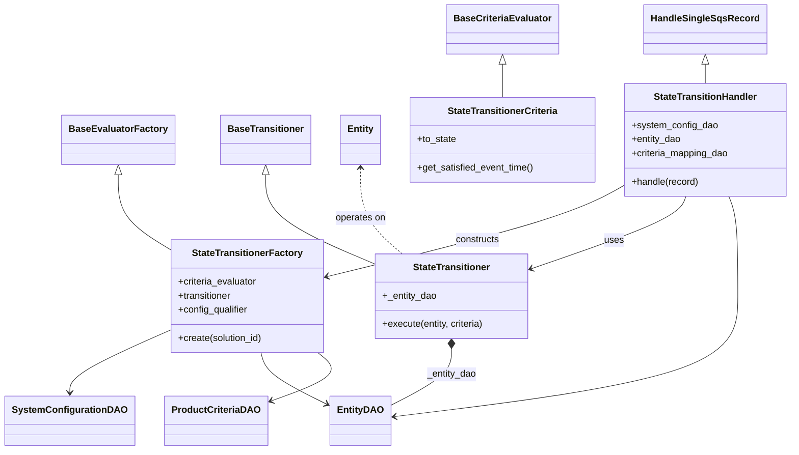
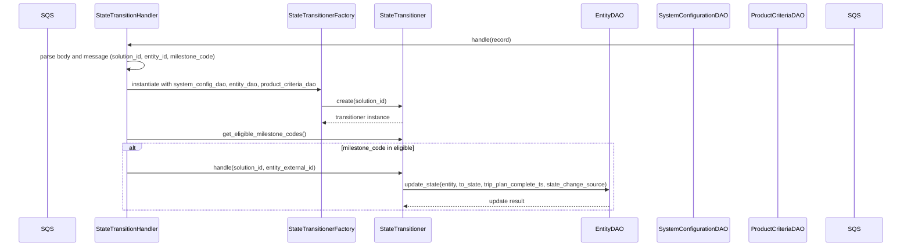

# Diagram: entity_core/entity_service/entity_service/entity/entity/entity_state_engine.py

> Auto-generated by Obscura crawlers

## Diagram 1

### SVG

<svg id="container" width="1321.84375" xmlns="http://www.w3.org/2000/svg" class="classDiagram" height="766" viewBox="0 0 1321.84375 766" role="graphics-document document" aria-roledescription="class"><g><defs><marker id="container_class-aggregationStart" class="marker aggregation class" refX="18" refY="7" markerWidth="190" markerHeight="240" orient="auto"><path d="M 18,7 L9,13 L1,7 L9,1 Z"></path></marker></defs><defs><marker id="container_class-aggregationEnd" class="marker aggregation class" refX="1" refY="7" markerWidth="20" markerHeight="28" orient="auto"><path d="M 18,7 L9,13 L1,7 L9,1 Z"></path></marker></defs><defs><marker id="container_class-extensionStart" class="marker extension class" refX="18" refY="7" markerWidth="190" markerHeight="240" orient="auto"><path d="M 1,7 L18,13 V 1 Z"></path></marker></defs><defs><marker id="container_class-extensionEnd" class="marker extension class" refX="1" refY="7" markerWidth="20" markerHeight="28" orient="auto"><path d="M 1,1 V 13 L18,7 Z"></path></marker></defs><defs><marker id="container_class-compositionStart" class="marker composition class" refX="18" refY="7" markerWidth="190" markerHeight="240" orient="auto"><path d="M 18,7 L9,13 L1,7 L9,1 Z"></path></marker></defs><defs><marker id="container_class-compositionEnd" class="marker composition class" refX="1" refY="7" markerWidth="20" markerHeight="28" orient="auto"><path d="M 18,7 L9,13 L1,7 L9,1 Z"></path></marker></defs><defs><marker id="container_class-dependencyStart" class="marker dependency class" refX="6" refY="7" markerWidth="190" markerHeight="240" orient="auto"><path d="M 5,7 L9,13 L1,7 L9,1 Z"></path></marker></defs><defs><marker id="container_class-dependencyEnd" class="marker dependency class" refX="13" refY="7" markerWidth="20" markerHeight="28" orient="auto"><path d="M 18,7 L9,13 L14,7 L9,1 Z"></path></marker></defs><defs><marker id="container_class-lollipopStart" class="marker lollipop class" refX="13" refY="7" markerWidth="190" markerHeight="240" orient="auto"><circle stroke="black" fill="transparent" cx="7" cy="7" r="6"></circle></marker></defs><defs><marker id="container_class-lollipopEnd" class="marker lollipop class" refX="1" refY="7" markerWidth="190" markerHeight="240" orient="auto"><circle stroke="black" fill="transparent" cx="7" cy="7" r="6"></circle></marker></defs><g class="root"><g class="clusters"></g><g class="edgePaths"><path d="M829.852,109.25L829.852,110.542C829.852,111.833,829.852,114.417,829.852,123.875C829.852,133.333,829.852,149.667,829.852,157.833L829.852,166" id="id_BaseCriteriaEvaluator_StateTransitionerCriteria_1" class="edge-thickness-normal edge-pattern-solid relation" style=";;;" data-edge="true" data-et="edge" data-id="id_BaseCriteriaEvaluator_StateTransitionerCriteria_1" data-points="W3sieCI6ODI5Ljg1MTU2MjUsInkiOjkyfSx7IngiOjgyOS44NTE1NjI1LCJ5IjoxMTd9LHsieCI6ODI5Ljg1MTU2MjUsInkiOjE2Nn1d" marker-start="url(#container_class-extensionStart)"></path><path d="M194.57,297.25L194.57,309.542C194.57,321.833,194.57,346.417,207.75,367.097C220.93,387.778,247.289,404.556,260.469,412.945L273.648,421.334" id="id_BaseEvaluatorFactory_StateTransitionerFactory_2" class="edge-thickness-normal edge-pattern-solid relation" style=";;;" data-edge="true" data-et="edge" data-id="id_BaseEvaluatorFactory_StateTransitionerFactory_2" data-points="W3sieCI6MTk0LjU3MDMxMjUsInkiOjI4MH0seyJ4IjoxOTQuNTcwMzEyNSwieSI6MzcxfSx7IngiOjI3My42NDg0Mzc1LCJ5Ijo0MjEuMzMzNzMyMTQ2ODYzMX1d" marker-start="url(#container_class-extensionStart)"></path><path d="M432.164,297.25L432.164,309.542C432.164,321.833,432.164,346.417,462.376,371.547C492.589,396.678,553.013,422.355,583.225,435.194L613.438,448.033" id="id_BaseTransitioner_StateTransitioner_3" class="edge-thickness-normal edge-pattern-solid relation" style=";;;" data-edge="true" data-et="edge" data-id="id_BaseTransitioner_StateTransitioner_3" data-points="W3sieCI6NDMyLjE2NDA2MjUsInkiOjI4MH0seyJ4Ijo0MzIuMTY0MDYyNSwieSI6MzcxfSx7IngiOjYxMy40Mzc1LCJ5Ijo0NDguMDMyNTAwNDM2ODMzODZ9XQ==" marker-start="url(#container_class-extensionStart)"></path><path d="M1175.457,109.25L1175.457,110.542C1175.457,111.833,1175.457,114.417,1175.457,119.875C1175.457,125.333,1175.457,133.667,1175.457,137.833L1175.457,142" id="id_HandleSingleSqsRecord_StateTransitionHandler_4" class="edge-thickness-normal edge-pattern-solid relation" style=";;;" data-edge="true" data-et="edge" data-id="id_HandleSingleSqsRecord_StateTransitionHandler_4" data-points="W3sieCI6MTE3NS40NTcwMzEyNSwieSI6OTJ9LHsieCI6MTE3NS40NTcwMzEyNSwieSI6MTE3fSx7IngiOjExNzUuNDU3MDMxMjUsInkiOjE0Mn1d" marker-start="url(#container_class-extensionStart)"></path><path d="M745.141,593.25L745.141,600.542C745.141,607.833,745.141,622.417,727.272,638.769C709.404,655.122,673.667,673.244,655.798,682.305L637.93,691.366" id="id_StateTransitioner_EntityDAO_5" class="edge-thickness-normal edge-pattern-solid relation" style=";;;" data-edge="true" data-et="edge" data-id="id_StateTransitioner_EntityDAO_5" data-points="W3sieCI6NzQ1LjE0MDYyNSwieSI6NTc2fSx7IngiOjc0NS4xNDA2MjUsInkiOjYzN30seyJ4Ijo2MzcuOTI5Njg3NSwieSI6NjkxLjM2NjIzMDM3OTYxOTl9XQ==" marker-start="url(#container_class-compositionStart)"></path><path d="M273.648,563.094L246.577,575.411C219.505,587.729,165.362,612.365,138.29,629.849C111.219,647.333,111.219,657.667,111.219,662.833L111.219,668" id="id_StateTransitionerFactory_SystemConfigurationDAO_6" class="edge-thickness-normal edge-pattern-solid relation" style=";;;" data-edge="true" data-et="edge" data-id="id_StateTransitionerFactory_SystemConfigurationDAO_6" data-points="W3sieCI6MjczLjY0ODQzNzUsInkiOjU2My4wOTM3MzI0NjAyNDMyfSx7IngiOjExMS4yMTg3NSwieSI6NjM3fSx7IngiOjExMS4yMTg3NSwieSI6Njc0fV0=" marker-end="url(#container_class-dependencyEnd)"></path><path d="M421.413,600L422.563,606.167C423.712,612.333,426.01,624.667,445.006,639.588C464.001,654.509,499.694,672.018,517.54,680.773L535.387,689.527" id="id_StateTransitionerFactory_EntityDAO_7" class="edge-thickness-normal edge-pattern-solid relation" style=";;;" data-edge="true" data-et="edge" data-id="id_StateTransitionerFactory_EntityDAO_7" data-points="W3sieCI6NDIxLjQxMzQ3NTA5Mzk4NDk3LCJ5Ijo2MDB9LHsieCI6NDI4LjMwODU5Mzc1LCJ5Ijo2Mzd9LHsieCI6NTQwLjc3MzQzNzUsInkiOjY5Mi4xNjk4ODg2NjUxOTUxfV0=" marker-end="url(#container_class-dependencyEnd)"></path><path d="M518.507,600L525.894,606.167C533.28,612.333,548.052,624.667,534.331,638.577C520.609,652.488,478.395,667.975,457.287,675.719L436.18,683.463" id="id_StateTransitionerFactory_ProductCriteriaDAO_8" class="edge-thickness-normal edge-pattern-solid relation" style=";;;" data-edge="true" data-et="edge" data-id="id_StateTransitionerFactory_ProductCriteriaDAO_8" data-points="W3sieCI6NTE4LjUwNzQ2MDA1NjM5MSwieSI6NjAwfSx7IngiOjU2Mi44MjQyMTg3NSwieSI6NjM3fSx7IngiOjQzMC41NDY4NzUsInkiOjY4NS41MjkyODc5ODE4NTk0fV0=" marker-end="url(#container_class-dependencyEnd)"></path><path d="M1037.07,314.965L1020.278,324.304C1003.486,333.643,969.901,352.322,886.926,378.182C803.951,404.042,671.585,437.084,605.403,453.605L539.22,470.126" id="id_StateTransitionHandler_StateTransitionerFactory_9" class="edge-thickness-normal edge-pattern-solid relation" style=";;;" data-edge="true" data-et="edge" data-id="id_StateTransitionHandler_StateTransitionerFactory_9" data-points="W3sieCI6MTAzNy4wNzAzMTI1LCJ5IjozMTQuOTY0ODk3MDkyNDUzNDR9LHsieCI6OTM2LjMxNjQwNjI1LCJ5IjozNzF9LHsieCI6NTMzLjM5ODQzNzUsInkiOjQ3MS41Nzk1NzQwMzEzMDYxNX1d" marker-end="url(#container_class-dependencyEnd)"></path><path d="M1142.122,334L1139.98,340.167C1137.839,346.333,1133.556,358.667,1090.288,379.073C1047.02,399.479,964.767,427.958,923.64,442.197L882.514,456.437" id="id_StateTransitionHandler_StateTransitioner_10" class="edge-thickness-normal edge-pattern-solid relation" style=";;;" data-edge="true" data-et="edge" data-id="id_StateTransitionHandler_StateTransitioner_10" data-points="W3sieCI6MTE0Mi4xMjE1MDQ5MzQyMTA2LCJ5IjozMzR9LHsieCI6MTEyOS4yNzM0Mzc1LCJ5IjozNzF9LHsieCI6ODc2Ljg0Mzc1LCJ5Ijo0NTguMzk5ODQ1NDMxMDY0M31d" marker-end="url(#container_class-dependencyEnd)"></path><path d="M1218.929,334L1221.721,340.167C1224.514,346.333,1230.099,358.667,1232.891,387C1235.684,415.333,1235.684,459.667,1235.684,504C1235.684,548.333,1235.684,592.667,1137.051,626.889C1038.418,661.111,841.151,685.223,742.518,697.279L643.885,709.334" id="id_StateTransitionHandler_EntityDAO_11" class="edge-thickness-normal edge-pattern-solid relation" style=";;;" data-edge="true" data-et="edge" data-id="id_StateTransitionHandler_EntityDAO_11" data-points="W3sieCI6MTIxOC45Mjg4MzU3NjEyNzgyLCJ5IjozMzR9LHsieCI6MTIzNS42ODM1OTM3NSwieSI6MzcxfSx7IngiOjEyMzUuNjgzNTkzNzUsInkiOjUwNH0seyJ4IjoxMjM1LjY4MzU5Mzc1LCJ5Ijo2Mzd9LHsieCI6NjM3LjkyOTY4NzUsInkiOjcxMC4wNjIzODMyODA2NTIzfV0=" marker-end="url(#container_class-dependencyEnd)"></path><path d="M589.352,286L589.352,300.167C589.352,314.333,589.352,342.667,601.26,367C613.169,391.333,636.986,411.667,648.895,421.833L660.804,432" id="id_Entity_StateTransitioner_12" class="edge-thickness-normal edge-pattern-dashed relation" style=";;;" data-edge="true" data-et="edge" data-id="id_Entity_StateTransitioner_12" data-points="W3sieCI6NTg5LjM1MTU2MjUsInkiOjI4MH0seyJ4Ijo1ODkuMzUxNTYyNSwieSI6MzcxfSx7IngiOjY2MC44MDM2ODg5MDk3NzQ1LCJ5Ijo0MzJ9XQ==" marker-start="url(#container_class-dependencyStart)"></path></g><g class="edgeLabels"><g class="edgeLabel"><g class="label" data-id="id_BaseCriteriaEvaluator_StateTransitionerCriteria_1" transform="translate(0, 0)"><foreignObject width="0" height="0">

</foreignObject></g></g><g class="edgeLabel"><g class="label" data-id="id_BaseEvaluatorFactory_StateTransitionerFactory_2" transform="translate(0, 0)"><foreignObject width="0" height="0">

</foreignObject></g></g><g class="edgeLabel"><g class="label" data-id="id_BaseTransitioner_StateTransitioner_3" transform="translate(0, 0)"><foreignObject width="0" height="0">

</foreignObject></g></g><g class="edgeLabel"><g class="label" data-id="id_HandleSingleSqsRecord_StateTransitionHandler_4" transform="translate(0, 0)"><foreignObject width="0" height="0">

</foreignObject></g></g><g class="edgeLabel" transform="translate(745.140625, 637)"><g class="label" data-id="id_StateTransitioner_EntityDAO_5" transform="translate(-42.546875, -12)"><foreignObject width="85.09375" height="24">

_entity_dao

</foreignObject></g></g><g class="edgeLabel"><g class="label" data-id="id_StateTransitionerFactory_SystemConfigurationDAO_6" transform="translate(0, 0)"><foreignObject width="0" height="0">

</foreignObject></g></g><g class="edgeLabel"><g class="label" data-id="id_StateTransitionerFactory_EntityDAO_7" transform="translate(0, 0)"><foreignObject width="0" height="0">

</foreignObject></g></g><g class="edgeLabel"><g class="label" data-id="id_StateTransitionerFactory_ProductCriteriaDAO_8" transform="translate(0, 0)"><foreignObject width="0" height="0">

</foreignObject></g></g><g class="edgeLabel" transform="translate(790.78512, 407.32867)"><g class="label" data-id="id_StateTransitionHandler_StateTransitionerFactory_9" transform="translate(-37.84375, -12)"><foreignObject width="75.6875" height="24">

constructs

</foreignObject></g></g><g class="edgeLabel" transform="translate(1021.56438, 408.29258)"><g class="label" data-id="id_StateTransitionHandler_StateTransitioner_10" transform="translate(-16.4921875, -12)"><foreignObject width="32.984375" height="24">

uses

</foreignObject></g></g><g class="edgeLabel"><g class="label" data-id="id_StateTransitionHandler_EntityDAO_11" transform="translate(0, 0)"><foreignObject width="0" height="0">

</foreignObject></g></g><g class="edgeLabel" transform="translate(589.3515625, 371)"><g class="label" data-id="id_Entity_StateTransitioner_12" transform="translate(-43.2890625, -12)"><foreignObject width="86.578125" height="24">

operates on

</foreignObject></g></g></g><g class="nodes"><g class="node default" id="classId-BaseCriteriaEvaluator-0" transform="translate(829.8515625, 50)"><g class="basic label-container"><path d="M-91.140625 -42 L91.140625 -42 L91.140625 42 L-91.140625 42" stroke="none" stroke-width="0" fill="#ECECFF" style=""></path><path d="M-91.140625 -42 C-27.554520410011804 -42, 36.03158417997639 -42, 91.140625 -42 M-91.140625 -42 C-40.93627301492346 -42, 9.268078970153084 -42, 91.140625 -42 M91.140625 -42 C91.140625 -14.809670344153435, 91.140625 12.38065931169313, 91.140625 42 M91.140625 -42 C91.140625 -21.228536710603255, 91.140625 -0.45707342120650907, 91.140625 42 M91.140625 42 C28.449650913331446 42, -34.24132317333711 42, -91.140625 42 M91.140625 42 C29.86440497316974 42, -31.41181505366052 42, -91.140625 42 M-91.140625 42 C-91.140625 17.64120337331999, -91.140625 -6.717593253360022, -91.140625 -42 M-91.140625 42 C-91.140625 25.03399407171354, -91.140625 8.06798814342708, -91.140625 -42" stroke="#9370DB" stroke-width="1.3" fill="none" stroke-dasharray="0 0" style=""></path></g><g class="annotation-group text" transform="translate(0, -18)"></g><g class="label-group text" transform="translate(-79.140625, -18)"><g class="label" style="font-weight: bolder" transform="translate(0,-12)"><foreignObject width="158.28125" height="24">

BaseCriteriaEvaluator

</foreignObject></g></g><g class="members-group text" transform="translate(-79.140625, 30)"></g><g class="methods-group text" transform="translate(-79.140625, 60)"></g><g class="divider" style=""><path d="M-91.140625 6 C-19.91469317430122 6, 51.31123865139756 6, 91.140625 6 M-91.140625 6 C-46.84068872257123 6, -2.5407524451424592 6, 91.140625 6" stroke="#9370DB" stroke-width="1.3" fill="none" stroke-dasharray="0 0" style=""></path></g><g class="divider" style=""><path d="M-91.140625 24 C-47.92624665698936 24, -4.7118683139787265 24, 91.140625 24 M-91.140625 24 C-43.406000487462684 24, 4.328624025074632 24, 91.140625 24" stroke="#9370DB" stroke-width="1.3" fill="none" stroke-dasharray="0 0" style=""></path></g></g><g class="node default" id="classId-BaseEvaluatorFactory-1" transform="translate(194.5703125, 238)"><g class="basic label-container"><path d="M-90.5625 -42 L90.5625 -42 L90.5625 42 L-90.5625 42" stroke="none" stroke-width="0" fill="#ECECFF" style=""></path><path d="M-90.5625 -42 C-23.6511649476343 -42, 43.2601701047314 -42, 90.5625 -42 M-90.5625 -42 C-20.877598727834695 -42, 48.80730254433061 -42, 90.5625 -42 M90.5625 -42 C90.5625 -24.200054278704506, 90.5625 -6.400108557409013, 90.5625 42 M90.5625 -42 C90.5625 -24.986017838214455, 90.5625 -7.972035676428909, 90.5625 42 M90.5625 42 C25.309758507296564 42, -39.94298298540687 42, -90.5625 42 M90.5625 42 C36.527392906978385 42, -17.50771418604323 42, -90.5625 42 M-90.5625 42 C-90.5625 19.5716690721017, -90.5625 -2.8566618557966024, -90.5625 -42 M-90.5625 42 C-90.5625 8.849883120909823, -90.5625 -24.300233758180354, -90.5625 -42" stroke="#9370DB" stroke-width="1.3" fill="none" stroke-dasharray="0 0" style=""></path></g><g class="annotation-group text" transform="translate(0, -18)"></g><g class="label-group text" transform="translate(-78.5625, -18)"><g class="label" style="font-weight: bolder" transform="translate(0,-12)"><foreignObject width="157.125" height="24">

BaseEvaluatorFactory

</foreignObject></g></g><g class="members-group text" transform="translate(-78.5625, 30)"></g><g class="methods-group text" transform="translate(-78.5625, 60)"></g><g class="divider" style=""><path d="M-90.5625 6 C-23.686587167359647 6, 43.189325665280705 6, 90.5625 6 M-90.5625 6 C-24.050196603417163 6, 42.462106793165674 6, 90.5625 6" stroke="#9370DB" stroke-width="1.3" fill="none" stroke-dasharray="0 0" style=""></path></g><g class="divider" style=""><path d="M-90.5625 24 C-38.28575405827706 24, 13.990991883445886 24, 90.5625 24 M-90.5625 24 C-43.12101377567756 24, 4.320472448644878 24, 90.5625 24" stroke="#9370DB" stroke-width="1.3" fill="none" stroke-dasharray="0 0" style=""></path></g></g><g class="node default" id="classId-BaseTransitioner-2" transform="translate(432.1640625, 238)"><g class="basic label-container"><path d="M-73.90625 -42 L73.90625 -42 L73.90625 42 L-73.90625 42" stroke="none" stroke-width="0" fill="#ECECFF" style=""></path><path d="M-73.90625 -42 C-20.551254809787167 -42, 32.803740380425666 -42, 73.90625 -42 M-73.90625 -42 C-43.08224274573405 -42, -12.258235491468106 -42, 73.90625 -42 M73.90625 -42 C73.90625 -24.896410577755514, 73.90625 -7.792821155511028, 73.90625 42 M73.90625 -42 C73.90625 -17.359863092240648, 73.90625 7.280273815518704, 73.90625 42 M73.90625 42 C24.99828139039677 42, -23.90968721920646 42, -73.90625 42 M73.90625 42 C35.343323851495 42, -3.219602297009999 42, -73.90625 42 M-73.90625 42 C-73.90625 21.08339059850523, -73.90625 0.16678119701045802, -73.90625 -42 M-73.90625 42 C-73.90625 22.380276828798102, -73.90625 2.760553657596205, -73.90625 -42" stroke="#9370DB" stroke-width="1.3" fill="none" stroke-dasharray="0 0" style=""></path></g><g class="annotation-group text" transform="translate(0, -18)"></g><g class="label-group text" transform="translate(-61.90625, -18)"><g class="label" style="font-weight: bolder" transform="translate(0,-12)"><foreignObject width="123.8125" height="24">

BaseTransitioner

</foreignObject></g></g><g class="members-group text" transform="translate(-61.90625, 30)"></g><g class="methods-group text" transform="translate(-61.90625, 60)"></g><g class="divider" style=""><path d="M-73.90625 6 C-17.8810209173256 6, 38.1442081653488 6, 73.90625 6 M-73.90625 6 C-27.75095414115473 6, 18.404341717690542 6, 73.90625 6" stroke="#9370DB" stroke-width="1.3" fill="none" stroke-dasharray="0 0" style=""></path></g><g class="divider" style=""><path d="M-73.90625 24 C-19.704375634234545 24, 34.49749873153091 24, 73.90625 24 M-73.90625 24 C-34.81091089444011 24, 4.284428211119774 24, 73.90625 24" stroke="#9370DB" stroke-width="1.3" fill="none" stroke-dasharray="0 0" style=""></path></g></g><g class="node default" id="classId-HandleSingleSqsRecord-3" transform="translate(1175.45703125, 50)"><g class="basic label-container"><path d="M-99.078125 -42 L99.078125 -42 L99.078125 42 L-99.078125 42" stroke="none" stroke-width="0" fill="#ECECFF" style=""></path><path d="M-99.078125 -42 C-48.79565755709402 -42, 1.4868098858119652 -42, 99.078125 -42 M-99.078125 -42 C-46.291827095244344 -42, 6.494470809511313 -42, 99.078125 -42 M99.078125 -42 C99.078125 -12.117963172021295, 99.078125 17.76407365595741, 99.078125 42 M99.078125 -42 C99.078125 -18.41995610512819, 99.078125 5.160087789743621, 99.078125 42 M99.078125 42 C34.9796583905124 42, -29.118808218975204 42, -99.078125 42 M99.078125 42 C52.24578341326482 42, 5.413441826529635 42, -99.078125 42 M-99.078125 42 C-99.078125 10.12023662367399, -99.078125 -21.75952675265202, -99.078125 -42 M-99.078125 42 C-99.078125 12.637016468899986, -99.078125 -16.725967062200027, -99.078125 -42" stroke="#9370DB" stroke-width="1.3" fill="none" stroke-dasharray="0 0" style=""></path></g><g class="annotation-group text" transform="translate(0, -18)"></g><g class="label-group text" transform="translate(-87.078125, -18)"><g class="label" style="font-weight: bolder" transform="translate(0,-12)"><foreignObject width="174.15625" height="24">

HandleSingleSqsRecord

</foreignObject></g></g><g class="members-group text" transform="translate(-87.078125, 30)"></g><g class="methods-group text" transform="translate(-87.078125, 60)"></g><g class="divider" style=""><path d="M-99.078125 6 C-58.44593897784235 6, -17.813752955684706 6, 99.078125 6 M-99.078125 6 C-29.898699867939882 6, 39.280725264120235 6, 99.078125 6" stroke="#9370DB" stroke-width="1.3" fill="none" stroke-dasharray="0 0" style=""></path></g><g class="divider" style=""><path d="M-99.078125 24 C-34.95412542667664 24, 29.16987414664672 24, 99.078125 24 M-99.078125 24 C-48.151095657390286 24, 2.775933685219428 24, 99.078125 24" stroke="#9370DB" stroke-width="1.3" fill="none" stroke-dasharray="0 0" style=""></path></g></g><g class="node default" id="classId-EntityDAO-4" transform="translate(589.3515625, 716)"><g class="basic label-container"><path d="M-48.578125 -42 L48.578125 -42 L48.578125 42 L-48.578125 42" stroke="none" stroke-width="0" fill="#ECECFF" style=""></path><path d="M-48.578125 -42 C-27.607154795608267 -42, -6.636184591216534 -42, 48.578125 -42 M-48.578125 -42 C-26.279448002866232 -42, -3.980771005732464 -42, 48.578125 -42 M48.578125 -42 C48.578125 -20.91312749536756, 48.578125 0.17374500926487713, 48.578125 42 M48.578125 -42 C48.578125 -15.822912427995892, 48.578125 10.354175144008217, 48.578125 42 M48.578125 42 C21.63813527824001 42, -5.301854443519979 42, -48.578125 42 M48.578125 42 C13.572456137657468 42, -21.433212724685063 42, -48.578125 42 M-48.578125 42 C-48.578125 21.58238103121973, -48.578125 1.1647620624394577, -48.578125 -42 M-48.578125 42 C-48.578125 13.92557185436597, -48.578125 -14.14885629126806, -48.578125 -42" stroke="#9370DB" stroke-width="1.3" fill="none" stroke-dasharray="0 0" style=""></path></g><g class="annotation-group text" transform="translate(0, -18)"></g><g class="label-group text" transform="translate(-36.578125, -18)"><g class="label" style="font-weight: bolder" transform="translate(0,-12)"><foreignObject width="73.15625" height="24">

EntityDAO

</foreignObject></g></g><g class="members-group text" transform="translate(-36.578125, 30)"></g><g class="methods-group text" transform="translate(-36.578125, 60)"></g><g class="divider" style=""><path d="M-48.578125 6 C-11.09091230435616 6, 26.39630039128768 6, 48.578125 6 M-48.578125 6 C-22.809447867509515 6, 2.9592292649809693 6, 48.578125 6" stroke="#9370DB" stroke-width="1.3" fill="none" stroke-dasharray="0 0" style=""></path></g><g class="divider" style=""><path d="M-48.578125 24 C-17.532729601061174 24, 13.512665797877652 24, 48.578125 24 M-48.578125 24 C-18.216024761644125 24, 12.14607547671175 24, 48.578125 24" stroke="#9370DB" stroke-width="1.3" fill="none" stroke-dasharray="0 0" style=""></path></g></g><g class="node default" id="classId-ProductCriteriaDAO-5" transform="translate(347.4921875, 716)"><g class="basic label-container"><path d="M-83.0546875 -42 L83.0546875 -42 L83.0546875 42 L-83.0546875 42" stroke="none" stroke-width="0" fill="#ECECFF" style=""></path><path d="M-83.0546875 -42 C-31.751624313457064 -42, 19.55143887308587 -42, 83.0546875 -42 M-83.0546875 -42 C-43.44509431203623 -42, -3.835501124072465 -42, 83.0546875 -42 M83.0546875 -42 C83.0546875 -23.49253918676248, 83.0546875 -4.9850783735249635, 83.0546875 42 M83.0546875 -42 C83.0546875 -16.90503929750113, 83.0546875 8.18992140499774, 83.0546875 42 M83.0546875 42 C17.839587494581394 42, -47.37551251083721 42, -83.0546875 42 M83.0546875 42 C35.128291309577335 42, -12.79810488084533 42, -83.0546875 42 M-83.0546875 42 C-83.0546875 9.421972168457671, -83.0546875 -23.156055663084658, -83.0546875 -42 M-83.0546875 42 C-83.0546875 18.052664409623713, -83.0546875 -5.8946711807525745, -83.0546875 -42" stroke="#9370DB" stroke-width="1.3" fill="none" stroke-dasharray="0 0" style=""></path></g><g class="annotation-group text" transform="translate(0, -18)"></g><g class="label-group text" transform="translate(-71.0546875, -18)"><g class="label" style="font-weight: bolder" transform="translate(0,-12)"><foreignObject width="142.109375" height="24">

ProductCriteriaDAO

</foreignObject></g></g><g class="members-group text" transform="translate(-71.0546875, 30)"></g><g class="methods-group text" transform="translate(-71.0546875, 60)"></g><g class="divider" style=""><path d="M-83.0546875 6 C-43.654240490246714 6, -4.253793480493428 6, 83.0546875 6 M-83.0546875 6 C-36.19579657660822 6, 10.663094346783566 6, 83.0546875 6" stroke="#9370DB" stroke-width="1.3" fill="none" stroke-dasharray="0 0" style=""></path></g><g class="divider" style=""><path d="M-83.0546875 24 C-42.66963560338389 24, -2.2845837067677763 24, 83.0546875 24 M-83.0546875 24 C-40.20513364093211 24, 2.644420218135778 24, 83.0546875 24" stroke="#9370DB" stroke-width="1.3" fill="none" stroke-dasharray="0 0" style=""></path></g></g><g class="node default" id="classId-SystemConfigurationDAO-6" transform="translate(111.21875, 716)"><g class="basic label-container"><path d="M-103.21875 -42 L103.21875 -42 L103.21875 42 L-103.21875 42" stroke="none" stroke-width="0" fill="#ECECFF" style=""></path><path d="M-103.21875 -42 C-26.90032035869781 -42, 49.41810928260438 -42, 103.21875 -42 M-103.21875 -42 C-27.338077759901978 -42, 48.542594480196044 -42, 103.21875 -42 M103.21875 -42 C103.21875 -16.212824169412762, 103.21875 9.574351661174475, 103.21875 42 M103.21875 -42 C103.21875 -17.36033490387966, 103.21875 7.279330192240678, 103.21875 42 M103.21875 42 C32.8105509153401 42, -37.5976481693198 42, -103.21875 42 M103.21875 42 C50.29651574960548 42, -2.6257185007890342 42, -103.21875 42 M-103.21875 42 C-103.21875 16.169681102494557, -103.21875 -9.660637795010885, -103.21875 -42 M-103.21875 42 C-103.21875 18.038356490821094, -103.21875 -5.9232870183578115, -103.21875 -42" stroke="#9370DB" stroke-width="1.3" fill="none" stroke-dasharray="0 0" style=""></path></g><g class="annotation-group text" transform="translate(0, -18)"></g><g class="label-group text" transform="translate(-91.21875, -18)"><g class="label" style="font-weight: bolder" transform="translate(0,-12)"><foreignObject width="182.4375" height="24">

SystemConfigurationDAO

</foreignObject></g></g><g class="members-group text" transform="translate(-91.21875, 30)"></g><g class="methods-group text" transform="translate(-91.21875, 60)"></g><g class="divider" style=""><path d="M-103.21875 6 C-58.37377587019466 6, -13.528801740389326 6, 103.21875 6 M-103.21875 6 C-48.42825068201731 6, 6.362248635965386 6, 103.21875 6" stroke="#9370DB" stroke-width="1.3" fill="none" stroke-dasharray="0 0" style=""></path></g><g class="divider" style=""><path d="M-103.21875 24 C-61.112226986798404 24, -19.00570397359681 24, 103.21875 24 M-103.21875 24 C-50.162434504180425 24, 2.8938809916391506 24, 103.21875 24" stroke="#9370DB" stroke-width="1.3" fill="none" stroke-dasharray="0 0" style=""></path></g></g><g class="node default" id="classId-Entity-7" transform="translate(589.3515625, 238)"><g class="basic label-container"><path d="M-33.28125 -42 L33.28125 -42 L33.28125 42 L-33.28125 42" stroke="none" stroke-width="0" fill="#ECECFF" style=""></path><path d="M-33.28125 -42 C-12.61689223491572 -42, 8.047465530168559 -42, 33.28125 -42 M-33.28125 -42 C-7.852169602311246 -42, 17.576910795377508 -42, 33.28125 -42 M33.28125 -42 C33.28125 -19.5514793182759, 33.28125 2.897041363448203, 33.28125 42 M33.28125 -42 C33.28125 -14.171405147620174, 33.28125 13.657189704759652, 33.28125 42 M33.28125 42 C16.829676810152517 42, 0.3781036203050334 42, -33.28125 42 M33.28125 42 C17.33105537094616 42, 1.3808607418923202 42, -33.28125 42 M-33.28125 42 C-33.28125 17.473371161229597, -33.28125 -7.053257677540806, -33.28125 -42 M-33.28125 42 C-33.28125 20.333495757672114, -33.28125 -1.333008484655771, -33.28125 -42" stroke="#9370DB" stroke-width="1.3" fill="none" stroke-dasharray="0 0" style=""></path></g><g class="annotation-group text" transform="translate(0, -18)"></g><g class="label-group text" transform="translate(-21.28125, -18)"><g class="label" style="font-weight: bolder" transform="translate(0,-12)"><foreignObject width="42.5625" height="24">

Entity

</foreignObject></g></g><g class="members-group text" transform="translate(-21.28125, 30)"></g><g class="methods-group text" transform="translate(-21.28125, 60)"></g><g class="divider" style=""><path d="M-33.28125 6 C-14.654769592648098 6, 3.9717108147038047 6, 33.28125 6 M-33.28125 6 C-13.400094996954007 6, 6.481060006091987 6, 33.28125 6" stroke="#9370DB" stroke-width="1.3" fill="none" stroke-dasharray="0 0" style=""></path></g><g class="divider" style=""><path d="M-33.28125 24 C-9.851847160852579 24, 13.577555678294843 24, 33.28125 24 M-33.28125 24 C-12.73471212252121 24, 7.811825754957582 24, 33.28125 24" stroke="#9370DB" stroke-width="1.3" fill="none" stroke-dasharray="0 0" style=""></path></g></g><g class="node default" id="classId-StateTransitionerCriteria-8" transform="translate(829.8515625, 238)"><g class="basic label-container"><path d="M-157.21875 -72 L157.21875 -72 L157.21875 72 L-157.21875 72" stroke="none" stroke-width="0" fill="#ECECFF" style=""></path><path d="M-157.21875 -72 C-90.7833485032662 -72, -24.347947006532394 -72, 157.21875 -72 M-157.21875 -72 C-42.2909014027496 -72, 72.6369471945008 -72, 157.21875 -72 M157.21875 -72 C157.21875 -33.31731937954001, 157.21875 5.365361240919981, 157.21875 72 M157.21875 -72 C157.21875 -40.864817438326206, 157.21875 -9.729634876652412, 157.21875 72 M157.21875 72 C82.68226491913873 72, 8.145779838277463 72, -157.21875 72 M157.21875 72 C76.09540547002277 72, -5.027939059954463 72, -157.21875 72 M-157.21875 72 C-157.21875 16.542350834380365, -157.21875 -38.91529833123927, -157.21875 -72 M-157.21875 72 C-157.21875 17.92926426856375, -157.21875 -36.1414714628725, -157.21875 -72" stroke="#9370DB" stroke-width="1.3" fill="none" stroke-dasharray="0 0" style=""></path></g><g class="annotation-group text" transform="translate(0, -48)"></g><g class="label-group text" transform="translate(-90.875, -48)"><g class="label" style="font-weight: bolder" transform="translate(0,-12)"><foreignObject width="181.75" height="24">

StateTransitionerCriteria

</foreignObject></g></g><g class="members-group text" transform="translate(-145.21875, 0)"><g class="label" style="" transform="translate(0,-12)"><foreignObject width="66.890625" height="24">

+to_state

</foreignObject></g></g><g class="methods-group text" transform="translate(-145.21875, 48)"><g class="label" style="" transform="translate(0,-12)"><foreignObject width="199.5625" height="24">

+get_satisfied_event_time()

</foreignObject></g></g><g class="divider" style=""><path d="M-157.21875 -24 C-54.37507216765417 -24, 48.468605664691665 -24, 157.21875 -24 M-157.21875 -24 C-81.44012029304648 -24, -5.6614905860929525 -24, 157.21875 -24" stroke="#9370DB" stroke-width="1.3" fill="none" stroke-dasharray="0 0" style=""></path></g><g class="divider" style=""><path d="M-157.21875 24 C-93.54095753141387 24, -29.863165062827733 24, 157.21875 24 M-157.21875 24 C-79.25623112021832 24, -1.2937122404366335 24, 157.21875 24" stroke="#9370DB" stroke-width="1.3" fill="none" stroke-dasharray="0 0" style=""></path></g></g><g class="node default" id="classId-StateTransitionerFactory-9" transform="translate(403.5234375, 504)"><g class="basic label-container"><path d="M-129.875 -96 L129.875 -96 L129.875 96 L-129.875 96" stroke="none" stroke-width="0" fill="#ECECFF" style=""></path><path d="M-129.875 -96 C-34.57373604439711 -96, 60.72752791120578 -96, 129.875 -96 M-129.875 -96 C-61.5847335906802 -96, 6.705532818639597 -96, 129.875 -96 M129.875 -96 C129.875 -32.299244845607475, 129.875 31.40151030878505, 129.875 96 M129.875 -96 C129.875 -51.30223842817, 129.875 -6.60447685634, 129.875 96 M129.875 96 C71.15508835894215 96, 12.435176717884318 96, -129.875 96 M129.875 96 C45.57703174304912 96, -38.72093651390176 96, -129.875 96 M-129.875 96 C-129.875 32.261080112168926, -129.875 -31.477839775662147, -129.875 -96 M-129.875 96 C-129.875 32.49646675724041, -129.875 -31.007066485519175, -129.875 -96" stroke="#9370DB" stroke-width="1.3" fill="none" stroke-dasharray="0 0" style=""></path></g><g class="annotation-group text" transform="translate(0, -72)"></g><g class="label-group text" transform="translate(-90.296875, -72)"><g class="label" style="font-weight: bolder" transform="translate(0,-12)"><foreignObject width="180.59375" height="24">

StateTransitionerFactory

</foreignObject></g></g><g class="members-group text" transform="translate(-117.875, -24)"><g class="label" style="" transform="translate(0,-12)"><foreignObject width="136.546875" height="24">

+criteria_evaluator

</foreignObject></g><g class="label" style="" transform="translate(0,12)"><foreignObject width="93.265625" height="24">

+transitioner

</foreignObject></g><g class="label" style="" transform="translate(0,36)"><foreignObject width="120.34375" height="24">

+config_qualifier

</foreignObject></g></g><g class="methods-group text" transform="translate(-117.875, 72)"><g class="label" style="" transform="translate(0,-12)"><foreignObject width="145.453125" height="24">

+create(solution_id)

</foreignObject></g></g><g class="divider" style=""><path d="M-129.875 -48 C-51.2426342670217 -48, 27.3897314659566 -48, 129.875 -48 M-129.875 -48 C-48.13287171539173 -48, 33.60925656921654 -48, 129.875 -48" stroke="#9370DB" stroke-width="1.3" fill="none" stroke-dasharray="0 0" style=""></path></g><g class="divider" style=""><path d="M-129.875 48 C-43.10769056334934 48, 43.659618873301326 48, 129.875 48 M-129.875 48 C-66.34131748152342 48, -2.8076349630468513 48, 129.875 48" stroke="#9370DB" stroke-width="1.3" fill="none" stroke-dasharray="0 0" style=""></path></g></g><g class="node default" id="classId-StateTransitioner-10" transform="translate(745.140625, 504)"><g class="basic label-container"><path d="M-131.703125 -72 L131.703125 -72 L131.703125 72 L-131.703125 72" stroke="none" stroke-width="0" fill="#ECECFF" style=""></path><path d="M-131.703125 -72 C-41.688732883492065 -72, 48.32565923301587 -72, 131.703125 -72 M-131.703125 -72 C-32.51951398488434 -72, 66.66409703023132 -72, 131.703125 -72 M131.703125 -72 C131.703125 -24.286014127421353, 131.703125 23.427971745157294, 131.703125 72 M131.703125 -72 C131.703125 -39.397289009710335, 131.703125 -6.794578019420669, 131.703125 72 M131.703125 72 C37.028856706213816 72, -57.64541158757237 72, -131.703125 72 M131.703125 72 C77.53035770463876 72, 23.35759040927752 72, -131.703125 72 M-131.703125 72 C-131.703125 41.613740372684674, -131.703125 11.227480745369341, -131.703125 -72 M-131.703125 72 C-131.703125 39.453714582187274, -131.703125 6.907429164374548, -131.703125 -72" stroke="#9370DB" stroke-width="1.3" fill="none" stroke-dasharray="0 0" style=""></path></g><g class="annotation-group text" transform="translate(0, -48)"></g><g class="label-group text" transform="translate(-63.703125, -48)"><g class="label" style="font-weight: bolder" transform="translate(0,-12)"><foreignObject width="127.40625" height="24">

StateTransitioner

</foreignObject></g></g><g class="members-group text" transform="translate(-119.703125, 0)"><g class="label" style="" transform="translate(0,-12)"><foreignObject width="91.796875" height="24">

+_entity_dao

</foreignObject></g></g><g class="methods-group text" transform="translate(-119.703125, 48)"><g class="label" style="" transform="translate(0,-12)"><foreignObject width="175.703125" height="24">

+execute(entity, criteria)

</foreignObject></g></g><g class="divider" style=""><path d="M-131.703125 -24 C-61.44577098398679 -24, 8.81158303202642 -24, 131.703125 -24 M-131.703125 -24 C-58.94974961824258 -24, 13.803625763514844 -24, 131.703125 -24" stroke="#9370DB" stroke-width="1.3" fill="none" stroke-dasharray="0 0" style=""></path></g><g class="divider" style=""><path d="M-131.703125 24 C-61.99175400241823 24, 7.719616995163534 24, 131.703125 24 M-131.703125 24 C-69.7834655210805 24, -7.863806042160988 24, 131.703125 24" stroke="#9370DB" stroke-width="1.3" fill="none" stroke-dasharray="0 0" style=""></path></g></g><g class="node default" id="classId-StateTransitionHandler-11" transform="translate(1175.45703125, 238)"><g class="basic label-container"><path d="M-138.38671875 -96 L138.38671875 -96 L138.38671875 96 L-138.38671875 96" stroke="none" stroke-width="0" fill="#ECECFF" style=""></path><path d="M-138.38671875 -96 C-59.029486855529015 -96, 20.32774503894197 -96, 138.38671875 -96 M-138.38671875 -96 C-57.39519676261821 -96, 23.596325224763575 -96, 138.38671875 -96 M138.38671875 -96 C138.38671875 -57.22725605057655, 138.38671875 -18.4545121011531, 138.38671875 96 M138.38671875 -96 C138.38671875 -21.22924928238116, 138.38671875 53.54150143523768, 138.38671875 96 M138.38671875 96 C61.2852263818816 96, -15.8162659862368 96, -138.38671875 96 M138.38671875 96 C82.32214502983831 96, 26.25757130967662 96, -138.38671875 96 M-138.38671875 96 C-138.38671875 32.58946962060941, -138.38671875 -30.821060758781186, -138.38671875 -96 M-138.38671875 96 C-138.38671875 20.583559875341223, -138.38671875 -54.832880249317554, -138.38671875 -96" stroke="#9370DB" stroke-width="1.3" fill="none" stroke-dasharray="0 0" style=""></path></g><g class="annotation-group text" transform="translate(0, -72)"></g><g class="label-group text" transform="translate(-85.1640625, -72)"><g class="label" style="font-weight: bolder" transform="translate(0,-12)"><foreignObject width="170.328125" height="24">

StateTransitionHandler

</foreignObject></g></g><g class="members-group text" transform="translate(-126.38671875, -24)"><g class="label" style="" transform="translate(0,-12)"><foreignObject width="145.640625" height="24">

+system_config_dao

</foreignObject></g><g class="label" style="" transform="translate(0,12)"><foreignObject width="85.078125" height="24">

+entity_dao

</foreignObject></g><g class="label" style="" transform="translate(0,36)"><foreignObject width="167.609375" height="24">

+criteria_mapping_dao

</foreignObject></g></g><g class="methods-group text" transform="translate(-126.38671875, 72)"><g class="label" style="" transform="translate(0,-12)"><foreignObject width="115.0625" height="24">

+handle(record)

</foreignObject></g></g><g class="divider" style=""><path d="M-138.38671875 -48 C-63.462823213156 -48, 11.461072323688 -48, 138.38671875 -48 M-138.38671875 -48 C-55.772769299017185 -48, 26.84118015196563 -48, 138.38671875 -48" stroke="#9370DB" stroke-width="1.3" fill="none" stroke-dasharray="0 0" style=""></path></g><g class="divider" style=""><path d="M-138.38671875 48 C-71.47887713058915 48, -4.571035511178309 48, 138.38671875 48 M-138.38671875 48 C-31.32836634868643 48, 75.72998605262714 48, 138.38671875 48" stroke="#9370DB" stroke-width="1.3" fill="none" stroke-dasharray="0 0" style=""></path></g></g></g></g></g></svg>

## Diagram 2

### SVG

<svg id="container" width="2537" xmlns="http://www.w3.org/2000/svg" height="688" viewBox="-50 -10 2537 688" role="graphics-document document" aria-roledescription="sequence"><g><rect x="2287" y="602" fill="#eaeaea" stroke="#666" width="150" height="65" name="SQS" rx="3" ry="3" class="actor actor-bottom"></rect><text x="2362" y="634.5" dominant-baseline="central" alignment-baseline="central" class="actor actor-box" style="text-anchor: middle; font-size: 16px; font-weight: 400;"><tspan x="2362" dy="0">SQS</tspan></text></g><g><rect x="2077" y="602" fill="#eaeaea" stroke="#666" width="160" height="65" name="ProductCriteriaDAO" rx="3" ry="3" class="actor actor-bottom"></rect><text x="2157" y="634.5" dominant-baseline="central" alignment-baseline="central" class="actor actor-box" style="text-anchor: middle; font-size: 16px; font-weight: 400;"><tspan x="2157" dy="0">ProductCriteriaDAO</tspan></text></g><g><rect x="1828" y="602" fill="#eaeaea" stroke="#666" width="199" height="65" name="SystemConfigDAO" rx="3" ry="3" class="actor actor-bottom"></rect><text x="1927.5" y="634.5" dominant-baseline="central" alignment-baseline="central" class="actor actor-box" style="text-anchor: middle; font-size: 16px; font-weight: 400;"><tspan x="1927.5" dy="0">SystemConfigurationDAO</tspan></text></g><g><rect x="1628" y="602" fill="#eaeaea" stroke="#666" width="150" height="65" name="EntityDAO" rx="3" ry="3" class="actor actor-bottom"></rect><text x="1703" y="634.5" dominant-baseline="central" alignment-baseline="central" class="actor actor-box" style="text-anchor: middle; font-size: 16px; font-weight: 400;"><tspan x="1703" dy="0">EntityDAO</tspan></text></g><g><rect x="1014" y="602" fill="#eaeaea" stroke="#666" width="150" height="65" name="Transitioner" rx="3" ry="3" class="actor actor-bottom"></rect><text x="1089" y="634.5" dominant-baseline="central" alignment-baseline="central" class="actor actor-box" style="text-anchor: middle; font-size: 16px; font-weight: 400;"><tspan x="1089" dy="0">StateTransitioner</tspan></text></g><g><rect x="767" y="602" fill="#eaeaea" stroke="#666" width="197" height="65" name="Factory" rx="3" ry="3" class="actor actor-bottom"></rect><text x="865.5" y="634.5" dominant-baseline="central" alignment-baseline="central" class="actor actor-box" style="text-anchor: middle; font-size: 16px; font-weight: 400;"><tspan x="865.5" dy="0">StateTransitionerFactory</tspan></text></g><g><rect x="200" y="602" fill="#eaeaea" stroke="#666" width="189" height="65" name="Handler" rx="3" ry="3" class="actor actor-bottom"></rect><text x="294.5" y="634.5" dominant-baseline="central" alignment-baseline="central" class="actor actor-box" style="text-anchor: middle; font-size: 16px; font-weight: 400;"><tspan x="294.5" dy="0">StateTransitionHandler</tspan></text></g><g><rect x="0" y="602" fill="#eaeaea" stroke="#666" width="150" height="65" name="SQS_Record" rx="3" ry="3" class="actor actor-bottom"></rect><text x="75" y="634.5" dominant-baseline="central" alignment-baseline="central" class="actor actor-box" style="text-anchor: middle; font-size: 16px; font-weight: 400;"><tspan x="75" dy="0">SQS</tspan></text></g><g><line id="actor7" x1="2362" y1="65" x2="2362" y2="602" class="actor-line 200" stroke-width="0.5px" stroke="#999" name="SQS"></line><g id="root-7"><rect x="2287" y="0" fill="#eaeaea" stroke="#666" width="150" height="65" name="SQS" rx="3" ry="3" class="actor actor-top"></rect><text x="2362" y="32.5" dominant-baseline="central" alignment-baseline="central" class="actor actor-box" style="text-anchor: middle; font-size: 16px; font-weight: 400;"><tspan x="2362" dy="0">SQS</tspan></text></g></g><g><line id="actor6" x1="2157" y1="65" x2="2157" y2="602" class="actor-line 200" stroke-width="0.5px" stroke="#999" name="ProductCriteriaDAO"></line><g id="root-6"><rect x="2077" y="0" fill="#eaeaea" stroke="#666" width="160" height="65" name="ProductCriteriaDAO" rx="3" ry="3" class="actor actor-top"></rect><text x="2157" y="32.5" dominant-baseline="central" alignment-baseline="central" class="actor actor-box" style="text-anchor: middle; font-size: 16px; font-weight: 400;"><tspan x="2157" dy="0">ProductCriteriaDAO</tspan></text></g></g><g><line id="actor5" x1="1927.5" y1="65" x2="1927.5" y2="602" class="actor-line 200" stroke-width="0.5px" stroke="#999" name="SystemConfigDAO"></line><g id="root-5"><rect x="1828" y="0" fill="#eaeaea" stroke="#666" width="199" height="65" name="SystemConfigDAO" rx="3" ry="3" class="actor actor-top"></rect><text x="1927.5" y="32.5" dominant-baseline="central" alignment-baseline="central" class="actor actor-box" style="text-anchor: middle; font-size: 16px; font-weight: 400;"><tspan x="1927.5" dy="0">SystemConfigurationDAO</tspan></text></g></g><g><line id="actor4" x1="1703" y1="65" x2="1703" y2="602" class="actor-line 200" stroke-width="0.5px" stroke="#999" name="EntityDAO"></line><g id="root-4"><rect x="1628" y="0" fill="#eaeaea" stroke="#666" width="150" height="65" name="EntityDAO" rx="3" ry="3" class="actor actor-top"></rect><text x="1703" y="32.5" dominant-baseline="central" alignment-baseline="central" class="actor actor-box" style="text-anchor: middle; font-size: 16px; font-weight: 400;"><tspan x="1703" dy="0">EntityDAO</tspan></text></g></g><g><line id="actor3" x1="1089" y1="65" x2="1089" y2="602" class="actor-line 200" stroke-width="0.5px" stroke="#999" name="Transitioner"></line><g id="root-3"><rect x="1014" y="0" fill="#eaeaea" stroke="#666" width="150" height="65" name="Transitioner" rx="3" ry="3" class="actor actor-top"></rect><text x="1089" y="32.5" dominant-baseline="central" alignment-baseline="central" class="actor actor-box" style="text-anchor: middle; font-size: 16px; font-weight: 400;"><tspan x="1089" dy="0">StateTransitioner</tspan></text></g></g><g><line id="actor2" x1="865.5" y1="65" x2="865.5" y2="602" class="actor-line 200" stroke-width="0.5px" stroke="#999" name="Factory"></line><g id="root-2"><rect x="767" y="0" fill="#eaeaea" stroke="#666" width="197" height="65" name="Factory" rx="3" ry="3" class="actor actor-top"></rect><text x="865.5" y="32.5" dominant-baseline="central" alignment-baseline="central" class="actor actor-box" style="text-anchor: middle; font-size: 16px; font-weight: 400;"><tspan x="865.5" dy="0">StateTransitionerFactory</tspan></text></g></g><g><line id="actor1" x1="294.5" y1="65" x2="294.5" y2="602" class="actor-line 200" stroke-width="0.5px" stroke="#999" name="Handler"></line><g id="root-1"><rect x="200" y="0" fill="#eaeaea" stroke="#666" width="189" height="65" name="Handler" rx="3" ry="3" class="actor actor-top"></rect><text x="294.5" y="32.5" dominant-baseline="central" alignment-baseline="central" class="actor actor-box" style="text-anchor: middle; font-size: 16px; font-weight: 400;"><tspan x="294.5" dy="0">StateTransitionHandler</tspan></text></g></g><g><line id="actor0" x1="75" y1="65" x2="75" y2="602" class="actor-line 200" stroke-width="0.5px" stroke="#999" name="SQS_Record"></line><g id="root-0"><rect x="0" y="0" fill="#eaeaea" stroke="#666" width="150" height="65" name="SQS_Record" rx="3" ry="3" class="actor actor-top"></rect><text x="75" y="32.5" dominant-baseline="central" alignment-baseline="central" class="actor actor-box" style="text-anchor: middle; font-size: 16px; font-weight: 400;"><tspan x="75" dy="0">SQS</tspan></text></g></g><g></g><defs><symbol id="computer" width="24" height="24"><path transform="scale(.5)" d="M2 2v13h20v-13h-20zm18 11h-16v-9h16v9zm-10.228 6l.466-1h3.524l.467 1h-4.457zm14.228 3h-24l2-6h2.104l-1.33 4h18.45l-1.297-4h2.073l2 6zm-5-10h-14v-7h14v7z"></path></symbol></defs><defs><symbol id="database" fill-rule="evenodd" clip-rule="evenodd"><path transform="scale(.5)" d="M12.258.001l.256.004.255.005.253.008.251.01.249.012.247.015.246.016.242.019.241.02.239.023.236.024.233.027.231.028.229.031.225.032.223.034.22.036.217.038.214.04.211.041.208.043.205.045.201.046.198.048.194.05.191.051.187.053.183.054.18.056.175.057.172.059.168.06.163.061.16.063.155.064.15.066.074.033.073.033.071.034.07.034.069.035.068.035.067.035.066.035.064.036.064.036.062.036.06.036.06.037.058.037.058.037.055.038.055.038.053.038.052.038.051.039.05.039.048.039.047.039.045.04.044.04.043.04.041.04.04.041.039.041.037.041.036.041.034.041.033.042.032.042.03.042.029.042.027.042.026.043.024.043.023.043.021.043.02.043.018.044.017.043.015.044.013.044.012.044.011.045.009.044.007.045.006.045.004.045.002.045.001.045v17l-.001.045-.002.045-.004.045-.006.045-.007.045-.009.044-.011.045-.012.044-.013.044-.015.044-.017.043-.018.044-.02.043-.021.043-.023.043-.024.043-.026.043-.027.042-.029.042-.03.042-.032.042-.033.042-.034.041-.036.041-.037.041-.039.041-.04.041-.041.04-.043.04-.044.04-.045.04-.047.039-.048.039-.05.039-.051.039-.052.038-.053.038-.055.038-.055.038-.058.037-.058.037-.06.037-.06.036-.062.036-.064.036-.064.036-.066.035-.067.035-.068.035-.069.035-.07.034-.071.034-.073.033-.074.033-.15.066-.155.064-.16.063-.163.061-.168.06-.172.059-.175.057-.18.056-.183.054-.187.053-.191.051-.194.05-.198.048-.201.046-.205.045-.208.043-.211.041-.214.04-.217.038-.22.036-.223.034-.225.032-.229.031-.231.028-.233.027-.236.024-.239.023-.241.02-.242.019-.246.016-.247.015-.249.012-.251.01-.253.008-.255.005-.256.004-.258.001-.258-.001-.256-.004-.255-.005-.253-.008-.251-.01-.249-.012-.247-.015-.245-.016-.243-.019-.241-.02-.238-.023-.236-.024-.234-.027-.231-.028-.228-.031-.226-.032-.223-.034-.22-.036-.217-.038-.214-.04-.211-.041-.208-.043-.204-.045-.201-.046-.198-.048-.195-.05-.19-.051-.187-.053-.184-.054-.179-.056-.176-.057-.172-.059-.167-.06-.164-.061-.159-.063-.155-.064-.151-.066-.074-.033-.072-.033-.072-.034-.07-.034-.069-.035-.068-.035-.067-.035-.066-.035-.064-.036-.063-.036-.062-.036-.061-.036-.06-.037-.058-.037-.057-.037-.056-.038-.055-.038-.053-.038-.052-.038-.051-.039-.049-.039-.049-.039-.046-.039-.046-.04-.044-.04-.043-.04-.041-.04-.04-.041-.039-.041-.037-.041-.036-.041-.034-.041-.033-.042-.032-.042-.03-.042-.029-.042-.027-.042-.026-.043-.024-.043-.023-.043-.021-.043-.02-.043-.018-.044-.017-.043-.015-.044-.013-.044-.012-.044-.011-.045-.009-.044-.007-.045-.006-.045-.004-.045-.002-.045-.001-.045v-17l.001-.045.002-.045.004-.045.006-.045.007-.045.009-.044.011-.045.012-.044.013-.044.015-.044.017-.043.018-.044.02-.043.021-.043.023-.043.024-.043.026-.043.027-.042.029-.042.03-.042.032-.042.033-.042.034-.041.036-.041.037-.041.039-.041.04-.041.041-.04.043-.04.044-.04.046-.04.046-.039.049-.039.049-.039.051-.039.052-.038.053-.038.055-.038.056-.038.057-.037.058-.037.06-.037.061-.036.062-.036.063-.036.064-.036.066-.035.067-.035.068-.035.069-.035.07-.034.072-.034.072-.033.074-.033.151-.066.155-.064.159-.063.164-.061.167-.06.172-.059.176-.057.179-.056.184-.054.187-.053.19-.051.195-.05.198-.048.201-.046.204-.045.208-.043.211-.041.214-.04.217-.038.22-.036.223-.034.226-.032.228-.031.231-.028.234-.027.236-.024.238-.023.241-.02.243-.019.245-.016.247-.015.249-.012.251-.01.253-.008.255-.005.256-.004.258-.001.258.001zm-9.258 20.499v.01l.001.021.003.021.004.022.005.021.006.022.007.022.009.023.01.022.011.023.012.023.013.023.015.023.016.024.017.023.018.024.019.024.021.024.022.025.023.024.024.025.052.049.056.05.061.051.066.051.07.051.075.051.079.052.084.052.088.052.092.052.097.052.102.051.105.052.11.052.114.051.119.051.123.051.127.05.131.05.135.05.139.048.144.049.147.047.152.047.155.047.16.045.163.045.167.043.171.043.176.041.178.041.183.039.187.039.19.037.194.035.197.035.202.033.204.031.209.03.212.029.216.027.219.025.222.024.226.021.23.02.233.018.236.016.24.015.243.012.246.01.249.008.253.005.256.004.259.001.26-.001.257-.004.254-.005.25-.008.247-.011.244-.012.241-.014.237-.016.233-.018.231-.021.226-.021.224-.024.22-.026.216-.027.212-.028.21-.031.205-.031.202-.034.198-.034.194-.036.191-.037.187-.039.183-.04.179-.04.175-.042.172-.043.168-.044.163-.045.16-.046.155-.046.152-.047.148-.048.143-.049.139-.049.136-.05.131-.05.126-.05.123-.051.118-.052.114-.051.11-.052.106-.052.101-.052.096-.052.092-.052.088-.053.083-.051.079-.052.074-.052.07-.051.065-.051.06-.051.056-.05.051-.05.023-.024.023-.025.021-.024.02-.024.019-.024.018-.024.017-.024.015-.023.014-.024.013-.023.012-.023.01-.023.01-.022.008-.022.006-.022.006-.022.004-.022.004-.021.001-.021.001-.021v-4.127l-.077.055-.08.053-.083.054-.085.053-.087.052-.09.052-.093.051-.095.05-.097.05-.1.049-.102.049-.105.048-.106.047-.109.047-.111.046-.114.045-.115.045-.118.044-.12.043-.122.042-.124.042-.126.041-.128.04-.13.04-.132.038-.134.038-.135.037-.138.037-.139.035-.142.035-.143.034-.144.033-.147.032-.148.031-.15.03-.151.03-.153.029-.154.027-.156.027-.158.026-.159.025-.161.024-.162.023-.163.022-.165.021-.166.02-.167.019-.169.018-.169.017-.171.016-.173.015-.173.014-.175.013-.175.012-.177.011-.178.01-.179.008-.179.008-.181.006-.182.005-.182.004-.184.003-.184.002h-.37l-.184-.002-.184-.003-.182-.004-.182-.005-.181-.006-.179-.008-.179-.008-.178-.01-.176-.011-.176-.012-.175-.013-.173-.014-.172-.015-.171-.016-.17-.017-.169-.018-.167-.019-.166-.02-.165-.021-.163-.022-.162-.023-.161-.024-.159-.025-.157-.026-.156-.027-.155-.027-.153-.029-.151-.03-.15-.03-.148-.031-.146-.032-.145-.033-.143-.034-.141-.035-.14-.035-.137-.037-.136-.037-.134-.038-.132-.038-.13-.04-.128-.04-.126-.041-.124-.042-.122-.042-.12-.044-.117-.043-.116-.045-.113-.045-.112-.046-.109-.047-.106-.047-.105-.048-.102-.049-.1-.049-.097-.05-.095-.05-.093-.052-.09-.051-.087-.052-.085-.053-.083-.054-.08-.054-.077-.054v4.127zm0-5.654v.011l.001.021.003.021.004.021.005.022.006.022.007.022.009.022.01.022.011.023.012.023.013.023.015.024.016.023.017.024.018.024.019.024.021.024.022.024.023.025.024.024.052.05.056.05.061.05.066.051.07.051.075.052.079.051.084.052.088.052.092.052.097.052.102.052.105.052.11.051.114.051.119.052.123.05.127.051.131.05.135.049.139.049.144.048.147.048.152.047.155.046.16.045.163.045.167.044.171.042.176.042.178.04.183.04.187.038.19.037.194.036.197.034.202.033.204.032.209.03.212.028.216.027.219.025.222.024.226.022.23.02.233.018.236.016.24.014.243.012.246.01.249.008.253.006.256.003.259.001.26-.001.257-.003.254-.006.25-.008.247-.01.244-.012.241-.015.237-.016.233-.018.231-.02.226-.022.224-.024.22-.025.216-.027.212-.029.21-.03.205-.032.202-.033.198-.035.194-.036.191-.037.187-.039.183-.039.179-.041.175-.042.172-.043.168-.044.163-.045.16-.045.155-.047.152-.047.148-.048.143-.048.139-.05.136-.049.131-.05.126-.051.123-.051.118-.051.114-.052.11-.052.106-.052.101-.052.096-.052.092-.052.088-.052.083-.052.079-.052.074-.051.07-.052.065-.051.06-.05.056-.051.051-.049.023-.025.023-.024.021-.025.02-.024.019-.024.018-.024.017-.024.015-.023.014-.023.013-.024.012-.022.01-.023.01-.023.008-.022.006-.022.006-.022.004-.021.004-.022.001-.021.001-.021v-4.139l-.077.054-.08.054-.083.054-.085.052-.087.053-.09.051-.093.051-.095.051-.097.05-.1.049-.102.049-.105.048-.106.047-.109.047-.111.046-.114.045-.115.044-.118.044-.12.044-.122.042-.124.042-.126.041-.128.04-.13.039-.132.039-.134.038-.135.037-.138.036-.139.036-.142.035-.143.033-.144.033-.147.033-.148.031-.15.03-.151.03-.153.028-.154.028-.156.027-.158.026-.159.025-.161.024-.162.023-.163.022-.165.021-.166.02-.167.019-.169.018-.169.017-.171.016-.173.015-.173.014-.175.013-.175.012-.177.011-.178.009-.179.009-.179.007-.181.007-.182.005-.182.004-.184.003-.184.002h-.37l-.184-.002-.184-.003-.182-.004-.182-.005-.181-.007-.179-.007-.179-.009-.178-.009-.176-.011-.176-.012-.175-.013-.173-.014-.172-.015-.171-.016-.17-.017-.169-.018-.167-.019-.166-.02-.165-.021-.163-.022-.162-.023-.161-.024-.159-.025-.157-.026-.156-.027-.155-.028-.153-.028-.151-.03-.15-.03-.148-.031-.146-.033-.145-.033-.143-.033-.141-.035-.14-.036-.137-.036-.136-.037-.134-.038-.132-.039-.13-.039-.128-.04-.126-.041-.124-.042-.122-.043-.12-.043-.117-.044-.116-.044-.113-.046-.112-.046-.109-.046-.106-.047-.105-.048-.102-.049-.1-.049-.097-.05-.095-.051-.093-.051-.09-.051-.087-.053-.085-.052-.083-.054-.08-.054-.077-.054v4.139zm0-5.666v.011l.001.02.003.022.004.021.005.022.006.021.007.022.009.023.01.022.011.023.012.023.013.023.015.023.016.024.017.024.018.023.019.024.021.025.022.024.023.024.024.025.052.05.056.05.061.05.066.051.07.051.075.052.079.051.084.052.088.052.092.052.097.052.102.052.105.051.11.052.114.051.119.051.123.051.127.05.131.05.135.05.139.049.144.048.147.048.152.047.155.046.16.045.163.045.167.043.171.043.176.042.178.04.183.04.187.038.19.037.194.036.197.034.202.033.204.032.209.03.212.028.216.027.219.025.222.024.226.021.23.02.233.018.236.017.24.014.243.012.246.01.249.008.253.006.256.003.259.001.26-.001.257-.003.254-.006.25-.008.247-.01.244-.013.241-.014.237-.016.233-.018.231-.02.226-.022.224-.024.22-.025.216-.027.212-.029.21-.03.205-.032.202-.033.198-.035.194-.036.191-.037.187-.039.183-.039.179-.041.175-.042.172-.043.168-.044.163-.045.16-.045.155-.047.152-.047.148-.048.143-.049.139-.049.136-.049.131-.051.126-.05.123-.051.118-.052.114-.051.11-.052.106-.052.101-.052.096-.052.092-.052.088-.052.083-.052.079-.052.074-.052.07-.051.065-.051.06-.051.056-.05.051-.049.023-.025.023-.025.021-.024.02-.024.019-.024.018-.024.017-.024.015-.023.014-.024.013-.023.012-.023.01-.022.01-.023.008-.022.006-.022.006-.022.004-.022.004-.021.001-.021.001-.021v-4.153l-.077.054-.08.054-.083.053-.085.053-.087.053-.09.051-.093.051-.095.051-.097.05-.1.049-.102.048-.105.048-.106.048-.109.046-.111.046-.114.046-.115.044-.118.044-.12.043-.122.043-.124.042-.126.041-.128.04-.13.039-.132.039-.134.038-.135.037-.138.036-.139.036-.142.034-.143.034-.144.033-.147.032-.148.032-.15.03-.151.03-.153.028-.154.028-.156.027-.158.026-.159.024-.161.024-.162.023-.163.023-.165.021-.166.02-.167.019-.169.018-.169.017-.171.016-.173.015-.173.014-.175.013-.175.012-.177.01-.178.01-.179.009-.179.007-.181.006-.182.006-.182.004-.184.003-.184.001-.185.001-.185-.001-.184-.001-.184-.003-.182-.004-.182-.006-.181-.006-.179-.007-.179-.009-.178-.01-.176-.01-.176-.012-.175-.013-.173-.014-.172-.015-.171-.016-.17-.017-.169-.018-.167-.019-.166-.02-.165-.021-.163-.023-.162-.023-.161-.024-.159-.024-.157-.026-.156-.027-.155-.028-.153-.028-.151-.03-.15-.03-.148-.032-.146-.032-.145-.033-.143-.034-.141-.034-.14-.036-.137-.036-.136-.037-.134-.038-.132-.039-.13-.039-.128-.041-.126-.041-.124-.041-.122-.043-.12-.043-.117-.044-.116-.044-.113-.046-.112-.046-.109-.046-.106-.048-.105-.048-.102-.048-.1-.05-.097-.049-.095-.051-.093-.051-.09-.052-.087-.052-.085-.053-.083-.053-.08-.054-.077-.054v4.153zm8.74-8.179l-.257.004-.254.005-.25.008-.247.011-.244.012-.241.014-.237.016-.233.018-.231.021-.226.022-.224.023-.22.026-.216.027-.212.028-.21.031-.205.032-.202.033-.198.034-.194.036-.191.038-.187.038-.183.04-.179.041-.175.042-.172.043-.168.043-.163.045-.16.046-.155.046-.152.048-.148.048-.143.048-.139.049-.136.05-.131.05-.126.051-.123.051-.118.051-.114.052-.11.052-.106.052-.101.052-.096.052-.092.052-.088.052-.083.052-.079.052-.074.051-.07.052-.065.051-.06.05-.056.05-.051.05-.023.025-.023.024-.021.024-.02.025-.019.024-.018.024-.017.023-.015.024-.014.023-.013.023-.012.023-.01.023-.01.022-.008.022-.006.023-.006.021-.004.022-.004.021-.001.021-.001.021.001.021.001.021.004.021.004.022.006.021.006.023.008.022.01.022.01.023.012.023.013.023.014.023.015.024.017.023.018.024.019.024.02.025.021.024.023.024.023.025.051.05.056.05.06.05.065.051.07.052.074.051.079.052.083.052.088.052.092.052.096.052.101.052.106.052.11.052.114.052.118.051.123.051.126.051.131.05.136.05.139.049.143.048.148.048.152.048.155.046.16.046.163.045.168.043.172.043.175.042.179.041.183.04.187.038.191.038.194.036.198.034.202.033.205.032.21.031.212.028.216.027.22.026.224.023.226.022.231.021.233.018.237.016.241.014.244.012.247.011.25.008.254.005.257.004.26.001.26-.001.257-.004.254-.005.25-.008.247-.011.244-.012.241-.014.237-.016.233-.018.231-.021.226-.022.224-.023.22-.026.216-.027.212-.028.21-.031.205-.032.202-.033.198-.034.194-.036.191-.038.187-.038.183-.04.179-.041.175-.042.172-.043.168-.043.163-.045.16-.046.155-.046.152-.048.148-.048.143-.048.139-.049.136-.05.131-.05.126-.051.123-.051.118-.051.114-.052.11-.052.106-.052.101-.052.096-.052.092-.052.088-.052.083-.052.079-.052.074-.051.07-.052.065-.051.06-.05.056-.05.051-.05.023-.025.023-.024.021-.024.02-.025.019-.024.018-.024.017-.023.015-.024.014-.023.013-.023.012-.023.01-.023.01-.022.008-.022.006-.023.006-.021.004-.022.004-.021.001-.021.001-.021-.001-.021-.001-.021-.004-.021-.004-.022-.006-.021-.006-.023-.008-.022-.01-.022-.01-.023-.012-.023-.013-.023-.014-.023-.015-.024-.017-.023-.018-.024-.019-.024-.02-.025-.021-.024-.023-.024-.023-.025-.051-.05-.056-.05-.06-.05-.065-.051-.07-.052-.074-.051-.079-.052-.083-.052-.088-.052-.092-.052-.096-.052-.101-.052-.106-.052-.11-.052-.114-.052-.118-.051-.123-.051-.126-.051-.131-.05-.136-.05-.139-.049-.143-.048-.148-.048-.152-.048-.155-.046-.16-.046-.163-.045-.168-.043-.172-.043-.175-.042-.179-.041-.183-.04-.187-.038-.191-.038-.194-.036-.198-.034-.202-.033-.205-.032-.21-.031-.212-.028-.216-.027-.22-.026-.224-.023-.226-.022-.231-.021-.233-.018-.237-.016-.241-.014-.244-.012-.247-.011-.25-.008-.254-.005-.257-.004-.26-.001-.26.001z"></path></symbol></defs><defs><symbol id="clock" width="24" height="24"><path transform="scale(.5)" d="M12 2c5.514 0 10 4.486 10 10s-4.486 10-10 10-10-4.486-10-10 4.486-10 10-10zm0-2c-6.627 0-12 5.373-12 12s5.373 12 12 12 12-5.373 12-12-5.373-12-12-12zm5.848 12.459c.202.038.202.333.001.372-1.907.361-6.045 1.111-6.547 1.111-.719 0-1.301-.582-1.301-1.301 0-.512.77-5.447 1.125-7.445.034-.192.312-.181.343.014l.985 6.238 5.394 1.011z"></path></symbol></defs><defs><marker id="arrowhead" refX="7.9" refY="5" markerUnits="userSpaceOnUse" markerWidth="12" markerHeight="12" orient="auto-start-reverse"><path d="M -1 0 L 10 5 L 0 10 z"></path></marker></defs><defs><marker id="crosshead" markerWidth="15" markerHeight="8" orient="auto" refX="4" refY="4.5"><path fill="none" stroke="#000000" stroke-width="1pt" d="M 1,2 L 6,7 M 6,2 L 1,7" style="stroke-dasharray: 0, 0;"></path></marker></defs><defs><marker id="filled-head" refX="15.5" refY="7" markerWidth="20" markerHeight="28" orient="auto"><path d="M 18,7 L9,13 L14,7 L9,1 Z"></path></marker></defs><defs><marker id="sequencenumber" refX="15" refY="15" markerWidth="60" markerHeight="40" orient="auto"><circle cx="15" cy="15" r="6"></circle></marker></defs><g><line x1="283.5" y1="393" x2="1714" y2="393" class="loopLine"></line><line x1="1714" y1="393" x2="1714" y2="582" class="loopLine"></line><line x1="283.5" y1="582" x2="1714" y2="582" class="loopLine"></line><line x1="283.5" y1="393" x2="283.5" y2="582" class="loopLine"></line><polygon points="283.5,393 333.5,393 333.5,406 325.1,413 283.5,413" class="labelBox"></polygon><text x="309" y="406" text-anchor="middle" dominant-baseline="middle" alignment-baseline="middle" class="labelText" style="font-size: 16px; font-weight: 400;">alt</text><text x="1023.75" y="411" text-anchor="middle" class="loopText" style="font-size: 16px; font-weight: 400;"><tspan x="1023.75">[milestone_code in eligible]</tspan></text></g><text x="1330" y="80" text-anchor="middle" dominant-baseline="middle" alignment-baseline="middle" class="messageText" dy="1em" style="font-size: 16px; font-weight: 400;">handle(record)</text><line x1="2361" y1="113" x2="298.5" y2="113" class="messageLine0" stroke-width="2" stroke="none" marker-end="url(#arrowhead)" style="fill: none;"></line><text x="296" y="128" text-anchor="middle" dominant-baseline="middle" alignment-baseline="middle" class="messageText" dy="1em" style="font-size: 16px; font-weight: 400;">parse body and message (solution_id, entity_id, milestone_code)</text><path d="M 295.5,161 C 355.5,151 355.5,191 295.5,181" class="messageLine0" stroke-width="2" stroke="none" marker-end="url(#arrowhead)" style="fill: none;"></path><text x="579" y="206" text-anchor="middle" dominant-baseline="middle" alignment-baseline="middle" class="messageText" dy="1em" style="font-size: 16px; font-weight: 400;">instantiate with system_config_dao, entity_dao, product_criteria_dao</text><line x1="295.5" y1="239" x2="861.5" y2="239" class="messageLine0" stroke-width="2" stroke="none" marker-end="url(#arrowhead)" style="fill: none;"></line><text x="976" y="254" text-anchor="middle" dominant-baseline="middle" alignment-baseline="middle" class="messageText" dy="1em" style="font-size: 16px; font-weight: 400;">create(solution_id)</text><line x1="866.5" y1="287" x2="1085" y2="287" class="messageLine0" stroke-width="2" stroke="none" marker-end="url(#arrowhead)" style="fill: none;"></line><text x="979" y="302" text-anchor="middle" dominant-baseline="middle" alignment-baseline="middle" class="messageText" dy="1em" style="font-size: 16px; font-weight: 400;">transitioner instance</text><line x1="1088" y1="335" x2="869.5" y2="335" class="messageLine1" stroke-width="2" stroke="none" marker-end="url(#arrowhead)" style="stroke-dasharray: 3, 3; fill: none;"></line><text x="690" y="350" text-anchor="middle" dominant-baseline="middle" alignment-baseline="middle" class="messageText" dy="1em" style="font-size: 16px; font-weight: 400;">get_eligible_milestone_codes()</text><line x1="295.5" y1="383" x2="1085" y2="383" class="messageLine0" stroke-width="2" stroke="none" marker-end="url(#arrowhead)" style="fill: none;"></line><text x="690" y="443" text-anchor="middle" dominant-baseline="middle" alignment-baseline="middle" class="messageText" dy="1em" style="font-size: 16px; font-weight: 400;">handle(solution_id, entity_external_id)</text><line x1="295.5" y1="476" x2="1085" y2="476" class="messageLine0" stroke-width="2" stroke="none" marker-end="url(#arrowhead)" style="fill: none;"></line><text x="1395" y="491" text-anchor="middle" dominant-baseline="middle" alignment-baseline="middle" class="messageText" dy="1em" style="font-size: 16px; font-weight: 400;">update_state(entity, to_state, trip_plan_complete_ts, state_change_source)</text><line x1="1090" y1="524" x2="1699" y2="524" class="messageLine0" stroke-width="2" stroke="none" marker-end="url(#arrowhead)" style="fill: none;"></line><text x="1398" y="539" text-anchor="middle" dominant-baseline="middle" alignment-baseline="middle" class="messageText" dy="1em" style="font-size: 16px; font-weight: 400;">update result</text><line x1="1702" y1="572" x2="1093" y2="572" class="messageLine1" stroke-width="2" stroke="none" marker-end="url(#arrowhead)" style="stroke-dasharray: 3, 3; fill: none;"></line></svg>
