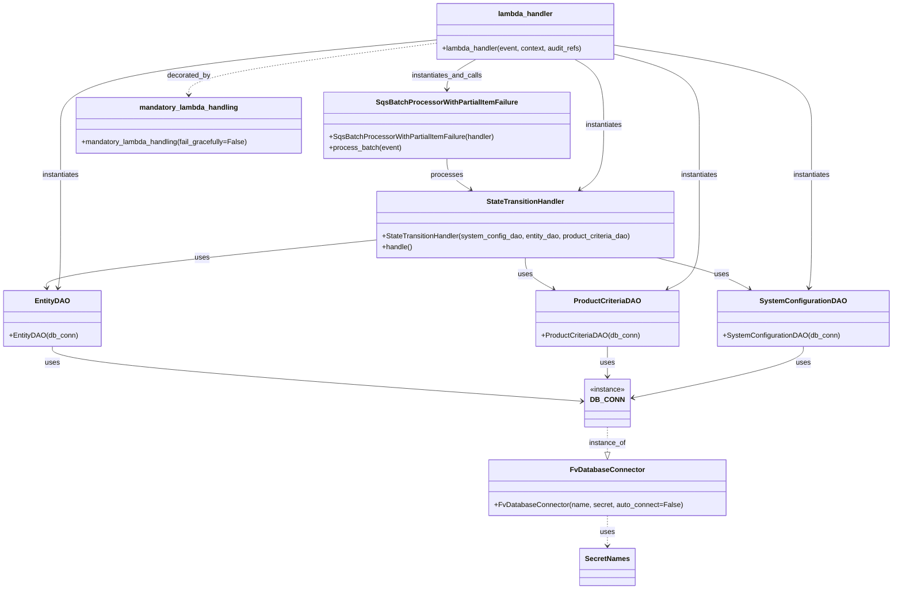

# Diagram: entity_core/entity_service/entity_service/entity/entity/entity_state_machine.py

> Auto-generated by Obscura crawlers

## Mermaid

```mermaid
classDiagram
class FvDatabaseConnector {
  +FvDatabaseConnector(name, secret, auto_connect=False)
}
class DB_CONN <<instance>> {
}
DB_CONN ..|> FvDatabaseConnector : instance_of

class SecretNames
FvDatabaseConnector ..> SecretNames : uses

class EntityDAO {
  +EntityDAO(db_conn)
}
class ProductCriteriaDAO {
  +ProductCriteriaDAO(db_conn)
}
class SystemConfigurationDAO {
  +SystemConfigurationDAO(db_conn)
}
EntityDAO --> DB_CONN : uses
ProductCriteriaDAO --> DB_CONN : uses
SystemConfigurationDAO --> DB_CONN : uses

class StateTransitionHandler {
  +StateTransitionHandler(system_config_dao, entity_dao, product_criteria_dao)
  +handle()
}
StateTransitionHandler --> SystemConfigurationDAO : uses
StateTransitionHandler --> EntityDAO : uses
StateTransitionHandler --> ProductCriteriaDAO : uses

class SqsBatchProcessorWithPartialItemFailure {
  +SqsBatchProcessorWithPartialItemFailure(handler)
  +process_batch(event)
}
SqsBatchProcessorWithPartialItemFailure --> StateTransitionHandler : processes

class mandatory_lambda_handling {
  +mandatory_lambda_handling(fail_gracefully=False)
}
class lambda_handler {
  +lambda_handler(event, context, audit_refs)
}
lambda_handler ..> mandatory_lambda_handling : decorated_by
lambda_handler --> EntityDAO : instantiates
lambda_handler --> SystemConfigurationDAO : instantiates
lambda_handler --> ProductCriteriaDAO : instantiates
lambda_handler --> StateTransitionHandler : instantiates
lambda_handler --> SqsBatchProcessorWithPartialItemFailure : instantiates_and_calls
```

> SVG rendering failed for this diagram.
