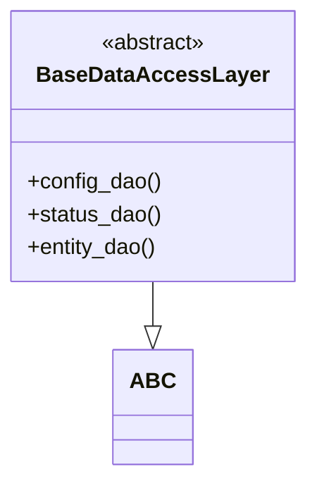

# Diagram: entity_core/entity_service/entity_service/entity/entity/external_state/base/base_date_access_layer.py

> Auto-generated by Obscura crawlers

## Mermaid

> SVG rendering failed for this diagram.
