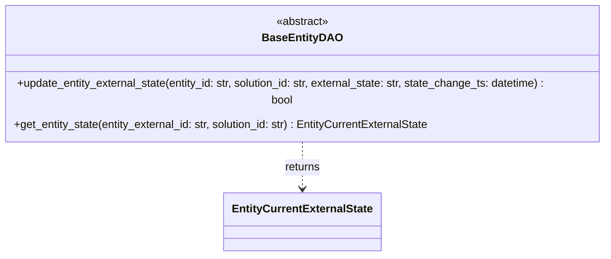

# Diagram: entity_core/entity_service/entity_service/entity/entity/external_state/base/base_entity_dao.py

> Auto-generated by Obscura crawlers

## Mermaid

### SVG

<svg id="container" width="912.6640625" xmlns="http://www.w3.org/2000/svg" class="classDiagram" height="348" viewBox="0 0 912.6640625 348" role="graphics-document document" aria-roledescription="class"><g><defs><marker id="container_class-aggregationStart" class="marker aggregation class" refX="18" refY="7" markerWidth="190" markerHeight="240" orient="auto"><path d="M 18,7 L9,13 L1,7 L9,1 Z"></path></marker></defs><defs><marker id="container_class-aggregationEnd" class="marker aggregation class" refX="1" refY="7" markerWidth="20" markerHeight="28" orient="auto"><path d="M 18,7 L9,13 L1,7 L9,1 Z"></path></marker></defs><defs><marker id="container_class-extensionStart" class="marker extension class" refX="18" refY="7" markerWidth="190" markerHeight="240" orient="auto"><path d="M 1,7 L18,13 V 1 Z"></path></marker></defs><defs><marker id="container_class-extensionEnd" class="marker extension class" refX="1" refY="7" markerWidth="20" markerHeight="28" orient="auto"><path d="M 1,1 V 13 L18,7 Z"></path></marker></defs><defs><marker id="container_class-compositionStart" class="marker composition class" refX="18" refY="7" markerWidth="190" markerHeight="240" orient="auto"><path d="M 18,7 L9,13 L1,7 L9,1 Z"></path></marker></defs><defs><marker id="container_class-compositionEnd" class="marker composition class" refX="1" refY="7" markerWidth="20" markerHeight="28" orient="auto"><path d="M 18,7 L9,13 L1,7 L9,1 Z"></path></marker></defs><defs><marker id="container_class-dependencyStart" class="marker dependency class" refX="6" refY="7" markerWidth="190" markerHeight="240" orient="auto"><path d="M 5,7 L9,13 L1,7 L9,1 Z"></path></marker></defs><defs><marker id="container_class-dependencyEnd" class="marker dependency class" refX="13" refY="7" markerWidth="20" markerHeight="28" orient="auto"><path d="M 18,7 L9,13 L14,7 L9,1 Z"></path></marker></defs><defs><marker id="container_class-lollipopStart" class="marker lollipop class" refX="13" refY="7" markerWidth="190" markerHeight="240" orient="auto"><circle stroke="black" fill="transparent" cx="7" cy="7" r="6"></circle></marker></defs><defs><marker id="container_class-lollipopEnd" class="marker lollipop class" refX="1" refY="7" markerWidth="190" markerHeight="240" orient="auto"><circle stroke="black" fill="transparent" cx="7" cy="7" r="6"></circle></marker></defs><g class="root"><g class="clusters"></g><g class="edgePaths"><path d="M456.332,182L456.332,188.167C456.332,194.333,456.332,206.667,456.332,218C456.332,229.333,456.332,239.667,456.332,244.833L456.332,250" id="id_BaseEntityDAO_EntityCurrentExternalState_1" class="edge-thickness-normal edge-pattern-dashed relation" style=";;;" data-edge="true" data-et="edge" data-id="id_BaseEntityDAO_EntityCurrentExternalState_1" data-points="W3sieCI6NDU2LjMzMjAzMTI1LCJ5IjoxODJ9LHsieCI6NDU2LjMzMjAzMTI1LCJ5IjoyMTl9LHsieCI6NDU2LjMzMjAzMTI1LCJ5IjoyNTZ9XQ==" marker-end="url(#container_class-dependencyEnd)"></path></g><g class="edgeLabels"><g class="edgeLabel" transform="translate(456.33203125, 219)"><g class="label" data-id="id_BaseEntityDAO_EntityCurrentExternalState_1" transform="translate(-26.265625, -12)"><foreignObject width="52.53125" height="24">

returns

</foreignObject></g></g></g><g class="nodes"><g class="node default" id="classId-EntityCurrentExternalState-0" transform="translate(456.33203125, 298)"><g class="basic label-container"><path d="M-110.109375 -42 L110.109375 -42 L110.109375 42 L-110.109375 42" stroke="none" stroke-width="0" fill="#ECECFF" style=""></path><path d="M-110.109375 -42 C-48.10205316032157 -42, 13.905268679356865 -42, 110.109375 -42 M-110.109375 -42 C-61.06417795386068 -42, -12.018980907721357 -42, 110.109375 -42 M110.109375 -42 C110.109375 -19.38701725243067, 110.109375 3.2259654951386594, 110.109375 42 M110.109375 -42 C110.109375 -24.444143300120636, 110.109375 -6.888286600241273, 110.109375 42 M110.109375 42 C36.56849694915917 42, -36.97238110168166 42, -110.109375 42 M110.109375 42 C50.471983349937744 42, -9.165408300124511 42, -110.109375 42 M-110.109375 42 C-110.109375 16.558439803155686, -110.109375 -8.883120393688628, -110.109375 -42 M-110.109375 42 C-110.109375 13.714112961347158, -110.109375 -14.571774077305683, -110.109375 -42" stroke="#9370DB" stroke-width="1.3" fill="none" stroke-dasharray="0 0" style=""></path></g><g class="annotation-group text" transform="translate(0, -18)"></g><g class="label-group text" transform="translate(-98.109375, -18)"><g class="label" style="font-weight: bolder" transform="translate(0,-12)"><foreignObject width="196.21875" height="24">

EntityCurrentExternalState

</foreignObject></g></g><g class="members-group text" transform="translate(-98.109375, 30)"></g><g class="methods-group text" transform="translate(-98.109375, 60)"></g><g class="divider" style=""><path d="M-110.109375 6 C-39.770560340364895 6, 30.56825431927021 6, 110.109375 6 M-110.109375 6 C-51.51175785487974 6, 7.085859290240521 6, 110.109375 6" stroke="#9370DB" stroke-width="1.3" fill="none" stroke-dasharray="0 0" style=""></path></g><g class="divider" style=""><path d="M-110.109375 24 C-52.21440362444513 24, 5.680567751109734 24, 110.109375 24 M-110.109375 24 C-60.55996666017665 24, -11.010558320353297 24, 110.109375 24" stroke="#9370DB" stroke-width="1.3" fill="none" stroke-dasharray="0 0" style=""></path></g></g><g class="node default" id="classId-BaseEntityDAO-1" transform="translate(456.33203125, 95)"><g class="basic label-container"><path d="M-448.33203125 -87 L448.33203125 -87 L448.33203125 87 L-448.33203125 87" stroke="none" stroke-width="0" fill="#ECECFF" style=""></path><path d="M-448.33203125 -87 C-138.32942671608203 -87, 171.67317781783595 -87, 448.33203125 -87 M-448.33203125 -87 C-148.91982251207247 -87, 150.49238622585506 -87, 448.33203125 -87 M448.33203125 -87 C448.33203125 -47.65814917001232, 448.33203125 -8.316298340024645, 448.33203125 87 M448.33203125 -87 C448.33203125 -46.969761276989246, 448.33203125 -6.939522553978492, 448.33203125 87 M448.33203125 87 C263.67488000895105 87, 79.0177287679021 87, -448.33203125 87 M448.33203125 87 C113.98031668328514 87, -220.37139788342972 87, -448.33203125 87 M-448.33203125 87 C-448.33203125 26.889332322992537, -448.33203125 -33.221335354014926, -448.33203125 -87 M-448.33203125 87 C-448.33203125 28.614893900025038, -448.33203125 -29.770212199949924, -448.33203125 -87" stroke="#9370DB" stroke-width="1.3" fill="none" stroke-dasharray="0 0" style=""></path></g><g class="annotation-group text" transform="translate(-38.609375, -63)"><g class="label" style="" transform="translate(0,-12)"><foreignObject width="77.21875" height="24">

«abstract»

</foreignObject></g></g><g class="label-group text" transform="translate(-54.1015625, -39)"><g class="label" style="font-weight: bolder" transform="translate(0,-12)"><foreignObject width="108.203125" height="24">

BaseEntityDAO

</foreignObject></g></g><g class="members-group text" transform="translate(-436.33203125, 9)"></g><g class="methods-group text" transform="translate(-436.33203125, 39)"><g class="label" style="" transform="translate(0,-12)"><foreignObject width="818.5625" height="24">

+update_entity_external_state(entity_id: str, solution_id: str, external_state: str, state_change_ts: datetime) : bool

</foreignObject></g><g class="label" style="" transform="translate(0,12)"><foreignObject width="614.484375" height="24">

+get_entity_state(entity_external_id: str, solution_id: str) : EntityCurrentExternalState

</foreignObject></g></g><g class="divider" style=""><path d="M-448.33203125 -15 C-189.29240776183866 -15, 69.74721572632268 -15, 448.33203125 -15 M-448.33203125 -15 C-133.9956411159759 -15, 180.3407490180482 -15, 448.33203125 -15" stroke="#9370DB" stroke-width="1.3" fill="none" stroke-dasharray="0 0" style=""></path></g><g class="divider" style=""><path d="M-448.33203125 9 C-218.9811222698678 9, 10.369786710264407 9, 448.33203125 9 M-448.33203125 9 C-198.45743582488396 9, 51.41715960023208 9, 448.33203125 9" stroke="#9370DB" stroke-width="1.3" fill="none" stroke-dasharray="0 0" style=""></path></g></g></g></g></g></svg>
