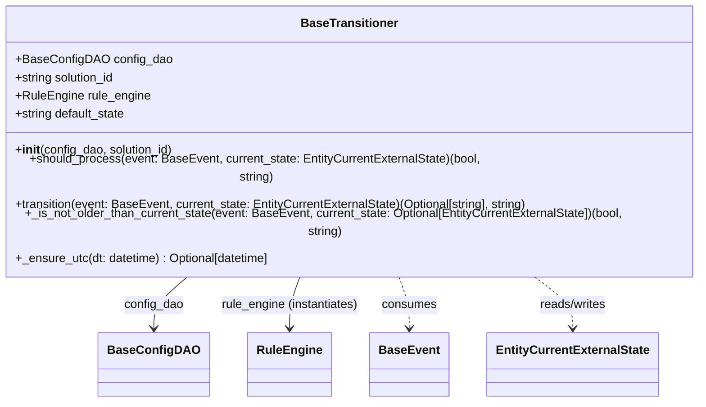

# Diagram: entity_core/entity_service/entity_service/entity/entity/external_state/base/base_transitioner.py

> Auto-generated by Obscura crawlers

## Mermaid

### SVG

<svg id="container" width="957.390625" xmlns="http://www.w3.org/2000/svg" class="classDiagram" height="486" viewBox="0 0 957.390625 486" role="graphics-document document" aria-roledescription="class"><g><defs><marker id="container_class-aggregationStart" class="marker aggregation class" refX="18" refY="7" markerWidth="190" markerHeight="240" orient="auto"><path d="M 18,7 L9,13 L1,7 L9,1 Z"></path></marker></defs><defs><marker id="container_class-aggregationEnd" class="marker aggregation class" refX="1" refY="7" markerWidth="20" markerHeight="28" orient="auto"><path d="M 18,7 L9,13 L1,7 L9,1 Z"></path></marker></defs><defs><marker id="container_class-extensionStart" class="marker extension class" refX="18" refY="7" markerWidth="190" markerHeight="240" orient="auto"><path d="M 1,7 L18,13 V 1 Z"></path></marker></defs><defs><marker id="container_class-extensionEnd" class="marker extension class" refX="1" refY="7" markerWidth="20" markerHeight="28" orient="auto"><path d="M 1,1 V 13 L18,7 Z"></path></marker></defs><defs><marker id="container_class-compositionStart" class="marker composition class" refX="18" refY="7" markerWidth="190" markerHeight="240" orient="auto"><path d="M 18,7 L9,13 L1,7 L9,1 Z"></path></marker></defs><defs><marker id="container_class-compositionEnd" class="marker composition class" refX="1" refY="7" markerWidth="20" markerHeight="28" orient="auto"><path d="M 18,7 L9,13 L1,7 L9,1 Z"></path></marker></defs><defs><marker id="container_class-dependencyStart" class="marker dependency class" refX="6" refY="7" markerWidth="190" markerHeight="240" orient="auto"><path d="M 5,7 L9,13 L1,7 L9,1 Z"></path></marker></defs><defs><marker id="container_class-dependencyEnd" class="marker dependency class" refX="13" refY="7" markerWidth="20" markerHeight="28" orient="auto"><path d="M 18,7 L9,13 L14,7 L9,1 Z"></path></marker></defs><defs><marker id="container_class-lollipopStart" class="marker lollipop class" refX="13" refY="7" markerWidth="190" markerHeight="240" orient="auto"><circle stroke="black" fill="transparent" cx="7" cy="7" r="6"></circle></marker></defs><defs><marker id="container_class-lollipopEnd" class="marker lollipop class" refX="1" refY="7" markerWidth="190" markerHeight="240" orient="auto"><circle stroke="black" fill="transparent" cx="7" cy="7" r="6"></circle></marker></defs><g class="root"><g class="clusters"></g><g class="edgePaths"><path d="M279.303,320L271.421,326.167C263.54,332.333,247.776,344.667,239.894,356C232.012,367.333,232.012,377.667,232.012,382.833L232.012,388" id="id_BaseTransitioner_BaseConfigDAO_1" class="edge-thickness-normal edge-pattern-solid relation" style=";;;" data-edge="true" data-et="edge" data-id="id_BaseTransitioner_BaseConfigDAO_1" data-points="W3sieCI6Mjc5LjMwMzM5MjE2MzIxMjQ0LCJ5IjozMjB9LHsieCI6MjMyLjAxMTcxODc1LCJ5IjozNTd9LHsieCI6MjMyLjAxMTcxODc1LCJ5IjozOTR9XQ==" marker-end="url(#container_class-dependencyEnd)"></path><path d="M417.085,320L414.65,326.167C412.214,332.333,407.344,344.667,404.908,356C402.473,367.333,402.473,377.667,402.473,382.833L402.473,388" id="id_BaseTransitioner_RuleEngine_2" class="edge-thickness-normal edge-pattern-solid relation" style=";;;" data-edge="true" data-et="edge" data-id="id_BaseTransitioner_RuleEngine_2" data-points="W3sieCI6NDE3LjA4NTI4OTgzMTYwNjI1LCJ5IjozMjB9LHsieCI6NDAyLjQ3MjY1NjI1LCJ5IjozNTd9LHsieCI6NDAyLjQ3MjY1NjI1LCJ5IjozOTR9XQ==" marker-end="url(#container_class-dependencyEnd)"></path><path d="M540.305,320L542.741,326.167C545.176,332.333,550.047,344.667,552.483,356C554.918,367.333,554.918,377.667,554.918,382.833L554.918,388" id="id_BaseTransitioner_BaseEvent_3" class="edge-thickness-normal edge-pattern-dashed relation" style=";;;" data-edge="true" data-et="edge" data-id="id_BaseTransitioner_BaseEvent_3" data-points="W3sieCI6NTQwLjMwNTMzNTE2ODM5MzgsInkiOjMyMH0seyJ4Ijo1NTQuOTE3OTY4NzUsInkiOjM1N30seyJ4Ijo1NTQuOTE3OTY4NzUsInkiOjM5NH1d" marker-end="url(#container_class-dependencyEnd)"></path><path d="M709.92,320L719.06,326.167C728.201,332.333,746.481,344.667,755.621,356C764.762,367.333,764.762,377.667,764.762,382.833L764.762,388" id="id_BaseTransitioner_EntityCurrentExternalState_4" class="edge-thickness-normal edge-pattern-dashed relation" style=";;;" data-edge="true" data-et="edge" data-id="id_BaseTransitioner_EntityCurrentExternalState_4" data-points="W3sieCI6NzA5LjkxOTk3MjQ3NDA5MzIsInkiOjMyMH0seyJ4Ijo3NjQuNzYxNzE4NzUsInkiOjM1N30seyJ4Ijo3NjQuNzYxNzE4NzUsInkiOjM5NH1d" marker-end="url(#container_class-dependencyEnd)"></path></g><g class="edgeLabels"><g class="edgeLabel" transform="translate(232.01171875, 357)"><g class="label" data-id="id_BaseTransitioner_BaseConfigDAO_1" transform="translate(-39.625, -12)"><foreignObject width="79.25" height="24">

config_dao

</foreignObject></g></g><g class="edgeLabel" transform="translate(402.47265625, 357)"><g class="label" data-id="id_BaseTransitioner_RuleEngine_2" transform="translate(-92.9765625, -12)"><foreignObject width="185.953125" height="24">

rule_engine (instantiates)

</foreignObject></g></g><g class="edgeLabel" transform="translate(554.91796875, 357)"><g class="label" data-id="id_BaseTransitioner_BaseEvent_3" transform="translate(-36.375, -12)"><foreignObject width="72.75" height="24">

consumes

</foreignObject></g></g><g class="edgeLabel" transform="translate(764.76171875, 357)"><g class="label" data-id="id_BaseTransitioner_EntityCurrentExternalState_4" transform="translate(-45.9453125, -12)"><foreignObject width="91.890625" height="24">

reads/writes

</foreignObject></g></g></g><g class="nodes"><g class="node default" id="classId-BaseTransitioner-0" transform="translate(478.6953125, 164)"><g class="basic label-container"><path d="M-470.6953125 -156 L470.6953125 -156 L470.6953125 156 L-470.6953125 156" stroke="none" stroke-width="0" fill="#ECECFF" style=""></path><path d="M-470.6953125 -156 C-122.56764547623692 -156, 225.56002154752616 -156, 470.6953125 -156 M-470.6953125 -156 C-255.21314202747973 -156, -39.73097155495947 -156, 470.6953125 -156 M470.6953125 -156 C470.6953125 -38.48647932507751, 470.6953125 79.02704134984498, 470.6953125 156 M470.6953125 -156 C470.6953125 -88.13796366815136, 470.6953125 -20.275927336302715, 470.6953125 156 M470.6953125 156 C236.4955842972846 156, 2.295856094569217 156, -470.6953125 156 M470.6953125 156 C145.2857227115059 156, -180.12386707698818 156, -470.6953125 156 M-470.6953125 156 C-470.6953125 38.81962027490505, -470.6953125 -78.3607594501899, -470.6953125 -156 M-470.6953125 156 C-470.6953125 44.14911683142945, -470.6953125 -67.7017663371411, -470.6953125 -156" stroke="#9370DB" stroke-width="1.3" fill="none" stroke-dasharray="0 0" style=""></path></g><g class="annotation-group text" transform="translate(0, -132)"></g><g class="label-group text" transform="translate(-61.90625, -132)"><g class="label" style="font-weight: bolder" transform="translate(0,-12)"><foreignObject width="123.8125" height="24">

BaseTransitioner

</foreignObject></g></g><g class="members-group text" transform="translate(-458.6953125, -84)"><g class="label" style="" transform="translate(0,-12)"><foreignObject width="201.046875" height="24">

+BaseConfigDAO config_dao

</foreignObject></g><g class="label" style="" transform="translate(0,12)"><foreignObject width="136.09375" height="24">

+string solution_id

</foreignObject></g><g class="label" style="" transform="translate(0,36)"><foreignObject width="178.78125" height="24">

+RuleEngine rule_engine

</foreignObject></g><g class="label" style="" transform="translate(0,60)"><foreignObject width="150.0625" height="24">

+string default_state

</foreignObject></g></g><g class="methods-group text" transform="translate(-458.6953125, 36)"><g class="label" style="" transform="translate(0,-12)"><foreignObject width="212.1875" height="24">

+<strong>init</strong>(config_dao, solution_id)

</foreignObject></g><g class="label" style="" transform="translate(0,12)"><foreignObject width="652.890625" height="24">

+should_process(event: BaseEvent, current_state: EntityCurrentExternalState)(bool, string)

</foreignObject></g><g class="label" style="" transform="translate(0,36)"><foreignObject width="691.703125" height="24">

+transition(event: BaseEvent, current_state: EntityCurrentExternalState)(Optional[string], string)

</foreignObject></g><g class="label" style="" transform="translate(0,60)"><foreignObject width="855.484375" height="24">

+_is_not_older_than_current_state(event: BaseEvent, current_state: Optional[EntityCurrentExternalState])(bool, string)

</foreignObject></g><g class="label" style="" transform="translate(0,84)"><foreignObject width="343.96875" height="24">

+_ensure_utc(dt: datetime) : Optional[datetime]

</foreignObject></g></g><g class="divider" style=""><path d="M-470.6953125 -108 C-265.6275376116886 -108, -60.559762723377105 -108, 470.6953125 -108 M-470.6953125 -108 C-156.8554471809424 -108, 156.9844181381152 -108, 470.6953125 -108" stroke="#9370DB" stroke-width="1.3" fill="none" stroke-dasharray="0 0" style=""></path></g><g class="divider" style=""><path d="M-470.6953125 12 C-192.2863335127492 12, 86.12264547450161 12, 470.6953125 12 M-470.6953125 12 C-119.21503249871876 12, 232.2652475025625 12, 470.6953125 12" stroke="#9370DB" stroke-width="1.3" fill="none" stroke-dasharray="0 0" style=""></path></g></g><g class="node default" id="classId-BaseConfigDAO-1" transform="translate(232.01171875, 436)"><g class="basic label-container"><path d="M-67.75 -42 L67.75 -42 L67.75 42 L-67.75 42" stroke="none" stroke-width="0" fill="#ECECFF" style=""></path><path d="M-67.75 -42 C-32.91645621890042 -42, 1.917087562199157 -42, 67.75 -42 M-67.75 -42 C-34.67038882077568 -42, -1.5907776415513553 -42, 67.75 -42 M67.75 -42 C67.75 -10.915589883011751, 67.75 20.168820233976497, 67.75 42 M67.75 -42 C67.75 -15.557283161377445, 67.75 10.88543367724511, 67.75 42 M67.75 42 C40.46028858768763 42, 13.17057717537525 42, -67.75 42 M67.75 42 C38.66334104242276 42, 9.576682084845523 42, -67.75 42 M-67.75 42 C-67.75 19.587355533391598, -67.75 -2.825288933216804, -67.75 -42 M-67.75 42 C-67.75 9.806712272708594, -67.75 -22.38657545458281, -67.75 -42" stroke="#9370DB" stroke-width="1.3" fill="none" stroke-dasharray="0 0" style=""></path></g><g class="annotation-group text" transform="translate(0, -18)"></g><g class="label-group text" transform="translate(-55.75, -18)"><g class="label" style="font-weight: bolder" transform="translate(0,-12)"><foreignObject width="111.5" height="24">

BaseConfigDAO

</foreignObject></g></g><g class="members-group text" transform="translate(-55.75, 30)"></g><g class="methods-group text" transform="translate(-55.75, 60)"></g><g class="divider" style=""><path d="M-67.75 6 C-24.722661935140522 6, 18.304676129718956 6, 67.75 6 M-67.75 6 C-19.294389004885367 6, 29.161221990229265 6, 67.75 6" stroke="#9370DB" stroke-width="1.3" fill="none" stroke-dasharray="0 0" style=""></path></g><g class="divider" style=""><path d="M-67.75 24 C-17.066131214186356 24, 33.61773757162729 24, 67.75 24 M-67.75 24 C-28.058507952287492 24, 11.632984095425016 24, 67.75 24" stroke="#9370DB" stroke-width="1.3" fill="none" stroke-dasharray="0 0" style=""></path></g></g><g class="node default" id="classId-RuleEngine-2" transform="translate(402.47265625, 436)"><g class="basic label-container"><path d="M-52.7109375 -42 L52.7109375 -42 L52.7109375 42 L-52.7109375 42" stroke="none" stroke-width="0" fill="#ECECFF" style=""></path><path d="M-52.7109375 -42 C-27.62324656676767 -42, -2.5355556335353384 -42, 52.7109375 -42 M-52.7109375 -42 C-19.137598045818244 -42, 14.435741408363512 -42, 52.7109375 -42 M52.7109375 -42 C52.7109375 -22.615452711579866, 52.7109375 -3.230905423159733, 52.7109375 42 M52.7109375 -42 C52.7109375 -19.379044595671385, 52.7109375 3.241910808657231, 52.7109375 42 M52.7109375 42 C18.231510688122313 42, -16.247916123755374 42, -52.7109375 42 M52.7109375 42 C15.79200918360766 42, -21.12691913278468 42, -52.7109375 42 M-52.7109375 42 C-52.7109375 9.008288669861074, -52.7109375 -23.983422660277853, -52.7109375 -42 M-52.7109375 42 C-52.7109375 18.155372963573413, -52.7109375 -5.689254072853174, -52.7109375 -42" stroke="#9370DB" stroke-width="1.3" fill="none" stroke-dasharray="0 0" style=""></path></g><g class="annotation-group text" transform="translate(0, -18)"></g><g class="label-group text" transform="translate(-40.7109375, -18)"><g class="label" style="font-weight: bolder" transform="translate(0,-12)"><foreignObject width="81.421875" height="24">

RuleEngine

</foreignObject></g></g><g class="members-group text" transform="translate(-40.7109375, 30)"></g><g class="methods-group text" transform="translate(-40.7109375, 60)"></g><g class="divider" style=""><path d="M-52.7109375 6 C-20.130905772488624 6, 12.449125955022751 6, 52.7109375 6 M-52.7109375 6 C-15.571914988797104 6, 21.56710752240579 6, 52.7109375 6" stroke="#9370DB" stroke-width="1.3" fill="none" stroke-dasharray="0 0" style=""></path></g><g class="divider" style=""><path d="M-52.7109375 24 C-29.664000776797035 24, -6.617064053594071 24, 52.7109375 24 M-52.7109375 24 C-12.405026367552594 24, 27.900884764894812 24, 52.7109375 24" stroke="#9370DB" stroke-width="1.3" fill="none" stroke-dasharray="0 0" style=""></path></g></g><g class="node default" id="classId-BaseEvent-3" transform="translate(554.91796875, 436)"><g class="basic label-container"><path d="M-49.734375 -42 L49.734375 -42 L49.734375 42 L-49.734375 42" stroke="none" stroke-width="0" fill="#ECECFF" style=""></path><path d="M-49.734375 -42 C-16.407362534403504 -42, 16.919649931192993 -42, 49.734375 -42 M-49.734375 -42 C-20.470647056146994 -42, 8.793080887706012 -42, 49.734375 -42 M49.734375 -42 C49.734375 -17.09607140407683, 49.734375 7.807857191846338, 49.734375 42 M49.734375 -42 C49.734375 -16.0585758266607, 49.734375 9.8828483466786, 49.734375 42 M49.734375 42 C23.757422312402184 42, -2.2195303751956317 42, -49.734375 42 M49.734375 42 C25.200580678809796 42, 0.6667863576195927 42, -49.734375 42 M-49.734375 42 C-49.734375 15.875598452464349, -49.734375 -10.248803095071302, -49.734375 -42 M-49.734375 42 C-49.734375 21.128746106073148, -49.734375 0.25749221214629614, -49.734375 -42" stroke="#9370DB" stroke-width="1.3" fill="none" stroke-dasharray="0 0" style=""></path></g><g class="annotation-group text" transform="translate(0, -18)"></g><g class="label-group text" transform="translate(-37.734375, -18)"><g class="label" style="font-weight: bolder" transform="translate(0,-12)"><foreignObject width="75.46875" height="24">

BaseEvent

</foreignObject></g></g><g class="members-group text" transform="translate(-37.734375, 30)"></g><g class="methods-group text" transform="translate(-37.734375, 60)"></g><g class="divider" style=""><path d="M-49.734375 6 C-17.24137691689078 6, 15.251621166218442 6, 49.734375 6 M-49.734375 6 C-26.537613875483434 6, -3.3408527509668673 6, 49.734375 6" stroke="#9370DB" stroke-width="1.3" fill="none" stroke-dasharray="0 0" style=""></path></g><g class="divider" style=""><path d="M-49.734375 24 C-15.919329235057816 24, 17.895716529884368 24, 49.734375 24 M-49.734375 24 C-16.067456268490034 24, 17.599462463019933 24, 49.734375 24" stroke="#9370DB" stroke-width="1.3" fill="none" stroke-dasharray="0 0" style=""></path></g></g><g class="node default" id="classId-EntityCurrentExternalState-4" transform="translate(764.76171875, 436)"><g class="basic label-container"><path d="M-110.109375 -42 L110.109375 -42 L110.109375 42 L-110.109375 42" stroke="none" stroke-width="0" fill="#ECECFF" style=""></path><path d="M-110.109375 -42 C-23.54641380810024 -42, 63.01654738379952 -42, 110.109375 -42 M-110.109375 -42 C-46.79724436101577 -42, 16.514886277968458 -42, 110.109375 -42 M110.109375 -42 C110.109375 -18.74232210129443, 110.109375 4.515355797411139, 110.109375 42 M110.109375 -42 C110.109375 -17.523309536673896, 110.109375 6.953380926652208, 110.109375 42 M110.109375 42 C47.68300222281015 42, -14.743370554379695 42, -110.109375 42 M110.109375 42 C22.793912702214755 42, -64.52154959557049 42, -110.109375 42 M-110.109375 42 C-110.109375 21.83872046298252, -110.109375 1.677440925965037, -110.109375 -42 M-110.109375 42 C-110.109375 22.11982162532177, -110.109375 2.239643250643539, -110.109375 -42" stroke="#9370DB" stroke-width="1.3" fill="none" stroke-dasharray="0 0" style=""></path></g><g class="annotation-group text" transform="translate(0, -18)"></g><g class="label-group text" transform="translate(-98.109375, -18)"><g class="label" style="font-weight: bolder" transform="translate(0,-12)"><foreignObject width="196.21875" height="24">

EntityCurrentExternalState

</foreignObject></g></g><g class="members-group text" transform="translate(-98.109375, 30)"></g><g class="methods-group text" transform="translate(-98.109375, 60)"></g><g class="divider" style=""><path d="M-110.109375 6 C-40.76506904876449 6, 28.579236902471024 6, 110.109375 6 M-110.109375 6 C-30.735360375997644 6, 48.63865424800471 6, 110.109375 6" stroke="#9370DB" stroke-width="1.3" fill="none" stroke-dasharray="0 0" style=""></path></g><g class="divider" style=""><path d="M-110.109375 24 C-55.485740035252626 24, -0.8621050705052511 24, 110.109375 24 M-110.109375 24 C-33.31760149662081 24, 43.47417200675838 24, 110.109375 24" stroke="#9370DB" stroke-width="1.3" fill="none" stroke-dasharray="0 0" style=""></path></g></g></g></g></g></svg>
