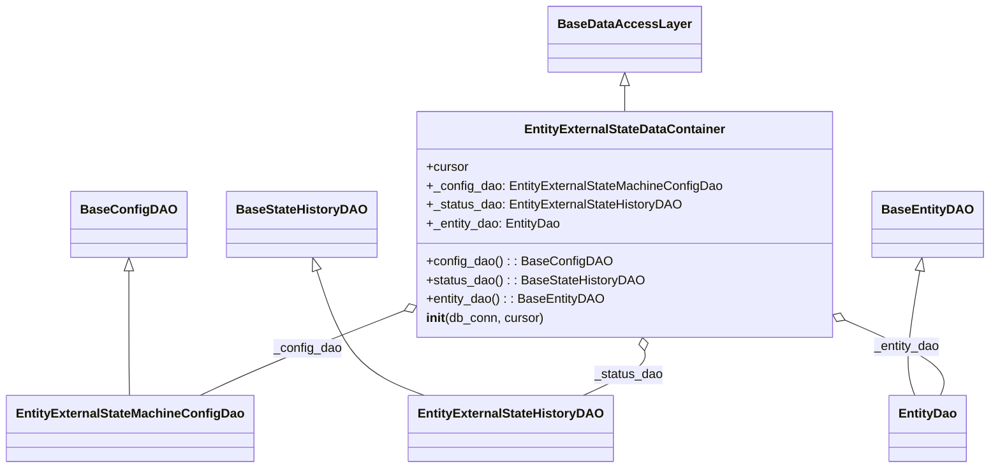

# Diagram: entity_core/entity_service/entity_service/entity/entity/external_state/daos/extenal_state_data_container.py


> Auto-generated by Obscura crawlers

## Diagram 1



### SVG

<svg id="container" width="1218.2734375" xmlns="http://www.w3.org/2000/svg" class="classDiagram" height="596" viewBox="0 0 1218.2734375 596" role="graphics-document document" aria-roledescription="class"><style>#container{font-family:"trebuchet ms",verdana,arial,sans-serif;font-size:16px;fill:#333;}@keyframes edge-animation-frame{from{stroke-dashoffset:0;}}@keyframes dash{to{stroke-dashoffset:0;}}#container .edge-animation-slow{stroke-dasharray:9,5!important;stroke-dashoffset:900;animation:dash 50s linear infinite;stroke-linecap:round;}#container .edge-animation-fast{stroke-dasharray:9,5!important;stroke-dashoffset:900;animation:dash 20s linear infinite;stroke-linecap:round;}#container .error-icon{fill:#552222;}#container .error-text{fill:#552222;stroke:#552222;}#container .edge-thickness-normal{stroke-width:1px;}#container .edge-thickness-thick{stroke-width:3.5px;}#container .edge-pattern-solid{stroke-dasharray:0;}#container .edge-thickness-invisible{stroke-width:0;fill:none;}#container .edge-pattern-dashed{stroke-dasharray:3;}#container .edge-pattern-dotted{stroke-dasharray:2;}#container .marker{fill:#333333;stroke:#333333;}#container .marker.cross{stroke:#333333;}#container svg{font-family:"trebuchet ms",verdana,arial,sans-serif;font-size:16px;}#container p{margin:0;}#container g.classGroup text{fill:#9370DB;stroke:none;font-family:"trebuchet ms",verdana,arial,sans-serif;font-size:10px;}#container g.classGroup text .title{font-weight:bolder;}#container .nodeLabel,#container .edgeLabel{color:#131300;}#container .edgeLabel .label rect{fill:#ECECFF;}#container .label text{fill:#131300;}#container .labelBkg{background:#ECECFF;}#container .edgeLabel .label span{background:#ECECFF;}#container .classTitle{font-weight:bolder;}#container .node rect,#container .node circle,#container .node ellipse,#container .node polygon,#container .node path{fill:#ECECFF;stroke:#9370DB;stroke-width:1px;}#container .divider{stroke:#9370DB;stroke-width:1;}#container g.clickable{cursor:pointer;}#container g.classGroup rect{fill:#ECECFF;stroke:#9370DB;}#container g.classGroup line{stroke:#9370DB;stroke-width:1;}#container .classLabel .box{stroke:none;stroke-width:0;fill:#ECECFF;opacity:0.5;}#container .classLabel .label{fill:#9370DB;font-size:10px;}#container .relation{stroke:#333333;stroke-width:1;fill:none;}#container .dashed-line{stroke-dasharray:3;}#container .dotted-line{stroke-dasharray:1 2;}#container #compositionStart,#container .composition{fill:#333333!important;stroke:#333333!important;stroke-width:1;}#container #compositionEnd,#container .composition{fill:#333333!important;stroke:#333333!important;stroke-width:1;}#container #dependencyStart,#container .dependency{fill:#333333!important;stroke:#333333!important;stroke-width:1;}#container #dependencyStart,#container .dependency{fill:#333333!important;stroke:#333333!important;stroke-width:1;}#container #extensionStart,#container .extension{fill:transparent!important;stroke:#333333!important;stroke-width:1;}#container #extensionEnd,#container .extension{fill:transparent!important;stroke:#333333!important;stroke-width:1;}#container #aggregationStart,#container .aggregation{fill:transparent!important;stroke:#333333!important;stroke-width:1;}#container #aggregationEnd,#container .aggregation{fill:transparent!important;stroke:#333333!important;stroke-width:1;}#container #lollipopStart,#container .lollipop{fill:#ECECFF!important;stroke:#333333!important;stroke-width:1;}#container #lollipopEnd,#container .lollipop{fill:#ECECFF!important;stroke:#333333!important;stroke-width:1;}#container .edgeTerminals{font-size:11px;line-height:initial;}#container .classTitleText{text-anchor:middle;font-size:18px;fill:#333;}#container .label-icon{display:inline-block;height:1em;overflow:visible;vertical-align:-0.125em;}#container .node .label-icon path{fill:currentColor;stroke:revert;stroke-width:revert;}#container :root{--mermaid-font-family:"trebuchet ms",verdana,arial,sans-serif;}</style><g><defs><marker id="container_class-aggregationStart" class="marker aggregation class" refX="18" refY="7" markerWidth="190" markerHeight="240" orient="auto"><path d="M 18,7 L9,13 L1,7 L9,1 Z"></path></marker></defs><defs><marker id="container_class-aggregationEnd" class="marker aggregation class" refX="1" refY="7" markerWidth="20" markerHeight="28" orient="auto"><path d="M 18,7 L9,13 L1,7 L9,1 Z"></path></marker></defs><defs><marker id="container_class-extensionStart" class="marker extension class" refX="18" refY="7" markerWidth="190" markerHeight="240" orient="auto"><path d="M 1,7 L18,13 V 1 Z"></path></marker></defs><defs><marker id="container_class-extensionEnd" class="marker extension class" refX="1" refY="7" markerWidth="20" markerHeight="28" orient="auto"><path d="M 1,1 V 13 L18,7 Z"></path></marker></defs><defs><marker id="container_class-compositionStart" class="marker composition class" refX="18" refY="7" markerWidth="190" markerHeight="240" orient="auto"><path d="M 18,7 L9,13 L1,7 L9,1 Z"></path></marker></defs><defs><marker id="container_class-compositionEnd" class="marker composition class" refX="1" refY="7" markerWidth="20" markerHeight="28" orient="auto"><path d="M 18,7 L9,13 L1,7 L9,1 Z"></path></marker></defs><defs><marker id="container_class-dependencyStart" class="marker dependency class" refX="6" refY="7" markerWidth="190" markerHeight="240" orient="auto"><path d="M 5,7 L9,13 L1,7 L9,1 Z"></path></marker></defs><defs><marker id="container_class-dependencyEnd" class="marker dependency class" refX="13" refY="7" markerWidth="20" markerHeight="28" orient="auto"><path d="M 18,7 L9,13 L14,7 L9,1 Z"></path></marker></defs><defs><marker id="container_class-lollipopStart" class="marker lollipop class" refX="13" refY="7" markerWidth="190" markerHeight="240" orient="auto"><circle stroke="black" fill="transparent" cx="7" cy="7" r="6"></circle></marker></defs><defs><marker id="container_class-lollipopEnd" class="marker lollipop class" refX="1" refY="7" markerWidth="190" markerHeight="240" orient="auto"><circle stroke="black" fill="transparent" cx="7" cy="7" r="6"></circle></marker></defs><g class="root"><g class="clusters"></g><g class="edgePaths"><path d="M767.328,109.25L767.328,110.542C767.328,111.833,767.328,114.417,767.328,119.875C767.328,125.333,767.328,133.667,767.328,137.833L767.328,142" id="id_BaseDataAccessLayer_EntityExternalStateDataContainer_1" class="edge-thickness-normal edge-pattern-solid relation" style=";;;" data-edge="true" data-et="edge" data-id="id_BaseDataAccessLayer_EntityExternalStateDataContainer_1" data-points="W3sieCI6NzY3LjMyODEyNSwieSI6OTJ9LHsieCI6NzY3LjMyODEyNSwieSI6MTE3fSx7IngiOjc2Ny4zMjgxMjUsInkiOjE0Mn1d" marker-start="url(#container_class-extensionStart)"></path><path d="M157.371,345.25L157.371,365.542C157.371,385.833,157.371,426.417,157.442,452.875C157.513,479.333,157.655,491.667,157.726,497.833L157.797,504" id="id_BaseConfigDAO_EntityExternalStateMachineConfigDao_2" class="edge-thickness-normal edge-pattern-solid relation" style=";;;" data-edge="true" data-et="edge" data-id="id_BaseConfigDAO_EntityExternalStateMachineConfigDao_2" data-points="W3sieCI6MTU3LjM3MTA5Mzc1LCJ5IjozMjh9LHsieCI6MTU3LjM3MTA5Mzc1LCJ5Ijo0Njd9LHsieCI6MTU3Ljc5NzM2OTQ2MjAyNTMzLCJ5Ijo1MDR9XQ==" marker-start="url(#container_class-extensionStart)"></path><path d="M384.463,344.421L391.036,364.851C397.608,385.281,410.753,426.14,433.059,452.737C455.365,479.333,486.831,491.667,502.564,497.833L518.297,504" id="id_BaseStateHistoryDAO_EntityExternalStateHistoryDAO_3" class="edge-thickness-normal edge-pattern-solid relation" style=";;;" data-edge="true" data-et="edge" data-id="id_BaseStateHistoryDAO_EntityExternalStateHistoryDAO_3" data-points="W3sieCI6Mzc5LjE4MDAxMTIyMjM3NTcsInkiOjMyOH0seyJ4Ijo0MjMuODk4NDM3NSwieSI6NDY3fSx7IngiOjUxOC4yOTc0NjgzNTQ0MzA0LCJ5Ijo1MDR9XQ==" marker-start="url(#container_class-extensionStart)"></path><path d="M1133.978,344.998L1130.465,365.332C1126.952,385.665,1119.925,426.333,1118.853,452.833C1117.781,479.333,1122.663,491.667,1125.104,497.833L1127.545,504" id="id_BaseEntityDAO_EntityDao_4" class="edge-thickness-normal edge-pattern-solid relation" style=";;;" data-edge="true" data-et="edge" data-id="id_BaseEntityDAO_EntityDao_4" data-points="W3sieCI6MTEzNi45MTUwNTUyNDg2MTg3LCJ5IjozMjh9LHsieCI6MTExMi44OTg0Mzc1LCJ5Ijo0Njd9LHsieCI6MTEyNy41NDU0OTA1MDYzMjksInkiOjUwNH1d" marker-start="url(#container_class-extensionStart)"></path><path d="M490.594,397.911L462.12,409.426C433.646,420.941,376.698,443.97,335.62,461.652C294.542,479.333,269.334,491.667,256.729,497.833L244.125,504" id="id_EntityExternalStateDataContainer_EntityExternalStateMachineConfigDao_5" class="edge-thickness-normal edge-pattern-solid relation" style=";;;" data-edge="true" data-et="edge" data-id="id_EntityExternalStateDataContainer_EntityExternalStateMachineConfigDao_5" data-points="W3sieCI6NTA2LjU4NTkzNzUsInkiOjM5MS40NDM3OTQ3Mjg1NzM5NX0seyJ4IjozMTkuNzUsInkiOjQ2N30seyJ4IjoyNDQuMTI1Mzk1NTY5NjIwMjUsInkiOjUwNH1d" marker-start="url(#container_class-aggregationStart)"></path><path d="M791.316,447.062L791.811,450.385C792.306,453.708,793.295,460.354,780.611,469.844C767.927,479.333,741.57,491.667,728.391,497.833L715.212,504" id="id_EntityExternalStateDataContainer_EntityExternalStateHistoryDAO_6" class="edge-thickness-normal edge-pattern-solid relation" style=";;;" data-edge="true" data-et="edge" data-id="id_EntityExternalStateDataContainer_EntityExternalStateHistoryDAO_6" data-points="W3sieCI6Nzg4Ljc3NDYwMjkwMDU1MjUsInkiOjQzMH0seyJ4Ijo3OTQuMjg1MTU2MjUsInkiOjQ2N30seyJ4Ijo3MTUuMjExOTI2NDI0MDUwNiwieSI6NTA0fV0=" marker-start="url(#container_class-aggregationStart)"></path><path d="M1043.839,408.633L1065.773,418.361C1087.708,428.088,1131.577,447.544,1151.07,463.439C1170.563,479.333,1165.681,491.667,1163.239,497.833L1160.798,504" id="id_EntityExternalStateDataContainer_EntityDao_7" class="edge-thickness-normal edge-pattern-solid relation" style=";;;" data-edge="true" data-et="edge" data-id="id_EntityExternalStateDataContainer_EntityDao_7" data-points="W3sieCI6MTAyOC4wNzAzMTI1LCJ5Ijo0MDEuNjM5MTc3NjI1OTExNjZ9LHsieCI6MTE3NS40NDUzMTI1LCJ5Ijo0Njd9LHsieCI6MTE2MC43OTgyNTk0OTM2NzEsInkiOjUwNH1d" marker-start="url(#container_class-aggregationStart)"></path></g><g class="edgeLabels"><g class="edgeLabel"><g class="label" data-id="id_BaseDataAccessLayer_EntityExternalStateDataContainer_1" transform="translate(0, 0)"><foreignObject width="0" height="0"><div xmlns="http://www.w3.org/1999/xhtml" class="labelBkg" style="display: table-cell; white-space: nowrap; line-height: 1.5; max-width: 200px; text-align: center;"><span class="edgeLabel"></span></div></foreignObject></g></g><g class="edgeLabel"><g class="label" data-id="id_BaseConfigDAO_EntityExternalStateMachineConfigDao_2" transform="translate(0, 0)"><foreignObject width="0" height="0"><div xmlns="http://www.w3.org/1999/xhtml" class="labelBkg" style="display: table-cell; white-space: nowrap; line-height: 1.5; max-width: 200px; text-align: center;"><span class="edgeLabel"></span></div></foreignObject></g></g><g class="edgeLabel"><g class="label" data-id="id_BaseStateHistoryDAO_EntityExternalStateHistoryDAO_3" transform="translate(0, 0)"><foreignObject width="0" height="0"><div xmlns="http://www.w3.org/1999/xhtml" class="labelBkg" style="display: table-cell; white-space: nowrap; line-height: 1.5; max-width: 200px; text-align: center;"><span class="edgeLabel"></span></div></foreignObject></g></g><g class="edgeLabel"><g class="label" data-id="id_BaseEntityDAO_EntityDao_4" transform="translate(0, 0)"><foreignObject width="0" height="0"><div xmlns="http://www.w3.org/1999/xhtml" class="labelBkg" style="display: table-cell; white-space: nowrap; line-height: 1.5; max-width: 200px; text-align: center;"><span class="edgeLabel"></span></div></foreignObject></g></g><g class="edgeLabel" transform="translate(374.14287, 445.00359)"><g class="label" data-id="id_EntityExternalStateDataContainer_EntityExternalStateMachineConfigDao_5" transform="translate(-43.625, -12)"><foreignObject width="87.25" height="24"><div xmlns="http://www.w3.org/1999/xhtml" class="labelBkg" style="display: table-cell; white-space: nowrap; line-height: 1.5; max-width: 200px; text-align: center;"><span class="edgeLabel"><p>_config_dao</p></span></div></foreignObject></g></g><g class="edgeLabel" transform="translate(771.68969, 477.57289)"><g class="label" data-id="id_EntityExternalStateDataContainer_EntityExternalStateHistoryDAO_6" transform="translate(-44.015625, -12)"><foreignObject width="88.03125" height="24"><div xmlns="http://www.w3.org/1999/xhtml" class="labelBkg" style="display: table-cell; white-space: nowrap; line-height: 1.5; max-width: 200px; text-align: center;"><span class="edgeLabel"><p>_status_dao</p></span></div></foreignObject></g></g><g class="edgeLabel" transform="translate(1119.94614, 442.38611)"><g class="label" data-id="id_EntityExternalStateDataContainer_EntityDao_7" transform="translate(-42.546875, -12)"><foreignObject width="85.09375" height="24"><div xmlns="http://www.w3.org/1999/xhtml" class="labelBkg" style="display: table-cell; white-space: nowrap; line-height: 1.5; max-width: 200px; text-align: center;"><span class="edgeLabel"><p>_entity_dao</p></span></div></foreignObject></g></g></g><g class="nodes"><g class="node default" id="classId-BaseDataAccessLayer-0" transform="translate(767.328125, 50)"><g class="basic label-container"><path d="M-90.5546875 -42 L90.5546875 -42 L90.5546875 42 L-90.5546875 42" stroke="none" stroke-width="0" fill="#ECECFF" style=""></path><path d="M-90.5546875 -42 C-52.4797493314407 -42, -14.404811162881401 -42, 90.5546875 -42 M-90.5546875 -42 C-47.061413963582936 -42, -3.568140427165872 -42, 90.5546875 -42 M90.5546875 -42 C90.5546875 -24.527861756384095, 90.5546875 -7.055723512768189, 90.5546875 42 M90.5546875 -42 C90.5546875 -20.34299068026539, 90.5546875 1.314018639469218, 90.5546875 42 M90.5546875 42 C32.71346145406033 42, -25.12776459187934 42, -90.5546875 42 M90.5546875 42 C53.69287210961714 42, 16.831056719234283 42, -90.5546875 42 M-90.5546875 42 C-90.5546875 11.299215031491013, -90.5546875 -19.401569937017975, -90.5546875 -42 M-90.5546875 42 C-90.5546875 17.493081227993496, -90.5546875 -7.013837544013008, -90.5546875 -42" stroke="#9370DB" stroke-width="1.3" fill="none" stroke-dasharray="0 0" style=""></path></g><g class="annotation-group text" transform="translate(0, -18)"></g><g class="label-group text" transform="translate(-78.5546875, -18)"><g class="label" style="font-weight: bolder" transform="translate(0,-12)"><foreignObject width="157.109375" height="24"><div xmlns="http://www.w3.org/1999/xhtml" style="display: table-cell; white-space: nowrap; line-height: 1.5; max-width: 205px; text-align: center;"><span class="nodeLabel markdown-node-label" style=""><p>BaseDataAccessLayer</p></span></div></foreignObject></g></g><g class="members-group text" transform="translate(-78.5546875, 30)"></g><g class="methods-group text" transform="translate(-78.5546875, 60)"></g><g class="divider" style=""><path d="M-90.5546875 6 C-23.49419684380183 6, 43.56629381239634 6, 90.5546875 6 M-90.5546875 6 C-54.22580219644229 6, -17.896916892884576 6, 90.5546875 6" stroke="#9370DB" stroke-width="1.3" fill="none" stroke-dasharray="0 0" style=""></path></g><g class="divider" style=""><path d="M-90.5546875 24 C-34.07033917505178 24, 22.414009149896444 24, 90.5546875 24 M-90.5546875 24 C-32.001552248184595 24, 26.55158300363081 24, 90.5546875 24" stroke="#9370DB" stroke-width="1.3" fill="none" stroke-dasharray="0 0" style=""></path></g></g><g class="node default" id="classId-BaseConfigDAO-1" transform="translate(157.37109375, 286)"><g class="basic label-container"><path d="M-67.75 -42 L67.75 -42 L67.75 42 L-67.75 42" stroke="none" stroke-width="0" fill="#ECECFF" style=""></path><path d="M-67.75 -42 C-15.878097192815773 -42, 35.993805614368455 -42, 67.75 -42 M-67.75 -42 C-30.348658307703047 -42, 7.052683384593905 -42, 67.75 -42 M67.75 -42 C67.75 -24.326921547552793, 67.75 -6.653843095105586, 67.75 42 M67.75 -42 C67.75 -14.462545781237264, 67.75 13.074908437525472, 67.75 42 M67.75 42 C22.905929456914492 42, -21.938141086171015 42, -67.75 42 M67.75 42 C33.98502104230722 42, 0.22004208461443397 42, -67.75 42 M-67.75 42 C-67.75 21.89271251683588, -67.75 1.785425033671757, -67.75 -42 M-67.75 42 C-67.75 9.436724541471122, -67.75 -23.126550917057756, -67.75 -42" stroke="#9370DB" stroke-width="1.3" fill="none" stroke-dasharray="0 0" style=""></path></g><g class="annotation-group text" transform="translate(0, -18)"></g><g class="label-group text" transform="translate(-55.75, -18)"><g class="label" style="font-weight: bolder" transform="translate(0,-12)"><foreignObject width="111.5" height="24"><div xmlns="http://www.w3.org/1999/xhtml" style="display: table-cell; white-space: nowrap; line-height: 1.5; max-width: 160px; text-align: center;"><span class="nodeLabel markdown-node-label" style=""><p>BaseConfigDAO</p></span></div></foreignObject></g></g><g class="members-group text" transform="translate(-55.75, 30)"></g><g class="methods-group text" transform="translate(-55.75, 60)"></g><g class="divider" style=""><path d="M-67.75 6 C-17.229001777108053 6, 33.291996445783894 6, 67.75 6 M-67.75 6 C-19.018962099297944 6, 29.71207580140411 6, 67.75 6" stroke="#9370DB" stroke-width="1.3" fill="none" stroke-dasharray="0 0" style=""></path></g><g class="divider" style=""><path d="M-67.75 24 C-29.536396776007507 24, 8.677206447984986 24, 67.75 24 M-67.75 24 C-31.863480352489482 24, 4.023039295021036 24, 67.75 24" stroke="#9370DB" stroke-width="1.3" fill="none" stroke-dasharray="0 0" style=""></path></g></g><g class="node default" id="classId-BaseStateHistoryDAO-2" transform="translate(365.66796875, 286)"><g class="basic label-container"><path d="M-90.546875 -42 L90.546875 -42 L90.546875 42 L-90.546875 42" stroke="none" stroke-width="0" fill="#ECECFF" style=""></path><path d="M-90.546875 -42 C-34.632807913281844 -42, 21.28125917343631 -42, 90.546875 -42 M-90.546875 -42 C-41.96074333801412 -42, 6.625388323971762 -42, 90.546875 -42 M90.546875 -42 C90.546875 -10.780246008405754, 90.546875 20.43950798318849, 90.546875 42 M90.546875 -42 C90.546875 -18.116011803697262, 90.546875 5.767976392605476, 90.546875 42 M90.546875 42 C21.8727806633959 42, -46.8013136732082 42, -90.546875 42 M90.546875 42 C24.995653413605297 42, -40.55556817278941 42, -90.546875 42 M-90.546875 42 C-90.546875 18.89291505927557, -90.546875 -4.214169881448861, -90.546875 -42 M-90.546875 42 C-90.546875 22.969710149167046, -90.546875 3.939420298334092, -90.546875 -42" stroke="#9370DB" stroke-width="1.3" fill="none" stroke-dasharray="0 0" style=""></path></g><g class="annotation-group text" transform="translate(0, -18)"></g><g class="label-group text" transform="translate(-78.546875, -18)"><g class="label" style="font-weight: bolder" transform="translate(0,-12)"><foreignObject width="157.09375" height="24"><div xmlns="http://www.w3.org/1999/xhtml" style="display: table-cell; white-space: nowrap; line-height: 1.5; max-width: 204px; text-align: center;"><span class="nodeLabel markdown-node-label" style=""><p>BaseStateHistoryDAO</p></span></div></foreignObject></g></g><g class="members-group text" transform="translate(-78.546875, 30)"></g><g class="methods-group text" transform="translate(-78.546875, 60)"></g><g class="divider" style=""><path d="M-90.546875 6 C-22.837197225661114 6, 44.87248054867777 6, 90.546875 6 M-90.546875 6 C-32.148708902681776 6, 26.24945719463645 6, 90.546875 6" stroke="#9370DB" stroke-width="1.3" fill="none" stroke-dasharray="0 0" style=""></path></g><g class="divider" style=""><path d="M-90.546875 24 C-18.473316610332333 24, 53.600241779335335 24, 90.546875 24 M-90.546875 24 C-36.58160511430415 24, 17.383664771391693 24, 90.546875 24" stroke="#9370DB" stroke-width="1.3" fill="none" stroke-dasharray="0 0" style=""></path></g></g><g class="node default" id="classId-BaseEntityDAO-3" transform="translate(1144.171875, 286)"><g class="basic label-container"><path d="M-66.1015625 -42 L66.1015625 -42 L66.1015625 42 L-66.1015625 42" stroke="none" stroke-width="0" fill="#ECECFF" style=""></path><path d="M-66.1015625 -42 C-24.741014981429444 -42, 16.61953253714111 -42, 66.1015625 -42 M-66.1015625 -42 C-23.6865183934529 -42, 18.7285257130942 -42, 66.1015625 -42 M66.1015625 -42 C66.1015625 -20.523864943094292, 66.1015625 0.9522701138114158, 66.1015625 42 M66.1015625 -42 C66.1015625 -15.382718747104153, 66.1015625 11.234562505791693, 66.1015625 42 M66.1015625 42 C15.172423279656861 42, -35.75671594068628 42, -66.1015625 42 M66.1015625 42 C28.95972521551566 42, -8.182112068968678 42, -66.1015625 42 M-66.1015625 42 C-66.1015625 14.514851301661274, -66.1015625 -12.970297396677452, -66.1015625 -42 M-66.1015625 42 C-66.1015625 18.117707509709835, -66.1015625 -5.764584980580331, -66.1015625 -42" stroke="#9370DB" stroke-width="1.3" fill="none" stroke-dasharray="0 0" style=""></path></g><g class="annotation-group text" transform="translate(0, -18)"></g><g class="label-group text" transform="translate(-54.1015625, -18)"><g class="label" style="font-weight: bolder" transform="translate(0,-12)"><foreignObject width="108.203125" height="24"><div xmlns="http://www.w3.org/1999/xhtml" style="display: table-cell; white-space: nowrap; line-height: 1.5; max-width: 156px; text-align: center;"><span class="nodeLabel markdown-node-label" style=""><p>BaseEntityDAO</p></span></div></foreignObject></g></g><g class="members-group text" transform="translate(-54.1015625, 30)"></g><g class="methods-group text" transform="translate(-54.1015625, 60)"></g><g class="divider" style=""><path d="M-66.1015625 6 C-19.620742649855842 6, 26.860077200288316 6, 66.1015625 6 M-66.1015625 6 C-36.242126237936205 6, -6.38268997587241 6, 66.1015625 6" stroke="#9370DB" stroke-width="1.3" fill="none" stroke-dasharray="0 0" style=""></path></g><g class="divider" style=""><path d="M-66.1015625 24 C-17.89231926581362 24, 30.316923968372762 24, 66.1015625 24 M-66.1015625 24 C-27.036359980320277 24, 12.028842539359445 24, 66.1015625 24" stroke="#9370DB" stroke-width="1.3" fill="none" stroke-dasharray="0 0" style=""></path></g></g><g class="node default" id="classId-EntityExternalStateDataContainer-4" transform="translate(767.328125, 286)"><g class="basic label-container"><path d="M-260.7421875 -144 L260.7421875 -144 L260.7421875 144 L-260.7421875 144" stroke="none" stroke-width="0" fill="#ECECFF" style=""></path><path d="M-260.7421875 -144 C-75.7699189858929 -144, 109.2023495282142 -144, 260.7421875 -144 M-260.7421875 -144 C-96.49859413514835 -144, 67.7449992297033 -144, 260.7421875 -144 M260.7421875 -144 C260.7421875 -85.81864184445092, 260.7421875 -27.63728368890183, 260.7421875 144 M260.7421875 -144 C260.7421875 -82.66248705162361, 260.7421875 -21.32497410324723, 260.7421875 144 M260.7421875 144 C120.75446187287562 144, -19.233263754248753 144, -260.7421875 144 M260.7421875 144 C145.56107574745687 144, 30.379963994913766 144, -260.7421875 144 M-260.7421875 144 C-260.7421875 54.29368717310655, -260.7421875 -35.412625653786904, -260.7421875 -144 M-260.7421875 144 C-260.7421875 41.44883969847487, -260.7421875 -61.10232060305026, -260.7421875 -144" stroke="#9370DB" stroke-width="1.3" fill="none" stroke-dasharray="0 0" style=""></path></g><g class="annotation-group text" transform="translate(0, -120)"></g><g class="label-group text" transform="translate(-123.25, -120)"><g class="label" style="font-weight: bolder" transform="translate(0,-12)"><foreignObject width="246.5" height="24"><div xmlns="http://www.w3.org/1999/xhtml" style="display: table-cell; white-space: nowrap; line-height: 1.5; max-width: 293px; text-align: center;"><span class="nodeLabel markdown-node-label" style=""><p>EntityExternalStateDataContainer</p></span></div></foreignObject></g></g><g class="members-group text" transform="translate(-248.7421875, -72)"><g class="label" style="" transform="translate(0,-12)"><foreignObject width="53.71875" height="24"><div xmlns="http://www.w3.org/1999/xhtml" style="display: table-cell; white-space: nowrap; line-height: 1.5; max-width: 112px; text-align: center;"><span class="nodeLabel markdown-node-label" style=""><p>+cursor</p></span></div></foreignObject></g><g class="label" style="" transform="translate(0,12)"><foreignObject width="374.234375" height="24"><div xmlns="http://www.w3.org/1999/xhtml" style="display: table-cell; white-space: nowrap; line-height: 1.5; max-width: 432px; text-align: center;"><span class="nodeLabel markdown-node-label" style=""><p>+_config_dao: EntityExternalStateMachineConfigDao</p></span></div></foreignObject></g><g class="label" style="" transform="translate(0,36)"><foreignObject width="323.15625" height="24"><div xmlns="http://www.w3.org/1999/xhtml" style="display: table-cell; white-space: nowrap; line-height: 1.5; max-width: 381px; text-align: center;"><span class="nodeLabel markdown-node-label" style=""><p>+_status_dao: EntityExternalStateHistoryDAO</p></span></div></foreignObject></g><g class="label" style="" transform="translate(0,60)"><foreignObject width="169.703125" height="24"><div xmlns="http://www.w3.org/1999/xhtml" style="display: table-cell; white-space: nowrap; line-height: 1.5; max-width: 227px; text-align: center;"><span class="nodeLabel markdown-node-label" style=""><p>+_entity_dao: EntityDao</p></span></div></foreignObject></g></g><g class="methods-group text" transform="translate(-248.7421875, 48)"><g class="label" style="" transform="translate(0,-12)"><foreignObject width="227.578125" height="24"><div xmlns="http://www.w3.org/1999/xhtml" style="display: table-cell; white-space: nowrap; line-height: 1.5; max-width: 285px; text-align: center;"><span class="nodeLabel markdown-node-label" style=""><p>+config_dao() : : BaseConfigDAO</p></span></div></foreignObject></g><g class="label" style="" transform="translate(0,12)"><foreignObject width="272.28125" height="24"><div xmlns="http://www.w3.org/1999/xhtml" style="display: table-cell; white-space: nowrap; line-height: 1.5; max-width: 330px; text-align: center;"><span class="nodeLabel markdown-node-label" style=""><p>+status_dao() : : BaseStateHistoryDAO</p></span></div></foreignObject></g><g class="label" style="" transform="translate(0,36)"><foreignObject width="222.171875" height="24"><div xmlns="http://www.w3.org/1999/xhtml" style="display: table-cell; white-space: nowrap; line-height: 1.5; max-width: 280px; text-align: center;"><span class="nodeLabel markdown-node-label" style=""><p>+entity_dao() : : BaseEntityDAO</p></span></div></foreignObject></g><g class="label" style="" transform="translate(0,60)"><foreignObject width="150.796875" height="24"><div xmlns="http://www.w3.org/1999/xhtml" style="display: table-cell; white-space: nowrap; line-height: 1.5; max-width: 234px; text-align: center;"><span class="nodeLabel markdown-node-label" style=""><p><strong>init</strong>(db_conn, cursor)</p></span></div></foreignObject></g></g><g class="divider" style=""><path d="M-260.7421875 -96 C-102.09348083501465 -96, 56.55522582997071 -96, 260.7421875 -96 M-260.7421875 -96 C-138.51506947042296 -96, -16.287951440845916 -96, 260.7421875 -96" stroke="#9370DB" stroke-width="1.3" fill="none" stroke-dasharray="0 0" style=""></path></g><g class="divider" style=""><path d="M-260.7421875 24 C-142.86743201310333 24, -24.992676526206623 24, 260.7421875 24 M-260.7421875 24 C-93.29246582885233 24, 74.15725584229534 24, 260.7421875 24" stroke="#9370DB" stroke-width="1.3" fill="none" stroke-dasharray="0 0" style=""></path></g></g><g class="node default" id="classId-EntityExternalStateMachineConfigDao-5" transform="translate(158.28125, 546)"><g class="basic label-container"><path d="M-150.28125 -42 L150.28125 -42 L150.28125 42 L-150.28125 42" stroke="none" stroke-width="0" fill="#ECECFF" style=""></path><path d="M-150.28125 -42 C-48.187339760860596 -42, 53.90657047827881 -42, 150.28125 -42 M-150.28125 -42 C-84.60546293988831 -42, -18.929675879776624 -42, 150.28125 -42 M150.28125 -42 C150.28125 -14.84860350019407, 150.28125 12.30279299961186, 150.28125 42 M150.28125 -42 C150.28125 -19.423593245678155, 150.28125 3.152813508643689, 150.28125 42 M150.28125 42 C69.40906354588125 42, -11.463122908237494 42, -150.28125 42 M150.28125 42 C76.4325902142296 42, 2.5839304284592117 42, -150.28125 42 M-150.28125 42 C-150.28125 16.66059785875116, -150.28125 -8.67880428249768, -150.28125 -42 M-150.28125 42 C-150.28125 10.580186632520963, -150.28125 -20.839626734958074, -150.28125 -42" stroke="#9370DB" stroke-width="1.3" fill="none" stroke-dasharray="0 0" style=""></path></g><g class="annotation-group text" transform="translate(0, -18)"></g><g class="label-group text" transform="translate(-138.28125, -18)"><g class="label" style="font-weight: bolder" transform="translate(0,-12)"><foreignObject width="276.5625" height="24"><div xmlns="http://www.w3.org/1999/xhtml" style="display: table-cell; white-space: nowrap; line-height: 1.5; max-width: 322px; text-align: center;"><span class="nodeLabel markdown-node-label" style=""><p>EntityExternalStateMachineConfigDao</p></span></div></foreignObject></g></g><g class="members-group text" transform="translate(-138.28125, 30)"></g><g class="methods-group text" transform="translate(-138.28125, 60)"></g><g class="divider" style=""><path d="M-150.28125 6 C-42.09490981038391 6, 66.09143037923218 6, 150.28125 6 M-150.28125 6 C-57.07117325961228 6, 36.13890348077544 6, 150.28125 6" stroke="#9370DB" stroke-width="1.3" fill="none" stroke-dasharray="0 0" style=""></path></g><g class="divider" style=""><path d="M-150.28125 24 C-43.34737053248742 24, 63.586508935025165 24, 150.28125 24 M-150.28125 24 C-67.02548203214371 24, 16.230285935712573 24, 150.28125 24" stroke="#9370DB" stroke-width="1.3" fill="none" stroke-dasharray="0 0" style=""></path></g></g><g class="node default" id="classId-EntityExternalStateHistoryDAO-6" transform="translate(625.453125, 546)"><g class="basic label-container"><path d="M-124.4765625 -42 L124.4765625 -42 L124.4765625 42 L-124.4765625 42" stroke="none" stroke-width="0" fill="#ECECFF" style=""></path><path d="M-124.4765625 -42 C-31.09710563072329 -42, 62.28235123855342 -42, 124.4765625 -42 M-124.4765625 -42 C-60.474845897420494 -42, 3.5268707051590127 -42, 124.4765625 -42 M124.4765625 -42 C124.4765625 -9.997146996051399, 124.4765625 22.005706007897203, 124.4765625 42 M124.4765625 -42 C124.4765625 -9.482661808096836, 124.4765625 23.034676383806328, 124.4765625 42 M124.4765625 42 C49.47089137758715 42, -25.5347797448257 42, -124.4765625 42 M124.4765625 42 C46.23349200207976 42, -32.009578495840486 42, -124.4765625 42 M-124.4765625 42 C-124.4765625 15.373124406109586, -124.4765625 -11.253751187780829, -124.4765625 -42 M-124.4765625 42 C-124.4765625 17.34013342582587, -124.4765625 -7.319733148348263, -124.4765625 -42" stroke="#9370DB" stroke-width="1.3" fill="none" stroke-dasharray="0 0" style=""></path></g><g class="annotation-group text" transform="translate(0, -18)"></g><g class="label-group text" transform="translate(-112.4765625, -18)"><g class="label" style="font-weight: bolder" transform="translate(0,-12)"><foreignObject width="224.953125" height="24"><div xmlns="http://www.w3.org/1999/xhtml" style="display: table-cell; white-space: nowrap; line-height: 1.5; max-width: 270px; text-align: center;"><span class="nodeLabel markdown-node-label" style=""><p>EntityExternalStateHistoryDAO</p></span></div></foreignObject></g></g><g class="members-group text" transform="translate(-112.4765625, 30)"></g><g class="methods-group text" transform="translate(-112.4765625, 60)"></g><g class="divider" style=""><path d="M-124.4765625 6 C-25.57783990256287 6, 73.32088269487426 6, 124.4765625 6 M-124.4765625 6 C-39.817369166748875 6, 44.84182416650225 6, 124.4765625 6" stroke="#9370DB" stroke-width="1.3" fill="none" stroke-dasharray="0 0" style=""></path></g><g class="divider" style=""><path d="M-124.4765625 24 C-42.03493797053332 24, 40.40668655893336 24, 124.4765625 24 M-124.4765625 24 C-67.26839572695351 24, -10.060228953907028 24, 124.4765625 24" stroke="#9370DB" stroke-width="1.3" fill="none" stroke-dasharray="0 0" style=""></path></g></g><g class="node default" id="classId-EntityDao-7" transform="translate(1144.171875, 546)"><g class="basic label-container"><path d="M-47.46875 -42 L47.46875 -42 L47.46875 42 L-47.46875 42" stroke="none" stroke-width="0" fill="#ECECFF" style=""></path><path d="M-47.46875 -42 C-10.602109813697716 -42, 26.26453037260457 -42, 47.46875 -42 M-47.46875 -42 C-20.622791633144928 -42, 6.223166733710144 -42, 47.46875 -42 M47.46875 -42 C47.46875 -16.644166158602662, 47.46875 8.711667682794676, 47.46875 42 M47.46875 -42 C47.46875 -23.791406986737194, 47.46875 -5.582813973474387, 47.46875 42 M47.46875 42 C28.19063928377464 42, 8.91252856754928 42, -47.46875 42 M47.46875 42 C15.71961757860095 42, -16.0295148427981 42, -47.46875 42 M-47.46875 42 C-47.46875 20.068852971378185, -47.46875 -1.8622940572436306, -47.46875 -42 M-47.46875 42 C-47.46875 18.457379238483338, -47.46875 -5.085241523033325, -47.46875 -42" stroke="#9370DB" stroke-width="1.3" fill="none" stroke-dasharray="0 0" style=""></path></g><g class="annotation-group text" transform="translate(0, -18)"></g><g class="label-group text" transform="translate(-35.46875, -18)"><g class="label" style="font-weight: bolder" transform="translate(0,-12)"><foreignObject width="70.9375" height="24"><div xmlns="http://www.w3.org/1999/xhtml" style="display: table-cell; white-space: nowrap; line-height: 1.5; max-width: 120px; text-align: center;"><span class="nodeLabel markdown-node-label" style=""><p>EntityDao</p></span></div></foreignObject></g></g><g class="members-group text" transform="translate(-35.46875, 30)"></g><g class="methods-group text" transform="translate(-35.46875, 60)"></g><g class="divider" style=""><path d="M-47.46875 6 C-12.811994463179182 6, 21.844761073641635 6, 47.46875 6 M-47.46875 6 C-22.120427443083795 6, 3.2278951138324103 6, 47.46875 6" stroke="#9370DB" stroke-width="1.3" fill="none" stroke-dasharray="0 0" style=""></path></g><g class="divider" style=""><path d="M-47.46875 24 C-23.81684653287157 24, -0.1649430657431381 24, 47.46875 24 M-47.46875 24 C-13.034041748583647 24, 21.400666502832706 24, 47.46875 24" stroke="#9370DB" stroke-width="1.3" fill="none" stroke-dasharray="0 0" style=""></path></g></g></g></g></g></svg>

## Diagram 2

```mermaid
flowchart TB
    Start([start]) --> CheckInputs{(db_conn and cursor) OR not (db_conn or cursor)?}
    CheckInputs -- Yes --> RaiseError[/raise ValueError/]
    CheckInputs -- No --> HasCursor{cursor provided?}
    HasCursor -- Yes --> SetCursor[set self.cursor = cursor]
    HasCursor -- No --> UseDBConn{db_conn provided?}
    UseDBConn -- Yes --> Establish[db_conn.establish_connection()]
    Establish --> GetCursor[self.cursor = db_conn.get_cursor()]
    UseDBConn -- No --> RaiseError
    SetCursor --> Instantiate[instantiate DAOs:\n_config_dao, _status_dao, _entity_dao]
    GetCursor --> Instantiate
    Instantiate --> End([end])
```

> SVG rendering failed for this diagram.
