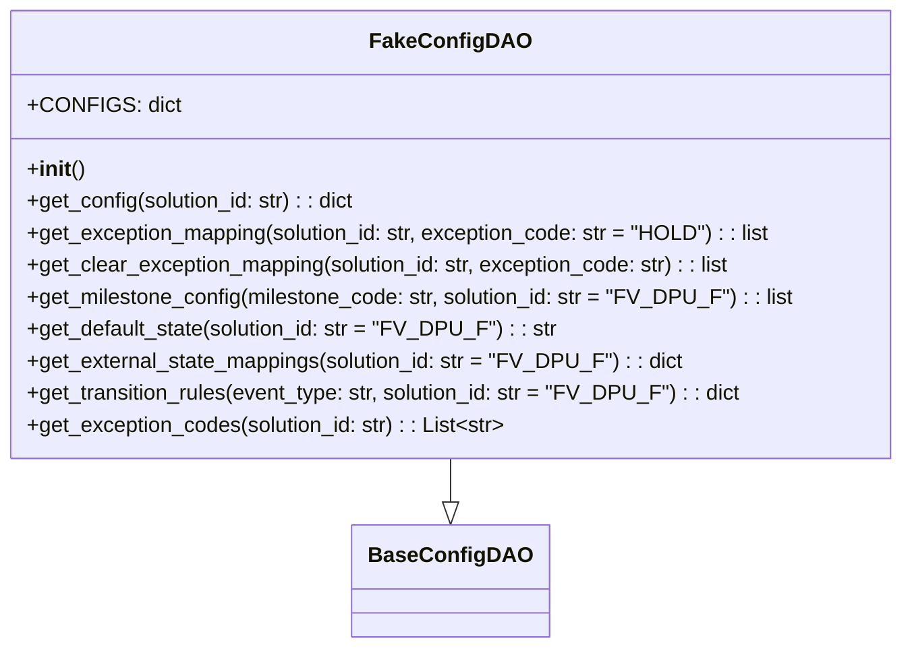

# Diagram: entity_core/entity_service/entity_service/entity/entity/external_state/daos/fake_config_dao.py


> Auto-generated by Obscura crawlers

## Diagram 1



### SVG

<svg id="container" width="668.1796875" xmlns="http://www.w3.org/2000/svg" class="classDiagram" height="486" viewBox="0 0 668.1796875 486" role="graphics-document document" aria-roledescription="class"><style>#container{font-family:"trebuchet ms",verdana,arial,sans-serif;font-size:16px;fill:#333;}@keyframes edge-animation-frame{from{stroke-dashoffset:0;}}@keyframes dash{to{stroke-dashoffset:0;}}#container .edge-animation-slow{stroke-dasharray:9,5!important;stroke-dashoffset:900;animation:dash 50s linear infinite;stroke-linecap:round;}#container .edge-animation-fast{stroke-dasharray:9,5!important;stroke-dashoffset:900;animation:dash 20s linear infinite;stroke-linecap:round;}#container .error-icon{fill:#552222;}#container .error-text{fill:#552222;stroke:#552222;}#container .edge-thickness-normal{stroke-width:1px;}#container .edge-thickness-thick{stroke-width:3.5px;}#container .edge-pattern-solid{stroke-dasharray:0;}#container .edge-thickness-invisible{stroke-width:0;fill:none;}#container .edge-pattern-dashed{stroke-dasharray:3;}#container .edge-pattern-dotted{stroke-dasharray:2;}#container .marker{fill:#333333;stroke:#333333;}#container .marker.cross{stroke:#333333;}#container svg{font-family:"trebuchet ms",verdana,arial,sans-serif;font-size:16px;}#container p{margin:0;}#container g.classGroup text{fill:#9370DB;stroke:none;font-family:"trebuchet ms",verdana,arial,sans-serif;font-size:10px;}#container g.classGroup text .title{font-weight:bolder;}#container .nodeLabel,#container .edgeLabel{color:#131300;}#container .edgeLabel .label rect{fill:#ECECFF;}#container .label text{fill:#131300;}#container .labelBkg{background:#ECECFF;}#container .edgeLabel .label span{background:#ECECFF;}#container .classTitle{font-weight:bolder;}#container .node rect,#container .node circle,#container .node ellipse,#container .node polygon,#container .node path{fill:#ECECFF;stroke:#9370DB;stroke-width:1px;}#container .divider{stroke:#9370DB;stroke-width:1;}#container g.clickable{cursor:pointer;}#container g.classGroup rect{fill:#ECECFF;stroke:#9370DB;}#container g.classGroup line{stroke:#9370DB;stroke-width:1;}#container .classLabel .box{stroke:none;stroke-width:0;fill:#ECECFF;opacity:0.5;}#container .classLabel .label{fill:#9370DB;font-size:10px;}#container .relation{stroke:#333333;stroke-width:1;fill:none;}#container .dashed-line{stroke-dasharray:3;}#container .dotted-line{stroke-dasharray:1 2;}#container #compositionStart,#container .composition{fill:#333333!important;stroke:#333333!important;stroke-width:1;}#container #compositionEnd,#container .composition{fill:#333333!important;stroke:#333333!important;stroke-width:1;}#container #dependencyStart,#container .dependency{fill:#333333!important;stroke:#333333!important;stroke-width:1;}#container #dependencyStart,#container .dependency{fill:#333333!important;stroke:#333333!important;stroke-width:1;}#container #extensionStart,#container .extension{fill:transparent!important;stroke:#333333!important;stroke-width:1;}#container #extensionEnd,#container .extension{fill:transparent!important;stroke:#333333!important;stroke-width:1;}#container #aggregationStart,#container .aggregation{fill:transparent!important;stroke:#333333!important;stroke-width:1;}#container #aggregationEnd,#container .aggregation{fill:transparent!important;stroke:#333333!important;stroke-width:1;}#container #lollipopStart,#container .lollipop{fill:#ECECFF!important;stroke:#333333!important;stroke-width:1;}#container #lollipopEnd,#container .lollipop{fill:#ECECFF!important;stroke:#333333!important;stroke-width:1;}#container .edgeTerminals{font-size:11px;line-height:initial;}#container .classTitleText{text-anchor:middle;font-size:18px;fill:#333;}#container .label-icon{display:inline-block;height:1em;overflow:visible;vertical-align:-0.125em;}#container .node .label-icon path{fill:currentColor;stroke:revert;stroke-width:revert;}#container :root{--mermaid-font-family:"trebuchet ms",verdana,arial,sans-serif;}</style><g><defs><marker id="container_class-aggregationStart" class="marker aggregation class" refX="18" refY="7" markerWidth="190" markerHeight="240" orient="auto"><path d="M 18,7 L9,13 L1,7 L9,1 Z"></path></marker></defs><defs><marker id="container_class-aggregationEnd" class="marker aggregation class" refX="1" refY="7" markerWidth="20" markerHeight="28" orient="auto"><path d="M 18,7 L9,13 L1,7 L9,1 Z"></path></marker></defs><defs><marker id="container_class-extensionStart" class="marker extension class" refX="18" refY="7" markerWidth="190" markerHeight="240" orient="auto"><path d="M 1,7 L18,13 V 1 Z"></path></marker></defs><defs><marker id="container_class-extensionEnd" class="marker extension class" refX="1" refY="7" markerWidth="20" markerHeight="28" orient="auto"><path d="M 1,1 V 13 L18,7 Z"></path></marker></defs><defs><marker id="container_class-compositionStart" class="marker composition class" refX="18" refY="7" markerWidth="190" markerHeight="240" orient="auto"><path d="M 18,7 L9,13 L1,7 L9,1 Z"></path></marker></defs><defs><marker id="container_class-compositionEnd" class="marker composition class" refX="1" refY="7" markerWidth="20" markerHeight="28" orient="auto"><path d="M 18,7 L9,13 L1,7 L9,1 Z"></path></marker></defs><defs><marker id="container_class-dependencyStart" class="marker dependency class" refX="6" refY="7" markerWidth="190" markerHeight="240" orient="auto"><path d="M 5,7 L9,13 L1,7 L9,1 Z"></path></marker></defs><defs><marker id="container_class-dependencyEnd" class="marker dependency class" refX="13" refY="7" markerWidth="20" markerHeight="28" orient="auto"><path d="M 18,7 L9,13 L14,7 L9,1 Z"></path></marker></defs><defs><marker id="container_class-lollipopStart" class="marker lollipop class" refX="13" refY="7" markerWidth="190" markerHeight="240" orient="auto"><circle stroke="black" fill="transparent" cx="7" cy="7" r="6"></circle></marker></defs><defs><marker id="container_class-lollipopEnd" class="marker lollipop class" refX="1" refY="7" markerWidth="190" markerHeight="240" orient="auto"><circle stroke="black" fill="transparent" cx="7" cy="7" r="6"></circle></marker></defs><g class="root"><g class="clusters"></g><g class="edgePaths"><path d="M334.09,344L334.09,348.167C334.09,352.333,334.09,360.667,334.09,366.125C334.09,371.583,334.09,374.167,334.09,375.458L334.09,376.75" id="id_FakeConfigDAO_BaseConfigDAO_1" class="edge-thickness-normal edge-pattern-solid relation" style=";;;" data-edge="true" data-et="edge" data-id="id_FakeConfigDAO_BaseConfigDAO_1" data-points="W3sieCI6MzM0LjA4OTg0Mzc1LCJ5IjozNDR9LHsieCI6MzM0LjA4OTg0Mzc1LCJ5IjozNjl9LHsieCI6MzM0LjA4OTg0Mzc1LCJ5IjozOTR9XQ==" marker-end="url(#container_class-extensionEnd)"></path></g><g class="edgeLabels"><g class="edgeLabel"><g class="label" data-id="id_FakeConfigDAO_BaseConfigDAO_1" transform="translate(0, 0)"><foreignObject width="0" height="0"><div xmlns="http://www.w3.org/1999/xhtml" class="labelBkg" style="display: table-cell; white-space: nowrap; line-height: 1.5; max-width: 200px; text-align: center;"><span class="edgeLabel"></span></div></foreignObject></g></g></g><g class="nodes"><g class="node default" id="classId-BaseConfigDAO-0" transform="translate(334.08984375, 436)"><g class="basic label-container"><path d="M-67.75 -42 L67.75 -42 L67.75 42 L-67.75 42" stroke="none" stroke-width="0" fill="#ECECFF" style=""></path><path d="M-67.75 -42 C-13.940551234684861 -42, 39.86889753063028 -42, 67.75 -42 M-67.75 -42 C-37.01202411798116 -42, -6.274048235962326 -42, 67.75 -42 M67.75 -42 C67.75 -16.05144847928027, 67.75 9.897103041439458, 67.75 42 M67.75 -42 C67.75 -22.738830921863542, 67.75 -3.477661843727084, 67.75 42 M67.75 42 C36.31650296309062 42, 4.883005926181241 42, -67.75 42 M67.75 42 C20.12820392453022 42, -27.493592150939563 42, -67.75 42 M-67.75 42 C-67.75 17.601028191040875, -67.75 -6.79794361791825, -67.75 -42 M-67.75 42 C-67.75 20.56824326087155, -67.75 -0.8635134782568983, -67.75 -42" stroke="#9370DB" stroke-width="1.3" fill="none" stroke-dasharray="0 0" style=""></path></g><g class="annotation-group text" transform="translate(0, -18)"></g><g class="label-group text" transform="translate(-55.75, -18)"><g class="label" style="font-weight: bolder" transform="translate(0,-12)"><foreignObject width="111.5" height="24"><div xmlns="http://www.w3.org/1999/xhtml" style="display: table-cell; white-space: nowrap; line-height: 1.5; max-width: 160px; text-align: center;"><span class="nodeLabel markdown-node-label" style=""><p>BaseConfigDAO</p></span></div></foreignObject></g></g><g class="members-group text" transform="translate(-55.75, 30)"></g><g class="methods-group text" transform="translate(-55.75, 60)"></g><g class="divider" style=""><path d="M-67.75 6 C-40.487049936081974 6, -13.22409987216394 6, 67.75 6 M-67.75 6 C-22.32728082568174 6, 23.09543834863652 6, 67.75 6" stroke="#9370DB" stroke-width="1.3" fill="none" stroke-dasharray="0 0" style=""></path></g><g class="divider" style=""><path d="M-67.75 24 C-19.409857826983902 24, 28.930284346032195 24, 67.75 24 M-67.75 24 C-22.692535655583782 24, 22.364928688832435 24, 67.75 24" stroke="#9370DB" stroke-width="1.3" fill="none" stroke-dasharray="0 0" style=""></path></g></g><g class="node default" id="classId-FakeConfigDAO-1" transform="translate(334.08984375, 176)"><g class="basic label-container"><path d="M-326.08984375 -168 L326.08984375 -168 L326.08984375 168 L-326.08984375 168" stroke="none" stroke-width="0" fill="#ECECFF" style=""></path><path d="M-326.08984375 -168 C-105.62312604539176 -168, 114.84359165921649 -168, 326.08984375 -168 M-326.08984375 -168 C-89.28752767991318 -168, 147.51478839017363 -168, 326.08984375 -168 M326.08984375 -168 C326.08984375 -76.57778500384364, 326.08984375 14.844429992312712, 326.08984375 168 M326.08984375 -168 C326.08984375 -88.52052243753286, 326.08984375 -9.041044875065722, 326.08984375 168 M326.08984375 168 C154.27742687020663 168, -17.53499000958675 168, -326.08984375 168 M326.08984375 168 C162.3529032787611 168, -1.3840371924778196 168, -326.08984375 168 M-326.08984375 168 C-326.08984375 41.01978630571874, -326.08984375 -85.96042738856252, -326.08984375 -168 M-326.08984375 168 C-326.08984375 39.716453511971224, -326.08984375 -88.56709297605755, -326.08984375 -168" stroke="#9370DB" stroke-width="1.3" fill="none" stroke-dasharray="0 0" style=""></path></g><g class="annotation-group text" transform="translate(0, -144)"></g><g class="label-group text" transform="translate(-54.7578125, -144)"><g class="label" style="font-weight: bolder" transform="translate(0,-12)"><foreignObject width="109.515625" height="24"><div xmlns="http://www.w3.org/1999/xhtml" style="display: table-cell; white-space: nowrap; line-height: 1.5; max-width: 157px; text-align: center;"><span class="nodeLabel markdown-node-label" style=""><p>FakeConfigDAO</p></span></div></foreignObject></g></g><g class="members-group text" transform="translate(-314.08984375, -96)"><g class="label" style="" transform="translate(0,-12)"><foreignObject width="105.609375" height="24"><div xmlns="http://www.w3.org/1999/xhtml" style="display: table-cell; white-space: nowrap; line-height: 1.5; max-width: 163px; text-align: center;"><span class="nodeLabel markdown-node-label" style=""><p>+CONFIGS: dict</p></span></div></foreignObject></g></g><g class="methods-group text" transform="translate(-314.08984375, -48)"><g class="label" style="" transform="translate(0,-12)"><foreignObject width="42.796875" height="24"><div xmlns="http://www.w3.org/1999/xhtml" style="display: table-cell; white-space: nowrap; line-height: 1.5; max-width: 132px; text-align: center;"><span class="nodeLabel markdown-node-label" style=""><p>+<strong>init</strong>()</p></span></div></foreignObject></g><g class="label" style="" transform="translate(0,12)"><foreignObject width="250.125" height="24"><div xmlns="http://www.w3.org/1999/xhtml" style="display: table-cell; white-space: nowrap; line-height: 1.5; max-width: 308px; text-align: center;"><span class="nodeLabel markdown-node-label" style=""><p>+get_config(solution_id: str) : : dict</p></span></div></foreignObject></g><g class="label" style="" transform="translate(0,36)"><foreignObject width="561.6875" height="24"><div xmlns="http://www.w3.org/1999/xhtml" style="display: table-cell; white-space: nowrap; line-height: 1.5; max-width: 619px; text-align: center;"><span class="nodeLabel markdown-node-label" style=""><p>+get_exception_mapping(solution_id: str, exception_code: str = "HOLD") : : list</p></span></div></foreignObject></g><g class="label" style="" transform="translate(0,60)"><foreignObject width="534.640625" height="24"><div xmlns="http://www.w3.org/1999/xhtml" style="display: table-cell; white-space: nowrap; line-height: 1.5; max-width: 592px; text-align: center;"><span class="nodeLabel markdown-node-label" style=""><p>+get_clear_exception_mapping(solution_id: str, exception_code: str) : : list</p></span></div></foreignObject></g><g class="label" style="" transform="translate(0,84)"><foreignObject width="573.421875" height="24"><div xmlns="http://www.w3.org/1999/xhtml" style="display: table-cell; white-space: nowrap; line-height: 1.5; max-width: 631px; text-align: center;"><span class="nodeLabel markdown-node-label" style=""><p>+get_milestone_config(milestone_code: str, solution_id: str = "FV_DPU_F") : : list</p></span></div></foreignObject></g><g class="label" style="" transform="translate(0,108)"><foreignObject width="394.078125" height="24"><div xmlns="http://www.w3.org/1999/xhtml" style="display: table-cell; white-space: nowrap; line-height: 1.5; max-width: 452px; text-align: center;"><span class="nodeLabel markdown-node-label" style=""><p>+get_default_state(solution_id: str = "FV_DPU_F") : : str</p></span></div></foreignObject></g><g class="label" style="" transform="translate(0,132)"><foreignObject width="488.75" height="24"><div xmlns="http://www.w3.org/1999/xhtml" style="display: table-cell; white-space: nowrap; line-height: 1.5; max-width: 546px; text-align: center;"><span class="nodeLabel markdown-node-label" style=""><p>+get_external_state_mappings(solution_id: str = "FV_DPU_F") : : dict</p></span></div></foreignObject></g><g class="label" style="" transform="translate(0,156)"><foreignObject width="535.46875" height="24"><div xmlns="http://www.w3.org/1999/xhtml" style="display: table-cell; white-space: nowrap; line-height: 1.5; max-width: 593px; text-align: center;"><span class="nodeLabel markdown-node-label" style=""><p>+get_transition_rules(event_type: str, solution_id: str = "FV_DPU_F") : : dict</p></span></div></foreignObject></g><g class="label" style="" transform="translate(0,180)"><foreignObject width="361.390625" height="24"><div xmlns="http://www.w3.org/1999/xhtml" style="display: table-cell; white-space: nowrap; line-height: 1.5; max-width: 458px; text-align: center;"><span class="nodeLabel markdown-node-label" style=""><p>+get_exception_codes(solution_id: str) : : List&lt;str&gt;</p></span></div></foreignObject></g></g><g class="divider" style=""><path d="M-326.08984375 -120 C-106.26368732259078 -120, 113.56246910481843 -120, 326.08984375 -120 M-326.08984375 -120 C-152.23005460927448 -120, 21.62973453145105 -120, 326.08984375 -120" stroke="#9370DB" stroke-width="1.3" fill="none" stroke-dasharray="0 0" style=""></path></g><g class="divider" style=""><path d="M-326.08984375 -72 C-170.31000199016188 -72, -14.530160230323759 -72, 326.08984375 -72 M-326.08984375 -72 C-156.6972474827398 -72, 12.695348784520377 -72, 326.08984375 -72" stroke="#9370DB" stroke-width="1.3" fill="none" stroke-dasharray="0 0" style=""></path></g></g></g></g></g></svg>

## Diagram 2

```mermaid
stateDiagram
    %% FV_DPU_F milestone-driven transitions
    [*] --> "Not Built": MILESTONE 230
    [*] --> "Pending Upfit (Produced-Upfit)": MILESTONE 310 / OriginUpfitterParty exists, hasActiveHold=false
    [*] --> "Non-Shippable (Produced-Upfit)": MILESTONE 310 / OriginUpfitterParty exists, hasActiveHold=true
    [*] --> "Pending Shipment": MILESTONE 310 / OriginUpfitterParty not exists, hasActiveHold=false
    [*] --> "Non-Shippable (Produced)": MILESTONE 310 / OriginUpfitterParty not exists, hasActiveHold=true

    [*] --> "Pending Upfit (GateReleased-Upfit)": MILESTONE 400 / OriginUpfitterParty exists, hasActiveHold=false
    [*] --> "Non-Shippable (GateReleased-Upfit)": MILESTONE 400 / OriginUpfitterParty exists, hasActiveHold=true
    [*] --> "Shippable (GateReleased)": MILESTONE 400 / OriginUpfitterParty not exists, hasActiveHold=false
    [*] --> "Non-Shippable (GateReleased)": MILESTONE 400 / OriginUpfitterParty not exists, hasActiveHold=true

    [*] --> "Shippable (WorkComplete-Upfit)": MILESTONE X5 / OriginUpfitterParty exists, hasActiveHold=false
    [*] --> "Non-Shippable (WorkComplete-Upfit)": MILESTONE X5 / OriginUpfitterParty exists, hasActiveHold=true

    %% SET_EXCEPTION mappings (HOLD & ITSS) for FV_DPU_F
    "Pending Shipment" --> "Non-Shippable (Produced)": SET_EXCEPTION HOLD / ITSS
    "Pending Upfit (Produced-Upfit)" --> "Non-Shippable (Produced-Upfit)": SET_EXCEPTION HOLD / ITSS
    "Pending Upfit (GateReleased-Upfit)" --> "Non-Shippable (GateReleased-Upfit)": SET_EXCEPTION HOLD / ITSS
    "Shippable (GateReleased)" --> "Non-Shippable (GateReleased)": SET_EXCEPTION HOLD / ITSS
    "Shippable (WorkComplete-Upfit)" --> "Non-Shippable (WorkComplete-Upfit)": SET_EXCEPTION HOLD / ITSS
    "Not Built" --> "Not Built": SET_EXCEPTION HOLD / ITSS

    %% CLEAR_EXCEPTION mappings for FV_DPU_F
    "Non-Shippable (Produced)" --> "Pending Shipment": CLEAR_EXCEPTION HOLD
    "Non-Shippable (Produced-Upfit)" --> "Pending Upfit (Produced-Upfit)": CLEAR_EXCEPTION HOLD
    "Non-Shippable (GateReleased)" --> "Shippable (GateReleased)": CLEAR_EXCEPTION HOLD
    "Non-Shippable (GateReleased-Upfit)" --> "Pending Upfit (GateReleased-Upfit)": CLEAR_EXCEPTION HOLD
    "Non-Shippable (WorkComplete-Upfit)" --> "Shippable (WorkComplete-Upfit)": CLEAR_EXCEPTION HOLD
    "Not Built" --> "Not Built": CLEAR_EXCEPTION HOLD

    %% FV_TEST simplified transitions and defaults
    state "FV_TEST Default" as FVTEST
    FVTEST : defaultState = "Shippable"
    [*] --> "Shippable": FVTEST default
    [*] --> "Non-Shippable": SET_EXCEPTION HOLD / ITSS (FV_TEST)
    "Non-Shippable" --> "Shippable": CLEAR_EXCEPTION HOLD (FV_TEST)
```

> SVG rendering failed for this diagram.
