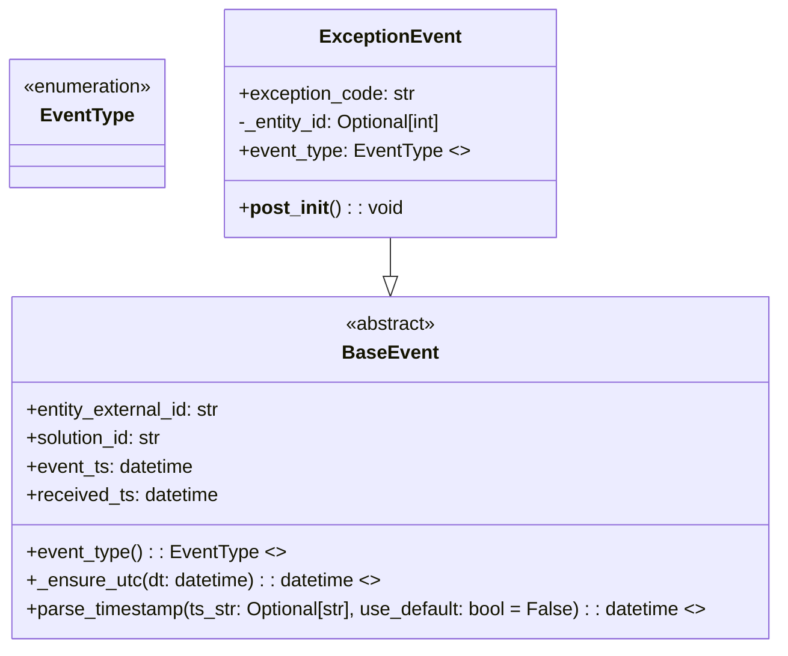

# Diagram: entity_core/entity_service/entity_service/entity/entity/external_state/events/base_event.py

> Auto-generated by Obscura crawlers

## Mermaid

```mermaid
classDiagram
class EventType {
<<enumeration>>
}
class BaseEvent <<abstract>> {
+entity_external_id: str
+solution_id: str
+event_ts: datetime
+received_ts: datetime
+event_type(): EventType <<property, abstract>>
+_ensure_utc(dt: datetime): datetime <<staticmethod>>
+parse_timestamp(ts_str: Optional[str], use_default: bool = False): datetime <<staticmethod>>
}
class ExceptionEvent {
+exception_code: str
-_entity_id: Optional[int]
+event_type: EventType <<ClassVar>>
+__post_init__(): void
}
ExceptionEvent --|> BaseEvent
```

> SVG rendering failed for this diagram.
