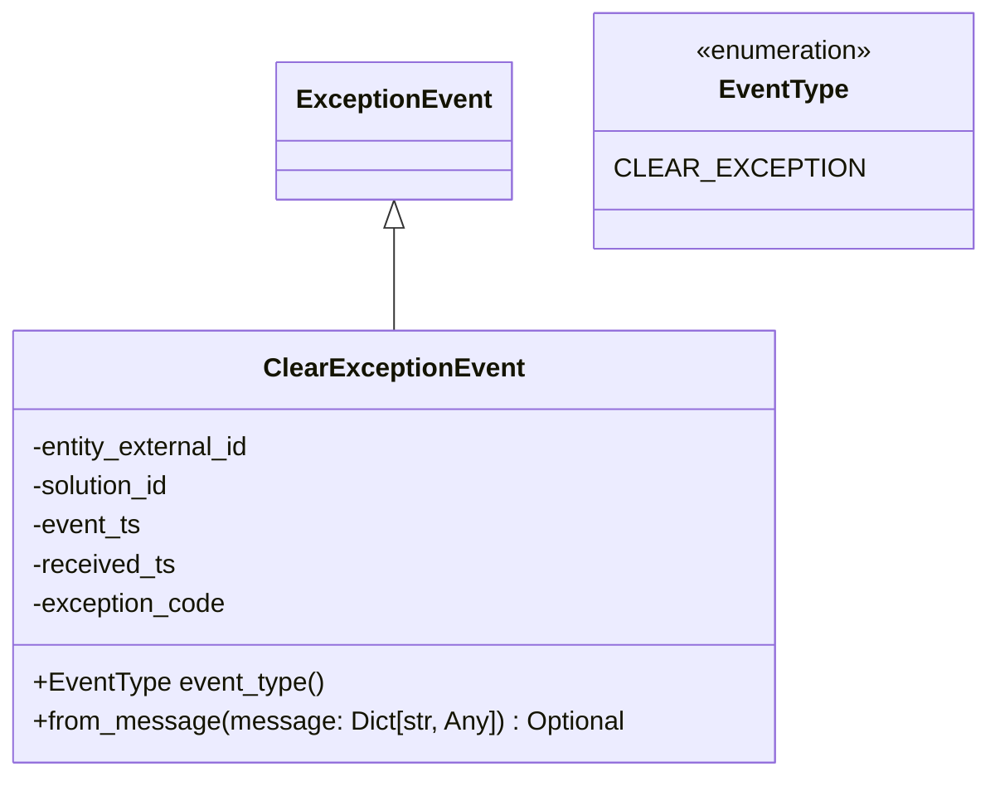

# Diagram: entity_core/entity_service/entity_service/entity/entity/external_state/events/clear_exception_event.py


> Auto-generated by Obscura crawlers

## Diagram 1



### SVG

<svg id="container" width="573.66015625" xmlns="http://www.w3.org/2000/svg" class="classDiagram" height="474" viewBox="0 0 573.66015625 474" role="graphics-document document" aria-roledescription="class"><style>#container{font-family:"trebuchet ms",verdana,arial,sans-serif;font-size:16px;fill:#333;}@keyframes edge-animation-frame{from{stroke-dashoffset:0;}}@keyframes dash{to{stroke-dashoffset:0;}}#container .edge-animation-slow{stroke-dasharray:9,5!important;stroke-dashoffset:900;animation:dash 50s linear infinite;stroke-linecap:round;}#container .edge-animation-fast{stroke-dasharray:9,5!important;stroke-dashoffset:900;animation:dash 20s linear infinite;stroke-linecap:round;}#container .error-icon{fill:#552222;}#container .error-text{fill:#552222;stroke:#552222;}#container .edge-thickness-normal{stroke-width:1px;}#container .edge-thickness-thick{stroke-width:3.5px;}#container .edge-pattern-solid{stroke-dasharray:0;}#container .edge-thickness-invisible{stroke-width:0;fill:none;}#container .edge-pattern-dashed{stroke-dasharray:3;}#container .edge-pattern-dotted{stroke-dasharray:2;}#container .marker{fill:#333333;stroke:#333333;}#container .marker.cross{stroke:#333333;}#container svg{font-family:"trebuchet ms",verdana,arial,sans-serif;font-size:16px;}#container p{margin:0;}#container g.classGroup text{fill:#9370DB;stroke:none;font-family:"trebuchet ms",verdana,arial,sans-serif;font-size:10px;}#container g.classGroup text .title{font-weight:bolder;}#container .nodeLabel,#container .edgeLabel{color:#131300;}#container .edgeLabel .label rect{fill:#ECECFF;}#container .label text{fill:#131300;}#container .labelBkg{background:#ECECFF;}#container .edgeLabel .label span{background:#ECECFF;}#container .classTitle{font-weight:bolder;}#container .node rect,#container .node circle,#container .node ellipse,#container .node polygon,#container .node path{fill:#ECECFF;stroke:#9370DB;stroke-width:1px;}#container .divider{stroke:#9370DB;stroke-width:1;}#container g.clickable{cursor:pointer;}#container g.classGroup rect{fill:#ECECFF;stroke:#9370DB;}#container g.classGroup line{stroke:#9370DB;stroke-width:1;}#container .classLabel .box{stroke:none;stroke-width:0;fill:#ECECFF;opacity:0.5;}#container .classLabel .label{fill:#9370DB;font-size:10px;}#container .relation{stroke:#333333;stroke-width:1;fill:none;}#container .dashed-line{stroke-dasharray:3;}#container .dotted-line{stroke-dasharray:1 2;}#container #compositionStart,#container .composition{fill:#333333!important;stroke:#333333!important;stroke-width:1;}#container #compositionEnd,#container .composition{fill:#333333!important;stroke:#333333!important;stroke-width:1;}#container #dependencyStart,#container .dependency{fill:#333333!important;stroke:#333333!important;stroke-width:1;}#container #dependencyStart,#container .dependency{fill:#333333!important;stroke:#333333!important;stroke-width:1;}#container #extensionStart,#container .extension{fill:transparent!important;stroke:#333333!important;stroke-width:1;}#container #extensionEnd,#container .extension{fill:transparent!important;stroke:#333333!important;stroke-width:1;}#container #aggregationStart,#container .aggregation{fill:transparent!important;stroke:#333333!important;stroke-width:1;}#container #aggregationEnd,#container .aggregation{fill:transparent!important;stroke:#333333!important;stroke-width:1;}#container #lollipopStart,#container .lollipop{fill:#ECECFF!important;stroke:#333333!important;stroke-width:1;}#container #lollipopEnd,#container .lollipop{fill:#ECECFF!important;stroke:#333333!important;stroke-width:1;}#container .edgeTerminals{font-size:11px;line-height:initial;}#container .classTitleText{text-anchor:middle;font-size:18px;fill:#333;}#container .label-icon{display:inline-block;height:1em;overflow:visible;vertical-align:-0.125em;}#container .node .label-icon path{fill:currentColor;stroke:revert;stroke-width:revert;}#container :root{--mermaid-font-family:"trebuchet ms",verdana,arial,sans-serif;}</style><g><defs><marker id="container_class-aggregationStart" class="marker aggregation class" refX="18" refY="7" markerWidth="190" markerHeight="240" orient="auto"><path d="M 18,7 L9,13 L1,7 L9,1 Z"></path></marker></defs><defs><marker id="container_class-aggregationEnd" class="marker aggregation class" refX="1" refY="7" markerWidth="20" markerHeight="28" orient="auto"><path d="M 18,7 L9,13 L1,7 L9,1 Z"></path></marker></defs><defs><marker id="container_class-extensionStart" class="marker extension class" refX="18" refY="7" markerWidth="190" markerHeight="240" orient="auto"><path d="M 1,7 L18,13 V 1 Z"></path></marker></defs><defs><marker id="container_class-extensionEnd" class="marker extension class" refX="1" refY="7" markerWidth="20" markerHeight="28" orient="auto"><path d="M 1,1 V 13 L18,7 Z"></path></marker></defs><defs><marker id="container_class-compositionStart" class="marker composition class" refX="18" refY="7" markerWidth="190" markerHeight="240" orient="auto"><path d="M 18,7 L9,13 L1,7 L9,1 Z"></path></marker></defs><defs><marker id="container_class-compositionEnd" class="marker composition class" refX="1" refY="7" markerWidth="20" markerHeight="28" orient="auto"><path d="M 18,7 L9,13 L1,7 L9,1 Z"></path></marker></defs><defs><marker id="container_class-dependencyStart" class="marker dependency class" refX="6" refY="7" markerWidth="190" markerHeight="240" orient="auto"><path d="M 5,7 L9,13 L1,7 L9,1 Z"></path></marker></defs><defs><marker id="container_class-dependencyEnd" class="marker dependency class" refX="13" refY="7" markerWidth="20" markerHeight="28" orient="auto"><path d="M 18,7 L9,13 L14,7 L9,1 Z"></path></marker></defs><defs><marker id="container_class-lollipopStart" class="marker lollipop class" refX="13" refY="7" markerWidth="190" markerHeight="240" orient="auto"><circle stroke="black" fill="transparent" cx="7" cy="7" r="6"></circle></marker></defs><defs><marker id="container_class-lollipopEnd" class="marker lollipop class" refX="1" refY="7" markerWidth="190" markerHeight="240" orient="auto"><circle stroke="black" fill="transparent" cx="7" cy="7" r="6"></circle></marker></defs><g class="root"><g class="clusters"></g><g class="edgePaths"><path d="M237.152,139.25L237.152,145.542C237.152,151.833,237.152,164.417,237.152,174.875C237.152,185.333,237.152,193.667,237.152,197.833L237.152,202" id="id_ExceptionEvent_ClearExceptionEvent_1" class="edge-thickness-normal edge-pattern-solid relation" style=";;;" data-edge="true" data-et="edge" data-id="id_ExceptionEvent_ClearExceptionEvent_1" data-points="W3sieCI6MjM3LjE1MjM0Mzc1LCJ5IjoxMjJ9LHsieCI6MjM3LjE1MjM0Mzc1LCJ5IjoxNzd9LHsieCI6MjM3LjE1MjM0Mzc1LCJ5IjoyMDJ9XQ==" marker-start="url(#container_class-extensionStart)"></path></g><g class="edgeLabels"><g class="edgeLabel"><g class="label" data-id="id_ExceptionEvent_ClearExceptionEvent_1" transform="translate(0, 0)"><foreignObject width="0" height="0"><div xmlns="http://www.w3.org/1999/xhtml" class="labelBkg" style="display: table-cell; white-space: nowrap; line-height: 1.5; max-width: 200px; text-align: center;"><span class="edgeLabel"></span></div></foreignObject></g></g></g><g class="nodes"><g class="node default" id="classId-ExceptionEvent-0" transform="translate(237.15234375, 80)"><g class="basic label-container"><path d="M-67.90625 -42 L67.90625 -42 L67.90625 42 L-67.90625 42" stroke="none" stroke-width="0" fill="#ECECFF" style=""></path><path d="M-67.90625 -42 C-23.654003453277973 -42, 20.598243093444054 -42, 67.90625 -42 M-67.90625 -42 C-38.168765155386524 -42, -8.43128031077304 -42, 67.90625 -42 M67.90625 -42 C67.90625 -8.729397614328398, 67.90625 24.541204771343203, 67.90625 42 M67.90625 -42 C67.90625 -21.65690151729141, 67.90625 -1.3138030345828184, 67.90625 42 M67.90625 42 C38.45095951946979 42, 8.995669038939575 42, -67.90625 42 M67.90625 42 C30.655605526426072 42, -6.595038947147856 42, -67.90625 42 M-67.90625 42 C-67.90625 8.643712163951719, -67.90625 -24.712575672096563, -67.90625 -42 M-67.90625 42 C-67.90625 24.17019657118434, -67.90625 6.340393142368683, -67.90625 -42" stroke="#9370DB" stroke-width="1.3" fill="none" stroke-dasharray="0 0" style=""></path></g><g class="annotation-group text" transform="translate(0, -18)"></g><g class="label-group text" transform="translate(-55.90625, -18)"><g class="label" style="font-weight: bolder" transform="translate(0,-12)"><foreignObject width="111.8125" height="24"><div xmlns="http://www.w3.org/1999/xhtml" style="display: table-cell; white-space: nowrap; line-height: 1.5; max-width: 161px; text-align: center;"><span class="nodeLabel markdown-node-label" style=""><p>ExceptionEvent</p></span></div></foreignObject></g></g><g class="members-group text" transform="translate(-55.90625, 30)"></g><g class="methods-group text" transform="translate(-55.90625, 60)"></g><g class="divider" style=""><path d="M-67.90625 6 C-33.64413481340042 6, 0.6179803731991598 6, 67.90625 6 M-67.90625 6 C-31.09609025563858 6, 5.714069488722842 6, 67.90625 6" stroke="#9370DB" stroke-width="1.3" fill="none" stroke-dasharray="0 0" style=""></path></g><g class="divider" style=""><path d="M-67.90625 24 C-19.186275802718733 24, 29.533698394562535 24, 67.90625 24 M-67.90625 24 C-21.53976481558029 24, 24.826720368839418 24, 67.90625 24" stroke="#9370DB" stroke-width="1.3" fill="none" stroke-dasharray="0 0" style=""></path></g></g><g class="node default" id="classId-ClearExceptionEvent-1" transform="translate(237.15234375, 334)"><g class="basic label-container"><path d="M-229.15234375 -132 L229.15234375 -132 L229.15234375 132 L-229.15234375 132" stroke="none" stroke-width="0" fill="#ECECFF" style=""></path><path d="M-229.15234375 -132 C-131.9717676879754 -132, -34.791191625950745 -132, 229.15234375 -132 M-229.15234375 -132 C-53.18822002110545 -132, 122.7759037077891 -132, 229.15234375 -132 M229.15234375 -132 C229.15234375 -30.506259460064513, 229.15234375 70.98748107987097, 229.15234375 132 M229.15234375 -132 C229.15234375 -54.65844119044827, 229.15234375 22.683117619103456, 229.15234375 132 M229.15234375 132 C117.8146500890723 132, 6.476956428144604 132, -229.15234375 132 M229.15234375 132 C102.12780792543927 132, -24.89672789912146 132, -229.15234375 132 M-229.15234375 132 C-229.15234375 65.40860530731322, -229.15234375 -1.1827893853735532, -229.15234375 -132 M-229.15234375 132 C-229.15234375 35.60367407902862, -229.15234375 -60.79265184194276, -229.15234375 -132" stroke="#9370DB" stroke-width="1.3" fill="none" stroke-dasharray="0 0" style=""></path></g><g class="annotation-group text" transform="translate(0, -108)"></g><g class="label-group text" transform="translate(-74.6953125, -108)"><g class="label" style="font-weight: bolder" transform="translate(0,-12)"><foreignObject width="149.390625" height="24"><div xmlns="http://www.w3.org/1999/xhtml" style="display: table-cell; white-space: nowrap; line-height: 1.5; max-width: 198px; text-align: center;"><span class="nodeLabel markdown-node-label" style=""><p>ClearExceptionEvent</p></span></div></foreignObject></g></g><g class="members-group text" transform="translate(-217.15234375, -60)"><g class="label" style="" transform="translate(0,-12)"><foreignObject width="137.703125" height="24"><div xmlns="http://www.w3.org/1999/xhtml" style="display: table-cell; white-space: nowrap; line-height: 1.5; max-width: 195px; text-align: center;"><span class="nodeLabel markdown-node-label" style=""><p>-entity_external_id</p></span></div></foreignObject></g><g class="label" style="" transform="translate(0,12)"><foreignObject width="88.6875" height="24"><div xmlns="http://www.w3.org/1999/xhtml" style="display: table-cell; white-space: nowrap; line-height: 1.5; max-width: 146px; text-align: center;"><span class="nodeLabel markdown-node-label" style=""><p>-solution_id</p></span></div></foreignObject></g><g class="label" style="" transform="translate(0,36)"><foreignObject width="68.046875" height="24"><div xmlns="http://www.w3.org/1999/xhtml" style="display: table-cell; white-space: nowrap; line-height: 1.5; max-width: 125px; text-align: center;"><span class="nodeLabel markdown-node-label" style=""><p>-event_ts</p></span></div></foreignObject></g><g class="label" style="" transform="translate(0,60)"><foreignObject width="88.78125" height="24"><div xmlns="http://www.w3.org/1999/xhtml" style="display: table-cell; white-space: nowrap; line-height: 1.5; max-width: 146px; text-align: center;"><span class="nodeLabel markdown-node-label" style=""><p>-received_ts</p></span></div></foreignObject></g><g class="label" style="" transform="translate(0,84)"><foreignObject width="120.171875" height="24"><div xmlns="http://www.w3.org/1999/xhtml" style="display: table-cell; white-space: nowrap; line-height: 1.5; max-width: 178px; text-align: center;"><span class="nodeLabel markdown-node-label" style=""><p>-exception_code</p></span></div></foreignObject></g></g><g class="methods-group text" transform="translate(-217.15234375, 84)"><g class="label" style="" transform="translate(0,-12)"><foreignObject width="176.375" height="24"><div xmlns="http://www.w3.org/1999/xhtml" style="display: table-cell; white-space: nowrap; line-height: 1.5; max-width: 234px; text-align: center;"><span class="nodeLabel markdown-node-label" style=""><p>+EventType event_type()</p></span></div></foreignObject></g><g class="label" style="" transform="translate(0,12)"><foreignObject width="359.609375" height="24"><div xmlns="http://www.w3.org/1999/xhtml" style="display: table-cell; white-space: nowrap; line-height: 1.5; max-width: 417px; text-align: center;"><span class="nodeLabel markdown-node-label" style=""><p>+from_message(message: Dict[str, Any]) : Optional</p></span></div></foreignObject></g></g><g class="divider" style=""><path d="M-229.15234375 -84 C-87.60011579680148 -84, 53.95211215639705 -84, 229.15234375 -84 M-229.15234375 -84 C-51.1989836755119 -84, 126.7543763989762 -84, 229.15234375 -84" stroke="#9370DB" stroke-width="1.3" fill="none" stroke-dasharray="0 0" style=""></path></g><g class="divider" style=""><path d="M-229.15234375 60 C-120.99675941929543 60, -12.841175088590859 60, 229.15234375 60 M-229.15234375 60 C-111.73596630367227 60, 5.680411142655458 60, 229.15234375 60" stroke="#9370DB" stroke-width="1.3" fill="none" stroke-dasharray="0 0" style=""></path></g></g><g class="node default" id="classId-EventType-2" transform="translate(460.359375, 80)"><g class="basic label-container"><path d="M-105.30078125 -72 L105.30078125 -72 L105.30078125 72 L-105.30078125 72" stroke="none" stroke-width="0" fill="#ECECFF" style=""></path><path d="M-105.30078125 -72 C-34.52325590370839 -72, 36.25426944258322 -72, 105.30078125 -72 M-105.30078125 -72 C-34.350239931606495 -72, 36.60030138678701 -72, 105.30078125 -72 M105.30078125 -72 C105.30078125 -42.846214288382114, 105.30078125 -13.692428576764229, 105.30078125 72 M105.30078125 -72 C105.30078125 -42.18293225184925, 105.30078125 -12.365864503698504, 105.30078125 72 M105.30078125 72 C38.79676866147673 72, -27.707243927046534 72, -105.30078125 72 M105.30078125 72 C50.65910960407474 72, -3.982562041850514 72, -105.30078125 72 M-105.30078125 72 C-105.30078125 28.729907793159185, -105.30078125 -14.54018441368163, -105.30078125 -72 M-105.30078125 72 C-105.30078125 24.827011722733815, -105.30078125 -22.34597655453237, -105.30078125 -72" stroke="#9370DB" stroke-width="1.3" fill="none" stroke-dasharray="0 0" style=""></path></g><g class="annotation-group text" transform="translate(-55.5546875, -48)"><g class="label" style="" transform="translate(0,-12)"><foreignObject width="111.109375" height="24"><div xmlns="http://www.w3.org/1999/xhtml" style="display: table-cell; white-space: nowrap; line-height: 1.5; max-width: 161px; text-align: center;"><span class="nodeLabel markdown-node-label" style=""><p>«enumeration»</p></span></div></foreignObject></g></g><g class="label-group text" transform="translate(-37.546875, -24)"><g class="label" style="font-weight: bolder" transform="translate(0,-12)"><foreignObject width="75.09375" height="24"><div xmlns="http://www.w3.org/1999/xhtml" style="display: table-cell; white-space: nowrap; line-height: 1.5; max-width: 124px; text-align: center;"><span class="nodeLabel markdown-node-label" style=""><p>EventType</p></span></div></foreignObject></g></g><g class="members-group text" transform="translate(-93.30078125, 24)"><g class="label" style="" transform="translate(0,-12)"><foreignObject width="131.046875" height="24"><div xmlns="http://www.w3.org/1999/xhtml" style="display: table-cell; white-space: nowrap; line-height: 1.5; max-width: 181px; text-align: center;"><span class="nodeLabel markdown-node-label" style=""><p>CLEAR_EXCEPTION</p></span></div></foreignObject></g></g><g class="methods-group text" transform="translate(-93.30078125, 72)"></g><g class="divider" style=""><path d="M-105.30078125 0 C-45.449921848868414 0, 14.400937552263173 0, 105.30078125 0 M-105.30078125 0 C-34.206474006118896 0, 36.88783323776221 0, 105.30078125 0" stroke="#9370DB" stroke-width="1.3" fill="none" stroke-dasharray="0 0" style=""></path></g><g class="divider" style=""><path d="M-105.30078125 48 C-26.577032343028904 48, 52.14671656394219 48, 105.30078125 48 M-105.30078125 48 C-53.700943495038075 48, -2.10110574007615 48, 105.30078125 48" stroke="#9370DB" stroke-width="1.3" fill="none" stroke-dasharray="0 0" style=""></path></g></g></g></g></g></svg>

## Diagram 2

```mermaid
flowchart LR
M[message] --> E{snsMessageExtraData present?}
E -->|yes| X[extra_data = message["snsMessageExtraData"]]
E -->|no| X
X --> C{extra_data.eventCode == "HoldCleared"}
C -->|yes| H1[exception_code = "HOLD"]
C -->|no| H2[exception_code = extra_data["exceptionType"]]
H1 --> T1[event_ts = parse_timestamp(message.body.clearedEventDate)]
H2 --> T1
T1 --> R[received_ts = parse_timestamp(extra_data.eventReceivedDate, use_default=true)]
R --> I[Instantiate cls(entity_external_id=extra_data.externalId, solution_id=extra_data.solutionId, event_ts, received_ts, exception_code)\nreturn instance]
```

> SVG rendering failed for this diagram.
