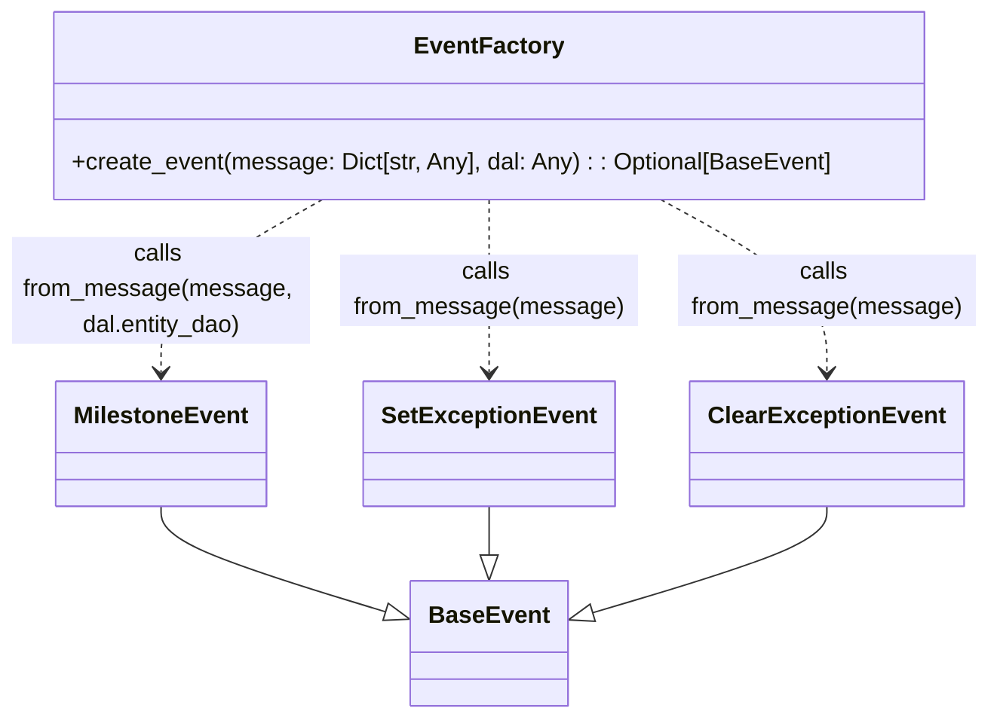

# Diagram: entity_core/entity_service/entity_service/entity/entity/external_state/events/factory.py


> Auto-generated by Obscura crawlers

## Diagram 1



### SVG

<svg id="container" width="656" xmlns="http://www.w3.org/2000/svg" class="classDiagram" height="482" viewBox="0 0 656 482" role="graphics-document document" aria-roledescription="class"><style>#container{font-family:"trebuchet ms",verdana,arial,sans-serif;font-size:16px;fill:#333;}@keyframes edge-animation-frame{from{stroke-dashoffset:0;}}@keyframes dash{to{stroke-dashoffset:0;}}#container .edge-animation-slow{stroke-dasharray:9,5!important;stroke-dashoffset:900;animation:dash 50s linear infinite;stroke-linecap:round;}#container .edge-animation-fast{stroke-dasharray:9,5!important;stroke-dashoffset:900;animation:dash 20s linear infinite;stroke-linecap:round;}#container .error-icon{fill:#552222;}#container .error-text{fill:#552222;stroke:#552222;}#container .edge-thickness-normal{stroke-width:1px;}#container .edge-thickness-thick{stroke-width:3.5px;}#container .edge-pattern-solid{stroke-dasharray:0;}#container .edge-thickness-invisible{stroke-width:0;fill:none;}#container .edge-pattern-dashed{stroke-dasharray:3;}#container .edge-pattern-dotted{stroke-dasharray:2;}#container .marker{fill:#333333;stroke:#333333;}#container .marker.cross{stroke:#333333;}#container svg{font-family:"trebuchet ms",verdana,arial,sans-serif;font-size:16px;}#container p{margin:0;}#container g.classGroup text{fill:#9370DB;stroke:none;font-family:"trebuchet ms",verdana,arial,sans-serif;font-size:10px;}#container g.classGroup text .title{font-weight:bolder;}#container .nodeLabel,#container .edgeLabel{color:#131300;}#container .edgeLabel .label rect{fill:#ECECFF;}#container .label text{fill:#131300;}#container .labelBkg{background:#ECECFF;}#container .edgeLabel .label span{background:#ECECFF;}#container .classTitle{font-weight:bolder;}#container .node rect,#container .node circle,#container .node ellipse,#container .node polygon,#container .node path{fill:#ECECFF;stroke:#9370DB;stroke-width:1px;}#container .divider{stroke:#9370DB;stroke-width:1;}#container g.clickable{cursor:pointer;}#container g.classGroup rect{fill:#ECECFF;stroke:#9370DB;}#container g.classGroup line{stroke:#9370DB;stroke-width:1;}#container .classLabel .box{stroke:none;stroke-width:0;fill:#ECECFF;opacity:0.5;}#container .classLabel .label{fill:#9370DB;font-size:10px;}#container .relation{stroke:#333333;stroke-width:1;fill:none;}#container .dashed-line{stroke-dasharray:3;}#container .dotted-line{stroke-dasharray:1 2;}#container #compositionStart,#container .composition{fill:#333333!important;stroke:#333333!important;stroke-width:1;}#container #compositionEnd,#container .composition{fill:#333333!important;stroke:#333333!important;stroke-width:1;}#container #dependencyStart,#container .dependency{fill:#333333!important;stroke:#333333!important;stroke-width:1;}#container #dependencyStart,#container .dependency{fill:#333333!important;stroke:#333333!important;stroke-width:1;}#container #extensionStart,#container .extension{fill:transparent!important;stroke:#333333!important;stroke-width:1;}#container #extensionEnd,#container .extension{fill:transparent!important;stroke:#333333!important;stroke-width:1;}#container #aggregationStart,#container .aggregation{fill:transparent!important;stroke:#333333!important;stroke-width:1;}#container #aggregationEnd,#container .aggregation{fill:transparent!important;stroke:#333333!important;stroke-width:1;}#container #lollipopStart,#container .lollipop{fill:#ECECFF!important;stroke:#333333!important;stroke-width:1;}#container #lollipopEnd,#container .lollipop{fill:#ECECFF!important;stroke:#333333!important;stroke-width:1;}#container .edgeTerminals{font-size:11px;line-height:initial;}#container .classTitleText{text-anchor:middle;font-size:18px;fill:#333;}#container .label-icon{display:inline-block;height:1em;overflow:visible;vertical-align:-0.125em;}#container .node .label-icon path{fill:currentColor;stroke:revert;stroke-width:revert;}#container :root{--mermaid-font-family:"trebuchet ms",verdana,arial,sans-serif;}</style><g><defs><marker id="container_class-aggregationStart" class="marker aggregation class" refX="18" refY="7" markerWidth="190" markerHeight="240" orient="auto"><path d="M 18,7 L9,13 L1,7 L9,1 Z"></path></marker></defs><defs><marker id="container_class-aggregationEnd" class="marker aggregation class" refX="1" refY="7" markerWidth="20" markerHeight="28" orient="auto"><path d="M 18,7 L9,13 L1,7 L9,1 Z"></path></marker></defs><defs><marker id="container_class-extensionStart" class="marker extension class" refX="18" refY="7" markerWidth="190" markerHeight="240" orient="auto"><path d="M 1,7 L18,13 V 1 Z"></path></marker></defs><defs><marker id="container_class-extensionEnd" class="marker extension class" refX="1" refY="7" markerWidth="20" markerHeight="28" orient="auto"><path d="M 1,1 V 13 L18,7 Z"></path></marker></defs><defs><marker id="container_class-compositionStart" class="marker composition class" refX="18" refY="7" markerWidth="190" markerHeight="240" orient="auto"><path d="M 18,7 L9,13 L1,7 L9,1 Z"></path></marker></defs><defs><marker id="container_class-compositionEnd" class="marker composition class" refX="1" refY="7" markerWidth="20" markerHeight="28" orient="auto"><path d="M 18,7 L9,13 L1,7 L9,1 Z"></path></marker></defs><defs><marker id="container_class-dependencyStart" class="marker dependency class" refX="6" refY="7" markerWidth="190" markerHeight="240" orient="auto"><path d="M 5,7 L9,13 L1,7 L9,1 Z"></path></marker></defs><defs><marker id="container_class-dependencyEnd" class="marker dependency class" refX="13" refY="7" markerWidth="20" markerHeight="28" orient="auto"><path d="M 18,7 L9,13 L14,7 L9,1 Z"></path></marker></defs><defs><marker id="container_class-lollipopStart" class="marker lollipop class" refX="13" refY="7" markerWidth="190" markerHeight="240" orient="auto"><circle stroke="black" fill="transparent" cx="7" cy="7" r="6"></circle></marker></defs><defs><marker id="container_class-lollipopEnd" class="marker lollipop class" refX="1" refY="7" markerWidth="190" markerHeight="240" orient="auto"><circle stroke="black" fill="transparent" cx="7" cy="7" r="6"></circle></marker></defs><g class="root"><g class="clusters"></g><g class="edgePaths"><path d="M108,340L108,344.167C108,348.333,108,356.667,133.627,368.638C159.255,380.609,210.509,396.219,236.137,404.023L261.764,411.828" id="id_MilestoneEvent_BaseEvent_1" class="edge-thickness-normal edge-pattern-solid relation" style=";;;" data-edge="true" data-et="edge" data-id="id_MilestoneEvent_BaseEvent_1" data-points="W3sieCI6MTA4LCJ5IjozNDB9LHsieCI6MTA4LCJ5IjozNjV9LHsieCI6Mjc4LjI2NTYyNSwieSI6NDE2Ljg1MzYyMjE1OTA5MDl9XQ==" marker-end="url(#container_class-extensionEnd)"></path><path d="M328,340L328,344.167C328,348.333,328,356.667,328,362.125C328,367.583,328,370.167,328,371.458L328,372.75" id="id_SetExceptionEvent_BaseEvent_2" class="edge-thickness-normal edge-pattern-solid relation" style=";;;" data-edge="true" data-et="edge" data-id="id_SetExceptionEvent_BaseEvent_2" data-points="W3sieCI6MzI4LCJ5IjozNDB9LHsieCI6MzI4LCJ5IjozNjV9LHsieCI6MzI4LCJ5IjozOTB9XQ==" marker-end="url(#container_class-extensionEnd)"></path><path d="M548,340L548,344.167C548,348.333,548,356.667,522.373,368.638C496.745,380.609,445.491,396.219,419.863,404.023L394.236,411.828" id="id_ClearExceptionEvent_BaseEvent_3" class="edge-thickness-normal edge-pattern-solid relation" style=";;;" data-edge="true" data-et="edge" data-id="id_ClearExceptionEvent_BaseEvent_3" data-points="W3sieCI6NTQ4LCJ5IjozNDB9LHsieCI6NTQ4LCJ5IjozNjV9LHsieCI6Mzc3LjczNDM3NSwieSI6NDE2Ljg1MzYyMjE1OTA5MDl9XQ==" marker-end="url(#container_class-extensionEnd)"></path><path d="M216.226,134L198.188,144.167C180.151,154.333,144.075,174.667,126.038,194C108,213.333,108,231.667,108,240.833L108,250" id="id_EventFactory_MilestoneEvent_4" class="edge-thickness-normal edge-pattern-dashed relation" style=";;;" data-edge="true" data-et="edge" data-id="id_EventFactory_MilestoneEvent_4" data-points="W3sieCI6MjE2LjIyNTgwNjQ1MTYxMjksInkiOjEzNH0seyJ4IjoxMDgsInkiOjE5NX0seyJ4IjoxMDgsInkiOjI1Nn1d" marker-end="url(#container_class-dependencyEnd)"></path><path d="M328,134L328,144.167C328,154.333,328,174.667,328,194C328,213.333,328,231.667,328,240.833L328,250" id="id_EventFactory_SetExceptionEvent_5" class="edge-thickness-normal edge-pattern-dashed relation" style=";;;" data-edge="true" data-et="edge" data-id="id_EventFactory_SetExceptionEvent_5" data-points="W3sieCI6MzI4LCJ5IjoxMzR9LHsieCI6MzI4LCJ5IjoxOTV9LHsieCI6MzI4LCJ5IjoyNTZ9XQ==" marker-end="url(#container_class-dependencyEnd)"></path><path d="M439.774,134L457.812,144.167C475.849,154.333,511.925,174.667,529.962,194C548,213.333,548,231.667,548,240.833L548,250" id="id_EventFactory_ClearExceptionEvent_6" class="edge-thickness-normal edge-pattern-dashed relation" style=";;;" data-edge="true" data-et="edge" data-id="id_EventFactory_ClearExceptionEvent_6" data-points="W3sieCI6NDM5Ljc3NDE5MzU0ODM4NzEsInkiOjEzNH0seyJ4Ijo1NDgsInkiOjE5NX0seyJ4Ijo1NDgsInkiOjI1Nn1d" marker-end="url(#container_class-dependencyEnd)"></path></g><g class="edgeLabels"><g class="edgeLabel"><g class="label" data-id="id_MilestoneEvent_BaseEvent_1" transform="translate(0, 0)"><foreignObject width="0" height="0"><div xmlns="http://www.w3.org/1999/xhtml" class="labelBkg" style="display: table-cell; white-space: nowrap; line-height: 1.5; max-width: 200px; text-align: center;"><span class="edgeLabel"></span></div></foreignObject></g></g><g class="edgeLabel"><g class="label" data-id="id_SetExceptionEvent_BaseEvent_2" transform="translate(0, 0)"><foreignObject width="0" height="0"><div xmlns="http://www.w3.org/1999/xhtml" class="labelBkg" style="display: table-cell; white-space: nowrap; line-height: 1.5; max-width: 200px; text-align: center;"><span class="edgeLabel"></span></div></foreignObject></g></g><g class="edgeLabel"><g class="label" data-id="id_ClearExceptionEvent_BaseEvent_3" transform="translate(0, 0)"><foreignObject width="0" height="0"><div xmlns="http://www.w3.org/1999/xhtml" class="labelBkg" style="display: table-cell; white-space: nowrap; line-height: 1.5; max-width: 200px; text-align: center;"><span class="edgeLabel"></span></div></foreignObject></g></g><g class="edgeLabel" transform="translate(108, 195)"><g class="label" data-id="id_EventFactory_MilestoneEvent_4" transform="translate(-100, -36)"><foreignObject width="200" height="72"><div xmlns="http://www.w3.org/1999/xhtml" class="labelBkg" style="display: table; white-space: break-spaces; line-height: 1.5; max-width: 200px; text-align: center; width: 200px;"><span class="edgeLabel"><p>calls from_message(message, dal.entity_dao)</p></span></div></foreignObject></g></g><g class="edgeLabel" transform="translate(328, 195)"><g class="label" data-id="id_EventFactory_SetExceptionEvent_5" transform="translate(-100, -24)"><foreignObject width="200" height="48"><div xmlns="http://www.w3.org/1999/xhtml" class="labelBkg" style="display: table; white-space: break-spaces; line-height: 1.5; max-width: 200px; text-align: center; width: 200px;"><span class="edgeLabel"><p>calls from_message(message)</p></span></div></foreignObject></g></g><g class="edgeLabel" transform="translate(548, 195)"><g class="label" data-id="id_EventFactory_ClearExceptionEvent_6" transform="translate(-100, -24)"><foreignObject width="200" height="48"><div xmlns="http://www.w3.org/1999/xhtml" class="labelBkg" style="display: table; white-space: break-spaces; line-height: 1.5; max-width: 200px; text-align: center; width: 200px;"><span class="edgeLabel"><p>calls from_message(message)</p></span></div></foreignObject></g></g></g><g class="nodes"><g class="node default" id="classId-BaseEvent-0" transform="translate(328, 432)"><g class="basic label-container"><path d="M-49.734375 -42 L49.734375 -42 L49.734375 42 L-49.734375 42" stroke="none" stroke-width="0" fill="#ECECFF" style=""></path><path d="M-49.734375 -42 C-11.325844907041166 -42, 27.08268518591767 -42, 49.734375 -42 M-49.734375 -42 C-22.64672410256819 -42, 4.440926794863621 -42, 49.734375 -42 M49.734375 -42 C49.734375 -21.72414624258371, 49.734375 -1.4482924851674213, 49.734375 42 M49.734375 -42 C49.734375 -9.401884652298271, 49.734375 23.196230695403457, 49.734375 42 M49.734375 42 C27.98715177639992 42, 6.239928552799839 42, -49.734375 42 M49.734375 42 C26.62611630710218 42, 3.5178576142043596 42, -49.734375 42 M-49.734375 42 C-49.734375 15.385452859664067, -49.734375 -11.229094280671866, -49.734375 -42 M-49.734375 42 C-49.734375 23.99895065740222, -49.734375 5.997901314804437, -49.734375 -42" stroke="#9370DB" stroke-width="1.3" fill="none" stroke-dasharray="0 0" style=""></path></g><g class="annotation-group text" transform="translate(0, -18)"></g><g class="label-group text" transform="translate(-37.734375, -18)"><g class="label" style="font-weight: bolder" transform="translate(0,-12)"><foreignObject width="75.46875" height="24"><div xmlns="http://www.w3.org/1999/xhtml" style="display: table-cell; white-space: nowrap; line-height: 1.5; max-width: 125px; text-align: center;"><span class="nodeLabel markdown-node-label" style=""><p>BaseEvent</p></span></div></foreignObject></g></g><g class="members-group text" transform="translate(-37.734375, 30)"></g><g class="methods-group text" transform="translate(-37.734375, 60)"></g><g class="divider" style=""><path d="M-49.734375 6 C-15.224981904620648 6, 19.284411190758703 6, 49.734375 6 M-49.734375 6 C-14.620105718684506 6, 20.494163562630987 6, 49.734375 6" stroke="#9370DB" stroke-width="1.3" fill="none" stroke-dasharray="0 0" style=""></path></g><g class="divider" style=""><path d="M-49.734375 24 C-12.91800813890569 24, 23.89835872218862 24, 49.734375 24 M-49.734375 24 C-23.842347888996656 24, 2.049679222006688 24, 49.734375 24" stroke="#9370DB" stroke-width="1.3" fill="none" stroke-dasharray="0 0" style=""></path></g></g><g class="node default" id="classId-MilestoneEvent-1" transform="translate(108, 298)"><g class="basic label-container"><path d="M-68.0234375 -42 L68.0234375 -42 L68.0234375 42 L-68.0234375 42" stroke="none" stroke-width="0" fill="#ECECFF" style=""></path><path d="M-68.0234375 -42 C-28.34770300998033 -42, 11.328031480039343 -42, 68.0234375 -42 M-68.0234375 -42 C-32.54811042734923 -42, 2.9272166453015416 -42, 68.0234375 -42 M68.0234375 -42 C68.0234375 -13.461168052604059, 68.0234375 15.077663894791883, 68.0234375 42 M68.0234375 -42 C68.0234375 -17.273885699245266, 68.0234375 7.452228601509468, 68.0234375 42 M68.0234375 42 C38.202466610283864 42, 8.381495720567735 42, -68.0234375 42 M68.0234375 42 C29.413888163498783 42, -9.195661173002435 42, -68.0234375 42 M-68.0234375 42 C-68.0234375 20.02098122468893, -68.0234375 -1.9580375506221372, -68.0234375 -42 M-68.0234375 42 C-68.0234375 23.937419485613106, -68.0234375 5.874838971226211, -68.0234375 -42" stroke="#9370DB" stroke-width="1.3" fill="none" stroke-dasharray="0 0" style=""></path></g><g class="annotation-group text" transform="translate(0, -18)"></g><g class="label-group text" transform="translate(-56.0234375, -18)"><g class="label" style="font-weight: bolder" transform="translate(0,-12)"><foreignObject width="112.046875" height="24"><div xmlns="http://www.w3.org/1999/xhtml" style="display: table-cell; white-space: nowrap; line-height: 1.5; max-width: 161px; text-align: center;"><span class="nodeLabel markdown-node-label" style=""><p>MilestoneEvent</p></span></div></foreignObject></g></g><g class="members-group text" transform="translate(-56.0234375, 30)"></g><g class="methods-group text" transform="translate(-56.0234375, 60)"></g><g class="divider" style=""><path d="M-68.0234375 6 C-19.14551465086101 6, 29.73240819827798 6, 68.0234375 6 M-68.0234375 6 C-16.7070046878194 6, 34.6094281243612 6, 68.0234375 6" stroke="#9370DB" stroke-width="1.3" fill="none" stroke-dasharray="0 0" style=""></path></g><g class="divider" style=""><path d="M-68.0234375 24 C-23.591787510074177 24, 20.839862479851647 24, 68.0234375 24 M-68.0234375 24 C-35.17540811097574 24, -2.327378721951476 24, 68.0234375 24" stroke="#9370DB" stroke-width="1.3" fill="none" stroke-dasharray="0 0" style=""></path></g></g><g class="node default" id="classId-SetExceptionEvent-2" transform="translate(328, 298)"><g class="basic label-container"><path d="M-79.984375 -42 L79.984375 -42 L79.984375 42 L-79.984375 42" stroke="none" stroke-width="0" fill="#ECECFF" style=""></path><path d="M-79.984375 -42 C-28.607860375595614 -42, 22.768654248808772 -42, 79.984375 -42 M-79.984375 -42 C-35.51398181332977 -42, 8.956411373340458 -42, 79.984375 -42 M79.984375 -42 C79.984375 -11.506830881045193, 79.984375 18.986338237909614, 79.984375 42 M79.984375 -42 C79.984375 -9.18474562223669, 79.984375 23.63050875552662, 79.984375 42 M79.984375 42 C20.6392516863647 42, -38.7058716272706 42, -79.984375 42 M79.984375 42 C32.26500508704046 42, -15.454364825919086 42, -79.984375 42 M-79.984375 42 C-79.984375 15.403308003267473, -79.984375 -11.193383993465055, -79.984375 -42 M-79.984375 42 C-79.984375 16.37501058680949, -79.984375 -9.249978826381017, -79.984375 -42" stroke="#9370DB" stroke-width="1.3" fill="none" stroke-dasharray="0 0" style=""></path></g><g class="annotation-group text" transform="translate(0, -18)"></g><g class="label-group text" transform="translate(-67.984375, -18)"><g class="label" style="font-weight: bolder" transform="translate(0,-12)"><foreignObject width="135.96875" height="24"><div xmlns="http://www.w3.org/1999/xhtml" style="display: table-cell; white-space: nowrap; line-height: 1.5; max-width: 184px; text-align: center;"><span class="nodeLabel markdown-node-label" style=""><p>SetExceptionEvent</p></span></div></foreignObject></g></g><g class="members-group text" transform="translate(-67.984375, 30)"></g><g class="methods-group text" transform="translate(-67.984375, 60)"></g><g class="divider" style=""><path d="M-79.984375 6 C-20.72180775294551 6, 38.54075949410898 6, 79.984375 6 M-79.984375 6 C-37.73093511096862 6, 4.522504778062753 6, 79.984375 6" stroke="#9370DB" stroke-width="1.3" fill="none" stroke-dasharray="0 0" style=""></path></g><g class="divider" style=""><path d="M-79.984375 24 C-17.81511915834247 24, 44.35413668331506 24, 79.984375 24 M-79.984375 24 C-42.085932934405584 24, -4.187490868811167 24, 79.984375 24" stroke="#9370DB" stroke-width="1.3" fill="none" stroke-dasharray="0 0" style=""></path></g></g><g class="node default" id="classId-ClearExceptionEvent-3" transform="translate(548, 298)"><g class="basic label-container"><path d="M-86.6953125 -42 L86.6953125 -42 L86.6953125 42 L-86.6953125 42" stroke="none" stroke-width="0" fill="#ECECFF" style=""></path><path d="M-86.6953125 -42 C-34.38887258268203 -42, 17.917567334635933 -42, 86.6953125 -42 M-86.6953125 -42 C-21.184875362330658 -42, 44.325561775338684 -42, 86.6953125 -42 M86.6953125 -42 C86.6953125 -21.282224820389555, 86.6953125 -0.5644496407791095, 86.6953125 42 M86.6953125 -42 C86.6953125 -17.97978398979458, 86.6953125 6.04043202041084, 86.6953125 42 M86.6953125 42 C48.20150663666134 42, 9.707700773322685 42, -86.6953125 42 M86.6953125 42 C32.29020698868268 42, -22.114898522634647 42, -86.6953125 42 M-86.6953125 42 C-86.6953125 11.819103248846847, -86.6953125 -18.361793502306305, -86.6953125 -42 M-86.6953125 42 C-86.6953125 19.06895992574972, -86.6953125 -3.86208014850056, -86.6953125 -42" stroke="#9370DB" stroke-width="1.3" fill="none" stroke-dasharray="0 0" style=""></path></g><g class="annotation-group text" transform="translate(0, -18)"></g><g class="label-group text" transform="translate(-74.6953125, -18)"><g class="label" style="font-weight: bolder" transform="translate(0,-12)"><foreignObject width="149.390625" height="24"><div xmlns="http://www.w3.org/1999/xhtml" style="display: table-cell; white-space: nowrap; line-height: 1.5; max-width: 198px; text-align: center;"><span class="nodeLabel markdown-node-label" style=""><p>ClearExceptionEvent</p></span></div></foreignObject></g></g><g class="members-group text" transform="translate(-74.6953125, 30)"></g><g class="methods-group text" transform="translate(-74.6953125, 60)"></g><g class="divider" style=""><path d="M-86.6953125 6 C-22.917740955913082 6, 40.859830588173836 6, 86.6953125 6 M-86.6953125 6 C-28.6289070701904 6, 29.437498359619198 6, 86.6953125 6" stroke="#9370DB" stroke-width="1.3" fill="none" stroke-dasharray="0 0" style=""></path></g><g class="divider" style=""><path d="M-86.6953125 24 C-25.82081681469611 24, 35.05367887060778 24, 86.6953125 24 M-86.6953125 24 C-32.316079640887494 24, 22.06315321822501 24, 86.6953125 24" stroke="#9370DB" stroke-width="1.3" fill="none" stroke-dasharray="0 0" style=""></path></g></g><g class="node default" id="classId-EventFactory-4" transform="translate(328, 71)"><g class="basic label-container"><path d="M-288.5390625 -63 L288.5390625 -63 L288.5390625 63 L-288.5390625 63" stroke="none" stroke-width="0" fill="#ECECFF" style=""></path><path d="M-288.5390625 -63 C-96.29444072989205 -63, 95.95018104021591 -63, 288.5390625 -63 M-288.5390625 -63 C-152.15367772709024 -63, -15.768292954180481 -63, 288.5390625 -63 M288.5390625 -63 C288.5390625 -31.813087421543745, 288.5390625 -0.6261748430874903, 288.5390625 63 M288.5390625 -63 C288.5390625 -13.451377287147203, 288.5390625 36.097245425705594, 288.5390625 63 M288.5390625 63 C171.0037996732359 63, 53.46853684647181 63, -288.5390625 63 M288.5390625 63 C147.66060350779583 63, 6.7821445155916535 63, -288.5390625 63 M-288.5390625 63 C-288.5390625 23.791290053549865, -288.5390625 -15.41741989290027, -288.5390625 -63 M-288.5390625 63 C-288.5390625 33.99112899441904, -288.5390625 4.982257988838086, -288.5390625 -63" stroke="#9370DB" stroke-width="1.3" fill="none" stroke-dasharray="0 0" style=""></path></g><g class="annotation-group text" transform="translate(0, -39)"></g><g class="label-group text" transform="translate(-46.8125, -39)"><g class="label" style="font-weight: bolder" transform="translate(0,-12)"><foreignObject width="93.625" height="24"><div xmlns="http://www.w3.org/1999/xhtml" style="display: table-cell; white-space: nowrap; line-height: 1.5; max-width: 142px; text-align: center;"><span class="nodeLabel markdown-node-label" style=""><p>EventFactory</p></span></div></foreignObject></g></g><g class="members-group text" transform="translate(-276.5390625, 9)"></g><g class="methods-group text" transform="translate(-276.5390625, 39)"><g class="label" style="" transform="translate(0,-12)"><foreignObject width="506.265625" height="24"><div xmlns="http://www.w3.org/1999/xhtml" style="display: table-cell; white-space: nowrap; line-height: 1.5; max-width: 564px; text-align: center;"><span class="nodeLabel markdown-node-label" style=""><p>+create_event(message: Dict[str, Any], dal: Any) : : Optional[BaseEvent]</p></span></div></foreignObject></g></g><g class="divider" style=""><path d="M-288.5390625 -15 C-139.71000075887173 -15, 9.119060982256542 -15, 288.5390625 -15 M-288.5390625 -15 C-123.15155588830254 -15, 42.23595072339492 -15, 288.5390625 -15" stroke="#9370DB" stroke-width="1.3" fill="none" stroke-dasharray="0 0" style=""></path></g><g class="divider" style=""><path d="M-288.5390625 9 C-94.93943909494169 9, 98.66018431011662 9, 288.5390625 9 M-288.5390625 9 C-148.78508946998625 9, -9.031116439972493 9, 288.5390625 9" stroke="#9370DB" stroke-width="1.3" fill="none" stroke-dasharray="0 0" style=""></path></g></g></g></g></g></svg>

## Diagram 2

```mermaid
flowchart TD
    A[Receive message (Dict[str, Any])] --> B[Parse body = json.loads(message.get("body","{}"))]
    B --> C[Parse message = json.loads(body.get("Message","{}"))]
    C --> D[Call MilestoneEvent.from_message(message, dal.entity_dao)]
    D -->|milestone_event found| E[return milestone_event]
    D -->|None| F[extra_data = message.get("snsMessageExtraData", {})]
    F --> G{eventCode in {"HoldCreated","ExceptionCreated"}?}
    G -->|yes| H[return SetExceptionEvent.from_message(message)]
    G -->|no| I{eventCode in {"HoldCleared","ExceptionCleared"}?}
    I -->|yes| J[return ClearExceptionEvent.from_message(message)]
    I -->|no| K[return None]
```

> SVG rendering failed for this diagram.
