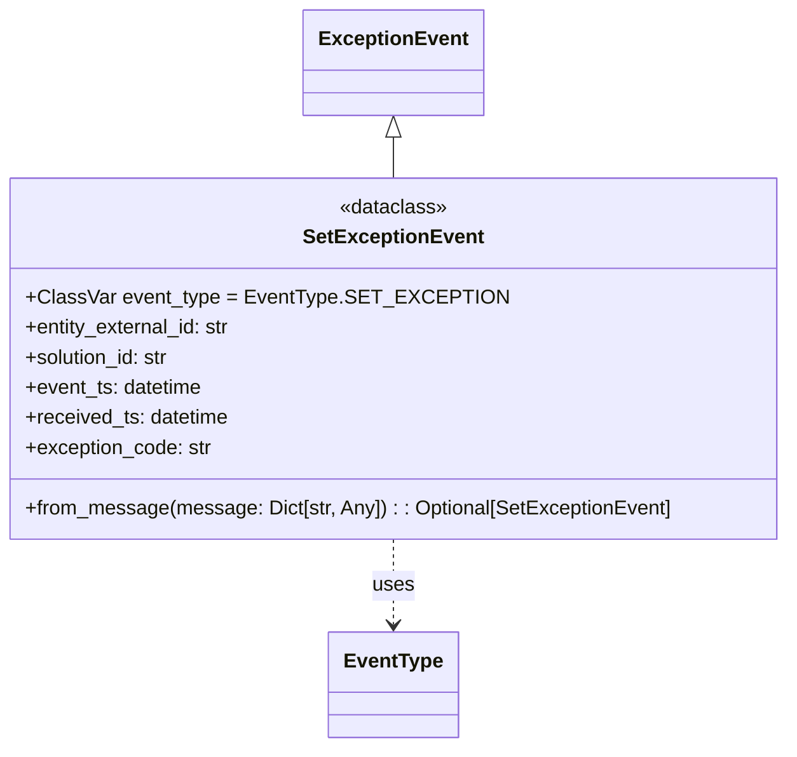

# Diagram: entity_core/entity_service/entity_service/entity/entity/external_state/events/set_exception_event.py


> Auto-generated by Obscura crawlers

## Diagram 1



### SVG

<svg id="container" width="620.015625" xmlns="http://www.w3.org/2000/svg" class="classDiagram" height="596" viewBox="0 0 620.015625 596" role="graphics-document document" aria-roledescription="class"><style>#container{font-family:"trebuchet ms",verdana,arial,sans-serif;font-size:16px;fill:#333;}@keyframes edge-animation-frame{from{stroke-dashoffset:0;}}@keyframes dash{to{stroke-dashoffset:0;}}#container .edge-animation-slow{stroke-dasharray:9,5!important;stroke-dashoffset:900;animation:dash 50s linear infinite;stroke-linecap:round;}#container .edge-animation-fast{stroke-dasharray:9,5!important;stroke-dashoffset:900;animation:dash 20s linear infinite;stroke-linecap:round;}#container .error-icon{fill:#552222;}#container .error-text{fill:#552222;stroke:#552222;}#container .edge-thickness-normal{stroke-width:1px;}#container .edge-thickness-thick{stroke-width:3.5px;}#container .edge-pattern-solid{stroke-dasharray:0;}#container .edge-thickness-invisible{stroke-width:0;fill:none;}#container .edge-pattern-dashed{stroke-dasharray:3;}#container .edge-pattern-dotted{stroke-dasharray:2;}#container .marker{fill:#333333;stroke:#333333;}#container .marker.cross{stroke:#333333;}#container svg{font-family:"trebuchet ms",verdana,arial,sans-serif;font-size:16px;}#container p{margin:0;}#container g.classGroup text{fill:#9370DB;stroke:none;font-family:"trebuchet ms",verdana,arial,sans-serif;font-size:10px;}#container g.classGroup text .title{font-weight:bolder;}#container .nodeLabel,#container .edgeLabel{color:#131300;}#container .edgeLabel .label rect{fill:#ECECFF;}#container .label text{fill:#131300;}#container .labelBkg{background:#ECECFF;}#container .edgeLabel .label span{background:#ECECFF;}#container .classTitle{font-weight:bolder;}#container .node rect,#container .node circle,#container .node ellipse,#container .node polygon,#container .node path{fill:#ECECFF;stroke:#9370DB;stroke-width:1px;}#container .divider{stroke:#9370DB;stroke-width:1;}#container g.clickable{cursor:pointer;}#container g.classGroup rect{fill:#ECECFF;stroke:#9370DB;}#container g.classGroup line{stroke:#9370DB;stroke-width:1;}#container .classLabel .box{stroke:none;stroke-width:0;fill:#ECECFF;opacity:0.5;}#container .classLabel .label{fill:#9370DB;font-size:10px;}#container .relation{stroke:#333333;stroke-width:1;fill:none;}#container .dashed-line{stroke-dasharray:3;}#container .dotted-line{stroke-dasharray:1 2;}#container #compositionStart,#container .composition{fill:#333333!important;stroke:#333333!important;stroke-width:1;}#container #compositionEnd,#container .composition{fill:#333333!important;stroke:#333333!important;stroke-width:1;}#container #dependencyStart,#container .dependency{fill:#333333!important;stroke:#333333!important;stroke-width:1;}#container #dependencyStart,#container .dependency{fill:#333333!important;stroke:#333333!important;stroke-width:1;}#container #extensionStart,#container .extension{fill:transparent!important;stroke:#333333!important;stroke-width:1;}#container #extensionEnd,#container .extension{fill:transparent!important;stroke:#333333!important;stroke-width:1;}#container #aggregationStart,#container .aggregation{fill:transparent!important;stroke:#333333!important;stroke-width:1;}#container #aggregationEnd,#container .aggregation{fill:transparent!important;stroke:#333333!important;stroke-width:1;}#container #lollipopStart,#container .lollipop{fill:#ECECFF!important;stroke:#333333!important;stroke-width:1;}#container #lollipopEnd,#container .lollipop{fill:#ECECFF!important;stroke:#333333!important;stroke-width:1;}#container .edgeTerminals{font-size:11px;line-height:initial;}#container .classTitleText{text-anchor:middle;font-size:18px;fill:#333;}#container .label-icon{display:inline-block;height:1em;overflow:visible;vertical-align:-0.125em;}#container .node .label-icon path{fill:currentColor;stroke:revert;stroke-width:revert;}#container :root{--mermaid-font-family:"trebuchet ms",verdana,arial,sans-serif;}</style><g><defs><marker id="container_class-aggregationStart" class="marker aggregation class" refX="18" refY="7" markerWidth="190" markerHeight="240" orient="auto"><path d="M 18,7 L9,13 L1,7 L9,1 Z"></path></marker></defs><defs><marker id="container_class-aggregationEnd" class="marker aggregation class" refX="1" refY="7" markerWidth="20" markerHeight="28" orient="auto"><path d="M 18,7 L9,13 L1,7 L9,1 Z"></path></marker></defs><defs><marker id="container_class-extensionStart" class="marker extension class" refX="18" refY="7" markerWidth="190" markerHeight="240" orient="auto"><path d="M 1,7 L18,13 V 1 Z"></path></marker></defs><defs><marker id="container_class-extensionEnd" class="marker extension class" refX="1" refY="7" markerWidth="20" markerHeight="28" orient="auto"><path d="M 1,1 V 13 L18,7 Z"></path></marker></defs><defs><marker id="container_class-compositionStart" class="marker composition class" refX="18" refY="7" markerWidth="190" markerHeight="240" orient="auto"><path d="M 18,7 L9,13 L1,7 L9,1 Z"></path></marker></defs><defs><marker id="container_class-compositionEnd" class="marker composition class" refX="1" refY="7" markerWidth="20" markerHeight="28" orient="auto"><path d="M 18,7 L9,13 L1,7 L9,1 Z"></path></marker></defs><defs><marker id="container_class-dependencyStart" class="marker dependency class" refX="6" refY="7" markerWidth="190" markerHeight="240" orient="auto"><path d="M 5,7 L9,13 L1,7 L9,1 Z"></path></marker></defs><defs><marker id="container_class-dependencyEnd" class="marker dependency class" refX="13" refY="7" markerWidth="20" markerHeight="28" orient="auto"><path d="M 18,7 L9,13 L14,7 L9,1 Z"></path></marker></defs><defs><marker id="container_class-lollipopStart" class="marker lollipop class" refX="13" refY="7" markerWidth="190" markerHeight="240" orient="auto"><circle stroke="black" fill="transparent" cx="7" cy="7" r="6"></circle></marker></defs><defs><marker id="container_class-lollipopEnd" class="marker lollipop class" refX="1" refY="7" markerWidth="190" markerHeight="240" orient="auto"><circle stroke="black" fill="transparent" cx="7" cy="7" r="6"></circle></marker></defs><g class="root"><g class="clusters"></g><g class="edgePaths"><path d="M310.008,109.25L310.008,110.542C310.008,111.833,310.008,114.417,310.008,119.875C310.008,125.333,310.008,133.667,310.008,137.833L310.008,142" id="id_ExceptionEvent_SetExceptionEvent_1" class="edge-thickness-normal edge-pattern-solid relation" style=";;;" data-edge="true" data-et="edge" data-id="id_ExceptionEvent_SetExceptionEvent_1" data-points="W3sieCI6MzEwLjAwNzgxMjUsInkiOjkyfSx7IngiOjMxMC4wMDc4MTI1LCJ5IjoxMTd9LHsieCI6MzEwLjAwNzgxMjUsInkiOjE0Mn1d" marker-start="url(#container_class-extensionStart)"></path><path d="M310.008,430L310.008,436.167C310.008,442.333,310.008,454.667,310.008,466C310.008,477.333,310.008,487.667,310.008,492.833L310.008,498" id="id_SetExceptionEvent_EventType_2" class="edge-thickness-normal edge-pattern-dashed relation" style=";;;" data-edge="true" data-et="edge" data-id="id_SetExceptionEvent_EventType_2" data-points="W3sieCI6MzEwLjAwNzgxMjUsInkiOjQzMH0seyJ4IjozMTAuMDA3ODEyNSwieSI6NDY3fSx7IngiOjMxMC4wMDc4MTI1LCJ5Ijo1MDR9XQ==" marker-end="url(#container_class-dependencyEnd)"></path></g><g class="edgeLabels"><g class="edgeLabel"><g class="label" data-id="id_ExceptionEvent_SetExceptionEvent_1" transform="translate(0, 0)"><foreignObject width="0" height="0"><div xmlns="http://www.w3.org/1999/xhtml" class="labelBkg" style="display: table-cell; white-space: nowrap; line-height: 1.5; max-width: 200px; text-align: center;"><span class="edgeLabel"></span></div></foreignObject></g></g><g class="edgeLabel" transform="translate(310.0078125, 467)"><g class="label" data-id="id_SetExceptionEvent_EventType_2" transform="translate(-16.4921875, -12)"><foreignObject width="32.984375" height="24"><div xmlns="http://www.w3.org/1999/xhtml" class="labelBkg" style="display: table-cell; white-space: nowrap; line-height: 1.5; max-width: 200px; text-align: center;"><span class="edgeLabel"><p>uses</p></span></div></foreignObject></g></g></g><g class="nodes"><g class="node default" id="classId-ExceptionEvent-0" transform="translate(310.0078125, 50)"><g class="basic label-container"><path d="M-67.90625 -42 L67.90625 -42 L67.90625 42 L-67.90625 42" stroke="none" stroke-width="0" fill="#ECECFF" style=""></path><path d="M-67.90625 -42 C-18.794916309803554 -42, 30.316417380392892 -42, 67.90625 -42 M-67.90625 -42 C-37.283329705143004 -42, -6.660409410286 -42, 67.90625 -42 M67.90625 -42 C67.90625 -18.050187941157258, 67.90625 5.899624117685484, 67.90625 42 M67.90625 -42 C67.90625 -14.475667956615727, 67.90625 13.048664086768547, 67.90625 42 M67.90625 42 C34.84875186317466 42, 1.791253726349325 42, -67.90625 42 M67.90625 42 C18.37235248638801 42, -31.16154502722398 42, -67.90625 42 M-67.90625 42 C-67.90625 19.843349752163547, -67.90625 -2.3133004956729053, -67.90625 -42 M-67.90625 42 C-67.90625 16.722341085739842, -67.90625 -8.555317828520316, -67.90625 -42" stroke="#9370DB" stroke-width="1.3" fill="none" stroke-dasharray="0 0" style=""></path></g><g class="annotation-group text" transform="translate(0, -18)"></g><g class="label-group text" transform="translate(-55.90625, -18)"><g class="label" style="font-weight: bolder" transform="translate(0,-12)"><foreignObject width="111.8125" height="24"><div xmlns="http://www.w3.org/1999/xhtml" style="display: table-cell; white-space: nowrap; line-height: 1.5; max-width: 161px; text-align: center;"><span class="nodeLabel markdown-node-label" style=""><p>ExceptionEvent</p></span></div></foreignObject></g></g><g class="members-group text" transform="translate(-55.90625, 30)"></g><g class="methods-group text" transform="translate(-55.90625, 60)"></g><g class="divider" style=""><path d="M-67.90625 6 C-23.194381170878074 6, 21.51748765824385 6, 67.90625 6 M-67.90625 6 C-33.153416738018066 6, 1.5994165239638676 6, 67.90625 6" stroke="#9370DB" stroke-width="1.3" fill="none" stroke-dasharray="0 0" style=""></path></g><g class="divider" style=""><path d="M-67.90625 24 C-33.55397634581837 24, 0.7982973083632601 24, 67.90625 24 M-67.90625 24 C-15.207584605763536 24, 37.49108078847293 24, 67.90625 24" stroke="#9370DB" stroke-width="1.3" fill="none" stroke-dasharray="0 0" style=""></path></g></g><g class="node default" id="classId-EventType-1" transform="translate(310.0078125, 546)"><g class="basic label-container"><path d="M-49.546875 -42 L49.546875 -42 L49.546875 42 L-49.546875 42" stroke="none" stroke-width="0" fill="#ECECFF" style=""></path><path d="M-49.546875 -42 C-29.41929351975491 -42, -9.291712039509818 -42, 49.546875 -42 M-49.546875 -42 C-10.39181937330136 -42, 28.76323625339728 -42, 49.546875 -42 M49.546875 -42 C49.546875 -8.969887318175168, 49.546875 24.060225363649664, 49.546875 42 M49.546875 -42 C49.546875 -19.8314345024378, 49.546875 2.3371309951243973, 49.546875 42 M49.546875 42 C21.905089210419472 42, -5.736696579161055 42, -49.546875 42 M49.546875 42 C24.76310017831513 42, -0.020674643369737566 42, -49.546875 42 M-49.546875 42 C-49.546875 21.7740900639461, -49.546875 1.548180127892202, -49.546875 -42 M-49.546875 42 C-49.546875 11.401813847182503, -49.546875 -19.196372305634995, -49.546875 -42" stroke="#9370DB" stroke-width="1.3" fill="none" stroke-dasharray="0 0" style=""></path></g><g class="annotation-group text" transform="translate(0, -18)"></g><g class="label-group text" transform="translate(-37.546875, -18)"><g class="label" style="font-weight: bolder" transform="translate(0,-12)"><foreignObject width="75.09375" height="24"><div xmlns="http://www.w3.org/1999/xhtml" style="display: table-cell; white-space: nowrap; line-height: 1.5; max-width: 124px; text-align: center;"><span class="nodeLabel markdown-node-label" style=""><p>EventType</p></span></div></foreignObject></g></g><g class="members-group text" transform="translate(-37.546875, 30)"></g><g class="methods-group text" transform="translate(-37.546875, 60)"></g><g class="divider" style=""><path d="M-49.546875 6 C-23.472143606975393 6, 2.602587786049213 6, 49.546875 6 M-49.546875 6 C-25.37335513266785 6, -1.1998352653357003 6, 49.546875 6" stroke="#9370DB" stroke-width="1.3" fill="none" stroke-dasharray="0 0" style=""></path></g><g class="divider" style=""><path d="M-49.546875 24 C-14.964961895825446 24, 19.616951208349107 24, 49.546875 24 M-49.546875 24 C-19.395107255005207 24, 10.756660489989585 24, 49.546875 24" stroke="#9370DB" stroke-width="1.3" fill="none" stroke-dasharray="0 0" style=""></path></g></g><g class="node default" id="classId-SetExceptionEvent-2" transform="translate(310.0078125, 286)"><g class="basic label-container"><path d="M-302.0078125 -144 L302.0078125 -144 L302.0078125 144 L-302.0078125 144" stroke="none" stroke-width="0" fill="#ECECFF" style=""></path><path d="M-302.0078125 -144 C-178.72775358952813 -144, -55.44769467905627 -144, 302.0078125 -144 M-302.0078125 -144 C-92.51366301874472 -144, 116.98048646251056 -144, 302.0078125 -144 M302.0078125 -144 C302.0078125 -39.84864779750072, 302.0078125 64.30270440499856, 302.0078125 144 M302.0078125 -144 C302.0078125 -68.60418806220105, 302.0078125 6.791623875597907, 302.0078125 144 M302.0078125 144 C124.88302070035962 144, -52.241771099280754 144, -302.0078125 144 M302.0078125 144 C117.36454255161513 144, -67.27872739676974 144, -302.0078125 144 M-302.0078125 144 C-302.0078125 36.819121779129944, -302.0078125 -70.36175644174011, -302.0078125 -144 M-302.0078125 144 C-302.0078125 29.648541049724756, -302.0078125 -84.70291790055049, -302.0078125 -144" stroke="#9370DB" stroke-width="1.3" fill="none" stroke-dasharray="0 0" style=""></path></g><g class="annotation-group text" transform="translate(-43.0859375, -120)"><g class="label" style="" transform="translate(0,-12)"><foreignObject width="86.171875" height="24"><div xmlns="http://www.w3.org/1999/xhtml" style="display: table-cell; white-space: nowrap; line-height: 1.5; max-width: 136px; text-align: center;"><span class="nodeLabel markdown-node-label" style=""><p>«dataclass»</p></span></div></foreignObject></g></g><g class="label-group text" transform="translate(-67.984375, -96)"><g class="label" style="font-weight: bolder" transform="translate(0,-12)"><foreignObject width="135.96875" height="24"><div xmlns="http://www.w3.org/1999/xhtml" style="display: table-cell; white-space: nowrap; line-height: 1.5; max-width: 184px; text-align: center;"><span class="nodeLabel markdown-node-label" style=""><p>SetExceptionEvent</p></span></div></foreignObject></g></g><g class="members-group text" transform="translate(-290.0078125, -48)"><g class="label" style="" transform="translate(0,-12)"><foreignObject width="357.5" height="24"><div xmlns="http://www.w3.org/1999/xhtml" style="display: table-cell; white-space: nowrap; line-height: 1.5; max-width: 415px; text-align: center;"><span class="nodeLabel markdown-node-label" style=""><p>+ClassVar event_type = EventType.SET_EXCEPTION</p></span></div></foreignObject></g><g class="label" style="" transform="translate(0,12)"><foreignObject width="166.75" height="24"><div xmlns="http://www.w3.org/1999/xhtml" style="display: table-cell; white-space: nowrap; line-height: 1.5; max-width: 225px; text-align: center;"><span class="nodeLabel markdown-node-label" style=""><p>+entity_external_id: str</p></span></div></foreignObject></g><g class="label" style="" transform="translate(0,36)"><foreignObject width="117.71875" height="24"><div xmlns="http://www.w3.org/1999/xhtml" style="display: table-cell; white-space: nowrap; line-height: 1.5; max-width: 176px; text-align: center;"><span class="nodeLabel markdown-node-label" style=""><p>+solution_id: str</p></span></div></foreignObject></g><g class="label" style="" transform="translate(0,60)"><foreignObject width="142.90625" height="24"><div xmlns="http://www.w3.org/1999/xhtml" style="display: table-cell; white-space: nowrap; line-height: 1.5; max-width: 200px; text-align: center;"><span class="nodeLabel markdown-node-label" style=""><p>+event_ts: datetime</p></span></div></foreignObject></g><g class="label" style="" transform="translate(0,84)"><foreignObject width="163.640625" height="24"><div xmlns="http://www.w3.org/1999/xhtml" style="display: table-cell; white-space: nowrap; line-height: 1.5; max-width: 221px; text-align: center;"><span class="nodeLabel markdown-node-label" style=""><p>+received_ts: datetime</p></span></div></foreignObject></g><g class="label" style="" transform="translate(0,108)"><foreignObject width="149.203125" height="24"><div xmlns="http://www.w3.org/1999/xhtml" style="display: table-cell; white-space: nowrap; line-height: 1.5; max-width: 207px; text-align: center;"><span class="nodeLabel markdown-node-label" style=""><p>+exception_code: str</p></span></div></foreignObject></g></g><g class="methods-group text" transform="translate(-290.0078125, 120)"><g class="label" style="" transform="translate(0,-12)"><foreignObject width="512.03125" height="24"><div xmlns="http://www.w3.org/1999/xhtml" style="display: table-cell; white-space: nowrap; line-height: 1.5; max-width: 569px; text-align: center;"><span class="nodeLabel markdown-node-label" style=""><p>+from_message(message: Dict[str, Any]) : : Optional[SetExceptionEvent]</p></span></div></foreignObject></g></g><g class="divider" style=""><path d="M-302.0078125 -72 C-171.834549853576 -72, -41.661287207151986 -72, 302.0078125 -72 M-302.0078125 -72 C-88.56688727637311 -72, 124.87403794725378 -72, 302.0078125 -72" stroke="#9370DB" stroke-width="1.3" fill="none" stroke-dasharray="0 0" style=""></path></g><g class="divider" style=""><path d="M-302.0078125 96 C-88.68714600722166 96, 124.63352048555669 96, 302.0078125 96 M-302.0078125 96 C-100.50205099607766 96, 101.00371050784469 96, 302.0078125 96" stroke="#9370DB" stroke-width="1.3" fill="none" stroke-dasharray="0 0" style=""></path></g></g></g></g></g></svg>

## Diagram 2

```mermaid
flowchart TD
  A[message: Dict[str, Any]] --> B[extra_data = message.get("snsMessageExtraData", {})]
  B --> C{extra_data.get("eventCode") == "HoldCreated"}
  C -- Yes --> D[exception_code = "HOLD"]
  C -- No --> E[exception_code = extra_data.get("exceptionType")]
  D --> F[event_ts = parse_timestamp(extra_data.get("eventDate"))]
  E --> F
  F --> G[received_ts = parse_timestamp(extra_data.get("eventReceivedDate"), use_default=true)]
  G --> H[Instantiate SetExceptionEvent with:
  entity_external_id=extra_data.get("externalId"),
  solution_id=extra_data.get("solutionId"),
  event_ts=event_ts,
  received_ts=received_ts,
  exception_code=exception_code]
  H --> I[SetExceptionEvent instance]
```

> SVG rendering failed for this diagram.
