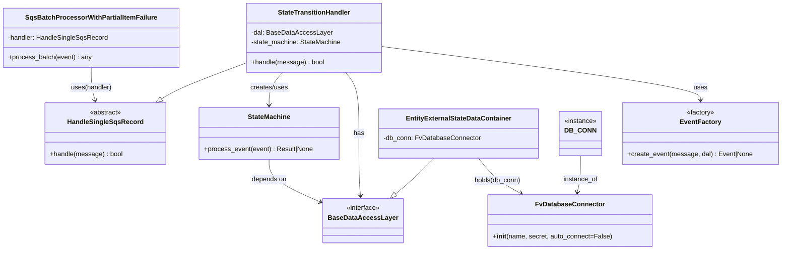

# Diagram: entity_core/entity_service/entity_service/entity/entity/external_state/handler.py


> Auto-generated by Obscura crawlers

## Diagram 1



### SVG

<svg id="container" width="1873.875" xmlns="http://www.w3.org/2000/svg" class="classDiagram" height="608" viewBox="0 0 1873.875 608" role="graphics-document document" aria-roledescription="class"><style>#container{font-family:"trebuchet ms",verdana,arial,sans-serif;font-size:16px;fill:#333;}@keyframes edge-animation-frame{from{stroke-dashoffset:0;}}@keyframes dash{to{stroke-dashoffset:0;}}#container .edge-animation-slow{stroke-dasharray:9,5!important;stroke-dashoffset:900;animation:dash 50s linear infinite;stroke-linecap:round;}#container .edge-animation-fast{stroke-dasharray:9,5!important;stroke-dashoffset:900;animation:dash 20s linear infinite;stroke-linecap:round;}#container .error-icon{fill:#552222;}#container .error-text{fill:#552222;stroke:#552222;}#container .edge-thickness-normal{stroke-width:1px;}#container .edge-thickness-thick{stroke-width:3.5px;}#container .edge-pattern-solid{stroke-dasharray:0;}#container .edge-thickness-invisible{stroke-width:0;fill:none;}#container .edge-pattern-dashed{stroke-dasharray:3;}#container .edge-pattern-dotted{stroke-dasharray:2;}#container .marker{fill:#333333;stroke:#333333;}#container .marker.cross{stroke:#333333;}#container svg{font-family:"trebuchet ms",verdana,arial,sans-serif;font-size:16px;}#container p{margin:0;}#container g.classGroup text{fill:#9370DB;stroke:none;font-family:"trebuchet ms",verdana,arial,sans-serif;font-size:10px;}#container g.classGroup text .title{font-weight:bolder;}#container .nodeLabel,#container .edgeLabel{color:#131300;}#container .edgeLabel .label rect{fill:#ECECFF;}#container .label text{fill:#131300;}#container .labelBkg{background:#ECECFF;}#container .edgeLabel .label span{background:#ECECFF;}#container .classTitle{font-weight:bolder;}#container .node rect,#container .node circle,#container .node ellipse,#container .node polygon,#container .node path{fill:#ECECFF;stroke:#9370DB;stroke-width:1px;}#container .divider{stroke:#9370DB;stroke-width:1;}#container g.clickable{cursor:pointer;}#container g.classGroup rect{fill:#ECECFF;stroke:#9370DB;}#container g.classGroup line{stroke:#9370DB;stroke-width:1;}#container .classLabel .box{stroke:none;stroke-width:0;fill:#ECECFF;opacity:0.5;}#container .classLabel .label{fill:#9370DB;font-size:10px;}#container .relation{stroke:#333333;stroke-width:1;fill:none;}#container .dashed-line{stroke-dasharray:3;}#container .dotted-line{stroke-dasharray:1 2;}#container #compositionStart,#container .composition{fill:#333333!important;stroke:#333333!important;stroke-width:1;}#container #compositionEnd,#container .composition{fill:#333333!important;stroke:#333333!important;stroke-width:1;}#container #dependencyStart,#container .dependency{fill:#333333!important;stroke:#333333!important;stroke-width:1;}#container #dependencyStart,#container .dependency{fill:#333333!important;stroke:#333333!important;stroke-width:1;}#container #extensionStart,#container .extension{fill:transparent!important;stroke:#333333!important;stroke-width:1;}#container #extensionEnd,#container .extension{fill:transparent!important;stroke:#333333!important;stroke-width:1;}#container #aggregationStart,#container .aggregation{fill:transparent!important;stroke:#333333!important;stroke-width:1;}#container #aggregationEnd,#container .aggregation{fill:transparent!important;stroke:#333333!important;stroke-width:1;}#container #lollipopStart,#container .lollipop{fill:#ECECFF!important;stroke:#333333!important;stroke-width:1;}#container #lollipopEnd,#container .lollipop{fill:#ECECFF!important;stroke:#333333!important;stroke-width:1;}#container .edgeTerminals{font-size:11px;line-height:initial;}#container .classTitleText{text-anchor:middle;font-size:18px;fill:#333;}#container .label-icon{display:inline-block;height:1em;overflow:visible;vertical-align:-0.125em;}#container .node .label-icon path{fill:currentColor;stroke:revert;stroke-width:revert;}#container :root{--mermaid-font-family:"trebuchet ms",verdana,arial,sans-serif;}</style><g><defs><marker id="container_class-aggregationStart" class="marker aggregation class" refX="18" refY="7" markerWidth="190" markerHeight="240" orient="auto"><path d="M 18,7 L9,13 L1,7 L9,1 Z"></path></marker></defs><defs><marker id="container_class-aggregationEnd" class="marker aggregation class" refX="1" refY="7" markerWidth="20" markerHeight="28" orient="auto"><path d="M 18,7 L9,13 L1,7 L9,1 Z"></path></marker></defs><defs><marker id="container_class-extensionStart" class="marker extension class" refX="18" refY="7" markerWidth="190" markerHeight="240" orient="auto"><path d="M 1,7 L18,13 V 1 Z"></path></marker></defs><defs><marker id="container_class-extensionEnd" class="marker extension class" refX="1" refY="7" markerWidth="20" markerHeight="28" orient="auto"><path d="M 1,1 V 13 L18,7 Z"></path></marker></defs><defs><marker id="container_class-compositionStart" class="marker composition class" refX="18" refY="7" markerWidth="190" markerHeight="240" orient="auto"><path d="M 18,7 L9,13 L1,7 L9,1 Z"></path></marker></defs><defs><marker id="container_class-compositionEnd" class="marker composition class" refX="1" refY="7" markerWidth="20" markerHeight="28" orient="auto"><path d="M 18,7 L9,13 L1,7 L9,1 Z"></path></marker></defs><defs><marker id="container_class-dependencyStart" class="marker dependency class" refX="6" refY="7" markerWidth="190" markerHeight="240" orient="auto"><path d="M 5,7 L9,13 L1,7 L9,1 Z"></path></marker></defs><defs><marker id="container_class-dependencyEnd" class="marker dependency class" refX="13" refY="7" markerWidth="20" markerHeight="28" orient="auto"><path d="M 18,7 L9,13 L14,7 L9,1 Z"></path></marker></defs><defs><marker id="container_class-lollipopStart" class="marker lollipop class" refX="13" refY="7" markerWidth="190" markerHeight="240" orient="auto"><circle stroke="black" fill="transparent" cx="7" cy="7" r="6"></circle></marker></defs><defs><marker id="container_class-lollipopEnd" class="marker lollipop class" refX="1" refY="7" markerWidth="190" markerHeight="240" orient="auto"><circle stroke="black" fill="transparent" cx="7" cy="7" r="6"></circle></marker></defs><g class="root"><g class="clusters"></g><g class="edgePaths"><path d="M589.838,153.402L563.309,163.335C536.781,173.268,483.723,193.134,449.809,207.705C415.894,222.276,401.122,231.551,393.735,236.189L386.349,240.827" id="id_StateTransitionHandler_HandleSingleSqsRecord_1" class="edge-thickness-normal edge-pattern-solid relation" style=";;;" data-edge="true" data-et="edge" data-id="id_StateTransitionHandler_HandleSingleSqsRecord_1" data-points="W3sieCI6NTg5LjgzNzg5MDYyNSwieSI6MTUzLjQwMTY5NzEwNzQyMzA1fSx7IngiOjQzMC42NjYwMTU2MjUsInkiOjIxM30seyJ4IjozNzEuNzQwNDk1OTU0MjQxMDYsInkiOjI1MH1d" marker-end="url(#container_class-extensionEnd)"></path><path d="M1041.873,385L1033.438,393.667C1025.004,402.333,1008.135,419.667,992.778,434.15C977.421,448.634,963.576,460.268,956.654,466.085L949.732,471.902" id="id_EntityExternalStateDataContainer_BaseDataAccessLayer_2" class="edge-thickness-normal edge-pattern-solid relation" style=";;;" data-edge="true" data-et="edge" data-id="id_EntityExternalStateDataContainer_BaseDataAccessLayer_2" data-points="W3sieCI6MTA0MS44NzI3Njc4NTcxNDMsInkiOjM4NX0seyJ4Ijo5OTEuMjY1NjI1LCJ5Ijo0Mzd9LHsieCI6OTM2LjUyNTYyNSwieSI6NDgzfV0=" marker-end="url(#container_class-extensionEnd)"></path><path d="M678.546,176L673.019,182.167C667.493,188.333,656.44,200.667,650.913,214C645.387,227.333,645.387,241.667,645.387,248.833L645.387,256" id="id_StateTransitionHandler_StateMachine_3" class="edge-thickness-normal edge-pattern-solid relation" style=";;;" data-edge="true" data-et="edge" data-id="id_StateTransitionHandler_StateMachine_3" data-points="W3sieCI6Njc4LjU0NTg5MDM2NjczNTUsInkiOjE3Nn0seyJ4Ijo2NDUuMzg2NzE4NzUsInkiOjIxM30seyJ4Ijo2NDUuMzg2NzE4NzUsInkiOjI2Mn1d" marker-end="url(#container_class-dependencyEnd)"></path><path d="M645.387,388L645.387,396.167C645.387,404.333,645.387,420.667,667.192,438.444C688.998,456.222,732.609,475.445,754.415,485.056L776.221,494.667" id="id_StateMachine_BaseDataAccessLayer_4" class="edge-thickness-normal edge-pattern-solid relation" style=";;;" data-edge="true" data-et="edge" data-id="id_StateMachine_BaseDataAccessLayer_4" data-points="W3sieCI6NjQ1LjM4NjcxODc1LCJ5IjozODh9LHsieCI6NjQ1LjM4NjcxODc1LCJ5Ijo0Mzd9LHsieCI6NzgxLjcxMDkzNzUsInkiOjQ5Ny4wODY3NzUzNjU0Mzc5fV0=" marker-end="url(#container_class-dependencyEnd)"></path><path d="M829.106,176L834.633,182.167C840.16,188.333,851.213,200.667,856.739,225.5C862.266,250.333,862.266,287.667,862.266,325C862.266,362.333,862.266,399.667,862.933,425.005C863.6,450.343,864.934,463.687,865.601,470.358L866.269,477.03" id="id_StateTransitionHandler_BaseDataAccessLayer_5" class="edge-thickness-normal edge-pattern-solid relation" style=";;;" data-edge="true" data-et="edge" data-id="id_StateTransitionHandler_BaseDataAccessLayer_5" data-points="W3sieCI6ODI5LjEwNjQ1MzM4MzI2NDUsInkiOjE3Nn0seyJ4Ijo4NjIuMjY1NjI1LCJ5IjoyMTN9LHsieCI6ODYyLjI2NTYyNSwieSI6MzI1fSx7IngiOjg2Mi4yNjU2MjUsInkiOjQzN30seyJ4Ijo4NjYuODY1NjI1LCJ5Ijo0ODN9XQ==" marker-end="url(#container_class-dependencyEnd)"></path><path d="M917.814,113.43L1044.806,130.025C1171.798,146.62,1425.782,179.81,1552.774,201.572C1679.766,223.333,1679.766,233.667,1679.766,238.833L1679.766,244" id="id_StateTransitionHandler_EventFactory_6" class="edge-thickness-normal edge-pattern-solid relation" style=";;;" data-edge="true" data-et="edge" data-id="id_StateTransitionHandler_EventFactory_6" data-points="W3sieCI6OTE3LjgxNDQ1MzEyNSwieSI6MTEzLjQyOTY3NTUxOTU4NDIxfSx7IngiOjE2NzkuNzY1NjI1LCJ5IjoyMTN9LHsieCI6MTY3OS43NjU2MjUsInkiOjI1MH1d" marker-end="url(#container_class-dependencyEnd)"></path><path d="M217.328,164L217.328,172.167C217.328,180.333,217.328,196.667,218.955,210.045C220.583,223.424,223.837,233.848,225.465,239.061L227.092,244.273" id="id_SqsBatchProcessorWithPartialItemFailure_HandleSingleSqsRecord_7" class="edge-thickness-normal edge-pattern-solid relation" style=";;;" data-edge="true" data-et="edge" data-id="id_SqsBatchProcessorWithPartialItemFailure_HandleSingleSqsRecord_7" data-points="W3sieCI6MjE3LjMyODEyNSwieSI6MTY0fSx7IngiOjIxNy4zMjgxMjUsInkiOjIxM30seyJ4IjoyMjguODgwMzAxMzM5Mjg1NzIsInkiOjI1MH1d" marker-end="url(#container_class-dependencyEnd)"></path><path d="M1146.768,385L1153.485,393.667C1160.202,402.333,1173.636,419.667,1190.531,434.013C1207.426,448.359,1227.783,459.718,1237.961,465.397L1248.139,471.076" id="id_EntityExternalStateDataContainer_FvDatabaseConnector_8" class="edge-thickness-normal edge-pattern-solid relation" style=";;;" data-edge="true" data-et="edge" data-id="id_EntityExternalStateDataContainer_FvDatabaseConnector_8" data-points="W3sieCI6MTE0Ni43NjgxMzYxNjA3MTQyLCJ5IjozODV9LHsieCI6MTE4Ny4wNzAzMTI1LCJ5Ijo0Mzd9LHsieCI6MTI1My4zNzgzNTkzNzUsInkiOjQ3NH1d" marker-end="url(#container_class-dependencyEnd)"></path><path d="M1392.109,379L1392.109,388.667C1392.109,398.333,1392.109,417.667,1390.767,432.532C1389.424,447.397,1386.739,457.794,1385.396,462.992L1384.053,468.191" id="id_DB_CONN_FvDatabaseConnector_9" class="edge-thickness-normal edge-pattern-solid relation" style=";;;" data-edge="true" data-et="edge" data-id="id_DB_CONN_FvDatabaseConnector_9" data-points="W3sieCI6MTM5Mi4xMDkzNzUsInkiOjM3OX0seyJ4IjoxMzkyLjEwOTM3NSwieSI6NDM3fSx7IngiOjEzODIuNTUyOTY4NzUsInkiOjQ3NH1d" marker-end="url(#container_class-dependencyEnd)"></path></g><g class="edgeLabels"><g class="edgeLabel"><g class="label" data-id="id_StateTransitionHandler_HandleSingleSqsRecord_1" transform="translate(0, 0)"><foreignObject width="0" height="0"><div xmlns="http://www.w3.org/1999/xhtml" class="labelBkg" style="display: table-cell; white-space: nowrap; line-height: 1.5; max-width: 200px; text-align: center;"><span class="edgeLabel"></span></div></foreignObject></g></g><g class="edgeLabel"><g class="label" data-id="id_EntityExternalStateDataContainer_BaseDataAccessLayer_2" transform="translate(0, 0)"><foreignObject width="0" height="0"><div xmlns="http://www.w3.org/1999/xhtml" class="labelBkg" style="display: table-cell; white-space: nowrap; line-height: 1.5; max-width: 200px; text-align: center;"><span class="edgeLabel"></span></div></foreignObject></g></g><g class="edgeLabel" transform="translate(645.38671875, 213)"><g class="label" data-id="id_StateTransitionHandler_StateMachine_3" transform="translate(-46.578125, -12)"><foreignObject width="93.15625" height="24"><div xmlns="http://www.w3.org/1999/xhtml" class="labelBkg" style="display: table-cell; white-space: nowrap; line-height: 1.5; max-width: 200px; text-align: center;"><span class="edgeLabel"><p>creates/uses</p></span></div></foreignObject></g></g><g class="edgeLabel" transform="translate(645.38671875, 437)"><g class="label" data-id="id_StateMachine_BaseDataAccessLayer_4" transform="translate(-42.9453125, -12)"><foreignObject width="85.890625" height="24"><div xmlns="http://www.w3.org/1999/xhtml" class="labelBkg" style="display: table-cell; white-space: nowrap; line-height: 1.5; max-width: 200px; text-align: center;"><span class="edgeLabel"><p>depends on</p></span></div></foreignObject></g></g><g class="edgeLabel" transform="translate(862.265625, 325)"><g class="label" data-id="id_StateTransitionHandler_BaseDataAccessLayer_5" transform="translate(-12.703125, -12)"><foreignObject width="25.40625" height="24"><div xmlns="http://www.w3.org/1999/xhtml" class="labelBkg" style="display: table-cell; white-space: nowrap; line-height: 1.5; max-width: 200px; text-align: center;"><span class="edgeLabel"><p>has</p></span></div></foreignObject></g></g><g class="edgeLabel" transform="translate(1679.765625, 213)"><g class="label" data-id="id_StateTransitionHandler_EventFactory_6" transform="translate(-16.4921875, -12)"><foreignObject width="32.984375" height="24"><div xmlns="http://www.w3.org/1999/xhtml" class="labelBkg" style="display: table-cell; white-space: nowrap; line-height: 1.5; max-width: 200px; text-align: center;"><span class="edgeLabel"><p>uses</p></span></div></foreignObject></g></g><g class="edgeLabel" transform="translate(217.328125, 213)"><g class="label" data-id="id_SqsBatchProcessorWithPartialItemFailure_HandleSingleSqsRecord_7" transform="translate(-49.9375, -12)"><foreignObject width="99.875" height="24"><div xmlns="http://www.w3.org/1999/xhtml" class="labelBkg" style="display: table-cell; white-space: nowrap; line-height: 1.5; max-width: 200px; text-align: center;"><span class="edgeLabel"><p>uses(handler)</p></span></div></foreignObject></g></g><g class="edgeLabel" transform="translate(1191.49901, 439.47122)"><g class="label" data-id="id_EntityExternalStateDataContainer_FvDatabaseConnector_8" transform="translate(-56.4609375, -12)"><foreignObject width="112.921875" height="24"><div xmlns="http://www.w3.org/1999/xhtml" class="labelBkg" style="display: table-cell; white-space: nowrap; line-height: 1.5; max-width: 200px; text-align: center;"><span class="edgeLabel"><p>holds(db_conn)</p></span></div></foreignObject></g></g><g class="edgeLabel" transform="translate(1392.109375, 437)"><g class="label" data-id="id_DB_CONN_FvDatabaseConnector_9" transform="translate(-41.7734375, -12)"><foreignObject width="83.546875" height="24"><div xmlns="http://www.w3.org/1999/xhtml" class="labelBkg" style="display: table-cell; white-space: nowrap; line-height: 1.5; max-width: 200px; text-align: center;"><span class="edgeLabel"><p>instance_of</p></span></div></foreignObject></g></g></g><g class="nodes"><g class="node default" id="classId-HandleSingleSqsRecord-0" transform="translate(252.296875, 325)"><g class="basic label-container"><path d="M-143.6875 -75 L143.6875 -75 L143.6875 75 L-143.6875 75" stroke="none" stroke-width="0" fill="#ECECFF" style=""></path><path d="M-143.6875 -75 C-52.74628383463421 -75, 38.194932330731575 -75, 143.6875 -75 M-143.6875 -75 C-79.11814507132057 -75, -14.548790142641138 -75, 143.6875 -75 M143.6875 -75 C143.6875 -25.86673542467851, 143.6875 23.26652915064298, 143.6875 75 M143.6875 -75 C143.6875 -30.558840621035657, 143.6875 13.882318757928687, 143.6875 75 M143.6875 75 C52.225341547972945 75, -39.23681690405411 75, -143.6875 75 M143.6875 75 C54.0442046329521 75, -35.599090734095796 75, -143.6875 75 M-143.6875 75 C-143.6875 32.305609621785, -143.6875 -10.388780756429995, -143.6875 -75 M-143.6875 75 C-143.6875 40.977823198191125, -143.6875 6.9556463963822495, -143.6875 -75" stroke="#9370DB" stroke-width="1.3" fill="none" stroke-dasharray="0 0" style=""></path></g><g class="annotation-group text" transform="translate(-38.609375, -51)"><g class="label" style="" transform="translate(0,-12)"><foreignObject width="77.21875" height="24"><div xmlns="http://www.w3.org/1999/xhtml" style="display: table-cell; white-space: nowrap; line-height: 1.5; max-width: 127px; text-align: center;"><span class="nodeLabel markdown-node-label" style=""><p>«abstract»</p></span></div></foreignObject></g></g><g class="label-group text" transform="translate(-87.078125, -27)"><g class="label" style="font-weight: bolder" transform="translate(0,-12)"><foreignObject width="174.15625" height="24"><div xmlns="http://www.w3.org/1999/xhtml" style="display: table-cell; white-space: nowrap; line-height: 1.5; max-width: 222px; text-align: center;"><span class="nodeLabel markdown-node-label" style=""><p>HandleSingleSqsRecord</p></span></div></foreignObject></g></g><g class="members-group text" transform="translate(-131.6875, 21)"></g><g class="methods-group text" transform="translate(-131.6875, 51)"><g class="label" style="" transform="translate(0,-12)"><foreignObject width="176.296875" height="24"><div xmlns="http://www.w3.org/1999/xhtml" style="display: table-cell; white-space: nowrap; line-height: 1.5; max-width: 234px; text-align: center;"><span class="nodeLabel markdown-node-label" style=""><p>+handle(message) : bool</p></span></div></foreignObject></g></g><g class="divider" style=""><path d="M-143.6875 -3 C-83.88559176371254 -3, -24.083683527425066 -3, 143.6875 -3 M-143.6875 -3 C-49.59099934924096 -3, 44.50550130151808 -3, 143.6875 -3" stroke="#9370DB" stroke-width="1.3" fill="none" stroke-dasharray="0 0" style=""></path></g><g class="divider" style=""><path d="M-143.6875 21 C-41.72629384191532 21, 60.23491231616936 21, 143.6875 21 M-143.6875 21 C-41.39573072279754 21, 60.896038554404925 21, 143.6875 21" stroke="#9370DB" stroke-width="1.3" fill="none" stroke-dasharray="0 0" style=""></path></g></g><g class="node default" id="classId-SqsBatchProcessorWithPartialItemFailure-1" transform="translate(217.328125, 92)"><g class="basic label-container"><path d="M-209.328125 -72 L209.328125 -72 L209.328125 72 L-209.328125 72" stroke="none" stroke-width="0" fill="#ECECFF" style=""></path><path d="M-209.328125 -72 C-110.34141010712254 -72, -11.354695214245083 -72, 209.328125 -72 M-209.328125 -72 C-65.405425098548 -72, 78.51727480290401 -72, 209.328125 -72 M209.328125 -72 C209.328125 -17.959333971509892, 209.328125 36.081332056980216, 209.328125 72 M209.328125 -72 C209.328125 -42.750827164843784, 209.328125 -13.501654329687575, 209.328125 72 M209.328125 72 C114.73629399386361 72, 20.144462987727223 72, -209.328125 72 M209.328125 72 C61.61532715455351 72, -86.09747069089298 72, -209.328125 72 M-209.328125 72 C-209.328125 37.686565659044874, -209.328125 3.3731313180897473, -209.328125 -72 M-209.328125 72 C-209.328125 20.638577380455146, -209.328125 -30.722845239089708, -209.328125 -72" stroke="#9370DB" stroke-width="1.3" fill="none" stroke-dasharray="0 0" style=""></path></g><g class="annotation-group text" transform="translate(0, -48)"></g><g class="label-group text" transform="translate(-151.46875, -48)"><g class="label" style="font-weight: bolder" transform="translate(0,-12)"><foreignObject width="302.9375" height="24"><div xmlns="http://www.w3.org/1999/xhtml" style="display: table-cell; white-space: nowrap; line-height: 1.5; max-width: 348px; text-align: center;"><span class="nodeLabel markdown-node-label" style=""><p>SqsBatchProcessorWithPartialItemFailure</p></span></div></foreignObject></g></g><g class="members-group text" transform="translate(-197.328125, 0)"><g class="label" style="" transform="translate(0,-12)"><foreignObject width="243.1875" height="24"><div xmlns="http://www.w3.org/1999/xhtml" style="display: table-cell; white-space: nowrap; line-height: 1.5; max-width: 301px; text-align: center;"><span class="nodeLabel markdown-node-label" style=""><p>-handler: HandleSingleSqsRecord</p></span></div></foreignObject></g></g><g class="methods-group text" transform="translate(-197.328125, 48)"><g class="label" style="" transform="translate(0,-12)"><foreignObject width="200.84375" height="24"><div xmlns="http://www.w3.org/1999/xhtml" style="display: table-cell; white-space: nowrap; line-height: 1.5; max-width: 258px; text-align: center;"><span class="nodeLabel markdown-node-label" style=""><p>+process_batch(event) : any</p></span></div></foreignObject></g></g><g class="divider" style=""><path d="M-209.328125 -24 C-87.1516853366326 -24, 35.02475432673481 -24, 209.328125 -24 M-209.328125 -24 C-81.22098182266288 -24, 46.88616135467424 -24, 209.328125 -24" stroke="#9370DB" stroke-width="1.3" fill="none" stroke-dasharray="0 0" style=""></path></g><g class="divider" style=""><path d="M-209.328125 24 C-63.984912564995994 24, 81.35829987000801 24, 209.328125 24 M-209.328125 24 C-105.40116798089184 24, -1.4742109617836832 24, 209.328125 24" stroke="#9370DB" stroke-width="1.3" fill="none" stroke-dasharray="0 0" style=""></path></g></g><g class="node default" id="classId-StateTransitionHandler-2" transform="translate(753.826171875, 92)"><g class="basic label-container"><path d="M-163.98828125 -84 L163.98828125 -84 L163.98828125 84 L-163.98828125 84" stroke="none" stroke-width="0" fill="#ECECFF" style=""></path><path d="M-163.98828125 -84 C-91.22343570601782 -84, -18.458590162035648 -84, 163.98828125 -84 M-163.98828125 -84 C-38.715385204426724 -84, 86.55751084114655 -84, 163.98828125 -84 M163.98828125 -84 C163.98828125 -39.11129320399264, 163.98828125 5.7774135920147245, 163.98828125 84 M163.98828125 -84 C163.98828125 -46.16392177987885, 163.98828125 -8.327843559757696, 163.98828125 84 M163.98828125 84 C81.15505600939731 84, -1.6781692312053735 84, -163.98828125 84 M163.98828125 84 C79.47567289071772 84, -5.036935468564565 84, -163.98828125 84 M-163.98828125 84 C-163.98828125 32.341428070569215, -163.98828125 -19.31714385886157, -163.98828125 -84 M-163.98828125 84 C-163.98828125 41.06316219488561, -163.98828125 -1.873675610228787, -163.98828125 -84" stroke="#9370DB" stroke-width="1.3" fill="none" stroke-dasharray="0 0" style=""></path></g><g class="annotation-group text" transform="translate(0, -60)"></g><g class="label-group text" transform="translate(-85.1640625, -60)"><g class="label" style="font-weight: bolder" transform="translate(0,-12)"><foreignObject width="170.328125" height="24"><div xmlns="http://www.w3.org/1999/xhtml" style="display: table-cell; white-space: nowrap; line-height: 1.5; max-width: 219px; text-align: center;"><span class="nodeLabel markdown-node-label" style=""><p>StateTransitionHandler</p></span></div></foreignObject></g></g><g class="members-group text" transform="translate(-151.98828125, -12)"><g class="label" style="" transform="translate(0,-12)"><foreignObject width="191.484375" height="24"><div xmlns="http://www.w3.org/1999/xhtml" style="display: table-cell; white-space: nowrap; line-height: 1.5; max-width: 250px; text-align: center;"><span class="nodeLabel markdown-node-label" style=""><p>-dal: BaseDataAccessLayer</p></span></div></foreignObject></g><g class="label" style="" transform="translate(0,12)"><foreignObject width="218.8125" height="24"><div xmlns="http://www.w3.org/1999/xhtml" style="display: table-cell; white-space: nowrap; line-height: 1.5; max-width: 276px; text-align: center;"><span class="nodeLabel markdown-node-label" style=""><p>-state_machine: StateMachine</p></span></div></foreignObject></g></g><g class="methods-group text" transform="translate(-151.98828125, 60)"><g class="label" style="" transform="translate(0,-12)"><foreignObject width="176.296875" height="24"><div xmlns="http://www.w3.org/1999/xhtml" style="display: table-cell; white-space: nowrap; line-height: 1.5; max-width: 234px; text-align: center;"><span class="nodeLabel markdown-node-label" style=""><p>+handle(message) : bool</p></span></div></foreignObject></g></g><g class="divider" style=""><path d="M-163.98828125 -36 C-92.1464855060207 -36, -20.30468976204139 -36, 163.98828125 -36 M-163.98828125 -36 C-48.17924531122914 -36, 67.62979062754172 -36, 163.98828125 -36" stroke="#9370DB" stroke-width="1.3" fill="none" stroke-dasharray="0 0" style=""></path></g><g class="divider" style=""><path d="M-163.98828125 36 C-86.28932030881373 36, -8.590359367627457 36, 163.98828125 36 M-163.98828125 36 C-60.597140189039024 36, 42.79400087192195 36, 163.98828125 36" stroke="#9370DB" stroke-width="1.3" fill="none" stroke-dasharray="0 0" style=""></path></g></g><g class="node default" id="classId-StateMachine-3" transform="translate(645.38671875, 325)"><g class="basic label-container"><path d="M-169.17578125 -63 L169.17578125 -63 L169.17578125 63 L-169.17578125 63" stroke="none" stroke-width="0" fill="#ECECFF" style=""></path><path d="M-169.17578125 -63 C-88.13979800137737 -63, -7.103814752754744 -63, 169.17578125 -63 M-169.17578125 -63 C-67.93473537802818 -63, 33.30631049394364 -63, 169.17578125 -63 M169.17578125 -63 C169.17578125 -20.892459512787255, 169.17578125 21.21508097442549, 169.17578125 63 M169.17578125 -63 C169.17578125 -22.744609829530766, 169.17578125 17.510780340938467, 169.17578125 63 M169.17578125 63 C81.55500031885293 63, -6.065780612294134 63, -169.17578125 63 M169.17578125 63 C100.47632885300554 63, 31.77687645601108 63, -169.17578125 63 M-169.17578125 63 C-169.17578125 31.47200654410296, -169.17578125 -0.05598691179407922, -169.17578125 -63 M-169.17578125 63 C-169.17578125 34.937296467817575, -169.17578125 6.87459293563515, -169.17578125 -63" stroke="#9370DB" stroke-width="1.3" fill="none" stroke-dasharray="0 0" style=""></path></g><g class="annotation-group text" transform="translate(0, -39)"></g><g class="label-group text" transform="translate(-49.7265625, -39)"><g class="label" style="font-weight: bolder" transform="translate(0,-12)"><foreignObject width="99.453125" height="24"><div xmlns="http://www.w3.org/1999/xhtml" style="display: table-cell; white-space: nowrap; line-height: 1.5; max-width: 148px; text-align: center;"><span class="nodeLabel markdown-node-label" style=""><p>StateMachine</p></span></div></foreignObject></g></g><g class="members-group text" transform="translate(-157.17578125, 9)"></g><g class="methods-group text" transform="translate(-157.17578125, 39)"><g class="label" style="" transform="translate(0,-12)"><foreignObject width="264.625" height="24"><div xmlns="http://www.w3.org/1999/xhtml" style="display: table-cell; white-space: nowrap; line-height: 1.5; max-width: 322px; text-align: center;"><span class="nodeLabel markdown-node-label" style=""><p>+process_event(event) : Result|None</p></span></div></foreignObject></g></g><g class="divider" style=""><path d="M-169.17578125 -15 C-94.8661437107761 -15, -20.5565061715522 -15, 169.17578125 -15 M-169.17578125 -15 C-62.37388519103479 -15, 44.428010867930425 -15, 169.17578125 -15" stroke="#9370DB" stroke-width="1.3" fill="none" stroke-dasharray="0 0" style=""></path></g><g class="divider" style=""><path d="M-169.17578125 9 C-65.01523554529156 9, 39.14531015941688 9, 169.17578125 9 M-169.17578125 9 C-87.00505901417432 9, -4.834336778348643 9, 169.17578125 9" stroke="#9370DB" stroke-width="1.3" fill="none" stroke-dasharray="0 0" style=""></path></g></g><g class="node default" id="classId-EventFactory-4" transform="translate(1679.765625, 325)"><g class="basic label-container"><path d="M-186.109375 -75 L186.109375 -75 L186.109375 75 L-186.109375 75" stroke="none" stroke-width="0" fill="#ECECFF" style=""></path><path d="M-186.109375 -75 C-72.03718998272834 -75, 42.03499503454333 -75, 186.109375 -75 M-186.109375 -75 C-43.72384614271934 -75, 98.66168271456132 -75, 186.109375 -75 M186.109375 -75 C186.109375 -35.39608359874997, 186.109375 4.207832802500064, 186.109375 75 M186.109375 -75 C186.109375 -39.17108086830327, 186.109375 -3.342161736606542, 186.109375 75 M186.109375 75 C50.31742267969196 75, -85.47452964061608 75, -186.109375 75 M186.109375 75 C46.96500533663453 75, -92.17936432673093 75, -186.109375 75 M-186.109375 75 C-186.109375 30.716103870894457, -186.109375 -13.567792258211085, -186.109375 -75 M-186.109375 75 C-186.109375 31.860915484690388, -186.109375 -11.278169030619225, -186.109375 -75" stroke="#9370DB" stroke-width="1.3" fill="none" stroke-dasharray="0 0" style=""></path></g><g class="annotation-group text" transform="translate(-34.2734375, -51)"><g class="label" style="" transform="translate(0,-12)"><foreignObject width="68.546875" height="24"><div xmlns="http://www.w3.org/1999/xhtml" style="display: table-cell; white-space: nowrap; line-height: 1.5; max-width: 119px; text-align: center;"><span class="nodeLabel markdown-node-label" style=""><p>«factory»</p></span></div></foreignObject></g></g><g class="label-group text" transform="translate(-46.8125, -27)"><g class="label" style="font-weight: bolder" transform="translate(0,-12)"><foreignObject width="93.625" height="24"><div xmlns="http://www.w3.org/1999/xhtml" style="display: table-cell; white-space: nowrap; line-height: 1.5; max-width: 142px; text-align: center;"><span class="nodeLabel markdown-node-label" style=""><p>EventFactory</p></span></div></foreignObject></g></g><g class="members-group text" transform="translate(-174.109375, 21)"></g><g class="methods-group text" transform="translate(-174.109375, 51)"><g class="label" style="" transform="translate(0,-12)"><foreignObject width="301.40625" height="24"><div xmlns="http://www.w3.org/1999/xhtml" style="display: table-cell; white-space: nowrap; line-height: 1.5; max-width: 359px; text-align: center;"><span class="nodeLabel markdown-node-label" style=""><p>+create_event(message, dal) : Event|None</p></span></div></foreignObject></g></g><g class="divider" style=""><path d="M-186.109375 -3 C-49.03095508034784 -3, 88.04746483930433 -3, 186.109375 -3 M-186.109375 -3 C-42.067430664859046 -3, 101.97451367028191 -3, 186.109375 -3" stroke="#9370DB" stroke-width="1.3" fill="none" stroke-dasharray="0 0" style=""></path></g><g class="divider" style=""><path d="M-186.109375 21 C-81.34039239465721 21, 23.42859021068557 21, 186.109375 21 M-186.109375 21 C-94.0741101940671 21, -2.038845388134206 21, 186.109375 21" stroke="#9370DB" stroke-width="1.3" fill="none" stroke-dasharray="0 0" style=""></path></g></g><g class="node default" id="classId-BaseDataAccessLayer-5" transform="translate(872.265625, 537)"><g class="basic label-container"><path d="M-90.5546875 -54 L90.5546875 -54 L90.5546875 54 L-90.5546875 54" stroke="none" stroke-width="0" fill="#ECECFF" style=""></path><path d="M-90.5546875 -54 C-37.219393163120955 -54, 16.11590117375809 -54, 90.5546875 -54 M-90.5546875 -54 C-27.83033697236973 -54, 34.89401355526054 -54, 90.5546875 -54 M90.5546875 -54 C90.5546875 -21.757370425488666, 90.5546875 10.485259149022667, 90.5546875 54 M90.5546875 -54 C90.5546875 -16.461575343085983, 90.5546875 21.076849313828035, 90.5546875 54 M90.5546875 54 C44.73642590586142 54, -1.0818356882771667 54, -90.5546875 54 M90.5546875 54 C35.71107683319877 54, -19.132533833602466 54, -90.5546875 54 M-90.5546875 54 C-90.5546875 18.378456541301148, -90.5546875 -17.243086917397704, -90.5546875 -54 M-90.5546875 54 C-90.5546875 13.193877486835895, -90.5546875 -27.61224502632821, -90.5546875 -54" stroke="#9370DB" stroke-width="1.3" fill="none" stroke-dasharray="0 0" style=""></path></g><g class="annotation-group text" transform="translate(-41.015625, -30)"><g class="label" style="" transform="translate(0,-12)"><foreignObject width="82.03125" height="24"><div xmlns="http://www.w3.org/1999/xhtml" style="display: table-cell; white-space: nowrap; line-height: 1.5; max-width: 132px; text-align: center;"><span class="nodeLabel markdown-node-label" style=""><p>«interface»</p></span></div></foreignObject></g></g><g class="label-group text" transform="translate(-78.5546875, -6)"><g class="label" style="font-weight: bolder" transform="translate(0,-12)"><foreignObject width="157.109375" height="24"><div xmlns="http://www.w3.org/1999/xhtml" style="display: table-cell; white-space: nowrap; line-height: 1.5; max-width: 205px; text-align: center;"><span class="nodeLabel markdown-node-label" style=""><p>BaseDataAccessLayer</p></span></div></foreignObject></g></g><g class="members-group text" transform="translate(-78.5546875, 42)"></g><g class="methods-group text" transform="translate(-78.5546875, 72)"></g><g class="divider" style=""><path d="M-90.5546875 18 C-23.695926119971247 18, 43.162835260057506 18, 90.5546875 18 M-90.5546875 18 C-35.571081276254255 18, 19.41252494749149 18, 90.5546875 18" stroke="#9370DB" stroke-width="1.3" fill="none" stroke-dasharray="0 0" style=""></path></g><g class="divider" style=""><path d="M-90.5546875 36 C-21.356506742144404 36, 47.84167401571119 36, 90.5546875 36 M-90.5546875 36 C-49.50450163974187 36, -8.454315779483736 36, 90.5546875 36" stroke="#9370DB" stroke-width="1.3" fill="none" stroke-dasharray="0 0" style=""></path></g></g><g class="node default" id="classId-EntityExternalStateDataContainer-6" transform="translate(1100.265625, 325)"><g class="basic label-container"><path d="M-190.296875 -60 L190.296875 -60 L190.296875 60 L-190.296875 60" stroke="none" stroke-width="0" fill="#ECECFF" style=""></path><path d="M-190.296875 -60 C-98.14260085982392 -60, -5.98832671964783 -60, 190.296875 -60 M-190.296875 -60 C-62.231137573602695 -60, 65.83459985279461 -60, 190.296875 -60 M190.296875 -60 C190.296875 -33.41049102465949, 190.296875 -6.820982049318992, 190.296875 60 M190.296875 -60 C190.296875 -28.04758205530798, 190.296875 3.9048358893840387, 190.296875 60 M190.296875 60 C57.60402176850474 60, -75.08883146299053 60, -190.296875 60 M190.296875 60 C101.05972423148472 60, 11.822573462969444 60, -190.296875 60 M-190.296875 60 C-190.296875 16.988318478938645, -190.296875 -26.02336304212271, -190.296875 -60 M-190.296875 60 C-190.296875 18.386827351126193, -190.296875 -23.226345297747613, -190.296875 -60" stroke="#9370DB" stroke-width="1.3" fill="none" stroke-dasharray="0 0" style=""></path></g><g class="annotation-group text" transform="translate(0, -36)"></g><g class="label-group text" transform="translate(-123.25, -36)"><g class="label" style="font-weight: bolder" transform="translate(0,-12)"><foreignObject width="246.5" height="24"><div xmlns="http://www.w3.org/1999/xhtml" style="display: table-cell; white-space: nowrap; line-height: 1.5; max-width: 293px; text-align: center;"><span class="nodeLabel markdown-node-label" style=""><p>EntityExternalStateDataContainer</p></span></div></foreignObject></g></g><g class="members-group text" transform="translate(-178.296875, 12)"><g class="label" style="" transform="translate(0,-12)"><foreignObject width="233.34375" height="24"><div xmlns="http://www.w3.org/1999/xhtml" style="display: table-cell; white-space: nowrap; line-height: 1.5; max-width: 292px; text-align: center;"><span class="nodeLabel markdown-node-label" style=""><p>-db_conn: FvDatabaseConnector</p></span></div></foreignObject></g></g><g class="methods-group text" transform="translate(-178.296875, 60)"></g><g class="divider" style=""><path d="M-190.296875 -12 C-59.546046995851555 -12, 71.20478100829689 -12, 190.296875 -12 M-190.296875 -12 C-112.29912511159675 -12, -34.3013752231935 -12, 190.296875 -12" stroke="#9370DB" stroke-width="1.3" fill="none" stroke-dasharray="0 0" style=""></path></g><g class="divider" style=""><path d="M-190.296875 36 C-56.29914997697449 36, 77.69857504605102 36, 190.296875 36 M-190.296875 36 C-92.08373629347534 36, 6.12940241304932 36, 190.296875 36" stroke="#9370DB" stroke-width="1.3" fill="none" stroke-dasharray="0 0" style=""></path></g></g><g class="node default" id="classId-FvDatabaseConnector-7" transform="translate(1366.28125, 537)"><g class="basic label-container"><path d="M-194.58984375 -63 L194.58984375 -63 L194.58984375 63 L-194.58984375 63" stroke="none" stroke-width="0" fill="#ECECFF" style=""></path><path d="M-194.58984375 -63 C-87.16652541903422 -63, 20.25679291193157 -63, 194.58984375 -63 M-194.58984375 -63 C-114.14396471445312 -63, -33.69808567890624 -63, 194.58984375 -63 M194.58984375 -63 C194.58984375 -21.63632818662068, 194.58984375 19.72734362675864, 194.58984375 63 M194.58984375 -63 C194.58984375 -18.38259150412039, 194.58984375 26.234816991759217, 194.58984375 63 M194.58984375 63 C42.843510470659794 63, -108.90282280868041 63, -194.58984375 63 M194.58984375 63 C89.23530244095907 63, -16.11923886808185 63, -194.58984375 63 M-194.58984375 63 C-194.58984375 17.402874047029073, -194.58984375 -28.194251905941854, -194.58984375 -63 M-194.58984375 63 C-194.58984375 27.88945793390271, -194.58984375 -7.2210841321945765, -194.58984375 -63" stroke="#9370DB" stroke-width="1.3" fill="none" stroke-dasharray="0 0" style=""></path></g><g class="annotation-group text" transform="translate(0, -39)"></g><g class="label-group text" transform="translate(-79.3046875, -39)"><g class="label" style="font-weight: bolder" transform="translate(0,-12)"><foreignObject width="158.609375" height="24"><div xmlns="http://www.w3.org/1999/xhtml" style="display: table-cell; white-space: nowrap; line-height: 1.5; max-width: 207px; text-align: center;"><span class="nodeLabel markdown-node-label" style=""><p>FvDatabaseConnector</p></span></div></foreignObject></g></g><g class="members-group text" transform="translate(-182.58984375, 9)"></g><g class="methods-group text" transform="translate(-182.58984375, 39)"><g class="label" style="" transform="translate(0,-12)"><foreignObject width="285.875" height="24"><div xmlns="http://www.w3.org/1999/xhtml" style="display: table-cell; white-space: nowrap; line-height: 1.5; max-width: 375px; text-align: center;"><span class="nodeLabel markdown-node-label" style=""><p>+<strong>init</strong>(name, secret, auto_connect=False)</p></span></div></foreignObject></g></g><g class="divider" style=""><path d="M-194.58984375 -15 C-48.093011381047546 -15, 98.40382098790491 -15, 194.58984375 -15 M-194.58984375 -15 C-56.620371675831734 -15, 81.34910039833653 -15, 194.58984375 -15" stroke="#9370DB" stroke-width="1.3" fill="none" stroke-dasharray="0 0" style=""></path></g><g class="divider" style=""><path d="M-194.58984375 9 C-85.73650850730253 9, 23.116826735394937 9, 194.58984375 9 M-194.58984375 9 C-65.6115442193991 9, 63.366755311201814 9, 194.58984375 9" stroke="#9370DB" stroke-width="1.3" fill="none" stroke-dasharray="0 0" style=""></path></g></g><g class="node default" id="classId-DB_CONN-8" transform="translate(1392.109375, 325)"><g class="basic label-container"><path d="M-51.546875 -54 L51.546875 -54 L51.546875 54 L-51.546875 54" stroke="none" stroke-width="0" fill="#ECECFF" style=""></path><path d="M-51.546875 -54 C-27.308157729025325 -54, -3.06944045805065 -54, 51.546875 -54 M-51.546875 -54 C-28.323501280160116 -54, -5.100127560320232 -54, 51.546875 -54 M51.546875 -54 C51.546875 -12.896049319113999, 51.546875 28.207901361772002, 51.546875 54 M51.546875 -54 C51.546875 -14.656659361039175, 51.546875 24.68668127792165, 51.546875 54 M51.546875 54 C12.616273554795931 54, -26.314327890408137 54, -51.546875 54 M51.546875 54 C29.185835073575433 54, 6.824795147150866 54, -51.546875 54 M-51.546875 54 C-51.546875 32.152125980562424, -51.546875 10.304251961124848, -51.546875 -54 M-51.546875 54 C-51.546875 29.390802536563584, -51.546875 4.781605073127167, -51.546875 -54" stroke="#9370DB" stroke-width="1.3" fill="none" stroke-dasharray="0 0" style=""></path></g><g class="annotation-group text" transform="translate(-39.546875, -30)"><g class="label" style="" transform="translate(0,-12)"><foreignObject width="79.09375" height="24"><div xmlns="http://www.w3.org/1999/xhtml" style="display: table-cell; white-space: nowrap; line-height: 1.5; max-width: 129px; text-align: center;"><span class="nodeLabel markdown-node-label" style=""><p>«instance»</p></span></div></foreignObject></g></g><g class="label-group text" transform="translate(-34.40625, -6)"><g class="label" style="font-weight: bolder" transform="translate(0,-12)"><foreignObject width="68.8125" height="24"><div xmlns="http://www.w3.org/1999/xhtml" style="display: table-cell; white-space: nowrap; line-height: 1.5; max-width: 119px; text-align: center;"><span class="nodeLabel markdown-node-label" style=""><p>DB_CONN</p></span></div></foreignObject></g></g><g class="members-group text" transform="translate(-39.546875, 42)"></g><g class="methods-group text" transform="translate(-39.546875, 72)"></g><g class="divider" style=""><path d="M-51.546875 18 C-12.296874558997303 18, 26.953125882005395 18, 51.546875 18 M-51.546875 18 C-16.424153531318147 18, 18.698567937363705 18, 51.546875 18" stroke="#9370DB" stroke-width="1.3" fill="none" stroke-dasharray="0 0" style=""></path></g><g class="divider" style=""><path d="M-51.546875 36 C-19.616818835371713 36, 12.313237329256573 36, 51.546875 36 M-51.546875 36 C-11.795664446037364 36, 27.955546107925272 36, 51.546875 36" stroke="#9370DB" stroke-width="1.3" fill="none" stroke-dasharray="0 0" style=""></path></g></g></g></g></g></svg>

## Diagram 2

```mermaid
flowchart TD
    A[lambda_handler(event, context, audit_refs)]
    A --> B[DB_CONN: FvDatabaseConnector (configured, auto_connect=False)]
    A --> C[dal = EntityExternalStateDataContainer(db_conn=DB_CONN)]
    A --> D[handler = StateTransitionHandler(dal)]
    A --> E[processor = SqsBatchProcessorWithPartialItemFailure(handler)]
    A --> F[return processor.process_batch(event)]

    F --> G{for each record in event}
    G --> H[handler.handle(message)]
    H --> I[evt = EventFactory.create_event(message, dal)]
    I --> J{evt?}
    J -->|no| K[log ERROR "Unsupported message format"\nhandler returns False]
    J -->|yes| L[result = state_machine.process_event(evt)]
    L --> M{result?}
    M -->|no| N[log WARNING "No state transition"\nhandler returns False]
    M -->|yes| O[log INFO "Successfully processed; New state: result.to_state"\nhandler returns True]
    K --> P[processor records partial failure]
    N --> P
    O --> P
    P --> Q[processor.process_batch returns aggregate result]
    Q --> R[lambda_handler returns Q]
```

> SVG rendering failed for this diagram.
