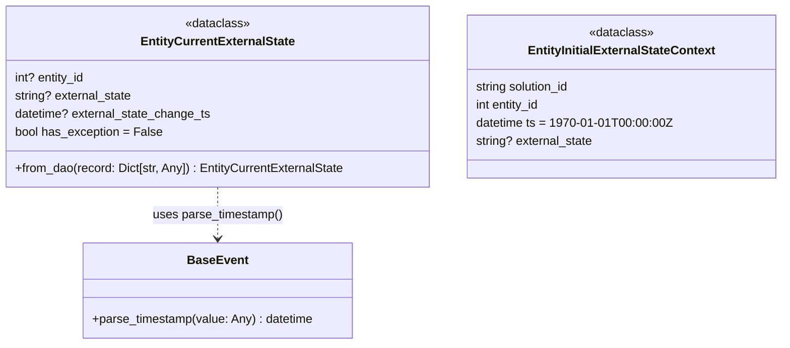

# Diagram: entity_core/entity_service/entity_service/entity/entity/external_state/models/entity_current_extenal_state.py

> Auto-generated by Obscura crawlers

## Mermaid

### SVG

<svg id="container" width="1021.21875" xmlns="http://www.w3.org/2000/svg" class="classDiagram" height="456" viewBox="0 0 1021.21875 456" role="graphics-document document" aria-roledescription="class"><g><defs><marker id="container_class-aggregationStart" class="marker aggregation class" refX="18" refY="7" markerWidth="190" markerHeight="240" orient="auto"><path d="M 18,7 L9,13 L1,7 L9,1 Z"></path></marker></defs><defs><marker id="container_class-aggregationEnd" class="marker aggregation class" refX="1" refY="7" markerWidth="20" markerHeight="28" orient="auto"><path d="M 18,7 L9,13 L1,7 L9,1 Z"></path></marker></defs><defs><marker id="container_class-extensionStart" class="marker extension class" refX="18" refY="7" markerWidth="190" markerHeight="240" orient="auto"><path d="M 1,7 L18,13 V 1 Z"></path></marker></defs><defs><marker id="container_class-extensionEnd" class="marker extension class" refX="1" refY="7" markerWidth="20" markerHeight="28" orient="auto"><path d="M 1,1 V 13 L18,7 Z"></path></marker></defs><defs><marker id="container_class-compositionStart" class="marker composition class" refX="18" refY="7" markerWidth="190" markerHeight="240" orient="auto"><path d="M 18,7 L9,13 L1,7 L9,1 Z"></path></marker></defs><defs><marker id="container_class-compositionEnd" class="marker composition class" refX="1" refY="7" markerWidth="20" markerHeight="28" orient="auto"><path d="M 18,7 L9,13 L1,7 L9,1 Z"></path></marker></defs><defs><marker id="container_class-dependencyStart" class="marker dependency class" refX="6" refY="7" markerWidth="190" markerHeight="240" orient="auto"><path d="M 5,7 L9,13 L1,7 L9,1 Z"></path></marker></defs><defs><marker id="container_class-dependencyEnd" class="marker dependency class" refX="13" refY="7" markerWidth="20" markerHeight="28" orient="auto"><path d="M 18,7 L9,13 L14,7 L9,1 Z"></path></marker></defs><defs><marker id="container_class-lollipopStart" class="marker lollipop class" refX="13" refY="7" markerWidth="190" markerHeight="240" orient="auto"><circle stroke="black" fill="transparent" cx="7" cy="7" r="6"></circle></marker></defs><defs><marker id="container_class-lollipopEnd" class="marker lollipop class" refX="1" refY="7" markerWidth="190" markerHeight="240" orient="auto"><circle stroke="black" fill="transparent" cx="7" cy="7" r="6"></circle></marker></defs><g class="root"><g class="clusters"></g><g class="edgePaths"><path d="M287.93,248L287.93,254.167C287.93,260.333,287.93,272.667,287.93,284C287.93,295.333,287.93,305.667,287.93,310.833L287.93,316" id="id_EntityCurrentExternalState_BaseEvent_1" class="edge-thickness-normal edge-pattern-dashed relation" style=";;;" data-edge="true" data-et="edge" data-id="id_EntityCurrentExternalState_BaseEvent_1" data-points="W3sieCI6Mjg3LjkyOTY4NzUsInkiOjI0OH0seyJ4IjoyODcuOTI5Njg3NSwieSI6Mjg1fSx7IngiOjI4Ny45Mjk2ODc1LCJ5IjozMjJ9XQ==" marker-end="url(#container_class-dependencyEnd)"></path></g><g class="edgeLabels"><g class="edgeLabel" transform="translate(287.9296875, 285)"><g class="label" data-id="id_EntityCurrentExternalState_BaseEvent_1" transform="translate(-86.609375, -12)"><foreignObject width="173.21875" height="24">

uses parse_timestamp()

</foreignObject></g></g></g><g class="nodes"><g class="node default" id="classId-BaseEvent-0" transform="translate(287.9296875, 385)"><g class="basic label-container"><path d="M-178.28125 -63 L178.28125 -63 L178.28125 63 L-178.28125 63" stroke="none" stroke-width="0" fill="#ECECFF" style=""></path><path d="M-178.28125 -63 C-82.13237494389391 -63, 14.016500112212185 -63, 178.28125 -63 M-178.28125 -63 C-60.344238863452034 -63, 57.59277227309593 -63, 178.28125 -63 M178.28125 -63 C178.28125 -22.20122520718043, 178.28125 18.597549585639143, 178.28125 63 M178.28125 -63 C178.28125 -30.155256239994202, 178.28125 2.689487520011596, 178.28125 63 M178.28125 63 C80.7789349372809 63, -16.72338012543821 63, -178.28125 63 M178.28125 63 C48.574631943959815 63, -81.13198611208037 63, -178.28125 63 M-178.28125 63 C-178.28125 30.99816387565219, -178.28125 -1.0036722486956222, -178.28125 -63 M-178.28125 63 C-178.28125 37.06794807901289, -178.28125 11.135896158025787, -178.28125 -63" stroke="#9370DB" stroke-width="1.3" fill="none" stroke-dasharray="0 0" style=""></path></g><g class="annotation-group text" transform="translate(0, -39)"></g><g class="label-group text" transform="translate(-37.734375, -39)"><g class="label" style="font-weight: bolder" transform="translate(0,-12)"><foreignObject width="75.46875" height="24">

BaseEvent

</foreignObject></g></g><g class="members-group text" transform="translate(-166.28125, 9)"></g><g class="methods-group text" transform="translate(-166.28125, 39)"><g class="label" style="" transform="translate(0,-12)"><foreignObject width="294.828125" height="24">

+parse_timestamp(value: Any) : datetime

</foreignObject></g></g><g class="divider" style=""><path d="M-178.28125 -15 C-42.46232733381427 -15, 93.35659533237146 -15, 178.28125 -15 M-178.28125 -15 C-68.45188189137731 -15, 41.37748621724538 -15, 178.28125 -15" stroke="#9370DB" stroke-width="1.3" fill="none" stroke-dasharray="0 0" style=""></path></g><g class="divider" style=""><path d="M-178.28125 9 C-88.43444226871075 9, 1.4123654625784923 9, 178.28125 9 M-178.28125 9 C-90.18977410543083 9, -2.098298210861657 9, 178.28125 9" stroke="#9370DB" stroke-width="1.3" fill="none" stroke-dasharray="0 0" style=""></path></g></g><g class="node default" id="classId-EntityCurrentExternalState-1" transform="translate(287.9296875, 128)"><g class="basic label-container"><path d="M-279.9296875 -120 L279.9296875 -120 L279.9296875 120 L-279.9296875 120" stroke="none" stroke-width="0" fill="#ECECFF" style=""></path><path d="M-279.9296875 -120 C-146.91737764899386 -120, -13.905067797987726 -120, 279.9296875 -120 M-279.9296875 -120 C-62.596418397061285 -120, 154.73685070587743 -120, 279.9296875 -120 M279.9296875 -120 C279.9296875 -69.82913834737539, 279.9296875 -19.658276694750782, 279.9296875 120 M279.9296875 -120 C279.9296875 -67.22831682797397, 279.9296875 -14.456633655947954, 279.9296875 120 M279.9296875 120 C64.39388410988983 120, -151.14191928022035 120, -279.9296875 120 M279.9296875 120 C94.04277299678779 120, -91.84414150642442 120, -279.9296875 120 M-279.9296875 120 C-279.9296875 30.910193313687287, -279.9296875 -58.179613372625425, -279.9296875 -120 M-279.9296875 120 C-279.9296875 35.666779101970846, -279.9296875 -48.66644179605831, -279.9296875 -120" stroke="#9370DB" stroke-width="1.3" fill="none" stroke-dasharray="0 0" style=""></path></g><g class="annotation-group text" transform="translate(-43.0859375, -96)"><g class="label" style="" transform="translate(0,-12)"><foreignObject width="86.171875" height="24">

«dataclass»

</foreignObject></g></g><g class="label-group text" transform="translate(-98.109375, -72)"><g class="label" style="font-weight: bolder" transform="translate(0,-12)"><foreignObject width="196.21875" height="24">

EntityCurrentExternalState

</foreignObject></g></g><g class="members-group text" transform="translate(-267.9296875, -24)"><g class="label" style="" transform="translate(0,-12)"><foreignObject width="94.640625" height="24">

int? entity_id

</foreignObject></g><g class="label" style="" transform="translate(0,12)"><foreignObject width="156.703125" height="24">

string? external_state

</foreignObject></g><g class="label" style="" transform="translate(0,36)"><foreignObject width="260.484375" height="24">

datetime? external_state_change_ts

</foreignObject></g><g class="label" style="" transform="translate(0,60)"><foreignObject width="193.75" height="24">

bool has_exception = False

</foreignObject></g></g><g class="methods-group text" transform="translate(-267.9296875, 96)"><g class="label" style="" transform="translate(0,-12)"><foreignObject width="437.75" height="24">

+from_dao(record: Dict[str, Any]) : EntityCurrentExternalState

</foreignObject></g></g><g class="divider" style=""><path d="M-279.9296875 -48 C-144.33600482862633 -48, -8.742322157252659 -48, 279.9296875 -48 M-279.9296875 -48 C-75.88017460996886 -48, 128.16933828006228 -48, 279.9296875 -48" stroke="#9370DB" stroke-width="1.3" fill="none" stroke-dasharray="0 0" style=""></path></g><g class="divider" style=""><path d="M-279.9296875 72 C-105.65462188443675 72, 68.6204437311265 72, 279.9296875 72 M-279.9296875 72 C-59.770172831228365 72, 160.38934183754327 72, 279.9296875 72" stroke="#9370DB" stroke-width="1.3" fill="none" stroke-dasharray="0 0" style=""></path></g></g><g class="node default" id="classId-EntityInitialExternalStateContext-2" transform="translate(815.5390625, 128)"><g class="basic label-container"><path d="M-197.6796875 -108 L197.6796875 -108 L197.6796875 108 L-197.6796875 108" stroke="none" stroke-width="0" fill="#ECECFF" style=""></path><path d="M-197.6796875 -108 C-73.52884809683174 -108, 50.621991306336525 -108, 197.6796875 -108 M-197.6796875 -108 C-118.59526470567917 -108, -39.51084191135834 -108, 197.6796875 -108 M197.6796875 -108 C197.6796875 -27.970361928065742, 197.6796875 52.059276143868516, 197.6796875 108 M197.6796875 -108 C197.6796875 -50.22584538879752, 197.6796875 7.548309222404967, 197.6796875 108 M197.6796875 108 C78.894982919183 108, -39.88972166163401 108, -197.6796875 108 M197.6796875 108 C89.9108063752319 108, -17.8580747495362 108, -197.6796875 108 M-197.6796875 108 C-197.6796875 53.14115012536257, -197.6796875 -1.717699749274857, -197.6796875 -108 M-197.6796875 108 C-197.6796875 61.61957697173154, -197.6796875 15.23915394346308, -197.6796875 -108" stroke="#9370DB" stroke-width="1.3" fill="none" stroke-dasharray="0 0" style=""></path></g><g class="annotation-group text" transform="translate(-43.0859375, -84)"><g class="label" style="" transform="translate(0,-12)"><foreignObject width="86.171875" height="24">

«dataclass»

</foreignObject></g></g><g class="label-group text" transform="translate(-120.171875, -60)"><g class="label" style="font-weight: bolder" transform="translate(0,-12)"><foreignObject width="240.34375" height="24">

EntityInitialExternalStateContext

</foreignObject></g></g><g class="members-group text" transform="translate(-185.6796875, -12)"><g class="label" style="" transform="translate(0,-12)"><foreignObject width="128.109375" height="24">

string solution_id

</foreignObject></g><g class="label" style="" transform="translate(0,12)"><foreignObject width="87.78125" height="24">

int entity_id

</foreignObject></g><g class="label" style="" transform="translate(0,36)"><foreignObject width="251.1875" height="24">

datetime ts = 1970-01-01T00:00:00Z

</foreignObject></g><g class="label" style="" transform="translate(0,60)"><foreignObject width="156.703125" height="24">

string? external_state

</foreignObject></g></g><g class="methods-group text" transform="translate(-185.6796875, 108)"></g><g class="divider" style=""><path d="M-197.6796875 -36 C-56.89328898661873 -36, 83.89310952676254 -36, 197.6796875 -36 M-197.6796875 -36 C-83.29528618091614 -36, 31.089115138167728 -36, 197.6796875 -36" stroke="#9370DB" stroke-width="1.3" fill="none" stroke-dasharray="0 0" style=""></path></g><g class="divider" style=""><path d="M-197.6796875 84 C-105.6453906043639 84, -13.611093708727793 84, 197.6796875 84 M-197.6796875 84 C-116.07689930367667 84, -34.47411110735334 84, 197.6796875 84" stroke="#9370DB" stroke-width="1.3" fill="none" stroke-dasharray="0 0" style=""></path></g></g></g></g></g></svg>
