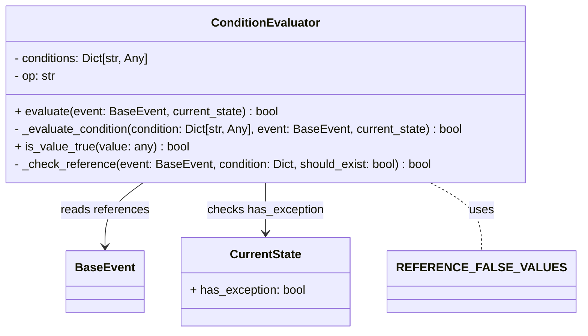

# Diagram: entity_core/entity_service/entity_service/entity/entity/external_state/rules/condition_evaluator.py


> Auto-generated by Obscura crawlers

## Diagram 1



### SVG

<svg id="container" width="752.140625" xmlns="http://www.w3.org/2000/svg" class="classDiagram" height="450" viewBox="0 0 752.140625 450" role="graphics-document document" aria-roledescription="class"><style>#container{font-family:"trebuchet ms",verdana,arial,sans-serif;font-size:16px;fill:#333;}@keyframes edge-animation-frame{from{stroke-dashoffset:0;}}@keyframes dash{to{stroke-dashoffset:0;}}#container .edge-animation-slow{stroke-dasharray:9,5!important;stroke-dashoffset:900;animation:dash 50s linear infinite;stroke-linecap:round;}#container .edge-animation-fast{stroke-dasharray:9,5!important;stroke-dashoffset:900;animation:dash 20s linear infinite;stroke-linecap:round;}#container .error-icon{fill:#552222;}#container .error-text{fill:#552222;stroke:#552222;}#container .edge-thickness-normal{stroke-width:1px;}#container .edge-thickness-thick{stroke-width:3.5px;}#container .edge-pattern-solid{stroke-dasharray:0;}#container .edge-thickness-invisible{stroke-width:0;fill:none;}#container .edge-pattern-dashed{stroke-dasharray:3;}#container .edge-pattern-dotted{stroke-dasharray:2;}#container .marker{fill:#333333;stroke:#333333;}#container .marker.cross{stroke:#333333;}#container svg{font-family:"trebuchet ms",verdana,arial,sans-serif;font-size:16px;}#container p{margin:0;}#container g.classGroup text{fill:#9370DB;stroke:none;font-family:"trebuchet ms",verdana,arial,sans-serif;font-size:10px;}#container g.classGroup text .title{font-weight:bolder;}#container .nodeLabel,#container .edgeLabel{color:#131300;}#container .edgeLabel .label rect{fill:#ECECFF;}#container .label text{fill:#131300;}#container .labelBkg{background:#ECECFF;}#container .edgeLabel .label span{background:#ECECFF;}#container .classTitle{font-weight:bolder;}#container .node rect,#container .node circle,#container .node ellipse,#container .node polygon,#container .node path{fill:#ECECFF;stroke:#9370DB;stroke-width:1px;}#container .divider{stroke:#9370DB;stroke-width:1;}#container g.clickable{cursor:pointer;}#container g.classGroup rect{fill:#ECECFF;stroke:#9370DB;}#container g.classGroup line{stroke:#9370DB;stroke-width:1;}#container .classLabel .box{stroke:none;stroke-width:0;fill:#ECECFF;opacity:0.5;}#container .classLabel .label{fill:#9370DB;font-size:10px;}#container .relation{stroke:#333333;stroke-width:1;fill:none;}#container .dashed-line{stroke-dasharray:3;}#container .dotted-line{stroke-dasharray:1 2;}#container #compositionStart,#container .composition{fill:#333333!important;stroke:#333333!important;stroke-width:1;}#container #compositionEnd,#container .composition{fill:#333333!important;stroke:#333333!important;stroke-width:1;}#container #dependencyStart,#container .dependency{fill:#333333!important;stroke:#333333!important;stroke-width:1;}#container #dependencyStart,#container .dependency{fill:#333333!important;stroke:#333333!important;stroke-width:1;}#container #extensionStart,#container .extension{fill:transparent!important;stroke:#333333!important;stroke-width:1;}#container #extensionEnd,#container .extension{fill:transparent!important;stroke:#333333!important;stroke-width:1;}#container #aggregationStart,#container .aggregation{fill:transparent!important;stroke:#333333!important;stroke-width:1;}#container #aggregationEnd,#container .aggregation{fill:transparent!important;stroke:#333333!important;stroke-width:1;}#container #lollipopStart,#container .lollipop{fill:#ECECFF!important;stroke:#333333!important;stroke-width:1;}#container #lollipopEnd,#container .lollipop{fill:#ECECFF!important;stroke:#333333!important;stroke-width:1;}#container .edgeTerminals{font-size:11px;line-height:initial;}#container .classTitleText{text-anchor:middle;font-size:18px;fill:#333;}#container .label-icon{display:inline-block;height:1em;overflow:visible;vertical-align:-0.125em;}#container .node .label-icon path{fill:currentColor;stroke:revert;stroke-width:revert;}#container :root{--mermaid-font-family:"trebuchet ms",verdana,arial,sans-serif;}</style><g><defs><marker id="container_class-aggregationStart" class="marker aggregation class" refX="18" refY="7" markerWidth="190" markerHeight="240" orient="auto"><path d="M 18,7 L9,13 L1,7 L9,1 Z"></path></marker></defs><defs><marker id="container_class-aggregationEnd" class="marker aggregation class" refX="1" refY="7" markerWidth="20" markerHeight="28" orient="auto"><path d="M 18,7 L9,13 L1,7 L9,1 Z"></path></marker></defs><defs><marker id="container_class-extensionStart" class="marker extension class" refX="18" refY="7" markerWidth="190" markerHeight="240" orient="auto"><path d="M 1,7 L18,13 V 1 Z"></path></marker></defs><defs><marker id="container_class-extensionEnd" class="marker extension class" refX="1" refY="7" markerWidth="20" markerHeight="28" orient="auto"><path d="M 1,1 V 13 L18,7 Z"></path></marker></defs><defs><marker id="container_class-compositionStart" class="marker composition class" refX="18" refY="7" markerWidth="190" markerHeight="240" orient="auto"><path d="M 18,7 L9,13 L1,7 L9,1 Z"></path></marker></defs><defs><marker id="container_class-compositionEnd" class="marker composition class" refX="1" refY="7" markerWidth="20" markerHeight="28" orient="auto"><path d="M 18,7 L9,13 L1,7 L9,1 Z"></path></marker></defs><defs><marker id="container_class-dependencyStart" class="marker dependency class" refX="6" refY="7" markerWidth="190" markerHeight="240" orient="auto"><path d="M 5,7 L9,13 L1,7 L9,1 Z"></path></marker></defs><defs><marker id="container_class-dependencyEnd" class="marker dependency class" refX="13" refY="7" markerWidth="20" markerHeight="28" orient="auto"><path d="M 18,7 L9,13 L14,7 L9,1 Z"></path></marker></defs><defs><marker id="container_class-lollipopStart" class="marker lollipop class" refX="13" refY="7" markerWidth="190" markerHeight="240" orient="auto"><circle stroke="black" fill="transparent" cx="7" cy="7" r="6"></circle></marker></defs><defs><marker id="container_class-lollipopEnd" class="marker lollipop class" refX="1" refY="7" markerWidth="190" markerHeight="240" orient="auto"><circle stroke="black" fill="transparent" cx="7" cy="7" r="6"></circle></marker></defs><g class="root"><g class="clusters"></g><g class="edgePaths"><path d="M200.285,248L191.896,254.167C183.508,260.333,166.73,272.667,158.342,287C149.953,301.333,149.953,317.667,149.953,325.833L149.953,334" id="id_ConditionEvaluator_BaseEvent_1" class="edge-thickness-normal edge-pattern-solid relation" style=";;;" data-edge="true" data-et="edge" data-id="id_ConditionEvaluator_BaseEvent_1" data-points="W3sieCI6MjAwLjI4NDk4MjA4NTk4NzI1LCJ5IjoyNDh9LHsieCI6MTQ5Ljk1MzEyNSwieSI6Mjg1fSx7IngiOjE0OS45NTMxMjUsInkiOjM0MH1d" marker-end="url(#container_class-dependencyEnd)"></path><path d="M363.523,248L363.523,254.167C363.523,260.333,363.523,272.667,363.523,284C363.523,295.333,363.523,305.667,363.523,310.833L363.523,316" id="id_ConditionEvaluator_CurrentState_2" class="edge-thickness-normal edge-pattern-solid relation" style=";;;" data-edge="true" data-et="edge" data-id="id_ConditionEvaluator_CurrentState_2" data-points="W3sieCI6MzYzLjUyMzQzNzUsInkiOjI0OH0seyJ4IjozNjMuNTIzNDM3NSwieSI6Mjg1fSx7IngiOjM2My41MjM0Mzc1LCJ5IjozMjJ9XQ==" marker-end="url(#container_class-dependencyEnd)"></path><path d="M571.595,248L582.287,254.167C592.98,260.333,614.365,272.667,625.057,288C635.75,303.333,635.75,321.667,635.75,330.833L635.75,340" id="id_ConditionEvaluator_REFERENCE_FALSE_VALUES_3" class="edge-thickness-normal edge-pattern-dashed relation" style=";;;" data-edge="true" data-et="edge" data-id="id_ConditionEvaluator_REFERENCE_FALSE_VALUES_3" data-points="W3sieCI6NTcxLjU5NDY5NTQ2MTc4MzQsInkiOjI0OH0seyJ4Ijo2MzUuNzUsInkiOjI4NX0seyJ4Ijo2MzUuNzUsInkiOjM0MH1d"></path></g><g class="edgeLabels"><g class="edgeLabel" transform="translate(149.953125, 285)"><g class="label" data-id="id_ConditionEvaluator_BaseEvent_1" transform="translate(-59.9453125, -12)"><foreignObject width="119.890625" height="24"><div xmlns="http://www.w3.org/1999/xhtml" class="labelBkg" style="display: table-cell; white-space: nowrap; line-height: 1.5; max-width: 200px; text-align: center;"><span class="edgeLabel"><p>reads references</p></span></div></foreignObject></g></g><g class="edgeLabel" transform="translate(363.5234375, 285)"><g class="label" data-id="id_ConditionEvaluator_CurrentState_2" transform="translate(-78.5234375, -12)"><foreignObject width="157.046875" height="24"><div xmlns="http://www.w3.org/1999/xhtml" class="labelBkg" style="display: table-cell; white-space: nowrap; line-height: 1.5; max-width: 200px; text-align: center;"><span class="edgeLabel"><p>checks has_exception</p></span></div></foreignObject></g></g><g class="edgeLabel" transform="translate(635.75, 285)"><g class="label" data-id="id_ConditionEvaluator_REFERENCE_FALSE_VALUES_3" transform="translate(-16.4921875, -12)"><foreignObject width="32.984375" height="24"><div xmlns="http://www.w3.org/1999/xhtml" class="labelBkg" style="display: table-cell; white-space: nowrap; line-height: 1.5; max-width: 200px; text-align: center;"><span class="edgeLabel"><p>uses</p></span></div></foreignObject></g></g></g><g class="nodes"><g class="node default" id="classId-ConditionEvaluator-0" transform="translate(363.5234375, 128)"><g class="basic label-container"><path d="M-355.5234375 -120 L355.5234375 -120 L355.5234375 120 L-355.5234375 120" stroke="none" stroke-width="0" fill="#ECECFF" style=""></path><path d="M-355.5234375 -120 C-104.86601633495394 -120, 145.79140483009212 -120, 355.5234375 -120 M-355.5234375 -120 C-82.35255537905851 -120, 190.81832674188297 -120, 355.5234375 -120 M355.5234375 -120 C355.5234375 -69.75092844223764, 355.5234375 -19.501856884475288, 355.5234375 120 M355.5234375 -120 C355.5234375 -24.199212001686973, 355.5234375 71.60157599662605, 355.5234375 120 M355.5234375 120 C211.7146700995607 120, 67.90590269912138 120, -355.5234375 120 M355.5234375 120 C117.6692166044437 120, -120.18500429111259 120, -355.5234375 120 M-355.5234375 120 C-355.5234375 42.04949930002519, -355.5234375 -35.90100139994962, -355.5234375 -120 M-355.5234375 120 C-355.5234375 62.573318511234525, -355.5234375 5.146637022469051, -355.5234375 -120" stroke="#9370DB" stroke-width="1.3" fill="none" stroke-dasharray="0 0" style=""></path></g><g class="annotation-group text" transform="translate(0, -96)"></g><g class="label-group text" transform="translate(-69.859375, -96)"><g class="label" style="font-weight: bolder" transform="translate(0,-12)"><foreignObject width="139.71875" height="24"><div xmlns="http://www.w3.org/1999/xhtml" style="display: table-cell; white-space: nowrap; line-height: 1.5; max-width: 189px; text-align: center;"><span class="nodeLabel markdown-node-label" style=""><p>ConditionEvaluator</p></span></div></foreignObject></g></g><g class="members-group text" transform="translate(-343.5234375, -48)"><g class="label" style="" transform="translate(0,-12)"><foreignObject width="186.453125" height="24"><div xmlns="http://www.w3.org/1999/xhtml" style="display: table-cell; white-space: nowrap; line-height: 1.5; max-width: 244px; text-align: center;"><span class="nodeLabel markdown-node-label" style=""><p>- conditions: Dict[str, Any]</p></span></div></foreignObject></g><g class="label" style="" transform="translate(0,12)"><foreignObject width="57.046875" height="24"><div xmlns="http://www.w3.org/1999/xhtml" style="display: table-cell; white-space: nowrap; line-height: 1.5; max-width: 115px; text-align: center;"><span class="nodeLabel markdown-node-label" style=""><p>- op: str</p></span></div></foreignObject></g></g><g class="methods-group text" transform="translate(-343.5234375, 24)"><g class="label" style="" transform="translate(0,-12)"><foreignObject width="357.546875" height="24"><div xmlns="http://www.w3.org/1999/xhtml" style="display: table-cell; white-space: nowrap; line-height: 1.5; max-width: 415px; text-align: center;"><span class="nodeLabel markdown-node-label" style=""><p>+ evaluate(event: BaseEvent, current_state) : bool</p></span></div></foreignObject></g><g class="label" style="" transform="translate(0,12)"><foreignObject width="617.1875" height="24"><div xmlns="http://www.w3.org/1999/xhtml" style="display: table-cell; white-space: nowrap; line-height: 1.5; max-width: 675px; text-align: center;"><span class="nodeLabel markdown-node-label" style=""><p>- _evaluate_condition(condition: Dict[str, Any], event: BaseEvent, current_state) : bool</p></span></div></foreignObject></g><g class="label" style="" transform="translate(0,36)"><foreignObject width="236.640625" height="24"><div xmlns="http://www.w3.org/1999/xhtml" style="display: table-cell; white-space: nowrap; line-height: 1.5; max-width: 294px; text-align: center;"><span class="nodeLabel markdown-node-label" style=""><p>+ is_value_true(value: any) : bool</p></span></div></foreignObject></g><g class="label" style="" transform="translate(0,60)"><foreignObject width="569.75" height="24"><div xmlns="http://www.w3.org/1999/xhtml" style="display: table-cell; white-space: nowrap; line-height: 1.5; max-width: 627px; text-align: center;"><span class="nodeLabel markdown-node-label" style=""><p>- _check_reference(event: BaseEvent, condition: Dict, should_exist: bool) : bool</p></span></div></foreignObject></g></g><g class="divider" style=""><path d="M-355.5234375 -72 C-206.54365854792317 -72, -57.563879595846345 -72, 355.5234375 -72 M-355.5234375 -72 C-154.53225859455756 -72, 46.45892031088488 -72, 355.5234375 -72" stroke="#9370DB" stroke-width="1.3" fill="none" stroke-dasharray="0 0" style=""></path></g><g class="divider" style=""><path d="M-355.5234375 0 C-89.9250820450053 0, 175.6732734099894 0, 355.5234375 0 M-355.5234375 0 C-78.91954194673417 0, 197.68435360653166 0, 355.5234375 0" stroke="#9370DB" stroke-width="1.3" fill="none" stroke-dasharray="0 0" style=""></path></g></g><g class="node default" id="classId-BaseEvent-1" transform="translate(149.953125, 382)"><g class="basic label-container"><path d="M-49.734375 -42 L49.734375 -42 L49.734375 42 L-49.734375 42" stroke="none" stroke-width="0" fill="#ECECFF" style=""></path><path d="M-49.734375 -42 C-26.224196889036854 -42, -2.714018778073708 -42, 49.734375 -42 M-49.734375 -42 C-13.1141379554455 -42, 23.506099089109 -42, 49.734375 -42 M49.734375 -42 C49.734375 -23.885154632392663, 49.734375 -5.770309264785325, 49.734375 42 M49.734375 -42 C49.734375 -20.719996040370688, 49.734375 0.5600079192586236, 49.734375 42 M49.734375 42 C21.343114625161988 42, -7.048145749676024 42, -49.734375 42 M49.734375 42 C22.61391910985206 42, -4.506536780295882 42, -49.734375 42 M-49.734375 42 C-49.734375 17.04910783749987, -49.734375 -7.901784325000257, -49.734375 -42 M-49.734375 42 C-49.734375 9.580179556354523, -49.734375 -22.839640887290955, -49.734375 -42" stroke="#9370DB" stroke-width="1.3" fill="none" stroke-dasharray="0 0" style=""></path></g><g class="annotation-group text" transform="translate(0, -18)"></g><g class="label-group text" transform="translate(-37.734375, -18)"><g class="label" style="font-weight: bolder" transform="translate(0,-12)"><foreignObject width="75.46875" height="24"><div xmlns="http://www.w3.org/1999/xhtml" style="display: table-cell; white-space: nowrap; line-height: 1.5; max-width: 125px; text-align: center;"><span class="nodeLabel markdown-node-label" style=""><p>BaseEvent</p></span></div></foreignObject></g></g><g class="members-group text" transform="translate(-37.734375, 30)"></g><g class="methods-group text" transform="translate(-37.734375, 60)"></g><g class="divider" style=""><path d="M-49.734375 6 C-19.119722899554183 6, 11.494929200891633 6, 49.734375 6 M-49.734375 6 C-26.2239355562398 6, -2.7134961124796035 6, 49.734375 6" stroke="#9370DB" stroke-width="1.3" fill="none" stroke-dasharray="0 0" style=""></path></g><g class="divider" style=""><path d="M-49.734375 24 C-27.093452660138656 24, -4.452530320277312 24, 49.734375 24 M-49.734375 24 C-22.58677051749794 24, 4.560833965004122 24, 49.734375 24" stroke="#9370DB" stroke-width="1.3" fill="none" stroke-dasharray="0 0" style=""></path></g></g><g class="node default" id="classId-CurrentState-2" transform="translate(363.5234375, 382)"><g class="basic label-container"><path d="M-113.8359375 -60 L113.8359375 -60 L113.8359375 60 L-113.8359375 60" stroke="none" stroke-width="0" fill="#ECECFF" style=""></path><path d="M-113.8359375 -60 C-66.60653790575611 -60, -19.377138311512226 -60, 113.8359375 -60 M-113.8359375 -60 C-54.39022535278973 -60, 5.0554867944205455 -60, 113.8359375 -60 M113.8359375 -60 C113.8359375 -25.628928373957095, 113.8359375 8.74214325208581, 113.8359375 60 M113.8359375 -60 C113.8359375 -16.281400273337198, 113.8359375 27.437199453325604, 113.8359375 60 M113.8359375 60 C66.75998026732955 60, 19.684023034659106 60, -113.8359375 60 M113.8359375 60 C47.75152322505426 60, -18.332891049891487 60, -113.8359375 60 M-113.8359375 60 C-113.8359375 27.361465876948436, -113.8359375 -5.277068246103127, -113.8359375 -60 M-113.8359375 60 C-113.8359375 13.188604229720475, -113.8359375 -33.62279154055905, -113.8359375 -60" stroke="#9370DB" stroke-width="1.3" fill="none" stroke-dasharray="0 0" style=""></path></g><g class="annotation-group text" transform="translate(0, -36)"></g><g class="label-group text" transform="translate(-46.65625, -36)"><g class="label" style="font-weight: bolder" transform="translate(0,-12)"><foreignObject width="93.3125" height="24"><div xmlns="http://www.w3.org/1999/xhtml" style="display: table-cell; white-space: nowrap; line-height: 1.5; max-width: 141px; text-align: center;"><span class="nodeLabel markdown-node-label" style=""><p>CurrentState</p></span></div></foreignObject></g></g><g class="members-group text" transform="translate(-101.8359375, 12)"><g class="label" style="" transform="translate(0,-12)"><foreignObject width="157.015625" height="24"><div xmlns="http://www.w3.org/1999/xhtml" style="display: table-cell; white-space: nowrap; line-height: 1.5; max-width: 215px; text-align: center;"><span class="nodeLabel markdown-node-label" style=""><p>+ has_exception: bool</p></span></div></foreignObject></g></g><g class="methods-group text" transform="translate(-101.8359375, 60)"></g><g class="divider" style=""><path d="M-113.8359375 -12 C-64.408987002499 -12, -14.982036504998021 -12, 113.8359375 -12 M-113.8359375 -12 C-31.984099796243527 -12, 49.86773790751295 -12, 113.8359375 -12" stroke="#9370DB" stroke-width="1.3" fill="none" stroke-dasharray="0 0" style=""></path></g><g class="divider" style=""><path d="M-113.8359375 36 C-22.932311794964534 36, 67.97131391007093 36, 113.8359375 36 M-113.8359375 36 C-62.581067746620235 36, -11.32619799324047 36, 113.8359375 36" stroke="#9370DB" stroke-width="1.3" fill="none" stroke-dasharray="0 0" style=""></path></g></g><g class="node default" id="classId-REFERENCE_FALSE_VALUES-3" transform="translate(635.75, 382)"><g class="basic label-container"><path d="M-108.390625 -42 L108.390625 -42 L108.390625 42 L-108.390625 42" stroke="none" stroke-width="0" fill="#ECECFF" style=""></path><path d="M-108.390625 -42 C-55.708736827873224 -42, -3.0268486557464485 -42, 108.390625 -42 M-108.390625 -42 C-51.4857049856889 -42, 5.4192150286222045 -42, 108.390625 -42 M108.390625 -42 C108.390625 -13.485549675046304, 108.390625 15.028900649907392, 108.390625 42 M108.390625 -42 C108.390625 -22.172035575895052, 108.390625 -2.3440711517901036, 108.390625 42 M108.390625 42 C32.84782483019383 42, -42.69497533961234 42, -108.390625 42 M108.390625 42 C28.519231600342252 42, -51.352161799315496 42, -108.390625 42 M-108.390625 42 C-108.390625 20.43410750806054, -108.390625 -1.131784983878923, -108.390625 -42 M-108.390625 42 C-108.390625 13.776343787942348, -108.390625 -14.447312424115303, -108.390625 -42" stroke="#9370DB" stroke-width="1.3" fill="none" stroke-dasharray="0 0" style=""></path></g><g class="annotation-group text" transform="translate(0, -18)"></g><g class="label-group text" transform="translate(-96.390625, -18)"><g class="label" style="font-weight: bolder" transform="translate(0,-12)"><foreignObject width="192.78125" height="24"><div xmlns="http://www.w3.org/1999/xhtml" style="display: table-cell; white-space: nowrap; line-height: 1.5; max-width: 242px; text-align: center;"><span class="nodeLabel markdown-node-label" style=""><p>REFERENCE_FALSE_VALUES</p></span></div></foreignObject></g></g><g class="members-group text" transform="translate(-96.390625, 30)"></g><g class="methods-group text" transform="translate(-96.390625, 60)"></g><g class="divider" style=""><path d="M-108.390625 6 C-44.332206401951524 6, 19.726212196096952 6, 108.390625 6 M-108.390625 6 C-29.977012669032774 6, 48.43659966193445 6, 108.390625 6" stroke="#9370DB" stroke-width="1.3" fill="none" stroke-dasharray="0 0" style=""></path></g><g class="divider" style=""><path d="M-108.390625 24 C-34.29154614573173 24, 39.80753270853654 24, 108.390625 24 M-108.390625 24 C-25.375145495661016 24, 57.64033400867797 24, 108.390625 24" stroke="#9370DB" stroke-width="1.3" fill="none" stroke-dasharray="0 0" style=""></path></g></g></g></g></g></svg>

## Diagram 2

```mermaid
flowchart TD
    start([Start: evaluate(event, current_state)]) --> condEmpty{conditions empty?}
    condEmpty -- Yes --> retTrue1[return True]
    condEmpty -- No --> mapEval[results = [_evaluate_condition(cond) for cond in conditions]]
    mapEval --> condOp{op upper() == "OR"?}
    condOp -- Yes --> anyRes{any(results)?}
    anyRes -- True --> retTrue2[return True]
    anyRes -- False --> retFalse1[return False]
    condOp -- No --> allRes{all(results)?}
    allRes -- True --> retTrue3[return True]
    allRes -- False --> retFalse2[return False]

    mapEval --> evalCond[_evaluate_condition(condition, event, current_state)]
    evalCond --> hasOp{condition contains "op"?}
    hasOp -- Yes --> subEval[create sub_evaluator = ConditionEvaluator(condition)\nreturn sub_evaluator.evaluate(event, current_state)]
    hasOp -- No --> typeCheck{condition.type}
    typeCheck -- referenceExists --> chkRefTrue[_check_reference(event, condition, should_exist=True)]
    typeCheck -- referenceNotExists --> chkRefFalse[_check_reference(event, condition, should_exist=False)]
    typeCheck -- hasActiveHold --> holdCheck[want = bool(condition.value)\nreturn current_state.has_exception == want]
    typeCheck -- hasActiveException --> excCheck[want = bool(condition.value)\nreturn current_state.has_exception == want]
    typeCheck -- else --> raiseErr[raise ValueError("Unknown condition type")]

    chkRefTrue --> chkRefFlow
    chkRefFalse --> chkRefFlow
    chkRefFlow --> hasRefs{hasattr(event, "references")?}
    hasRefs -- No --> chkRefRetFalse[return False]
    hasRefs -- Yes --> computeRef[ref_exists = any((r.qualifier or "").lower()==qualifier and is_value_true(r.value) for r in event.references)]
    computeRef --> chkRefCompare[return ref_exists == should_exist]

    isValue[is_value_true(value)] --> isNone{value is None?}
    isNone -- Yes --> isFalse1[return False]
    isNone -- No --> procVal[processed_value = str(value).strip().lower()]
    procVal --> isEmpty{processed_value == ""}
    isEmpty -- Yes --> isFalse2[return False]
    isEmpty -- No --> inSet{processed_value in REFERENCE_FALSE_VALUES?}
    inSet -- Yes --> isFalse3[return False]
    inSet -- No --> isTrue[return True]
```

> SVG rendering failed for this diagram.
