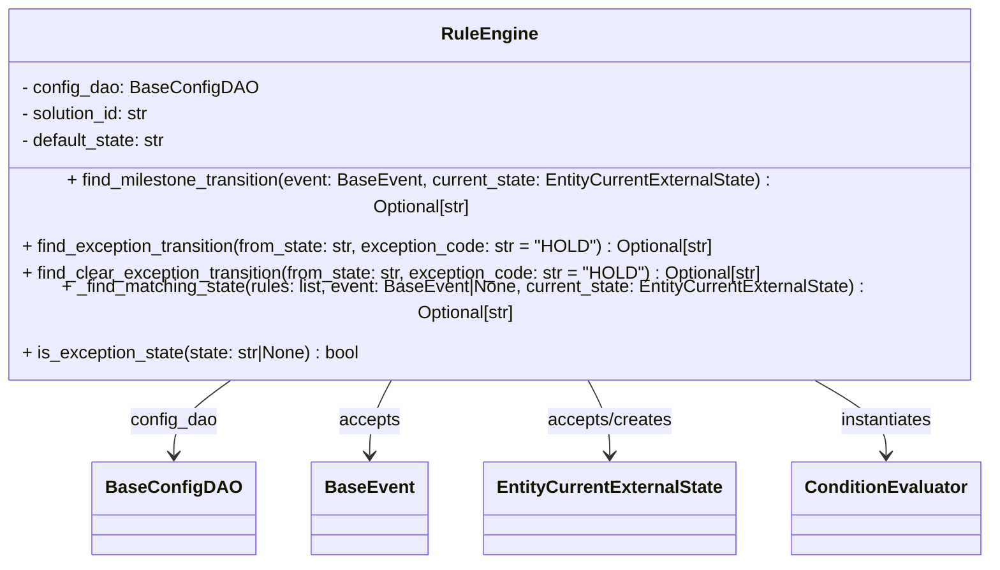

# Diagram: entity_core/entity_service/entity_service/entity/entity/external_state/rules/rule_engine.py


> Auto-generated by Obscura crawlers

## Diagram 1



### SVG

<svg id="container" width="911.9921875" xmlns="http://www.w3.org/2000/svg" class="classDiagram" height="462" viewBox="0 0 911.9921875 462" role="graphics-document document" aria-roledescription="class"><style>#container{font-family:"trebuchet ms",verdana,arial,sans-serif;font-size:16px;fill:#333;}@keyframes edge-animation-frame{from{stroke-dashoffset:0;}}@keyframes dash{to{stroke-dashoffset:0;}}#container .edge-animation-slow{stroke-dasharray:9,5!important;stroke-dashoffset:900;animation:dash 50s linear infinite;stroke-linecap:round;}#container .edge-animation-fast{stroke-dasharray:9,5!important;stroke-dashoffset:900;animation:dash 20s linear infinite;stroke-linecap:round;}#container .error-icon{fill:#552222;}#container .error-text{fill:#552222;stroke:#552222;}#container .edge-thickness-normal{stroke-width:1px;}#container .edge-thickness-thick{stroke-width:3.5px;}#container .edge-pattern-solid{stroke-dasharray:0;}#container .edge-thickness-invisible{stroke-width:0;fill:none;}#container .edge-pattern-dashed{stroke-dasharray:3;}#container .edge-pattern-dotted{stroke-dasharray:2;}#container .marker{fill:#333333;stroke:#333333;}#container .marker.cross{stroke:#333333;}#container svg{font-family:"trebuchet ms",verdana,arial,sans-serif;font-size:16px;}#container p{margin:0;}#container g.classGroup text{fill:#9370DB;stroke:none;font-family:"trebuchet ms",verdana,arial,sans-serif;font-size:10px;}#container g.classGroup text .title{font-weight:bolder;}#container .nodeLabel,#container .edgeLabel{color:#131300;}#container .edgeLabel .label rect{fill:#ECECFF;}#container .label text{fill:#131300;}#container .labelBkg{background:#ECECFF;}#container .edgeLabel .label span{background:#ECECFF;}#container .classTitle{font-weight:bolder;}#container .node rect,#container .node circle,#container .node ellipse,#container .node polygon,#container .node path{fill:#ECECFF;stroke:#9370DB;stroke-width:1px;}#container .divider{stroke:#9370DB;stroke-width:1;}#container g.clickable{cursor:pointer;}#container g.classGroup rect{fill:#ECECFF;stroke:#9370DB;}#container g.classGroup line{stroke:#9370DB;stroke-width:1;}#container .classLabel .box{stroke:none;stroke-width:0;fill:#ECECFF;opacity:0.5;}#container .classLabel .label{fill:#9370DB;font-size:10px;}#container .relation{stroke:#333333;stroke-width:1;fill:none;}#container .dashed-line{stroke-dasharray:3;}#container .dotted-line{stroke-dasharray:1 2;}#container #compositionStart,#container .composition{fill:#333333!important;stroke:#333333!important;stroke-width:1;}#container #compositionEnd,#container .composition{fill:#333333!important;stroke:#333333!important;stroke-width:1;}#container #dependencyStart,#container .dependency{fill:#333333!important;stroke:#333333!important;stroke-width:1;}#container #dependencyStart,#container .dependency{fill:#333333!important;stroke:#333333!important;stroke-width:1;}#container #extensionStart,#container .extension{fill:transparent!important;stroke:#333333!important;stroke-width:1;}#container #extensionEnd,#container .extension{fill:transparent!important;stroke:#333333!important;stroke-width:1;}#container #aggregationStart,#container .aggregation{fill:transparent!important;stroke:#333333!important;stroke-width:1;}#container #aggregationEnd,#container .aggregation{fill:transparent!important;stroke:#333333!important;stroke-width:1;}#container #lollipopStart,#container .lollipop{fill:#ECECFF!important;stroke:#333333!important;stroke-width:1;}#container #lollipopEnd,#container .lollipop{fill:#ECECFF!important;stroke:#333333!important;stroke-width:1;}#container .edgeTerminals{font-size:11px;line-height:initial;}#container .classTitleText{text-anchor:middle;font-size:18px;fill:#333;}#container .label-icon{display:inline-block;height:1em;overflow:visible;vertical-align:-0.125em;}#container .node .label-icon path{fill:currentColor;stroke:revert;stroke-width:revert;}#container :root{--mermaid-font-family:"trebuchet ms",verdana,arial,sans-serif;}</style><g><defs><marker id="container_class-aggregationStart" class="marker aggregation class" refX="18" refY="7" markerWidth="190" markerHeight="240" orient="auto"><path d="M 18,7 L9,13 L1,7 L9,1 Z"></path></marker></defs><defs><marker id="container_class-aggregationEnd" class="marker aggregation class" refX="1" refY="7" markerWidth="20" markerHeight="28" orient="auto"><path d="M 18,7 L9,13 L1,7 L9,1 Z"></path></marker></defs><defs><marker id="container_class-extensionStart" class="marker extension class" refX="18" refY="7" markerWidth="190" markerHeight="240" orient="auto"><path d="M 1,7 L18,13 V 1 Z"></path></marker></defs><defs><marker id="container_class-extensionEnd" class="marker extension class" refX="1" refY="7" markerWidth="20" markerHeight="28" orient="auto"><path d="M 1,1 V 13 L18,7 Z"></path></marker></defs><defs><marker id="container_class-compositionStart" class="marker composition class" refX="18" refY="7" markerWidth="190" markerHeight="240" orient="auto"><path d="M 18,7 L9,13 L1,7 L9,1 Z"></path></marker></defs><defs><marker id="container_class-compositionEnd" class="marker composition class" refX="1" refY="7" markerWidth="20" markerHeight="28" orient="auto"><path d="M 18,7 L9,13 L1,7 L9,1 Z"></path></marker></defs><defs><marker id="container_class-dependencyStart" class="marker dependency class" refX="6" refY="7" markerWidth="190" markerHeight="240" orient="auto"><path d="M 5,7 L9,13 L1,7 L9,1 Z"></path></marker></defs><defs><marker id="container_class-dependencyEnd" class="marker dependency class" refX="13" refY="7" markerWidth="20" markerHeight="28" orient="auto"><path d="M 18,7 L9,13 L14,7 L9,1 Z"></path></marker></defs><defs><marker id="container_class-lollipopStart" class="marker lollipop class" refX="13" refY="7" markerWidth="190" markerHeight="240" orient="auto"><circle stroke="black" fill="transparent" cx="7" cy="7" r="6"></circle></marker></defs><defs><marker id="container_class-lollipopEnd" class="marker lollipop class" refX="1" refY="7" markerWidth="190" markerHeight="240" orient="auto"><circle stroke="black" fill="transparent" cx="7" cy="7" r="6"></circle></marker></defs><g class="root"><g class="clusters"></g><g class="edgePaths"><path d="M239.275,296L229.994,302.167C220.713,308.333,202.152,320.667,192.871,332C183.59,343.333,183.59,353.667,183.59,358.833L183.59,364" id="id_RuleEngine_BaseConfigDAO_1" class="edge-thickness-normal edge-pattern-solid relation" style=";;;" data-edge="true" data-et="edge" data-id="id_RuleEngine_BaseConfigDAO_1" data-points="W3sieCI6MjM5LjI3NTA5OTI3NDg2MTg3LCJ5IjoyOTZ9LHsieCI6MTgzLjU4OTg0Mzc1LCJ5IjozMzN9LHsieCI6MTgzLjU4OTg0Mzc1LCJ5IjozNzB9XQ==" marker-end="url(#container_class-dependencyEnd)"></path><path d="M372.522,296L368.948,302.167C365.373,308.333,358.224,320.667,354.649,332C351.074,343.333,351.074,353.667,351.074,358.833L351.074,364" id="id_RuleEngine_BaseEvent_2" class="edge-thickness-normal edge-pattern-solid relation" style=";;;" data-edge="true" data-et="edge" data-id="id_RuleEngine_BaseEvent_2" data-points="W3sieCI6MzcyLjUyMjMzNjg0MzkyMjYzLCJ5IjoyOTZ9LHsieCI6MzUxLjA3NDIxODc1LCJ5IjozMzN9LHsieCI6MzUxLjA3NDIxODc1LCJ5IjozNzB9XQ==" marker-end="url(#container_class-dependencyEnd)"></path><path d="M539.47,296L543.045,302.167C546.619,308.333,553.769,320.667,557.343,332C560.918,343.333,560.918,353.667,560.918,358.833L560.918,364" id="id_RuleEngine_EntityCurrentExternalState_3" class="edge-thickness-normal edge-pattern-solid relation" style=";;;" data-edge="true" data-et="edge" data-id="id_RuleEngine_EntityCurrentExternalState_3" data-points="W3sieCI6NTM5LjQ2OTg1MDY1NjA3NzQsInkiOjI5Nn0seyJ4Ijo1NjAuOTE3OTY4NzUsInkiOjMzM30seyJ4Ijo1NjAuOTE3OTY4NzUsInkiOjM3MH1d" marker-end="url(#container_class-dependencyEnd)"></path><path d="M731.975,296L743.794,302.167C755.612,308.333,779.25,320.667,791.068,332C802.887,343.333,802.887,353.667,802.887,358.833L802.887,364" id="id_RuleEngine_ConditionEvaluator_4" class="edge-thickness-normal edge-pattern-solid relation" style=";;;" data-edge="true" data-et="edge" data-id="id_RuleEngine_ConditionEvaluator_4" data-points="W3sieCI6NzMxLjk3NTM3NTUxNzk1NTksInkiOjI5Nn0seyJ4Ijo4MDIuODg2NzE4NzUsInkiOjMzM30seyJ4Ijo4MDIuODg2NzE4NzUsInkiOjM3MH1d" marker-end="url(#container_class-dependencyEnd)"></path></g><g class="edgeLabels"><g class="edgeLabel" transform="translate(183.58984375, 333)"><g class="label" data-id="id_RuleEngine_BaseConfigDAO_1" transform="translate(-39.625, -12)"><foreignObject width="79.25" height="24"><div xmlns="http://www.w3.org/1999/xhtml" class="labelBkg" style="display: table-cell; white-space: nowrap; line-height: 1.5; max-width: 200px; text-align: center;"><span class="edgeLabel"><p>config_dao</p></span></div></foreignObject></g></g><g class="edgeLabel" transform="translate(351.07421875, 333)"><g class="label" data-id="id_RuleEngine_BaseEvent_2" transform="translate(-27.421875, -12)"><foreignObject width="54.84375" height="24"><div xmlns="http://www.w3.org/1999/xhtml" class="labelBkg" style="display: table-cell; white-space: nowrap; line-height: 1.5; max-width: 200px; text-align: center;"><span class="edgeLabel"><p>accepts</p></span></div></foreignObject></g></g><g class="edgeLabel" transform="translate(560.91796875, 333)"><g class="label" data-id="id_RuleEngine_EntityCurrentExternalState_3" transform="translate(-57.3515625, -12)"><foreignObject width="114.703125" height="24"><div xmlns="http://www.w3.org/1999/xhtml" class="labelBkg" style="display: table-cell; white-space: nowrap; line-height: 1.5; max-width: 200px; text-align: center;"><span class="edgeLabel"><p>accepts/creates</p></span></div></foreignObject></g></g><g class="edgeLabel" transform="translate(802.88671875, 333)"><g class="label" data-id="id_RuleEngine_ConditionEvaluator_4" transform="translate(-42.9140625, -12)"><foreignObject width="85.828125" height="24"><div xmlns="http://www.w3.org/1999/xhtml" class="labelBkg" style="display: table-cell; white-space: nowrap; line-height: 1.5; max-width: 200px; text-align: center;"><span class="edgeLabel"><p>instantiates</p></span></div></foreignObject></g></g></g><g class="nodes"><g class="node default" id="classId-RuleEngine-0" transform="translate(455.99609375, 152)"><g class="basic label-container"><path d="M-447.99609375 -144 L447.99609375 -144 L447.99609375 144 L-447.99609375 144" stroke="none" stroke-width="0" fill="#ECECFF" style=""></path><path d="M-447.99609375 -144 C-264.59603107534485 -144, -81.19596840068965 -144, 447.99609375 -144 M-447.99609375 -144 C-262.88339747545956 -144, -77.77070120091906 -144, 447.99609375 -144 M447.99609375 -144 C447.99609375 -80.91361880844461, 447.99609375 -17.82723761688922, 447.99609375 144 M447.99609375 -144 C447.99609375 -55.337560343316895, 447.99609375 33.32487931336621, 447.99609375 144 M447.99609375 144 C162.10126066162763 144, -123.79357242674473 144, -447.99609375 144 M447.99609375 144 C93.96256005903109 144, -260.0709736319378 144, -447.99609375 144 M-447.99609375 144 C-447.99609375 69.90030958977775, -447.99609375 -4.199380820444503, -447.99609375 -144 M-447.99609375 144 C-447.99609375 65.95392182452923, -447.99609375 -12.092156350941536, -447.99609375 -144" stroke="#9370DB" stroke-width="1.3" fill="none" stroke-dasharray="0 0" style=""></path></g><g class="annotation-group text" transform="translate(0, -120)"></g><g class="label-group text" transform="translate(-40.7109375, -120)"><g class="label" style="font-weight: bolder" transform="translate(0,-12)"><foreignObject width="81.421875" height="24"><div xmlns="http://www.w3.org/1999/xhtml" style="display: table-cell; white-space: nowrap; line-height: 1.5; max-width: 131px; text-align: center;"><span class="nodeLabel markdown-node-label" style=""><p>RuleEngine</p></span></div></foreignObject></g></g><g class="members-group text" transform="translate(-435.99609375, -72)"><g class="label" style="" transform="translate(0,-12)"><foreignObject width="207.59375" height="24"><div xmlns="http://www.w3.org/1999/xhtml" style="display: table-cell; white-space: nowrap; line-height: 1.5; max-width: 265px; text-align: center;"><span class="nodeLabel markdown-node-label" style=""><p>- config_dao: BaseConfigDAO</p></span></div></foreignObject></g><g class="label" style="" transform="translate(0,12)"><foreignObject width="120.421875" height="24"><div xmlns="http://www.w3.org/1999/xhtml" style="display: table-cell; white-space: nowrap; line-height: 1.5; max-width: 179px; text-align: center;"><span class="nodeLabel markdown-node-label" style=""><p>- solution_id: str</p></span></div></foreignObject></g><g class="label" style="" transform="translate(0,36)"><foreignObject width="134.390625" height="24"><div xmlns="http://www.w3.org/1999/xhtml" style="display: table-cell; white-space: nowrap; line-height: 1.5; max-width: 193px; text-align: center;"><span class="nodeLabel markdown-node-label" style=""><p>- default_state: str</p></span></div></foreignObject></g></g><g class="methods-group text" transform="translate(-435.99609375, 24)"><g class="label" style="" transform="translate(0,-12)"><foreignObject width="742.203125" height="24"><div xmlns="http://www.w3.org/1999/xhtml" style="display: table-cell; white-space: nowrap; line-height: 1.5; max-width: 800px; text-align: center;"><span class="nodeLabel markdown-node-label" style=""><p>+ find_milestone_transition(event: BaseEvent, current_state: EntityCurrentExternalState) : Optional[str]</p></span></div></foreignObject></g><g class="label" style="" transform="translate(0,12)"><foreignObject width="636.34375" height="24"><div xmlns="http://www.w3.org/1999/xhtml" style="display: table-cell; white-space: nowrap; line-height: 1.5; max-width: 694px; text-align: center;"><span class="nodeLabel markdown-node-label" style=""><p>+ find_exception_transition(from_state: str, exception_code: str = "HOLD") : Optional[str]</p></span></div></foreignObject></g><g class="label" style="" transform="translate(0,36)"><foreignObject width="678.765625" height="24"><div xmlns="http://www.w3.org/1999/xhtml" style="display: table-cell; white-space: nowrap; line-height: 1.5; max-width: 736px; text-align: center;"><span class="nodeLabel markdown-node-label" style=""><p>+ find_clear_exception_transition(from_state: str, exception_code: str = "HOLD") : Optional[str]</p></span></div></foreignObject></g><g class="label" style="" transform="translate(0,60)"><foreignObject width="831.28125" height="24"><div xmlns="http://www.w3.org/1999/xhtml" style="display: table-cell; white-space: nowrap; line-height: 1.5; max-width: 889px; text-align: center;"><span class="nodeLabel markdown-node-label" style=""><p>+ _find_matching_state(rules: list, event: BaseEvent|None, current_state: EntityCurrentExternalState) : Optional[str]</p></span></div></foreignObject></g><g class="label" style="" transform="translate(0,84)"><foreignObject width="311.046875" height="24"><div xmlns="http://www.w3.org/1999/xhtml" style="display: table-cell; white-space: nowrap; line-height: 1.5; max-width: 369px; text-align: center;"><span class="nodeLabel markdown-node-label" style=""><p>+ is_exception_state(state: str|None) : bool</p></span></div></foreignObject></g></g><g class="divider" style=""><path d="M-447.99609375 -96 C-185.58630667153187 -96, 76.82348040693626 -96, 447.99609375 -96 M-447.99609375 -96 C-241.8146488520849 -96, -35.6332039541698 -96, 447.99609375 -96" stroke="#9370DB" stroke-width="1.3" fill="none" stroke-dasharray="0 0" style=""></path></g><g class="divider" style=""><path d="M-447.99609375 0 C-144.0743737864526 0, 159.84734617709478 0, 447.99609375 0 M-447.99609375 0 C-257.2803655615024 0, -66.56463737300476 0, 447.99609375 0" stroke="#9370DB" stroke-width="1.3" fill="none" stroke-dasharray="0 0" style=""></path></g></g><g class="node default" id="classId-BaseConfigDAO-1" transform="translate(183.58984375, 412)"><g class="basic label-container"><path d="M-67.75 -42 L67.75 -42 L67.75 42 L-67.75 42" stroke="none" stroke-width="0" fill="#ECECFF" style=""></path><path d="M-67.75 -42 C-16.951738765211523 -42, 33.84652246957695 -42, 67.75 -42 M-67.75 -42 C-32.3345000977738 -42, 3.0809998044524036 -42, 67.75 -42 M67.75 -42 C67.75 -15.780383140749422, 67.75 10.439233718501157, 67.75 42 M67.75 -42 C67.75 -13.48502491035785, 67.75 15.029950179284299, 67.75 42 M67.75 42 C37.351459986886766 42, 6.95291997377354 42, -67.75 42 M67.75 42 C21.43220896599732 42, -24.885582068005363 42, -67.75 42 M-67.75 42 C-67.75 24.631446217391503, -67.75 7.262892434783005, -67.75 -42 M-67.75 42 C-67.75 13.355577445761313, -67.75 -15.288845108477375, -67.75 -42" stroke="#9370DB" stroke-width="1.3" fill="none" stroke-dasharray="0 0" style=""></path></g><g class="annotation-group text" transform="translate(0, -18)"></g><g class="label-group text" transform="translate(-55.75, -18)"><g class="label" style="font-weight: bolder" transform="translate(0,-12)"><foreignObject width="111.5" height="24"><div xmlns="http://www.w3.org/1999/xhtml" style="display: table-cell; white-space: nowrap; line-height: 1.5; max-width: 160px; text-align: center;"><span class="nodeLabel markdown-node-label" style=""><p>BaseConfigDAO</p></span></div></foreignObject></g></g><g class="members-group text" transform="translate(-55.75, 30)"></g><g class="methods-group text" transform="translate(-55.75, 60)"></g><g class="divider" style=""><path d="M-67.75 6 C-34.251547322280764 6, -0.7530946445615285 6, 67.75 6 M-67.75 6 C-21.106349186503905 6, 25.53730162699219 6, 67.75 6" stroke="#9370DB" stroke-width="1.3" fill="none" stroke-dasharray="0 0" style=""></path></g><g class="divider" style=""><path d="M-67.75 24 C-29.300497620320627 24, 9.149004759358746 24, 67.75 24 M-67.75 24 C-29.95266245919975 24, 7.844675081600499 24, 67.75 24" stroke="#9370DB" stroke-width="1.3" fill="none" stroke-dasharray="0 0" style=""></path></g></g><g class="node default" id="classId-BaseEvent-2" transform="translate(351.07421875, 412)"><g class="basic label-container"><path d="M-49.734375 -42 L49.734375 -42 L49.734375 42 L-49.734375 42" stroke="none" stroke-width="0" fill="#ECECFF" style=""></path><path d="M-49.734375 -42 C-13.504308019860495 -42, 22.72575896027901 -42, 49.734375 -42 M-49.734375 -42 C-25.040572973056452 -42, -0.3467709461129047 -42, 49.734375 -42 M49.734375 -42 C49.734375 -24.409446580463488, 49.734375 -6.818893160926976, 49.734375 42 M49.734375 -42 C49.734375 -10.52684504354368, 49.734375 20.94630991291264, 49.734375 42 M49.734375 42 C18.9476130992892 42, -11.8391488014216 42, -49.734375 42 M49.734375 42 C17.08042257012611 42, -15.57352985974778 42, -49.734375 42 M-49.734375 42 C-49.734375 21.341130998874434, -49.734375 0.6822619977488671, -49.734375 -42 M-49.734375 42 C-49.734375 23.395779554275144, -49.734375 4.791559108550288, -49.734375 -42" stroke="#9370DB" stroke-width="1.3" fill="none" stroke-dasharray="0 0" style=""></path></g><g class="annotation-group text" transform="translate(0, -18)"></g><g class="label-group text" transform="translate(-37.734375, -18)"><g class="label" style="font-weight: bolder" transform="translate(0,-12)"><foreignObject width="75.46875" height="24"><div xmlns="http://www.w3.org/1999/xhtml" style="display: table-cell; white-space: nowrap; line-height: 1.5; max-width: 125px; text-align: center;"><span class="nodeLabel markdown-node-label" style=""><p>BaseEvent</p></span></div></foreignObject></g></g><g class="members-group text" transform="translate(-37.734375, 30)"></g><g class="methods-group text" transform="translate(-37.734375, 60)"></g><g class="divider" style=""><path d="M-49.734375 6 C-12.018296970152456 6, 25.69778105969509 6, 49.734375 6 M-49.734375 6 C-25.384335417345575 6, -1.0342958346911502 6, 49.734375 6" stroke="#9370DB" stroke-width="1.3" fill="none" stroke-dasharray="0 0" style=""></path></g><g class="divider" style=""><path d="M-49.734375 24 C-20.185603551535564 24, 9.363167896928871 24, 49.734375 24 M-49.734375 24 C-27.861646575084038 24, -5.988918150168075 24, 49.734375 24" stroke="#9370DB" stroke-width="1.3" fill="none" stroke-dasharray="0 0" style=""></path></g></g><g class="node default" id="classId-EntityCurrentExternalState-3" transform="translate(560.91796875, 412)"><g class="basic label-container"><path d="M-110.109375 -42 L110.109375 -42 L110.109375 42 L-110.109375 42" stroke="none" stroke-width="0" fill="#ECECFF" style=""></path><path d="M-110.109375 -42 C-57.20205307702945 -42, -4.294731154058894 -42, 110.109375 -42 M-110.109375 -42 C-39.07372902572186 -42, 31.96191694855628 -42, 110.109375 -42 M110.109375 -42 C110.109375 -23.07581907509612, 110.109375 -4.151638150192241, 110.109375 42 M110.109375 -42 C110.109375 -15.598509870922715, 110.109375 10.80298025815457, 110.109375 42 M110.109375 42 C59.076341986330206 42, 8.043308972660412 42, -110.109375 42 M110.109375 42 C55.49066265348009 42, 0.871950306960187 42, -110.109375 42 M-110.109375 42 C-110.109375 9.152208732106047, -110.109375 -23.695582535787906, -110.109375 -42 M-110.109375 42 C-110.109375 15.731930081239415, -110.109375 -10.53613983752117, -110.109375 -42" stroke="#9370DB" stroke-width="1.3" fill="none" stroke-dasharray="0 0" style=""></path></g><g class="annotation-group text" transform="translate(0, -18)"></g><g class="label-group text" transform="translate(-98.109375, -18)"><g class="label" style="font-weight: bolder" transform="translate(0,-12)"><foreignObject width="196.21875" height="24"><div xmlns="http://www.w3.org/1999/xhtml" style="display: table-cell; white-space: nowrap; line-height: 1.5; max-width: 242px; text-align: center;"><span class="nodeLabel markdown-node-label" style=""><p>EntityCurrentExternalState</p></span></div></foreignObject></g></g><g class="members-group text" transform="translate(-98.109375, 30)"></g><g class="methods-group text" transform="translate(-98.109375, 60)"></g><g class="divider" style=""><path d="M-110.109375 6 C-45.389903805231256 6, 19.329567389537488 6, 110.109375 6 M-110.109375 6 C-38.35014086089292 6, 33.40909327821416 6, 110.109375 6" stroke="#9370DB" stroke-width="1.3" fill="none" stroke-dasharray="0 0" style=""></path></g><g class="divider" style=""><path d="M-110.109375 24 C-55.70639093538282 24, -1.3034068707656417 24, 110.109375 24 M-110.109375 24 C-30.469796956662933 24, 49.169781086674135 24, 110.109375 24" stroke="#9370DB" stroke-width="1.3" fill="none" stroke-dasharray="0 0" style=""></path></g></g><g class="node default" id="classId-ConditionEvaluator-4" transform="translate(802.88671875, 412)"><g class="basic label-container"><path d="M-81.859375 -42 L81.859375 -42 L81.859375 42 L-81.859375 42" stroke="none" stroke-width="0" fill="#ECECFF" style=""></path><path d="M-81.859375 -42 C-36.09550794350523 -42, 9.668359112989535 -42, 81.859375 -42 M-81.859375 -42 C-30.491701929221435 -42, 20.87597114155713 -42, 81.859375 -42 M81.859375 -42 C81.859375 -17.810262205379225, 81.859375 6.379475589241551, 81.859375 42 M81.859375 -42 C81.859375 -17.594011565202514, 81.859375 6.811976869594972, 81.859375 42 M81.859375 42 C27.78657553568656 42, -26.28622392862688 42, -81.859375 42 M81.859375 42 C30.96720938853187 42, -19.92495622293626 42, -81.859375 42 M-81.859375 42 C-81.859375 16.49398932444946, -81.859375 -9.012021351101083, -81.859375 -42 M-81.859375 42 C-81.859375 22.934764415620386, -81.859375 3.869528831240771, -81.859375 -42" stroke="#9370DB" stroke-width="1.3" fill="none" stroke-dasharray="0 0" style=""></path></g><g class="annotation-group text" transform="translate(0, -18)"></g><g class="label-group text" transform="translate(-69.859375, -18)"><g class="label" style="font-weight: bolder" transform="translate(0,-12)"><foreignObject width="139.71875" height="24"><div xmlns="http://www.w3.org/1999/xhtml" style="display: table-cell; white-space: nowrap; line-height: 1.5; max-width: 189px; text-align: center;"><span class="nodeLabel markdown-node-label" style=""><p>ConditionEvaluator</p></span></div></foreignObject></g></g><g class="members-group text" transform="translate(-69.859375, 30)"></g><g class="methods-group text" transform="translate(-69.859375, 60)"></g><g class="divider" style=""><path d="M-81.859375 6 C-36.179423356755656 6, 9.500528286488688 6, 81.859375 6 M-81.859375 6 C-33.089850604023866 6, 15.679673791952268 6, 81.859375 6" stroke="#9370DB" stroke-width="1.3" fill="none" stroke-dasharray="0 0" style=""></path></g><g class="divider" style=""><path d="M-81.859375 24 C-21.904882094092805 24, 38.04961081181439 24, 81.859375 24 M-81.859375 24 C-39.35121085697375 24, 3.1569532860524987 24, 81.859375 24" stroke="#9370DB" stroke-width="1.3" fill="none" stroke-dasharray="0 0" style=""></path></g></g></g></g></g></svg>

## Diagram 2

```mermaid
flowchart TD
    Start([Start])
    GetCurrentState[/Determine current_state_str = current_state.external_state or default_state/]
    CheckCurrentState{current_state_str present?}
    EndNull([Return None])
    IterateRules[/Iterate rules list/]
    FromStateCheck{fromState == "*" or fromState == current_state_str?}
    ConditionsExist{conditions and event present?}
    EvalCondition[/ConditionEvaluator.evaluate(event, current_state)/]
    ReturnState([Return rule.toState])
    NextRule([Continue to next rule])
    NoMatch([Return None])

    Start --> GetCurrentState
    GetCurrentState --> CheckCurrentState
    CheckCurrentState -- No --> EndNull
    CheckCurrentState -- Yes --> IterateRules
    IterateRules --> FromStateCheck
    FromStateCheck -- No --> NextRule
    FromStateCheck -- Yes --> ConditionsExist
    ConditionsExist -- Yes --> EvalCondition
    EvalCondition -- True --> ReturnState
    EvalCondition -- False --> NextRule
    ConditionsExist -- No --> ReturnState
    NextRule --> IterateRules
    IterateRules --> NoMatch
```

> SVG rendering failed for this diagram.
