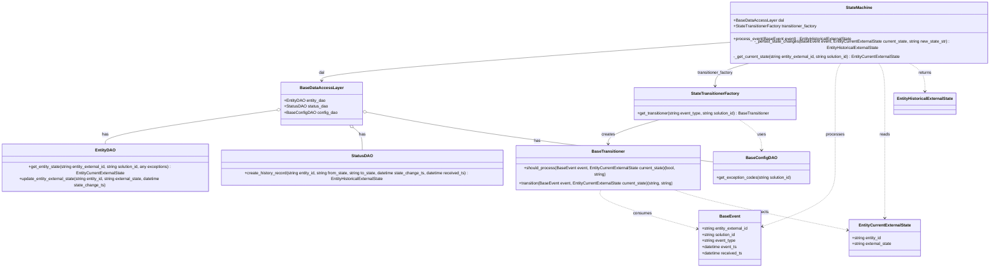

# Diagram: entity_core/entity_service/entity_service/entity/entity/external_state/state_machine/state_machine.py

> Auto-generated by Obscura crawlers

## Mermaid

### SVG

<svg id="container" width="3996.23046875" xmlns="http://www.w3.org/2000/svg" class="classDiagram" height="988" viewBox="0 0 3996.23046875 988" role="graphics-document document" aria-roledescription="class"><g><defs><marker id="container_class-aggregationStart" class="marker aggregation class" refX="18" refY="7" markerWidth="190" markerHeight="240" orient="auto"><path d="M 18,7 L9,13 L1,7 L9,1 Z"></path></marker></defs><defs><marker id="container_class-aggregationEnd" class="marker aggregation class" refX="1" refY="7" markerWidth="20" markerHeight="28" orient="auto"><path d="M 18,7 L9,13 L1,7 L9,1 Z"></path></marker></defs><defs><marker id="container_class-extensionStart" class="marker extension class" refX="18" refY="7" markerWidth="190" markerHeight="240" orient="auto"><path d="M 1,7 L18,13 V 1 Z"></path></marker></defs><defs><marker id="container_class-extensionEnd" class="marker extension class" refX="1" refY="7" markerWidth="20" markerHeight="28" orient="auto"><path d="M 1,1 V 13 L18,7 Z"></path></marker></defs><defs><marker id="container_class-compositionStart" class="marker composition class" refX="18" refY="7" markerWidth="190" markerHeight="240" orient="auto"><path d="M 18,7 L9,13 L1,7 L9,1 Z"></path></marker></defs><defs><marker id="container_class-compositionEnd" class="marker composition class" refX="1" refY="7" markerWidth="20" markerHeight="28" orient="auto"><path d="M 18,7 L9,13 L1,7 L9,1 Z"></path></marker></defs><defs><marker id="container_class-dependencyStart" class="marker dependency class" refX="6" refY="7" markerWidth="190" markerHeight="240" orient="auto"><path d="M 5,7 L9,13 L1,7 L9,1 Z"></path></marker></defs><defs><marker id="container_class-dependencyEnd" class="marker dependency class" refX="13" refY="7" markerWidth="20" markerHeight="28" orient="auto"><path d="M 18,7 L9,13 L14,7 L9,1 Z"></path></marker></defs><defs><marker id="container_class-lollipopStart" class="marker lollipop class" refX="13" refY="7" markerWidth="190" markerHeight="240" orient="auto"><circle stroke="black" fill="transparent" cx="7" cy="7" r="6"></circle></marker></defs><defs><marker id="container_class-lollipopEnd" class="marker lollipop class" refX="1" refY="7" markerWidth="190" markerHeight="240" orient="auto"><circle stroke="black" fill="transparent" cx="7" cy="7" r="6"></circle></marker></defs><g class="root"><g class="clusters"></g><g class="edgePaths"><path d="M2934.723,151.473L2663.653,169.727C2392.583,187.982,1850.444,224.491,1579.374,247.912C1308.305,271.333,1308.305,281.667,1308.305,286.833L1308.305,292" id="id_StateMachine_BaseDataAccessLayer_1" class="edge-thickness-normal edge-pattern-solid relation" style=";;;" data-edge="true" data-et="edge" data-id="id_StateMachine_BaseDataAccessLayer_1" data-points="W3sieCI6MjkzNC43MjI2NTYyNSwieSI6MTUxLjQ3MjkzMDU2MDI5MjU4fSx7IngiOjEzMDguMzA0Njg3NSwieSI6MjYxfSx7IngiOjEzMDguMzA0Njg3NSwieSI6Mjk4fV0=" marker-end="url(#container_class-dependencyEnd)"></path><path d="M3035.237,224L3010.9,230.167C2986.562,236.333,2937.886,248.667,2913.549,263.5C2889.211,278.333,2889.211,295.667,2889.211,304.333L2889.211,313" id="id_StateMachine_StateTransitionerFactory_2" class="edge-thickness-normal edge-pattern-solid relation" style=";;;" data-edge="true" data-et="edge" data-id="id_StateMachine_StateTransitionerFactory_2" data-points="W3sieCI6MzAzNS4yMzczMzgzNjIwNjksInkiOjIyNH0seyJ4IjoyODg5LjIxMDkzNzUsInkiOjI2MX0seyJ4IjoyODg5LjIxMDkzNzUsInkiOjMxOX1d" marker-end="url(#container_class-dependencyEnd)"></path><path d="M3389.871,224L3385.783,230.167C3381.694,236.333,3373.517,248.667,3369.428,275C3365.34,301.333,3365.34,341.667,3365.34,382C3365.34,422.333,3365.34,462.667,3365.34,501.5C3365.34,540.333,3365.34,577.667,3365.34,615C3365.34,652.333,3365.34,689.667,3317.814,724.969C3270.289,760.272,3175.238,793.543,3127.712,810.179L3080.187,826.815" id="id_StateMachine_BaseEvent_3" class="edge-thickness-normal edge-pattern-dashed relation" style=";;;" data-edge="true" data-et="edge" data-id="id_StateMachine_BaseEvent_3" data-points="W3sieCI6MzM4OS44NzEyODIzMjc1ODY0LCJ5IjoyMjR9LHsieCI6MzM2NS4zMzk4NDM3NSwieSI6MjYxfSx7IngiOjMzNjUuMzM5ODQzNzUsInkiOjM4Mn0seyJ4IjozMzY1LjMzOTg0Mzc1LCJ5Ijo1MDN9LHsieCI6MzM2NS4zMzk4NDM3NSwieSI6NjE1fSx7IngiOjMzNjUuMzM5ODQzNzUsInkiOjcyN30seyJ4IjozMDc0LjUyMzQzNzUsInkiOjgyOC43OTczOTczMzEzMjE2fV0=" marker-end="url(#container_class-dependencyEnd)"></path><path d="M3534.778,224L3538.963,230.167C3543.149,236.333,3551.52,248.667,3555.705,275C3559.891,301.333,3559.891,341.667,3559.891,382C3559.891,422.333,3559.891,462.667,3559.891,501.5C3559.891,540.333,3559.891,577.667,3559.891,615C3559.891,652.333,3559.891,689.667,3559.891,719.5C3559.891,749.333,3559.891,771.667,3559.891,782.833L3559.891,794" id="id_StateMachine_EntityCurrentExternalState_4" class="edge-thickness-normal edge-pattern-dashed relation" style=";;;" data-edge="true" data-et="edge" data-id="id_StateMachine_EntityCurrentExternalState_4" data-points="W3sieCI6MzUzNC43NzgwNzExMjA2ODk3LCJ5IjoyMjR9LHsieCI6MzU1OS44OTA2MjUsInkiOjI2MX0seyJ4IjozNTU5Ljg5MDYyNSwieSI6MzgyfSx7IngiOjM1NTkuODkwNjI1LCJ5Ijo1MDN9LHsieCI6MzU1OS44OTA2MjUsInkiOjYxNX0seyJ4IjozNTU5Ljg5MDYyNSwieSI6NzI3fSx7IngiOjM1NTkuODkwNjI1LCJ5Ijo4MDB9XQ==" marker-end="url(#container_class-dependencyEnd)"></path><path d="M3648.533,224L3659.214,230.167C3669.894,236.333,3691.256,248.667,3701.936,267C3712.617,285.333,3712.617,309.667,3712.617,321.833L3712.617,334" id="id_StateMachine_EntityHistoricalExternalState_5" class="edge-thickness-normal edge-pattern-dashed relation" style=";;;" data-edge="true" data-et="edge" data-id="id_StateMachine_EntityHistoricalExternalState_5" data-points="W3sieCI6MzY0OC41MzMwMjgwMTcyNDE2LCJ5IjoyMjR9LHsieCI6MzcxMi42MTcxODc1LCJ5IjoyNjF9LHsieCI6MzcxMi42MTcxODc1LCJ5IjozNDB9XQ==" marker-end="url(#container_class-dependencyEnd)"></path><path d="M2671.03,445L2637.552,454.667C2604.074,464.333,2537.119,483.667,2503.642,498.5C2470.164,513.333,2470.164,523.667,2470.164,528.833L2470.164,534" id="id_StateTransitionerFactory_BaseTransitioner_6" class="edge-thickness-normal edge-pattern-solid relation" style=";;;" data-edge="true" data-et="edge" data-id="id_StateTransitionerFactory_BaseTransitioner_6" data-points="W3sieCI6MjY3MS4wMjk1MDY3MTQ4NzYsInkiOjQ0NX0seyJ4IjoyNDcwLjE2NDA2MjUsInkiOjUwM30seyJ4IjoyNDcwLjE2NDA2MjUsInkiOjU0MH1d" marker-end="url(#container_class-dependencyEnd)"></path><path d="M2985.769,445L3000.585,454.667C3015.401,464.333,3045.032,483.667,3059.848,500.5C3074.664,517.333,3074.664,531.667,3074.664,538.833L3074.664,546" id="id_StateTransitionerFactory_BaseConfigDAO_7" class="edge-thickness-normal edge-pattern-dashed relation" style=";;;" data-edge="true" data-et="edge" data-id="id_StateTransitionerFactory_BaseConfigDAO_7" data-points="W3sieCI6Mjk4NS43NjkxNzYxMzYzNjM1LCJ5Ijo0NDV9LHsieCI6MzA3NC42NjQwNjI1LCJ5Ijo1MDN9LHsieCI6MzA3NC42NjQwNjI1LCJ5Ijo1NTJ9XQ==" marker-end="url(#container_class-dependencyEnd)"></path><path d="M1139.413,405.077L1019.966,421.397C900.52,437.718,661.627,470.359,542.181,492.846C422.734,515.333,422.734,527.667,422.734,533.833L422.734,540" id="id_BaseDataAccessLayer_EntityDAO_8" class="edge-thickness-normal edge-pattern-solid relation" style=";;;" data-edge="true" data-et="edge" data-id="id_BaseDataAccessLayer_EntityDAO_8" data-points="W3sieCI6MTE1Ni41MDM5MDYyNSwieSI6NDAyLjc0MTMxNjk0Nzk0MTR9LHsieCI6NDIyLjczNDM3NSwieSI6NTAzfSx7IngiOjQyMi43MzQzNzUsInkiOjU0MH1d" marker-start="url(#container_class-aggregationStart)"></path><path d="M1435.131,476.292L1441.119,480.743C1447.106,485.195,1459.08,494.097,1465.067,506.715C1471.055,519.333,1471.055,535.667,1471.055,543.833L1471.055,552" id="id_BaseDataAccessLayer_StatusDAO_9" class="edge-thickness-normal edge-pattern-solid relation" style=";;;" data-edge="true" data-et="edge" data-id="id_BaseDataAccessLayer_StatusDAO_9" data-points="W3sieCI6MTQyMS4yODgxNTg1NzQzOCwieSI6NDY2fSx7IngiOjE0NzEuMDU0Njg3NSwieSI6NTAzfSx7IngiOjE0NzEuMDU0Njg3NSwieSI6NTUyfV0=" marker-start="url(#container_class-aggregationStart)"></path><path d="M1477.069,413.149L1558.203,428.124C1639.338,443.099,1801.606,473.05,2036.376,503.516C2271.146,533.982,2578.417,564.964,2732.052,580.455L2885.688,595.946" id="id_BaseDataAccessLayer_BaseConfigDAO_10" class="edge-thickness-normal edge-pattern-solid relation" style=";;;" data-edge="true" data-et="edge" data-id="id_BaseDataAccessLayer_BaseConfigDAO_10" data-points="W3sieCI6MTQ2MC4xMDU0Njg3NSwieSI6NDEwLjAxODE5MTQ2MDIwMjg0fSx7IngiOjE5NjMuODc1LCJ5Ijo1MDN9LHsieCI6Mjg4NS42ODc1LCJ5Ijo1OTUuOTQ1NjM5NzEyNzYwNX1d" marker-start="url(#container_class-aggregationStart)"></path><path d="M2441.163,690L2438.778,696.167C2436.394,702.333,2431.625,714.667,2495.08,739.044C2558.536,763.421,2690.216,799.842,2756.057,818.053L2821.897,836.264" id="id_BaseTransitioner_BaseEvent_11" class="edge-thickness-normal edge-pattern-dashed relation" style=";;;" data-edge="true" data-et="edge" data-id="id_BaseTransitioner_BaseEvent_11" data-points="W3sieCI6MjQ0MS4xNjI3NzIwNDI0MTEsInkiOjY5MH0seyJ4IjoyNDI2Ljg1NTQ2ODc1LCJ5Ijo3Mjd9LHsieCI6MjgyNy42Nzk2ODc1LCJ5Ijo4MzcuODYzMDMyNDc5Njc2OX1d" marker-end="url(#container_class-dependencyEnd)"></path><path d="M2730.734,690L2752.158,696.167C2773.583,702.333,2816.432,714.667,2930.332,739.972C3044.232,765.278,3229.182,803.556,3321.657,822.695L3414.132,841.833" id="id_BaseTransitioner_EntityCurrentExternalState_12" class="edge-thickness-normal edge-pattern-dashed relation" style=";;;" data-edge="true" data-et="edge" data-id="id_BaseTransitioner_EntityCurrentExternalState_12" data-points="W3sieCI6MjczMC43MzM2MDc3MDA4OTI3LCJ5Ijo2OTB9LHsieCI6Mjg1OS4yODEyNSwieSI6NzI3fSx7IngiOjM0MjAuMDA3ODEyNSwieSI6ODQzLjA0OTQ3NzAxNzc3NDd9XQ==" marker-end="url(#container_class-dependencyEnd)"></path></g><g class="edgeLabels"><g class="edgeLabel" transform="translate(1308.3046875, 261)"><g class="label" data-id="id_StateMachine_BaseDataAccessLayer_1" transform="translate(-11.40625, -12)"><foreignObject width="22.8125" height="24">

dal

</foreignObject></g></g><g class="edgeLabel" transform="translate(2889.2109375, 261)"><g class="label" data-id="id_StateMachine_StateTransitionerFactory_2" transform="translate(-71.1875, -12)"><foreignObject width="142.375" height="24">

transitioner_factory

</foreignObject></g></g><g class="edgeLabel" transform="translate(3365.33984375, 503)"><g class="label" data-id="id_StateMachine_BaseEvent_3" transform="translate(-35.7890625, -12)"><foreignObject width="71.578125" height="24">

processes

</foreignObject></g></g><g class="edgeLabel" transform="translate(3559.890625, 503)"><g class="label" data-id="id_StateMachine_EntityCurrentExternalState_4" transform="translate(-20.0078125, -12)"><foreignObject width="40.015625" height="24">

reads

</foreignObject></g></g><g class="edgeLabel" transform="translate(3712.6171875, 261)"><g class="label" data-id="id_StateMachine_EntityHistoricalExternalState_5" transform="translate(-26.265625, -12)"><foreignObject width="52.53125" height="24">

returns

</foreignObject></g></g><g class="edgeLabel" transform="translate(2470.1640625, 503)"><g class="label" data-id="id_StateTransitionerFactory_BaseTransitioner_6" transform="translate(-26.171875, -12)"><foreignObject width="52.34375" height="24">

creates

</foreignObject></g></g><g class="edgeLabel" transform="translate(3074.6640625, 503)"><g class="label" data-id="id_StateTransitionerFactory_BaseConfigDAO_7" transform="translate(-16.4921875, -12)"><foreignObject width="32.984375" height="24">

uses

</foreignObject></g></g><g class="edgeLabel" transform="translate(422.734375, 503)"><g class="label" data-id="id_BaseDataAccessLayer_EntityDAO_8" transform="translate(-12.703125, -12)"><foreignObject width="25.40625" height="24">

has

</foreignObject></g></g><g class="edgeLabel" transform="translate(1471.0546875, 503)"><g class="label" data-id="id_BaseDataAccessLayer_StatusDAO_9" transform="translate(-12.703125, -12)"><foreignObject width="25.40625" height="24">

has

</foreignObject></g></g><g class="edgeLabel" transform="translate(2169.93413, 523.77678)"><g class="label" data-id="id_BaseDataAccessLayer_BaseConfigDAO_10" transform="translate(-12.703125, -12)"><foreignObject width="25.40625" height="24">

has

</foreignObject></g></g><g class="edgeLabel" transform="translate(2608.15041, 777.14394)"><g class="label" data-id="id_BaseTransitioner_BaseEvent_11" transform="translate(-36.375, -12)"><foreignObject width="72.75" height="24">

consumes

</foreignObject></g></g><g class="edgeLabel" transform="translate(3074.14924, 771.46966)"><g class="label" data-id="id_BaseTransitioner_EntityCurrentExternalState_12" transform="translate(-30.2421875, -12)"><foreignObject width="60.484375" height="24">

inspects

</foreignObject></g></g></g><g class="nodes"><g class="node default" id="classId-StateMachine-0" transform="translate(3461.4765625, 116)"><g class="basic label-container"><path d="M-526.75390625 -108 L526.75390625 -108 L526.75390625 108 L-526.75390625 108" stroke="none" stroke-width="0" fill="#ECECFF" style=""></path><path d="M-526.75390625 -108 C-177.80440365604687 -108, 171.14509893790625 -108, 526.75390625 -108 M-526.75390625 -108 C-163.95719444682123 -108, 198.83951735635753 -108, 526.75390625 -108 M526.75390625 -108 C526.75390625 -45.393746826540564, 526.75390625 17.21250634691887, 526.75390625 108 M526.75390625 -108 C526.75390625 -57.65665422836875, 526.75390625 -7.313308456737502, 526.75390625 108 M526.75390625 108 C175.0326191388645 108, -176.688667972271 108, -526.75390625 108 M526.75390625 108 C137.85624780054877 108, -251.04141064890246 108, -526.75390625 108 M-526.75390625 108 C-526.75390625 25.12503950034673, -526.75390625 -57.74992099930654, -526.75390625 -108 M-526.75390625 108 C-526.75390625 44.90791770585438, -526.75390625 -18.18416458829124, -526.75390625 -108" stroke="#9370DB" stroke-width="1.3" fill="none" stroke-dasharray="0 0" style=""></path></g><g class="annotation-group text" transform="translate(0, -84)"></g><g class="label-group text" transform="translate(-49.7265625, -84)"><g class="label" style="font-weight: bolder" transform="translate(0,-12)"><foreignObject width="99.453125" height="24">

StateMachine

</foreignObject></g></g><g class="members-group text" transform="translate(-514.75390625, -36)"><g class="label" style="" transform="translate(0,-12)"><foreignObject width="189.015625" height="24">

+BaseDataAccessLayer dal

</foreignObject></g><g class="label" style="" transform="translate(0,12)"><foreignObject width="330.859375" height="24">

+StateTransitionerFactory transitioner_factory

</foreignObject></g></g><g class="methods-group text" transform="translate(-514.75390625, 36)"><g class="label" style="" transform="translate(0,-12)"><foreignObject width="460.515625" height="24">

+process_event(BaseEvent event) : EntityHistoricalExternalState

</foreignObject></g><g class="label" style="" transform="translate(0,12)"><foreignObject width="979.78125" height="24">

-_persist_state_changes(BaseEvent event, EntityCurrentExternalState current_state, string new_state_str) : EntityHistoricalExternalState

</foreignObject></g><g class="label" style="" transform="translate(0,36)"><foreignObject width="669.21875" height="24">

-_get_current_state(string entity_external_id, string solution_id) : EntityCurrentExternalState

</foreignObject></g></g><g class="divider" style=""><path d="M-526.75390625 -60 C-167.21248266201553 -60, 192.32894092596894 -60, 526.75390625 -60 M-526.75390625 -60 C-312.1927162792178 -60, -97.63152630843558 -60, 526.75390625 -60" stroke="#9370DB" stroke-width="1.3" fill="none" stroke-dasharray="0 0" style=""></path></g><g class="divider" style=""><path d="M-526.75390625 12 C-218.05266136147134 12, 90.64858352705733 12, 526.75390625 12 M-526.75390625 12 C-196.18732301835865 12, 134.3792602132827 12, 526.75390625 12" stroke="#9370DB" stroke-width="1.3" fill="none" stroke-dasharray="0 0" style=""></path></g></g><g class="node default" id="classId-BaseDataAccessLayer-1" transform="translate(1308.3046875, 382)"><g class="basic label-container"><path d="M-151.80078125 -84 L151.80078125 -84 L151.80078125 84 L-151.80078125 84" stroke="none" stroke-width="0" fill="#ECECFF" style=""></path><path d="M-151.80078125 -84 C-87.34760625095821 -84, -22.894431251916416 -84, 151.80078125 -84 M-151.80078125 -84 C-87.31303086838771 -84, -22.825280486775426 -84, 151.80078125 -84 M151.80078125 -84 C151.80078125 -29.208471343900563, 151.80078125 25.583057312198875, 151.80078125 84 M151.80078125 -84 C151.80078125 -26.585958424062575, 151.80078125 30.82808315187485, 151.80078125 84 M151.80078125 84 C51.19512522793805 84, -49.4105307941239 84, -151.80078125 84 M151.80078125 84 C87.95250937053078 84, 24.10423749106154 84, -151.80078125 84 M-151.80078125 84 C-151.80078125 48.36130194769527, -151.80078125 12.722603895390534, -151.80078125 -84 M-151.80078125 84 C-151.80078125 19.540087571304724, -151.80078125 -44.91982485739055, -151.80078125 -84" stroke="#9370DB" stroke-width="1.3" fill="none" stroke-dasharray="0 0" style=""></path></g><g class="annotation-group text" transform="translate(0, -60)"></g><g class="label-group text" transform="translate(-78.5546875, -60)"><g class="label" style="font-weight: bolder" transform="translate(0,-12)"><foreignObject width="157.109375" height="24">

BaseDataAccessLayer

</foreignObject></g></g><g class="members-group text" transform="translate(-139.80078125, -12)"><g class="label" style="" transform="translate(0,-12)"><foreignObject width="161.171875" height="24">

+EntityDAO entity_dao

</foreignObject></g><g class="label" style="" transform="translate(0,12)"><foreignObject width="167.15625" height="24">

+StatusDAO status_dao

</foreignObject></g><g class="label" style="" transform="translate(0,36)"><foreignObject width="201.046875" height="24">

+BaseConfigDAO config_dao

</foreignObject></g></g><g class="methods-group text" transform="translate(-139.80078125, 84)"></g><g class="divider" style=""><path d="M-151.80078125 -36 C-34.17354880666089 -36, 83.45368363667822 -36, 151.80078125 -36 M-151.80078125 -36 C-81.11780964488912 -36, -10.434838039778242 -36, 151.80078125 -36" stroke="#9370DB" stroke-width="1.3" fill="none" stroke-dasharray="0 0" style=""></path></g><g class="divider" style=""><path d="M-151.80078125 60 C-87.07725154853011 60, -22.35372184706023 60, 151.80078125 60 M-151.80078125 60 C-76.99359403315485 60, -2.186406816309699 60, 151.80078125 60" stroke="#9370DB" stroke-width="1.3" fill="none" stroke-dasharray="0 0" style=""></path></g></g><g class="node default" id="classId-StateTransitionerFactory-2" transform="translate(2889.2109375, 382)"><g class="basic label-container"><path d="M-322.375 -63 L322.375 -63 L322.375 63 L-322.375 63" stroke="none" stroke-width="0" fill="#ECECFF" style=""></path><path d="M-322.375 -63 C-90.03810269812377 -63, 142.29879460375247 -63, 322.375 -63 M-322.375 -63 C-101.61685836752318 -63, 119.14128326495364 -63, 322.375 -63 M322.375 -63 C322.375 -28.11282232923493, 322.375 6.774355341530139, 322.375 63 M322.375 -63 C322.375 -23.057949169354117, 322.375 16.884101661291766, 322.375 63 M322.375 63 C99.22705865250967 63, -123.92088269498066 63, -322.375 63 M322.375 63 C90.63567661220401 63, -141.10364677559198 63, -322.375 63 M-322.375 63 C-322.375 30.28597736904574, -322.375 -2.4280452619085224, -322.375 -63 M-322.375 63 C-322.375 30.551197912056807, -322.375 -1.8976041758863857, -322.375 -63" stroke="#9370DB" stroke-width="1.3" fill="none" stroke-dasharray="0 0" style=""></path></g><g class="annotation-group text" transform="translate(0, -39)"></g><g class="label-group text" transform="translate(-90.296875, -39)"><g class="label" style="font-weight: bolder" transform="translate(0,-12)"><foreignObject width="180.59375" height="24">

StateTransitionerFactory

</foreignObject></g></g><g class="members-group text" transform="translate(-310.375, 9)"></g><g class="methods-group text" transform="translate(-310.375, 39)"><g class="label" style="" transform="translate(0,-12)"><foreignObject width="530.453125" height="24">

+get_transitioner(string event_type, string solution_id) : BaseTransitioner

</foreignObject></g></g><g class="divider" style=""><path d="M-322.375 -15 C-150.08951667662177 -15, 22.19596664675646 -15, 322.375 -15 M-322.375 -15 C-113.69423817082742 -15, 94.98652365834516 -15, 322.375 -15" stroke="#9370DB" stroke-width="1.3" fill="none" stroke-dasharray="0 0" style=""></path></g><g class="divider" style=""><path d="M-322.375 9 C-76.76682152939776 9, 168.84135694120448 9, 322.375 9 M-322.375 9 C-116.23686210721712 9, 89.90127578556576 9, 322.375 9" stroke="#9370DB" stroke-width="1.3" fill="none" stroke-dasharray="0 0" style=""></path></g></g><g class="node default" id="classId-BaseTransitioner-3" transform="translate(2470.1640625, 615)"><g class="basic label-container"><path d="M-365.5234375 -75 L365.5234375 -75 L365.5234375 75 L-365.5234375 75" stroke="none" stroke-width="0" fill="#ECECFF" style=""></path><path d="M-365.5234375 -75 C-86.25130841484258 -75, 193.02082067031483 -75, 365.5234375 -75 M-365.5234375 -75 C-134.62267464214588 -75, 96.27808821570824 -75, 365.5234375 -75 M365.5234375 -75 C365.5234375 -21.630555960194364, 365.5234375 31.73888807961127, 365.5234375 75 M365.5234375 -75 C365.5234375 -17.337941739493175, 365.5234375 40.32411652101365, 365.5234375 75 M365.5234375 75 C218.8795183324807 75, 72.2355991649614 75, -365.5234375 75 M365.5234375 75 C88.02151520507522 75, -189.48040708984956 75, -365.5234375 75 M-365.5234375 75 C-365.5234375 33.09091394182701, -365.5234375 -8.818172116345977, -365.5234375 -75 M-365.5234375 75 C-365.5234375 21.999841140156498, -365.5234375 -31.000317719687004, -365.5234375 -75" stroke="#9370DB" stroke-width="1.3" fill="none" stroke-dasharray="0 0" style=""></path></g><g class="annotation-group text" transform="translate(0, -51)"></g><g class="label-group text" transform="translate(-61.90625, -51)"><g class="label" style="font-weight: bolder" transform="translate(0,-12)"><foreignObject width="123.8125" height="24">

BaseTransitioner

</foreignObject></g></g><g class="members-group text" transform="translate(-353.5234375, -3)"></g><g class="methods-group text" transform="translate(-353.5234375, 27)"><g class="label" style="" transform="translate(0,-12)"><foreignObject width="645.140625" height="24">

+should_process(BaseEvent event, EntityCurrentExternalState current_state)(bool, string)

</foreignObject></g><g class="label" style="" transform="translate(0,12)"><foreignObject width="610.84375" height="24">

+transition(BaseEvent event, EntityCurrentExternalState current_state)(string, string)

</foreignObject></g></g><g class="divider" style=""><path d="M-365.5234375 -27 C-195.48420818171533 -27, -25.444978863430663 -27, 365.5234375 -27 M-365.5234375 -27 C-160.32963088741923 -27, 44.864175725161545 -27, 365.5234375 -27" stroke="#9370DB" stroke-width="1.3" fill="none" stroke-dasharray="0 0" style=""></path></g><g class="divider" style=""><path d="M-365.5234375 -3 C-86.13796735753863 -3, 193.24750278492274 -3, 365.5234375 -3 M-365.5234375 -3 C-150.36413126912916 -3, 64.79517496174168 -3, 365.5234375 -3" stroke="#9370DB" stroke-width="1.3" fill="none" stroke-dasharray="0 0" style=""></path></g></g><g class="node default" id="classId-BaseEvent-4" transform="translate(2951.1015625, 872)"><g class="basic label-container"><path d="M-123.421875 -108 L123.421875 -108 L123.421875 108 L-123.421875 108" stroke="none" stroke-width="0" fill="#ECECFF" style=""></path><path d="M-123.421875 -108 C-56.82246606223033 -108, 9.776942875539333 -108, 123.421875 -108 M-123.421875 -108 C-64.7917984586835 -108, -6.1617219173669895 -108, 123.421875 -108 M123.421875 -108 C123.421875 -63.44484273402668, 123.421875 -18.889685468053358, 123.421875 108 M123.421875 -108 C123.421875 -40.37430234167856, 123.421875 27.251395316642885, 123.421875 108 M123.421875 108 C28.738001125521208 108, -65.94587274895758 108, -123.421875 108 M123.421875 108 C47.83103266079594 108, -27.759809678408118 108, -123.421875 108 M-123.421875 108 C-123.421875 57.36903315090631, -123.421875 6.738066301812623, -123.421875 -108 M-123.421875 108 C-123.421875 33.16879877859134, -123.421875 -41.662402442817324, -123.421875 -108" stroke="#9370DB" stroke-width="1.3" fill="none" stroke-dasharray="0 0" style=""></path></g><g class="annotation-group text" transform="translate(0, -84)"></g><g class="label-group text" transform="translate(-37.734375, -84)"><g class="label" style="font-weight: bolder" transform="translate(0,-12)"><foreignObject width="75.46875" height="24">

BaseEvent

</foreignObject></g></g><g class="members-group text" transform="translate(-111.421875, -36)"><g class="label" style="" transform="translate(0,-12)"><foreignObject width="185.109375" height="24">

+string entity_external_id

</foreignObject></g><g class="label" style="" transform="translate(0,12)"><foreignObject width="136.09375" height="24">

+string solution_id

</foreignObject></g><g class="label" style="" transform="translate(0,36)"><foreignObject width="133.984375" height="24">

+string event_type

</foreignObject></g><g class="label" style="" transform="translate(0,60)"><foreignObject width="139.0625" height="24">

+datetime event_ts

</foreignObject></g><g class="label" style="" transform="translate(0,84)"><foreignObject width="159.796875" height="24">

+datetime received_ts

</foreignObject></g></g><g class="methods-group text" transform="translate(-111.421875, 108)"></g><g class="divider" style=""><path d="M-123.421875 -60 C-73.56883233128015 -60, -23.715789662560297 -60, 123.421875 -60 M-123.421875 -60 C-53.25110320458059 -60, 16.919668590838825 -60, 123.421875 -60" stroke="#9370DB" stroke-width="1.3" fill="none" stroke-dasharray="0 0" style=""></path></g><g class="divider" style=""><path d="M-123.421875 84 C-32.579912541956986 84, 58.26204991608603 84, 123.421875 84 M-123.421875 84 C-60.799997590701324 84, 1.8218798185973526 84, 123.421875 84" stroke="#9370DB" stroke-width="1.3" fill="none" stroke-dasharray="0 0" style=""></path></g></g><g class="node default" id="classId-EntityCurrentExternalState-5" transform="translate(3559.890625, 872)"><g class="basic label-container"><path d="M-139.8828125 -72 L139.8828125 -72 L139.8828125 72 L-139.8828125 72" stroke="none" stroke-width="0" fill="#ECECFF" style=""></path><path d="M-139.8828125 -72 C-50.18662134214854 -72, 39.50956981570292 -72, 139.8828125 -72 M-139.8828125 -72 C-63.47690476548006 -72, 12.929002969039885 -72, 139.8828125 -72 M139.8828125 -72 C139.8828125 -37.733682516200695, 139.8828125 -3.467365032401389, 139.8828125 72 M139.8828125 -72 C139.8828125 -14.757681517736003, 139.8828125 42.48463696452799, 139.8828125 72 M139.8828125 72 C28.293360707979005 72, -83.29609108404199 72, -139.8828125 72 M139.8828125 72 C62.096657822153645 72, -15.68949685569271 72, -139.8828125 72 M-139.8828125 72 C-139.8828125 33.46244063922588, -139.8828125 -5.075118721548236, -139.8828125 -72 M-139.8828125 72 C-139.8828125 39.715336540618736, -139.8828125 7.430673081237472, -139.8828125 -72" stroke="#9370DB" stroke-width="1.3" fill="none" stroke-dasharray="0 0" style=""></path></g><g class="annotation-group text" transform="translate(0, -48)"></g><g class="label-group text" transform="translate(-98.109375, -48)"><g class="label" style="font-weight: bolder" transform="translate(0,-12)"><foreignObject width="196.21875" height="24">

EntityCurrentExternalState

</foreignObject></g></g><g class="members-group text" transform="translate(-127.8828125, 0)"><g class="label" style="" transform="translate(0,-12)"><foreignObject width="117.734375" height="24">

+string entity_id

</foreignObject></g><g class="label" style="" transform="translate(0,12)"><foreignObject width="157.65625" height="24">

+string external_state

</foreignObject></g></g><g class="methods-group text" transform="translate(-127.8828125, 72)"></g><g class="divider" style=""><path d="M-139.8828125 -24 C-54.17605216332909 -24, 31.53070817334182 -24, 139.8828125 -24 M-139.8828125 -24 C-69.64062207974342 -24, 0.601568340513154 -24, 139.8828125 -24" stroke="#9370DB" stroke-width="1.3" fill="none" stroke-dasharray="0 0" style=""></path></g><g class="divider" style=""><path d="M-139.8828125 48 C-65.68909600420537 48, 8.504620491589264 48, 139.8828125 48 M-139.8828125 48 C-58.81710496125049 48, 22.248602577499014 48, 139.8828125 48" stroke="#9370DB" stroke-width="1.3" fill="none" stroke-dasharray="0 0" style=""></path></g></g><g class="node default" id="classId-EntityHistoricalExternalState-6" transform="translate(3712.6171875, 382)"><g class="basic label-container"><path d="M-117.7265625 -42 L117.7265625 -42 L117.7265625 42 L-117.7265625 42" stroke="none" stroke-width="0" fill="#ECECFF" style=""></path><path d="M-117.7265625 -42 C-42.215128673656196 -42, 33.29630515268761 -42, 117.7265625 -42 M-117.7265625 -42 C-40.530699623252374 -42, 36.66516325349525 -42, 117.7265625 -42 M117.7265625 -42 C117.7265625 -9.74455551576046, 117.7265625 22.51088896847908, 117.7265625 42 M117.7265625 -42 C117.7265625 -9.711833652134054, 117.7265625 22.576332695731892, 117.7265625 42 M117.7265625 42 C54.8245096924012 42, -8.0775431151976 42, -117.7265625 42 M117.7265625 42 C67.0348611092174 42, 16.343159718434805 42, -117.7265625 42 M-117.7265625 42 C-117.7265625 24.56891400267966, -117.7265625 7.137828005359317, -117.7265625 -42 M-117.7265625 42 C-117.7265625 16.45571816711129, -117.7265625 -9.088563665777421, -117.7265625 -42" stroke="#9370DB" stroke-width="1.3" fill="none" stroke-dasharray="0 0" style=""></path></g><g class="annotation-group text" transform="translate(0, -18)"></g><g class="label-group text" transform="translate(-105.7265625, -18)"><g class="label" style="font-weight: bolder" transform="translate(0,-12)"><foreignObject width="211.453125" height="24">

EntityHistoricalExternalState

</foreignObject></g></g><g class="members-group text" transform="translate(-105.7265625, 30)"></g><g class="methods-group text" transform="translate(-105.7265625, 60)"></g><g class="divider" style=""><path d="M-117.7265625 6 C-56.80990298800788 6, 4.106756523984245 6, 117.7265625 6 M-117.7265625 6 C-36.60414096921801 6, 44.518280561563984 6, 117.7265625 6" stroke="#9370DB" stroke-width="1.3" fill="none" stroke-dasharray="0 0" style=""></path></g><g class="divider" style=""><path d="M-117.7265625 24 C-37.5251554453595 24, 42.676251609280996 24, 117.7265625 24 M-117.7265625 24 C-63.333561294650366 24, -8.940560089300732 24, 117.7265625 24" stroke="#9370DB" stroke-width="1.3" fill="none" stroke-dasharray="0 0" style=""></path></g></g><g class="node default" id="classId-BaseConfigDAO-7" transform="translate(3074.6640625, 615)"><g class="basic label-container"><path d="M-188.9765625 -63 L188.9765625 -63 L188.9765625 63 L-188.9765625 63" stroke="none" stroke-width="0" fill="#ECECFF" style=""></path><path d="M-188.9765625 -63 C-74.28035118213566 -63, 40.41586013572868 -63, 188.9765625 -63 M-188.9765625 -63 C-42.94124552290526 -63, 103.09407145418947 -63, 188.9765625 -63 M188.9765625 -63 C188.9765625 -19.758887160612154, 188.9765625 23.48222567877569, 188.9765625 63 M188.9765625 -63 C188.9765625 -17.75654769855076, 188.9765625 27.486904602898477, 188.9765625 63 M188.9765625 63 C102.53428031115277 63, 16.09199812230554 63, -188.9765625 63 M188.9765625 63 C86.45841636763245 63, -16.059729764735096 63, -188.9765625 63 M-188.9765625 63 C-188.9765625 15.975997560190699, -188.9765625 -31.048004879618603, -188.9765625 -63 M-188.9765625 63 C-188.9765625 37.454720563186775, -188.9765625 11.909441126373551, -188.9765625 -63" stroke="#9370DB" stroke-width="1.3" fill="none" stroke-dasharray="0 0" style=""></path></g><g class="annotation-group text" transform="translate(0, -39)"></g><g class="label-group text" transform="translate(-55.75, -39)"><g class="label" style="font-weight: bolder" transform="translate(0,-12)"><foreignObject width="111.5" height="24">

BaseConfigDAO

</foreignObject></g></g><g class="members-group text" transform="translate(-176.9765625, 9)"></g><g class="methods-group text" transform="translate(-176.9765625, 39)"><g class="label" style="" transform="translate(0,-12)"><foreignObject width="298.203125" height="24">

+get_exception_codes(string solution_id)

</foreignObject></g></g><g class="divider" style=""><path d="M-188.9765625 -15 C-81.88785551548229 -15, 25.200851469035427 -15, 188.9765625 -15 M-188.9765625 -15 C-84.4464752866784 -15, 20.083611926643187 -15, 188.9765625 -15" stroke="#9370DB" stroke-width="1.3" fill="none" stroke-dasharray="0 0" style=""></path></g><g class="divider" style=""><path d="M-188.9765625 9 C-41.826534705298485 9, 105.32349308940303 9, 188.9765625 9 M-188.9765625 9 C-58.988373995733156 9, 70.99981450853369 9, 188.9765625 9" stroke="#9370DB" stroke-width="1.3" fill="none" stroke-dasharray="0 0" style=""></path></g></g><g class="node default" id="classId-EntityDAO-8" transform="translate(422.734375, 615)"><g class="basic label-container"><path d="M-414.734375 -75 L414.734375 -75 L414.734375 75 L-414.734375 75" stroke="none" stroke-width="0" fill="#ECECFF" style=""></path><path d="M-414.734375 -75 C-210.50043646072325 -75, -6.266497921446501 -75, 414.734375 -75 M-414.734375 -75 C-211.5493252957842 -75, -8.3642755915684 -75, 414.734375 -75 M414.734375 -75 C414.734375 -20.085410991032894, 414.734375 34.82917801793421, 414.734375 75 M414.734375 -75 C414.734375 -36.40482294585982, 414.734375 2.19035410828036, 414.734375 75 M414.734375 75 C231.39021068488267 75, 48.04604636976535 75, -414.734375 75 M414.734375 75 C113.40867798712372 75, -187.91701902575255 75, -414.734375 75 M-414.734375 75 C-414.734375 44.79868248421174, -414.734375 14.59736496842347, -414.734375 -75 M-414.734375 75 C-414.734375 22.82117613116541, -414.734375 -29.357647737669183, -414.734375 -75" stroke="#9370DB" stroke-width="1.3" fill="none" stroke-dasharray="0 0" style=""></path></g><g class="annotation-group text" transform="translate(0, -51)"></g><g class="label-group text" transform="translate(-36.578125, -51)"><g class="label" style="font-weight: bolder" transform="translate(0,-12)"><foreignObject width="73.15625" height="24">

EntityDAO

</foreignObject></g></g><g class="members-group text" transform="translate(-402.734375, -3)"></g><g class="methods-group text" transform="translate(-402.734375, 27)"><g class="label" style="" transform="translate(0,-12)"><foreignObject width="768.890625" height="24">

+get_entity_state(string entity_external_id, string solution_id, any exceptions) : EntityCurrentExternalState

</foreignObject></g><g class="label" style="" transform="translate(0,12)"><foreignObject width="692.140625" height="24">

+update_entity_external_state(string entity_id, string external_state, datetime state_change_ts)

</foreignObject></g></g><g class="divider" style=""><path d="M-414.734375 -27 C-183.57733208516262 -27, 47.57971082967475 -27, 414.734375 -27 M-414.734375 -27 C-146.62839782189064 -27, 121.47757935621871 -27, 414.734375 -27" stroke="#9370DB" stroke-width="1.3" fill="none" stroke-dasharray="0 0" style=""></path></g><g class="divider" style=""><path d="M-414.734375 -3 C-103.60423879427958 -3, 207.52589741144084 -3, 414.734375 -3 M-414.734375 -3 C-241.01135909444244 -3, -67.28834318888488 -3, 414.734375 -3" stroke="#9370DB" stroke-width="1.3" fill="none" stroke-dasharray="0 0" style=""></path></g></g><g class="node default" id="classId-StatusDAO-9" transform="translate(1471.0546875, 615)"><g class="basic label-container"><path d="M-583.5859375 -63 L583.5859375 -63 L583.5859375 63 L-583.5859375 63" stroke="none" stroke-width="0" fill="#ECECFF" style=""></path><path d="M-583.5859375 -63 C-296.7898852268806 -63, -9.99383295376117 -63, 583.5859375 -63 M-583.5859375 -63 C-261.6483332462205 -63, 60.28927100755902 -63, 583.5859375 -63 M583.5859375 -63 C583.5859375 -28.612472427980265, 583.5859375 5.77505514403947, 583.5859375 63 M583.5859375 -63 C583.5859375 -22.791404692542102, 583.5859375 17.417190614915796, 583.5859375 63 M583.5859375 63 C222.92314450281128 63, -137.73964849437743 63, -583.5859375 63 M583.5859375 63 C346.7189587460283 63, 109.85197999205661 63, -583.5859375 63 M-583.5859375 63 C-583.5859375 15.172610452879809, -583.5859375 -32.65477909424038, -583.5859375 -63 M-583.5859375 63 C-583.5859375 22.82779791539953, -583.5859375 -17.344404169200942, -583.5859375 -63" stroke="#9370DB" stroke-width="1.3" fill="none" stroke-dasharray="0 0" style=""></path></g><g class="annotation-group text" transform="translate(0, -39)"></g><g class="label-group text" transform="translate(-38.78125, -39)"><g class="label" style="font-weight: bolder" transform="translate(0,-12)"><foreignObject width="77.5625" height="24">

StatusDAO

</foreignObject></g></g><g class="members-group text" transform="translate(-571.5859375, 9)"></g><g class="methods-group text" transform="translate(-571.5859375, 39)"><g class="label" style="" transform="translate(0,-12)"><foreignObject width="1104.390625" height="24">

+create_history_record(string entity_id, string from_state, string to_state, datetime state_change_ts, datetime received_ts) : EntityHistoricalExternalState

</foreignObject></g></g><g class="divider" style=""><path d="M-583.5859375 -15 C-277.86571300841354 -15, 27.854511483172928 -15, 583.5859375 -15 M-583.5859375 -15 C-295.50199473129777 -15, -7.418051962595541 -15, 583.5859375 -15" stroke="#9370DB" stroke-width="1.3" fill="none" stroke-dasharray="0 0" style=""></path></g><g class="divider" style=""><path d="M-583.5859375 9 C-213.83751005317788 9, 155.91091739364424 9, 583.5859375 9 M-583.5859375 9 C-330.07113586525145 9, -76.5563342305029 9, 583.5859375 9" stroke="#9370DB" stroke-width="1.3" fill="none" stroke-dasharray="0 0" style=""></path></g></g></g></g></g></svg>
