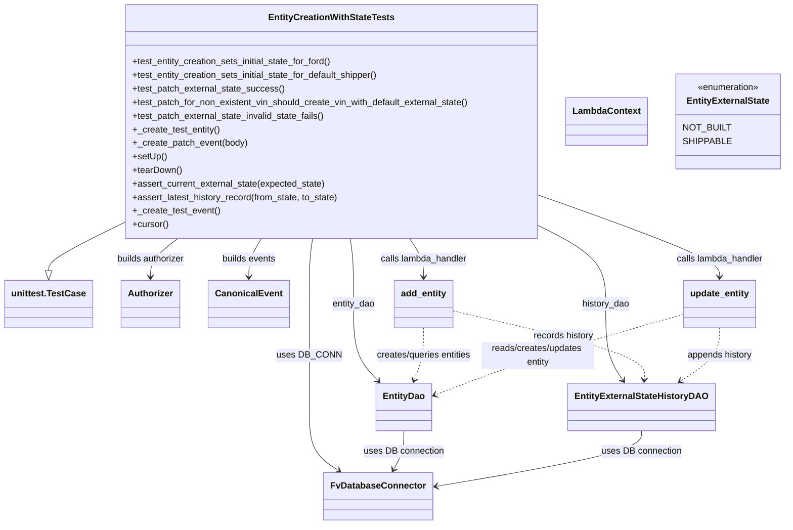
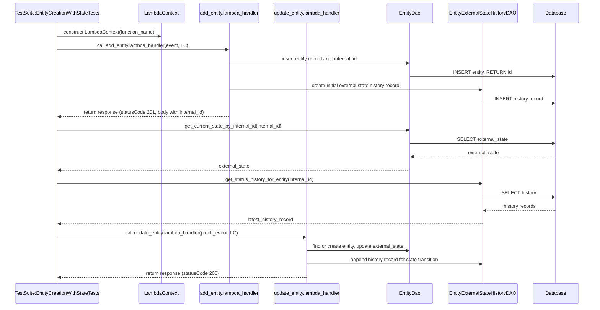

# Diagram: entity_core/entity_service/entity_service/entity/entity/external_state/tests/integration/test_add_and_patch_entity_sets_external_state.py

> Auto-generated by Obscura crawlers

## Diagram 1

### SVG

<svg id="container" width="1351.8828125" xmlns="http://www.w3.org/2000/svg" class="classDiagram" height="928" viewBox="0 0 1351.8828125 928" role="graphics-document document" aria-roledescription="class"><g><defs><marker id="container_class-aggregationStart" class="marker aggregation class" refX="18" refY="7" markerWidth="190" markerHeight="240" orient="auto"><path d="M 18,7 L9,13 L1,7 L9,1 Z"></path></marker></defs><defs><marker id="container_class-aggregationEnd" class="marker aggregation class" refX="1" refY="7" markerWidth="20" markerHeight="28" orient="auto"><path d="M 18,7 L9,13 L1,7 L9,1 Z"></path></marker></defs><defs><marker id="container_class-extensionStart" class="marker extension class" refX="18" refY="7" markerWidth="190" markerHeight="240" orient="auto"><path d="M 1,7 L18,13 V 1 Z"></path></marker></defs><defs><marker id="container_class-extensionEnd" class="marker extension class" refX="1" refY="7" markerWidth="20" markerHeight="28" orient="auto"><path d="M 1,1 V 13 L18,7 Z"></path></marker></defs><defs><marker id="container_class-compositionStart" class="marker composition class" refX="18" refY="7" markerWidth="190" markerHeight="240" orient="auto"><path d="M 18,7 L9,13 L1,7 L9,1 Z"></path></marker></defs><defs><marker id="container_class-compositionEnd" class="marker composition class" refX="1" refY="7" markerWidth="20" markerHeight="28" orient="auto"><path d="M 18,7 L9,13 L1,7 L9,1 Z"></path></marker></defs><defs><marker id="container_class-dependencyStart" class="marker dependency class" refX="6" refY="7" markerWidth="190" markerHeight="240" orient="auto"><path d="M 5,7 L9,13 L1,7 L9,1 Z"></path></marker></defs><defs><marker id="container_class-dependencyEnd" class="marker dependency class" refX="13" refY="7" markerWidth="20" markerHeight="28" orient="auto"><path d="M 18,7 L9,13 L14,7 L9,1 Z"></path></marker></defs><defs><marker id="container_class-lollipopStart" class="marker lollipop class" refX="13" refY="7" markerWidth="190" markerHeight="240" orient="auto"><circle stroke="black" fill="transparent" cx="7" cy="7" r="6"></circle></marker></defs><defs><marker id="container_class-lollipopEnd" class="marker lollipop class" refX="1" refY="7" markerWidth="190" markerHeight="240" orient="auto"><circle stroke="black" fill="transparent" cx="7" cy="7" r="6"></circle></marker></defs><g class="root"><g class="clusters"></g><g class="edgePaths"><path d="M197.117,401.135L178.049,410.779C158.982,420.423,120.846,439.712,101.779,452.647C82.711,465.583,82.711,472.167,82.711,475.458L82.711,478.75" id="id_EntityCreationWithStateTests_unittest.TestCase_1" class="edge-thickness-normal edge-pattern-solid relation" style=";;;" data-edge="true" data-et="edge" data-id="id_EntityCreationWithStateTests_unittest.TestCase_1" data-points="W3sieCI6MTk3LjExNzE4NzUsInkiOjQwMS4xMzQ1MTIyOTk3OTQzfSx7IngiOjgyLjcxMDkzNzUsInkiOjQ1OX0seyJ4Ijo4Mi43MTA5Mzc1LCJ5Ijo0OTZ9XQ==" marker-end="url(#container_class-extensionEnd)"></path><path d="M534.12,422L533.196,428.167C532.273,434.333,530.425,446.667,529.502,466C528.578,485.333,528.578,511.667,528.578,540C528.578,568.333,528.578,598.667,528.578,629C528.578,659.333,528.578,689.667,528.578,718C528.578,746.333,528.578,772.667,536.124,791.406C543.669,810.145,558.76,821.29,566.306,826.863L573.851,832.436" id="id_EntityCreationWithStateTests_FvDatabaseConnector_2" class="edge-thickness-normal edge-pattern-solid relation" style=";;;" data-edge="true" data-et="edge" data-id="id_EntityCreationWithStateTests_FvDatabaseConnector_2" data-points="W3sieCI6NTM0LjEyMDA2OTE1OTgzNiwieSI6NDIyfSx7IngiOjUyOC41NzgxMjUsInkiOjQ1OX0seyJ4Ijo1MjguNTc4MTI1LCJ5Ijo1Mzh9LHsieCI6NTI4LjU3ODEyNSwieSI6NjI5fSx7IngiOjUyOC41NzgxMjUsInkiOjcyMH0seyJ4Ijo1MjguNTc4MTI1LCJ5Ijo3OTl9LHsieCI6NTc4LjY3NzQxMjk3NDY4MzUsInkiOjgzNn1d" marker-end="url(#container_class-dependencyEnd)"></path><path d="M596.13,422L597.054,428.167C597.977,434.333,599.825,446.667,600.748,466C601.672,485.333,601.672,511.667,601.672,540C601.672,568.333,601.672,598.667,608.144,621.247C614.617,643.827,627.561,658.653,634.034,666.067L640.506,673.48" id="id_EntityCreationWithStateTests_EntityDao_3" class="edge-thickness-normal edge-pattern-solid relation" style=";;;" data-edge="true" data-et="edge" data-id="id_EntityCreationWithStateTests_EntityDao_3" data-points="W3sieCI6NTk2LjEyOTkzMDg0MDE2NCwieSI6NDIyfSx7IngiOjYwMS42NzE4NzUsInkiOjQ1OX0seyJ4Ijo2MDEuNjcxODc1LCJ5Ijo1Mzh9LHsieCI6NjAxLjY3MTg3NSwieSI6NjI5fSx7IngiOjY0NC40NTIyMjM1NTc2OTIzLCJ5Ijo2Nzh9XQ==" marker-end="url(#container_class-dependencyEnd)"></path><path d="M933.133,398.863L953.194,408.886C973.255,418.908,1013.378,438.954,1033.439,462.144C1053.5,485.333,1053.5,511.667,1053.5,540C1053.5,568.333,1053.5,598.667,1057.835,621.14C1062.17,643.613,1070.839,658.227,1075.174,665.533L1079.509,672.84" id="id_EntityCreationWithStateTests_EntityExternalStateHistoryDAO_4" class="edge-thickness-normal edge-pattern-solid relation" style=";;;" data-edge="true" data-et="edge" data-id="id_EntityCreationWithStateTests_EntityExternalStateHistoryDAO_4" data-points="W3sieCI6OTMzLjEzMjgxMjUsInkiOjM5OC44NjI2MTgzNzcyNzE2fSx7IngiOjEwNTMuNSwieSI6NDU5fSx7IngiOjEwNTMuNSwieSI6NTM4fSx7IngiOjEwNTMuNSwieSI6NjI5fSx7IngiOjEwODIuNTcwNjEyOTgwNzY5MywieSI6Njc4fV0=" marker-end="url(#container_class-dependencyEnd)"></path><path d="M304.393,422L296.626,428.167C288.859,434.333,273.324,446.667,265.556,458C257.789,469.333,257.789,479.667,257.789,484.833L257.789,490" id="id_EntityCreationWithStateTests_Authorizer_5" class="edge-thickness-normal edge-pattern-solid relation" style=";;;" data-edge="true" data-et="edge" data-id="id_EntityCreationWithStateTests_Authorizer_5" data-points="W3sieCI6MzA0LjM5MzI4MjUzMDczNzcsInkiOjQyMn0seyJ4IjoyNTcuNzg5MDYyNSwieSI6NDU5fSx7IngiOjI1Ny43ODkwNjI1LCJ5Ijo0OTZ9XQ==" marker-end="url(#container_class-dependencyEnd)"></path><path d="M446.984,422L443.465,428.167C439.945,434.333,432.906,446.667,429.387,458C425.867,469.333,425.867,479.667,425.867,484.833L425.867,490" id="id_EntityCreationWithStateTests_CanonicalEvent_6" class="edge-thickness-normal edge-pattern-solid relation" style=";;;" data-edge="true" data-et="edge" data-id="id_EntityCreationWithStateTests_CanonicalEvent_6" data-points="W3sieCI6NDQ2Ljk4NDE1MDg3MDkwMTY2LCJ5Ijo0MjJ9LHsieCI6NDI1Ljg2NzE4NzUsInkiOjQ1OX0seyJ4Ijo0MjUuODY3MTg3NSwieSI6NDk2fV0=" marker-end="url(#container_class-dependencyEnd)"></path><path d="M702.261,422L706.347,428.167C710.432,434.333,718.603,446.667,722.688,458C726.773,469.333,726.773,479.667,726.773,484.833L726.773,490" id="id_EntityCreationWithStateTests_add_entity_7" class="edge-thickness-normal edge-pattern-solid relation" style=";;;" data-edge="true" data-et="edge" data-id="id_EntityCreationWithStateTests_add_entity_7" data-points="W3sieCI6NzAyLjI2MTE3NDQzNjQ3NTQsInkiOjQyMn0seyJ4Ijo3MjYuNzczNDM3NSwieSI6NDU5fSx7IngiOjcyNi43NzM0Mzc1LCJ5Ijo0OTZ9XQ==" marker-end="url(#container_class-dependencyEnd)"></path><path d="M933.133,344.12L987.703,363.267C1042.273,382.413,1151.414,420.707,1205.984,445.02C1260.555,469.333,1260.555,479.667,1260.555,484.833L1260.555,490" id="id_EntityCreationWithStateTests_update_entity_8" class="edge-thickness-normal edge-pattern-solid relation" style=";;;" data-edge="true" data-et="edge" data-id="id_EntityCreationWithStateTests_update_entity_8" data-points="W3sieCI6OTMzLjEzMjgxMjUsInkiOjM0NC4xMjAwMzU5NDg5OTc0fSx7IngiOjEyNjAuNTU0Njg3NSwieSI6NDU5fSx7IngiOjEyNjAuNTU0Njg3NSwieSI6NDk2fV0=" marker-end="url(#container_class-dependencyEnd)"></path><path d="M726.773,580L726.773,588.167C726.773,596.333,726.773,612.667,723.125,628.106C719.476,643.546,712.179,658.091,708.53,665.364L704.882,672.637" id="id_add_entity_EntityDao_9" class="edge-thickness-normal edge-pattern-dashed relation" style=";;;" data-edge="true" data-et="edge" data-id="id_add_entity_EntityDao_9" data-points="W3sieCI6NzI2Ljc3MzQzNzUsInkiOjU4MH0seyJ4Ijo3MjYuNzczNDM3NSwieSI6NjI5fSx7IngiOjcwMi4xOTE0MDYyNSwieSI6Njc4fV0=" marker-end="url(#container_class-dependencyEnd)"></path><path d="M778.328,549.702L836.553,562.918C894.779,576.135,1011.229,602.567,1067.859,622.974C1124.489,643.381,1121.298,657.762,1119.703,664.952L1118.107,672.142" id="id_add_entity_EntityExternalStateHistoryDAO_10" class="edge-thickness-normal edge-pattern-dashed relation" style=";;;" data-edge="true" data-et="edge" data-id="id_add_entity_EntityExternalStateHistoryDAO_10" data-points="W3sieCI6Nzc4LjMyODEyNSwieSI6NTQ5LjcwMjE3ODY1NzcyODZ9LHsieCI6MTEyNy42Nzk2ODc1LCJ5Ijo2Mjl9LHsieCI6MTExNi44MDczOTE4MjY5MjMsInkiOjY3OH1d" marker-end="url(#container_class-dependencyEnd)"></path><path d="M1197.25,555.614L1153.292,567.845C1109.333,580.076,1021.417,604.538,944.247,628.744C867.078,652.95,800.656,676.899,767.445,688.874L734.234,700.849" id="id_update_entity_EntityDao_11" class="edge-thickness-normal edge-pattern-dashed relation" style=";;;" data-edge="true" data-et="edge" data-id="id_update_entity_EntityDao_11" data-points="W3sieCI6MTE5Ny4yNSwieSI6NTU1LjYxMzk1NTA0MzgzMzV9LHsieCI6OTMzLjUsInkiOjYyOX0seyJ4Ijo3MjguNTg5ODQzNzUsInkiOjcwMi44ODQyNDIxMzM0NDg5fV0=" marker-end="url(#container_class-dependencyEnd)"></path><path d="M1260.555,580L1260.555,588.167C1260.555,596.333,1260.555,612.667,1247.678,628.489C1234.8,644.311,1209.046,659.623,1196.169,667.278L1183.292,674.934" id="id_update_entity_EntityExternalStateHistoryDAO_12" class="edge-thickness-normal edge-pattern-dashed relation" style=";;;" data-edge="true" data-et="edge" data-id="id_update_entity_EntityExternalStateHistoryDAO_12" data-points="W3sieCI6MTI2MC41NTQ2ODc1LCJ5Ijo1ODB9LHsieCI6MTI2MC41NTQ2ODc1LCJ5Ijo2Mjl9LHsieCI6MTE3OC4xMzQzMTQ5MDM4NDYyLCJ5Ijo2Nzh9XQ==" marker-end="url(#container_class-dependencyEnd)"></path><path d="M681.121,762L681.121,768.167C681.121,774.333,681.121,786.667,678.063,798.134C675.006,809.601,668.89,820.202,665.832,825.502L662.774,830.803" id="id_EntityDao_FvDatabaseConnector_13" class="edge-thickness-normal edge-pattern-solid relation" style=";;;" data-edge="true" data-et="edge" data-id="id_EntityDao_FvDatabaseConnector_13" data-points="W3sieCI6NjgxLjEyMTA5Mzc1LCJ5Ijo3NjJ9LHsieCI6NjgxLjEyMTA5Mzc1LCJ5Ijo3OTl9LHsieCI6NjU5Ljc3NjIwNjQ4NzM0MTgsInkiOjgzNn1d" marker-end="url(#container_class-dependencyEnd)"></path><path d="M1107.488,762L1107.488,768.167C1107.488,774.333,1107.488,786.667,1045.035,803.288C982.582,819.909,857.676,840.817,795.222,851.271L732.769,861.726" id="id_EntityExternalStateHistoryDAO_FvDatabaseConnector_14" class="edge-thickness-normal edge-pattern-solid relation" style=";;;" data-edge="true" data-et="edge" data-id="id_EntityExternalStateHistoryDAO_FvDatabaseConnector_14" data-points="W3sieCI6MTEwNy40ODgyODEyNSwieSI6NzYyfSx7IngiOjExMDcuNDg4MjgxMjUsInkiOjc5OX0seyJ4Ijo3MjYuODUxNTYyNSwieSI6ODYyLjcxNjE3NDA0ODM1NDF9XQ==" marker-end="url(#container_class-dependencyEnd)"></path></g><g class="edgeLabels"><g class="edgeLabel"><g class="label" data-id="id_EntityCreationWithStateTests_unittest.TestCase_1" transform="translate(0, 0)"><foreignObject width="0" height="0">

</foreignObject></g></g><g class="edgeLabel" transform="translate(528.578125, 629)"><g class="label" data-id="id_EntityCreationWithStateTests_FvDatabaseConnector_2" transform="translate(-53.09375, -12)"><foreignObject width="106.1875" height="24">

uses DB_CONN

</foreignObject></g></g><g class="edgeLabel" transform="translate(601.671875, 538)"><g class="label" data-id="id_EntityCreationWithStateTests_EntityDao_3" transform="translate(-38.546875, -12)"><foreignObject width="77.09375" height="24">

entity_dao

</foreignObject></g></g><g class="edgeLabel" transform="translate(1053.5, 538)"><g class="label" data-id="id_EntityCreationWithStateTests_EntityExternalStateHistoryDAO_4" transform="translate(-42.71875, -12)"><foreignObject width="85.4375" height="24">

history_dao

</foreignObject></g></g><g class="edgeLabel" transform="translate(257.7890625, 459)"><g class="label" data-id="id_EntityCreationWithStateTests_Authorizer_5" transform="translate(-62.1015625, -12)"><foreignObject width="124.203125" height="24">

builds authorizer

</foreignObject></g></g><g class="edgeLabel" transform="translate(425.8671875, 459)"><g class="label" data-id="id_EntityCreationWithStateTests_CanonicalEvent_6" transform="translate(-48.515625, -12)"><foreignObject width="97.03125" height="24">

builds events

</foreignObject></g></g><g class="edgeLabel" transform="translate(726.7734375, 459)"><g class="label" data-id="id_EntityCreationWithStateTests_add_entity_7" transform="translate(-78.390625, -12)"><foreignObject width="156.78125" height="24">

calls lambda_handler

</foreignObject></g></g><g class="edgeLabel" transform="translate(1260.5546875, 459)"><g class="label" data-id="id_EntityCreationWithStateTests_update_entity_8" transform="translate(-78.390625, -12)"><foreignObject width="156.78125" height="24">

calls lambda_handler

</foreignObject></g></g><g class="edgeLabel" transform="translate(726.7734375, 629)"><g class="label" data-id="id_add_entity_EntityDao_9" transform="translate(-86.7265625, -12)"><foreignObject width="173.453125" height="24">

creates/queries entities

</foreignObject></g></g><g class="edgeLabel" transform="translate(977.47721, 594.90618)"><g class="label" data-id="id_add_entity_EntityExternalStateHistoryDAO_10" transform="translate(-54.1796875, -12)"><foreignObject width="108.359375" height="24">

records history

</foreignObject></g></g><g class="edgeLabel" transform="translate(933.5, 629)"><g class="label" data-id="id_update_entity_EntityDao_11" transform="translate(-100, -24)"><foreignObject width="200" height="48">

reads/creates/updates entity

</foreignObject></g></g><g class="edgeLabel" transform="translate(1260.5546875, 629)"><g class="label" data-id="id_update_entity_EntityExternalStateHistoryDAO_12" transform="translate(-58.6953125, -12)"><foreignObject width="117.390625" height="24">

appends history

</foreignObject></g></g><g class="edgeLabel" transform="translate(681.12109375, 799)"><g class="label" data-id="id_EntityDao_FvDatabaseConnector_13" transform="translate(-71.1484375, -12)"><foreignObject width="142.296875" height="24">

uses DB connection

</foreignObject></g></g><g class="edgeLabel" transform="translate(1107.48828125, 799)"><g class="label" data-id="id_EntityExternalStateHistoryDAO_FvDatabaseConnector_14" transform="translate(-71.1484375, -12)"><foreignObject width="142.296875" height="24">

uses DB connection

</foreignObject></g></g></g><g class="nodes"><g class="node default" id="classId-EntityCreationWithStateTests-0" transform="translate(565.125, 215)"><g class="basic label-container"><path d="M-368.0078125 -207 L368.0078125 -207 L368.0078125 207 L-368.0078125 207" stroke="none" stroke-width="0" fill="#ECECFF" style=""></path><path d="M-368.0078125 -207 C-93.89353894495201 -207, 180.22073461009597 -207, 368.0078125 -207 M-368.0078125 -207 C-144.6309372257682 -207, 78.74593804846359 -207, 368.0078125 -207 M368.0078125 -207 C368.0078125 -43.16522237054363, 368.0078125 120.66955525891274, 368.0078125 207 M368.0078125 -207 C368.0078125 -99.92241372443762, 368.0078125 7.155172551124764, 368.0078125 207 M368.0078125 207 C119.59199452749598 207, -128.82382344500803 207, -368.0078125 207 M368.0078125 207 C199.76295713483276 207, 31.51810176966552 207, -368.0078125 207 M-368.0078125 207 C-368.0078125 89.3715827961752, -368.0078125 -28.256834407649592, -368.0078125 -207 M-368.0078125 207 C-368.0078125 96.13336329773738, -368.0078125 -14.73327340452525, -368.0078125 -207" stroke="#9370DB" stroke-width="1.3" fill="none" stroke-dasharray="0 0" style=""></path></g><g class="annotation-group text" transform="translate(0, -183)"></g><g class="label-group text" transform="translate(-107.265625, -183)"><g class="label" style="font-weight: bolder" transform="translate(0,-12)"><foreignObject width="214.53125" height="24">

EntityCreationWithStateTests

</foreignObject></g></g><g class="members-group text" transform="translate(-356.0078125, -135)"></g><g class="methods-group text" transform="translate(-356.0078125, -105)"><g class="label" style="" transform="translate(0,-12)"><foreignObject width="359.890625" height="24">

+test_entity_creation_sets_initial_state_for_ford()

</foreignObject></g><g class="label" style="" transform="translate(0,12)"><foreignObject width="445.453125" height="24">

+test_entity_creation_sets_initial_state_for_default_shipper()

</foreignObject></g><g class="label" style="" transform="translate(0,36)"><foreignObject width="269.453125" height="24">

+test_patch_external_state_success()

</foreignObject></g><g class="label" style="" transform="translate(0,60)"><foreignObject width="604.75" height="24">

+test_patch_for_non_existent_vin_should_create_vin_with_default_external_state()

</foreignObject></g><g class="label" style="" transform="translate(0,84)"><foreignObject width="345.6875" height="24">

+test_patch_external_state_invalid_state_fails()

</foreignObject></g><g class="label" style="" transform="translate(0,108)"><foreignObject width="155.078125" height="24">

+_create_test_entity()

</foreignObject></g><g class="label" style="" transform="translate(0,132)"><foreignObject width="203.171875" height="24">

+_create_patch_event(body)

</foreignObject></g><g class="label" style="" transform="translate(0,156)"><foreignObject width="60.421875" height="24">

+setUp()

</foreignObject></g><g class="label" style="" transform="translate(0,180)"><foreignObject width="87.75" height="24">

+tearDown()

</foreignObject></g><g class="label" style="" transform="translate(0,204)"><foreignObject width="344.90625" height="24">

+assert_current_external_state(expected_state)

</foreignObject></g><g class="label" style="" transform="translate(0,228)"><foreignObject width="369.328125" height="24">

+assert_latest_history_record(from_state, to_state)

</foreignObject></g><g class="label" style="" transform="translate(0,252)"><foreignObject width="153.46875" height="24">

+_create_test_event()

</foreignObject></g><g class="label" style="" transform="translate(0,276)"><foreignObject width="64.09375" height="24">

+cursor()

</foreignObject></g></g><g class="divider" style=""><path d="M-368.0078125 -159 C-125.65116666408258 -159, 116.70547917183484 -159, 368.0078125 -159 M-368.0078125 -159 C-196.21403576438448 -159, -24.420259028768953 -159, 368.0078125 -159" stroke="#9370DB" stroke-width="1.3" fill="none" stroke-dasharray="0 0" style=""></path></g><g class="divider" style=""><path d="M-368.0078125 -135 C-194.65173863271355 -135, -21.29566476542709 -135, 368.0078125 -135 M-368.0078125 -135 C-198.0314295105109 -135, -28.05504652102178 -135, 368.0078125 -135" stroke="#9370DB" stroke-width="1.3" fill="none" stroke-dasharray="0 0" style=""></path></g></g><g class="node default" id="classId-unittest.TestCase-1" transform="translate(82.7109375, 538)"><g class="basic label-container"><path d="M-74.7109375 -42 L74.7109375 -42 L74.7109375 42 L-74.7109375 42" stroke="none" stroke-width="0" fill="#ECECFF" style=""></path><path d="M-74.7109375 -42 C-20.975428989202612 -42, 32.760079521594776 -42, 74.7109375 -42 M-74.7109375 -42 C-28.192698214407258 -42, 18.325541071185484 -42, 74.7109375 -42 M74.7109375 -42 C74.7109375 -14.295092399139488, 74.7109375 13.409815201721024, 74.7109375 42 M74.7109375 -42 C74.7109375 -8.46357394723146, 74.7109375 25.07285210553708, 74.7109375 42 M74.7109375 42 C26.234330816360135 42, -22.24227586727973 42, -74.7109375 42 M74.7109375 42 C17.29463012369537 42, -40.12167725260926 42, -74.7109375 42 M-74.7109375 42 C-74.7109375 8.84574480327354, -74.7109375 -24.30851039345292, -74.7109375 -42 M-74.7109375 42 C-74.7109375 20.326122283789218, -74.7109375 -1.3477554324215646, -74.7109375 -42" stroke="#9370DB" stroke-width="1.3" fill="none" stroke-dasharray="0 0" style=""></path></g><g class="annotation-group text" transform="translate(0, -18)"></g><g class="label-group text" transform="translate(-62.7109375, -18)"><g class="label" style="font-weight: bolder" transform="translate(0,-12)"><foreignObject width="125.421875" height="24">

unittest.TestCase

</foreignObject></g></g><g class="members-group text" transform="translate(-62.7109375, 30)"></g><g class="methods-group text" transform="translate(-62.7109375, 60)"></g><g class="divider" style=""><path d="M-74.7109375 6 C-18.15904181778798 6, 38.39285386442404 6, 74.7109375 6 M-74.7109375 6 C-36.84866511937584 6, 1.0136072612483247 6, 74.7109375 6" stroke="#9370DB" stroke-width="1.3" fill="none" stroke-dasharray="0 0" style=""></path></g><g class="divider" style=""><path d="M-74.7109375 24 C-20.941477332491374 24, 32.82798283501725 24, 74.7109375 24 M-74.7109375 24 C-32.76499413448703 24, 9.180949231025934 24, 74.7109375 24" stroke="#9370DB" stroke-width="1.3" fill="none" stroke-dasharray="0 0" style=""></path></g></g><g class="node default" id="classId-FvDatabaseConnector-2" transform="translate(635.546875, 878)"><g class="basic label-container"><path d="M-91.3046875 -42 L91.3046875 -42 L91.3046875 42 L-91.3046875 42" stroke="none" stroke-width="0" fill="#ECECFF" style=""></path><path d="M-91.3046875 -42 C-50.274111742987024 -42, -9.243535985974049 -42, 91.3046875 -42 M-91.3046875 -42 C-25.951851701192496 -42, 39.40098409761501 -42, 91.3046875 -42 M91.3046875 -42 C91.3046875 -20.879956548175734, 91.3046875 0.2400869036485318, 91.3046875 42 M91.3046875 -42 C91.3046875 -22.692856010975664, 91.3046875 -3.3857120219513277, 91.3046875 42 M91.3046875 42 C27.7400765367341 42, -35.8245344265318 42, -91.3046875 42 M91.3046875 42 C33.66817512536439 42, -23.968337249271215 42, -91.3046875 42 M-91.3046875 42 C-91.3046875 20.624886493937105, -91.3046875 -0.7502270121257908, -91.3046875 -42 M-91.3046875 42 C-91.3046875 13.576738310598099, -91.3046875 -14.846523378803802, -91.3046875 -42" stroke="#9370DB" stroke-width="1.3" fill="none" stroke-dasharray="0 0" style=""></path></g><g class="annotation-group text" transform="translate(0, -18)"></g><g class="label-group text" transform="translate(-79.3046875, -18)"><g class="label" style="font-weight: bolder" transform="translate(0,-12)"><foreignObject width="158.609375" height="24">

FvDatabaseConnector

</foreignObject></g></g><g class="members-group text" transform="translate(-79.3046875, 30)"></g><g class="methods-group text" transform="translate(-79.3046875, 60)"></g><g class="divider" style=""><path d="M-91.3046875 6 C-30.399256204836334 6, 30.506175090327332 6, 91.3046875 6 M-91.3046875 6 C-53.456568987605 6, -15.608450475210006 6, 91.3046875 6" stroke="#9370DB" stroke-width="1.3" fill="none" stroke-dasharray="0 0" style=""></path></g><g class="divider" style=""><path d="M-91.3046875 24 C-38.86065682074824 24, 13.58337385850352 24, 91.3046875 24 M-91.3046875 24 C-27.468325630506556 24, 36.36803623898689 24, 91.3046875 24" stroke="#9370DB" stroke-width="1.3" fill="none" stroke-dasharray="0 0" style=""></path></g></g><g class="node default" id="classId-EntityDao-3" transform="translate(681.12109375, 720)"><g class="basic label-container"><path d="M-47.46875 -42 L47.46875 -42 L47.46875 42 L-47.46875 42" stroke="none" stroke-width="0" fill="#ECECFF" style=""></path><path d="M-47.46875 -42 C-19.690239457048808 -42, 8.088271085902385 -42, 47.46875 -42 M-47.46875 -42 C-20.828207092605723 -42, 5.812335814788554 -42, 47.46875 -42 M47.46875 -42 C47.46875 -19.086534845863973, 47.46875 3.826930308272054, 47.46875 42 M47.46875 -42 C47.46875 -14.386674462372756, 47.46875 13.226651075254487, 47.46875 42 M47.46875 42 C17.41781132376438 42, -12.633127352471242 42, -47.46875 42 M47.46875 42 C26.307927686526448 42, 5.147105373052895 42, -47.46875 42 M-47.46875 42 C-47.46875 20.314873255262942, -47.46875 -1.3702534894741163, -47.46875 -42 M-47.46875 42 C-47.46875 17.74378480546519, -47.46875 -6.512430389069621, -47.46875 -42" stroke="#9370DB" stroke-width="1.3" fill="none" stroke-dasharray="0 0" style=""></path></g><g class="annotation-group text" transform="translate(0, -18)"></g><g class="label-group text" transform="translate(-35.46875, -18)"><g class="label" style="font-weight: bolder" transform="translate(0,-12)"><foreignObject width="70.9375" height="24">

EntityDao

</foreignObject></g></g><g class="members-group text" transform="translate(-35.46875, 30)"></g><g class="methods-group text" transform="translate(-35.46875, 60)"></g><g class="divider" style=""><path d="M-47.46875 6 C-12.797608596377557 6, 21.873532807244885 6, 47.46875 6 M-47.46875 6 C-20.0842986071515 6, 7.300152785697001 6, 47.46875 6" stroke="#9370DB" stroke-width="1.3" fill="none" stroke-dasharray="0 0" style=""></path></g><g class="divider" style=""><path d="M-47.46875 24 C-10.54456242882366 24, 26.37962514235268 24, 47.46875 24 M-47.46875 24 C-14.301258161122547 24, 18.866233677754906 24, 47.46875 24" stroke="#9370DB" stroke-width="1.3" fill="none" stroke-dasharray="0 0" style=""></path></g></g><g class="node default" id="classId-EntityExternalStateHistoryDAO-4" transform="translate(1107.48828125, 720)"><g class="basic label-container"><path d="M-124.4765625 -42 L124.4765625 -42 L124.4765625 42 L-124.4765625 42" stroke="none" stroke-width="0" fill="#ECECFF" style=""></path><path d="M-124.4765625 -42 C-63.00869295776272 -42, -1.5408234155254377 -42, 124.4765625 -42 M-124.4765625 -42 C-33.43846956180329 -42, 57.599623376393424 -42, 124.4765625 -42 M124.4765625 -42 C124.4765625 -14.930370670485821, 124.4765625 12.139258659028357, 124.4765625 42 M124.4765625 -42 C124.4765625 -10.208122064051285, 124.4765625 21.58375587189743, 124.4765625 42 M124.4765625 42 C53.59476862251353 42, -17.287025254972946 42, -124.4765625 42 M124.4765625 42 C35.851357977377475 42, -52.77384654524505 42, -124.4765625 42 M-124.4765625 42 C-124.4765625 11.244917203306805, -124.4765625 -19.51016559338639, -124.4765625 -42 M-124.4765625 42 C-124.4765625 9.122084669860023, -124.4765625 -23.755830660279955, -124.4765625 -42" stroke="#9370DB" stroke-width="1.3" fill="none" stroke-dasharray="0 0" style=""></path></g><g class="annotation-group text" transform="translate(0, -18)"></g><g class="label-group text" transform="translate(-112.4765625, -18)"><g class="label" style="font-weight: bolder" transform="translate(0,-12)"><foreignObject width="224.953125" height="24">

EntityExternalStateHistoryDAO

</foreignObject></g></g><g class="members-group text" transform="translate(-112.4765625, 30)"></g><g class="methods-group text" transform="translate(-112.4765625, 60)"></g><g class="divider" style=""><path d="M-124.4765625 6 C-52.303211623827636 6, 19.870139252344728 6, 124.4765625 6 M-124.4765625 6 C-53.7728682303655 6, 16.930826039268993 6, 124.4765625 6" stroke="#9370DB" stroke-width="1.3" fill="none" stroke-dasharray="0 0" style=""></path></g><g class="divider" style=""><path d="M-124.4765625 24 C-58.4420214586723 24, 7.592519582655399 24, 124.4765625 24 M-124.4765625 24 C-35.92240903478253 24, 52.631744430434935 24, 124.4765625 24" stroke="#9370DB" stroke-width="1.3" fill="none" stroke-dasharray="0 0" style=""></path></g></g><g class="node default" id="classId-Authorizer-5" transform="translate(257.7890625, 538)"><g class="basic label-container"><path d="M-50.3671875 -42 L50.3671875 -42 L50.3671875 42 L-50.3671875 42" stroke="none" stroke-width="0" fill="#ECECFF" style=""></path><path d="M-50.3671875 -42 C-19.004850826972195 -42, 12.35748584605561 -42, 50.3671875 -42 M-50.3671875 -42 C-10.222942424384733 -42, 29.921302651230533 -42, 50.3671875 -42 M50.3671875 -42 C50.3671875 -21.91587406306866, 50.3671875 -1.8317481261373203, 50.3671875 42 M50.3671875 -42 C50.3671875 -19.094291857629067, 50.3671875 3.811416284741867, 50.3671875 42 M50.3671875 42 C23.960291493566356 42, -2.446604512867289 42, -50.3671875 42 M50.3671875 42 C22.33884472855635 42, -5.689498042887301 42, -50.3671875 42 M-50.3671875 42 C-50.3671875 19.180471942825292, -50.3671875 -3.6390561143494153, -50.3671875 -42 M-50.3671875 42 C-50.3671875 21.44728017502777, -50.3671875 0.8945603500555421, -50.3671875 -42" stroke="#9370DB" stroke-width="1.3" fill="none" stroke-dasharray="0 0" style=""></path></g><g class="annotation-group text" transform="translate(0, -18)"></g><g class="label-group text" transform="translate(-38.3671875, -18)"><g class="label" style="font-weight: bolder" transform="translate(0,-12)"><foreignObject width="76.734375" height="24">

Authorizer

</foreignObject></g></g><g class="members-group text" transform="translate(-38.3671875, 30)"></g><g class="methods-group text" transform="translate(-38.3671875, 60)"></g><g class="divider" style=""><path d="M-50.3671875 6 C-23.26431315794429 6, 3.8385611841114198 6, 50.3671875 6 M-50.3671875 6 C-22.29836513303367 6, 5.77045723393266 6, 50.3671875 6" stroke="#9370DB" stroke-width="1.3" fill="none" stroke-dasharray="0 0" style=""></path></g><g class="divider" style=""><path d="M-50.3671875 24 C-26.40332370810782 24, -2.4394599162156396 24, 50.3671875 24 M-50.3671875 24 C-17.93956305567012 24, 14.488061388659759 24, 50.3671875 24" stroke="#9370DB" stroke-width="1.3" fill="none" stroke-dasharray="0 0" style=""></path></g></g><g class="node default" id="classId-CanonicalEvent-6" transform="translate(425.8671875, 538)"><g class="basic label-container"><path d="M-67.7109375 -42 L67.7109375 -42 L67.7109375 42 L-67.7109375 42" stroke="none" stroke-width="0" fill="#ECECFF" style=""></path><path d="M-67.7109375 -42 C-24.05811929636041 -42, 19.59469890727918 -42, 67.7109375 -42 M-67.7109375 -42 C-24.194155223809936 -42, 19.322627052380128 -42, 67.7109375 -42 M67.7109375 -42 C67.7109375 -17.13311005234646, 67.7109375 7.73377989530708, 67.7109375 42 M67.7109375 -42 C67.7109375 -22.193351590958887, 67.7109375 -2.386703181917774, 67.7109375 42 M67.7109375 42 C35.8249724298842 42, 3.9390073597684037 42, -67.7109375 42 M67.7109375 42 C14.426880523012528 42, -38.857176453974944 42, -67.7109375 42 M-67.7109375 42 C-67.7109375 22.78712395646784, -67.7109375 3.5742479129356823, -67.7109375 -42 M-67.7109375 42 C-67.7109375 11.544073809089664, -67.7109375 -18.911852381820673, -67.7109375 -42" stroke="#9370DB" stroke-width="1.3" fill="none" stroke-dasharray="0 0" style=""></path></g><g class="annotation-group text" transform="translate(0, -18)"></g><g class="label-group text" transform="translate(-55.7109375, -18)"><g class="label" style="font-weight: bolder" transform="translate(0,-12)"><foreignObject width="111.421875" height="24">

CanonicalEvent

</foreignObject></g></g><g class="members-group text" transform="translate(-55.7109375, 30)"></g><g class="methods-group text" transform="translate(-55.7109375, 60)"></g><g class="divider" style=""><path d="M-67.7109375 6 C-35.58427545083932 6, -3.4576134016786426 6, 67.7109375 6 M-67.7109375 6 C-28.30295548398186 6, 11.105026532036277 6, 67.7109375 6" stroke="#9370DB" stroke-width="1.3" fill="none" stroke-dasharray="0 0" style=""></path></g><g class="divider" style=""><path d="M-67.7109375 24 C-36.625552930570436 24, -5.540168361140871 24, 67.7109375 24 M-67.7109375 24 C-39.961124256600456 24, -12.211311013200913 24, 67.7109375 24" stroke="#9370DB" stroke-width="1.3" fill="none" stroke-dasharray="0 0" style=""></path></g></g><g class="node default" id="classId-LambdaContext-7" transform="translate(1052.4296875, 215)"><g class="basic label-container"><path d="M-69.296875 -42 L69.296875 -42 L69.296875 42 L-69.296875 42" stroke="none" stroke-width="0" fill="#ECECFF" style=""></path><path d="M-69.296875 -42 C-32.430981691613894 -42, 4.434911616772212 -42, 69.296875 -42 M-69.296875 -42 C-20.851353119516595 -42, 27.59416876096681 -42, 69.296875 -42 M69.296875 -42 C69.296875 -16.65952368885129, 69.296875 8.680952622297418, 69.296875 42 M69.296875 -42 C69.296875 -22.69619301443865, 69.296875 -3.392386028877297, 69.296875 42 M69.296875 42 C18.148942300527942 42, -32.998990398944116 42, -69.296875 42 M69.296875 42 C20.17216884954027 42, -28.95253730091946 42, -69.296875 42 M-69.296875 42 C-69.296875 9.626799272105387, -69.296875 -22.746401455789226, -69.296875 -42 M-69.296875 42 C-69.296875 15.938896699042186, -69.296875 -10.122206601915629, -69.296875 -42" stroke="#9370DB" stroke-width="1.3" fill="none" stroke-dasharray="0 0" style=""></path></g><g class="annotation-group text" transform="translate(0, -18)"></g><g class="label-group text" transform="translate(-57.296875, -18)"><g class="label" style="font-weight: bolder" transform="translate(0,-12)"><foreignObject width="114.59375" height="24">

LambdaContext

</foreignObject></g></g><g class="members-group text" transform="translate(-57.296875, 30)"></g><g class="methods-group text" transform="translate(-57.296875, 60)"></g><g class="divider" style=""><path d="M-69.296875 6 C-32.85265448158416 6, 3.5915660368316793 6, 69.296875 6 M-69.296875 6 C-38.229128781147665 6, -7.161382562295337 6, 69.296875 6" stroke="#9370DB" stroke-width="1.3" fill="none" stroke-dasharray="0 0" style=""></path></g><g class="divider" style=""><path d="M-69.296875 24 C-29.515521166309938 24, 10.265832667380124 24, 69.296875 24 M-69.296875 24 C-30.416782947683323 24, 8.463309104633353 24, 69.296875 24" stroke="#9370DB" stroke-width="1.3" fill="none" stroke-dasharray="0 0" style=""></path></g></g><g class="node default" id="classId-add_entity-8" transform="translate(726.7734375, 538)"><g class="basic label-container"><path d="M-51.5546875 -42 L51.5546875 -42 L51.5546875 42 L-51.5546875 42" stroke="none" stroke-width="0" fill="#ECECFF" style=""></path><path d="M-51.5546875 -42 C-26.62778831138917 -42, -1.7008891227783423 -42, 51.5546875 -42 M-51.5546875 -42 C-19.293296664598437 -42, 12.968094170803127 -42, 51.5546875 -42 M51.5546875 -42 C51.5546875 -17.57732418930587, 51.5546875 6.845351621388261, 51.5546875 42 M51.5546875 -42 C51.5546875 -11.982666138834691, 51.5546875 18.034667722330617, 51.5546875 42 M51.5546875 42 C27.76058708522621 42, 3.9664866704524187 42, -51.5546875 42 M51.5546875 42 C11.44304187050502 42, -28.66860375898996 42, -51.5546875 42 M-51.5546875 42 C-51.5546875 16.598040185652454, -51.5546875 -8.803919628695091, -51.5546875 -42 M-51.5546875 42 C-51.5546875 13.607800541906805, -51.5546875 -14.78439891618639, -51.5546875 -42" stroke="#9370DB" stroke-width="1.3" fill="none" stroke-dasharray="0 0" style=""></path></g><g class="annotation-group text" transform="translate(0, -18)"></g><g class="label-group text" transform="translate(-39.5546875, -18)"><g class="label" style="font-weight: bolder" transform="translate(0,-12)"><foreignObject width="79.109375" height="24">

add_entity

</foreignObject></g></g><g class="members-group text" transform="translate(-39.5546875, 30)"></g><g class="methods-group text" transform="translate(-39.5546875, 60)"></g><g class="divider" style=""><path d="M-51.5546875 6 C-14.175416442464211 6, 23.203854615071577 6, 51.5546875 6 M-51.5546875 6 C-13.313878905334008 6, 24.926929689331985 6, 51.5546875 6" stroke="#9370DB" stroke-width="1.3" fill="none" stroke-dasharray="0 0" style=""></path></g><g class="divider" style=""><path d="M-51.5546875 24 C-15.740737662016663 24, 20.073212175966674 24, 51.5546875 24 M-51.5546875 24 C-15.880195223120893 24, 19.794297053758214 24, 51.5546875 24" stroke="#9370DB" stroke-width="1.3" fill="none" stroke-dasharray="0 0" style=""></path></g></g><g class="node default" id="classId-update_entity-9" transform="translate(1260.5546875, 538)"><g class="basic label-container"><path d="M-63.3046875 -42 L63.3046875 -42 L63.3046875 42 L-63.3046875 42" stroke="none" stroke-width="0" fill="#ECECFF" style=""></path><path d="M-63.3046875 -42 C-31.845831168075172 -42, -0.386974836150344 -42, 63.3046875 -42 M-63.3046875 -42 C-32.570007721030045 -42, -1.8353279420600899 -42, 63.3046875 -42 M63.3046875 -42 C63.3046875 -21.7238627357782, 63.3046875 -1.447725471556403, 63.3046875 42 M63.3046875 -42 C63.3046875 -13.280696412200651, 63.3046875 15.438607175598698, 63.3046875 42 M63.3046875 42 C19.747921945981673 42, -23.808843608036653 42, -63.3046875 42 M63.3046875 42 C15.550717013807372 42, -32.203253472385256 42, -63.3046875 42 M-63.3046875 42 C-63.3046875 14.521642596578104, -63.3046875 -12.956714806843792, -63.3046875 -42 M-63.3046875 42 C-63.3046875 14.931881003514476, -63.3046875 -12.136237992971047, -63.3046875 -42" stroke="#9370DB" stroke-width="1.3" fill="none" stroke-dasharray="0 0" style=""></path></g><g class="annotation-group text" transform="translate(0, -18)"></g><g class="label-group text" transform="translate(-51.3046875, -18)"><g class="label" style="font-weight: bolder" transform="translate(0,-12)"><foreignObject width="102.609375" height="24">

update_entity

</foreignObject></g></g><g class="members-group text" transform="translate(-51.3046875, 30)"></g><g class="methods-group text" transform="translate(-51.3046875, 60)"></g><g class="divider" style=""><path d="M-63.3046875 6 C-32.37352228560217 6, -1.4423570712043414 6, 63.3046875 6 M-63.3046875 6 C-15.297656976038269 6, 32.70937354792346 6, 63.3046875 6" stroke="#9370DB" stroke-width="1.3" fill="none" stroke-dasharray="0 0" style=""></path></g><g class="divider" style=""><path d="M-63.3046875 24 C-36.0121448602433 24, -8.719602220486607 24, 63.3046875 24 M-63.3046875 24 C-17.53524649803507 24, 28.234194503929857 24, 63.3046875 24" stroke="#9370DB" stroke-width="1.3" fill="none" stroke-dasharray="0 0" style=""></path></g></g><g class="node default" id="classId-EntityExternalState-10" transform="translate(1257.8046875, 215)"><g class="basic label-container"><path d="M-86.078125 -84 L86.078125 -84 L86.078125 84 L-86.078125 84" stroke="none" stroke-width="0" fill="#ECECFF" style=""></path><path d="M-86.078125 -84 C-33.15507884298891 -84, 19.767967314022187 -84, 86.078125 -84 M-86.078125 -84 C-40.98400433051754 -84, 4.1101163389649145 -84, 86.078125 -84 M86.078125 -84 C86.078125 -44.96512705561141, 86.078125 -5.930254111222823, 86.078125 84 M86.078125 -84 C86.078125 -48.693841572524946, 86.078125 -13.387683145049891, 86.078125 84 M86.078125 84 C18.15860115172036 84, -49.76092269655928 84, -86.078125 84 M86.078125 84 C48.24854742038631 84, 10.418969840772618 84, -86.078125 84 M-86.078125 84 C-86.078125 25.295471272815227, -86.078125 -33.409057454369545, -86.078125 -84 M-86.078125 84 C-86.078125 16.84460366145632, -86.078125 -50.31079267708736, -86.078125 -84" stroke="#9370DB" stroke-width="1.3" fill="none" stroke-dasharray="0 0" style=""></path></g><g class="annotation-group text" transform="translate(-55.5546875, -60)"><g class="label" style="" transform="translate(0,-12)"><foreignObject width="111.109375" height="24">

«enumeration»

</foreignObject></g></g><g class="label-group text" transform="translate(-70.765625, -36)"><g class="label" style="font-weight: bolder" transform="translate(0,-12)"><foreignObject width="141.53125" height="24">

EntityExternalState

</foreignObject></g></g><g class="members-group text" transform="translate(-74.078125, 12)"><g class="label" style="" transform="translate(0,-12)"><foreignObject width="77.1875" height="24">

NOT_BUILT

</foreignObject></g><g class="label" style="" transform="translate(0,12)"><foreignObject width="77.390625" height="24">

SHIPPABLE

</foreignObject></g></g><g class="methods-group text" transform="translate(-74.078125, 84)"></g><g class="divider" style=""><path d="M-86.078125 -12 C-43.98246781731096 -12, -1.8868106346219236 -12, 86.078125 -12 M-86.078125 -12 C-20.463114176042907 -12, 45.151896647914185 -12, 86.078125 -12" stroke="#9370DB" stroke-width="1.3" fill="none" stroke-dasharray="0 0" style=""></path></g><g class="divider" style=""><path d="M-86.078125 60 C-19.92722681294758 60, 46.22367137410484 60, 86.078125 60 M-86.078125 60 C-33.257146424424036 60, 19.563832151151928 60, 86.078125 60" stroke="#9370DB" stroke-width="1.3" fill="none" stroke-dasharray="0 0" style=""></path></g></g></g></g></g></svg>

## Diagram 2

### SVG

<svg id="container" width="2088" xmlns="http://www.w3.org/2000/svg" height="1083" viewBox="-50 -10 2088 1083" role="graphics-document document" aria-roledescription="sequence"><g><rect x="1838" y="997" fill="#eaeaea" stroke="#666" width="150" height="65" name="DB" rx="3" ry="3" class="actor actor-bottom"></rect><text x="1913" y="1029.5" dominant-baseline="central" alignment-baseline="central" class="actor actor-box" style="text-anchor: middle; font-size: 16px; font-weight: 400;"><tspan x="1913" dy="0">Database</tspan></text></g><g><rect x="1548" y="997" fill="#eaeaea" stroke="#666" width="240" height="65" name="History" rx="3" ry="3" class="actor actor-bottom"></rect><text x="1668" y="1029.5" dominant-baseline="central" alignment-baseline="central" class="actor actor-box" style="text-anchor: middle; font-size: 16px; font-weight: 400;"><tspan x="1668" dy="0">EntityExternalStateHistoryDAO</tspan></text></g><g><rect x="1348" y="997" fill="#eaeaea" stroke="#666" width="150" height="65" name="DAO" rx="3" ry="3" class="actor actor-bottom"></rect><text x="1423" y="1029.5" dominant-baseline="central" alignment-baseline="central" class="actor actor-box" style="text-anchor: middle; font-size: 16px; font-weight: 400;"><tspan x="1423" dy="0">EntityDao</tspan></text></g><g><rect x="920.5" y="997" fill="#eaeaea" stroke="#666" width="245" height="65" name="Update" rx="3" ry="3" class="actor actor-bottom"></rect><text x="1043" y="1029.5" dominant-baseline="central" alignment-baseline="central" class="actor actor-box" style="text-anchor: middle; font-size: 16px; font-weight: 400;"><tspan x="1043" dy="0">update_entity.lambda_handler</tspan></text></g><g><rect x="649.5" y="997" fill="#eaeaea" stroke="#666" width="221" height="65" name="Add" rx="3" ry="3" class="actor actor-bottom"></rect><text x="760" y="1029.5" dominant-baseline="central" alignment-baseline="central" class="actor actor-box" style="text-anchor: middle; font-size: 16px; font-weight: 400;"><tspan x="760" dy="0">add_entity.lambda_handler</tspan></text></g><g><rect x="449.5" y="997" fill="#eaeaea" stroke="#666" width="150" height="65" name="LC" rx="3" ry="3" class="actor actor-bottom"></rect><text x="524.5" y="1029.5" dominant-baseline="central" alignment-baseline="central" class="actor actor-box" style="text-anchor: middle; font-size: 16px; font-weight: 400;"><tspan x="524.5" dy="0">LambdaContext</tspan></text></g><g><rect x="0" y="997" fill="#eaeaea" stroke="#666" width="299" height="65" name="Test" rx="3" ry="3" class="actor actor-bottom"></rect><text x="149.5" y="1029.5" dominant-baseline="central" alignment-baseline="central" class="actor actor-box" style="text-anchor: middle; font-size: 16px; font-weight: 400;"><tspan x="149.5" dy="0">TestSuite:EntityCreationWithStateTests</tspan></text></g><g><line id="actor6" x1="1913" y1="65" x2="1913" y2="997" class="actor-line 200" stroke-width="0.5px" stroke="#999" name="DB"></line><g id="root-6"><rect x="1838" y="0" fill="#eaeaea" stroke="#666" width="150" height="65" name="DB" rx="3" ry="3" class="actor actor-top"></rect><text x="1913" y="32.5" dominant-baseline="central" alignment-baseline="central" class="actor actor-box" style="text-anchor: middle; font-size: 16px; font-weight: 400;"><tspan x="1913" dy="0">Database</tspan></text></g></g><g><line id="actor5" x1="1668" y1="65" x2="1668" y2="997" class="actor-line 200" stroke-width="0.5px" stroke="#999" name="History"></line><g id="root-5"><rect x="1548" y="0" fill="#eaeaea" stroke="#666" width="240" height="65" name="History" rx="3" ry="3" class="actor actor-top"></rect><text x="1668" y="32.5" dominant-baseline="central" alignment-baseline="central" class="actor actor-box" style="text-anchor: middle; font-size: 16px; font-weight: 400;"><tspan x="1668" dy="0">EntityExternalStateHistoryDAO</tspan></text></g></g><g><line id="actor4" x1="1423" y1="65" x2="1423" y2="997" class="actor-line 200" stroke-width="0.5px" stroke="#999" name="DAO"></line><g id="root-4"><rect x="1348" y="0" fill="#eaeaea" stroke="#666" width="150" height="65" name="DAO" rx="3" ry="3" class="actor actor-top"></rect><text x="1423" y="32.5" dominant-baseline="central" alignment-baseline="central" class="actor actor-box" style="text-anchor: middle; font-size: 16px; font-weight: 400;"><tspan x="1423" dy="0">EntityDao</tspan></text></g></g><g><line id="actor3" x1="1043" y1="65" x2="1043" y2="997" class="actor-line 200" stroke-width="0.5px" stroke="#999" name="Update"></line><g id="root-3"><rect x="920.5" y="0" fill="#eaeaea" stroke="#666" width="245" height="65" name="Update" rx="3" ry="3" class="actor actor-top"></rect><text x="1043" y="32.5" dominant-baseline="central" alignment-baseline="central" class="actor actor-box" style="text-anchor: middle; font-size: 16px; font-weight: 400;"><tspan x="1043" dy="0">update_entity.lambda_handler</tspan></text></g></g><g><line id="actor2" x1="760" y1="65" x2="760" y2="997" class="actor-line 200" stroke-width="0.5px" stroke="#999" name="Add"></line><g id="root-2"><rect x="649.5" y="0" fill="#eaeaea" stroke="#666" width="221" height="65" name="Add" rx="3" ry="3" class="actor actor-top"></rect><text x="760" y="32.5" dominant-baseline="central" alignment-baseline="central" class="actor actor-box" style="text-anchor: middle; font-size: 16px; font-weight: 400;"><tspan x="760" dy="0">add_entity.lambda_handler</tspan></text></g></g><g><line id="actor1" x1="524.5" y1="65" x2="524.5" y2="997" class="actor-line 200" stroke-width="0.5px" stroke="#999" name="LC"></line><g id="root-1"><rect x="449.5" y="0" fill="#eaeaea" stroke="#666" width="150" height="65" name="LC" rx="3" ry="3" class="actor actor-top"></rect><text x="524.5" y="32.5" dominant-baseline="central" alignment-baseline="central" class="actor actor-box" style="text-anchor: middle; font-size: 16px; font-weight: 400;"><tspan x="524.5" dy="0">LambdaContext</tspan></text></g></g><g><line id="actor0" x1="149.5" y1="65" x2="149.5" y2="997" class="actor-line 200" stroke-width="0.5px" stroke="#999" name="Test"></line><g id="root-0"><rect x="0" y="0" fill="#eaeaea" stroke="#666" width="299" height="65" name="Test" rx="3" ry="3" class="actor actor-top"></rect><text x="149.5" y="32.5" dominant-baseline="central" alignment-baseline="central" class="actor actor-box" style="text-anchor: middle; font-size: 16px; font-weight: 400;"><tspan x="149.5" dy="0">TestSuite:EntityCreationWithStateTests</tspan></text></g></g><g></g><defs><symbol id="computer" width="24" height="24"><path transform="scale(.5)" d="M2 2v13h20v-13h-20zm18 11h-16v-9h16v9zm-10.228 6l.466-1h3.524l.467 1h-4.457zm14.228 3h-24l2-6h2.104l-1.33 4h18.45l-1.297-4h2.073l2 6zm-5-10h-14v-7h14v7z"></path></symbol></defs><defs><symbol id="database" fill-rule="evenodd" clip-rule="evenodd"><path transform="scale(.5)" d="M12.258.001l.256.004.255.005.253.008.251.01.249.012.247.015.246.016.242.019.241.02.239.023.236.024.233.027.231.028.229.031.225.032.223.034.22.036.217.038.214.04.211.041.208.043.205.045.201.046.198.048.194.05.191.051.187.053.183.054.18.056.175.057.172.059.168.06.163.061.16.063.155.064.15.066.074.033.073.033.071.034.07.034.069.035.068.035.067.035.066.035.064.036.064.036.062.036.06.036.06.037.058.037.058.037.055.038.055.038.053.038.052.038.051.039.05.039.048.039.047.039.045.04.044.04.043.04.041.04.04.041.039.041.037.041.036.041.034.041.033.042.032.042.03.042.029.042.027.042.026.043.024.043.023.043.021.043.02.043.018.044.017.043.015.044.013.044.012.044.011.045.009.044.007.045.006.045.004.045.002.045.001.045v17l-.001.045-.002.045-.004.045-.006.045-.007.045-.009.044-.011.045-.012.044-.013.044-.015.044-.017.043-.018.044-.02.043-.021.043-.023.043-.024.043-.026.043-.027.042-.029.042-.03.042-.032.042-.033.042-.034.041-.036.041-.037.041-.039.041-.04.041-.041.04-.043.04-.044.04-.045.04-.047.039-.048.039-.05.039-.051.039-.052.038-.053.038-.055.038-.055.038-.058.037-.058.037-.06.037-.06.036-.062.036-.064.036-.064.036-.066.035-.067.035-.068.035-.069.035-.07.034-.071.034-.073.033-.074.033-.15.066-.155.064-.16.063-.163.061-.168.06-.172.059-.175.057-.18.056-.183.054-.187.053-.191.051-.194.05-.198.048-.201.046-.205.045-.208.043-.211.041-.214.04-.217.038-.22.036-.223.034-.225.032-.229.031-.231.028-.233.027-.236.024-.239.023-.241.02-.242.019-.246.016-.247.015-.249.012-.251.01-.253.008-.255.005-.256.004-.258.001-.258-.001-.256-.004-.255-.005-.253-.008-.251-.01-.249-.012-.247-.015-.245-.016-.243-.019-.241-.02-.238-.023-.236-.024-.234-.027-.231-.028-.228-.031-.226-.032-.223-.034-.22-.036-.217-.038-.214-.04-.211-.041-.208-.043-.204-.045-.201-.046-.198-.048-.195-.05-.19-.051-.187-.053-.184-.054-.179-.056-.176-.057-.172-.059-.167-.06-.164-.061-.159-.063-.155-.064-.151-.066-.074-.033-.072-.033-.072-.034-.07-.034-.069-.035-.068-.035-.067-.035-.066-.035-.064-.036-.063-.036-.062-.036-.061-.036-.06-.037-.058-.037-.057-.037-.056-.038-.055-.038-.053-.038-.052-.038-.051-.039-.049-.039-.049-.039-.046-.039-.046-.04-.044-.04-.043-.04-.041-.04-.04-.041-.039-.041-.037-.041-.036-.041-.034-.041-.033-.042-.032-.042-.03-.042-.029-.042-.027-.042-.026-.043-.024-.043-.023-.043-.021-.043-.02-.043-.018-.044-.017-.043-.015-.044-.013-.044-.012-.044-.011-.045-.009-.044-.007-.045-.006-.045-.004-.045-.002-.045-.001-.045v-17l.001-.045.002-.045.004-.045.006-.045.007-.045.009-.044.011-.045.012-.044.013-.044.015-.044.017-.043.018-.044.02-.043.021-.043.023-.043.024-.043.026-.043.027-.042.029-.042.03-.042.032-.042.033-.042.034-.041.036-.041.037-.041.039-.041.04-.041.041-.04.043-.04.044-.04.046-.04.046-.039.049-.039.049-.039.051-.039.052-.038.053-.038.055-.038.056-.038.057-.037.058-.037.06-.037.061-.036.062-.036.063-.036.064-.036.066-.035.067-.035.068-.035.069-.035.07-.034.072-.034.072-.033.074-.033.151-.066.155-.064.159-.063.164-.061.167-.06.172-.059.176-.057.179-.056.184-.054.187-.053.19-.051.195-.05.198-.048.201-.046.204-.045.208-.043.211-.041.214-.04.217-.038.22-.036.223-.034.226-.032.228-.031.231-.028.234-.027.236-.024.238-.023.241-.02.243-.019.245-.016.247-.015.249-.012.251-.01.253-.008.255-.005.256-.004.258-.001.258.001zm-9.258 20.499v.01l.001.021.003.021.004.022.005.021.006.022.007.022.009.023.01.022.011.023.012.023.013.023.015.023.016.024.017.023.018.024.019.024.021.024.022.025.023.024.024.025.052.049.056.05.061.051.066.051.07.051.075.051.079.052.084.052.088.052.092.052.097.052.102.051.105.052.11.052.114.051.119.051.123.051.127.05.131.05.135.05.139.048.144.049.147.047.152.047.155.047.16.045.163.045.167.043.171.043.176.041.178.041.183.039.187.039.19.037.194.035.197.035.202.033.204.031.209.03.212.029.216.027.219.025.222.024.226.021.23.02.233.018.236.016.24.015.243.012.246.01.249.008.253.005.256.004.259.001.26-.001.257-.004.254-.005.25-.008.247-.011.244-.012.241-.014.237-.016.233-.018.231-.021.226-.021.224-.024.22-.026.216-.027.212-.028.21-.031.205-.031.202-.034.198-.034.194-.036.191-.037.187-.039.183-.04.179-.04.175-.042.172-.043.168-.044.163-.045.16-.046.155-.046.152-.047.148-.048.143-.049.139-.049.136-.05.131-.05.126-.05.123-.051.118-.052.114-.051.11-.052.106-.052.101-.052.096-.052.092-.052.088-.053.083-.051.079-.052.074-.052.07-.051.065-.051.06-.051.056-.05.051-.05.023-.024.023-.025.021-.024.02-.024.019-.024.018-.024.017-.024.015-.023.014-.024.013-.023.012-.023.01-.023.01-.022.008-.022.006-.022.006-.022.004-.022.004-.021.001-.021.001-.021v-4.127l-.077.055-.08.053-.083.054-.085.053-.087.052-.09.052-.093.051-.095.05-.097.05-.1.049-.102.049-.105.048-.106.047-.109.047-.111.046-.114.045-.115.045-.118.044-.12.043-.122.042-.124.042-.126.041-.128.04-.13.04-.132.038-.134.038-.135.037-.138.037-.139.035-.142.035-.143.034-.144.033-.147.032-.148.031-.15.03-.151.03-.153.029-.154.027-.156.027-.158.026-.159.025-.161.024-.162.023-.163.022-.165.021-.166.02-.167.019-.169.018-.169.017-.171.016-.173.015-.173.014-.175.013-.175.012-.177.011-.178.01-.179.008-.179.008-.181.006-.182.005-.182.004-.184.003-.184.002h-.37l-.184-.002-.184-.003-.182-.004-.182-.005-.181-.006-.179-.008-.179-.008-.178-.01-.176-.011-.176-.012-.175-.013-.173-.014-.172-.015-.171-.016-.17-.017-.169-.018-.167-.019-.166-.02-.165-.021-.163-.022-.162-.023-.161-.024-.159-.025-.157-.026-.156-.027-.155-.027-.153-.029-.151-.03-.15-.03-.148-.031-.146-.032-.145-.033-.143-.034-.141-.035-.14-.035-.137-.037-.136-.037-.134-.038-.132-.038-.13-.04-.128-.04-.126-.041-.124-.042-.122-.042-.12-.044-.117-.043-.116-.045-.113-.045-.112-.046-.109-.047-.106-.047-.105-.048-.102-.049-.1-.049-.097-.05-.095-.05-.093-.052-.09-.051-.087-.052-.085-.053-.083-.054-.08-.054-.077-.054v4.127zm0-5.654v.011l.001.021.003.021.004.021.005.022.006.022.007.022.009.022.01.022.011.023.012.023.013.023.015.024.016.023.017.024.018.024.019.024.021.024.022.024.023.025.024.024.052.05.056.05.061.05.066.051.07.051.075.052.079.051.084.052.088.052.092.052.097.052.102.052.105.052.11.051.114.051.119.052.123.05.127.051.131.05.135.049.139.049.144.048.147.048.152.047.155.046.16.045.163.045.167.044.171.042.176.042.178.04.183.04.187.038.19.037.194.036.197.034.202.033.204.032.209.03.212.028.216.027.219.025.222.024.226.022.23.02.233.018.236.016.24.014.243.012.246.01.249.008.253.006.256.003.259.001.26-.001.257-.003.254-.006.25-.008.247-.01.244-.012.241-.015.237-.016.233-.018.231-.02.226-.022.224-.024.22-.025.216-.027.212-.029.21-.03.205-.032.202-.033.198-.035.194-.036.191-.037.187-.039.183-.039.179-.041.175-.042.172-.043.168-.044.163-.045.16-.045.155-.047.152-.047.148-.048.143-.048.139-.05.136-.049.131-.05.126-.051.123-.051.118-.051.114-.052.11-.052.106-.052.101-.052.096-.052.092-.052.088-.052.083-.052.079-.052.074-.051.07-.052.065-.051.06-.05.056-.051.051-.049.023-.025.023-.024.021-.025.02-.024.019-.024.018-.024.017-.024.015-.023.014-.023.013-.024.012-.022.01-.023.01-.023.008-.022.006-.022.006-.022.004-.021.004-.022.001-.021.001-.021v-4.139l-.077.054-.08.054-.083.054-.085.052-.087.053-.09.051-.093.051-.095.051-.097.05-.1.049-.102.049-.105.048-.106.047-.109.047-.111.046-.114.045-.115.044-.118.044-.12.044-.122.042-.124.042-.126.041-.128.04-.13.039-.132.039-.134.038-.135.037-.138.036-.139.036-.142.035-.143.033-.144.033-.147.033-.148.031-.15.03-.151.03-.153.028-.154.028-.156.027-.158.026-.159.025-.161.024-.162.023-.163.022-.165.021-.166.02-.167.019-.169.018-.169.017-.171.016-.173.015-.173.014-.175.013-.175.012-.177.011-.178.009-.179.009-.179.007-.181.007-.182.005-.182.004-.184.003-.184.002h-.37l-.184-.002-.184-.003-.182-.004-.182-.005-.181-.007-.179-.007-.179-.009-.178-.009-.176-.011-.176-.012-.175-.013-.173-.014-.172-.015-.171-.016-.17-.017-.169-.018-.167-.019-.166-.02-.165-.021-.163-.022-.162-.023-.161-.024-.159-.025-.157-.026-.156-.027-.155-.028-.153-.028-.151-.03-.15-.03-.148-.031-.146-.033-.145-.033-.143-.033-.141-.035-.14-.036-.137-.036-.136-.037-.134-.038-.132-.039-.13-.039-.128-.04-.126-.041-.124-.042-.122-.043-.12-.043-.117-.044-.116-.044-.113-.046-.112-.046-.109-.046-.106-.047-.105-.048-.102-.049-.1-.049-.097-.05-.095-.051-.093-.051-.09-.051-.087-.053-.085-.052-.083-.054-.08-.054-.077-.054v4.139zm0-5.666v.011l.001.02.003.022.004.021.005.022.006.021.007.022.009.023.01.022.011.023.012.023.013.023.015.023.016.024.017.024.018.023.019.024.021.025.022.024.023.024.024.025.052.05.056.05.061.05.066.051.07.051.075.052.079.051.084.052.088.052.092.052.097.052.102.052.105.051.11.052.114.051.119.051.123.051.127.05.131.05.135.05.139.049.144.048.147.048.152.047.155.046.16.045.163.045.167.043.171.043.176.042.178.04.183.04.187.038.19.037.194.036.197.034.202.033.204.032.209.03.212.028.216.027.219.025.222.024.226.021.23.02.233.018.236.017.24.014.243.012.246.01.249.008.253.006.256.003.259.001.26-.001.257-.003.254-.006.25-.008.247-.01.244-.013.241-.014.237-.016.233-.018.231-.02.226-.022.224-.024.22-.025.216-.027.212-.029.21-.03.205-.032.202-.033.198-.035.194-.036.191-.037.187-.039.183-.039.179-.041.175-.042.172-.043.168-.044.163-.045.16-.045.155-.047.152-.047.148-.048.143-.049.139-.049.136-.049.131-.051.126-.05.123-.051.118-.052.114-.051.11-.052.106-.052.101-.052.096-.052.092-.052.088-.052.083-.052.079-.052.074-.052.07-.051.065-.051.06-.051.056-.05.051-.049.023-.025.023-.025.021-.024.02-.024.019-.024.018-.024.017-.024.015-.023.014-.024.013-.023.012-.023.01-.022.01-.023.008-.022.006-.022.006-.022.004-.022.004-.021.001-.021.001-.021v-4.153l-.077.054-.08.054-.083.053-.085.053-.087.053-.09.051-.093.051-.095.051-.097.05-.1.049-.102.048-.105.048-.106.048-.109.046-.111.046-.114.046-.115.044-.118.044-.12.043-.122.043-.124.042-.126.041-.128.04-.13.039-.132.039-.134.038-.135.037-.138.036-.139.036-.142.034-.143.034-.144.033-.147.032-.148.032-.15.03-.151.03-.153.028-.154.028-.156.027-.158.026-.159.024-.161.024-.162.023-.163.023-.165.021-.166.02-.167.019-.169.018-.169.017-.171.016-.173.015-.173.014-.175.013-.175.012-.177.01-.178.01-.179.009-.179.007-.181.006-.182.006-.182.004-.184.003-.184.001-.185.001-.185-.001-.184-.001-.184-.003-.182-.004-.182-.006-.181-.006-.179-.007-.179-.009-.178-.01-.176-.01-.176-.012-.175-.013-.173-.014-.172-.015-.171-.016-.17-.017-.169-.018-.167-.019-.166-.02-.165-.021-.163-.023-.162-.023-.161-.024-.159-.024-.157-.026-.156-.027-.155-.028-.153-.028-.151-.03-.15-.03-.148-.032-.146-.032-.145-.033-.143-.034-.141-.034-.14-.036-.137-.036-.136-.037-.134-.038-.132-.039-.13-.039-.128-.041-.126-.041-.124-.041-.122-.043-.12-.043-.117-.044-.116-.044-.113-.046-.112-.046-.109-.046-.106-.048-.105-.048-.102-.048-.1-.05-.097-.049-.095-.051-.093-.051-.09-.052-.087-.052-.085-.053-.083-.053-.08-.054-.077-.054v4.153zm8.74-8.179l-.257.004-.254.005-.25.008-.247.011-.244.012-.241.014-.237.016-.233.018-.231.021-.226.022-.224.023-.22.026-.216.027-.212.028-.21.031-.205.032-.202.033-.198.034-.194.036-.191.038-.187.038-.183.04-.179.041-.175.042-.172.043-.168.043-.163.045-.16.046-.155.046-.152.048-.148.048-.143.048-.139.049-.136.05-.131.05-.126.051-.123.051-.118.051-.114.052-.11.052-.106.052-.101.052-.096.052-.092.052-.088.052-.083.052-.079.052-.074.051-.07.052-.065.051-.06.05-.056.05-.051.05-.023.025-.023.024-.021.024-.02.025-.019.024-.018.024-.017.023-.015.024-.014.023-.013.023-.012.023-.01.023-.01.022-.008.022-.006.023-.006.021-.004.022-.004.021-.001.021-.001.021.001.021.001.021.004.021.004.022.006.021.006.023.008.022.01.022.01.023.012.023.013.023.014.023.015.024.017.023.018.024.019.024.02.025.021.024.023.024.023.025.051.05.056.05.06.05.065.051.07.052.074.051.079.052.083.052.088.052.092.052.096.052.101.052.106.052.11.052.114.052.118.051.123.051.126.051.131.05.136.05.139.049.143.048.148.048.152.048.155.046.16.046.163.045.168.043.172.043.175.042.179.041.183.04.187.038.191.038.194.036.198.034.202.033.205.032.21.031.212.028.216.027.22.026.224.023.226.022.231.021.233.018.237.016.241.014.244.012.247.011.25.008.254.005.257.004.26.001.26-.001.257-.004.254-.005.25-.008.247-.011.244-.012.241-.014.237-.016.233-.018.231-.021.226-.022.224-.023.22-.026.216-.027.212-.028.21-.031.205-.032.202-.033.198-.034.194-.036.191-.038.187-.038.183-.04.179-.041.175-.042.172-.043.168-.043.163-.045.16-.046.155-.046.152-.048.148-.048.143-.048.139-.049.136-.05.131-.05.126-.051.123-.051.118-.051.114-.052.11-.052.106-.052.101-.052.096-.052.092-.052.088-.052.083-.052.079-.052.074-.051.07-.052.065-.051.06-.05.056-.05.051-.05.023-.025.023-.024.021-.024.02-.025.019-.024.018-.024.017-.023.015-.024.014-.023.013-.023.012-.023.01-.023.01-.022.008-.022.006-.023.006-.021.004-.022.004-.021.001-.021.001-.021-.001-.021-.001-.021-.004-.021-.004-.022-.006-.021-.006-.023-.008-.022-.01-.022-.01-.023-.012-.023-.013-.023-.014-.023-.015-.024-.017-.023-.018-.024-.019-.024-.02-.025-.021-.024-.023-.024-.023-.025-.051-.05-.056-.05-.06-.05-.065-.051-.07-.052-.074-.051-.079-.052-.083-.052-.088-.052-.092-.052-.096-.052-.101-.052-.106-.052-.11-.052-.114-.052-.118-.051-.123-.051-.126-.051-.131-.05-.136-.05-.139-.049-.143-.048-.148-.048-.152-.048-.155-.046-.16-.046-.163-.045-.168-.043-.172-.043-.175-.042-.179-.041-.183-.04-.187-.038-.191-.038-.194-.036-.198-.034-.202-.033-.205-.032-.21-.031-.212-.028-.216-.027-.22-.026-.224-.023-.226-.022-.231-.021-.233-.018-.237-.016-.241-.014-.244-.012-.247-.011-.25-.008-.254-.005-.257-.004-.26-.001-.26.001z"></path></symbol></defs><defs><symbol id="clock" width="24" height="24"><path transform="scale(.5)" d="M12 2c5.514 0 10 4.486 10 10s-4.486 10-10 10-10-4.486-10-10 4.486-10 10-10zm0-2c-6.627 0-12 5.373-12 12s5.373 12 12 12 12-5.373 12-12-5.373-12-12-12zm5.848 12.459c.202.038.202.333.001.372-1.907.361-6.045 1.111-6.547 1.111-.719 0-1.301-.582-1.301-1.301 0-.512.77-5.447 1.125-7.445.034-.192.312-.181.343.014l.985 6.238 5.394 1.011z"></path></symbol></defs><defs><marker id="arrowhead" refX="7.9" refY="5" markerUnits="userSpaceOnUse" markerWidth="12" markerHeight="12" orient="auto-start-reverse"><path d="M -1 0 L 10 5 L 0 10 z"></path></marker></defs><defs><marker id="crosshead" markerWidth="15" markerHeight="8" orient="auto" refX="4" refY="4.5"><path fill="none" stroke="#000000" stroke-width="1pt" d="M 1,2 L 6,7 M 6,2 L 1,7" style="stroke-dasharray: 0, 0;"></path></marker></defs><defs><marker id="filled-head" refX="15.5" refY="7" markerWidth="20" markerHeight="28" orient="auto"><path d="M 18,7 L9,13 L14,7 L9,1 Z"></path></marker></defs><defs><marker id="sequencenumber" refX="15" refY="15" markerWidth="60" markerHeight="40" orient="auto"><circle cx="15" cy="15" r="6"></circle></marker></defs><text x="336" y="80" text-anchor="middle" dominant-baseline="middle" alignment-baseline="middle" class="messageText" dy="1em" style="font-size: 16px; font-weight: 400;">construct LambdaContext(function_name)</text><line x1="150.5" y1="113" x2="520.5" y2="113" class="messageLine0" stroke-width="2" stroke="none" marker-end="url(#arrowhead)" style="fill: none;"></line><text x="453" y="128" text-anchor="middle" dominant-baseline="middle" alignment-baseline="middle" class="messageText" dy="1em" style="font-size: 16px; font-weight: 400;">call add_entity.lambda_handler(event, LC)</text><line x1="150.5" y1="161" x2="756" y2="161" class="messageLine0" stroke-width="2" stroke="none" marker-end="url(#arrowhead)" style="fill: none;"></line><text x="1090" y="176" text-anchor="middle" dominant-baseline="middle" alignment-baseline="middle" class="messageText" dy="1em" style="font-size: 16px; font-weight: 400;">insert entity record / get internal_id</text><line x1="761" y1="209" x2="1419" y2="209" class="messageLine0" stroke-width="2" stroke="none" marker-end="url(#arrowhead)" style="fill: none;"></line><text x="1667" y="224" text-anchor="middle" dominant-baseline="middle" alignment-baseline="middle" class="messageText" dy="1em" style="font-size: 16px; font-weight: 400;">INSERT entity, RETURN id</text><line x1="1424" y1="257" x2="1909" y2="257" class="messageLine0" stroke-width="2" stroke="none" marker-end="url(#arrowhead)" style="fill: none;"></line><text x="1213" y="272" text-anchor="middle" dominant-baseline="middle" alignment-baseline="middle" class="messageText" dy="1em" style="font-size: 16px; font-weight: 400;">create initial external state history record</text><line x1="761" y1="305" x2="1664" y2="305" class="messageLine0" stroke-width="2" stroke="none" marker-end="url(#arrowhead)" style="fill: none;"></line><text x="1789" y="320" text-anchor="middle" dominant-baseline="middle" alignment-baseline="middle" class="messageText" dy="1em" style="font-size: 16px; font-weight: 400;">INSERT history record</text><line x1="1669" y1="353" x2="1909" y2="353" class="messageLine0" stroke-width="2" stroke="none" marker-end="url(#arrowhead)" style="fill: none;"></line><text x="456" y="368" text-anchor="middle" dominant-baseline="middle" alignment-baseline="middle" class="messageText" dy="1em" style="font-size: 16px; font-weight: 400;">return response (statusCode 201, body with internal_id)</text><line x1="759" y1="401" x2="153.5" y2="401" class="messageLine1" stroke-width="2" stroke="none" marker-end="url(#arrowhead)" style="stroke-dasharray: 3, 3; fill: none;"></line><text x="785" y="416" text-anchor="middle" dominant-baseline="middle" alignment-baseline="middle" class="messageText" dy="1em" style="font-size: 16px; font-weight: 400;">get_current_state_by_internal_id(internal_id)</text><line x1="150.5" y1="449" x2="1419" y2="449" class="messageLine0" stroke-width="2" stroke="none" marker-end="url(#arrowhead)" style="fill: none;"></line><text x="1667" y="464" text-anchor="middle" dominant-baseline="middle" alignment-baseline="middle" class="messageText" dy="1em" style="font-size: 16px; font-weight: 400;">SELECT external_state</text><line x1="1424" y1="497" x2="1909" y2="497" class="messageLine0" stroke-width="2" stroke="none" marker-end="url(#arrowhead)" style="fill: none;"></line><text x="1670" y="512" text-anchor="middle" dominant-baseline="middle" alignment-baseline="middle" class="messageText" dy="1em" style="font-size: 16px; font-weight: 400;">external_state</text><line x1="1912" y1="545" x2="1427" y2="545" class="messageLine1" stroke-width="2" stroke="none" marker-end="url(#arrowhead)" style="stroke-dasharray: 3, 3; fill: none;"></line><text x="788" y="560" text-anchor="middle" dominant-baseline="middle" alignment-baseline="middle" class="messageText" dy="1em" style="font-size: 16px; font-weight: 400;">external_state</text><line x1="1422" y1="593" x2="153.5" y2="593" class="messageLine1" stroke-width="2" stroke="none" marker-end="url(#arrowhead)" style="stroke-dasharray: 3, 3; fill: none;"></line><text x="907" y="608" text-anchor="middle" dominant-baseline="middle" alignment-baseline="middle" class="messageText" dy="1em" style="font-size: 16px; font-weight: 400;">get_status_history_for_entity(internal_id)</text><line x1="150.5" y1="641" x2="1664" y2="641" class="messageLine0" stroke-width="2" stroke="none" marker-end="url(#arrowhead)" style="fill: none;"></line><text x="1789" y="656" text-anchor="middle" dominant-baseline="middle" alignment-baseline="middle" class="messageText" dy="1em" style="font-size: 16px; font-weight: 400;">SELECT history</text><line x1="1669" y1="689" x2="1909" y2="689" class="messageLine0" stroke-width="2" stroke="none" marker-end="url(#arrowhead)" style="fill: none;"></line><text x="1792" y="704" text-anchor="middle" dominant-baseline="middle" alignment-baseline="middle" class="messageText" dy="1em" style="font-size: 16px; font-weight: 400;">history records</text><line x1="1912" y1="737" x2="1672" y2="737" class="messageLine1" stroke-width="2" stroke="none" marker-end="url(#arrowhead)" style="stroke-dasharray: 3, 3; fill: none;"></line><text x="910" y="752" text-anchor="middle" dominant-baseline="middle" alignment-baseline="middle" class="messageText" dy="1em" style="font-size: 16px; font-weight: 400;">latest_history_record</text><line x1="1667" y1="785" x2="153.5" y2="785" class="messageLine1" stroke-width="2" stroke="none" marker-end="url(#arrowhead)" style="stroke-dasharray: 3, 3; fill: none;"></line><text x="595" y="800" text-anchor="middle" dominant-baseline="middle" alignment-baseline="middle" class="messageText" dy="1em" style="font-size: 16px; font-weight: 400;">call update_entity.lambda_handler(patch_event, LC)</text><line x1="150.5" y1="833" x2="1039" y2="833" class="messageLine0" stroke-width="2" stroke="none" marker-end="url(#arrowhead)" style="fill: none;"></line><text x="1232" y="848" text-anchor="middle" dominant-baseline="middle" alignment-baseline="middle" class="messageText" dy="1em" style="font-size: 16px; font-weight: 400;">find or create entity, update external_state</text><line x1="1044" y1="881" x2="1419" y2="881" class="messageLine0" stroke-width="2" stroke="none" marker-end="url(#arrowhead)" style="fill: none;"></line><text x="1354" y="896" text-anchor="middle" dominant-baseline="middle" alignment-baseline="middle" class="messageText" dy="1em" style="font-size: 16px; font-weight: 400;">append history record for state transition</text><line x1="1044" y1="929" x2="1664" y2="929" class="messageLine0" stroke-width="2" stroke="none" marker-end="url(#arrowhead)" style="fill: none;"></line><text x="598" y="944" text-anchor="middle" dominant-baseline="middle" alignment-baseline="middle" class="messageText" dy="1em" style="font-size: 16px; font-weight: 400;">return response (statusCode 200)</text><line x1="1042" y1="977" x2="153.5" y2="977" class="messageLine1" stroke-width="2" stroke="none" marker-end="url(#arrowhead)" style="stroke-dasharray: 3, 3; fill: none;"></line></svg>
