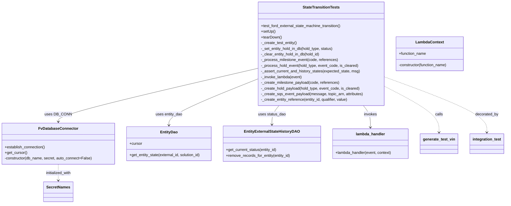
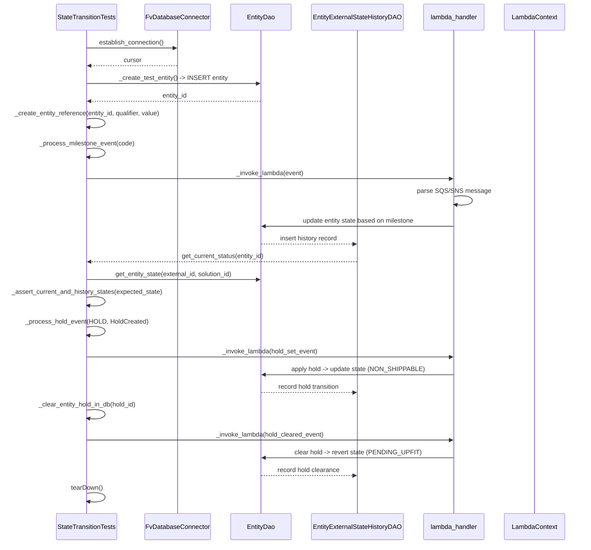

# Diagram: entity_core/entity_service/entity_service/entity/entity/external_state/tests/integration/test_external_state_transition_handler.py

> Auto-generated by Obscura crawlers

## Diagram 1

### SVG

<svg id="container" width="2138.4296875" xmlns="http://www.w3.org/2000/svg" class="classDiagram" height="860" viewBox="0 0 2138.4296875 860" role="graphics-document document" aria-roledescription="class"><g><defs><marker id="container_class-aggregationStart" class="marker aggregation class" refX="18" refY="7" markerWidth="190" markerHeight="240" orient="auto"><path d="M 18,7 L9,13 L1,7 L9,1 Z"></path></marker></defs><defs><marker id="container_class-aggregationEnd" class="marker aggregation class" refX="1" refY="7" markerWidth="20" markerHeight="28" orient="auto"><path d="M 18,7 L9,13 L1,7 L9,1 Z"></path></marker></defs><defs><marker id="container_class-extensionStart" class="marker extension class" refX="18" refY="7" markerWidth="190" markerHeight="240" orient="auto"><path d="M 1,7 L18,13 V 1 Z"></path></marker></defs><defs><marker id="container_class-extensionEnd" class="marker extension class" refX="1" refY="7" markerWidth="20" markerHeight="28" orient="auto"><path d="M 1,1 V 13 L18,7 Z"></path></marker></defs><defs><marker id="container_class-compositionStart" class="marker composition class" refX="18" refY="7" markerWidth="190" markerHeight="240" orient="auto"><path d="M 18,7 L9,13 L1,7 L9,1 Z"></path></marker></defs><defs><marker id="container_class-compositionEnd" class="marker composition class" refX="1" refY="7" markerWidth="20" markerHeight="28" orient="auto"><path d="M 18,7 L9,13 L1,7 L9,1 Z"></path></marker></defs><defs><marker id="container_class-dependencyStart" class="marker dependency class" refX="6" refY="7" markerWidth="190" markerHeight="240" orient="auto"><path d="M 5,7 L9,13 L1,7 L9,1 Z"></path></marker></defs><defs><marker id="container_class-dependencyEnd" class="marker dependency class" refX="13" refY="7" markerWidth="20" markerHeight="28" orient="auto"><path d="M 18,7 L9,13 L14,7 L9,1 Z"></path></marker></defs><defs><marker id="container_class-lollipopStart" class="marker lollipop class" refX="13" refY="7" markerWidth="190" markerHeight="240" orient="auto"><circle stroke="black" fill="transparent" cx="7" cy="7" r="6"></circle></marker></defs><defs><marker id="container_class-lollipopEnd" class="marker lollipop class" refX="1" refY="7" markerWidth="190" markerHeight="240" orient="auto"><circle stroke="black" fill="transparent" cx="7" cy="7" r="6"></circle></marker></defs><g class="root"><g class="clusters"></g><g class="edgePaths"><path d="M1096.383,288.011L954.465,320.509C812.548,353.007,528.714,418.004,386.796,455.668C244.879,493.333,244.879,503.667,244.879,508.833L244.879,514" id="id_StateTransitionTests_FvDatabaseConnector_1" class="edge-thickness-normal edge-pattern-solid relation" style=";;;" data-edge="true" data-et="edge" data-id="id_StateTransitionTests_FvDatabaseConnector_1" data-points="W3sieCI6MTA5Ni4zODI4MTI1LCJ5IjoyODguMDEwNzc5NTE0MzgwMjZ9LHsieCI6MjQ0Ljg3ODkwNjI1LCJ5Ijo0ODN9LHsieCI6MjQ0Ljg3ODkwNjI1LCJ5Ijo1MjB9XQ==" marker-end="url(#container_class-dependencyEnd)"></path><path d="M1096.383,332.276L1032.809,357.397C969.234,382.518,842.086,432.759,778.512,465.546C714.938,498.333,714.938,513.667,714.938,521.333L714.938,529" id="id_StateTransitionTests_EntityDao_2" class="edge-thickness-normal edge-pattern-solid relation" style=";;;" data-edge="true" data-et="edge" data-id="id_StateTransitionTests_EntityDao_2" data-points="W3sieCI6MTA5Ni4zODI4MTI1LCJ5IjozMzIuMjc2NDgwODAyNjIzOTV9LHsieCI6NzE0LjkzNzUsInkiOjQ4M30seyJ4Ijo3MTQuOTM3NSwieSI6NTM1fV0=" marker-end="url(#container_class-dependencyEnd)"></path><path d="M1184.083,446L1179.05,452.167C1174.018,458.333,1163.952,470.667,1158.919,484C1153.887,497.333,1153.887,511.667,1153.887,518.833L1153.887,526" id="id_StateTransitionTests_EntityExternalStateHistoryDAO_3" class="edge-thickness-normal edge-pattern-solid relation" style=";;;" data-edge="true" data-et="edge" data-id="id_StateTransitionTests_EntityExternalStateHistoryDAO_3" data-points="W3sieCI6MTE4NC4wODMwMjMwNzEyODksInkiOjQ0Nn0seyJ4IjoxMTUzLjg4NjcxODc1LCJ5Ijo0ODN9LHsieCI6MTE1My44ODY3MTg3NSwieSI6NTMyfV0=" marker-end="url(#container_class-dependencyEnd)"></path><path d="M1541.542,446L1546.575,452.167C1551.607,458.333,1561.673,470.667,1566.706,486C1571.738,501.333,1571.738,519.667,1571.738,528.833L1571.738,538" id="id_StateTransitionTests_lambda_handler_4" class="edge-thickness-normal edge-pattern-solid relation" style=";;;" data-edge="true" data-et="edge" data-id="id_StateTransitionTests_lambda_handler_4" data-points="W3sieCI6MTU0MS41NDE5NzY5Mjg3MTEsInkiOjQ0Nn0seyJ4IjoxNTcxLjczODI4MTI1LCJ5Ijo0ODN9LHsieCI6MTU3MS43MzgyODEyNSwieSI6NTQ0fV0=" marker-end="url(#container_class-dependencyEnd)"></path><path d="M244.879,694L244.879,700.167C244.879,706.333,244.879,718.667,244.879,730C244.879,741.333,244.879,751.667,244.879,756.833L244.879,762" id="id_FvDatabaseConnector_SecretNames_5" class="edge-thickness-normal edge-pattern-dashed relation" style=";;;" data-edge="true" data-et="edge" data-id="id_FvDatabaseConnector_SecretNames_5" data-points="W3sieCI6MjQ0Ljg3ODkwNjI1LCJ5Ijo2OTR9LHsieCI6MjQ0Ljg3ODkwNjI1LCJ5Ijo3MzF9LHsieCI6MjQ0Ljg3ODkwNjI1LCJ5Ijo3Njh9XQ==" marker-end="url(#container_class-dependencyEnd)"></path><path d="M1629.242,363.846L1667.906,383.705C1706.57,403.564,1783.898,443.282,1822.563,475.808C1861.227,508.333,1861.227,533.667,1861.227,546.333L1861.227,559" id="id_StateTransitionTests_generate_test_vin_6" class="edge-thickness-normal edge-pattern-dashed relation" style=";;;" data-edge="true" data-et="edge" data-id="id_StateTransitionTests_generate_test_vin_6" data-points="W3sieCI6MTYyOS4yNDIxODc1LCJ5IjozNjMuODQ2MDU4NTkyMDk2OH0seyJ4IjoxODYxLjIyNjU2MjUsInkiOjQ4M30seyJ4IjoxODYxLjIyNjU2MjUsInkiOjU2NX1d" marker-end="url(#container_class-dependencyEnd)"></path><path d="M1629.242,324.896L1700.957,351.247C1772.672,377.597,1916.102,430.299,1987.816,469.316C2059.531,508.333,2059.531,533.667,2059.531,546.333L2059.531,559" id="id_StateTransitionTests_integration_test_7" class="edge-thickness-normal edge-pattern-dashed relation" style=";;;" data-edge="true" data-et="edge" data-id="id_StateTransitionTests_integration_test_7" data-points="W3sieCI6MTYyOS4yNDIxODc1LCJ5IjozMjQuODk2MDMwNTAwMTEyMTV9LHsieCI6MjA1OS41MzEyNSwieSI6NDgzfSx7IngiOjIwNTkuNTMxMjUsInkiOjU2NX1d" marker-end="url(#container_class-dependencyEnd)"></path></g><g class="edgeLabels"><g class="edgeLabel" transform="translate(244.87890625, 483)"><g class="label" data-id="id_StateTransitionTests_FvDatabaseConnector_1" transform="translate(-53.09375, -12)"><foreignObject width="106.1875" height="24">

uses DB_CONN

</foreignObject></g></g><g class="edgeLabel" transform="translate(714.9375, 483)"><g class="label" data-id="id_StateTransitionTests_EntityDao_2" transform="translate(-57.15625, -12)"><foreignObject width="114.3125" height="24">

uses entity_dao

</foreignObject></g></g><g class="edgeLabel" transform="translate(1153.88671875, 483)"><g class="label" data-id="id_StateTransitionTests_EntityExternalStateHistoryDAO_3" transform="translate(-58.4609375, -12)"><foreignObject width="116.921875" height="24">

uses status_dao

</foreignObject></g></g><g class="edgeLabel" transform="translate(1571.73828125, 483)"><g class="label" data-id="id_StateTransitionTests_lambda_handler_4" transform="translate(-27.5859375, -12)"><foreignObject width="55.171875" height="24">

invokes

</foreignObject></g></g><g class="edgeLabel" transform="translate(244.87890625, 731)"><g class="label" data-id="id_FvDatabaseConnector_SecretNames_5" transform="translate(-55.375, -12)"><foreignObject width="110.75" height="24">

initialized_with

</foreignObject></g></g><g class="edgeLabel" transform="translate(1861.2265625, 483)"><g class="label" data-id="id_StateTransitionTests_generate_test_vin_6" transform="translate(-16.4453125, -12)"><foreignObject width="32.890625" height="24">

calls

</foreignObject></g></g><g class="edgeLabel" transform="translate(2059.53125, 483)"><g class="label" data-id="id_StateTransitionTests_integration_test_7" transform="translate(-49.375, -12)"><foreignObject width="98.75" height="24">

decorated_by

</foreignObject></g></g></g><g class="nodes"><g class="node default" id="classId-StateTransitionTests-0" transform="translate(1362.8125, 227)"><g class="basic label-container"><path d="M-266.4296875 -219 L266.4296875 -219 L266.4296875 219 L-266.4296875 219" stroke="none" stroke-width="0" fill="#ECECFF" style=""></path><path d="M-266.4296875 -219 C-100.30956964604636 -219, 65.81054820790729 -219, 266.4296875 -219 M-266.4296875 -219 C-145.9814584610197 -219, -25.533229422039398 -219, 266.4296875 -219 M266.4296875 -219 C266.4296875 -122.74918232823875, 266.4296875 -26.49836465647749, 266.4296875 219 M266.4296875 -219 C266.4296875 -84.88541557045039, 266.4296875 49.22916885909922, 266.4296875 219 M266.4296875 219 C115.34549156196474 219, -35.73870437607053 219, -266.4296875 219 M266.4296875 219 C92.12690801243858 219, -82.17587147512285 219, -266.4296875 219 M-266.4296875 219 C-266.4296875 96.47647100500022, -266.4296875 -26.04705798999956, -266.4296875 -219 M-266.4296875 219 C-266.4296875 114.78310448225595, -266.4296875 10.566208964511901, -266.4296875 -219" stroke="#9370DB" stroke-width="1.3" fill="none" stroke-dasharray="0 0" style=""></path></g><g class="annotation-group text" transform="translate(0, -195)"></g><g class="label-group text" transform="translate(-75.1875, -195)"><g class="label" style="font-weight: bolder" transform="translate(0,-12)"><foreignObject width="150.375" height="24">

StateTransitionTests

</foreignObject></g></g><g class="members-group text" transform="translate(-254.4296875, -147)"></g><g class="methods-group text" transform="translate(-254.4296875, -117)"><g class="label" style="" transform="translate(0,-12)"><foreignObject width="343.578125" height="24">

+test_ford_external_state_machine_transition()

</foreignObject></g><g class="label" style="" transform="translate(0,12)"><foreignObject width="60.421875" height="24">

+setUp()

</foreignObject></g><g class="label" style="" transform="translate(0,36)"><foreignObject width="87.75" height="24">

+tearDown()

</foreignObject></g><g class="label" style="" transform="translate(0,60)"><foreignObject width="153.546875" height="24">

-_create_test_entity()

</foreignObject></g><g class="label" style="" transform="translate(0,84)"><foreignObject width="310.8125" height="24">

-_set_entity_hold_in_db(hold_type, status)

</foreignObject></g><g class="label" style="" transform="translate(0,108)"><foreignObject width="253.21875" height="24">

-_clear_entity_hold_in_db(hold_id)

</foreignObject></g><g class="label" style="" transform="translate(0,132)"><foreignObject width="325.78125" height="24">

-_process_milestone_event(code, references)

</foreignObject></g><g class="label" style="" transform="translate(0,156)"><foreignObject width="413.46875" height="24">

-_process_hold_event(hold_type, event_code, is_cleared)

</foreignObject></g><g class="label" style="" transform="translate(0,180)"><foreignObject width="421.625" height="24">

-_assert_current_and_history_states(expected_state, msg)

</foreignObject></g><g class="label" style="" transform="translate(0,204)"><foreignObject width="174.53125" height="24">

-_invoke_lambda(event)

</foreignObject></g><g class="label" style="" transform="translate(0,228)"><foreignObject width="332.6875" height="24">

-_create_milestone_payload(code, references)

</foreignObject></g><g class="label" style="" transform="translate(0,252)"><foreignObject width="420.359375" height="24">

-_create_hold_payload(hold_type, event_code, is_cleared)

</foreignObject></g><g class="label" style="" transform="translate(0,276)"><foreignObject width="433.671875" height="24">

-_create_sqs_event_payload(message, topic_arn, attributes)

</foreignObject></g><g class="label" style="" transform="translate(0,300)"><foreignObject width="372.40625" height="24">

-_create_entity_reference(entity_id, qualifier, value)

</foreignObject></g></g><g class="divider" style=""><path d="M-266.4296875 -171 C-91.86819146223849 -171, 82.69330457552303 -171, 266.4296875 -171 M-266.4296875 -171 C-87.56468868468536 -171, 91.30031013062927 -171, 266.4296875 -171" stroke="#9370DB" stroke-width="1.3" fill="none" stroke-dasharray="0 0" style=""></path></g><g class="divider" style=""><path d="M-266.4296875 -147 C-152.4635159452808 -147, -38.49734439056158 -147, 266.4296875 -147 M-266.4296875 -147 C-105.66877696033728 -147, 55.092133579325434 -147, 266.4296875 -147" stroke="#9370DB" stroke-width="1.3" fill="none" stroke-dasharray="0 0" style=""></path></g></g><g class="node default" id="classId-FvDatabaseConnector-1" transform="translate(244.87890625, 607)"><g class="basic label-container"><path d="M-236.87890625 -87 L236.87890625 -87 L236.87890625 87 L-236.87890625 87" stroke="none" stroke-width="0" fill="#ECECFF" style=""></path><path d="M-236.87890625 -87 C-89.25442363737068 -87, 58.370058975258644 -87, 236.87890625 -87 M-236.87890625 -87 C-124.57289745630015 -87, -12.266888662600309 -87, 236.87890625 -87 M236.87890625 -87 C236.87890625 -28.49409383026702, 236.87890625 30.011812339465962, 236.87890625 87 M236.87890625 -87 C236.87890625 -48.691106753711836, 236.87890625 -10.382213507423671, 236.87890625 87 M236.87890625 87 C68.94501770508063 87, -98.98887083983874 87, -236.87890625 87 M236.87890625 87 C99.69216726626283 87, -37.494571717474344 87, -236.87890625 87 M-236.87890625 87 C-236.87890625 24.079601313029215, -236.87890625 -38.84079737394157, -236.87890625 -87 M-236.87890625 87 C-236.87890625 30.60992952376627, -236.87890625 -25.780140952467463, -236.87890625 -87" stroke="#9370DB" stroke-width="1.3" fill="none" stroke-dasharray="0 0" style=""></path></g><g class="annotation-group text" transform="translate(0, -63)"></g><g class="label-group text" transform="translate(-79.3046875, -63)"><g class="label" style="font-weight: bolder" transform="translate(0,-12)"><foreignObject width="158.609375" height="24">

FvDatabaseConnector

</foreignObject></g></g><g class="members-group text" transform="translate(-224.87890625, -15)"></g><g class="methods-group text" transform="translate(-224.87890625, 15)"><g class="label" style="" transform="translate(0,-12)"><foreignObject width="173.265625" height="24">

+establish_connection()

</foreignObject></g><g class="label" style="" transform="translate(0,12)"><foreignObject width="94.640625" height="24">

+get_cursor()

</foreignObject></g><g class="label" style="" transform="translate(0,36)"><foreignObject width="370.453125" height="24">

-constructor(db_name, secret, auto_connect=False)

</foreignObject></g></g><g class="divider" style=""><path d="M-236.87890625 -39 C-91.06217837120104 -39, 54.754549507597915 -39, 236.87890625 -39 M-236.87890625 -39 C-139.28760817401192 -39, -41.696310098023844 -39, 236.87890625 -39" stroke="#9370DB" stroke-width="1.3" fill="none" stroke-dasharray="0 0" style=""></path></g><g class="divider" style=""><path d="M-236.87890625 -15 C-139.52327556403668 -15, -42.16764487807339 -15, 236.87890625 -15 M-236.87890625 -15 C-86.26869000084756 -15, 64.34152624830489 -15, 236.87890625 -15" stroke="#9370DB" stroke-width="1.3" fill="none" stroke-dasharray="0 0" style=""></path></g></g><g class="node default" id="classId-EntityDao-2" transform="translate(714.9375, 607)"><g class="basic label-container"><path d="M-183.1796875 -72 L183.1796875 -72 L183.1796875 72 L-183.1796875 72" stroke="none" stroke-width="0" fill="#ECECFF" style=""></path><path d="M-183.1796875 -72 C-43.27869515406769 -72, 96.62229719186462 -72, 183.1796875 -72 M-183.1796875 -72 C-41.43988397854258 -72, 100.29991954291484 -72, 183.1796875 -72 M183.1796875 -72 C183.1796875 -35.340776842914124, 183.1796875 1.3184463141717515, 183.1796875 72 M183.1796875 -72 C183.1796875 -24.910924109399716, 183.1796875 22.17815178120057, 183.1796875 72 M183.1796875 72 C98.05366599718523 72, 12.927644494370469 72, -183.1796875 72 M183.1796875 72 C104.86818539770998 72, 26.55668329541996 72, -183.1796875 72 M-183.1796875 72 C-183.1796875 28.777529243453834, -183.1796875 -14.444941513092331, -183.1796875 -72 M-183.1796875 72 C-183.1796875 20.22309474742186, -183.1796875 -31.553810505156278, -183.1796875 -72" stroke="#9370DB" stroke-width="1.3" fill="none" stroke-dasharray="0 0" style=""></path></g><g class="annotation-group text" transform="translate(0, -48)"></g><g class="label-group text" transform="translate(-35.46875, -48)"><g class="label" style="font-weight: bolder" transform="translate(0,-12)"><foreignObject width="70.9375" height="24">

EntityDao

</foreignObject></g></g><g class="members-group text" transform="translate(-171.1796875, 0)"><g class="label" style="" transform="translate(0,-12)"><foreignObject width="53.71875" height="24">

+cursor

</foreignObject></g></g><g class="methods-group text" transform="translate(-171.1796875, 48)"><g class="label" style="" transform="translate(0,-12)"><foreignObject width="306.890625" height="24">

+get_entity_state(external_id, solution_id)

</foreignObject></g></g><g class="divider" style=""><path d="M-183.1796875 -24 C-91.77718701615652 -24, -0.37468653231303506 -24, 183.1796875 -24 M-183.1796875 -24 C-61.9837259060281 -24, 59.2122356879438 -24, 183.1796875 -24" stroke="#9370DB" stroke-width="1.3" fill="none" stroke-dasharray="0 0" style=""></path></g><g class="divider" style=""><path d="M-183.1796875 24 C-65.85071633668582 24, 51.47825482662836 24, 183.1796875 24 M-183.1796875 24 C-84.50092428503507 24, 14.177838929929862 24, 183.1796875 24" stroke="#9370DB" stroke-width="1.3" fill="none" stroke-dasharray="0 0" style=""></path></g></g><g class="node default" id="classId-EntityExternalStateHistoryDAO-3" transform="translate(1153.88671875, 607)"><g class="basic label-container"><path d="M-205.76953125 -75 L205.76953125 -75 L205.76953125 75 L-205.76953125 75" stroke="none" stroke-width="0" fill="#ECECFF" style=""></path><path d="M-205.76953125 -75 C-60.906764472439846 -75, 83.95600230512031 -75, 205.76953125 -75 M-205.76953125 -75 C-49.951444291013814 -75, 105.86664266797237 -75, 205.76953125 -75 M205.76953125 -75 C205.76953125 -35.53871421606924, 205.76953125 3.9225715678615245, 205.76953125 75 M205.76953125 -75 C205.76953125 -38.48392501502761, 205.76953125 -1.9678500300552173, 205.76953125 75 M205.76953125 75 C117.05961092481465 75, 28.349690599629298 75, -205.76953125 75 M205.76953125 75 C102.79184892313421 75, -0.18583340373157853 75, -205.76953125 75 M-205.76953125 75 C-205.76953125 35.80838374982984, -205.76953125 -3.383232500340327, -205.76953125 -75 M-205.76953125 75 C-205.76953125 32.59781135659566, -205.76953125 -9.804377286808673, -205.76953125 -75" stroke="#9370DB" stroke-width="1.3" fill="none" stroke-dasharray="0 0" style=""></path></g><g class="annotation-group text" transform="translate(0, -51)"></g><g class="label-group text" transform="translate(-112.4765625, -51)"><g class="label" style="font-weight: bolder" transform="translate(0,-12)"><foreignObject width="224.953125" height="24">

EntityExternalStateHistoryDAO

</foreignObject></g></g><g class="members-group text" transform="translate(-193.76953125, -3)"></g><g class="methods-group text" transform="translate(-193.76953125, 27)"><g class="label" style="" transform="translate(0,-12)"><foreignObject width="218.0625" height="24">

+get_current_status(entity_id)

</foreignObject></g><g class="label" style="" transform="translate(0,12)"><foreignObject width="275.0625" height="24">

+remove_records_for_entity(entity_id)

</foreignObject></g></g><g class="divider" style=""><path d="M-205.76953125 -27 C-61.9088955819164 -27, 81.9517400861672 -27, 205.76953125 -27 M-205.76953125 -27 C-122.06998524151673 -27, -38.370439233033466 -27, 205.76953125 -27" stroke="#9370DB" stroke-width="1.3" fill="none" stroke-dasharray="0 0" style=""></path></g><g class="divider" style=""><path d="M-205.76953125 -3 C-86.57903230433712 -3, 32.61146664132576 -3, 205.76953125 -3 M-205.76953125 -3 C-42.49044157892865 -3, 120.7886480921427 -3, 205.76953125 -3" stroke="#9370DB" stroke-width="1.3" fill="none" stroke-dasharray="0 0" style=""></path></g></g><g class="node default" id="classId-LambdaContext-4" transform="translate(1824.8125, 227)"><g class="basic label-container"><path d="M-145.5703125 -72 L145.5703125 -72 L145.5703125 72 L-145.5703125 72" stroke="none" stroke-width="0" fill="#ECECFF" style=""></path><path d="M-145.5703125 -72 C-63.684664378576045 -72, 18.20098374284791 -72, 145.5703125 -72 M-145.5703125 -72 C-63.50601817991861 -72, 18.558276140162775 -72, 145.5703125 -72 M145.5703125 -72 C145.5703125 -25.653542305329204, 145.5703125 20.692915389341593, 145.5703125 72 M145.5703125 -72 C145.5703125 -34.91078184606516, 145.5703125 2.1784363078696742, 145.5703125 72 M145.5703125 72 C56.239256518379364 72, -33.09179946324127 72, -145.5703125 72 M145.5703125 72 C46.0357137177499 72, -53.4988850645002 72, -145.5703125 72 M-145.5703125 72 C-145.5703125 14.8587622603997, -145.5703125 -42.2824754792006, -145.5703125 -72 M-145.5703125 72 C-145.5703125 35.08225671425617, -145.5703125 -1.8354865714876638, -145.5703125 -72" stroke="#9370DB" stroke-width="1.3" fill="none" stroke-dasharray="0 0" style=""></path></g><g class="annotation-group text" transform="translate(0, -48)"></g><g class="label-group text" transform="translate(-57.296875, -48)"><g class="label" style="font-weight: bolder" transform="translate(0,-12)"><foreignObject width="114.59375" height="24">

LambdaContext

</foreignObject></g></g><g class="members-group text" transform="translate(-133.5703125, 0)"><g class="label" style="" transform="translate(0,-12)"><foreignObject width="117.28125" height="24">

+function_name

</foreignObject></g></g><g class="methods-group text" transform="translate(-133.5703125, 48)"><g class="label" style="" transform="translate(0,-12)"><foreignObject width="209.84375" height="24">

-constructor(function_name)

</foreignObject></g></g><g class="divider" style=""><path d="M-145.5703125 -24 C-44.96026152929589 -24, 55.64978944140822 -24, 145.5703125 -24 M-145.5703125 -24 C-34.75669578325768 -24, 76.05692093348463 -24, 145.5703125 -24" stroke="#9370DB" stroke-width="1.3" fill="none" stroke-dasharray="0 0" style=""></path></g><g class="divider" style=""><path d="M-145.5703125 24 C-82.94329650544391 24, -20.31628051088782 24, 145.5703125 24 M-145.5703125 24 C-30.08025672144332 24, 85.40979905711336 24, 145.5703125 24" stroke="#9370DB" stroke-width="1.3" fill="none" stroke-dasharray="0 0" style=""></path></g></g><g class="node default" id="classId-lambda_handler-5" transform="translate(1571.73828125, 607)"><g class="basic label-container"><path d="M-162.08203125 -63 L162.08203125 -63 L162.08203125 63 L-162.08203125 63" stroke="none" stroke-width="0" fill="#ECECFF" style=""></path><path d="M-162.08203125 -63 C-50.09971761837559 -63, 61.882596013248815 -63, 162.08203125 -63 M-162.08203125 -63 C-59.78069823983472 -63, 42.52063477033056 -63, 162.08203125 -63 M162.08203125 -63 C162.08203125 -37.33869808288587, 162.08203125 -11.67739616577174, 162.08203125 63 M162.08203125 -63 C162.08203125 -25.78151844504471, 162.08203125 11.436963109910579, 162.08203125 63 M162.08203125 63 C61.43054586560781 63, -39.22093951878438 63, -162.08203125 63 M162.08203125 63 C92.23443940691071 63, 22.38684756382142 63, -162.08203125 63 M-162.08203125 63 C-162.08203125 32.21391137134519, -162.08203125 1.4278227426903811, -162.08203125 -63 M-162.08203125 63 C-162.08203125 30.05598181033544, -162.08203125 -2.8880363793291224, -162.08203125 -63" stroke="#9370DB" stroke-width="1.3" fill="none" stroke-dasharray="0 0" style=""></path></g><g class="annotation-group text" transform="translate(0, -39)"></g><g class="label-group text" transform="translate(-59.9765625, -39)"><g class="label" style="font-weight: bolder" transform="translate(0,-12)"><foreignObject width="119.953125" height="24">

lambda_handler

</foreignObject></g></g><g class="members-group text" transform="translate(-150.08203125, 9)"></g><g class="methods-group text" transform="translate(-150.08203125, 39)"><g class="label" style="" transform="translate(0,-12)"><foreignObject width="240.1875" height="24">

+lambda_handler(event, context)

</foreignObject></g></g><g class="divider" style=""><path d="M-162.08203125 -15 C-83.87453230079319 -15, -5.667033351586383 -15, 162.08203125 -15 M-162.08203125 -15 C-83.5013522537609 -15, -4.920673257521798 -15, 162.08203125 -15" stroke="#9370DB" stroke-width="1.3" fill="none" stroke-dasharray="0 0" style=""></path></g><g class="divider" style=""><path d="M-162.08203125 9 C-76.94364865334492 9, 8.194733943310155 9, 162.08203125 9 M-162.08203125 9 C-65.64785321923014 9, 30.786324811539714 9, 162.08203125 9" stroke="#9370DB" stroke-width="1.3" fill="none" stroke-dasharray="0 0" style=""></path></g></g><g class="node default" id="classId-SecretNames-6" transform="translate(244.87890625, 810)"><g class="basic label-container"><path d="M-60.03125 -42 L60.03125 -42 L60.03125 42 L-60.03125 42" stroke="none" stroke-width="0" fill="#ECECFF" style=""></path><path d="M-60.03125 -42 C-16.15574851055237 -42, 27.719752978895258 -42, 60.03125 -42 M-60.03125 -42 C-35.7010465905731 -42, -11.370843181146206 -42, 60.03125 -42 M60.03125 -42 C60.03125 -10.336508854014323, 60.03125 21.326982291971355, 60.03125 42 M60.03125 -42 C60.03125 -14.915311563320419, 60.03125 12.169376873359163, 60.03125 42 M60.03125 42 C25.491569244332574 42, -9.048111511334852 42, -60.03125 42 M60.03125 42 C28.86608314890155 42, -2.299083702196903 42, -60.03125 42 M-60.03125 42 C-60.03125 9.44518126629329, -60.03125 -23.10963746741342, -60.03125 -42 M-60.03125 42 C-60.03125 12.919524092830361, -60.03125 -16.160951814339278, -60.03125 -42" stroke="#9370DB" stroke-width="1.3" fill="none" stroke-dasharray="0 0" style=""></path></g><g class="annotation-group text" transform="translate(0, -18)"></g><g class="label-group text" transform="translate(-48.03125, -18)"><g class="label" style="font-weight: bolder" transform="translate(0,-12)"><foreignObject width="96.0625" height="24">

SecretNames

</foreignObject></g></g><g class="members-group text" transform="translate(-48.03125, 30)"></g><g class="methods-group text" transform="translate(-48.03125, 60)"></g><g class="divider" style=""><path d="M-60.03125 6 C-19.158221629397076 6, 21.714806741205848 6, 60.03125 6 M-60.03125 6 C-26.57247334310116 6, 6.886303313797683 6, 60.03125 6" stroke="#9370DB" stroke-width="1.3" fill="none" stroke-dasharray="0 0" style=""></path></g><g class="divider" style=""><path d="M-60.03125 24 C-13.272610803181102 24, 33.486028393637795 24, 60.03125 24 M-60.03125 24 C-33.2161636654271 24, -6.401077330854207 24, 60.03125 24" stroke="#9370DB" stroke-width="1.3" fill="none" stroke-dasharray="0 0" style=""></path></g></g><g class="node default" id="classId-generate_test_vin-7" transform="translate(1861.2265625, 607)"><g class="basic label-container"><path d="M-77.40625 -42 L77.40625 -42 L77.40625 42 L-77.40625 42" stroke="none" stroke-width="0" fill="#ECECFF" style=""></path><path d="M-77.40625 -42 C-16.512337299777855 -42, 44.38157540044429 -42, 77.40625 -42 M-77.40625 -42 C-42.416014286739795 -42, -7.42577857347959 -42, 77.40625 -42 M77.40625 -42 C77.40625 -13.658226967238317, 77.40625 14.683546065523366, 77.40625 42 M77.40625 -42 C77.40625 -20.11479045281527, 77.40625 1.7704190943694584, 77.40625 42 M77.40625 42 C20.078404810616213 42, -37.249440378767574 42, -77.40625 42 M77.40625 42 C39.09612032823458 42, 0.785990656469167 42, -77.40625 42 M-77.40625 42 C-77.40625 23.00634398203559, -77.40625 4.012687964071183, -77.40625 -42 M-77.40625 42 C-77.40625 11.078673039150985, -77.40625 -19.84265392169803, -77.40625 -42" stroke="#9370DB" stroke-width="1.3" fill="none" stroke-dasharray="0 0" style=""></path></g><g class="annotation-group text" transform="translate(0, -18)"></g><g class="label-group text" transform="translate(-65.40625, -18)"><g class="label" style="font-weight: bolder" transform="translate(0,-12)"><foreignObject width="130.8125" height="24">

generate_test_vin

</foreignObject></g></g><g class="members-group text" transform="translate(-65.40625, 30)"></g><g class="methods-group text" transform="translate(-65.40625, 60)"></g><g class="divider" style=""><path d="M-77.40625 6 C-43.91346079553324 6, -10.42067159106648 6, 77.40625 6 M-77.40625 6 C-43.22350152343889 6, -9.040753046877782 6, 77.40625 6" stroke="#9370DB" stroke-width="1.3" fill="none" stroke-dasharray="0 0" style=""></path></g><g class="divider" style=""><path d="M-77.40625 24 C-21.233710534976098 24, 34.938828930047805 24, 77.40625 24 M-77.40625 24 C-25.918024885158523 24, 25.570200229682953 24, 77.40625 24" stroke="#9370DB" stroke-width="1.3" fill="none" stroke-dasharray="0 0" style=""></path></g></g><g class="node default" id="classId-integration_test-8" transform="translate(2059.53125, 607)"><g class="basic label-container"><path d="M-70.8984375 -42 L70.8984375 -42 L70.8984375 42 L-70.8984375 42" stroke="none" stroke-width="0" fill="#ECECFF" style=""></path><path d="M-70.8984375 -42 C-34.24127866635928 -42, 2.4158801672814434 -42, 70.8984375 -42 M-70.8984375 -42 C-16.76978174290872 -42, 37.35887401418256 -42, 70.8984375 -42 M70.8984375 -42 C70.8984375 -21.34527728916564, 70.8984375 -0.6905545783312803, 70.8984375 42 M70.8984375 -42 C70.8984375 -18.61387050699974, 70.8984375 4.772258986000523, 70.8984375 42 M70.8984375 42 C30.555882552205603 42, -9.786672395588795 42, -70.8984375 42 M70.8984375 42 C33.052168756936716 42, -4.794099986126568 42, -70.8984375 42 M-70.8984375 42 C-70.8984375 13.412639032538504, -70.8984375 -15.174721934922992, -70.8984375 -42 M-70.8984375 42 C-70.8984375 22.861695843888544, -70.8984375 3.723391687777088, -70.8984375 -42" stroke="#9370DB" stroke-width="1.3" fill="none" stroke-dasharray="0 0" style=""></path></g><g class="annotation-group text" transform="translate(0, -18)"></g><g class="label-group text" transform="translate(-58.8984375, -18)"><g class="label" style="font-weight: bolder" transform="translate(0,-12)"><foreignObject width="117.796875" height="24">

integration_test

</foreignObject></g></g><g class="members-group text" transform="translate(-58.8984375, 30)"></g><g class="methods-group text" transform="translate(-58.8984375, 60)"></g><g class="divider" style=""><path d="M-70.8984375 6 C-30.682937911209073 6, 9.532561677581853 6, 70.8984375 6 M-70.8984375 6 C-33.87648616594811 6, 3.145465168103783 6, 70.8984375 6" stroke="#9370DB" stroke-width="1.3" fill="none" stroke-dasharray="0 0" style=""></path></g><g class="divider" style=""><path d="M-70.8984375 24 C-25.7463369091367 24, 19.405763681726597 24, 70.8984375 24 M-70.8984375 24 C-16.973538085718303 24, 36.951361328563394 24, 70.8984375 24" stroke="#9370DB" stroke-width="1.3" fill="none" stroke-dasharray="0 0" style=""></path></g></g></g></g></g></svg>

## Diagram 2

### SVG

<svg id="container" width="1516.5" xmlns="http://www.w3.org/2000/svg" height="1437" viewBox="-155 -10 1516.5 1437" role="graphics-document document" aria-roledescription="sequence"><g><rect x="1161.5" y="1351" fill="#eaeaea" stroke="#666" width="150" height="65" name="Context" rx="3" ry="3" class="actor actor-bottom"></rect><text x="1236.5" y="1383.5" dominant-baseline="central" alignment-baseline="central" class="actor actor-box" style="text-anchor: middle; font-size: 16px; font-weight: 400;"><tspan x="1236.5" dy="0">LambdaContext</tspan></text></g><g><rect x="961.5" y="1351" fill="#eaeaea" stroke="#666" width="150" height="65" name="Lambda" rx="3" ry="3" class="actor actor-bottom"></rect><text x="1036.5" y="1383.5" dominant-baseline="central" alignment-baseline="central" class="actor actor-box" style="text-anchor: middle; font-size: 16px; font-weight: 400;"><tspan x="1036.5" dy="0">lambda_handler</tspan></text></g><g><rect x="671.5" y="1351" fill="#eaeaea" stroke="#666" width="240" height="65" name="HISTORY" rx="3" ry="3" class="actor actor-bottom"></rect><text x="791.5" y="1383.5" dominant-baseline="central" alignment-baseline="central" class="actor actor-box" style="text-anchor: middle; font-size: 16px; font-weight: 400;"><tspan x="791.5" dy="0">EntityExternalStateHistoryDAO</tspan></text></g><g><rect x="471.5" y="1351" fill="#eaeaea" stroke="#666" width="150" height="65" name="DAO" rx="3" ry="3" class="actor actor-bottom"></rect><text x="546.5" y="1383.5" dominant-baseline="central" alignment-baseline="central" class="actor actor-box" style="text-anchor: middle; font-size: 16px; font-weight: 400;"><tspan x="546.5" dy="0">EntityDao</tspan></text></g><g><rect x="244.5" y="1351" fill="#eaeaea" stroke="#666" width="177" height="65" name="DB" rx="3" ry="3" class="actor actor-bottom"></rect><text x="333" y="1383.5" dominant-baseline="central" alignment-baseline="central" class="actor actor-box" style="text-anchor: middle; font-size: 16px; font-weight: 400;"><tspan x="333" dy="0">FvDatabaseConnector</tspan></text></g><g><rect x="0" y="1351" fill="#eaeaea" stroke="#666" width="167" height="65" name="Test" rx="3" ry="3" class="actor actor-bottom"></rect><text x="83.5" y="1383.5" dominant-baseline="central" alignment-baseline="central" class="actor actor-box" style="text-anchor: middle; font-size: 16px; font-weight: 400;"><tspan x="83.5" dy="0">StateTransitionTests</tspan></text></g><g><line id="actor5" x1="1236.5" y1="65" x2="1236.5" y2="1351" class="actor-line 200" stroke-width="0.5px" stroke="#999" name="Context"></line><g id="root-5"><rect x="1161.5" y="0" fill="#eaeaea" stroke="#666" width="150" height="65" name="Context" rx="3" ry="3" class="actor actor-top"></rect><text x="1236.5" y="32.5" dominant-baseline="central" alignment-baseline="central" class="actor actor-box" style="text-anchor: middle; font-size: 16px; font-weight: 400;"><tspan x="1236.5" dy="0">LambdaContext</tspan></text></g></g><g><line id="actor4" x1="1036.5" y1="65" x2="1036.5" y2="1351" class="actor-line 200" stroke-width="0.5px" stroke="#999" name="Lambda"></line><g id="root-4"><rect x="961.5" y="0" fill="#eaeaea" stroke="#666" width="150" height="65" name="Lambda" rx="3" ry="3" class="actor actor-top"></rect><text x="1036.5" y="32.5" dominant-baseline="central" alignment-baseline="central" class="actor actor-box" style="text-anchor: middle; font-size: 16px; font-weight: 400;"><tspan x="1036.5" dy="0">lambda_handler</tspan></text></g></g><g><line id="actor3" x1="791.5" y1="65" x2="791.5" y2="1351" class="actor-line 200" stroke-width="0.5px" stroke="#999" name="HISTORY"></line><g id="root-3"><rect x="671.5" y="0" fill="#eaeaea" stroke="#666" width="240" height="65" name="HISTORY" rx="3" ry="3" class="actor actor-top"></rect><text x="791.5" y="32.5" dominant-baseline="central" alignment-baseline="central" class="actor actor-box" style="text-anchor: middle; font-size: 16px; font-weight: 400;"><tspan x="791.5" dy="0">EntityExternalStateHistoryDAO</tspan></text></g></g><g><line id="actor2" x1="546.5" y1="65" x2="546.5" y2="1351" class="actor-line 200" stroke-width="0.5px" stroke="#999" name="DAO"></line><g id="root-2"><rect x="471.5" y="0" fill="#eaeaea" stroke="#666" width="150" height="65" name="DAO" rx="3" ry="3" class="actor actor-top"></rect><text x="546.5" y="32.5" dominant-baseline="central" alignment-baseline="central" class="actor actor-box" style="text-anchor: middle; font-size: 16px; font-weight: 400;"><tspan x="546.5" dy="0">EntityDao</tspan></text></g></g><g><line id="actor1" x1="333" y1="65" x2="333" y2="1351" class="actor-line 200" stroke-width="0.5px" stroke="#999" name="DB"></line><g id="root-1"><rect x="244.5" y="0" fill="#eaeaea" stroke="#666" width="177" height="65" name="DB" rx="3" ry="3" class="actor actor-top"></rect><text x="333" y="32.5" dominant-baseline="central" alignment-baseline="central" class="actor actor-box" style="text-anchor: middle; font-size: 16px; font-weight: 400;"><tspan x="333" dy="0">FvDatabaseConnector</tspan></text></g></g><g><line id="actor0" x1="83.5" y1="65" x2="83.5" y2="1351" class="actor-line 200" stroke-width="0.5px" stroke="#999" name="Test"></line><g id="root-0"><rect x="0" y="0" fill="#eaeaea" stroke="#666" width="167" height="65" name="Test" rx="3" ry="3" class="actor actor-top"></rect><text x="83.5" y="32.5" dominant-baseline="central" alignment-baseline="central" class="actor actor-box" style="text-anchor: middle; font-size: 16px; font-weight: 400;"><tspan x="83.5" dy="0">StateTransitionTests</tspan></text></g></g><g></g><defs><symbol id="computer" width="24" height="24"><path transform="scale(.5)" d="M2 2v13h20v-13h-20zm18 11h-16v-9h16v9zm-10.228 6l.466-1h3.524l.467 1h-4.457zm14.228 3h-24l2-6h2.104l-1.33 4h18.45l-1.297-4h2.073l2 6zm-5-10h-14v-7h14v7z"></path></symbol></defs><defs><symbol id="database" fill-rule="evenodd" clip-rule="evenodd"><path transform="scale(.5)" d="M12.258.001l.256.004.255.005.253.008.251.01.249.012.247.015.246.016.242.019.241.02.239.023.236.024.233.027.231.028.229.031.225.032.223.034.22.036.217.038.214.04.211.041.208.043.205.045.201.046.198.048.194.05.191.051.187.053.183.054.18.056.175.057.172.059.168.06.163.061.16.063.155.064.15.066.074.033.073.033.071.034.07.034.069.035.068.035.067.035.066.035.064.036.064.036.062.036.06.036.06.037.058.037.058.037.055.038.055.038.053.038.052.038.051.039.05.039.048.039.047.039.045.04.044.04.043.04.041.04.04.041.039.041.037.041.036.041.034.041.033.042.032.042.03.042.029.042.027.042.026.043.024.043.023.043.021.043.02.043.018.044.017.043.015.044.013.044.012.044.011.045.009.044.007.045.006.045.004.045.002.045.001.045v17l-.001.045-.002.045-.004.045-.006.045-.007.045-.009.044-.011.045-.012.044-.013.044-.015.044-.017.043-.018.044-.02.043-.021.043-.023.043-.024.043-.026.043-.027.042-.029.042-.03.042-.032.042-.033.042-.034.041-.036.041-.037.041-.039.041-.04.041-.041.04-.043.04-.044.04-.045.04-.047.039-.048.039-.05.039-.051.039-.052.038-.053.038-.055.038-.055.038-.058.037-.058.037-.06.037-.06.036-.062.036-.064.036-.064.036-.066.035-.067.035-.068.035-.069.035-.07.034-.071.034-.073.033-.074.033-.15.066-.155.064-.16.063-.163.061-.168.06-.172.059-.175.057-.18.056-.183.054-.187.053-.191.051-.194.05-.198.048-.201.046-.205.045-.208.043-.211.041-.214.04-.217.038-.22.036-.223.034-.225.032-.229.031-.231.028-.233.027-.236.024-.239.023-.241.02-.242.019-.246.016-.247.015-.249.012-.251.01-.253.008-.255.005-.256.004-.258.001-.258-.001-.256-.004-.255-.005-.253-.008-.251-.01-.249-.012-.247-.015-.245-.016-.243-.019-.241-.02-.238-.023-.236-.024-.234-.027-.231-.028-.228-.031-.226-.032-.223-.034-.22-.036-.217-.038-.214-.04-.211-.041-.208-.043-.204-.045-.201-.046-.198-.048-.195-.05-.19-.051-.187-.053-.184-.054-.179-.056-.176-.057-.172-.059-.167-.06-.164-.061-.159-.063-.155-.064-.151-.066-.074-.033-.072-.033-.072-.034-.07-.034-.069-.035-.068-.035-.067-.035-.066-.035-.064-.036-.063-.036-.062-.036-.061-.036-.06-.037-.058-.037-.057-.037-.056-.038-.055-.038-.053-.038-.052-.038-.051-.039-.049-.039-.049-.039-.046-.039-.046-.04-.044-.04-.043-.04-.041-.04-.04-.041-.039-.041-.037-.041-.036-.041-.034-.041-.033-.042-.032-.042-.03-.042-.029-.042-.027-.042-.026-.043-.024-.043-.023-.043-.021-.043-.02-.043-.018-.044-.017-.043-.015-.044-.013-.044-.012-.044-.011-.045-.009-.044-.007-.045-.006-.045-.004-.045-.002-.045-.001-.045v-17l.001-.045.002-.045.004-.045.006-.045.007-.045.009-.044.011-.045.012-.044.013-.044.015-.044.017-.043.018-.044.02-.043.021-.043.023-.043.024-.043.026-.043.027-.042.029-.042.03-.042.032-.042.033-.042.034-.041.036-.041.037-.041.039-.041.04-.041.041-.04.043-.04.044-.04.046-.04.046-.039.049-.039.049-.039.051-.039.052-.038.053-.038.055-.038.056-.038.057-.037.058-.037.06-.037.061-.036.062-.036.063-.036.064-.036.066-.035.067-.035.068-.035.069-.035.07-.034.072-.034.072-.033.074-.033.151-.066.155-.064.159-.063.164-.061.167-.06.172-.059.176-.057.179-.056.184-.054.187-.053.19-.051.195-.05.198-.048.201-.046.204-.045.208-.043.211-.041.214-.04.217-.038.22-.036.223-.034.226-.032.228-.031.231-.028.234-.027.236-.024.238-.023.241-.02.243-.019.245-.016.247-.015.249-.012.251-.01.253-.008.255-.005.256-.004.258-.001.258.001zm-9.258 20.499v.01l.001.021.003.021.004.022.005.021.006.022.007.022.009.023.01.022.011.023.012.023.013.023.015.023.016.024.017.023.018.024.019.024.021.024.022.025.023.024.024.025.052.049.056.05.061.051.066.051.07.051.075.051.079.052.084.052.088.052.092.052.097.052.102.051.105.052.11.052.114.051.119.051.123.051.127.05.131.05.135.05.139.048.144.049.147.047.152.047.155.047.16.045.163.045.167.043.171.043.176.041.178.041.183.039.187.039.19.037.194.035.197.035.202.033.204.031.209.03.212.029.216.027.219.025.222.024.226.021.23.02.233.018.236.016.24.015.243.012.246.01.249.008.253.005.256.004.259.001.26-.001.257-.004.254-.005.25-.008.247-.011.244-.012.241-.014.237-.016.233-.018.231-.021.226-.021.224-.024.22-.026.216-.027.212-.028.21-.031.205-.031.202-.034.198-.034.194-.036.191-.037.187-.039.183-.04.179-.04.175-.042.172-.043.168-.044.163-.045.16-.046.155-.046.152-.047.148-.048.143-.049.139-.049.136-.05.131-.05.126-.05.123-.051.118-.052.114-.051.11-.052.106-.052.101-.052.096-.052.092-.052.088-.053.083-.051.079-.052.074-.052.07-.051.065-.051.06-.051.056-.05.051-.05.023-.024.023-.025.021-.024.02-.024.019-.024.018-.024.017-.024.015-.023.014-.024.013-.023.012-.023.01-.023.01-.022.008-.022.006-.022.006-.022.004-.022.004-.021.001-.021.001-.021v-4.127l-.077.055-.08.053-.083.054-.085.053-.087.052-.09.052-.093.051-.095.05-.097.05-.1.049-.102.049-.105.048-.106.047-.109.047-.111.046-.114.045-.115.045-.118.044-.12.043-.122.042-.124.042-.126.041-.128.04-.13.04-.132.038-.134.038-.135.037-.138.037-.139.035-.142.035-.143.034-.144.033-.147.032-.148.031-.15.03-.151.03-.153.029-.154.027-.156.027-.158.026-.159.025-.161.024-.162.023-.163.022-.165.021-.166.02-.167.019-.169.018-.169.017-.171.016-.173.015-.173.014-.175.013-.175.012-.177.011-.178.01-.179.008-.179.008-.181.006-.182.005-.182.004-.184.003-.184.002h-.37l-.184-.002-.184-.003-.182-.004-.182-.005-.181-.006-.179-.008-.179-.008-.178-.01-.176-.011-.176-.012-.175-.013-.173-.014-.172-.015-.171-.016-.17-.017-.169-.018-.167-.019-.166-.02-.165-.021-.163-.022-.162-.023-.161-.024-.159-.025-.157-.026-.156-.027-.155-.027-.153-.029-.151-.03-.15-.03-.148-.031-.146-.032-.145-.033-.143-.034-.141-.035-.14-.035-.137-.037-.136-.037-.134-.038-.132-.038-.13-.04-.128-.04-.126-.041-.124-.042-.122-.042-.12-.044-.117-.043-.116-.045-.113-.045-.112-.046-.109-.047-.106-.047-.105-.048-.102-.049-.1-.049-.097-.05-.095-.05-.093-.052-.09-.051-.087-.052-.085-.053-.083-.054-.08-.054-.077-.054v4.127zm0-5.654v.011l.001.021.003.021.004.021.005.022.006.022.007.022.009.022.01.022.011.023.012.023.013.023.015.024.016.023.017.024.018.024.019.024.021.024.022.024.023.025.024.024.052.05.056.05.061.05.066.051.07.051.075.052.079.051.084.052.088.052.092.052.097.052.102.052.105.052.11.051.114.051.119.052.123.05.127.051.131.05.135.049.139.049.144.048.147.048.152.047.155.046.16.045.163.045.167.044.171.042.176.042.178.04.183.04.187.038.19.037.194.036.197.034.202.033.204.032.209.03.212.028.216.027.219.025.222.024.226.022.23.02.233.018.236.016.24.014.243.012.246.01.249.008.253.006.256.003.259.001.26-.001.257-.003.254-.006.25-.008.247-.01.244-.012.241-.015.237-.016.233-.018.231-.02.226-.022.224-.024.22-.025.216-.027.212-.029.21-.03.205-.032.202-.033.198-.035.194-.036.191-.037.187-.039.183-.039.179-.041.175-.042.172-.043.168-.044.163-.045.16-.045.155-.047.152-.047.148-.048.143-.048.139-.05.136-.049.131-.05.126-.051.123-.051.118-.051.114-.052.11-.052.106-.052.101-.052.096-.052.092-.052.088-.052.083-.052.079-.052.074-.051.07-.052.065-.051.06-.05.056-.051.051-.049.023-.025.023-.024.021-.025.02-.024.019-.024.018-.024.017-.024.015-.023.014-.023.013-.024.012-.022.01-.023.01-.023.008-.022.006-.022.006-.022.004-.021.004-.022.001-.021.001-.021v-4.139l-.077.054-.08.054-.083.054-.085.052-.087.053-.09.051-.093.051-.095.051-.097.05-.1.049-.102.049-.105.048-.106.047-.109.047-.111.046-.114.045-.115.044-.118.044-.12.044-.122.042-.124.042-.126.041-.128.04-.13.039-.132.039-.134.038-.135.037-.138.036-.139.036-.142.035-.143.033-.144.033-.147.033-.148.031-.15.03-.151.03-.153.028-.154.028-.156.027-.158.026-.159.025-.161.024-.162.023-.163.022-.165.021-.166.02-.167.019-.169.018-.169.017-.171.016-.173.015-.173.014-.175.013-.175.012-.177.011-.178.009-.179.009-.179.007-.181.007-.182.005-.182.004-.184.003-.184.002h-.37l-.184-.002-.184-.003-.182-.004-.182-.005-.181-.007-.179-.007-.179-.009-.178-.009-.176-.011-.176-.012-.175-.013-.173-.014-.172-.015-.171-.016-.17-.017-.169-.018-.167-.019-.166-.02-.165-.021-.163-.022-.162-.023-.161-.024-.159-.025-.157-.026-.156-.027-.155-.028-.153-.028-.151-.03-.15-.03-.148-.031-.146-.033-.145-.033-.143-.033-.141-.035-.14-.036-.137-.036-.136-.037-.134-.038-.132-.039-.13-.039-.128-.04-.126-.041-.124-.042-.122-.043-.12-.043-.117-.044-.116-.044-.113-.046-.112-.046-.109-.046-.106-.047-.105-.048-.102-.049-.1-.049-.097-.05-.095-.051-.093-.051-.09-.051-.087-.053-.085-.052-.083-.054-.08-.054-.077-.054v4.139zm0-5.666v.011l.001.02.003.022.004.021.005.022.006.021.007.022.009.023.01.022.011.023.012.023.013.023.015.023.016.024.017.024.018.023.019.024.021.025.022.024.023.024.024.025.052.05.056.05.061.05.066.051.07.051.075.052.079.051.084.052.088.052.092.052.097.052.102.052.105.051.11.052.114.051.119.051.123.051.127.05.131.05.135.05.139.049.144.048.147.048.152.047.155.046.16.045.163.045.167.043.171.043.176.042.178.04.183.04.187.038.19.037.194.036.197.034.202.033.204.032.209.03.212.028.216.027.219.025.222.024.226.021.23.02.233.018.236.017.24.014.243.012.246.01.249.008.253.006.256.003.259.001.26-.001.257-.003.254-.006.25-.008.247-.01.244-.013.241-.014.237-.016.233-.018.231-.02.226-.022.224-.024.22-.025.216-.027.212-.029.21-.03.205-.032.202-.033.198-.035.194-.036.191-.037.187-.039.183-.039.179-.041.175-.042.172-.043.168-.044.163-.045.16-.045.155-.047.152-.047.148-.048.143-.049.139-.049.136-.049.131-.051.126-.05.123-.051.118-.052.114-.051.11-.052.106-.052.101-.052.096-.052.092-.052.088-.052.083-.052.079-.052.074-.052.07-.051.065-.051.06-.051.056-.05.051-.049.023-.025.023-.025.021-.024.02-.024.019-.024.018-.024.017-.024.015-.023.014-.024.013-.023.012-.023.01-.022.01-.023.008-.022.006-.022.006-.022.004-.022.004-.021.001-.021.001-.021v-4.153l-.077.054-.08.054-.083.053-.085.053-.087.053-.09.051-.093.051-.095.051-.097.05-.1.049-.102.048-.105.048-.106.048-.109.046-.111.046-.114.046-.115.044-.118.044-.12.043-.122.043-.124.042-.126.041-.128.04-.13.039-.132.039-.134.038-.135.037-.138.036-.139.036-.142.034-.143.034-.144.033-.147.032-.148.032-.15.03-.151.03-.153.028-.154.028-.156.027-.158.026-.159.024-.161.024-.162.023-.163.023-.165.021-.166.02-.167.019-.169.018-.169.017-.171.016-.173.015-.173.014-.175.013-.175.012-.177.01-.178.01-.179.009-.179.007-.181.006-.182.006-.182.004-.184.003-.184.001-.185.001-.185-.001-.184-.001-.184-.003-.182-.004-.182-.006-.181-.006-.179-.007-.179-.009-.178-.01-.176-.01-.176-.012-.175-.013-.173-.014-.172-.015-.171-.016-.17-.017-.169-.018-.167-.019-.166-.02-.165-.021-.163-.023-.162-.023-.161-.024-.159-.024-.157-.026-.156-.027-.155-.028-.153-.028-.151-.03-.15-.03-.148-.032-.146-.032-.145-.033-.143-.034-.141-.034-.14-.036-.137-.036-.136-.037-.134-.038-.132-.039-.13-.039-.128-.041-.126-.041-.124-.041-.122-.043-.12-.043-.117-.044-.116-.044-.113-.046-.112-.046-.109-.046-.106-.048-.105-.048-.102-.048-.1-.05-.097-.049-.095-.051-.093-.051-.09-.052-.087-.052-.085-.053-.083-.053-.08-.054-.077-.054v4.153zm8.74-8.179l-.257.004-.254.005-.25.008-.247.011-.244.012-.241.014-.237.016-.233.018-.231.021-.226.022-.224.023-.22.026-.216.027-.212.028-.21.031-.205.032-.202.033-.198.034-.194.036-.191.038-.187.038-.183.04-.179.041-.175.042-.172.043-.168.043-.163.045-.16.046-.155.046-.152.048-.148.048-.143.048-.139.049-.136.05-.131.05-.126.051-.123.051-.118.051-.114.052-.11.052-.106.052-.101.052-.096.052-.092.052-.088.052-.083.052-.079.052-.074.051-.07.052-.065.051-.06.05-.056.05-.051.05-.023.025-.023.024-.021.024-.02.025-.019.024-.018.024-.017.023-.015.024-.014.023-.013.023-.012.023-.01.023-.01.022-.008.022-.006.023-.006.021-.004.022-.004.021-.001.021-.001.021.001.021.001.021.004.021.004.022.006.021.006.023.008.022.01.022.01.023.012.023.013.023.014.023.015.024.017.023.018.024.019.024.02.025.021.024.023.024.023.025.051.05.056.05.06.05.065.051.07.052.074.051.079.052.083.052.088.052.092.052.096.052.101.052.106.052.11.052.114.052.118.051.123.051.126.051.131.05.136.05.139.049.143.048.148.048.152.048.155.046.16.046.163.045.168.043.172.043.175.042.179.041.183.04.187.038.191.038.194.036.198.034.202.033.205.032.21.031.212.028.216.027.22.026.224.023.226.022.231.021.233.018.237.016.241.014.244.012.247.011.25.008.254.005.257.004.26.001.26-.001.257-.004.254-.005.25-.008.247-.011.244-.012.241-.014.237-.016.233-.018.231-.021.226-.022.224-.023.22-.026.216-.027.212-.028.21-.031.205-.032.202-.033.198-.034.194-.036.191-.038.187-.038.183-.04.179-.041.175-.042.172-.043.168-.043.163-.045.16-.046.155-.046.152-.048.148-.048.143-.048.139-.049.136-.05.131-.05.126-.051.123-.051.118-.051.114-.052.11-.052.106-.052.101-.052.096-.052.092-.052.088-.052.083-.052.079-.052.074-.051.07-.052.065-.051.06-.05.056-.05.051-.05.023-.025.023-.024.021-.024.02-.025.019-.024.018-.024.017-.023.015-.024.014-.023.013-.023.012-.023.01-.023.01-.022.008-.022.006-.023.006-.021.004-.022.004-.021.001-.021.001-.021-.001-.021-.001-.021-.004-.021-.004-.022-.006-.021-.006-.023-.008-.022-.01-.022-.01-.023-.012-.023-.013-.023-.014-.023-.015-.024-.017-.023-.018-.024-.019-.024-.02-.025-.021-.024-.023-.024-.023-.025-.051-.05-.056-.05-.06-.05-.065-.051-.07-.052-.074-.051-.079-.052-.083-.052-.088-.052-.092-.052-.096-.052-.101-.052-.106-.052-.11-.052-.114-.052-.118-.051-.123-.051-.126-.051-.131-.05-.136-.05-.139-.049-.143-.048-.148-.048-.152-.048-.155-.046-.16-.046-.163-.045-.168-.043-.172-.043-.175-.042-.179-.041-.183-.04-.187-.038-.191-.038-.194-.036-.198-.034-.202-.033-.205-.032-.21-.031-.212-.028-.216-.027-.22-.026-.224-.023-.226-.022-.231-.021-.233-.018-.237-.016-.241-.014-.244-.012-.247-.011-.25-.008-.254-.005-.257-.004-.26-.001-.26.001z"></path></symbol></defs><defs><symbol id="clock" width="24" height="24"><path transform="scale(.5)" d="M12 2c5.514 0 10 4.486 10 10s-4.486 10-10 10-10-4.486-10-10 4.486-10 10-10zm0-2c-6.627 0-12 5.373-12 12s5.373 12 12 12 12-5.373 12-12-5.373-12-12-12zm5.848 12.459c.202.038.202.333.001.372-1.907.361-6.045 1.111-6.547 1.111-.719 0-1.301-.582-1.301-1.301 0-.512.77-5.447 1.125-7.445.034-.192.312-.181.343.014l.985 6.238 5.394 1.011z"></path></symbol></defs><defs><marker id="arrowhead" refX="7.9" refY="5" markerUnits="userSpaceOnUse" markerWidth="12" markerHeight="12" orient="auto-start-reverse"><path d="M -1 0 L 10 5 L 0 10 z"></path></marker></defs><defs><marker id="crosshead" markerWidth="15" markerHeight="8" orient="auto" refX="4" refY="4.5"><path fill="none" stroke="#000000" stroke-width="1pt" d="M 1,2 L 6,7 M 6,2 L 1,7" style="stroke-dasharray: 0, 0;"></path></marker></defs><defs><marker id="filled-head" refX="15.5" refY="7" markerWidth="20" markerHeight="28" orient="auto"><path d="M 18,7 L9,13 L14,7 L9,1 Z"></path></marker></defs><defs><marker id="sequencenumber" refX="15" refY="15" markerWidth="60" markerHeight="40" orient="auto"><circle cx="15" cy="15" r="6"></circle></marker></defs><text x="207" y="80" text-anchor="middle" dominant-baseline="middle" alignment-baseline="middle" class="messageText" dy="1em" style="font-size: 16px; font-weight: 400;">establish_connection()</text><line x1="84.5" y1="113" x2="329" y2="113" class="messageLine0" stroke-width="2" stroke="none" marker-end="url(#arrowhead)" style="fill: none;"></line><text x="210" y="128" text-anchor="middle" dominant-baseline="middle" alignment-baseline="middle" class="messageText" dy="1em" style="font-size: 16px; font-weight: 400;">cursor</text><line x1="332" y1="161" x2="87.5" y2="161" class="messageLine1" stroke-width="2" stroke="none" marker-end="url(#arrowhead)" style="stroke-dasharray: 3, 3; fill: none;"></line><text x="314" y="176" text-anchor="middle" dominant-baseline="middle" alignment-baseline="middle" class="messageText" dy="1em" style="font-size: 16px; font-weight: 400;">_create_test_entity() -&gt; INSERT entity</text><line x1="84.5" y1="209" x2="542.5" y2="209" class="messageLine0" stroke-width="2" stroke="none" marker-end="url(#arrowhead)" style="fill: none;"></line><text x="317" y="224" text-anchor="middle" dominant-baseline="middle" alignment-baseline="middle" class="messageText" dy="1em" style="font-size: 16px; font-weight: 400;">entity_id</text><line x1="545.5" y1="257" x2="87.5" y2="257" class="messageLine1" stroke-width="2" stroke="none" marker-end="url(#arrowhead)" style="stroke-dasharray: 3, 3; fill: none;"></line><text x="85" y="272" text-anchor="middle" dominant-baseline="middle" alignment-baseline="middle" class="messageText" dy="1em" style="font-size: 16px; font-weight: 400;">_create_entity_reference(entity_id, qualifier, value)</text><path d="M 84.5,305 C 144.5,295 144.5,335 84.5,325" class="messageLine0" stroke-width="2" stroke="none" marker-end="url(#arrowhead)" style="fill: none;"></path><text x="85" y="350" text-anchor="middle" dominant-baseline="middle" alignment-baseline="middle" class="messageText" dy="1em" style="font-size: 16px; font-weight: 400;">_process_milestone_event(code)</text><path d="M 84.5,383 C 144.5,373 144.5,413 84.5,403" class="messageLine0" stroke-width="2" stroke="none" marker-end="url(#arrowhead)" style="fill: none;"></path><text x="559" y="428" text-anchor="middle" dominant-baseline="middle" alignment-baseline="middle" class="messageText" dy="1em" style="font-size: 16px; font-weight: 400;">_invoke_lambda(event)</text><line x1="84.5" y1="461" x2="1032.5" y2="461" class="messageLine0" stroke-width="2" stroke="none" marker-end="url(#arrowhead)" style="fill: none;"></line><text x="1038" y="476" text-anchor="middle" dominant-baseline="middle" alignment-baseline="middle" class="messageText" dy="1em" style="font-size: 16px; font-weight: 400;">parse SQS/SNS message</text><path d="M 1037.5,509 C 1097.5,499 1097.5,539 1037.5,529" class="messageLine0" stroke-width="2" stroke="none" marker-end="url(#arrowhead)" style="fill: none;"></path><text x="793" y="554" text-anchor="middle" dominant-baseline="middle" alignment-baseline="middle" class="messageText" dy="1em" style="font-size: 16px; font-weight: 400;">update entity state based on milestone</text><line x1="1035.5" y1="587" x2="550.5" y2="587" class="messageLine0" stroke-width="2" stroke="none" marker-end="url(#arrowhead)" style="fill: none;"></line><text x="668" y="602" text-anchor="middle" dominant-baseline="middle" alignment-baseline="middle" class="messageText" dy="1em" style="font-size: 16px; font-weight: 400;">insert history record</text><line x1="547.5" y1="635" x2="787.5" y2="635" class="messageLine1" stroke-width="2" stroke="none" marker-end="url(#arrowhead)" style="stroke-dasharray: 3, 3; fill: none;"></line><text x="439" y="650" text-anchor="middle" dominant-baseline="middle" alignment-baseline="middle" class="messageText" dy="1em" style="font-size: 16px; font-weight: 400;">get_current_status(entity_id)</text><line x1="790.5" y1="683" x2="87.5" y2="683" class="messageLine1" stroke-width="2" stroke="none" marker-end="url(#arrowhead)" style="stroke-dasharray: 3, 3; fill: none;"></line><text x="314" y="698" text-anchor="middle" dominant-baseline="middle" alignment-baseline="middle" class="messageText" dy="1em" style="font-size: 16px; font-weight: 400;">get_entity_state(external_id, solution_id)</text><line x1="84.5" y1="731" x2="542.5" y2="731" class="messageLine0" stroke-width="2" stroke="none" marker-end="url(#arrowhead)" style="fill: none;"></line><text x="85" y="746" text-anchor="middle" dominant-baseline="middle" alignment-baseline="middle" class="messageText" dy="1em" style="font-size: 16px; font-weight: 400;">_assert_current_and_history_states(expected_state)</text><path d="M 84.5,779 C 144.5,769 144.5,809 84.5,799" class="messageLine0" stroke-width="2" stroke="none" marker-end="url(#arrowhead)" style="fill: none;"></path><text x="85" y="824" text-anchor="middle" dominant-baseline="middle" alignment-baseline="middle" class="messageText" dy="1em" style="font-size: 16px; font-weight: 400;">_process_hold_event(HOLD, HoldCreated)</text><path d="M 84.5,857 C 144.5,847 144.5,887 84.5,877" class="messageLine0" stroke-width="2" stroke="none" marker-end="url(#arrowhead)" style="fill: none;"></path><text x="559" y="902" text-anchor="middle" dominant-baseline="middle" alignment-baseline="middle" class="messageText" dy="1em" style="font-size: 16px; font-weight: 400;">_invoke_lambda(hold_set_event)</text><line x1="84.5" y1="935" x2="1032.5" y2="935" class="messageLine0" stroke-width="2" stroke="none" marker-end="url(#arrowhead)" style="fill: none;"></line><text x="793" y="950" text-anchor="middle" dominant-baseline="middle" alignment-baseline="middle" class="messageText" dy="1em" style="font-size: 16px; font-weight: 400;">apply hold -&gt; update state (NON_SHIPPABLE)</text><line x1="1035.5" y1="983" x2="550.5" y2="983" class="messageLine0" stroke-width="2" stroke="none" marker-end="url(#arrowhead)" style="fill: none;"></line><text x="668" y="998" text-anchor="middle" dominant-baseline="middle" alignment-baseline="middle" class="messageText" dy="1em" style="font-size: 16px; font-weight: 400;">record hold transition</text><line x1="547.5" y1="1031" x2="787.5" y2="1031" class="messageLine1" stroke-width="2" stroke="none" marker-end="url(#arrowhead)" style="stroke-dasharray: 3, 3; fill: none;"></line><text x="85" y="1046" text-anchor="middle" dominant-baseline="middle" alignment-baseline="middle" class="messageText" dy="1em" style="font-size: 16px; font-weight: 400;">_clear_entity_hold_in_db(hold_id)</text><path d="M 84.5,1079 C 144.5,1069 144.5,1109 84.5,1099" class="messageLine0" stroke-width="2" stroke="none" marker-end="url(#arrowhead)" style="fill: none;"></path><text x="559" y="1124" text-anchor="middle" dominant-baseline="middle" alignment-baseline="middle" class="messageText" dy="1em" style="font-size: 16px; font-weight: 400;">_invoke_lambda(hold_cleared_event)</text><line x1="84.5" y1="1157" x2="1032.5" y2="1157" class="messageLine0" stroke-width="2" stroke="none" marker-end="url(#arrowhead)" style="fill: none;"></line><text x="793" y="1172" text-anchor="middle" dominant-baseline="middle" alignment-baseline="middle" class="messageText" dy="1em" style="font-size: 16px; font-weight: 400;">clear hold -&gt; revert state (PENDING_UPFIT)</text><line x1="1035.5" y1="1205" x2="550.5" y2="1205" class="messageLine0" stroke-width="2" stroke="none" marker-end="url(#arrowhead)" style="fill: none;"></line><text x="668" y="1220" text-anchor="middle" dominant-baseline="middle" alignment-baseline="middle" class="messageText" dy="1em" style="font-size: 16px; font-weight: 400;">record hold clearance</text><line x1="547.5" y1="1253" x2="787.5" y2="1253" class="messageLine1" stroke-width="2" stroke="none" marker-end="url(#arrowhead)" style="stroke-dasharray: 3, 3; fill: none;"></line><text x="85" y="1268" text-anchor="middle" dominant-baseline="middle" alignment-baseline="middle" class="messageText" dy="1em" style="font-size: 16px; font-weight: 400;">tearDown()</text><path d="M 84.5,1301 C 144.5,1291 144.5,1331 84.5,1321" class="messageLine0" stroke-width="2" stroke="none" marker-end="url(#arrowhead)" style="fill: none;"></path></svg>
