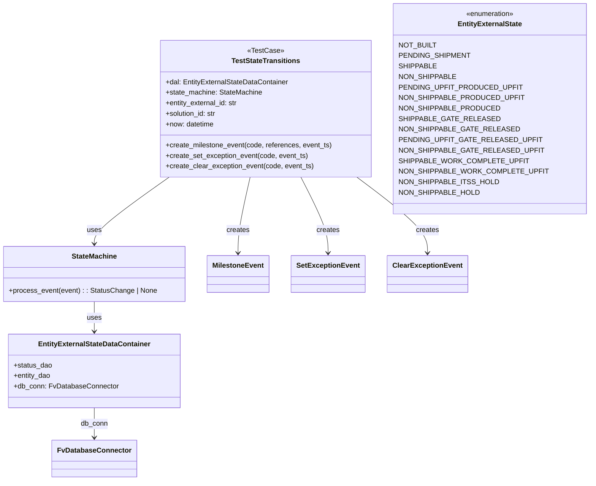
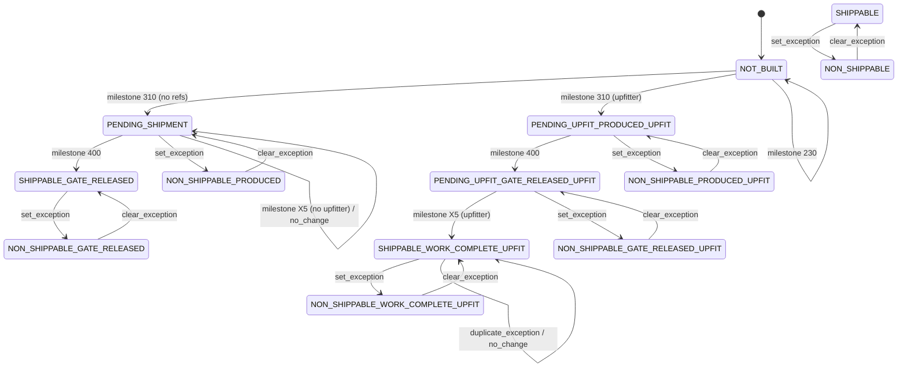

# Diagram: entity_core/entity_service/entity_service/entity/entity/external_state/tests/unit/test_entity_external_state_transition.py

> Auto-generated by Obscura crawlers

## Diagram 1

### SVG

<svg id="container" width="1289.3203125" xmlns="http://www.w3.org/2000/svg" class="classDiagram" height="1096" viewBox="0 0 1289.3203125 1096" role="graphics-document document" aria-roledescription="class"><g><defs><marker id="container_class-aggregationStart" class="marker aggregation class" refX="18" refY="7" markerWidth="190" markerHeight="240" orient="auto"><path d="M 18,7 L9,13 L1,7 L9,1 Z"></path></marker></defs><defs><marker id="container_class-aggregationEnd" class="marker aggregation class" refX="1" refY="7" markerWidth="20" markerHeight="28" orient="auto"><path d="M 18,7 L9,13 L1,7 L9,1 Z"></path></marker></defs><defs><marker id="container_class-extensionStart" class="marker extension class" refX="18" refY="7" markerWidth="190" markerHeight="240" orient="auto"><path d="M 1,7 L18,13 V 1 Z"></path></marker></defs><defs><marker id="container_class-extensionEnd" class="marker extension class" refX="1" refY="7" markerWidth="20" markerHeight="28" orient="auto"><path d="M 1,1 V 13 L18,7 Z"></path></marker></defs><defs><marker id="container_class-compositionStart" class="marker composition class" refX="18" refY="7" markerWidth="190" markerHeight="240" orient="auto"><path d="M 18,7 L9,13 L1,7 L9,1 Z"></path></marker></defs><defs><marker id="container_class-compositionEnd" class="marker composition class" refX="1" refY="7" markerWidth="20" markerHeight="28" orient="auto"><path d="M 18,7 L9,13 L1,7 L9,1 Z"></path></marker></defs><defs><marker id="container_class-dependencyStart" class="marker dependency class" refX="6" refY="7" markerWidth="190" markerHeight="240" orient="auto"><path d="M 5,7 L9,13 L1,7 L9,1 Z"></path></marker></defs><defs><marker id="container_class-dependencyEnd" class="marker dependency class" refX="13" refY="7" markerWidth="20" markerHeight="28" orient="auto"><path d="M 18,7 L9,13 L14,7 L9,1 Z"></path></marker></defs><defs><marker id="container_class-lollipopStart" class="marker lollipop class" refX="13" refY="7" markerWidth="190" markerHeight="240" orient="auto"><circle stroke="black" fill="transparent" cx="7" cy="7" r="6"></circle></marker></defs><defs><marker id="container_class-lollipopEnd" class="marker lollipop class" refX="1" refY="7" markerWidth="190" markerHeight="240" orient="auto"><circle stroke="black" fill="transparent" cx="7" cy="7" r="6"></circle></marker></defs><g class="root"><g class="clusters"></g><g class="edgePaths"><path d="M380.324,404L352.286,424.167C324.249,444.333,268.173,484.667,240.135,510C212.098,535.333,212.098,545.667,212.098,550.833L212.098,556" id="id_TestStateTransitions_StateMachine_1" class="edge-thickness-normal edge-pattern-solid relation" style=";;;" data-edge="true" data-et="edge" data-id="id_TestStateTransitions_StateMachine_1" data-points="W3sieCI6MzgwLjMyNDAzNTQyNDE4Nzc0LCJ5Ijo0MDR9LHsieCI6MjEyLjA5NzY1NjI1LCJ5Ijo1MjV9LHsieCI6MjEyLjA5NzY1NjI1LCJ5Ijo1NjJ9XQ==" marker-end="url(#container_class-dependencyEnd)"></path><path d="M212.098,688L212.098,694.167C212.098,700.333,212.098,712.667,212.098,724C212.098,735.333,212.098,745.667,212.098,750.833L212.098,756" id="id_StateMachine_EntityExternalStateDataContainer_2" class="edge-thickness-normal edge-pattern-solid relation" style=";;;" data-edge="true" data-et="edge" data-id="id_StateMachine_EntityExternalStateDataContainer_2" data-points="W3sieCI6MjEyLjA5NzY1NjI1LCJ5Ijo2ODh9LHsieCI6MjEyLjA5NzY1NjI1LCJ5Ijo3MjV9LHsieCI6MjEyLjA5NzY1NjI1LCJ5Ijo3NjJ9XQ==" marker-end="url(#container_class-dependencyEnd)"></path><path d="M561.735,404L557.149,424.167C552.563,444.333,543.391,484.667,538.805,513.5C534.219,542.333,534.219,559.667,534.219,568.333L534.219,577" id="id_TestStateTransitions_MilestoneEvent_3" class="edge-thickness-normal edge-pattern-solid relation" style=";;;" data-edge="true" data-et="edge" data-id="id_TestStateTransitions_MilestoneEvent_3" data-points="W3sieCI6NTYxLjczNTE5MjkxNTE2MjQsInkiOjQwNH0seyJ4Ijo1MzQuMjE4NzUsInkiOjUyNX0seyJ4Ijo1MzQuMjE4NzUsInkiOjU4M31d" marker-end="url(#container_class-dependencyEnd)"></path><path d="M673.249,404L683.078,424.167C692.908,444.333,712.567,484.667,722.397,513.5C732.227,542.333,732.227,559.667,732.227,568.333L732.227,577" id="id_TestStateTransitions_SetExceptionEvent_4" class="edge-thickness-normal edge-pattern-solid relation" style=";;;" data-edge="true" data-et="edge" data-id="id_TestStateTransitions_SetExceptionEvent_4" data-points="W3sieCI6NjczLjI0ODYxODAwNTQxNTIsInkiOjQwNH0seyJ4Ijo3MzIuMjI2NTYyNSwieSI6NTI1fSx7IngiOjczMi4yMjY1NjI1LCJ5Ijo1ODN9XQ==" marker-end="url(#container_class-dependencyEnd)"></path><path d="M795.278,404L820.882,424.167C846.487,444.333,897.697,484.667,923.301,513.5C948.906,542.333,948.906,559.667,948.906,568.333L948.906,577" id="id_TestStateTransitions_ClearExceptionEvent_5" class="edge-thickness-normal edge-pattern-solid relation" style=";;;" data-edge="true" data-et="edge" data-id="id_TestStateTransitions_ClearExceptionEvent_5" data-points="W3sieCI6Nzk1LjI3NzYxMTY4NzcyNTcsInkiOjQwNH0seyJ4Ijo5NDguOTA2MjUsInkiOjUyNX0seyJ4Ijo5NDguOTA2MjUsInkiOjU4M31d" marker-end="url(#container_class-dependencyEnd)"></path><path d="M212.098,930L212.098,936.167C212.098,942.333,212.098,954.667,212.098,966C212.098,977.333,212.098,987.667,212.098,992.833L212.098,998" id="id_EntityExternalStateDataContainer_FvDatabaseConnector_6" class="edge-thickness-normal edge-pattern-solid relation" style=";;;" data-edge="true" data-et="edge" data-id="id_EntityExternalStateDataContainer_FvDatabaseConnector_6" data-points="W3sieCI6MjEyLjA5NzY1NjI1LCJ5Ijo5MzB9LHsieCI6MjEyLjA5NzY1NjI1LCJ5Ijo5Njd9LHsieCI6MjEyLjA5NzY1NjI1LCJ5IjoxMDA0fV0=" marker-end="url(#container_class-dependencyEnd)"></path></g><g class="edgeLabels"><g class="edgeLabel" transform="translate(212.09765625, 525)"><g class="label" data-id="id_TestStateTransitions_StateMachine_1" transform="translate(-16.4921875, -12)"><foreignObject width="32.984375" height="24">

uses

</foreignObject></g></g><g class="edgeLabel" transform="translate(212.09765625, 725)"><g class="label" data-id="id_StateMachine_EntityExternalStateDataContainer_2" transform="translate(-16.4921875, -12)"><foreignObject width="32.984375" height="24">

uses

</foreignObject></g></g><g class="edgeLabel" transform="translate(534.21875, 525)"><g class="label" data-id="id_TestStateTransitions_MilestoneEvent_3" transform="translate(-26.171875, -12)"><foreignObject width="52.34375" height="24">

creates

</foreignObject></g></g><g class="edgeLabel" transform="translate(732.2265625, 525)"><g class="label" data-id="id_TestStateTransitions_SetExceptionEvent_4" transform="translate(-26.171875, -12)"><foreignObject width="52.34375" height="24">

creates

</foreignObject></g></g><g class="edgeLabel" transform="translate(948.90625, 525)"><g class="label" data-id="id_TestStateTransitions_ClearExceptionEvent_5" transform="translate(-26.171875, -12)"><foreignObject width="52.34375" height="24">

creates

</foreignObject></g></g><g class="edgeLabel" transform="translate(212.09765625, 967)"><g class="label" data-id="id_EntityExternalStateDataContainer_FvDatabaseConnector_6" transform="translate(-31.09375, -12)"><foreignObject width="62.1875" height="24">

db_conn

</foreignObject></g></g></g><g class="nodes"><g class="node default" id="classId-TestStateTransitions-0" transform="translate(597.2109375, 248)"><g class="basic label-container"><path d="M-239.3125 -156 L239.3125 -156 L239.3125 156 L-239.3125 156" stroke="none" stroke-width="0" fill="#ECECFF" style=""></path><path d="M-239.3125 -156 C-99.26343437274934 -156, 40.78563125450131 -156, 239.3125 -156 M-239.3125 -156 C-110.36761113895327 -156, 18.57727772209347 -156, 239.3125 -156 M239.3125 -156 C239.3125 -45.866268644836495, 239.3125 64.26746271032701, 239.3125 156 M239.3125 -156 C239.3125 -42.57953379125844, 239.3125 70.84093241748312, 239.3125 156 M239.3125 156 C121.68053368734212 156, 4.048567374684239 156, -239.3125 156 M239.3125 156 C138.48680175842895 156, 37.66110351685788 156, -239.3125 156 M-239.3125 156 C-239.3125 56.93818475940586, -239.3125 -42.123630481188286, -239.3125 -156 M-239.3125 156 C-239.3125 74.56755794029114, -239.3125 -6.864884119417724, -239.3125 -156" stroke="#9370DB" stroke-width="1.3" fill="none" stroke-dasharray="0 0" style=""></path></g><g class="annotation-group text" transform="translate(-40.2578125, -132)"><g class="label" style="" transform="translate(0,-12)"><foreignObject width="80.515625" height="24">

«TestCase»

</foreignObject></g></g><g class="label-group text" transform="translate(-75.1875, -108)"><g class="label" style="font-weight: bolder" transform="translate(0,-12)"><foreignObject width="150.375" height="24">

TestStateTransitions

</foreignObject></g></g><g class="members-group text" transform="translate(-227.3125, -60)"><g class="label" style="" transform="translate(0,-12)"><foreignObject width="281.09375" height="24">

+dal: EntityExternalStateDataContainer

</foreignObject></g><g class="label" style="" transform="translate(0,12)"><foreignObject width="220.34375" height="24">

+state_machine: StateMachine

</foreignObject></g><g class="label" style="" transform="translate(0,36)"><foreignObject width="166.75" height="24">

+entity_external_id: str

</foreignObject></g><g class="label" style="" transform="translate(0,60)"><foreignObject width="117.71875" height="24">

+solution_id: str

</foreignObject></g><g class="label" style="" transform="translate(0,84)"><foreignObject width="111.578125" height="24">

+now: datetime

</foreignObject></g></g><g class="methods-group text" transform="translate(-227.3125, 84)"><g class="label" style="" transform="translate(0,-12)"><foreignObject width="379.4375" height="24">

+create_milestone_event(code, references, event_ts)

</foreignObject></g><g class="label" style="" transform="translate(0,12)"><foreignObject width="324.75" height="24">

+create_set_exception_event(code, event_ts)

</foreignObject></g><g class="label" style="" transform="translate(0,36)"><foreignObject width="336.875" height="24">

+create_clear_exception_event(code, event_ts)

</foreignObject></g></g><g class="divider" style=""><path d="M-239.3125 -84 C-73.30271470502902 -84, 92.70707058994196 -84, 239.3125 -84 M-239.3125 -84 C-63.108589971133085 -84, 113.09532005773383 -84, 239.3125 -84" stroke="#9370DB" stroke-width="1.3" fill="none" stroke-dasharray="0 0" style=""></path></g><g class="divider" style=""><path d="M-239.3125 60 C-98.17848700540193 60, 42.95552598919613 60, 239.3125 60 M-239.3125 60 C-126.82933146457611 60, -14.346162929152229 60, 239.3125 60" stroke="#9370DB" stroke-width="1.3" fill="none" stroke-dasharray="0 0" style=""></path></g></g><g class="node default" id="classId-StateMachine-1" transform="translate(212.09765625, 625)"><g class="basic label-container"><path d="M-204.09765625 -63 L204.09765625 -63 L204.09765625 63 L-204.09765625 63" stroke="none" stroke-width="0" fill="#ECECFF" style=""></path><path d="M-204.09765625 -63 C-62.49435471402222 -63, 79.10894682195556 -63, 204.09765625 -63 M-204.09765625 -63 C-56.635058237946396 -63, 90.82753977410721 -63, 204.09765625 -63 M204.09765625 -63 C204.09765625 -16.121370021339636, 204.09765625 30.757259957320727, 204.09765625 63 M204.09765625 -63 C204.09765625 -25.068165530137108, 204.09765625 12.863668939725784, 204.09765625 63 M204.09765625 63 C56.45976733494564 63, -91.17812158010872 63, -204.09765625 63 M204.09765625 63 C117.09914963526 63, 30.10064302052001 63, -204.09765625 63 M-204.09765625 63 C-204.09765625 22.47299518180735, -204.09765625 -18.054009636385302, -204.09765625 -63 M-204.09765625 63 C-204.09765625 24.13541945011199, -204.09765625 -14.729161099776022, -204.09765625 -63" stroke="#9370DB" stroke-width="1.3" fill="none" stroke-dasharray="0 0" style=""></path></g><g class="annotation-group text" transform="translate(0, -39)"></g><g class="label-group text" transform="translate(-49.7265625, -39)"><g class="label" style="font-weight: bolder" transform="translate(0,-12)"><foreignObject width="99.453125" height="24">

StateMachine

</foreignObject></g></g><g class="members-group text" transform="translate(-192.09765625, 9)"></g><g class="methods-group text" transform="translate(-192.09765625, 39)"><g class="label" style="" transform="translate(0,-12)"><foreignObject width="334.46875" height="24">

+process_event(event) : : StatusChange | None

</foreignObject></g></g><g class="divider" style=""><path d="M-204.09765625 -15 C-54.7647984595915 -15, 94.568059330817 -15, 204.09765625 -15 M-204.09765625 -15 C-99.88041745712817 -15, 4.33682133574365 -15, 204.09765625 -15" stroke="#9370DB" stroke-width="1.3" fill="none" stroke-dasharray="0 0" style=""></path></g><g class="divider" style=""><path d="M-204.09765625 9 C-43.58333877688722 9, 116.93097869622557 9, 204.09765625 9 M-204.09765625 9 C-86.81573436613883 9, 30.466187517722346 9, 204.09765625 9" stroke="#9370DB" stroke-width="1.3" fill="none" stroke-dasharray="0 0" style=""></path></g></g><g class="node default" id="classId-EntityExternalStateDataContainer-2" transform="translate(212.09765625, 846)"><g class="basic label-container"><path d="M-191.0625 -84 L191.0625 -84 L191.0625 84 L-191.0625 84" stroke="none" stroke-width="0" fill="#ECECFF" style=""></path><path d="M-191.0625 -84 C-111.55207146188584 -84, -32.04164292377169 -84, 191.0625 -84 M-191.0625 -84 C-43.62302356342275 -84, 103.8164528731545 -84, 191.0625 -84 M191.0625 -84 C191.0625 -41.24269010972395, 191.0625 1.5146197805520956, 191.0625 84 M191.0625 -84 C191.0625 -37.5274111809656, 191.0625 8.945177638068799, 191.0625 84 M191.0625 84 C102.93167066148776 84, 14.800841322975515 84, -191.0625 84 M191.0625 84 C59.80936458871008 84, -71.44377082257984 84, -191.0625 84 M-191.0625 84 C-191.0625 28.58072917089188, -191.0625 -26.838541658216243, -191.0625 -84 M-191.0625 84 C-191.0625 47.03037602191933, -191.0625 10.060752043838662, -191.0625 -84" stroke="#9370DB" stroke-width="1.3" fill="none" stroke-dasharray="0 0" style=""></path></g><g class="annotation-group text" transform="translate(0, -60)"></g><g class="label-group text" transform="translate(-123.25, -60)"><g class="label" style="font-weight: bolder" transform="translate(0,-12)"><foreignObject width="246.5" height="24">

EntityExternalStateDataContainer

</foreignObject></g></g><g class="members-group text" transform="translate(-179.0625, -12)"><g class="label" style="" transform="translate(0,-12)"><foreignObject width="87.6875" height="24">

+status_dao

</foreignObject></g><g class="label" style="" transform="translate(0,12)"><foreignObject width="85.078125" height="24">

+entity_dao

</foreignObject></g><g class="label" style="" transform="translate(0,36)"><foreignObject width="234.875" height="24">

+db_conn: FvDatabaseConnector

</foreignObject></g></g><g class="methods-group text" transform="translate(-179.0625, 84)"></g><g class="divider" style=""><path d="M-191.0625 -36 C-51.29624638338501 -36, 88.47000723322998 -36, 191.0625 -36 M-191.0625 -36 C-90.14990508095947 -36, 10.762689838081059 -36, 191.0625 -36" stroke="#9370DB" stroke-width="1.3" fill="none" stroke-dasharray="0 0" style=""></path></g><g class="divider" style=""><path d="M-191.0625 60 C-53.404876965134775 60, 84.25274606973045 60, 191.0625 60 M-191.0625 60 C-63.80154096811711 60, 63.45941806376578 60, 191.0625 60" stroke="#9370DB" stroke-width="1.3" fill="none" stroke-dasharray="0 0" style=""></path></g></g><g class="node default" id="classId-MilestoneEvent-3" transform="translate(534.21875, 625)"><g class="basic label-container"><path d="M-68.0234375 -42 L68.0234375 -42 L68.0234375 42 L-68.0234375 42" stroke="none" stroke-width="0" fill="#ECECFF" style=""></path><path d="M-68.0234375 -42 C-22.2292595430767 -42, 23.5649184138466 -42, 68.0234375 -42 M-68.0234375 -42 C-14.491378263210983 -42, 39.040680973578034 -42, 68.0234375 -42 M68.0234375 -42 C68.0234375 -20.2657532340834, 68.0234375 1.4684935318331966, 68.0234375 42 M68.0234375 -42 C68.0234375 -11.01894958805174, 68.0234375 19.96210082389652, 68.0234375 42 M68.0234375 42 C17.81300869104851 42, -32.39742011790298 42, -68.0234375 42 M68.0234375 42 C31.872111974498765 42, -4.279213551002471 42, -68.0234375 42 M-68.0234375 42 C-68.0234375 13.92593583469258, -68.0234375 -14.148128330614838, -68.0234375 -42 M-68.0234375 42 C-68.0234375 24.56141019026461, -68.0234375 7.12282038052922, -68.0234375 -42" stroke="#9370DB" stroke-width="1.3" fill="none" stroke-dasharray="0 0" style=""></path></g><g class="annotation-group text" transform="translate(0, -18)"></g><g class="label-group text" transform="translate(-56.0234375, -18)"><g class="label" style="font-weight: bolder" transform="translate(0,-12)"><foreignObject width="112.046875" height="24">

MilestoneEvent

</foreignObject></g></g><g class="members-group text" transform="translate(-56.0234375, 30)"></g><g class="methods-group text" transform="translate(-56.0234375, 60)"></g><g class="divider" style=""><path d="M-68.0234375 6 C-15.382386565872984 6, 37.25866436825403 6, 68.0234375 6 M-68.0234375 6 C-18.328011872321078 6, 31.367413755357845 6, 68.0234375 6" stroke="#9370DB" stroke-width="1.3" fill="none" stroke-dasharray="0 0" style=""></path></g><g class="divider" style=""><path d="M-68.0234375 24 C-29.98462379176388 24, 8.05418991647224 24, 68.0234375 24 M-68.0234375 24 C-22.73024934656295 24, 22.5629388068741 24, 68.0234375 24" stroke="#9370DB" stroke-width="1.3" fill="none" stroke-dasharray="0 0" style=""></path></g></g><g class="node default" id="classId-SetExceptionEvent-4" transform="translate(732.2265625, 625)"><g class="basic label-container"><path d="M-79.984375 -42 L79.984375 -42 L79.984375 42 L-79.984375 42" stroke="none" stroke-width="0" fill="#ECECFF" style=""></path><path d="M-79.984375 -42 C-37.17116753203706 -42, 5.6420399359258795 -42, 79.984375 -42 M-79.984375 -42 C-33.90412747771151 -42, 12.176120044576976 -42, 79.984375 -42 M79.984375 -42 C79.984375 -21.77884253637168, 79.984375 -1.5576850727433609, 79.984375 42 M79.984375 -42 C79.984375 -15.180862630861384, 79.984375 11.638274738277232, 79.984375 42 M79.984375 42 C39.6948682258045 42, -0.5946385483910035 42, -79.984375 42 M79.984375 42 C47.96866968614306 42, 15.952964372286118 42, -79.984375 42 M-79.984375 42 C-79.984375 13.612163152990998, -79.984375 -14.775673694018003, -79.984375 -42 M-79.984375 42 C-79.984375 13.271107403756254, -79.984375 -15.457785192487492, -79.984375 -42" stroke="#9370DB" stroke-width="1.3" fill="none" stroke-dasharray="0 0" style=""></path></g><g class="annotation-group text" transform="translate(0, -18)"></g><g class="label-group text" transform="translate(-67.984375, -18)"><g class="label" style="font-weight: bolder" transform="translate(0,-12)"><foreignObject width="135.96875" height="24">

SetExceptionEvent

</foreignObject></g></g><g class="members-group text" transform="translate(-67.984375, 30)"></g><g class="methods-group text" transform="translate(-67.984375, 60)"></g><g class="divider" style=""><path d="M-79.984375 6 C-46.22317343776633 6, -12.461971875532655 6, 79.984375 6 M-79.984375 6 C-39.45415849699628 6, 1.0760580060074432 6, 79.984375 6" stroke="#9370DB" stroke-width="1.3" fill="none" stroke-dasharray="0 0" style=""></path></g><g class="divider" style=""><path d="M-79.984375 24 C-40.143212693754805 24, -0.30205038750960966 24, 79.984375 24 M-79.984375 24 C-37.03003922426544 24, 5.924296551469126 24, 79.984375 24" stroke="#9370DB" stroke-width="1.3" fill="none" stroke-dasharray="0 0" style=""></path></g></g><g class="node default" id="classId-ClearExceptionEvent-5" transform="translate(948.90625, 625)"><g class="basic label-container"><path d="M-86.6953125 -42 L86.6953125 -42 L86.6953125 42 L-86.6953125 42" stroke="none" stroke-width="0" fill="#ECECFF" style=""></path><path d="M-86.6953125 -42 C-30.14086799512662 -42, 26.41357650974676 -42, 86.6953125 -42 M-86.6953125 -42 C-36.25315276363991 -42, 14.189006972720179 -42, 86.6953125 -42 M86.6953125 -42 C86.6953125 -10.053959684829088, 86.6953125 21.892080630341823, 86.6953125 42 M86.6953125 -42 C86.6953125 -21.279304467920372, 86.6953125 -0.5586089358407449, 86.6953125 42 M86.6953125 42 C18.028502055949488 42, -50.638308388101024 42, -86.6953125 42 M86.6953125 42 C38.85410373134612 42, -8.987105037307757 42, -86.6953125 42 M-86.6953125 42 C-86.6953125 24.042643647392822, -86.6953125 6.085287294785644, -86.6953125 -42 M-86.6953125 42 C-86.6953125 15.610012572048156, -86.6953125 -10.779974855903689, -86.6953125 -42" stroke="#9370DB" stroke-width="1.3" fill="none" stroke-dasharray="0 0" style=""></path></g><g class="annotation-group text" transform="translate(0, -18)"></g><g class="label-group text" transform="translate(-74.6953125, -18)"><g class="label" style="font-weight: bolder" transform="translate(0,-12)"><foreignObject width="149.390625" height="24">

ClearExceptionEvent

</foreignObject></g></g><g class="members-group text" transform="translate(-74.6953125, 30)"></g><g class="methods-group text" transform="translate(-74.6953125, 60)"></g><g class="divider" style=""><path d="M-86.6953125 6 C-50.0636404116053 6, -13.431968323210597 6, 86.6953125 6 M-86.6953125 6 C-50.45902614382992 6, -14.222739787659833 6, 86.6953125 6" stroke="#9370DB" stroke-width="1.3" fill="none" stroke-dasharray="0 0" style=""></path></g><g class="divider" style=""><path d="M-86.6953125 24 C-47.98435084884491 24, -9.273389197689824 24, 86.6953125 24 M-86.6953125 24 C-43.21997625827737 24, 0.2553599834452598 24, 86.6953125 24" stroke="#9370DB" stroke-width="1.3" fill="none" stroke-dasharray="0 0" style=""></path></g></g><g class="node default" id="classId-FvDatabaseConnector-6" transform="translate(212.09765625, 1046)"><g class="basic label-container"><path d="M-91.3046875 -42 L91.3046875 -42 L91.3046875 42 L-91.3046875 42" stroke="none" stroke-width="0" fill="#ECECFF" style=""></path><path d="M-91.3046875 -42 C-19.263126860916245 -42, 52.77843377816751 -42, 91.3046875 -42 M-91.3046875 -42 C-35.56075586381455 -42, 20.1831757723709 -42, 91.3046875 -42 M91.3046875 -42 C91.3046875 -19.645073608322246, 91.3046875 2.709852783355508, 91.3046875 42 M91.3046875 -42 C91.3046875 -22.59468128355161, 91.3046875 -3.189362567103217, 91.3046875 42 M91.3046875 42 C19.29965033247352 42, -52.70538683505296 42, -91.3046875 42 M91.3046875 42 C52.83464036308956 42, 14.364593226179124 42, -91.3046875 42 M-91.3046875 42 C-91.3046875 21.953222201444376, -91.3046875 1.9064444028887522, -91.3046875 -42 M-91.3046875 42 C-91.3046875 22.880841834339588, -91.3046875 3.7616836686791757, -91.3046875 -42" stroke="#9370DB" stroke-width="1.3" fill="none" stroke-dasharray="0 0" style=""></path></g><g class="annotation-group text" transform="translate(0, -18)"></g><g class="label-group text" transform="translate(-79.3046875, -18)"><g class="label" style="font-weight: bolder" transform="translate(0,-12)"><foreignObject width="158.609375" height="24">

FvDatabaseConnector

</foreignObject></g></g><g class="members-group text" transform="translate(-79.3046875, 30)"></g><g class="methods-group text" transform="translate(-79.3046875, 60)"></g><g class="divider" style=""><path d="M-91.3046875 6 C-31.33221708233617 6, 28.640253335327657 6, 91.3046875 6 M-91.3046875 6 C-47.88954995656085 6, -4.474412413121698 6, 91.3046875 6" stroke="#9370DB" stroke-width="1.3" fill="none" stroke-dasharray="0 0" style=""></path></g><g class="divider" style=""><path d="M-91.3046875 24 C-47.02229058451195 24, -2.7398936690238997 24, 91.3046875 24 M-91.3046875 24 C-22.970003929989034 24, 45.36467964002193 24, 91.3046875 24" stroke="#9370DB" stroke-width="1.3" fill="none" stroke-dasharray="0 0" style=""></path></g></g><g class="node default" id="classId-EntityExternalState-7" transform="translate(1083.921875, 248)"><g class="basic label-container"><path d="M-197.3984375 -240 L197.3984375 -240 L197.3984375 240 L-197.3984375 240" stroke="none" stroke-width="0" fill="#ECECFF" style=""></path><path d="M-197.3984375 -240 C-48.48889920922531 -240, 100.42063908154938 -240, 197.3984375 -240 M-197.3984375 -240 C-63.460662573719105 -240, 70.47711235256179 -240, 197.3984375 -240 M197.3984375 -240 C197.3984375 -76.41981419445497, 197.3984375 87.16037161109006, 197.3984375 240 M197.3984375 -240 C197.3984375 -142.03417825643595, 197.3984375 -44.0683565128719, 197.3984375 240 M197.3984375 240 C113.80644102113135 240, 30.214444542262697 240, -197.3984375 240 M197.3984375 240 C44.48359345100772 240, -108.43125059798456 240, -197.3984375 240 M-197.3984375 240 C-197.3984375 124.99285653620183, -197.3984375 9.985713072403655, -197.3984375 -240 M-197.3984375 240 C-197.3984375 120.03330676444386, -197.3984375 0.06661352888772853, -197.3984375 -240" stroke="#9370DB" stroke-width="1.3" fill="none" stroke-dasharray="0 0" style=""></path></g><g class="annotation-group text" transform="translate(-55.5546875, -216)"><g class="label" style="" transform="translate(0,-12)"><foreignObject width="111.109375" height="24">

«enumeration»

</foreignObject></g></g><g class="label-group text" transform="translate(-70.765625, -192)"><g class="label" style="font-weight: bolder" transform="translate(0,-12)"><foreignObject width="141.53125" height="24">

EntityExternalState

</foreignObject></g></g><g class="members-group text" transform="translate(-185.3984375, -144)"><g class="label" style="" transform="translate(0,-12)"><foreignObject width="77.1875" height="24">

NOT_BUILT

</foreignObject></g><g class="label" style="" transform="translate(0,12)"><foreignObject width="146.1875" height="24">

PENDING_SHIPMENT

</foreignObject></g><g class="label" style="" transform="translate(0,36)"><foreignObject width="77.390625" height="24">

SHIPPABLE

</foreignObject></g><g class="label" style="" transform="translate(0,60)"><foreignObject width="118.3125" height="24">

NON_SHIPPABLE

</foreignObject></g><g class="label" style="" transform="translate(0,84)"><foreignObject width="247.5" height="24">

PENDING_UPFIT_PRODUCED_UPFIT

</foreignObject></g><g class="label" style="" transform="translate(0,108)"><foreignObject width="253.1875" height="24">

NON_SHIPPABLE_PRODUCED_UPFIT

</foreignObject></g><g class="label" style="" transform="translate(0,132)"><foreignObject width="205.25" height="24">

NON_SHIPPABLE_PRODUCED

</foreignObject></g><g class="label" style="" transform="translate(0,156)"><foreignObject width="200.203125" height="24">

SHIPPABLE_GATE_RELEASED

</foreignObject></g><g class="label" style="" transform="translate(0,180)"><foreignObject width="241.125" height="24">

NON_SHIPPABLE_GATE_RELEASED

</foreignObject></g><g class="label" style="" transform="translate(0,204)"><foreignObject width="283.375" height="24">

PENDING_UPFIT_GATE_RELEASED_UPFIT

</foreignObject></g><g class="label" style="" transform="translate(0,228)"><foreignObject width="289.0625" height="24">

NON_SHIPPABLE_GATE_RELEASED_UPFIT

</foreignObject></g><g class="label" style="" transform="translate(0,252)"><foreignObject width="259.09375" height="24">

SHIPPABLE_WORK_COMPLETE_UPFIT

</foreignObject></g><g class="label" style="" transform="translate(0,276)"><foreignObject width="300.03125" height="24">

NON_SHIPPABLE_WORK_COMPLETE_UPFIT

</foreignObject></g><g class="label" style="" transform="translate(0,300)"><foreignObject width="204.609375" height="24">

NON_SHIPPABLE_ITSS_HOLD

</foreignObject></g><g class="label" style="" transform="translate(0,324)"><foreignObject width="166.859375" height="24">

NON_SHIPPABLE_HOLD

</foreignObject></g></g><g class="methods-group text" transform="translate(-185.3984375, 240)"></g><g class="divider" style=""><path d="M-197.3984375 -168 C-90.01826499880401 -168, 17.361907502391972 -168, 197.3984375 -168 M-197.3984375 -168 C-83.86453044505328 -168, 29.669376609893447 -168, 197.3984375 -168" stroke="#9370DB" stroke-width="1.3" fill="none" stroke-dasharray="0 0" style=""></path></g><g class="divider" style=""><path d="M-197.3984375 216 C-59.783023042773124 216, 77.83239141445375 216, 197.3984375 216 M-197.3984375 216 C-46.931778898840406 216, 103.53487970231919 216, 197.3984375 216" stroke="#9370DB" stroke-width="1.3" fill="none" stroke-dasharray="0 0" style=""></path></g></g></g></g></g></svg>

## Diagram 2

### SVG

<svg id="container" width="1698.219482421875" xmlns="http://www.w3.org/2000/svg" class="statediagram" height="748.1499633789062" viewBox="0 0 1698.219482421875 748.1499633789062" role="graphics-document document" aria-roledescription="stateDiagram"><g><defs><marker id="container_stateDiagram-barbEnd" refX="19" refY="7" markerWidth="20" markerHeight="14" markerUnits="userSpaceOnUse" orient="auto"><path d="M 19,7 L9,13 L14,7 L9,1 Z"></path></marker></defs><g class="root"><g class="clusters"></g><g class="edgePaths"><path d="M1425.743,35L1425.743,43.333C1425.743,51.667,1425.743,68.333,1425.826,82.917C1425.91,97.5,1426.076,110,1426.16,116.25L1426.243,122.5" id="edge0" class="edge-thickness-normal edge-pattern-solid transition" style="fill:none;;;fill:none" data-edge="true" data-et="edge" data-id="edge0" data-points="W3sieCI6MTQyNS43NDI5Njg3NTExMTc2LCJ5IjozNX0seyJ4IjoxNDI1Ljc0Mjk2ODc1MTExNzYsInkiOjg1fSx7IngiOjE0MjYuMjQyOTY4NzUxMTE3NiwieSI6MTIyLjV9XQ==" marker-end="url(#container_stateDiagram-barbEnd)"></path><path d="M1379.649,144.838L1198.013,153.865C1016.378,162.892,653.106,180.946,471.554,196.223C290.001,211.5,290.168,224,290.251,230.25L290.334,236.5" id="edge1" class="edge-thickness-normal edge-pattern-solid transition" style="fill:none;;;fill:none" data-edge="true" data-et="edge" data-id="edge1" data-points="W3sieCI6MTM3OS42NDkyMTg3NTExMTc2LCJ5IjoxNDQuODM4MDc4NzU0NDA4MTR9LHsieCI6Mjg5LjgzNDM3NDk5OTYyNzQ3LCJ5IjoxOTl9LHsieCI6MjkwLjMzNDM3NDk5OTYyNzQ3LCJ5IjoyMzYuNX1d" marker-end="url(#container_stateDiagram-barbEnd)"></path><path d="M1379.649,151.473L1337.999,159.394C1296.348,167.315,1213.047,183.158,1171.479,197.329C1129.912,211.5,1130.079,224,1130.162,230.25L1130.245,236.5" id="edge2" class="edge-thickness-normal edge-pattern-solid transition" style="fill:none;;;fill:none" data-edge="true" data-et="edge" data-id="edge2" data-points="W3sieCI6MTM3OS42NDkyMTg3NTExMTc2LCJ5IjoxNTEuNDcyNTE2MTQ2Mzg5Nzh9LHsieCI6MTEyOS43NDUzMTI1MDA3NDUsInkiOjE5OX0seyJ4IjoxMTMwLjI0NTMxMjUwMDc0NSwieSI6MjM2LjV9XQ==" marker-end="url(#container_stateDiagram-barbEnd)"></path><path d="M1448.492,162.5L1455.269,168.583C1462.046,174.667,1475.599,186.833,1482.376,202.408C1489.153,217.983,1489.153,236.967,1489.153,246.458L1489.153,255.95" id="NOT_BUILT-cyclic-special-1" class="edge-thickness-normal edge-pattern-solid transition" style="fill:none;;;fill:none" data-edge="true" data-et="edge" data-id="NOT_BUILT-cyclic-special-1" data-points="W3sieCI6MTQ0OC40OTIxNDYzODI2OTY1LCJ5IjoxNjIuNX0seyJ4IjoxNDg5LjE1MzEyNTAwMTExNzYsInkiOjE5OX0seyJ4IjoxNDg5LjE1MzEyNTAwMTExNzYsInkiOjI1NS45NDk5OTk5OTkyNTQ5NH1d"></path><path d="M1489.153,256.05L1489.153,265.542C1489.153,275.033,1489.153,294.017,1495.023,313C1500.893,331.983,1512.633,350.967,1518.502,360.458L1524.372,369.95" id="NOT_BUILT-cyclic-special-mid" class="edge-thickness-normal edge-pattern-solid transition" style="fill:none;;;fill:none" data-edge="true" data-et="edge" data-id="NOT_BUILT-cyclic-special-mid" data-points="W3sieCI6MTQ4OS4xNTMxMjUwMDExMTc2LCJ5IjoyNTYuMDUwMDAwMDAwNzQ1MDZ9LHsieCI6MTQ4OS4xNTMxMjUwMDExMTc2LCJ5IjozMTN9LHsieCI6MTUyNC4zNzIyMDM5NDgwMjUzLCJ5IjozNjkuOTQ5OTk5OTk5MjU0OTR9XQ=="></path><path d="M1524.434,369.95L1530.304,360.458C1536.174,350.967,1547.913,331.983,1553.783,312.992C1559.653,294,1559.653,275,1559.653,256C1559.653,237,1559.653,218,1544.853,202.248C1530.052,186.496,1500.451,173.991,1485.65,167.739L1470.85,161.487" id="NOT_BUILT-cyclic-special-2" class="edge-thickness-normal edge-pattern-solid transition" style="fill:none;;;fill:none" data-edge="true" data-et="edge" data-id="NOT_BUILT-cyclic-special-2" data-points="W3sieCI6MTUyNC40MzQwNDYwNTQyMDk4LCJ5IjozNjkuOTQ5OTk5OTk5MjU0OTR9LHsieCI6MTU1OS42NTMxMjUwMDExMTc2LCJ5IjozMTN9LHsieCI6MTU1OS42NTMxMjUwMDExMTc2LCJ5IjoyNTZ9LHsieCI6MTU1OS42NTMxMjUwMDExMTc2LCJ5IjoxOTl9LHsieCI6MTQ3MC44NDk2NDQ2ODI4ODY3LCJ5IjoxNjEuNDg3MjEyMDE4MjEzNDh9XQ==" marker-end="url(#container_stateDiagram-barbEnd)"></path><path d="M236.555,276.5L219.889,282.583C203.224,288.667,169.893,300.833,153.311,313.167C136.729,325.5,136.896,338,136.979,344.25L137.063,350.5" id="edge4" class="edge-thickness-normal edge-pattern-solid transition" style="fill:none;;;fill:none" data-edge="true" data-et="edge" data-id="edge4" data-points="W3sieCI6MjM2LjU1NDc2OTczNjYwMDMyLCJ5IjoyNzYuNX0seyJ4IjoxMzYuNTYyNSwieSI6MzEzfSx7IngiOjEzNy4wNjI1LCJ5IjozNTAuNX1d" marker-end="url(#container_stateDiagram-barbEnd)"></path><path d="M1072.198,276.5L1054.216,282.583C1036.235,288.667,1000.272,300.833,982.374,313.167C964.476,325.5,964.643,338,964.726,344.25L964.809,350.5" id="edge5" class="edge-thickness-normal edge-pattern-solid transition" style="fill:none;;;fill:none" data-edge="true" data-et="edge" data-id="edge5" data-points="W3sieCI6MTA3Mi4xOTc2MTUxMzI0NTQ4LCJ5IjoyNzYuNX0seyJ4Ijo5NjQuMzA5Mzc1MDAxMTE3NiwieSI6MzEzfSx7IngiOjk2NC44MDkzNzUwMDExMTc2LCJ5IjozNTAuNX1d" marker-end="url(#container_stateDiagram-barbEnd)"></path><path d="M930.743,390.5L916.75,398.583C902.756,406.667,874.769,422.833,860.859,439.167C846.949,455.5,847.115,472,847.199,480.25L847.282,488.5" id="edge6" class="edge-thickness-normal edge-pattern-solid transition" style="fill:none;;;fill:none" data-edge="true" data-et="edge" data-id="edge6" data-points="W3sieCI6OTMwLjc0MzQ3ODI2MTk4NzEsInkiOjM5MC41fSx7IngiOjg0Ni43ODIwMzEyNTExMTc2LCJ5Ijo0Mzl9LHsieCI6ODQ3LjI4MjAzMTI1MTExNzYsInkiOjQ4OC41fV0=" marker-end="url(#container_stateDiagram-barbEnd)"></path><path d="M784.998,528.5L765.71,534.583C746.423,540.667,707.848,552.833,696.593,565.167C685.338,577.5,701.403,590,709.435,596.25L717.468,602.5" id="edge7" class="edge-thickness-normal edge-pattern-solid transition" style="fill:none;;;fill:none" data-edge="true" data-et="edge" data-id="edge7" data-points="W3sieCI6Nzg0Ljk5ODA0MDAyMjkxNjYsInkiOjUyOC41fSx7IngiOjY2OS4yNzI2NTYyNTA3NDUxLCJ5Ijo1NjV9LHsieCI6NzE3LjQ2Nzk2ODc1MDc0NTEsInkiOjYwMi41fV0=" marker-end="url(#container_stateDiagram-barbEnd)"></path><path d="M793.188,602.5L808.503,596.25C823.817,590,854.446,577.5,865.701,565.167C876.956,552.833,868.837,540.667,864.778,534.583L860.718,528.5" id="edge8" class="edge-thickness-normal edge-pattern-solid transition" style="fill:none;;;fill:none" data-edge="true" data-et="edge" data-id="edge8" data-points="W3sieCI6NzkzLjE4ODA4OTM2NDkxMSwieSI6NjAyLjV9LHsieCI6ODg1LjA3NTAwMDAwMTExNzYsInkiOjU2NX0seyJ4Ijo4NjAuNzE4MTYwNjM3MDgyNSwieSI6NTI4LjV9XQ==" marker-end="url(#container_stateDiagram-barbEnd)"></path><path d="M305.046,276.5L309.498,282.583C313.951,288.667,322.856,300.833,335.347,313.167C347.838,325.5,363.914,338,371.952,344.25L379.99,350.5" id="edge9" class="edge-thickness-normal edge-pattern-solid transition" style="fill:none;;;fill:none" data-edge="true" data-et="edge" data-id="edge9" data-points="W3sieCI6MzA1LjA0NTcyMzY4Mzk2ODcsInkiOjI3Ni41fSx7IngiOjMzMS43NjE3MTg3NSwieSI6MzEzfSx7IngiOjM3OS45ODk5OTQ1MTc1NDM4MywieSI6MzUwLjV9XQ==" marker-end="url(#container_stateDiagram-barbEnd)"></path><path d="M447.414,350.5L460.165,344.25C472.916,338,498.418,325.5,485.374,313.032C472.33,300.564,420.741,288.128,394.947,281.91L369.152,275.692" id="edge10" class="edge-thickness-normal edge-pattern-solid transition" style="fill:none;;;fill:none" data-edge="true" data-et="edge" data-id="edge10" data-points="W3sieCI6NDQ3LjQxMzc4ODM3NzMyMzU2LCJ5IjozNTAuNX0seyJ4Ijo1MjMuOTE5NTMxMjUwMzcyNSwieSI6MzEzfSx7IngiOjM2OS4xNTIxNTA0MzAwNDAzNiwieSI6Mjc1LjY5MjIxNzM2MDA4NDA0fV0=" marker-end="url(#container_stateDiagram-barbEnd)"></path><path d="M1152.189,276.5L1158.872,282.583C1165.555,288.667,1178.92,300.833,1197.187,313.167C1215.454,325.5,1238.622,338,1250.207,344.25L1261.791,350.5" id="edge11" class="edge-thickness-normal edge-pattern-solid transition" style="fill:none;;;fill:none" data-edge="true" data-et="edge" data-id="edge11" data-points="W3sieCI6MTE1Mi4xODkzOTE0NDgyNDQxLCJ5IjoyNzYuNX0seyJ4IjoxMTkyLjI4NTkzNzUwMTExNzYsInkiOjMxM30seyJ4IjoxMjYxLjc5MDczNDY1MDI0MDQsInkiOjM1MC41fV0=" marker-end="url(#container_stateDiagram-barbEnd)"></path><path d="M1321.363,350.5L1328.147,344.25C1334.931,338,1348.499,325.5,1330.232,313.167C1311.965,300.833,1261.864,288.667,1236.813,282.583L1211.762,276.5" id="edge12" class="edge-thickness-normal edge-pattern-solid transition" style="fill:none;;;fill:none" data-edge="true" data-et="edge" data-id="edge12" data-points="W3sieCI6MTMyMS4zNjMxMDMwNzEyOTMyLCJ5IjozNTAuNX0seyJ4IjoxMzYyLjA2NzE4NzUwMTExNzYsInkiOjMxM30seyJ4IjoxMjExLjc2MTc1OTg2OTI5NjYsInkiOjI3Ni41fV0=" marker-end="url(#container_stateDiagram-barbEnd)"></path><path d="M118.663,390.5L111.067,398.583C103.471,406.667,88.278,422.833,88.278,439.167C88.278,455.5,103.471,472,111.067,480.25L118.663,488.5" id="edge13" class="edge-thickness-normal edge-pattern-solid transition" style="fill:none;;;fill:none" data-edge="true" data-et="edge" data-id="edge13" data-points="W3sieCI6MTE4LjY2MzQ5NjM3NjgxMTYsInkiOjM5MC41fSx7IngiOjczLjA4NTkzNzUsInkiOjQzOX0seyJ4IjoxMTguNjYzNDk2Mzc2ODExNiwieSI6NDg4LjV9XQ==" marker-end="url(#container_stateDiagram-barbEnd)"></path><path d="M173.702,488.5L188.58,480.25C203.458,472,233.214,455.5,233.214,439.167C233.214,422.833,203.458,406.667,188.58,398.583L173.702,390.5" id="edge14" class="edge-thickness-normal edge-pattern-solid transition" style="fill:none;;;fill:none" data-edge="true" data-et="edge" data-id="edge14" data-points="W3sieCI6MTczLjcwMjQ0NTY1MjI4MTk0LCJ5Ijo0ODguNX0seyJ4IjoyNjIuOTcwMzEyNTAwMzcyNTMsInkiOjQzOX0seyJ4IjoxNzMuNzAyNDQ1NjUyMjgxOSwieSI6MzkwLjV9XQ==" marker-end="url(#container_stateDiagram-barbEnd)"></path><path d="M1001.948,390.5L1017.03,398.583C1032.112,406.667,1062.275,422.833,1088.615,439.167C1114.956,455.5,1137.474,472,1148.733,480.25L1159.991,488.5" id="edge15" class="edge-thickness-normal edge-pattern-solid transition" style="fill:none;;;fill:none" data-edge="true" data-et="edge" data-id="edge15" data-points="W3sieCI6MTAwMS45NDgxODg0MDY5MTQ3LCJ5IjozOTAuNX0seyJ4IjoxMDkyLjQzODI4MTI1MTExNzYsInkiOjQzOX0seyJ4IjoxMTU5Ljk5MTQ5NjgzMDgyNzYsInkiOjQ4OC41fV0=" marker-end="url(#container_stateDiagram-barbEnd)"></path><path d="M1205.759,488.5L1213.189,480.25C1220.618,472,1235.478,455.5,1209.137,439.167C1182.796,422.833,1115.256,406.667,1081.486,398.583L1047.716,390.5" id="edge16" class="edge-thickness-normal edge-pattern-solid transition" style="fill:none;;;fill:none" data-edge="true" data-et="edge" data-id="edge16" data-points="W3sieCI6MTIwNS43NTkxNTk4NzQzMDU5LCJ5Ijo0ODguNX0seyJ4IjoxMjUwLjMzNjcxODc1MTExNzYsInkiOjQzOX0seyJ4IjoxMDQ3LjcxNTg1MTQ1MDM5MjgsInkiOjM5MC41fV0=" marker-end="url(#container_stateDiagram-barbEnd)"></path><path d="M1579.911,48.099L1565.944,54.249C1551.978,60.399,1524.044,72.7,1523.895,85.1C1523.746,97.5,1551.382,110,1565.2,116.25L1579.018,122.5" id="edge17" class="edge-thickness-normal edge-pattern-solid transition" style="fill:none;;;fill:none" data-edge="true" data-et="edge" data-id="edge17" data-points="W3sieCI6MTU3OS45MTEyODI5NDc3NDkyLCJ5Ijo0OC4wOTkwNzU2NjkwMDc2OX0seyJ4IjoxNDk2LjExMDE1NjI1MTExNzYsInkiOjg1fSx7IngiOjE1NzkuMDE4MzI1MTEwNzY2NywieSI6MTIyLjV9XQ==" marker-end="url(#container_stateDiagram-barbEnd)"></path><path d="M1623.563,122.5L1623.48,116.25C1623.397,110,1623.23,97.5,1623.23,85.167C1623.23,72.833,1623.397,60.667,1623.48,54.583L1623.563,48.5" id="edge18" class="edge-thickness-normal edge-pattern-solid transition" style="fill:none;;;fill:none" data-edge="true" data-et="edge" data-id="edge18" data-points="W3sieCI6MTYyMy41NjMyODEyNTExMTc2LCJ5IjoxMjIuNX0seyJ4IjoxNjIzLjA2MzI4MTI1MTExNzYsInkiOjg1fSx7IngiOjE2MjMuNTYzMjgxMjUxMTE3NiwieSI6NDguNX1d" marker-end="url(#container_stateDiagram-barbEnd)"></path><path d="M833.846,528.5L829.62,534.583C825.394,540.667,816.941,552.833,836.428,568.413C855.914,583.993,903.34,602.987,927.052,612.483L950.765,621.98" id="SHIPPABLE_WORK_COMPLETE_UPFIT-cyclic-special-1" class="edge-thickness-normal edge-pattern-solid transition" style="fill:none;;;fill:none" data-edge="true" data-et="edge" data-id="SHIPPABLE_WORK_COMPLETE_UPFIT-cyclic-special-1" data-points="W3sieCI6ODMzLjg0NTkwMTg2NTE1MjgsInkiOjUyOC41fSx7IngiOjgwOC40ODkwNjI1MDExMTc2LCJ5Ijo1NjV9LHsieCI6OTUwLjc2NDg0Mzc1MDc0NTEsInkiOjYyMS45Nzk5NzU1MTgwMTYzfV0="></path><path d="M950.815,622.05L950.815,633.542C950.815,645.033,950.815,668.017,960.807,687.677C970.798,707.336,990.782,723.673,1000.773,731.841L1010.765,740.009" id="SHIPPABLE_WORK_COMPLETE_UPFIT-cyclic-special-mid" class="edge-thickness-normal edge-pattern-solid transition" style="fill:none;;;fill:none" data-edge="true" data-et="edge" data-id="SHIPPABLE_WORK_COMPLETE_UPFIT-cyclic-special-mid" data-points="W3sieCI6OTUwLjgxNDg0Mzc1MTQ5MDEsInkiOjYyMi4wNTAwMDAwMDA3NDUxfSx7IngiOjk1MC44MTQ4NDM3NTE0OTAxLCJ5Ijo2OTF9LHsieCI6MTAxMC43NjQ4NDM3NTA3NDUxLCJ5Ijo3NDAuMDA5MTI1MDAwMTM1M31d"></path><path d="M1010.865,740.018L1023.621,731.848C1036.377,723.679,1061.889,707.339,1074.645,687.67C1087.401,668,1087.401,645,1087.401,624C1087.401,603,1087.401,584,1061.452,568.417C1035.504,552.833,983.607,540.667,957.658,534.583L931.71,528.5" id="SHIPPABLE_WORK_COMPLETE_UPFIT-cyclic-special-2" class="edge-thickness-normal edge-pattern-solid transition" style="fill:none;;;fill:none" data-edge="true" data-et="edge" data-id="SHIPPABLE_WORK_COMPLETE_UPFIT-cyclic-special-2" data-points="W3sieCI6MTAxMC44NjQ4NDM3NTIyMzUyLCJ5Ijo3NDAuMDE3OTc3MTUwMTE5NX0seyJ4IjoxMDg3LjQwMDc4MTI1MTQ5MDEsInkiOjY5MX0seyJ4IjoxMDg3LjQwMDc4MTI1MTQ5MDEsInkiOjYyMn0seyJ4IjoxMDg3LjQwMDc4MTI1MTQ5MDEsInkiOjU2NX0seyJ4Ijo5MzEuNzA5NjYyODMwMTk1NywieSI6NTI4LjV9XQ==" marker-end="url(#container_stateDiagram-barbEnd)"></path><path d="M345.579,276.5L362.53,282.583C379.481,288.667,413.382,300.833,450.104,316.413C486.827,331.992,526.37,350.984,546.142,360.48L565.914,369.976" id="PENDING_SHIPMENT-cyclic-special-1" class="edge-thickness-normal edge-pattern-solid transition" style="fill:none;;;fill:none" data-edge="true" data-et="edge" data-id="PENDING_SHIPMENT-cyclic-special-1" data-points="W3sieCI6MzQ1LjU3OTQ0MDc4OTM2MjYsInkiOjI3Ni41fSx7IngiOjQ0Ny4yODI4MTI1MDAzNzI1MywieSI6MzEzfSx7IngiOjU2NS45MTQwNjI1LCJ5IjozNjkuOTc1OTg2MDk2ODU2NDV9XQ=="></path><path d="M565.964,370.05L565.964,381.542C565.964,393.033,565.964,416.017,575.957,439C585.95,461.983,605.935,484.967,615.928,496.458L625.921,507.95" id="PENDING_SHIPMENT-cyclic-special-mid" class="edge-thickness-normal edge-pattern-solid transition" style="fill:none;;;fill:none" data-edge="true" data-et="edge" data-id="PENDING_SHIPMENT-cyclic-special-mid" data-points="W3sieCI6NTY1Ljk2NDA2MjUwMDc0NTEsInkiOjM3MC4wNTAwMDAwMDA3NDUwNn0seyJ4Ijo1NjUuOTY0MDYyNTAwNzQ1MSwieSI6NDM5fSx7IngiOjYyNS45MjA1ODQyMzkyMjc3LCJ5Ijo1MDcuOTQ5OTk5OTk5MjU0OTR9XQ=="></path><path d="M626.014,507.955L638.77,496.462C651.526,484.97,677.038,461.985,689.794,438.992C702.55,416,702.55,393,702.55,372C702.55,351,702.55,332,647.363,314.95C592.176,297.9,481.802,282.8,426.615,275.25L371.428,267.7" id="PENDING_SHIPMENT-cyclic-special-2" class="edge-thickness-normal edge-pattern-solid transition" style="fill:none;;;fill:none" data-edge="true" data-et="edge" data-id="PENDING_SHIPMENT-cyclic-special-2" data-points="W3sieCI6NjI2LjAxNDA2MjUwMTQ5MDEsInkiOjUwNy45NTQ5NTI1NjQ4Njk5fSx7IngiOjcwMi41NTAwMDAwMDA3NDUxLCJ5Ijo0Mzl9LHsieCI6NzAyLjU1MDAwMDAwMDc0NTEsInkiOjM3MH0seyJ4Ijo3MDIuNTUwMDAwMDAwNzQ1MSwieSI6MzEzfSx7IngiOjM3MS40MjgxMjQ5OTk2Mjc0NywieSI6MjY3LjY5OTgyNzM2MjkzOX1d" marker-end="url(#container_stateDiagram-barbEnd)"></path></g><g class="edgeLabels"><g class="edgeLabel"><g class="label" data-id="edge0" transform="translate(0, 0)"><foreignObject width="0" height="0">

</foreignObject></g></g><g class="edgeLabel" transform="translate(289.83437499962747, 199)"><g class="label" data-id="edge1" transform="translate(-82.2109375, -12)"><foreignObject width="164.421875" height="24">

milestone 310 (no refs)

</foreignObject></g></g><g class="edgeLabel" transform="translate(1129.745312500745, 199)"><g class="label" data-id="edge2" transform="translate(-84.2578125, -12)"><foreignObject width="168.515625" height="24">

milestone 310 (upfitter)

</foreignObject></g></g><g class="edgeLabel"><g class="label" data-id="NOT_BUILT-cyclic-special-1" transform="translate(0, 0)"><foreignObject width="0" height="0">

</foreignObject></g></g><g class="edgeLabel" transform="translate(1489.1531250011176, 313)"><g class="label" data-id="NOT_BUILT-cyclic-special-mid" transform="translate(-50.5, -12)"><foreignObject width="101" height="24">

milestone 230

</foreignObject></g></g><g class="edgeLabel"><g class="label" data-id="NOT_BUILT-cyclic-special-2" transform="translate(0, 0)"><foreignObject width="0" height="0">

</foreignObject></g></g><g class="edgeLabel" transform="translate(136.5625, 313)"><g class="label" data-id="edge4" transform="translate(-51.3046875, -12)"><foreignObject width="102.609375" height="24">

milestone 400

</foreignObject></g></g><g class="edgeLabel" transform="translate(964.3093750011176, 313)"><g class="label" data-id="edge5" transform="translate(-51.3046875, -12)"><foreignObject width="102.609375" height="24">

milestone 400

</foreignObject></g></g><g class="edgeLabel" transform="translate(846.7820312511176, 439)"><g class="label" data-id="edge6" transform="translate(-80.8671875, -12)"><foreignObject width="161.734375" height="24">

milestone X5 (upfitter)

</foreignObject></g></g><g class="edgeLabel" transform="translate(669.2726562507451, 565)"><g class="label" data-id="edge7" transform="translate(-50.3671875, -12)"><foreignObject width="100.734375" height="24">

set_exception

</foreignObject></g></g><g class="edgeLabel" transform="translate(885.0750000011176, 565)"><g class="label" data-id="edge8" transform="translate(-56.5859375, -12)"><foreignObject width="113.171875" height="24">

clear_exception

</foreignObject></g></g><g class="edgeLabel" transform="translate(331.76171875, 313)"><g class="label" data-id="edge9" transform="translate(-50.3671875, -12)"><foreignObject width="100.734375" height="24">

set_exception

</foreignObject></g></g><g class="edgeLabel" transform="translate(523.9195312503725, 313)"><g class="label" data-id="edge10" transform="translate(-56.5859375, -12)"><foreignObject width="113.171875" height="24">

clear_exception

</foreignObject></g></g><g class="edgeLabel" transform="translate(1192.2859375011176, 313)"><g class="label" data-id="edge11" transform="translate(-50.3671875, -12)"><foreignObject width="100.734375" height="24">

set_exception

</foreignObject></g></g><g class="edgeLabel" transform="translate(1362.0671875011176, 313)"><g class="label" data-id="edge12" transform="translate(-56.5859375, -12)"><foreignObject width="113.171875" height="24">

clear_exception

</foreignObject></g></g><g class="edgeLabel" transform="translate(73.0859375, 439)"><g class="label" data-id="edge13" transform="translate(-50.3671875, -12)"><foreignObject width="100.734375" height="24">

set_exception

</foreignObject></g></g><g class="edgeLabel" transform="translate(262.97031250037253, 439)"><g class="label" data-id="edge14" transform="translate(-56.5859375, -12)"><foreignObject width="113.171875" height="24">

clear_exception

</foreignObject></g></g><g class="edgeLabel" transform="translate(1092.4382812511176, 439)"><g class="label" data-id="edge15" transform="translate(-50.3671875, -12)"><foreignObject width="100.734375" height="24">

set_exception

</foreignObject></g></g><g class="edgeLabel" transform="translate(1250.3367187511176, 439)"><g class="label" data-id="edge16" transform="translate(-56.5859375, -12)"><foreignObject width="113.171875" height="24">

clear_exception

</foreignObject></g></g><g class="edgeLabel" transform="translate(1496.1101562511176, 85)"><g class="label" data-id="edge17" transform="translate(-50.3671875, -12)"><foreignObject width="100.734375" height="24">

set_exception

</foreignObject></g></g><g class="edgeLabel" transform="translate(1623.0632812511176, 85)"><g class="label" data-id="edge18" transform="translate(-56.5859375, -12)"><foreignObject width="113.171875" height="24">

clear_exception

</foreignObject></g></g><g class="edgeLabel"><g class="label" data-id="SHIPPABLE_WORK_COMPLETE_UPFIT-cyclic-special-1" transform="translate(0, 0)"><foreignObject width="0" height="0">

</foreignObject></g></g><g class="edgeLabel" transform="translate(950.8148437514901, 691)"><g class="label" data-id="SHIPPABLE_WORK_COMPLETE_UPFIT-cyclic-special-mid" transform="translate(-100, -24)"><foreignObject width="200" height="48">

duplicate_exception / no_change

</foreignObject></g></g><g class="edgeLabel"><g class="label" data-id="SHIPPABLE_WORK_COMPLETE_UPFIT-cyclic-special-2" transform="translate(0, 0)"><foreignObject width="0" height="0">

</foreignObject></g></g><g class="edgeLabel"><g class="label" data-id="PENDING_SHIPMENT-cyclic-special-1" transform="translate(0, 0)"><foreignObject width="0" height="0">

</foreignObject></g></g><g class="edgeLabel" transform="translate(565.9640625007451, 439)"><g class="label" data-id="PENDING_SHIPMENT-cyclic-special-mid" transform="translate(-100, -24)"><foreignObject width="200" height="48">

milestone X5 (no upfitter) / no_change

</foreignObject></g></g><g class="edgeLabel"><g class="label" data-id="PENDING_SHIPMENT-cyclic-special-2" transform="translate(0, 0)"><foreignObject width="0" height="0">

</foreignObject></g></g></g><g class="nodes"><g class="node default" id="state-root_start-0" transform="translate(1425.7429687511176, 28)"><circle class="state-start" r="7" width="14" height="14"></circle></g><g class="node  statediagram-state" id="state-NOT_BUILT-3" transform="translate(1425.7429687511176, 142)"><g class="basic label-container outer-path"><path d="M-41.59375 -20 C-22.09153481455874 -20, -2.589319629117483 -20, 41.59375 -20 C41.59375 -20, 41.59375 -20, 41.59375 -20 C41.752000745796025 -19.993454700738127, 41.91025149159206 -19.98690940147625, 42.00664672736166 -19.982922465033347 C42.15690925237297 -19.964192260823786, 42.30717177738427 -19.94546205661423, 42.41672295140367 -19.931806517013612 C42.5125537021264 -19.911712921612327, 42.60838445284912 -19.891619326211046, 42.821177435703994 -19.847001329696653 C42.972223794007206 -19.802032880488298, 43.12327015231041 -19.757064431279943, 43.21724734602342 -19.729086208503173 C43.30793744951964 -19.69369882030789, 43.39862755301586 -19.658311432112612, 43.602227123264846 -19.578866633275286 C43.7127260769458 -19.52484698647777, 43.82322503062675 -19.470827339680255, 43.973486965185366 -19.397368756032446 C44.08264768708213 -19.332323084334483, 44.1918084089789 -19.267277412636517, 44.328490790612136 -19.185832391312644 C44.40318280633278 -19.13250331711261, 44.47787482205343 -19.079174242912575, 44.66481356344834 -18.94570254698197 C44.7551793362181 -18.869166641563858, 44.84554510898786 -18.792630736145743, 44.980157858128706 -18.678619553365657 C45.0938957254274 -18.564881686066958, 45.207633592726104 -18.451143818768262, 45.27236955336566 -18.386407858128706 C45.32786151962519 -18.320888617372866, 45.38335348588472 -18.255369376617026, 45.53945254698197 -18.07106356344834 C45.59315090750019 -17.995854330058027, 45.64684926801841 -17.920645096667716, 45.779582391312644 -17.734740790612136 C45.83401218944487 -17.643395803286946, 45.888441987577096 -17.552050815961756, 45.99111875603245 -17.37973696518537 C46.03307426708529 -17.29391559560356, 46.07502977813813 -17.20809422602175, 46.17261663327529 -17.008477123264846 C46.21449412081853 -16.901154320618332, 46.25637160836176 -16.793831517971817, 46.322836208503176 -16.623497346023417 C46.34800257543995 -16.53896500958662, 46.37316894237672 -16.454432673149817, 46.44075132969665 -16.227427435703994 C46.47387361529679 -16.069460012188006, 46.506995900896925 -15.911492588672015, 46.52555651701361 -15.82297295140367 C46.53995603309706 -15.707453247430756, 46.55435554918052 -15.591933543457841, 46.57667246503335 -15.412896727361662 C46.58324384207572 -15.254015478964131, 46.58981521911809 -15.095134230566602, 46.59375 -15 C46.59375 -15, 46.59375 -15, 46.59375 -15 C46.59375 -3.2843299365406793, 46.59375 8.431340126918641, 46.59375 15 C46.59375 15, 46.59375 15, 46.59375 15 C46.5872766198359 15.15651190232933, 46.580803239671795 15.313023804658657, 46.57667246503335 15.412896727361662 C46.559639041266884 15.549546880029533, 46.54260561750041 15.686197032697402, 46.52555651701361 15.822972951403669 C46.50004604804169 15.944637956796976, 46.474535579069766 16.06630296219028, 46.44075132969665 16.227427435703994 C46.402778142741205 16.35497712229006, 46.364804955785765 16.482526808876123, 46.322836208503176 16.623497346023417 C46.27556399321706 16.744645650982672, 46.22829177793094 16.86579395594193, 46.17261663327529 17.008477123264846 C46.11581536139101 17.1246659820052, 46.059014089506725 17.240854840745556, 45.99111875603245 17.379736965185366 C45.94629123161759 17.454967257966302, 45.90146370720274 17.530197550747243, 45.779582391312644 17.734740790612133 C45.7024280767004 17.842802131754443, 45.62527376208816 17.95086347289675, 45.53945254698197 18.07106356344834 C45.47507322655471 18.147076083441657, 45.410693906127456 18.223088603434977, 45.27236955336566 18.386407858128706 C45.159938509024904 18.49883890246946, 45.04750746468415 18.61126994681021, 44.980157858128706 18.678619553365657 C44.89978321373444 18.74669340470147, 44.81940856934017 18.814767256037285, 44.66481356344834 18.94570254698197 C44.583084367886926 19.00405607101465, 44.5013551723255 19.062409595047328, 44.328490790612136 19.185832391312644 C44.229665944040654 19.244719218130896, 44.13084109746918 19.303606044949145, 43.973486965185366 19.397368756032446 C43.86407173256996 19.45085860388402, 43.75465649995456 19.50434845173559, 43.602227123264846 19.578866633275286 C43.45446325350359 19.636524274174292, 43.30669938374233 19.694181915073298, 43.21724734602342 19.729086208503173 C43.060671410216585 19.775700884260175, 42.90409547440976 19.822315560017177, 42.821177435703994 19.847001329696653 C42.66693203652608 19.87934318886207, 42.51268663734816 19.911685048027486, 42.41672295140367 19.931806517013612 C42.32887707964437 19.942756493509048, 42.24103120788507 19.95370647000448, 42.00664672736166 19.982922465033347 C41.91610062563665 19.986667479502664, 41.825554523911634 19.99041249397198, 41.59375 20 C41.59375 20, 41.59375 20, 41.59375 20 C15.350132596632164 20, -10.893484806735671 20, -41.59375 20 C-41.59375 20, -41.59375 20, -41.59375 20 C-41.73418113118938 19.994191725450047, -41.874612262378754 19.988383450900095, -42.00664672736166 19.982922465033347 C-42.13679815709534 19.96669910623584, -42.26694958682903 19.95047574743833, -42.41672295140367 19.931806517013612 C-42.507347793032714 19.912804485961303, -42.59797263466176 19.893802454908993, -42.821177435703994 19.847001329696653 C-42.96526965079095 19.804103218625016, -43.1093618658779 19.761205107553383, -43.21724734602342 19.729086208503173 C-43.37058955306658 19.669251893642308, -43.52393176010973 19.60941757878144, -43.602227123264846 19.578866633275286 C-43.72880569913407 19.516986138186336, -43.8553842750033 19.45510564309739, -43.973486965185366 19.397368756032446 C-44.096636904393534 19.32398732014441, -44.21978684360171 19.250605884256377, -44.328490790612136 19.185832391312644 C-44.445276740400004 19.10244882585831, -44.562062690187865 19.01906526040398, -44.66481356344834 18.94570254698197 C-44.76284871741518 18.862671007034056, -44.860883871382015 18.779639467086145, -44.980157858128706 18.67861955336566 C-45.075207647628105 18.58356976386626, -45.170257437127496 18.488519974366863, -45.27236955336566 18.386407858128706 C-45.339848304948326 18.306735846685257, -45.407327056531 18.227063835241808, -45.53945254698197 18.07106356344834 C-45.61734325945258 17.961970832932806, -45.69523397192319 17.852878102417275, -45.779582391312644 17.734740790612133 C-45.839725843073374 17.63380705528151, -45.89986929483411 17.532873319950887, -45.99111875603244 17.37973696518537 C-46.05473489345286 17.2496080761808, -46.11835103087328 17.11947918717623, -46.17261663327528 17.00847712326485 C-46.22105723967486 16.884334488505974, -46.269497846074444 16.7601918537471, -46.322836208503176 16.623497346023417 C-46.34923125082471 16.534837961719237, -46.37562629314624 16.446178577415058, -46.44075132969665 16.227427435703994 C-46.46876960084894 16.09380217328307, -46.49678787200122 15.960176910862145, -46.52555651701361 15.82297295140367 C-46.53709876689568 15.730375583420571, -46.54864101677775 15.637778215437471, -46.57667246503335 15.412896727361664 C-46.58057925180338 15.318439332017691, -46.58448603857341 15.223981936673717, -46.59375 15 C-46.59375 15, -46.59375 15, -46.59375 15 C-46.59375 6.395699744989205, -46.59375 -2.20860051002159, -46.59375 -15 C-46.59375 -15, -46.59375 -15, -46.59375 -15 C-46.58959058246986 -15.10056544397527, -46.58543116493973 -15.201130887950539, -46.57667246503335 -15.41289672736166 C-46.56288945280402 -15.52347054688162, -46.5491064405747 -15.63404436640158, -46.52555651701361 -15.822972951403669 C-46.49752269117243 -15.956672397537583, -46.46948886533125 -16.090371843671495, -46.44075132969665 -16.227427435703994 C-46.41406090167117 -16.317079003097916, -46.38737047364569 -16.406730570491842, -46.322836208503176 -16.623497346023417 C-46.27496196889937 -16.74618850708093, -46.22708772929556 -16.868879668138444, -46.17261663327529 -17.008477123264846 C-46.10125171761948 -17.154456391493945, -46.029886801963684 -17.300435659723046, -45.99111875603245 -17.379736965185366 C-45.915661782484804 -17.50637010601684, -45.84020480893716 -17.633003246848308, -45.779582391312644 -17.734740790612133 C-45.73122113002816 -17.80247495142996, -45.68285986874368 -17.87020911224779, -45.53945254698197 -18.07106356344834 C-45.443611453314496 -18.18422292891278, -45.347770359647015 -18.297382294377222, -45.27236955336566 -18.386407858128706 C-45.16526448913759 -18.49351292235677, -45.058159424909526 -18.600617986584833, -44.980157858128706 -18.678619553365657 C-44.90139699711796 -18.745326599896718, -44.822636136107214 -18.812033646427782, -44.66481356344834 -18.945702546981966 C-44.547750380718384 -19.029284052952388, -44.43068719798843 -19.11286555892281, -44.328490790612136 -19.185832391312644 C-44.19205221836215 -19.267132133777743, -44.05561364611217 -19.348431876242845, -43.973486965185366 -19.397368756032446 C-43.87294950958173 -19.446518523163366, -43.772412053978094 -19.49566829029429, -43.602227123264846 -19.578866633275286 C-43.48931112805344 -19.622926591329797, -43.37639513284202 -19.66698654938431, -43.21724734602342 -19.729086208503173 C-43.12941734364797 -19.755234333126353, -43.04158734127253 -19.781382457749533, -42.821177435703994 -19.847001329696653 C-42.731729586629264 -19.865756571362486, -42.64228173755453 -19.884511813028315, -42.41672295140367 -19.931806517013612 C-42.31594732492907 -19.94436818575353, -42.21517169845447 -19.95692985449345, -42.00664672736166 -19.982922465033347 C-41.91365413969727 -19.9867686669096, -41.82066155203289 -19.99061486878586, -41.59375 -20 C-41.59375 -20, -41.59375 -20, -41.59375 -20" stroke="none" stroke-width="0" fill="#ECECFF" style=""></path><path d="M-41.59375 -20 C-19.121904029636646 -20, 3.3499419407267084 -20, 41.59375 -20 M-41.59375 -20 C-17.74848051022908 -20, 6.0967889795418415 -20, 41.59375 -20 M41.59375 -20 C41.59375 -20, 41.59375 -20, 41.59375 -20 M41.59375 -20 C41.59375 -20, 41.59375 -20, 41.59375 -20 M41.59375 -20 C41.72698689446373 -19.99448928128205, 41.860223788927456 -19.9889785625641, 42.00664672736166 -19.982922465033347 M41.59375 -20 C41.747390724613986 -19.99364537262462, 41.90103144922798 -19.98729074524924, 42.00664672736166 -19.982922465033347 M42.00664672736166 -19.982922465033347 C42.09787876778859 -19.971550403053673, 42.18911080821552 -19.960178341073995, 42.41672295140367 -19.931806517013612 M42.00664672736166 -19.982922465033347 C42.13678316150724 -19.966700975433948, 42.266919595652816 -19.950479485834546, 42.41672295140367 -19.931806517013612 M42.41672295140367 -19.931806517013612 C42.53534993079649 -19.906933055106876, 42.653976910189314 -19.882059593200136, 42.821177435703994 -19.847001329696653 M42.41672295140367 -19.931806517013612 C42.53190988916806 -19.907654355984974, 42.647096826932454 -19.883502194956336, 42.821177435703994 -19.847001329696653 M42.821177435703994 -19.847001329696653 C42.91134702159727 -19.82015668088201, 43.001516607490544 -19.79331203206737, 43.21724734602342 -19.729086208503173 M42.821177435703994 -19.847001329696653 C42.909373797591485 -19.82074413512108, 42.99757015947897 -19.794486940545507, 43.21724734602342 -19.729086208503173 M43.21724734602342 -19.729086208503173 C43.36068078779355 -19.673118305849755, 43.50411422956368 -19.617150403196334, 43.602227123264846 -19.578866633275286 M43.21724734602342 -19.729086208503173 C43.34145351409676 -19.680620811327362, 43.465659682170106 -19.632155414151548, 43.602227123264846 -19.578866633275286 M43.602227123264846 -19.578866633275286 C43.74259541809666 -19.510244755367935, 43.882963712928486 -19.441622877460585, 43.973486965185366 -19.397368756032446 M43.602227123264846 -19.578866633275286 C43.695011393110335 -19.533507167701607, 43.78779566295582 -19.48814770212793, 43.973486965185366 -19.397368756032446 M43.973486965185366 -19.397368756032446 C44.10684797239218 -19.317902844289137, 44.240208979599 -19.238436932545827, 44.328490790612136 -19.185832391312644 M43.973486965185366 -19.397368756032446 C44.09515123015146 -19.324872589839604, 44.21681549511755 -19.252376423646762, 44.328490790612136 -19.185832391312644 M44.328490790612136 -19.185832391312644 C44.42925259555281 -19.113889845374295, 44.530014400493485 -19.041947299435943, 44.66481356344834 -18.94570254698197 M44.328490790612136 -19.185832391312644 C44.46164510793047 -19.09076203607036, 44.59479942524881 -18.99569168082807, 44.66481356344834 -18.94570254698197 M44.66481356344834 -18.94570254698197 C44.73332930160256 -18.8876726768852, 44.80184503975677 -18.829642806788428, 44.980157858128706 -18.678619553365657 M44.66481356344834 -18.94570254698197 C44.78331705487979 -18.8453352095054, 44.90182054631123 -18.744967872028827, 44.980157858128706 -18.678619553365657 M44.980157858128706 -18.678619553365657 C45.05216464133619 -18.606612770158172, 45.124171424543675 -18.534605986950687, 45.27236955336566 -18.386407858128706 M44.980157858128706 -18.678619553365657 C45.08362278595399 -18.575154625540367, 45.187087713779285 -18.47168969771508, 45.27236955336566 -18.386407858128706 M45.27236955336566 -18.386407858128706 C45.36861726319146 -18.27276840187332, 45.46486497301726 -18.15912894561794, 45.53945254698197 -18.07106356344834 M45.27236955336566 -18.386407858128706 C45.33945233128759 -18.307203371903046, 45.40653510920952 -18.227998885677383, 45.53945254698197 -18.07106356344834 M45.53945254698197 -18.07106356344834 C45.60089030766991 -17.985014625678826, 45.662328068357844 -17.89896568790931, 45.779582391312644 -17.734740790612136 M45.53945254698197 -18.07106356344834 C45.62571263812253 -17.950248788765247, 45.71197272926309 -17.829434014082153, 45.779582391312644 -17.734740790612136 M45.779582391312644 -17.734740790612136 C45.822779306567995 -17.662247013087885, 45.86597622182335 -17.589753235563634, 45.99111875603245 -17.37973696518537 M45.779582391312644 -17.734740790612136 C45.842739612334725 -17.62874929786875, 45.9058968333568 -17.522757805125362, 45.99111875603245 -17.37973696518537 M45.99111875603245 -17.37973696518537 C46.0599315786726 -17.23897808665973, 46.128744401312744 -17.098219208134097, 46.17261663327529 -17.008477123264846 M45.99111875603245 -17.37973696518537 C46.041586379055396 -17.27650379226768, 46.09205400207834 -17.173270619349985, 46.17261663327529 -17.008477123264846 M46.17261663327529 -17.008477123264846 C46.20975203716257 -16.91330723948234, 46.24688744104985 -16.81813735569983, 46.322836208503176 -16.623497346023417 M46.17261663327529 -17.008477123264846 C46.21588778422195 -16.897582667418103, 46.25915893516861 -16.78668821157136, 46.322836208503176 -16.623497346023417 M46.322836208503176 -16.623497346023417 C46.36509225376688 -16.481561791968485, 46.407348299030595 -16.339626237913556, 46.44075132969665 -16.227427435703994 M46.322836208503176 -16.623497346023417 C46.36299657684108 -16.488601046676976, 46.40315694517898 -16.35370474733054, 46.44075132969665 -16.227427435703994 M46.44075132969665 -16.227427435703994 C46.46870372603461 -16.09411634467872, 46.49665612237256 -15.960805253653447, 46.52555651701361 -15.82297295140367 M46.44075132969665 -16.227427435703994 C46.473555047737854 -16.07097933054387, 46.506358765779055 -15.914531225383746, 46.52555651701361 -15.82297295140367 M46.52555651701361 -15.82297295140367 C46.54464805389062 -15.669811645451567, 46.56373959076763 -15.516650339499462, 46.57667246503335 -15.412896727361662 M46.52555651701361 -15.82297295140367 C46.54489216342911 -15.667853283694111, 46.56422780984462 -15.51273361598455, 46.57667246503335 -15.412896727361662 M46.57667246503335 -15.412896727361662 C46.583228988746534 -15.254374599353715, 46.58978551245972 -15.095852471345768, 46.59375 -15 M46.57667246503335 -15.412896727361662 C46.58138107839825 -15.29905295233342, 46.586089691763156 -15.185209177305177, 46.59375 -15 M46.59375 -15 C46.59375 -15, 46.59375 -15, 46.59375 -15 M46.59375 -15 C46.59375 -15, 46.59375 -15, 46.59375 -15 M46.59375 -15 C46.59375 -5.6899755572011745, 46.59375 3.620048885597651, 46.59375 15 M46.59375 -15 C46.59375 -3.553016831698063, 46.59375 7.893966336603874, 46.59375 15 M46.59375 15 C46.59375 15, 46.59375 15, 46.59375 15 M46.59375 15 C46.59375 15, 46.59375 15, 46.59375 15 M46.59375 15 C46.58726501850287 15.156792396701052, 46.58078003700573 15.313584793402104, 46.57667246503335 15.412896727361662 M46.59375 15 C46.58737535845492 15.154124622623034, 46.58100071690984 15.308249245246067, 46.57667246503335 15.412896727361662 M46.57667246503335 15.412896727361662 C46.562749888031654 15.52459020125719, 46.54882731102997 15.63628367515272, 46.52555651701361 15.822972951403669 M46.57667246503335 15.412896727361662 C46.5608765543647 15.539618966765408, 46.54508064369604 15.666341206169154, 46.52555651701361 15.822972951403669 M46.52555651701361 15.822972951403669 C46.50182497572721 15.936153861632304, 46.47809343444081 16.04933477186094, 46.44075132969665 16.227427435703994 M46.52555651701361 15.822972951403669 C46.496036499610774 15.96376037010928, 46.46651648220794 16.10454778881489, 46.44075132969665 16.227427435703994 M46.44075132969665 16.227427435703994 C46.40779970224018 16.338110001260173, 46.37484807478372 16.448792566816355, 46.322836208503176 16.623497346023417 M46.44075132969665 16.227427435703994 C46.41396192405069 16.317411463064644, 46.387172518404725 16.40739549042529, 46.322836208503176 16.623497346023417 M46.322836208503176 16.623497346023417 C46.27612012136855 16.743220416677808, 46.229404034233916 16.8629434873322, 46.17261663327529 17.008477123264846 M46.322836208503176 16.623497346023417 C46.26810106304207 16.76377150187113, 46.213365917580965 16.90404565771884, 46.17261663327529 17.008477123264846 M46.17261663327529 17.008477123264846 C46.121727937608526 17.11257161404231, 46.07083924194176 17.216666104819776, 45.99111875603245 17.379736965185366 M46.17261663327529 17.008477123264846 C46.11307357689009 17.130274391843674, 46.05353052050489 17.252071660422505, 45.99111875603245 17.379736965185366 M45.99111875603245 17.379736965185366 C45.941836844677674 17.462442683790584, 45.892554933322906 17.545148402395803, 45.779582391312644 17.734740790612133 M45.99111875603245 17.379736965185366 C45.94588458114096 17.455649705520926, 45.90065040624947 17.531562445856483, 45.779582391312644 17.734740790612133 M45.779582391312644 17.734740790612133 C45.69326069296007 17.855641851564354, 45.60693899460748 17.976542912516578, 45.53945254698197 18.07106356344834 M45.779582391312644 17.734740790612133 C45.68584383946848 17.866029801212857, 45.592105287624314 17.997318811813578, 45.53945254698197 18.07106356344834 M45.53945254698197 18.07106356344834 C45.44361826986038 18.184214880632265, 45.34778399273878 18.29736619781619, 45.27236955336566 18.386407858128706 M45.53945254698197 18.07106356344834 C45.473809043678905 18.148568701342633, 45.40816554037584 18.226073839236925, 45.27236955336566 18.386407858128706 M45.27236955336566 18.386407858128706 C45.16666178779752 18.49211562369684, 45.06095402222939 18.597823389264974, 44.980157858128706 18.678619553365657 M45.27236955336566 18.386407858128706 C45.16687094444743 18.49190646704693, 45.06137233552921 18.59740507596516, 44.980157858128706 18.678619553365657 M44.980157858128706 18.678619553365657 C44.87959545724123 18.763791562269432, 44.779033056353754 18.848963571173208, 44.66481356344834 18.94570254698197 M44.980157858128706 18.678619553365657 C44.89232734112149 18.75300820668483, 44.80449682411427 18.827396860004, 44.66481356344834 18.94570254698197 M44.66481356344834 18.94570254698197 C44.55759209608516 19.022257203241796, 44.45037062872198 19.09881185950162, 44.328490790612136 19.185832391312644 M44.66481356344834 18.94570254698197 C44.55357447978269 19.025125726146616, 44.44233539611703 19.104548905311262, 44.328490790612136 19.185832391312644 M44.328490790612136 19.185832391312644 C44.22184899654103 19.249377107817832, 44.11520720246991 19.312921824323016, 43.973486965185366 19.397368756032446 M44.328490790612136 19.185832391312644 C44.22736673044339 19.246089252060795, 44.12624267027465 19.30634611280895, 43.973486965185366 19.397368756032446 M43.973486965185366 19.397368756032446 C43.83762105025719 19.463789554526453, 43.70175513532902 19.530210353020458, 43.602227123264846 19.578866633275286 M43.973486965185366 19.397368756032446 C43.886989890045314 19.439654599404093, 43.80049281490526 19.48194044277574, 43.602227123264846 19.578866633275286 M43.602227123264846 19.578866633275286 C43.454005712865275 19.636702807085367, 43.3057843024657 19.694538980895448, 43.21724734602342 19.729086208503173 M43.602227123264846 19.578866633275286 C43.4732698873134 19.62918590288991, 43.344312651361946 19.679505172504534, 43.21724734602342 19.729086208503173 M43.21724734602342 19.729086208503173 C43.12938865062782 19.755242875408562, 43.041529955232214 19.781399542313956, 42.821177435703994 19.847001329696653 M43.21724734602342 19.729086208503173 C43.06020285676177 19.775840378667528, 42.90315836750012 19.822594548831887, 42.821177435703994 19.847001329696653 M42.821177435703994 19.847001329696653 C42.73628036159461 19.864802374194806, 42.651383287485224 19.882603418692963, 42.41672295140367 19.931806517013612 M42.821177435703994 19.847001329696653 C42.66700314179787 19.879328279654416, 42.51282884789175 19.911655229612176, 42.41672295140367 19.931806517013612 M42.41672295140367 19.931806517013612 C42.33321832645678 19.942215357658213, 42.24971370150989 19.952624198302814, 42.00664672736166 19.982922465033347 M42.41672295140367 19.931806517013612 C42.29296658192019 19.947232732382247, 42.16921021243671 19.96265894775088, 42.00664672736166 19.982922465033347 M42.00664672736166 19.982922465033347 C41.88028595332764 19.988148785306624, 41.753925179293624 19.993375105579897, 41.59375 20 M42.00664672736166 19.982922465033347 C41.897755380420236 19.98742624445742, 41.78886403347881 19.99193002388149, 41.59375 20 M41.59375 20 C41.59375 20, 41.59375 20, 41.59375 20 M41.59375 20 C41.59375 20, 41.59375 20, 41.59375 20 M41.59375 20 C12.949320161717385 20, -15.695109676565231 20, -41.59375 20 M41.59375 20 C11.100182541971712 20, -19.393384916056576 20, -41.59375 20 M-41.59375 20 C-41.59375 20, -41.59375 20, -41.59375 20 M-41.59375 20 C-41.59375 20, -41.59375 20, -41.59375 20 M-41.59375 20 C-41.707750081753744 19.995284921741106, -41.82175016350749 19.990569843482216, -42.00664672736166 19.982922465033347 M-41.59375 20 C-41.726474077293005 19.994510491557122, -41.85919815458601 19.989020983114248, -42.00664672736166 19.982922465033347 M-42.00664672736166 19.982922465033347 C-42.128060150064165 19.967788297676393, -42.24947357276667 19.95265413031944, -42.41672295140367 19.931806517013612 M-42.00664672736166 19.982922465033347 C-42.09857391666054 19.97146375283715, -42.19050110595941 19.960005040640947, -42.41672295140367 19.931806517013612 M-42.41672295140367 19.931806517013612 C-42.52260558572617 19.909605263261003, -42.628488220048666 19.88740400950839, -42.821177435703994 19.847001329696653 M-42.41672295140367 19.931806517013612 C-42.544518196034666 19.905010672042586, -42.672313440665654 19.87821482707156, -42.821177435703994 19.847001329696653 M-42.821177435703994 19.847001329696653 C-42.93143713378013 19.814175595343546, -43.041696831856264 19.78134986099044, -43.21724734602342 19.729086208503173 M-42.821177435703994 19.847001329696653 C-42.93729706308879 19.812431018801345, -43.05341669047358 19.777860707906033, -43.21724734602342 19.729086208503173 M-43.21724734602342 19.729086208503173 C-43.36187606183048 19.672651908473263, -43.50650477763754 19.61621760844335, -43.602227123264846 19.578866633275286 M-43.21724734602342 19.729086208503173 C-43.30591934681813 19.694486286425615, -43.394591347612845 19.659886364348058, -43.602227123264846 19.578866633275286 M-43.602227123264846 19.578866633275286 C-43.7004036181098 19.53087106952854, -43.79858011295477 19.482875505781795, -43.973486965185366 19.397368756032446 M-43.602227123264846 19.578866633275286 C-43.7268673966387 19.517933716536167, -43.85150767001256 19.457000799797044, -43.973486965185366 19.397368756032446 M-43.973486965185366 19.397368756032446 C-44.11306951853965 19.314195607463194, -44.25265207189394 19.231022458893943, -44.328490790612136 19.185832391312644 M-43.973486965185366 19.397368756032446 C-44.0972389468531 19.323628580705055, -44.220990928520834 19.249888405377668, -44.328490790612136 19.185832391312644 M-44.328490790612136 19.185832391312644 C-44.400359459104564 19.134519148287783, -44.47222812759699 19.083205905262922, -44.66481356344834 18.94570254698197 M-44.328490790612136 19.185832391312644 C-44.433164955436226 19.111096474108212, -44.53783912026031 19.03636055690378, -44.66481356344834 18.94570254698197 M-44.66481356344834 18.94570254698197 C-44.72856026778498 18.891711842489723, -44.792306972121615 18.83772113799748, -44.980157858128706 18.67861955336566 M-44.66481356344834 18.94570254698197 C-44.75623138125846 18.8682756048667, -44.84764919906858 18.79084866275143, -44.980157858128706 18.67861955336566 M-44.980157858128706 18.67861955336566 C-45.09035227875776 18.568425132736603, -45.20054669938682 18.458230712107543, -45.27236955336566 18.386407858128706 M-44.980157858128706 18.67861955336566 C-45.075234690519984 18.583542720974382, -45.17031152291126 18.4884658885831, -45.27236955336566 18.386407858128706 M-45.27236955336566 18.386407858128706 C-45.37498458260426 18.265250522048593, -45.47759961184288 18.144093185968483, -45.53945254698197 18.07106356344834 M-45.27236955336566 18.386407858128706 C-45.3270218441595 18.321880020321814, -45.38167413495336 18.25735218251492, -45.53945254698197 18.07106356344834 M-45.53945254698197 18.07106356344834 C-45.601474674545265 17.98419616894588, -45.663496802108554 17.897328774443416, -45.779582391312644 17.734740790612133 M-45.53945254698197 18.07106356344834 C-45.61005090625949 17.972184409063825, -45.68064926553701 17.87330525467931, -45.779582391312644 17.734740790612133 M-45.779582391312644 17.734740790612133 C-45.86247155922284 17.59563481829603, -45.945360727133036 17.45652884597993, -45.99111875603244 17.37973696518537 M-45.779582391312644 17.734740790612133 C-45.84379089498343 17.626985017942737, -45.90799939865421 17.519229245273344, -45.99111875603244 17.37973696518537 M-45.99111875603244 17.37973696518537 C-46.03732292420436 17.285224828557883, -46.08352709237627 17.190712691930393, -46.17261663327528 17.00847712326485 M-45.99111875603244 17.37973696518537 C-46.05816790405876 17.24258574074515, -46.12521705208508 17.105434516304932, -46.17261663327528 17.00847712326485 M-46.17261663327528 17.00847712326485 C-46.22030877331365 16.886252643397412, -46.26800091335201 16.764028163529975, -46.322836208503176 16.623497346023417 M-46.17261663327528 17.00847712326485 C-46.205200655420974 16.92497143122539, -46.237784677566665 16.84146573918593, -46.322836208503176 16.623497346023417 M-46.322836208503176 16.623497346023417 C-46.36015360206479 16.498150430617606, -46.39747099562641 16.3728035152118, -46.44075132969665 16.227427435703994 M-46.322836208503176 16.623497346023417 C-46.36769655540595 16.472814096963898, -46.41255690230872 16.322130847904383, -46.44075132969665 16.227427435703994 M-46.44075132969665 16.227427435703994 C-46.46894509900235 16.092965184209913, -46.497138868308035 15.958502932715833, -46.52555651701361 15.82297295140367 M-46.44075132969665 16.227427435703994 C-46.47362797926188 16.07063150415645, -46.50650462882711 15.913835572608901, -46.52555651701361 15.82297295140367 M-46.52555651701361 15.82297295140367 C-46.543696207471896 15.677447805992077, -46.56183589793018 15.531922660580484, -46.57667246503335 15.412896727361664 M-46.52555651701361 15.82297295140367 C-46.53988704891197 15.70800667107322, -46.55421758081034 15.593040390742766, -46.57667246503335 15.412896727361664 M-46.57667246503335 15.412896727361664 C-46.580826381340216 15.31246429070214, -46.58498029764708 15.212031854042616, -46.59375 15 M-46.57667246503335 15.412896727361664 C-46.58267718708175 15.267715933567711, -46.58868190913016 15.12253513977376, -46.59375 15 M-46.59375 15 C-46.59375 15, -46.59375 15, -46.59375 15 M-46.59375 15 C-46.59375 15, -46.59375 15, -46.59375 15 M-46.59375 15 C-46.59375 3.1103096807149786, -46.59375 -8.779380638570043, -46.59375 -15 M-46.59375 15 C-46.59375 3.1693324559968836, -46.59375 -8.661335088006233, -46.59375 -15 M-46.59375 -15 C-46.59375 -15, -46.59375 -15, -46.59375 -15 M-46.59375 -15 C-46.59375 -15, -46.59375 -15, -46.59375 -15 M-46.59375 -15 C-46.58790536067689 -15.14131035034234, -46.582060721353784 -15.282620700684681, -46.57667246503335 -15.41289672736166 M-46.59375 -15 C-46.58773728646244 -15.145374010187634, -46.58172457292488 -15.290748020375268, -46.57667246503335 -15.41289672736166 M-46.57667246503335 -15.41289672736166 C-46.560923022833336 -15.539246174811138, -46.54517358063332 -15.665595622260618, -46.52555651701361 -15.822972951403669 M-46.57667246503335 -15.41289672736166 C-46.55738749883141 -15.567609814514327, -46.53810253262947 -15.722322901666995, -46.52555651701361 -15.822972951403669 M-46.52555651701361 -15.822972951403669 C-46.50673902987922 -15.912717662730396, -46.48792154274482 -16.00246237405712, -46.44075132969665 -16.227427435703994 M-46.52555651701361 -15.822972951403669 C-46.491849589076914 -15.98372866207774, -46.458142661140215 -16.144484372751812, -46.44075132969665 -16.227427435703994 M-46.44075132969665 -16.227427435703994 C-46.41643122582653 -16.30911722460728, -46.3921111219564 -16.390807013510567, -46.322836208503176 -16.623497346023417 M-46.44075132969665 -16.227427435703994 C-46.405537980229745 -16.345706991576392, -46.37032463076284 -16.46398654744879, -46.322836208503176 -16.623497346023417 M-46.322836208503176 -16.623497346023417 C-46.27175430299065 -16.754409050276653, -46.220672397478126 -16.885320754529893, -46.17261663327529 -17.008477123264846 M-46.322836208503176 -16.623497346023417 C-46.263260747048655 -16.776176168640397, -46.20368528559413 -16.928854991257378, -46.17261663327529 -17.008477123264846 M-46.17261663327529 -17.008477123264846 C-46.13553444400844 -17.084329953801568, -46.098452254741595 -17.160182784338293, -45.99111875603245 -17.379736965185366 M-46.17261663327529 -17.008477123264846 C-46.12023141470254 -17.11563280057489, -46.067846196129786 -17.222788477884933, -45.99111875603245 -17.379736965185366 M-45.99111875603245 -17.379736965185366 C-45.92382096574069 -17.492677229749276, -45.856523175448935 -17.605617494313183, -45.779582391312644 -17.734740790612133 M-45.99111875603245 -17.379736965185366 C-45.91200531138767 -17.512506456278725, -45.83289186674288 -17.64527594737208, -45.779582391312644 -17.734740790612133 M-45.779582391312644 -17.734740790612133 C-45.691885583888045 -17.857567811652082, -45.60418877646345 -17.98039483269203, -45.53945254698197 -18.07106356344834 M-45.779582391312644 -17.734740790612133 C-45.703290069223435 -17.841594836108545, -45.62699774713422 -17.94844888160496, -45.53945254698197 -18.07106356344834 M-45.53945254698197 -18.07106356344834 C-45.44471605252662 -18.182918731087465, -45.349979558071276 -18.294773898726593, -45.27236955336566 -18.386407858128706 M-45.53945254698197 -18.07106356344834 C-45.47109193454645 -18.151776786033246, -45.40273132211094 -18.23249000861815, -45.27236955336566 -18.386407858128706 M-45.27236955336566 -18.386407858128706 C-45.19378484213671 -18.464992569357655, -45.11520013090776 -18.543577280586607, -44.980157858128706 -18.678619553365657 M-45.27236955336566 -18.386407858128706 C-45.186705614838516 -18.472071796655847, -45.101041676311375 -18.557735735182987, -44.980157858128706 -18.678619553365657 M-44.980157858128706 -18.678619553365657 C-44.910325260663555 -18.737764746405855, -44.840492663198404 -18.796909939446053, -44.66481356344834 -18.945702546981966 M-44.980157858128706 -18.678619553365657 C-44.89790143131643 -18.748287193109935, -44.81564500450414 -18.817954832854213, -44.66481356344834 -18.945702546981966 M-44.66481356344834 -18.945702546981966 C-44.577068180129174 -19.008351546511438, -44.489322796810015 -19.07100054604091, -44.328490790612136 -19.185832391312644 M-44.66481356344834 -18.945702546981966 C-44.58139099025913 -19.00526511940208, -44.49796841706992 -19.06482769182219, -44.328490790612136 -19.185832391312644 M-44.328490790612136 -19.185832391312644 C-44.23796629670346 -19.239773281489025, -44.14744180279478 -19.29371417166541, -43.973486965185366 -19.397368756032446 M-44.328490790612136 -19.185832391312644 C-44.24882064897773 -19.233305491406128, -44.169150507343325 -19.280778591499608, -43.973486965185366 -19.397368756032446 M-43.973486965185366 -19.397368756032446 C-43.82890626668476 -19.468049952610027, -43.684325568184164 -19.53873114918761, -43.602227123264846 -19.578866633275286 M-43.973486965185366 -19.397368756032446 C-43.86671578390441 -19.44956600595034, -43.759944602623456 -19.501763255868237, -43.602227123264846 -19.578866633275286 M-43.602227123264846 -19.578866633275286 C-43.48592801768113 -19.624246685093468, -43.369628912097426 -19.669626736911653, -43.21724734602342 -19.729086208503173 M-43.602227123264846 -19.578866633275286 C-43.48805137206049 -19.623418149643605, -43.37387562085613 -19.667969666011924, -43.21724734602342 -19.729086208503173 M-43.21724734602342 -19.729086208503173 C-43.08315676475777 -19.769006704175496, -42.949066183492114 -19.80892719984782, -42.821177435703994 -19.847001329696653 M-43.21724734602342 -19.729086208503173 C-43.07103060575115 -19.77261681812665, -42.924813865478875 -19.816147427750128, -42.821177435703994 -19.847001329696653 M-42.821177435703994 -19.847001329696653 C-42.70991742952555 -19.870330099758807, -42.5986574233471 -19.89365886982096, -42.41672295140367 -19.931806517013612 M-42.821177435703994 -19.847001329696653 C-42.707595709506464 -19.87081691325392, -42.59401398330893 -19.894632496811184, -42.41672295140367 -19.931806517013612 M-42.41672295140367 -19.931806517013612 C-42.3175607486846 -19.944167072692135, -42.218398545965535 -19.95652762837066, -42.00664672736166 -19.982922465033347 M-42.41672295140367 -19.931806517013612 C-42.25549304789091 -19.951903803527696, -42.094263144378154 -19.972001090041775, -42.00664672736166 -19.982922465033347 M-42.00664672736166 -19.982922465033347 C-41.9075736551771 -19.98702015760964, -41.80850058299255 -19.991117850185933, -41.59375 -20 M-42.00664672736166 -19.982922465033347 C-41.8777488164421 -19.988253722064428, -41.74885090552254 -19.99358497909551, -41.59375 -20 M-41.59375 -20 C-41.59375 -20, -41.59375 -20, -41.59375 -20 M-41.59375 -20 C-41.59375 -20, -41.59375 -20, -41.59375 -20" stroke="#9370DB" stroke-width="1.3" fill="none" stroke-dasharray="0 0" style=""></path></g><g class="label" style="" transform="translate(-38.59375, -12)"><rect></rect><foreignObject width="77.1875" height="24">

NOT_BUILT

</foreignObject></g></g><g class="node  statediagram-state" id="state-PENDING_SHIPMENT-21" transform="translate(289.83437499962747, 256)"><g class="basic label-container outer-path"><path d="M-76.09375 -20 C-15.344001324145985 -20, 45.40574735170803 -20, 76.09375 -20 C76.09375 -20, 76.09375 -20, 76.09375 -20 C76.22721426052473 -19.994479877352205, 76.36067852104946 -19.98895975470441, 76.50664672736166 -19.982922465033347 C76.64886070964596 -19.965195510628455, 76.79107469193025 -19.947468556223562, 76.91672295140367 -19.931806517013612 C77.07476664534276 -19.898668239187483, 77.23281033928185 -19.86552996136135, 77.321177435704 -19.847001329696653 C77.40898866552168 -19.82085879390607, 77.49679989533934 -19.794716258115482, 77.71724734602341 -19.729086208503173 C77.84637065084301 -19.678702138615115, 77.97549395566261 -19.628318068727058, 78.10222712326485 -19.578866633275286 C78.21802573620867 -19.522256140935887, 78.3338243491525 -19.465645648596485, 78.47348696518537 -19.397368756032446 C78.57498545455911 -19.33688878390577, 78.67648394393287 -19.276408811779095, 78.82849079061214 -19.185832391312644 C78.94721044727778 -19.101068185684504, 79.06593010394344 -19.01630398005636, 79.16481356344833 -18.94570254698197 C79.28636354146231 -18.842754966988892, 79.40791351947628 -18.73980738699581, 79.4801578581287 -18.678619553365657 C79.56913883019999 -18.58963858129437, 79.65811980227129 -18.500657609223087, 79.77236955336566 -18.386407858128706 C79.86659082365836 -18.275161014508917, 79.96081209395105 -18.16391417088913, 80.03945254698196 -18.07106356344834 C80.11703600601 -17.962401168154393, 80.19461946503804 -17.853738772860446, 80.27958239131264 -17.734740790612136 C80.32905321712207 -17.651718032645075, 80.37852404293147 -17.568695274678017, 80.49111875603245 -17.37973696518537 C80.53061299902531 -17.29895019989068, 80.57010724201817 -17.218163434595994, 80.67261663327528 -17.008477123264846 C80.7129860908826 -16.90501907012203, 80.75335554848989 -16.801561016979218, 80.82283620850318 -16.623497346023417 C80.86445955848968 -16.483686977942607, 80.90608290847621 -16.3438766098618, 80.94075132969665 -16.227427435703994 C80.96823044730664 -16.0963735144334, 80.99570956491662 -15.965319593162803, 81.02555651701361 -15.82297295140367 C81.0387679603853 -15.716984526618617, 81.05197940375699 -15.610996101833564, 81.07667246503335 -15.412896727361662 C81.08311018828992 -15.257246929572334, 81.0895479115465 -15.101597131783008, 81.09375 -15 C81.09375 -15, 81.09375 -15, 81.09375 -15 C81.09375 -3.013316120896242, 81.09375 8.973367758207516, 81.09375 15 C81.09375 15, 81.09375 15, 81.09375 15 C81.08954144019445 15.101753594650104, 81.08533288038889 15.203507189300208, 81.07667246503335 15.412896727361662 C81.0640147279755 15.514443059156042, 81.05135699091767 15.615989390950421, 81.02555651701361 15.822972951403669 C80.99270730277256 15.979638037890387, 80.95985808853152 16.136303124377108, 80.94075132969665 16.227427435703994 C80.90274586390804 16.35508554497945, 80.86474039811942 16.482743654254904, 80.82283620850318 16.623497346023417 C80.76490461061717 16.771963307370736, 80.70697301273115 16.92042926871806, 80.67261663327528 17.008477123264846 C80.63336071444718 17.088776388688593, 80.59410479561906 17.16907565411234, 80.49111875603245 17.379736965185366 C80.43448016130984 17.474788791475163, 80.37784156658724 17.56984061776496, 80.27958239131264 17.734740790612133 C80.19934336350374 17.8471225414003, 80.11910433569484 17.959504292188463, 80.03945254698196 18.07106356344834 C79.94415002832169 18.183587034603395, 79.8488475096614 18.29611050575845, 79.77236955336566 18.386407858128706 C79.69982658583586 18.45895082565851, 79.62728361830605 18.53149379318831, 79.4801578581287 18.678619553365657 C79.41544106134596 18.733431884248365, 79.35072426456321 18.788244215131073, 79.16481356344833 18.94570254698197 C79.05551433966447 19.02374069281239, 78.9462151158806 19.10177883864281, 78.82849079061214 19.185832391312644 C78.72355183348469 19.248362437239727, 78.61861287635725 19.310892483166814, 78.47348696518537 19.397368756032446 C78.36912351152095 19.4483889396425, 78.26476005785653 19.49940912325255, 78.10222712326485 19.578866633275286 C77.96813146493105 19.631190921525302, 77.83403580659724 19.68351520977532, 77.71724734602341 19.729086208503173 C77.62998981641182 19.755063900600252, 77.54273228680022 19.781041592697328, 77.321177435704 19.847001329696653 C77.18748837973676 19.87503297694898, 77.05379932376952 19.90306462420131, 76.91672295140367 19.931806517013612 C76.76411633928826 19.950828911375982, 76.61150972717286 19.969851305738352, 76.50664672736166 19.982922465033347 C76.36809063722302 19.988653187311783, 76.22953454708437 19.994383909590223, 76.09375 20 C76.09375 20, 76.09375 20, 76.09375 20 C29.50142490639388 20, -17.09090018721224 20, -76.09375 20 C-76.09375 20, -76.09375 20, -76.09375 20 C-76.21512317571127 19.994979968319274, -76.33649635142253 19.989959936638552, -76.50664672736166 19.982922465033347 C-76.5897708111474 19.972561058795016, -76.67289489493315 19.962199652556684, -76.91672295140367 19.931806517013612 C-77.03996251467129 19.905965897973747, -77.1632020779389 19.88012527893388, -77.321177435704 19.847001329696653 C-77.42547691783318 19.815950028511562, -77.52977639996236 19.784898727326475, -77.71724734602341 19.729086208503173 C-77.82454218058903 19.687219634138966, -77.93183701515467 19.64535305977476, -78.10222712326485 19.578866633275286 C-78.23102128148398 19.515903005975535, -78.3598154397031 19.45293937867578, -78.47348696518537 19.397368756032446 C-78.57344434264677 19.337807087282286, -78.67340172010816 19.278245418532123, -78.82849079061214 19.185832391312644 C-78.95910619796592 19.092574782942698, -79.08972160531971 18.999317174572752, -79.16481356344833 18.94570254698197 C-79.25391844110335 18.870234565250957, -79.34302331875837 18.794766583519948, -79.4801578581287 18.67861955336566 C-79.57140570064443 18.58737171084993, -79.66265354316018 18.496123868334198, -79.77236955336566 18.386407858128706 C-79.8300849080875 18.318263467575967, -79.88780026280934 18.25011907702323, -80.03945254698196 18.07106356344834 C-80.11095161539951 17.970922887421914, -80.18245068381705 17.870782211395486, -80.27958239131264 17.734740790612133 C-80.35989494231706 17.599958939396554, -80.44020749332147 17.46517708818098, -80.49111875603245 17.37973696518537 C-80.55057237722528 17.258122639216573, -80.61002599841812 17.136508313247774, -80.67261663327528 17.00847712326485 C-80.71811188446692 16.891882786989246, -80.76360713565856 16.775288450713646, -80.82283620850318 16.623497346023417 C-80.85556643911553 16.513558439357645, -80.88829666972791 16.403619532691874, -80.94075132969665 16.227427435703994 C-80.95811642602466 16.144609493755254, -80.97548152235265 16.061791551806515, -81.02555651701361 15.82297295140367 C-81.03893096790289 15.71567680349326, -81.05230541879216 15.608380655582849, -81.07667246503335 15.412896727361664 C-81.08090896851266 15.31046751697058, -81.08514547199195 15.208038306579493, -81.09375 15 C-81.09375 15, -81.09375 15, -81.09375 15 C-81.09375 8.169648520420562, -81.09375 1.3392970408411244, -81.09375 -15 C-81.09375 -15, -81.09375 -15, -81.09375 -15 C-81.08776536176448 -15.144695211968024, -81.08178072352895 -15.289390423936048, -81.07667246503335 -15.41289672736166 C-81.06202483381475 -15.530406927876141, -81.04737720259614 -15.64791712839062, -81.02555651701361 -15.822972951403669 C-81.00567895837276 -15.917773375570986, -80.9858013997319 -16.012573799738306, -80.94075132969665 -16.227427435703994 C-80.89725995733387 -16.373512380340827, -80.85376858497109 -16.51959732497766, -80.82283620850318 -16.623497346023417 C-80.7880358923508 -16.712682912817527, -80.75323557619843 -16.801868479611638, -80.67261663327528 -17.008477123264846 C-80.62134018323918 -17.11336477828231, -80.57006373320309 -17.21825243329977, -80.49111875603245 -17.379736965185366 C-80.40878180206646 -17.517916202928397, -80.32644484810046 -17.65609544067143, -80.27958239131264 -17.734740790612133 C-80.2251446306386 -17.810985618354906, -80.17070686996453 -17.88723044609768, -80.03945254698196 -18.07106356344834 C-79.9563171340197 -18.169221360051477, -79.87318172105743 -18.267379156654613, -79.77236955336566 -18.386407858128706 C-79.6799332041645 -18.47884420732987, -79.58749685496332 -18.57128055653104, -79.4801578581287 -18.678619553365657 C-79.41065606477575 -18.737484569614722, -79.3411542714228 -18.796349585863787, -79.16481356344833 -18.945702546981966 C-79.0822774908164 -19.00463217016995, -78.99974141818444 -19.063561793357927, -78.82849079061214 -19.185832391312644 C-78.689659825765 -19.268557690340057, -78.55082886091787 -19.35128298936747, -78.47348696518537 -19.397368756032446 C-78.38367417852477 -19.441275551994647, -78.29386139186417 -19.485182347956847, -78.10222712326485 -19.578866633275286 C-77.96383389327788 -19.632867839188034, -77.8254406632909 -19.68686904510078, -77.71724734602341 -19.729086208503173 C-77.6260346423517 -19.756241406935597, -77.53482193867998 -19.78339660536802, -77.321177435704 -19.847001329696653 C-77.18848293247649 -19.874824441168904, -77.05578842924898 -19.902647552641156, -76.91672295140367 -19.931806517013612 C-76.76528787021662 -19.950682880198055, -76.6138527890296 -19.969559243382495, -76.50664672736167 -19.982922465033347 C-76.39713181945127 -19.98745203512987, -76.28761691154087 -19.991981605226393, -76.09375 -20 C-76.09375 -20, -76.09375 -20, -76.09375 -20" stroke="none" stroke-width="0" fill="#ECECFF" style=""></path><path d="M-76.09375 -20 C-34.69804025118368 -20, 6.697669497632646 -20, 76.09375 -20 M-76.09375 -20 C-21.177287945380314 -20, 33.73917410923937 -20, 76.09375 -20 M76.09375 -20 C76.09375 -20, 76.09375 -20, 76.09375 -20 M76.09375 -20 C76.09375 -20, 76.09375 -20, 76.09375 -20 M76.09375 -20 C76.24782594855685 -19.993627371629188, 76.40190189711369 -19.98725474325838, 76.50664672736166 -19.982922465033347 M76.09375 -20 C76.20998552682995 -19.995192463048834, 76.32622105365992 -19.990384926097672, 76.50664672736166 -19.982922465033347 M76.50664672736166 -19.982922465033347 C76.60278938729172 -19.970938294970953, 76.69893204722177 -19.95895412490856, 76.91672295140367 -19.931806517013612 M76.50664672736166 -19.982922465033347 C76.61586380663418 -19.9693085702995, 76.7250808859067 -19.955694675565653, 76.91672295140367 -19.931806517013612 M76.91672295140367 -19.931806517013612 C77.00603185399403 -19.913080409361847, 77.09534075658439 -19.89435430171008, 77.321177435704 -19.847001329696653 M76.91672295140367 -19.931806517013612 C77.07462187955929 -19.898698593380256, 77.23252080771489 -19.8655906697469, 77.321177435704 -19.847001329696653 M77.321177435704 -19.847001329696653 C77.47953326750948 -19.799856755942034, 77.63788909931498 -19.752712182187416, 77.71724734602341 -19.729086208503173 M77.321177435704 -19.847001329696653 C77.47428378612923 -19.801419594261805, 77.62739013655447 -19.755837858826958, 77.71724734602341 -19.729086208503173 M77.71724734602341 -19.729086208503173 C77.79603349520015 -19.69834375769712, 77.87481964437688 -19.667601306891065, 78.10222712326485 -19.578866633275286 M77.71724734602341 -19.729086208503173 C77.8550980529287 -19.675296695753808, 77.99294875983398 -19.621507183004443, 78.10222712326485 -19.578866633275286 M78.10222712326485 -19.578866633275286 C78.2204555442989 -19.521068280142213, 78.33868396533293 -19.46326992700914, 78.47348696518537 -19.397368756032446 M78.10222712326485 -19.578866633275286 C78.21746412534665 -19.522530695756483, 78.33270112742845 -19.46619475823768, 78.47348696518537 -19.397368756032446 M78.47348696518537 -19.397368756032446 C78.61499646472255 -19.313047396764194, 78.75650596425974 -19.22872603749594, 78.82849079061214 -19.185832391312644 M78.47348696518537 -19.397368756032446 C78.54610331924049 -19.354098801018413, 78.61871967329562 -19.310828846004377, 78.82849079061214 -19.185832391312644 M78.82849079061214 -19.185832391312644 C78.94896423343289 -19.09981600643758, 79.06943767625363 -19.013799621562523, 79.16481356344833 -18.94570254698197 M78.82849079061214 -19.185832391312644 C78.94602331919812 -19.101915778842013, 79.0635558477841 -19.017999166371386, 79.16481356344833 -18.94570254698197 M79.16481356344833 -18.94570254698197 C79.22959302233023 -18.8908371440085, 79.29437248121214 -18.835971741035035, 79.4801578581287 -18.678619553365657 M79.16481356344833 -18.94570254698197 C79.2786954002555 -18.8492495513005, 79.39257723706267 -18.752796555619028, 79.4801578581287 -18.678619553365657 M79.4801578581287 -18.678619553365657 C79.59293640005097 -18.56584101144339, 79.70571494197324 -18.45306246952112, 79.77236955336566 -18.386407858128706 M79.4801578581287 -18.678619553365657 C79.59295195362968 -18.565825457864683, 79.70574604913065 -18.453031362363713, 79.77236955336566 -18.386407858128706 M79.77236955336566 -18.386407858128706 C79.83232543198666 -18.315618086006996, 79.89228131060767 -18.244828313885286, 80.03945254698196 -18.07106356344834 M79.77236955336566 -18.386407858128706 C79.84115306949036 -18.30519531410152, 79.90993658561504 -18.22398277007434, 80.03945254698196 -18.07106356344834 M80.03945254698196 -18.07106356344834 C80.10719958612987 -17.97617793138051, 80.17494662527777 -17.881292299312676, 80.27958239131264 -17.734740790612136 M80.03945254698196 -18.07106356344834 C80.12682021513108 -17.948697530646193, 80.21418788328019 -17.826331497844045, 80.27958239131264 -17.734740790612136 M80.27958239131264 -17.734740790612136 C80.35884513697138 -17.601720740088176, 80.43810788263013 -17.468700689564216, 80.49111875603245 -17.37973696518537 M80.27958239131264 -17.734740790612136 C80.32864397089737 -17.652404836427003, 80.3777055504821 -17.57006888224187, 80.49111875603245 -17.37973696518537 M80.49111875603245 -17.37973696518537 C80.52856886704154 -17.303131538695776, 80.56601897805064 -17.226526112206184, 80.67261663327528 -17.008477123264846 M80.49111875603245 -17.37973696518537 C80.53513356317633 -17.289703238121252, 80.5791483703202 -17.199669511057134, 80.67261663327528 -17.008477123264846 M80.67261663327528 -17.008477123264846 C80.7053180281301 -16.924670630751525, 80.73801942298492 -16.8408641382382, 80.82283620850318 -16.623497346023417 M80.67261663327528 -17.008477123264846 C80.7292584932053 -16.863316477022064, 80.78590035313532 -16.71815583077928, 80.82283620850318 -16.623497346023417 M80.82283620850318 -16.623497346023417 C80.86257260272862 -16.490025150617157, 80.90230899695406 -16.356552955210898, 80.94075132969665 -16.227427435703994 M80.82283620850318 -16.623497346023417 C80.85449957425391 -16.517141975258667, 80.88616294000464 -16.410786604493918, 80.94075132969665 -16.227427435703994 M80.94075132969665 -16.227427435703994 C80.9592843660427 -16.139039332393263, 80.97781740238874 -16.050651229082536, 81.02555651701361 -15.82297295140367 M80.94075132969665 -16.227427435703994 C80.970128532069 -16.0873211331109, 80.99950573444134 -15.947214830517806, 81.02555651701361 -15.82297295140367 M81.02555651701361 -15.82297295140367 C81.0365804253228 -15.734533963793245, 81.04760433363197 -15.646094976182818, 81.07667246503335 -15.412896727361662 M81.02555651701361 -15.82297295140367 C81.04242061348027 -15.687681222132401, 81.05928470994695 -15.55238949286113, 81.07667246503335 -15.412896727361662 M81.07667246503335 -15.412896727361662 C81.0811942095299 -15.303571025014557, 81.08571595402643 -15.194245322667454, 81.09375 -15 M81.07667246503335 -15.412896727361662 C81.08177694512987 -15.289481777203354, 81.0868814252264 -15.166066827045046, 81.09375 -15 M81.09375 -15 C81.09375 -15, 81.09375 -15, 81.09375 -15 M81.09375 -15 C81.09375 -15, 81.09375 -15, 81.09375 -15 M81.09375 -15 C81.09375 -3.984293958950575, 81.09375 7.03141208209885, 81.09375 15 M81.09375 -15 C81.09375 -3.3053654840168676, 81.09375 8.389269031966265, 81.09375 15 M81.09375 15 C81.09375 15, 81.09375 15, 81.09375 15 M81.09375 15 C81.09375 15, 81.09375 15, 81.09375 15 M81.09375 15 C81.09021400853844 15.08549239133806, 81.08667801707688 15.170984782676118, 81.07667246503335 15.412896727361662 M81.09375 15 C81.08836810430115 15.130122241025767, 81.0829862086023 15.260244482051531, 81.07667246503335 15.412896727361662 M81.07667246503335 15.412896727361662 C81.0571539755021 15.56948324871285, 81.03763548597085 15.726069770064035, 81.02555651701361 15.822972951403669 M81.07667246503335 15.412896727361662 C81.0597416688079 15.548723553531048, 81.04281087258244 15.684550379700433, 81.02555651701361 15.822972951403669 M81.02555651701361 15.822972951403669 C81.00247765482112 15.933041092299511, 80.97939879262863 16.043109233195352, 80.94075132969665 16.227427435703994 M81.02555651701361 15.822972951403669 C81.00721486458329 15.910448302966692, 80.98887321215298 15.997923654529716, 80.94075132969665 16.227427435703994 M80.94075132969665 16.227427435703994 C80.90245475075623 16.356063376819492, 80.86415817181582 16.48469931793499, 80.82283620850318 16.623497346023417 M80.94075132969665 16.227427435703994 C80.91179096386767 16.32470358977656, 80.8828305980387 16.42197974384913, 80.82283620850318 16.623497346023417 M80.82283620850318 16.623497346023417 C80.78974283215331 16.708308401014143, 80.75664945580345 16.793119456004867, 80.67261663327528 17.008477123264846 M80.82283620850318 16.623497346023417 C80.7829897442445 16.72561508208337, 80.74314327998584 16.827732818143318, 80.67261663327528 17.008477123264846 M80.67261663327528 17.008477123264846 C80.62922407648827 17.09723801687969, 80.58583151970127 17.185998910494536, 80.49111875603245 17.379736965185366 M80.67261663327528 17.008477123264846 C80.6233653761698 17.109222179929624, 80.57411411906433 17.209967236594405, 80.49111875603245 17.379736965185366 M80.49111875603245 17.379736965185366 C80.43204631355708 17.47887331502211, 80.37297387108173 17.578009664858858, 80.27958239131264 17.734740790612133 M80.49111875603245 17.379736965185366 C80.4158780270811 17.506007200759313, 80.34063729812975 17.632277436333265, 80.27958239131264 17.734740790612133 M80.27958239131264 17.734740790612133 C80.20164162492216 17.843903626004334, 80.12370085853169 17.953066461396535, 80.03945254698196 18.07106356344834 M80.27958239131264 17.734740790612133 C80.18724633628516 17.86406548220205, 80.09491028125767 17.99339017379197, 80.03945254698196 18.07106356344834 M80.03945254698196 18.07106356344834 C79.94001717337146 18.18846668722241, 79.84058179976095 18.305869810996477, 79.77236955336566 18.386407858128706 M80.03945254698196 18.07106356344834 C79.9359842605516 18.193228338391076, 79.83251597412125 18.315393113333815, 79.77236955336566 18.386407858128706 M79.77236955336566 18.386407858128706 C79.68425637796794 18.474521033526425, 79.59614320257022 18.562634208924145, 79.4801578581287 18.678619553365657 M79.77236955336566 18.386407858128706 C79.69833847445636 18.460438937038006, 79.62430739554706 18.534470015947303, 79.4801578581287 18.678619553365657 M79.4801578581287 18.678619553365657 C79.39264567542482 18.752738591283066, 79.30513349272093 18.826857629200475, 79.16481356344833 18.94570254698197 M79.4801578581287 18.678619553365657 C79.377268686337 18.765762236700656, 79.2743795145453 18.852904920035655, 79.16481356344833 18.94570254698197 M79.16481356344833 18.94570254698197 C79.07725126217804 19.00822082844105, 78.98968896090774 19.070739109900128, 78.82849079061214 19.185832391312644 M79.16481356344833 18.94570254698197 C79.09424126596682 18.996090198895594, 79.0236689684853 19.04647785080922, 78.82849079061214 19.185832391312644 M78.82849079061214 19.185832391312644 C78.72041623702094 19.250230847182557, 78.61234168342976 19.314629303052467, 78.47348696518537 19.397368756032446 M78.82849079061214 19.185832391312644 C78.72007189629637 19.250436029718305, 78.61165300198061 19.315039668123962, 78.47348696518537 19.397368756032446 M78.47348696518537 19.397368756032446 C78.35905588055984 19.453310704514383, 78.24462479593431 19.50925265299632, 78.10222712326485 19.578866633275286 M78.47348696518537 19.397368756032446 C78.38515284917455 19.440552673962145, 78.29681873316372 19.48373659189184, 78.10222712326485 19.578866633275286 M78.10222712326485 19.578866633275286 C77.97298581450936 19.629296748442016, 77.84374450575385 19.679726863608746, 77.71724734602341 19.729086208503173 M78.10222712326485 19.578866633275286 C77.94865502218825 19.63879065306637, 77.79508292111163 19.69871467285745, 77.71724734602341 19.729086208503173 M77.71724734602341 19.729086208503173 C77.63117730667304 19.754710369432093, 77.54510726732266 19.78033453036101, 77.321177435704 19.847001329696653 M77.71724734602341 19.729086208503173 C77.60886614027392 19.761352691460036, 77.50048493452442 19.7936191744169, 77.321177435704 19.847001329696653 M77.321177435704 19.847001329696653 C77.18624646987696 19.875293378063024, 77.05131550404992 19.903585426429395, 76.91672295140367 19.931806517013612 M77.321177435704 19.847001329696653 C77.21697820267856 19.868849611315515, 77.11277896965314 19.89069789293438, 76.91672295140367 19.931806517013612 M76.91672295140367 19.931806517013612 C76.754139681224 19.952072500506798, 76.59155641104432 19.97233848399998, 76.50664672736166 19.982922465033347 M76.91672295140367 19.931806517013612 C76.80428663749207 19.945821688926742, 76.69185032358045 19.95983686083987, 76.50664672736166 19.982922465033347 M76.50664672736166 19.982922465033347 C76.37785444776902 19.98824935312043, 76.2490621681764 19.993576241207514, 76.09375 20 M76.50664672736166 19.982922465033347 C76.40993134542202 19.986922642819792, 76.31321596348238 19.990922820606233, 76.09375 20 M76.09375 20 C76.09375 20, 76.09375 20, 76.09375 20 M76.09375 20 C76.09375 20, 76.09375 20, 76.09375 20 M76.09375 20 C25.343878034176264 20, -25.405993931647473 20, -76.09375 20 M76.09375 20 C45.4900225236167 20, 14.88629504723341 20, -76.09375 20 M-76.09375 20 C-76.09375 20, -76.09375 20, -76.09375 20 M-76.09375 20 C-76.09375 20, -76.09375 20, -76.09375 20 M-76.09375 20 C-76.22335620014383 19.994639447909908, -76.35296240028765 19.989278895819815, -76.50664672736166 19.982922465033347 M-76.09375 20 C-76.22910933617152 19.99440149644367, -76.36446867234304 19.988802992887337, -76.50664672736166 19.982922465033347 M-76.50664672736166 19.982922465033347 C-76.6040898162628 19.970776196668755, -76.70153290516394 19.958629928304163, -76.91672295140367 19.931806517013612 M-76.50664672736166 19.982922465033347 C-76.6482465263304 19.965272068498898, -76.78984632529914 19.94762167196445, -76.91672295140367 19.931806517013612 M-76.91672295140367 19.931806517013612 C-77.04178030509534 19.90558474740329, -77.16683765878702 19.879362977792965, -77.321177435704 19.847001329696653 M-76.91672295140367 19.931806517013612 C-77.02555468419534 19.908986902338324, -77.134386416987 19.88616728766303, -77.321177435704 19.847001329696653 M-77.321177435704 19.847001329696653 C-77.40608747241957 19.821722516514946, -77.49099750913514 19.796443703333242, -77.71724734602341 19.729086208503173 M-77.321177435704 19.847001329696653 C-77.42064105270879 19.817389727936742, -77.52010466971358 19.787778126176836, -77.71724734602341 19.729086208503173 M-77.71724734602341 19.729086208503173 C-77.83594334254498 19.682770886938794, -77.95463933906655 19.636455565374415, -78.10222712326485 19.578866633275286 M-77.71724734602341 19.729086208503173 C-77.79521694945714 19.698662374834747, -77.87318655289086 19.66823854116632, -78.10222712326485 19.578866633275286 M-78.10222712326485 19.578866633275286 C-78.18748544650262 19.537186378807444, -78.27274376974039 19.495506124339602, -78.47348696518537 19.397368756032446 M-78.10222712326485 19.578866633275286 C-78.24532648763623 19.50890961682597, -78.3884258520076 19.438952600376656, -78.47348696518537 19.397368756032446 M-78.47348696518537 19.397368756032446 C-78.57502570037668 19.336864802603788, -78.67656443556798 19.276360849175134, -78.82849079061214 19.185832391312644 M-78.47348696518537 19.397368756032446 C-78.54453391223358 19.35503396461168, -78.61558085928176 19.312699173190914, -78.82849079061214 19.185832391312644 M-78.82849079061214 19.185832391312644 C-78.94128106593936 19.10530168258918, -79.05407134126658 19.024770973865717, -79.16481356344833 18.94570254698197 M-78.82849079061214 19.185832391312644 C-78.94544288986226 19.102330197422386, -79.06239498911238 19.01882800353213, -79.16481356344833 18.94570254698197 M-79.16481356344833 18.94570254698197 C-79.25227821487367 18.871623766003978, -79.339742866299 18.797544985025986, -79.4801578581287 18.67861955336566 M-79.16481356344833 18.94570254698197 C-79.24015546096669 18.881891214817767, -79.31549735848505 18.818079882653567, -79.4801578581287 18.67861955336566 M-79.4801578581287 18.67861955336566 C-79.55401017381709 18.60476723767728, -79.62786248950547 18.5309149219889, -79.77236955336566 18.386407858128706 M-79.4801578581287 18.67861955336566 C-79.54841367549248 18.61036373600189, -79.61666949285625 18.542107918638116, -79.77236955336566 18.386407858128706 M-79.77236955336566 18.386407858128706 C-79.8691984619446 18.272082181802176, -79.96602737052356 18.15775650547565, -80.03945254698196 18.07106356344834 M-79.77236955336566 18.386407858128706 C-79.84210802745096 18.30406779736801, -79.91184650153627 18.221727736607313, -80.03945254698196 18.07106356344834 M-80.03945254698196 18.07106356344834 C-80.13251294501902 17.94072436635145, -80.22557334305607 17.81038516925456, -80.27958239131264 17.734740790612133 M-80.03945254698196 18.07106356344834 C-80.11605574041037 17.963774115550844, -80.19265893383877 17.856484667653348, -80.27958239131264 17.734740790612133 M-80.27958239131264 17.734740790612133 C-80.35956689152732 17.600509479656832, -80.439551391742 17.46627816870153, -80.49111875603245 17.37973696518537 M-80.27958239131264 17.734740790612133 C-80.3511129889575 17.614696958750788, -80.42264358660235 17.494653126889446, -80.49111875603245 17.37973696518537 M-80.49111875603245 17.37973696518537 C-80.53593072798432 17.288072611443415, -80.58074269993621 17.19640825770146, -80.67261663327528 17.00847712326485 M-80.49111875603245 17.37973696518537 C-80.53659808495138 17.28670751094827, -80.58207741387031 17.193678056711168, -80.67261663327528 17.00847712326485 M-80.67261663327528 17.00847712326485 C-80.72555817692866 16.872799574905567, -80.77849972058203 16.737122026546285, -80.82283620850318 16.623497346023417 M-80.67261663327528 17.00847712326485 C-80.70466087278366 16.926354775567532, -80.73670511229204 16.844232427870214, -80.82283620850318 16.623497346023417 M-80.82283620850318 16.623497346023417 C-80.85081910995154 16.529504436929535, -80.87880201139991 16.435511527835654, -80.94075132969665 16.227427435703994 M-80.82283620850318 16.623497346023417 C-80.85670660317888 16.509728695778158, -80.89057699785458 16.395960045532895, -80.94075132969665 16.227427435703994 M-80.94075132969665 16.227427435703994 C-80.97306357665802 16.073323263603044, -81.00537582361939 15.919219091502095, -81.02555651701361 15.82297295140367 M-80.94075132969665 16.227427435703994 C-80.96288298197197 16.121876746047825, -80.98501463424728 16.016326056391655, -81.02555651701361 15.82297295140367 M-81.02555651701361 15.82297295140367 C-81.0457754746373 15.660766944910662, -81.06599443226098 15.498560938417654, -81.07667246503335 15.412896727361664 M-81.02555651701361 15.82297295140367 C-81.0429360472625 15.683546169426855, -81.06031557751139 15.544119387450037, -81.07667246503335 15.412896727361664 M-81.07667246503335 15.412896727361664 C-81.08137006933315 15.29931912698723, -81.08606767363293 15.185741526612794, -81.09375 15 M-81.07667246503335 15.412896727361664 C-81.08229349746478 15.276992693210175, -81.08791452989621 15.141088659058685, -81.09375 15 M-81.09375 15 C-81.09375 15, -81.09375 15, -81.09375 15 M-81.09375 15 C-81.09375 15, -81.09375 15, -81.09375 15 M-81.09375 15 C-81.09375 7.074727555548476, -81.09375 -0.8505448889030482, -81.09375 -15 M-81.09375 15 C-81.09375 7.628974198248811, -81.09375 0.25794839649762125, -81.09375 -15 M-81.09375 -15 C-81.09375 -15, -81.09375 -15, -81.09375 -15 M-81.09375 -15 C-81.09375 -15, -81.09375 -15, -81.09375 -15 M-81.09375 -15 C-81.08991681086913 -15.092677968488081, -81.08608362173827 -15.185355936976162, -81.07667246503335 -15.41289672736166 M-81.09375 -15 C-81.08874853968537 -15.12092416147716, -81.08374707937075 -15.241848322954318, -81.07667246503335 -15.41289672736166 M-81.07667246503335 -15.41289672736166 C-81.0620561431544 -15.530155749598553, -81.04743982127543 -15.647414771835443, -81.02555651701361 -15.822972951403669 M-81.07667246503335 -15.41289672736166 C-81.06443887140445 -15.511040380686177, -81.05220527777556 -15.609184034010696, -81.02555651701361 -15.822972951403669 M-81.02555651701361 -15.822972951403669 C-80.99235106894058 -15.981336994939678, -80.95914562086753 -16.13970103847569, -80.94075132969665 -16.227427435703994 M-81.02555651701361 -15.822972951403669 C-81.00530343368288 -15.919564334940244, -80.98505035035214 -16.01615571847682, -80.94075132969665 -16.227427435703994 M-80.94075132969665 -16.227427435703994 C-80.90252996023592 -16.355810752630386, -80.8643085907752 -16.484194069556775, -80.82283620850318 -16.623497346023417 M-80.94075132969665 -16.227427435703994 C-80.90935550086508 -16.332884165798227, -80.87795967203348 -16.438340895892463, -80.82283620850318 -16.623497346023417 M-80.82283620850318 -16.623497346023417 C-80.78190968402646 -16.72838303919895, -80.74098315954974 -16.83326873237448, -80.67261663327528 -17.008477123264846 M-80.82283620850318 -16.623497346023417 C-80.78195262140356 -16.72827300013215, -80.74106903430396 -16.833048654240876, -80.67261663327528 -17.008477123264846 M-80.67261663327528 -17.008477123264846 C-80.61595449768204 -17.124381374172874, -80.55929236208878 -17.2402856250809, -80.49111875603245 -17.379736965185366 M-80.67261663327528 -17.008477123264846 C-80.63331658214173 -17.08886666276228, -80.59401653100817 -17.16925620225971, -80.49111875603245 -17.379736965185366 M-80.49111875603245 -17.379736965185366 C-80.42029480830183 -17.49859488547486, -80.3494708605712 -17.617452805764355, -80.27958239131264 -17.734740790612133 M-80.49111875603245 -17.379736965185366 C-80.42395061637379 -17.492459647912796, -80.35678247671513 -17.60518233064023, -80.27958239131264 -17.734740790612133 M-80.27958239131264 -17.734740790612133 C-80.19279925261048 -17.856288138985647, -80.10601611390832 -17.977835487359158, -80.03945254698196 -18.07106356344834 M-80.27958239131264 -17.734740790612133 C-80.19870235069207 -17.848020335703403, -80.11782231007149 -17.961299880794673, -80.03945254698196 -18.07106356344834 M-80.03945254698196 -18.07106356344834 C-79.93297458188938 -18.196781859272733, -79.82649661679682 -18.322500155097128, -79.77236955336566 -18.386407858128706 M-80.03945254698196 -18.07106356344834 C-79.93778775876535 -18.191098952073844, -79.83612297054874 -18.311134340699343, -79.77236955336566 -18.386407858128706 M-79.77236955336566 -18.386407858128706 C-79.68263306841922 -18.47614434307514, -79.5928965834728 -18.565880828021577, -79.4801578581287 -18.678619553365657 M-79.77236955336566 -18.386407858128706 C-79.68684878686072 -18.471928624633644, -79.60132802035578 -18.557449391138583, -79.4801578581287 -18.678619553365657 M-79.4801578581287 -18.678619553365657 C-79.41007675794779 -18.737975217469913, -79.33999565776688 -18.797330881574172, -79.16481356344833 -18.945702546981966 M-79.4801578581287 -18.678619553365657 C-79.37606008747846 -18.766785867718134, -79.27196231682822 -18.854952182070612, -79.16481356344833 -18.945702546981966 M-79.16481356344833 -18.945702546981966 C-79.0477376796631 -19.029293121331552, -78.93066179587788 -19.11288369568114, -78.82849079061214 -19.185832391312644 M-79.16481356344833 -18.945702546981966 C-79.04437116165882 -19.031696768986713, -78.92392875986931 -19.117690990991463, -78.82849079061214 -19.185832391312644 M-78.82849079061214 -19.185832391312644 C-78.7258166283177 -19.247012912441694, -78.62314246602327 -19.308193433570743, -78.47348696518537 -19.397368756032446 M-78.82849079061214 -19.185832391312644 C-78.72303052089903 -19.248673072115626, -78.61757025118592 -19.311513752918604, -78.47348696518537 -19.397368756032446 M-78.47348696518537 -19.397368756032446 C-78.38471799029004 -19.44076526351675, -78.29594901539473 -19.48416177100105, -78.10222712326485 -19.578866633275286 M-78.47348696518537 -19.397368756032446 C-78.33670372805112 -19.46423800602686, -78.19992049091687 -19.53110725602128, -78.10222712326485 -19.578866633275286 M-78.10222712326485 -19.578866633275286 C-77.96466977335946 -19.632541677768085, -77.82711242345407 -19.686216722260884, -77.71724734602341 -19.729086208503173 M-78.10222712326485 -19.578866633275286 C-78.00901819705471 -19.615236869143423, -77.91580927084458 -19.65160710501156, -77.71724734602341 -19.729086208503173 M-77.71724734602341 -19.729086208503173 C-77.59807749666028 -19.764564609826138, -77.47890764729713 -19.800043011149103, -77.321177435704 -19.847001329696653 M-77.71724734602341 -19.729086208503173 C-77.57187413246943 -19.772365689341996, -77.42650091891547 -19.815645170180815, -77.321177435704 -19.847001329696653 M-77.321177435704 -19.847001329696653 C-77.19112767201396 -19.874269897603224, -77.06107790832392 -19.90153846550979, -76.91672295140367 -19.931806517013612 M-77.321177435704 -19.847001329696653 C-77.21597510510767 -19.869059938758276, -77.11077277451135 -19.891118547819904, -76.91672295140367 -19.931806517013612 M-76.91672295140367 -19.931806517013612 C-76.82377660756852 -19.943392266690275, -76.73083026373337 -19.95497801636694, -76.50664672736167 -19.982922465033347 M-76.91672295140367 -19.931806517013612 C-76.81747348985796 -19.944177949493533, -76.71822402831226 -19.956549381973456, -76.50664672736167 -19.982922465033347 M-76.50664672736167 -19.982922465033347 C-76.35109712692581 -19.989356044096727, -76.19554752648996 -19.995789623160107, -76.09375 -20 M-76.50664672736167 -19.982922465033347 C-76.40325913581174 -19.98719860745059, -76.2998715442618 -19.991474749867834, -76.09375 -20 M-76.09375 -20 C-76.09375 -20, -76.09375 -20, -76.09375 -20 M-76.09375 -20 C-76.09375 -20, -76.09375 -20, -76.09375 -20" stroke="#9370DB" stroke-width="1.3" fill="none" stroke-dasharray="0 0" style=""></path></g><g class="label" style="" transform="translate(-73.09375, -12)"><rect></rect><foreignObject width="146.1875" height="24">

PENDING_SHIPMENT

</foreignObject></g></g><g class="node  statediagram-state" id="state-PENDING_UPFIT_PRODUCED_UPFIT-12" transform="translate(1129.745312500745, 256)"><g class="basic label-container outer-path"><path d="M-126.75 -20 C-64.54333743841099 -20, -2.336674876821988 -20, 126.75 -20 C126.75 -20, 126.75 -20, 126.75 -20 C126.87380412786722 -19.994879423394373, 126.99760825573442 -19.989758846788746, 127.16289672736166 -19.982922465033347 C127.28864051934254 -19.96724851770876, 127.41438431132343 -19.951574570384178, 127.57297295140367 -19.931806517013612 C127.65441940919797 -19.91472899067218, 127.73586586699227 -19.89765146433075, 127.977427435704 -19.847001329696653 C128.11623624969744 -19.805676155280956, 128.25504506369086 -19.76435098086526, 128.3734973460234 -19.729086208503173 C128.50703791102592 -19.676978518343155, 128.64057847602842 -19.624870828183138, 128.75847712326484 -19.578866633275286 C128.86743387418136 -19.52560092346858, 128.97639062509785 -19.47233521366187, 129.12973696518537 -19.397368756032446 C129.2022225707787 -19.35417671019098, 129.27470817637206 -19.31098466434952, 129.48474079061214 -19.185832391312644 C129.5733560091104 -19.122562341402357, 129.66197122760863 -19.059292291492067, 129.82106356344835 -18.94570254698197 C129.903136925396 -18.876189955268973, 129.98521028734368 -18.80667736355598, 130.1364078581287 -18.678619553365657 C130.2294456371017 -18.585581774392658, 130.3224834160747 -18.49254399541966, 130.42861955336565 -18.386407858128706 C130.52934617919422 -18.26748015574165, 130.6300728050228 -18.148552453354597, 130.69570254698198 -18.07106356344834 C130.77136420920786 -17.96509281204868, 130.84702587143374 -17.859122060649018, 130.93583239131263 -17.734740790612136 C130.98720882318827 -17.64852001303195, 131.0385852550639 -17.56229923545176, 131.14736875603245 -17.37973696518537 C131.21331143131044 -17.244849066927653, 131.27925410658844 -17.109961168669937, 131.32886663327528 -17.008477123264846 C131.36164771613653 -16.924466407893625, 131.39442879899778 -16.8404556925224, 131.47908620850316 -16.623497346023417 C131.50467332486906 -16.537551737166776, 131.530260441235 -16.451606128310132, 131.59700132969664 -16.227427435703994 C131.62207741699774 -16.107834091493398, 131.64715350429887 -15.9882407472828, 131.6818065170136 -15.82297295140367 C131.6978235685762 -15.694476615533295, 131.7138406201388 -15.565980279662922, 131.73292246503334 -15.412896727361662 C131.7383032494159 -15.282801355486272, 131.74368403379847 -15.15270598361088, 131.75 -15 C131.75 -15, 131.75 -15, 131.75 -15 C131.75 -5.661941993846188, 131.75 3.6761160123076237, 131.75 15 C131.75 15, 131.75 15, 131.75 15 C131.74515603820558 15.117116198344164, 131.74031207641113 15.234232396688327, 131.73292246503334 15.412896727361662 C131.71827553802947 15.530401278333606, 131.7036286110256 15.647905829305548, 131.6818065170136 15.822972951403669 C131.66047788685893 15.924693852954137, 131.63914925670426 16.026414754504604, 131.59700132969664 16.227427435703994 C131.5706085388281 16.316079257510815, 131.5442157479596 16.404731079317635, 131.47908620850316 16.623497346023417 C131.42107662426395 16.77216316926518, 131.36306704002473 16.920828992506944, 131.32886663327528 17.008477123264846 C131.27533455234118 17.11797874503135, 131.2218024714071 17.22748036679786, 131.14736875603245 17.379736965185366 C131.09048303531068 17.47520352241366, 131.0335973145889 17.570670079641953, 130.93583239131263 17.734740790612133 C130.87304043564063 17.82268639646667, 130.81024847996864 17.9106320023212, 130.69570254698198 18.07106356344834 C130.62835065953664 18.15058578668787, 130.56099877209132 18.2301080099274, 130.42861955336565 18.386407858128706 C130.330323321703 18.484704089791354, 130.23202709004036 18.583000321454, 130.1364078581287 18.678619553365657 C130.0621022400781 18.74155320159159, 129.98779662202747 18.80448684981752, 129.82106356344835 18.94570254698197 C129.71034246279487 19.024755893384388, 129.59962136214136 19.103809239786806, 129.48474079061214 19.185832391312644 C129.3650751605232 19.257137629616743, 129.24540953043422 19.328442867920845, 129.12973696518537 19.397368756032446 C129.0113714379024 19.455234136326364, 128.8930059106194 19.513099516620283, 128.75847712326484 19.578866633275286 C128.64477345471653 19.623233942419603, 128.53106978616822 19.667601251563916, 128.3734973460234 19.729086208503173 C128.2759745511469 19.758120002480904, 128.17845175627036 19.787153796458632, 127.977427435704 19.847001329696653 C127.82181166333403 19.879630525904325, 127.66619589096405 19.912259722112, 127.57297295140367 19.931806517013612 C127.47346014349223 19.944210775583787, 127.37394733558081 19.956615034153966, 127.16289672736166 19.982922465033347 C127.00419159574615 19.989486557831732, 126.84548646413064 19.996050650630117, 126.75 20 C126.75 20, 126.75 20, 126.75 20 C36.785627483819454 20, -53.17874503236109 20, -126.75 20 C-126.75 20, -126.75 20, -126.75 20 C-126.88952819798519 19.99422907104362, -127.02905639597036 19.98845814208724, -127.16289672736166 19.982922465033347 C-127.30575630989168 19.96511503664175, -127.4486158924217 19.94730760825015, -127.57297295140367 19.931806517013612 C-127.67175825390362 19.91109341725119, -127.77054355640358 19.89038031748877, -127.977427435704 19.847001329696653 C-128.09208877502508 19.81286516996832, -128.20675011434614 19.778729010239985, -128.3734973460234 19.729086208503173 C-128.46521691760444 19.693297120614677, -128.5569364891855 19.657508032726184, -128.75847712326484 19.578866633275286 C-128.85561550581946 19.53137857170293, -128.95275388837408 19.483890510130575, -129.12973696518537 19.397368756032446 C-129.20854661246221 19.350408399282067, -129.28735625973903 19.303448042531688, -129.48474079061214 19.185832391312644 C-129.5976427979108 19.105221907494915, -129.71054480520945 19.02461142367719, -129.82106356344835 18.94570254698197 C-129.91335987841725 18.86753155572737, -130.00565619338613 18.789360564472776, -130.1364078581287 18.67861955336566 C-130.23694166178964 18.578085749704712, -130.3374754654506 18.477551946043764, -130.42861955336565 18.386407858128706 C-130.52714936952566 18.270073924016085, -130.62567918568567 18.153739989903467, -130.69570254698198 18.07106356344834 C-130.75933391537424 17.981942286929364, -130.8229652837665 17.892821010410387, -130.93583239131263 17.734740790612133 C-131.00833733822213 17.613061789702144, -131.08084228513164 17.491382788792155, -131.14736875603245 17.37973696518537 C-131.21293648832207 17.245616025068987, -131.27850422061172 17.111495084952608, -131.32886663327528 17.00847712326485 C-131.36556313876977 16.914432039663883, -131.40225964426426 16.82038695606291, -131.47908620850316 16.623497346023417 C-131.5126259962192 16.510839184980295, -131.5461657839353 16.398181023937173, -131.59700132969664 16.227427435703994 C-131.62388122138117 16.099231353916178, -131.6507611130657 15.97103527212836, -131.6818065170136 15.82297295140367 C-131.69446070645245 15.721455080280798, -131.70711489589127 15.619937209157925, -131.73292246503334 15.412896727361664 C-131.738927799117 15.267701135919683, -131.74493313320065 15.122505544477702, -131.75 15 C-131.75 15, -131.75 15, -131.75 15 C-131.75 3.4039269501454825, -131.75 -8.192146099709035, -131.75 -15 C-131.75 -15, -131.75 -15, -131.75 -15 C-131.74406421368386 -15.143514081454615, -131.73812842736774 -15.28702816290923, -131.73292246503334 -15.41289672736166 C-131.71345052569413 -15.569109801135134, -131.6939785863549 -15.725322874908608, -131.68180651701363 -15.822972951403669 C-131.65015141995622 -15.973943031900957, -131.6184963228988 -16.124913112398247, -131.59700132969664 -16.227427435703994 C-131.56136861975574 -16.347115598578128, -131.52573590981484 -16.46680376145226, -131.47908620850316 -16.623497346023417 C-131.44832320338335 -16.702336171391753, -131.41756019826357 -16.781174996760086, -131.32886663327528 -17.008477123264846 C-131.25974664607944 -17.149864316931854, -131.19062665888356 -17.291251510598862, -131.14736875603245 -17.379736965185366 C-131.10058404911973 -17.458251833999956, -131.053799342207 -17.536766702814546, -130.93583239131266 -17.734740790612133 C-130.84370442342416 -17.86377403803037, -130.75157645553566 -17.992807285448613, -130.69570254698198 -18.07106356344834 C-130.62365240909963 -18.156133000496688, -130.55160227121732 -18.241202437545034, -130.42861955336565 -18.386407858128706 C-130.347014204634 -18.468013206860363, -130.26540885590234 -18.549618555592023, -130.1364078581287 -18.678619553365657 C-130.02883881993554 -18.769725881356067, -129.9212697817424 -18.860832209346476, -129.82106356344835 -18.945702546981966 C-129.72558779414553 -19.013870936017, -129.63011202484267 -19.082039325052037, -129.48474079061214 -19.185832391312644 C-129.36605517853977 -19.25655366563174, -129.2473695664674 -19.32727493995083, -129.12973696518537 -19.397368756032446 C-129.0171429797415 -19.452412601449883, -128.9045489942976 -19.507456446867323, -128.75847712326484 -19.578866633275286 C-128.66957047896997 -19.61355811353072, -128.5806638346751 -19.648249593786154, -128.3734973460234 -19.729086208503173 C-128.22207012307453 -19.774168046029306, -128.07064290012562 -19.819249883555443, -127.977427435704 -19.847001329696653 C-127.82941160764724 -19.878036985157227, -127.68139577959047 -19.909072640617797, -127.57297295140367 -19.931806517013612 C-127.42942867772712 -19.949699292067624, -127.28588440405055 -19.967592067121632, -127.16289672736167 -19.982922465033347 C-127.02211632199932 -19.988745185669952, -126.88133591663696 -19.994567906306557, -126.75 -20 C-126.75 -20, -126.75 -20, -126.75 -20" stroke="none" stroke-width="0" fill="#ECECFF" style=""></path><path d="M-126.75 -20 C-45.31918153811374 -20, 36.11163692377252 -20, 126.75 -20 M-126.75 -20 C-35.041950139140525 -20, 56.66609972171895 -20, 126.75 -20 M126.75 -20 C126.75 -20, 126.75 -20, 126.75 -20 M126.75 -20 C126.75 -20, 126.75 -20, 126.75 -20 M126.75 -20 C126.90448714914743 -19.99361036424696, 127.05897429829486 -19.987220728493917, 127.16289672736166 -19.982922465033347 M126.75 -20 C126.8655818787101 -19.995219498135054, 126.9811637574202 -19.990438996270104, 127.16289672736166 -19.982922465033347 M127.16289672736166 -19.982922465033347 C127.3089616805714 -19.964715487603197, 127.45502663378116 -19.946508510173047, 127.57297295140367 -19.931806517013612 M127.16289672736166 -19.982922465033347 C127.3231550384542 -19.962946287388146, 127.48341334954674 -19.942970109742944, 127.57297295140367 -19.931806517013612 M127.57297295140367 -19.931806517013612 C127.71488258433341 -19.9020511960323, 127.85679221726315 -19.872295875050987, 127.977427435704 -19.847001329696653 M127.57297295140367 -19.931806517013612 C127.66244260183103 -19.913046704084845, 127.75191225225839 -19.894286891156078, 127.977427435704 -19.847001329696653 M127.977427435704 -19.847001329696653 C128.10734354482005 -19.808323628229626, 128.23725965393612 -19.769645926762603, 128.3734973460234 -19.729086208503173 M127.977427435704 -19.847001329696653 C128.11762116873683 -19.80526384701891, 128.25781490176965 -19.763526364341164, 128.3734973460234 -19.729086208503173 M128.3734973460234 -19.729086208503173 C128.50375295292295 -19.678260312972483, 128.63400855982252 -19.627434417441794, 128.75847712326484 -19.578866633275286 M128.3734973460234 -19.729086208503173 C128.51497330106434 -19.673882119541688, 128.65644925610528 -19.618678030580202, 128.75847712326484 -19.578866633275286 M128.75847712326484 -19.578866633275286 C128.89979839700212 -19.509778872369377, 129.0411196707394 -19.44069111146347, 129.12973696518537 -19.397368756032446 M128.75847712326484 -19.578866633275286 C128.89264674010465 -19.513275104385595, 129.02681635694447 -19.44768357549591, 129.12973696518537 -19.397368756032446 M129.12973696518537 -19.397368756032446 C129.26838135615918 -19.314754630902573, 129.407025747133 -19.232140505772705, 129.48474079061214 -19.185832391312644 M129.12973696518537 -19.397368756032446 C129.2572280683891 -19.321400547877456, 129.38471917159288 -19.245432339722463, 129.48474079061214 -19.185832391312644 M129.48474079061214 -19.185832391312644 C129.5549528871965 -19.135701917896426, 129.62516498378088 -19.085571444480205, 129.82106356344835 -18.94570254698197 M129.48474079061214 -19.185832391312644 C129.61086863689167 -19.095778839965355, 129.73699648317123 -19.005725288618063, 129.82106356344835 -18.94570254698197 M129.82106356344835 -18.94570254698197 C129.89131027343927 -18.886206618523545, 129.9615569834302 -18.82671069006512, 130.1364078581287 -18.678619553365657 M129.82106356344835 -18.94570254698197 C129.92886179156076 -18.854402105031753, 130.03666001967318 -18.763101663081535, 130.1364078581287 -18.678619553365657 M130.1364078581287 -18.678619553365657 C130.21626224605419 -18.598765165440177, 130.29611663397966 -18.518910777514698, 130.42861955336565 -18.386407858128706 M130.1364078581287 -18.678619553365657 C130.19485049009896 -18.620176921395412, 130.25329312206918 -18.561734289425164, 130.42861955336565 -18.386407858128706 M130.42861955336565 -18.386407858128706 C130.5244082201612 -18.273310392954986, 130.62019688695676 -18.16021292778127, 130.69570254698198 -18.07106356344834 M130.42861955336565 -18.386407858128706 C130.51810249658348 -18.28075554671466, 130.6075854398013 -18.17510323530061, 130.69570254698198 -18.07106356344834 M130.69570254698198 -18.07106356344834 C130.78009438686428 -17.952865437459124, 130.86448622674658 -17.834667311469904, 130.93583239131263 -17.734740790612136 M130.69570254698198 -18.07106356344834 C130.75681298451966 -17.98547307027498, 130.8179234220573 -17.89988257710162, 130.93583239131263 -17.734740790612136 M130.93583239131263 -17.734740790612136 C131.0129401044879 -17.605337351239456, 131.09004781766322 -17.47593391186678, 131.14736875603245 -17.37973696518537 M130.93583239131263 -17.734740790612136 C131.00532712477022 -17.618113579696747, 131.07482185822778 -17.501486368781357, 131.14736875603245 -17.37973696518537 M131.14736875603245 -17.37973696518537 C131.21562905709948 -17.2401082876021, 131.28388935816648 -17.100479610018834, 131.32886663327528 -17.008477123264846 M131.14736875603245 -17.37973696518537 C131.20423515030993 -17.263414896460585, 131.26110154458738 -17.1470928277358, 131.32886663327528 -17.008477123264846 M131.32886663327528 -17.008477123264846 C131.38146180522995 -16.8736872494926, 131.43405697718464 -16.73889737572036, 131.47908620850316 -16.623497346023417 M131.32886663327528 -17.008477123264846 C131.3695553933383 -16.904200768059344, 131.41024415340127 -16.79992441285384, 131.47908620850316 -16.623497346023417 M131.47908620850316 -16.623497346023417 C131.52375239203232 -16.47346628023945, 131.56841857556148 -16.323435214455486, 131.59700132969664 -16.227427435703994 M131.47908620850316 -16.623497346023417 C131.51836663772195 -16.491556710076775, 131.55764706694075 -16.359616074130134, 131.59700132969664 -16.227427435703994 M131.59700132969664 -16.227427435703994 C131.62436095044404 -16.09694342110367, 131.65172057119148 -15.966459406503347, 131.6818065170136 -15.82297295140367 M131.59700132969664 -16.227427435703994 C131.62618738290124 -16.088232765294123, 131.65537343610586 -15.94903809488425, 131.6818065170136 -15.82297295140367 M131.6818065170136 -15.82297295140367 C131.70070642072542 -15.671349017012261, 131.71960632443722 -15.519725082620852, 131.73292246503334 -15.412896727361662 M131.6818065170136 -15.82297295140367 C131.69209970607602 -15.740396137951288, 131.70239289513844 -15.657819324498906, 131.73292246503334 -15.412896727361662 M131.73292246503334 -15.412896727361662 C131.73745367823446 -15.303342092844948, 131.74198489143558 -15.193787458328234, 131.75 -15 M131.73292246503334 -15.412896727361662 C131.73932357948465 -15.258132048878005, 131.74572469393593 -15.103367370394347, 131.75 -15 M131.75 -15 C131.75 -15, 131.75 -15, 131.75 -15 M131.75 -15 C131.75 -15, 131.75 -15, 131.75 -15 M131.75 -15 C131.75 -6.910514966799457, 131.75 1.1789700664010851, 131.75 15 M131.75 -15 C131.75 -6.544856993267597, 131.75 1.9102860134648054, 131.75 15 M131.75 15 C131.75 15, 131.75 15, 131.75 15 M131.75 15 C131.75 15, 131.75 15, 131.75 15 M131.75 15 C131.74432388264165 15.137235864892888, 131.73864776528328 15.274471729785775, 131.73292246503334 15.412896727361662 M131.75 15 C131.743369880053 15.160301520885692, 131.736739760106 15.320603041771387, 131.73292246503334 15.412896727361662 M131.73292246503334 15.412896727361662 C131.72036775503952 15.513616527495572, 131.70781304504573 15.61433632762948, 131.6818065170136 15.822972951403669 M131.73292246503334 15.412896727361662 C131.71633734120243 15.545950406679532, 131.69975221737153 15.679004085997402, 131.6818065170136 15.822972951403669 M131.6818065170136 15.822972951403669 C131.66264319678288 15.914367016396728, 131.64347987655216 16.005761081389785, 131.59700132969664 16.227427435703994 M131.6818065170136 15.822972951403669 C131.65207910731561 15.964749469319324, 131.62235169761763 16.106525987234978, 131.59700132969664 16.227427435703994 M131.59700132969664 16.227427435703994 C131.57096785884798 16.314872322839534, 131.5449343879993 16.402317209975077, 131.47908620850316 16.623497346023417 M131.59700132969664 16.227427435703994 C131.55730903558043 16.36075150145446, 131.51761674146425 16.494075567204924, 131.47908620850316 16.623497346023417 M131.47908620850316 16.623497346023417 C131.42923507488211 16.75125485224421, 131.3793839412611 16.879012358465, 131.32886663327528 17.008477123264846 M131.47908620850316 16.623497346023417 C131.4264034001588 16.758511812614085, 131.37372059181442 16.893526279204753, 131.32886663327528 17.008477123264846 M131.32886663327528 17.008477123264846 C131.283658850249 17.100951121500437, 131.2384510672227 17.19342511973603, 131.14736875603245 17.379736965185366 M131.32886663327528 17.008477123264846 C131.25812807504133 17.153175156908972, 131.1873895168074 17.297873190553098, 131.14736875603245 17.379736965185366 M131.14736875603245 17.379736965185366 C131.07140658112587 17.507217943291863, 130.99544440621926 17.63469892139836, 130.93583239131263 17.734740790612133 M131.14736875603245 17.379736965185366 C131.10337001724372 17.45357637622301, 131.05937127845496 17.52741578726065, 130.93583239131263 17.734740790612133 M130.93583239131263 17.734740790612133 C130.87468603580552 17.820381590031708, 130.81353968029845 17.906022389451284, 130.69570254698198 18.07106356344834 M130.93583239131263 17.734740790612133 C130.84025415729604 17.86860643641242, 130.74467592327946 18.00247208221271, 130.69570254698198 18.07106356344834 M130.69570254698198 18.07106356344834 C130.61606602593957 18.165090226167997, 130.53642950489714 18.259116888887654, 130.42861955336565 18.386407858128706 M130.69570254698198 18.07106356344834 C130.60837129008286 18.174175383626476, 130.5210400331837 18.277287203804615, 130.42861955336565 18.386407858128706 M130.42861955336565 18.386407858128706 C130.35974899402288 18.45527841747148, 130.2908784346801 18.52414897681425, 130.1364078581287 18.678619553365657 M130.42861955336565 18.386407858128706 C130.33509821690168 18.47992919459268, 130.24157688043772 18.57345053105665, 130.1364078581287 18.678619553365657 M130.1364078581287 18.678619553365657 C130.0579226874572 18.745093102090173, 129.9794375167857 18.81156665081469, 129.82106356344835 18.94570254698197 M130.1364078581287 18.678619553365657 C130.07059184162642 18.734362875860683, 130.0047758251241 18.790106198355705, 129.82106356344835 18.94570254698197 M129.82106356344835 18.94570254698197 C129.69362576822127 19.036691383900926, 129.56618797299416 19.127680220819887, 129.48474079061214 19.185832391312644 M129.82106356344835 18.94570254698197 C129.74928340975436 18.99695259165547, 129.67750325606036 19.04820263632897, 129.48474079061214 19.185832391312644 M129.48474079061214 19.185832391312644 C129.37857241361877 19.249095012469983, 129.2724040366254 19.312357633627318, 129.12973696518537 19.397368756032446 M129.48474079061214 19.185832391312644 C129.38377916313388 19.24599246318587, 129.28281753565562 19.3061525350591, 129.12973696518537 19.397368756032446 M129.12973696518537 19.397368756032446 C129.00612153669294 19.45780065663818, 128.8825061082005 19.518232557243913, 128.75847712326484 19.578866633275286 M129.12973696518537 19.397368756032446 C129.01254984301306 19.4546580491713, 128.89536272084078 19.511947342310155, 128.75847712326484 19.578866633275286 M128.75847712326484 19.578866633275286 C128.63234124116434 19.62808500720106, 128.50620535906387 19.677303381126833, 128.3734973460234 19.729086208503173 M128.75847712326484 19.578866633275286 C128.660657852759 19.617035831069998, 128.5628385822531 19.65520502886471, 128.3734973460234 19.729086208503173 M128.3734973460234 19.729086208503173 C128.27170799299932 19.759390211875612, 128.16991863997524 19.789694215248055, 127.977427435704 19.847001329696653 M128.3734973460234 19.729086208503173 C128.21666011571813 19.77577867500279, 128.05982288541287 19.82247114150241, 127.977427435704 19.847001329696653 M127.977427435704 19.847001329696653 C127.81812170848853 19.88040422807357, 127.65881598127305 19.91380712645049, 127.57297295140367 19.931806517013612 M127.977427435704 19.847001329696653 C127.85507111386383 19.872656752484264, 127.73271479202364 19.898312175271876, 127.57297295140367 19.931806517013612 M127.57297295140367 19.931806517013612 C127.48188544336251 19.943160563050192, 127.39079793532134 19.954514609086768, 127.16289672736166 19.982922465033347 M127.57297295140367 19.931806517013612 C127.42962501107814 19.949674819140938, 127.28627707075262 19.967543121268264, 127.16289672736166 19.982922465033347 M127.16289672736166 19.982922465033347 C127.01025649740393 19.98923571164365, 126.8576162674462 19.995548958253952, 126.75 20 M127.16289672736166 19.982922465033347 C127.05053505709283 19.987569778091963, 126.938173386824 19.99221709115058, 126.75 20 M126.75 20 C126.75 20, 126.75 20, 126.75 20 M126.75 20 C126.75 20, 126.75 20, 126.75 20 M126.75 20 C70.41468529712066 20, 14.079370594241325 20, -126.75 20 M126.75 20 C44.18405807954478 20, -38.38188384091043 20, -126.75 20 M-126.75 20 C-126.75 20, -126.75 20, -126.75 20 M-126.75 20 C-126.75 20, -126.75 20, -126.75 20 M-126.75 20 C-126.89149328861136 19.994147794294115, -127.03298657722272 19.98829558858823, -127.16289672736166 19.982922465033347 M-126.75 20 C-126.87013875680152 19.995031024263046, -126.99027751360305 19.99006204852609, -127.16289672736166 19.982922465033347 M-127.16289672736166 19.982922465033347 C-127.268043005683 19.96981599510889, -127.37318928400435 19.95670952518443, -127.57297295140367 19.931806517013612 M-127.16289672736166 19.982922465033347 C-127.28103756534281 19.968196224936495, -127.39917840332396 19.953469984839646, -127.57297295140367 19.931806517013612 M-127.57297295140367 19.931806517013612 C-127.72656026426844 19.89960264403755, -127.88014757713323 19.86739877106149, -127.977427435704 19.847001329696653 M-127.57297295140367 19.931806517013612 C-127.6693907112061 19.9115898387516, -127.76580847100855 19.89137316048959, -127.977427435704 19.847001329696653 M-127.977427435704 19.847001329696653 C-128.1022272702343 19.809846809168455, -128.22702710476457 19.772692288640254, -128.3734973460234 19.729086208503173 M-127.977427435704 19.847001329696653 C-128.07848532691378 19.816915091941432, -128.17954321812357 19.78682885418621, -128.3734973460234 19.729086208503173 M-128.3734973460234 19.729086208503173 C-128.45472470346664 19.697391195275628, -128.53595206090986 19.66569618204808, -128.75847712326484 19.578866633275286 M-128.3734973460234 19.729086208503173 C-128.50576163805277 19.677476521602642, -128.6380259300821 19.62586683470211, -128.75847712326484 19.578866633275286 M-128.75847712326484 19.578866633275286 C-128.90075493470172 19.509311249582378, -129.0430327461386 19.439755865889467, -129.12973696518537 19.397368756032446 M-128.75847712326484 19.578866633275286 C-128.89388853297913 19.512668028841077, -129.02929994269343 19.446469424406867, -129.12973696518537 19.397368756032446 M-129.12973696518537 19.397368756032446 C-129.23374617094188 19.335392721670907, -129.3377553766984 19.27341668730937, -129.48474079061214 19.185832391312644 M-129.12973696518537 19.397368756032446 C-129.2664452186656 19.315908318433948, -129.40315347214587 19.234447880835447, -129.48474079061214 19.185832391312644 M-129.48474079061214 19.185832391312644 C-129.57396389498362 19.122128319231102, -129.6631869993551 19.058424247149556, -129.82106356344835 18.94570254698197 M-129.48474079061214 19.185832391312644 C-129.59941977357744 19.103953171254993, -129.7140987565427 19.022073951197346, -129.82106356344835 18.94570254698197 M-129.82106356344835 18.94570254698197 C-129.9346836982525 18.849471201590603, -130.04830383305665 18.753239856199237, -130.1364078581287 18.67861955336566 M-129.82106356344835 18.94570254698197 C-129.9371344208596 18.847395545422206, -130.0532052782708 18.74908854386244, -130.1364078581287 18.67861955336566 M-130.1364078581287 18.67861955336566 C-130.21710996353661 18.597917447957737, -130.29781206894455 18.517215342549818, -130.42861955336565 18.386407858128706 M-130.1364078581287 18.67861955336566 C-130.22237745574859 18.592649955745777, -130.30834705336846 18.506680358125898, -130.42861955336565 18.386407858128706 M-130.42861955336565 18.386407858128706 C-130.5291103985709 18.26775854139757, -130.62960124377614 18.149109224666436, -130.69570254698198 18.07106356344834 M-130.42861955336565 18.386407858128706 C-130.5203515040773 18.278100148584414, -130.61208345478894 18.169792439040126, -130.69570254698198 18.07106356344834 M-130.69570254698198 18.07106356344834 C-130.76551344544615 17.973287316555314, -130.83532434391032 17.875511069662288, -130.93583239131263 17.734740790612133 M-130.69570254698198 18.07106356344834 C-130.7522105774017 17.991919142515357, -130.80871860782145 17.912774721582373, -130.93583239131263 17.734740790612133 M-130.93583239131263 17.734740790612133 C-130.9945632806243 17.636177640942943, -131.05329416993595 17.537614491273757, -131.14736875603245 17.37973696518537 M-130.93583239131263 17.734740790612133 C-130.99836101377292 17.62980422237019, -131.06088963623324 17.524867654128244, -131.14736875603245 17.37973696518537 M-131.14736875603245 17.37973696518537 C-131.2055022937482 17.260822913128727, -131.26363583146392 17.141908861072082, -131.32886663327528 17.00847712326485 M-131.14736875603245 17.37973696518537 C-131.19913480797334 17.273847813464275, -131.25090085991422 17.16795866174318, -131.32886663327528 17.00847712326485 M-131.32886663327528 17.00847712326485 C-131.37026777899112 16.902375080098714, -131.411668924707 16.79627303693258, -131.47908620850316 16.623497346023417 M-131.32886663327528 17.00847712326485 C-131.38376786321913 16.867777329366508, -131.43866909316296 16.727077535468162, -131.47908620850316 16.623497346023417 M-131.47908620850316 16.623497346023417 C-131.52596193679656 16.466044550203794, -131.57283766508996 16.30859175438417, -131.59700132969664 16.227427435703994 M-131.47908620850316 16.623497346023417 C-131.507664839764 16.52750341576267, -131.53624347102485 16.431509485501923, -131.59700132969664 16.227427435703994 M-131.59700132969664 16.227427435703994 C-131.6197252063589 16.119052298433335, -131.64244908302118 16.010677161162675, -131.6818065170136 15.82297295140367 M-131.59700132969664 16.227427435703994 C-131.6159059639152 16.137267100874784, -131.63481059813375 16.047106766045577, -131.6818065170136 15.82297295140367 M-131.6818065170136 15.82297295140367 C-131.6943128365472 15.722641362346103, -131.70681915608083 15.622309773288535, -131.73292246503334 15.412896727361664 M-131.6818065170136 15.82297295140367 C-131.69440455346387 15.721905566017922, -131.70700258991414 15.620838180632171, -131.73292246503334 15.412896727361664 M-131.73292246503334 15.412896727361664 C-131.73872902212102 15.272507120581404, -131.74453557920873 15.132117513801143, -131.75 15 M-131.73292246503334 15.412896727361664 C-131.73801454394447 15.289781610222002, -131.7431066228556 15.16666649308234, -131.75 15 M-131.75 15 C-131.75 15, -131.75 15, -131.75 15 M-131.75 15 C-131.75 15, -131.75 15, -131.75 15 M-131.75 15 C-131.75 6.223003249275008, -131.75 -2.553993501449984, -131.75 -15 M-131.75 15 C-131.75 7.339300849469382, -131.75 -0.3213983010612367, -131.75 -15 M-131.75 -15 C-131.75 -15, -131.75 -15, -131.75 -15 M-131.75 -15 C-131.75 -15, -131.75 -15, -131.75 -15 M-131.75 -15 C-131.74482187251851 -15.125195579756626, -131.73964374503703 -15.250391159513251, -131.73292246503334 -15.41289672736166 M-131.75 -15 C-131.74386384628468 -15.148358518520602, -131.7377276925694 -15.296717037041205, -131.73292246503334 -15.41289672736166 M-131.73292246503334 -15.41289672736166 C-131.72084471221024 -15.509790152300118, -131.70876695938716 -15.606683577238575, -131.68180651701363 -15.822972951403669 M-131.73292246503334 -15.41289672736166 C-131.71798827288873 -15.532705854669887, -131.70305408074415 -15.652514981978111, -131.68180651701363 -15.822972951403669 M-131.68180651701363 -15.822972951403669 C-131.65639395319587 -15.944171025705913, -131.63098138937812 -16.065369100008155, -131.59700132969664 -16.227427435703994 M-131.68180651701363 -15.822972951403669 C-131.6618213236983 -15.918286708872094, -131.64183613038296 -16.013600466340517, -131.59700132969664 -16.227427435703994 M-131.59700132969664 -16.227427435703994 C-131.55174709040702 -16.37943374596847, -131.50649285111743 -16.531440056232945, -131.47908620850316 -16.623497346023417 M-131.59700132969664 -16.227427435703994 C-131.5538482860381 -16.3723759542558, -131.51069524237954 -16.51732447280761, -131.47908620850316 -16.623497346023417 M-131.47908620850316 -16.623497346023417 C-131.44117889277445 -16.720645470313645, -131.40327157704573 -16.817793594603877, -131.32886663327528 -17.008477123264846 M-131.47908620850316 -16.623497346023417 C-131.42873814649366 -16.75252837055903, -131.37839008448415 -16.881559395094644, -131.32886663327528 -17.008477123264846 M-131.32886663327528 -17.008477123264846 C-131.28279814165964 -17.102711729060577, -131.236729650044 -17.196946334856307, -131.14736875603245 -17.379736965185366 M-131.32886663327528 -17.008477123264846 C-131.2924827564051 -17.082901532963106, -131.25609887953487 -17.157325942661366, -131.14736875603245 -17.379736965185366 M-131.14736875603245 -17.379736965185366 C-131.0671235385966 -17.51440581609268, -130.9868783211608 -17.649074666999997, -130.93583239131266 -17.734740790612133 M-131.14736875603245 -17.379736965185366 C-131.0725545498498 -17.505291403195557, -130.99774034366712 -17.63084584120575, -130.93583239131266 -17.734740790612133 M-130.93583239131266 -17.734740790612133 C-130.8606534468358 -17.840035453738352, -130.78547450235897 -17.94533011686457, -130.69570254698198 -18.07106356344834 M-130.93583239131266 -17.734740790612133 C-130.87499393481792 -17.819950350633352, -130.81415547832322 -17.905159910654568, -130.69570254698198 -18.07106356344834 M-130.69570254698198 -18.07106356344834 C-130.62739540583632 -18.151713652600606, -130.55908826469064 -18.232363741752867, -130.42861955336565 -18.386407858128706 M-130.69570254698198 -18.07106356344834 C-130.63653920334013 -18.140917591288368, -130.57737585969826 -18.21077161912839, -130.42861955336565 -18.386407858128706 M-130.42861955336565 -18.386407858128706 C-130.33707924039098 -18.477948171103375, -130.2455389274163 -18.569488484078047, -130.1364078581287 -18.678619553365657 M-130.42861955336565 -18.386407858128706 C-130.316026814977 -18.499000596517376, -130.2034340765883 -18.611593334906043, -130.1364078581287 -18.678619553365657 M-130.1364078581287 -18.678619553365657 C-130.03520322516889 -18.76433550508803, -129.93399859220906 -18.850051456810405, -129.82106356344835 -18.945702546981966 M-130.1364078581287 -18.678619553365657 C-130.015972329331 -18.78062324302067, -129.89553680053328 -18.882626932675688, -129.82106356344835 -18.945702546981966 M-129.82106356344835 -18.945702546981966 C-129.72980474816612 -19.01086008871702, -129.6385459328839 -19.07601763045208, -129.48474079061214 -19.185832391312644 M-129.82106356344835 -18.945702546981966 C-129.70245227091416 -19.03038938210735, -129.58384097837998 -19.115076217232733, -129.48474079061214 -19.185832391312644 M-129.48474079061214 -19.185832391312644 C-129.35017607388332 -19.266015558246526, -129.21561135715453 -19.34619872518041, -129.12973696518537 -19.397368756032446 M-129.48474079061214 -19.185832391312644 C-129.41254035122438 -19.228854514978202, -129.34033991183665 -19.27187663864376, -129.12973696518537 -19.397368756032446 M-129.12973696518537 -19.397368756032446 C-129.01694597961418 -19.45250890894368, -128.90415499404298 -19.50764906185492, -128.75847712326484 -19.578866633275286 M-129.12973696518537 -19.397368756032446 C-128.98912616382336 -19.46610918815837, -128.84851536246134 -19.53484962028429, -128.75847712326484 -19.578866633275286 M-128.75847712326484 -19.578866633275286 C-128.6682002100612 -19.614092794118093, -128.57792329685756 -19.649318954960904, -128.3734973460234 -19.729086208503173 M-128.75847712326484 -19.578866633275286 C-128.6058566643423 -19.638419321145573, -128.45323620541973 -19.697972009015857, -128.3734973460234 -19.729086208503173 M-128.3734973460234 -19.729086208503173 C-128.26215153211498 -19.76223529354932, -128.15080571820656 -19.79538437859547, -127.977427435704 -19.847001329696653 M-128.3734973460234 -19.729086208503173 C-128.25428940996966 -19.76457594872521, -128.13508147391593 -19.80006568894725, -127.977427435704 -19.847001329696653 M-127.977427435704 -19.847001329696653 C-127.86493130837476 -19.870589287108206, -127.75243518104553 -19.89417724451976, -127.57297295140367 -19.931806517013612 M-127.977427435704 -19.847001329696653 C-127.89297770907628 -19.864708575291715, -127.80852798244855 -19.882415820886777, -127.57297295140367 -19.931806517013612 M-127.57297295140367 -19.931806517013612 C-127.44027132292359 -19.94834775775335, -127.30756969444353 -19.964888998493088, -127.16289672736167 -19.982922465033347 M-127.57297295140367 -19.931806517013612 C-127.4400406216737 -19.94837651463416, -127.30710829194373 -19.96494651225471, -127.16289672736167 -19.982922465033347 M-127.16289672736167 -19.982922465033347 C-127.00675936201205 -19.989380354233383, -126.85062199666244 -19.99583824343342, -126.75 -20 M-127.16289672736167 -19.982922465033347 C-127.05527699041612 -19.98737365027895, -126.94765725347057 -19.99182483552455, -126.75 -20 M-126.75 -20 C-126.75 -20, -126.75 -20, -126.75 -20 M-126.75 -20 C-126.75 -20, -126.75 -20, -126.75 -20" stroke="#9370DB" stroke-width="1.3" fill="none" stroke-dasharray="0 0" style=""></path></g><g class="label" style="" transform="translate(-123.75, -12)"><rect></rect><foreignObject width="247.5" height="24">

PENDING_UPFIT_PRODUCED_UPFIT

</foreignObject></g></g><g class="node  statediagram-state" id="state-SHIPPABLE_GATE_RELEASED-14" transform="translate(136.5625, 370)"><g class="basic label-container outer-path"><path d="M-103.1015625 -20 C-32.149618669149774 -20, 38.80232516170045 -20, 103.1015625 -20 C103.1015625 -20, 103.1015625 -20, 103.1015625 -20 C103.25880199240137 -19.993496526487913, 103.41604148480276 -19.98699305297583, 103.51445922736166 -19.982922465033347 C103.66452058251792 -19.964217336620067, 103.81458193767418 -19.94551220820679, 103.92453545140367 -19.931806517013612 C104.04287874425553 -19.90699253791935, 104.16122203710741 -19.882178558825093, 104.328989935704 -19.847001329696653 C104.41140043874762 -19.822466659930484, 104.49381094179122 -19.79793199016431, 104.72505984602341 -19.729086208503173 C104.86626533305306 -19.673987656487185, 105.00747082008272 -19.618889104471194, 105.11003962326485 -19.578866633275286 C105.2576274715712 -19.506715330737762, 105.40521531987754 -19.434564028200242, 105.48129946518537 -19.397368756032446 C105.60403408851597 -19.32423479469161, 105.72676871184659 -19.25110083335077, 105.83630329061214 -19.185832391312644 C105.93457192549927 -19.115669934577884, 106.0328405603864 -19.04550747784312, 106.17262606344833 -18.94570254698197 C106.26106904330797 -18.870795164087344, 106.3495120231676 -18.795887781192718, 106.4879703581287 -18.678619553365657 C106.5963821890516 -18.57020772244277, 106.70479401997449 -18.46179589151988, 106.78018205336566 -18.386407858128706 C106.84348335894543 -18.311668147860683, 106.9067846645252 -18.23692843759266, 107.04726504698196 -18.07106356344834 C107.13838629931394 -17.943440308896136, 107.2295075516459 -17.815817054343935, 107.28739489131264 -17.734740790612136 C107.35051932843022 -17.628804316359414, 107.41364376554782 -17.52286784210669, 107.49893125603245 -17.37973696518537 C107.54408990548829 -17.28736347127454, 107.58924855494413 -17.19498997736371, 107.68042913327528 -17.008477123264846 C107.72352222616736 -16.898038991103515, 107.76661531905944 -16.787600858942184, 107.83064870850318 -16.623497346023417 C107.87533300182527 -16.473405450517276, 107.92001729514735 -16.323313555011136, 107.94856382969665 -16.227427435703994 C107.98196527985972 -16.068128615337073, 108.01536673002279 -15.908829794970154, 108.03336901701361 -15.82297295140367 C108.0484869949476 -15.70168940788176, 108.06360497288156 -15.58040586435985, 108.08448496503335 -15.412896727361662 C108.08887266605024 -15.306811897551604, 108.09326036706712 -15.200727067741546, 108.1015625 -15 C108.1015625 -15, 108.1015625 -15, 108.1015625 -15 C108.1015625 -7.752186251554685, 108.1015625 -0.5043725031093693, 108.1015625 15 C108.1015625 15, 108.1015625 15, 108.1015625 15 C108.09768089896309 15.093848460459599, 108.09379929792618 15.187696920919198, 108.08448496503335 15.412896727361662 C108.06951775187537 15.53297076480083, 108.05455053871736 15.653044802239997, 108.03336901701361 15.822972951403669 C108.01123595390753 15.928530369620301, 107.98910289080145 16.03408778783693, 107.94856382969665 16.227427435703994 C107.90476969668994 16.37452933541732, 107.86097556368321 16.521631235130645, 107.83064870850318 16.623497346023417 C107.7853255868694 16.739650552048552, 107.74000246523565 16.85580375807369, 107.68042913327528 17.008477123264846 C107.62884730002403 17.11398944963332, 107.57726546677277 17.219501776001795, 107.49893125603245 17.379736965185366 C107.43866858974471 17.48087076830664, 107.37840592345698 17.58200457142792, 107.28739489131264 17.734740790612133 C107.22363504375569 17.824042013397403, 107.15987519619875 17.913343236182673, 107.04726504698196 18.07106356344834 C106.94546650512153 18.1912568747027, 106.84366796326108 18.31145018595706, 106.78018205336566 18.386407858128706 C106.66681767590521 18.499772235589166, 106.55345329844474 18.613136613049623, 106.4879703581287 18.678619553365657 C106.36672423482689 18.78130978154513, 106.24547811152507 18.884000009724602, 106.17262606344833 18.94570254698197 C106.05884497621561 19.02694068180871, 105.94506388898287 19.10817881663545, 105.83630329061214 19.185832391312644 C105.73789559368738 19.24447065089445, 105.63948789676265 19.303108910476258, 105.48129946518537 19.397368756032446 C105.38737864380441 19.443283847795048, 105.29345782242343 19.489198939557646, 105.11003962326485 19.578866633275286 C104.99372022569484 19.62425460305109, 104.87740082812483 19.66964257282689, 104.72505984602341 19.729086208503173 C104.57698740146202 19.773169285230182, 104.42891495690064 19.817252361957195, 104.328989935704 19.847001329696653 C104.1930212343142 19.87551096832893, 104.0570525329244 19.904020606961204, 103.92453545140367 19.931806517013612 C103.81740908712175 19.94515980439566, 103.7102827228398 19.95851309177771, 103.51445922736166 19.982922465033347 C103.411273896756 19.987190241876053, 103.30808856615036 19.991458018718763, 103.1015625 20 C103.1015625 20, 103.1015625 20, 103.1015625 20 C24.250702284827796 20, -54.60015793034441 20, -103.1015625 20 C-103.1015625 20, -103.1015625 20, -103.1015625 20 C-103.2054801102697 19.995701935846352, -103.3093977205394 19.991403871692704, -103.51445922736166 19.982922465033347 C-103.63374600273025 19.968053383990117, -103.75303277809884 19.953184302946887, -103.92453545140367 19.931806517013612 C-104.0646298147214 19.902431818044054, -104.20472417803914 19.873057119074495, -104.328989935704 19.847001329696653 C-104.43821579981068 19.814483381051637, -104.54744166391737 19.781965432406626, -104.72505984602341 19.729086208503173 C-104.87832360039847 19.669282505968393, -105.03158735477354 19.609478803433614, -105.11003962326485 19.578866633275286 C-105.1911043791003 19.539236488988116, -105.27216913493574 19.499606344700947, -105.48129946518537 19.397368756032446 C-105.55862562875785 19.35129236370009, -105.63595179233033 19.305215971367733, -105.83630329061214 19.185832391312644 C-105.92058849702943 19.125653910605898, -106.0048737034467 19.065475429899156, -106.17262606344833 18.94570254698197 C-106.25303400495785 18.877600494428094, -106.33344194646737 18.809498441874222, -106.4879703581287 18.67861955336566 C-106.58091819177277 18.585671719721596, -106.67386602541684 18.492723886077528, -106.78018205336566 18.386407858128706 C-106.86115242363653 18.290806322600925, -106.9421227939074 18.19520478707315, -107.04726504698196 18.07106356344834 C-107.11644791268918 17.974166931160656, -107.18563077839642 17.87727029887297, -107.28739489131264 17.734740790612133 C-107.33727818587104 17.651025820769576, -107.38716148042944 17.56731085092702, -107.49893125603245 17.37973696518537 C-107.53656541846401 17.302755055493616, -107.57419958089557 17.225773145801863, -107.68042913327528 17.00847712326485 C-107.71106053789097 16.929975561083946, -107.74169194250666 16.851473998903046, -107.83064870850318 16.623497346023417 C-107.86988343087685 16.49171023666316, -107.90911815325055 16.359923127302906, -107.94856382969665 16.227427435703994 C-107.96627703123242 16.142949303892518, -107.9839902327682 16.058471172081042, -108.03336901701361 15.82297295140367 C-108.04883219782444 15.69892002772253, -108.06429537863526 15.574867104041388, -108.08448496503335 15.412896727361664 C-108.08941536309663 15.293690692714817, -108.0943457611599 15.174484658067971, -108.1015625 15 C-108.1015625 15, -108.1015625 15, -108.1015625 15 C-108.1015625 5.093273217462285, -108.1015625 -4.813453565075431, -108.1015625 -15 C-108.1015625 -15, -108.1015625 -15, -108.1015625 -15 C-108.09542752839832 -15.148329937648345, -108.08929255679664 -15.296659875296688, -108.08448496503335 -15.41289672736166 C-108.07153378129405 -15.516797226725078, -108.05858259755476 -15.620697726088498, -108.03336901701361 -15.822972951403669 C-108.00422827938696 -15.961951501912242, -107.9750875417603 -16.100930052420814, -107.94856382969665 -16.227427435703994 C-107.91319910126641 -16.346215464551033, -107.87783437283619 -16.465003493398072, -107.83064870850318 -16.623497346023417 C-107.78700280442015 -16.73535221184827, -107.74335690033713 -16.847207077673122, -107.68042913327528 -17.008477123264846 C-107.61056110101435 -17.151394467569567, -107.54069306875343 -17.294311811874284, -107.49893125603245 -17.379736965185366 C-107.43600492263676 -17.485340978495994, -107.37307858924106 -17.59094499180662, -107.28739489131264 -17.734740790612133 C-107.20451309322515 -17.850823971476785, -107.12163129513765 -17.966907152341438, -107.04726504698196 -18.07106356344834 C-106.94254724011856 -18.194703644378592, -106.83782943325517 -18.318343725308846, -106.78018205336566 -18.386407858128706 C-106.69561810025225 -18.470971811242116, -106.61105414713884 -18.555535764355525, -106.4879703581287 -18.678619553365657 C-106.36390046781588 -18.783701390206833, -106.23983057750304 -18.888783227048005, -106.17262606344833 -18.945702546981966 C-106.0490278979365 -19.033949940976814, -105.92542973242466 -19.12219733497166, -105.83630329061214 -19.185832391312644 C-105.70130198855372 -19.26627570663621, -105.5663006864953 -19.346719021959778, -105.48129946518537 -19.397368756032446 C-105.36737685152404 -19.45306212820684, -105.25345423786273 -19.508755500381238, -105.11003962326485 -19.578866633275286 C-104.99537199856024 -19.623610079278983, -104.88070437385564 -19.66835352528268, -104.72505984602341 -19.729086208503173 C-104.60774081155986 -19.764013598356936, -104.49042177709632 -19.7989409882107, -104.328989935704 -19.847001329696653 C-104.19135399272459 -19.875860552128337, -104.05371804974517 -19.90471977456002, -103.92453545140367 -19.931806517013612 C-103.77436476582837 -19.95052527344941, -103.62419408025306 -19.969244029885214, -103.51445922736167 -19.982922465033347 C-103.3569486275181 -19.989437151632185, -103.19943802767452 -19.995951838231022, -103.1015625 -20 C-103.1015625 -20, -103.1015625 -20, -103.1015625 -20" stroke="none" stroke-width="0" fill="#ECECFF" style=""></path><path d="M-103.1015625 -20 C-60.424291360563814 -20, -17.747020221127627 -20, 103.1015625 -20 M-103.1015625 -20 C-49.51277265435227 -20, 4.076017191295463 -20, 103.1015625 -20 M103.1015625 -20 C103.1015625 -20, 103.1015625 -20, 103.1015625 -20 M103.1015625 -20 C103.1015625 -20, 103.1015625 -20, 103.1015625 -20 M103.1015625 -20 C103.19886984240246 -19.99597533854771, 103.29617718480492 -19.991950677095417, 103.51445922736166 -19.982922465033347 M103.1015625 -20 C103.20557818983049 -19.99569787924571, 103.309593879661 -19.99139575849142, 103.51445922736166 -19.982922465033347 M103.51445922736166 -19.982922465033347 C103.65814639921038 -19.965011877740753, 103.80183357105912 -19.947101290448156, 103.92453545140367 -19.931806517013612 M103.51445922736166 -19.982922465033347 C103.67293728119465 -19.963168196224128, 103.83141533502764 -19.943413927414905, 103.92453545140367 -19.931806517013612 M103.92453545140367 -19.931806517013612 C104.077081396367 -19.899820995924788, 104.22962734133034 -19.86783547483596, 104.328989935704 -19.847001329696653 M103.92453545140367 -19.931806517013612 C104.03929386539929 -19.90774420797053, 104.1540522793949 -19.883681898927446, 104.328989935704 -19.847001329696653 M104.328989935704 -19.847001329696653 C104.45926930183815 -19.808215481929704, 104.5895486679723 -19.76942963416276, 104.72505984602341 -19.729086208503173 M104.328989935704 -19.847001329696653 C104.4578443989212 -19.808639693907853, 104.58669886213838 -19.770278058119054, 104.72505984602341 -19.729086208503173 M104.72505984602341 -19.729086208503173 C104.8616299016887 -19.675796407418318, 104.99819995735398 -19.622506606333467, 105.11003962326485 -19.578866633275286 M104.72505984602341 -19.729086208503173 C104.8438857822825 -19.682720184295878, 104.96271171854157 -19.636354160088587, 105.11003962326485 -19.578866633275286 M105.11003962326485 -19.578866633275286 C105.25422042538882 -19.50838093412371, 105.39840122751279 -19.437895234972135, 105.48129946518537 -19.397368756032446 M105.11003962326485 -19.578866633275286 C105.19225939430319 -19.538671836462203, 105.27447916534155 -19.498477039649124, 105.48129946518537 -19.397368756032446 M105.48129946518537 -19.397368756032446 C105.61904400456943 -19.315290826065688, 105.7567885439535 -19.233212896098934, 105.83630329061214 -19.185832391312644 M105.48129946518537 -19.397368756032446 C105.60805059024928 -19.321841479142037, 105.73480171531317 -19.246314202251625, 105.83630329061214 -19.185832391312644 M105.83630329061214 -19.185832391312644 C105.91943029561122 -19.1264808505241, 106.00255730061029 -19.067129309735556, 106.17262606344833 -18.94570254698197 M105.83630329061214 -19.185832391312644 C105.92021590445832 -19.125919936588456, 106.00412851830448 -19.06600748186427, 106.17262606344833 -18.94570254698197 M106.17262606344833 -18.94570254698197 C106.29376248662683 -18.843105230067515, 106.41489890980534 -18.74050791315306, 106.4879703581287 -18.678619553365657 M106.17262606344833 -18.94570254698197 C106.26483706911264 -18.867603809022693, 106.35704807477696 -18.789505071063417, 106.4879703581287 -18.678619553365657 M106.4879703581287 -18.678619553365657 C106.60096283411926 -18.565627077375105, 106.71395531010981 -18.452634601384553, 106.78018205336566 -18.386407858128706 M106.4879703581287 -18.678619553365657 C106.58710954884506 -18.5794803626493, 106.68624873956144 -18.48034117193294, 106.78018205336566 -18.386407858128706 M106.78018205336566 -18.386407858128706 C106.85354664604964 -18.299786447228698, 106.92691123873362 -18.213165036328693, 107.04726504698196 -18.07106356344834 M106.78018205336566 -18.386407858128706 C106.83623033156613 -18.320231781105374, 106.89227860976659 -18.25405570408204, 107.04726504698196 -18.07106356344834 M107.04726504698196 -18.07106356344834 C107.10461837388964 -17.990735231121572, 107.16197170079731 -17.910406898794804, 107.28739489131264 -17.734740790612136 M107.04726504698196 -18.07106356344834 C107.1275383732503 -17.95863377467884, 107.20781169951863 -17.84620398590934, 107.28739489131264 -17.734740790612136 M107.28739489131264 -17.734740790612136 C107.33116682532383 -17.661282007102816, 107.37493875933502 -17.587823223593492, 107.49893125603245 -17.37973696518537 M107.28739489131264 -17.734740790612136 C107.34120896833738 -17.64442911663164, 107.39502304536212 -17.554117442651144, 107.49893125603245 -17.37973696518537 M107.49893125603245 -17.37973696518537 C107.55984154863762 -17.255142970217193, 107.6207518412428 -17.130548975249017, 107.68042913327528 -17.008477123264846 M107.49893125603245 -17.37973696518537 C107.54961623497233 -17.276059183633205, 107.6003012139122 -17.17238140208104, 107.68042913327528 -17.008477123264846 M107.68042913327528 -17.008477123264846 C107.71893027383763 -16.909807156353114, 107.75743141439996 -16.81113718944138, 107.83064870850318 -16.623497346023417 M107.68042913327528 -17.008477123264846 C107.73021848153289 -16.880877959360063, 107.7800078297905 -16.753278795455277, 107.83064870850318 -16.623497346023417 M107.83064870850318 -16.623497346023417 C107.85806118411992 -16.53142046352299, 107.88547365973665 -16.43934358102257, 107.94856382969665 -16.227427435703994 M107.83064870850318 -16.623497346023417 C107.85848044675812 -16.530012185145853, 107.88631218501307 -16.43652702426829, 107.94856382969665 -16.227427435703994 M107.94856382969665 -16.227427435703994 C107.98146659096199 -16.070506971748326, 108.0143693522273 -15.91358650779266, 108.03336901701361 -15.82297295140367 M107.94856382969665 -16.227427435703994 C107.97779622149318 -16.088011766415498, 108.0070286132897 -15.948596097127004, 108.03336901701361 -15.82297295140367 M108.03336901701361 -15.82297295140367 C108.05228886811321 -15.671188989667002, 108.07120871921282 -15.519405027930333, 108.08448496503335 -15.412896727361662 M108.03336901701361 -15.82297295140367 C108.05224656315386 -15.671528379987736, 108.07112410929409 -15.5200838085718, 108.08448496503335 -15.412896727361662 M108.08448496503335 -15.412896727361662 C108.0897765761706 -15.284957365778826, 108.09506818730786 -15.15701800419599, 108.1015625 -15 M108.08448496503335 -15.412896727361662 C108.0897013078484 -15.286777186026386, 108.09491765066345 -15.160657644691112, 108.1015625 -15 M108.1015625 -15 C108.1015625 -15, 108.1015625 -15, 108.1015625 -15 M108.1015625 -15 C108.1015625 -15, 108.1015625 -15, 108.1015625 -15 M108.1015625 -15 C108.1015625 -4.914054115255846, 108.1015625 5.171891769488308, 108.1015625 15 M108.1015625 -15 C108.1015625 -8.497864995957926, 108.1015625 -1.9957299919158515, 108.1015625 15 M108.1015625 15 C108.1015625 15, 108.1015625 15, 108.1015625 15 M108.1015625 15 C108.1015625 15, 108.1015625 15, 108.1015625 15 M108.1015625 15 C108.09661037930911 15.119731239359881, 108.09165825861822 15.23946247871976, 108.08448496503335 15.412896727361662 M108.1015625 15 C108.09543468056786 15.148157014132119, 108.08930686113571 15.296314028264236, 108.08448496503335 15.412896727361662 M108.08448496503335 15.412896727361662 C108.07272428618823 15.507246435423717, 108.06096360734311 15.601596143485773, 108.03336901701361 15.822972951403669 M108.08448496503335 15.412896727361662 C108.07425605664316 15.494957850968389, 108.06402714825296 15.577018974575113, 108.03336901701361 15.822972951403669 M108.03336901701361 15.822972951403669 C108.00727100407288 15.947440082473825, 107.98117299113214 16.07190721354398, 107.94856382969665 16.227427435703994 M108.03336901701361 15.822972951403669 C108.01600489160685 15.905786262816667, 107.9986407662001 15.988599574229665, 107.94856382969665 16.227427435703994 M107.94856382969665 16.227427435703994 C107.91928823895171 16.325762411604796, 107.89001264820675 16.424097387505597, 107.83064870850318 16.623497346023417 M107.94856382969665 16.227427435703994 C107.91846936060338 16.328512975490934, 107.8883748915101 16.429598515277874, 107.83064870850318 16.623497346023417 M107.83064870850318 16.623497346023417 C107.78923056131482 16.729642960229384, 107.74781241412647 16.835788574435348, 107.68042913327528 17.008477123264846 M107.83064870850318 16.623497346023417 C107.79152762937981 16.7237560793044, 107.75240655025645 16.824014812585382, 107.68042913327528 17.008477123264846 M107.68042913327528 17.008477123264846 C107.63148818979731 17.108587423258957, 107.58254724631934 17.208697723253064, 107.49893125603245 17.379736965185366 M107.68042913327528 17.008477123264846 C107.60814213479485 17.15634254205897, 107.53585513631441 17.30420796085309, 107.49893125603245 17.379736965185366 M107.49893125603245 17.379736965185366 C107.4519947150251 17.458506644488416, 107.40505817401774 17.537276323791463, 107.28739489131264 17.734740790612133 M107.49893125603245 17.379736965185366 C107.44248337254702 17.474468736723153, 107.3860354890616 17.569200508260945, 107.28739489131264 17.734740790612133 M107.28739489131264 17.734740790612133 C107.19795947748943 17.860002881422286, 107.10852406366621 17.985264972232443, 107.04726504698196 18.07106356344834 M107.28739489131264 17.734740790612133 C107.20202683876553 17.854306187509376, 107.11665878621842 17.973871584406623, 107.04726504698196 18.07106356344834 M107.04726504698196 18.07106356344834 C106.9725101620896 18.159326489256927, 106.89775527719726 18.247589415065512, 106.78018205336566 18.386407858128706 M107.04726504698196 18.07106356344834 C106.96896401431829 18.163513418018795, 106.89066298165463 18.25596327258925, 106.78018205336566 18.386407858128706 M106.78018205336566 18.386407858128706 C106.66528475380025 18.501305157694116, 106.55038745423484 18.616202457259526, 106.4879703581287 18.678619553365657 M106.78018205336566 18.386407858128706 C106.68954394056345 18.477045970930913, 106.59890582776124 18.56768408373312, 106.4879703581287 18.678619553365657 M106.4879703581287 18.678619553365657 C106.38446393486325 18.7662850220315, 106.2809575115978 18.853950490697343, 106.17262606344833 18.94570254698197 M106.4879703581287 18.678619553365657 C106.41346488224434 18.741722472542214, 106.33895940635998 18.804825391718772, 106.17262606344833 18.94570254698197 M106.17262606344833 18.94570254698197 C106.04679557876568 19.035543786229884, 105.92096509408303 19.125385025477794, 105.83630329061214 19.185832391312644 M106.17262606344833 18.94570254698197 C106.04208478698438 19.0389072269139, 105.91154351052043 19.13211190684583, 105.83630329061214 19.185832391312644 M105.83630329061214 19.185832391312644 C105.70363353554423 19.264886406185845, 105.57096378047633 19.343940421059045, 105.48129946518537 19.397368756032446 M105.83630329061214 19.185832391312644 C105.72436560751262 19.252532772722795, 105.61242792441311 19.31923315413295, 105.48129946518537 19.397368756032446 M105.48129946518537 19.397368756032446 C105.34153508229517 19.4656953993815, 105.20177069940496 19.534022042730548, 105.11003962326485 19.578866633275286 M105.48129946518537 19.397368756032446 C105.34835859882251 19.462359585417243, 105.21541773245964 19.527350414802044, 105.11003962326485 19.578866633275286 M105.11003962326485 19.578866633275286 C104.96692882361658 19.634708640582083, 104.82381802396833 19.690550647888877, 104.72505984602341 19.729086208503173 M105.11003962326485 19.578866633275286 C104.98867019834786 19.626225129836648, 104.86730077343087 19.673583626398013, 104.72505984602341 19.729086208503173 M104.72505984602341 19.729086208503173 C104.63362469667665 19.756307631882375, 104.54218954732988 19.783529055261578, 104.328989935704 19.847001329696653 M104.72505984602341 19.729086208503173 C104.58093038405907 19.771995408450653, 104.43680092209473 19.81490460839813, 104.328989935704 19.847001329696653 M104.328989935704 19.847001329696653 C104.17043388103876 19.88024703826973, 104.01187782637354 19.91349274684281, 103.92453545140367 19.931806517013612 M104.328989935704 19.847001329696653 C104.24112960724653 19.865423703293164, 104.15326927878905 19.88384607688968, 103.92453545140367 19.931806517013612 M103.92453545140367 19.931806517013612 C103.81297632225579 19.945712347959972, 103.70141719310793 19.95961817890633, 103.51445922736166 19.982922465033347 M103.92453545140367 19.931806517013612 C103.78840794337746 19.948774793193436, 103.65228043535124 19.965743069373257, 103.51445922736166 19.982922465033347 M103.51445922736166 19.982922465033347 C103.38359664328557 19.98833498154726, 103.2527340592095 19.993747498061175, 103.1015625 20 M103.51445922736166 19.982922465033347 C103.38650581726965 19.98821465722124, 103.25855240717763 19.993506849409126, 103.1015625 20 M103.1015625 20 C103.1015625 20, 103.1015625 20, 103.1015625 20 M103.1015625 20 C103.1015625 20, 103.1015625 20, 103.1015625 20 M103.1015625 20 C47.94893711523458 20, -7.2036882695308435 20, -103.1015625 20 M103.1015625 20 C49.13251005950473 20, -4.836542380990537 20, -103.1015625 20 M-103.1015625 20 C-103.1015625 20, -103.1015625 20, -103.1015625 20 M-103.1015625 20 C-103.1015625 20, -103.1015625 20, -103.1015625 20 M-103.1015625 20 C-103.193717683618 19.9961884334113, -103.28587286723601 19.992376866822603, -103.51445922736166 19.982922465033347 M-103.1015625 20 C-103.21290441017808 19.995394864530727, -103.32424632035618 19.99078972906145, -103.51445922736166 19.982922465033347 M-103.51445922736166 19.982922465033347 C-103.5987220645001 19.972419113337633, -103.68298490163853 19.96191576164192, -103.92453545140367 19.931806517013612 M-103.51445922736166 19.982922465033347 C-103.66043887784684 19.964726120576724, -103.80641852833202 19.9465297761201, -103.92453545140367 19.931806517013612 M-103.92453545140367 19.931806517013612 C-104.01354576393744 19.913143017112937, -104.10255607647122 19.894479517212257, -104.328989935704 19.847001329696653 M-103.92453545140367 19.931806517013612 C-104.01481179639454 19.91287755802213, -104.10508814138542 19.89394859903065, -104.328989935704 19.847001329696653 M-104.328989935704 19.847001329696653 C-104.41215260266881 19.822242731029007, -104.49531526963364 19.797484132361358, -104.72505984602341 19.729086208503173 M-104.328989935704 19.847001329696653 C-104.42194298785687 19.819328007072702, -104.51489604000973 19.79165468444875, -104.72505984602341 19.729086208503173 M-104.72505984602341 19.729086208503173 C-104.8677976723121 19.673389735852897, -105.01053549860077 19.61769326320262, -105.11003962326485 19.578866633275286 M-104.72505984602341 19.729086208503173 C-104.8307146626636 19.68785957111927, -104.93636947930378 19.64663293373537, -105.11003962326485 19.578866633275286 M-105.11003962326485 19.578866633275286 C-105.22979435451988 19.52032211254248, -105.3495490857749 19.46177759180968, -105.48129946518537 19.397368756032446 M-105.11003962326485 19.578866633275286 C-105.24886359443309 19.51099972920315, -105.38768756560133 19.443132825131016, -105.48129946518537 19.397368756032446 M-105.48129946518537 19.397368756032446 C-105.57921848304228 19.33902168597064, -105.6771375008992 19.28067461590883, -105.83630329061214 19.185832391312644 M-105.48129946518537 19.397368756032446 C-105.57256373937149 19.34298705249189, -105.6638280135576 19.28860534895133, -105.83630329061214 19.185832391312644 M-105.83630329061214 19.185832391312644 C-105.92135037310983 19.12510994153998, -106.00639745560753 19.06438749176731, -106.17262606344833 18.94570254698197 M-105.83630329061214 19.185832391312644 C-105.90927148536466 19.13373410162726, -105.98223968011716 19.08163581194188, -106.17262606344833 18.94570254698197 M-106.17262606344833 18.94570254698197 C-106.26003703325424 18.87166923201641, -106.34744800306014 18.79763591705085, -106.4879703581287 18.67861955336566 M-106.17262606344833 18.94570254698197 C-106.28136922749292 18.853601785121754, -106.39011239153749 18.761501023261538, -106.4879703581287 18.67861955336566 M-106.4879703581287 18.67861955336566 C-106.59907005788953 18.56751985360484, -106.71016975765035 18.456420153844018, -106.78018205336566 18.386407858128706 M-106.4879703581287 18.67861955336566 C-106.56512117575448 18.601468735739882, -106.64227199338026 18.524317918114107, -106.78018205336566 18.386407858128706 M-106.78018205336566 18.386407858128706 C-106.85751555558136 18.29510036459955, -106.93484905779704 18.20379287107039, -107.04726504698196 18.07106356344834 M-106.78018205336566 18.386407858128706 C-106.86299077790265 18.28863578182043, -106.94579950243963 18.190863705512154, -107.04726504698196 18.07106356344834 M-107.04726504698196 18.07106356344834 C-107.10938861463539 17.984054093259765, -107.17151218228881 17.897044623071192, -107.28739489131264 17.734740790612133 M-107.04726504698196 18.07106356344834 C-107.12585568655399 17.960990524032905, -107.204446326126 17.850917484617472, -107.28739489131264 17.734740790612133 M-107.28739489131264 17.734740790612133 C-107.33255824039155 17.6589469113265, -107.37772158947045 17.583153032040865, -107.49893125603245 17.37973696518537 M-107.28739489131264 17.734740790612133 C-107.36065941501592 17.611787055365795, -107.43392393871919 17.488833320119458, -107.49893125603245 17.37973696518537 M-107.49893125603245 17.37973696518537 C-107.56584440886081 17.242863923368883, -107.63275756168917 17.1059908815524, -107.68042913327528 17.00847712326485 M-107.49893125603245 17.37973696518537 C-107.53984687716654 17.29604272443126, -107.58076249830063 17.21234848367715, -107.68042913327528 17.00847712326485 M-107.68042913327528 17.00847712326485 C-107.7236283287479 16.897767073493824, -107.76682752422055 16.787057023722802, -107.83064870850318 16.623497346023417 M-107.68042913327528 17.00847712326485 C-107.73844450177849 16.85979647622495, -107.79645987028168 16.71111582918505, -107.83064870850318 16.623497346023417 M-107.83064870850318 16.623497346023417 C-107.86573657820287 16.505639269259408, -107.90082444790256 16.387781192495396, -107.94856382969665 16.227427435703994 M-107.83064870850318 16.623497346023417 C-107.87508356364678 16.474243298589528, -107.91951841879039 16.32498925115564, -107.94856382969665 16.227427435703994 M-107.94856382969665 16.227427435703994 C-107.97127354043944 16.119119858801273, -107.99398325118221 16.010812281898556, -108.03336901701361 15.82297295140367 M-107.94856382969665 16.227427435703994 C-107.97634152521101 16.094949531111627, -108.00411922072539 15.962471626519257, -108.03336901701361 15.82297295140367 M-108.03336901701361 15.82297295140367 C-108.05356437140055 15.660956301199104, -108.07375972578751 15.498939650994538, -108.08448496503335 15.412896727361664 M-108.03336901701361 15.82297295140367 C-108.04692714737413 15.714203240213667, -108.06048527773464 15.605433529023665, -108.08448496503335 15.412896727361664 M-108.08448496503335 15.412896727361664 C-108.08822383112029 15.322499279817178, -108.09196269720721 15.23210183227269, -108.1015625 15 M-108.08448496503335 15.412896727361664 C-108.09054839044349 15.266296617138908, -108.0966118158536 15.119696506916153, -108.1015625 15 M-108.1015625 15 C-108.1015625 15, -108.1015625 15, -108.1015625 15 M-108.1015625 15 C-108.1015625 15, -108.1015625 15, -108.1015625 15 M-108.1015625 15 C-108.1015625 3.393513218919571, -108.1015625 -8.212973562160858, -108.1015625 -15 M-108.1015625 15 C-108.1015625 8.883503450903588, -108.1015625 2.767006901807175, -108.1015625 -15 M-108.1015625 -15 C-108.1015625 -15, -108.1015625 -15, -108.1015625 -15 M-108.1015625 -15 C-108.1015625 -15, -108.1015625 -15, -108.1015625 -15 M-108.1015625 -15 C-108.09604824715518 -15.133322341773482, -108.09053399431036 -15.266644683546964, -108.08448496503335 -15.41289672736166 M-108.1015625 -15 C-108.09621057892255 -15.129397521497964, -108.09085865784509 -15.25879504299593, -108.08448496503335 -15.41289672736166 M-108.08448496503335 -15.41289672736166 C-108.06805487250756 -15.544706672489502, -108.05162477998176 -15.676516617617343, -108.03336901701361 -15.822972951403669 M-108.08448496503335 -15.41289672736166 C-108.06982419791197 -15.530512310278686, -108.05516343079057 -15.648127893195712, -108.03336901701361 -15.822972951403669 M-108.03336901701361 -15.822972951403669 C-108.00425035798145 -15.961846204266754, -107.9751316989493 -16.100719457129838, -107.94856382969665 -16.227427435703994 M-108.03336901701361 -15.822972951403669 C-108.00604350911935 -15.953294274347169, -107.97871800122509 -16.08361559729067, -107.94856382969665 -16.227427435703994 M-107.94856382969665 -16.227427435703994 C-107.92224270829772 -16.315838524006057, -107.89592158689877 -16.40424961230812, -107.83064870850318 -16.623497346023417 M-107.94856382969665 -16.227427435703994 C-107.9135315800546 -16.345098687987665, -107.87849933041254 -16.462769940271333, -107.83064870850318 -16.623497346023417 M-107.83064870850318 -16.623497346023417 C-107.79424162604774 -16.716800701943846, -107.75783454359231 -16.810104057864276, -107.68042913327528 -17.008477123264846 M-107.83064870850318 -16.623497346023417 C-107.78625457876103 -16.7372697498731, -107.7418604490189 -16.85104215372278, -107.68042913327528 -17.008477123264846 M-107.68042913327528 -17.008477123264846 C-107.6266835502215 -17.118415470597565, -107.57293796716772 -17.22835381793028, -107.49893125603245 -17.379736965185366 M-107.68042913327528 -17.008477123264846 C-107.62879300724062 -17.11410050729688, -107.57715688120595 -17.21972389132891, -107.49893125603245 -17.379736965185366 M-107.49893125603245 -17.379736965185366 C-107.43977767893908 -17.479009476479767, -107.38062410184571 -17.578281987774165, -107.28739489131264 -17.734740790612133 M-107.49893125603245 -17.379736965185366 C-107.44412521244632 -17.47171337385322, -107.3893191688602 -17.56368978252107, -107.28739489131264 -17.734740790612133 M-107.28739489131264 -17.734740790612133 C-107.2270281665715 -17.819289649203913, -107.16666144183036 -17.903838507795694, -107.04726504698196 -18.07106356344834 M-107.28739489131264 -17.734740790612133 C-107.23403895429217 -17.809470430053736, -107.18068301727169 -17.88420006949534, -107.04726504698196 -18.07106356344834 M-107.04726504698196 -18.07106356344834 C-106.98810525795193 -18.140913394366123, -106.92894546892191 -18.210763225283902, -106.78018205336566 -18.386407858128706 M-107.04726504698196 -18.07106356344834 C-106.96730044032671 -18.1654775961191, -106.88733583367146 -18.25989162878986, -106.78018205336566 -18.386407858128706 M-106.78018205336566 -18.386407858128706 C-106.67717611139022 -18.48941380010414, -106.5741701694148 -18.59241974207957, -106.4879703581287 -18.678619553365657 M-106.78018205336566 -18.386407858128706 C-106.7037598386734 -18.462830072820957, -106.62733762398116 -18.539252287513207, -106.4879703581287 -18.678619553365657 M-106.4879703581287 -18.678619553365657 C-106.39129397416441 -18.760500273825034, -106.29461759020012 -18.842380994284415, -106.17262606344833 -18.945702546981966 M-106.4879703581287 -18.678619553365657 C-106.39431725383528 -18.757939686560075, -106.30066414954186 -18.837259819754497, -106.17262606344833 -18.945702546981966 M-106.17262606344833 -18.945702546981966 C-106.08308273096169 -19.009635257543138, -105.99353939847505 -19.073567968104307, -105.83630329061214 -19.185832391312644 M-106.17262606344833 -18.945702546981966 C-106.0408856717517 -19.03976337873416, -105.90914528005504 -19.13382421048636, -105.83630329061214 -19.185832391312644 M-105.83630329061214 -19.185832391312644 C-105.71103767042044 -19.260474499430405, -105.58577205022874 -19.335116607548166, -105.48129946518537 -19.397368756032446 M-105.83630329061214 -19.185832391312644 C-105.72973287650211 -19.249334574593114, -105.62316246239209 -19.312836757873583, -105.48129946518537 -19.397368756032446 M-105.48129946518537 -19.397368756032446 C-105.37662136986737 -19.448542758574064, -105.27194327454936 -19.499716761115682, -105.11003962326485 -19.578866633275286 M-105.48129946518537 -19.397368756032446 C-105.37147134219286 -19.45106045368978, -105.26164321920035 -19.504752151347112, -105.11003962326485 -19.578866633275286 M-105.11003962326485 -19.578866633275286 C-105.01473637893677 -19.616054074608925, -104.9194331346087 -19.65324151594256, -104.72505984602341 -19.729086208503173 M-105.11003962326485 -19.578866633275286 C-104.97153492865525 -19.63291133281875, -104.83303023404564 -19.686956032362215, -104.72505984602341 -19.729086208503173 M-104.72505984602341 -19.729086208503173 C-104.63524256875527 -19.755825970495696, -104.54542529148713 -19.78256573248822, -104.328989935704 -19.847001329696653 M-104.72505984602341 -19.729086208503173 C-104.57091143938781 -19.77497817751329, -104.41676303275221 -19.820870146523408, -104.328989935704 -19.847001329696653 M-104.328989935704 -19.847001329696653 C-104.24197991745518 -19.86524541199137, -104.15496989920635 -19.883489494286092, -103.92453545140367 -19.931806517013612 M-104.328989935704 -19.847001329696653 C-104.20678716832197 -19.8726245555002, -104.08458440093993 -19.898247781303745, -103.92453545140367 -19.931806517013612 M-103.92453545140367 -19.931806517013612 C-103.81731882522534 -19.945171055529315, -103.710102199047 -19.958535594045017, -103.51445922736167 -19.982922465033347 M-103.92453545140367 -19.931806517013612 C-103.77370078795879 -19.950608038204543, -103.6228661245139 -19.969409559395473, -103.51445922736167 -19.982922465033347 M-103.51445922736167 -19.982922465033347 C-103.38625325597677 -19.98822510323358, -103.25804728459188 -19.993527741433812, -103.1015625 -20 M-103.51445922736167 -19.982922465033347 C-103.40170204072663 -19.987586136769874, -103.2889448540916 -19.9922498085064, -103.1015625 -20 M-103.1015625 -20 C-103.1015625 -20, -103.1015625 -20, -103.1015625 -20 M-103.1015625 -20 C-103.1015625 -20, -103.1015625 -20, -103.1015625 -20" stroke="#9370DB" stroke-width="1.3" fill="none" stroke-dasharray="0 0" style=""></path></g><g class="label" style="" transform="translate(-100.1015625, -12)"><rect></rect><foreignObject width="200.203125" height="24">

SHIPPABLE_GATE_RELEASED

</foreignObject></g></g><g class="node  statediagram-state" id="state-PENDING_UPFIT_GATE_RELEASED_UPFIT-16" transform="translate(964.3093750011176, 370)"><g class="basic label-container outer-path"><path d="M-144.6875 -20 C-53.62654562241043 -20, 37.434408755179135 -20, 144.6875 -20 C144.6875 -20, 144.6875 -20, 144.6875 -20 C144.77085784549362 -19.996552294007614, 144.85421569098722 -19.993104588015225, 145.10039672736167 -19.982922465033347 C145.2373330448103 -19.96585337086416, 145.37426936225893 -19.948784276694973, 145.51047295140367 -19.931806517013612 C145.66266713009568 -19.899894753555596, 145.81486130878767 -19.867982990097577, 145.914927435704 -19.847001329696653 C146.0299840087627 -19.812747503786515, 146.14504058182143 -19.778493677876373, 146.3109973460234 -19.729086208503173 C146.44207088298543 -19.67794115567173, 146.57314441994745 -19.626796102840284, 146.69597712326484 -19.578866633275286 C146.77083294977464 -19.54227184957742, 146.84568877628442 -19.505677065879556, 147.06723696518537 -19.397368756032446 C147.15364882264495 -19.34587846526245, 147.2400606801045 -19.29438817449246, 147.42224079061214 -19.185832391312644 C147.50732994311574 -19.1250799041331, 147.59241909561936 -19.064327416953553, 147.75856356344835 -18.94570254698197 C147.84033441810362 -18.87644616587626, 147.9221052727589 -18.807189784770554, 148.0739078581287 -18.678619553365657 C148.1634946303898 -18.58903278110455, 148.2530814026509 -18.499446008843442, 148.36611955336565 -18.386407858128706 C148.4347836270061 -18.30533633957616, 148.5034477006466 -18.22426482102362, 148.63320254698198 -18.07106356344834 C148.72475723033858 -17.942833250975237, 148.81631191369522 -17.814602938502137, 148.87333239131263 -17.734740790612136 C148.9168273570456 -17.6617468198475, 148.9603223227786 -17.588752849082866, 149.08486875603245 -17.37973696518537 C149.12542985845874 -17.296767904038933, 149.16599096088504 -17.213798842892498, 149.26636663327528 -17.008477123264846 C149.29670862002672 -16.930717275502563, 149.3270506067782 -16.852957427740275, 149.41658620850316 -16.623497346023417 C149.44759970589712 -16.519324844590283, 149.47861320329108 -16.41515234315715, 149.53450132969664 -16.227427435703994 C149.56539593007335 -16.080084330189337, 149.5962905304501 -15.932741224674682, 149.6193065170136 -15.82297295140367 C149.63399524780962 -15.705133030710476, 149.64868397860565 -15.587293110017281, 149.67042246503334 -15.412896727361662 C149.67594485257288 -15.279377706803215, 149.68146724011243 -15.145858686244768, 149.6875 -15 C149.6875 -15, 149.6875 -15, 149.6875 -15 C149.6875 -3.5241457469717403, 149.6875 7.951708506056519, 149.6875 15 C149.6875 15, 149.6875 15, 149.6875 15 C149.68175618947774 15.138872534699, 149.67601237895545 15.277745069398001, 149.67042246503334 15.412896727361662 C149.65422735191973 15.542821556907933, 149.63803223880612 15.672746386454204, 149.6193065170136 15.822972951403669 C149.58906378831333 15.967207138335919, 149.55882105961308 16.111441325268167, 149.53450132969664 16.227427435703994 C149.50392310926458 16.330137867594974, 149.4733448888325 16.43284829948595, 149.41658620850316 16.623497346023417 C149.36331801853686 16.760012017138504, 149.31004982857056 16.896526688253587, 149.26636663327528 17.008477123264846 C149.20292819925612 17.138242514152175, 149.139489765237 17.268007905039504, 149.08486875603245 17.379736965185366 C149.02149749807984 17.48608765824507, 148.95812624012723 17.592438351304768, 148.87333239131263 17.734740790612133 C148.79128729088768 17.84965210348729, 148.70924219046273 17.96456341636245, 148.63320254698198 18.07106356344834 C148.5329112328956 18.189477294232603, 148.4326199188092 18.307891025016865, 148.36611955336565 18.386407858128706 C148.29391094653326 18.458616464961107, 148.22170233970084 18.530825071793508, 148.0739078581287 18.678619553365657 C148.00132237594983 18.740096320824115, 147.92873689377097 18.801573088282574, 147.75856356344835 18.94570254698197 C147.67177669135214 19.007667182652238, 147.58498981925592 19.069631818322506, 147.42224079061214 19.185832391312644 C147.3186777235607 19.24754258470833, 147.21511465650926 19.309252778104018, 147.06723696518537 19.397368756032446 C146.94038969593245 19.45938060731256, 146.81354242667953 19.52139245859268, 146.69597712326484 19.578866633275286 C146.55688327869657 19.63314121984598, 146.41778943412834 19.687415806416677, 146.3109973460234 19.729086208503173 C146.21461977947664 19.75777905323488, 146.11824221292983 19.786471897966592, 145.914927435704 19.847001329696653 C145.7947869683351 19.872192136660235, 145.67464650096625 19.897382943623818, 145.51047295140367 19.931806517013612 C145.3815191398168 19.947880592864806, 145.25256532822988 19.963954668716, 145.10039672736167 19.982922465033347 C144.99395589329032 19.987324890495394, 144.887515059219 19.99172731595744, 144.6875 20 C144.6875 20, 144.6875 20, 144.6875 20 C45.592276186287336 20, -53.50294762742533 20, -144.6875 20 C-144.6875 20, -144.6875 20, -144.6875 20 C-144.77653029339876 19.99631767982681, -144.86556058679756 19.992635359653615, -145.10039672736167 19.982922465033347 C-145.2263280410448 19.96722514315295, -145.35225935472798 19.951527821272553, -145.51047295140367 19.931806517013612 C-145.59500213069023 19.91408261194789, -145.67953130997677 19.896358706882165, -145.914927435704 19.847001329696653 C-146.0122022222197 19.81804137100698, -146.10947700873547 19.78908141231731, -146.3109973460234 19.729086208503173 C-146.42494202031344 19.684624858626623, -146.53888669460346 19.640163508750078, -146.69597712326484 19.578866633275286 C-146.80875525850237 19.52373276250938, -146.9215333937399 19.468598891743476, -147.06723696518537 19.397368756032446 C-147.16573040749083 19.338679403293817, -147.26422384979625 19.27999005055519, -147.42224079061214 19.185832391312644 C-147.49108017041124 19.136682018842833, -147.55991955021034 19.087531646373023, -147.75856356344835 18.94570254698197 C-147.86143326292458 18.8585763558569, -147.9643029624008 18.77145016473183, -148.0739078581287 18.67861955336566 C-148.14540745207023 18.607119959424118, -148.21690704601178 18.53562036548258, -148.36611955336565 18.386407858128706 C-148.46431739884733 18.27046588105535, -148.56251524432898 18.154523903981993, -148.63320254698198 18.07106356344834 C-148.70969588954293 17.963927971263555, -148.78618923210385 17.85679237907877, -148.87333239131263 17.734740790612133 C-148.92114834767315 17.6544952619206, -148.96896430403368 17.574249733229074, -149.08486875603245 17.37973696518537 C-149.12906134727757 17.289339574929578, -149.17325393852266 17.19894218467379, -149.26636663327528 17.00847712326485 C-149.29984733754728 16.92267343188195, -149.3333280418193 16.83686974049905, -149.41658620850316 16.623497346023417 C-149.45051481961292 16.50953315022316, -149.48444343072268 16.395568954422906, -149.53450132969664 16.227427435703994 C-149.5663786574417 16.075397488457806, -149.59825598518677 15.923367541211617, -149.6193065170136 15.82297295140367 C-149.63125317617667 15.727131221585564, -149.64319983533971 15.631289491767456, -149.67042246503334 15.412896727361664 C-149.67385100924605 15.330002170986836, -149.67727955345873 15.247107614612007, -149.6875 15 C-149.6875 15, -149.6875 15, -149.6875 15 C-149.6875 3.0115941224527205, -149.6875 -8.976811755094559, -149.6875 -15 C-149.6875 -15, -149.6875 -15, -149.6875 -15 C-149.68307892981568 -15.106891621893993, -149.6786578596314 -15.213783243787987, -149.67042246503334 -15.41289672736166 C-149.6529839125856 -15.552797013232807, -149.63554536013783 -15.692697299103955, -149.61930651701363 -15.822972951403669 C-149.59216834451308 -15.952400830886246, -149.56503017201254 -16.081828710368825, -149.53450132969664 -16.227427435703994 C-149.50997026177527 -16.309825840364237, -149.48543919385386 -16.392224245024483, -149.41658620850316 -16.623497346023417 C-149.37639854047882 -16.72648951239318, -149.33621087245447 -16.829481678762946, -149.26636663327528 -17.008477123264846 C-149.2286990920908 -17.085527310286984, -149.19103155090633 -17.16257749730912, -149.08486875603245 -17.379736965185366 C-149.01249328049443 -17.501198685098686, -148.94011780495643 -17.622660405012006, -148.87333239131266 -17.734740790612133 C-148.81202426464057 -17.82060816464566, -148.75071613796845 -17.90647553867918, -148.63320254698198 -18.07106356344834 C-148.57282408532126 -18.14235227842221, -148.51244562366057 -18.213640993396073, -148.36611955336565 -18.386407858128706 C-148.30009819320037 -18.452429218294, -148.23407683303506 -18.518450578459294, -148.0739078581287 -18.678619553365657 C-147.9732138825712 -18.76390300033045, -147.87251990701373 -18.849186447295242, -147.75856356344835 -18.945702546981966 C-147.6710908323307 -19.00815687658126, -147.58361810121303 -19.070611206180555, -147.42224079061214 -19.185832391312644 C-147.3046080942414 -19.255926264054843, -147.18697539787064 -19.326020136797045, -147.06723696518537 -19.397368756032446 C-146.94967344786113 -19.45484205754864, -146.8321099305369 -19.51231535906483, -146.69597712326484 -19.578866633275286 C-146.56554189286575 -19.62976261811299, -146.43510666246667 -19.680658602950697, -146.3109973460234 -19.729086208503173 C-146.16777770641073 -19.771724542600797, -146.02455806679805 -19.814362876698425, -145.914927435704 -19.847001329696653 C-145.8129338626139 -19.86838713306089, -145.71094028952382 -19.889772936425125, -145.51047295140367 -19.931806517013612 C-145.37913340318167 -19.948177974626244, -145.24779385495967 -19.964549432238876, -145.10039672736167 -19.982922465033347 C-144.98948495712708 -19.98750980978296, -144.87857318689248 -19.992097154532573, -144.6875 -20 C-144.6875 -20, -144.6875 -20, -144.6875 -20" stroke="none" stroke-width="0" fill="#ECECFF" style=""></path><path d="M-144.6875 -20 C-56.77107328349388 -20, 31.145353433012247 -20, 144.6875 -20 M-144.6875 -20 C-86.02054371205656 -20, -27.35358742411313 -20, 144.6875 -20 M144.6875 -20 C144.6875 -20, 144.6875 -20, 144.6875 -20 M144.6875 -20 C144.6875 -20, 144.6875 -20, 144.6875 -20 M144.6875 -20 C144.79197047132968 -19.995679069343765, 144.89644094265935 -19.991358138687534, 145.10039672736167 -19.982922465033347 M144.6875 -20 C144.84070109768297 -19.99366355572899, 144.99390219536593 -19.987327111457976, 145.10039672736167 -19.982922465033347 M145.10039672736167 -19.982922465033347 C145.23401125723873 -19.966267431253144, 145.36762578711583 -19.94961239747294, 145.51047295140367 -19.931806517013612 M145.10039672736167 -19.982922465033347 C145.26060901100314 -19.962952024703938, 145.42082129464458 -19.942981584374532, 145.51047295140367 -19.931806517013612 M145.51047295140367 -19.931806517013612 C145.6013569534696 -19.912750145732055, 145.69224095553557 -19.893693774450497, 145.914927435704 -19.847001329696653 M145.51047295140367 -19.931806517013612 C145.61751930923205 -19.9093612561014, 145.72456566706046 -19.886915995189188, 145.914927435704 -19.847001329696653 M145.914927435704 -19.847001329696653 C146.06846769591587 -19.801290413721336, 146.22200795612775 -19.75557949774602, 146.3109973460234 -19.729086208503173 M145.914927435704 -19.847001329696653 C146.00372704386183 -19.820564540925144, 146.09252665201967 -19.794127752153635, 146.3109973460234 -19.729086208503173 M146.3109973460234 -19.729086208503173 C146.41961533196456 -19.68670333887011, 146.52823331790572 -19.64432046923705, 146.69597712326484 -19.578866633275286 M146.3109973460234 -19.729086208503173 C146.44297689077104 -19.677587630336756, 146.57495643551866 -19.62608905217034, 146.69597712326484 -19.578866633275286 M146.69597712326484 -19.578866633275286 C146.78130924473106 -19.537150301051938, 146.86664136619726 -19.495433968828586, 147.06723696518537 -19.397368756032446 M146.69597712326484 -19.578866633275286 C146.79166967645764 -19.53208539460806, 146.88736222965045 -19.485304155940835, 147.06723696518537 -19.397368756032446 M147.06723696518537 -19.397368756032446 C147.17239778629315 -19.334706507868372, 147.27755860740092 -19.2720442597043, 147.42224079061214 -19.185832391312644 M147.06723696518537 -19.397368756032446 C147.1944707758365 -19.321553860961302, 147.3217045864876 -19.24573896589016, 147.42224079061214 -19.185832391312644 M147.42224079061214 -19.185832391312644 C147.4912121888217 -19.1365877595095, 147.56018358703128 -19.087343127706355, 147.75856356344835 -18.94570254698197 M147.42224079061214 -19.185832391312644 C147.50923013763503 -19.12372319132337, 147.5962194846579 -19.061613991334095, 147.75856356344835 -18.94570254698197 M147.75856356344835 -18.94570254698197 C147.87853431370326 -18.844092504672645, 147.99850506395816 -18.74248246236332, 148.0739078581287 -18.678619553365657 M147.75856356344835 -18.94570254698197 C147.85760277394036 -18.861820614535986, 147.9566419844324 -18.777938682090003, 148.0739078581287 -18.678619553365657 M148.0739078581287 -18.678619553365657 C148.17704193998918 -18.575485471505175, 148.28017602184966 -18.472351389644697, 148.36611955336565 -18.386407858128706 M148.0739078581287 -18.678619553365657 C148.1387976827976 -18.61372972869676, 148.2036875074665 -18.548839904027865, 148.36611955336565 -18.386407858128706 M148.36611955336565 -18.386407858128706 C148.42890695455878 -18.312274913623444, 148.4916943557519 -18.238141969118185, 148.63320254698198 -18.07106356344834 M148.36611955336565 -18.386407858128706 C148.42151046904092 -18.321007927572257, 148.47690138471617 -18.255607997015808, 148.63320254698198 -18.07106356344834 M148.63320254698198 -18.07106356344834 C148.70094832845697 -17.976179692861, 148.76869410993197 -17.881295822273653, 148.87333239131263 -17.734740790612136 M148.63320254698198 -18.07106356344834 C148.72130066499875 -17.94767447195227, 148.80939878301552 -17.8242853804562, 148.87333239131263 -17.734740790612136 M148.87333239131263 -17.734740790612136 C148.926131257099 -17.646132860920314, 148.97893012288537 -17.557524931228496, 149.08486875603245 -17.37973696518537 M148.87333239131263 -17.734740790612136 C148.94051876026555 -17.621987515181647, 149.00770512921846 -17.50923423975116, 149.08486875603245 -17.37973696518537 M149.08486875603245 -17.37973696518537 C149.1228590003233 -17.302026678408435, 149.16084924461416 -17.2243163916315, 149.26636663327528 -17.008477123264846 M149.08486875603245 -17.37973696518537 C149.13486059331083 -17.27747702756383, 149.18485243058925 -17.175217089942294, 149.26636663327528 -17.008477123264846 M149.26636663327528 -17.008477123264846 C149.29974856227417 -16.92292657121202, 149.3331304912731 -16.83737601915919, 149.41658620850316 -16.623497346023417 M149.26636663327528 -17.008477123264846 C149.30507312655257 -16.90928088244815, 149.34377961982986 -16.81008464163146, 149.41658620850316 -16.623497346023417 M149.41658620850316 -16.623497346023417 C149.45249733628933 -16.502873994092223, 149.48840846407546 -16.382250642161026, 149.53450132969664 -16.227427435703994 M149.41658620850316 -16.623497346023417 C149.45926543762866 -16.480140342433472, 149.50194466675418 -16.33678333884353, 149.53450132969664 -16.227427435703994 M149.53450132969664 -16.227427435703994 C149.56141654274506 -16.099062898607414, 149.58833175579346 -15.970698361510834, 149.6193065170136 -15.82297295140367 M149.53450132969664 -16.227427435703994 C149.5531135349697 -16.138661758466906, 149.57172574024275 -16.04989608122982, 149.6193065170136 -15.82297295140367 M149.6193065170136 -15.82297295140367 C149.63947229127007 -15.661193606945695, 149.65963806552656 -15.49941426248772, 149.67042246503334 -15.412896727361662 M149.6193065170136 -15.82297295140367 C149.63822525323823 -15.671197933719494, 149.65714398946284 -15.519422916035317, 149.67042246503334 -15.412896727361662 M149.67042246503334 -15.412896727361662 C149.67591550688616 -15.28008722009282, 149.68140854873897 -15.14727771282398, 149.6875 -15 M149.67042246503334 -15.412896727361662 C149.676511767733 -15.265670961962265, 149.68260107043264 -15.118445196562867, 149.6875 -15 M149.6875 -15 C149.6875 -15, 149.6875 -15, 149.6875 -15 M149.6875 -15 C149.6875 -15, 149.6875 -15, 149.6875 -15 M149.6875 -15 C149.6875 -7.999512189665891, 149.6875 -0.9990243793317823, 149.6875 15 M149.6875 -15 C149.6875 -7.883940334082409, 149.6875 -0.7678806681648176, 149.6875 15 M149.6875 15 C149.6875 15, 149.6875 15, 149.6875 15 M149.6875 15 C149.6875 15, 149.6875 15, 149.6875 15 M149.6875 15 C149.68299883653802 15.108828098809553, 149.678497673076 15.217656197619105, 149.67042246503334 15.412896727361662 M149.6875 15 C149.6820406360482 15.131995250694821, 149.6765812720964 15.263990501389642, 149.67042246503334 15.412896727361662 M149.67042246503334 15.412896727361662 C149.65495539113252 15.536980883245501, 149.63948831723167 15.661065039129339, 149.6193065170136 15.822972951403669 M149.67042246503334 15.412896727361662 C149.65625616920107 15.526545428571529, 149.64208987336883 15.640194129781396, 149.6193065170136 15.822972951403669 M149.6193065170136 15.822972951403669 C149.5944763896441 15.941393258911608, 149.5696462622746 16.059813566419546, 149.53450132969664 16.227427435703994 M149.6193065170136 15.822972951403669 C149.59390825519296 15.94410281635406, 149.5685099933723 16.06523268130445, 149.53450132969664 16.227427435703994 M149.53450132969664 16.227427435703994 C149.50268749729725 16.334288215032434, 149.47087366489785 16.44114899436087, 149.41658620850316 16.623497346023417 M149.53450132969664 16.227427435703994 C149.50091722275778 16.34023446239232, 149.46733311581892 16.453041489080647, 149.41658620850316 16.623497346023417 M149.41658620850316 16.623497346023417 C149.36673523386244 16.751254444812567, 149.31688425922172 16.87901154360172, 149.26636663327528 17.008477123264846 M149.41658620850316 16.623497346023417 C149.37354483794638 16.7338029251996, 149.33050346738963 16.844108504375786, 149.26636663327528 17.008477123264846 M149.26636663327528 17.008477123264846 C149.19852436463484 17.147250701852105, 149.13068209599442 17.28602428043936, 149.08486875603245 17.379736965185366 M149.26636663327528 17.008477123264846 C149.20479054562819 17.134433023759286, 149.14321445798106 17.260388924253725, 149.08486875603245 17.379736965185366 M149.08486875603245 17.379736965185366 C149.02670835349141 17.477342714522013, 148.96854795095038 17.574948463858664, 148.87333239131263 17.734740790612133 M149.08486875603245 17.379736965185366 C149.02496322712653 17.480271414446516, 148.96505769822062 17.580805863707663, 148.87333239131263 17.734740790612133 M148.87333239131263 17.734740790612133 C148.81225193657798 17.82028929025703, 148.75117148184336 17.90583778990193, 148.63320254698198 18.07106356344834 M148.87333239131263 17.734740790612133 C148.80040580012314 17.836880836680557, 148.7274792089337 17.939020882748977, 148.63320254698198 18.07106356344834 M148.63320254698198 18.07106356344834 C148.55273737394072 18.166068613734264, 148.47227220089943 18.26107366402019, 148.36611955336565 18.386407858128706 M148.63320254698198 18.07106356344834 C148.57898347555582 18.135079900114334, 148.52476440412968 18.199096236780324, 148.36611955336565 18.386407858128706 M148.36611955336565 18.386407858128706 C148.25453809545704 18.497989316037327, 148.14295663754842 18.60957077394595, 148.0739078581287 18.678619553365657 M148.36611955336565 18.386407858128706 C148.28461837758988 18.46790903390449, 148.20311720181408 18.549410209680275, 148.0739078581287 18.678619553365657 M148.0739078581287 18.678619553365657 C147.98916743172958 18.75039103344251, 147.90442700533046 18.822162513519366, 147.75856356344835 18.94570254698197 M148.0739078581287 18.678619553365657 C147.96192366322413 18.773465328340425, 147.84993946831952 18.868311103315197, 147.75856356344835 18.94570254698197 M147.75856356344835 18.94570254698197 C147.6619506370589 19.01468285057124, 147.56533771066947 19.083663154160515, 147.42224079061214 19.185832391312644 M147.75856356344835 18.94570254698197 C147.62871923989152 19.038409612102736, 147.49887491633467 19.131116677223506, 147.42224079061214 19.185832391312644 M147.42224079061214 19.185832391312644 C147.30420603723115 19.256165838031972, 147.18617128385017 19.326499284751304, 147.06723696518537 19.397368756032446 M147.42224079061214 19.185832391312644 C147.3502318745014 19.228740391876215, 147.27822295839064 19.271648392439786, 147.06723696518537 19.397368756032446 M147.06723696518537 19.397368756032446 C146.97422630584106 19.442838896688176, 146.88121564649674 19.488309037343907, 146.69597712326484 19.578866633275286 M147.06723696518537 19.397368756032446 C146.97298571114388 19.44344538647951, 146.87873445710238 19.489522016926575, 146.69597712326484 19.578866633275286 M146.69597712326484 19.578866633275286 C146.59602404210344 19.617868446571492, 146.49607096094203 19.6568702598677, 146.3109973460234 19.729086208503173 M146.69597712326484 19.578866633275286 C146.55339518123773 19.634502279697948, 146.41081323921063 19.69013792612061, 146.3109973460234 19.729086208503173 M146.3109973460234 19.729086208503173 C146.22184305523086 19.75562859087007, 146.13268876443834 19.78217097323697, 145.914927435704 19.847001329696653 M146.3109973460234 19.729086208503173 C146.15391178697845 19.775852605671773, 145.99682622793352 19.822619002840376, 145.914927435704 19.847001329696653 M145.914927435704 19.847001329696653 C145.82685235228558 19.86546873267322, 145.73877726886718 19.88393613564979, 145.51047295140367 19.931806517013612 M145.914927435704 19.847001329696653 C145.78493194375287 19.874258518016237, 145.65493645180177 19.90151570633582, 145.51047295140367 19.931806517013612 M145.51047295140367 19.931806517013612 C145.35425999136007 19.95127844217643, 145.1980470313165 19.97075036733925, 145.10039672736167 19.982922465033347 M145.51047295140367 19.931806517013612 C145.37210594666263 19.94905394616782, 145.23373894192162 19.966301375322026, 145.10039672736167 19.982922465033347 M145.10039672736167 19.982922465033347 C144.96019471584285 19.988721263123626, 144.819992704324 19.99452006121391, 144.6875 20 M145.10039672736167 19.982922465033347 C144.9762464612897 19.988057358021024, 144.85209619521768 19.993192251008697, 144.6875 20 M144.6875 20 C144.6875 20, 144.6875 20, 144.6875 20 M144.6875 20 C144.6875 20, 144.6875 20, 144.6875 20 M144.6875 20 C70.96149890098688 20, -2.7645021980262356 20, -144.6875 20 M144.6875 20 C68.1765092823246 20, -8.334481435350796 20, -144.6875 20 M-144.6875 20 C-144.6875 20, -144.6875 20, -144.6875 20 M-144.6875 20 C-144.6875 20, -144.6875 20, -144.6875 20 M-144.6875 20 C-144.81305708371602 19.994806920604162, -144.93861416743204 19.98961384120832, -145.10039672736167 19.982922465033347 M-144.6875 20 C-144.80976366716294 19.994943137320394, -144.9320273343259 19.98988627464079, -145.10039672736167 19.982922465033347 M-145.10039672736167 19.982922465033347 C-145.22484364130818 19.96741017338716, -145.3492905552547 19.951897881740976, -145.51047295140367 19.931806517013612 M-145.10039672736167 19.982922465033347 C-145.23629664013305 19.965982558572453, -145.37219655290446 19.949042652111554, -145.51047295140367 19.931806517013612 M-145.51047295140367 19.931806517013612 C-145.6561606373536 19.901259021618348, -145.80184832330352 19.870711526223086, -145.914927435704 19.847001329696653 M-145.51047295140367 19.931806517013612 C-145.64682479430974 19.903216542053475, -145.7831766372158 19.874626567093337, -145.914927435704 19.847001329696653 M-145.914927435704 19.847001329696653 C-146.01570805044446 19.81699764072292, -146.11648866518496 19.786993951749192, -146.3109973460234 19.729086208503173 M-145.914927435704 19.847001329696653 C-145.99489862313752 19.823192875652246, -146.07486981057107 19.79938442160784, -146.3109973460234 19.729086208503173 M-146.3109973460234 19.729086208503173 C-146.42594137378526 19.68423490969186, -146.54088540154711 19.639383610880547, -146.69597712326484 19.578866633275286 M-146.3109973460234 19.729086208503173 C-146.42492395108334 19.68463190926208, -146.5388505561433 19.640177610020988, -146.69597712326484 19.578866633275286 M-146.69597712326484 19.578866633275286 C-146.78581357503086 19.534948268148014, -146.87565002679685 19.491029903020742, -147.06723696518537 19.397368756032446 M-146.69597712326484 19.578866633275286 C-146.84170248224328 19.507625846288423, -146.98742784122172 19.43638505930156, -147.06723696518537 19.397368756032446 M-147.06723696518537 19.397368756032446 C-147.1482264557449 19.349109494620627, -147.22921594630438 19.300850233208806, -147.42224079061214 19.185832391312644 M-147.06723696518537 19.397368756032446 C-147.19664308379768 19.32025944637687, -147.32604920241 19.243150136721294, -147.42224079061214 19.185832391312644 M-147.42224079061214 19.185832391312644 C-147.49098839044916 19.136747548476226, -147.5597359902862 19.087662705639804, -147.75856356344835 18.94570254698197 M-147.42224079061214 19.185832391312644 C-147.50994577045128 19.123212239313432, -147.59765075029043 19.06059208731422, -147.75856356344835 18.94570254698197 M-147.75856356344835 18.94570254698197 C-147.83314910334917 18.88253181704252, -147.90773464325 18.81936108710307, -148.0739078581287 18.67861955336566 M-147.75856356344835 18.94570254698197 C-147.87320093832008 18.8486096432017, -147.98783831319182 18.751516739421433, -148.0739078581287 18.67861955336566 M-148.0739078581287 18.67861955336566 C-148.17001752682086 18.582509884673513, -148.266127195513 18.486400215981366, -148.36611955336565 18.386407858128706 M-148.0739078581287 18.67861955336566 C-148.16129152925498 18.59123588223938, -148.24867520038126 18.503852211113106, -148.36611955336565 18.386407858128706 M-148.36611955336565 18.386407858128706 C-148.42318721670398 18.319028195347443, -148.48025488004228 18.25164853256618, -148.63320254698198 18.07106356344834 M-148.36611955336565 18.386407858128706 C-148.4442347340084 18.29417743862472, -148.52234991465113 18.201947019120727, -148.63320254698198 18.07106356344834 M-148.63320254698198 18.07106356344834 C-148.69989443563063 17.977655761604627, -148.76658632427927 17.884247959760913, -148.87333239131263 17.734740790612133 M-148.63320254698198 18.07106356344834 C-148.69047878818765 17.990843196364754, -148.74775502939335 17.910622829281166, -148.87333239131263 17.734740790612133 M-148.87333239131263 17.734740790612133 C-148.92897141922398 17.64136645387471, -148.98461044713534 17.547992117137287, -149.08486875603245 17.37973696518537 M-148.87333239131263 17.734740790612133 C-148.94899887206003 17.607756051333435, -149.02466535280743 17.480771312054742, -149.08486875603245 17.37973696518537 M-149.08486875603245 17.37973696518537 C-149.1317654095511 17.28380832714052, -149.17866206306977 17.18787968909567, -149.26636663327528 17.00847712326485 M-149.08486875603245 17.37973696518537 C-149.13682446714515 17.273459859427515, -149.18878017825782 17.167182753669657, -149.26636663327528 17.00847712326485 M-149.26636663327528 17.00847712326485 C-149.31126529190718 16.89341172268488, -149.3561639505391 16.778346322104913, -149.41658620850316 16.623497346023417 M-149.26636663327528 17.00847712326485 C-149.30101943612127 16.91966960067533, -149.33567223896725 16.830862078085815, -149.41658620850316 16.623497346023417 M-149.41658620850316 16.623497346023417 C-149.46227019182032 16.470047551015597, -149.50795417513748 16.316597756007774, -149.53450132969664 16.227427435703994 M-149.41658620850316 16.623497346023417 C-149.44507337784526 16.527810630932294, -149.47356054718733 16.432123915841174, -149.53450132969664 16.227427435703994 M-149.53450132969664 16.227427435703994 C-149.56604355802764 16.076995650846015, -149.59758578635868 15.926563865988037, -149.6193065170136 15.82297295140367 M-149.53450132969664 16.227427435703994 C-149.55962044960984 16.107628859555632, -149.584739569523 15.987830283407266, -149.6193065170136 15.82297295140367 M-149.6193065170136 15.82297295140367 C-149.63103142769995 15.728910192367412, -149.6427563383863 15.634847433331151, -149.67042246503334 15.412896727361664 M-149.6193065170136 15.82297295140367 C-149.6358498354696 15.690254654504551, -149.6523931539256 15.55753635760543, -149.67042246503334 15.412896727361664 M-149.67042246503334 15.412896727361664 C-149.67464586602486 15.310784305917895, -149.67886926701638 15.208671884474127, -149.6875 15 M-149.67042246503334 15.412896727361664 C-149.67543037822847 15.29181654961873, -149.68043829142357 15.170736371875796, -149.6875 15 M-149.6875 15 C-149.6875 15, -149.6875 15, -149.6875 15 M-149.6875 15 C-149.6875 15, -149.6875 15, -149.6875 15 M-149.6875 15 C-149.6875 6.047235940471429, -149.6875 -2.9055281190571414, -149.6875 -15 M-149.6875 15 C-149.6875 3.8057226795966166, -149.6875 -7.388554640806767, -149.6875 -15 M-149.6875 -15 C-149.6875 -15, -149.6875 -15, -149.6875 -15 M-149.6875 -15 C-149.6875 -15, -149.6875 -15, -149.6875 -15 M-149.6875 -15 C-149.6824207198571 -15.122805671453904, -149.67734143971418 -15.245611342907809, -149.67042246503334 -15.41289672736166 M-149.6875 -15 C-149.68068507570058 -15.164769678173133, -149.67387015140116 -15.329539356346265, -149.67042246503334 -15.41289672736166 M-149.67042246503334 -15.41289672736166 C-149.65160687654327 -15.563844245309726, -149.6327912880532 -15.714791763257793, -149.61930651701363 -15.822972951403669 M-149.67042246503334 -15.41289672736166 C-149.65587778934903 -15.529580970060936, -149.64133311366473 -15.646265212760209, -149.61930651701363 -15.822972951403669 M-149.61930651701363 -15.822972951403669 C-149.6018863111965 -15.906053722557887, -149.58446610537936 -15.989134493712106, -149.53450132969664 -16.227427435703994 M-149.61930651701363 -15.822972951403669 C-149.58788055375808 -15.972850242690685, -149.55645459050257 -16.1227275339777, -149.53450132969664 -16.227427435703994 M-149.53450132969664 -16.227427435703994 C-149.4916292010781 -16.3714323772694, -149.44875707245959 -16.515437318834806, -149.41658620850316 -16.623497346023417 M-149.53450132969664 -16.227427435703994 C-149.48766058293086 -16.384762730643594, -149.4408198361651 -16.542098025583194, -149.41658620850316 -16.623497346023417 M-149.41658620850316 -16.623497346023417 C-149.37298554463533 -16.735236271113244, -149.32938488076752 -16.846975196203072, -149.26636663327528 -17.008477123264846 M-149.41658620850316 -16.623497346023417 C-149.3777888669474 -16.72292641102399, -149.33899152539166 -16.82235547602457, -149.26636663327528 -17.008477123264846 M-149.26636663327528 -17.008477123264846 C-149.22838578388044 -17.0861681924748, -149.19040493448563 -17.163859261684756, -149.08486875603245 -17.379736965185366 M-149.26636663327528 -17.008477123264846 C-149.1948780150964 -17.1547094290493, -149.12338939691753 -17.300941734833756, -149.08486875603245 -17.379736965185366 M-149.08486875603245 -17.379736965185366 C-149.0353262801891 -17.462879967424207, -148.9857838043458 -17.54602296966305, -148.87333239131266 -17.734740790612133 M-149.08486875603245 -17.379736965185366 C-149.036436240405 -17.46101721383462, -148.98800372477757 -17.542297462483873, -148.87333239131266 -17.734740790612133 M-148.87333239131266 -17.734740790612133 C-148.8244066028616 -17.803265620921866, -148.7754808144105 -17.8717904512316, -148.63320254698198 -18.07106356344834 M-148.87333239131266 -17.734740790612133 C-148.78364156338858 -17.860360611128307, -148.6939507354645 -17.98598043164448, -148.63320254698198 -18.07106356344834 M-148.63320254698198 -18.07106356344834 C-148.5460397786766 -18.173976449519735, -148.45887701037125 -18.276889335591132, -148.36611955336565 -18.386407858128706 M-148.63320254698198 -18.07106356344834 C-148.55443107774786 -18.16406886142794, -148.47565960851372 -18.257074159407537, -148.36611955336565 -18.386407858128706 M-148.36611955336565 -18.386407858128706 C-148.2911566546567 -18.461370756837656, -148.21619375594776 -18.536333655546606, -148.0739078581287 -18.678619553365657 M-148.36611955336565 -18.386407858128706 C-148.2737175066823 -18.478809904812078, -148.1813154599989 -18.57121195149545, -148.0739078581287 -18.678619553365657 M-148.0739078581287 -18.678619553365657 C-148.0079113894108 -18.734515711091138, -147.94191492069288 -18.790411868816616, -147.75856356344835 -18.945702546981966 M-148.0739078581287 -18.678619553365657 C-147.98344038224295 -18.75524159692909, -147.8929729063572 -18.831863640492525, -147.75856356344835 -18.945702546981966 M-147.75856356344835 -18.945702546981966 C-147.6830335590484 -18.99962993359902, -147.60750355464842 -19.053557320216072, -147.42224079061214 -19.185832391312644 M-147.75856356344835 -18.945702546981966 C-147.6739740481774 -19.006098300034093, -147.58938453290642 -19.06649405308622, -147.42224079061214 -19.185832391312644 M-147.42224079061214 -19.185832391312644 C-147.3119977238645 -19.251523000554172, -147.20175465711685 -19.317213609795704, -147.06723696518537 -19.397368756032446 M-147.42224079061214 -19.185832391312644 C-147.29474725198105 -19.261802050667338, -147.16725371334996 -19.337771710022036, -147.06723696518537 -19.397368756032446 M-147.06723696518537 -19.397368756032446 C-146.9697985258856 -19.445003506409112, -146.87236008658581 -19.492638256785778, -146.69597712326484 -19.578866633275286 M-147.06723696518537 -19.397368756032446 C-146.92060450650297 -19.46905299704296, -146.77397204782054 -19.540737238053474, -146.69597712326484 -19.578866633275286 M-146.69597712326484 -19.578866633275286 C-146.56310530714137 -19.630713376812956, -146.4302334910179 -19.68256012035063, -146.3109973460234 -19.729086208503173 M-146.69597712326484 -19.578866633275286 C-146.56071846308265 -19.631644726254745, -146.4254598029005 -19.684422819234204, -146.3109973460234 -19.729086208503173 M-146.3109973460234 -19.729086208503173 C-146.2107594508242 -19.758928322868943, -146.110521555625 -19.788770437234717, -145.914927435704 -19.847001329696653 M-146.3109973460234 -19.729086208503173 C-146.18274567788333 -19.767268384422085, -146.05449400974325 -19.805450560340997, -145.914927435704 -19.847001329696653 M-145.914927435704 -19.847001329696653 C-145.82890457333025 -19.865038427170713, -145.7428817109565 -19.883075524644777, -145.51047295140367 -19.931806517013612 M-145.914927435704 -19.847001329696653 C-145.77766252916797 -19.875782753967346, -145.64039762263192 -19.904564178238044, -145.51047295140367 -19.931806517013612 M-145.51047295140367 -19.931806517013612 C-145.423205847412 -19.94268435018205, -145.33593874342034 -19.953562183350485, -145.10039672736167 -19.982922465033347 M-145.51047295140367 -19.931806517013612 C-145.40444398832432 -19.945023013478412, -145.298415025245 -19.958239509943215, -145.10039672736167 -19.982922465033347 M-145.10039672736167 -19.982922465033347 C-144.99014847182357 -19.987482366612113, -144.8799002162855 -19.992042268190882, -144.6875 -20 M-145.10039672736167 -19.982922465033347 C-144.9640346739954 -19.98856244127963, -144.82767262062913 -19.99420241752591, -144.6875 -20 M-144.6875 -20 C-144.6875 -20, -144.6875 -20, -144.6875 -20 M-144.6875 -20 C-144.6875 -20, -144.6875 -20, -144.6875 -20" stroke="#9370DB" stroke-width="1.3" fill="none" stroke-dasharray="0 0" style=""></path></g><g class="label" style="" transform="translate(-141.6875, -12)"><rect></rect><foreignObject width="283.375" height="24">

PENDING_UPFIT_GATE_RELEASED_UPFIT

</foreignObject></g></g><g class="node  statediagram-state" id="state-SHIPPABLE_WORK_COMPLETE_UPFIT-19" transform="translate(846.7820312511176, 508)"><g class="basic label-container outer-path"><path d="M-132.546875 -20 C-31.378528842582483 -20, 69.78981731483503 -20, 132.546875 -20 C132.546875 -20, 132.546875 -20, 132.546875 -20 C132.69393966490608 -19.99391736046604, 132.8410043298122 -19.987834720932078, 132.95977172736167 -19.982922465033347 C133.08489895384776 -19.96732537251754, 133.21002618033384 -19.95172828000173, 133.36984795140367 -19.931806517013612 C133.48672825932096 -19.90729929360197, 133.6036085672382 -19.88279207019033, 133.774302435704 -19.847001329696653 C133.87958732674093 -19.815656659568965, 133.9848722177779 -19.784311989441278, 134.1703723460234 -19.729086208503173 C134.2766028342722 -19.68763494336054, 134.382833322521 -19.646183678217906, 134.55535212326484 -19.578866633275286 C134.673242815289 -19.521233385794527, 134.79113350731313 -19.463600138313772, 134.92661196518537 -19.397368756032446 C135.03710222663221 -19.33153085072168, 135.14759248807906 -19.265692945410915, 135.28161579061214 -19.185832391312644 C135.40654709554116 -19.096633154069078, 135.53147840047015 -19.00743391682551, 135.61793856344835 -18.94570254698197 C135.7127246343414 -18.865422840025765, 135.8075107052345 -18.785143133069557, 135.9332828581287 -18.678619553365657 C135.99236597056512 -18.619536440929245, 136.05144908300153 -18.560453328492834, 136.22549455336565 -18.386407858128706 C136.28336252582986 -18.318083272148048, 136.34123049829407 -18.24975868616739, 136.49257754698198 -18.07106356344834 C136.5580262063291 -17.979397012581273, 136.62347486567623 -17.887730461714206, 136.73270739131263 -17.734740790612136 C136.8032248096229 -17.616397293064967, 136.87374222793312 -17.4980537955178, 136.94424375603245 -17.37973696518537 C137.00064071834893 -17.264375134884702, 137.05703768066545 -17.14901330458403, 137.12574163327528 -17.008477123264846 C137.17700301364056 -16.877105464383657, 137.22826439400583 -16.745733805502468, 137.27596120850316 -16.623497346023417 C137.31426596600232 -16.494833933613364, 137.35257072350146 -16.366170521203312, 137.39387632969664 -16.227427435703994 C137.41259066237262 -16.138174690548244, 137.43130499504858 -16.048921945392493, 137.4786815170136 -15.82297295140367 C137.4952888070391 -15.689741444426648, 137.5118960970646 -15.556509937449627, 137.52979746503334 -15.412896727361662 C137.5344866934022 -15.29952163832662, 137.539175921771 -15.186146549291577, 137.546875 -15 C137.546875 -15, 137.546875 -15, 137.546875 -15 C137.546875 -4.048335819965269, 137.546875 6.903328360069462, 137.546875 15 C137.546875 15, 137.546875 15, 137.546875 15 C137.54106538611936 15.140463513220142, 137.53525577223868 15.280927026440287, 137.52979746503334 15.412896727361662 C137.51616346298087 15.522275117019971, 137.5025294609284 15.63165350667828, 137.4786815170136 15.822972951403669 C137.45708030547246 15.925993853196884, 137.43547909393132 16.0290147549901, 137.39387632969664 16.227427435703994 C137.3665226747364 16.319306743102036, 137.33916901977614 16.411186050500074, 137.27596120850316 16.623497346023417 C137.23616684915868 16.72548154863263, 137.19637248981417 16.827465751241842, 137.12574163327528 17.008477123264846 C137.06909218592412 17.124355419958853, 137.01244273857296 17.24023371665286, 136.94424375603245 17.379736965185366 C136.89612643875694 17.460488242748003, 136.84800912148143 17.54123952031064, 136.73270739131263 17.734740790612133 C136.6780857153496 17.811243207744223, 136.62346403938656 17.88774562487631, 136.49257754698198 18.07106356344834 C136.40542381202826 18.1739657838616, 136.31827007707454 18.276868004274856, 136.22549455336565 18.386407858128706 C136.1461135749848 18.465788836509542, 136.06673259660397 18.545169814890382, 135.9332828581287 18.678619553365657 C135.8472906024546 18.751451278755006, 135.7612983467805 18.82428300414436, 135.61793856344835 18.94570254698197 C135.4914935082504 19.035982581143845, 135.36504845305242 19.126262615305716, 135.28161579061214 19.185832391312644 C135.14541487531406 19.26699052097231, 135.009213960016 19.348148650631977, 134.92661196518537 19.397368756032446 C134.7879091268568 19.465176441867705, 134.6492062885282 19.532984127702964, 134.55535212326484 19.578866633275286 C134.41562003301766 19.633390264082713, 134.27588794277045 19.687913894890144, 134.1703723460234 19.729086208503173 C134.06523254443343 19.760387683630995, 133.96009274284344 19.791689158758814, 133.774302435704 19.847001329696653 C133.67650422040657 19.867507459037533, 133.57870600510915 19.888013588378417, 133.36984795140367 19.931806517013612 C133.2093230598465 19.951815923879074, 133.04879816828935 19.97182533074454, 132.95977172736167 19.982922465033347 C132.86573077125584 19.98681202774908, 132.77168981515 19.990701590464816, 132.546875 20 C132.546875 20, 132.546875 20, 132.546875 20 C50.57288031550334 20, -31.40111436899332 20, -132.546875 20 C-132.546875 20, -132.546875 20, -132.546875 20 C-132.66571686053095 19.995084664289575, -132.7845587210619 19.990169328579146, -132.95977172736167 19.982922465033347 C-133.07942820292317 19.96800730090913, -133.19908467848467 19.95309213678491, -133.36984795140367 19.931806517013612 C-133.51057219999575 19.90229974499071, -133.65129644858783 19.872792972967808, -133.774302435704 19.847001329696653 C-133.86490068642556 19.8200290618333, -133.9554989371471 19.793056793969946, -134.1703723460234 19.729086208503173 C-134.28052246682284 19.68610549799324, -134.3906725876223 19.643124787483302, -134.55535212326484 19.578866633275286 C-134.69526614643257 19.5104668352522, -134.83518016960028 19.442067037229112, -134.92661196518537 19.397368756032446 C-135.0062203863905 19.349932433332054, -135.08582880759565 19.302496110631665, -135.28161579061214 19.185832391312644 C-135.3560124188653 19.132714219710685, -135.43040904711847 19.079596048108726, -135.61793856344835 18.94570254698197 C-135.70108593286247 18.875280317345776, -135.7842333022766 18.804858087709583, -135.9332828581287 18.67861955336566 C-136.04853988994728 18.563362521547095, -136.16379692176582 18.44810548972853, -136.22549455336565 18.386407858128706 C-136.3036652924971 18.29411184084104, -136.38183603162858 18.201815823553375, -136.49257754698198 18.07106356344834 C-136.54811720193445 17.993275436745286, -136.6036568568869 17.915487310042234, -136.73270739131263 17.734740790612133 C-136.7759121167963 17.662233905833563, -136.81911684227998 17.589727021054994, -136.94424375603245 17.37973696518537 C-137.0077706241248 17.249790679510006, -137.07129749221713 17.119844393834647, -137.12574163327528 17.00847712326485 C-137.16364778949594 16.91133197053909, -137.20155394571663 16.814186817813333, -137.27596120850316 16.623497346023417 C-137.31129489498025 16.50481358525899, -137.34662858145734 16.386129824494564, -137.39387632969664 16.227427435703994 C-137.4163535004512 16.12022889285902, -137.4388306712058 16.013030350014052, -137.4786815170136 15.82297295140367 C-137.49744964290326 15.67240620080362, -137.5162177687929 15.521839450203569, -137.52979746503334 15.412896727361664 C-137.53464205495425 15.29576534231975, -137.53948664487513 15.178633957277837, -137.546875 15 C-137.546875 15, -137.546875 15, -137.546875 15 C-137.546875 8.357581145817138, -137.546875 1.7151622916342752, -137.546875 -15 C-137.546875 -15, -137.546875 -15, -137.546875 -15 C-137.54213605512302 -15.114577123377195, -137.53739711024605 -15.22915424675439, -137.52979746503334 -15.41289672736166 C-137.51393933435767 -15.540118124983689, -137.498081203682 -15.667339522605715, -137.47868151701363 -15.822972951403669 C-137.4494570477365 -15.96235083646448, -137.42023257845938 -16.101728721525294, -137.39387632969664 -16.227427435703994 C-137.35158676052467 -16.36947559458178, -137.30929719135273 -16.511523753459564, -137.27596120850316 -16.623497346023417 C-137.22424584364123 -16.756032467456837, -137.17253047877932 -16.888567588890258, -137.12574163327528 -17.008477123264846 C-137.08573441364283 -17.09031319904744, -137.04572719401037 -17.172149274830034, -136.94424375603245 -17.379736965185366 C-136.86587573939462 -17.511255466670395, -136.7875077227568 -17.642773968155424, -136.73270739131266 -17.734740790612133 C-136.66914280623737 -17.82376853127589, -136.6055782211621 -17.912796271939644, -136.49257754698198 -18.07106356344834 C-136.41357138956576 -18.16434595724093, -136.33456523214954 -18.257628351033514, -136.22549455336565 -18.386407858128706 C-136.15459074024014 -18.45731167125421, -136.08368692711466 -18.528215484379714, -135.9332828581287 -18.678619553365657 C-135.83949659690467 -18.758052464727466, -135.74571033568063 -18.837485376089276, -135.61793856344835 -18.945702546981966 C-135.51126206310317 -19.021868104269714, -135.40458556275797 -19.09803366155746, -135.28161579061214 -19.185832391312644 C-135.16050145991673 -19.258000867807176, -135.0393871292213 -19.33016934430171, -134.92661196518537 -19.397368756032446 C-134.83227935594812 -19.443485158611225, -134.73794674671086 -19.48960156119, -134.55535212326484 -19.578866633275286 C-134.47502655754028 -19.61020976628229, -134.3947009918157 -19.64155289928929, -134.1703723460234 -19.729086208503173 C-134.0314996974342 -19.770430387301428, -133.89262704884501 -19.811774566099686, -133.774302435704 -19.847001329696653 C-133.63124611894997 -19.87699708499205, -133.48818980219596 -19.906992840287447, -133.36984795140367 -19.931806517013612 C-133.2465042060562 -19.947181298837332, -133.12316046070873 -19.962556080661052, -132.95977172736167 -19.982922465033347 C-132.85251914448617 -19.987358464674283, -132.7452665616107 -19.99179446431522, -132.546875 -20 C-132.546875 -20, -132.546875 -20, -132.546875 -20" stroke="none" stroke-width="0" fill="#ECECFF" style=""></path><path d="M-132.546875 -20 C-77.19196639249576 -20, -21.837057784991515 -20, 132.546875 -20 M-132.546875 -20 C-36.17379066877959 -20, 60.19929366244082 -20, 132.546875 -20 M132.546875 -20 C132.546875 -20, 132.546875 -20, 132.546875 -20 M132.546875 -20 C132.546875 -20, 132.546875 -20, 132.546875 -20 M132.546875 -20 C132.68051237811554 -19.994472717155684, 132.81414975623107 -19.98894543431137, 132.95977172736167 -19.982922465033347 M132.546875 -20 C132.6723426038039 -19.994810621520703, 132.79781020760785 -19.9896212430414, 132.95977172736167 -19.982922465033347 M132.95977172736167 -19.982922465033347 C133.09826764523882 -19.965658966873484, 133.23676356311594 -19.948395468713617, 133.36984795140367 -19.931806517013612 M132.95977172736167 -19.982922465033347 C133.05438156511184 -19.97112936105642, 133.14899140286204 -19.95933625707949, 133.36984795140367 -19.931806517013612 M133.36984795140367 -19.931806517013612 C133.47834529566393 -19.909057016240244, 133.58684263992416 -19.886307515466875, 133.774302435704 -19.847001329696653 M133.36984795140367 -19.931806517013612 C133.47632353667396 -19.909480934521554, 133.58279912194425 -19.887155352029495, 133.774302435704 -19.847001329696653 M133.774302435704 -19.847001329696653 C133.91088882238208 -19.806337800559742, 134.04747520906017 -19.76567427142283, 134.1703723460234 -19.729086208503173 M133.774302435704 -19.847001329696653 C133.92064984927066 -19.803431816947885, 134.0669972628373 -19.759862304199117, 134.1703723460234 -19.729086208503173 M134.1703723460234 -19.729086208503173 C134.27727627282 -19.68737216682377, 134.3841801996166 -19.64565812514437, 134.55535212326484 -19.578866633275286 M134.1703723460234 -19.729086208503173 C134.26464131792005 -19.69230234152462, 134.35891028981666 -19.655518474546067, 134.55535212326484 -19.578866633275286 M134.55535212326484 -19.578866633275286 C134.63738108127222 -19.5387651192689, 134.71941003927964 -19.498663605262514, 134.92661196518537 -19.397368756032446 M134.55535212326484 -19.578866633275286 C134.6977282605161 -19.509263181020764, 134.84010439776733 -19.439659728766244, 134.92661196518537 -19.397368756032446 M134.92661196518537 -19.397368756032446 C135.0009182719324 -19.353091807787948, 135.0752245786794 -19.30881485954345, 135.28161579061214 -19.185832391312644 M134.92661196518537 -19.397368756032446 C135.02761205861145 -19.3371857634294, 135.12861215203753 -19.27700277082635, 135.28161579061214 -19.185832391312644 M135.28161579061214 -19.185832391312644 C135.38789316538367 -19.10995180420715, 135.49417054015518 -19.034071217101655, 135.61793856344835 -18.94570254698197 M135.28161579061214 -19.185832391312644 C135.4132634561483 -19.091837764766527, 135.54491112168446 -18.997843138220407, 135.61793856344835 -18.94570254698197 M135.61793856344835 -18.94570254698197 C135.69289293951456 -18.882219428745447, 135.76784731558078 -18.818736310508925, 135.9332828581287 -18.678619553365657 M135.61793856344835 -18.94570254698197 C135.70784531297264 -18.869555414421367, 135.7977520624969 -18.793408281860764, 135.9332828581287 -18.678619553365657 M135.9332828581287 -18.678619553365657 C136.00578278606883 -18.606119625425528, 136.07828271400896 -18.5336196974854, 136.22549455336565 -18.386407858128706 M135.9332828581287 -18.678619553365657 C136.03338404698312 -18.578518364511233, 136.13348523583755 -18.478417175656812, 136.22549455336565 -18.386407858128706 M136.22549455336565 -18.386407858128706 C136.31216898561 -18.284071549355062, 136.39884341785432 -18.181735240581418, 136.49257754698198 -18.07106356344834 M136.22549455336565 -18.386407858128706 C136.29042194880816 -18.309748227187676, 136.35534934425067 -18.233088596246642, 136.49257754698198 -18.07106356344834 M136.49257754698198 -18.07106356344834 C136.54724941766924 -17.9944908442308, 136.6019212883565 -17.91791812501326, 136.73270739131263 -17.734740790612136 M136.49257754698198 -18.07106356344834 C136.54549308196673 -17.996950745436095, 136.5984086169515 -17.922837927423853, 136.73270739131263 -17.734740790612136 M136.73270739131263 -17.734740790612136 C136.79546744212638 -17.629415835480327, 136.85822749294013 -17.524090880348513, 136.94424375603245 -17.37973696518537 M136.73270739131263 -17.734740790612136 C136.7994335173487 -17.622759902455684, 136.86615964338478 -17.51077901429923, 136.94424375603245 -17.37973696518537 M136.94424375603245 -17.37973696518537 C137.01285487032396 -17.239390687681624, 137.0814659846155 -17.09904441017788, 137.12574163327528 -17.008477123264846 M136.94424375603245 -17.37973696518537 C137.00379344912506 -17.257926121004544, 137.06334314221766 -17.13611527682372, 137.12574163327528 -17.008477123264846 M137.12574163327528 -17.008477123264846 C137.17042826964746 -16.893955089168177, 137.21511490601966 -16.77943305507151, 137.27596120850316 -16.623497346023417 M137.12574163327528 -17.008477123264846 C137.18129215748468 -16.866113330774176, 137.23684268169407 -16.72374953828351, 137.27596120850316 -16.623497346023417 M137.27596120850316 -16.623497346023417 C137.30517885059533 -16.525357016216194, 137.3343964926875 -16.427216686408972, 137.39387632969664 -16.227427435703994 M137.27596120850316 -16.623497346023417 C137.30534641203747 -16.524794187253363, 137.33473161557177 -16.426091028483306, 137.39387632969664 -16.227427435703994 M137.39387632969664 -16.227427435703994 C137.4251225112797 -16.078407562529218, 137.45636869286278 -15.92938768935444, 137.4786815170136 -15.82297295140367 M137.39387632969664 -16.227427435703994 C137.41884456145664 -16.10834847815585, 137.4438127932166 -15.98926952060771, 137.4786815170136 -15.82297295140367 M137.4786815170136 -15.82297295140367 C137.49586853293567 -15.685090610081255, 137.51305554885775 -15.54720826875884, 137.52979746503334 -15.412896727361662 M137.4786815170136 -15.82297295140367 C137.49195941697988 -15.716451380498231, 137.50523731694616 -15.60992980959279, 137.52979746503334 -15.412896727361662 M137.52979746503334 -15.412896727361662 C137.5350380693645 -15.28619059664898, 137.54027867369567 -15.159484465936298, 137.546875 -15 M137.52979746503334 -15.412896727361662 C137.53623334285118 -15.257291548167249, 137.542669220669 -15.101686368972835, 137.546875 -15 M137.546875 -15 C137.546875 -15, 137.546875 -15, 137.546875 -15 M137.546875 -15 C137.546875 -15, 137.546875 -15, 137.546875 -15 M137.546875 -15 C137.546875 -3.5347628406330784, 137.546875 7.930474318733843, 137.546875 15 M137.546875 -15 C137.546875 -7.234413585090406, 137.546875 0.5311728298191873, 137.546875 15 M137.546875 15 C137.546875 15, 137.546875 15, 137.546875 15 M137.546875 15 C137.546875 15, 137.546875 15, 137.546875 15 M137.546875 15 C137.5418398711106 15.121738192563672, 137.53680474222116 15.243476385127346, 137.52979746503334 15.412896727361662 M137.546875 15 C137.5413304212416 15.134055554763034, 137.53578584248322 15.268111109526066, 137.52979746503334 15.412896727361662 M137.52979746503334 15.412896727361662 C137.51940186008719 15.496295169298106, 137.50900625514103 15.579693611234548, 137.4786815170136 15.822972951403669 M137.52979746503334 15.412896727361662 C137.51335732640803 15.54478726703411, 137.49691718778274 15.676677806706557, 137.4786815170136 15.822972951403669 M137.4786815170136 15.822972951403669 C137.45475029734263 15.937106171515875, 137.43081907767163 16.05123939162808, 137.39387632969664 16.227427435703994 M137.4786815170136 15.822972951403669 C137.45556616316426 15.933215128991357, 137.43245080931493 16.043457306579043, 137.39387632969664 16.227427435703994 M137.39387632969664 16.227427435703994 C137.34918448025405 16.377544711771517, 137.30449263081147 16.52766198783904, 137.27596120850316 16.623497346023417 M137.39387632969664 16.227427435703994 C137.36922330706827 16.31023547900404, 137.3445702844399 16.393043522304083, 137.27596120850316 16.623497346023417 M137.27596120850316 16.623497346023417 C137.218735553328 16.770154131255328, 137.16150989815287 16.916810916487236, 137.12574163327528 17.008477123264846 M137.27596120850316 16.623497346023417 C137.23524491289797 16.72784426877569, 137.19452861729278 16.83219119152797, 137.12574163327528 17.008477123264846 M137.12574163327528 17.008477123264846 C137.083418150531 17.095051190972228, 137.04109466778672 17.181625258679613, 136.94424375603245 17.379736965185366 M137.12574163327528 17.008477123264846 C137.07750643248818 17.107143803510706, 137.0292712317011 17.205810483756565, 136.94424375603245 17.379736965185366 M136.94424375603245 17.379736965185366 C136.8646184147423 17.513365529694166, 136.7849930734521 17.64699409420297, 136.73270739131263 17.734740790612133 M136.94424375603245 17.379736965185366 C136.87313233773781 17.499077323329228, 136.8020209194432 17.61841768147309, 136.73270739131263 17.734740790612133 M136.73270739131263 17.734740790612133 C136.67034219956673 17.82208867639831, 136.6079770078208 17.909436562184485, 136.49257754698198 18.07106356344834 M136.73270739131263 17.734740790612133 C136.67598758301523 17.814181824917938, 136.61926777471783 17.893622859223743, 136.49257754698198 18.07106356344834 M136.49257754698198 18.07106356344834 C136.41929509068203 18.15758799610296, 136.34601263438208 18.24411242875758, 136.22549455336565 18.386407858128706 M136.49257754698198 18.07106356344834 C136.38875148529 18.19365076284425, 136.284925423598 18.31623796224016, 136.22549455336565 18.386407858128706 M136.22549455336565 18.386407858128706 C136.1244858984318 18.48741651306255, 136.02347724349798 18.588425167996395, 135.9332828581287 18.678619553365657 M136.22549455336565 18.386407858128706 C136.1155143898594 18.496388021634953, 136.00553422635315 18.606368185141203, 135.9332828581287 18.678619553365657 M135.9332828581287 18.678619553365657 C135.85449201251936 18.745351995556305, 135.77570116690998 18.812084437746957, 135.61793856344835 18.94570254698197 M135.9332828581287 18.678619553365657 C135.81938157087401 18.77508902273586, 135.70548028361932 18.871558492106058, 135.61793856344835 18.94570254698197 M135.61793856344835 18.94570254698197 C135.5327580056483 19.00652029628879, 135.44757744784823 19.067338045595612, 135.28161579061214 19.185832391312644 M135.61793856344835 18.94570254698197 C135.54458975677883 18.99807258835282, 135.47124095010932 19.05044262972367, 135.28161579061214 19.185832391312644 M135.28161579061214 19.185832391312644 C135.14495068721465 19.267267117042735, 135.00828558381716 19.348701842772822, 134.92661196518537 19.397368756032446 M135.28161579061214 19.185832391312644 C135.14446771796958 19.26755490424686, 135.00731964532702 19.349277417181078, 134.92661196518537 19.397368756032446 M134.92661196518537 19.397368756032446 C134.7908481057014 19.463739662659915, 134.65508424621743 19.530110569287384, 134.55535212326484 19.578866633275286 M134.92661196518537 19.397368756032446 C134.7940507109276 19.462174004367345, 134.6614894566698 19.526979252702247, 134.55535212326484 19.578866633275286 M134.55535212326484 19.578866633275286 C134.42304347410916 19.63049362838022, 134.2907348249535 19.68212062348515, 134.1703723460234 19.729086208503173 M134.55535212326484 19.578866633275286 C134.4149183035697 19.63366407976299, 134.27448448387455 19.68846152625069, 134.1703723460234 19.729086208503173 M134.1703723460234 19.729086208503173 C134.04041303641014 19.767776771315454, 133.9104537267969 19.80646733412774, 133.774302435704 19.847001329696653 M134.1703723460234 19.729086208503173 C134.03733256661593 19.768693866908063, 133.90429278720845 19.808301525312956, 133.774302435704 19.847001329696653 M133.774302435704 19.847001329696653 C133.62233667472256 19.878865198997268, 133.47037091374116 19.910729068297883, 133.36984795140367 19.931806517013612 M133.774302435704 19.847001329696653 C133.61787444259633 19.879800830683912, 133.4614464494887 19.91260033167117, 133.36984795140367 19.931806517013612 M133.36984795140367 19.931806517013612 C133.21240877779445 19.951431289537986, 133.05496960418523 19.971056062062363, 132.95977172736167 19.982922465033347 M133.36984795140367 19.931806517013612 C133.2152852868773 19.951072733054737, 133.06072262235094 19.970338949095858, 132.95977172736167 19.982922465033347 M132.95977172736167 19.982922465033347 C132.8315971536164 19.9882238046176, 132.70342257987113 19.99352514420185, 132.546875 20 M132.95977172736167 19.982922465033347 C132.8417207420325 19.987805089903464, 132.72366975670334 19.992687714773584, 132.546875 20 M132.546875 20 C132.546875 20, 132.546875 20, 132.546875 20 M132.546875 20 C132.546875 20, 132.546875 20, 132.546875 20 M132.546875 20 C31.82118909765849 20, -68.90449680468302 20, -132.546875 20 M132.546875 20 C67.84133264870175 20, 3.135790297403503 20, -132.546875 20 M-132.546875 20 C-132.546875 20, -132.546875 20, -132.546875 20 M-132.546875 20 C-132.546875 20, -132.546875 20, -132.546875 20 M-132.546875 20 C-132.68477147259372 19.994296559705028, -132.82266794518745 19.98859311941005, -132.95977172736167 19.982922465033347 M-132.546875 20 C-132.65387414325951 19.99557448269912, -132.76087328651903 19.99114896539824, -132.95977172736167 19.982922465033347 M-132.95977172736167 19.982922465033347 C-133.08548586158295 19.96725221454464, -133.21119999580426 19.95158196405593, -133.36984795140367 19.931806517013612 M-132.95977172736167 19.982922465033347 C-133.07843917495956 19.968130583116228, -133.19710662255744 19.953338701199105, -133.36984795140367 19.931806517013612 M-133.36984795140367 19.931806517013612 C-133.50736051120782 19.902973165313238, -133.64487307101194 19.874139813612864, -133.774302435704 19.847001329696653 M-133.36984795140367 19.931806517013612 C-133.48767825233097 19.907100101014688, -133.60550855325826 19.882393685015767, -133.774302435704 19.847001329696653 M-133.774302435704 19.847001329696653 C-133.92096998769827 19.80333650760853, -134.06763753969256 19.759671685520406, -134.1703723460234 19.729086208503173 M-133.774302435704 19.847001329696653 C-133.91598035200764 19.80482198651476, -134.0576582683113 19.762642643332867, -134.1703723460234 19.729086208503173 M-134.1703723460234 19.729086208503173 C-134.2860971098071 19.683930265550803, -134.40182187359073 19.638774322598433, -134.55535212326484 19.578866633275286 M-134.1703723460234 19.729086208503173 C-134.2871818980101 19.68350697988049, -134.40399144999674 19.63792775125781, -134.55535212326484 19.578866633275286 M-134.55535212326484 19.578866633275286 C-134.6453577297803 19.53486557342996, -134.73536333629576 19.49086451358464, -134.92661196518537 19.397368756032446 M-134.55535212326484 19.578866633275286 C-134.6583983315412 19.52849041169598, -134.7614445398176 19.478114190116674, -134.92661196518537 19.397368756032446 M-134.92661196518537 19.397368756032446 C-135.0571649630368 19.319576054684607, -135.18771796088825 19.241783353336768, -135.28161579061214 19.185832391312644 M-134.92661196518537 19.397368756032446 C-135.0271871817187 19.337438935105048, -135.12776239825203 19.27750911417765, -135.28161579061214 19.185832391312644 M-135.28161579061214 19.185832391312644 C-135.38111168995468 19.114793684598904, -135.4806075892972 19.04375497788517, -135.61793856344835 18.94570254698197 M-135.28161579061214 19.185832391312644 C-135.37700751704483 19.117724007733532, -135.47239924347755 19.049615624154416, -135.61793856344835 18.94570254698197 M-135.61793856344835 18.94570254698197 C-135.7384574629102 18.843628245976348, -135.858976362372 18.741553944970725, -135.9332828581287 18.67861955336566 M-135.61793856344835 18.94570254698197 C-135.74328437569264 18.839540059389147, -135.8686301879369 18.733377571796325, -135.9332828581287 18.67861955336566 M-135.9332828581287 18.67861955336566 C-136.02212569248354 18.589776719010832, -136.11096852683835 18.500933884656, -136.22549455336565 18.386407858128706 M-135.9332828581287 18.67861955336566 C-136.02943091880144 18.582471492692935, -136.12557897947414 18.486323432020214, -136.22549455336565 18.386407858128706 M-136.22549455336565 18.386407858128706 C-136.32161230697537 18.272921840887715, -136.4177300605851 18.159435823646728, -136.49257754698198 18.07106356344834 M-136.22549455336565 18.386407858128706 C-136.29123565377284 18.308787487551303, -136.35697675418007 18.2311671169739, -136.49257754698198 18.07106356344834 M-136.49257754698198 18.07106356344834 C-136.54325389674398 18.00008691947191, -136.59393024650598 17.92911027549548, -136.73270739131263 17.734740790612133 M-136.49257754698198 18.07106356344834 C-136.58412152814142 17.942848240335007, -136.67566550930087 17.814632917221672, -136.73270739131263 17.734740790612133 M-136.73270739131263 17.734740790612133 C-136.81294314718258 17.600087818261198, -136.8931789030525 17.465434845910263, -136.94424375603245 17.37973696518537 M-136.73270739131263 17.734740790612133 C-136.79386565989182 17.63210397291488, -136.85502392847098 17.529467155217628, -136.94424375603245 17.37973696518537 M-136.94424375603245 17.37973696518537 C-136.98091568744982 17.30472333049301, -137.0175876188672 17.229709695800654, -137.12574163327528 17.00847712326485 M-136.94424375603245 17.37973696518537 C-136.99227278764207 17.281492010732666, -137.0403018192517 17.183247056279964, -137.12574163327528 17.00847712326485 M-137.12574163327528 17.00847712326485 C-137.17132585836268 16.891654766436556, -137.21691008345005 16.774832409608265, -137.27596120850316 16.623497346023417 M-137.12574163327528 17.00847712326485 C-137.16114142199802 16.91775523994038, -137.19654121072077 16.827033356615914, -137.27596120850316 16.623497346023417 M-137.27596120850316 16.623497346023417 C-137.3037026044111 16.53031563974028, -137.33144400031904 16.43713393345714, -137.39387632969664 16.227427435703994 M-137.27596120850316 16.623497346023417 C-137.30823188538412 16.515102053131237, -137.34050256226504 16.406706760239057, -137.39387632969664 16.227427435703994 M-137.39387632969664 16.227427435703994 C-137.41542369107245 16.124663357125648, -137.43697105244829 16.021899278547302, -137.4786815170136 15.82297295140367 M-137.39387632969664 16.227427435703994 C-137.4169566903012 16.11735214855329, -137.44003705090577 16.007276861402588, -137.4786815170136 15.82297295140367 M-137.4786815170136 15.82297295140367 C-137.495304278589 15.689617324362166, -137.5119270401644 15.55626169732066, -137.52979746503334 15.412896727361664 M-137.4786815170136 15.82297295140367 C-137.49425422295505 15.69804136550964, -137.50982692889647 15.57310977961561, -137.52979746503334 15.412896727361664 M-137.52979746503334 15.412896727361664 C-137.53387718918373 15.314258091661358, -137.5379569133341 15.215619455961052, -137.546875 15 M-137.52979746503334 15.412896727361664 C-137.53656013444868 15.249390455802658, -137.543322803864 15.08588418424365, -137.546875 15 M-137.546875 15 C-137.546875 15, -137.546875 15, -137.546875 15 M-137.546875 15 C-137.546875 15, -137.546875 15, -137.546875 15 M-137.546875 15 C-137.546875 4.065443257780455, -137.546875 -6.86911348443909, -137.546875 -15 M-137.546875 15 C-137.546875 3.586633820004682, -137.546875 -7.826732359990636, -137.546875 -15 M-137.546875 -15 C-137.546875 -15, -137.546875 -15, -137.546875 -15 M-137.546875 -15 C-137.546875 -15, -137.546875 -15, -137.546875 -15 M-137.546875 -15 C-137.54030322952886 -15.158890760628319, -137.5337314590577 -15.31778152125664, -137.52979746503334 -15.41289672736166 M-137.546875 -15 C-137.5430943848744 -15.091406846235389, -137.5393137697488 -15.182813692470777, -137.52979746503334 -15.41289672736166 M-137.52979746503334 -15.41289672736166 C-137.51257102573712 -15.551095341570242, -137.4953445864409 -15.689293955778826, -137.47868151701363 -15.822972951403669 M-137.52979746503334 -15.41289672736166 C-137.50964850095465 -15.574541212651496, -137.48949953687594 -15.73618569794133, -137.47868151701363 -15.822972951403669 M-137.47868151701363 -15.822972951403669 C-137.45375114906912 -15.94187132813528, -137.4288207811246 -16.06076970486689, -137.39387632969664 -16.227427435703994 M-137.47868151701363 -15.822972951403669 C-137.45781328331236 -15.922498121584065, -137.4369450496111 -16.022023291764462, -137.39387632969664 -16.227427435703994 M-137.39387632969664 -16.227427435703994 C-137.3513823318465 -16.370162258407504, -137.30888833399638 -16.512897081111014, -137.27596120850316 -16.623497346023417 M-137.39387632969664 -16.227427435703994 C-137.35625698061415 -16.353788601825592, -137.31863763153166 -16.48014976794719, -137.27596120850316 -16.623497346023417 M-137.27596120850316 -16.623497346023417 C-137.22335871206425 -16.758305990839986, -137.17075621562537 -16.893114635656552, -137.12574163327528 -17.008477123264846 M-137.27596120850316 -16.623497346023417 C-137.23285758432579 -16.733962467555873, -137.18975396014844 -16.844427589088326, -137.12574163327528 -17.008477123264846 M-137.12574163327528 -17.008477123264846 C-137.07091026528096 -17.120636479192886, -137.0160788972866 -17.23279583512093, -136.94424375603245 -17.379736965185366 M-137.12574163327528 -17.008477123264846 C-137.08561212546672 -17.090563343509835, -137.04548261765817 -17.17264956375482, -136.94424375603245 -17.379736965185366 M-136.94424375603245 -17.379736965185366 C-136.8799687875994 -17.487604280117925, -136.81569381916634 -17.595471595050483, -136.73270739131266 -17.734740790612133 M-136.94424375603245 -17.379736965185366 C-136.87727477912242 -17.49212540969452, -136.81030580221238 -17.604513854203677, -136.73270739131266 -17.734740790612133 M-136.73270739131266 -17.734740790612133 C-136.67692375331185 -17.812870636836, -136.62114011531108 -17.89100048305987, -136.49257754698198 -18.07106356344834 M-136.73270739131266 -17.734740790612133 C-136.67869155373512 -17.810394678290205, -136.62467571615758 -17.886048565968277, -136.49257754698198 -18.07106356344834 M-136.49257754698198 -18.07106356344834 C-136.42980507162093 -18.14517888505697, -136.3670325962599 -18.2192942066656, -136.22549455336565 -18.386407858128706 M-136.49257754698198 -18.07106356344834 C-136.39517549376737 -18.18606595036747, -136.29777344055273 -18.3010683372866, -136.22549455336565 -18.386407858128706 M-136.22549455336565 -18.386407858128706 C-136.1263102056822 -18.48559220581218, -136.0271258579987 -18.584776553495654, -135.9332828581287 -18.678619553365657 M-136.22549455336565 -18.386407858128706 C-136.1512044575152 -18.460697953979142, -136.0769143616648 -18.53498804982958, -135.9332828581287 -18.678619553365657 M-135.9332828581287 -18.678619553365657 C-135.83330820672617 -18.76329376384853, -135.7333335553236 -18.8479679743314, -135.61793856344835 -18.945702546981966 M-135.9332828581287 -18.678619553365657 C-135.8629316566387 -18.738203981609406, -135.79258045514868 -18.797788409853155, -135.61793856344835 -18.945702546981966 M-135.61793856344835 -18.945702546981966 C-135.52626833202197 -19.011153834197934, -135.4345981005956 -19.076605121413902, -135.28161579061214 -19.185832391312644 M-135.61793856344835 -18.945702546981966 C-135.51702709505088 -19.017751950574592, -135.41611562665338 -19.089801354167218, -135.28161579061214 -19.185832391312644 M-135.28161579061214 -19.185832391312644 C-135.1780681504266 -19.24753339229151, -135.07452051024111 -19.309234393270373, -134.92661196518537 -19.397368756032446 M-135.28161579061214 -19.185832391312644 C-135.15164194127783 -19.26327999504978, -135.02166809194352 -19.340727598786913, -134.92661196518537 -19.397368756032446 M-134.92661196518537 -19.397368756032446 C-134.81594671283978 -19.45146970129323, -134.70528146049415 -19.50557064655402, -134.55535212326484 -19.578866633275286 M-134.92661196518537 -19.397368756032446 C-134.847380839103 -19.43610249335539, -134.76814971302068 -19.47483623067833, -134.55535212326484 -19.578866633275286 M-134.55535212326484 -19.578866633275286 C-134.47533356716013 -19.610089970756874, -134.39531501105546 -19.641313308238466, -134.1703723460234 -19.729086208503173 M-134.55535212326484 -19.578866633275286 C-134.4304788140631 -19.627592349727205, -134.30560550486132 -19.676318066179125, -134.1703723460234 -19.729086208503173 M-134.1703723460234 -19.729086208503173 C-134.05174943141319 -19.7644017802953, -133.93312651680296 -19.799717352087434, -133.774302435704 -19.847001329696653 M-134.1703723460234 -19.729086208503173 C-134.08580516726005 -19.75426294845, -134.00123798849665 -19.77943968839682, -133.774302435704 -19.847001329696653 M-133.774302435704 -19.847001329696653 C-133.61460805766677 -19.880485719581316, -133.45491367962953 -19.91397010946598, -133.36984795140367 -19.931806517013612 M-133.774302435704 -19.847001329696653 C-133.68973462175495 -19.864733335599222, -133.60516680780592 -19.882465341501792, -133.36984795140367 -19.931806517013612 M-133.36984795140367 -19.931806517013612 C-133.23168348245457 -19.949028700107682, -133.0935190135055 -19.96625088320175, -132.95977172736167 -19.982922465033347 M-133.36984795140367 -19.931806517013612 C-133.2213757904778 -19.95031355257266, -133.07290362955192 -19.968820588131702, -132.95977172736167 -19.982922465033347 M-132.95977172736167 -19.982922465033347 C-132.85075722313772 -19.987431338280302, -132.7417427189138 -19.991940211527258, -132.546875 -20 M-132.95977172736167 -19.982922465033347 C-132.795708107116 -19.98970818656087, -132.63164448687033 -19.99649390808839, -132.546875 -20 M-132.546875 -20 C-132.546875 -20, -132.546875 -20, -132.546875 -20 M-132.546875 -20 C-132.546875 -20, -132.546875 -20, -132.546875 -20" stroke="#9370DB" stroke-width="1.3" fill="none" stroke-dasharray="0 0" style=""></path></g><g class="label" style="" transform="translate(-129.546875, -12)"><rect></rect><foreignObject width="259.09375" height="24">

SHIPPABLE_WORK_COMPLETE_UPFIT

</foreignObject></g></g><g class="node  statediagram-state" id="state-NON_SHIPPABLE_WORK_COMPLETE_UPFIT-8" transform="translate(742.7492187507451, 622)"><g class="basic label-container outer-path"><path d="M-153.015625 -20 C-30.922561395694345 -20, 91.17050220861131 -20, 153.015625 -20 C153.015625 -20, 153.015625 -20, 153.015625 -20 C153.1763313698508 -19.99335313537594, 153.33703773970157 -19.986706270751878, 153.42852172736167 -19.982922465033347 C153.5417959693673 -19.96880284549222, 153.65507021137296 -19.95468322595109, 153.83859795140367 -19.931806517013612 C153.98674809927536 -19.90074269764954, 154.13489824714705 -19.86967887828547, 154.243052435704 -19.847001329696653 C154.3467370812652 -19.816133073288604, 154.4504217268264 -19.78526481688056, 154.6391223460234 -19.729086208503173 C154.7364337853577 -19.691115167046515, 154.83374522469197 -19.653144125589854, 155.02410212326484 -19.578866633275286 C155.1611195030176 -19.511882917929565, 155.29813688277036 -19.444899202583848, 155.39536196518537 -19.397368756032446 C155.4953005039981 -19.337818312680362, 155.5952390428108 -19.27826786932828, 155.75036579061214 -19.185832391312644 C155.8295468135821 -19.12929822754079, 155.90872783655212 -19.07276406376894, 156.08668856344835 -18.94570254698197 C156.15726195044815 -18.885929937210623, 156.22783533744794 -18.826157327439276, 156.4020328581287 -18.678619553365657 C156.49241687254602 -18.588235538948343, 156.58280088696333 -18.497851524531033, 156.69424455336565 -18.386407858128706 C156.76142880717214 -18.307083559552556, 156.82861306097863 -18.22775926097641, 156.96132754698198 -18.07106356344834 C157.03466597672914 -17.96834670159066, 157.10800440647628 -17.865629839732986, 157.20145739131263 -17.734740790612136 C157.27270958836615 -17.61516417522706, 157.34396178541965 -17.495587559841987, 157.41299375603245 -17.37973696518537 C157.45059547850778 -17.302821412484676, 157.48819720098314 -17.225905859783982, 157.59449163327528 -17.008477123264846 C157.64156061680407 -16.88784965666199, 157.68862960033286 -16.767222190059137, 157.74471120850316 -16.623497346023417 C157.78488664278186 -16.488550441073897, 157.82506207706055 -16.35360353612438, 157.86262632969664 -16.227427435703994 C157.8859306648718 -16.116283964845163, 157.909235000047 -16.005140493986328, 157.9474315170136 -15.82297295140367 C157.9606501031732 -15.716927223807888, 157.9738686893328 -15.610881496212105, 157.99854746503334 -15.412896727361662 C158.00342349295536 -15.29500524153171, 158.00829952087742 -15.177113755701757, 158.015625 -15 C158.015625 -15, 158.015625 -15, 158.015625 -15 C158.015625 -3.4436927715409844, 158.015625 8.112614456918031, 158.015625 15 C158.015625 15, 158.015625 15, 158.015625 15 C158.0106020273452 15.121444281909145, 158.00557905469034 15.24288856381829, 157.99854746503334 15.412896727361662 C157.97886352430692 15.570810576171343, 157.95917958358052 15.728724424981024, 157.9474315170136 15.822972951403669 C157.9198179027191 15.95466831677572, 157.89220428842458 16.086363682147773, 157.86262632969664 16.227427435703994 C157.82499582811937 16.35382606239521, 157.7873653265421 16.480224689086427, 157.74471120850316 16.623497346023417 C157.70886127526595 16.7153728508692, 157.67301134202876 16.807248355714982, 157.59449163327528 17.008477123264846 C157.54225303978936 17.115332874165915, 157.49001444630343 17.22218862506698, 157.41299375603245 17.379736965185366 C157.35627376626553 17.474925389984527, 157.2995537764986 17.570113814783692, 157.20145739131263 17.734740790612133 C157.1273637908115 17.83851533491926, 157.0532701903104 17.94228987922639, 156.96132754698198 18.07106356344834 C156.87342491694025 18.17485000262115, 156.78552228689855 18.278636441793957, 156.69424455336565 18.386407858128706 C156.59922359976972 18.48142881172465, 156.50420264617375 18.576449765320596, 156.4020328581287 18.678619553365657 C156.32471181779988 18.744107133984425, 156.24739077747105 18.809594714603197, 156.08668856344835 18.94570254698197 C155.96779490251438 19.03059098926976, 155.84890124158042 19.115479431557553, 155.75036579061214 19.185832391312644 C155.65339488529006 19.243614508930005, 155.55642397996797 19.301396626547362, 155.39536196518537 19.397368756032446 C155.30290092030276 19.442570206550336, 155.21043987542012 19.48777165706823, 155.02410212326484 19.578866633275286 C154.87353060941916 19.637619820295633, 154.7229590955735 19.696373007315984, 154.6391223460234 19.729086208503173 C154.5586940202781 19.753030758519603, 154.4782656945328 19.77697530853603, 154.243052435704 19.847001329696653 C154.1145944330021 19.873936140421623, 153.98613643030023 19.900870951146594, 153.83859795140367 19.931806517013612 C153.7046408689435 19.94850424992877, 153.5706837864833 19.96520198284393, 153.42852172736167 19.982922465033347 C153.3167193238137 19.987546646649285, 153.2049169202657 19.992170828265223, 153.015625 20 C153.015625 20, 153.015625 20, 153.015625 20 C70.50839765711933 20, -11.998829685761336 20, -153.015625 20 C-153.015625 20, -153.015625 20, -153.015625 20 C-153.12158370100227 19.995617515709196, -153.22754240200453 19.99123503141839, -153.42852172736167 19.982922465033347 C-153.58259574208228 19.96371715912699, -153.73666975680288 19.944511853220632, -153.83859795140367 19.931806517013612 C-153.98716825277563 19.900654600724728, -154.1357385541476 19.869502684435847, -154.243052435704 19.847001329696653 C-154.36608555182946 19.810372784026402, -154.48911866795495 19.773744238356148, -154.6391223460234 19.729086208503173 C-154.74372418602593 19.688270443878274, -154.84832602602842 19.64745467925338, -155.02410212326484 19.578866633275286 C-155.16011534837332 19.512373819222354, -155.2961285734818 19.445881005169426, -155.39536196518537 19.397368756032446 C-155.5178049567154 19.324408569525893, -155.6402479482454 19.25144838301934, -155.75036579061214 19.185832391312644 C-155.87246329297727 19.098656450210417, -155.99456079534244 19.01148050910819, -156.08668856344835 18.94570254698197 C-156.15006148888955 18.892028417065607, -156.21343441433075 18.838354287149244, -156.4020328581287 18.67861955336566 C-156.46529712117092 18.615355290323432, -156.52856138421316 18.552091027281204, -156.69424455336565 18.386407858128706 C-156.75384372960696 18.316039243710875, -156.81344290584826 18.24567062929305, -156.96132754698198 18.07106356344834 C-157.02501169690262 17.981868361799282, -157.08869584682327 17.89267316015022, -157.20145739131263 17.734740790612133 C-157.25247140332544 17.649128232039036, -157.30348541533826 17.56351567346594, -157.41299375603245 17.37973696518537 C-157.46896648309146 17.265242921974124, -157.52493921015048 17.150748878762883, -157.59449163327528 17.00847712326485 C-157.63728976326323 16.898794916241478, -157.68008789325117 16.789112709218106, -157.74471120850316 16.623497346023417 C-157.77090803383908 16.535503760837514, -157.79710485917496 16.44751017565161, -157.86262632969664 16.227427435703994 C-157.89292915004847 16.08290665854403, -157.92323197040028 15.938385881384068, -157.9474315170136 15.82297295140367 C-157.95797903483773 15.738355792769267, -157.96852655266184 15.653738634134863, -157.99854746503334 15.412896727361664 C-158.0040422489582 15.280045100674457, -158.00953703288303 15.14719347398725, -158.015625 15 C-158.015625 15, -158.015625 15, -158.015625 15 C-158.015625 5.1957998263164225, -158.015625 -4.608400347367155, -158.015625 -15 C-158.015625 -15, -158.015625 -15, -158.015625 -15 C-158.00962954349433 -15.144956773625042, -158.00363408698863 -15.289913547250082, -157.99854746503334 -15.41289672736166 C-157.98391324403718 -15.530299344751937, -157.96927902304103 -15.64770196214221, -157.94743151701363 -15.822972951403669 C-157.92678196755173 -15.921455168622579, -157.90613241808984 -16.019937385841487, -157.86262632969664 -16.227427435703994 C-157.8231438712869 -16.360046675740858, -157.78366141287717 -16.49266591577772, -157.74471120850316 -16.623497346023417 C-157.68679066950992 -16.771934965857596, -157.62887013051665 -16.920372585691776, -157.59449163327528 -17.008477123264846 C-157.54975883027728 -17.09997953432323, -157.50502602727929 -17.19148194538161, -157.41299375603245 -17.379736965185366 C-157.3451323277559 -17.493623136336215, -157.2772708994793 -17.60750930748706, -157.20145739131266 -17.734740790612133 C-157.13062492878433 -17.833947827000078, -157.059792466256 -17.933154863388026, -156.96132754698198 -18.07106356344834 C-156.86709650731643 -18.182321941744853, -156.7728654676509 -18.293580320041364, -156.69424455336565 -18.386407858128706 C-156.6101838007114 -18.47046861078296, -156.52612304805714 -18.554529363437215, -156.4020328581287 -18.678619553365657 C-156.27692478669397 -18.784580684764034, -156.15181671525923 -18.890541816162408, -156.08668856344835 -18.945702546981966 C-155.96868868140982 -19.029952843404065, -155.85068879937128 -19.114203139826163, -155.75036579061214 -19.185832391312644 C-155.65059670680364 -19.245281861399064, -155.55082762299514 -19.304731331485485, -155.39536196518537 -19.397368756032446 C-155.26396189868188 -19.46160633426493, -155.13256183217842 -19.52584391249741, -155.02410212326484 -19.578866633275286 C-154.8782071373381 -19.635795033439145, -154.73231215141135 -19.692723433603007, -154.6391223460234 -19.729086208503173 C-154.53002585585546 -19.761565640857835, -154.4209293656875 -19.794045073212498, -154.243052435704 -19.847001329696653 C-154.11084941603175 -19.874721387904355, -153.97864639635955 -19.902441446112057, -153.83859795140367 -19.931806517013612 C-153.6955482036336 -19.949637649477665, -153.55249845586349 -19.967468781941722, -153.42852172736167 -19.982922465033347 C-153.3013622846231 -19.988181818488588, -153.17420284188458 -19.993441171943832, -153.015625 -20 C-153.015625 -20, -153.015625 -20, -153.015625 -20" stroke="none" stroke-width="0" fill="#ECECFF" style=""></path><path d="M-153.015625 -20 C-78.71842581933709 -20, -4.42122663867417 -20, 153.015625 -20 M-153.015625 -20 C-53.14837649493312 -20, 46.718872010133765 -20, 153.015625 -20 M153.015625 -20 C153.015625 -20, 153.015625 -20, 153.015625 -20 M153.015625 -20 C153.015625 -20, 153.015625 -20, 153.015625 -20 M153.015625 -20 C153.1135223389325 -19.99595093611072, 153.21141967786505 -19.991901872221437, 153.42852172736167 -19.982922465033347 M153.015625 -20 C153.14208258129642 -19.994769675748735, 153.26854016259284 -19.989539351497466, 153.42852172736167 -19.982922465033347 M153.42852172736167 -19.982922465033347 C153.5369416213865 -19.969407939336996, 153.64536151541134 -19.955893413640645, 153.83859795140367 -19.931806517013612 M153.42852172736167 -19.982922465033347 C153.51521016143747 -19.972116762994702, 153.60189859551326 -19.961311060956056, 153.83859795140367 -19.931806517013612 M153.83859795140367 -19.931806517013612 C153.95083884170367 -19.908272077179227, 154.06307973200367 -19.884737637344838, 154.243052435704 -19.847001329696653 M153.83859795140367 -19.931806517013612 C153.94002914626216 -19.91053863196435, 154.04146034112065 -19.88927074691509, 154.243052435704 -19.847001329696653 M154.243052435704 -19.847001329696653 C154.3352437080841 -19.819554798737222, 154.4274349804642 -19.792108267777788, 154.6391223460234 -19.729086208503173 M154.243052435704 -19.847001329696653 C154.40053054178017 -19.800118066213404, 154.55800864785635 -19.75323480273015, 154.6391223460234 -19.729086208503173 M154.6391223460234 -19.729086208503173 C154.79148059298765 -19.669635836056514, 154.9438388399519 -19.610185463609856, 155.02410212326484 -19.578866633275286 M154.6391223460234 -19.729086208503173 C154.721729209659 -19.696852910289003, 154.80433607329462 -19.664619612074834, 155.02410212326484 -19.578866633275286 M155.02410212326484 -19.578866633275286 C155.15065934899116 -19.516996575635204, 155.2772165747175 -19.455126517995122, 155.39536196518537 -19.397368756032446 M155.02410212326484 -19.578866633275286 C155.1342026134287 -19.52504178342144, 155.24430310359256 -19.471216933567593, 155.39536196518537 -19.397368756032446 M155.39536196518537 -19.397368756032446 C155.53138656283963 -19.316315688884043, 155.66741116049388 -19.23526262173564, 155.75036579061214 -19.185832391312644 M155.39536196518537 -19.397368756032446 C155.49605395500828 -19.337369353327595, 155.5967459448312 -19.27736995062275, 155.75036579061214 -19.185832391312644 M155.75036579061214 -19.185832391312644 C155.88198348372 -19.09185916466901, 156.01360117682785 -18.997885938025373, 156.08668856344835 -18.94570254698197 M155.75036579061214 -19.185832391312644 C155.8628518249713 -19.10551890646518, 155.97533785933044 -19.025205421617713, 156.08668856344835 -18.94570254698197 M156.08668856344835 -18.94570254698197 C156.1714557919161 -18.873908366710943, 156.25622302038383 -18.802114186439915, 156.4020328581287 -18.678619553365657 M156.08668856344835 -18.94570254698197 C156.21126340698595 -18.840193036575148, 156.33583825052358 -18.73468352616833, 156.4020328581287 -18.678619553365657 M156.4020328581287 -18.678619553365657 C156.50010326955524 -18.580549141939134, 156.59817368098174 -18.48247873051261, 156.69424455336565 -18.386407858128706 M156.4020328581287 -18.678619553365657 C156.46102089443963 -18.619631517054728, 156.52000893075055 -18.560643480743796, 156.69424455336565 -18.386407858128706 M156.69424455336565 -18.386407858128706 C156.75986261779227 -18.30893275585907, 156.8254806822189 -18.23145765358944, 156.96132754698198 -18.07106356344834 M156.69424455336565 -18.386407858128706 C156.77057218773092 -18.296287990526377, 156.8468998220962 -18.206168122924044, 156.96132754698198 -18.07106356344834 M156.96132754698198 -18.07106356344834 C157.0298856679448 -17.97504194061788, 157.09844378890762 -17.879020317787422, 157.20145739131263 -17.734740790612136 M156.96132754698198 -18.07106356344834 C157.0229900505489 -17.98469985369179, 157.08465255411588 -17.898336143935243, 157.20145739131263 -17.734740790612136 M157.20145739131263 -17.734740790612136 C157.25375342975588 -17.646976714082744, 157.30604946819912 -17.55921263755335, 157.41299375603245 -17.37973696518537 M157.20145739131263 -17.734740790612136 C157.28247525437132 -17.59877527304342, 157.36349311743 -17.4628097554747, 157.41299375603245 -17.37973696518537 M157.41299375603245 -17.37973696518537 C157.46615114830513 -17.271001781326113, 157.5193085405778 -17.16226659746686, 157.59449163327528 -17.008477123264846 M157.41299375603245 -17.37973696518537 C157.472390977024 -17.258238007672322, 157.5317881980155 -17.136739050159274, 157.59449163327528 -17.008477123264846 M157.59449163327528 -17.008477123264846 C157.63317894507108 -16.9093300403722, 157.67186625686688 -16.810182957479554, 157.74471120850316 -16.623497346023417 M157.59449163327528 -17.008477123264846 C157.63937793139414 -16.893443399964976, 157.684264229513 -16.77840967666511, 157.74471120850316 -16.623497346023417 M157.74471120850316 -16.623497346023417 C157.78289280089032 -16.495247637931904, 157.8210743932775 -16.366997929840387, 157.86262632969664 -16.227427435703994 M157.74471120850316 -16.623497346023417 C157.78813666114695 -16.477633821819545, 157.83156211379074 -16.331770297615673, 157.86262632969664 -16.227427435703994 M157.86262632969664 -16.227427435703994 C157.88058263055396 -16.14178991006481, 157.89853893141128 -16.056152384425626, 157.9474315170136 -15.82297295140367 M157.86262632969664 -16.227427435703994 C157.88133330314838 -16.13820978829803, 157.9000402766001 -16.048992140892068, 157.9474315170136 -15.82297295140367 M157.9474315170136 -15.82297295140367 C157.96463471663526 -15.684960776816462, 157.98183791625692 -15.546948602229255, 157.99854746503334 -15.412896727361662 M157.9474315170136 -15.82297295140367 C157.95769865102142 -15.740605163878042, 157.96796578502924 -15.658237376352412, 157.99854746503334 -15.412896727361662 M157.99854746503334 -15.412896727361662 C158.00206676858826 -15.327807812406528, 158.0055860721432 -15.242718897451393, 158.015625 -15 M157.99854746503334 -15.412896727361662 C158.00401090086464 -15.280803027696995, 158.00947433669597 -15.148709328032329, 158.015625 -15 M158.015625 -15 C158.015625 -15, 158.015625 -15, 158.015625 -15 M158.015625 -15 C158.015625 -15, 158.015625 -15, 158.015625 -15 M158.015625 -15 C158.015625 -7.95408522927149, 158.015625 -0.9081704585429797, 158.015625 15 M158.015625 -15 C158.015625 -8.28250723467075, 158.015625 -1.5650144693414987, 158.015625 15 M158.015625 15 C158.015625 15, 158.015625 15, 158.015625 15 M158.015625 15 C158.015625 15, 158.015625 15, 158.015625 15 M158.015625 15 C158.00913499939296 15.156913747590691, 158.00264499878588 15.313827495181382, 157.99854746503334 15.412896727361662 M158.015625 15 C158.01197933413388 15.088144073961306, 158.00833366826774 15.176288147922612, 157.99854746503334 15.412896727361662 M157.99854746503334 15.412896727361662 C157.9804740864555 15.557889887617957, 157.96240070787766 15.702883047874252, 157.9474315170136 15.822972951403669 M157.99854746503334 15.412896727361662 C157.97887510788746 15.570717647229358, 157.95920275074158 15.728538567097054, 157.9474315170136 15.822972951403669 M157.9474315170136 15.822972951403669 C157.92894007141481 15.911162699345285, 157.91044862581603 15.999352447286899, 157.86262632969664 16.227427435703994 M157.9474315170136 15.822972951403669 C157.92228383123967 15.942907764388925, 157.89713614546574 16.06284257737418, 157.86262632969664 16.227427435703994 M157.86262632969664 16.227427435703994 C157.82185476911738 16.364376693600416, 157.7810832085381 16.50132595149684, 157.74471120850316 16.623497346023417 M157.86262632969664 16.227427435703994 C157.8355386814625 16.31841324225933, 157.80845103322835 16.409399048814667, 157.74471120850316 16.623497346023417 M157.74471120850316 16.623497346023417 C157.68918533750883 16.76579795773865, 157.63365946651453 16.908098569453877, 157.59449163327528 17.008477123264846 M157.74471120850316 16.623497346023417 C157.70971592670847 16.7131825669368, 157.67472064491375 16.80286778785019, 157.59449163327528 17.008477123264846 M157.59449163327528 17.008477123264846 C157.55201033332054 17.095374011235993, 157.50952903336582 17.18227089920714, 157.41299375603245 17.379736965185366 M157.59449163327528 17.008477123264846 C157.54407165274753 17.111612841900957, 157.49365167221978 17.21474856053707, 157.41299375603245 17.379736965185366 M157.41299375603245 17.379736965185366 C157.33000299578882 17.51901343143545, 157.24701223554518 17.65828989768553, 157.20145739131263 17.734740790612133 M157.41299375603245 17.379736965185366 C157.35347238635853 17.47962671207059, 157.29395101668462 17.579516458955815, 157.20145739131263 17.734740790612133 M157.20145739131263 17.734740790612133 C157.14291004783058 17.8167414472026, 157.0843627043485 17.89874210379306, 156.96132754698198 18.07106356344834 M157.20145739131263 17.734740790612133 C157.12492343454272 17.841933266535847, 157.04838947777284 17.94912574245956, 156.96132754698198 18.07106356344834 M156.96132754698198 18.07106356344834 C156.88395371755738 18.16241867122309, 156.80657988813277 18.25377377899784, 156.69424455336565 18.386407858128706 M156.96132754698198 18.07106356344834 C156.90619534278275 18.136158033942234, 156.85106313858353 18.201252504436127, 156.69424455336565 18.386407858128706 M156.69424455336565 18.386407858128706 C156.59410821399788 18.48654419749647, 156.49397187463012 18.58668053686424, 156.4020328581287 18.678619553365657 M156.69424455336565 18.386407858128706 C156.62311451265342 18.457537898840954, 156.55198447194115 18.528667939553202, 156.4020328581287 18.678619553365657 M156.4020328581287 18.678619553365657 C156.30141087466487 18.76384202613744, 156.20078889120103 18.849064498909218, 156.08668856344835 18.94570254698197 M156.4020328581287 18.678619553365657 C156.30238135253492 18.763020073309555, 156.2027298469411 18.847420593253453, 156.08668856344835 18.94570254698197 M156.08668856344835 18.94570254698197 C155.95680994961666 19.038434094888412, 155.82693133578496 19.13116564279485, 155.75036579061214 19.185832391312644 M156.08668856344835 18.94570254698197 C156.0157762640348 18.9963329556091, 155.94486396462125 19.046963364236223, 155.75036579061214 19.185832391312644 M155.75036579061214 19.185832391312644 C155.62004339304892 19.263487684713926, 155.4897209954857 19.341142978115204, 155.39536196518537 19.397368756032446 M155.75036579061214 19.185832391312644 C155.62298406522763 19.261735424434, 155.49560233984312 19.33763845755536, 155.39536196518537 19.397368756032446 M155.39536196518537 19.397368756032446 C155.30698238518758 19.440574899951038, 155.2186028051898 19.483781043869627, 155.02410212326484 19.578866633275286 M155.39536196518537 19.397368756032446 C155.25610311512463 19.46544825944051, 155.11684426506386 19.53352776284857, 155.02410212326484 19.578866633275286 M155.02410212326484 19.578866633275286 C154.88034490304062 19.634960874673535, 154.7365876828164 19.69105511607178, 154.6391223460234 19.729086208503173 M155.02410212326484 19.578866633275286 C154.92139276473466 19.618943949338195, 154.81868340620446 19.659021265401105, 154.6391223460234 19.729086208503173 M154.6391223460234 19.729086208503173 C154.50575555902049 19.768791221287287, 154.37238877201753 19.808496234071406, 154.243052435704 19.847001329696653 M154.6391223460234 19.729086208503173 C154.5125898034338 19.76675657857077, 154.38605726084418 19.80442694863837, 154.243052435704 19.847001329696653 M154.243052435704 19.847001329696653 C154.1239099408628 19.87198288382603, 154.0047674460216 19.896964437955404, 153.83859795140367 19.931806517013612 M154.243052435704 19.847001329696653 C154.139660706821 19.868680295501953, 154.03626897793797 19.890359261307257, 153.83859795140367 19.931806517013612 M153.83859795140367 19.931806517013612 C153.73039452559587 19.94529405997485, 153.62219109978807 19.95878160293609, 153.42852172736167 19.982922465033347 M153.83859795140367 19.931806517013612 C153.712660795419 19.947504567136132, 153.58672363943433 19.963202617258656, 153.42852172736167 19.982922465033347 M153.42852172736167 19.982922465033347 C153.29448435461927 19.988466291777804, 153.16044698187687 19.99401011852226, 153.015625 20 M153.42852172736167 19.982922465033347 C153.32087120189706 19.987374923701516, 153.21322067643248 19.991827382369685, 153.015625 20 M153.015625 20 C153.015625 20, 153.015625 20, 153.015625 20 M153.015625 20 C153.015625 20, 153.015625 20, 153.015625 20 M153.015625 20 C90.59658385438632 20, 28.177542708772634 20, -153.015625 20 M153.015625 20 C73.71110585958992 20, -5.593413280820158 20, -153.015625 20 M-153.015625 20 C-153.015625 20, -153.015625 20, -153.015625 20 M-153.015625 20 C-153.015625 20, -153.015625 20, -153.015625 20 M-153.015625 20 C-153.17344950478645 19.99347233019669, -153.3312740095729 19.986944660393377, -153.42852172736167 19.982922465033347 M-153.015625 20 C-153.14335441440394 19.994717072342297, -153.2710838288079 19.989434144684598, -153.42852172736167 19.982922465033347 M-153.42852172736167 19.982922465033347 C-153.52504978308366 19.970890255435584, -153.62157783880568 19.958858045837825, -153.83859795140367 19.931806517013612 M-153.42852172736167 19.982922465033347 C-153.53905932169502 19.969143968268824, -153.6495969160284 19.9553654715043, -153.83859795140367 19.931806517013612 M-153.83859795140367 19.931806517013612 C-153.94318450908077 19.90987702195563, -154.0477710667579 19.887947526897648, -154.243052435704 19.847001329696653 M-153.83859795140367 19.931806517013612 C-153.97314752515535 19.903594438155917, -154.10769709890707 19.87538235929822, -154.243052435704 19.847001329696653 M-154.243052435704 19.847001329696653 C-154.39436953898232 19.801952276216877, -154.54568664226065 19.7569032227371, -154.6391223460234 19.729086208503173 M-154.243052435704 19.847001329696653 C-154.40020328826603 19.800215493805794, -154.55735414082807 19.753429657914932, -154.6391223460234 19.729086208503173 M-154.6391223460234 19.729086208503173 C-154.75574384265843 19.683580359306408, -154.87236533929345 19.638074510109647, -155.02410212326484 19.578866633275286 M-154.6391223460234 19.729086208503173 C-154.7741218952498 19.6764092209324, -154.90912144447623 19.623732233361622, -155.02410212326484 19.578866633275286 M-155.02410212326484 19.578866633275286 C-155.17178890366918 19.50666696578215, -155.31947568407352 19.43446729828901, -155.39536196518537 19.397368756032446 M-155.02410212326484 19.578866633275286 C-155.14906332641044 19.517776823530948, -155.27402452955604 19.456687013786606, -155.39536196518537 19.397368756032446 M-155.39536196518537 19.397368756032446 C-155.50957810278086 19.32931071043183, -155.62379424037636 19.261252664831215, -155.75036579061214 19.185832391312644 M-155.39536196518537 19.397368756032446 C-155.51293603813363 19.327309815267856, -155.6305101110819 19.257250874503267, -155.75036579061214 19.185832391312644 M-155.75036579061214 19.185832391312644 C-155.85812962851173 19.108890489932953, -155.96589346641136 19.03194858855326, -156.08668856344835 18.94570254698197 M-155.75036579061214 19.185832391312644 C-155.86775230198606 19.10202003312758, -155.98513881335998 19.018207674942516, -156.08668856344835 18.94570254698197 M-156.08668856344835 18.94570254698197 C-156.20368597162306 18.846610796955776, -156.32068337979777 18.747519046929582, -156.4020328581287 18.67861955336566 M-156.08668856344835 18.94570254698197 C-156.1601139962333 18.883514377648986, -156.2335394290182 18.821326208316002, -156.4020328581287 18.67861955336566 M-156.4020328581287 18.67861955336566 C-156.5145860528219 18.566066358672472, -156.6271392475151 18.45351316397928, -156.69424455336565 18.386407858128706 M-156.4020328581287 18.67861955336566 C-156.48114319008775 18.599509221406603, -156.56025352204682 18.52039888944754, -156.69424455336565 18.386407858128706 M-156.69424455336565 18.386407858128706 C-156.75101435039434 18.319379885434664, -156.807784147423 18.252351912740625, -156.96132754698198 18.07106356344834 M-156.69424455336565 18.386407858128706 C-156.78019674993126 18.284924291409563, -156.86614894649688 18.18344072469042, -156.96132754698198 18.07106356344834 M-156.96132754698198 18.07106356344834 C-157.05472302213923 17.94025506164466, -157.14811849729648 17.809446559840982, -157.20145739131263 17.734740790612133 M-156.96132754698198 18.07106356344834 C-157.04847049580002 17.949012269652265, -157.13561344461806 17.82696097585619, -157.20145739131263 17.734740790612133 M-157.20145739131263 17.734740790612133 C-157.2453822478271 17.66102537002894, -157.2893071043416 17.58730994944575, -157.41299375603245 17.37973696518537 M-157.20145739131263 17.734740790612133 C-157.24397889818573 17.663380494604155, -157.2865004050588 17.59202019859618, -157.41299375603245 17.37973696518537 M-157.41299375603245 17.37973696518537 C-157.46115761650466 17.281216213886065, -157.50932147697685 17.182695462586764, -157.59449163327528 17.00847712326485 M-157.41299375603245 17.37973696518537 C-157.45796654542374 17.287743654113207, -157.50293933481504 17.19575034304105, -157.59449163327528 17.00847712326485 M-157.59449163327528 17.00847712326485 C-157.6536342518621 16.85690758184869, -157.71277687044886 16.70533804043253, -157.74471120850316 16.623497346023417 M-157.59449163327528 17.00847712326485 C-157.64788102920556 16.871651827885657, -157.70127042513582 16.734826532506464, -157.74471120850316 16.623497346023417 M-157.74471120850316 16.623497346023417 C-157.78319650843844 16.494227502260415, -157.82168180837368 16.36495765849741, -157.86262632969664 16.227427435703994 M-157.74471120850316 16.623497346023417 C-157.77120963844007 16.534490688840755, -157.797708068377 16.445484031658097, -157.86262632969664 16.227427435703994 M-157.86262632969664 16.227427435703994 C-157.88774565140022 16.107627897173078, -157.9128649731038 15.987828358642163, -157.9474315170136 15.82297295140367 M-157.86262632969664 16.227427435703994 C-157.8922483539652 16.086153523947992, -157.92187037823373 15.944879612191992, -157.9474315170136 15.82297295140367 M-157.9474315170136 15.82297295140367 C-157.95882080257735 15.731602735268375, -157.97021008814113 15.640232519133079, -157.99854746503334 15.412896727361664 M-157.9474315170136 15.82297295140367 C-157.9669276679609 15.666565640700197, -157.9864238189082 15.510158329996722, -157.99854746503334 15.412896727361664 M-157.99854746503334 15.412896727361664 C-158.00384971631115 15.284700110898342, -158.00915196758896 15.15650349443502, -158.015625 15 M-157.99854746503334 15.412896727361664 C-158.00495364848769 15.258009491683897, -158.01135983194203 15.10312225600613, -158.015625 15 M-158.015625 15 C-158.015625 15, -158.015625 15, -158.015625 15 M-158.015625 15 C-158.015625 15, -158.015625 15, -158.015625 15 M-158.015625 15 C-158.015625 5.321414850125452, -158.015625 -4.357170299749097, -158.015625 -15 M-158.015625 15 C-158.015625 6.789823199959134, -158.015625 -1.4203536000817323, -158.015625 -15 M-158.015625 -15 C-158.015625 -15, -158.015625 -15, -158.015625 -15 M-158.015625 -15 C-158.015625 -15, -158.015625 -15, -158.015625 -15 M-158.015625 -15 C-158.01176201415274 -15.093398386669689, -158.00789902830547 -15.186796773339376, -157.99854746503334 -15.41289672736166 M-158.015625 -15 C-158.01187764614357 -15.090602662890234, -158.00813029228718 -15.181205325780468, -157.99854746503334 -15.41289672736166 M-157.99854746503334 -15.41289672736166 C-157.9836253508947 -15.532608959214112, -157.96870323675608 -15.652321191066566, -157.94743151701363 -15.822972951403669 M-157.99854746503334 -15.41289672736166 C-157.98424096321506 -15.527670227065329, -157.96993446139678 -15.642443726768999, -157.94743151701363 -15.822972951403669 M-157.94743151701363 -15.822972951403669 C-157.92787185357275 -15.916257263842034, -157.90831219013185 -16.009541576280398, -157.86262632969664 -16.227427435703994 M-157.94743151701363 -15.822972951403669 C-157.91385684520614 -15.983097903674478, -157.88028217339865 -16.14322285594529, -157.86262632969664 -16.227427435703994 M-157.86262632969664 -16.227427435703994 C-157.8246302223281 -16.355054110600516, -157.78663411495955 -16.48268078549704, -157.74471120850316 -16.623497346023417 M-157.86262632969664 -16.227427435703994 C-157.82965505229913 -16.338176004248652, -157.79668377490162 -16.44892457279331, -157.74471120850316 -16.623497346023417 M-157.74471120850316 -16.623497346023417 C-157.68659516279968 -16.77243600661502, -157.6284791170962 -16.921374667206628, -157.59449163327528 -17.008477123264846 M-157.74471120850316 -16.623497346023417 C-157.70260908845447 -16.731395832443393, -157.66050696840577 -16.839294318863367, -157.59449163327528 -17.008477123264846 M-157.59449163327528 -17.008477123264846 C-157.54237156566185 -17.11509042561855, -157.49025149804845 -17.22170372797225, -157.41299375603245 -17.379736965185366 M-157.59449163327528 -17.008477123264846 C-157.5521525146567 -17.095083174664317, -157.5098133960381 -17.181689226063792, -157.41299375603245 -17.379736965185366 M-157.41299375603245 -17.379736965185366 C-157.36025097752304 -17.468250768281482, -157.30750819901363 -17.556764571377595, -157.20145739131266 -17.734740790612133 M-157.41299375603245 -17.379736965185366 C-157.353455139324 -17.47965565632915, -157.29391652261558 -17.579574347472935, -157.20145739131266 -17.734740790612133 M-157.20145739131266 -17.734740790612133 C-157.14076040412561 -17.81975221053977, -157.08006341693854 -17.904763630467414, -156.96132754698198 -18.07106356344834 M-157.20145739131266 -17.734740790612133 C-157.11998324828832 -17.848852427892272, -157.03850910526398 -17.962964065172407, -156.96132754698198 -18.07106356344834 M-156.96132754698198 -18.07106356344834 C-156.86106185202942 -18.189447045778437, -156.7607961570769 -18.307830528108532, -156.69424455336565 -18.386407858128706 M-156.96132754698198 -18.07106356344834 C-156.85963083008136 -18.19113665019981, -156.75793411318074 -18.31120973695128, -156.69424455336565 -18.386407858128706 M-156.69424455336565 -18.386407858128706 C-156.6305141639923 -18.45013824750206, -156.56678377461895 -18.51386863687541, -156.4020328581287 -18.678619553365657 M-156.69424455336565 -18.386407858128706 C-156.6099296427721 -18.470722768722258, -156.52561473217855 -18.55503767931581, -156.4020328581287 -18.678619553365657 M-156.4020328581287 -18.678619553365657 C-156.319819525883 -18.748250693873878, -156.2376061936373 -18.8178818343821, -156.08668856344835 -18.945702546981966 M-156.4020328581287 -18.678619553365657 C-156.28630085323107 -18.776639561486018, -156.17056884833343 -18.874659569606383, -156.08668856344835 -18.945702546981966 M-156.08668856344835 -18.945702546981966 C-155.97704416177004 -19.02398714509202, -155.86739976009176 -19.10227174320207, -155.75036579061214 -19.185832391312644 M-156.08668856344835 -18.945702546981966 C-155.99633130023952 -19.010216392908927, -155.9059740370307 -19.074730238835883, -155.75036579061214 -19.185832391312644 M-155.75036579061214 -19.185832391312644 C-155.63768929845818 -19.25297300736367, -155.52501280630426 -19.3201136234147, -155.39536196518537 -19.397368756032446 M-155.75036579061214 -19.185832391312644 C-155.6697558587728 -19.233865484818352, -155.58914592693344 -19.28189857832406, -155.39536196518537 -19.397368756032446 M-155.39536196518537 -19.397368756032446 C-155.26680876158832 -19.460214587795267, -155.1382555579913 -19.52306041955809, -155.02410212326484 -19.578866633275286 M-155.39536196518537 -19.397368756032446 C-155.2627085570275 -19.46221905566392, -155.13005514886964 -19.527069355295396, -155.02410212326484 -19.578866633275286 M-155.02410212326484 -19.578866633275286 C-154.90134776199972 -19.626765533676625, -154.7785934007346 -19.674664434077968, -154.6391223460234 -19.729086208503173 M-155.02410212326484 -19.578866633275286 C-154.94559394354218 -19.609500620063784, -154.86708576381952 -19.64013460685228, -154.6391223460234 -19.729086208503173 M-154.6391223460234 -19.729086208503173 C-154.50823060420683 -19.768054368409793, -154.37733886239025 -19.807022528316413, -154.243052435704 -19.847001329696653 M-154.6391223460234 -19.729086208503173 C-154.5113891577485 -19.767114026278367, -154.3836559694736 -19.80514184405356, -154.243052435704 -19.847001329696653 M-154.243052435704 -19.847001329696653 C-154.08794340587414 -19.879524273167107, -153.93283437604433 -19.91204721663756, -153.83859795140367 -19.931806517013612 M-154.243052435704 -19.847001329696653 C-154.08497372432055 -19.880146949908745, -153.9268950129371 -19.913292570120838, -153.83859795140367 -19.931806517013612 M-153.83859795140367 -19.931806517013612 C-153.75118536175313 -19.942702484950516, -153.6637727721026 -19.953598452887416, -153.42852172736167 -19.982922465033347 M-153.83859795140367 -19.931806517013612 C-153.70225215139988 -19.948802003260063, -153.5659063513961 -19.965797489506517, -153.42852172736167 -19.982922465033347 M-153.42852172736167 -19.982922465033347 C-153.29445289815305 -19.988467592826872, -153.16038406894444 -19.994012720620397, -153.015625 -20 M-153.42852172736167 -19.982922465033347 C-153.28495190775408 -19.988860556696537, -153.14138208814649 -19.994798648359726, -153.015625 -20 M-153.015625 -20 C-153.015625 -20, -153.015625 -20, -153.015625 -20 M-153.015625 -20 C-153.015625 -20, -153.015625 -20, -153.015625 -20" stroke="#9370DB" stroke-width="1.3" fill="none" stroke-dasharray="0 0" style=""></path></g><g class="label" style="" transform="translate(-150.015625, -12)"><rect></rect><foreignObject width="300.03125" height="24">

NON_SHIPPABLE_WORK_COMPLETE_UPFIT

</foreignObject></g></g><g class="node  statediagram-state" id="state-NON_SHIPPABLE_PRODUCED-10" transform="translate(405.2890625, 370)"><g class="basic label-container outer-path"><path d="M-105.625 -20 C-45.473873102768565 -20, 14.677253794462871 -20, 105.625 -20 C105.625 -20, 105.625 -20, 105.625 -20 C105.7583674518679 -19.99448388138787, 105.89173490373581 -19.98896776277574, 106.03789672736166 -19.982922465033347 C106.16109843638485 -19.967565388018986, 106.28430014540805 -19.952208311004622, 106.44797295140367 -19.931806517013612 C106.58745831218556 -19.902559512447585, 106.72694367296744 -19.87331250788156, 106.852427435704 -19.847001329696653 C106.97584777642236 -19.810257502270304, 107.09926811714072 -19.773513674843954, 107.24849734602341 -19.729086208503173 C107.33167171298925 -19.69663146980239, 107.41484607995508 -19.66417673110161, 107.63347712326485 -19.578866633275286 C107.71295463330195 -19.54001244617641, 107.79243214333906 -19.50115825907753, 108.00473696518537 -19.397368756032446 C108.13557128681911 -19.319408422096007, 108.26640560845287 -19.241448088159565, 108.35974079061214 -19.185832391312644 C108.47622063345614 -19.102667382015422, 108.59270047630012 -19.0195023727182, 108.69606356344833 -18.94570254698197 C108.80529307822563 -18.853189867063197, 108.91452259300293 -18.76067718714442, 109.0114078581287 -18.678619553365657 C109.07081338423458 -18.619214027259783, 109.13021891034046 -18.559808501153913, 109.30361955336566 -18.386407858128706 C109.40582140959921 -18.26573835449385, 109.50802326583275 -18.145068850858987, 109.57070254698196 -18.07106356344834 C109.62022562927507 -18.001702171062334, 109.66974871156816 -17.932340778676327, 109.81083239131264 -17.734740790612136 C109.8911091786148 -17.600018958633108, 109.97138596591695 -17.465297126654075, 110.02236875603245 -17.37973696518537 C110.08345173313474 -17.254789738432468, 110.14453471023702 -17.129842511679563, 110.20386663327528 -17.008477123264846 C110.25172232192963 -16.885833504216265, 110.299578010584 -16.763189885167684, 110.35408620850318 -16.623497346023417 C110.38900232376967 -16.506216182230894, 110.42391843903619 -16.388935018438374, 110.47200132969665 -16.227427435703994 C110.50471887598023 -16.071390302500795, 110.53743642226382 -15.915353169297592, 110.55680651701361 -15.82297295140367 C110.57365023448232 -15.68784471205789, 110.59049395195103 -15.55271647271211, 110.60792246503335 -15.412896727361662 C110.61255434820515 -15.300908117360738, 110.61718623137695 -15.188919507359813, 110.625 -15 C110.625 -15, 110.625 -15, 110.625 -15 C110.625 -4.090843508535219, 110.625 6.818312982929562, 110.625 15 C110.625 15, 110.625 15, 110.625 15 C110.6181823325931 15.164836000397502, 110.6113646651862 15.329672000795004, 110.60792246503335 15.412896727361662 C110.59643626769612 15.505044415414668, 110.58495007035887 15.597192103467671, 110.55680651701361 15.822972951403669 C110.52523079239904 15.973564487363193, 110.49365506778447 16.12415602332272, 110.47200132969665 16.227427435703994 C110.43001534306083 16.36845587881804, 110.38802935642502 16.50948432193209, 110.35408620850318 16.623497346023417 C110.29559923499538 16.773386613107263, 110.23711226148758 16.923275880191113, 110.20386663327528 17.008477123264846 C110.13195796770246 17.15556864972694, 110.06004930212966 17.302660176189036, 110.02236875603245 17.379736965185366 C109.95570779885782 17.49160848588089, 109.88904684168317 17.60348000657641, 109.81083239131264 17.734740790612133 C109.74399960121465 17.828345937214323, 109.67716681111668 17.921951083816513, 109.57070254698196 18.07106356344834 C109.51464300439379 18.13725294030911, 109.45858346180562 18.203442317169877, 109.30361955336566 18.386407858128706 C109.21248403447305 18.477543377021316, 109.12134851558044 18.568678895913923, 109.0114078581287 18.678619553365657 C108.89817755770257 18.77452072588105, 108.78494725727643 18.870421898396444, 108.69606356344833 18.94570254698197 C108.56418393153142 19.039862794340603, 108.43230429961449 19.134023041699233, 108.35974079061214 19.185832391312644 C108.2678461269354 19.240589725456744, 108.17595146325866 19.295347059600843, 108.00473696518537 19.397368756032446 C107.89142037249155 19.45276586260861, 107.77810377979772 19.508162969184774, 107.63347712326485 19.578866633275286 C107.48155561601274 19.638146589357447, 107.32963410876063 19.69742654543961, 107.24849734602341 19.729086208503173 C107.15870367315118 19.75581894316256, 107.06891000027896 19.78255167782195, 106.852427435704 19.847001329696653 C106.69406954896404 19.880205486825314, 106.53571166222409 19.913409643953976, 106.44797295140367 19.931806517013612 C106.31705667673887 19.94812521363236, 106.18614040207406 19.96444391025111, 106.03789672736166 19.982922465033347 C105.87780814235056 19.98954377788743, 105.71771955733946 19.996165090741517, 105.625 20 C105.625 20, 105.625 20, 105.625 20 C61.244281845391825 20, 16.86356369078365 20, -105.625 20 C-105.625 20, -105.625 20, -105.625 20 C-105.71913826718038 19.99610641246845, -105.81327653436077 19.9922128249369, -106.03789672736166 19.982922465033347 C-106.18026694790706 19.96517603554952, -106.32263716845246 19.947429606065686, -106.44797295140367 19.931806517013612 C-106.58183687230111 19.903738204441115, -106.71570079319854 19.87566989186862, -106.852427435704 19.847001329696653 C-106.96323403146698 19.814012776847758, -107.07404062722996 19.781024223998866, -107.24849734602341 19.729086208503173 C-107.37782491616652 19.678622434038555, -107.50715248630961 19.628158659573934, -107.63347712326485 19.578866633275286 C-107.72654259838767 19.533369694818354, -107.81960807351048 19.487872756361426, -108.00473696518537 19.397368756032446 C-108.12896003777605 19.323347871444604, -108.25318311036673 19.249326986856758, -108.35974079061214 19.185832391312644 C-108.43779888608061 19.130099982366538, -108.51585698154909 19.074367573420435, -108.69606356344833 18.94570254698197 C-108.7955437865894 18.861447095875537, -108.89502400973046 18.777191644769108, -109.0114078581287 18.67861955336566 C-109.08584226986495 18.604185141629415, -109.1602766816012 18.529750729893166, -109.30361955336566 18.386407858128706 C-109.4068626314425 18.264508986186524, -109.51010570951932 18.14261011424434, -109.57070254698196 18.07106356344834 C-109.65667943414583 17.950645440614103, -109.7426563213097 17.83022731777987, -109.81083239131264 17.734740790612133 C-109.8771411845602 17.62346027724273, -109.94344997780777 17.51217976387333, -110.02236875603245 17.37973696518537 C-110.05895343752266 17.304901803071616, -110.09553811901287 17.230066640957865, -110.20386663327528 17.00847712326485 C-110.2378363033859 16.921420319833537, -110.27180597349651 16.83436351640222, -110.35408620850318 16.623497346023417 C-110.39134154328227 16.498358882393614, -110.42859687806136 16.373220418763808, -110.47200132969665 16.227427435703994 C-110.50331506469546 16.078085385516367, -110.53462879969427 15.928743335328742, -110.55680651701361 15.82297295140367 C-110.57078454255958 15.71083464315512, -110.58476256810556 15.598696334906569, -110.60792246503335 15.412896727361664 C-110.61360848755868 15.275421377611275, -110.61929451008402 15.137946027860888, -110.625 15 C-110.625 15, -110.625 15, -110.625 15 C-110.625 7.970863095245421, -110.625 0.9417261904908418, -110.625 -15 C-110.625 -15, -110.625 -15, -110.625 -15 C-110.61948219497533 -15.133408225563691, -110.61396438995068 -15.266816451127383, -110.60792246503335 -15.41289672736166 C-110.59229214962639 -15.53829048353729, -110.57666183421942 -15.663684239712918, -110.55680651701361 -15.822972951403669 C-110.5335149835705 -15.934055368002683, -110.51022345012737 -16.0451377846017, -110.47200132969665 -16.227427435703994 C-110.43359890466284 -16.35641890758004, -110.39519647962904 -16.48541037945608, -110.35408620850318 -16.623497346023417 C-110.3013251752636 -16.758712285839263, -110.24856414202401 -16.893927225655105, -110.20386663327528 -17.008477123264846 C-110.15943093126029 -17.099371804548877, -110.11499522924528 -17.190266485832908, -110.02236875603245 -17.379736965185366 C-109.9402380792398 -17.517570025164897, -109.85810740244716 -17.655403085144428, -109.81083239131264 -17.734740790612133 C-109.74523228082722 -17.826619461996412, -109.6796321703418 -17.918498133380695, -109.57070254698196 -18.07106356344834 C-109.49672567667432 -18.158407889172576, -109.42274880636667 -18.24575221489681, -109.30361955336566 -18.386407858128706 C-109.2103936139398 -18.479633797554563, -109.11716767451395 -18.57285973698042, -109.0114078581287 -18.678619553365657 C-108.93734843089034 -18.741344688609917, -108.86328900365197 -18.80406982385418, -108.69606356344833 -18.945702546981966 C-108.6282777747716 -18.994100669849196, -108.56049198609489 -19.042498792716426, -108.35974079061214 -19.185832391312644 C-108.26443840465313 -19.24262028719139, -108.16913601869412 -19.299408183070135, -108.00473696518537 -19.397368756032446 C-107.92975329555549 -19.4340260384234, -107.85476962592561 -19.470683320814356, -107.63347712326485 -19.578866633275286 C-107.51077202387847 -19.626746311631887, -107.38806692449211 -19.674625989988492, -107.24849734602341 -19.729086208503173 C-107.15185478424883 -19.75785794573236, -107.05521222247424 -19.786629682961554, -106.852427435704 -19.847001329696653 C-106.75241883998113 -19.86797092707485, -106.65241024425826 -19.888940524453048, -106.44797295140367 -19.931806517013612 C-106.3347086900555 -19.945924892467083, -106.22144442870734 -19.960043267920554, -106.03789672736167 -19.982922465033347 C-105.93622602502424 -19.98712759638749, -105.83455532268681 -19.991332727741632, -105.625 -20 C-105.625 -20, -105.625 -20, -105.625 -20" stroke="none" stroke-width="0" fill="#ECECFF" style=""></path><path d="M-105.625 -20 C-59.494476395788084 -20, -13.363952791576168 -20, 105.625 -20 M-105.625 -20 C-27.11523181560895 -20, 51.3945363687821 -20, 105.625 -20 M105.625 -20 C105.625 -20, 105.625 -20, 105.625 -20 M105.625 -20 C105.625 -20, 105.625 -20, 105.625 -20 M105.625 -20 C105.7782153832629 -19.99366296487303, 105.93143076652579 -19.987325929746063, 106.03789672736166 -19.982922465033347 M105.625 -20 C105.72853611549775 -19.995717714586835, 105.83207223099548 -19.99143542917367, 106.03789672736166 -19.982922465033347 M106.03789672736166 -19.982922465033347 C106.12826833820674 -19.9716576554892, 106.2186399490518 -19.96039284594505, 106.44797295140367 -19.931806517013612 M106.03789672736166 -19.982922465033347 C106.15378581537817 -19.968476905276876, 106.26967490339467 -19.954031345520406, 106.44797295140367 -19.931806517013612 M106.44797295140367 -19.931806517013612 C106.55327446218337 -19.909727112054412, 106.65857597296306 -19.887647707095212, 106.852427435704 -19.847001329696653 M106.44797295140367 -19.931806517013612 C106.55236985135907 -19.909916788998004, 106.65676675131448 -19.888027060982395, 106.852427435704 -19.847001329696653 M106.852427435704 -19.847001329696653 C106.93209575805673 -19.823283042493447, 107.01176408040948 -19.799564755290238, 107.24849734602341 -19.729086208503173 M106.852427435704 -19.847001329696653 C107.00437041824205 -19.80176594388806, 107.1563134007801 -19.75653055807947, 107.24849734602341 -19.729086208503173 M107.24849734602341 -19.729086208503173 C107.33991481711773 -19.69341500059039, 107.43133228821203 -19.657743792677614, 107.63347712326485 -19.578866633275286 M107.24849734602341 -19.729086208503173 C107.35769233898714 -19.68647819003124, 107.46688733195087 -19.64387017155931, 107.63347712326485 -19.578866633275286 M107.63347712326485 -19.578866633275286 C107.75565131239377 -19.51913931166125, 107.8778255015227 -19.459411990047208, 108.00473696518537 -19.397368756032446 M107.63347712326485 -19.578866633275286 C107.7542723162483 -19.519813461797806, 107.87506750923174 -19.460760290320327, 108.00473696518537 -19.397368756032446 M108.00473696518537 -19.397368756032446 C108.10459156607794 -19.33786832882446, 108.20444616697051 -19.278367901616473, 108.35974079061214 -19.185832391312644 M108.00473696518537 -19.397368756032446 C108.10458240041729 -19.337873790372747, 108.20442783564921 -19.27837882471305, 108.35974079061214 -19.185832391312644 M108.35974079061214 -19.185832391312644 C108.46018353579363 -19.114117649663775, 108.56062628097513 -19.042402908014907, 108.69606356344833 -18.94570254698197 M108.35974079061214 -19.185832391312644 C108.45533729429567 -19.11757779958666, 108.55093379797923 -19.04932320786067, 108.69606356344833 -18.94570254698197 M108.69606356344833 -18.94570254698197 C108.76873061892465 -18.884156690464827, 108.84139767440097 -18.822610833947685, 109.0114078581287 -18.678619553365657 M108.69606356344833 -18.94570254698197 C108.82029117872938 -18.840487123906986, 108.94451879401042 -18.735271700832005, 109.0114078581287 -18.678619553365657 M109.0114078581287 -18.678619553365657 C109.1051700841987 -18.584857327295662, 109.1989323102687 -18.491095101225664, 109.30361955336566 -18.386407858128706 M109.0114078581287 -18.678619553365657 C109.08871662423199 -18.60131078726237, 109.16602539033528 -18.524002021159085, 109.30361955336566 -18.386407858128706 M109.30361955336566 -18.386407858128706 C109.37934330120687 -18.297000997998015, 109.45506704904807 -18.207594137867325, 109.57070254698196 -18.07106356344834 M109.30361955336566 -18.386407858128706 C109.38012314821033 -18.296080234380916, 109.45662674305501 -18.20575261063313, 109.57070254698196 -18.07106356344834 M109.57070254698196 -18.07106356344834 C109.63035205598644 -17.987519227996746, 109.69000156499091 -17.903974892545147, 109.81083239131264 -17.734740790612136 M109.57070254698196 -18.07106356344834 C109.6276950279092 -17.9912406273627, 109.68468750883643 -17.911417691277062, 109.81083239131264 -17.734740790612136 M109.81083239131264 -17.734740790612136 C109.88987818578144 -17.602084831162838, 109.96892398025024 -17.469428871713543, 110.02236875603245 -17.37973696518537 M109.81083239131264 -17.734740790612136 C109.8663148829131 -17.641629155700272, 109.92179737451357 -17.54851752078841, 110.02236875603245 -17.37973696518537 M110.02236875603245 -17.37973696518537 C110.09354302774061 -17.234147665384224, 110.16471729944877 -17.088558365583076, 110.20386663327528 -17.008477123264846 M110.02236875603245 -17.37973696518537 C110.06454163629049 -17.293470959787502, 110.10671451654852 -17.207204954389635, 110.20386663327528 -17.008477123264846 M110.20386663327528 -17.008477123264846 C110.25097518845438 -16.88774824321377, 110.29808374363347 -16.767019363162692, 110.35408620850318 -16.623497346023417 M110.20386663327528 -17.008477123264846 C110.2589850509121 -16.867220725012267, 110.31410346854894 -16.725964326759687, 110.35408620850318 -16.623497346023417 M110.35408620850318 -16.623497346023417 C110.38765001334728 -16.510758512869245, 110.42121381819139 -16.398019679715077, 110.47200132969665 -16.227427435703994 M110.35408620850318 -16.623497346023417 C110.39958234020617 -16.47067853346489, 110.44507847190914 -16.317859720906366, 110.47200132969665 -16.227427435703994 M110.47200132969665 -16.227427435703994 C110.4963263157095 -16.111416257794982, 110.52065130172232 -15.995405079885968, 110.55680651701361 -15.82297295140367 M110.47200132969665 -16.227427435703994 C110.50591554042366 -16.065683148072416, 110.53982975115066 -15.90393886044084, 110.55680651701361 -15.82297295140367 M110.55680651701361 -15.82297295140367 C110.56781994589264 -15.734618034720473, 110.57883337477166 -15.646263118037274, 110.60792246503335 -15.412896727361662 M110.55680651701361 -15.82297295140367 C110.57134432374322 -15.706343814696128, 110.58588213047283 -15.589714677988585, 110.60792246503335 -15.412896727361662 M110.60792246503335 -15.412896727361662 C110.61408241786508 -15.263962799257351, 110.6202423706968 -15.11502887115304, 110.625 -15 M110.60792246503335 -15.412896727361662 C110.6142422382469 -15.260098698686068, 110.62056201146045 -15.107300670010476, 110.625 -15 M110.625 -15 C110.625 -15, 110.625 -15, 110.625 -15 M110.625 -15 C110.625 -15, 110.625 -15, 110.625 -15 M110.625 -15 C110.625 -8.208892849596474, 110.625 -1.4177856991929474, 110.625 15 M110.625 -15 C110.625 -8.335410802213563, 110.625 -1.6708216044271271, 110.625 15 M110.625 15 C110.625 15, 110.625 15, 110.625 15 M110.625 15 C110.625 15, 110.625 15, 110.625 15 M110.625 15 C110.61921782328638 15.139800143682674, 110.61343564657275 15.27960028736535, 110.60792246503335 15.412896727361662 M110.625 15 C110.61979611488817 15.12581834184117, 110.61459222977635 15.251636683682337, 110.60792246503335 15.412896727361662 M110.60792246503335 15.412896727361662 C110.59400363802891 15.524560117012005, 110.58008481102448 15.636223506662347, 110.55680651701361 15.822972951403669 M110.60792246503335 15.412896727361662 C110.59019579119791 15.555108458785586, 110.57246911736247 15.697320190209508, 110.55680651701361 15.822972951403669 M110.55680651701361 15.822972951403669 C110.527173163636 15.96430089415841, 110.49753981025836 16.10562883691315, 110.47200132969665 16.227427435703994 M110.55680651701361 15.822972951403669 C110.53357030529735 15.93379152658906, 110.51033409358108 16.044610101774452, 110.47200132969665 16.227427435703994 M110.47200132969665 16.227427435703994 C110.43232612614321 16.36069409526611, 110.39265092258977 16.493960754828223, 110.35408620850318 16.623497346023417 M110.47200132969665 16.227427435703994 C110.43850211568008 16.339949312092905, 110.40500290166351 16.452471188481812, 110.35408620850318 16.623497346023417 M110.35408620850318 16.623497346023417 C110.30943871543039 16.737919064441105, 110.2647912223576 16.85234078285879, 110.20386663327528 17.008477123264846 M110.35408620850318 16.623497346023417 C110.31102838867132 16.73384508107874, 110.26797056883946 16.84419281613407, 110.20386663327528 17.008477123264846 M110.20386663327528 17.008477123264846 C110.16591491654104 17.08610860066507, 110.1279631998068 17.163740078065292, 110.02236875603245 17.379736965185366 M110.20386663327528 17.008477123264846 C110.15039042894976 17.117864447601647, 110.09691422462424 17.227251771938448, 110.02236875603245 17.379736965185366 M110.02236875603245 17.379736965185366 C109.95985792620067 17.484643673543882, 109.8973470963689 17.5895503819024, 109.81083239131264 17.734740790612133 M110.02236875603245 17.379736965185366 C109.96203751130817 17.480985857772932, 109.90170626658389 17.582234750360495, 109.81083239131264 17.734740790612133 M109.81083239131264 17.734740790612133 C109.73918174691362 17.83509376200955, 109.66753110251459 17.935446733406966, 109.57070254698196 18.07106356344834 M109.81083239131264 17.734740790612133 C109.75984507804826 17.80615296607223, 109.70885776478386 17.877565141532326, 109.57070254698196 18.07106356344834 M109.57070254698196 18.07106356344834 C109.48843332787006 18.168198646904898, 109.40616410875816 18.26533373036146, 109.30361955336566 18.386407858128706 M109.57070254698196 18.07106356344834 C109.51589672845341 18.13577267110906, 109.46109090992488 18.200481778769777, 109.30361955336566 18.386407858128706 M109.30361955336566 18.386407858128706 C109.21482924769161 18.475198163802762, 109.12603894201754 18.563988469476822, 109.0114078581287 18.678619553365657 M109.30361955336566 18.386407858128706 C109.19337821896798 18.49664919252638, 109.08313688457031 18.606890526924058, 109.0114078581287 18.678619553365657 M109.0114078581287 18.678619553365657 C108.94284610412247 18.73668839690104, 108.87428435011624 18.79475724043642, 108.69606356344833 18.94570254698197 M109.0114078581287 18.678619553365657 C108.91972639903501 18.75626978825789, 108.82804493994132 18.833920023150117, 108.69606356344833 18.94570254698197 M108.69606356344833 18.94570254698197 C108.58193213371406 19.027190821546945, 108.46780070397978 19.108679096111917, 108.35974079061214 19.185832391312644 M108.69606356344833 18.94570254698197 C108.59534467460236 19.01761445141766, 108.49462578575637 19.08952635585335, 108.35974079061214 19.185832391312644 M108.35974079061214 19.185832391312644 C108.2309136840896 19.26259668465058, 108.10208657756705 19.339360977988513, 108.00473696518537 19.397368756032446 M108.35974079061214 19.185832391312644 C108.25123143850449 19.2504899308627, 108.14272208639684 19.315147470412757, 108.00473696518537 19.397368756032446 M108.00473696518537 19.397368756032446 C107.90068548729658 19.448236423979253, 107.79663400940778 19.499104091926057, 107.63347712326485 19.578866633275286 M108.00473696518537 19.397368756032446 C107.90245251914276 19.447372574747828, 107.80016807310014 19.497376393463206, 107.63347712326485 19.578866633275286 M107.63347712326485 19.578866633275286 C107.48360235843447 19.63734794798621, 107.3337275936041 19.69582926269714, 107.24849734602341 19.729086208503173 M107.63347712326485 19.578866633275286 C107.49331454632511 19.633558240511395, 107.35315196938538 19.688249847747503, 107.24849734602341 19.729086208503173 M107.24849734602341 19.729086208503173 C107.10805746183483 19.77089697355508, 106.96761757764625 19.81270773860699, 106.852427435704 19.847001329696653 M107.24849734602341 19.729086208503173 C107.11158390635471 19.769847105534033, 106.974670466686 19.81060800256489, 106.852427435704 19.847001329696653 M106.852427435704 19.847001329696653 C106.70836432253954 19.87720818799991, 106.56430120937507 19.907415046303164, 106.44797295140367 19.931806517013612 M106.852427435704 19.847001329696653 C106.7059848086047 19.877707119604825, 106.55954218150539 19.908412909512997, 106.44797295140367 19.931806517013612 M106.44797295140367 19.931806517013612 C106.35250520886993 19.94370655871029, 106.25703746633619 19.95560660040697, 106.03789672736166 19.982922465033347 M106.44797295140367 19.931806517013612 C106.33749276744545 19.945577857582336, 106.22701258348724 19.95934919815106, 106.03789672736166 19.982922465033347 M106.03789672736166 19.982922465033347 C105.87451237927651 19.989680091656492, 105.71112803119136 19.996437718279633, 105.625 20 M106.03789672736166 19.982922465033347 C105.93898330193484 19.987013554570897, 105.84006987650803 19.991104644108447, 105.625 20 M105.625 20 C105.625 20, 105.625 20, 105.625 20 M105.625 20 C105.625 20, 105.625 20, 105.625 20 M105.625 20 C43.39515083173255 20, -18.8346983365349 20, -105.625 20 M105.625 20 C24.444191530515127 20, -56.736616938969746 20, -105.625 20 M-105.625 20 C-105.625 20, -105.625 20, -105.625 20 M-105.625 20 C-105.625 20, -105.625 20, -105.625 20 M-105.625 20 C-105.75917325777903 19.994450553008853, -105.89334651555805 19.988901106017707, -106.03789672736166 19.982922465033347 M-105.625 20 C-105.76370435995373 19.994263145236648, -105.90240871990746 19.988526290473295, -106.03789672736166 19.982922465033347 M-106.03789672736166 19.982922465033347 C-106.13118052816642 19.97129465138929, -106.2244643289712 19.959666837745228, -106.44797295140367 19.931806517013612 M-106.03789672736166 19.982922465033347 C-106.17614684054428 19.9656896063967, -106.3143969537269 19.94845674776006, -106.44797295140367 19.931806517013612 M-106.44797295140367 19.931806517013612 C-106.55590941226384 19.909174621122013, -106.663845873124 19.88654272523041, -106.852427435704 19.847001329696653 M-106.44797295140367 19.931806517013612 C-106.60959017331547 19.897918949166304, -106.77120739522725 19.86403138131899, -106.852427435704 19.847001329696653 M-106.852427435704 19.847001329696653 C-106.93748598665479 19.821678301911444, -107.02254453760558 19.796355274126235, -107.24849734602341 19.729086208503173 M-106.852427435704 19.847001329696653 C-107.00506713431812 19.801558522525298, -107.15770683293225 19.756115715353946, -107.24849734602341 19.729086208503173 M-107.24849734602341 19.729086208503173 C-107.32812024361037 19.698017257454282, -107.40774314119733 19.666948306405395, -107.63347712326485 19.578866633275286 M-107.24849734602341 19.729086208503173 C-107.39440644955992 19.672152299630888, -107.54031555309645 19.615218390758603, -107.63347712326485 19.578866633275286 M-107.63347712326485 19.578866633275286 C-107.72637272505266 19.533452740831482, -107.81926832684044 19.48803884838768, -108.00473696518537 19.397368756032446 M-107.63347712326485 19.578866633275286 C-107.76768825811223 19.51325480746848, -107.9018993929596 19.447642981661676, -108.00473696518537 19.397368756032446 M-108.00473696518537 19.397368756032446 C-108.11041468218362 19.33439850477157, -108.21609239918185 19.271428253510695, -108.35974079061214 19.185832391312644 M-108.00473696518537 19.397368756032446 C-108.12734483890411 19.324310321066832, -108.24995271262284 19.251251886101215, -108.35974079061214 19.185832391312644 M-108.35974079061214 19.185832391312644 C-108.46102333246998 19.113518046361687, -108.56230587432782 19.04120370141073, -108.69606356344833 18.94570254698197 M-108.35974079061214 19.185832391312644 C-108.4528834559821 19.119329806467675, -108.54602612135207 19.052827221622707, -108.69606356344833 18.94570254698197 M-108.69606356344833 18.94570254698197 C-108.7816491048021 18.87321529105046, -108.86723464615588 18.80072803511895, -109.0114078581287 18.67861955336566 M-108.69606356344833 18.94570254698197 C-108.77763579755766 18.87661438889757, -108.85920803166701 18.807526230813163, -109.0114078581287 18.67861955336566 M-109.0114078581287 18.67861955336566 C-109.12481367846276 18.565213733031612, -109.23821949879681 18.45180791269756, -109.30361955336566 18.386407858128706 M-109.0114078581287 18.67861955336566 C-109.1245032926231 18.56552411887127, -109.23759872711749 18.45242868437688, -109.30361955336566 18.386407858128706 M-109.30361955336566 18.386407858128706 C-109.38122714970532 18.29477674227889, -109.458834746045 18.20314562642908, -109.57070254698196 18.07106356344834 M-109.30361955336566 18.386407858128706 C-109.36913525581113 18.309053614421835, -109.43465095825661 18.231699370714963, -109.57070254698196 18.07106356344834 M-109.57070254698196 18.07106356344834 C-109.65006763980645 17.959905834763948, -109.72943273263094 17.848748106079558, -109.81083239131264 17.734740790612133 M-109.57070254698196 18.07106356344834 C-109.63567068822546 17.98007002005963, -109.70063882946896 17.88907647667092, -109.81083239131264 17.734740790612133 M-109.81083239131264 17.734740790612133 C-109.89283286431917 17.59712624077961, -109.97483333732572 17.459511690947085, -110.02236875603245 17.37973696518537 M-109.81083239131264 17.734740790612133 C-109.87019571508027 17.635116278980433, -109.9295590388479 17.53549176734873, -110.02236875603245 17.37973696518537 M-110.02236875603245 17.37973696518537 C-110.06051581430036 17.301705910291375, -110.09866287256828 17.22367485539738, -110.20386663327528 17.00847712326485 M-110.02236875603245 17.37973696518537 C-110.08884920506446 17.243749033131444, -110.15532965409648 17.107761101077518, -110.20386663327528 17.00847712326485 M-110.20386663327528 17.00847712326485 C-110.24954837646574 16.89140484895717, -110.2952301196562 16.774332574649485, -110.35408620850318 16.623497346023417 M-110.20386663327528 17.00847712326485 C-110.251265533046 16.887004153796404, -110.29866443281672 16.765531184327962, -110.35408620850318 16.623497346023417 M-110.35408620850318 16.623497346023417 C-110.40096537561381 16.4660329994203, -110.44784454272444 16.30856865281718, -110.47200132969665 16.227427435703994 M-110.35408620850318 16.623497346023417 C-110.3998590444313 16.469749100356374, -110.4456318803594 16.31600085468933, -110.47200132969665 16.227427435703994 M-110.47200132969665 16.227427435703994 C-110.50582804886203 16.06610041446333, -110.53965476802739 15.904773393222667, -110.55680651701361 15.82297295140367 M-110.47200132969665 16.227427435703994 C-110.50116097578494 16.088358706606797, -110.53032062187323 15.949289977509602, -110.55680651701361 15.82297295140367 M-110.55680651701361 15.82297295140367 C-110.57274255157566 15.695126572092036, -110.5886785861377 15.567280192780402, -110.60792246503335 15.412896727361664 M-110.55680651701361 15.82297295140367 C-110.57103198451865 15.708849547149356, -110.5852574520237 15.594726142895041, -110.60792246503335 15.412896727361664 M-110.60792246503335 15.412896727361664 C-110.61372054665472 15.272712038464089, -110.61951862827608 15.132527349566514, -110.625 15 M-110.60792246503335 15.412896727361664 C-110.61237938420443 15.305138356879672, -110.61683630337552 15.197379986397682, -110.625 15 M-110.625 15 C-110.625 15, -110.625 15, -110.625 15 M-110.625 15 C-110.625 15, -110.625 15, -110.625 15 M-110.625 15 C-110.625 6.488563403395023, -110.625 -2.0228731932099535, -110.625 -15 M-110.625 15 C-110.625 6.233487703000625, -110.625 -2.53302459399875, -110.625 -15 M-110.625 -15 C-110.625 -15, -110.625 -15, -110.625 -15 M-110.625 -15 C-110.625 -15, -110.625 -15, -110.625 -15 M-110.625 -15 C-110.62073355353316 -15.10315316508277, -110.61646710706633 -15.206306330165539, -110.60792246503335 -15.41289672736166 M-110.625 -15 C-110.61877751678286 -15.150445773435184, -110.6125550335657 -15.300891546870368, -110.60792246503335 -15.41289672736166 M-110.60792246503335 -15.41289672736166 C-110.59747428195332 -15.49671697586615, -110.5870260988733 -15.58053722437064, -110.55680651701361 -15.822972951403669 M-110.60792246503335 -15.41289672736166 C-110.59071739514049 -15.550923906145922, -110.5735123252476 -15.688951084930183, -110.55680651701361 -15.822972951403669 M-110.55680651701361 -15.822972951403669 C-110.53371443756546 -15.933104128282226, -110.51062235811732 -16.04323530516078, -110.47200132969665 -16.227427435703994 M-110.55680651701361 -15.822972951403669 C-110.52881546491567 -15.956468400201901, -110.50082441281774 -16.08996384900013, -110.47200132969665 -16.227427435703994 M-110.47200132969665 -16.227427435703994 C-110.42826625454485 -16.374330963579485, -110.38453117939305 -16.521234491454976, -110.35408620850318 -16.623497346023417 M-110.47200132969665 -16.227427435703994 C-110.44462018804461 -16.319399069272286, -110.41723904639257 -16.41137070284058, -110.35408620850318 -16.623497346023417 M-110.35408620850318 -16.623497346023417 C-110.30953006454752 -16.737684956717725, -110.26497392059186 -16.851872567412038, -110.20386663327528 -17.008477123264846 M-110.35408620850318 -16.623497346023417 C-110.31950070213715 -16.71213240251572, -110.28491519577112 -16.800767459008025, -110.20386663327528 -17.008477123264846 M-110.20386663327528 -17.008477123264846 C-110.14024415290187 -17.138618986987144, -110.07662167252846 -17.26876085070944, -110.02236875603245 -17.379736965185366 M-110.20386663327528 -17.008477123264846 C-110.14359870295033 -17.13175714518698, -110.08333077262539 -17.255037167109116, -110.02236875603245 -17.379736965185366 M-110.02236875603245 -17.379736965185366 C-109.96686712030903 -17.47288072808095, -109.91136548458562 -17.566024490976535, -109.81083239131264 -17.734740790612133 M-110.02236875603245 -17.379736965185366 C-109.96536790239153 -17.475396740382504, -109.90836704875062 -17.57105651557964, -109.81083239131264 -17.734740790612133 M-109.81083239131264 -17.734740790612133 C-109.73031553872569 -17.847511659212696, -109.64979868613874 -17.96028252781326, -109.57070254698196 -18.07106356344834 M-109.81083239131264 -17.734740790612133 C-109.72953603913251 -17.848603416321573, -109.64823968695238 -17.962466042031014, -109.57070254698196 -18.07106356344834 M-109.57070254698196 -18.07106356344834 C-109.49314982408782 -18.162629890343446, -109.4155971011937 -18.254196217238547, -109.30361955336566 -18.386407858128706 M-109.57070254698196 -18.07106356344834 C-109.51048871431566 -18.142157901335832, -109.45027488164934 -18.21325223922332, -109.30361955336566 -18.386407858128706 M-109.30361955336566 -18.386407858128706 C-109.20126308607584 -18.488764325418526, -109.09890661878602 -18.59112079270834, -109.0114078581287 -18.678619553365657 M-109.30361955336566 -18.386407858128706 C-109.22225738266071 -18.467770028833648, -109.14089521195578 -18.54913219953859, -109.0114078581287 -18.678619553365657 M-109.0114078581287 -18.678619553365657 C-108.94740198804575 -18.73282976004816, -108.8833961179628 -18.787039966730664, -108.69606356344833 -18.945702546981966 M-109.0114078581287 -18.678619553365657 C-108.89405620635216 -18.778011332418025, -108.77670455457563 -18.877403111470393, -108.69606356344833 -18.945702546981966 M-108.69606356344833 -18.945702546981966 C-108.61316810875232 -19.00488876403177, -108.5302726540563 -19.06407498108157, -108.35974079061214 -19.185832391312644 M-108.69606356344833 -18.945702546981966 C-108.58334858137012 -19.026179497358918, -108.4706335992919 -19.10665644773587, -108.35974079061214 -19.185832391312644 M-108.35974079061214 -19.185832391312644 C-108.27834034147891 -19.234336530882135, -108.19693989234568 -19.282840670451623, -108.00473696518537 -19.397368756032446 M-108.35974079061214 -19.185832391312644 C-108.25258690663247 -19.249682247171002, -108.14543302265282 -19.313532103029356, -108.00473696518537 -19.397368756032446 M-108.00473696518537 -19.397368756032446 C-107.8743776668506 -19.461097533710724, -107.74401836851584 -19.524826311389006, -107.63347712326485 -19.578866633275286 M-108.00473696518537 -19.397368756032446 C-107.92678792366078 -19.43547572040716, -107.84883888213618 -19.473582684781878, -107.63347712326485 -19.578866633275286 M-107.63347712326485 -19.578866633275286 C-107.55530907303539 -19.609367901123697, -107.47714102280592 -19.639869168972105, -107.24849734602341 -19.729086208503173 M-107.63347712326485 -19.578866633275286 C-107.49080607339855 -19.634537049684695, -107.34813502353225 -19.690207466094105, -107.24849734602341 -19.729086208503173 M-107.24849734602341 -19.729086208503173 C-107.14340187763796 -19.76037448506415, -107.03830640925251 -19.79166276162513, -106.852427435704 -19.847001329696653 M-107.24849734602341 -19.729086208503173 C-107.12521500163824 -19.765788952641124, -107.00193265725306 -19.80249169677907, -106.852427435704 -19.847001329696653 M-106.852427435704 -19.847001329696653 C-106.74547124942083 -19.869427683624075, -106.63851506313766 -19.891854037551497, -106.44797295140367 -19.931806517013612 M-106.852427435704 -19.847001329696653 C-106.69763823092119 -19.879457212906743, -106.54284902613838 -19.911913096116837, -106.44797295140367 -19.931806517013612 M-106.44797295140367 -19.931806517013612 C-106.29427216957937 -19.95096529948796, -106.14057138775507 -19.97012408196231, -106.03789672736167 -19.982922465033347 M-106.44797295140367 -19.931806517013612 C-106.29210450133067 -19.951235499053382, -106.13623605125767 -19.97066448109315, -106.03789672736167 -19.982922465033347 M-106.03789672736167 -19.982922465033347 C-105.91724015456685 -19.987912857798207, -105.79658358177203 -19.992903250563067, -105.625 -20 M-106.03789672736167 -19.982922465033347 C-105.88723673135027 -19.98915380856179, -105.73657673533886 -19.995385152090233, -105.625 -20 M-105.625 -20 C-105.625 -20, -105.625 -20, -105.625 -20 M-105.625 -20 C-105.625 -20, -105.625 -20, -105.625 -20" stroke="#9370DB" stroke-width="1.3" fill="none" stroke-dasharray="0 0" style=""></path></g><g class="label" style="" transform="translate(-102.625, -12)"><rect></rect><foreignObject width="205.25" height="24">

NON_SHIPPABLE_PRODUCED

</foreignObject></g></g><g class="node  statediagram-state" id="state-NON_SHIPPABLE_PRODUCED_UPFIT-12" transform="translate(1298.5906250011176, 370)"><g class="basic label-container outer-path"><path d="M-129.59375 -20 C-33.18241583122058 -20, 63.22891833755884 -20, 129.59375 -20 C129.59375 -20, 129.59375 -20, 129.59375 -20 C129.75432106831596 -19.993358731488815, 129.91489213663195 -19.986717462977627, 130.00664672736167 -19.982922465033347 C130.09131157647428 -19.97236900259731, 130.1759764255869 -19.961815540161275, 130.41672295140367 -19.931806517013612 C130.570176287823 -19.899630735944044, 130.72362962424228 -19.86745495487448, 130.821177435704 -19.847001329696653 C130.97715565972692 -19.80056460044758, 131.13313388374985 -19.754127871198506, 131.2172473460234 -19.729086208503173 C131.32611920461756 -19.68660427745351, 131.4349910632117 -19.644122346403854, 131.60222712326484 -19.578866633275286 C131.70375337518382 -19.529233473081078, 131.8052796271028 -19.479600312886873, 131.97348696518537 -19.397368756032446 C132.06280096569617 -19.34414916335926, 132.15211496620697 -19.29092957068607, 132.32849079061214 -19.185832391312644 C132.42693978814134 -19.115541158126632, 132.52538878567051 -19.045249924940617, 132.66481356344835 -18.94570254698197 C132.75439738712086 -18.86982891866627, 132.8439812107934 -18.79395529035057, 132.9801578581287 -18.678619553365657 C133.06174022214296 -18.597037189351408, 133.14332258615718 -18.515454825337162, 133.27236955336565 -18.386407858128706 C133.34754121394027 -18.297652846201927, 133.4227128745149 -18.208897834275152, 133.53945254698198 -18.07106356344834 C133.61954993701607 -17.95888018870666, 133.69964732705014 -17.84669681396498, 133.77958239131263 -17.734740790612136 C133.84510863284353 -17.624773568474588, 133.91063487437447 -17.514806346337036, 133.99111875603245 -17.37973696518537 C134.06228298474647 -17.23416820865706, 134.1334472134605 -17.088599452128747, 134.17261663327528 -17.008477123264846 C134.22751481909302 -16.867785130793127, 134.28241300491072 -16.727093138321408, 134.32283620850316 -16.623497346023417 C134.3649895553985 -16.481906749707118, 134.4071429022938 -16.340316153390823, 134.44075132969664 -16.227427435703994 C134.4720418455363 -16.078196122764147, 134.50333236137595 -15.928964809824299, 134.5255565170136 -15.82297295140367 C134.544597989588 -15.670213284880601, 134.56363946216237 -15.517453618357534, 134.57667246503334 -15.412896727361662 C134.58152233375264 -15.295637712741382, 134.58637220247195 -15.1783786981211, 134.59375 -15 C134.59375 -15, 134.59375 -15, 134.59375 -15 C134.59375 -4.162698494975624, 134.59375 6.674603010048752, 134.59375 15 C134.59375 15, 134.59375 15, 134.59375 15 C134.58988546710924 15.093435790732672, 134.58602093421848 15.186871581465342, 134.57667246503334 15.412896727361662 C134.56249114164387 15.52666598671743, 134.54830981825438 15.6404352460732, 134.5255565170136 15.822972951403669 C134.49169477543015 15.984467002215228, 134.45783303384667 16.145961053026785, 134.44075132969664 16.227427435703994 C134.4068452456502 16.34131596443242, 134.37293916160374 16.455204493160853, 134.32283620850316 16.623497346023417 C134.28963037587206 16.708596601763176, 134.25642454324097 16.79369585750294, 134.17261663327528 17.008477123264846 C134.11694555370417 17.122354136677288, 134.06127447413309 17.23623115008973, 133.99111875603245 17.379736965185366 C133.94756703982551 17.452826175533858, 133.90401532361858 17.525915385882353, 133.77958239131263 17.734740790612133 C133.72940763423304 17.80501491032611, 133.67923287715345 17.87528903004009, 133.53945254698198 18.07106356344834 C133.4606215091945 18.164139193885966, 133.38179047140704 18.25721482432359, 133.27236955336565 18.386407858128706 C133.189712072158 18.469065339336364, 133.10705459095036 18.55172282054402, 132.9801578581287 18.678619553365657 C132.91620463229248 18.73278517264561, 132.85225140645625 18.786950791925562, 132.66481356344835 18.94570254698197 C132.59517593585352 18.995422857423296, 132.5255383082587 19.045143167864627, 132.32849079061214 19.185832391312644 C132.19235128375396 19.266953929484526, 132.05621177689582 19.348075467656408, 131.97348696518537 19.397368756032446 C131.8492670443384 19.458096174943062, 131.72504712349144 19.51882359385368, 131.60222712326484 19.578866633275286 C131.45891360155818 19.634787742974734, 131.31560007985152 19.69070885267418, 131.2172473460234 19.729086208503173 C131.11991029935834 19.758064702842397, 131.02257325269323 19.78704319718162, 130.821177435704 19.847001329696653 C130.66987321612837 19.878726488351166, 130.51856899655274 19.91045164700568, 130.41672295140367 19.931806517013612 C130.30279241803092 19.946007943188338, 130.18886188465817 19.960209369363064, 130.00664672736167 19.982922465033347 C129.85840124019296 19.989053943737353, 129.71015575302422 19.99518542244136, 129.59375 20 C129.59375 20, 129.59375 20, 129.59375 20 C36.445616150108535 20, -56.70251769978293 20, -129.59375 20 C-129.59375 20, -129.59375 20, -129.59375 20 C-129.7240609649606 19.994610298621467, -129.85437192992117 19.989220597242934, -130.00664672736167 19.982922465033347 C-130.1198018520167 19.968817693454486, -130.23295697667174 19.95471292187563, -130.41672295140367 19.931806517013612 C-130.5163254395923 19.910922071430853, -130.61592792778094 19.890037625848098, -130.821177435704 19.847001329696653 C-130.95015960249324 19.80860167490721, -131.07914176928247 19.770202020117768, -131.2172473460234 19.729086208503173 C-131.31387596519374 19.691381604301267, -131.4105045843641 19.653677000099357, -131.60222712326484 19.578866633275286 C-131.67678886168244 19.542415620485098, -131.7513506001 19.50596460769491, -131.97348696518537 19.397368756032446 C-132.06330206717362 19.343850571689803, -132.15311716916187 19.290332387347156, -132.32849079061214 19.185832391312644 C-132.401102972686 19.133988289794136, -132.47371515475984 19.082144188275628, -132.66481356344835 18.94570254698197 C-132.7663733744103 18.859685774836702, -132.8679331853723 18.773669002691438, -132.9801578581287 18.67861955336566 C-133.05683866501477 18.601938746479583, -133.13351947190085 18.52525793959351, -133.27236955336565 18.386407858128706 C-133.34152646268856 18.30475444958545, -133.41068337201148 18.22310104104219, -133.53945254698198 18.07106356344834 C-133.5975013285153 17.989761186313682, -133.65555011004867 17.908458809179024, -133.77958239131263 17.734740790612133 C-133.83387555367915 17.643625107688507, -133.88816871604564 17.552509424764878, -133.99111875603245 17.37973696518537 C-134.05732260376672 17.24431483012939, -134.12352645150096 17.108892695073408, -134.17261663327528 17.00847712326485 C-134.20603379875203 16.92283626785863, -134.23945096422875 16.837195412452413, -134.32283620850316 16.623497346023417 C-134.35725502188475 16.50788658981697, -134.39167383526637 16.392275833610526, -134.44075132969664 16.227427435703994 C-134.4586805404938 16.141919108486167, -134.4766097512909 16.05641078126834, -134.5255565170136 15.82297295140367 C-134.5372374833567 15.729262734598258, -134.5489184496998 15.635552517792846, -134.57667246503334 15.412896727361664 C-134.5825195719287 15.271526716622386, -134.58836667882412 15.130156705883108, -134.59375 15 C-134.59375 15, -134.59375 15, -134.59375 15 C-134.59375 4.19957263873302, -134.59375 -6.60085472253396, -134.59375 -15 C-134.59375 -15, -134.59375 -15, -134.59375 -15 C-134.5899102625576 -15.092836292064044, -134.5860705251152 -15.185672584128087, -134.57667246503334 -15.41289672736166 C-134.55876527435427 -15.556556649975981, -134.5408580836752 -15.700216572590303, -134.52555651701363 -15.822972951403669 C-134.50570054393805 -15.917670429289554, -134.4858445708625 -16.012367907175438, -134.44075132969664 -16.227427435703994 C-134.39893134629426 -16.367898283785973, -134.35711136289189 -16.50836913186795, -134.32283620850316 -16.623497346023417 C-134.26540037545192 -16.770692770988546, -134.20796454240065 -16.917888195953676, -134.17261663327528 -17.008477123264846 C-134.10604964511174 -17.144642073941696, -134.0394826569482 -17.28080702461855, -133.99111875603245 -17.379736965185366 C-133.9193170448057 -17.50023578434325, -133.84751533357894 -17.62073460350113, -133.77958239131266 -17.734740790612133 C-133.72365660358716 -17.813069729912932, -133.66773081586166 -17.891398669213732, -133.53945254698198 -18.07106356344834 C-133.45465702021923 -18.171181452711846, -133.3698614934565 -18.271299341975347, -133.27236955336565 -18.386407858128706 C-133.17068444735116 -18.48809296414319, -133.0689993413367 -18.589778070157667, -132.9801578581287 -18.678619553365657 C-132.893853997092 -18.751715195034688, -132.8075501360553 -18.824810836703715, -132.66481356344835 -18.945702546981966 C-132.55644421008625 -19.02307677809217, -132.44807485672416 -19.100451009202377, -132.32849079061214 -19.185832391312644 C-132.1986421074465 -19.263205412201906, -132.06879342428084 -19.34057843309117, -131.97348696518537 -19.397368756032446 C-131.84893396395606 -19.458259008019855, -131.72438096272674 -19.519149260007264, -131.60222712326484 -19.578866633275286 C-131.51235981819408 -19.61393296452868, -131.4224925131233 -19.648999295782072, -131.2172473460234 -19.729086208503173 C-131.11645808865748 -19.759092470497983, -131.01566883129155 -19.789098732492793, -130.821177435704 -19.847001329696653 C-130.72748250273003 -19.86664709120985, -130.63378756975607 -19.88629285272304, -130.41672295140367 -19.931806517013612 C-130.31895624232945 -19.943993124590712, -130.22118953325523 -19.956179732167808, -130.00664672736167 -19.982922465033347 C-129.8904317158947 -19.987729153462823, -129.77421670442772 -19.9925358418923, -129.59375 -20 C-129.59375 -20, -129.59375 -20, -129.59375 -20" stroke="none" stroke-width="0" fill="#ECECFF" style=""></path><path d="M-129.59375 -20 C-76.76157135699512 -20, -23.92939271399024 -20, 129.59375 -20 M-129.59375 -20 C-74.64135419570724 -20, -19.68895839141446 -20, 129.59375 -20 M129.59375 -20 C129.59375 -20, 129.59375 -20, 129.59375 -20 M129.59375 -20 C129.59375 -20, 129.59375 -20, 129.59375 -20 M129.59375 -20 C129.75295214324666 -19.993415350648494, 129.91215428649332 -19.986830701296988, 130.00664672736167 -19.982922465033347 M129.59375 -20 C129.7519125140273 -19.993458350031073, 129.9100750280546 -19.98691670006215, 130.00664672736167 -19.982922465033347 M130.00664672736167 -19.982922465033347 C130.11047266307062 -19.969980575643888, 130.21429859877958 -19.957038686254425, 130.41672295140367 -19.931806517013612 M130.00664672736167 -19.982922465033347 C130.14340995666166 -19.965874946279385, 130.28017318596164 -19.948827427525426, 130.41672295140367 -19.931806517013612 M130.41672295140367 -19.931806517013612 C130.49897405594666 -19.914560273991082, 130.58122516048965 -19.897314030968552, 130.821177435704 -19.847001329696653 M130.41672295140367 -19.931806517013612 C130.56197986515193 -19.901349345050704, 130.70723677890018 -19.870892173087796, 130.821177435704 -19.847001329696653 M130.821177435704 -19.847001329696653 C130.91145274656554 -19.82012520519521, 131.0017280574271 -19.79324908069377, 131.2172473460234 -19.729086208503173 M130.821177435704 -19.847001329696653 C130.92635088144087 -19.81568983827233, 131.03152432717772 -19.784378346848005, 131.2172473460234 -19.729086208503173 M131.2172473460234 -19.729086208503173 C131.32366933569367 -19.687560219274012, 131.43009132536392 -19.646034230044854, 131.60222712326484 -19.578866633275286 M131.2172473460234 -19.729086208503173 C131.35586141072542 -19.674998832617224, 131.49447547542744 -19.620911456731275, 131.60222712326484 -19.578866633275286 M131.60222712326484 -19.578866633275286 C131.74634604037118 -19.50841118786534, 131.89046495747752 -19.437955742455394, 131.97348696518537 -19.397368756032446 M131.60222712326484 -19.578866633275286 C131.68763359209615 -19.53711395483988, 131.77304006092743 -19.495361276404477, 131.97348696518537 -19.397368756032446 M131.97348696518537 -19.397368756032446 C132.08989115712475 -19.328006913039903, 132.20629534906413 -19.25864507004736, 132.32849079061214 -19.185832391312644 M131.97348696518537 -19.397368756032446 C132.0664588372065 -19.341969545038303, 132.15943070922765 -19.286570334044157, 132.32849079061214 -19.185832391312644 M132.32849079061214 -19.185832391312644 C132.4315135502448 -19.112275554752088, 132.53453630987744 -19.03871871819153, 132.66481356344835 -18.94570254698197 M132.32849079061214 -19.185832391312644 C132.4572064684197 -19.093931163768037, 132.58592214622732 -19.002029936223433, 132.66481356344835 -18.94570254698197 M132.66481356344835 -18.94570254698197 C132.77889595252051 -18.849079692196604, 132.89297834159268 -18.752456837411238, 132.9801578581287 -18.678619553365657 M132.66481356344835 -18.94570254698197 C132.73257288243673 -18.88831333123871, 132.8003322014251 -18.83092411549545, 132.9801578581287 -18.678619553365657 M132.9801578581287 -18.678619553365657 C133.07586867830528 -18.582908733189072, 133.17157949848186 -18.48719791301249, 133.27236955336565 -18.386407858128706 M132.9801578581287 -18.678619553365657 C133.0823746642869 -18.576402747207457, 133.1845914704451 -18.47418594104926, 133.27236955336565 -18.386407858128706 M133.27236955336565 -18.386407858128706 C133.37009442924904 -18.271024315204816, 133.46781930513242 -18.155640772280925, 133.53945254698198 -18.07106356344834 M133.27236955336565 -18.386407858128706 C133.33728237123836 -18.30976543889183, 133.40219518911104 -18.233123019654958, 133.53945254698198 -18.07106356344834 M133.53945254698198 -18.07106356344834 C133.61386058280578 -17.966848625070654, 133.68826861862962 -17.862633686692966, 133.77958239131263 -17.734740790612136 M133.53945254698198 -18.07106356344834 C133.61845696776817 -17.96041098738393, 133.6974613885544 -17.849758411319517, 133.77958239131263 -17.734740790612136 M133.77958239131263 -17.734740790612136 C133.83289371772702 -17.64527284101989, 133.8862050441414 -17.555804891427638, 133.99111875603245 -17.37973696518537 M133.77958239131263 -17.734740790612136 C133.8389719615156 -17.63507223177861, 133.89836153171856 -17.535403672945087, 133.99111875603245 -17.37973696518537 M133.99111875603245 -17.37973696518537 C134.04899810105326 -17.261342872596952, 134.10687744607407 -17.142948780008535, 134.17261663327528 -17.008477123264846 M133.99111875603245 -17.37973696518537 C134.04421333388353 -17.271130270279173, 134.09730791173465 -17.162523575372976, 134.17261663327528 -17.008477123264846 M134.17261663327528 -17.008477123264846 C134.21123108288884 -16.909516770141927, 134.24984553250238 -16.810556417019008, 134.32283620850316 -16.623497346023417 M134.17261663327528 -17.008477123264846 C134.22729524266867 -16.868347856941188, 134.28197385206204 -16.72821859061753, 134.32283620850316 -16.623497346023417 M134.32283620850316 -16.623497346023417 C134.36530704132286 -16.480840333285524, 134.40777787414254 -16.338183320547632, 134.44075132969664 -16.227427435703994 M134.32283620850316 -16.623497346023417 C134.35180366737524 -16.52619736683909, 134.3807711262473 -16.428897387654764, 134.44075132969664 -16.227427435703994 M134.44075132969664 -16.227427435703994 C134.4577781369523 -16.146222868321498, 134.47480494420793 -16.065018300939002, 134.5255565170136 -15.82297295140367 M134.44075132969664 -16.227427435703994 C134.47181493212145 -16.07927832246314, 134.50287853454623 -15.93112920922228, 134.5255565170136 -15.82297295140367 M134.5255565170136 -15.82297295140367 C134.54049194430806 -15.70315391514131, 134.5554273716025 -15.583334878878953, 134.57667246503334 -15.412896727361662 M134.5255565170136 -15.82297295140367 C134.54383240345044 -15.676355177668134, 134.56210828988725 -15.529737403932598, 134.57667246503334 -15.412896727361662 M134.57667246503334 -15.412896727361662 C134.58288727275925 -15.262636530194893, 134.58910208048516 -15.112376333028122, 134.59375 -15 M134.57667246503334 -15.412896727361662 C134.5828658663673 -15.263154089034193, 134.5890592677013 -15.113411450706726, 134.59375 -15 M134.59375 -15 C134.59375 -15, 134.59375 -15, 134.59375 -15 M134.59375 -15 C134.59375 -15, 134.59375 -15, 134.59375 -15 M134.59375 -15 C134.59375 -5.387889942430601, 134.59375 4.224220115138799, 134.59375 15 M134.59375 -15 C134.59375 -7.436434680082718, 134.59375 0.1271306398345633, 134.59375 15 M134.59375 15 C134.59375 15, 134.59375 15, 134.59375 15 M134.59375 15 C134.59375 15, 134.59375 15, 134.59375 15 M134.59375 15 C134.58930646931287 15.107434666784743, 134.58486293862575 15.214869333569485, 134.57667246503334 15.412896727361662 M134.59375 15 C134.5888910602658 15.11747833153982, 134.58403212053162 15.234956663079638, 134.57667246503334 15.412896727361662 M134.57667246503334 15.412896727361662 C134.55649223043807 15.57479207947193, 134.53631199584282 15.736687431582197, 134.5255565170136 15.822972951403669 M134.57667246503334 15.412896727361662 C134.55712025328268 15.5697537842489, 134.53756804153204 15.72661084113614, 134.5255565170136 15.822972951403669 M134.5255565170136 15.822972951403669 C134.50077580578977 15.94115758250615, 134.47599509456592 16.059342213608634, 134.44075132969664 16.227427435703994 M134.5255565170136 15.822972951403669 C134.49796883037854 15.954544662097653, 134.4703811437435 16.086116372791636, 134.44075132969664 16.227427435703994 M134.44075132969664 16.227427435703994 C134.40092904539117 16.361188130803516, 134.3611067610857 16.494948825903037, 134.32283620850316 16.623497346023417 M134.44075132969664 16.227427435703994 C134.40074018526434 16.361822500787117, 134.360729040832 16.49621756587024, 134.32283620850316 16.623497346023417 M134.32283620850316 16.623497346023417 C134.26924954051194 16.760828206366202, 134.2156628725207 16.89815906670899, 134.17261663327528 17.008477123264846 M134.32283620850316 16.623497346023417 C134.29261078131807 16.70095847721814, 134.262385354133 16.778419608412865, 134.17261663327528 17.008477123264846 M134.17261663327528 17.008477123264846 C134.12627792930834 17.103264457259645, 134.07993922534143 17.198051791254443, 133.99111875603245 17.379736965185366 M134.17261663327528 17.008477123264846 C134.11730471381236 17.12161946293335, 134.06199279434946 17.234761802601852, 133.99111875603245 17.379736965185366 M133.99111875603245 17.379736965185366 C133.91726822294774 17.503674151066413, 133.843417689863 17.62761133694746, 133.77958239131263 17.734740790612133 M133.99111875603245 17.379736965185366 C133.91840593103353 17.501764830542648, 133.84569310603464 17.623792695899933, 133.77958239131263 17.734740790612133 M133.77958239131263 17.734740790612133 C133.70681556173594 17.8366570766196, 133.63404873215924 17.938573362627064, 133.53945254698198 18.07106356344834 M133.77958239131263 17.734740790612133 C133.7223317607918 17.814925287699786, 133.66508113027095 17.89510978478744, 133.53945254698198 18.07106356344834 M133.53945254698198 18.07106356344834 C133.4422951813027 18.185777048340388, 133.34513781562345 18.300490533232438, 133.27236955336565 18.386407858128706 M133.53945254698198 18.07106356344834 C133.43796427825322 18.190890535908355, 133.33647600952446 18.31071750836837, 133.27236955336565 18.386407858128706 M133.27236955336565 18.386407858128706 C133.16217896710415 18.496598444390195, 133.0519883808427 18.606789030651683, 132.9801578581287 18.678619553365657 M133.27236955336565 18.386407858128706 C133.16661581593667 18.492161595557686, 133.06086207850768 18.597915332986666, 132.9801578581287 18.678619553365657 M132.9801578581287 18.678619553365657 C132.8834611341057 18.760517500976015, 132.78676441008267 18.842415448586372, 132.66481356344835 18.94570254698197 M132.9801578581287 18.678619553365657 C132.86810986654507 18.77351936137133, 132.75606187496146 18.868419169377002, 132.66481356344835 18.94570254698197 M132.66481356344835 18.94570254698197 C132.5636587222515 19.01792571541347, 132.4625038810546 19.090148883844968, 132.32849079061214 19.185832391312644 M132.66481356344835 18.94570254698197 C132.5755612341862 19.009427485234376, 132.48630890492407 19.073152423486782, 132.32849079061214 19.185832391312644 M132.32849079061214 19.185832391312644 C132.2113676167252 19.25562265455474, 132.0942444428383 19.32541291779684, 131.97348696518537 19.397368756032446 M132.32849079061214 19.185832391312644 C132.22063266588282 19.25010188357321, 132.1127745411535 19.31437137583377, 131.97348696518537 19.397368756032446 M131.97348696518537 19.397368756032446 C131.87451935043066 19.445751074736375, 131.77555173567592 19.4941333934403, 131.60222712326484 19.578866633275286 M131.97348696518537 19.397368756032446 C131.8367236582367 19.464228262752826, 131.69996035128804 19.53108776947321, 131.60222712326484 19.578866633275286 M131.60222712326484 19.578866633275286 C131.51860382626694 19.611496545018163, 131.43498052926904 19.644126456761036, 131.2172473460234 19.729086208503173 M131.60222712326484 19.578866633275286 C131.45649993778318 19.635729557502295, 131.31077275230152 19.692592481729303, 131.2172473460234 19.729086208503173 M131.2172473460234 19.729086208503173 C131.09692141778234 19.76490878942032, 130.97659548954124 19.800731370337466, 130.821177435704 19.847001329696653 M131.2172473460234 19.729086208503173 C131.08781218625367 19.76762072514605, 130.95837702648393 19.806155241788925, 130.821177435704 19.847001329696653 M130.821177435704 19.847001329696653 C130.70672568087312 19.870999339074586, 130.59227392604225 19.89499734845252, 130.41672295140367 19.931806517013612 M130.821177435704 19.847001329696653 C130.72742935715962 19.866658234664126, 130.63368127861526 19.8863151396316, 130.41672295140367 19.931806517013612 M130.41672295140367 19.931806517013612 C130.27430850388492 19.949558459383923, 130.13189405636615 19.967310401754233, 130.00664672736167 19.982922465033347 M130.41672295140367 19.931806517013612 C130.25921389798344 19.951440000047345, 130.1017048445632 19.97107348308108, 130.00664672736167 19.982922465033347 M130.00664672736167 19.982922465033347 C129.87347263006163 19.988430586441396, 129.74029853276159 19.993938707849445, 129.59375 20 M130.00664672736167 19.982922465033347 C129.89934337644272 19.987360564456093, 129.79204002552373 19.99179866387884, 129.59375 20 M129.59375 20 C129.59375 20, 129.59375 20, 129.59375 20 M129.59375 20 C129.59375 20, 129.59375 20, 129.59375 20 M129.59375 20 C65.61879443780077 20, 1.6438388756015314 20, -129.59375 20 M129.59375 20 C63.788489276683094 20, -2.016771446633811 20, -129.59375 20 M-129.59375 20 C-129.59375 20, -129.59375 20, -129.59375 20 M-129.59375 20 C-129.59375 20, -129.59375 20, -129.59375 20 M-129.59375 20 C-129.75797319400118 19.99320767845313, -129.9221963880024 19.98641535690626, -130.00664672736167 19.982922465033347 M-129.59375 20 C-129.74066514236463 19.9939235447641, -129.88758028472924 19.987847089528202, -130.00664672736167 19.982922465033347 M-130.00664672736167 19.982922465033347 C-130.09630172605335 19.971746981100964, -130.18595672474507 19.96057149716858, -130.41672295140367 19.931806517013612 M-130.00664672736167 19.982922465033347 C-130.11614539585304 19.969273470239973, -130.2256440643444 19.9556244754466, -130.41672295140367 19.931806517013612 M-130.41672295140367 19.931806517013612 C-130.5218279567695 19.90976831490684, -130.62693296213536 19.88773011280007, -130.821177435704 19.847001329696653 M-130.41672295140367 19.931806517013612 C-130.51123622864898 19.911989166750843, -130.60574950589427 19.892171816488073, -130.821177435704 19.847001329696653 M-130.821177435704 19.847001329696653 C-130.93127375415858 19.81422423556431, -131.04137007261315 19.781447141431965, -131.2172473460234 19.729086208503173 M-130.821177435704 19.847001329696653 C-130.97592530988217 19.8009308914666, -131.13067318406036 19.75486045323655, -131.2172473460234 19.729086208503173 M-131.2172473460234 19.729086208503173 C-131.33687489734018 19.682407393129743, -131.45650244865695 19.63572857775631, -131.60222712326484 19.578866633275286 M-131.2172473460234 19.729086208503173 C-131.31917699211994 19.689313137175983, -131.42110663821646 19.649540065848797, -131.60222712326484 19.578866633275286 M-131.60222712326484 19.578866633275286 C-131.67915640962613 19.541258196822387, -131.75608569598742 19.50364976036949, -131.97348696518537 19.397368756032446 M-131.60222712326484 19.578866633275286 C-131.72679777413674 19.517967752903388, -131.85136842500862 19.457068872531494, -131.97348696518537 19.397368756032446 M-131.97348696518537 19.397368756032446 C-132.08346388156497 19.331836737987096, -132.1934407979446 19.266304719941743, -132.32849079061214 19.185832391312644 M-131.97348696518537 19.397368756032446 C-132.08592591874663 19.330369682260056, -132.1983648723079 19.263370608487666, -132.32849079061214 19.185832391312644 M-132.32849079061214 19.185832391312644 C-132.4310120612797 19.112633610991058, -132.53353333194727 19.039434830669475, -132.66481356344835 18.94570254698197 M-132.32849079061214 19.185832391312644 C-132.46167141663932 19.09074325201329, -132.5948520426665 18.995654112713936, -132.66481356344835 18.94570254698197 M-132.66481356344835 18.94570254698197 C-132.76554316107288 18.860388929665383, -132.86627275869742 18.775075312348797, -132.9801578581287 18.67861955336566 M-132.66481356344835 18.94570254698197 C-132.74222013462543 18.88014252542997, -132.81962670580248 18.81458250387797, -132.9801578581287 18.67861955336566 M-132.9801578581287 18.67861955336566 C-133.07210661872475 18.586670792769617, -133.16405537932079 18.494722032173573, -133.27236955336565 18.386407858128706 M-132.9801578581287 18.67861955336566 C-133.04740504259664 18.611372368897737, -133.11465222706454 18.544125184429813, -133.27236955336565 18.386407858128706 M-133.27236955336565 18.386407858128706 C-133.3706517580317 18.270366278354576, -133.46893396269772 18.154324698580446, -133.53945254698198 18.07106356344834 M-133.27236955336565 18.386407858128706 C-133.36713596083527 18.27451737226036, -133.46190236830492 18.162626886392015, -133.53945254698198 18.07106356344834 M-133.53945254698198 18.07106356344834 C-133.5968918265873 17.99061484687825, -133.65433110619261 17.91016613030816, -133.77958239131263 17.734740790612133 M-133.53945254698198 18.07106356344834 C-133.61275448315226 17.96839781402528, -133.6860564193225 17.86573206460222, -133.77958239131263 17.734740790612133 M-133.77958239131263 17.734740790612133 C-133.84388999102308 17.626818713330266, -133.9081975907335 17.518896636048396, -133.99111875603245 17.37973696518537 M-133.77958239131263 17.734740790612133 C-133.8462572242286 17.62284598341807, -133.91293205714456 17.510951176224005, -133.99111875603245 17.37973696518537 M-133.99111875603245 17.37973696518537 C-134.0337789850989 17.29247407186615, -134.07643921416536 17.20521117854693, -134.17261663327528 17.00847712326485 M-133.99111875603245 17.37973696518537 C-134.06106946245248 17.236650508185207, -134.1310201688725 17.093564051185044, -134.17261663327528 17.00847712326485 M-134.17261663327528 17.00847712326485 C-134.22042085672445 16.885965398233374, -134.26822508017364 16.763453673201898, -134.32283620850316 16.623497346023417 M-134.17261663327528 17.00847712326485 C-134.20874208496963 16.915895525128036, -134.24486753666395 16.823313926991222, -134.32283620850316 16.623497346023417 M-134.32283620850316 16.623497346023417 C-134.3663953754721 16.477184683318633, -134.40995454244103 16.33087202061385, -134.44075132969664 16.227427435703994 M-134.32283620850316 16.623497346023417 C-134.36794253878074 16.471987853372664, -134.41304886905831 16.32047836072191, -134.44075132969664 16.227427435703994 M-134.44075132969664 16.227427435703994 C-134.45773939447773 16.146407639655283, -134.47472745925882 16.065387843606572, -134.5255565170136 15.82297295140367 M-134.44075132969664 16.227427435703994 C-134.4710339371678 16.083003058192322, -134.50131654463894 15.93857868068065, -134.5255565170136 15.82297295140367 M-134.5255565170136 15.82297295140367 C-134.53918215629878 15.713661651805523, -134.552807795584 15.604350352207376, -134.57667246503334 15.412896727361664 M-134.5255565170136 15.82297295140367 C-134.54294467590083 15.683476946423793, -134.56033283478803 15.543980941443914, -134.57667246503334 15.412896727361664 M-134.57667246503334 15.412896727361664 C-134.5810184661975 15.30782010703645, -134.58536446736161 15.202743486711235, -134.59375 15 M-134.57667246503334 15.412896727361664 C-134.5809835224809 15.308664968209062, -134.58529457992844 15.204433209056457, -134.59375 15 M-134.59375 15 C-134.59375 15, -134.59375 15, -134.59375 15 M-134.59375 15 C-134.59375 15, -134.59375 15, -134.59375 15 M-134.59375 15 C-134.59375 7.871570399831953, -134.59375 0.7431407996639052, -134.59375 -15 M-134.59375 15 C-134.59375 8.569033399708294, -134.59375 2.1380667994165883, -134.59375 -15 M-134.59375 -15 C-134.59375 -15, -134.59375 -15, -134.59375 -15 M-134.59375 -15 C-134.59375 -15, -134.59375 -15, -134.59375 -15 M-134.59375 -15 C-134.58919517337446 -15.110125554481897, -134.5846403467489 -15.220251108963796, -134.57667246503334 -15.41289672736166 M-134.59375 -15 C-134.58921702844813 -15.10959714751828, -134.58468405689626 -15.219194295036559, -134.57667246503334 -15.41289672736166 M-134.57667246503334 -15.41289672736166 C-134.56180933422075 -15.532135767175944, -134.54694620340817 -15.651374806990226, -134.52555651701363 -15.822972951403669 M-134.57667246503334 -15.41289672736166 C-134.5601738573192 -15.545256333619134, -134.54367524960506 -15.67761593987661, -134.52555651701363 -15.822972951403669 M-134.52555651701363 -15.822972951403669 C-134.4916875394787 -15.98450151205012, -134.45781856194378 -16.146030072696572, -134.44075132969664 -16.227427435703994 M-134.52555651701363 -15.822972951403669 C-134.49666041482496 -15.960784782009318, -134.4677643126363 -16.09859661261497, -134.44075132969664 -16.227427435703994 M-134.44075132969664 -16.227427435703994 C-134.40332767324298 -16.35313128187228, -134.36590401678936 -16.47883512804056, -134.32283620850316 -16.623497346023417 M-134.44075132969664 -16.227427435703994 C-134.39768145908488 -16.372096580916324, -134.35461158847312 -16.516765726128654, -134.32283620850316 -16.623497346023417 M-134.32283620850316 -16.623497346023417 C-134.26705208069234 -16.766459813236114, -134.2112679528815 -16.909422280448812, -134.17261663327528 -17.008477123264846 M-134.32283620850316 -16.623497346023417 C-134.2878655292822 -16.713119515943994, -134.25289485006124 -16.80274168586457, -134.17261663327528 -17.008477123264846 M-134.17261663327528 -17.008477123264846 C-134.12444195808507 -17.107019996423443, -134.07626728289483 -17.20556286958204, -133.99111875603245 -17.379736965185366 M-134.17261663327528 -17.008477123264846 C-134.13498142512137 -17.08546117201586, -134.09734621696745 -17.162445220766877, -133.99111875603245 -17.379736965185366 M-133.99111875603245 -17.379736965185366 C-133.9415963573056 -17.462846273675332, -133.89207395857875 -17.5459555821653, -133.77958239131266 -17.734740790612133 M-133.99111875603245 -17.379736965185366 C-133.91282617514767 -17.511128869142155, -133.8345335942629 -17.642520773098948, -133.77958239131266 -17.734740790612133 M-133.77958239131266 -17.734740790612133 C-133.69678720938634 -17.85070265799499, -133.61399202746 -17.966664525377848, -133.53945254698198 -18.07106356344834 M-133.77958239131266 -17.734740790612133 C-133.71054021980788 -17.83144036840864, -133.6414980483031 -17.928139946205143, -133.53945254698198 -18.07106356344834 M-133.53945254698198 -18.07106356344834 C-133.48370326300085 -18.13688661866398, -133.42795397901972 -18.202709673879617, -133.27236955336565 -18.386407858128706 M-133.53945254698198 -18.07106356344834 C-133.47713843280908 -18.144637699024766, -133.41482431863616 -18.218211834601195, -133.27236955336565 -18.386407858128706 M-133.27236955336565 -18.386407858128706 C-133.20232141210988 -18.456455999384474, -133.1322732708541 -18.526504140640245, -132.9801578581287 -18.678619553365657 M-133.27236955336565 -18.386407858128706 C-133.1738456649845 -18.484931746509854, -133.07532177660337 -18.583455634891, -132.9801578581287 -18.678619553365657 M-132.9801578581287 -18.678619553365657 C-132.91448282427555 -18.734243469647815, -132.84880779042237 -18.789867385929973, -132.66481356344835 -18.945702546981966 M-132.9801578581287 -18.678619553365657 C-132.90763757068137 -18.740041103703145, -132.83511728323404 -18.80146265404063, -132.66481356344835 -18.945702546981966 M-132.66481356344835 -18.945702546981966 C-132.5965957590715 -18.99440912313039, -132.52837795469463 -19.043115699278808, -132.32849079061214 -19.185832391312644 M-132.66481356344835 -18.945702546981966 C-132.56646085623393 -19.015925030204652, -132.4681081490195 -19.08614751342734, -132.32849079061214 -19.185832391312644 M-132.32849079061214 -19.185832391312644 C-132.2463584418774 -19.234772648382727, -132.16422609314262 -19.28371290545281, -131.97348696518537 -19.397368756032446 M-132.32849079061214 -19.185832391312644 C-132.19237502191217 -19.266939784612465, -132.05625925321223 -19.34804717791229, -131.97348696518537 -19.397368756032446 M-131.97348696518537 -19.397368756032446 C-131.83813787806884 -19.46353689280514, -131.7027887909523 -19.52970502957784, -131.60222712326484 -19.578866633275286 M-131.97348696518537 -19.397368756032446 C-131.85899533287926 -19.453340304471755, -131.74450370057318 -19.50931185291106, -131.60222712326484 -19.578866633275286 M-131.60222712326484 -19.578866633275286 C-131.4979590529474 -19.619552160564925, -131.39369098263 -19.66023768785456, -131.2172473460234 -19.729086208503173 M-131.60222712326484 -19.578866633275286 C-131.50416747760207 -19.61712962574728, -131.40610783193932 -19.655392618219267, -131.2172473460234 -19.729086208503173 M-131.2172473460234 -19.729086208503173 C-131.1228592942251 -19.757186749031582, -131.02847124242678 -19.785287289559992, -130.821177435704 -19.847001329696653 M-131.2172473460234 -19.729086208503173 C-131.0708188998 -19.77267984571909, -130.9243904535766 -19.816273482935006, -130.821177435704 -19.847001329696653 M-130.821177435704 -19.847001329696653 C-130.69498664857986 -19.87346075530606, -130.56879586145575 -19.89992018091547, -130.41672295140367 -19.931806517013612 M-130.821177435704 -19.847001329696653 C-130.6923521826405 -19.874013144724753, -130.56352692957697 -19.90102495975285, -130.41672295140367 -19.931806517013612 M-130.41672295140367 -19.931806517013612 C-130.27597903527854 -19.949350227862865, -130.13523511915338 -19.966893938712122, -130.00664672736167 -19.982922465033347 M-130.41672295140367 -19.931806517013612 C-130.3226358218795 -19.94353446547812, -130.22854869235528 -19.95526241394263, -130.00664672736167 -19.982922465033347 M-130.00664672736167 -19.982922465033347 C-129.9016853775235 -19.98726369857487, -129.79672402768537 -19.991604932116395, -129.59375 -20 M-130.00664672736167 -19.982922465033347 C-129.84845063760002 -19.989465503704917, -129.69025454783838 -19.996008542376487, -129.59375 -20 M-129.59375 -20 C-129.59375 -20, -129.59375 -20, -129.59375 -20 M-129.59375 -20 C-129.59375 -20, -129.59375 -20, -129.59375 -20" stroke="#9370DB" stroke-width="1.3" fill="none" stroke-dasharray="0 0" style=""></path></g><g class="label" style="" transform="translate(-126.59375, -12)"><rect></rect><foreignObject width="253.1875" height="24">

NON_SHIPPABLE_PRODUCED_UPFIT

</foreignObject></g></g><g class="node  statediagram-state" id="state-NON_SHIPPABLE_GATE_RELEASED-14" transform="translate(136.5625, 508)"><g class="basic label-container outer-path"><path d="M-123.5625 -20 C-45.19294345023319 -20, 33.176613099533625 -20, 123.5625 -20 C123.5625 -20, 123.5625 -20, 123.5625 -20 C123.70434697654386 -19.994133165653018, 123.8461939530877 -19.988266331306036, 123.97539672736166 -19.982922465033347 C124.09870556206504 -19.967552034816876, 124.2220143967684 -19.952181604600405, 124.38547295140367 -19.931806517013612 C124.48587870906321 -19.91075364353454, 124.58628446672274 -19.889700770055466, 124.789927435704 -19.847001329696653 C124.87352389046497 -19.82211358680668, 124.95712034522593 -19.797225843916703, 125.18599734602341 -19.729086208503173 C125.299834038231 -19.684666993365944, 125.41367073043857 -19.640247778228712, 125.57097712326485 -19.578866633275286 C125.6740977435654 -19.528454033874027, 125.77721836386594 -19.47804143447277, 125.94223696518537 -19.397368756032446 C126.04713929028038 -19.334860538058802, 126.1520416153754 -19.272352320085158, 126.29724079061214 -19.185832391312644 C126.39082078469276 -19.119017559769873, 126.4844007787734 -19.052202728227105, 126.63356356344833 -18.94570254698197 C126.72191871750641 -18.870869548746878, 126.81027387156449 -18.796036550511783, 126.9489078581287 -18.678619553365657 C127.01554728018164 -18.61198013131273, 127.08218670223457 -18.5453407092598, 127.24111955336566 -18.386407858128706 C127.32254826403793 -18.290265161111584, 127.4039769747102 -18.194122464094463, 127.50820254698196 -18.07106356344834 C127.56702551367573 -17.988676872531, 127.62584848036951 -17.906290181613656, 127.74833239131264 -17.734740790612136 C127.79327703429318 -17.659313947517507, 127.83822167727371 -17.583887104422875, 127.95986875603245 -17.37973696518537 C128.0038176493937 -17.289838066918644, 128.04776654275494 -17.19993916865192, 128.14136663327528 -17.008477123264846 C128.19740381912214 -16.86486612388723, 128.25344100496898 -16.72125512450961, 128.29158620850316 -16.623497346023417 C128.33340566747668 -16.48302825946692, 128.3752251264502 -16.34255917291042, 128.40950132969664 -16.227427435703994 C128.42657144603174 -16.146016317850382, 128.44364156236682 -16.064605199996773, 128.4943065170136 -15.82297295140367 C128.51462478026826 -15.659970268339869, 128.53494304352296 -15.496967585276069, 128.54542246503334 -15.412896727361662 C128.55034840638626 -15.293798446036762, 128.55527434773919 -15.174700164711862, 128.5625 -15 C128.5625 -15, 128.5625 -15, 128.5625 -15 C128.5625 -8.978347854950686, 128.5625 -2.9566957099013713, 128.5625 15 C128.5625 15, 128.5625 15, 128.5625 15 C128.55821506450124 15.103600188659799, 128.5539301290025 15.2072003773196, 128.54542246503334 15.412896727361662 C128.53357665840886 15.507929370587211, 128.52173085178438 15.602962013812759, 128.4943065170136 15.822972951403669 C128.46102333750483 15.981707713155664, 128.42774015799608 16.14044247490766, 128.40950132969664 16.227427435703994 C128.37329425383663 16.349044859692096, 128.33708717797666 16.470662283680202, 128.29158620850316 16.623497346023417 C128.2440260950434 16.745383470768047, 128.19646598158366 16.867269595512674, 128.14136663327528 17.008477123264846 C128.07965551990756 17.134709223285395, 128.01794440653987 17.260941323305943, 127.95986875603245 17.379736965185366 C127.91649274012046 17.45253131239334, 127.87311672420849 17.525325659601314, 127.74833239131264 17.734740790612133 C127.69985419961257 17.802638722666767, 127.65137600791249 17.870536654721406, 127.50820254698196 18.07106356344834 C127.42968793851007 18.16376558649907, 127.35117333003816 18.256467609549798, 127.24111955336566 18.386407858128706 C127.13024099504678 18.497286416447587, 127.01936243672789 18.60816497476647, 126.9489078581287 18.678619553365657 C126.86389817229964 18.750619084546717, 126.77888848647058 18.822618615727777, 126.63356356344833 18.94570254698197 C126.54204654985897 19.011044438764976, 126.45052953626958 19.076386330547987, 126.29724079061214 19.185832391312644 C126.17259831363035 19.260103186672957, 126.04795583664855 19.334373982033274, 125.94223696518537 19.397368756032446 C125.80373746809451 19.46507703439392, 125.66523797100366 19.532785312755397, 125.57097712326485 19.578866633275286 C125.46205699625746 19.621367398718235, 125.35313686925008 19.663868164161183, 125.18599734602341 19.729086208503173 C125.04672799061883 19.770548492037477, 124.90745863521424 19.81201077557178, 124.789927435704 19.847001329696653 C124.67678918965925 19.87072392524442, 124.56365094361449 19.894446520792187, 124.38547295140367 19.931806517013612 C124.27867842696499 19.945118440602336, 124.1718839025263 19.95843036419106, 123.97539672736166 19.982922465033347 C123.82671659589286 19.989071920758583, 123.67803646442408 19.995221376483816, 123.5625 20 C123.5625 20, 123.5625 20, 123.5625 20 C67.21112342257089 20, 10.859746845141771 20, -123.5625 20 C-123.5625 20, -123.5625 20, -123.5625 20 C-123.6574095924145 19.996074510220787, -123.75231918482899 19.99214902044157, -123.97539672736166 19.982922465033347 C-124.1101723832286 19.966122697049446, -124.24494803909556 19.94932292906554, -124.38547295140367 19.931806517013612 C-124.54498736933171 19.898359860795807, -124.70450178725976 19.864913204578, -124.789927435704 19.847001329696653 C-124.92011475749672 19.808242884717426, -125.05030207928942 19.7694844397382, -125.18599734602341 19.729086208503173 C-125.26983486473512 19.696372707188182, -125.35367238344683 19.66365920587319, -125.57097712326485 19.578866633275286 C-125.71853412842408 19.5067304090336, -125.86609113358331 19.434594184791916, -125.94223696518537 19.397368756032446 C-126.0787920874814 19.315999564814167, -126.21534720977745 19.234630373595884, -126.29724079061214 19.185832391312644 C-126.3668091642954 19.136161527213776, -126.43637753797867 19.086490663114905, -126.63356356344833 18.94570254698197 C-126.7177970438411 18.87436042827066, -126.80203052423387 18.80301830955935, -126.9489078581287 18.67861955336566 C-127.05799902119057 18.569528390303795, -127.16709018425244 18.46043722724193, -127.24111955336566 18.386407858128706 C-127.3431947309304 18.265887923715464, -127.44526990849516 18.14536798930222, -127.50820254698196 18.07106356344834 C-127.60289970948836 17.938431935078093, -127.69759687199476 17.80580030670784, -127.74833239131264 17.734740790612133 C-127.82627255856153 17.603940313046937, -127.90421272581041 17.473139835481742, -127.95986875603245 17.37973696518537 C-128.01980718794542 17.2571309430378, -128.0797456198584 17.13452492089023, -128.14136663327528 17.00847712326485 C-128.1924898037128 16.877459666072248, -128.2436129741503 16.746442208879646, -128.29158620850316 16.623497346023417 C-128.33470544194023 16.478662394003635, -128.3778246753773 16.333827441983853, -128.40950132969664 16.227427435703994 C-128.43539866799128 16.103917365906483, -128.46129600628592 15.980407296108968, -128.4943065170136 15.82297295140367 C-128.51454771571684 15.660588516489113, -128.53478891442006 15.498204081574556, -128.54542246503334 15.412896727361664 C-128.54933988978138 15.318182129423098, -128.55325731452942 15.223467531484532, -128.5625 15 C-128.5625 15, -128.5625 15, -128.5625 15 C-128.5625 5.685950060063382, -128.5625 -3.6280998798732362, -128.5625 -15 C-128.5625 -15, -128.5625 -15, -128.5625 -15 C-128.55788323950992 -15.111622977267734, -128.5532664790198 -15.223245954535468, -128.54542246503334 -15.41289672736166 C-128.53223539725596 -15.518689599642023, -128.51904832947855 -15.624482471922386, -128.49430651701363 -15.822972951403669 C-128.46822813448935 -15.947346460724676, -128.4421497519651 -16.07171997004568, -128.40950132969664 -16.227427435703994 C-128.3645001478803 -16.378583740899323, -128.31949896606397 -16.52974004609465, -128.29158620850316 -16.623497346023417 C-128.23275769856247 -16.77426189597012, -128.17392918862177 -16.925026445916824, -128.14136663327528 -17.008477123264846 C-128.0712794843975 -17.151842677773264, -128.00119233551976 -17.295208232281677, -127.95986875603245 -17.379736965185366 C-127.89621349553728 -17.486564276008522, -127.8325582350421 -17.59339158683168, -127.74833239131264 -17.734740790612133 C-127.6993475058875 -17.803348391383995, -127.65036262046236 -17.871955992155854, -127.50820254698196 -18.07106356344834 C-127.42462842293074 -18.169739345255422, -127.34105429887951 -18.2684151270625, -127.24111955336566 -18.386407858128706 C-127.17843041196309 -18.44909699953127, -127.11574127056053 -18.511786140933836, -126.9489078581287 -18.678619553365657 C-126.87016299022869 -18.74531305442289, -126.79141812232866 -18.812006555480124, -126.63356356344833 -18.945702546981966 C-126.56383981496946 -18.995484346552637, -126.49411606649058 -19.04526614612331, -126.29724079061214 -19.185832391312644 C-126.18410500855371 -19.25324668474343, -126.07096922649528 -19.320660978174217, -125.94223696518537 -19.397368756032446 C-125.82265333863192 -19.455829628773696, -125.70306971207846 -19.514290501514946, -125.57097712326485 -19.578866633275286 C-125.48773118669536 -19.611349298522075, -125.40448525012586 -19.643831963768868, -125.18599734602341 -19.729086208503173 C-125.03966676227151 -19.772650710799, -124.89333617851962 -19.816215213094825, -124.789927435704 -19.847001329696653 C-124.65212174976148 -19.875896143484944, -124.51431606381897 -19.904790957273235, -124.38547295140367 -19.931806517013612 C-124.29740276794647 -19.942784453933033, -124.20933258448926 -19.953762390852454, -123.97539672736167 -19.982922465033347 C-123.8818661443641 -19.98679091856118, -123.78833556136652 -19.99065937208901, -123.5625 -20 C-123.5625 -20, -123.5625 -20, -123.5625 -20" stroke="none" stroke-width="0" fill="#ECECFF" style=""></path><path d="M-123.5625 -20 C-62.92733751179964 -20, -2.2921750235992846 -20, 123.5625 -20 M-123.5625 -20 C-54.9805355889668 -20, 13.601428822066396 -20, 123.5625 -20 M123.5625 -20 C123.5625 -20, 123.5625 -20, 123.5625 -20 M123.5625 -20 C123.5625 -20, 123.5625 -20, 123.5625 -20 M123.5625 -20 C123.68751760195492 -19.99482923373485, 123.81253520390985 -19.989658467469702, 123.97539672736166 -19.982922465033347 M123.5625 -20 C123.71766658900361 -19.993582262406637, 123.87283317800723 -19.987164524813274, 123.97539672736166 -19.982922465033347 M123.97539672736166 -19.982922465033347 C124.13254675190416 -19.96333373490255, 124.28969677644668 -19.943745004771756, 124.38547295140367 -19.931806517013612 M123.97539672736166 -19.982922465033347 C124.13265399562734 -19.963320366986398, 124.289911263893 -19.943718268939453, 124.38547295140367 -19.931806517013612 M124.38547295140367 -19.931806517013612 C124.4950703074228 -19.908826368029178, 124.6046676634419 -19.88584621904474, 124.789927435704 -19.847001329696653 M124.38547295140367 -19.931806517013612 C124.49488382500425 -19.90886546928049, 124.60429469860483 -19.885924421547365, 124.789927435704 -19.847001329696653 M124.789927435704 -19.847001329696653 C124.89332079352758 -19.816219793405406, 124.99671415135114 -19.785438257114162, 125.18599734602341 -19.729086208503173 M124.789927435704 -19.847001329696653 C124.9056976701835 -19.812535037576055, 125.021467904663 -19.778068745455457, 125.18599734602341 -19.729086208503173 M125.18599734602341 -19.729086208503173 C125.29191757361136 -19.687756007446087, 125.39783780119929 -19.646425806389, 125.57097712326485 -19.578866633275286 M125.18599734602341 -19.729086208503173 C125.2931492777615 -19.687275394995304, 125.40030120949959 -19.645464581487435, 125.57097712326485 -19.578866633275286 M125.57097712326485 -19.578866633275286 C125.66847085358556 -19.53120485276555, 125.76596458390627 -19.483543072255816, 125.94223696518537 -19.397368756032446 M125.57097712326485 -19.578866633275286 C125.67633098523966 -19.52736226854559, 125.78168484721448 -19.475857903815896, 125.94223696518537 -19.397368756032446 M125.94223696518537 -19.397368756032446 C126.02137346407487 -19.35021363799502, 126.10050996296437 -19.30305851995759, 126.29724079061214 -19.185832391312644 M125.94223696518537 -19.397368756032446 C126.0813174608108 -19.314494768934804, 126.22039795643623 -19.23162078183716, 126.29724079061214 -19.185832391312644 M126.29724079061214 -19.185832391312644 C126.37576982264173 -19.129763740124726, 126.45429885467134 -19.07369508893681, 126.63356356344833 -18.94570254698197 M126.29724079061214 -19.185832391312644 C126.3816600899739 -19.125558170083746, 126.46607938933568 -19.065283948854844, 126.63356356344833 -18.94570254698197 M126.63356356344833 -18.94570254698197 C126.7364355452639 -18.858574422814083, 126.83930752707948 -18.771446298646197, 126.9489078581287 -18.678619553365657 M126.63356356344833 -18.94570254698197 C126.73140831465115 -18.862832269949116, 126.82925306585398 -18.779961992916263, 126.9489078581287 -18.678619553365657 M126.9489078581287 -18.678619553365657 C127.06100910270307 -18.5665183087913, 127.17311034727743 -18.45441706421694, 127.24111955336566 -18.386407858128706 M126.9489078581287 -18.678619553365657 C127.06329907002369 -18.564228341470677, 127.17769028191867 -18.449837129575695, 127.24111955336566 -18.386407858128706 M127.24111955336566 -18.386407858128706 C127.31032406782434 -18.304698242307857, 127.37952858228303 -18.22298862648701, 127.50820254698196 -18.07106356344834 M127.24111955336566 -18.386407858128706 C127.29487243939548 -18.322941945520068, 127.34862532542529 -18.25947603291143, 127.50820254698196 -18.07106356344834 M127.50820254698196 -18.07106356344834 C127.60174402851844 -17.940050566987022, 127.6952855100549 -17.809037570525703, 127.74833239131264 -17.734740790612136 M127.50820254698196 -18.07106356344834 C127.5722677397997 -17.981334678016356, 127.63633293261744 -17.89160579258437, 127.74833239131264 -17.734740790612136 M127.74833239131264 -17.734740790612136 C127.8080136518168 -17.634582712291518, 127.86769491232094 -17.534424633970897, 127.95986875603245 -17.37973696518537 M127.74833239131264 -17.734740790612136 C127.81699130228577 -17.619516270812056, 127.88565021325888 -17.50429175101198, 127.95986875603245 -17.37973696518537 M127.95986875603245 -17.37973696518537 C128.01835906447837 -17.260093126935594, 128.0768493729243 -17.140449288685815, 128.14136663327528 -17.008477123264846 M127.95986875603245 -17.37973696518537 C128.00085886838585 -17.2958903502067, 128.04184898073925 -17.212043735228033, 128.14136663327528 -17.008477123264846 M128.14136663327528 -17.008477123264846 C128.17622218288057 -16.91915000526231, 128.21107773248585 -16.82982288725977, 128.29158620850316 -16.623497346023417 M128.14136663327528 -17.008477123264846 C128.17494262793537 -16.922429223546803, 128.20851862259545 -16.836381323828757, 128.29158620850316 -16.623497346023417 M128.29158620850316 -16.623497346023417 C128.33527449303358 -16.47675098507464, 128.37896277756403 -16.33000462412587, 128.40950132969664 -16.227427435703994 M128.29158620850316 -16.623497346023417 C128.32617333122244 -16.507321248717368, 128.3607604539417 -16.391145151411315, 128.40950132969664 -16.227427435703994 M128.40950132969664 -16.227427435703994 C128.43545285272455 -16.103658947063934, 128.46140437575244 -15.979890458423876, 128.4943065170136 -15.82297295140367 M128.40950132969664 -16.227427435703994 C128.43136097776417 -16.123173993599075, 128.45322062583173 -16.018920551494155, 128.4943065170136 -15.82297295140367 M128.4943065170136 -15.82297295140367 C128.5110208228265 -15.68888291334762, 128.5277351286394 -15.55479287529157, 128.54542246503334 -15.412896727361662 M128.4943065170136 -15.82297295140367 C128.5123002535346 -15.678618717259655, 128.53029399005558 -15.53426448311564, 128.54542246503334 -15.412896727361662 M128.54542246503334 -15.412896727361662 C128.5500159865226 -15.30183561733111, 128.55460950801188 -15.190774507300558, 128.5625 -15 M128.54542246503334 -15.412896727361662 C128.55111816163213 -15.275187480079792, 128.55681385823092 -15.13747823279792, 128.5625 -15 M128.5625 -15 C128.5625 -15, 128.5625 -15, 128.5625 -15 M128.5625 -15 C128.5625 -15, 128.5625 -15, 128.5625 -15 M128.5625 -15 C128.5625 -7.360919184820257, 128.5625 0.27816163035948627, 128.5625 15 M128.5625 -15 C128.5625 -8.746659838423355, 128.5625 -2.49331967684671, 128.5625 15 M128.5625 15 C128.5625 15, 128.5625 15, 128.5625 15 M128.5625 15 C128.5625 15, 128.5625 15, 128.5625 15 M128.5625 15 C128.55588576303927 15.159917505682513, 128.54927152607857 15.319835011365026, 128.54542246503334 15.412896727361662 M128.5625 15 C128.5587318561536 15.091105318504502, 128.5549637123072 15.182210637009003, 128.54542246503334 15.412896727361662 M128.54542246503334 15.412896727361662 C128.52825675576952 15.550608136630421, 128.51109104650573 15.688319545899178, 128.4943065170136 15.822972951403669 M128.54542246503334 15.412896727361662 C128.52558068013508 15.572076876504054, 128.5057388952368 15.731257025646448, 128.4943065170136 15.822972951403669 M128.4943065170136 15.822972951403669 C128.463869622013 15.968133159884337, 128.4334327270124 16.113293368365007, 128.40950132969664 16.227427435703994 M128.4943065170136 15.822972951403669 C128.47286104804232 15.92525108282203, 128.451415579071 16.02752921424039, 128.40950132969664 16.227427435703994 M128.40950132969664 16.227427435703994 C128.37561634309998 16.341245099347805, 128.3417313565033 16.455062762991613, 128.29158620850316 16.623497346023417 M128.40950132969664 16.227427435703994 C128.38485848272026 16.310201299591466, 128.3602156357439 16.392975163478937, 128.29158620850316 16.623497346023417 M128.29158620850316 16.623497346023417 C128.24477328986802 16.743468574545656, 128.19796037123288 16.86343980306789, 128.14136663327528 17.008477123264846 M128.29158620850316 16.623497346023417 C128.25887491050884 16.707329218108224, 128.22616361251448 16.791161090193032, 128.14136663327528 17.008477123264846 M128.14136663327528 17.008477123264846 C128.0763233746497 17.141525235353903, 128.01128011602412 17.27457334744296, 127.95986875603245 17.379736965185366 M128.14136663327528 17.008477123264846 C128.1050251544046 17.082814806468953, 128.06868367553386 17.15715248967306, 127.95986875603245 17.379736965185366 M127.95986875603245 17.379736965185366 C127.90159484779748 17.47753320165461, 127.84332093956252 17.57532943812385, 127.74833239131264 17.734740790612133 M127.95986875603245 17.379736965185366 C127.87598119038229 17.520518465099062, 127.79209362473213 17.661299965012756, 127.74833239131264 17.734740790612133 M127.74833239131264 17.734740790612133 C127.69798255978488 17.805260117347434, 127.64763272825712 17.875779444082738, 127.50820254698196 18.07106356344834 M127.74833239131264 17.734740790612133 C127.6810099376657 17.829031753685815, 127.61368748401878 17.923322716759497, 127.50820254698196 18.07106356344834 M127.50820254698196 18.07106356344834 C127.43874438585046 18.15307265932989, 127.36928622471895 18.23508175521144, 127.24111955336566 18.386407858128706 M127.50820254698196 18.07106356344834 C127.42094657061614 18.174086500068768, 127.33369059425033 18.27710943668919, 127.24111955336566 18.386407858128706 M127.24111955336566 18.386407858128706 C127.13761871087117 18.489908700623193, 127.03411786837668 18.593409543117684, 126.9489078581287 18.678619553365657 M127.24111955336566 18.386407858128706 C127.15889987173486 18.468627539759513, 127.07668019010404 18.55084722139032, 126.9489078581287 18.678619553365657 M126.9489078581287 18.678619553365657 C126.86594587013907 18.74888477294444, 126.78298388214944 18.81914999252322, 126.63356356344833 18.94570254698197 M126.9489078581287 18.678619553365657 C126.85287002891792 18.759959445536612, 126.75683219970715 18.84129933770757, 126.63356356344833 18.94570254698197 M126.63356356344833 18.94570254698197 C126.54586537565959 19.0083178495504, 126.45816718787086 19.070933152118833, 126.29724079061214 19.185832391312644 M126.63356356344833 18.94570254698197 C126.56212955660577 18.99670544755384, 126.49069554976322 19.04770834812571, 126.29724079061214 19.185832391312644 M126.29724079061214 19.185832391312644 C126.22485647294573 19.22896408264996, 126.15247215527934 19.272095773987278, 125.94223696518537 19.397368756032446 M126.29724079061214 19.185832391312644 C126.16518839170946 19.26451854175854, 126.0331359928068 19.34320469220444, 125.94223696518537 19.397368756032446 M125.94223696518537 19.397368756032446 C125.79569137595702 19.469010529154627, 125.64914578672868 19.540652302276808, 125.57097712326485 19.578866633275286 M125.94223696518537 19.397368756032446 C125.80059690806452 19.466612360638333, 125.65895685094368 19.53585596524422, 125.57097712326485 19.578866633275286 M125.57097712326485 19.578866633275286 C125.45648766392648 19.623540558937346, 125.34199820458811 19.668214484599407, 125.18599734602341 19.729086208503173 M125.57097712326485 19.578866633275286 C125.42851402274492 19.63445590759795, 125.28605092222497 19.690045181920617, 125.18599734602341 19.729086208503173 M125.18599734602341 19.729086208503173 C125.0378359956289 19.7731957536435, 124.88967464523438 19.817305298783825, 124.789927435704 19.847001329696653 M125.18599734602341 19.729086208503173 C125.0589711652188 19.7669035410348, 124.93194498441417 19.804720873566428, 124.789927435704 19.847001329696653 M124.789927435704 19.847001329696653 C124.68807510349716 19.868357517961975, 124.5862227712903 19.889713706227294, 124.38547295140367 19.931806517013612 M124.789927435704 19.847001329696653 C124.67367138754841 19.871377659600917, 124.55741533939282 19.895753989505184, 124.38547295140367 19.931806517013612 M124.38547295140367 19.931806517013612 C124.22587237425695 19.95170070820797, 124.06627179711023 19.971594899402323, 123.97539672736166 19.982922465033347 M124.38547295140367 19.931806517013612 C124.26755748466292 19.946504664614643, 124.14964201792216 19.961202812215674, 123.97539672736166 19.982922465033347 M123.97539672736166 19.982922465033347 C123.83159839494805 19.988870008056107, 123.68780006253442 19.994817551078867, 123.5625 20 M123.97539672736166 19.982922465033347 C123.88053643260969 19.986845915846157, 123.78567613785773 19.990769366658967, 123.5625 20 M123.5625 20 C123.5625 20, 123.5625 20, 123.5625 20 M123.5625 20 C123.5625 20, 123.5625 20, 123.5625 20 M123.5625 20 C26.658263445725368 20, -70.24597310854926 20, -123.5625 20 M123.5625 20 C35.264603943234675 20, -53.03329211353065 20, -123.5625 20 M-123.5625 20 C-123.5625 20, -123.5625 20, -123.5625 20 M-123.5625 20 C-123.5625 20, -123.5625 20, -123.5625 20 M-123.5625 20 C-123.72220963431265 19.99339436066274, -123.88191926862531 19.986788721325482, -123.97539672736166 19.982922465033347 M-123.5625 20 C-123.6758808270325 19.995310534305833, -123.789261654065 19.99062106861167, -123.97539672736166 19.982922465033347 M-123.97539672736166 19.982922465033347 C-124.12297444471616 19.9645269217492, -124.27055216207067 19.946131378465054, -124.38547295140367 19.931806517013612 M-123.97539672736166 19.982922465033347 C-124.0644061541776 19.971827451551356, -124.15341558099354 19.960732438069364, -124.38547295140367 19.931806517013612 M-124.38547295140367 19.931806517013612 C-124.47138267125257 19.91379314303227, -124.55729239110147 19.895779769050925, -124.789927435704 19.847001329696653 M-124.38547295140367 19.931806517013612 C-124.52028497578728 19.903539408045326, -124.65509700017087 19.87527229907704, -124.789927435704 19.847001329696653 M-124.789927435704 19.847001329696653 C-124.9426695342766 19.801528036736805, -125.09541163284922 19.756054743776957, -125.18599734602341 19.729086208503173 M-124.789927435704 19.847001329696653 C-124.9207631666527 19.80804984494788, -125.05159889760141 19.76909836019911, -125.18599734602341 19.729086208503173 M-125.18599734602341 19.729086208503173 C-125.33414793830768 19.671277668007434, -125.48229853059195 19.613469127511696, -125.57097712326485 19.578866633275286 M-125.18599734602341 19.729086208503173 C-125.28167295286778 19.691753470864807, -125.37734855971216 19.654420733226438, -125.57097712326485 19.578866633275286 M-125.57097712326485 19.578866633275286 C-125.7107754664229 19.510523387762934, -125.85057380958094 19.442180142250585, -125.94223696518537 19.397368756032446 M-125.57097712326485 19.578866633275286 C-125.67600315087653 19.52752253699986, -125.7810291784882 19.476178440724436, -125.94223696518537 19.397368756032446 M-125.94223696518537 19.397368756032446 C-126.03425758436093 19.342536368701797, -126.12627820353649 19.28770398137115, -126.29724079061214 19.185832391312644 M-125.94223696518537 19.397368756032446 C-126.07148404711442 19.32035421167072, -126.20073112904346 19.24333966730899, -126.29724079061214 19.185832391312644 M-126.29724079061214 19.185832391312644 C-126.42433422304732 19.095089424701293, -126.5514276554825 19.004346458089945, -126.63356356344833 18.94570254698197 M-126.29724079061214 19.185832391312644 C-126.3846307359749 19.12343716960624, -126.47202068133767 19.061041947899838, -126.63356356344833 18.94570254698197 M-126.63356356344833 18.94570254698197 C-126.75761076024644 18.840639930567328, -126.88165795704455 18.735577314152682, -126.9489078581287 18.67861955336566 M-126.63356356344833 18.94570254698197 C-126.73752938491077 18.857647987890896, -126.84149520637321 18.769593428799823, -126.9489078581287 18.67861955336566 M-126.9489078581287 18.67861955336566 C-127.05429107355666 18.57323633793772, -127.15967428898459 18.467853122509776, -127.24111955336566 18.386407858128706 M-126.9489078581287 18.67861955336566 C-127.00792895734259 18.61959845415178, -127.06695005655646 18.560577354937905, -127.24111955336566 18.386407858128706 M-127.24111955336566 18.386407858128706 C-127.33981222554048 18.269881640282723, -127.43850489771532 18.153355422436736, -127.50820254698196 18.07106356344834 M-127.24111955336566 18.386407858128706 C-127.30347264926732 18.3127876969121, -127.36582574516898 18.239167535695493, -127.50820254698196 18.07106356344834 M-127.50820254698196 18.07106356344834 C-127.59784550130517 17.945510794082058, -127.68748845562838 17.819958024715774, -127.74833239131264 17.734740790612133 M-127.50820254698196 18.07106356344834 C-127.5988474190979 17.94410752090233, -127.68949229121382 17.817151478356323, -127.74833239131264 17.734740790612133 M-127.74833239131264 17.734740790612133 C-127.79469409231211 17.65693581731638, -127.8410557933116 17.57913084402063, -127.95986875603245 17.37973696518537 M-127.74833239131264 17.734740790612133 C-127.79646658934598 17.653961183482554, -127.84460078737932 17.57318157635298, -127.95986875603245 17.37973696518537 M-127.95986875603245 17.37973696518537 C-128.02287375619483 17.250858177423044, -128.08587875635723 17.12197938966072, -128.14136663327528 17.00847712326485 M-127.95986875603245 17.37973696518537 C-128.01714609391678 17.262574297877073, -128.0744234318011 17.145411630568777, -128.14136663327528 17.00847712326485 M-128.14136663327528 17.00847712326485 C-128.19004251817165 16.883731521394996, -128.23871840306802 16.75898591952514, -128.29158620850316 16.623497346023417 M-128.14136663327528 17.00847712326485 C-128.17372601143262 16.92554714442697, -128.20608538958996 16.842617165589093, -128.29158620850316 16.623497346023417 M-128.29158620850316 16.623497346023417 C-128.31767229830209 16.535875714949558, -128.343758388101 16.4482540838757, -128.40950132969664 16.227427435703994 M-128.29158620850316 16.623497346023417 C-128.3377632047623 16.4683915497349, -128.3839402010214 16.313285753446383, -128.40950132969664 16.227427435703994 M-128.40950132969664 16.227427435703994 C-128.44328577200469 16.066302042041357, -128.47707021431276 15.905176648378722, -128.4943065170136 15.82297295140367 M-128.40950132969664 16.227427435703994 C-128.43262926662283 16.11712524667107, -128.45575720354898 16.006823057638144, -128.4943065170136 15.82297295140367 M-128.4943065170136 15.82297295140367 C-128.5125546643753 15.676577713601095, -128.53080281173703 15.530182475798519, -128.54542246503334 15.412896727361664 M-128.4943065170136 15.82297295140367 C-128.5083281180943 15.710485059679947, -128.52234971917503 15.597997167956223, -128.54542246503334 15.412896727361664 M-128.54542246503334 15.412896727361664 C-128.55029272094305 15.295144795923084, -128.55516297685276 15.177392864484505, -128.5625 15 M-128.54542246503334 15.412896727361664 C-128.55091630655878 15.280067885791462, -128.5564101480842 15.147239044221262, -128.5625 15 M-128.5625 15 C-128.5625 15, -128.5625 15, -128.5625 15 M-128.5625 15 C-128.5625 15, -128.5625 15, -128.5625 15 M-128.5625 15 C-128.5625 5.861416510166132, -128.5625 -3.2771669796677365, -128.5625 -15 M-128.5625 15 C-128.5625 5.51566746566067, -128.5625 -3.9686650686786606, -128.5625 -15 M-128.5625 -15 C-128.5625 -15, -128.5625 -15, -128.5625 -15 M-128.5625 -15 C-128.5625 -15, -128.5625 -15, -128.5625 -15 M-128.5625 -15 C-128.5572080721036 -15.12794702011275, -128.5519161442072 -15.255894040225499, -128.54542246503334 -15.41289672736166 M-128.5625 -15 C-128.55572418072214 -15.163824205922365, -128.54894836144427 -15.32764841184473, -128.54542246503334 -15.41289672736166 M-128.54542246503334 -15.41289672736166 C-128.53374535869682 -15.506575977375192, -128.5220682523603 -15.600255227388725, -128.49430651701363 -15.822972951403669 M-128.54542246503334 -15.41289672736166 C-128.53268336777734 -15.515095769007726, -128.51994427052134 -15.61729481065379, -128.49430651701363 -15.822972951403669 M-128.49430651701363 -15.822972951403669 C-128.47733021809725 -15.90393663347055, -128.46035391918085 -15.984900315537434, -128.40950132969664 -16.227427435703994 M-128.49430651701363 -15.822972951403669 C-128.4750043606026 -15.91502915650261, -128.45570220419157 -16.00708536160155, -128.40950132969664 -16.227427435703994 M-128.40950132969664 -16.227427435703994 C-128.3830992422657 -16.31611048411349, -128.3566971548348 -16.404793532522984, -128.29158620850316 -16.623497346023417 M-128.40950132969664 -16.227427435703994 C-128.36626307954862 -16.37266215780884, -128.3230248294006 -16.517896879913685, -128.29158620850316 -16.623497346023417 M-128.29158620850316 -16.623497346023417 C-128.2375707171694 -16.76192718640678, -128.18355522583568 -16.900357026790147, -128.14136663327528 -17.008477123264846 M-128.29158620850316 -16.623497346023417 C-128.23533135310683 -16.767666184647616, -128.17907649771053 -16.911835023271813, -128.14136663327528 -17.008477123264846 M-128.14136663327528 -17.008477123264846 C-128.09260729966306 -17.108215934340883, -128.04384796605083 -17.207954745416924, -127.95986875603245 -17.379736965185366 M-128.14136663327528 -17.008477123264846 C-128.10446337835884 -17.083963937737618, -128.0675601234424 -17.15945075221039, -127.95986875603245 -17.379736965185366 M-127.95986875603245 -17.379736965185366 C-127.91612538017507 -17.45314782192869, -127.8723820043177 -17.52655867867202, -127.74833239131264 -17.734740790612133 M-127.95986875603245 -17.379736965185366 C-127.88941015668848 -17.497981751770652, -127.81895155734452 -17.61622653835594, -127.74833239131264 -17.734740790612133 M-127.74833239131264 -17.734740790612133 C-127.70001957834543 -17.802407095339646, -127.65170676537822 -17.870073400067163, -127.50820254698196 -18.07106356344834 M-127.74833239131264 -17.734740790612133 C-127.69580962345805 -17.808303504031315, -127.64328685560345 -17.881866217450494, -127.50820254698196 -18.07106356344834 M-127.50820254698196 -18.07106356344834 C-127.42949307373112 -18.163995662908814, -127.35078360048027 -18.25692776236929, -127.24111955336566 -18.386407858128706 M-127.50820254698196 -18.07106356344834 C-127.43518976684297 -18.1572695900614, -127.36217698670399 -18.24347561667446, -127.24111955336566 -18.386407858128706 M-127.24111955336566 -18.386407858128706 C-127.14735381237779 -18.480173599116586, -127.0535880713899 -18.57393934010447, -126.9489078581287 -18.678619553365657 M-127.24111955336566 -18.386407858128706 C-127.17104217789836 -18.456485233596013, -127.10096480243105 -18.526562609063316, -126.9489078581287 -18.678619553365657 M-126.9489078581287 -18.678619553365657 C-126.83520964190889 -18.774917030342692, -126.72151142568907 -18.871214507319724, -126.63356356344833 -18.945702546981966 M-126.9489078581287 -18.678619553365657 C-126.88530768233348 -18.73248615451387, -126.82170750653825 -18.78635275566209, -126.63356356344833 -18.945702546981966 M-126.63356356344833 -18.945702546981966 C-126.56434454595308 -18.995123975556936, -126.4951255284578 -19.044545404131906, -126.29724079061214 -19.185832391312644 M-126.63356356344833 -18.945702546981966 C-126.54031601209113 -19.01228001898244, -126.44706846073392 -19.078857490982912, -126.29724079061214 -19.185832391312644 M-126.29724079061214 -19.185832391312644 C-126.16359995358367 -19.265465045437224, -126.0299591165552 -19.345097699561805, -125.94223696518537 -19.397368756032446 M-126.29724079061214 -19.185832391312644 C-126.20325350701073 -19.241836656278046, -126.1092662234093 -19.29784092124345, -125.94223696518537 -19.397368756032446 M-125.94223696518537 -19.397368756032446 C-125.85219198207388 -19.441389065922586, -125.76214699896236 -19.485409375812722, -125.57097712326485 -19.578866633275286 M-125.94223696518537 -19.397368756032446 C-125.82587923628405 -19.454252583507945, -125.70952150738273 -19.511136410983443, -125.57097712326485 -19.578866633275286 M-125.57097712326485 -19.578866633275286 C-125.45771775782234 -19.623060574809738, -125.34445839237982 -19.66725451634419, -125.18599734602341 -19.729086208503173 M-125.57097712326485 -19.578866633275286 C-125.44317416194305 -19.62873550353178, -125.31537120062124 -19.67860437378827, -125.18599734602341 -19.729086208503173 M-125.18599734602341 -19.729086208503173 C-125.03911425572478 -19.77281519912472, -124.89223116542615 -19.816544189746274, -124.789927435704 -19.847001329696653 M-125.18599734602341 -19.729086208503173 C-125.03349482741676 -19.774488175416824, -124.88099230881011 -19.819890142330475, -124.789927435704 -19.847001329696653 M-124.789927435704 -19.847001329696653 C-124.70642683399024 -19.864509564725036, -124.62292623227647 -19.882017799753424, -124.38547295140367 -19.931806517013612 M-124.789927435704 -19.847001329696653 C-124.69761450974059 -19.866357314812372, -124.60530158377718 -19.885713299928096, -124.38547295140367 -19.931806517013612 M-124.38547295140367 -19.931806517013612 C-124.27625849472939 -19.94542008484093, -124.1670440380551 -19.95903365266825, -123.97539672736167 -19.982922465033347 M-124.38547295140367 -19.931806517013612 C-124.25322205033368 -19.948291574640276, -124.1209711492637 -19.96477663226694, -123.97539672736167 -19.982922465033347 M-123.97539672736167 -19.982922465033347 C-123.87880634807478 -19.98691747267183, -123.78221596878787 -19.99091248031031, -123.5625 -20 M-123.97539672736167 -19.982922465033347 C-123.87230547985774 -19.987186350570184, -123.76921423235382 -19.991450236107017, -123.5625 -20 M-123.5625 -20 C-123.5625 -20, -123.5625 -20, -123.5625 -20 M-123.5625 -20 C-123.5625 -20, -123.5625 -20, -123.5625 -20" stroke="#9370DB" stroke-width="1.3" fill="none" stroke-dasharray="0 0" style=""></path></g><g class="label" style="" transform="translate(-120.5625, -12)"><rect></rect><foreignObject width="241.125" height="24">

NON_SHIPPABLE_GATE_RELEASED

</foreignObject></g></g><g class="node  statediagram-state" id="state-NON_SHIPPABLE_GATE_RELEASED_UPFIT-16" transform="translate(1186.8601562511176, 508)"><g class="basic label-container outer-path"><path d="M-147.53125 -20 C-85.543807185345 -20, -23.55636437068999 -20, 147.53125 -20 C147.53125 -20, 147.53125 -20, 147.53125 -20 C147.6772916233174 -19.99395967377914, 147.82333324663477 -19.987919347558282, 147.94414672736167 -19.982922465033347 C148.03343195220884 -19.971793073362615, 148.12271717705602 -19.960663681691884, 148.35422295140367 -19.931806517013612 C148.50685852304167 -19.899802203187335, 148.65949409467967 -19.86779788936106, 148.758677435704 -19.847001329696653 C148.85243145115055 -19.81908954996857, 148.94618546659711 -19.79117777024049, 149.1547473460234 -19.729086208503173 C149.2661450727635 -19.68561868064455, 149.3775427995036 -19.642151152785928, 149.53972712326484 -19.578866633275286 C149.65158313763993 -19.52418355992993, 149.76343915201505 -19.469500486584575, 149.91098696518537 -19.397368756032446 C150.04205732825298 -19.31926777193039, 150.17312769132056 -19.241166787828337, 150.26599079061214 -19.185832391312644 C150.37057630584889 -19.111159768697004, 150.47516182108563 -19.036487146081367, 150.60231356344835 -18.94570254698197 C150.69647528037595 -18.86595164086025, 150.79063699730352 -18.786200734738532, 150.9176578581287 -18.678619553365657 C151.01959635862238 -18.576681052871972, 151.12153485911608 -18.474742552378288, 151.20986955336565 -18.386407858128706 C151.2677071415066 -18.318119146850744, 151.32554472964753 -18.249830435572783, 151.47695254698198 -18.07106356344834 C151.55319537706976 -17.964278835812866, 151.6294382071575 -17.85749410817739, 151.71708239131263 -17.734740790612136 C151.76375323195765 -17.65641701405104, 151.81042407260264 -17.57809323748994, 151.92861875603245 -17.37973696518537 C151.99053632305993 -17.253082557453816, 152.0524538900874 -17.126428149722262, 152.11011663327528 -17.008477123264846 C152.16172620395466 -16.87621312908477, 152.21333577463403 -16.7439491349047, 152.26033620850316 -16.623497346023417 C152.29455282914157 -16.508565743269486, 152.32876944978 -16.39363414051555, 152.37825132969664 -16.227427435703994 C152.40561638134665 -16.096917519941513, 152.43298143299666 -15.966407604179029, 152.4630565170136 -15.82297295140367 C152.47830201795068 -15.700666358254063, 152.49354751888777 -15.578359765104455, 152.51417246503334 -15.412896727361662 C152.51820523089827 -15.31539343832765, 152.52223799676318 -15.217890149293638, 152.53125 -15 C152.53125 -15, 152.53125 -15, 152.53125 -15 C152.53125 -3.108649845378059, 152.53125 8.782700309243882, 152.53125 15 C152.53125 15, 152.53125 15, 152.53125 15 C152.52737460955228 15.093698302256842, 152.5234992191046 15.187396604513683, 152.51417246503334 15.412896727361662 C152.50378740336748 15.49621058613487, 152.49340234170162 15.579524444908076, 152.4630565170136 15.822972951403669 C152.43851266839164 15.940027932958433, 152.4139688197697 16.0570829145132, 152.37825132969664 16.227427435703994 C152.351214959992 16.318241000714885, 152.3241785902874 16.40905456572578, 152.26033620850316 16.623497346023417 C152.2269511639659 16.70905588251678, 152.19356611942862 16.79461441901014, 152.11011663327528 17.008477123264846 C152.05434502424592 17.122559772970956, 151.99857341521655 17.23664242267707, 151.92861875603245 17.379736965185366 C151.8644999908486 17.487342137241985, 151.80038122566475 17.594947309298604, 151.71708239131263 17.734740790612133 C151.64010087079504 17.84256011856695, 151.56311935027742 17.950379446521772, 151.47695254698198 18.07106356344834 C151.4154798290243 18.143644264390666, 151.35400711106664 18.21622496533299, 151.20986955336565 18.386407858128706 C151.1441690377331 18.452108373761256, 151.07846852210056 18.517808889393805, 150.9176578581287 18.678619553365657 C150.85301112574777 18.733372542727054, 150.78836439336686 18.78812553208845, 150.60231356344835 18.94570254698197 C150.51169700766172 19.01040152425111, 150.4210804518751 19.075100501520254, 150.26599079061214 19.185832391312644 C150.1366591858575 19.262897300346474, 150.00732758110286 19.339962209380307, 149.91098696518537 19.397368756032446 C149.7844494146104 19.45922919507714, 149.6579118640354 19.521089634121832, 149.53972712326484 19.578866633275286 C149.41567339295008 19.627272549053124, 149.2916196626353 19.675678464830963, 149.1547473460234 19.729086208503173 C149.01639247006693 19.770276239709936, 148.87803759411045 19.811466270916704, 148.758677435704 19.847001329696653 C148.6056223916049 19.87909359764884, 148.4525673475058 19.911185865601023, 148.35422295140367 19.931806517013612 C148.2515336113371 19.944606729904, 148.14884427127052 19.95740694279439, 147.94414672736167 19.982922465033347 C147.8128166352834 19.988354317821262, 147.68148654320512 19.993786170609177, 147.53125 20 C147.53125 20, 147.53125 20, 147.53125 20 C84.45759839123164 20, 21.383946782463283 20, -147.53125 20 C-147.53125 20, -147.53125 20, -147.53125 20 C-147.6742974041584 19.994083515599616, -147.81734480831685 19.988167031199236, -147.94414672736167 19.982922465033347 C-148.1037734806204 19.96302501099003, -148.26340023387914 19.943127556946713, -148.35422295140367 19.931806517013612 C-148.4797695583758 19.905482161778192, -148.60531616534792 19.879157806542775, -148.758677435704 19.847001329696653 C-148.8388650172272 19.82312845234049, -148.9190525987504 19.79925557498433, -149.1547473460234 19.729086208503173 C-149.24156768832404 19.69520880581207, -149.32838803062467 19.66133140312096, -149.53972712326484 19.578866633275286 C-149.63584123602547 19.5318793066932, -149.7319553487861 19.484891980111115, -149.91098696518537 19.397368756032446 C-150.02244438659724 19.33095454847238, -150.1339018080091 19.26454034091232, -150.26599079061214 19.185832391312644 C-150.33445671475076 19.136948661059353, -150.40292263888938 19.088064930806063, -150.60231356344835 18.94570254698197 C-150.6887459135384 18.87249808063592, -150.77517826362848 18.79929361428987, -150.9176578581287 18.67861955336566 C-151.01149625853992 18.584781152954452, -151.1053346589511 18.490942752543244, -151.20986955336565 18.386407858128706 C-151.29534366099594 18.285488769948852, -151.38081776862623 18.184569681769, -151.47695254698198 18.07106356344834 C-151.55090066175688 17.96749278457895, -151.62484877653182 17.86392200570956, -151.71708239131263 17.734740790612133 C-151.77373207560632 17.639670353620748, -151.83038175990004 17.54459991662936, -151.92861875603245 17.37973696518537 C-151.99204345187286 17.249999676191827, -152.05546814771327 17.120262387198284, -152.11011663327528 17.00847712326485 C-152.15025435473788 16.90561295896263, -152.19039207620048 16.80274879466041, -152.26033620850316 16.623497346023417 C-152.2858997746545 16.537630840943137, -152.31146334080583 16.451764335862855, -152.37825132969664 16.227427435703994 C-152.4063490805343 16.093423117282136, -152.43444683137196 15.959418798860279, -152.4630565170136 15.82297295140367 C-152.47348508102428 15.739310096319214, -152.48391364503496 15.655647241234758, -152.51417246503334 15.412896727361664 C-152.5176563863598 15.328663275819123, -152.52114030768627 15.244429824276581, -152.53125 15 C-152.53125 15, -152.53125 15, -152.53125 15 C-152.53125 5.254559516539107, -152.53125 -4.490880966921786, -152.53125 -15 C-152.53125 -15, -152.53125 -15, -152.53125 -15 C-152.52757609252913 -15.08882689300976, -152.52390218505826 -15.177653786019517, -152.51417246503334 -15.41289672736166 C-152.50155032072448 -15.514157517350233, -152.4889281764156 -15.615418307338805, -152.46305651701363 -15.822972951403669 C-152.4401209155841 -15.9323578503913, -152.41718531415458 -16.04174274937893, -152.37825132969664 -16.227427435703994 C-152.34522018806902 -16.338377084653064, -152.31218904644138 -16.449326733602135, -152.26033620850316 -16.623497346023417 C-152.21490170418514 -16.739936001404367, -152.16946719986709 -16.856374656785317, -152.11011663327528 -17.008477123264846 C-152.04786302868973 -17.135818906808105, -151.98560942410415 -17.26316069035136, -151.92861875603245 -17.379736965185366 C-151.88130459405656 -17.45914037424248, -151.83399043208067 -17.538543783299595, -151.71708239131266 -17.734740790612133 C-151.6281575790884 -17.859287739387124, -151.53923276686416 -17.983834688162116, -151.47695254698198 -18.07106356344834 C-151.3703842200616 -18.196888549281223, -151.26381589314119 -18.322713535114108, -151.20986955336565 -18.386407858128706 C-151.10133784669569 -18.49493956479867, -150.99280614002572 -18.603471271468635, -150.9176578581287 -18.678619553365657 C-150.7991142498068 -18.779020868115264, -150.68057064148488 -18.879422182864868, -150.60231356344835 -18.945702546981966 C-150.50108308761185 -19.01797971750821, -150.39985261177532 -19.090256888034457, -150.26599079061214 -19.185832391312644 C-150.17381654666804 -19.240756319135933, -150.08164230272394 -19.295680246959225, -149.91098696518537 -19.397368756032446 C-149.78572618884866 -19.45860501818592, -149.66046541251194 -19.5198412803394, -149.53972712326484 -19.578866633275286 C-149.4085416215307 -19.63005537489638, -149.2773561197966 -19.681244116517473, -149.1547473460234 -19.729086208503173 C-149.0155715625792 -19.77052063445789, -148.876395779135 -19.8119550604126, -148.758677435704 -19.847001329696653 C-148.62646927025048 -19.874722466861225, -148.494261104797 -19.902443604025798, -148.35422295140367 -19.931806517013612 C-148.20779562963654 -19.950058663637336, -148.0613683078694 -19.968310810261062, -147.94414672736167 -19.982922465033347 C-147.8554133979874 -19.98659250268363, -147.76668006861314 -19.990262540333916, -147.53125 -20 C-147.53125 -20, -147.53125 -20, -147.53125 -20" stroke="none" stroke-width="0" fill="#ECECFF" style=""></path><path d="M-147.53125 -20 C-82.6215754609656 -20, -17.711900921931203 -20, 147.53125 -20 M-147.53125 -20 C-31.65891255320247 -20, 84.21342489359506 -20, 147.53125 -20 M147.53125 -20 C147.53125 -20, 147.53125 -20, 147.53125 -20 M147.53125 -20 C147.53125 -20, 147.53125 -20, 147.53125 -20 M147.53125 -20 C147.6494229646122 -19.995112330029418, 147.7675959292244 -19.990224660058832, 147.94414672736167 -19.982922465033347 M147.53125 -20 C147.68572984179926 -19.993610666481114, 147.84020968359852 -19.987221332962232, 147.94414672736167 -19.982922465033347 M147.94414672736167 -19.982922465033347 C148.08986687350782 -19.964758467758852, 148.23558701965396 -19.946594470484357, 148.35422295140367 -19.931806517013612 M147.94414672736167 -19.982922465033347 C148.04427487193382 -19.9704415048284, 148.144403016506 -19.957960544623454, 148.35422295140367 -19.931806517013612 M148.35422295140367 -19.931806517013612 C148.44739434215248 -19.91227053076116, 148.54056573290129 -19.892734544508706, 148.758677435704 -19.847001329696653 M148.35422295140367 -19.931806517013612 C148.46571359584175 -19.90842938719388, 148.57720424027985 -19.885052257374152, 148.758677435704 -19.847001329696653 M148.758677435704 -19.847001329696653 C148.84802755379215 -19.820400647017877, 148.93737767188034 -19.793799964339097, 149.1547473460234 -19.729086208503173 M148.758677435704 -19.847001329696653 C148.85512966556584 -19.818286256732968, 148.95158189542772 -19.78957118376928, 149.1547473460234 -19.729086208503173 M149.1547473460234 -19.729086208503173 C149.29870357810228 -19.672914312438273, 149.44265981018114 -19.616742416373373, 149.53972712326484 -19.578866633275286 M149.1547473460234 -19.729086208503173 C149.28059196518973 -19.67998148572698, 149.40643658435607 -19.630876762950784, 149.53972712326484 -19.578866633275286 M149.53972712326484 -19.578866633275286 C149.68314272635877 -19.50875501713497, 149.82655832945267 -19.43864340099465, 149.91098696518537 -19.397368756032446 M149.53972712326484 -19.578866633275286 C149.6744642722554 -19.512997654823334, 149.80920142124594 -19.447128676371385, 149.91098696518537 -19.397368756032446 M149.91098696518537 -19.397368756032446 C150.0259694258648 -19.328854080987966, 150.1409518865442 -19.26033940594349, 150.26599079061214 -19.185832391312644 M149.91098696518537 -19.397368756032446 C150.01813670326524 -19.333521370594134, 150.12528644134514 -19.269673985155826, 150.26599079061214 -19.185832391312644 M150.26599079061214 -19.185832391312644 C150.35325103866245 -19.12352977170745, 150.44051128671276 -19.06122715210226, 150.60231356344835 -18.94570254698197 M150.26599079061214 -19.185832391312644 C150.36696636823692 -19.113737214611515, 150.46794194586172 -19.041642037910385, 150.60231356344835 -18.94570254698197 M150.60231356344835 -18.94570254698197 C150.71966498029167 -18.846310966907883, 150.837016397135 -18.746919386833795, 150.9176578581287 -18.678619553365657 M150.60231356344835 -18.94570254698197 C150.68214852411754 -18.878085784445076, 150.76198348478673 -18.81046902190818, 150.9176578581287 -18.678619553365657 M150.9176578581287 -18.678619553365657 C150.9769045279838 -18.61937288351055, 151.0361511978389 -18.560126213655444, 151.20986955336565 -18.386407858128706 M150.9176578581287 -18.678619553365657 C150.97926243452997 -18.617014976964402, 151.0408670109312 -18.555410400563147, 151.20986955336565 -18.386407858128706 M151.20986955336565 -18.386407858128706 C151.27493825475224 -18.309581387574767, 151.34000695613884 -18.23275491702083, 151.47695254698198 -18.07106356344834 M151.20986955336565 -18.386407858128706 C151.2780521247736 -18.305904848187822, 151.34623469618157 -18.22540183824694, 151.47695254698198 -18.07106356344834 M151.47695254698198 -18.07106356344834 C151.54071769650506 -17.981754914797477, 151.6044828460281 -17.89244626614661, 151.71708239131263 -17.734740790612136 M151.47695254698198 -18.07106356344834 C151.55563029365456 -17.9608685229477, 151.63430804032714 -17.85067348244706, 151.71708239131263 -17.734740790612136 M151.71708239131263 -17.734740790612136 C151.79838414667077 -17.598298840291772, 151.8796859020289 -17.461856889971408, 151.92861875603245 -17.37973696518537 M151.71708239131263 -17.734740790612136 C151.76685320985007 -17.65121457988798, 151.81662402838748 -17.56768836916382, 151.92861875603245 -17.37973696518537 M151.92861875603245 -17.37973696518537 C151.97597299012764 -17.282872331110738, 152.02332722422284 -17.186007697036107, 152.11011663327528 -17.008477123264846 M151.92861875603245 -17.37973696518537 C151.97739467771356 -17.279964222672103, 152.02617059939465 -17.180191480158836, 152.11011663327528 -17.008477123264846 M152.11011663327528 -17.008477123264846 C152.14720088586415 -16.913438329025364, 152.184285138453 -16.818399534785883, 152.26033620850316 -16.623497346023417 M152.11011663327528 -17.008477123264846 C152.15669677830368 -16.88910244237051, 152.2032769233321 -16.769727761476172, 152.26033620850316 -16.623497346023417 M152.26033620850316 -16.623497346023417 C152.29264271902557 -16.514981690051332, 152.32494922954794 -16.406466034079244, 152.37825132969664 -16.227427435703994 M152.26033620850316 -16.623497346023417 C152.29537337336248 -16.505809583815996, 152.3304105382218 -16.388121821608575, 152.37825132969664 -16.227427435703994 M152.37825132969664 -16.227427435703994 C152.39546123154017 -16.1453496501911, 152.4126711333837 -16.063271864678207, 152.4630565170136 -15.82297295140367 M152.37825132969664 -16.227427435703994 C152.39621935085282 -16.14173401339652, 152.414187372009 -16.05604059108904, 152.4630565170136 -15.82297295140367 M152.4630565170136 -15.82297295140367 C152.4746301968137 -15.730123437806402, 152.48620387661379 -15.637273924209135, 152.51417246503334 -15.412896727361662 M152.4630565170136 -15.82297295140367 C152.4758075893747 -15.720677839821096, 152.48855866173582 -15.618382728238522, 152.51417246503334 -15.412896727361662 M152.51417246503334 -15.412896727361662 C152.51928251117695 -15.28934720259243, 152.52439255732054 -15.165797677823196, 152.53125 -15 M152.51417246503334 -15.412896727361662 C152.52091117274287 -15.24996979643472, 152.52764988045243 -15.087042865507778, 152.53125 -15 M152.53125 -15 C152.53125 -15, 152.53125 -15, 152.53125 -15 M152.53125 -15 C152.53125 -15, 152.53125 -15, 152.53125 -15 M152.53125 -15 C152.53125 -6.82703762158345, 152.53125 1.3459247568330994, 152.53125 15 M152.53125 -15 C152.53125 -5.245715304420255, 152.53125 4.50856939115949, 152.53125 15 M152.53125 15 C152.53125 15, 152.53125 15, 152.53125 15 M152.53125 15 C152.53125 15, 152.53125 15, 152.53125 15 M152.53125 15 C152.52649347457282 15.115002181891734, 152.52173694914563 15.230004363783468, 152.51417246503334 15.412896727361662 M152.53125 15 C152.52745214125534 15.091823758505537, 152.5236542825107 15.183647517011075, 152.51417246503334 15.412896727361662 M152.51417246503334 15.412896727361662 C152.5009392805764 15.519059569378411, 152.48770609611944 15.62522241139516, 152.4630565170136 15.822972951403669 M152.51417246503334 15.412896727361662 C152.49544718635562 15.563119737435342, 152.4767219076779 15.71334274750902, 152.4630565170136 15.822972951403669 M152.4630565170136 15.822972951403669 C152.44163903409094 15.925117611235896, 152.42022155116825 16.027262271068125, 152.37825132969664 16.227427435703994 M152.4630565170136 15.822972951403669 C152.43955661807337 15.935049108625714, 152.41605671913314 16.04712526584776, 152.37825132969664 16.227427435703994 M152.37825132969664 16.227427435703994 C152.34760239276127 16.330375400142362, 152.31695345582594 16.433323364580733, 152.26033620850316 16.623497346023417 M152.37825132969664 16.227427435703994 C152.3495983348824 16.32367114873752, 152.32094534006816 16.419914861771044, 152.26033620850316 16.623497346023417 M152.26033620850316 16.623497346023417 C152.22066014730763 16.725178376459716, 152.1809840861121 16.82685940689602, 152.11011663327528 17.008477123264846 M152.26033620850316 16.623497346023417 C152.2215968238247 16.722777880277043, 152.1828574391463 16.822058414530666, 152.11011663327528 17.008477123264846 M152.11011663327528 17.008477123264846 C152.05370585075048 17.12386722325347, 151.99729506822567 17.23925732324209, 151.92861875603245 17.379736965185366 M152.11011663327528 17.008477123264846 C152.05052172074295 17.130380465288063, 151.99092680821062 17.252283807311276, 151.92861875603245 17.379736965185366 M151.92861875603245 17.379736965185366 C151.87178903981504 17.475109534728265, 151.81495932359766 17.570482104271164, 151.71708239131263 17.734740790612133 M151.92861875603245 17.379736965185366 C151.88584328693258 17.45152346480205, 151.84306781783275 17.523309964418733, 151.71708239131263 17.734740790612133 M151.71708239131263 17.734740790612133 C151.64426460609312 17.836728444437846, 151.5714468208736 17.93871609826356, 151.47695254698198 18.07106356344834 M151.71708239131263 17.734740790612133 C151.65050661846863 17.827985962152635, 151.58393084562465 17.921231133693137, 151.47695254698198 18.07106356344834 M151.47695254698198 18.07106356344834 C151.37879996456635 18.186952098520596, 151.28064738215076 18.30284063359285, 151.20986955336565 18.386407858128706 M151.47695254698198 18.07106356344834 C151.41415721380002 18.145205873235113, 151.35136188061807 18.219348183021886, 151.20986955336565 18.386407858128706 M151.20986955336565 18.386407858128706 C151.1120437078968 18.48423370359758, 151.0142178624279 18.582059549066457, 150.9176578581287 18.678619553365657 M151.20986955336565 18.386407858128706 C151.11988736531404 18.47639004618032, 151.02990517726244 18.566372234231935, 150.9176578581287 18.678619553365657 M150.9176578581287 18.678619553365657 C150.8530242594158 18.733361419077667, 150.78839066070287 18.788103284789678, 150.60231356344835 18.94570254698197 M150.9176578581287 18.678619553365657 C150.82663834938336 18.755709144911403, 150.73561884063804 18.83279873645715, 150.60231356344835 18.94570254698197 M150.60231356344835 18.94570254698197 C150.51689076634446 19.006693251827386, 150.43146796924057 19.067683956672806, 150.26599079061214 19.185832391312644 M150.60231356344835 18.94570254698197 C150.52827345558524 18.99856616791807, 150.45423334772215 19.051429788854172, 150.26599079061214 19.185832391312644 M150.26599079061214 19.185832391312644 C150.13285595980926 19.26516353117225, 149.9997211290064 19.344494671031853, 149.91098696518537 19.397368756032446 M150.26599079061214 19.185832391312644 C150.18713554531539 19.232819918585367, 150.10828030001866 19.27980744585809, 149.91098696518537 19.397368756032446 M149.91098696518537 19.397368756032446 C149.8188699920355 19.442402000129754, 149.72675301888566 19.48743524422706, 149.53972712326484 19.578866633275286 M149.91098696518537 19.397368756032446 C149.8222493719514 19.44074992195734, 149.73351177871743 19.484131087882236, 149.53972712326484 19.578866633275286 M149.53972712326484 19.578866633275286 C149.4481878740136 19.614585359172352, 149.35664862476236 19.650304085069422, 149.1547473460234 19.729086208503173 M149.53972712326484 19.578866633275286 C149.44310243198024 19.616569704811422, 149.34647774069563 19.65427277634756, 149.1547473460234 19.729086208503173 M149.1547473460234 19.729086208503173 C149.06062277575936 19.757108307180193, 148.96649820549533 19.785130405857213, 148.758677435704 19.847001329696653 M149.1547473460234 19.729086208503173 C149.01196539325193 19.771594237582466, 148.86918344048044 19.814102266661763, 148.758677435704 19.847001329696653 M148.758677435704 19.847001329696653 C148.6589503741337 19.867911895570757, 148.55922331256343 19.888822461444857, 148.35422295140367 19.931806517013612 M148.758677435704 19.847001329696653 C148.6324464194826 19.873469190460728, 148.5062154032612 19.8999370512248, 148.35422295140367 19.931806517013612 M148.35422295140367 19.931806517013612 C148.21825730630187 19.948754617000947, 148.0822916612001 19.965702716988286, 147.94414672736167 19.982922465033347 M148.35422295140367 19.931806517013612 C148.23949281730034 19.94610761331546, 148.12476268319702 19.960408709617308, 147.94414672736167 19.982922465033347 M147.94414672736167 19.982922465033347 C147.82923574252138 19.987675218522586, 147.71432475768106 19.99242797201182, 147.53125 20 M147.94414672736167 19.982922465033347 C147.84756170297825 19.986917251191382, 147.75097667859484 19.990912037349418, 147.53125 20 M147.53125 20 C147.53125 20, 147.53125 20, 147.53125 20 M147.53125 20 C147.53125 20, 147.53125 20, 147.53125 20 M147.53125 20 C49.75971909715395 20, -48.011811805692105 20, -147.53125 20 M147.53125 20 C41.39061752195575 20, -64.7500149560885 20, -147.53125 20 M-147.53125 20 C-147.53125 20, -147.53125 20, -147.53125 20 M-147.53125 20 C-147.53125 20, -147.53125 20, -147.53125 20 M-147.53125 20 C-147.67256193741127 19.994155295035235, -147.81387387482252 19.98831059007047, -147.94414672736167 19.982922465033347 M-147.53125 20 C-147.6884392848414 19.993498603087957, -147.84562856968276 19.986997206175914, -147.94414672736167 19.982922465033347 M-147.94414672736167 19.982922465033347 C-148.0332048287942 19.971821384266725, -148.1222629302267 19.960720303500107, -148.35422295140367 19.931806517013612 M-147.94414672736167 19.982922465033347 C-148.04717601808113 19.970079877338268, -148.1502053088006 19.957237289643192, -148.35422295140367 19.931806517013612 M-148.35422295140367 19.931806517013612 C-148.46341795990887 19.90891073143126, -148.5726129684141 19.886014945848906, -148.758677435704 19.847001329696653 M-148.35422295140367 19.931806517013612 C-148.48627956164327 19.904117157635667, -148.6183361718829 19.876427798257723, -148.758677435704 19.847001329696653 M-148.758677435704 19.847001329696653 C-148.86885795027572 19.814199169294195, -148.97903846484743 19.781397008891734, -149.1547473460234 19.729086208503173 M-148.758677435704 19.847001329696653 C-148.85791318364838 19.817457567495303, -148.95714893159274 19.78791380529395, -149.1547473460234 19.729086208503173 M-149.1547473460234 19.729086208503173 C-149.23296777376004 19.69856450288805, -149.31118820149666 19.668042797272925, -149.53972712326484 19.578866633275286 M-149.1547473460234 19.729086208503173 C-149.25182811022754 19.691205176761606, -149.3489088744317 19.65332414502004, -149.53972712326484 19.578866633275286 M-149.53972712326484 19.578866633275286 C-149.65326848899852 19.523359641855713, -149.7668098547322 19.467852650436136, -149.91098696518537 19.397368756032446 M-149.53972712326484 19.578866633275286 C-149.65871066831298 19.52069912250613, -149.77769421336114 19.462531611736978, -149.91098696518537 19.397368756032446 M-149.91098696518537 19.397368756032446 C-150.0087589464239 19.33910930077787, -150.10653092766245 19.280849845523296, -150.26599079061214 19.185832391312644 M-149.91098696518537 19.397368756032446 C-149.98228361610356 19.354885173401186, -150.05358026702177 19.312401590769923, -150.26599079061214 19.185832391312644 M-150.26599079061214 19.185832391312644 C-150.39943471901628 19.090555257729527, -150.53287864742043 18.995278124146406, -150.60231356344835 18.94570254698197 M-150.26599079061214 19.185832391312644 C-150.3986392427944 19.09112321683535, -150.53128769497667 18.996414042358055, -150.60231356344835 18.94570254698197 M-150.60231356344835 18.94570254698197 C-150.68073346977505 18.879284274337863, -150.75915337610172 18.812866001693756, -150.9176578581287 18.67861955336566 M-150.60231356344835 18.94570254698197 C-150.6813461777418 18.87876533716115, -150.76037879203525 18.811828127340327, -150.9176578581287 18.67861955336566 M-150.9176578581287 18.67861955336566 C-151.01341510812028 18.582862303374082, -151.10917235811186 18.4871050533825, -151.20986955336565 18.386407858128706 M-150.9176578581287 18.67861955336566 C-151.01980831839907 18.576469093095287, -151.12195877866944 18.474318632824914, -151.20986955336565 18.386407858128706 M-151.20986955336565 18.386407858128706 C-151.277548759151 18.306499170855403, -151.34522796493633 18.2265904835821, -151.47695254698198 18.07106356344834 M-151.20986955336565 18.386407858128706 C-151.3122371184727 18.26554270239663, -151.41460468357974 18.144677546664553, -151.47695254698198 18.07106356344834 M-151.47695254698198 18.07106356344834 C-151.54186644480487 17.98014599269716, -151.60678034262776 17.889228421945976, -151.71708239131263 17.734740790612133 M-151.47695254698198 18.07106356344834 C-151.55942559516285 17.95555287244799, -151.6418986433437 17.840042181447632, -151.71708239131263 17.734740790612133 M-151.71708239131263 17.734740790612133 C-151.76899746224407 17.64761606006106, -151.82091253317554 17.56049132950999, -151.92861875603245 17.37973696518537 M-151.71708239131263 17.734740790612133 C-151.77866530240658 17.631391330824314, -151.84024821350056 17.528041871036496, -151.92861875603245 17.37973696518537 M-151.92861875603245 17.37973696518537 C-151.99575147863806 17.242414786210748, -152.0628842012437 17.105092607236127, -152.11011663327528 17.00847712326485 M-151.92861875603245 17.37973696518537 C-151.99300067787 17.248041639118476, -152.05738259970752 17.11634631305158, -152.11011663327528 17.00847712326485 M-152.11011663327528 17.00847712326485 C-152.16075950317037 16.878690570869797, -152.21140237306545 16.748904018474747, -152.26033620850316 16.623497346023417 M-152.11011663327528 17.00847712326485 C-152.14506879902967 16.918902399292833, -152.18002096478406 16.829327675320812, -152.26033620850316 16.623497346023417 M-152.26033620850316 16.623497346023417 C-152.30409227869865 16.476523297039343, -152.3478483488941 16.32954924805527, -152.37825132969664 16.227427435703994 M-152.26033620850316 16.623497346023417 C-152.30283092019792 16.480760125558053, -152.34532563189268 16.33802290509269, -152.37825132969664 16.227427435703994 M-152.37825132969664 16.227427435703994 C-152.40548279901674 16.097554603285886, -152.43271426833684 15.967681770867777, -152.4630565170136 15.82297295140367 M-152.37825132969664 16.227427435703994 C-152.409573819536 16.078043631767134, -152.44089630937538 15.928659827830273, -152.4630565170136 15.82297295140367 M-152.4630565170136 15.82297295140367 C-152.47695896008983 15.71144100134645, -152.4908614031661 15.59990905128923, -152.51417246503334 15.412896727361664 M-152.4630565170136 15.82297295140367 C-152.48157973417136 15.67437097406714, -152.50010295132913 15.525768996730609, -152.51417246503334 15.412896727361664 M-152.51417246503334 15.412896727361664 C-152.5179663710175 15.321168537793493, -152.52176027700168 15.229440348225323, -152.53125 15 M-152.51417246503334 15.412896727361664 C-152.51779788039002 15.32524226557788, -152.52142329574667 15.237587803794096, -152.53125 15 M-152.53125 15 C-152.53125 15, -152.53125 15, -152.53125 15 M-152.53125 15 C-152.53125 15, -152.53125 15, -152.53125 15 M-152.53125 15 C-152.53125 4.796354011524286, -152.53125 -5.407291976951427, -152.53125 -15 M-152.53125 15 C-152.53125 3.377756500309978, -152.53125 -8.244486999380044, -152.53125 -15 M-152.53125 -15 C-152.53125 -15, -152.53125 -15, -152.53125 -15 M-152.53125 -15 C-152.53125 -15, -152.53125 -15, -152.53125 -15 M-152.53125 -15 C-152.52551458911367 -15.13866945022585, -152.51977917822734 -15.2773389004517, -152.51417246503334 -15.41289672736166 M-152.53125 -15 C-152.52559129720146 -15.136814819655545, -152.51993259440295 -15.273629639311087, -152.51417246503334 -15.41289672736166 M-152.51417246503334 -15.41289672736166 C-152.50048842202165 -15.522676569177454, -152.48680437900993 -15.632456410993248, -152.46305651701363 -15.822972951403669 M-152.51417246503334 -15.41289672736166 C-152.4973533613745 -15.54782750312513, -152.48053425771568 -15.6827582788886, -152.46305651701363 -15.822972951403669 M-152.46305651701363 -15.822972951403669 C-152.44158004953033 -15.925398921504817, -152.42010358204703 -16.027824891605963, -152.37825132969664 -16.227427435703994 M-152.46305651701363 -15.822972951403669 C-152.43122004632636 -15.974808042406218, -152.3993835756391 -16.126643133408766, -152.37825132969664 -16.227427435703994 M-152.37825132969664 -16.227427435703994 C-152.3420262185946 -16.349105439002237, -152.30580110749258 -16.47078344230048, -152.26033620850316 -16.623497346023417 M-152.37825132969664 -16.227427435703994 C-152.34777866617694 -16.329783308176324, -152.31730600265726 -16.432139180648655, -152.26033620850316 -16.623497346023417 M-152.26033620850316 -16.623497346023417 C-152.20053192633947 -16.776762585860055, -152.1407276441758 -16.930027825696698, -152.11011663327528 -17.008477123264846 M-152.26033620850316 -16.623497346023417 C-152.22009862004342 -16.72661744750461, -152.1798610315837 -16.829737548985804, -152.11011663327528 -17.008477123264846 M-152.11011663327528 -17.008477123264846 C-152.05849870100374 -17.114063291359543, -152.00688076873223 -17.21964945945424, -151.92861875603245 -17.379736965185366 M-152.11011663327528 -17.008477123264846 C-152.0384370464199 -17.155100061720773, -151.96675745956452 -17.3017230001767, -151.92861875603245 -17.379736965185366 M-151.92861875603245 -17.379736965185366 C-151.86109609383965 -17.4930546134923, -151.79357343164685 -17.606372261799233, -151.71708239131266 -17.734740790612133 M-151.92861875603245 -17.379736965185366 C-151.85192067001782 -17.508452961483098, -151.77522258400316 -17.63716895778083, -151.71708239131266 -17.734740790612133 M-151.71708239131266 -17.734740790612133 C-151.62833605246453 -17.859037771870977, -151.53958971361644 -17.98333475312982, -151.47695254698198 -18.07106356344834 M-151.71708239131266 -17.734740790612133 C-151.65075759909402 -17.827634441915375, -151.58443280687538 -17.92052809321862, -151.47695254698198 -18.07106356344834 M-151.47695254698198 -18.07106356344834 C-151.42305847407184 -18.134696175091573, -151.3691644011617 -18.19832878673481, -151.20986955336565 -18.386407858128706 M-151.47695254698198 -18.07106356344834 C-151.42098538818883 -18.13714386296843, -151.36501822939567 -18.20322416248852, -151.20986955336565 -18.386407858128706 M-151.20986955336565 -18.386407858128706 C-151.11429943506093 -18.481977976433438, -151.01872931675618 -18.577548094738166, -150.9176578581287 -18.678619553365657 M-151.20986955336565 -18.386407858128706 C-151.14287358944236 -18.45340382205201, -151.07587762551904 -18.520399785975314, -150.9176578581287 -18.678619553365657 M-150.9176578581287 -18.678619553365657 C-150.81770495167063 -18.763275346820024, -150.71775204521256 -18.847931140274387, -150.60231356344835 -18.945702546981966 M-150.9176578581287 -18.678619553365657 C-150.82500387179707 -18.757093476811857, -150.7323498854654 -18.83556740025806, -150.60231356344835 -18.945702546981966 M-150.60231356344835 -18.945702546981966 C-150.52414367059274 -19.001514777728254, -150.44597377773712 -19.057327008474537, -150.26599079061214 -19.185832391312644 M-150.60231356344835 -18.945702546981966 C-150.49889818790908 -19.01953970591184, -150.3954828123698 -19.093376864841712, -150.26599079061214 -19.185832391312644 M-150.26599079061214 -19.185832391312644 C-150.17206096973726 -19.2418024159251, -150.07813114886238 -19.29777244053756, -149.91098696518537 -19.397368756032446 M-150.26599079061214 -19.185832391312644 C-150.18221428641314 -19.2357523523888, -150.09843778221412 -19.28567231346496, -149.91098696518537 -19.397368756032446 M-149.91098696518537 -19.397368756032446 C-149.7724946404907 -19.465073528023083, -149.634002315796 -19.532778300013725, -149.53972712326484 -19.578866633275286 M-149.91098696518537 -19.397368756032446 C-149.8068690948916 -19.448268881248286, -149.7027512245978 -19.499169006464122, -149.53972712326484 -19.578866633275286 M-149.53972712326484 -19.578866633275286 C-149.42624673310155 -19.62314681892341, -149.31276634293826 -19.667427004571532, -149.1547473460234 -19.729086208503173 M-149.53972712326484 -19.578866633275286 C-149.39609505739296 -19.634912039293713, -149.25246299152107 -19.690957445312137, -149.1547473460234 -19.729086208503173 M-149.1547473460234 -19.729086208503173 C-149.00469272942152 -19.77375940341461, -148.8546381128196 -19.818432598326044, -148.758677435704 -19.847001329696653 M-149.1547473460234 -19.729086208503173 C-149.01603181056183 -19.770383612696737, -148.87731627510027 -19.8116810168903, -148.758677435704 -19.847001329696653 M-148.758677435704 -19.847001329696653 C-148.61966111788664 -19.876149986295207, -148.48064480006926 -19.90529864289376, -148.35422295140367 -19.931806517013612 M-148.758677435704 -19.847001329696653 C-148.67561362829085 -19.864417978591316, -148.5925498208777 -19.88183462748598, -148.35422295140367 -19.931806517013612 M-148.35422295140367 -19.931806517013612 C-148.1984474069888 -19.95122391837517, -148.04267186257397 -19.97064131973673, -147.94414672736167 -19.982922465033347 M-148.35422295140367 -19.931806517013612 C-148.21382079846683 -19.94930762712587, -148.07341864553 -19.96680873723813, -147.94414672736167 -19.982922465033347 M-147.94414672736167 -19.982922465033347 C-147.84918551239997 -19.986850089936908, -147.7542242974383 -19.990777714840466, -147.53125 -20 M-147.94414672736167 -19.982922465033347 C-147.8337580674427 -19.987488173780264, -147.7233694075237 -19.99205388252718, -147.53125 -20 M-147.53125 -20 C-147.53125 -20, -147.53125 -20, -147.53125 -20 M-147.53125 -20 C-147.53125 -20, -147.53125 -20, -147.53125 -20" stroke="#9370DB" stroke-width="1.3" fill="none" stroke-dasharray="0 0" style=""></path></g><g class="label" style="" transform="translate(-144.53125, -12)"><rect></rect><foreignObject width="289.0625" height="24">

NON_SHIPPABLE_GATE_RELEASED_UPFIT

</foreignObject></g></g><g class="node  statediagram-state" id="state-SHIPPABLE-18" transform="translate(1623.0632812511176, 28)"><g class="basic label-container outer-path"><path d="M-41.6953125 -20 C-11.123647743630961 -20, 19.448017012738077 -20, 41.6953125 -20 C41.6953125 -20, 41.6953125 -20, 41.6953125 -20 C41.827770593312806 -19.99452149273592, 41.96022868662561 -19.98904298547184, 42.10820922736166 -19.982922465033347 C42.241758507775906 -19.966275564590205, 42.37530778819015 -19.94962866414706, 42.51828545140367 -19.931806517013612 C42.625093439629495 -19.909411236951115, 42.73190142785532 -19.887015956888618, 42.922739935703994 -19.847001329696653 C43.01156776255321 -19.820556139856727, 43.10039558940244 -19.7941109500168, 43.31880984602342 -19.729086208503173 C43.41695074339742 -19.690791511515073, 43.51509164077142 -19.652496814526977, 43.703789623264846 -19.578866633275286 C43.84924185389375 -19.507759370602276, 43.994694084522656 -19.436652107929266, 44.075049465185366 -19.397368756032446 C44.17199479697698 -19.339601876931635, 44.2689401287686 -19.281834997830824, 44.430053290612136 -19.185832391312644 C44.51765500108206 -19.123285972225855, 44.60525671155199 -19.060739553139065, 44.76637606344834 -18.94570254698197 C44.8593860257286 -18.86692712728671, 44.95239598800885 -18.788151707591457, 45.081720358128706 -18.678619553365657 C45.15647080046539 -18.603869111028967, 45.231221242802086 -18.529118668692277, 45.37393205336566 -18.386407858128706 C45.47264749633798 -18.26985475485293, 45.5713629393103 -18.153301651577152, 45.64101504698197 -18.07106356344834 C45.715060959595235 -17.96735581018388, 45.78910687220849 -17.863648056919413, 45.881144891312644 -17.734740790612136 C45.93028300214748 -17.652276400417485, 45.97942111298232 -17.569812010222837, 46.09268125603245 -17.37973696518537 C46.13932503751243 -17.284325585163206, 46.18596881899241 -17.18891420514104, 46.27417913327529 -17.008477123264846 C46.33187059493846 -16.86062657831339, 46.389562056601626 -16.712776033361934, 46.424398708503176 -16.623497346023417 C46.45973961106511 -16.504789346857255, 46.495080513627045 -16.386081347691096, 46.54231382969665 -16.227427435703994 C46.56855130015445 -16.102295201237087, 46.59478877061226 -15.977162966770182, 46.62711901701361 -15.82297295140367 C46.63877394070394 -15.72947166103179, 46.650428864394264 -15.635970370659908, 46.67823496503335 -15.412896727361662 C46.68491895979993 -15.251292633432735, 46.69160295456652 -15.089688539503806, 46.6953125 -15 C46.6953125 -15, 46.6953125 -15, 46.6953125 -15 C46.6953125 -8.491955425610335, 46.6953125 -1.983910851220669, 46.6953125 15 C46.6953125 15, 46.6953125 15, 46.6953125 15 C46.690507025499606 15.116185661367833, 46.68570155099921 15.232371322735668, 46.67823496503335 15.412896727361662 C46.66763306884561 15.497950134855438, 46.65703117265787 15.583003542349214, 46.62711901701361 15.822972951403669 C46.606286488048454 15.922327837889348, 46.5854539590833 16.02168272437503, 46.54231382969665 16.227427435703994 C46.49607006664759 16.382757497686647, 46.44982630359853 16.538087559669304, 46.424398708503176 16.623497346023417 C46.37423983350304 16.752043525806844, 46.3240809585029 16.88058970559027, 46.27417913327529 17.008477123264846 C46.21719081708291 17.12504858725278, 46.16020250089053 17.24162005124072, 46.09268125603245 17.379736965185366 C46.0281052612206 17.488109467564847, 45.963529266408756 17.596481969944332, 45.881144891312644 17.734740790612133 C45.789128599269304 17.863617626277364, 45.697112307225964 17.992494461942595, 45.64101504698197 18.07106356344834 C45.53936829096672 18.191077661493924, 45.43772153495147 18.311091759539508, 45.37393205336566 18.386407858128706 C45.26379092651533 18.496548984979036, 45.153649799665 18.60669011182937, 45.081720358128706 18.678619553365657 C44.981148434729214 18.763799627425705, 44.88057651132972 18.84897970148575, 44.76637606344834 18.94570254698197 C44.65195939615682 19.027394477248404, 44.53754272886529 19.109086407514834, 44.430053290612136 19.185832391312644 C44.35646524010962 19.229681351732737, 44.282877189607106 19.273530312152825, 44.075049465185366 19.397368756032446 C43.98075518317417 19.443466421572133, 43.88646090116298 19.489564087111823, 43.703789623264846 19.578866633275286 C43.55554531275323 19.636711742736818, 43.40730100224162 19.694556852198346, 43.31880984602342 19.729086208503173 C43.2330881623605 19.75460665945051, 43.147366478697585 19.780127110397842, 42.922739935703994 19.847001329696653 C42.78415522447669 19.876059487910005, 42.64557051324939 19.905117646123355, 42.51828545140367 19.931806517013612 C42.36282370283773 19.951184803763393, 42.20736195427178 19.970563090513178, 42.10820922736166 19.982922465033347 C42.018372450991755 19.986638141588962, 41.92853567462184 19.99035381814458, 41.6953125 20 C41.6953125 20, 41.6953125 20, 41.6953125 20 C18.680736299620385 20, -4.33383990075923 20, -41.6953125 20 C-41.6953125 20, -41.6953125 20, -41.6953125 20 C-41.84089783384169 19.993978546051455, -41.986483167683375 19.98795709210291, -42.10820922736166 19.982922465033347 C-42.26961929951581 19.962802720521537, -42.43102937166996 19.942682976009728, -42.51828545140367 19.931806517013612 C-42.625877006938985 19.909246940163623, -42.73346856247431 19.886687363313634, -42.922739935703994 19.847001329696653 C-43.0517932857373 19.808580482737263, -43.18084663577061 19.770159635777873, -43.31880984602342 19.729086208503173 C-43.451484117005236 19.67731654731897, -43.58415838798705 19.625546886134767, -43.703789623264846 19.578866633275286 C-43.83884050006253 19.512844282644075, -43.973891376860216 19.446821932012867, -44.075049465185366 19.397368756032446 C-44.20341327275937 19.32088052894601, -44.33177708033337 19.244392301859573, -44.430053290612136 19.185832391312644 C-44.561780569790315 19.091780921718687, -44.6935078489685 18.99772945212473, -44.76637606344834 18.94570254698197 C-44.84885817449409 18.875843762442297, -44.93134028553984 18.80598497790262, -45.081720358128706 18.67861955336566 C-45.19679496678172 18.56354494471265, -45.31186957543473 18.448470336059636, -45.37393205336566 18.386407858128706 C-45.4640791820373 18.27997134443118, -45.55422631070894 18.17353483073365, -45.64101504698197 18.07106356344834 C-45.7228170887849 17.956492675354397, -45.80461913058783 17.841921787260457, -45.881144891312644 17.734740790612133 C-45.95437690588249 17.6118416127311, -46.027608920452344 17.48894243485007, -46.09268125603244 17.37973696518537 C-46.14580847711971 17.271063497472333, -46.198935698206974 17.162390029759298, -46.27417913327528 17.00847712326485 C-46.30590398412412 16.92717329855176, -46.33762883497296 16.845869473838675, -46.424398708503176 16.623497346023417 C-46.46261356556571 16.495135903856948, -46.50082842262825 16.366774461690476, -46.54231382969665 16.227427435703994 C-46.56478390661453 16.12026272491761, -46.5872539835324 16.013098014131224, -46.62711901701361 15.82297295140367 C-46.64042337174311 15.716239147920643, -46.6537277264726 15.609505344437615, -46.67823496503335 15.412896727361664 C-46.68374762821355 15.279612820135032, -46.689260291393765 15.146328912908402, -46.6953125 15 C-46.6953125 15, -46.6953125 15, -46.6953125 15 C-46.6953125 7.703062670254593, -46.6953125 0.40612534050918647, -46.6953125 -15 C-46.6953125 -15, -46.6953125 -15, -46.6953125 -15 C-46.690907438969425 -15.10650455624329, -46.68650237793885 -15.213009112486581, -46.67823496503335 -15.41289672736166 C-46.66540247392492 -15.515845018504848, -46.652569982816495 -15.618793309648035, -46.62711901701361 -15.822972951403669 C-46.60177661568657 -15.943836405443948, -46.57643421435953 -16.06469985948423, -46.54231382969665 -16.227427435703994 C-46.50714147936859 -16.34556927789658, -46.471969129040524 -16.46371112008917, -46.424398708503176 -16.623497346023417 C-46.38282882721922 -16.73003182138971, -46.341258945935266 -16.836566296756004, -46.27417913327529 -17.008477123264846 C-46.2249780654561 -17.109119516103604, -46.1757769976369 -17.209761908942358, -46.09268125603245 -17.379736965185366 C-46.04474784238356 -17.460179612640612, -45.99681442873467 -17.540622260095855, -45.881144891312644 -17.734740790612133 C-45.79070823309156 -17.861405211453846, -45.70027157487047 -17.988069632295563, -45.64101504698197 -18.07106356344834 C-45.547431134886615 -18.181557879666517, -45.45384722279126 -18.292052195884697, -45.37393205336566 -18.386407858128706 C-45.288696164283714 -18.471643747210646, -45.20346027520178 -18.556879636292585, -45.081720358128706 -18.678619553365657 C-44.99970440035459 -18.748083526223713, -44.91768844258047 -18.81754749908177, -44.76637606344834 -18.945702546981966 C-44.68737545744646 -19.00210789551452, -44.60837485144457 -19.058513244047074, -44.430053290612136 -19.185832391312644 C-44.31417706390139 -19.25487963531451, -44.19830083719065 -19.323926879316378, -44.075049465185366 -19.397368756032446 C-43.98755893314108 -19.44014027089045, -43.900068401096796 -19.482911785748456, -43.703789623264846 -19.578866633275286 C-43.59336579751233 -19.621954143789324, -43.4829419717598 -19.665041654303362, -43.31880984602342 -19.729086208503173 C-43.20668105216519 -19.762468396780008, -43.09455225830695 -19.795850585056844, -42.922739935703994 -19.847001329696653 C-42.77064843466654 -19.878891563914507, -42.61855693362909 -19.910781798132362, -42.51828545140367 -19.931806517013612 C-42.38627811642832 -19.94826121415824, -42.254270781452966 -19.964715911302868, -42.10820922736166 -19.982922465033347 C-42.00390131865395 -19.9872366720498, -41.89959340994624 -19.991550879066253, -41.6953125 -20 C-41.6953125 -20, -41.6953125 -20, -41.6953125 -20" stroke="none" stroke-width="0" fill="#ECECFF" style=""></path><path d="M-41.6953125 -20 C-14.960400618055012 -20, 11.774511263889977 -20, 41.6953125 -20 M-41.6953125 -20 C-14.98772300015823 -20, 11.71986649968354 -20, 41.6953125 -20 M41.6953125 -20 C41.6953125 -20, 41.6953125 -20, 41.6953125 -20 M41.6953125 -20 C41.6953125 -20, 41.6953125 -20, 41.6953125 -20 M41.6953125 -20 C41.792256797367315 -19.99599035420143, 41.889201094734624 -19.991980708402867, 42.10820922736166 -19.982922465033347 M41.6953125 -20 C41.80537892286488 -19.995447619076227, 41.91544534572977 -19.990895238152454, 42.10820922736166 -19.982922465033347 M42.10820922736166 -19.982922465033347 C42.19961503472604 -19.97152874302751, 42.29102084209041 -19.960135021021667, 42.51828545140367 -19.931806517013612 M42.10820922736166 -19.982922465033347 C42.204466464242685 -19.97092401296891, 42.30072370112371 -19.958925560904472, 42.51828545140367 -19.931806517013612 M42.51828545140367 -19.931806517013612 C42.64864149437175 -19.90447372909576, 42.778997537339826 -19.877140941177906, 42.922739935703994 -19.847001329696653 M42.51828545140367 -19.931806517013612 C42.67349325050707 -19.89926286380431, 42.82870104961048 -19.866719210595008, 42.922739935703994 -19.847001329696653 M42.922739935703994 -19.847001329696653 C43.0677830204571 -19.80382013246017, 43.212826105210205 -19.76063893522369, 43.31880984602342 -19.729086208503173 M42.922739935703994 -19.847001329696653 C43.02400627450324 -19.81685303440529, 43.1252726133025 -19.786704739113926, 43.31880984602342 -19.729086208503173 M43.31880984602342 -19.729086208503173 C43.45722806190445 -19.675075253064307, 43.59564627778549 -19.62106429762544, 43.703789623264846 -19.578866633275286 M43.31880984602342 -19.729086208503173 C43.406277840065265 -19.694956091318442, 43.4937458341071 -19.660825974133715, 43.703789623264846 -19.578866633275286 M43.703789623264846 -19.578866633275286 C43.78426214255163 -19.5395260157946, 43.86473466183841 -19.500185398313917, 44.075049465185366 -19.397368756032446 M43.703789623264846 -19.578866633275286 C43.84728303401471 -19.50871697928979, 43.99077644476457 -19.43856732530429, 44.075049465185366 -19.397368756032446 M44.075049465185366 -19.397368756032446 C44.1515927803005 -19.35175884012917, 44.22813609541563 -19.306148924225887, 44.430053290612136 -19.185832391312644 M44.075049465185366 -19.397368756032446 C44.15846935009795 -19.34766129392682, 44.24188923501055 -19.297953831821193, 44.430053290612136 -19.185832391312644 M44.430053290612136 -19.185832391312644 C44.53902987406145 -19.108024606253387, 44.64800645751076 -19.030216821194134, 44.76637606344834 -18.94570254698197 M44.430053290612136 -19.185832391312644 C44.5375838311836 -19.10905706102362, 44.64511437175508 -19.032281730734596, 44.76637606344834 -18.94570254698197 M44.76637606344834 -18.94570254698197 C44.83804324387303 -18.885003541435452, 44.909710424297714 -18.82430453588894, 45.081720358128706 -18.678619553365657 M44.76637606344834 -18.94570254698197 C44.87862799071343 -18.850630014264834, 44.990879917978525 -18.755557481547694, 45.081720358128706 -18.678619553365657 M45.081720358128706 -18.678619553365657 C45.18700996571456 -18.573329945779804, 45.29229957330041 -18.46804033819395, 45.37393205336566 -18.386407858128706 M45.081720358128706 -18.678619553365657 C45.16125130818852 -18.599088603305848, 45.24078225824832 -18.51955765324604, 45.37393205336566 -18.386407858128706 M45.37393205336566 -18.386407858128706 C45.439979314718165 -18.30842600400625, 45.506026576070674 -18.23044414988379, 45.64101504698197 -18.07106356344834 M45.37393205336566 -18.386407858128706 C45.47539531362046 -18.26661041311809, 45.57685857387526 -18.146812968107472, 45.64101504698197 -18.07106356344834 M45.64101504698197 -18.07106356344834 C45.703045517274134 -17.98418448422707, 45.765075987566306 -17.897305405005802, 45.881144891312644 -17.734740790612136 M45.64101504698197 -18.07106356344834 C45.70514224264821 -17.981247837623858, 45.76926943831445 -17.89143211179937, 45.881144891312644 -17.734740790612136 M45.881144891312644 -17.734740790612136 C45.95059661247491 -17.61818576364202, 46.02004833363717 -17.501630736671903, 46.09268125603245 -17.37973696518537 M45.881144891312644 -17.734740790612136 C45.94581796558643 -17.62620536787423, 46.01049103986022 -17.517669945136323, 46.09268125603245 -17.37973696518537 M46.09268125603245 -17.37973696518537 C46.15263389091221 -17.25710189040485, 46.212586525791984 -17.134466815624332, 46.27417913327529 -17.008477123264846 M46.09268125603245 -17.37973696518537 C46.164014297222685 -17.233822897217717, 46.235347338412915 -17.08790882925007, 46.27417913327529 -17.008477123264846 M46.27417913327529 -17.008477123264846 C46.30941915150816 -16.91816469661411, 46.34465916974103 -16.827852269963373, 46.424398708503176 -16.623497346023417 M46.27417913327529 -17.008477123264846 C46.31494373496723 -16.90400640262214, 46.35570833665917 -16.79953568197943, 46.424398708503176 -16.623497346023417 M46.424398708503176 -16.623497346023417 C46.45230547652205 -16.529760164611336, 46.48021224454092 -16.436022983199255, 46.54231382969665 -16.227427435703994 M46.424398708503176 -16.623497346023417 C46.456766602071106 -16.51477550803588, 46.489134495639036 -16.406053670048337, 46.54231382969665 -16.227427435703994 M46.54231382969665 -16.227427435703994 C46.56032637169469 -16.141521683765415, 46.57833891369273 -16.05561593182684, 46.62711901701361 -15.82297295140367 M46.54231382969665 -16.227427435703994 C46.56398338124745 -16.124080605459486, 46.58565293279826 -16.02073377521498, 46.62711901701361 -15.82297295140367 M46.62711901701361 -15.82297295140367 C46.640014818320545 -15.719516756012364, 46.65291061962747 -15.61606056062106, 46.67823496503335 -15.412896727361662 M46.62711901701361 -15.82297295140367 C46.64213339538113 -15.702520532426496, 46.65714777374864 -15.58206811344932, 46.67823496503335 -15.412896727361662 M46.67823496503335 -15.412896727361662 C46.68270688171307 -15.304775750552363, 46.687178798392786 -15.196654773743063, 46.6953125 -15 M46.67823496503335 -15.412896727361662 C46.68234093923679 -15.313623423893526, 46.68644691344023 -15.21435012042539, 46.6953125 -15 M46.6953125 -15 C46.6953125 -15, 46.6953125 -15, 46.6953125 -15 M46.6953125 -15 C46.6953125 -15, 46.6953125 -15, 46.6953125 -15 M46.6953125 -15 C46.6953125 -4.633533498051571, 46.6953125 5.732933003896857, 46.6953125 15 M46.6953125 -15 C46.6953125 -3.1646867655251363, 46.6953125 8.670626468949727, 46.6953125 15 M46.6953125 15 C46.6953125 15, 46.6953125 15, 46.6953125 15 M46.6953125 15 C46.6953125 15, 46.6953125 15, 46.6953125 15 M46.6953125 15 C46.69030953961064 15.120960429940295, 46.68530657922128 15.24192085988059, 46.67823496503335 15.412896727361662 M46.6953125 15 C46.68926564139488 15.146199561807228, 46.683218782789766 15.292399123614457, 46.67823496503335 15.412896727361662 M46.67823496503335 15.412896727361662 C46.667970961131786 15.495239403699749, 46.65770695723023 15.577582080037837, 46.62711901701361 15.822972951403669 M46.67823496503335 15.412896727361662 C46.66275487332535 15.537085318229444, 46.64727478161734 15.661273909097227, 46.62711901701361 15.822972951403669 M46.62711901701361 15.822972951403669 C46.605429347126915 15.926415730391723, 46.58373967724022 16.02985850937978, 46.54231382969665 16.227427435703994 M46.62711901701361 15.822972951403669 C46.596312719773515 15.969894919948787, 46.565506422533424 16.116816888493904, 46.54231382969665 16.227427435703994 M46.54231382969665 16.227427435703994 C46.509072600958056 16.33908275481951, 46.47583137221947 16.450738073935028, 46.424398708503176 16.623497346023417 M46.54231382969665 16.227427435703994 C46.50024753915201 16.368725614892995, 46.45818124860736 16.510023794082, 46.424398708503176 16.623497346023417 M46.424398708503176 16.623497346023417 C46.39430750383659 16.700614494383704, 46.36421629917 16.77773164274399, 46.27417913327529 17.008477123264846 M46.424398708503176 16.623497346023417 C46.378591250892285 16.740891798778897, 46.332783793281386 16.858286251534373, 46.27417913327529 17.008477123264846 M46.27417913327529 17.008477123264846 C46.211446944939865 17.136797865515607, 46.148714756604434 17.265118607766368, 46.09268125603245 17.379736965185366 M46.27417913327529 17.008477123264846 C46.21153902517707 17.13660951237987, 46.148898917078846 17.264741901494897, 46.09268125603245 17.379736965185366 M46.09268125603245 17.379736965185366 C46.02557522450762 17.492355417015524, 45.95846919298279 17.60497386884568, 45.881144891312644 17.734740790612133 M46.09268125603245 17.379736965185366 C46.014020431226065 17.511746862180996, 45.93535960641968 17.643756759176625, 45.881144891312644 17.734740790612133 M45.881144891312644 17.734740790612133 C45.82871055752554 17.808179644413308, 45.77627622373843 17.88161849821448, 45.64101504698197 18.07106356344834 M45.881144891312644 17.734740790612133 C45.807272343915905 17.838205730783137, 45.733399796519166 17.941670670954142, 45.64101504698197 18.07106356344834 M45.64101504698197 18.07106356344834 C45.54538661663357 18.183971837806418, 45.449758186285166 18.296880112164494, 45.37393205336566 18.386407858128706 M45.64101504698197 18.07106356344834 C45.54049052082936 18.18975264719889, 45.43996599467674 18.30844173094944, 45.37393205336566 18.386407858128706 M45.37393205336566 18.386407858128706 C45.303051914897146 18.457287996597213, 45.23217177642864 18.528168135065723, 45.081720358128706 18.678619553365657 M45.37393205336566 18.386407858128706 C45.314796051419904 18.445543860074462, 45.255660049474145 18.504679862020218, 45.081720358128706 18.678619553365657 M45.081720358128706 18.678619553365657 C44.96507579260979 18.777412460906426, 44.84843122709087 18.8762053684472, 44.76637606344834 18.94570254698197 M45.081720358128706 18.678619553365657 C45.00715194009883 18.741775781820145, 44.93258352206895 18.804932010274634, 44.76637606344834 18.94570254698197 M44.76637606344834 18.94570254698197 C44.652926159840874 19.026704221245218, 44.53947625623341 19.10770589550847, 44.430053290612136 19.185832391312644 M44.76637606344834 18.94570254698197 C44.66311849875024 19.019427031136946, 44.55986093405214 19.09315151529192, 44.430053290612136 19.185832391312644 M44.430053290612136 19.185832391312644 C44.33522127647814 19.242340006420303, 44.24038926234414 19.298847621527965, 44.075049465185366 19.397368756032446 M44.430053290612136 19.185832391312644 C44.308829080836446 19.258066341527552, 44.18760487106076 19.33030029174246, 44.075049465185366 19.397368756032446 M44.075049465185366 19.397368756032446 C43.93864766066493 19.464051534984478, 43.80224585614449 19.53073431393651, 43.703789623264846 19.578866633275286 M44.075049465185366 19.397368756032446 C43.949946846358756 19.458527699690595, 43.82484422753215 19.51968664334874, 43.703789623264846 19.578866633275286 M43.703789623264846 19.578866633275286 C43.582191871470954 19.626314223260486, 43.46059411967706 19.673761813245683, 43.31880984602342 19.729086208503173 M43.703789623264846 19.578866633275286 C43.57665180737001 19.628475962980794, 43.44951399147518 19.678085292686305, 43.31880984602342 19.729086208503173 M43.31880984602342 19.729086208503173 C43.1725074613048 19.772642315583052, 43.02620507658618 19.816198422662932, 42.922739935703994 19.847001329696653 M43.31880984602342 19.729086208503173 C43.16580686693286 19.774637168958304, 43.012803887842296 19.820188129413435, 42.922739935703994 19.847001329696653 M42.922739935703994 19.847001329696653 C42.79786667261906 19.87318449956586, 42.672993409534115 19.89936766943507, 42.51828545140367 19.931806517013612 M42.922739935703994 19.847001329696653 C42.79103540147155 19.874616866499014, 42.6593308672391 19.902232403301376, 42.51828545140367 19.931806517013612 M42.51828545140367 19.931806517013612 C42.356365574922116 19.951989808568563, 42.19444569844056 19.972173100123513, 42.10820922736166 19.982922465033347 M42.51828545140367 19.931806517013612 C42.36497592076779 19.950916530078185, 42.21166639013191 19.970026543142758, 42.10820922736166 19.982922465033347 M42.10820922736166 19.982922465033347 C41.954737588056766 19.989270098988612, 41.80126594875186 19.995617732943877, 41.6953125 20 M42.10820922736166 19.982922465033347 C41.99024501617757 19.98780150089828, 41.872280804993466 19.99268053676321, 41.6953125 20 M41.6953125 20 C41.6953125 20, 41.6953125 20, 41.6953125 20 M41.6953125 20 C41.6953125 20, 41.6953125 20, 41.6953125 20 M41.6953125 20 C22.490483685936823 20, 3.2856548718736462 20, -41.6953125 20 M41.6953125 20 C13.123265446172365 20, -15.44878160765527 20, -41.6953125 20 M-41.6953125 20 C-41.6953125 20, -41.6953125 20, -41.6953125 20 M-41.6953125 20 C-41.6953125 20, -41.6953125 20, -41.6953125 20 M-41.6953125 20 C-41.85070567629151 19.993572890687087, -42.006098852583015 19.987145781374174, -42.10820922736166 19.982922465033347 M-41.6953125 20 C-41.79655136204543 19.995812729692453, -41.89779022409086 19.991625459384906, -42.10820922736166 19.982922465033347 M-42.10820922736166 19.982922465033347 C-42.23091034500009 19.967627786670022, -42.35361146263852 19.952333108306696, -42.51828545140367 19.931806517013612 M-42.10820922736166 19.982922465033347 C-42.19992233110985 19.97149043857321, -42.29163543485805 19.960058412113074, -42.51828545140367 19.931806517013612 M-42.51828545140367 19.931806517013612 C-42.65007982382788 19.904172143123333, -42.78187419625208 19.87653776923305, -42.922739935703994 19.847001329696653 M-42.51828545140367 19.931806517013612 C-42.66619434813942 19.900793282693268, -42.81410324487517 19.869780048372924, -42.922739935703994 19.847001329696653 M-42.922739935703994 19.847001329696653 C-43.07935978125476 19.80037358144249, -43.23597962680553 19.75374583318833, -43.31880984602342 19.729086208503173 M-42.922739935703994 19.847001329696653 C-43.070322307736944 19.803064153882787, -43.2179046797699 19.75912697806892, -43.31880984602342 19.729086208503173 M-43.31880984602342 19.729086208503173 C-43.4290314993827 19.686077585901774, -43.53925315274199 19.643068963300376, -43.703789623264846 19.578866633275286 M-43.31880984602342 19.729086208503173 C-43.42169642743905 19.688939739855776, -43.52458300885468 19.648793271208376, -43.703789623264846 19.578866633275286 M-43.703789623264846 19.578866633275286 C-43.8501023412255 19.50733870397887, -43.99641505918616 19.435810774682455, -44.075049465185366 19.397368756032446 M-43.703789623264846 19.578866633275286 C-43.80458920202031 19.52958872194383, -43.90538878077578 19.480310810612373, -44.075049465185366 19.397368756032446 M-44.075049465185366 19.397368756032446 C-44.18353453789488 19.332725683863444, -44.2920196106044 19.268082611694442, -44.430053290612136 19.185832391312644 M-44.075049465185366 19.397368756032446 C-44.17458443940327 19.338058784982916, -44.274119413621165 19.278748813933387, -44.430053290612136 19.185832391312644 M-44.430053290612136 19.185832391312644 C-44.52069685077456 19.121114133289772, -44.61134041093699 19.056395875266897, -44.76637606344834 18.94570254698197 M-44.430053290612136 19.185832391312644 C-44.514102418532545 19.125822467412885, -44.598151546452954 19.065812543513125, -44.76637606344834 18.94570254698197 M-44.76637606344834 18.94570254698197 C-44.8686990516037 18.859039396725837, -44.97102203975905 18.772376246469708, -45.081720358128706 18.67861955336566 M-44.76637606344834 18.94570254698197 C-44.88871655359449 18.842085437365824, -45.01105704374064 18.738468327749683, -45.081720358128706 18.67861955336566 M-45.081720358128706 18.67861955336566 C-45.1649070337127 18.595432877781665, -45.2480937092967 18.51224620219767, -45.37393205336566 18.386407858128706 M-45.081720358128706 18.67861955336566 C-45.15525255775356 18.605087353740803, -45.22878475737842 18.531555154115946, -45.37393205336566 18.386407858128706 M-45.37393205336566 18.386407858128706 C-45.46242766053338 18.281921292186187, -45.5509232677011 18.17743472624367, -45.64101504698197 18.07106356344834 M-45.37393205336566 18.386407858128706 C-45.46387910505123 18.280207574882244, -45.553826156736804 18.174007291635785, -45.64101504698197 18.07106356344834 M-45.64101504698197 18.07106356344834 C-45.71455343269333 17.96806664583786, -45.78809181840469 17.865069728227386, -45.881144891312644 17.734740790612133 M-45.64101504698197 18.07106356344834 C-45.71297795796718 17.970273235484846, -45.7849408689524 17.86948290752135, -45.881144891312644 17.734740790612133 M-45.881144891312644 17.734740790612133 C-45.93530962080195 17.6438406458669, -45.98947435029126 17.552940501121665, -46.09268125603244 17.37973696518537 M-45.881144891312644 17.734740790612133 C-45.957429816380795 17.606718167847202, -46.03371474144895 17.478695545082275, -46.09268125603244 17.37973696518537 M-46.09268125603244 17.37973696518537 C-46.1615363915775 17.238891534229328, -46.230391527122556 17.09804610327329, -46.27417913327528 17.00847712326485 M-46.09268125603244 17.37973696518537 C-46.159669940220745 17.242709421502656, -46.22665862440905 17.105681877819944, -46.27417913327528 17.00847712326485 M-46.27417913327528 17.00847712326485 C-46.31195110915947 16.911675845270253, -46.34972308504367 16.814874567275652, -46.424398708503176 16.623497346023417 M-46.27417913327528 17.00847712326485 C-46.30766807149961 16.922652330070648, -46.34115700972394 16.83682753687645, -46.424398708503176 16.623497346023417 M-46.424398708503176 16.623497346023417 C-46.45060649115773 16.535466955852943, -46.47681427381229 16.447436565682473, -46.54231382969665 16.227427435703994 M-46.424398708503176 16.623497346023417 C-46.462612417704875 16.495139759453526, -46.50082612690658 16.36678217288364, -46.54231382969665 16.227427435703994 M-46.54231382969665 16.227427435703994 C-46.56300534712471 16.12874506407646, -46.58369686455276 16.030062692448926, -46.62711901701361 15.82297295140367 M-46.54231382969665 16.227427435703994 C-46.57606452614289 16.066462983436228, -46.60981522258913 15.90549853116846, -46.62711901701361 15.82297295140367 M-46.62711901701361 15.82297295140367 C-46.63746392417752 15.739981230968374, -46.64780883134142 15.656989510533075, -46.67823496503335 15.412896727361664 M-46.62711901701361 15.82297295140367 C-46.641101836292165 15.710796185573212, -46.655084655570725 15.598619419742754, -46.67823496503335 15.412896727361664 M-46.67823496503335 15.412896727361664 C-46.68220769100391 15.316845069136287, -46.686180416974466 15.220793410910911, -46.6953125 15 M-46.67823496503335 15.412896727361664 C-46.68329070033356 15.290660317719471, -46.68834643563376 15.16842390807728, -46.6953125 15 M-46.6953125 15 C-46.6953125 15, -46.6953125 15, -46.6953125 15 M-46.6953125 15 C-46.6953125 15, -46.6953125 15, -46.6953125 15 M-46.6953125 15 C-46.6953125 6.967904714807876, -46.6953125 -1.0641905703842482, -46.6953125 -15 M-46.6953125 15 C-46.6953125 4.820638249674991, -46.6953125 -5.358723500650019, -46.6953125 -15 M-46.6953125 -15 C-46.6953125 -15, -46.6953125 -15, -46.6953125 -15 M-46.6953125 -15 C-46.6953125 -15, -46.6953125 -15, -46.6953125 -15 M-46.6953125 -15 C-46.69036779678055 -15.119551901434946, -46.685423093561106 -15.239103802869892, -46.67823496503335 -15.41289672736166 M-46.6953125 -15 C-46.69126186002954 -15.097935445062008, -46.68721122005909 -15.195870890124016, -46.67823496503335 -15.41289672736166 M-46.67823496503335 -15.41289672736166 C-46.667732701632886 -15.497150833682715, -46.657230438232425 -15.58140494000377, -46.62711901701361 -15.822972951403669 M-46.67823496503335 -15.41289672736166 C-46.661198368919116 -15.54957233009834, -46.64416177280488 -15.686247932835016, -46.62711901701361 -15.822972951403669 M-46.62711901701361 -15.822972951403669 C-46.59522085833333 -15.97510224593546, -46.563322699653035 -16.12723154046725, -46.54231382969665 -16.227427435703994 M-46.62711901701361 -15.822972951403669 C-46.6032124378781 -15.936988655413613, -46.579305858742586 -16.05100435942356, -46.54231382969665 -16.227427435703994 M-46.54231382969665 -16.227427435703994 C-46.518481665572146 -16.307478263892705, -46.49464950144765 -16.38752909208142, -46.424398708503176 -16.623497346023417 M-46.54231382969665 -16.227427435703994 C-46.51566822804905 -16.3169284339488, -46.48902262640144 -16.406429432193605, -46.424398708503176 -16.623497346023417 M-46.424398708503176 -16.623497346023417 C-46.38827105753219 -16.716084580423257, -46.35214340656119 -16.8086718148231, -46.27417913327529 -17.008477123264846 M-46.424398708503176 -16.623497346023417 C-46.39282650822478 -16.704409960852477, -46.36125430794638 -16.785322575681533, -46.27417913327529 -17.008477123264846 M-46.27417913327529 -17.008477123264846 C-46.23565977778623 -17.087269724296842, -46.19714042229717 -17.166062325328834, -46.09268125603245 -17.379736965185366 M-46.27417913327529 -17.008477123264846 C-46.21674912105882 -17.12595209091118, -46.15931910884235 -17.24342705855752, -46.09268125603245 -17.379736965185366 M-46.09268125603245 -17.379736965185366 C-46.030755899307294 -17.483661122894453, -45.96883054258213 -17.587585280603538, -45.881144891312644 -17.734740790612133 M-46.09268125603245 -17.379736965185366 C-46.0106074785503 -17.5174745358011, -45.92853370106814 -17.655212106416837, -45.881144891312644 -17.734740790612133 M-45.881144891312644 -17.734740790612133 C-45.832306715154566 -17.803142912270648, -45.783468538996495 -17.871545033929166, -45.64101504698197 -18.07106356344834 M-45.881144891312644 -17.734740790612133 C-45.79351278377663 -17.85747719381992, -45.70588067624061 -17.98021359702771, -45.64101504698197 -18.07106356344834 M-45.64101504698197 -18.07106356344834 C-45.58495402207628 -18.137254690478084, -45.5288929971706 -18.20344581750783, -45.37393205336566 -18.386407858128706 M-45.64101504698197 -18.07106356344834 C-45.5787538477937 -18.14457522242047, -45.51649264860543 -18.218086881392605, -45.37393205336566 -18.386407858128706 M-45.37393205336566 -18.386407858128706 C-45.30273952872332 -18.457600382771037, -45.231547004080994 -18.528792907413372, -45.081720358128706 -18.678619553365657 M-45.37393205336566 -18.386407858128706 C-45.28138168093735 -18.478958230557012, -45.188831308509045 -18.571508602985315, -45.081720358128706 -18.678619553365657 M-45.081720358128706 -18.678619553365657 C-44.987071832626896 -18.7587827653179, -44.89242330712509 -18.838945977270143, -44.76637606344834 -18.945702546981966 M-45.081720358128706 -18.678619553365657 C-44.96811667468747 -18.77483696516338, -44.85451299124624 -18.87105437696111, -44.76637606344834 -18.945702546981966 M-44.76637606344834 -18.945702546981966 C-44.65589487291141 -19.024584600853533, -44.54541368237448 -19.103466654725104, -44.430053290612136 -19.185832391312644 M-44.76637606344834 -18.945702546981966 C-44.64463988655811 -19.032620506653704, -44.52290370966787 -19.119538466325437, -44.430053290612136 -19.185832391312644 M-44.430053290612136 -19.185832391312644 C-44.304731986493366 -19.26050767984893, -44.17941068237459 -19.33518296838522, -44.075049465185366 -19.397368756032446 M-44.430053290612136 -19.185832391312644 C-44.355432474926864 -19.2302967462066, -44.28081165924159 -19.27476110110056, -44.075049465185366 -19.397368756032446 M-44.075049465185366 -19.397368756032446 C-43.955111620094975 -19.456002795664574, -43.83517377500459 -19.514636835296706, -43.703789623264846 -19.578866633275286 M-44.075049465185366 -19.397368756032446 C-43.93437712804766 -19.466139271166018, -43.79370479090995 -19.534909786299593, -43.703789623264846 -19.578866633275286 M-43.703789623264846 -19.578866633275286 C-43.605490455810745 -19.61722308744028, -43.507191288356644 -19.65557954160527, -43.31880984602342 -19.729086208503173 M-43.703789623264846 -19.578866633275286 C-43.610713952249306 -19.615184872805145, -43.517638281233765 -19.651503112335, -43.31880984602342 -19.729086208503173 M-43.31880984602342 -19.729086208503173 C-43.22181861704887 -19.757961748455237, -43.12482738807431 -19.786837288407302, -42.922739935703994 -19.847001329696653 M-43.31880984602342 -19.729086208503173 C-43.237064913635265 -19.75342272930004, -43.15531998124711 -19.777759250096906, -42.922739935703994 -19.847001329696653 M-42.922739935703994 -19.847001329696653 C-42.77151530806099 -19.87870979967786, -42.62029068041799 -19.910418269659072, -42.51828545140367 -19.931806517013612 M-42.922739935703994 -19.847001329696653 C-42.824723282763124 -19.867553260594914, -42.726706629822246 -19.888105191493175, -42.51828545140367 -19.931806517013612 M-42.51828545140367 -19.931806517013612 C-42.39063783436657 -19.94771777588397, -42.26299021732947 -19.96362903475433, -42.10820922736166 -19.982922465033347 M-42.51828545140367 -19.931806517013612 C-42.37537847222757 -19.949619853390985, -42.23247149305146 -19.967433189768357, -42.10820922736166 -19.982922465033347 M-42.10820922736166 -19.982922465033347 C-41.97353862579719 -19.988492482315618, -41.83886802423272 -19.994062499597888, -41.6953125 -20 M-42.10820922736166 -19.982922465033347 C-42.01381779041215 -19.986826523744003, -41.919426353462626 -19.99073058245466, -41.6953125 -20 M-41.6953125 -20 C-41.6953125 -20, -41.6953125 -20, -41.6953125 -20 M-41.6953125 -20 C-41.6953125 -20, -41.6953125 -20, -41.6953125 -20" stroke="#9370DB" stroke-width="1.3" fill="none" stroke-dasharray="0 0" style=""></path></g><g class="label" style="" transform="translate(-38.6953125, -12)"><rect></rect><foreignObject width="77.390625" height="24">

SHIPPABLE

</foreignObject></g></g><g class="node  statediagram-state" id="state-NON_SHIPPABLE-18" transform="translate(1623.0632812511176, 142)"><g class="basic label-container outer-path"><path d="M-62.15625 -20 C-35.226833159791624 -20, -8.297416319583242 -20, 62.15625 -20 C62.15625 -20, 62.15625 -20, 62.15625 -20 C62.30738960100101 -19.993748819862454, 62.458529202002026 -19.98749763972491, 62.56914672736166 -19.982922465033347 C62.690154450047025 -19.96783886813079, 62.811162172732395 -19.952755271228238, 62.97922295140367 -19.931806517013612 C63.11713303472827 -19.902889813396214, 63.25504311805286 -19.873973109778817, 63.383677435703994 -19.847001329696653 C63.51715360917449 -19.807263751150174, 63.650629782644984 -19.76752617260369, 63.77974734602342 -19.729086208503173 C63.915313622243715 -19.676188083373166, 64.05087989846402 -19.62328995824316, 64.16472712326485 -19.578866633275286 C64.23985030231717 -19.54214114888355, 64.31497348136949 -19.50541566449182, 64.53598696518537 -19.397368756032446 C64.67016387293258 -19.317416673093433, 64.80434078067978 -19.23746459015442, 64.89099079061214 -19.185832391312644 C64.97127801876525 -19.128508412220874, 65.05156524691836 -19.071184433129105, 65.22731356344833 -18.94570254698197 C65.29954436583793 -18.88452617798162, 65.37177516822753 -18.823349808981273, 65.5426578581287 -18.678619553365657 C65.64949433572951 -18.571783075764856, 65.75633081333031 -18.464946598164055, 65.83486955336566 -18.386407858128706 C65.89975495704661 -18.30979780676686, 65.96464036072757 -18.233187755405012, 66.10195254698196 -18.07106356344834 C66.15312145132376 -17.999397053859795, 66.20429035566555 -17.927730544271245, 66.34208239131264 -17.734740790612136 C66.41821268850528 -17.606977666904974, 66.4943429856979 -17.47921454319781, 66.55361875603245 -17.37973696518537 C66.61831664697219 -17.24739531398939, 66.68301453791194 -17.115053662793414, 66.73511663327528 -17.008477123264846 C66.79079072205913 -16.865796661909457, 66.84646481084299 -16.72311620055407, 66.88533620850318 -16.623497346023417 C66.92184625566227 -16.500862259380607, 66.95835630282136 -16.378227172737798, 67.00325132969665 -16.227427435703994 C67.02025807555256 -16.146318545524082, 67.03726482140847 -16.065209655344166, 67.08805651701361 -15.82297295140367 C67.10224631576963 -15.709135698663333, 67.11643611452565 -15.595298445922994, 67.13917246503335 -15.412896727361662 C67.14311358543114 -15.317609221433038, 67.14705470582891 -15.222321715504414, 67.15625 -15 C67.15625 -15, 67.15625 -15, 67.15625 -15 C67.15625 -6.533941478036796, 67.15625 1.9321170439264073, 67.15625 15 C67.15625 15, 67.15625 15, 67.15625 15 C67.15089221536947 15.129539289140904, 67.14553443073892 15.259078578281809, 67.13917246503335 15.412896727361662 C67.11902155786987 15.574556800993305, 67.09887065070639 15.736216874624946, 67.08805651701361 15.822972951403669 C67.06131694022831 15.95049984075167, 67.03457736344302 16.07802673009967, 67.00325132969665 16.227427435703994 C66.97740497682354 16.314243804638945, 66.9515586239504 16.401060173573896, 66.88533620850318 16.623497346023417 C66.8391216528264 16.74193510170713, 66.79290709714965 16.860372857390846, 66.73511663327528 17.008477123264846 C66.6903996351974 17.0999472048424, 66.64568263711952 17.191417286419956, 66.55361875603245 17.379736965185366 C66.4808246037101 17.501901315401746, 66.40803045138776 17.624065665618126, 66.34208239131264 17.734740790612133 C66.25034851107414 17.863222083934236, 66.15861463083561 17.99170337725634, 66.10195254698196 18.07106356344834 C66.01378956539405 18.17515739911089, 65.92562658380615 18.279251234773444, 65.83486955336566 18.386407858128706 C65.73174348968966 18.4895339218047, 65.62861742601368 18.592659985480694, 65.5426578581287 18.678619553365657 C65.46343826258786 18.745715128224777, 65.38421866704701 18.812810703083898, 65.22731356344833 18.94570254698197 C65.15274076605266 18.998946500934046, 65.078167968657 19.052190454886123, 64.89099079061214 19.185832391312644 C64.7743874922245 19.255312875996456, 64.65778419383686 19.324793360680268, 64.53598696518537 19.397368756032446 C64.45034463138775 19.439236741823702, 64.36470229759013 19.481104727614955, 64.16472712326485 19.578866633275286 C64.06921557920245 19.616135353417476, 63.973704035140045 19.653404073559667, 63.77974734602342 19.729086208503173 C63.63692096851798 19.771607463398798, 63.494094591012534 19.814128718294423, 63.383677435703994 19.847001329696653 C63.24956505442187 19.875121738933377, 63.11545267313975 19.903242148170104, 62.97922295140367 19.931806517013612 C62.85152615929081 19.94772390555077, 62.723829367177956 19.963641294087928, 62.56914672736166 19.982922465033347 C62.466217631388155 19.987179643933274, 62.363288535414654 19.991436822833204, 62.15625 20 C62.15625 20, 62.15625 20, 62.15625 20 C16.57901739754935 20, -28.9982152049013 20, -62.15625 20 C-62.15625 20, -62.15625 20, -62.15625 20 C-62.28120604752996 19.9948317796447, -62.40616209505992 19.989663559289397, -62.56914672736166 19.982922465033347 C-62.71143570961079 19.965186161892586, -62.853724691859924 19.947449858751828, -62.97922295140367 19.931806517013612 C-63.131150479614995 19.89995066428187, -63.28307800782632 19.868094811550126, -63.383677435703994 19.847001329696653 C-63.50077577616976 19.812139643292753, -63.61787411663553 19.777277956888856, -63.77974734602342 19.729086208503173 C-63.91335250961811 19.67695331189427, -64.0469576732128 19.624820415285363, -64.16472712326485 19.578866633275286 C-64.27561375722603 19.524657461137394, -64.38650039118718 19.470448288999503, -64.53598696518537 19.397368756032446 C-64.66928926184487 19.31793782818188, -64.80259155850435 19.23850690033131, -64.89099079061214 19.185832391312644 C-65.00972538562719 19.10105751990803, -65.12845998064225 19.016282648503417, -65.22731356344833 18.94570254698197 C-65.29729312721841 18.886432879830963, -65.36727269098847 18.82716321267996, -65.5426578581287 18.67861955336566 C-65.6398841250565 18.58139328643787, -65.73711039198429 18.484167019510082, -65.83486955336566 18.386407858128706 C-65.89309273425606 18.31766387835175, -65.95131591514645 18.24891989857479, -66.10195254698196 18.07106356344834 C-66.18565676578639 17.953828510700678, -66.26936098459083 17.83659345795302, -66.34208239131264 17.734740790612133 C-66.42154991793922 17.601377073281533, -66.50101744456578 17.468013355950934, -66.55361875603245 17.37973696518537 C-66.59203325512803 17.301158851334495, -66.6304477542236 17.222580737483625, -66.73511663327528 17.00847712326485 C-66.78132628942896 16.89005192398269, -66.82753594558262 16.771626724700532, -66.88533620850318 16.623497346023417 C-66.91132462360767 16.536203798464808, -66.93731303871218 16.4489102509062, -67.00325132969665 16.227427435703994 C-67.0223638533784 16.136275630561613, -67.04147637706015 16.045123825419232, -67.08805651701361 15.82297295140367 C-67.10054718158503 15.722766953830426, -67.11303784615644 15.62256095625718, -67.13917246503335 15.412896727361664 C-67.14503039369374 15.271265070467699, -67.15088832235412 15.129633413573734, -67.15625 15 C-67.15625 15, -67.15625 15, -67.15625 15 C-67.15625 5.659173303819216, -67.15625 -3.681653392361568, -67.15625 -15 C-67.15625 -15, -67.15625 -15, -67.15625 -15 C-67.15243688587354 -15.092192599631318, -67.1486237717471 -15.184385199262636, -67.13917246503335 -15.41289672736166 C-67.1279078268068 -15.503266963816179, -67.11664318858027 -15.593637200270697, -67.08805651701361 -15.822972951403669 C-67.05439517840222 -15.983511236615438, -67.02073383979084 -16.14404952182721, -67.00325132969665 -16.227427435703994 C-66.95750715905977 -16.38107939635507, -66.91176298842288 -16.534731357006148, -66.88533620850318 -16.623497346023417 C-66.84466615485002 -16.72772576080914, -66.80399610119687 -16.831954175594863, -66.73511663327528 -17.008477123264846 C-66.67230245232403 -17.136965584092, -66.60948827137278 -17.265454044919153, -66.55361875603245 -17.379736965185366 C-66.46940563543632 -17.521064816793075, -66.38519251484017 -17.662392668400784, -66.34208239131264 -17.734740790612133 C-66.24720144950227 -17.86762981791284, -66.15232050769191 -18.00051884521355, -66.10195254698196 -18.07106356344834 C-66.00332289011907 -18.187515379256126, -65.90469323325617 -18.303967195063915, -65.83486955336566 -18.386407858128706 C-65.72838066023105 -18.492896751263313, -65.62189176709644 -18.59938564439792, -65.5426578581287 -18.678619553365657 C-65.45552653674426 -18.752416018200037, -65.36839521535981 -18.826212483034418, -65.22731356344833 -18.945702546981966 C-65.11663791124138 -19.02472344381727, -65.00596225903443 -19.103744340652568, -64.89099079061214 -19.185832391312644 C-64.7596586030879 -19.264089388927193, -64.62832641556365 -19.34234638654174, -64.53598696518537 -19.397368756032446 C-64.40471034634292 -19.46154598438084, -64.27343372750047 -19.525723212729233, -64.16472712326485 -19.578866633275286 C-64.02857724146301 -19.631992482009867, -63.892427359661156 -19.685118330744444, -63.77974734602342 -19.729086208503173 C-63.681187061477345 -19.75842887653807, -63.58262677693127 -19.787771544572966, -63.383677435703994 -19.847001329696653 C-63.248260719126364 -19.875395229284834, -63.112844002548734 -19.90378912887302, -62.97922295140367 -19.931806517013612 C-62.88205842213371 -19.94391806295639, -62.78489389286375 -19.95602960889917, -62.56914672736166 -19.982922465033347 C-62.409229913663665 -19.98953667337337, -62.24931309996566 -19.99615088171339, -62.15625 -20 C-62.15625 -20, -62.15625 -20, -62.15625 -20" stroke="none" stroke-width="0" fill="#ECECFF" style=""></path><path d="M-62.15625 -20 C-23.166864784084368 -20, 15.822520431831265 -20, 62.15625 -20 M-62.15625 -20 C-32.09686904712929 -20, -2.0374880942585705 -20, 62.15625 -20 M62.15625 -20 C62.15625 -20, 62.15625 -20, 62.15625 -20 M62.15625 -20 C62.15625 -20, 62.15625 -20, 62.15625 -20 M62.15625 -20 C62.25611064995045 -19.995869732966355, 62.3559712999009 -19.99173946593271, 62.56914672736166 -19.982922465033347 M62.15625 -20 C62.29275440328674 -19.994354136117458, 62.429258806573486 -19.988708272234913, 62.56914672736166 -19.982922465033347 M62.56914672736166 -19.982922465033347 C62.68749884156411 -19.968169889382978, 62.80585095576656 -19.953417313732608, 62.97922295140367 -19.931806517013612 M62.56914672736166 -19.982922465033347 C62.69253295797358 -19.96754238742694, 62.8159191885855 -19.952162309820526, 62.97922295140367 -19.931806517013612 M62.97922295140367 -19.931806517013612 C63.08355515663068 -19.909930354056055, 63.1878873618577 -19.8880541910985, 63.383677435703994 -19.847001329696653 M62.97922295140367 -19.931806517013612 C63.063720528010215 -19.914089238333062, 63.14821810461677 -19.89637195965251, 63.383677435703994 -19.847001329696653 M63.383677435703994 -19.847001329696653 C63.47441028828968 -19.819988989122123, 63.56514314087537 -19.792976648547594, 63.77974734602342 -19.729086208503173 M63.383677435703994 -19.847001329696653 C63.536609184173486 -19.801471575516217, 63.68954093264297 -19.75594182133578, 63.77974734602342 -19.729086208503173 M63.77974734602342 -19.729086208503173 C63.865454785602076 -19.695643061801725, 63.95116222518073 -19.662199915100278, 64.16472712326485 -19.578866633275286 M63.77974734602342 -19.729086208503173 C63.873645586397814 -19.692447001413495, 63.96754382677221 -19.655807794323813, 64.16472712326485 -19.578866633275286 M64.16472712326485 -19.578866633275286 C64.29309206963312 -19.51611283486361, 64.4214570160014 -19.45335903645193, 64.53598696518537 -19.397368756032446 M64.16472712326485 -19.578866633275286 C64.31243332867398 -19.50665746947596, 64.4601395340831 -19.434448305676632, 64.53598696518537 -19.397368756032446 M64.53598696518537 -19.397368756032446 C64.67334550064135 -19.315520834482125, 64.81070403609732 -19.23367291293181, 64.89099079061214 -19.185832391312644 M64.53598696518537 -19.397368756032446 C64.65586211739581 -19.325938669642962, 64.77573726960627 -19.254508583253482, 64.89099079061214 -19.185832391312644 M64.89099079061214 -19.185832391312644 C64.97319764999023 -19.127137821870004, 65.05540450936832 -19.068443252427365, 65.22731356344833 -18.94570254698197 M64.89099079061214 -19.185832391312644 C64.98677796044757 -19.117441666570787, 65.082565130283 -19.04905094182893, 65.22731356344833 -18.94570254698197 M65.22731356344833 -18.94570254698197 C65.34408844649478 -18.846799266125558, 65.46086332954123 -18.747895985269146, 65.5426578581287 -18.678619553365657 M65.22731356344833 -18.94570254698197 C65.33302322694324 -18.85617102902948, 65.43873289043813 -18.76663951107699, 65.5426578581287 -18.678619553365657 M65.5426578581287 -18.678619553365657 C65.6580283756662 -18.563249035828164, 65.77339889320369 -18.447878518290672, 65.83486955336566 -18.386407858128706 M65.5426578581287 -18.678619553365657 C65.64947099149153 -18.571806420002833, 65.75628412485436 -18.46499328664001, 65.83486955336566 -18.386407858128706 M65.83486955336566 -18.386407858128706 C65.92738342984663 -18.277176930573095, 66.01989730632761 -18.167946003017484, 66.10195254698196 -18.07106356344834 M65.83486955336566 -18.386407858128706 C65.91084729531161 -18.29670110772522, 65.98682503725757 -18.206994357321733, 66.10195254698196 -18.07106356344834 M66.10195254698196 -18.07106356344834 C66.19239134741822 -17.94439614224759, 66.2828301478545 -17.817728721046844, 66.34208239131264 -17.734740790612136 M66.10195254698196 -18.07106356344834 C66.19768902639267 -17.936976281183483, 66.29342550580337 -17.802888998918622, 66.34208239131264 -17.734740790612136 M66.34208239131264 -17.734740790612136 C66.40455317699315 -17.629901285010476, 66.46702396267366 -17.525061779408816, 66.55361875603245 -17.37973696518537 M66.34208239131264 -17.734740790612136 C66.4032914447938 -17.63201874485257, 66.46450049827494 -17.529296699093006, 66.55361875603245 -17.37973696518537 M66.55361875603245 -17.37973696518537 C66.61680215721852 -17.25049325229634, 66.67998555840458 -17.121249539407312, 66.73511663327528 -17.008477123264846 M66.55361875603245 -17.37973696518537 C66.60289261369208 -17.278945678348148, 66.6521664713517 -17.17815439151093, 66.73511663327528 -17.008477123264846 M66.73511663327528 -17.008477123264846 C66.7729250087358 -16.91158256115091, 66.81073338419631 -16.81468799903698, 66.88533620850318 -16.623497346023417 M66.73511663327528 -17.008477123264846 C66.76639545670969 -16.928316368849963, 66.7976742801441 -16.848155614435083, 66.88533620850318 -16.623497346023417 M66.88533620850318 -16.623497346023417 C66.91102430254635 -16.53721255912774, 66.93671239658953 -16.450927772232067, 67.00325132969665 -16.227427435703994 M66.88533620850318 -16.623497346023417 C66.92850320394643 -16.478501964252864, 66.97167019938969 -16.33350658248231, 67.00325132969665 -16.227427435703994 M67.00325132969665 -16.227427435703994 C67.03541925062417 -16.074011586021022, 67.0675871715517 -15.920595736338052, 67.08805651701361 -15.82297295140367 M67.00325132969665 -16.227427435703994 C67.02217754435738 -16.13716417902665, 67.0411037590181 -16.04690092234931, 67.08805651701361 -15.82297295140367 M67.08805651701361 -15.82297295140367 C67.09998503979436 -15.72727672019146, 67.11191356257511 -15.631580488979251, 67.13917246503335 -15.412896727361662 M67.08805651701361 -15.82297295140367 C67.10234353414374 -15.708355767050902, 67.11663055127386 -15.593738582698133, 67.13917246503335 -15.412896727361662 M67.13917246503335 -15.412896727361662 C67.14355652763503 -15.306899866320828, 67.1479405902367 -15.200903005279994, 67.15625 -15 M67.13917246503335 -15.412896727361662 C67.14577558952558 -15.253247896395864, 67.15237871401781 -15.093599065430064, 67.15625 -15 M67.15625 -15 C67.15625 -15, 67.15625 -15, 67.15625 -15 M67.15625 -15 C67.15625 -15, 67.15625 -15, 67.15625 -15 M67.15625 -15 C67.15625 -5.5530558549631, 67.15625 3.8938882900738, 67.15625 15 M67.15625 -15 C67.15625 -4.866331689913899, 67.15625 5.267336620172202, 67.15625 15 M67.15625 15 C67.15625 15, 67.15625 15, 67.15625 15 M67.15625 15 C67.15625 15, 67.15625 15, 67.15625 15 M67.15625 15 C67.15045380624485 15.140139044500746, 67.14465761248971 15.280278089001492, 67.13917246503335 15.412896727361662 M67.15625 15 C67.14973627992487 15.157487231454873, 67.14322255984975 15.314974462909747, 67.13917246503335 15.412896727361662 M67.13917246503335 15.412896727361662 C67.11970643525318 15.56906239186743, 67.100240405473 15.725228056373197, 67.08805651701361 15.822972951403669 M67.13917246503335 15.412896727361662 C67.1197480015302 15.568728927604484, 67.10032353802706 15.724561127847304, 67.08805651701361 15.822972951403669 M67.08805651701361 15.822972951403669 C67.05431638109025 15.983887038228376, 67.02057624516688 16.144801125053082, 67.00325132969665 16.227427435703994 M67.08805651701361 15.822972951403669 C67.06652150296128 15.925678142896054, 67.04498648890895 16.028383334388437, 67.00325132969665 16.227427435703994 M67.00325132969665 16.227427435703994 C66.97211659613093 16.332007162259686, 66.94098186256521 16.436586888815377, 66.88533620850318 16.623497346023417 M67.00325132969665 16.227427435703994 C66.97050240010483 16.337429151134586, 66.93775347051302 16.447430866565174, 66.88533620850318 16.623497346023417 M66.88533620850318 16.623497346023417 C66.83654171609133 16.748546912904573, 66.78774722367949 16.87359647978573, 66.73511663327528 17.008477123264846 M66.88533620850318 16.623497346023417 C66.82903108545028 16.767795009610655, 66.7727259623974 16.91209267319789, 66.73511663327528 17.008477123264846 M66.73511663327528 17.008477123264846 C66.67465294143202 17.13215758177306, 66.61418924958875 17.255838040281276, 66.55361875603245 17.379736965185366 M66.73511663327528 17.008477123264846 C66.68073970997733 17.11970689770851, 66.62636278667937 17.230936672152176, 66.55361875603245 17.379736965185366 M66.55361875603245 17.379736965185366 C66.4913785185599 17.48418956097188, 66.42913828108735 17.588642156758397, 66.34208239131264 17.734740790612133 M66.55361875603245 17.379736965185366 C66.47800022650077 17.50664123194088, 66.40238169696909 17.633545498696392, 66.34208239131264 17.734740790612133 M66.34208239131264 17.734740790612133 C66.25403205042852 17.858062966070424, 66.16598170954441 17.981385141528715, 66.10195254698196 18.07106356344834 M66.34208239131264 17.734740790612133 C66.25832389609945 17.85205186220011, 66.17456540088628 17.969362933788087, 66.10195254698196 18.07106356344834 M66.10195254698196 18.07106356344834 C66.03484264643438 18.150300073297586, 65.96773274588682 18.22953658314683, 65.83486955336566 18.386407858128706 M66.10195254698196 18.07106356344834 C66.01125025589809 18.17815555616738, 65.92054796481422 18.28524754888642, 65.83486955336566 18.386407858128706 M65.83486955336566 18.386407858128706 C65.74267801174459 18.478599399749786, 65.6504864701235 18.570790941370866, 65.5426578581287 18.678619553365657 M65.83486955336566 18.386407858128706 C65.75728969389681 18.463987717597565, 65.67970983442794 18.541567577066424, 65.5426578581287 18.678619553365657 M65.5426578581287 18.678619553365657 C65.45523111360411 18.75266622883642, 65.36780436907954 18.82671290430719, 65.22731356344833 18.94570254698197 M65.5426578581287 18.678619553365657 C65.42372289636612 18.779352327571676, 65.30478793460352 18.880085101777695, 65.22731356344833 18.94570254698197 M65.22731356344833 18.94570254698197 C65.12444735011623 19.019147611632274, 65.02158113678412 19.092592676282578, 64.89099079061214 19.185832391312644 M65.22731356344833 18.94570254698197 C65.13829903722446 19.009257697128522, 65.04928451100056 19.072812847275078, 64.89099079061214 19.185832391312644 M64.89099079061214 19.185832391312644 C64.77041854911768 19.257677852755755, 64.64984630762322 19.32952331419887, 64.53598696518537 19.397368756032446 M64.89099079061214 19.185832391312644 C64.778519295253 19.2528508557877, 64.66604779989386 19.31986932026275, 64.53598696518537 19.397368756032446 M64.53598696518537 19.397368756032446 C64.38860413516998 19.46941983123482, 64.24122130515458 19.541470906437194, 64.16472712326485 19.578866633275286 M64.53598696518537 19.397368756032446 C64.41806574793016 19.455016926389355, 64.30014453067494 19.51266509674626, 64.16472712326485 19.578866633275286 M64.16472712326485 19.578866633275286 C64.0708783353222 19.61548654396622, 63.97702954737955 19.652106454657154, 63.77974734602342 19.729086208503173 M64.16472712326485 19.578866633275286 C64.0128185454473 19.63814154427643, 63.86090996762974 19.697416455277573, 63.77974734602342 19.729086208503173 M63.77974734602342 19.729086208503173 C63.69753193341499 19.75356279733032, 63.615316520806566 19.77803938615747, 63.383677435703994 19.847001329696653 M63.77974734602342 19.729086208503173 C63.69698556440546 19.753725458432054, 63.614223782787505 19.778364708360936, 63.383677435703994 19.847001329696653 M63.383677435703994 19.847001329696653 C63.28367089369038 19.867970496457303, 63.18366435167676 19.888939663217954, 62.97922295140367 19.931806517013612 M63.383677435703994 19.847001329696653 C63.241538008377645 19.87680483349607, 63.0993985810513 19.906608337295488, 62.97922295140367 19.931806517013612 M62.97922295140367 19.931806517013612 C62.82457019150239 19.951083963431508, 62.66991743160111 19.970361409849403, 62.56914672736166 19.982922465033347 M62.97922295140367 19.931806517013612 C62.8513356923689 19.94774764722783, 62.72344843333413 19.963688777442044, 62.56914672736166 19.982922465033347 M62.56914672736166 19.982922465033347 C62.44295193541219 19.988141920236824, 62.31675714346272 19.9933613754403, 62.15625 20 M62.56914672736166 19.982922465033347 C62.448626580225294 19.987907215191235, 62.32810643308893 19.992891965349123, 62.15625 20 M62.15625 20 C62.15625 20, 62.15625 20, 62.15625 20 M62.15625 20 C62.15625 20, 62.15625 20, 62.15625 20 M62.15625 20 C34.02018602738478 20, 5.884122054769556 20, -62.15625 20 M62.15625 20 C28.714030393305435 20, -4.728189213389129 20, -62.15625 20 M-62.15625 20 C-62.15625 20, -62.15625 20, -62.15625 20 M-62.15625 20 C-62.15625 20, -62.15625 20, -62.15625 20 M-62.15625 20 C-62.257181247301865 19.99582545273236, -62.35811249460373 19.99165090546472, -62.56914672736166 19.982922465033347 M-62.15625 20 C-62.30088143890056 19.994017999438057, -62.44551287780113 19.988035998876114, -62.56914672736166 19.982922465033347 M-62.56914672736166 19.982922465033347 C-62.670873599698645 19.97024222362034, -62.77260047203563 19.95756198220733, -62.97922295140367 19.931806517013612 M-62.56914672736166 19.982922465033347 C-62.651812037492924 19.97261824487141, -62.734477347624185 19.96231402470947, -62.97922295140367 19.931806517013612 M-62.97922295140367 19.931806517013612 C-63.06615895734964 19.913577953466863, -63.15309496329561 19.895349389920113, -63.383677435703994 19.847001329696653 M-62.97922295140367 19.931806517013612 C-63.103628322876425 19.90572145369868, -63.228033694349186 19.879636390383745, -63.383677435703994 19.847001329696653 M-63.383677435703994 19.847001329696653 C-63.49865877368385 19.812769902239946, -63.61364011166371 19.77853847478324, -63.77974734602342 19.729086208503173 M-63.383677435703994 19.847001329696653 C-63.47477225433262 19.819881227162153, -63.56586707296125 19.792761124627656, -63.77974734602342 19.729086208503173 M-63.77974734602342 19.729086208503173 C-63.90953795114786 19.678441757228175, -64.0393285562723 19.627797305953177, -64.16472712326485 19.578866633275286 M-63.77974734602342 19.729086208503173 C-63.866137749477545 19.69537656847056, -63.95252815293166 19.66166692843795, -64.16472712326485 19.578866633275286 M-64.16472712326485 19.578866633275286 C-64.30482903936881 19.510374979992818, -64.44493095547278 19.44188332671035, -64.53598696518537 19.397368756032446 M-64.16472712326485 19.578866633275286 C-64.261175880029 19.531715709208605, -64.35762463679313 19.484564785141924, -64.53598696518537 19.397368756032446 M-64.53598696518537 19.397368756032446 C-64.66828213920587 19.3185379430162, -64.80057731322636 19.239707129999957, -64.89099079061214 19.185832391312644 M-64.53598696518537 19.397368756032446 C-64.62409887365317 19.34486545474155, -64.71221078212096 19.29236215345066, -64.89099079061214 19.185832391312644 M-64.89099079061214 19.185832391312644 C-65.00505049860548 19.10439532508643, -65.11911020659885 19.022958258860214, -65.22731356344833 18.94570254698197 M-64.89099079061214 19.185832391312644 C-64.99786064283535 19.109528783437423, -65.10473049505855 19.0332251755622, -65.22731356344833 18.94570254698197 M-65.22731356344833 18.94570254698197 C-65.29485421460868 18.888498533441833, -65.36239486576903 18.8312945199017, -65.5426578581287 18.67861955336566 M-65.22731356344833 18.94570254698197 C-65.33389018915058 18.855436749495667, -65.44046681485283 18.76517095200936, -65.5426578581287 18.67861955336566 M-65.5426578581287 18.67861955336566 C-65.62300992196221 18.59826748953216, -65.70336198579571 18.517915425698657, -65.83486955336566 18.386407858128706 M-65.5426578581287 18.67861955336566 C-65.61721772900263 18.60405968249174, -65.69177759987654 18.52949981161782, -65.83486955336566 18.386407858128706 M-65.83486955336566 18.386407858128706 C-65.93324235197252 18.270259314290747, -66.0316151505794 18.154110770452792, -66.10195254698196 18.07106356344834 M-65.83486955336566 18.386407858128706 C-65.91918729142617 18.286854092919924, -66.00350502948669 18.187300327711142, -66.10195254698196 18.07106356344834 M-66.10195254698196 18.07106356344834 C-66.19425794156636 17.941781814480837, -66.28656333615076 17.812500065513333, -66.34208239131264 17.734740790612133 M-66.10195254698196 18.07106356344834 C-66.15908530251996 17.991044160546252, -66.21621805805796 17.911024757644167, -66.34208239131264 17.734740790612133 M-66.34208239131264 17.734740790612133 C-66.39346568404399 17.648508499030438, -66.44484897677533 17.56227620744874, -66.55361875603245 17.37973696518537 M-66.34208239131264 17.734740790612133 C-66.40774547977857 17.624543909685222, -66.4734085682445 17.514347028758312, -66.55361875603245 17.37973696518537 M-66.55361875603245 17.37973696518537 C-66.6016287549341 17.28153094275909, -66.64963875383575 17.183324920332815, -66.73511663327528 17.00847712326485 M-66.55361875603245 17.37973696518537 C-66.62167191631382 17.240532000851562, -66.68972507659517 17.101327036517755, -66.73511663327528 17.00847712326485 M-66.73511663327528 17.00847712326485 C-66.78860975065695 16.871386012587017, -66.84210286803862 16.734294901909184, -66.88533620850318 16.623497346023417 M-66.73511663327528 17.00847712326485 C-66.76564545806708 16.930238450642058, -66.79617428285889 16.851999778019266, -66.88533620850318 16.623497346023417 M-66.88533620850318 16.623497346023417 C-66.92611817067065 16.4865131498081, -66.96690013283812 16.349528953592788, -67.00325132969665 16.227427435703994 M-66.88533620850318 16.623497346023417 C-66.90940711032185 16.542644612055692, -66.93347801214051 16.461791878087965, -67.00325132969665 16.227427435703994 M-67.00325132969665 16.227427435703994 C-67.03370526335408 16.082185966142752, -67.0641591970115 15.936944496581509, -67.08805651701361 15.82297295140367 M-67.00325132969665 16.227427435703994 C-67.0352364027915 16.074883627321928, -67.06722147588634 15.922339818939859, -67.08805651701361 15.82297295140367 M-67.08805651701361 15.82297295140367 C-67.10746806755664 15.66724434501232, -67.12687961809968 15.51151573862097, -67.13917246503335 15.412896727361664 M-67.08805651701361 15.82297295140367 C-67.10095837664453 15.719468153282255, -67.11386023627546 15.61596335516084, -67.13917246503335 15.412896727361664 M-67.13917246503335 15.412896727361664 C-67.14386377390159 15.299471336489018, -67.1485550827698 15.186045945616375, -67.15625 15 M-67.13917246503335 15.412896727361664 C-67.14418725023009 15.29165039993803, -67.14920203542682 15.170404072514396, -67.15625 15 M-67.15625 15 C-67.15625 15, -67.15625 15, -67.15625 15 M-67.15625 15 C-67.15625 15, -67.15625 15, -67.15625 15 M-67.15625 15 C-67.15625 4.453176466030305, -67.15625 -6.09364706793939, -67.15625 -15 M-67.15625 15 C-67.15625 8.50784955529944, -67.15625 2.0156991105988826, -67.15625 -15 M-67.15625 -15 C-67.15625 -15, -67.15625 -15, -67.15625 -15 M-67.15625 -15 C-67.15625 -15, -67.15625 -15, -67.15625 -15 M-67.15625 -15 C-67.15253387640189 -15.089847584860797, -67.1488177528038 -15.179695169721594, -67.13917246503335 -15.41289672736166 M-67.15625 -15 C-67.15043819038004 -15.140516601301913, -67.14462638076009 -15.281033202603826, -67.13917246503335 -15.41289672736166 M-67.13917246503335 -15.41289672736166 C-67.12210536625759 -15.549817036823956, -67.1050382674818 -15.686737346286254, -67.08805651701361 -15.822972951403669 M-67.13917246503335 -15.41289672736166 C-67.12520923964577 -15.524916301764872, -67.11124601425819 -15.636935876168083, -67.08805651701361 -15.822972951403669 M-67.08805651701361 -15.822972951403669 C-67.06850765640732 -15.916205742761408, -67.04895879580103 -16.009438534119145, -67.00325132969665 -16.227427435703994 M-67.08805651701361 -15.822972951403669 C-67.06298156605263 -15.942560876159707, -67.03790661509164 -16.062148800915747, -67.00325132969665 -16.227427435703994 M-67.00325132969665 -16.227427435703994 C-66.9642416370601 -16.35845868350126, -66.92523194442354 -16.48948993129853, -66.88533620850318 -16.623497346023417 M-67.00325132969665 -16.227427435703994 C-66.9650990379669 -16.35557872462216, -66.92694674623714 -16.483730013540324, -66.88533620850318 -16.623497346023417 M-66.88533620850318 -16.623497346023417 C-66.84958737424613 -16.71511375638832, -66.81383853998908 -16.806730166753223, -66.73511663327528 -17.008477123264846 M-66.88533620850318 -16.623497346023417 C-66.83950117828999 -16.740962461302544, -66.79366614807681 -16.858427576581672, -66.73511663327528 -17.008477123264846 M-66.73511663327528 -17.008477123264846 C-66.69428247369352 -17.09200473175032, -66.65344831411176 -17.175532340235787, -66.55361875603245 -17.379736965185366 M-66.73511663327528 -17.008477123264846 C-66.69099287887151 -17.098733705511087, -66.64686912446773 -17.188990287757328, -66.55361875603245 -17.379736965185366 M-66.55361875603245 -17.379736965185366 C-66.50628409261726 -17.459174780096934, -66.4589494292021 -17.538612595008498, -66.34208239131264 -17.734740790612133 M-66.55361875603245 -17.379736965185366 C-66.476199027697 -17.509664033559588, -66.39877929936155 -17.639591101933814, -66.34208239131264 -17.734740790612133 M-66.34208239131264 -17.734740790612133 C-66.28898941872721 -17.80910212544672, -66.23589644614177 -17.883463460281313, -66.10195254698196 -18.07106356344834 M-66.34208239131264 -17.734740790612133 C-66.25557063931923 -17.85590803825035, -66.16905888732582 -17.97707528588857, -66.10195254698196 -18.07106356344834 M-66.10195254698196 -18.07106356344834 C-66.02427815203338 -18.162773548266674, -65.94660375708479 -18.254483533085008, -65.83486955336566 -18.386407858128706 M-66.10195254698196 -18.07106356344834 C-66.00397551064111 -18.18674483166179, -65.90599847430026 -18.302426099875245, -65.83486955336566 -18.386407858128706 M-65.83486955336566 -18.386407858128706 C-65.75897829977889 -18.462299111715474, -65.68308704619213 -18.538190365302242, -65.5426578581287 -18.678619553365657 M-65.83486955336566 -18.386407858128706 C-65.73103479005997 -18.490242621434405, -65.62720002675425 -18.594077384740107, -65.5426578581287 -18.678619553365657 M-65.5426578581287 -18.678619553365657 C-65.44051493288367 -18.76513019811609, -65.33837200763865 -18.85164084286652, -65.22731356344833 -18.945702546981966 M-65.5426578581287 -18.678619553365657 C-65.45420987709072 -18.753531172042283, -65.36576189605272 -18.82844279071891, -65.22731356344833 -18.945702546981966 M-65.22731356344833 -18.945702546981966 C-65.11255658042907 -19.027637458007735, -64.99779959740981 -19.109572369033508, -64.89099079061214 -19.185832391312644 M-65.22731356344833 -18.945702546981966 C-65.10773568417228 -19.031079511776245, -64.98815780489623 -19.116456476570526, -64.89099079061214 -19.185832391312644 M-64.89099079061214 -19.185832391312644 C-64.77287794428139 -19.256212371329706, -64.65476509795063 -19.32659235134677, -64.53598696518537 -19.397368756032446 M-64.89099079061214 -19.185832391312644 C-64.78876467839542 -19.246745932544954, -64.68653856617873 -19.307659473777264, -64.53598696518537 -19.397368756032446 M-64.53598696518537 -19.397368756032446 C-64.41439817802383 -19.456809892063195, -64.29280939086229 -19.51625102809394, -64.16472712326485 -19.578866633275286 M-64.53598696518537 -19.397368756032446 C-64.45033212643555 -19.439242855122316, -64.36467728768574 -19.48111695421219, -64.16472712326485 -19.578866633275286 M-64.16472712326485 -19.578866633275286 C-64.06139685557211 -19.619186228845244, -63.958066587879365 -19.659505824415206, -63.77974734602342 -19.729086208503173 M-64.16472712326485 -19.578866633275286 C-64.03524966384947 -19.629388894715444, -63.90577220443408 -19.6799111561556, -63.77974734602342 -19.729086208503173 M-63.77974734602342 -19.729086208503173 C-63.67750429781929 -19.759525282782906, -63.57526124961517 -19.78996435706264, -63.383677435703994 -19.847001329696653 M-63.77974734602342 -19.729086208503173 C-63.62453663177106 -19.775294440193466, -63.4693259175187 -19.82150267188376, -63.383677435703994 -19.847001329696653 M-63.383677435703994 -19.847001329696653 C-63.224574020931996 -19.880361807615074, -63.06547060616 -19.913722285533495, -62.97922295140367 -19.931806517013612 M-63.383677435703994 -19.847001329696653 C-63.26005014142372 -19.87292324738058, -63.13642284714344 -19.898845165064504, -62.97922295140367 -19.931806517013612 M-62.97922295140367 -19.931806517013612 C-62.817406619070006 -19.951976901803988, -62.65559028673634 -19.972147286594364, -62.56914672736166 -19.982922465033347 M-62.97922295140367 -19.931806517013612 C-62.85980106317414 -19.946692439857397, -62.74037917494461 -19.96157836270118, -62.56914672736166 -19.982922465033347 M-62.56914672736166 -19.982922465033347 C-62.42456209559344 -19.988902529637976, -62.27997746382521 -19.994882594242604, -62.15625 -20 M-62.56914672736166 -19.982922465033347 C-62.45995849648977 -19.987438523667613, -62.35077026561788 -19.99195458230188, -62.15625 -20 M-62.15625 -20 C-62.15625 -20, -62.15625 -20, -62.15625 -20 M-62.15625 -20 C-62.15625 -20, -62.15625 -20, -62.15625 -20" stroke="#9370DB" stroke-width="1.3" fill="none" stroke-dasharray="0 0" style=""></path></g><g class="label" style="" transform="translate(-59.15625, -12)"><rect></rect><foreignObject width="118.3125" height="24">

NON_SHIPPABLE

</foreignObject></g></g><g class="label edgeLabel" id="NOT_BUILT---NOT_BUILT---1" transform="translate(1489.1531250011176, 256)"><rect width="0.1" height="0.1"></rect><g class="label" style="" transform="translate(0, 0)"><rect></rect><foreignObject width="0" height="0">

</foreignObject></g></g><g class="label edgeLabel" id="NOT_BUILT---NOT_BUILT---2" transform="translate(1524.4031250011176, 370)"><rect width="0.1" height="0.1"></rect><g class="label" style="" transform="translate(0, 0)"><rect></rect><foreignObject width="0" height="0">

</foreignObject></g></g><g class="label edgeLabel" id="SHIPPABLE_WORK_COMPLETE_UPFIT---SHIPPABLE_WORK_COMPLETE_UPFIT---1" transform="translate(950.8148437514901, 622)"><rect width="0.1" height="0.1"></rect><g class="label" style="" transform="translate(0, 0)"><rect></rect><foreignObject width="0" height="0">

</foreignObject></g></g><g class="label edgeLabel" id="SHIPPABLE_WORK_COMPLETE_UPFIT---SHIPPABLE_WORK_COMPLETE_UPFIT---2" transform="translate(1010.8148437514901, 740.0500000007451)"><rect width="0.1" height="0.1"></rect><g class="label" style="" transform="translate(0, 0)"><rect></rect><foreignObject width="0" height="0">

</foreignObject></g></g><g class="label edgeLabel" id="PENDING_SHIPMENT---PENDING_SHIPMENT---1" transform="translate(565.9640625007451, 370)"><rect width="0.1" height="0.1"></rect><g class="label" style="" transform="translate(0, 0)"><rect></rect><foreignObject width="0" height="0">

</foreignObject></g></g><g class="label edgeLabel" id="PENDING_SHIPMENT---PENDING_SHIPMENT---2" transform="translate(625.9640625007451, 508)"><rect width="0.1" height="0.1"></rect><g class="label" style="" transform="translate(0, 0)"><rect></rect><foreignObject width="0" height="0">

</foreignObject></g></g></g></g></g></svg>
