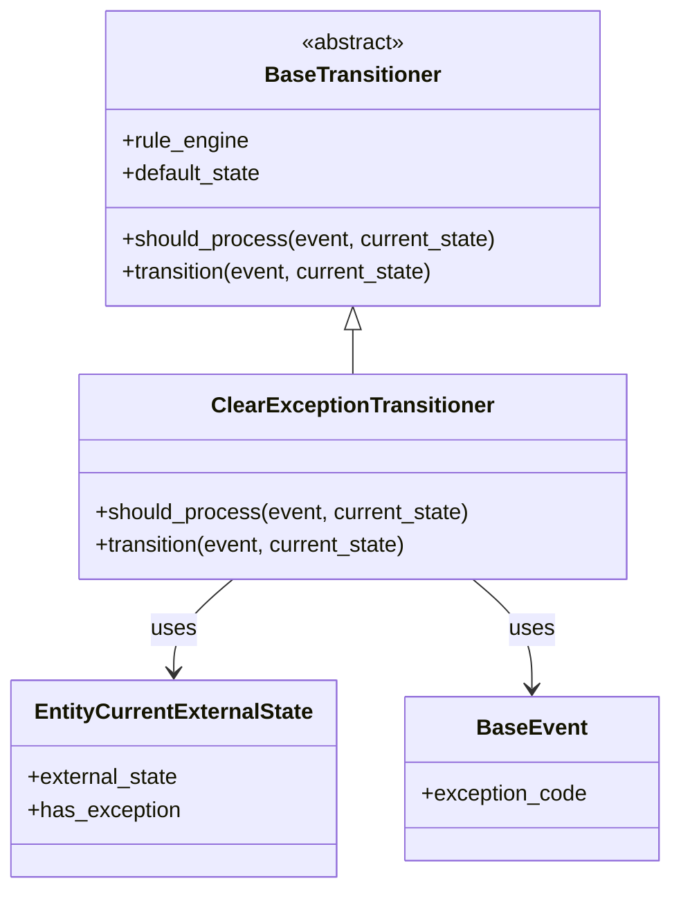

# Diagram: entity_core/entity_service/entity_service/entity/entity/external_state/transitioner/clear_exception_transitioner.py


> Auto-generated by Obscura crawlers

## Diagram 1



### SVG

<svg id="container" width="483.359375" xmlns="http://www.w3.org/2000/svg" class="classDiagram" height="650" viewBox="0 0 483.359375 650" role="graphics-document document" aria-roledescription="class"><style>#container{font-family:"trebuchet ms",verdana,arial,sans-serif;font-size:16px;fill:#333;}@keyframes edge-animation-frame{from{stroke-dashoffset:0;}}@keyframes dash{to{stroke-dashoffset:0;}}#container .edge-animation-slow{stroke-dasharray:9,5!important;stroke-dashoffset:900;animation:dash 50s linear infinite;stroke-linecap:round;}#container .edge-animation-fast{stroke-dasharray:9,5!important;stroke-dashoffset:900;animation:dash 20s linear infinite;stroke-linecap:round;}#container .error-icon{fill:#552222;}#container .error-text{fill:#552222;stroke:#552222;}#container .edge-thickness-normal{stroke-width:1px;}#container .edge-thickness-thick{stroke-width:3.5px;}#container .edge-pattern-solid{stroke-dasharray:0;}#container .edge-thickness-invisible{stroke-width:0;fill:none;}#container .edge-pattern-dashed{stroke-dasharray:3;}#container .edge-pattern-dotted{stroke-dasharray:2;}#container .marker{fill:#333333;stroke:#333333;}#container .marker.cross{stroke:#333333;}#container svg{font-family:"trebuchet ms",verdana,arial,sans-serif;font-size:16px;}#container p{margin:0;}#container g.classGroup text{fill:#9370DB;stroke:none;font-family:"trebuchet ms",verdana,arial,sans-serif;font-size:10px;}#container g.classGroup text .title{font-weight:bolder;}#container .nodeLabel,#container .edgeLabel{color:#131300;}#container .edgeLabel .label rect{fill:#ECECFF;}#container .label text{fill:#131300;}#container .labelBkg{background:#ECECFF;}#container .edgeLabel .label span{background:#ECECFF;}#container .classTitle{font-weight:bolder;}#container .node rect,#container .node circle,#container .node ellipse,#container .node polygon,#container .node path{fill:#ECECFF;stroke:#9370DB;stroke-width:1px;}#container .divider{stroke:#9370DB;stroke-width:1;}#container g.clickable{cursor:pointer;}#container g.classGroup rect{fill:#ECECFF;stroke:#9370DB;}#container g.classGroup line{stroke:#9370DB;stroke-width:1;}#container .classLabel .box{stroke:none;stroke-width:0;fill:#ECECFF;opacity:0.5;}#container .classLabel .label{fill:#9370DB;font-size:10px;}#container .relation{stroke:#333333;stroke-width:1;fill:none;}#container .dashed-line{stroke-dasharray:3;}#container .dotted-line{stroke-dasharray:1 2;}#container #compositionStart,#container .composition{fill:#333333!important;stroke:#333333!important;stroke-width:1;}#container #compositionEnd,#container .composition{fill:#333333!important;stroke:#333333!important;stroke-width:1;}#container #dependencyStart,#container .dependency{fill:#333333!important;stroke:#333333!important;stroke-width:1;}#container #dependencyStart,#container .dependency{fill:#333333!important;stroke:#333333!important;stroke-width:1;}#container #extensionStart,#container .extension{fill:transparent!important;stroke:#333333!important;stroke-width:1;}#container #extensionEnd,#container .extension{fill:transparent!important;stroke:#333333!important;stroke-width:1;}#container #aggregationStart,#container .aggregation{fill:transparent!important;stroke:#333333!important;stroke-width:1;}#container #aggregationEnd,#container .aggregation{fill:transparent!important;stroke:#333333!important;stroke-width:1;}#container #lollipopStart,#container .lollipop{fill:#ECECFF!important;stroke:#333333!important;stroke-width:1;}#container #lollipopEnd,#container .lollipop{fill:#ECECFF!important;stroke:#333333!important;stroke-width:1;}#container .edgeTerminals{font-size:11px;line-height:initial;}#container .classTitleText{text-anchor:middle;font-size:18px;fill:#333;}#container .label-icon{display:inline-block;height:1em;overflow:visible;vertical-align:-0.125em;}#container .node .label-icon path{fill:currentColor;stroke:revert;stroke-width:revert;}#container :root{--mermaid-font-family:"trebuchet ms",verdana,arial,sans-serif;}</style><g><defs><marker id="container_class-aggregationStart" class="marker aggregation class" refX="18" refY="7" markerWidth="190" markerHeight="240" orient="auto"><path d="M 18,7 L9,13 L1,7 L9,1 Z"></path></marker></defs><defs><marker id="container_class-aggregationEnd" class="marker aggregation class" refX="1" refY="7" markerWidth="20" markerHeight="28" orient="auto"><path d="M 18,7 L9,13 L1,7 L9,1 Z"></path></marker></defs><defs><marker id="container_class-extensionStart" class="marker extension class" refX="18" refY="7" markerWidth="190" markerHeight="240" orient="auto"><path d="M 1,7 L18,13 V 1 Z"></path></marker></defs><defs><marker id="container_class-extensionEnd" class="marker extension class" refX="1" refY="7" markerWidth="20" markerHeight="28" orient="auto"><path d="M 1,1 V 13 L18,7 Z"></path></marker></defs><defs><marker id="container_class-compositionStart" class="marker composition class" refX="18" refY="7" markerWidth="190" markerHeight="240" orient="auto"><path d="M 18,7 L9,13 L1,7 L9,1 Z"></path></marker></defs><defs><marker id="container_class-compositionEnd" class="marker composition class" refX="1" refY="7" markerWidth="20" markerHeight="28" orient="auto"><path d="M 18,7 L9,13 L1,7 L9,1 Z"></path></marker></defs><defs><marker id="container_class-dependencyStart" class="marker dependency class" refX="6" refY="7" markerWidth="190" markerHeight="240" orient="auto"><path d="M 5,7 L9,13 L1,7 L9,1 Z"></path></marker></defs><defs><marker id="container_class-dependencyEnd" class="marker dependency class" refX="13" refY="7" markerWidth="20" markerHeight="28" orient="auto"><path d="M 18,7 L9,13 L14,7 L9,1 Z"></path></marker></defs><defs><marker id="container_class-lollipopStart" class="marker lollipop class" refX="13" refY="7" markerWidth="190" markerHeight="240" orient="auto"><circle stroke="black" fill="transparent" cx="7" cy="7" r="6"></circle></marker></defs><defs><marker id="container_class-lollipopEnd" class="marker lollipop class" refX="1" refY="7" markerWidth="190" markerHeight="240" orient="auto"><circle stroke="black" fill="transparent" cx="7" cy="7" r="6"></circle></marker></defs><g class="root"><g class="clusters"></g><g class="edgePaths"><path d="M254.301,241.25L254.301,242.542C254.301,243.833,254.301,246.417,254.301,251.875C254.301,257.333,254.301,265.667,254.301,269.833L254.301,274" id="id_BaseTransitioner_ClearExceptionTransitioner_1" class="edge-thickness-normal edge-pattern-solid relation" style=";;;" data-edge="true" data-et="edge" data-id="id_BaseTransitioner_ClearExceptionTransitioner_1" data-points="W3sieCI6MjU0LjMwMDc4MTI1LCJ5IjoyMjR9LHsieCI6MjU0LjMwMDc4MTI1LCJ5IjoyNDl9LHsieCI6MjU0LjMwMDc4MTI1LCJ5IjoyNzR9XQ==" marker-start="url(#container_class-extensionStart)"></path><path d="M167.689,424L160.568,430.167C153.446,436.333,139.204,448.667,132.082,460C124.961,471.333,124.961,481.667,124.961,486.833L124.961,492" id="id_ClearExceptionTransitioner_EntityCurrentExternalState_2" class="edge-thickness-normal edge-pattern-solid relation" style=";;;" data-edge="true" data-et="edge" data-id="id_ClearExceptionTransitioner_EntityCurrentExternalState_2" data-points="W3sieCI6MTY3LjY4OTI3ODczODgzOTI4LCJ5Ijo0MjR9LHsieCI6MTI0Ljk2MDkzNzUsInkiOjQ2MX0seyJ4IjoxMjQuOTYwOTM3NSwieSI6NDk4fV0=" marker-end="url(#container_class-dependencyEnd)"></path><path d="M340.912,424L348.034,430.167C355.155,436.333,369.398,448.667,376.519,462C383.641,475.333,383.641,489.667,383.641,496.833L383.641,504" id="id_ClearExceptionTransitioner_BaseEvent_3" class="edge-thickness-normal edge-pattern-solid relation" style=";;;" data-edge="true" data-et="edge" data-id="id_ClearExceptionTransitioner_BaseEvent_3" data-points="W3sieCI6MzQwLjkxMjI4Mzc2MTE2MDcsInkiOjQyNH0seyJ4IjozODMuNjQwNjI1LCJ5Ijo0NjF9LHsieCI6MzgzLjY0MDYyNSwieSI6NTEwfV0=" marker-end="url(#container_class-dependencyEnd)"></path></g><g class="edgeLabels"><g class="edgeLabel"><g class="label" data-id="id_BaseTransitioner_ClearExceptionTransitioner_1" transform="translate(0, 0)"><foreignObject width="0" height="0"><div xmlns="http://www.w3.org/1999/xhtml" class="labelBkg" style="display: table-cell; white-space: nowrap; line-height: 1.5; max-width: 200px; text-align: center;"><span class="edgeLabel"></span></div></foreignObject></g></g><g class="edgeLabel" transform="translate(124.9609375, 461)"><g class="label" data-id="id_ClearExceptionTransitioner_EntityCurrentExternalState_2" transform="translate(-16.4921875, -12)"><foreignObject width="32.984375" height="24"><div xmlns="http://www.w3.org/1999/xhtml" class="labelBkg" style="display: table-cell; white-space: nowrap; line-height: 1.5; max-width: 200px; text-align: center;"><span class="edgeLabel"><p>uses</p></span></div></foreignObject></g></g><g class="edgeLabel" transform="translate(383.640625, 461)"><g class="label" data-id="id_ClearExceptionTransitioner_BaseEvent_3" transform="translate(-16.4921875, -12)"><foreignObject width="32.984375" height="24"><div xmlns="http://www.w3.org/1999/xhtml" class="labelBkg" style="display: table-cell; white-space: nowrap; line-height: 1.5; max-width: 200px; text-align: center;"><span class="edgeLabel"><p>uses</p></span></div></foreignObject></g></g></g><g class="nodes"><g class="node default" id="classId-BaseTransitioner-0" transform="translate(254.30078125, 116)"><g class="basic label-container"><path d="M-181.5390625 -108 L181.5390625 -108 L181.5390625 108 L-181.5390625 108" stroke="none" stroke-width="0" fill="#ECECFF" style=""></path><path d="M-181.5390625 -108 C-101.6982997499664 -108, -21.85753699993279 -108, 181.5390625 -108 M-181.5390625 -108 C-37.54548677929975 -108, 106.4480889414005 -108, 181.5390625 -108 M181.5390625 -108 C181.5390625 -26.068738817706205, 181.5390625 55.86252236458759, 181.5390625 108 M181.5390625 -108 C181.5390625 -21.628983902088834, 181.5390625 64.74203219582233, 181.5390625 108 M181.5390625 108 C104.35434394404567 108, 27.169625388091333 108, -181.5390625 108 M181.5390625 108 C55.51496439343613 108, -70.50913371312774 108, -181.5390625 108 M-181.5390625 108 C-181.5390625 56.12777139633278, -181.5390625 4.255542792665565, -181.5390625 -108 M-181.5390625 108 C-181.5390625 45.69822446220861, -181.5390625 -16.603551075582786, -181.5390625 -108" stroke="#9370DB" stroke-width="1.3" fill="none" stroke-dasharray="0 0" style=""></path></g><g class="annotation-group text" transform="translate(-38.609375, -84)"><g class="label" style="" transform="translate(0,-12)"><foreignObject width="77.21875" height="24"><div xmlns="http://www.w3.org/1999/xhtml" style="display: table-cell; white-space: nowrap; line-height: 1.5; max-width: 127px; text-align: center;"><span class="nodeLabel markdown-node-label" style=""><p>«abstract»</p></span></div></foreignObject></g></g><g class="label-group text" transform="translate(-61.90625, -60)"><g class="label" style="font-weight: bolder" transform="translate(0,-12)"><foreignObject width="123.8125" height="24"><div xmlns="http://www.w3.org/1999/xhtml" style="display: table-cell; white-space: nowrap; line-height: 1.5; max-width: 173px; text-align: center;"><span class="nodeLabel markdown-node-label" style=""><p>BaseTransitioner</p></span></div></foreignObject></g></g><g class="members-group text" transform="translate(-169.5390625, -12)"><g class="label" style="" transform="translate(0,-12)"><foreignObject width="93.515625" height="24"><div xmlns="http://www.w3.org/1999/xhtml" style="display: table-cell; white-space: nowrap; line-height: 1.5; max-width: 151px; text-align: center;"><span class="nodeLabel markdown-node-label" style=""><p>+rule_engine</p></span></div></foreignObject></g><g class="label" style="" transform="translate(0,12)"><foreignObject width="104.1875" height="24"><div xmlns="http://www.w3.org/1999/xhtml" style="display: table-cell; white-space: nowrap; line-height: 1.5; max-width: 162px; text-align: center;"><span class="nodeLabel markdown-node-label" style=""><p>+default_state</p></span></div></foreignObject></g></g><g class="methods-group text" transform="translate(-169.5390625, 60)"><g class="label" style="" transform="translate(0,-12)"><foreignObject width="277.171875" height="24"><div xmlns="http://www.w3.org/1999/xhtml" style="display: table-cell; white-space: nowrap; line-height: 1.5; max-width: 335px; text-align: center;"><span class="nodeLabel markdown-node-label" style=""><p>+should_process(event, current_state)</p></span></div></foreignObject></g><g class="label" style="" transform="translate(0,12)"><foreignObject width="234.1875" height="24"><div xmlns="http://www.w3.org/1999/xhtml" style="display: table-cell; white-space: nowrap; line-height: 1.5; max-width: 292px; text-align: center;"><span class="nodeLabel markdown-node-label" style=""><p>+transition(event, current_state)</p></span></div></foreignObject></g></g><g class="divider" style=""><path d="M-181.5390625 -36 C-92.61858094703686 -36, -3.698099394073722 -36, 181.5390625 -36 M-181.5390625 -36 C-51.737009856571945 -36, 78.06504278685611 -36, 181.5390625 -36" stroke="#9370DB" stroke-width="1.3" fill="none" stroke-dasharray="0 0" style=""></path></g><g class="divider" style=""><path d="M-181.5390625 36 C-45.25720693330044 36, 91.02464863339912 36, 181.5390625 36 M-181.5390625 36 C-105.28166776426005 36, -29.0242730285201 36, 181.5390625 36" stroke="#9370DB" stroke-width="1.3" fill="none" stroke-dasharray="0 0" style=""></path></g></g><g class="node default" id="classId-ClearExceptionTransitioner-1" transform="translate(254.30078125, 349)"><g class="basic label-container"><path d="M-200.01953125 -75 L200.01953125 -75 L200.01953125 75 L-200.01953125 75" stroke="none" stroke-width="0" fill="#ECECFF" style=""></path><path d="M-200.01953125 -75 C-99.62172376106085 -75, 0.7760837278783015 -75, 200.01953125 -75 M-200.01953125 -75 C-99.64515116979452 -75, 0.729228910410967 -75, 200.01953125 -75 M200.01953125 -75 C200.01953125 -20.35281056698004, 200.01953125 34.29437886603992, 200.01953125 75 M200.01953125 -75 C200.01953125 -19.954717540210744, 200.01953125 35.09056491957851, 200.01953125 75 M200.01953125 75 C70.09762174968569 75, -59.82428775062863 75, -200.01953125 75 M200.01953125 75 C85.09147027004336 75, -29.83659070991328 75, -200.01953125 75 M-200.01953125 75 C-200.01953125 43.46547016357509, -200.01953125 11.930940327150182, -200.01953125 -75 M-200.01953125 75 C-200.01953125 24.78900992354911, -200.01953125 -25.42198015290178, -200.01953125 -75" stroke="#9370DB" stroke-width="1.3" fill="none" stroke-dasharray="0 0" style=""></path></g><g class="annotation-group text" transform="translate(0, -51)"></g><g class="label-group text" transform="translate(-98.8671875, -51)"><g class="label" style="font-weight: bolder" transform="translate(0,-12)"><foreignObject width="197.734375" height="24"><div xmlns="http://www.w3.org/1999/xhtml" style="display: table-cell; white-space: nowrap; line-height: 1.5; max-width: 246px; text-align: center;"><span class="nodeLabel markdown-node-label" style=""><p>ClearExceptionTransitioner</p></span></div></foreignObject></g></g><g class="members-group text" transform="translate(-188.01953125, -3)"></g><g class="methods-group text" transform="translate(-188.01953125, 27)"><g class="label" style="" transform="translate(0,-12)"><foreignObject width="277.171875" height="24"><div xmlns="http://www.w3.org/1999/xhtml" style="display: table-cell; white-space: nowrap; line-height: 1.5; max-width: 335px; text-align: center;"><span class="nodeLabel markdown-node-label" style=""><p>+should_process(event, current_state)</p></span></div></foreignObject></g><g class="label" style="" transform="translate(0,12)"><foreignObject width="234.1875" height="24"><div xmlns="http://www.w3.org/1999/xhtml" style="display: table-cell; white-space: nowrap; line-height: 1.5; max-width: 292px; text-align: center;"><span class="nodeLabel markdown-node-label" style=""><p>+transition(event, current_state)</p></span></div></foreignObject></g></g><g class="divider" style=""><path d="M-200.01953125 -27 C-90.88005871905575 -27, 18.259413811888493 -27, 200.01953125 -27 M-200.01953125 -27 C-43.21605443084101 -27, 113.58742238831798 -27, 200.01953125 -27" stroke="#9370DB" stroke-width="1.3" fill="none" stroke-dasharray="0 0" style=""></path></g><g class="divider" style=""><path d="M-200.01953125 -3 C-63.99985226633686 -3, 72.01982671732628 -3, 200.01953125 -3 M-200.01953125 -3 C-60.86788596765754 -3, 78.28375931468491 -3, 200.01953125 -3" stroke="#9370DB" stroke-width="1.3" fill="none" stroke-dasharray="0 0" style=""></path></g></g><g class="node default" id="classId-EntityCurrentExternalState-2" transform="translate(124.9609375, 570)"><g class="basic label-container"><path d="M-116.9609375 -72 L116.9609375 -72 L116.9609375 72 L-116.9609375 72" stroke="none" stroke-width="0" fill="#ECECFF" style=""></path><path d="M-116.9609375 -72 C-47.53702240041251 -72, 21.88689269917498 -72, 116.9609375 -72 M-116.9609375 -72 C-68.14930136450725 -72, -19.337665229014505 -72, 116.9609375 -72 M116.9609375 -72 C116.9609375 -20.110482714589665, 116.9609375 31.77903457082067, 116.9609375 72 M116.9609375 -72 C116.9609375 -40.882754655864346, 116.9609375 -9.765509311728685, 116.9609375 72 M116.9609375 72 C33.7454441108855 72, -49.470049278229 72, -116.9609375 72 M116.9609375 72 C33.43535881796073 72, -50.090219864078534 72, -116.9609375 72 M-116.9609375 72 C-116.9609375 15.618159226725567, -116.9609375 -40.76368154654887, -116.9609375 -72 M-116.9609375 72 C-116.9609375 24.72679588688643, -116.9609375 -22.546408226227143, -116.9609375 -72" stroke="#9370DB" stroke-width="1.3" fill="none" stroke-dasharray="0 0" style=""></path></g><g class="annotation-group text" transform="translate(0, -48)"></g><g class="label-group text" transform="translate(-98.109375, -48)"><g class="label" style="font-weight: bolder" transform="translate(0,-12)"><foreignObject width="196.21875" height="24"><div xmlns="http://www.w3.org/1999/xhtml" style="display: table-cell; white-space: nowrap; line-height: 1.5; max-width: 242px; text-align: center;"><span class="nodeLabel markdown-node-label" style=""><p>EntityCurrentExternalState</p></span></div></foreignObject></g></g><g class="members-group text" transform="translate(-104.9609375, 0)"><g class="label" style="" transform="translate(0,-12)"><foreignObject width="111.78125" height="24"><div xmlns="http://www.w3.org/1999/xhtml" style="display: table-cell; white-space: nowrap; line-height: 1.5; max-width: 169px; text-align: center;"><span class="nodeLabel markdown-node-label" style=""><p>+external_state</p></span></div></foreignObject></g><g class="label" style="" transform="translate(0,12)"><foreignObject width="111.8125" height="24"><div xmlns="http://www.w3.org/1999/xhtml" style="display: table-cell; white-space: nowrap; line-height: 1.5; max-width: 169px; text-align: center;"><span class="nodeLabel markdown-node-label" style=""><p>+has_exception</p></span></div></foreignObject></g></g><g class="methods-group text" transform="translate(-104.9609375, 72)"></g><g class="divider" style=""><path d="M-116.9609375 -24 C-30.88182682047247 -24, 55.19728385905506 -24, 116.9609375 -24 M-116.9609375 -24 C-26.967604617187007 -24, 63.025728265625986 -24, 116.9609375 -24" stroke="#9370DB" stroke-width="1.3" fill="none" stroke-dasharray="0 0" style=""></path></g><g class="divider" style=""><path d="M-116.9609375 48 C-49.208805587905715 48, 18.54332632418857 48, 116.9609375 48 M-116.9609375 48 C-57.20300931382819 48, 2.5549188723436203 48, 116.9609375 48" stroke="#9370DB" stroke-width="1.3" fill="none" stroke-dasharray="0 0" style=""></path></g></g><g class="node default" id="classId-BaseEvent-3" transform="translate(383.640625, 570)"><g class="basic label-container"><path d="M-91.71875 -60 L91.71875 -60 L91.71875 60 L-91.71875 60" stroke="none" stroke-width="0" fill="#ECECFF" style=""></path><path d="M-91.71875 -60 C-51.027109564267306 -60, -10.335469128534612 -60, 91.71875 -60 M-91.71875 -60 C-42.83268105779591 -60, 6.053387884408181 -60, 91.71875 -60 M91.71875 -60 C91.71875 -25.465070804919264, 91.71875 9.069858390161471, 91.71875 60 M91.71875 -60 C91.71875 -23.760923555109528, 91.71875 12.478152889780944, 91.71875 60 M91.71875 60 C52.4459702985083 60, 13.1731905970166 60, -91.71875 60 M91.71875 60 C30.810055961534616 60, -30.09863807693077 60, -91.71875 60 M-91.71875 60 C-91.71875 33.33772145664148, -91.71875 6.675442913282964, -91.71875 -60 M-91.71875 60 C-91.71875 19.592409543839054, -91.71875 -20.815180912321892, -91.71875 -60" stroke="#9370DB" stroke-width="1.3" fill="none" stroke-dasharray="0 0" style=""></path></g><g class="annotation-group text" transform="translate(0, -36)"></g><g class="label-group text" transform="translate(-37.734375, -36)"><g class="label" style="font-weight: bolder" transform="translate(0,-12)"><foreignObject width="75.46875" height="24"><div xmlns="http://www.w3.org/1999/xhtml" style="display: table-cell; white-space: nowrap; line-height: 1.5; max-width: 125px; text-align: center;"><span class="nodeLabel markdown-node-label" style=""><p>BaseEvent</p></span></div></foreignObject></g></g><g class="members-group text" transform="translate(-79.71875, 12)"><g class="label" style="" transform="translate(0,-12)"><foreignObject width="121.703125" height="24"><div xmlns="http://www.w3.org/1999/xhtml" style="display: table-cell; white-space: nowrap; line-height: 1.5; max-width: 179px; text-align: center;"><span class="nodeLabel markdown-node-label" style=""><p>+exception_code</p></span></div></foreignObject></g></g><g class="methods-group text" transform="translate(-79.71875, 60)"></g><g class="divider" style=""><path d="M-91.71875 -12 C-50.13760728111434 -12, -8.556464562228683 -12, 91.71875 -12 M-91.71875 -12 C-39.376103146537986 -12, 12.966543706924028 -12, 91.71875 -12" stroke="#9370DB" stroke-width="1.3" fill="none" stroke-dasharray="0 0" style=""></path></g><g class="divider" style=""><path d="M-91.71875 36 C-33.00494025908891 36, 25.708869481822177 36, 91.71875 36 M-91.71875 36 C-30.99917603029465 36, 29.720397939410702 36, 91.71875 36" stroke="#9370DB" stroke-width="1.3" fill="none" stroke-dasharray="0 0" style=""></path></g></g></g></g></g></svg>

## Diagram 2

```mermaid
flowchart TD
subgraph ShouldProcess
SP_Start([Start: should_process])
SP_Start --> SP_Super{super().should_process valid?}
SP_Super -->|No| SP_ReturnSuper[Return False, base_msg]
SP_Super -->|Yes| SP_HasCurrent{current_state exists?}
SP_HasCurrent -->|No| SP_ReturnNoState[Return False: No current state exists]
SP_HasCurrent -->|Yes| SP_IsException{rule_engine.is_exception_state(external_state)?}
SP_IsException -->|No| SP_ReturnNotException[Return False: Current state is not an exception state; cannot clear]
SP_IsException -->|Yes| SP_HasException{current_state.has_exception?}
SP_HasException -->|Yes| SP_ReturnHasException[Return False: Exception still active; cannot clear state]
SP_HasException -->|No| SP_ReturnReady[Return True: Ready to clear exception]
end

subgraph Transition
T_Start([Start: transition])
T_Start --> T_Determine{Determine current_state_str (external_state or default_state)}
T_Determine -->|No| T_ReturnInvalid[Return None: Invalid current state - no base state found]
T_Determine -->|Yes| T_GetCode[exception_code = event.exception_code or HOLD]
T_GetCode --> T_Find[rule_engine.find_clear_exception_transition(current_state_str, exception_code)]
T_Find -->|No| T_ReturnNotFound[Return None: Base state not found for the current exception state]
T_Find -->|Yes| T_ReturnNew[Return new_state: Exception cleared successfully]
end
```

> SVG rendering failed for this diagram.
