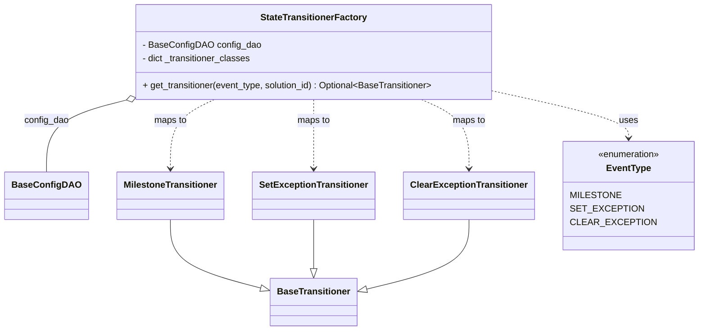

# Diagram: entity_core/entity_service/entity_service/entity/entity/external_state/transitioner/factory.py


> Auto-generated by Obscura crawlers

## Diagram 1



### SVG

<svg id="container" width="1176.5546875" xmlns="http://www.w3.org/2000/svg" class="classDiagram" height="584" viewBox="0 0 1176.5546875 584" role="graphics-document document" aria-roledescription="class"><style>#container{font-family:"trebuchet ms",verdana,arial,sans-serif;font-size:16px;fill:#333;}@keyframes edge-animation-frame{from{stroke-dashoffset:0;}}@keyframes dash{to{stroke-dashoffset:0;}}#container .edge-animation-slow{stroke-dasharray:9,5!important;stroke-dashoffset:900;animation:dash 50s linear infinite;stroke-linecap:round;}#container .edge-animation-fast{stroke-dasharray:9,5!important;stroke-dashoffset:900;animation:dash 20s linear infinite;stroke-linecap:round;}#container .error-icon{fill:#552222;}#container .error-text{fill:#552222;stroke:#552222;}#container .edge-thickness-normal{stroke-width:1px;}#container .edge-thickness-thick{stroke-width:3.5px;}#container .edge-pattern-solid{stroke-dasharray:0;}#container .edge-thickness-invisible{stroke-width:0;fill:none;}#container .edge-pattern-dashed{stroke-dasharray:3;}#container .edge-pattern-dotted{stroke-dasharray:2;}#container .marker{fill:#333333;stroke:#333333;}#container .marker.cross{stroke:#333333;}#container svg{font-family:"trebuchet ms",verdana,arial,sans-serif;font-size:16px;}#container p{margin:0;}#container g.classGroup text{fill:#9370DB;stroke:none;font-family:"trebuchet ms",verdana,arial,sans-serif;font-size:10px;}#container g.classGroup text .title{font-weight:bolder;}#container .nodeLabel,#container .edgeLabel{color:#131300;}#container .edgeLabel .label rect{fill:#ECECFF;}#container .label text{fill:#131300;}#container .labelBkg{background:#ECECFF;}#container .edgeLabel .label span{background:#ECECFF;}#container .classTitle{font-weight:bolder;}#container .node rect,#container .node circle,#container .node ellipse,#container .node polygon,#container .node path{fill:#ECECFF;stroke:#9370DB;stroke-width:1px;}#container .divider{stroke:#9370DB;stroke-width:1;}#container g.clickable{cursor:pointer;}#container g.classGroup rect{fill:#ECECFF;stroke:#9370DB;}#container g.classGroup line{stroke:#9370DB;stroke-width:1;}#container .classLabel .box{stroke:none;stroke-width:0;fill:#ECECFF;opacity:0.5;}#container .classLabel .label{fill:#9370DB;font-size:10px;}#container .relation{stroke:#333333;stroke-width:1;fill:none;}#container .dashed-line{stroke-dasharray:3;}#container .dotted-line{stroke-dasharray:1 2;}#container #compositionStart,#container .composition{fill:#333333!important;stroke:#333333!important;stroke-width:1;}#container #compositionEnd,#container .composition{fill:#333333!important;stroke:#333333!important;stroke-width:1;}#container #dependencyStart,#container .dependency{fill:#333333!important;stroke:#333333!important;stroke-width:1;}#container #dependencyStart,#container .dependency{fill:#333333!important;stroke:#333333!important;stroke-width:1;}#container #extensionStart,#container .extension{fill:transparent!important;stroke:#333333!important;stroke-width:1;}#container #extensionEnd,#container .extension{fill:transparent!important;stroke:#333333!important;stroke-width:1;}#container #aggregationStart,#container .aggregation{fill:transparent!important;stroke:#333333!important;stroke-width:1;}#container #aggregationEnd,#container .aggregation{fill:transparent!important;stroke:#333333!important;stroke-width:1;}#container #lollipopStart,#container .lollipop{fill:#ECECFF!important;stroke:#333333!important;stroke-width:1;}#container #lollipopEnd,#container .lollipop{fill:#ECECFF!important;stroke:#333333!important;stroke-width:1;}#container .edgeTerminals{font-size:11px;line-height:initial;}#container .classTitleText{text-anchor:middle;font-size:18px;fill:#333;}#container .label-icon{display:inline-block;height:1em;overflow:visible;vertical-align:-0.125em;}#container .node .label-icon path{fill:currentColor;stroke:revert;stroke-width:revert;}#container :root{--mermaid-font-family:"trebuchet ms",verdana,arial,sans-serif;}</style><g><defs><marker id="container_class-aggregationStart" class="marker aggregation class" refX="18" refY="7" markerWidth="190" markerHeight="240" orient="auto"><path d="M 18,7 L9,13 L1,7 L9,1 Z"></path></marker></defs><defs><marker id="container_class-aggregationEnd" class="marker aggregation class" refX="1" refY="7" markerWidth="20" markerHeight="28" orient="auto"><path d="M 18,7 L9,13 L1,7 L9,1 Z"></path></marker></defs><defs><marker id="container_class-extensionStart" class="marker extension class" refX="18" refY="7" markerWidth="190" markerHeight="240" orient="auto"><path d="M 1,7 L18,13 V 1 Z"></path></marker></defs><defs><marker id="container_class-extensionEnd" class="marker extension class" refX="1" refY="7" markerWidth="20" markerHeight="28" orient="auto"><path d="M 1,1 V 13 L18,7 Z"></path></marker></defs><defs><marker id="container_class-compositionStart" class="marker composition class" refX="18" refY="7" markerWidth="190" markerHeight="240" orient="auto"><path d="M 18,7 L9,13 L1,7 L9,1 Z"></path></marker></defs><defs><marker id="container_class-compositionEnd" class="marker composition class" refX="1" refY="7" markerWidth="20" markerHeight="28" orient="auto"><path d="M 18,7 L9,13 L1,7 L9,1 Z"></path></marker></defs><defs><marker id="container_class-dependencyStart" class="marker dependency class" refX="6" refY="7" markerWidth="190" markerHeight="240" orient="auto"><path d="M 5,7 L9,13 L1,7 L9,1 Z"></path></marker></defs><defs><marker id="container_class-dependencyEnd" class="marker dependency class" refX="13" refY="7" markerWidth="20" markerHeight="28" orient="auto"><path d="M 18,7 L9,13 L14,7 L9,1 Z"></path></marker></defs><defs><marker id="container_class-lollipopStart" class="marker lollipop class" refX="13" refY="7" markerWidth="190" markerHeight="240" orient="auto"><circle stroke="black" fill="transparent" cx="7" cy="7" r="6"></circle></marker></defs><defs><marker id="container_class-lollipopEnd" class="marker lollipop class" refX="1" refY="7" markerWidth="190" markerHeight="240" orient="auto"><circle stroke="black" fill="transparent" cx="7" cy="7" r="6"></circle></marker></defs><g class="root"><g class="clusters"></g><g class="edgePaths"><path d="M198.607,180.421L178.131,185.851C157.655,191.281,116.702,202.14,96.226,222.737C75.75,243.333,75.75,273.667,75.75,288.833L75.75,304" id="id_StateTransitionerFactory_BaseConfigDAO_1" class="edge-thickness-normal edge-pattern-solid relation" style=";;;" data-edge="true" data-et="edge" data-id="id_StateTransitionerFactory_BaseConfigDAO_1" data-points="W3sieCI6MjE1LjI4MTE4NTQzMzg4NDI3LCJ5IjoxNzZ9LHsieCI6NzUuNzUsInkiOjIxM30seyJ4Ijo3NS43NSwieSI6MzA0fV0=" marker-start="url(#container_class-aggregationStart)"></path><path d="M285.695,388L285.695,401.167C285.695,414.333,285.695,440.667,311.663,460.896C337.631,481.125,389.567,495.249,415.535,502.311L441.503,509.374" id="id_MilestoneTransitioner_BaseTransitioner_2" class="edge-thickness-normal edge-pattern-solid relation" style=";;;" data-edge="true" data-et="edge" data-id="id_MilestoneTransitioner_BaseTransitioner_2" data-points="W3sieCI6Mjg1LjY5NTMxMjUsInkiOjM4OH0seyJ4IjoyODUuNjk1MzEyNSwieSI6NDY3fSx7IngiOjQ1OC4xNDg0Mzc1LCJ5Ijo1MTMuOTAwNDI0OTM4MTYyfV0=" marker-end="url(#container_class-extensionEnd)"></path><path d="M532.055,388L532.055,401.167C532.055,414.333,532.055,440.667,532.055,455.125C532.055,469.583,532.055,472.167,532.055,473.458L532.055,474.75" id="id_SetExceptionTransitioner_BaseTransitioner_3" class="edge-thickness-normal edge-pattern-solid relation" style=";;;" data-edge="true" data-et="edge" data-id="id_SetExceptionTransitioner_BaseTransitioner_3" data-points="W3sieCI6NTMyLjA1NDY4NzUsInkiOjM4OH0seyJ4Ijo1MzIuMDU0Njg3NSwieSI6NDY3fSx7IngiOjUzMi4wNTQ2ODc1LCJ5Ijo0OTJ9XQ==" marker-end="url(#container_class-extensionEnd)"></path><path d="M797.086,388L797.086,401.167C797.086,414.333,797.086,440.667,768.019,461.181C738.952,481.696,680.819,496.392,651.752,503.741L622.685,511.089" id="id_ClearExceptionTransitioner_BaseTransitioner_4" class="edge-thickness-normal edge-pattern-solid relation" style=";;;" data-edge="true" data-et="edge" data-id="id_ClearExceptionTransitioner_BaseTransitioner_4" data-points="W3sieCI6Nzk3LjA4NTkzNzUsInkiOjM4OH0seyJ4Ijo3OTcuMDg1OTM3NSwieSI6NDY3fSx7IngiOjYwNS45NjA5Mzc1LCJ5Ijo1MTUuMzE2NDcyMTE0MTM3NX1d" marker-end="url(#container_class-extensionEnd)"></path><path d="M850.086,164.443L885.614,172.536C921.142,180.629,992.198,196.814,1027.726,210.074C1063.254,223.333,1063.254,233.667,1063.254,238.833L1063.254,244" id="id_StateTransitionerFactory_EventType_5" class="edge-thickness-normal edge-pattern-dashed relation" style=";;;" data-edge="true" data-et="edge" data-id="id_StateTransitionerFactory_EventType_5" data-points="W3sieCI6ODUwLjA4NTkzNzUsInkiOjE2NC40NDMyMTg4MzcwOTQ3Mn0seyJ4IjoxMDYzLjI1MzkwNjI1LCJ5IjoyMTN9LHsieCI6MTA2My4yNTM5MDYyNSwieSI6MjUwfV0=" marker-end="url(#container_class-dependencyEnd)"></path><path d="M361.028,176L348.473,182.167C335.917,188.333,310.806,200.667,298.251,221C285.695,241.333,285.695,269.667,285.695,283.833L285.695,298" id="id_StateTransitionerFactory_MilestoneTransitioner_6" class="edge-thickness-normal edge-pattern-dashed relation" style=";;;" data-edge="true" data-et="edge" data-id="id_StateTransitionerFactory_MilestoneTransitioner_6" data-points="W3sieCI6MzYxLjAyODM0NDUyNDc5MzQsInkiOjE3Nn0seyJ4IjoyODUuNjk1MzEyNSwieSI6MjEzfSx7IngiOjI4NS42OTUzMTI1LCJ5IjozMDR9XQ==" marker-end="url(#container_class-dependencyEnd)"></path><path d="M532.055,176L532.055,182.167C532.055,188.333,532.055,200.667,532.055,221C532.055,241.333,532.055,269.667,532.055,283.833L532.055,298" id="id_StateTransitionerFactory_SetExceptionTransitioner_7" class="edge-thickness-normal edge-pattern-dashed relation" style=";;;" data-edge="true" data-et="edge" data-id="id_StateTransitionerFactory_SetExceptionTransitioner_7" data-points="W3sieCI6NTMyLjA1NDY4NzUsInkiOjE3Nn0seyJ4Ijo1MzIuMDU0Njg3NSwieSI6MjEzfSx7IngiOjUzMi4wNTQ2ODc1LCJ5IjozMDR9XQ==" marker-end="url(#container_class-dependencyEnd)"></path><path d="M716.043,176L729.55,182.167C743.058,188.333,770.072,200.667,783.579,221C797.086,241.333,797.086,269.667,797.086,283.833L797.086,298" id="id_StateTransitionerFactory_ClearExceptionTransitioner_8" class="edge-thickness-normal edge-pattern-dashed relation" style=";;;" data-edge="true" data-et="edge" data-id="id_StateTransitionerFactory_ClearExceptionTransitioner_8" data-points="W3sieCI6NzE2LjA0MzMyMzg2MzYzNjQsInkiOjE3Nn0seyJ4Ijo3OTcuMDg1OTM3NSwieSI6MjEzfSx7IngiOjc5Ny4wODU5Mzc1LCJ5IjozMDR9XQ==" marker-end="url(#container_class-dependencyEnd)"></path></g><g class="edgeLabels"><g class="edgeLabel" transform="translate(75.75, 213)"><g class="label" data-id="id_StateTransitionerFactory_BaseConfigDAO_1" transform="translate(-39.625, -12)"><foreignObject width="79.25" height="24"><div xmlns="http://www.w3.org/1999/xhtml" class="labelBkg" style="display: table-cell; white-space: nowrap; line-height: 1.5; max-width: 200px; text-align: center;"><span class="edgeLabel"><p>config_dao</p></span></div></foreignObject></g></g><g class="edgeLabel"><g class="label" data-id="id_MilestoneTransitioner_BaseTransitioner_2" transform="translate(0, 0)"><foreignObject width="0" height="0"><div xmlns="http://www.w3.org/1999/xhtml" class="labelBkg" style="display: table-cell; white-space: nowrap; line-height: 1.5; max-width: 200px; text-align: center;"><span class="edgeLabel"></span></div></foreignObject></g></g><g class="edgeLabel"><g class="label" data-id="id_SetExceptionTransitioner_BaseTransitioner_3" transform="translate(0, 0)"><foreignObject width="0" height="0"><div xmlns="http://www.w3.org/1999/xhtml" class="labelBkg" style="display: table-cell; white-space: nowrap; line-height: 1.5; max-width: 200px; text-align: center;"><span class="edgeLabel"></span></div></foreignObject></g></g><g class="edgeLabel"><g class="label" data-id="id_ClearExceptionTransitioner_BaseTransitioner_4" transform="translate(0, 0)"><foreignObject width="0" height="0"><div xmlns="http://www.w3.org/1999/xhtml" class="labelBkg" style="display: table-cell; white-space: nowrap; line-height: 1.5; max-width: 200px; text-align: center;"><span class="edgeLabel"></span></div></foreignObject></g></g><g class="edgeLabel" transform="translate(1063.25390625, 213)"><g class="label" data-id="id_StateTransitionerFactory_EventType_5" transform="translate(-16.4921875, -12)"><foreignObject width="32.984375" height="24"><div xmlns="http://www.w3.org/1999/xhtml" class="labelBkg" style="display: table-cell; white-space: nowrap; line-height: 1.5; max-width: 200px; text-align: center;"><span class="edgeLabel"><p>uses</p></span></div></foreignObject></g></g><g class="edgeLabel" transform="translate(285.6953125, 213)"><g class="label" data-id="id_StateTransitionerFactory_MilestoneTransitioner_6" transform="translate(-29.2578125, -12)"><foreignObject width="58.515625" height="24"><div xmlns="http://www.w3.org/1999/xhtml" class="labelBkg" style="display: table-cell; white-space: nowrap; line-height: 1.5; max-width: 200px; text-align: center;"><span class="edgeLabel"><p>maps to</p></span></div></foreignObject></g></g><g class="edgeLabel" transform="translate(532.0546875, 213)"><g class="label" data-id="id_StateTransitionerFactory_SetExceptionTransitioner_7" transform="translate(-29.2578125, -12)"><foreignObject width="58.515625" height="24"><div xmlns="http://www.w3.org/1999/xhtml" class="labelBkg" style="display: table-cell; white-space: nowrap; line-height: 1.5; max-width: 200px; text-align: center;"><span class="edgeLabel"><p>maps to</p></span></div></foreignObject></g></g><g class="edgeLabel" transform="translate(797.0859375, 213)"><g class="label" data-id="id_StateTransitionerFactory_ClearExceptionTransitioner_8" transform="translate(-29.2578125, -12)"><foreignObject width="58.515625" height="24"><div xmlns="http://www.w3.org/1999/xhtml" class="labelBkg" style="display: table-cell; white-space: nowrap; line-height: 1.5; max-width: 200px; text-align: center;"><span class="edgeLabel"><p>maps to</p></span></div></foreignObject></g></g></g><g class="nodes"><g class="node default" id="classId-StateTransitionerFactory-0" transform="translate(532.0546875, 92)"><g class="basic label-container"><path d="M-318.03125 -84 L318.03125 -84 L318.03125 84 L-318.03125 84" stroke="none" stroke-width="0" fill="#ECECFF" style=""></path><path d="M-318.03125 -84 C-138.55693106705127 -84, 40.91738786589747 -84, 318.03125 -84 M-318.03125 -84 C-101.84250849479426 -84, 114.34623301041148 -84, 318.03125 -84 M318.03125 -84 C318.03125 -33.3655937420495, 318.03125 17.268812515901004, 318.03125 84 M318.03125 -84 C318.03125 -45.476002759524675, 318.03125 -6.952005519049351, 318.03125 84 M318.03125 84 C145.91943848619383 84, -26.192373027612348 84, -318.03125 84 M318.03125 84 C144.77373115897896 84, -28.483787682042077 84, -318.03125 84 M-318.03125 84 C-318.03125 37.9709686248534, -318.03125 -8.058062750293203, -318.03125 -84 M-318.03125 84 C-318.03125 47.34474500227964, -318.03125 10.689490004559275, -318.03125 -84" stroke="#9370DB" stroke-width="1.3" fill="none" stroke-dasharray="0 0" style=""></path></g><g class="annotation-group text" transform="translate(0, -60)"></g><g class="label-group text" transform="translate(-90.296875, -60)"><g class="label" style="font-weight: bolder" transform="translate(0,-12)"><foreignObject width="180.59375" height="24"><div xmlns="http://www.w3.org/1999/xhtml" style="display: table-cell; white-space: nowrap; line-height: 1.5; max-width: 227px; text-align: center;"><span class="nodeLabel markdown-node-label" style=""><p>StateTransitionerFactory</p></span></div></foreignObject></g></g><g class="members-group text" transform="translate(-306.03125, -12)"><g class="label" style="" transform="translate(0,-12)"><foreignObject width="203.75" height="24"><div xmlns="http://www.w3.org/1999/xhtml" style="display: table-cell; white-space: nowrap; line-height: 1.5; max-width: 261px; text-align: center;"><span class="nodeLabel markdown-node-label" style=""><p>- BaseConfigDAO config_dao</p></span></div></foreignObject></g><g class="label" style="" transform="translate(0,12)"><foreignObject width="194.296875" height="24"><div xmlns="http://www.w3.org/1999/xhtml" style="display: table-cell; white-space: nowrap; line-height: 1.5; max-width: 252px; text-align: center;"><span class="nodeLabel markdown-node-label" style=""><p>- dict _transitioner_classes</p></span></div></foreignObject></g></g><g class="methods-group text" transform="translate(-306.03125, 60)"><g class="label" style="" transform="translate(0,-12)"><foreignObject width="521.765625" height="24"><div xmlns="http://www.w3.org/1999/xhtml" style="display: table-cell; white-space: nowrap; line-height: 1.5; max-width: 618px; text-align: center;"><span class="nodeLabel markdown-node-label" style=""><p>+ get_transitioner(event_type, solution_id) : Optional&lt;BaseTransitioner&gt;</p></span></div></foreignObject></g></g><g class="divider" style=""><path d="M-318.03125 -36 C-64.05856506803983 -36, 189.91411986392035 -36, 318.03125 -36 M-318.03125 -36 C-168.59689439004754 -36, -19.162538780095076 -36, 318.03125 -36" stroke="#9370DB" stroke-width="1.3" fill="none" stroke-dasharray="0 0" style=""></path></g><g class="divider" style=""><path d="M-318.03125 36 C-91.95501835788096 36, 134.12121328423808 36, 318.03125 36 M-318.03125 36 C-99.32957829823806 36, 119.37209340352388 36, 318.03125 36" stroke="#9370DB" stroke-width="1.3" fill="none" stroke-dasharray="0 0" style=""></path></g></g><g class="node default" id="classId-BaseConfigDAO-1" transform="translate(75.75, 346)"><g class="basic label-container"><path d="M-67.75 -42 L67.75 -42 L67.75 42 L-67.75 42" stroke="none" stroke-width="0" fill="#ECECFF" style=""></path><path d="M-67.75 -42 C-25.994198920957245 -42, 15.761602158085509 -42, 67.75 -42 M-67.75 -42 C-30.885723882088016 -42, 5.978552235823969 -42, 67.75 -42 M67.75 -42 C67.75 -17.349919179212918, 67.75 7.300161641574164, 67.75 42 M67.75 -42 C67.75 -19.74509515262765, 67.75 2.5098096947447033, 67.75 42 M67.75 42 C17.81857911514956 42, -32.11284176970088 42, -67.75 42 M67.75 42 C39.666889117005425 42, 11.58377823401085 42, -67.75 42 M-67.75 42 C-67.75 18.58165555938352, -67.75 -4.836688881232959, -67.75 -42 M-67.75 42 C-67.75 10.541205282786528, -67.75 -20.917589434426944, -67.75 -42" stroke="#9370DB" stroke-width="1.3" fill="none" stroke-dasharray="0 0" style=""></path></g><g class="annotation-group text" transform="translate(0, -18)"></g><g class="label-group text" transform="translate(-55.75, -18)"><g class="label" style="font-weight: bolder" transform="translate(0,-12)"><foreignObject width="111.5" height="24"><div xmlns="http://www.w3.org/1999/xhtml" style="display: table-cell; white-space: nowrap; line-height: 1.5; max-width: 160px; text-align: center;"><span class="nodeLabel markdown-node-label" style=""><p>BaseConfigDAO</p></span></div></foreignObject></g></g><g class="members-group text" transform="translate(-55.75, 30)"></g><g class="methods-group text" transform="translate(-55.75, 60)"></g><g class="divider" style=""><path d="M-67.75 6 C-40.249759147174984 6, -12.749518294349961 6, 67.75 6 M-67.75 6 C-30.734354374411872 6, 6.281291251176256 6, 67.75 6" stroke="#9370DB" stroke-width="1.3" fill="none" stroke-dasharray="0 0" style=""></path></g><g class="divider" style=""><path d="M-67.75 24 C-29.26329590933807 24, 9.223408181323862 24, 67.75 24 M-67.75 24 C-14.109212811185756 24, 39.53157437762849 24, 67.75 24" stroke="#9370DB" stroke-width="1.3" fill="none" stroke-dasharray="0 0" style=""></path></g></g><g class="node default" id="classId-BaseTransitioner-2" transform="translate(532.0546875, 534)"><g class="basic label-container"><path d="M-73.90625 -42 L73.90625 -42 L73.90625 42 L-73.90625 42" stroke="none" stroke-width="0" fill="#ECECFF" style=""></path><path d="M-73.90625 -42 C-15.736698843570352 -42, 42.432852312859296 -42, 73.90625 -42 M-73.90625 -42 C-30.88778703114688 -42, 12.130675937706243 -42, 73.90625 -42 M73.90625 -42 C73.90625 -9.279767986013042, 73.90625 23.440464027973917, 73.90625 42 M73.90625 -42 C73.90625 -18.389841814712057, 73.90625 5.220316370575887, 73.90625 42 M73.90625 42 C23.115066847143503 42, -27.676116305712995 42, -73.90625 42 M73.90625 42 C31.179232026666398 42, -11.547785946667204 42, -73.90625 42 M-73.90625 42 C-73.90625 21.271453480170365, -73.90625 0.5429069603407299, -73.90625 -42 M-73.90625 42 C-73.90625 22.386179748174623, -73.90625 2.772359496349246, -73.90625 -42" stroke="#9370DB" stroke-width="1.3" fill="none" stroke-dasharray="0 0" style=""></path></g><g class="annotation-group text" transform="translate(0, -18)"></g><g class="label-group text" transform="translate(-61.90625, -18)"><g class="label" style="font-weight: bolder" transform="translate(0,-12)"><foreignObject width="123.8125" height="24"><div xmlns="http://www.w3.org/1999/xhtml" style="display: table-cell; white-space: nowrap; line-height: 1.5; max-width: 173px; text-align: center;"><span class="nodeLabel markdown-node-label" style=""><p>BaseTransitioner</p></span></div></foreignObject></g></g><g class="members-group text" transform="translate(-61.90625, 30)"></g><g class="methods-group text" transform="translate(-61.90625, 60)"></g><g class="divider" style=""><path d="M-73.90625 6 C-42.195473089559826 6, -10.48469617911966 6, 73.90625 6 M-73.90625 6 C-18.03623449665804 6, 37.83378100668392 6, 73.90625 6" stroke="#9370DB" stroke-width="1.3" fill="none" stroke-dasharray="0 0" style=""></path></g><g class="divider" style=""><path d="M-73.90625 24 C-35.64177369900736 24, 2.6227026019852815 24, 73.90625 24 M-73.90625 24 C-18.896746857274735 24, 36.11275628545053 24, 73.90625 24" stroke="#9370DB" stroke-width="1.3" fill="none" stroke-dasharray="0 0" style=""></path></g></g><g class="node default" id="classId-MilestoneTransitioner-3" transform="translate(285.6953125, 346)"><g class="basic label-container"><path d="M-92.1953125 -42 L92.1953125 -42 L92.1953125 42 L-92.1953125 42" stroke="none" stroke-width="0" fill="#ECECFF" style=""></path><path d="M-92.1953125 -42 C-23.5096699605933 -42, 45.1759725788134 -42, 92.1953125 -42 M-92.1953125 -42 C-24.337106362913175 -42, 43.52109977417365 -42, 92.1953125 -42 M92.1953125 -42 C92.1953125 -11.949169552927415, 92.1953125 18.10166089414517, 92.1953125 42 M92.1953125 -42 C92.1953125 -18.124971185725492, 92.1953125 5.7500576285490155, 92.1953125 42 M92.1953125 42 C43.75918465389211 42, -4.676943192215774 42, -92.1953125 42 M92.1953125 42 C29.07128807952141 42, -34.05273634095718 42, -92.1953125 42 M-92.1953125 42 C-92.1953125 15.035681153857816, -92.1953125 -11.928637692284369, -92.1953125 -42 M-92.1953125 42 C-92.1953125 18.439493291558314, -92.1953125 -5.121013416883372, -92.1953125 -42" stroke="#9370DB" stroke-width="1.3" fill="none" stroke-dasharray="0 0" style=""></path></g><g class="annotation-group text" transform="translate(0, -18)"></g><g class="label-group text" transform="translate(-80.1953125, -18)"><g class="label" style="font-weight: bolder" transform="translate(0,-12)"><foreignObject width="160.390625" height="24"><div xmlns="http://www.w3.org/1999/xhtml" style="display: table-cell; white-space: nowrap; line-height: 1.5; max-width: 209px; text-align: center;"><span class="nodeLabel markdown-node-label" style=""><p>MilestoneTransitioner</p></span></div></foreignObject></g></g><g class="members-group text" transform="translate(-80.1953125, 30)"></g><g class="methods-group text" transform="translate(-80.1953125, 60)"></g><g class="divider" style=""><path d="M-92.1953125 6 C-20.59037766034345 6, 51.0145571793131 6, 92.1953125 6 M-92.1953125 6 C-48.79497528293816 6, -5.394638065876322 6, 92.1953125 6" stroke="#9370DB" stroke-width="1.3" fill="none" stroke-dasharray="0 0" style=""></path></g><g class="divider" style=""><path d="M-92.1953125 24 C-21.798103776446183 24, 48.599104947107634 24, 92.1953125 24 M-92.1953125 24 C-40.38825187170254 24, 11.418808756594913 24, 92.1953125 24" stroke="#9370DB" stroke-width="1.3" fill="none" stroke-dasharray="0 0" style=""></path></g></g><g class="node default" id="classId-SetExceptionTransitioner-4" transform="translate(532.0546875, 346)"><g class="basic label-container"><path d="M-104.1640625 -42 L104.1640625 -42 L104.1640625 42 L-104.1640625 42" stroke="none" stroke-width="0" fill="#ECECFF" style=""></path><path d="M-104.1640625 -42 C-32.58687599315594 -42, 38.990310513688115 -42, 104.1640625 -42 M-104.1640625 -42 C-57.048527562892076 -42, -9.932992625784152 -42, 104.1640625 -42 M104.1640625 -42 C104.1640625 -12.243730906964544, 104.1640625 17.512538186070913, 104.1640625 42 M104.1640625 -42 C104.1640625 -19.26339316210452, 104.1640625 3.4732136757909586, 104.1640625 42 M104.1640625 42 C22.30558241980289 42, -59.55289766039422 42, -104.1640625 42 M104.1640625 42 C39.07176696800755 42, -26.020528563984897 42, -104.1640625 42 M-104.1640625 42 C-104.1640625 25.04224105541387, -104.1640625 8.084482110827743, -104.1640625 -42 M-104.1640625 42 C-104.1640625 16.44477322195732, -104.1640625 -9.11045355608536, -104.1640625 -42" stroke="#9370DB" stroke-width="1.3" fill="none" stroke-dasharray="0 0" style=""></path></g><g class="annotation-group text" transform="translate(0, -18)"></g><g class="label-group text" transform="translate(-92.1640625, -18)"><g class="label" style="font-weight: bolder" transform="translate(0,-12)"><foreignObject width="184.328125" height="24"><div xmlns="http://www.w3.org/1999/xhtml" style="display: table-cell; white-space: nowrap; line-height: 1.5; max-width: 232px; text-align: center;"><span class="nodeLabel markdown-node-label" style=""><p>SetExceptionTransitioner</p></span></div></foreignObject></g></g><g class="members-group text" transform="translate(-92.1640625, 30)"></g><g class="methods-group text" transform="translate(-92.1640625, 60)"></g><g class="divider" style=""><path d="M-104.1640625 6 C-38.89157116336328 6, 26.380920173273438 6, 104.1640625 6 M-104.1640625 6 C-50.8593032777467 6, 2.4454559445066053 6, 104.1640625 6" stroke="#9370DB" stroke-width="1.3" fill="none" stroke-dasharray="0 0" style=""></path></g><g class="divider" style=""><path d="M-104.1640625 24 C-36.10529360029665 24, 31.953475299406705 24, 104.1640625 24 M-104.1640625 24 C-43.874107219170625 24, 16.41584806165875 24, 104.1640625 24" stroke="#9370DB" stroke-width="1.3" fill="none" stroke-dasharray="0 0" style=""></path></g></g><g class="node default" id="classId-ClearExceptionTransitioner-5" transform="translate(797.0859375, 346)"><g class="basic label-container"><path d="M-110.8671875 -42 L110.8671875 -42 L110.8671875 42 L-110.8671875 42" stroke="none" stroke-width="0" fill="#ECECFF" style=""></path><path d="M-110.8671875 -42 C-28.805572262553554 -42, 53.25604297489289 -42, 110.8671875 -42 M-110.8671875 -42 C-33.167697635999744 -42, 44.53179222800051 -42, 110.8671875 -42 M110.8671875 -42 C110.8671875 -14.715402884082582, 110.8671875 12.569194231834835, 110.8671875 42 M110.8671875 -42 C110.8671875 -19.51906931865625, 110.8671875 2.9618613626875003, 110.8671875 42 M110.8671875 42 C26.040508294183695 42, -58.78617091163261 42, -110.8671875 42 M110.8671875 42 C56.06486189314716 42, 1.2625362862943206 42, -110.8671875 42 M-110.8671875 42 C-110.8671875 10.206824386384433, -110.8671875 -21.586351227231134, -110.8671875 -42 M-110.8671875 42 C-110.8671875 19.88616762491599, -110.8671875 -2.2276647501680173, -110.8671875 -42" stroke="#9370DB" stroke-width="1.3" fill="none" stroke-dasharray="0 0" style=""></path></g><g class="annotation-group text" transform="translate(0, -18)"></g><g class="label-group text" transform="translate(-98.8671875, -18)"><g class="label" style="font-weight: bolder" transform="translate(0,-12)"><foreignObject width="197.734375" height="24"><div xmlns="http://www.w3.org/1999/xhtml" style="display: table-cell; white-space: nowrap; line-height: 1.5; max-width: 246px; text-align: center;"><span class="nodeLabel markdown-node-label" style=""><p>ClearExceptionTransitioner</p></span></div></foreignObject></g></g><g class="members-group text" transform="translate(-98.8671875, 30)"></g><g class="methods-group text" transform="translate(-98.8671875, 60)"></g><g class="divider" style=""><path d="M-110.8671875 6 C-48.58639015171495 6, 13.694407196570097 6, 110.8671875 6 M-110.8671875 6 C-58.616834810721606 6, -6.366482121443212 6, 110.8671875 6" stroke="#9370DB" stroke-width="1.3" fill="none" stroke-dasharray="0 0" style=""></path></g><g class="divider" style=""><path d="M-110.8671875 24 C-55.43574400617258 24, -0.0043005123451536065 24, 110.8671875 24 M-110.8671875 24 C-56.75547483323624 24, -2.6437621664724844 24, 110.8671875 24" stroke="#9370DB" stroke-width="1.3" fill="none" stroke-dasharray="0 0" style=""></path></g></g><g class="node default" id="classId-EventType-6" transform="translate(1063.25390625, 346)"><g class="basic label-container"><path d="M-105.30078125 -96 L105.30078125 -96 L105.30078125 96 L-105.30078125 96" stroke="none" stroke-width="0" fill="#ECECFF" style=""></path><path d="M-105.30078125 -96 C-63.03106205593848 -96, -20.761342861876955 -96, 105.30078125 -96 M-105.30078125 -96 C-46.38237693822717 -96, 12.536027373545664 -96, 105.30078125 -96 M105.30078125 -96 C105.30078125 -38.82554080156642, 105.30078125 18.348918396867163, 105.30078125 96 M105.30078125 -96 C105.30078125 -29.705702401208924, 105.30078125 36.58859519758215, 105.30078125 96 M105.30078125 96 C25.699812669179167 96, -53.901155911641666 96, -105.30078125 96 M105.30078125 96 C34.148613902608886 96, -37.00355344478223 96, -105.30078125 96 M-105.30078125 96 C-105.30078125 23.15300590540143, -105.30078125 -49.69398818919714, -105.30078125 -96 M-105.30078125 96 C-105.30078125 46.75170716473027, -105.30078125 -2.49658567053946, -105.30078125 -96" stroke="#9370DB" stroke-width="1.3" fill="none" stroke-dasharray="0 0" style=""></path></g><g class="annotation-group text" transform="translate(-55.5546875, -72)"><g class="label" style="" transform="translate(0,-12)"><foreignObject width="111.109375" height="24"><div xmlns="http://www.w3.org/1999/xhtml" style="display: table-cell; white-space: nowrap; line-height: 1.5; max-width: 161px; text-align: center;"><span class="nodeLabel markdown-node-label" style=""><p>«enumeration»</p></span></div></foreignObject></g></g><g class="label-group text" transform="translate(-37.546875, -48)"><g class="label" style="font-weight: bolder" transform="translate(0,-12)"><foreignObject width="75.09375" height="24"><div xmlns="http://www.w3.org/1999/xhtml" style="display: table-cell; white-space: nowrap; line-height: 1.5; max-width: 124px; text-align: center;"><span class="nodeLabel markdown-node-label" style=""><p>EventType</p></span></div></foreignObject></g></g><g class="members-group text" transform="translate(-93.30078125, 0)"><g class="label" style="" transform="translate(0,-12)"><foreignObject width="80.1875" height="24"><div xmlns="http://www.w3.org/1999/xhtml" style="display: table-cell; white-space: nowrap; line-height: 1.5; max-width: 130px; text-align: center;"><span class="nodeLabel markdown-node-label" style=""><p>MILESTONE</p></span></div></foreignObject></g><g class="label" style="" transform="translate(0,12)"><foreignObject width="111.46875" height="24"><div xmlns="http://www.w3.org/1999/xhtml" style="display: table-cell; white-space: nowrap; line-height: 1.5; max-width: 161px; text-align: center;"><span class="nodeLabel markdown-node-label" style=""><p>SET_EXCEPTION</p></span></div></foreignObject></g><g class="label" style="" transform="translate(0,36)"><foreignObject width="131.046875" height="24"><div xmlns="http://www.w3.org/1999/xhtml" style="display: table-cell; white-space: nowrap; line-height: 1.5; max-width: 181px; text-align: center;"><span class="nodeLabel markdown-node-label" style=""><p>CLEAR_EXCEPTION</p></span></div></foreignObject></g></g><g class="methods-group text" transform="translate(-93.30078125, 96)"></g><g class="divider" style=""><path d="M-105.30078125 -24 C-21.15812954839855 -24, 62.9845221532029 -24, 105.30078125 -24 M-105.30078125 -24 C-41.99051320970695 -24, 21.319754830586106 -24, 105.30078125 -24" stroke="#9370DB" stroke-width="1.3" fill="none" stroke-dasharray="0 0" style=""></path></g><g class="divider" style=""><path d="M-105.30078125 72 C-39.83017264004938 72, 25.640435969901233 72, 105.30078125 72 M-105.30078125 72 C-43.010387418438604 72, 19.28000641312279 72, 105.30078125 72" stroke="#9370DB" stroke-width="1.3" fill="none" stroke-dasharray="0 0" style=""></path></g></g></g></g></g></svg>

## Diagram 2

```mermaid
flowchart TD
    A[call get_transitioner(event_type, solution_id)] --> B{transitioner_class found?}
    B -- No --> C[return None]
    B -- Yes --> D[instantiate transitioner_class(config_dao, solution_id)]
    D --> E[return transitioner instance]
```

> SVG rendering failed for this diagram.
