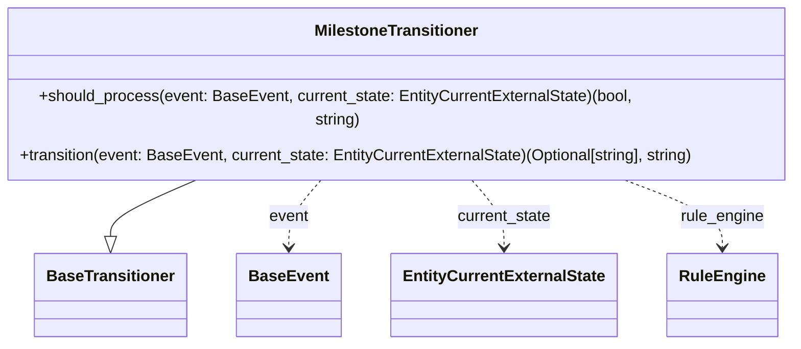
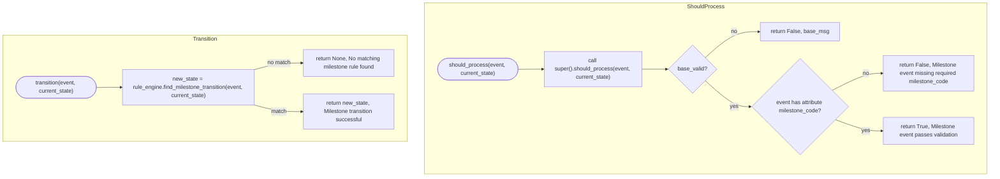

# Diagram: entity_core/entity_service/entity_service/entity/entity/external_state/transitioner/milestone_transitioner.py

> Auto-generated by Obscura crawlers

## Diagram 1

### SVG

<svg id="container" width="811.8984375" xmlns="http://www.w3.org/2000/svg" class="classDiagram" height="324" viewBox="0 0 811.8984375 324" role="graphics-document document" aria-roledescription="class"><g><defs><marker id="container_class-aggregationStart" class="marker aggregation class" refX="18" refY="7" markerWidth="190" markerHeight="240" orient="auto"><path d="M 18,7 L9,13 L1,7 L9,1 Z"></path></marker></defs><defs><marker id="container_class-aggregationEnd" class="marker aggregation class" refX="1" refY="7" markerWidth="20" markerHeight="28" orient="auto"><path d="M 18,7 L9,13 L1,7 L9,1 Z"></path></marker></defs><defs><marker id="container_class-extensionStart" class="marker extension class" refX="18" refY="7" markerWidth="190" markerHeight="240" orient="auto"><path d="M 1,7 L18,13 V 1 Z"></path></marker></defs><defs><marker id="container_class-extensionEnd" class="marker extension class" refX="1" refY="7" markerWidth="20" markerHeight="28" orient="auto"><path d="M 1,1 V 13 L18,7 Z"></path></marker></defs><defs><marker id="container_class-compositionStart" class="marker composition class" refX="18" refY="7" markerWidth="190" markerHeight="240" orient="auto"><path d="M 18,7 L9,13 L1,7 L9,1 Z"></path></marker></defs><defs><marker id="container_class-compositionEnd" class="marker composition class" refX="1" refY="7" markerWidth="20" markerHeight="28" orient="auto"><path d="M 18,7 L9,13 L1,7 L9,1 Z"></path></marker></defs><defs><marker id="container_class-dependencyStart" class="marker dependency class" refX="6" refY="7" markerWidth="190" markerHeight="240" orient="auto"><path d="M 5,7 L9,13 L1,7 L9,1 Z"></path></marker></defs><defs><marker id="container_class-dependencyEnd" class="marker dependency class" refX="13" refY="7" markerWidth="20" markerHeight="28" orient="auto"><path d="M 18,7 L9,13 L14,7 L9,1 Z"></path></marker></defs><defs><marker id="container_class-lollipopStart" class="marker lollipop class" refX="13" refY="7" markerWidth="190" markerHeight="240" orient="auto"><circle stroke="black" fill="transparent" cx="7" cy="7" r="6"></circle></marker></defs><defs><marker id="container_class-lollipopEnd" class="marker lollipop class" refX="1" refY="7" markerWidth="190" markerHeight="240" orient="auto"><circle stroke="black" fill="transparent" cx="7" cy="7" r="6"></circle></marker></defs><g class="root"><g class="clusters"></g><g class="edgePaths"><path d="M219.412,158L204.074,164.167C188.737,170.333,158.062,182.667,142.724,192.125C127.387,201.583,127.387,208.167,127.387,211.458L127.387,214.75" id="id_MilestoneTransitioner_BaseTransitioner_1" class="edge-thickness-normal edge-pattern-solid relation" style=";;;" data-edge="true" data-et="edge" data-id="id_MilestoneTransitioner_BaseTransitioner_1" data-points="W3sieCI6MjE5LjQxMTgzMDM1NzE0Mjg2LCJ5IjoxNTh9LHsieCI6MTI3LjM4NjcxODc1LCJ5IjoxOTV9LHsieCI6MTI3LjM4NjcxODc1LCJ5IjoyMzJ9XQ==" marker-end="url(#container_class-extensionEnd)"></path><path d="M335.689,158L329.912,164.167C324.135,170.333,312.581,182.667,306.804,194C301.027,205.333,301.027,215.667,301.027,220.833L301.027,226" id="id_MilestoneTransitioner_BaseEvent_2" class="edge-thickness-normal edge-pattern-dashed relation" style=";;;" data-edge="true" data-et="edge" data-id="id_MilestoneTransitioner_BaseEvent_2" data-points="W3sieCI6MzM1LjY4OTAzNDU5ODIxNDMsInkiOjE1OH0seyJ4IjozMDEuMDI3MzQzNzUsInkiOjE5NX0seyJ4IjozMDEuMDI3MzQzNzUsInkiOjIzMn1d" marker-end="url(#container_class-dependencyEnd)"></path><path d="M476.209,158L481.986,164.167C487.763,170.333,499.317,182.667,505.094,194C510.871,205.333,510.871,215.667,510.871,220.833L510.871,226" id="id_MilestoneTransitioner_EntityCurrentExternalState_3" class="edge-thickness-normal edge-pattern-dashed relation" style=";;;" data-edge="true" data-et="edge" data-id="id_MilestoneTransitioner_EntityCurrentExternalState_3" data-points="W3sieCI6NDc2LjIwOTQwMjkwMTc4NTcsInkiOjE1OH0seyJ4Ijo1MTAuODcxMDkzNzUsInkiOjE5NX0seyJ4Ijo1MTAuODcxMDkzNzUsInkiOjIzMn1d" marker-end="url(#container_class-dependencyEnd)"></path><path d="M618.723,158L636.218,164.167C653.712,170.333,688.702,182.667,706.197,194C723.691,205.333,723.691,215.667,723.691,220.833L723.691,226" id="id_MilestoneTransitioner_RuleEngine_4" class="edge-thickness-normal edge-pattern-dashed relation" style=";;;" data-edge="true" data-et="edge" data-id="id_MilestoneTransitioner_RuleEngine_4" data-points="W3sieCI6NjE4LjcyMzAwNTAyMjMyMTQsInkiOjE1OH0seyJ4Ijo3MjMuNjkxNDA2MjUsInkiOjE5NX0seyJ4Ijo3MjMuNjkxNDA2MjUsInkiOjIzMn1d" marker-end="url(#container_class-dependencyEnd)"></path></g><g class="edgeLabels"><g class="edgeLabel"><g class="label" data-id="id_MilestoneTransitioner_BaseTransitioner_1" transform="translate(0, 0)"><foreignObject width="0" height="0">

</foreignObject></g></g><g class="edgeLabel" transform="translate(301.02734375, 195)"><g class="label" data-id="id_MilestoneTransitioner_BaseEvent_2" transform="translate(-20.171875, -12)"><foreignObject width="40.34375" height="24">

event

</foreignObject></g></g><g class="edgeLabel" transform="translate(510.87109375, 195)"><g class="label" data-id="id_MilestoneTransitioner_EntityCurrentExternalState_3" transform="translate(-48.484375, -12)"><foreignObject width="96.96875" height="24">

current_state

</foreignObject></g></g><g class="edgeLabel" transform="translate(723.69140625, 195)"><g class="label" data-id="id_MilestoneTransitioner_RuleEngine_4" transform="translate(-42.765625, -12)"><foreignObject width="85.53125" height="24">

rule_engine

</foreignObject></g></g></g><g class="nodes"><g class="node default" id="classId-BaseTransitioner-0" transform="translate(127.38671875, 274)"><g class="basic label-container"><path d="M-73.90625 -42 L73.90625 -42 L73.90625 42 L-73.90625 42" stroke="none" stroke-width="0" fill="#ECECFF" style=""></path><path d="M-73.90625 -42 C-20.04558851607171 -42, 33.81507296785658 -42, 73.90625 -42 M-73.90625 -42 C-19.696194920189228 -42, 34.513860159621544 -42, 73.90625 -42 M73.90625 -42 C73.90625 -12.550422013544313, 73.90625 16.899155972911373, 73.90625 42 M73.90625 -42 C73.90625 -10.769016291300549, 73.90625 20.461967417398903, 73.90625 42 M73.90625 42 C19.77554704776442 42, -34.35515590447116 42, -73.90625 42 M73.90625 42 C43.06519092084439 42, 12.224131841688774 42, -73.90625 42 M-73.90625 42 C-73.90625 24.70022631165475, -73.90625 7.400452623309498, -73.90625 -42 M-73.90625 42 C-73.90625 12.222166683048911, -73.90625 -17.555666633902177, -73.90625 -42" stroke="#9370DB" stroke-width="1.3" fill="none" stroke-dasharray="0 0" style=""></path></g><g class="annotation-group text" transform="translate(0, -18)"></g><g class="label-group text" transform="translate(-61.90625, -18)"><g class="label" style="font-weight: bolder" transform="translate(0,-12)"><foreignObject width="123.8125" height="24">

BaseTransitioner

</foreignObject></g></g><g class="members-group text" transform="translate(-61.90625, 30)"></g><g class="methods-group text" transform="translate(-61.90625, 60)"></g><g class="divider" style=""><path d="M-73.90625 6 C-16.277625193233966 6, 41.35099961353207 6, 73.90625 6 M-73.90625 6 C-29.47641484678116 6, 14.953420306437678 6, 73.90625 6" stroke="#9370DB" stroke-width="1.3" fill="none" stroke-dasharray="0 0" style=""></path></g><g class="divider" style=""><path d="M-73.90625 24 C-37.327755003925915 24, -0.7492600078518308 24, 73.90625 24 M-73.90625 24 C-21.4644689173847 24, 30.9773121652306 24, 73.90625 24" stroke="#9370DB" stroke-width="1.3" fill="none" stroke-dasharray="0 0" style=""></path></g></g><g class="node default" id="classId-MilestoneTransitioner-1" transform="translate(405.94921875, 83)"><g class="basic label-container"><path d="M-397.94921875 -75 L397.94921875 -75 L397.94921875 75 L-397.94921875 75" stroke="none" stroke-width="0" fill="#ECECFF" style=""></path><path d="M-397.94921875 -75 C-180.14061711542138 -75, 37.667984519157244 -75, 397.94921875 -75 M-397.94921875 -75 C-132.31394360476725 -75, 133.3213315404655 -75, 397.94921875 -75 M397.94921875 -75 C397.94921875 -22.159079214077913, 397.94921875 30.681841571844174, 397.94921875 75 M397.94921875 -75 C397.94921875 -28.2721193724106, 397.94921875 18.4557612551788, 397.94921875 75 M397.94921875 75 C190.3946467291798 75, -17.159925291640377 75, -397.94921875 75 M397.94921875 75 C229.17696110658792 75, 60.40470346317585 75, -397.94921875 75 M-397.94921875 75 C-397.94921875 33.94061071275539, -397.94921875 -7.118778574489227, -397.94921875 -75 M-397.94921875 75 C-397.94921875 30.43587411696204, -397.94921875 -14.12825176607592, -397.94921875 -75" stroke="#9370DB" stroke-width="1.3" fill="none" stroke-dasharray="0 0" style=""></path></g><g class="annotation-group text" transform="translate(0, -51)"></g><g class="label-group text" transform="translate(-80.1953125, -51)"><g class="label" style="font-weight: bolder" transform="translate(0,-12)"><foreignObject width="160.390625" height="24">

MilestoneTransitioner

</foreignObject></g></g><g class="members-group text" transform="translate(-385.94921875, -3)"></g><g class="methods-group text" transform="translate(-385.94921875, 27)"><g class="label" style="" transform="translate(0,-12)"><foreignObject width="652.890625" height="24">

+should_process(event: BaseEvent, current_state: EntityCurrentExternalState)(bool, string)

</foreignObject></g><g class="label" style="" transform="translate(0,12)"><foreignObject width="691.703125" height="24">

+transition(event: BaseEvent, current_state: EntityCurrentExternalState)(Optional[string], string)

</foreignObject></g></g><g class="divider" style=""><path d="M-397.94921875 -27 C-142.70457457636167 -27, 112.54006959727667 -27, 397.94921875 -27 M-397.94921875 -27 C-139.61585663205489 -27, 118.71750548589023 -27, 397.94921875 -27" stroke="#9370DB" stroke-width="1.3" fill="none" stroke-dasharray="0 0" style=""></path></g><g class="divider" style=""><path d="M-397.94921875 -3 C-218.3739870222981 -3, -38.79875529459622 -3, 397.94921875 -3 M-397.94921875 -3 C-229.78896132152377 -3, -61.62870389304754 -3, 397.94921875 -3" stroke="#9370DB" stroke-width="1.3" fill="none" stroke-dasharray="0 0" style=""></path></g></g><g class="node default" id="classId-BaseEvent-2" transform="translate(301.02734375, 274)"><g class="basic label-container"><path d="M-49.734375 -42 L49.734375 -42 L49.734375 42 L-49.734375 42" stroke="none" stroke-width="0" fill="#ECECFF" style=""></path><path d="M-49.734375 -42 C-28.20127517695381 -42, -6.668175353907621 -42, 49.734375 -42 M-49.734375 -42 C-11.787275912218625 -42, 26.15982317556275 -42, 49.734375 -42 M49.734375 -42 C49.734375 -25.119464084953822, 49.734375 -8.238928169907645, 49.734375 42 M49.734375 -42 C49.734375 -21.2600635799732, 49.734375 -0.5201271599463979, 49.734375 42 M49.734375 42 C15.634391977135905 42, -18.46559104572819 42, -49.734375 42 M49.734375 42 C26.281202517254858 42, 2.828030034509716 42, -49.734375 42 M-49.734375 42 C-49.734375 18.174584787998132, -49.734375 -5.650830424003736, -49.734375 -42 M-49.734375 42 C-49.734375 17.677621708469378, -49.734375 -6.644756583061245, -49.734375 -42" stroke="#9370DB" stroke-width="1.3" fill="none" stroke-dasharray="0 0" style=""></path></g><g class="annotation-group text" transform="translate(0, -18)"></g><g class="label-group text" transform="translate(-37.734375, -18)"><g class="label" style="font-weight: bolder" transform="translate(0,-12)"><foreignObject width="75.46875" height="24">

BaseEvent

</foreignObject></g></g><g class="members-group text" transform="translate(-37.734375, 30)"></g><g class="methods-group text" transform="translate(-37.734375, 60)"></g><g class="divider" style=""><path d="M-49.734375 6 C-28.991550169089738 6, -8.248725338179476 6, 49.734375 6 M-49.734375 6 C-23.24701741274984 6, 3.240340174500318 6, 49.734375 6" stroke="#9370DB" stroke-width="1.3" fill="none" stroke-dasharray="0 0" style=""></path></g><g class="divider" style=""><path d="M-49.734375 24 C-20.16029897032783 24, 9.41377705934434 24, 49.734375 24 M-49.734375 24 C-22.052089348377457 24, 5.630196303245086 24, 49.734375 24" stroke="#9370DB" stroke-width="1.3" fill="none" stroke-dasharray="0 0" style=""></path></g></g><g class="node default" id="classId-EntityCurrentExternalState-3" transform="translate(510.87109375, 274)"><g class="basic label-container"><path d="M-110.109375 -42 L110.109375 -42 L110.109375 42 L-110.109375 42" stroke="none" stroke-width="0" fill="#ECECFF" style=""></path><path d="M-110.109375 -42 C-28.250660396199947 -42, 53.608054207600105 -42, 110.109375 -42 M-110.109375 -42 C-45.96721164047639 -42, 18.174951719047215 -42, 110.109375 -42 M110.109375 -42 C110.109375 -22.09840858108172, 110.109375 -2.196817162163441, 110.109375 42 M110.109375 -42 C110.109375 -16.00253876932117, 110.109375 9.99492246135766, 110.109375 42 M110.109375 42 C54.27080661921117 42, -1.567761761577657 42, -110.109375 42 M110.109375 42 C39.78463583477142 42, -30.540103330457157 42, -110.109375 42 M-110.109375 42 C-110.109375 18.434212126039338, -110.109375 -5.131575747921325, -110.109375 -42 M-110.109375 42 C-110.109375 16.89982184376331, -110.109375 -8.200356312473382, -110.109375 -42" stroke="#9370DB" stroke-width="1.3" fill="none" stroke-dasharray="0 0" style=""></path></g><g class="annotation-group text" transform="translate(0, -18)"></g><g class="label-group text" transform="translate(-98.109375, -18)"><g class="label" style="font-weight: bolder" transform="translate(0,-12)"><foreignObject width="196.21875" height="24">

EntityCurrentExternalState

</foreignObject></g></g><g class="members-group text" transform="translate(-98.109375, 30)"></g><g class="methods-group text" transform="translate(-98.109375, 60)"></g><g class="divider" style=""><path d="M-110.109375 6 C-58.42159571659983 6, -6.733816433199664 6, 110.109375 6 M-110.109375 6 C-55.90342363482942 6, -1.6974722696588458 6, 110.109375 6" stroke="#9370DB" stroke-width="1.3" fill="none" stroke-dasharray="0 0" style=""></path></g><g class="divider" style=""><path d="M-110.109375 24 C-61.57450852042155 24, -13.039642040843106 24, 110.109375 24 M-110.109375 24 C-56.27551561924505 24, -2.441656238490097 24, 110.109375 24" stroke="#9370DB" stroke-width="1.3" fill="none" stroke-dasharray="0 0" style=""></path></g></g><g class="node default" id="classId-RuleEngine-4" transform="translate(723.69140625, 274)"><g class="basic label-container"><path d="M-52.7109375 -42 L52.7109375 -42 L52.7109375 42 L-52.7109375 42" stroke="none" stroke-width="0" fill="#ECECFF" style=""></path><path d="M-52.7109375 -42 C-12.630252656997953 -42, 27.450432186004093 -42, 52.7109375 -42 M-52.7109375 -42 C-17.481713749663356 -42, 17.747510000673287 -42, 52.7109375 -42 M52.7109375 -42 C52.7109375 -16.70275392717584, 52.7109375 8.594492145648317, 52.7109375 42 M52.7109375 -42 C52.7109375 -13.10603319501401, 52.7109375 15.78793360997198, 52.7109375 42 M52.7109375 42 C26.79976887847806 42, 0.8886002569561171 42, -52.7109375 42 M52.7109375 42 C15.6210347759786 42, -21.4688679480428 42, -52.7109375 42 M-52.7109375 42 C-52.7109375 13.71664490504471, -52.7109375 -14.56671018991058, -52.7109375 -42 M-52.7109375 42 C-52.7109375 24.54162623066394, -52.7109375 7.083252461327881, -52.7109375 -42" stroke="#9370DB" stroke-width="1.3" fill="none" stroke-dasharray="0 0" style=""></path></g><g class="annotation-group text" transform="translate(0, -18)"></g><g class="label-group text" transform="translate(-40.7109375, -18)"><g class="label" style="font-weight: bolder" transform="translate(0,-12)"><foreignObject width="81.421875" height="24">

RuleEngine

</foreignObject></g></g><g class="members-group text" transform="translate(-40.7109375, 30)"></g><g class="methods-group text" transform="translate(-40.7109375, 60)"></g><g class="divider" style=""><path d="M-52.7109375 6 C-18.679669318807534 6, 15.351598862384932 6, 52.7109375 6 M-52.7109375 6 C-11.429538231899713 6, 29.851861036200575 6, 52.7109375 6" stroke="#9370DB" stroke-width="1.3" fill="none" stroke-dasharray="0 0" style=""></path></g><g class="divider" style=""><path d="M-52.7109375 24 C-11.84153190872226 24, 29.02787368255548 24, 52.7109375 24 M-52.7109375 24 C-13.253054064398341 24, 26.204829371203317 24, 52.7109375 24" stroke="#9370DB" stroke-width="1.3" fill="none" stroke-dasharray="0 0" style=""></path></g></g></g></g></g></svg>

## Diagram 2

### SVG

<svg id="container" width="2851.029052734375" xmlns="http://www.w3.org/2000/svg" class="flowchart" height="508.96875" viewBox="0 0 2851.029052734375 508.96875" role="graphics-document document" aria-roledescription="flowchart-v2"><g><marker id="container_flowchart-v2-pointEnd" class="marker flowchart-v2" viewBox="0 0 10 10" refX="5" refY="5" markerUnits="userSpaceOnUse" markerWidth="8" markerHeight="8" orient="auto"><path d="M 0 0 L 10 5 L 0 10 z" class="arrowMarkerPath" style="stroke-width: 1; stroke-dasharray: 1, 0;"></path></marker><marker id="container_flowchart-v2-pointStart" class="marker flowchart-v2" viewBox="0 0 10 10" refX="4.5" refY="5" markerUnits="userSpaceOnUse" markerWidth="8" markerHeight="8" orient="auto"><path d="M 0 5 L 10 10 L 10 0 z" class="arrowMarkerPath" style="stroke-width: 1; stroke-dasharray: 1, 0;"></path></marker><marker id="container_flowchart-v2-circleEnd" class="marker flowchart-v2" viewBox="0 0 10 10" refX="11" refY="5" markerUnits="userSpaceOnUse" markerWidth="11" markerHeight="11" orient="auto"><circle cx="5" cy="5" r="5" class="arrowMarkerPath" style="stroke-width: 1; stroke-dasharray: 1, 0;"></circle></marker><marker id="container_flowchart-v2-circleStart" class="marker flowchart-v2" viewBox="0 0 10 10" refX="-1" refY="5" markerUnits="userSpaceOnUse" markerWidth="11" markerHeight="11" orient="auto"><circle cx="5" cy="5" r="5" class="arrowMarkerPath" style="stroke-width: 1; stroke-dasharray: 1, 0;"></circle></marker><marker id="container_flowchart-v2-crossEnd" class="marker cross flowchart-v2" viewBox="0 0 11 11" refX="12" refY="5.2" markerUnits="userSpaceOnUse" markerWidth="11" markerHeight="11" orient="auto"><path d="M 1,1 l 9,9 M 10,1 l -9,9" class="arrowMarkerPath" style="stroke-width: 2; stroke-dasharray: 1, 0;"></path></marker><marker id="container_flowchart-v2-crossStart" class="marker cross flowchart-v2" viewBox="0 0 11 11" refX="-1" refY="5.2" markerUnits="userSpaceOnUse" markerWidth="11" markerHeight="11" orient="auto"><path d="M 1,1 l 9,9 M 10,1 l -9,9" class="arrowMarkerPath" style="stroke-width: 2; stroke-dasharray: 1, 0;"></path></marker><g class="root"><g class="clusters"></g><g class="edgePaths"></g><g class="edgeLabels"></g><g class="nodes"><g class="root" transform="translate(0, 93.484375)"><g class="clusters"><g class="cluster" id="Transition" data-look="classic"><rect style="" x="8" y="8" width="1172.9051361083984" height="306"></rect><g class="cluster-label" transform="translate(558.2103805541992, 8)"><foreignObject width="72.484375" height="24">

Transition

</foreignObject></g></g></g><g class="edgePaths"><path d="M276.718,158.5L282.884,158.417C289.051,158.333,301.384,158.167,313.134,158.083C324.884,158,336.051,158,341.634,158L347.218,158" id="L_TR_Start_TR_Find_0" class="edge-thickness-normal edge-pattern-solid edge-thickness-normal edge-pattern-solid flowchart-link" style=";" data-edge="true" data-et="edge" data-id="L_TR_Start_TR_Find_0" data-points="W3sieCI6Mjc2LjcxNzYzMTYyMDY0NDYsInkiOjE1OC41fSx7IngiOjMxMy43MTc2MzYxMDgzOTg0NCwieSI6MTU4fSx7IngiOjM1MS4yMTc2MzYxMDgzOTg0NCwieSI6MTU4fV0=" marker-end="url(#container_flowchart-v2-pointEnd)"></path><path d="M739.711,107L751.749,103.833C763.786,100.667,787.861,94.333,811.144,91.167C834.426,88,856.916,88,868.16,88L879.405,88" id="L_TR_Find_TR_NoMatch_0" class="edge-thickness-normal edge-pattern-solid edge-thickness-normal edge-pattern-solid flowchart-link" style=";" data-edge="true" data-et="edge" data-id="L_TR_Find_TR_NoMatch_0" data-points="W3sieCI6NzM5LjcxMDkzOTY3OTgyNywieSI6MTA3fSx7IngiOjgxMS45MzYzODYxMDgzOTg0LCJ5Ijo4OH0seyJ4Ijo4ODMuNDA1MTM2MTA4Mzk4NCwieSI6ODh9XQ==" marker-end="url(#container_flowchart-v2-pointEnd)"></path><path d="M739.711,209L751.749,212.167C763.786,215.333,787.861,221.667,811.144,224.833C834.426,228,856.916,228,868.16,228L879.405,228" id="L_TR_Find_TR_Match_0" class="edge-thickness-normal edge-pattern-solid edge-thickness-normal edge-pattern-solid flowchart-link" style=";" data-edge="true" data-et="edge" data-id="L_TR_Find_TR_Match_0" data-points="W3sieCI6NzM5LjcxMDkzOTY3OTgyNywieSI6MjA5fSx7IngiOjgxMS45MzYzODYxMDgzOTg0LCJ5IjoyMjh9LHsieCI6ODgzLjQwNTEzNjEwODM5ODQsInkiOjIyOH1d" marker-end="url(#container_flowchart-v2-pointEnd)"></path></g><g class="edgeLabels"><g class="edgeLabel"><g class="label" data-id="L_TR_Start_TR_Find_0" transform="translate(0, 0)"><foreignObject width="0" height="0">

</foreignObject></g></g><g class="edgeLabel" transform="translate(811.9363861083984, 88)"><g class="label" data-id="L_TR_Find_TR_NoMatch_0" transform="translate(-33.96875, -12)"><foreignObject width="67.9375" height="24">

no match

</foreignObject></g></g><g class="edgeLabel" transform="translate(811.9363861083984, 228)"><g class="label" data-id="L_TR_Find_TR_Match_0" transform="translate(-22.4921875, -12)"><foreignObject width="44.984375" height="24">

match

</foreignObject></g></g></g><g class="nodes"><g class="node default" id="flowchart-TR_Start-19" transform="translate(160.85881805419922, 158)"><g class="basic label-container outer-path"><path d="M-83.875 -31.5 C-30.96973927188801 -31.5, 21.93552145622398 -31.5, 83.875 -31.5 C83.875 -31.5, 83.875 -31.5, 83.875 -31.5 C84.39731496761533 -31.483250375612986, 84.91962993523065 -31.466500751225972, 85.89321192939245 -31.435279871635593 C86.66074694438636 -31.36123669183504, 87.42828195938029 -31.287193512034484, 87.90313059306193 -31.241385435432253 C88.38340254176279 -31.163738791330886, 88.86367449046367 -31.086092147229518, 89.89649680409322 -30.91911344521856 C90.67882985145626 -30.740551032358187, 91.46116289881928 -30.561988619497814, 91.86511939314947 -30.469788185729428 C92.42654872258638 -30.303158907755243, 92.98797805202328 -30.13652962978106, 93.80090886774406 -29.895256030836062 C94.32695702560552 -29.701665446007176, 94.85300518346699 -29.50807486117829, 95.69591065370028 -29.197877856399685 C96.34710158730023 -28.909614946987706, 96.99829252090016 -28.621352037575726, 97.54233778220308 -28.380519338926202 C98.04226809466921 -28.11970601513327, 98.54219840713533 -27.858892691340337, 99.33260288812403 -27.44653917988677 C99.68668679835949 -27.23189143267401, 100.04077070859493 -27.017243685461253, 101.05934938813228 -26.399775304092984 C101.51386276251642 -26.082726449689467, 101.96837613690056 -25.76567759528595, 102.7154817104733 -25.244529088840633 C103.12664144418119 -24.916640142628612, 103.53780117788908 -24.588751196416595, 104.29419445219533 -23.985547688627737 C104.86944570047966 -23.463119725249893, 105.44469694876399 -22.94069176187205, 105.78900034400982 -22.62800452807842 C106.34477795527837 -22.05411851425314, 106.90055556654694 -21.48023250042786, 107.19375690787243 -21.177478043231485 C107.59646680459066 -20.704432083703978, 107.9991767013089 -20.23138612417647, 108.50269169774293 -19.63992875855011 C108.9530909626097 -19.03643477584577, 109.4034902274765 -18.432940793141427, 109.7104260198041 -18.02167479384835 C110.13352047036524 -17.371688101018616, 110.55661492092638 -16.721701408188878, 110.8119970346684 -16.329365901781543 C111.13092933672033 -15.763069304090754, 111.44986163877228 -15.196772706399965, 111.8028781507495 -14.56995614258631 C112.06368384182349 -14.028387544723348, 112.32448953289747 -13.486818946860385, 112.67899762499809 -12.750675308355413 C112.94634271325772 -12.090327771588456, 113.21368780151737 -11.429980234821496, 113.43675529456745 -10.878999214271206 C113.67706463392635 -10.155225772215804, 113.91737397328525 -9.431452330160402, 114.07303737065482 -8.962618978877531 C114.26264986092228 -8.23954437491459, 114.45226235118973 -7.51646977095165, 114.58522923372745 -7.009409419623907 C114.73636883895793 -6.233339490132234, 114.88750844418843 -5.457269560640561, 114.97122617755518 -5.027396693551458 C115.03227081277379 -4.5539465574226, 115.09331544799241 -4.080496421293743, 115.22944205789975 -3.024725316091981 C115.27576361283681 -2.3032297078609663, 115.32208516777389 -1.5817340996299516, 115.35881581032167 -1.0096246935071378 C115.35881581032167 -0.44537942898634475, 115.35881581032167 0.1188658355344483, 115.35881581032167 1.00962469350713 C115.32286459611423 1.5695938740857662, 115.2869133819068 2.129563054664402, 115.22944205789975 3.02472531609196 C115.14538151120557 3.6766823166194604, 115.06132096451141 4.328639317146961, 114.97122617755518 5.027396693551435 C114.88537649456875 5.468216671349878, 114.7995268115823 5.9090366491483195, 114.58522923372745 7.0094094196239 C114.40090429262786 7.712320306971432, 114.21657935152828 8.415231194318965, 114.07303737065482 8.96261897887751 C113.88170174094871 9.538891410359689, 113.6903661112426 10.115163841841868, 113.43675529456746 10.878999214271184 C113.16293347867351 11.555344393513916, 112.88911166277954 12.231689572756647, 112.67899762499809 12.750675308355405 C112.45041462102772 13.225332806992668, 112.22183161705735 13.699990305629932, 111.8028781507495 14.569956142586303 C111.44369327876582 15.207725254205613, 111.08450840678213 15.845494365824921, 110.81199703466841 16.329365901781536 C110.4807265131017 16.838286381498413, 110.14945599153499 17.347206861215295, 109.71042601980412 18.021674793848334 C109.37527333429281 18.470748859395712, 109.04012064878151 18.91982292494309, 108.50269169774295 19.639928758550102 C107.9971780802702 20.23373381817328, 107.49166446279746 20.827538877796464, 107.19375690787246 21.177478043231467 C106.78454261955986 21.600025393032112, 106.37532833124726 22.022572742832754, 105.78900034400982 22.628004528078414 C105.47765362775817 22.910761377995463, 105.16630691150654 23.19351822791251, 104.29419445219536 23.985547688627715 C103.9138734341448 24.288843579755696, 103.53355241609425 24.592139470883673, 102.71548171047331 25.24452908884063 C102.09279250906134 25.678890119964546, 101.47010330764935 26.11325115108846, 101.05934938813229 26.399775304092973 C100.38043086431092 26.811339703001593, 99.70151234048954 27.222904101910217, 99.33260288812404 27.446539179886766 C98.66110817773811 27.79685754018222, 97.98961346735217 28.14717590047767, 97.54233778220309 28.3805193389262 C97.16718743254027 28.546587270282203, 96.79203708287744 28.712655201638206, 95.6959106537003 29.197877856399682 C95.28852579382992 29.347799250656344, 94.88114093395953 29.49772064491301, 93.80090886774407 29.895256030836055 C93.12017686347157 30.09729371646893, 92.43944485919907 30.299331402101803, 91.86511939314951 30.46978818572942 C91.13773780980875 30.63580828551852, 90.41035622646801 30.801828385307623, 89.89649680409323 30.919113445218557 C89.26076314754948 31.02189393262041, 88.62502949100573 31.124674420022266, 87.90313059306196 31.24138543543225 C87.4532153887054 31.284788214094327, 87.00330018434884 31.328190992756404, 85.89321192939245 31.435279871635593 C85.40295875385344 31.451001336755212, 84.91270557831443 31.46672280187483, 83.875 31.5 C83.875 31.5, 83.875 31.5, 83.875 31.5 C25.57191678670297 31.5, -32.73116642659406 31.5, -83.875 31.5 C-84.31312856314779 31.485950069745364, -84.75125712629557 31.471900139490728, -85.89321192939244 31.435279871635593 C-86.58992093797684 31.36806919149263, -87.28662994656125 31.300858511349666, -87.90313059306195 31.24138543543225 C-88.41635048995897 31.158412022581683, -88.92957038685601 31.075438609731112, -89.89649680409323 30.919113445218557 C-90.58477731704207 30.762017909588078, -91.2730578299909 30.6049223739576, -91.86511939314947 30.469788185729428 C-92.37020470793925 30.31988151554674, -92.87529002272903 30.169974845364056, -93.80090886774403 29.89525603083607 C-94.49393876704433 29.6402146215954, -95.18696866634461 29.38517321235473, -95.69591065370028 29.197877856399685 C-96.41417835955936 28.879922049670338, -97.13244606541845 28.56196624294099, -97.54233778220308 28.380519338926206 C-98.01001954733002 28.136530061623947, -98.47770131245696 27.89254078432169, -99.33260288812403 27.446539179886773 C-99.8116960762285 27.156110073793762, -100.29078926433296 26.865680967700747, -101.05934938813226 26.399775304092994 C-101.51090589258521 26.084789034152642, -101.96246239703817 25.769802764212287, -102.7154817104733 25.244529088840636 C-103.0557126055428 24.973204003947068, -103.3959435006123 24.7018789190535, -104.29419445219533 23.98554768862774 C-104.63789776780617 23.673405431281378, -104.981601083417 23.36126317393501, -105.7890003440098 22.628004528078435 C-106.21856474772507 22.184444013348994, -106.64812915144032 21.740883498619553, -107.19375690787244 21.177478043231478 C-107.5165074865527 20.798356848485458, -107.83925806523295 20.41923565373944, -108.50269169774293 19.639928758550113 C-108.89318562195407 19.11670247483552, -109.28367954616522 18.593476191120928, -109.7104260198041 18.021674793848355 C-109.97132362303935 17.620866014463093, -110.23222122627462 17.22005723507783, -110.8119970346684 16.329365901781557 C-111.01068249359523 15.976579750372618, -111.20936795252206 15.62379359896368, -111.8028781507495 14.569956142586314 C-112.09086181001626 13.971951912255681, -112.37884546928304 13.373947681925051, -112.67899762499809 12.750675308355417 C-112.93157262620943 12.126810172157976, -113.18414762742076 11.502945035960536, -113.43675529456745 10.878999214271209 C-113.59588773950344 10.399717644435905, -113.75502018443945 9.9204360746006, -114.07303737065482 8.962618978877522 C-114.19491899757905 8.497831511584119, -114.3168006245033 8.033044044290715, -114.58522923372743 7.009409419623911 C-114.72417618397773 6.295946196536988, -114.86312313422803 5.582482973450064, -114.97122617755518 5.027396693551461 C-115.04492278445306 4.4558203634925615, -115.11861939135095 3.884244033433661, -115.22944205789975 3.024725316091999 C-115.28093629649317 2.222660984598188, -115.33243053508659 1.4205966531043774, -115.35881581032167 1.0096246935071416 C-115.35881581032167 0.45575582946263815, -115.35881581032167 -0.09811303458186527, -115.35881581032167 -1.0096246935071262 C-115.32992194753996 -1.4596699290385249, -115.30102808475824 -1.9097151645699233, -115.22944205789975 -3.024725316091956 C-115.1699063618069 -3.4864724183351194, -115.11037066571406 -3.9482195205782835, -114.97122617755518 -5.027396693551446 C-114.86871100935132 -5.553790415689793, -114.76619584114746 -6.080184137828141, -114.58522923372745 -7.009409419623896 C-114.38761731246542 -7.762989320944453, -114.19000539120339 -8.51656922226501, -114.07303737065482 -8.962618978877506 C-113.85719463317 -9.612702914311816, -113.64135189568516 -10.262786849746128, -113.43675529456746 -10.878999214271168 C-113.25753993840868 -11.321664608876555, -113.07832458224989 -11.764330003481943, -112.67899762499809 -12.750675308355401 C-112.4447927024651 -13.237006841177733, -112.2105877799321 -13.723338374000065, -111.8028781507495 -14.5699561425863 C-111.50578463276536 -15.097475767748055, -111.2086911147812 -15.62499539290981, -110.8119970346684 -16.329365901781546 C-110.4516730691543 -16.882920273343707, -110.0913491036402 -17.436474644905864, -109.71042601980412 -18.021674793848344 C-109.41875334090294 -18.41248961164823, -109.12708066200177 -18.803304429448115, -108.50269169774295 -19.639928758550102 C-108.02265744143544 -20.20380431073188, -107.54262318512792 -20.767679862913656, -107.19375690787246 -21.177478043231467 C-106.83854892559619 -21.544259448049413, -106.48334094331993 -21.91104085286736, -105.78900034400984 -22.628004528078403 C-105.37374612129143 -23.00512742612659, -104.95849189857304 -23.382250324174777, -104.29419445219536 -23.98554768862771 C-103.84866304912354 -24.340847126488924, -103.40313164605173 -24.696146564350133, -102.71548171047331 -25.244529088840626 C-102.08621612404161 -25.683477521467186, -101.4569505376099 -26.12242595409375, -101.0593493881323 -26.39977530409297 C-100.55928521313292 -26.702917145680882, -100.05922103813353 -27.00605898726879, -99.33260288812404 -27.446539179886763 C-98.73734160573711 -27.757086609624977, -98.14208032335019 -28.067634039363192, -97.54233778220309 -28.3805193389262 C-96.99836167918433 -28.62132142325484, -96.45438557616556 -28.86212350758348, -95.6959106537003 -29.19787785639968 C-94.94574207023926 -29.473946829595707, -94.19557348677823 -29.750015802791737, -93.80090886774407 -29.895256030836055 C-93.25330995238215 -30.057780514510107, -92.70571103702025 -30.22030499818416, -91.86511939314951 -30.469788185729417 C-91.2366766535738 -30.613226140065443, -90.60823391399808 -30.756664094401472, -89.89649680409325 -30.919113445218553 C-89.49329935550101 -30.984299281864033, -89.09010190690877 -31.049485118509512, -87.90313059306196 -31.24138543543225 C-87.15990420522785 -31.313083591206098, -86.41667781739373 -31.38478174697995, -85.89321192939246 -31.435279871635593 C-85.43405904595967 -31.450004010920413, -84.97490616252688 -31.464728150205232, -83.87500000000001 -31.5 C-83.87500000000001 -31.5, -83.875 -31.5, -83.875 -31.5" stroke="none" stroke-width="0" fill="#ECECFF" style=""></path><path d="M-83.875 -31.5 C-38.040367153108214 -31.5, 7.794265693783572 -31.5, 83.875 -31.5 M-83.875 -31.5 C-40.738913464690384 -31.5, 2.397173070619232 -31.5, 83.875 -31.5 M83.875 -31.5 C83.875 -31.5, 83.875 -31.5, 83.875 -31.5 M83.875 -31.5 C83.875 -31.5, 83.875 -31.5, 83.875 -31.5 M83.875 -31.5 C84.47515649291874 -31.480754149405843, 85.07531298583748 -31.461508298811687, 85.89321192939245 -31.435279871635593 M83.875 -31.5 C84.52704444989986 -31.47909020361924, 85.17908889979971 -31.45818040723848, 85.89321192939245 -31.435279871635593 M85.89321192939245 -31.435279871635593 C86.58374801321887 -31.368664686120006, 87.27428409704528 -31.30204950060442, 87.90313059306193 -31.241385435432253 M85.89321192939245 -31.435279871635593 C86.64496269067304 -31.36275937980742, 87.39671345195363 -31.29023888797925, 87.90313059306193 -31.241385435432253 M87.90313059306193 -31.241385435432253 C88.48654976909751 -31.147062747534104, 89.0699689451331 -31.052740059635955, 89.89649680409322 -30.91911344521856 M87.90313059306193 -31.241385435432253 C88.61319653288159 -31.126587480925817, 89.32326247270126 -31.011789526419378, 89.89649680409322 -30.91911344521856 M89.89649680409322 -30.91911344521856 C90.56381866971992 -30.766801584071406, 91.23114053534661 -30.61448972292425, 91.86511939314947 -30.469788185729428 M89.89649680409322 -30.91911344521856 C90.55102667177601 -30.769721274126514, 91.20555653945881 -30.620329103034464, 91.86511939314947 -30.469788185729428 M91.86511939314947 -30.469788185729428 C92.40379865480007 -30.309911008456677, 92.94247791645066 -30.150033831183926, 93.80090886774406 -29.895256030836062 M91.86511939314947 -30.469788185729428 C92.40149625939416 -30.31059434732763, 92.93787312563886 -30.151400508925832, 93.80090886774406 -29.895256030836062 M93.80090886774406 -29.895256030836062 C94.3375715647185 -29.697759197493873, 94.87423426169296 -29.500262364151684, 95.69591065370028 -29.197877856399685 M93.80090886774406 -29.895256030836062 C94.28192714324786 -29.718236858966467, 94.76294541875166 -29.54121768709687, 95.69591065370028 -29.197877856399685 M95.69591065370028 -29.197877856399685 C96.38093876643241 -28.894636231530143, 97.06596687916453 -28.5913946066606, 97.54233778220308 -28.380519338926202 M95.69591065370028 -29.197877856399685 C96.20037734206521 -28.974565417933153, 96.70484403043014 -28.75125297946662, 97.54233778220308 -28.380519338926202 M97.54233778220308 -28.380519338926202 C98.03175424703468 -28.125191082709758, 98.5211707118663 -27.869862826493314, 99.33260288812403 -27.44653917988677 M97.54233778220308 -28.380519338926202 C98.23872733664113 -28.017213354434663, 98.9351168910792 -27.653907369943127, 99.33260288812403 -27.44653917988677 M99.33260288812403 -27.44653917988677 C99.91480477299338 -27.093604975880922, 100.49700665786274 -26.740670771875077, 101.05934938813228 -26.399775304092984 M99.33260288812403 -27.44653917988677 C99.89535584203924 -27.105395032119933, 100.45810879595443 -26.7642508843531, 101.05934938813228 -26.399775304092984 M101.05934938813228 -26.399775304092984 C101.40305840081491 -26.160018775768926, 101.74676741349757 -25.920262247444867, 102.7154817104733 -25.244529088840633 M101.05934938813228 -26.399775304092984 C101.65034960317286 -25.987519138067643, 102.24134981821344 -25.575262972042303, 102.7154817104733 -25.244529088840633 M102.7154817104733 -25.244529088840633 C103.0727731409925 -24.959598680925843, 103.4300645715117 -24.67466827301105, 104.29419445219533 -23.985547688627737 M102.7154817104733 -25.244529088840633 C103.09032375878026 -24.945602530281665, 103.4651658070872 -24.646675971722694, 104.29419445219533 -23.985547688627737 M104.29419445219533 -23.985547688627737 C104.71134081719178 -23.606706397025956, 105.12848718218825 -23.227865105424176, 105.78900034400982 -22.62800452807842 M104.29419445219533 -23.985547688627737 C104.86745391394446 -23.464928613081373, 105.44071337569359 -22.944309537535013, 105.78900034400982 -22.62800452807842 M105.78900034400982 -22.62800452807842 C106.13639554949418 -22.269290456739014, 106.48379075497854 -21.910576385399605, 107.19375690787243 -21.177478043231485 M105.78900034400982 -22.62800452807842 C106.32734276749468 -22.072121777095344, 106.86568519097955 -21.516239026112267, 107.19375690787243 -21.177478043231485 M107.19375690787243 -21.177478043231485 C107.64539135326909 -20.6469625249406, 108.09702579866577 -20.116447006649718, 108.50269169774293 -19.63992875855011 M107.19375690787243 -21.177478043231485 C107.50503507152197 -20.811832999979455, 107.81631323517152 -20.44618795672742, 108.50269169774293 -19.63992875855011 M108.50269169774293 -19.63992875855011 C108.74444312035372 -19.316003876259334, 108.98619454296451 -18.992078993968555, 109.7104260198041 -18.02167479384835 M108.50269169774293 -19.63992875855011 C108.77344119433852 -19.277149098898597, 109.04419069093409 -18.91436943924709, 109.7104260198041 -18.02167479384835 M109.7104260198041 -18.02167479384835 C110.0971064150738 -17.42762986848926, 110.48378681034347 -16.833584943130166, 110.8119970346684 -16.329365901781543 M109.7104260198041 -18.02167479384835 C110.08685551381826 -17.443378005570153, 110.46328500783243 -16.86508121729195, 110.8119970346684 -16.329365901781543 M110.8119970346684 -16.329365901781543 C111.09188510238269 -15.832396295814684, 111.37177317009699 -15.335426689847823, 111.8028781507495 -14.56995614258631 M110.8119970346684 -16.329365901781543 C111.09820494058566 -15.821174783132294, 111.38441284650294 -15.312983664483045, 111.8028781507495 -14.56995614258631 M111.8028781507495 -14.56995614258631 C112.13905088505115 -13.871886266864733, 112.47522361935278 -13.173816391143157, 112.67899762499809 -12.750675308355413 M111.8028781507495 -14.56995614258631 C112.05808479833269 -14.04001407833233, 112.31329144591588 -13.51007201407835, 112.67899762499809 -12.750675308355413 M112.67899762499809 -12.750675308355413 C112.95145541072829 -12.077699309988885, 113.22391319645848 -11.404723311622359, 113.43675529456745 -10.878999214271206 M112.67899762499809 -12.750675308355413 C112.95944934041984 -12.05795414909863, 113.2399010558416 -11.365232989841846, 113.43675529456745 -10.878999214271206 M113.43675529456745 -10.878999214271206 C113.6380214443575 -10.27281763850967, 113.83928759414758 -9.666636062748134, 114.07303737065482 -8.962618978877531 M113.43675529456745 -10.878999214271206 C113.61309500728714 -10.347892095477212, 113.78943472000684 -9.816784976683218, 114.07303737065482 -8.962618978877531 M114.07303737065482 -8.962618978877531 C114.2081232204178 -8.447478087153614, 114.34320907018079 -7.932337195429699, 114.58522923372745 -7.009409419623907 M114.07303737065482 -8.962618978877531 C114.25155175537803 -8.281866261304158, 114.43006614010125 -7.601113543730784, 114.58522923372745 -7.009409419623907 M114.58522923372745 -7.009409419623907 C114.71363929939992 -6.350050871872776, 114.84204936507238 -5.690692324121646, 114.97122617755518 -5.027396693551458 M114.58522923372745 -7.009409419623907 C114.71780244791432 -6.328673984133034, 114.8503756621012 -5.647938548642162, 114.97122617755518 -5.027396693551458 M114.97122617755518 -5.027396693551458 C115.02770690785212 -4.5893433027501676, 115.08418763814905 -4.1512899119488775, 115.22944205789975 -3.024725316091981 M114.97122617755518 -5.027396693551458 C115.06814736767778 -4.275695082214344, 115.16506855780038 -3.5239934708772296, 115.22944205789975 -3.024725316091981 M115.22944205789975 -3.024725316091981 C115.27709103105164 -2.2825540976924557, 115.32474000420352 -1.5403828792929302, 115.35881581032167 -1.0096246935071378 M115.22944205789975 -3.024725316091981 C115.2754439929581 -2.308208045464503, 115.32144592801644 -1.5916907748370246, 115.35881581032167 -1.0096246935071378 M115.35881581032167 -1.0096246935071378 C115.35881581032167 -0.5512581433254371, 115.35881581032167 -0.0928915931437363, 115.35881581032167 1.00962469350713 M115.35881581032167 -1.0096246935071378 C115.35881581032167 -0.5260481722727721, 115.35881581032167 -0.042471651038406444, 115.35881581032167 1.00962469350713 M115.35881581032167 1.00962469350713 C115.32278189418928 1.57088202332278, 115.28674797805688 2.13213935313843, 115.22944205789975 3.02472531609196 M115.35881581032167 1.00962469350713 C115.33202807944319 1.426865224606725, 115.3052403485647 1.84410575570632, 115.22944205789975 3.02472531609196 M115.22944205789975 3.02472531609196 C115.14287019182548 3.6961596138154253, 115.0562983257512 4.367593911538891, 114.97122617755518 5.027396693551435 M115.22944205789975 3.02472531609196 C115.16643925405214 3.513362621423177, 115.10343645020453 4.001999926754394, 114.97122617755518 5.027396693551435 M114.97122617755518 5.027396693551435 C114.82994508825946 5.752845227316153, 114.68866399896375 6.478293761080872, 114.58522923372745 7.0094094196239 M114.97122617755518 5.027396693551435 C114.88917643176065 5.448704796986478, 114.80712668596611 5.87001290042152, 114.58522923372745 7.0094094196239 M114.58522923372745 7.0094094196239 C114.44793624673515 7.532967082182494, 114.31064325974285 8.056524744741088, 114.07303737065482 8.96261897887751 M114.58522923372745 7.0094094196239 C114.43062291651536 7.598990313955316, 114.27601659930328 8.188571208286731, 114.07303737065482 8.96261897887751 M114.07303737065482 8.96261897887751 C113.83125407444811 9.690831744115387, 113.5894707782414 10.419044509353263, 113.43675529456746 10.878999214271184 M114.07303737065482 8.96261897887751 C113.84166678070711 9.659470331902703, 113.61029619075941 10.356321684927899, 113.43675529456746 10.878999214271184 M113.43675529456746 10.878999214271184 C113.18295184522765 11.505898641096381, 112.92914839588784 12.132798067921579, 112.67899762499809 12.750675308355405 M113.43675529456746 10.878999214271184 C113.20569969298856 11.449711017327207, 112.97464409140967 12.02042282038323, 112.67899762499809 12.750675308355405 M112.67899762499809 12.750675308355405 C112.49022998694201 13.14265534775929, 112.30146234888592 13.534635387163174, 111.8028781507495 14.569956142586303 M112.67899762499809 12.750675308355405 C112.49716440141806 13.128255887727045, 112.31533117783805 13.505836467098685, 111.8028781507495 14.569956142586303 M111.8028781507495 14.569956142586303 C111.56712230759518 14.988564514974613, 111.33136646444086 15.407172887362922, 110.81199703466841 16.329365901781536 M111.8028781507495 14.569956142586303 C111.59430950736133 14.940290888787313, 111.38574086397315 15.310625634988325, 110.81199703466841 16.329365901781536 M110.81199703466841 16.329365901781536 C110.39069308229124 16.976601908584602, 109.96938912991408 17.623837915387668, 109.71042601980412 18.021674793848334 M110.81199703466841 16.329365901781536 C110.48563231276015 16.83074975583138, 110.15926759085188 17.332133609881225, 109.71042601980412 18.021674793848334 M109.71042601980412 18.021674793848334 C109.26359060288223 18.620393544979756, 108.81675518596033 19.219112296111177, 108.50269169774295 19.639928758550102 M109.71042601980412 18.021674793848334 C109.26792627778934 18.614584135592327, 108.82542653577457 19.20749347733632, 108.50269169774295 19.639928758550102 M108.50269169774295 19.639928758550102 C108.10710000687985 20.10461326844278, 107.71150831601676 20.569297778335457, 107.19375690787246 21.177478043231467 M108.50269169774295 19.639928758550102 C108.13700478907901 20.069485409641324, 107.7713178804151 20.499042060732545, 107.19375690787246 21.177478043231467 M107.19375690787246 21.177478043231467 C106.89127084935099 21.48981973322214, 106.58878479082954 21.802161423212812, 105.78900034400982 22.628004528078414 M107.19375690787246 21.177478043231467 C106.75204852005119 21.633578218589992, 106.31034013222994 22.089678393948518, 105.78900034400982 22.628004528078414 M105.78900034400982 22.628004528078414 C105.30675371846216 23.06596815385429, 104.8245070929145 23.50393177963016, 104.29419445219536 23.985547688627715 M105.78900034400982 22.628004528078414 C105.48930854008228 22.900176694994798, 105.18961673615473 23.172348861911182, 104.29419445219536 23.985547688627715 M104.29419445219536 23.985547688627715 C103.67074887105353 24.482728949004652, 103.0473032899117 24.979910209381586, 102.71548171047331 25.24452908884063 M104.29419445219536 23.985547688627715 C103.7658228432123 24.406909986232684, 103.23745123422924 24.828272283837652, 102.71548171047331 25.24452908884063 M102.71548171047331 25.24452908884063 C102.09465206995701 25.677592970782822, 101.47382242944069 26.110656852725015, 101.05934938813229 26.399775304092973 M102.71548171047331 25.24452908884063 C102.27081251125244 25.554711072797712, 101.82614331203159 25.864893056754795, 101.05934938813229 26.399775304092973 M101.05934938813229 26.399775304092973 C100.45212232578882 26.767879917747894, 99.84489526344537 27.135984531402816, 99.33260288812404 27.446539179886766 M101.05934938813229 26.399775304092973 C100.39993824291729 26.799514215452334, 99.74052709770228 27.199253126811694, 99.33260288812404 27.446539179886766 M99.33260288812404 27.446539179886766 C98.63157635885706 27.812264271176428, 97.93054982959009 28.177989362466086, 97.54233778220309 28.3805193389262 M99.33260288812404 27.446539179886766 C98.61868431702933 27.81899004114021, 97.90476574593461 28.19144090239365, 97.54233778220309 28.3805193389262 M97.54233778220309 28.3805193389262 C97.16071232146481 28.549453609877958, 96.77908686072655 28.718387880829717, 95.6959106537003 29.197877856399682 M97.54233778220309 28.3805193389262 C96.8653362825101 28.680207820304332, 96.1883347828171 28.979896301682466, 95.6959106537003 29.197877856399682 M95.6959106537003 29.197877856399682 C94.96162841905434 29.468100506379965, 94.22734618440836 29.738323156360252, 93.80090886774407 29.895256030836055 M95.6959106537003 29.197877856399682 C95.15701183932373 29.39619760161629, 94.61811302494716 29.594517346832898, 93.80090886774407 29.895256030836055 M93.80090886774407 29.895256030836055 C93.18693377174567 30.077480616507334, 92.57295867574729 30.259705202178615, 91.86511939314951 30.46978818572942 M93.80090886774407 29.895256030836055 C93.08995680689488 30.10626287063258, 92.37900474604567 30.317269710429102, 91.86511939314951 30.46978818572942 M91.86511939314951 30.46978818572942 C91.23743216613235 30.613053699254134, 90.60974493911519 30.756319212778852, 89.89649680409323 30.919113445218557 M91.86511939314951 30.46978818572942 C91.39173870076475 30.577834239668533, 90.91835800837998 30.68588029360765, 89.89649680409323 30.919113445218557 M89.89649680409323 30.919113445218557 C89.29195041215829 31.01685181753931, 88.68740402022333 31.114590189860063, 87.90313059306196 31.24138543543225 M89.89649680409323 30.919113445218557 C89.48559475549769 30.985544901842506, 89.07469270690214 31.051976358466455, 87.90313059306196 31.24138543543225 M87.90313059306196 31.24138543543225 C87.19434246427954 31.309761373773448, 86.48555433549714 31.378137312114646, 85.89321192939245 31.435279871635593 M87.90313059306196 31.24138543543225 C87.50103862715135 31.280174763797305, 87.09894666124073 31.318964092162364, 85.89321192939245 31.435279871635593 M85.89321192939245 31.435279871635593 C85.16325689755624 31.458688108735306, 84.43330186572004 31.482096345835014, 83.875 31.5 M85.89321192939245 31.435279871635593 C85.14411809648038 31.45930185283439, 84.39502426356832 31.48332383403319, 83.875 31.5 M83.875 31.5 C83.875 31.5, 83.875 31.5, 83.875 31.5 M83.875 31.5 C83.875 31.5, 83.875 31.5, 83.875 31.5 M83.875 31.5 C43.71694313100665 31.5, 3.558886262013303 31.5, -83.875 31.5 M83.875 31.5 C47.04706023025731 31.5, 10.219120460514617 31.5, -83.875 31.5 M-83.875 31.5 C-84.44285147160704 31.4817901085614, -85.01070294321408 31.4635802171228, -85.89321192939244 31.435279871635593 M-83.875 31.5 C-84.50915141182315 31.479663998523673, -85.1433028236463 31.459327997047346, -85.89321192939244 31.435279871635593 M-85.89321192939244 31.435279871635593 C-86.38759384367582 31.387587442945918, -86.8819757579592 31.339895014256243, -87.90313059306195 31.24138543543225 M-85.89321192939244 31.435279871635593 C-86.59235039847428 31.367834824360294, -87.29148886755614 31.300389777084998, -87.90313059306195 31.24138543543225 M-87.90313059306195 31.24138543543225 C-88.6517985982341 31.12034659836311, -89.40046660340626 30.99930776129397, -89.89649680409323 30.919113445218557 M-87.90313059306195 31.24138543543225 C-88.49666816297787 31.145426884080845, -89.09020573289379 31.049468332729436, -89.89649680409323 30.919113445218557 M-89.89649680409323 30.919113445218557 C-90.2905078610511 30.829182992630358, -90.68451891800896 30.73925254004216, -91.86511939314947 30.469788185729428 M-89.89649680409323 30.919113445218557 C-90.58481599688376 30.76200908116662, -91.2731351896743 30.604904717114685, -91.86511939314947 30.469788185729428 M-91.86511939314947 30.469788185729428 C-92.40725003868975 30.3088866558349, -92.94938068423004 30.147985125940373, -93.80090886774403 29.89525603083607 M-91.86511939314947 30.469788185729428 C-92.49247152994272 30.283593364567757, -93.11982366673597 30.097398543406086, -93.80090886774403 29.89525603083607 M-93.80090886774403 29.89525603083607 C-94.39894059217583 29.675174828100506, -94.99697231660764 29.455093625364942, -95.69591065370028 29.197877856399685 M-93.80090886774403 29.89525603083607 C-94.47081452078007 29.648724557978834, -95.1407201738161 29.402193085121596, -95.69591065370028 29.197877856399685 M-95.69591065370028 29.197877856399685 C-96.3159059896101 28.923424312700597, -96.93590132551992 28.648970769001508, -97.54233778220308 28.380519338926206 M-95.69591065370028 29.197877856399685 C-96.40077516668873 28.885855245562574, -97.1056396796772 28.573832634725466, -97.54233778220308 28.380519338926206 M-97.54233778220308 28.380519338926206 C-98.04232255384902 28.119677603814047, -98.54230732549497 27.858835868701888, -99.33260288812403 27.446539179886773 M-97.54233778220308 28.380519338926206 C-97.94495427286931 28.170474573633804, -98.34757076353554 27.960429808341402, -99.33260288812403 27.446539179886773 M-99.33260288812403 27.446539179886773 C-99.8471792591529 27.134599959782662, -100.36175563018176 26.82266073967855, -101.05934938813226 26.399775304092994 M-99.33260288812403 27.446539179886773 C-99.70435259165792 27.221182324960775, -100.07610229519182 26.995825470034777, -101.05934938813226 26.399775304092994 M-101.05934938813226 26.399775304092994 C-101.52129373859609 26.077542922458065, -101.98323808905991 25.755310540823135, -102.7154817104733 25.244529088840636 M-101.05934938813226 26.399775304092994 C-101.56652363351445 26.045992505733608, -102.07369787889664 25.69220970737422, -102.7154817104733 25.244529088840636 M-102.7154817104733 25.244529088840636 C-103.12474990198507 24.91814859719397, -103.53401809349685 24.591768105547303, -104.29419445219533 23.98554768862774 M-102.7154817104733 25.244529088840636 C-103.03673245724916 24.98834016712829, -103.35798320402502 24.73215124541594, -104.29419445219533 23.98554768862774 M-104.29419445219533 23.98554768862774 C-104.68776953464828 23.628113212170014, -105.08134461710122 23.270678735712288, -105.7890003440098 22.628004528078435 M-104.29419445219533 23.98554768862774 C-104.61650220780714 23.692836312776997, -104.93880996341895 23.400124936926254, -105.7890003440098 22.628004528078435 M-105.7890003440098 22.628004528078435 C-106.10546299991721 22.301230853786787, -106.42192565582462 21.97445717949514, -107.19375690787244 21.177478043231478 M-105.7890003440098 22.628004528078435 C-106.07822462721325 22.32935670991562, -106.36744891041668 22.030708891752806, -107.19375690787244 21.177478043231478 M-107.19375690787244 21.177478043231478 C-107.4844212764428 20.836047136637625, -107.77508564501316 20.494616230043775, -108.50269169774293 19.639928758550113 M-107.19375690787244 21.177478043231478 C-107.68435688729603 20.601191391470866, -108.17495686671964 20.02490473971025, -108.50269169774293 19.639928758550113 M-108.50269169774293 19.639928758550113 C-108.84683952097544 19.178802027930235, -109.19098734420794 18.717675297310358, -109.7104260198041 18.021674793848355 M-108.50269169774293 19.639928758550113 C-108.87367702651026 19.14284221546062, -109.2446623552776 18.64575567237113, -109.7104260198041 18.021674793848355 M-109.7104260198041 18.021674793848355 C-109.97231355193287 17.619345217849535, -110.23420108406164 17.21701564185072, -110.8119970346684 16.329365901781557 M-109.7104260198041 18.021674793848355 C-109.9660533145383 17.62896262359671, -110.2216806092725 17.236250453345065, -110.8119970346684 16.329365901781557 M-110.8119970346684 16.329365901781557 C-111.18020913880487 15.675568025368607, -111.54842124294134 15.021770148955657, -111.8028781507495 14.569956142586314 M-110.8119970346684 16.329365901781557 C-111.16947633567911 15.694625204132567, -111.5269556366898 15.059884506483577, -111.8028781507495 14.569956142586314 M-111.8028781507495 14.569956142586314 C-112.13694213539404 13.876265130647734, -112.47100612003857 13.182574118709155, -112.67899762499809 12.750675308355417 M-111.8028781507495 14.569956142586314 C-112.10431596204172 13.944014077702075, -112.40575377333396 13.318072012817838, -112.67899762499809 12.750675308355417 M-112.67899762499809 12.750675308355417 C-112.94507732741226 12.093453299091335, -113.21115702982642 11.436231289827253, -113.43675529456745 10.878999214271209 M-112.67899762499809 12.750675308355417 C-112.8468802599207 12.336001954306644, -113.0147628948433 11.921328600257873, -113.43675529456745 10.878999214271209 M-113.43675529456745 10.878999214271209 C-113.62380260963181 10.315642503239815, -113.81084992469619 9.752285792208422, -114.07303737065482 8.962618978877522 M-113.43675529456745 10.878999214271209 C-113.56614989164657 10.489283304098173, -113.69554448872572 10.099567393925138, -114.07303737065482 8.962618978877522 M-114.07303737065482 8.962618978877522 C-114.26779745733961 8.219914358792835, -114.46255754402442 7.477209738708147, -114.58522923372743 7.009409419623911 M-114.07303737065482 8.962618978877522 C-114.20309078069246 8.4666689608995, -114.33314419073011 7.97071894292148, -114.58522923372743 7.009409419623911 M-114.58522923372743 7.009409419623911 C-114.66455160746979 6.602105795246542, -114.74387398121215 6.194802170869172, -114.97122617755518 5.027396693551461 M-114.58522923372743 7.009409419623911 C-114.70269629894625 6.406240866398295, -114.82016336416508 5.803072313172677, -114.97122617755518 5.027396693551461 M-114.97122617755518 5.027396693551461 C-115.02482854599354 4.6116673089284195, -115.0784309144319 4.195937924305378, -115.22944205789975 3.024725316091999 M-114.97122617755518 5.027396693551461 C-115.04487952704923 4.456155859374528, -115.11853287654328 3.8849150251975955, -115.22944205789975 3.024725316091999 M-115.22944205789975 3.024725316091999 C-115.26549038789508 2.463243478726264, -115.30153871789044 1.9017616413605287, -115.35881581032167 1.0096246935071416 M-115.22944205789975 3.024725316091999 C-115.2716391936283 2.367470866204919, -115.31383632935685 1.7102164163178388, -115.35881581032167 1.0096246935071416 M-115.35881581032167 1.0096246935071416 C-115.35881581032167 0.46964924949320597, -115.35881581032167 -0.07032619452072963, -115.35881581032167 -1.0096246935071262 M-115.35881581032167 1.0096246935071416 C-115.35881581032167 0.5911089331575041, -115.35881581032167 0.17259317280786668, -115.35881581032167 -1.0096246935071262 M-115.35881581032167 -1.0096246935071262 C-115.30962896251977 -1.7757495509306906, -115.26044211471786 -2.541874408354255, -115.22944205789975 -3.024725316091956 M-115.35881581032167 -1.0096246935071262 C-115.31434610529324 -1.7022762446247284, -115.26987640026482 -2.3949277957423307, -115.22944205789975 -3.024725316091956 M-115.22944205789975 -3.024725316091956 C-115.14828353273568 -3.6541748107009875, -115.0671250075716 -4.283624305310019, -114.97122617755518 -5.027396693551446 M-115.22944205789975 -3.024725316091956 C-115.14354731160142 -3.690908006545593, -115.0576525653031 -4.357090696999229, -114.97122617755518 -5.027396693551446 M-114.97122617755518 -5.027396693551446 C-114.83222317013582 -5.741147758353839, -114.69322016271646 -6.454898823156233, -114.58522923372745 -7.009409419623896 M-114.97122617755518 -5.027396693551446 C-114.89043036673351 -5.442266105920049, -114.80963455591184 -5.8571355182886515, -114.58522923372745 -7.009409419623896 M-114.58522923372745 -7.009409419623896 C-114.38980707359072 -7.754638812725239, -114.19438491345397 -8.499868205826582, -114.07303737065482 -8.962618978877506 M-114.58522923372745 -7.009409419623896 C-114.38800853184568 -7.761497431891964, -114.19078782996391 -8.513585444160032, -114.07303737065482 -8.962618978877506 M-114.07303737065482 -8.962618978877506 C-113.85142920645335 -9.630067460986364, -113.62982104225186 -10.297515943095222, -113.43675529456746 -10.878999214271168 M-114.07303737065482 -8.962618978877506 C-113.84380464378259 -9.65303142894157, -113.61457191691038 -10.343443879005637, -113.43675529456746 -10.878999214271168 M-113.43675529456746 -10.878999214271168 C-113.24165701174708 -11.36089574480622, -113.04655872892668 -11.842792275341269, -112.67899762499809 -12.750675308355401 M-113.43675529456746 -10.878999214271168 C-113.2257468396455 -11.400194177499358, -113.01473838472353 -11.92138914072755, -112.67899762499809 -12.750675308355401 M-112.67899762499809 -12.750675308355401 C-112.38566483037285 -13.359787132711066, -112.09233203574762 -13.968898957066733, -111.8028781507495 -14.5699561425863 M-112.67899762499809 -12.750675308355401 C-112.49171821495705 -13.139565010443087, -112.30443880491599 -13.528454712530772, -111.8028781507495 -14.5699561425863 M-111.8028781507495 -14.5699561425863 C-111.48103184792025 -15.1414268437318, -111.15918554509099 -15.712897544877299, -110.8119970346684 -16.329365901781546 M-111.8028781507495 -14.5699561425863 C-111.48573278819525 -15.133079848251704, -111.16858742564101 -15.696203553917108, -110.8119970346684 -16.329365901781546 M-110.8119970346684 -16.329365901781546 C-110.58179117764526 -16.683023917097167, -110.35158532062212 -17.036681932412787, -109.71042601980412 -18.021674793848344 M-110.8119970346684 -16.329365901781546 C-110.50053632347631 -16.807853193084107, -110.18907561228421 -17.286340484386667, -109.71042601980412 -18.021674793848344 M-109.71042601980412 -18.021674793848344 C-109.27624663832663 -18.60343561047281, -108.84206725684915 -19.185196427097274, -108.50269169774295 -19.639928758550102 M-109.71042601980412 -18.021674793848344 C-109.43649901270608 -18.38871202809599, -109.16257200560804 -18.75574926234364, -108.50269169774295 -19.639928758550102 M-108.50269169774295 -19.639928758550102 C-108.03029655977406 -20.194830967653193, -107.55790142180516 -20.749733176756287, -107.19375690787246 -21.177478043231467 M-108.50269169774295 -19.639928758550102 C-108.14595940461831 -20.05896680869681, -107.78922711149369 -20.47800485884352, -107.19375690787246 -21.177478043231467 M-107.19375690787246 -21.177478043231467 C-106.74411194690825 -21.641773381964857, -106.29446698594404 -22.106068720698246, -105.78900034400984 -22.628004528078403 M-107.19375690787246 -21.177478043231467 C-106.86886454652824 -21.512956080478304, -106.54397218518403 -21.848434117725144, -105.78900034400984 -22.628004528078403 M-105.78900034400984 -22.628004528078403 C-105.3977834389326 -22.983297370237448, -105.00656653385539 -23.338590212396497, -104.29419445219536 -23.98554768862771 M-105.78900034400984 -22.628004528078403 C-105.40636976135085 -22.975499499398847, -105.02373917869186 -23.322994470719294, -104.29419445219536 -23.98554768862771 M-104.29419445219536 -23.98554768862771 C-103.85773897864973 -24.333609314212413, -103.42128350510411 -24.68167093979711, -102.71548171047331 -25.244529088840626 M-104.29419445219536 -23.98554768862771 C-103.96135400004738 -24.250979091959305, -103.62851354789942 -24.516410495290902, -102.71548171047331 -25.244529088840626 M-102.71548171047331 -25.244529088840626 C-102.30223770847624 -25.532790215589255, -101.88899370647917 -25.82105134233789, -101.0593493881323 -26.39977530409297 M-102.71548171047331 -25.244529088840626 C-102.22862500837803 -25.584139248535344, -101.74176830628275 -25.92374940823006, -101.0593493881323 -26.39977530409297 M-101.0593493881323 -26.39977530409297 C-100.65088453183341 -26.64738910038729, -100.24241967553453 -26.89500289668161, -99.33260288812404 -27.446539179886763 M-101.0593493881323 -26.39977530409297 C-100.57180005635165 -26.695330574176303, -100.08425072457099 -26.990885844259637, -99.33260288812404 -27.446539179886763 M-99.33260288812404 -27.446539179886763 C-98.6414734086663 -27.80710098663031, -97.95034392920854 -28.16766279337386, -97.54233778220309 -28.3805193389262 M-99.33260288812404 -27.446539179886763 C-98.6833935963773 -27.78523125155264, -98.03418430463057 -28.123923323218516, -97.54233778220309 -28.3805193389262 M-97.54233778220309 -28.3805193389262 C-96.89919032772649 -28.6652216387316, -96.2560428732499 -28.949923938537008, -95.6959106537003 -29.19787785639968 M-97.54233778220309 -28.3805193389262 C-97.09984229171012 -28.576398966405087, -96.65734680121713 -28.772278593883975, -95.6959106537003 -29.19787785639968 M-95.6959106537003 -29.19787785639968 C-95.10662272698279 -29.4147412607496, -94.51733480026529 -29.631604665099527, -93.80090886774407 -29.895256030836055 M-95.6959106537003 -29.19787785639968 C-95.00198937066038 -29.453247303096393, -94.30806808762046 -29.70861674979311, -93.80090886774407 -29.895256030836055 M-93.80090886774407 -29.895256030836055 C-93.31087115056152 -30.040696653035365, -92.82083343337898 -30.186137275234678, -91.86511939314951 -30.469788185729417 M-93.80090886774407 -29.895256030836055 C-93.24887660801402 -30.059096307847476, -92.69684434828395 -30.222936584858896, -91.86511939314951 -30.469788185729417 M-91.86511939314951 -30.469788185729417 C-91.44041452468865 -30.566724300497338, -91.01570965622778 -30.66366041526526, -89.89649680409325 -30.919113445218553 M-91.86511939314951 -30.469788185729417 C-91.45076674420231 -30.56436147394789, -91.0364140952551 -30.658934762166364, -89.89649680409325 -30.919113445218553 M-89.89649680409325 -30.919113445218553 C-89.17861317459753 -31.035175303164728, -88.46072954510181 -31.1512371611109, -87.90313059306196 -31.24138543543225 M-89.89649680409325 -30.919113445218553 C-89.1085123454441 -31.046508661582205, -88.32052788679495 -31.173903877945857, -87.90313059306196 -31.24138543543225 M-87.90313059306196 -31.24138543543225 C-87.23887124813794 -31.305465735548328, -86.5746119032139 -31.369546035664406, -85.89321192939246 -31.435279871635593 M-87.90313059306196 -31.24138543543225 C-87.11286704768514 -31.317621209223784, -86.32260350230834 -31.393856983015322, -85.89321192939246 -31.435279871635593 M-85.89321192939246 -31.435279871635593 C-85.17631429774892 -31.458269383325813, -84.45941666610535 -31.481258895016033, -83.87500000000001 -31.5 M-85.89321192939246 -31.435279871635593 C-85.3516552003234 -31.452646541860613, -84.81009847125434 -31.470013212085632, -83.87500000000001 -31.5 M-83.87500000000001 -31.5 C-83.87500000000001 -31.5, -83.875 -31.5, -83.875 -31.5 M-83.87500000000001 -31.5 C-83.87500000000001 -31.5, -83.875 -31.5, -83.875 -31.5" stroke="#9370DB" stroke-width="1.3" fill="none" stroke-dasharray="0 0" style=""></path></g><g class="label" style="" transform="translate(-100, -24)"><rect></rect><foreignObject width="200" height="48">

transition(event, current_state)

</foreignObject></g></g><g class="node default" id="flowchart-TR_Find-20" transform="translate(545.8426361083984, 158)"><rect class="basic label-container" style="" x="-194.625" y="-51" width="389.25" height="102"></rect><g class="label" style="" transform="translate(-164.625, -36)"><rect></rect><foreignObject width="329.25" height="72">

new_state = rule_engine.find_milestone_transition(event, current_state)

</foreignObject></g></g><g class="node default" id="flowchart-TR_NoMatch-21" transform="translate(1013.4051361083984, 88)"><rect class="basic label-container" style="" x="-130" y="-39" width="260" height="78"></rect><g class="label" style="" transform="translate(-100, -24)"><rect></rect><foreignObject width="200" height="48">

return None, No matching milestone rule found

</foreignObject></g></g><g class="node default" id="flowchart-TR_Match-22" transform="translate(1013.4051361083984, 228)"><rect class="basic label-container" style="" x="-130" y="-51" width="260" height="102"></rect><g class="label" style="" transform="translate(-100, -36)"><rect></rect><foreignObject width="200" height="72">

return new_state, Milestone transition successful

</foreignObject></g></g></g></g><g class="root" transform="translate(1222.9051513671875, 0)"><g class="clusters"><g class="cluster" id="ShouldProcess" data-look="classic"><rect style="" x="8" y="8" width="1612.1238861083984" height="492.96875"></rect><g class="cluster-label" transform="translate(761.1713180541992, 8)"><foreignObject width="105.78125" height="24">

ShouldProcess

</foreignObject></g></g></g><g class="edgePaths"><path d="M276.718,199.469L282.884,199.385C289.051,199.302,301.384,199.135,313.134,199.052C324.884,198.969,336.051,198.969,341.634,198.969L347.218,198.969" id="L_SP_Start_SP_SuperCall_0" class="edge-thickness-normal edge-pattern-solid edge-thickness-normal edge-pattern-solid flowchart-link" style=";" data-edge="true" data-et="edge" data-id="L_SP_Start_SP_SuperCall_0" data-points="W3sieCI6Mjc2LjcxNzYzMTYyMDY0NDYsInkiOjE5OS40Njg3NX0seyJ4IjozMTMuNzE3NjM2MTA4Mzk4NDQsInkiOjE5OC45Njg3NX0seyJ4IjozNTEuMjE3NjM2MTA4Mzk4NDQsInkiOjE5OC45Njg3NX1d" marker-end="url(#container_flowchart-v2-pointEnd)"></path><path d="M633.718,198.969L639.968,198.969C646.218,198.969,658.718,198.969,670.551,198.969C682.384,198.969,693.551,198.969,699.134,198.969L704.718,198.969" id="L_SP_SuperCall_SP_CheckBase_0" class="edge-thickness-normal edge-pattern-solid edge-thickness-normal edge-pattern-solid flowchart-link" style=";" data-edge="true" data-et="edge" data-id="L_SP_SuperCall_SP_CheckBase_0" data-points="W3sieCI6NjMzLjcxNzYzNjEwODM5ODQsInkiOjE5OC45Njg3NX0seyJ4Ijo2NzEuMjE3NjM2MTA4Mzk4NCwieSI6MTk4Ljk2ODc1fSx7IngiOjcwOC43MTc2MzYxMDgzOTg0LCJ5IjoxOTguOTY4NzV9XQ==" marker-end="url(#container_flowchart-v2-pointEnd)"></path><path d="M813.714,166.09L827.445,153.57C841.176,141.05,868.638,116.009,894.36,103.489C920.082,90.969,944.064,90.969,956.055,90.969L968.046,90.969" id="L_SP_CheckBase_SP_NoBase_0" class="edge-thickness-normal edge-pattern-solid edge-thickness-normal edge-pattern-solid flowchart-link" style=";" data-edge="true" data-et="edge" data-id="L_SP_CheckBase_SP_NoBase_0" data-points="W3sieCI6ODEzLjcxMzgzNjcyOTQwOTMsInkiOjE2Ni4wODk5NTA2MjEwMTA4N30seyJ4Ijo4OTYuMTAwNDQ4NjA4Mzk4NCwieSI6OTAuOTY4NzV9LHsieCI6OTcyLjA0NTc2MTEwODM5ODQsInkiOjkwLjk2ODc1fV0=" marker-end="url(#container_flowchart-v2-pointEnd)"></path><path d="M813.714,231.848L827.445,244.368C841.176,256.888,868.638,281.928,889.954,294.449C911.27,306.969,926.439,306.969,934.024,306.969L941.608,306.969" id="L_SP_CheckBase_SP_HasAttr_0" class="edge-thickness-normal edge-pattern-solid edge-thickness-normal edge-pattern-solid flowchart-link" style=";" data-edge="true" data-et="edge" data-id="L_SP_CheckBase_SP_HasAttr_0" data-points="W3sieCI6ODEzLjcxMzgzNjcyOTQwOTMsInkiOjIzMS44NDc1NDkzNzg5ODkxM30seyJ4Ijo4OTYuMTAwNDQ4NjA4Mzk4NCwieSI6MzA2Ljk2ODc1fSx7IngiOjk0NS42MDgyNjExMDgzOTg0LCJ5IjozMDYuOTY4NzV9XQ==" marker-end="url(#container_flowchart-v2-pointEnd)"></path><path d="M1176.706,260.067L1192.775,251.884C1208.843,243.701,1240.979,227.335,1264.632,219.152C1288.285,210.969,1303.455,210.969,1311.039,210.969L1318.624,210.969" id="L_SP_HasAttr_SP_NoAttr_0" class="edge-thickness-normal edge-pattern-solid edge-thickness-normal edge-pattern-solid flowchart-link" style=";" data-edge="true" data-et="edge" data-id="L_SP_HasAttr_SP_NoAttr_0" data-points="W3sieCI6MTE3Ni43MDYyMDk4Njg1OTI5LCJ5IjoyNjAuMDY2Njk4NzYwMTk0NH0seyJ4IjoxMjczLjExNjA3MzYwODM5ODQsInkiOjIxMC45Njg3NX0seyJ4IjoxMzIyLjYyMzg4NjEwODM5ODQsInkiOjIxMC45Njg3NX1d" marker-end="url(#container_flowchart-v2-pointEnd)"></path><path d="M1185.969,344.608L1200.494,350.001C1215.018,355.395,1244.067,366.182,1266.176,371.575C1288.285,376.969,1303.455,376.969,1311.039,376.969L1318.624,376.969" id="L_SP_HasAttr_SP_YesAttr_0" class="edge-thickness-normal edge-pattern-solid edge-thickness-normal edge-pattern-solid flowchart-link" style=";" data-edge="true" data-et="edge" data-id="L_SP_HasAttr_SP_YesAttr_0" data-points="W3sieCI6MTE4NS45NjkxNjY1NDUyNTA2LCJ5IjozNDQuNjA3ODQ0NTYzMTQ3ODZ9LHsieCI6MTI3My4xMTYwNzM2MDgzOTg0LCJ5IjozNzYuOTY4NzV9LHsieCI6MTMyMi42MjM4ODYxMDgzOTg0LCJ5IjozNzYuOTY4NzV9XQ==" marker-end="url(#container_flowchart-v2-pointEnd)"></path></g><g class="edgeLabels"><g class="edgeLabel"><g class="label" data-id="L_SP_Start_SP_SuperCall_0" transform="translate(0, 0)"><foreignObject width="0" height="0">

</foreignObject></g></g><g class="edgeLabel"><g class="label" data-id="L_SP_SuperCall_SP_CheckBase_0" transform="translate(0, 0)"><foreignObject width="0" height="0">

</foreignObject></g></g><g class="edgeLabel" transform="translate(896.1004486083984, 90.96875)"><g class="label" data-id="L_SP_CheckBase_SP_NoBase_0" transform="translate(-9.3671875, -12)"><foreignObject width="18.734375" height="24">

no

</foreignObject></g></g><g class="edgeLabel" transform="translate(896.1004486083984, 306.96875)"><g class="label" data-id="L_SP_CheckBase_SP_HasAttr_0" transform="translate(-12.0078125, -12)"><foreignObject width="24.015625" height="24">

yes

</foreignObject></g></g><g class="edgeLabel" transform="translate(1273.1160736083984, 210.96875)"><g class="label" data-id="L_SP_HasAttr_SP_NoAttr_0" transform="translate(-9.3671875, -12)"><foreignObject width="18.734375" height="24">

no

</foreignObject></g></g><g class="edgeLabel" transform="translate(1273.1160736083984, 376.96875)"><g class="label" data-id="L_SP_HasAttr_SP_YesAttr_0" transform="translate(-12.0078125, -12)"><foreignObject width="24.015625" height="24">

yes

</foreignObject></g></g></g><g class="nodes"><g class="node default" id="flowchart-SP_Start-0" transform="translate(160.85881805419922, 198.96875)"><g class="basic label-container outer-path"><path d="M-83.875 -31.5 C-50.0889437235227 -31.5, -16.302887447045407 -31.5, 83.875 -31.5 C83.875 -31.5, 83.875 -31.5, 83.875 -31.5 C84.48887880519376 -31.480314101560044, 85.10275761038751 -31.460628203120088, 85.89321192939245 -31.435279871635593 C86.64910610904406 -31.36235966922036, 87.40500028869565 -31.289439466805128, 87.90313059306193 -31.241385435432253 C88.3595701514265 -31.16759182737751, 88.81600970979108 -31.093798219322768, 89.89649680409322 -30.91911344521856 C90.59759942651618 -30.759091346772696, 91.29870204893916 -30.59906924832683, 91.86511939314947 -30.469788185729428 C92.62562045124001 -30.24407546363967, 93.38612150933055 -30.018362741549918, 93.80090886774406 -29.895256030836062 C94.18868889214428 -29.752549397257525, 94.57646891654453 -29.609842763678987, 95.69591065370028 -29.197877856399685 C96.3120597663853 -28.925126921628056, 96.92820887907033 -28.652375986856423, 97.54233778220308 -28.380519338926202 C97.95382697412052 -28.165845691074285, 98.36531616603794 -27.951172043222364, 99.33260288812403 -27.44653917988677 C99.75974524960344 -27.187602970190813, 100.18688761108284 -26.92866676049486, 101.05934938813228 -26.399775304092984 C101.58400475392102 -26.03379843288349, 102.10866011970975 -25.667821561673996, 102.7154817104733 -25.244529088840633 C103.16237993901173 -24.888139644042546, 103.60927816755016 -24.53175019924446, 104.29419445219533 -23.985547688627737 C104.65163830449974 -23.660926639410942, 105.00908215680417 -23.33630559019415, 105.78900034400982 -22.62800452807842 C106.21199996579423 -22.19122268967119, 106.63499958757866 -21.754440851263958, 107.19375690787243 -21.177478043231485 C107.65437615547556 -20.636408465019166, 108.1149954030787 -20.095338886806843, 108.50269169774293 -19.63992875855011 C108.7854400891407 -19.261071672985462, 109.06818848053848 -18.882214587420815, 109.7104260198041 -18.02167479384835 C109.93800025339182 -17.672059658819375, 110.16557448697954 -17.3224445237904, 110.8119970346684 -16.329365901781543 C111.14873540178873 -15.731452832502212, 111.48547376890906 -15.133539763222881, 111.8028781507495 -14.56995614258631 C112.14964299985179 -13.849891513846242, 112.49640784895406 -13.129826885106175, 112.67899762499809 -12.750675308355413 C112.96665873262259 -12.040146810973727, 113.25431984024709 -11.32961831359204, 113.43675529456745 -10.878999214271206 C113.58199558416128 -10.44155860291217, 113.72723587375509 -10.004117991553136, 114.07303737065482 -8.962618978877531 C114.21068543561829 -8.437707250123065, 114.34833350058177 -7.912795521368598, 114.58522923372745 -7.009409419623907 C114.70161555152873 -6.411790275971306, 114.81800186933 -5.814171132318705, 114.97122617755518 -5.027396693551458 C115.02413769949462 -4.617025377950967, 115.07704922143407 -4.206654062350478, 115.22944205789975 -3.024725316091981 C115.25840536180397 -2.5735984790256454, 115.28736866570819 -2.1224716419593097, 115.35881581032167 -1.0096246935071378 C115.35881581032167 -0.3048044503224874, 115.35881581032167 0.40001579286216304, 115.35881581032167 1.00962469350713 C115.31136271189762 1.748745004913542, 115.26390961347354 2.4878653163199544, 115.22944205789975 3.02472531609196 C115.1737404544166 3.4567359531814392, 115.11803885093347 3.8887465902709186, 114.97122617755518 5.027396693551435 C114.86622523956935 5.566554318152622, 114.7612243015835 6.105711942753809, 114.58522923372745 7.0094094196239 C114.44563589857324 7.541739306701015, 114.30604256341906 8.074069193778131, 114.07303737065482 8.96261897887751 C113.9259578952285 9.40559892492952, 113.77887841980221 9.848578870981534, 113.43675529456746 10.878999214271184 C113.24815250581295 11.34485174888167, 113.05954971705845 11.810704283492155, 112.67899762499809 12.750675308355405 C112.4821459556256 13.15944201175838, 112.28529428625309 13.568208715161353, 111.8028781507495 14.569956142586303 C111.4899728684126 15.125551156471158, 111.17706758607567 15.681146170356012, 110.81199703466841 16.329365901781536 C110.54238528827891 16.74356194512679, 110.27277354188942 17.157757988472042, 109.71042601980412 18.021674793848334 C109.35798531293601 18.49391323304268, 109.0055446060679 18.96615167223702, 108.50269169774295 19.639928758550102 C108.17722442544769 20.022241136200545, 107.85175715315243 20.40455351385099, 107.19375690787246 21.177478043231467 C106.78294111425464 21.60167907874578, 106.37212532063683 22.02588011426009, 105.78900034400982 22.628004528078414 C105.43556012396009 22.9489895844118, 105.08211990391037 23.269974640745193, 104.29419445219536 23.985547688627715 C103.90091400421757 24.299178380257754, 103.50763355623978 24.612809071887796, 102.71548171047331 25.24452908884063 C102.27044078445448 25.55497037332018, 101.82539985843565 25.865411657799736, 101.05934938813229 26.399775304092973 C100.4925061856162 26.743398984598645, 99.92566298310008 27.087022665104318, 99.33260288812404 27.446539179886766 C98.91296977308153 27.665461507216612, 98.493336658039 27.884383834546455, 97.54233778220309 28.3805193389262 C96.94744760293997 28.643859574495806, 96.35255742367686 28.90719981006541, 95.6959106537003 29.197877856399682 C95.24840673385235 29.362563435584615, 94.80090281400439 29.52724901476955, 93.80090886774407 29.895256030836055 C93.35990756660502 30.02614290215106, 92.91890626546596 30.157029773466064, 91.86511939314951 30.46978818572942 C91.27051750332393 30.60550218694216, 90.67591561349833 30.7412161881549, 89.89649680409323 30.919113445218557 C89.26362905688026 31.02143059462527, 88.63076130966729 31.12374774403198, 87.90313059306196 31.24138543543225 C87.4397295552697 31.28608917622678, 86.97632851747744 31.330792917021316, 85.89321192939245 31.435279871635593 C85.16453670201608 31.458647067897267, 84.4358614746397 31.482014264158938, 83.875 31.5 C83.875 31.5, 83.875 31.5, 83.875 31.5 C47.64359511690322 31.5, 11.412190233806442 31.5, -83.875 31.5 C-84.34619540785016 31.484889680396467, -84.81739081570034 31.469779360792934, -85.89321192939244 31.435279871635593 C-86.68547458033466 31.35885124653444, -87.47773723127688 31.282422621433287, -87.90313059306195 31.24138543543225 C-88.68045561031175 31.115713554888842, -89.45778062756155 30.990041674345438, -89.89649680409323 30.919113445218557 C-90.60862909828883 30.756573896165925, -91.32076139248444 30.59403434711329, -91.86511939314947 30.469788185729428 C-92.33406833685977 30.330606600799445, -92.80301728057009 30.191425015869466, -93.80090886774403 29.89525603083607 C-94.44954302112139 29.656552666484817, -95.09817717449874 29.41784930213356, -95.69591065370028 29.197877856399685 C-96.17570982140225 28.985484997594646, -96.6555089891042 28.773092138789607, -97.54233778220308 28.380519338926206 C-98.18335708304242 28.046099980270778, -98.82437638388177 27.711680621615347, -99.33260288812403 27.446539179886773 C-99.71587883853009 27.21419504637113, -100.09915478893613 26.981850912855485, -101.05934938813226 26.399775304092994 C-101.62878508704628 26.002561611004683, -102.1982207859603 25.605347917916372, -102.7154817104733 25.244529088840636 C-103.2818433554906 24.792870748455677, -103.8482050005079 24.34121240807072, -104.29419445219533 23.98554768862774 C-104.8203792995322 23.507680532364535, -105.3465641468691 23.029813376101334, -105.7890003440098 22.628004528078435 C-106.11162448369299 22.294868615921068, -106.43424862337618 21.961732703763705, -107.19375690787244 21.177478043231478 C-107.66460224274573 20.624396321030783, -108.13544757761902 20.071314598830085, -108.50269169774293 19.639928758550113 C-108.97662552199489 19.00490061031211, -109.45055934624683 18.369872462074103, -109.7104260198041 18.021674793848355 C-109.95493463235297 17.6460439052176, -110.19944324490183 17.270413016586843, -110.8119970346684 16.329365901781557 C-111.18149060234455 15.67329265709164, -111.55098417002071 15.017219412401722, -111.8028781507495 14.569956142586314 C-112.06675728803741 14.02200546789894, -112.33063642532531 13.474054793211565, -112.67899762499809 12.750675308355417 C-112.85978036652936 12.304138441576622, -113.04056310806065 11.85760157479783, -113.43675529456745 10.878999214271209 C-113.58935353850606 10.419397616756484, -113.74195178244467 9.959796019241757, -114.07303737065482 8.962618978877522 C-114.20724078569515 8.450843193200738, -114.34144420073547 7.939067407523955, -114.58522923372743 7.009409419623911 C-114.66469310672524 6.601379226475729, -114.74415697972303 6.1933490333275465, -114.97122617755518 5.027396693551461 C-115.04520676395524 4.453617874551829, -115.11918735035529 3.879839055552196, -115.22944205789975 3.024725316091999 C-115.27590179321682 2.3010774369052847, -115.32236152853389 1.5774295577185709, -115.35881581032167 1.0096246935071416 C-115.35881581032167 0.6037422104425183, -115.35881581032167 0.19785972737789503, -115.35881581032167 -1.0096246935071262 C-115.3149784405201 -1.6924271130548285, -115.2711410707185 -2.3752295326025306, -115.22944205789975 -3.024725316091956 C-115.1542612229833 -3.6078130255688574, -115.07908038806686 -4.190900735045759, -114.97122617755518 -5.027396693551446 C-114.88496205461384 -5.47034473292643, -114.79869793167248 -5.913292772301413, -114.58522923372745 -7.009409419623896 C-114.48264099962458 -7.4006228182800315, -114.38005276552173 -7.791836216936166, -114.07303737065482 -8.962618978877506 C-113.87775101377423 -9.55079037114633, -113.68246465689363 -10.138961763415157, -113.43675529456746 -10.878999214271168 C-113.14188448502783 -11.607335814773325, -112.8470136754882 -12.33567241527548, -112.67899762499809 -12.750675308355401 C-112.4851385179693 -13.153227892021096, -112.2912794109405 -13.555780475686793, -111.8028781507495 -14.5699561425863 C-111.55380542404964 -15.012209990190396, -111.30473269734978 -15.45446383779449, -110.8119970346684 -16.329365901781546 C-110.48803470782926 -16.82705903187182, -110.16407238099012 -17.32475216196209, -109.71042601980412 -18.021674793848344 C-109.4447608184312 -18.377641961090315, -109.17909561705828 -18.733609128332283, -108.50269169774295 -19.639928758550102 C-108.0452492948897 -20.17726663415163, -107.58780689203644 -20.714604509753155, -107.19375690787246 -21.177478043231467 C-106.85641428518977 -21.525811997495737, -106.51907166250709 -21.87414595176001, -105.78900034400984 -22.628004528078403 C-105.19797611732479 -23.164757093109646, -104.60695189063973 -23.70150965814089, -104.29419445219536 -23.98554768862771 C-103.8317172031535 -24.35436098770213, -103.36923995411165 -24.72317428677655, -102.71548171047331 -25.244529088840626 C-102.11425350273069 -25.66391985981225, -101.51302529498805 -26.08331063078387, -101.0593493881323 -26.39977530409297 C-100.57759611560849 -26.691816968993383, -100.09584284308467 -26.983858633893796, -99.33260288812404 -27.446539179886763 C-98.82001842590176 -27.71395416550211, -98.30743396367949 -27.981369151117455, -97.54233778220309 -28.3805193389262 C-96.93222071081705 -28.650600067948915, -96.32210363943102 -28.920680796971627, -95.6959106537003 -29.19787785639968 C-95.06121585251563 -29.431451410290062, -94.42652105133098 -29.665024964180443, -93.80090886774407 -29.895256030836055 C-93.12417473327402 -30.096107169696808, -92.44744059880396 -30.29695830855756, -91.86511939314951 -30.469788185729417 C-91.28927871597395 -30.601220062583145, -90.71343803879837 -30.732651939436874, -89.89649680409325 -30.919113445218553 C-89.22193621802369 -31.028171169478803, -88.54737563195414 -31.137228893739056, -87.90313059306196 -31.24138543543225 C-87.16941181607655 -31.3121664034221, -86.43569303909115 -31.38294737141195, -85.89321192939246 -31.435279871635593 C-85.22421606725646 -31.456733266812844, -84.55522020512046 -31.478186661990097, -83.87500000000001 -31.5 C-83.87500000000001 -31.5, -83.875 -31.5, -83.875 -31.5" stroke="none" stroke-width="0" fill="#ECECFF" style=""></path><path d="M-83.875 -31.5 C-31.664814572420013 -31.5, 20.545370855159973 -31.5, 83.875 -31.5 M-83.875 -31.5 C-49.22198978130947 -31.5, -14.568979562618935 -31.5, 83.875 -31.5 M83.875 -31.5 C83.875 -31.5, 83.875 -31.5, 83.875 -31.5 M83.875 -31.5 C83.875 -31.5, 83.875 -31.5, 83.875 -31.5 M83.875 -31.5 C84.33645379337581 -31.48520207501176, 84.79790758675162 -31.470404150023516, 85.89321192939245 -31.435279871635593 M83.875 -31.5 C84.3626438096318 -31.484362212166204, 84.85028761926363 -31.468724424332404, 85.89321192939245 -31.435279871635593 M85.89321192939245 -31.435279871635593 C86.44566649773036 -31.38198524385186, 86.99812106606828 -31.32869061606813, 87.90313059306193 -31.241385435432253 M85.89321192939245 -31.435279871635593 C86.35477222754491 -31.3907537047803, 86.81633252569738 -31.346227537925003, 87.90313059306193 -31.241385435432253 M87.90313059306193 -31.241385435432253 C88.51888498222442 -31.14183504103907, 89.13463937138691 -31.042284646645886, 89.89649680409322 -30.91911344521856 M87.90313059306193 -31.241385435432253 C88.54106596405707 -31.138248991912448, 89.1790013350522 -31.035112548392647, 89.89649680409322 -30.91911344521856 M89.89649680409322 -30.91911344521856 C90.5188643676837 -30.777062110156937, 91.14123193127418 -30.635010775095314, 91.86511939314947 -30.469788185729428 M89.89649680409322 -30.91911344521856 C90.30014205261328 -30.826984051275264, 90.70378730113336 -30.734854657331965, 91.86511939314947 -30.469788185729428 M91.86511939314947 -30.469788185729428 C92.37985046671554 -30.31701870497356, 92.8945815402816 -30.16424922421769, 93.80090886774406 -29.895256030836062 M91.86511939314947 -30.469788185729428 C92.29904627955422 -30.341000963573205, 92.73297316595897 -30.212213741416985, 93.80090886774406 -29.895256030836062 M93.80090886774406 -29.895256030836062 C94.49377681011947 -29.64027422324086, 95.1866447524949 -29.385292415645655, 95.69591065370028 -29.197877856399685 M93.80090886774406 -29.895256030836062 C94.50354940400345 -29.636677818354688, 95.20618994026283 -29.378099605873317, 95.69591065370028 -29.197877856399685 M95.69591065370028 -29.197877856399685 C96.34396849905559 -28.91100187221385, 96.99202634441089 -28.624125888028008, 97.54233778220308 -28.380519338926202 M95.69591065370028 -29.197877856399685 C96.07469336194973 -29.03020198764747, 96.45347607019919 -28.862526118895257, 97.54233778220308 -28.380519338926202 M97.54233778220308 -28.380519338926202 C98.1843029327815 -28.045606531067737, 98.82626808335995 -27.71069372320927, 99.33260288812403 -27.44653917988677 M97.54233778220308 -28.380519338926202 C98.1729436361256 -28.051532668857153, 98.80354949004811 -27.722545998788103, 99.33260288812403 -27.44653917988677 M99.33260288812403 -27.44653917988677 C99.97097545181866 -27.05955398028149, 100.60934801551329 -26.67256878067621, 101.05934938813228 -26.399775304092984 M99.33260288812403 -27.44653917988677 C99.78941600912599 -27.1696163814035, 100.24622913012796 -26.892693582920234, 101.05934938813228 -26.399775304092984 M101.05934938813228 -26.399775304092984 C101.61089003942446 -26.01504442156154, 102.16243069071663 -25.630313539030098, 102.7154817104733 -25.244529088840633 M101.05934938813228 -26.399775304092984 C101.61829616369879 -26.009878229873724, 102.1772429392653 -25.619981155654465, 102.7154817104733 -25.244529088840633 M102.7154817104733 -25.244529088840633 C103.28660435539915 -24.78907397772414, 103.85772700032499 -24.333618866607644, 104.29419445219533 -23.985547688627737 M102.7154817104733 -25.244529088840633 C103.04331638266324 -24.98308966181617, 103.37115105485317 -24.721650234791706, 104.29419445219533 -23.985547688627737 M104.29419445219533 -23.985547688627737 C104.81589702928521 -23.511751211608495, 105.33759960637508 -23.037954734589253, 105.78900034400982 -22.62800452807842 M104.29419445219533 -23.985547688627737 C104.68513137663471 -23.630509117476095, 105.0760683010741 -23.275470546324453, 105.78900034400982 -22.62800452807842 M105.78900034400982 -22.62800452807842 C106.16900853019317 -22.2356148765918, 106.54901671637651 -21.843225225105176, 107.19375690787243 -21.177478043231485 M105.78900034400982 -22.62800452807842 C106.16013672988888 -22.244775738794328, 106.53127311576795 -21.861546949510235, 107.19375690787243 -21.177478043231485 M107.19375690787243 -21.177478043231485 C107.59315291169227 -20.708324770868273, 107.99254891551212 -20.239171498505065, 108.50269169774293 -19.63992875855011 M107.19375690787243 -21.177478043231485 C107.53771909868055 -20.77344048190515, 107.88168128948868 -20.369402920578814, 108.50269169774293 -19.63992875855011 M108.50269169774293 -19.63992875855011 C108.95059388977909 -19.039780625950797, 109.39849608181524 -18.439632493351482, 109.7104260198041 -18.02167479384835 M108.50269169774293 -19.63992875855011 C108.75549519380937 -19.30119510469337, 109.0082986898758 -18.962461450836635, 109.7104260198041 -18.02167479384835 M109.7104260198041 -18.02167479384835 C110.06139369244796 -17.48249420065131, 110.41236136509183 -16.943313607454265, 110.8119970346684 -16.329365901781543 M109.7104260198041 -18.02167479384835 C110.08004476631436 -17.453841142677938, 110.44966351282461 -16.886007491507524, 110.8119970346684 -16.329365901781543 M110.8119970346684 -16.329365901781543 C111.01613893715495 -15.966891282307497, 111.22028083964149 -15.604416662833453, 111.8028781507495 -14.56995614258631 M110.8119970346684 -16.329365901781543 C111.01498328229515 -15.968943264533822, 111.21796952992189 -15.608520627286099, 111.8028781507495 -14.56995614258631 M111.8028781507495 -14.56995614258631 C112.06935806938962 -14.016604889773248, 112.33583798802974 -13.463253636960186, 112.67899762499809 -12.750675308355413 M111.8028781507495 -14.56995614258631 C112.0832028583393 -13.987855889288202, 112.3635275659291 -13.405755635990095, 112.67899762499809 -12.750675308355413 M112.67899762499809 -12.750675308355413 C112.88299127142552 -12.24680705773079, 113.08698491785297 -11.742938807106164, 113.43675529456745 -10.878999214271206 M112.67899762499809 -12.750675308355413 C112.84311595914454 -12.34529985000156, 113.00723429329098 -11.939924391647706, 113.43675529456745 -10.878999214271206 M113.43675529456745 -10.878999214271206 C113.66299586018697 -10.197598677164155, 113.88923642580647 -9.516198140057105, 114.07303737065482 -8.962618978877531 M113.43675529456745 -10.878999214271206 C113.62086279973425 -10.324496742256155, 113.80497030490108 -9.769994270241103, 114.07303737065482 -8.962618978877531 M114.07303737065482 -8.962618978877531 C114.19965932419956 -8.479754591709602, 114.3262812777443 -7.996890204541674, 114.58522923372745 -7.009409419623907 M114.07303737065482 -8.962618978877531 C114.25068945751384 -8.285154576782565, 114.42834154437287 -7.607690174687599, 114.58522923372745 -7.009409419623907 M114.58522923372745 -7.009409419623907 C114.68870462237372 -6.47808516845639, 114.79218001102001 -5.946760917288874, 114.97122617755518 -5.027396693551458 M114.58522923372745 -7.009409419623907 C114.70987839498319 -6.369362321185218, 114.83452755623894 -5.729315222746529, 114.97122617755518 -5.027396693551458 M114.97122617755518 -5.027396693551458 C115.07447377206883 -4.226628739047225, 115.17772136658247 -3.4258607845429916, 115.22944205789975 -3.024725316091981 M114.97122617755518 -5.027396693551458 C115.07283003417442 -4.239377245563492, 115.17443389079367 -3.451357797575528, 115.22944205789975 -3.024725316091981 M115.22944205789975 -3.024725316091981 C115.27101709110283 -2.3771606151911944, 115.31259212430591 -1.7295959142904076, 115.35881581032167 -1.0096246935071378 M115.22944205789975 -3.024725316091981 C115.2644800631896 -2.47898010153372, 115.29951806847944 -1.9332348869754585, 115.35881581032167 -1.0096246935071378 M115.35881581032167 -1.0096246935071378 C115.35881581032167 -0.2818571509326956, 115.35881581032167 0.4459103916417466, 115.35881581032167 1.00962469350713 M115.35881581032167 -1.0096246935071378 C115.35881581032167 -0.23129067109362422, 115.35881581032167 0.5470433513198893, 115.35881581032167 1.00962469350713 M115.35881581032167 1.00962469350713 C115.3321770596448 1.424544737711919, 115.30553830896793 1.8394647819167078, 115.22944205789975 3.02472531609196 M115.35881581032167 1.00962469350713 C115.3245211864732 1.5437911420691923, 115.29022656262472 2.0779575906312546, 115.22944205789975 3.02472531609196 M115.22944205789975 3.02472531609196 C115.17412110740071 3.4537836838052165, 115.11880015690167 3.8828420515184727, 114.97122617755518 5.027396693551435 M115.22944205789975 3.02472531609196 C115.13077652610617 3.7899556969698436, 115.03211099431262 4.555186077847727, 114.97122617755518 5.027396693551435 M114.97122617755518 5.027396693551435 C114.85049046444783 5.6473490628557155, 114.72975475134047 6.2673014321599965, 114.58522923372745 7.0094094196239 M114.97122617755518 5.027396693551435 C114.8473211273691 5.663622938915338, 114.72341607718302 6.29984918427924, 114.58522923372745 7.0094094196239 M114.58522923372745 7.0094094196239 C114.45393945145017 7.5100742607987225, 114.3226496691729 8.010739101973545, 114.07303737065482 8.96261897887751 M114.58522923372745 7.0094094196239 C114.4547611519767 7.506940760563819, 114.32429307022595 8.004472101503739, 114.07303737065482 8.96261897887751 M114.07303737065482 8.96261897887751 C113.91000839649885 9.45363627389574, 113.74697942234289 9.944653568913969, 113.43675529456746 10.878999214271184 M114.07303737065482 8.96261897887751 C113.90651899512672 9.464145794868003, 113.74000061959862 9.965672610858498, 113.43675529456746 10.878999214271184 M113.43675529456746 10.878999214271184 C113.209875576622 11.43939650401742, 112.98299585867653 11.999793793763656, 112.67899762499809 12.750675308355405 M113.43675529456746 10.878999214271184 C113.14149824549021 11.60828983389869, 112.84624119641296 12.337580453526195, 112.67899762499809 12.750675308355405 M112.67899762499809 12.750675308355405 C112.48764652821902 13.148019955074746, 112.29629543143993 13.545364601794088, 111.8028781507495 14.569956142586303 M112.67899762499809 12.750675308355405 C112.44005115436069 13.24685276726942, 112.20110468372329 13.743030226183436, 111.8028781507495 14.569956142586303 M111.8028781507495 14.569956142586303 C111.59896824505485 14.932018828264118, 111.3950583393602 15.294081513941933, 110.81199703466841 16.329365901781536 M111.8028781507495 14.569956142586303 C111.44940436678773 15.197584639112339, 111.09593058282596 15.825213135638375, 110.81199703466841 16.329365901781536 M110.81199703466841 16.329365901781536 C110.47549621005103 16.84632153151727, 110.13899538543365 17.363277161253002, 109.71042601980412 18.021674793848334 M110.81199703466841 16.329365901781536 C110.49843338007427 16.811083878869006, 110.18486972548014 17.292801855956476, 109.71042601980412 18.021674793848334 M109.71042601980412 18.021674793848334 C109.2322570413156 18.662377662932844, 108.7540880628271 19.303080532017358, 108.50269169774295 19.639928758550102 M109.71042601980412 18.021674793848334 C109.3575150810754 18.49454330089689, 109.0046041423467 18.967411807945446, 108.50269169774295 19.639928758550102 M108.50269169774295 19.639928758550102 C108.08174887999851 20.134392144597587, 107.66080606225407 20.628855530645076, 107.19375690787246 21.177478043231467 M108.50269169774295 19.639928758550102 C108.09782504232348 20.115508169571136, 107.692958386904 20.59108758059217, 107.19375690787246 21.177478043231467 M107.19375690787246 21.177478043231467 C106.75110102247304 21.634556587630428, 106.30844513707363 22.091635132029392, 105.78900034400982 22.628004528078414 M107.19375690787246 21.177478043231467 C106.69581399514252 21.691644982498563, 106.19787108241258 22.205811921765655, 105.78900034400982 22.628004528078414 M105.78900034400982 22.628004528078414 C105.24488631977161 23.122154488423384, 104.70077229553338 23.616304448768357, 104.29419445219536 23.985547688627715 M105.78900034400982 22.628004528078414 C105.20942872232064 23.154356140271734, 104.62985710063145 23.680707752465054, 104.29419445219536 23.985547688627715 M104.29419445219536 23.985547688627715 C103.95100354582334 24.259233303765832, 103.60781263945132 24.53291891890395, 102.71548171047331 25.24452908884063 M104.29419445219536 23.985547688627715 C103.83365911715005 24.35281236296639, 103.37312378210476 24.72007703730506, 102.71548171047331 25.24452908884063 M102.71548171047331 25.24452908884063 C102.11055330802925 25.666500955457124, 101.50562490558518 26.08847282207362, 101.05934938813229 26.399775304092973 M102.71548171047331 25.24452908884063 C102.1390011402174 25.646656979209475, 101.56252056996149 26.048784869578324, 101.05934938813229 26.399775304092973 M101.05934938813229 26.399775304092973 C100.47069477076462 26.756621192459768, 99.88204015339694 27.113467080826563, 99.33260288812404 27.446539179886766 M101.05934938813229 26.399775304092973 C100.49272206481811 26.743268117357797, 99.92609474150392 27.08676093062262, 99.33260288812404 27.446539179886766 M99.33260288812404 27.446539179886766 C98.79157326555439 27.728793987435342, 98.25054364298474 28.011048794983914, 97.54233778220309 28.3805193389262 M99.33260288812404 27.446539179886766 C98.67916499348563 27.78743731097268, 98.02572709884721 28.1283354420586, 97.54233778220309 28.3805193389262 M97.54233778220309 28.3805193389262 C96.89088387477412 28.668898659051447, 96.23942996734515 28.9572779791767, 95.6959106537003 29.197877856399682 M97.54233778220309 28.3805193389262 C96.89990794872153 28.664903969204566, 96.25747811523999 28.949288599482937, 95.6959106537003 29.197877856399682 M95.6959106537003 29.197877856399682 C95.00297182188407 29.452885751964395, 94.31003299006785 29.707893647529104, 93.80090886774407 29.895256030836055 M95.6959106537003 29.197877856399682 C95.28889433816299 29.347663622934988, 94.88187802262567 29.497449389470297, 93.80090886774407 29.895256030836055 M93.80090886774407 29.895256030836055 C93.30671051897761 30.041931506649874, 92.81251217021114 30.188606982463693, 91.86511939314951 30.46978818572942 M93.80090886774407 29.895256030836055 C93.32164106830717 30.037500197980915, 92.84237326887026 30.17974436512577, 91.86511939314951 30.46978818572942 M91.86511939314951 30.46978818572942 C91.38455220264204 30.57947451096876, 90.90398501213457 30.689160836208096, 89.89649680409323 30.919113445218557 M91.86511939314951 30.46978818572942 C91.16070076988228 30.63056713972906, 90.45628214661505 30.7913460937287, 89.89649680409323 30.919113445218557 M89.89649680409323 30.919113445218557 C89.48285360412088 30.98598806993916, 89.06921040414852 31.05286269465977, 87.90313059306196 31.24138543543225 M89.89649680409323 30.919113445218557 C89.31463118187136 31.013184966584095, 88.7327655596495 31.107256487949634, 87.90313059306196 31.24138543543225 M87.90313059306196 31.24138543543225 C87.20356697646642 31.308871496176877, 86.5040033598709 31.376357556921505, 85.89321192939245 31.435279871635593 M87.90313059306196 31.24138543543225 C87.48255671741784 31.28195769140155, 87.06198284177371 31.32252994737085, 85.89321192939245 31.435279871635593 M85.89321192939245 31.435279871635593 C85.26717668453216 31.45535560343458, 84.64114143967187 31.47543133523357, 83.875 31.5 M85.89321192939245 31.435279871635593 C85.21745117409048 31.456950203769612, 84.54169041878852 31.47862053590363, 83.875 31.5 M83.875 31.5 C83.875 31.5, 83.875 31.5, 83.875 31.5 M83.875 31.5 C83.875 31.5, 83.875 31.5, 83.875 31.5 M83.875 31.5 C20.142580747872664 31.5, -43.58983850425467 31.5, -83.875 31.5 M83.875 31.5 C27.7270231474101 31.5, -28.420953705179798 31.5, -83.875 31.5 M-83.875 31.5 C-84.60917154502927 31.476456547529132, -85.34334309005853 31.452913095058264, -85.89321192939244 31.435279871635593 M-83.875 31.5 C-84.30274635416791 31.486283006979605, -84.73049270833582 31.47256601395921, -85.89321192939244 31.435279871635593 M-85.89321192939244 31.435279871635593 C-86.50262507895407 31.376490518023925, -87.1120382285157 31.31770116441226, -87.90313059306195 31.24138543543225 M-85.89321192939244 31.435279871635593 C-86.63685016434776 31.36354198546528, -87.38048839930309 31.291804099294968, -87.90313059306195 31.24138543543225 M-87.90313059306195 31.24138543543225 C-88.69608228249294 31.11318715571724, -89.48903397192393 30.98498887600223, -89.89649680409323 30.919113445218557 M-87.90313059306195 31.24138543543225 C-88.44007496543314 31.154576433373073, -88.97701933780435 31.067767431313897, -89.89649680409323 30.919113445218557 M-89.89649680409323 30.919113445218557 C-90.40775770459594 30.802421480967983, -90.91901860509864 30.685729516717405, -91.86511939314947 30.469788185729428 M-89.89649680409323 30.919113445218557 C-90.29891206108525 30.827264788815096, -90.70132731807725 30.735416132411636, -91.86511939314947 30.469788185729428 M-91.86511939314947 30.469788185729428 C-92.25665989176623 30.35358102097799, -92.648200390383 30.23737385622655, -93.80090886774403 29.89525603083607 M-91.86511939314947 30.469788185729428 C-92.61283639961772 30.247869703056313, -93.36055340608596 30.0259512203832, -93.80090886774403 29.89525603083607 M-93.80090886774403 29.89525603083607 C-94.43995712568352 29.660080364617, -95.07900538362301 29.424904698397924, -95.69591065370028 29.197877856399685 M-93.80090886774403 29.89525603083607 C-94.20454152070135 29.74671548340843, -94.60817417365868 29.598174935980794, -95.69591065370028 29.197877856399685 M-95.69591065370028 29.197877856399685 C-96.21397647838724 28.96854548368744, -96.7320423030742 28.739213110975193, -97.54233778220308 28.380519338926206 M-95.69591065370028 29.197877856399685 C-96.1325114525162 29.004607634066414, -96.56911225133213 28.811337411733145, -97.54233778220308 28.380519338926206 M-97.54233778220308 28.380519338926206 C-98.02550695508691 28.128450290917336, -98.50867612797074 27.876381242908465, -99.33260288812403 27.446539179886773 M-97.54233778220308 28.380519338926206 C-98.11441313539552 28.08206799359746, -98.68648848858797 27.783616648268715, -99.33260288812403 27.446539179886773 M-99.33260288812403 27.446539179886773 C-99.85609489277256 27.129195250288344, -100.37958689742109 26.81185132068991, -101.05934938813226 26.399775304092994 M-99.33260288812403 27.446539179886773 C-99.70100513477409 27.22321157299559, -100.06940738142417 26.99988396610441, -101.05934938813226 26.399775304092994 M-101.05934938813226 26.399775304092994 C-101.66028152247637 25.980591061107376, -102.26121365682046 25.561406818121757, -102.7154817104733 25.244529088840636 M-101.05934938813226 26.399775304092994 C-101.72048534481922 25.93859548082246, -102.38162130150619 25.47741565755193, -102.7154817104733 25.244529088840636 M-102.7154817104733 25.244529088840636 C-103.06961367515403 24.962118270855107, -103.42374563983476 24.679707452869582, -104.29419445219533 23.98554768862774 M-102.7154817104733 25.244529088840636 C-103.22625804968995 24.837198550644587, -103.73703438890661 24.429868012448534, -104.29419445219533 23.98554768862774 M-104.29419445219533 23.98554768862774 C-104.73428047270292 23.585873208840777, -105.1743664932105 23.186198729053817, -105.7890003440098 22.628004528078435 M-104.29419445219533 23.98554768862774 C-104.79745627573134 23.528498616070515, -105.30071809926736 23.07144954351329, -105.7890003440098 22.628004528078435 M-105.7890003440098 22.628004528078435 C-106.15507273833983 22.250004725830166, -106.52114513266984 21.872004923581898, -107.19375690787244 21.177478043231478 M-105.7890003440098 22.628004528078435 C-106.26247869903948 22.139099253214415, -106.73595705406913 21.650193978350394, -107.19375690787244 21.177478043231478 M-107.19375690787244 21.177478043231478 C-107.63043177535468 20.66453489638298, -108.06710664283692 20.15159174953448, -108.50269169774293 19.639928758550113 M-107.19375690787244 21.177478043231478 C-107.4773076355601 20.84440322399609, -107.76085836324773 20.511328404760704, -108.50269169774293 19.639928758550113 M-108.50269169774293 19.639928758550113 C-108.76721295235583 19.28549437575087, -109.03173420696874 18.93105999295162, -109.7104260198041 18.021674793848355 M-108.50269169774293 19.639928758550113 C-108.85060853608115 19.17375189105292, -109.19852537441938 18.707575023555723, -109.7104260198041 18.021674793848355 M-109.7104260198041 18.021674793848355 C-110.05964671752189 17.485178023266215, -110.40886741523968 16.94868125268407, -110.8119970346684 16.329365901781557 M-109.7104260198041 18.021674793848355 C-109.97351501636842 17.617499445838153, -110.23660401293274 17.213324097827947, -110.8119970346684 16.329365901781557 M-110.8119970346684 16.329365901781557 C-111.03519163813351 15.933061282424896, -111.25838624159861 15.536756663068237, -111.8028781507495 14.569956142586314 M-110.8119970346684 16.329365901781557 C-111.13626572903138 15.753593999174187, -111.46053442339436 15.177822096566818, -111.8028781507495 14.569956142586314 M-111.8028781507495 14.569956142586314 C-112.01521818059761 14.129027527257895, -112.22755821044574 13.688098911929476, -112.67899762499809 12.750675308355417 M-111.8028781507495 14.569956142586314 C-112.00268053178785 14.15506222327411, -112.20248291282618 13.740168303961905, -112.67899762499809 12.750675308355417 M-112.67899762499809 12.750675308355417 C-112.88325833289232 12.24614741074453, -113.08751904078656 11.741619513133646, -113.43675529456745 10.878999214271209 M-112.67899762499809 12.750675308355417 C-112.95756072574278 12.062619063864865, -113.23612382648747 11.374562819374313, -113.43675529456745 10.878999214271209 M-113.43675529456745 10.878999214271209 C-113.57624044509764 10.458892164814932, -113.71572559562783 10.038785115358655, -114.07303737065482 8.962618978877522 M-113.43675529456745 10.878999214271209 C-113.57329406459876 10.467766193435617, -113.70983283463005 10.056533172600025, -114.07303737065482 8.962618978877522 M-114.07303737065482 8.962618978877522 C-114.23453667676908 8.346752130421784, -114.39603598288335 7.730885281966046, -114.58522923372743 7.009409419623911 M-114.07303737065482 8.962618978877522 C-114.2697578856624 8.21243839594304, -114.46647840066998 7.46225781300856, -114.58522923372743 7.009409419623911 M-114.58522923372743 7.009409419623911 C-114.70047628742131 6.417640156379325, -114.81572334111517 5.825870893134739, -114.97122617755518 5.027396693551461 M-114.58522923372743 7.009409419623911 C-114.69599618507621 6.440644535051426, -114.80676313642499 5.871879650478942, -114.97122617755518 5.027396693551461 M-114.97122617755518 5.027396693551461 C-115.0602386874677 4.337033244178183, -115.14925119738022 3.6466697948049047, -115.22944205789975 3.024725316091999 M-114.97122617755518 5.027396693551461 C-115.0743022948016 4.22795868286992, -115.177378412048 3.4285206721883794, -115.22944205789975 3.024725316091999 M-115.22944205789975 3.024725316091999 C-115.28024294455926 2.2334605006323116, -115.33104383121879 1.4421956851726248, -115.35881581032167 1.0096246935071416 M-115.22944205789975 3.024725316091999 C-115.25813033701081 2.5778822121751404, -115.28681861612186 2.131039108258282, -115.35881581032167 1.0096246935071416 M-115.35881581032167 1.0096246935071416 C-115.35881581032167 0.4912049110155936, -115.35881581032167 -0.02721487147595436, -115.35881581032167 -1.0096246935071262 M-115.35881581032167 1.0096246935071416 C-115.35881581032167 0.240816472368806, -115.35881581032167 -0.5279917487695296, -115.35881581032167 -1.0096246935071262 M-115.35881581032167 -1.0096246935071262 C-115.32799143882669 -1.4897391605264623, -115.29716706733169 -1.9698536275457985, -115.22944205789975 -3.024725316091956 M-115.35881581032167 -1.0096246935071262 C-115.31465180293822 -1.6975147570496212, -115.27048779555476 -2.3854048205921163, -115.22944205789975 -3.024725316091956 M-115.22944205789975 -3.024725316091956 C-115.17618363954658 -3.4377870917748363, -115.12292522119341 -3.850848867457717, -114.97122617755518 -5.027396693551446 M-115.22944205789975 -3.024725316091956 C-115.17551594307827 -3.44296561373156, -115.12158982825677 -3.8612059113711643, -114.97122617755518 -5.027396693551446 M-114.97122617755518 -5.027396693551446 C-114.83205913568777 -5.741990040575902, -114.69289209382035 -6.456583387600357, -114.58522923372745 -7.009409419623896 M-114.97122617755518 -5.027396693551446 C-114.88344321529168 -5.478143651838918, -114.79566025302816 -5.928890610126391, -114.58522923372745 -7.009409419623896 M-114.58522923372745 -7.009409419623896 C-114.3979139918418 -7.723723619873197, -114.21059874995618 -8.438037820122497, -114.07303737065482 -8.962618978877506 M-114.58522923372745 -7.009409419623896 C-114.4281990425145 -7.608233596034239, -114.27116885130155 -8.207057772444582, -114.07303737065482 -8.962618978877506 M-114.07303737065482 -8.962618978877506 C-113.85217964374164 -9.627807263439951, -113.63132191682847 -10.292995548002398, -113.43675529456746 -10.878999214271168 M-114.07303737065482 -8.962618978877506 C-113.81917664335859 -9.727207042279693, -113.56531591606236 -10.491795105681879, -113.43675529456746 -10.878999214271168 M-113.43675529456746 -10.878999214271168 C-113.13862568436802 -11.615385115407662, -112.8404960741686 -12.351771016544156, -112.67899762499809 -12.750675308355401 M-113.43675529456746 -10.878999214271168 C-113.18702216282794 -11.495844877929422, -112.93728903108841 -12.112690541587677, -112.67899762499809 -12.750675308355401 M-112.67899762499809 -12.750675308355401 C-112.48524851497305 -13.152999480889235, -112.29149940494803 -13.555323653423068, -111.8028781507495 -14.5699561425863 M-112.67899762499809 -12.750675308355401 C-112.38220616813796 -13.36696911884536, -112.0854147112778 -13.983262929335318, -111.8028781507495 -14.5699561425863 M-111.8028781507495 -14.5699561425863 C-111.49271801986899 -15.120676862083585, -111.18255788898847 -15.671397581580868, -110.8119970346684 -16.329365901781546 M-111.8028781507495 -14.5699561425863 C-111.49728104371201 -15.112574751194023, -111.19168393667452 -15.655193359801746, -110.8119970346684 -16.329365901781546 M-110.8119970346684 -16.329365901781546 C-110.54608169259849 -16.737883275468363, -110.2801663505286 -17.146400649155176, -109.71042601980412 -18.021674793848344 M-110.8119970346684 -16.329365901781546 C-110.37250328401801 -17.004546323377035, -109.93300953336762 -17.679726744972527, -109.71042601980412 -18.021674793848344 M-109.71042601980412 -18.021674793848344 C-109.45589048178583 -18.3627292261283, -109.20135494376754 -18.703783658408263, -108.50269169774295 -19.639928758550102 M-109.71042601980412 -18.021674793848344 C-109.32660497599186 -18.535960025740348, -108.9427839321796 -19.050245257632348, -108.50269169774295 -19.639928758550102 M-108.50269169774295 -19.639928758550102 C-108.01560957529661 -20.212083135333494, -107.52852745285027 -20.78423751211689, -107.19375690787246 -21.177478043231467 M-108.50269169774295 -19.639928758550102 C-108.05420339222755 -20.16674864191602, -107.60571508671214 -20.69356852528194, -107.19375690787246 -21.177478043231467 M-107.19375690787246 -21.177478043231467 C-106.7695217230055 -21.61553570196304, -106.34528653813852 -22.053593360694613, -105.78900034400984 -22.628004528078403 M-107.19375690787246 -21.177478043231467 C-106.90960611709234 -21.47088706392572, -106.62545532631223 -21.764296084619968, -105.78900034400984 -22.628004528078403 M-105.78900034400984 -22.628004528078403 C-105.2372301703893 -23.12910760072178, -104.68545999676877 -23.630210673365156, -104.29419445219536 -23.98554768862771 M-105.78900034400984 -22.628004528078403 C-105.19462617484263 -23.167799422237326, -104.6002520056754 -23.70759431639625, -104.29419445219536 -23.98554768862771 M-104.29419445219536 -23.98554768862771 C-103.68878229225251 -24.468347775487956, -103.08337013230965 -24.951147862348197, -102.71548171047331 -25.244529088840626 M-104.29419445219536 -23.98554768862771 C-103.73725000588715 -24.429696063644357, -103.18030555957894 -24.873844438661003, -102.71548171047331 -25.244529088840626 M-102.71548171047331 -25.244529088840626 C-102.37283529026345 -25.483544398654562, -102.03018887005358 -25.7225597084685, -101.0593493881323 -26.39977530409297 M-102.71548171047331 -25.244529088840626 C-102.12777362947095 -25.654488804675097, -101.54006554846858 -26.064448520509565, -101.0593493881323 -26.39977530409297 M-101.0593493881323 -26.39977530409297 C-100.57924366318346 -26.690818215971365, -100.09913793823463 -26.98186112784976, -99.33260288812404 -27.446539179886763 M-101.0593493881323 -26.39977530409297 C-100.5949150342367 -26.68131813874369, -100.13048068034112 -26.962860973394413, -99.33260288812404 -27.446539179886763 M-99.33260288812404 -27.446539179886763 C-98.88619753985071 -27.67942856414469, -98.43979219157738 -27.912317948402613, -97.54233778220309 -28.3805193389262 M-99.33260288812404 -27.446539179886763 C-98.94832219214175 -27.647018172837193, -98.56404149615945 -27.847497165787626, -97.54233778220309 -28.3805193389262 M-97.54233778220309 -28.3805193389262 C-96.81350392495028 -28.703152467443804, -96.08467006769747 -29.025785595961406, -95.6959106537003 -29.19787785639968 M-97.54233778220309 -28.3805193389262 C-97.16776591667687 -28.546331192515048, -96.79319405115065 -28.7121430461039, -95.6959106537003 -29.19787785639968 M-95.6959106537003 -29.19787785639968 C-95.23365854022417 -29.36799090717059, -94.77140642674803 -29.5381039579415, -93.80090886774407 -29.895256030836055 M-95.6959106537003 -29.19787785639968 C-94.97480243094878 -29.463252348223573, -94.25369420819729 -29.72862684004747, -93.80090886774407 -29.895256030836055 M-93.80090886774407 -29.895256030836055 C-93.056234995734 -30.116271327175724, -92.31156112372392 -30.337286623515396, -91.86511939314951 -30.469788185729417 M-93.80090886774407 -29.895256030836055 C-93.16194794633874 -30.084896278334842, -92.5229870249334 -30.274536525833625, -91.86511939314951 -30.469788185729417 M-91.86511939314951 -30.469788185729417 C-91.14834239896412 -30.63338785724522, -90.43156540477872 -30.796987528761022, -89.89649680409325 -30.919113445218553 M-91.86511939314951 -30.469788185729417 C-91.29582945686484 -30.59972489872238, -90.72653952058016 -30.729661611715343, -89.89649680409325 -30.919113445218553 M-89.89649680409325 -30.919113445218553 C-89.38923823586232 -31.001123076681182, -88.8819796676314 -31.083132708143808, -87.90313059306196 -31.24138543543225 M-89.89649680409325 -30.919113445218553 C-89.29451227220616 -31.01643763587429, -88.69252774031908 -31.113761826530023, -87.90313059306196 -31.24138543543225 M-87.90313059306196 -31.24138543543225 C-87.14461997926517 -31.314558042102746, -86.3861093654684 -31.387730648773243, -85.89321192939246 -31.435279871635593 M-87.90313059306196 -31.24138543543225 C-87.31574818212495 -31.29804951018464, -86.72836577118792 -31.35471358493703, -85.89321192939246 -31.435279871635593 M-85.89321192939246 -31.435279871635593 C-85.4396434575903 -31.449824929708814, -84.98607498578814 -31.46436998778204, -83.87500000000001 -31.5 M-85.89321192939246 -31.435279871635593 C-85.2504123400439 -31.455893203332504, -84.60761275069532 -31.476506535029415, -83.87500000000001 -31.5 M-83.87500000000001 -31.5 C-83.87500000000001 -31.5, -83.87500000000001 -31.5, -83.875 -31.5 M-83.87500000000001 -31.5 C-83.87500000000001 -31.5, -83.87500000000001 -31.5, -83.875 -31.5" stroke="#9370DB" stroke-width="1.3" fill="none" stroke-dasharray="0 0" style=""></path></g><g class="label" style="" transform="translate(-100, -24)"><rect></rect><foreignObject width="200" height="48">

should_process(event, current_state)

</foreignObject></g></g><g class="node default" id="flowchart-SP_SuperCall-1" transform="translate(492.46763610839844, 198.96875)"><rect class="basic label-container" style="" x="-141.25" y="-51" width="282.5" height="102"></rect><g class="label" style="" transform="translate(-111.25, -36)"><rect></rect><foreignObject width="222.5" height="72">

call super().should_process(event, current_state)

</foreignObject></g></g><g class="node default" id="flowchart-SP_CheckBase-2" transform="translate(777.6551361083984, 198.96875)"><polygon points="68.9375,0 137.875,-68.9375 68.9375,-137.875 0,-68.9375" class="label-container" transform="translate(-68.4375, 68.9375)"></polygon><g class="label" style="" transform="translate(-41.9375, -12)"><rect></rect><foreignObject width="83.875" height="24">

base_valid?

</foreignObject></g></g><g class="node default" id="flowchart-SP_NoBase-3" transform="translate(1084.6082611083984, 90.96875)"><rect class="basic label-container" style="" x="-112.5625" y="-27" width="225.125" height="54"></rect><g class="label" style="" transform="translate(-82.5625, -12)"><rect></rect><foreignObject width="165.125" height="24">

return False, base_msg

</foreignObject></g></g><g class="node default" id="flowchart-SP_HasAttr-4" transform="translate(1084.6082611083984, 306.96875)"><polygon points="139,0 278,-139 139,-278 0,-139" class="label-container" transform="translate(-138.5, 139)"></polygon><g class="label" style="" transform="translate(-100, -24)"><rect></rect><foreignObject width="200" height="48">

event has attribute milestone_code?

</foreignObject></g></g><g class="node default" id="flowchart-SP_NoAttr-5" transform="translate(1452.6238861083984, 210.96875)"><rect class="basic label-container" style="" x="-130" y="-51" width="260" height="102"></rect><g class="label" style="" transform="translate(-100, -36)"><rect></rect><foreignObject width="200" height="72">

return False, Milestone event missing required milestone_code

</foreignObject></g></g><g class="node default" id="flowchart-SP_YesAttr-6" transform="translate(1452.6238861083984, 376.96875)"><rect class="basic label-container" style="" x="-130" y="-39" width="260" height="78"></rect><g class="label" style="" transform="translate(-100, -24)"><rect></rect><foreignObject width="200" height="48">

return True, Milestone event passes validation

</foreignObject></g></g></g></g></g></g></g></svg>
