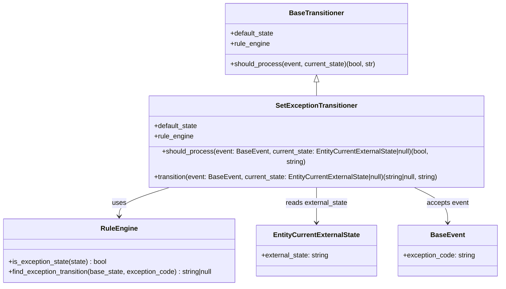

# Diagram: entity_core/entity_service/entity_service/entity/entity/external_state/transitioner/set_exception_transitioner.py

> Auto-generated by Obscura crawlers

## Mermaid

### SVG

<svg id="container" width="1189.2265625" xmlns="http://www.w3.org/2000/svg" class="classDiagram" height="650" viewBox="0 0 1189.2265625 650" role="graphics-document document" aria-roledescription="class"><g><defs><marker id="container_class-aggregationStart" class="marker aggregation class" refX="18" refY="7" markerWidth="190" markerHeight="240" orient="auto"><path d="M 18,7 L9,13 L1,7 L9,1 Z"></path></marker></defs><defs><marker id="container_class-aggregationEnd" class="marker aggregation class" refX="1" refY="7" markerWidth="20" markerHeight="28" orient="auto"><path d="M 18,7 L9,13 L1,7 L9,1 Z"></path></marker></defs><defs><marker id="container_class-extensionStart" class="marker extension class" refX="18" refY="7" markerWidth="190" markerHeight="240" orient="auto"><path d="M 1,7 L18,13 V 1 Z"></path></marker></defs><defs><marker id="container_class-extensionEnd" class="marker extension class" refX="1" refY="7" markerWidth="20" markerHeight="28" orient="auto"><path d="M 1,1 V 13 L18,7 Z"></path></marker></defs><defs><marker id="container_class-compositionStart" class="marker composition class" refX="18" refY="7" markerWidth="190" markerHeight="240" orient="auto"><path d="M 18,7 L9,13 L1,7 L9,1 Z"></path></marker></defs><defs><marker id="container_class-compositionEnd" class="marker composition class" refX="1" refY="7" markerWidth="20" markerHeight="28" orient="auto"><path d="M 18,7 L9,13 L1,7 L9,1 Z"></path></marker></defs><defs><marker id="container_class-dependencyStart" class="marker dependency class" refX="6" refY="7" markerWidth="190" markerHeight="240" orient="auto"><path d="M 5,7 L9,13 L1,7 L9,1 Z"></path></marker></defs><defs><marker id="container_class-dependencyEnd" class="marker dependency class" refX="13" refY="7" markerWidth="20" markerHeight="28" orient="auto"><path d="M 18,7 L9,13 L14,7 L9,1 Z"></path></marker></defs><defs><marker id="container_class-lollipopStart" class="marker lollipop class" refX="13" refY="7" markerWidth="190" markerHeight="240" orient="auto"><circle stroke="black" fill="transparent" cx="7" cy="7" r="6"></circle></marker></defs><defs><marker id="container_class-lollipopEnd" class="marker lollipop class" refX="1" refY="7" markerWidth="190" markerHeight="240" orient="auto"><circle stroke="black" fill="transparent" cx="7" cy="7" r="6"></circle></marker></defs><g class="root"><g class="clusters"></g><g class="edgePaths"><path d="M756.266,193.25L756.266,194.542C756.266,195.833,756.266,198.417,756.266,203.875C756.266,209.333,756.266,217.667,756.266,221.833L756.266,226" id="id_BaseTransitioner_SetExceptionTransitioner_1" class="edge-thickness-normal edge-pattern-solid relation" style=";;;" data-edge="true" data-et="edge" data-id="id_BaseTransitioner_SetExceptionTransitioner_1" data-points="W3sieCI6NzU2LjI2NTYyNSwieSI6MTc2fSx7IngiOjc1Ni4yNjU2MjUsInkiOjIwMX0seyJ4Ijo3NTYuMjY1NjI1LCJ5IjoyMjZ9XQ==" marker-start="url(#container_class-extensionStart)"></path><path d="M416.992,418L395.199,424.167C373.405,430.333,329.818,442.667,308.024,454C286.23,465.333,286.23,475.667,286.23,480.833L286.23,486" id="id_SetExceptionTransitioner_RuleEngine_2" class="edge-thickness-normal edge-pattern-solid relation" style=";;;" data-edge="true" data-et="edge" data-id="id_SetExceptionTransitioner_RuleEngine_2" data-points="W3sieCI6NDE2Ljk5MjEyODc1OTM5ODUsInkiOjQxOH0seyJ4IjoyODYuMjMwNDY4NzUsInkiOjQ1NX0seyJ4IjoyODYuMjMwNDY4NzUsInkiOjQ5Mn1d" marker-end="url(#container_class-dependencyEnd)"></path><path d="M756.266,418L756.266,424.167C756.266,430.333,756.266,442.667,756.266,456.5C756.266,470.333,756.266,485.667,756.266,493.333L756.266,501" id="id_SetExceptionTransitioner_EntityCurrentExternalState_3" class="edge-thickness-normal edge-pattern-solid relation" style=";;;" data-edge="true" data-et="edge" data-id="id_SetExceptionTransitioner_EntityCurrentExternalState_3" data-points="W3sieCI6NzU2LjI2NTYyNSwieSI6NDE4fSx7IngiOjc1Ni4yNjU2MjUsInkiOjQ1NX0seyJ4Ijo3NTYuMjY1NjI1LCJ5Ijo1MDd9XQ==" marker-end="url(#container_class-dependencyEnd)"></path><path d="M978.858,418L993.156,424.167C1007.455,430.333,1036.052,442.667,1050.35,456.5C1064.648,470.333,1064.648,485.667,1064.648,493.333L1064.648,501" id="id_SetExceptionTransitioner_BaseEvent_4" class="edge-thickness-normal edge-pattern-solid relation" style=";;;" data-edge="true" data-et="edge" data-id="id_SetExceptionTransitioner_BaseEvent_4" data-points="W3sieCI6OTc4Ljg1NzczMDI2MzE1NzksInkiOjQxOH0seyJ4IjoxMDY0LjY0ODQzNzUsInkiOjQ1NX0seyJ4IjoxMDY0LjY0ODQzNzUsInkiOjUwN31d" marker-end="url(#container_class-dependencyEnd)"></path></g><g class="edgeLabels"><g class="edgeLabel"><g class="label" data-id="id_BaseTransitioner_SetExceptionTransitioner_1" transform="translate(0, 0)"><foreignObject width="0" height="0">

</foreignObject></g></g><g class="edgeLabel" transform="translate(286.23046875, 455)"><g class="label" data-id="id_SetExceptionTransitioner_RuleEngine_2" transform="translate(-16.4921875, -12)"><foreignObject width="32.984375" height="24">

uses

</foreignObject></g></g><g class="edgeLabel" transform="translate(756.265625, 455)"><g class="label" data-id="id_SetExceptionTransitioner_EntityCurrentExternalState_3" transform="translate(-74.0234375, -12)"><foreignObject width="148.046875" height="24">

reads external_state

</foreignObject></g></g><g class="edgeLabel" transform="translate(1064.6484375, 455)"><g class="label" data-id="id_SetExceptionTransitioner_BaseEvent_4" transform="translate(-49.7109375, -12)"><foreignObject width="99.421875" height="24">

accepts event

</foreignObject></g></g></g><g class="nodes"><g class="node default" id="classId-BaseTransitioner-0" transform="translate(756.265625, 92)"><g class="basic label-container"><path d="M-216.953125 -84 L216.953125 -84 L216.953125 84 L-216.953125 84" stroke="none" stroke-width="0" fill="#ECECFF" style=""></path><path d="M-216.953125 -84 C-124.57494460571345 -84, -32.19676421142691 -84, 216.953125 -84 M-216.953125 -84 C-47.11009393624721 -84, 122.73293712750558 -84, 216.953125 -84 M216.953125 -84 C216.953125 -23.83463147703921, 216.953125 36.33073704592158, 216.953125 84 M216.953125 -84 C216.953125 -28.10127865467296, 216.953125 27.79744269065408, 216.953125 84 M216.953125 84 C105.67984202367941 84, -5.593440952641174 84, -216.953125 84 M216.953125 84 C128.03294505030584 84, 39.11276510061168 84, -216.953125 84 M-216.953125 84 C-216.953125 41.093168103521194, -216.953125 -1.8136637929576125, -216.953125 -84 M-216.953125 84 C-216.953125 29.17054218795898, -216.953125 -25.65891562408204, -216.953125 -84" stroke="#9370DB" stroke-width="1.3" fill="none" stroke-dasharray="0 0" style=""></path></g><g class="annotation-group text" transform="translate(0, -60)"></g><g class="label-group text" transform="translate(-61.90625, -60)"><g class="label" style="font-weight: bolder" transform="translate(0,-12)"><foreignObject width="123.8125" height="24">

BaseTransitioner

</foreignObject></g></g><g class="members-group text" transform="translate(-204.953125, -12)"><g class="label" style="" transform="translate(0,-12)"><foreignObject width="104.1875" height="24">

+default_state

</foreignObject></g><g class="label" style="" transform="translate(0,12)"><foreignObject width="93.515625" height="24">

+rule_engine

</foreignObject></g></g><g class="methods-group text" transform="translate(-204.953125, 60)"><g class="label" style="" transform="translate(0,-12)"><foreignObject width="348" height="24">

+should_process(event, current_state)(bool, str)

</foreignObject></g></g><g class="divider" style=""><path d="M-216.953125 -36 C-79.41049030501685 -36, 58.1321443899663 -36, 216.953125 -36 M-216.953125 -36 C-57.076809712124316 -36, 102.79950557575137 -36, 216.953125 -36" stroke="#9370DB" stroke-width="1.3" fill="none" stroke-dasharray="0 0" style=""></path></g><g class="divider" style=""><path d="M-216.953125 36 C-98.32081567833252 36, 20.311493643334956 36, 216.953125 36 M-216.953125 36 C-121.43618580987189 36, -25.919246619743774 36, 216.953125 36" stroke="#9370DB" stroke-width="1.3" fill="none" stroke-dasharray="0 0" style=""></path></g></g><g class="node default" id="classId-SetExceptionTransitioner-1" transform="translate(756.265625, 322)"><g class="basic label-container"><path d="M-401.91796875 -96 L401.91796875 -96 L401.91796875 96 L-401.91796875 96" stroke="none" stroke-width="0" fill="#ECECFF" style=""></path><path d="M-401.91796875 -96 C-154.9958572335304 -96, 91.92625428293923 -96, 401.91796875 -96 M-401.91796875 -96 C-203.36471611775664 -96, -4.811463485513286 -96, 401.91796875 -96 M401.91796875 -96 C401.91796875 -31.523609757994592, 401.91796875 32.952780484010816, 401.91796875 96 M401.91796875 -96 C401.91796875 -22.8305986140481, 401.91796875 50.3388027719038, 401.91796875 96 M401.91796875 96 C121.98054982037519 96, -157.95686910924962 96, -401.91796875 96 M401.91796875 96 C127.48241329043424 96, -146.95314216913152 96, -401.91796875 96 M-401.91796875 96 C-401.91796875 55.581433982976044, -401.91796875 15.162867965952088, -401.91796875 -96 M-401.91796875 96 C-401.91796875 32.625864487559426, -401.91796875 -30.74827102488115, -401.91796875 -96" stroke="#9370DB" stroke-width="1.3" fill="none" stroke-dasharray="0 0" style=""></path></g><g class="annotation-group text" transform="translate(0, -72)"></g><g class="label-group text" transform="translate(-92.1640625, -72)"><g class="label" style="font-weight: bolder" transform="translate(0,-12)"><foreignObject width="184.328125" height="24">

SetExceptionTransitioner

</foreignObject></g></g><g class="members-group text" transform="translate(-389.91796875, -24)"><g class="label" style="" transform="translate(0,-12)"><foreignObject width="104.1875" height="24">

+default_state

</foreignObject></g><g class="label" style="" transform="translate(0,12)"><foreignObject width="93.515625" height="24">

+rule_engine

</foreignObject></g></g><g class="methods-group text" transform="translate(-389.91796875, 48)"><g class="label" style="" transform="translate(0,-12)"><foreignObject width="687.40625" height="24">

+should_process(event: BaseEvent, current_state: EntityCurrentExternalState|null)(bool, string)

</foreignObject></g><g class="label" style="" transform="translate(0,12)"><foreignObject width="687.671875" height="24">

+transition(event: BaseEvent, current_state: EntityCurrentExternalState|null)(string|null, string)

</foreignObject></g></g><g class="divider" style=""><path d="M-401.91796875 -48 C-91.07879223029227 -48, 219.76038428941547 -48, 401.91796875 -48 M-401.91796875 -48 C-170.64466958483143 -48, 60.62862958033713 -48, 401.91796875 -48" stroke="#9370DB" stroke-width="1.3" fill="none" stroke-dasharray="0 0" style=""></path></g><g class="divider" style=""><path d="M-401.91796875 24 C-217.81776692184042 24, -33.71756509368083 24, 401.91796875 24 M-401.91796875 24 C-208.13076146855275 24, -14.343554187105497 24, 401.91796875 24" stroke="#9370DB" stroke-width="1.3" fill="none" stroke-dasharray="0 0" style=""></path></g></g><g class="node default" id="classId-RuleEngine-2" transform="translate(286.23046875, 567)"><g class="basic label-container"><path d="M-278.23046875 -75 L278.23046875 -75 L278.23046875 75 L-278.23046875 75" stroke="none" stroke-width="0" fill="#ECECFF" style=""></path><path d="M-278.23046875 -75 C-153.7112347415005 -75, -29.19200073300101 -75, 278.23046875 -75 M-278.23046875 -75 C-95.50655532375089 -75, 87.21735810249822 -75, 278.23046875 -75 M278.23046875 -75 C278.23046875 -16.09927438245458, 278.23046875 42.80145123509084, 278.23046875 75 M278.23046875 -75 C278.23046875 -16.040042931575165, 278.23046875 42.91991413684967, 278.23046875 75 M278.23046875 75 C130.77693905916752 75, -16.676590631664965 75, -278.23046875 75 M278.23046875 75 C87.84666671937975 75, -102.53713531124049 75, -278.23046875 75 M-278.23046875 75 C-278.23046875 16.800546665541596, -278.23046875 -41.39890666891681, -278.23046875 -75 M-278.23046875 75 C-278.23046875 44.33304542912134, -278.23046875 13.66609085824269, -278.23046875 -75" stroke="#9370DB" stroke-width="1.3" fill="none" stroke-dasharray="0 0" style=""></path></g><g class="annotation-group text" transform="translate(0, -51)"></g><g class="label-group text" transform="translate(-40.7109375, -51)"><g class="label" style="font-weight: bolder" transform="translate(0,-12)"><foreignObject width="81.421875" height="24">

RuleEngine

</foreignObject></g></g><g class="members-group text" transform="translate(-266.23046875, -3)"></g><g class="methods-group text" transform="translate(-266.23046875, 27)"><g class="label" style="" transform="translate(0,-12)"><foreignObject width="234.484375" height="24">

+is_exception_state(state) : bool

</foreignObject></g><g class="label" style="" transform="translate(0,12)"><foreignObject width="491.75" height="24">

+find_exception_transition(base_state, exception_code) : string|null

</foreignObject></g></g><g class="divider" style=""><path d="M-278.23046875 -27 C-71.7240982862084 -27, 134.7822721775832 -27, 278.23046875 -27 M-278.23046875 -27 C-165.14216545134644 -27, -52.053862152692886 -27, 278.23046875 -27" stroke="#9370DB" stroke-width="1.3" fill="none" stroke-dasharray="0 0" style=""></path></g><g class="divider" style=""><path d="M-278.23046875 -3 C-129.83555949460268 -3, 18.559349760794646 -3, 278.23046875 -3 M-278.23046875 -3 C-73.53868845716389 -3, 131.15309183567223 -3, 278.23046875 -3" stroke="#9370DB" stroke-width="1.3" fill="none" stroke-dasharray="0 0" style=""></path></g></g><g class="node default" id="classId-EntityCurrentExternalState-3" transform="translate(756.265625, 567)"><g class="basic label-container"><path d="M-141.8046875 -60 L141.8046875 -60 L141.8046875 60 L-141.8046875 60" stroke="none" stroke-width="0" fill="#ECECFF" style=""></path><path d="M-141.8046875 -60 C-52.48964628354885 -60, 36.8253949329023 -60, 141.8046875 -60 M-141.8046875 -60 C-82.99193525459432 -60, -24.179183009188634 -60, 141.8046875 -60 M141.8046875 -60 C141.8046875 -20.88221288822256, 141.8046875 18.235574223554877, 141.8046875 60 M141.8046875 -60 C141.8046875 -33.91846355112552, 141.8046875 -7.836927102251039, 141.8046875 60 M141.8046875 60 C60.95898853832463 60, -19.886710423350735 60, -141.8046875 60 M141.8046875 60 C54.088547420690745 60, -33.62759265861851 60, -141.8046875 60 M-141.8046875 60 C-141.8046875 28.077867151663007, -141.8046875 -3.844265696673986, -141.8046875 -60 M-141.8046875 60 C-141.8046875 23.947396796820783, -141.8046875 -12.105206406358434, -141.8046875 -60" stroke="#9370DB" stroke-width="1.3" fill="none" stroke-dasharray="0 0" style=""></path></g><g class="annotation-group text" transform="translate(0, -36)"></g><g class="label-group text" transform="translate(-98.109375, -36)"><g class="label" style="font-weight: bolder" transform="translate(0,-12)"><foreignObject width="196.21875" height="24">

EntityCurrentExternalState

</foreignObject></g></g><g class="members-group text" transform="translate(-129.8046875, 12)"><g class="label" style="" transform="translate(0,-12)"><foreignObject width="161.5" height="24">

+external_state: string

</foreignObject></g></g><g class="methods-group text" transform="translate(-129.8046875, 60)"></g><g class="divider" style=""><path d="M-141.8046875 -12 C-46.434865128378135 -12, 48.93495724324373 -12, 141.8046875 -12 M-141.8046875 -12 C-67.78765988076476 -12, 6.229367738470472 -12, 141.8046875 -12" stroke="#9370DB" stroke-width="1.3" fill="none" stroke-dasharray="0 0" style=""></path></g><g class="divider" style=""><path d="M-141.8046875 36 C-83.17547746066259 36, -24.54626742132517 36, 141.8046875 36 M-141.8046875 36 C-74.97959853044217 36, -8.15450956088435 36, 141.8046875 36" stroke="#9370DB" stroke-width="1.3" fill="none" stroke-dasharray="0 0" style=""></path></g></g><g class="node default" id="classId-BaseEvent-4" transform="translate(1064.6484375, 567)"><g class="basic label-container"><path d="M-116.578125 -60 L116.578125 -60 L116.578125 60 L-116.578125 60" stroke="none" stroke-width="0" fill="#ECECFF" style=""></path><path d="M-116.578125 -60 C-67.49957203870159 -60, -18.421019077403187 -60, 116.578125 -60 M-116.578125 -60 C-41.72223883403741 -60, 33.133647331925175 -60, 116.578125 -60 M116.578125 -60 C116.578125 -21.02257214547722, 116.578125 17.95485570904556, 116.578125 60 M116.578125 -60 C116.578125 -23.880771016794064, 116.578125 12.238457966411872, 116.578125 60 M116.578125 60 C56.83125865028614 60, -2.9156076994277242 60, -116.578125 60 M116.578125 60 C48.016353564645286 60, -20.54541787070943 60, -116.578125 60 M-116.578125 60 C-116.578125 19.687774306237685, -116.578125 -20.62445138752463, -116.578125 -60 M-116.578125 60 C-116.578125 21.01996149580802, -116.578125 -17.960077008383962, -116.578125 -60" stroke="#9370DB" stroke-width="1.3" fill="none" stroke-dasharray="0 0" style=""></path></g><g class="annotation-group text" transform="translate(0, -36)"></g><g class="label-group text" transform="translate(-37.734375, -36)"><g class="label" style="font-weight: bolder" transform="translate(0,-12)"><foreignObject width="75.46875" height="24">

BaseEvent

</foreignObject></g></g><g class="members-group text" transform="translate(-104.578125, 12)"><g class="label" style="" transform="translate(0,-12)"><foreignObject width="171.421875" height="24">

+exception_code: string

</foreignObject></g></g><g class="methods-group text" transform="translate(-104.578125, 60)"></g><g class="divider" style=""><path d="M-116.578125 -12 C-23.444755488606702 -12, 69.6886140227866 -12, 116.578125 -12 M-116.578125 -12 C-31.907545573974332 -12, 52.763033852051336 -12, 116.578125 -12" stroke="#9370DB" stroke-width="1.3" fill="none" stroke-dasharray="0 0" style=""></path></g><g class="divider" style=""><path d="M-116.578125 36 C-46.32972391534824 36, 23.91867716930352 36, 116.578125 36 M-116.578125 36 C-39.463368897715526 36, 37.65138720456895 36, 116.578125 36" stroke="#9370DB" stroke-width="1.3" fill="none" stroke-dasharray="0 0" style=""></path></g></g></g></g></g></svg>
