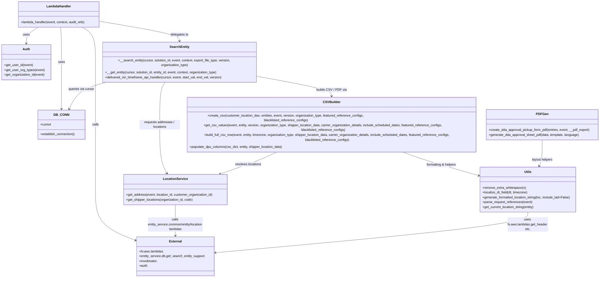

# Diagram: entity_core/entity_service/entity_service/entity/entity/get_search_entity.py


> Auto-generated by Obscura crawlers

## Diagram 1



### SVG

<svg id="container" width="3061.830078125" xmlns="http://www.w3.org/2000/svg" class="classDiagram" height="1272" viewBox="0 0 3061.830078125 1272" role="graphics-document document" aria-roledescription="class"><style>#container{font-family:"trebuchet ms",verdana,arial,sans-serif;font-size:16px;fill:#333;}@keyframes edge-animation-frame{from{stroke-dashoffset:0;}}@keyframes dash{to{stroke-dashoffset:0;}}#container .edge-animation-slow{stroke-dasharray:9,5!important;stroke-dashoffset:900;animation:dash 50s linear infinite;stroke-linecap:round;}#container .edge-animation-fast{stroke-dasharray:9,5!important;stroke-dashoffset:900;animation:dash 20s linear infinite;stroke-linecap:round;}#container .error-icon{fill:#552222;}#container .error-text{fill:#552222;stroke:#552222;}#container .edge-thickness-normal{stroke-width:1px;}#container .edge-thickness-thick{stroke-width:3.5px;}#container .edge-pattern-solid{stroke-dasharray:0;}#container .edge-thickness-invisible{stroke-width:0;fill:none;}#container .edge-pattern-dashed{stroke-dasharray:3;}#container .edge-pattern-dotted{stroke-dasharray:2;}#container .marker{fill:#333333;stroke:#333333;}#container .marker.cross{stroke:#333333;}#container svg{font-family:"trebuchet ms",verdana,arial,sans-serif;font-size:16px;}#container p{margin:0;}#container g.classGroup text{fill:#9370DB;stroke:none;font-family:"trebuchet ms",verdana,arial,sans-serif;font-size:10px;}#container g.classGroup text .title{font-weight:bolder;}#container .nodeLabel,#container .edgeLabel{color:#131300;}#container .edgeLabel .label rect{fill:#ECECFF;}#container .label text{fill:#131300;}#container .labelBkg{background:#ECECFF;}#container .edgeLabel .label span{background:#ECECFF;}#container .classTitle{font-weight:bolder;}#container .node rect,#container .node circle,#container .node ellipse,#container .node polygon,#container .node path{fill:#ECECFF;stroke:#9370DB;stroke-width:1px;}#container .divider{stroke:#9370DB;stroke-width:1;}#container g.clickable{cursor:pointer;}#container g.classGroup rect{fill:#ECECFF;stroke:#9370DB;}#container g.classGroup line{stroke:#9370DB;stroke-width:1;}#container .classLabel .box{stroke:none;stroke-width:0;fill:#ECECFF;opacity:0.5;}#container .classLabel .label{fill:#9370DB;font-size:10px;}#container .relation{stroke:#333333;stroke-width:1;fill:none;}#container .dashed-line{stroke-dasharray:3;}#container .dotted-line{stroke-dasharray:1 2;}#container #compositionStart,#container .composition{fill:#333333!important;stroke:#333333!important;stroke-width:1;}#container #compositionEnd,#container .composition{fill:#333333!important;stroke:#333333!important;stroke-width:1;}#container #dependencyStart,#container .dependency{fill:#333333!important;stroke:#333333!important;stroke-width:1;}#container #dependencyStart,#container .dependency{fill:#333333!important;stroke:#333333!important;stroke-width:1;}#container #extensionStart,#container .extension{fill:transparent!important;stroke:#333333!important;stroke-width:1;}#container #extensionEnd,#container .extension{fill:transparent!important;stroke:#333333!important;stroke-width:1;}#container #aggregationStart,#container .aggregation{fill:transparent!important;stroke:#333333!important;stroke-width:1;}#container #aggregationEnd,#container .aggregation{fill:transparent!important;stroke:#333333!important;stroke-width:1;}#container #lollipopStart,#container .lollipop{fill:#ECECFF!important;stroke:#333333!important;stroke-width:1;}#container #lollipopEnd,#container .lollipop{fill:#ECECFF!important;stroke:#333333!important;stroke-width:1;}#container .edgeTerminals{font-size:11px;line-height:initial;}#container .classTitleText{text-anchor:middle;font-size:18px;fill:#333;}#container .label-icon{display:inline-block;height:1em;overflow:visible;vertical-align:-0.125em;}#container .node .label-icon path{fill:currentColor;stroke:revert;stroke-width:revert;}#container :root{--mermaid-font-family:"trebuchet ms",verdana,arial,sans-serif;}</style><g><defs><marker id="container_class-aggregationStart" class="marker aggregation class" refX="18" refY="7" markerWidth="190" markerHeight="240" orient="auto"><path d="M 18,7 L9,13 L1,7 L9,1 Z"></path></marker></defs><defs><marker id="container_class-aggregationEnd" class="marker aggregation class" refX="1" refY="7" markerWidth="20" markerHeight="28" orient="auto"><path d="M 18,7 L9,13 L1,7 L9,1 Z"></path></marker></defs><defs><marker id="container_class-extensionStart" class="marker extension class" refX="18" refY="7" markerWidth="190" markerHeight="240" orient="auto"><path d="M 1,7 L18,13 V 1 Z"></path></marker></defs><defs><marker id="container_class-extensionEnd" class="marker extension class" refX="1" refY="7" markerWidth="20" markerHeight="28" orient="auto"><path d="M 1,1 V 13 L18,7 Z"></path></marker></defs><defs><marker id="container_class-compositionStart" class="marker composition class" refX="18" refY="7" markerWidth="190" markerHeight="240" orient="auto"><path d="M 18,7 L9,13 L1,7 L9,1 Z"></path></marker></defs><defs><marker id="container_class-compositionEnd" class="marker composition class" refX="1" refY="7" markerWidth="20" markerHeight="28" orient="auto"><path d="M 18,7 L9,13 L1,7 L9,1 Z"></path></marker></defs><defs><marker id="container_class-dependencyStart" class="marker dependency class" refX="6" refY="7" markerWidth="190" markerHeight="240" orient="auto"><path d="M 5,7 L9,13 L1,7 L9,1 Z"></path></marker></defs><defs><marker id="container_class-dependencyEnd" class="marker dependency class" refX="13" refY="7" markerWidth="20" markerHeight="28" orient="auto"><path d="M 18,7 L9,13 L14,7 L9,1 Z"></path></marker></defs><defs><marker id="container_class-lollipopStart" class="marker lollipop class" refX="13" refY="7" markerWidth="190" markerHeight="240" orient="auto"><circle stroke="black" fill="transparent" cx="7" cy="7" r="6"></circle></marker></defs><defs><marker id="container_class-lollipopEnd" class="marker lollipop class" refX="1" refY="7" markerWidth="190" markerHeight="240" orient="auto"><circle stroke="black" fill="transparent" cx="7" cy="7" r="6"></circle></marker></defs><g class="root"><g class="clusters"></g><g class="edgePaths"><path d="M296.658,134L297.635,140.167C298.611,146.333,300.563,158.667,301.539,185.5C302.516,212.333,302.516,253.667,302.516,295C302.516,336.333,302.516,377.667,302.516,408C302.516,438.333,302.516,457.667,302.516,467.333L302.516,477" id="id_LambdaHandler_DB_CONN_1" class="edge-thickness-normal edge-pattern-solid relation" style=";;;" data-edge="true" data-et="edge" data-id="id_LambdaHandler_DB_CONN_1" data-points="W3sieCI6Mjk2LjY1ODQ5NjA5Mzc1LCJ5IjoxMzR9LHsieCI6MzAyLjUxNTYyNSwieSI6MTcxfSx7IngiOjMwMi41MTU2MjUsInkiOjI5NX0seyJ4IjozMDIuNTE1NjI1LCJ5Ijo0MTl9LHsieCI6MzAyLjUxNTYyNSwieSI6NDgzfV0=" marker-end="url(#container_class-dependencyEnd)"></path><path d="M187.666,134L177.974,140.167C168.281,146.333,148.896,158.667,139.204,170C129.512,181.333,129.512,191.667,129.512,196.833L129.512,202" id="id_LambdaHandler_Auth_2" class="edge-thickness-normal edge-pattern-solid relation" style=";;;" data-edge="true" data-et="edge" data-id="id_LambdaHandler_Auth_2" data-points="W3sieCI6MTg3LjY2NjAzNTE1NjI1MDAyLCJ5IjoxMzR9LHsieCI6MTI5LjUxMTcxODc1LCJ5IjoxNzF9LHsieCI6MTI5LjUxMTcxODc1LCJ5IjoyMDh9XQ==" marker-end="url(#container_class-dependencyEnd)"></path><path d="M488.639,104.332L555.961,115.443C623.284,126.554,757.929,148.777,825.252,165.055C892.574,181.333,892.574,191.667,892.574,196.833L892.574,202" id="id_LambdaHandler_SearchEntity_3" class="edge-thickness-normal edge-pattern-solid relation" style=";;;" data-edge="true" data-et="edge" data-id="id_LambdaHandler_SearchEntity_3" data-points="W3sieCI6NDg4LjYzODY3MTg3NSwieSI6MTA0LjMzMTcyMTU0Nzk1ODY3fSx7IngiOjg5Mi41NzQyMTg3NSwieSI6MTcxfSx7IngiOjg5Mi41NzQyMTg3NSwieSI6MjA4fV0=" marker-end="url(#container_class-dependencyEnd)"></path><path d="M403.621,134L415.067,140.167C426.513,146.333,449.405,158.667,460.851,185.5C472.297,212.333,472.297,253.667,472.297,295C472.297,336.333,472.297,377.667,472.297,421C472.297,464.333,472.297,509.667,472.297,555C472.297,600.333,472.297,645.667,472.297,693C472.297,740.333,472.297,789.667,472.297,843C472.297,896.333,472.297,953.667,505.761,995.562C539.225,1037.457,606.152,1063.914,639.616,1077.143L673.08,1090.371" id="id_LambdaHandler_External_4" class="edge-thickness-normal edge-pattern-solid relation" style=";;;" data-edge="true" data-et="edge" data-id="id_LambdaHandler_External_4" data-points="W3sieCI6NDAzLjYyMDY4MzU5Mzc1LCJ5IjoxMzR9LHsieCI6NDcyLjI5Njg3NSwieSI6MTcxfSx7IngiOjQ3Mi4yOTY4NzUsInkiOjI5NX0seyJ4Ijo0NzIuMjk2ODc1LCJ5Ijo0MTl9LHsieCI6NDcyLjI5Njg3NSwieSI6NTU1fSx7IngiOjQ3Mi4yOTY4NzUsInkiOjY5MX0seyJ4Ijo0NzIuMjk2ODc1LCJ5Ijo4Mzl9LHsieCI6NDcyLjI5Njg3NSwieSI6MTAxMX0seyJ4Ijo2NzguNjYwMTU2MjUsInkiOjEwOTIuNTc2NzUwOTU2NDk3OH1d" marker-end="url(#container_class-dependencyEnd)"></path><path d="M1277.852,355.143L1346.029,365.786C1414.206,376.429,1550.561,397.714,1618.739,413.524C1686.916,429.333,1686.916,439.667,1686.916,444.833L1686.916,450" id="id_SearchEntity_CSVBuilder_5" class="edge-thickness-normal edge-pattern-solid relation" style=";;;" data-edge="true" data-et="edge" data-id="id_SearchEntity_CSVBuilder_5" data-points="W3sieCI6MTI3Ny44NTE1NjI1LCJ5IjozNTUuMTQzMzY3NTE4ODAzNjR9LHsieCI6MTY4Ni45MTYwMTU2MjUsInkiOjQxOX0seyJ4IjoxNjg2LjkxNjAxNTYyNSwieSI6NDU2fV0=" marker-end="url(#container_class-dependencyEnd)"></path><path d="M821.907,382L816.898,388.167C811.889,394.333,801.871,406.667,796.862,435.5C791.854,464.333,791.854,509.667,791.854,555C791.854,600.333,791.854,645.667,797.769,679.614C803.684,713.562,815.514,736.124,821.429,747.405L827.345,758.686" id="id_SearchEntity_LocationService_6" class="edge-thickness-normal edge-pattern-solid relation" style=";;;" data-edge="true" data-et="edge" data-id="id_SearchEntity_LocationService_6" data-points="W3sieCI6ODIxLjkwNzI3MzgxNTUyNDEsInkiOjM4Mn0seyJ4Ijo3OTEuODUzNTE1NjI1LCJ5Ijo0MTl9LHsieCI6NzkxLjg1MzUxNTYyNSwieSI6NTU1fSx7IngiOjc5MS44NTM1MTU2MjUsInkiOjY5MX0seyJ4Ijo4MzAuMTMwOTI1MzU4OTUyNywieSI6NzY0fV0=" marker-end="url(#container_class-dependencyEnd)"></path><path d="M538.142,382L513.019,388.167C487.897,394.333,437.651,406.667,406.4,422.652C375.149,438.637,362.892,458.273,356.763,468.092L350.635,477.91" id="id_SearchEntity_DB_CONN_7" class="edge-thickness-normal edge-pattern-solid relation" style=";;;" data-edge="true" data-et="edge" data-id="id_SearchEntity_DB_CONN_7" data-points="W3sieCI6NTM4LjE0MTg1MzU3ODYyOSwieSI6MzgyfSx7IngiOjM4Ny40MDYyNSwieSI6NDE5fSx7IngiOjM0Ny40NTc3MjA1ODgyMzUzLCJ5Ijo0ODN9XQ==" marker-end="url(#container_class-dependencyEnd)"></path><path d="M1417.63,654L1400.857,660.167C1384.083,666.333,1350.536,678.667,1297.921,696.686C1245.307,714.705,1173.625,738.411,1137.784,750.263L1101.943,762.116" id="id_CSVBuilder_LocationService_8" class="edge-thickness-normal edge-pattern-solid relation" style=";;;" data-edge="true" data-et="edge" data-id="id_CSVBuilder_LocationService_8" data-points="W3sieCI6MTQxNy42MzAzODU0NTQ5NjMzLCJ5Ijo2NTR9LHsieCI6MTMxNi45ODgyODEyNSwieSI6NjkxfSx7IngiOjEwOTYuMjQ2NTE2MDQ3Mjk3MywieSI6NzY0fV0=" marker-end="url(#container_class-dependencyEnd)"></path><path d="M2029.328,654L2050.657,660.167C2071.986,666.333,2114.643,678.667,2185.798,698.383C2256.952,718.099,2356.604,745.198,2406.429,758.747L2456.255,772.297" id="id_CSVBuilder_Utils_9" class="edge-thickness-normal edge-pattern-solid relation" style=";;;" data-edge="true" data-et="edge" data-id="id_CSVBuilder_Utils_9" data-points="W3sieCI6MjAyOS4zMjg0NTUzMDc5MDQzLCJ5Ijo2NTR9LHsieCI6MjE1Ny4zMDA3ODEyNSwieSI6NjkxfSx7IngiOjI0NjIuMDQ0OTIxODc1LCJ5Ijo3NzMuODcxMTQwODA5NTM3M31d" marker-end="url(#container_class-dependencyEnd)"></path><path d="M2775.404,630L2775.404,640.167C2775.404,650.333,2775.404,670.667,2772.773,686.105C2770.142,701.544,2764.881,712.088,2762.25,717.359L2759.619,722.631" id="id_PDFGen_Utils_10" class="edge-thickness-normal edge-pattern-solid relation" style=";;;" data-edge="true" data-et="edge" data-id="id_PDFGen_Utils_10" data-points="W3sieCI6Mjc3NS40MDQyOTY4NzUsInkiOjYzMH0seyJ4IjoyNzc1LjQwNDI5Njg3NSwieSI6NjkxfSx7IngiOjI3NTYuOTM5NDUzMTI1LCJ5Ijo3Mjh9XQ==" marker-end="url(#container_class-dependencyEnd)"></path><path d="M869.457,914L869.457,930.167C869.457,946.333,869.457,978.667,869.457,1004C869.457,1029.333,869.457,1047.667,869.457,1056.833L869.457,1066" id="id_LocationService_External_11" class="edge-thickness-normal edge-pattern-solid relation" style=";;;" data-edge="true" data-et="edge" data-id="id_LocationService_External_11" data-points="W3sieCI6ODY5LjQ1NzAzMTI1LCJ5Ijo5MTR9LHsieCI6ODY5LjQ1NzAzMTI1LCJ5IjoxMDExfSx7IngiOjg2OS40NTcwMzEyNSwieSI6MTA3Mn1d" marker-end="url(#container_class-dependencyEnd)"></path><path d="M2701.545,950L2701.545,960.167C2701.545,970.333,2701.545,990.667,2428.993,1024.19C2156.441,1057.712,1611.336,1104.425,1338.784,1127.781L1066.232,1151.137" id="id_Utils_External_12" class="edge-thickness-normal edge-pattern-solid relation" style=";;;" data-edge="true" data-et="edge" data-id="id_Utils_External_12" data-points="W3sieCI6MjcwMS41NDQ5MjE4NzUsInkiOjk1MH0seyJ4IjoyNzAxLjU0NDkyMTg3NSwieSI6MTAxMX0seyJ4IjoxMDYwLjI1MzkwNjI1LCJ5IjoxMTUxLjY0OTc0MjE3MjE1MDR9XQ==" marker-end="url(#container_class-dependencyEnd)"></path></g><g class="edgeLabels"><g class="edgeLabel" transform="translate(302.515625, 295)"><g class="label" data-id="id_LambdaHandler_DB_CONN_1" transform="translate(-16.4921875, -12)"><foreignObject width="32.984375" height="24"><div xmlns="http://www.w3.org/1999/xhtml" class="labelBkg" style="display: table-cell; white-space: nowrap; line-height: 1.5; max-width: 200px; text-align: center;"><span class="edgeLabel"><p>uses</p></span></div></foreignObject></g></g><g class="edgeLabel" transform="translate(129.51171875, 171)"><g class="label" data-id="id_LambdaHandler_Auth_2" transform="translate(-16.4921875, -12)"><foreignObject width="32.984375" height="24"><div xmlns="http://www.w3.org/1999/xhtml" class="labelBkg" style="display: table-cell; white-space: nowrap; line-height: 1.5; max-width: 200px; text-align: center;"><span class="edgeLabel"><p>uses</p></span></div></foreignObject></g></g><g class="edgeLabel" transform="translate(892.57421875, 171)"><g class="label" data-id="id_LambdaHandler_SearchEntity_3" transform="translate(-44.59375, -12)"><foreignObject width="89.1875" height="24"><div xmlns="http://www.w3.org/1999/xhtml" class="labelBkg" style="display: table-cell; white-space: nowrap; line-height: 1.5; max-width: 200px; text-align: center;"><span class="edgeLabel"><p>delegates to</p></span></div></foreignObject></g></g><g class="edgeLabel" transform="translate(472.296875, 555)"><g class="label" data-id="id_LambdaHandler_External_4" transform="translate(-16.4453125, -12)"><foreignObject width="32.890625" height="24"><div xmlns="http://www.w3.org/1999/xhtml" class="labelBkg" style="display: table-cell; white-space: nowrap; line-height: 1.5; max-width: 200px; text-align: center;"><span class="edgeLabel"><p>calls</p></span></div></foreignObject></g></g><g class="edgeLabel" transform="translate(1686.916015625, 419)"><g class="label" data-id="id_SearchEntity_CSVBuilder_5" transform="translate(-72.453125, -12)"><foreignObject width="144.90625" height="24"><div xmlns="http://www.w3.org/1999/xhtml" class="labelBkg" style="display: table-cell; white-space: nowrap; line-height: 1.5; max-width: 200px; text-align: center;"><span class="edgeLabel"><p>builds CSV / PDF via</p></span></div></foreignObject></g></g><g class="edgeLabel" transform="translate(791.853515625, 555)"><g class="label" data-id="id_SearchEntity_LocationService_6" transform="translate(-100, -24)"><foreignObject width="200" height="48"><div xmlns="http://www.w3.org/1999/xhtml" class="labelBkg" style="display: table; white-space: break-spaces; line-height: 1.5; max-width: 200px; text-align: center; width: 200px;"><span class="edgeLabel"><p>requests addresses / locations</p></span></div></foreignObject></g></g><g class="edgeLabel" transform="translate(426.13928, 409.49248)"><g class="label" data-id="id_SearchEntity_DB_CONN_7" transform="translate(-64.890625, -12)"><foreignObject width="129.78125" height="24"><div xmlns="http://www.w3.org/1999/xhtml" class="labelBkg" style="display: table-cell; white-space: nowrap; line-height: 1.5; max-width: 200px; text-align: center;"><span class="edgeLabel"><p>queries via cursor</p></span></div></foreignObject></g></g><g class="edgeLabel" transform="translate(1257.5201, 710.66631)"><g class="label" data-id="id_CSVBuilder_LocationService_8" transform="translate(-65.3125, -12)"><foreignObject width="130.625" height="24"><div xmlns="http://www.w3.org/1999/xhtml" class="labelBkg" style="display: table-cell; white-space: nowrap; line-height: 1.5; max-width: 200px; text-align: center;"><span class="edgeLabel"><p>resolves locations</p></span></div></foreignObject></g></g><g class="edgeLabel" transform="translate(2245.40004, 714.95743)"><g class="label" data-id="id_CSVBuilder_Utils_9" transform="translate(-75.734375, -12)"><foreignObject width="151.46875" height="24"><div xmlns="http://www.w3.org/1999/xhtml" class="labelBkg" style="display: table-cell; white-space: nowrap; line-height: 1.5; max-width: 200px; text-align: center;"><span class="edgeLabel"><p>formatting &amp; helpers</p></span></div></foreignObject></g></g><g class="edgeLabel" transform="translate(2775.404296875, 691)"><g class="label" data-id="id_PDFGen_Utils_10" transform="translate(-51.984375, -12)"><foreignObject width="103.96875" height="24"><div xmlns="http://www.w3.org/1999/xhtml" class="labelBkg" style="display: table-cell; white-space: nowrap; line-height: 1.5; max-width: 200px; text-align: center;"><span class="edgeLabel"><p>layout helpers</p></span></div></foreignObject></g></g><g class="edgeLabel" transform="translate(869.45703125, 1011)"><g class="label" data-id="id_LocationService_External_11" transform="translate(-144.0546875, -36)"><foreignObject width="288.109375" height="72"><div xmlns="http://www.w3.org/1999/xhtml" class="labelBkg" style="display: table; white-space: break-spaces; line-height: 1.5; max-width: 200px; text-align: center; width: 200px;"><span class="edgeLabel"><p>calls entity_service.common/entity/location lambdas</p></span></div></foreignObject></g></g><g class="edgeLabel" transform="translate(2701.544921875, 1011)"><g class="label" data-id="id_Utils_External_12" transform="translate(-100, -36)"><foreignObject width="200" height="72"><div xmlns="http://www.w3.org/1999/xhtml" class="labelBkg" style="display: table; white-space: break-spaces; line-height: 1.5; max-width: 200px; text-align: center; width: 200px;"><span class="edgeLabel"><p>uses fv.aws.lambdas.get_header etc.</p></span></div></foreignObject></g></g></g><g class="nodes"><g class="node default" id="classId-LambdaHandler-0" transform="translate(286.685546875, 71)"><g class="basic label-container"><path d="M-201.953125 -63 L201.953125 -63 L201.953125 63 L-201.953125 63" stroke="none" stroke-width="0" fill="#ECECFF" style=""></path><path d="M-201.953125 -63 C-85.64316720825097 -63, 30.666790583498056 -63, 201.953125 -63 M-201.953125 -63 C-79.36380920017758 -63, 43.22550659964483 -63, 201.953125 -63 M201.953125 -63 C201.953125 -32.812094894526034, 201.953125 -2.6241897890520676, 201.953125 63 M201.953125 -63 C201.953125 -36.60593958813712, 201.953125 -10.211879176274238, 201.953125 63 M201.953125 63 C99.96783590724989 63, -2.017453185500216 63, -201.953125 63 M201.953125 63 C82.41599442565588 63, -37.12113614868824 63, -201.953125 63 M-201.953125 63 C-201.953125 17.014994062406984, -201.953125 -28.97001187518603, -201.953125 -63 M-201.953125 63 C-201.953125 36.02327761592731, -201.953125 9.046555231854619, -201.953125 -63" stroke="#9370DB" stroke-width="1.3" fill="none" stroke-dasharray="0 0" style=""></path></g><g class="annotation-group text" transform="translate(0, -39)"></g><g class="label-group text" transform="translate(-58.21875, -39)"><g class="label" style="font-weight: bolder" transform="translate(0,-12)"><foreignObject width="116.4375" height="24"><div xmlns="http://www.w3.org/1999/xhtml" style="display: table-cell; white-space: nowrap; line-height: 1.5; max-width: 167px; text-align: center;"><span class="nodeLabel markdown-node-label" style=""><p>LambdaHandler</p></span></div></foreignObject></g></g><g class="members-group text" transform="translate(-189.953125, 9)"></g><g class="methods-group text" transform="translate(-189.953125, 39)"><g class="label" style="" transform="translate(0,-12)"><foreignObject width="321.6875" height="24"><div xmlns="http://www.w3.org/1999/xhtml" style="display: table-cell; white-space: nowrap; line-height: 1.5; max-width: 379px; text-align: center;"><span class="nodeLabel markdown-node-label" style=""><p>+lambda_handler(event, context, audit_refs)</p></span></div></foreignObject></g></g><g class="divider" style=""><path d="M-201.953125 -15 C-95.13025419707267 -15, 11.692616605854653 -15, 201.953125 -15 M-201.953125 -15 C-116.32842304293959 -15, -30.70372108587918 -15, 201.953125 -15" stroke="#9370DB" stroke-width="1.3" fill="none" stroke-dasharray="0 0" style=""></path></g><g class="divider" style=""><path d="M-201.953125 9 C-72.68391848503242 9, 56.58528802993516 9, 201.953125 9 M-201.953125 9 C-114.85461115171182 9, -27.756097303423644 9, 201.953125 9" stroke="#9370DB" stroke-width="1.3" fill="none" stroke-dasharray="0 0" style=""></path></g></g><g class="node default" id="classId-DB_CONN-1" transform="translate(302.515625, 555)"><g class="basic label-container"><path d="M-115.8359375 -72 L115.8359375 -72 L115.8359375 72 L-115.8359375 72" stroke="none" stroke-width="0" fill="#ECECFF" style=""></path><path d="M-115.8359375 -72 C-60.19647758724703 -72, -4.5570176744940625 -72, 115.8359375 -72 M-115.8359375 -72 C-65.64972934638608 -72, -15.463521192772163 -72, 115.8359375 -72 M115.8359375 -72 C115.8359375 -41.23686258471186, 115.8359375 -10.473725169423716, 115.8359375 72 M115.8359375 -72 C115.8359375 -31.359656637438825, 115.8359375 9.28068672512235, 115.8359375 72 M115.8359375 72 C57.83965759549704 72, -0.15662230900592533 72, -115.8359375 72 M115.8359375 72 C57.16967656337212 72, -1.4965843732557573 72, -115.8359375 72 M-115.8359375 72 C-115.8359375 25.58088671992803, -115.8359375 -20.838226560143937, -115.8359375 -72 M-115.8359375 72 C-115.8359375 25.793865546925545, -115.8359375 -20.41226890614891, -115.8359375 -72" stroke="#9370DB" stroke-width="1.3" fill="none" stroke-dasharray="0 0" style=""></path></g><g class="annotation-group text" transform="translate(0, -48)"></g><g class="label-group text" transform="translate(-34.40625, -48)"><g class="label" style="font-weight: bolder" transform="translate(0,-12)"><foreignObject width="68.8125" height="24"><div xmlns="http://www.w3.org/1999/xhtml" style="display: table-cell; white-space: nowrap; line-height: 1.5; max-width: 119px; text-align: center;"><span class="nodeLabel markdown-node-label" style=""><p>DB_CONN</p></span></div></foreignObject></g></g><g class="members-group text" transform="translate(-103.8359375, 0)"><g class="label" style="" transform="translate(0,-12)"><foreignObject width="53.71875" height="24"><div xmlns="http://www.w3.org/1999/xhtml" style="display: table-cell; white-space: nowrap; line-height: 1.5; max-width: 112px; text-align: center;"><span class="nodeLabel markdown-node-label" style=""><p>+cursor</p></span></div></foreignObject></g></g><g class="methods-group text" transform="translate(-103.8359375, 48)"><g class="label" style="" transform="translate(0,-12)"><foreignObject width="173.265625" height="24"><div xmlns="http://www.w3.org/1999/xhtml" style="display: table-cell; white-space: nowrap; line-height: 1.5; max-width: 231px; text-align: center;"><span class="nodeLabel markdown-node-label" style=""><p>+establish_connection()</p></span></div></foreignObject></g></g><g class="divider" style=""><path d="M-115.8359375 -24 C-47.34290250282734 -24, 21.150132494345314 -24, 115.8359375 -24 M-115.8359375 -24 C-29.065928043103682 -24, 57.704081413792636 -24, 115.8359375 -24" stroke="#9370DB" stroke-width="1.3" fill="none" stroke-dasharray="0 0" style=""></path></g><g class="divider" style=""><path d="M-115.8359375 24 C-23.793745384128513 24, 68.24844673174297 24, 115.8359375 24 M-115.8359375 24 C-28.394158487601544 24, 59.04762052479691 24, 115.8359375 24" stroke="#9370DB" stroke-width="1.3" fill="none" stroke-dasharray="0 0" style=""></path></g></g><g class="node default" id="classId-Auth-2" transform="translate(129.51171875, 295)"><g class="basic label-container"><path d="M-121.51171875 -87 L121.51171875 -87 L121.51171875 87 L-121.51171875 87" stroke="none" stroke-width="0" fill="#ECECFF" style=""></path><path d="M-121.51171875 -87 C-68.3077664726982 -87, -15.103814195396396 -87, 121.51171875 -87 M-121.51171875 -87 C-55.339216896633275 -87, 10.83328495673345 -87, 121.51171875 -87 M121.51171875 -87 C121.51171875 -46.154915012531355, 121.51171875 -5.309830025062709, 121.51171875 87 M121.51171875 -87 C121.51171875 -47.973965623955486, 121.51171875 -8.947931247910972, 121.51171875 87 M121.51171875 87 C41.03468293048137 87, -39.44235288903727 87, -121.51171875 87 M121.51171875 87 C37.681043917967074 87, -46.14963091406585 87, -121.51171875 87 M-121.51171875 87 C-121.51171875 49.57638733490625, -121.51171875 12.152774669812501, -121.51171875 -87 M-121.51171875 87 C-121.51171875 32.219624855322536, -121.51171875 -22.560750289354928, -121.51171875 -87" stroke="#9370DB" stroke-width="1.3" fill="none" stroke-dasharray="0 0" style=""></path></g><g class="annotation-group text" transform="translate(0, -63)"></g><g class="label-group text" transform="translate(-17.0078125, -63)"><g class="label" style="font-weight: bolder" transform="translate(0,-12)"><foreignObject width="34.015625" height="24"><div xmlns="http://www.w3.org/1999/xhtml" style="display: table-cell; white-space: nowrap; line-height: 1.5; max-width: 84px; text-align: center;"><span class="nodeLabel markdown-node-label" style=""><p>Auth</p></span></div></foreignObject></g></g><g class="members-group text" transform="translate(-109.51171875, -15)"></g><g class="methods-group text" transform="translate(-109.51171875, 15)"><g class="label" style="" transform="translate(0,-12)"><foreignObject width="142.0625" height="24"><div xmlns="http://www.w3.org/1999/xhtml" style="display: table-cell; white-space: nowrap; line-height: 1.5; max-width: 199px; text-align: center;"><span class="nodeLabel markdown-node-label" style=""><p>+get_user_id(event)</p></span></div></foreignObject></g><g class="label" style="" transform="translate(0,12)"><foreignObject width="198.578125" height="24"><div xmlns="http://www.w3.org/1999/xhtml" style="display: table-cell; white-space: nowrap; line-height: 1.5; max-width: 256px; text-align: center;"><span class="nodeLabel markdown-node-label" style=""><p>+get_user_org_types(event)</p></span></div></foreignObject></g><g class="label" style="" transform="translate(0,36)"><foreignObject width="202.015625" height="24"><div xmlns="http://www.w3.org/1999/xhtml" style="display: table-cell; white-space: nowrap; line-height: 1.5; max-width: 259px; text-align: center;"><span class="nodeLabel markdown-node-label" style=""><p>+get_organization_id(event)</p></span></div></foreignObject></g></g><g class="divider" style=""><path d="M-121.51171875 -39 C-29.63776402355313 -39, 62.23619070289374 -39, 121.51171875 -39 M-121.51171875 -39 C-31.747707829492214 -39, 58.01630309101557 -39, 121.51171875 -39" stroke="#9370DB" stroke-width="1.3" fill="none" stroke-dasharray="0 0" style=""></path></g><g class="divider" style=""><path d="M-121.51171875 -15 C-64.49623104483453 -15, -7.480743339669047 -15, 121.51171875 -15 M-121.51171875 -15 C-50.76471101883013 -15, 19.982296712339746 -15, 121.51171875 -15" stroke="#9370DB" stroke-width="1.3" fill="none" stroke-dasharray="0 0" style=""></path></g></g><g class="node default" id="classId-SearchEntity-3" transform="translate(892.57421875, 295)"><g class="basic label-container"><path d="M-385.27734375 -87 L385.27734375 -87 L385.27734375 87 L-385.27734375 87" stroke="none" stroke-width="0" fill="#ECECFF" style=""></path><path d="M-385.27734375 -87 C-102.06679825815144 -87, 181.14374723369713 -87, 385.27734375 -87 M-385.27734375 -87 C-83.4328695980397 -87, 218.4116045539206 -87, 385.27734375 -87 M385.27734375 -87 C385.27734375 -23.402757810469616, 385.27734375 40.19448437906077, 385.27734375 87 M385.27734375 -87 C385.27734375 -39.58505581358072, 385.27734375 7.829888372838553, 385.27734375 87 M385.27734375 87 C93.07244031897955 87, -199.1324631120409 87, -385.27734375 87 M385.27734375 87 C158.98926727349817 87, -67.29880920300366 87, -385.27734375 87 M-385.27734375 87 C-385.27734375 43.81693130018878, -385.27734375 0.6338626003775545, -385.27734375 -87 M-385.27734375 87 C-385.27734375 38.24384447347381, -385.27734375 -10.512311053052386, -385.27734375 -87" stroke="#9370DB" stroke-width="1.3" fill="none" stroke-dasharray="0 0" style=""></path></g><g class="annotation-group text" transform="translate(0, -63)"></g><g class="label-group text" transform="translate(-45.9921875, -63)"><g class="label" style="font-weight: bolder" transform="translate(0,-12)"><foreignObject width="91.984375" height="24"><div xmlns="http://www.w3.org/1999/xhtml" style="display: table-cell; white-space: nowrap; line-height: 1.5; max-width: 140px; text-align: center;"><span class="nodeLabel markdown-node-label" style=""><p>SearchEntity</p></span></div></foreignObject></g></g><g class="members-group text" transform="translate(-373.27734375, -15)"></g><g class="methods-group text" transform="translate(-373.27734375, 15)"><g class="label" style="" transform="translate(0,-12)"><foreignObject width="700.5625" height="24"><div xmlns="http://www.w3.org/1999/xhtml" style="display: table-cell; white-space: nowrap; line-height: 1.5; max-width: 758px; text-align: center;"><span class="nodeLabel markdown-node-label" style=""><p>+__search_entity(cursor, solution_id, event, context, export_file_type, version, organization_type)</p></span></div></foreignObject></g><g class="label" style="" transform="translate(0,12)"><foreignObject width="561.46875" height="24"><div xmlns="http://www.w3.org/1999/xhtml" style="display: table-cell; white-space: nowrap; line-height: 1.5; max-width: 619px; text-align: center;"><span class="nodeLabel markdown-node-label" style=""><p>+__get_entity(cursor, solution_id, entity_id, event, context, organization_type)</p></span></div></foreignObject></g><g class="label" style="" transform="translate(0,36)"><foreignObject width="583.34375" height="24"><div xmlns="http://www.w3.org/1999/xhtml" style="display: table-cell; white-space: nowrap; line-height: 1.5; max-width: 641px; text-align: center;"><span class="nodeLabel markdown-node-label" style=""><p>+delivered_vin_timeframe_api_handler(cursor, event, start_val, end_val, version)</p></span></div></foreignObject></g></g><g class="divider" style=""><path d="M-385.27734375 -39 C-121.37594019203942 -39, 142.52546336592115 -39, 385.27734375 -39 M-385.27734375 -39 C-224.19542836168458 -39, -63.113512973369154 -39, 385.27734375 -39" stroke="#9370DB" stroke-width="1.3" fill="none" stroke-dasharray="0 0" style=""></path></g><g class="divider" style=""><path d="M-385.27734375 -15 C-136.67379288916823 -15, 111.92975797166355 -15, 385.27734375 -15 M-385.27734375 -15 C-124.00044952889431 -15, 137.27644469221138 -15, 385.27734375 -15" stroke="#9370DB" stroke-width="1.3" fill="none" stroke-dasharray="0 0" style=""></path></g></g><g class="node default" id="classId-CSVBuilder-4" transform="translate(1686.916015625, 555)"><g class="basic label-container"><path d="M-760.0625 -99 L760.0625 -99 L760.0625 99 L-760.0625 99" stroke="none" stroke-width="0" fill="#ECECFF" style=""></path><path d="M-760.0625 -99 C-411.2163612898921 -99, -62.37022257978424 -99, 760.0625 -99 M-760.0625 -99 C-363.9098854582609 -99, 32.24272908347825 -99, 760.0625 -99 M760.0625 -99 C760.0625 -32.26125033878384, 760.0625 34.47749932243232, 760.0625 99 M760.0625 -99 C760.0625 -48.62006456434607, 760.0625 1.7598708713078537, 760.0625 99 M760.0625 99 C391.0422689811441 99, 22.02203796228821 99, -760.0625 99 M760.0625 99 C295.1637268815798 99, -169.7350462368404 99, -760.0625 99 M-760.0625 99 C-760.0625 22.351823713181233, -760.0625 -54.296352573637535, -760.0625 -99 M-760.0625 99 C-760.0625 46.03704306920917, -760.0625 -6.9259138615816624, -760.0625 -99" stroke="#9370DB" stroke-width="1.3" fill="none" stroke-dasharray="0 0" style=""></path></g><g class="annotation-group text" transform="translate(0, -75)"></g><g class="label-group text" transform="translate(-40.03125, -75)"><g class="label" style="font-weight: bolder" transform="translate(0,-12)"><foreignObject width="80.0625" height="24"><div xmlns="http://www.w3.org/1999/xhtml" style="display: table-cell; white-space: nowrap; line-height: 1.5; max-width: 130px; text-align: center;"><span class="nodeLabel markdown-node-label" style=""><p>CSVBuilder</p></span></div></foreignObject></g></g><g class="members-group text" transform="translate(-748.0625, -27)"></g><g class="methods-group text" transform="translate(-748.0625, 3)"><g class="label" style="" transform="translate(0,-12)"><foreignObject width="1000.671875" height="24"><div xmlns="http://www.w3.org/1999/xhtml" style="display: table-cell; white-space: nowrap; line-height: 1.5; max-width: 1058px; text-align: center;"><span class="nodeLabel markdown-node-label" style=""><p>+create_csv(customer_location_dao, entities, event, version, organization_type, featured_reference_configs, blacklisted_reference_configs)</p></span></div></foreignObject></g><g class="label" style="" transform="translate(0,12)"><foreignObject width="1414.859375" height="24"><div xmlns="http://www.w3.org/1999/xhtml" style="display: table-cell; white-space: nowrap; line-height: 1.5; max-width: 1472px; text-align: center;"><span class="nodeLabel markdown-node-label" style=""><p>+get_csv_values(event, entity, version, organization_type, shipper_location_data, carrier_organization_details, include_scheduled_dates, featured_reference_configs, blacklisted_reference_configs)</p></span></div></foreignObject></g><g class="label" style="" transform="translate(0,36)"><foreignObject width="1456.09375" height="24"><div xmlns="http://www.w3.org/1999/xhtml" style="display: table-cell; white-space: nowrap; line-height: 1.5; max-width: 1513px; text-align: center;"><span class="nodeLabel markdown-node-label" style=""><p>+build_full_csv_row(event, entity, timezone, organization_type, shipper_location_data, carrier_organization_details, include_scheduled_dates, featured_reference_configs, blacklisted_reference_configs)</p></span></div></foreignObject></g><g class="label" style="" transform="translate(0,60)"><foreignObject width="466.109375" height="24"><div xmlns="http://www.w3.org/1999/xhtml" style="display: table-cell; white-space: nowrap; line-height: 1.5; max-width: 523px; text-align: center;"><span class="nodeLabel markdown-node-label" style=""><p>+populate_dpu_columns(csv_dict, entity, shipper_location_data)</p></span></div></foreignObject></g></g><g class="divider" style=""><path d="M-760.0625 -51 C-223.20998116141266 -51, 313.6425376771747 -51, 760.0625 -51 M-760.0625 -51 C-179.14980427963462 -51, 401.76289144073075 -51, 760.0625 -51" stroke="#9370DB" stroke-width="1.3" fill="none" stroke-dasharray="0 0" style=""></path></g><g class="divider" style=""><path d="M-760.0625 -27 C-305.1353235614323 -27, 149.7918528771354 -27, 760.0625 -27 M-760.0625 -27 C-251.0500448658803 -27, 257.9624102682394 -27, 760.0625 -27" stroke="#9370DB" stroke-width="1.3" fill="none" stroke-dasharray="0 0" style=""></path></g></g><g class="node default" id="classId-PDFGen-5" transform="translate(2775.404296875, 555)"><g class="basic label-container"><path d="M-278.42578125 -75 L278.42578125 -75 L278.42578125 75 L-278.42578125 75" stroke="none" stroke-width="0" fill="#ECECFF" style=""></path><path d="M-278.42578125 -75 C-134.1289728688858 -75, 10.167835512228407 -75, 278.42578125 -75 M-278.42578125 -75 C-128.3398601734576 -75, 21.74606090308481 -75, 278.42578125 -75 M278.42578125 -75 C278.42578125 -17.825970985047285, 278.42578125 39.34805802990543, 278.42578125 75 M278.42578125 -75 C278.42578125 -20.35110597173672, 278.42578125 34.29778805652656, 278.42578125 75 M278.42578125 75 C135.46000060904393 75, -7.505780031912138 75, -278.42578125 75 M278.42578125 75 C89.79050094903894 75, -98.84477935192211 75, -278.42578125 75 M-278.42578125 75 C-278.42578125 37.00930835321524, -278.42578125 -0.9813832935695217, -278.42578125 -75 M-278.42578125 75 C-278.42578125 30.843219041833528, -278.42578125 -13.313561916332944, -278.42578125 -75" stroke="#9370DB" stroke-width="1.3" fill="none" stroke-dasharray="0 0" style=""></path></g><g class="annotation-group text" transform="translate(0, -51)"></g><g class="label-group text" transform="translate(-27.9453125, -51)"><g class="label" style="font-weight: bolder" transform="translate(0,-12)"><foreignObject width="55.890625" height="24"><div xmlns="http://www.w3.org/1999/xhtml" style="display: table-cell; white-space: nowrap; line-height: 1.5; max-width: 105px; text-align: center;"><span class="nodeLabel markdown-node-label" style=""><p>PDFGen</p></span></div></foreignObject></g></g><g class="members-group text" transform="translate(-266.42578125, -3)"></g><g class="methods-group text" transform="translate(-266.42578125, 27)"><g class="label" style="" transform="translate(0,-12)"><foreignObject width="504.90625" height="24"><div xmlns="http://www.w3.org/1999/xhtml" style="display: table-cell; white-space: nowrap; line-height: 1.5; max-width: 562px; text-align: center;"><span class="nodeLabel markdown-node-label" style=""><p>+create_dda_approval_pickup_form_pdf(entries, event, __pdf_export)</p></span></div></foreignObject></g><g class="label" style="" transform="translate(0,12)"><foreignObject width="449.171875" height="24"><div xmlns="http://www.w3.org/1999/xhtml" style="display: table-cell; white-space: nowrap; line-height: 1.5; max-width: 507px; text-align: center;"><span class="nodeLabel markdown-node-label" style=""><p>+generate_dda_approval_sheet_pdf(data, template, language)</p></span></div></foreignObject></g></g><g class="divider" style=""><path d="M-278.42578125 -27 C-125.00560320882673 -27, 28.414574832346545 -27, 278.42578125 -27 M-278.42578125 -27 C-106.75576727149434 -27, 64.91424670701133 -27, 278.42578125 -27" stroke="#9370DB" stroke-width="1.3" fill="none" stroke-dasharray="0 0" style=""></path></g><g class="divider" style=""><path d="M-278.42578125 -3 C-166.17495480245444 -3, -53.92412835490887 -3, 278.42578125 -3 M-278.42578125 -3 C-89.70487044706735 -3, 99.0160403558653 -3, 278.42578125 -3" stroke="#9370DB" stroke-width="1.3" fill="none" stroke-dasharray="0 0" style=""></path></g></g><g class="node default" id="classId-LocationService-6" transform="translate(869.45703125, 839)"><g class="basic label-container"><path d="M-256.65234375 -75 L256.65234375 -75 L256.65234375 75 L-256.65234375 75" stroke="none" stroke-width="0" fill="#ECECFF" style=""></path><path d="M-256.65234375 -75 C-101.46528799792426 -75, 53.72176775415147 -75, 256.65234375 -75 M-256.65234375 -75 C-103.5666651362522 -75, 49.519013477495605 -75, 256.65234375 -75 M256.65234375 -75 C256.65234375 -21.03440694999589, 256.65234375 32.93118610000822, 256.65234375 75 M256.65234375 -75 C256.65234375 -38.23742708342461, 256.65234375 -1.4748541668492265, 256.65234375 75 M256.65234375 75 C66.3251575743991 75, -124.0020286012018 75, -256.65234375 75 M256.65234375 75 C102.68947853472147 75, -51.27338668055705 75, -256.65234375 75 M-256.65234375 75 C-256.65234375 18.251048496676354, -256.65234375 -38.49790300664729, -256.65234375 -75 M-256.65234375 75 C-256.65234375 15.32591664768173, -256.65234375 -44.34816670463654, -256.65234375 -75" stroke="#9370DB" stroke-width="1.3" fill="none" stroke-dasharray="0 0" style=""></path></g><g class="annotation-group text" transform="translate(0, -51)"></g><g class="label-group text" transform="translate(-57.9921875, -51)"><g class="label" style="font-weight: bolder" transform="translate(0,-12)"><foreignObject width="115.984375" height="24"><div xmlns="http://www.w3.org/1999/xhtml" style="display: table-cell; white-space: nowrap; line-height: 1.5; max-width: 164px; text-align: center;"><span class="nodeLabel markdown-node-label" style=""><p>LocationService</p></span></div></foreignObject></g></g><g class="members-group text" transform="translate(-244.65234375, -3)"></g><g class="methods-group text" transform="translate(-244.65234375, 27)"><g class="label" style="" transform="translate(0,-12)"><foreignObject width="431.3125" height="24"><div xmlns="http://www.w3.org/1999/xhtml" style="display: table-cell; white-space: nowrap; line-height: 1.5; max-width: 489px; text-align: center;"><span class="nodeLabel markdown-node-label" style=""><p>+get_address(event, location_id, customer_organization_id)</p></span></div></foreignObject></g><g class="label" style="" transform="translate(0,12)"><foreignObject width="333.796875" height="24"><div xmlns="http://www.w3.org/1999/xhtml" style="display: table-cell; white-space: nowrap; line-height: 1.5; max-width: 391px; text-align: center;"><span class="nodeLabel markdown-node-label" style=""><p>+get_shipper_locations(organization_id, code)</p></span></div></foreignObject></g></g><g class="divider" style=""><path d="M-256.65234375 -27 C-101.86240026522125 -27, 52.92754321955749 -27, 256.65234375 -27 M-256.65234375 -27 C-92.92957576252081 -27, 70.79319222495837 -27, 256.65234375 -27" stroke="#9370DB" stroke-width="1.3" fill="none" stroke-dasharray="0 0" style=""></path></g><g class="divider" style=""><path d="M-256.65234375 -3 C-74.70344298671006 -3, 107.24545777657988 -3, 256.65234375 -3 M-256.65234375 -3 C-143.78600632452407 -3, -30.919668899048162 -3, 256.65234375 -3" stroke="#9370DB" stroke-width="1.3" fill="none" stroke-dasharray="0 0" style=""></path></g></g><g class="node default" id="classId-Utils-7" transform="translate(2701.544921875, 839)"><g class="basic label-container"><path d="M-239.5 -111 L239.5 -111 L239.5 111 L-239.5 111" stroke="none" stroke-width="0" fill="#ECECFF" style=""></path><path d="M-239.5 -111 C-140.72728490044727 -111, -41.95456980089452 -111, 239.5 -111 M-239.5 -111 C-95.07066463482207 -111, 49.35867073035587 -111, 239.5 -111 M239.5 -111 C239.5 -46.306779658381004, 239.5 18.386440683237993, 239.5 111 M239.5 -111 C239.5 -65.57543288903099, 239.5 -20.150865778062, 239.5 111 M239.5 111 C137.43112232841472 111, 35.36224465682943 111, -239.5 111 M239.5 111 C140.09010995896102 111, 40.680219917922045 111, -239.5 111 M-239.5 111 C-239.5 22.692864798099777, -239.5 -65.61427040380045, -239.5 -111 M-239.5 111 C-239.5 26.561762641390374, -239.5 -57.87647471721925, -239.5 -111" stroke="#9370DB" stroke-width="1.3" fill="none" stroke-dasharray="0 0" style=""></path></g><g class="annotation-group text" transform="translate(0, -87)"></g><g class="label-group text" transform="translate(-16.796875, -87)"><g class="label" style="font-weight: bolder" transform="translate(0,-12)"><foreignObject width="33.59375" height="24"><div xmlns="http://www.w3.org/1999/xhtml" style="display: table-cell; white-space: nowrap; line-height: 1.5; max-width: 83px; text-align: center;"><span class="nodeLabel markdown-node-label" style=""><p>Utils</p></span></div></foreignObject></g></g><g class="members-group text" transform="translate(-227.5, -39)"></g><g class="methods-group text" transform="translate(-227.5, -9)"><g class="label" style="" transform="translate(0,-12)"><foreignObject width="213.359375" height="24"><div xmlns="http://www.w3.org/1999/xhtml" style="display: table-cell; white-space: nowrap; line-height: 1.5; max-width: 271px; text-align: center;"><span class="nodeLabel markdown-node-label" style=""><p>+remove_extra_whitespace(x)</p></span></div></foreignObject></g><g class="label" style="" transform="translate(0,12)"><foreignObject width="226.6875" height="24"><div xmlns="http://www.w3.org/1999/xhtml" style="display: table-cell; white-space: nowrap; line-height: 1.5; max-width: 284px; text-align: center;"><span class="nodeLabel markdown-node-label" style=""><p>+localize_dt_field(dt, timezone)</p></span></div></foreignObject></g><g class="label" style="" transform="translate(0,36)"><foreignObject width="438.203125" height="24"><div xmlns="http://www.w3.org/1999/xhtml" style="display: table-cell; white-space: nowrap; line-height: 1.5; max-width: 496px; text-align: center;"><span class="nodeLabel markdown-node-label" style=""><p>+generate_formatted_location_string(loc, include_lad=False)</p></span></div></foreignObject></g><g class="label" style="" transform="translate(0,60)"><foreignObject width="246.109375" height="24"><div xmlns="http://www.w3.org/1999/xhtml" style="display: table-cell; white-space: nowrap; line-height: 1.5; max-width: 303px; text-align: center;"><span class="nodeLabel markdown-node-label" style=""><p>+parse_request_references(event)</p></span></div></foreignObject></g><g class="label" style="" transform="translate(0,84)"><foreignObject width="260.6875" height="24"><div xmlns="http://www.w3.org/1999/xhtml" style="display: table-cell; white-space: nowrap; line-height: 1.5; max-width: 318px; text-align: center;"><span class="nodeLabel markdown-node-label" style=""><p>+get_current_location_string(entity)</p></span></div></foreignObject></g></g><g class="divider" style=""><path d="M-239.5 -63 C-121.30949538363902 -63, -3.118990767278035 -63, 239.5 -63 M-239.5 -63 C-64.47128022403658 -63, 110.55743955192685 -63, 239.5 -63" stroke="#9370DB" stroke-width="1.3" fill="none" stroke-dasharray="0 0" style=""></path></g><g class="divider" style=""><path d="M-239.5 -39 C-71.25763287067736 -39, 96.98473425864529 -39, 239.5 -39 M-239.5 -39 C-105.14225737287575 -39, 29.215485254248506 -39, 239.5 -39" stroke="#9370DB" stroke-width="1.3" fill="none" stroke-dasharray="0 0" style=""></path></g></g><g class="node default" id="classId-External-8" transform="translate(869.45703125, 1168)"><g class="basic label-container"><path d="M-190.796875 -96 L190.796875 -96 L190.796875 96 L-190.796875 96" stroke="none" stroke-width="0" fill="#ECECFF" style=""></path><path d="M-190.796875 -96 C-53.48752435706831 -96, 83.82182628586338 -96, 190.796875 -96 M-190.796875 -96 C-93.34542229431992 -96, 4.106030411360166 -96, 190.796875 -96 M190.796875 -96 C190.796875 -52.18079964491964, 190.796875 -8.361599289839276, 190.796875 96 M190.796875 -96 C190.796875 -46.69121880786109, 190.796875 2.617562384277818, 190.796875 96 M190.796875 96 C67.20636155781226 96, -56.384151884375484 96, -190.796875 96 M190.796875 96 C81.4384873890286 96, -27.91990022194281 96, -190.796875 96 M-190.796875 96 C-190.796875 23.787032474517815, -190.796875 -48.42593505096437, -190.796875 -96 M-190.796875 96 C-190.796875 24.984240391541974, -190.796875 -46.03151921691605, -190.796875 -96" stroke="#9370DB" stroke-width="1.3" fill="none" stroke-dasharray="0 0" style=""></path></g><g class="annotation-group text" transform="translate(0, -72)"></g><g class="label-group text" transform="translate(-30.171875, -72)"><g class="label" style="font-weight: bolder" transform="translate(0,-12)"><foreignObject width="60.34375" height="24"><div xmlns="http://www.w3.org/1999/xhtml" style="display: table-cell; white-space: nowrap; line-height: 1.5; max-width: 110px; text-align: center;"><span class="nodeLabel markdown-node-label" style=""><p>External</p></span></div></foreignObject></g></g><g class="members-group text" transform="translate(-178.796875, -24)"><g class="label" style="font-style:italic;" transform="translate(0,-12)"><foreignObject width="121.609375" height="24"><div xmlns="http://www.w3.org/1999/xhtml" style="display: table-cell; white-space: nowrap; line-height: 1.5; max-width: 179px; text-align: center;"><span class="nodeLabel markdown-node-label" style=""><p>+fv.aws.lambdas.</p></span></div></foreignObject></g><g class="label" style="font-style:italic;" transform="translate(0,12)"><foreignObject width="327.421875" height="24"><div xmlns="http://www.w3.org/1999/xhtml" style="display: table-cell; white-space: nowrap; line-height: 1.5; max-width: 389px; text-align: center;"><span class="nodeLabel markdown-node-label" style=""><p>+entity_service.db.get_search_entity_support.</p></span></div></foreignObject></g><g class="label" style="font-style:italic;" transform="translate(0,36)"><foreignObject width="93.3125" height="24"><div xmlns="http://www.w3.org/1999/xhtml" style="display: table-cell; white-space: nowrap; line-height: 1.5; max-width: 151px; text-align: center;"><span class="nodeLabel markdown-node-label" style=""><p>+invokinator.</p></span></div></foreignObject></g><g class="label" style="font-style:italic;" transform="translate(0,60)"><foreignObject width="45.03125" height="24"><div xmlns="http://www.w3.org/1999/xhtml" style="display: table-cell; white-space: nowrap; line-height: 1.5; max-width: 102px; text-align: center;"><span class="nodeLabel markdown-node-label" style=""><p>+auth.</p></span></div></foreignObject></g></g><g class="methods-group text" transform="translate(-178.796875, 96)"></g><g class="divider" style=""><path d="M-190.796875 -48 C-71.55843262588583 -48, 47.68000974822834 -48, 190.796875 -48 M-190.796875 -48 C-65.79598781721984 -48, 59.20489936556032 -48, 190.796875 -48" stroke="#9370DB" stroke-width="1.3" fill="none" stroke-dasharray="0 0" style=""></path></g><g class="divider" style=""><path d="M-190.796875 72 C-38.806988731230405 72, 113.18289753753919 72, 190.796875 72 M-190.796875 72 C-86.32815476071428 72, 18.140565478571432 72, 190.796875 72" stroke="#9370DB" stroke-width="1.3" fill="none" stroke-dasharray="0 0" style=""></path></g></g></g></g></g></svg>

## Diagram 2

```mermaid
flowchart TD
    Start([lambda_handler start]) --> EstablishDB[Establish DB_CONN connection]
    EstablishDB --> GetOrgTypes[auth.get_user_org_types(event)]
    GetOrgTypes --> GetParams[Parse path/query params and headers]
    GetParams --> CheckInternal{version == INTERNAL_ID?}
    CheckInternal -->|yes| InternalRedirect[map external->internal id and return]
    CheckInternal -->|no| CheckEntity{entity_id present?}
    CheckEntity -->|yes| CheckMockEntity{is_mock header?}
    CheckMockEntity -->|yes| ReturnMockGet[return mock_responses.get("search")]
    CheckMockEntity -->|no| CallGetEntity[call __get_entity(cursor, solution_id, entity_id, ...)]
    CheckEntity -->|no| CheckTimeframe{start or end present?}
    CheckTimeframe -->|both| TimeframeHandler[delivered_vin_timeframe_api_handler(...)]
    CheckTimeframe -->|one only| BadRequest[raise BadRequestError("Both start and end values are required")]
    CheckTimeframe -->|neither| BatchOrSearch{is_mock?}
    BatchOrSearch -->|yes| ReturnMockSearch[return mock_responses.get("search")]
    BatchOrSearch -->|no| CheckAsyncExport{is_async_export?}
    CheckAsyncExport -->|csv| AsyncCSV[return async_export(event, CSV_LAMBDAS.ENTITY)]
    CheckAsyncExport -->|pdf| AsyncPDF[return async_export(event, CSV_LAMBDAS.ENTITY_DDA, file_type=pdf)]
    CheckAsyncExport -->|no| CallSearch[call __search_entity(cursor, solution_id, event, context, export_file_type, version, organization_type)]
    CallSearch --> SearchDB[entity_service.db.get_search_entity_support.search_entity(...) or variant]
    SearchDB --> PostProcess{is_export?}
    PostProcess -->|csv| BuildCSV[create_csv(...)]
    PostProcess -->|pdf| BuildPDF[create_dda_approval_pickup_form_pdf(...)]
    PostProcess -->|no| BuildResponse[post_process_references(...) and package response]
    BuildCSV --> CSVExport[fv.aws.lambdas.csv_export(data, event)]
    BuildPDF --> PDFExport[fv.aws.lambdas.pdf_export(file, event)]
    BuildResponse --> ReturnOK[make_response(response,200)]
    CSVExport --> ReturnCSV[make_response(csv,200, content_type="text/csv")]
    PDFExport --> ReturnPDF[make_response(pdf,200, content_type="application/pdf")]
    ReturnMockGet --> End([Return mock response])
    ReturnCSV --> End
    ReturnPDF --> End
    ReturnOK --> End
```

> SVG rendering failed for this diagram.
