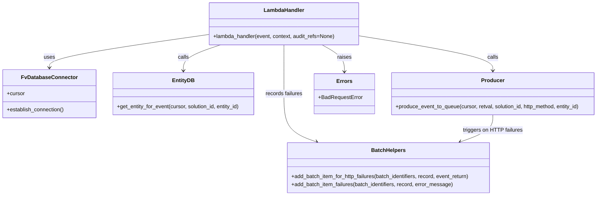
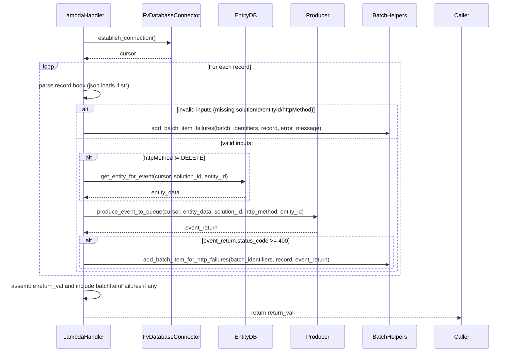

# Diagram: entity_core/entity_service/entity_service/entity/entity/produce_entity.py


> Auto-generated by Obscura crawlers

## Diagram 1

```mermaid
flowchart TD
    A[Start: lambda_handler(event)] --> B[Log event]
    B --> C[DB_CONN.establish_connection()]
    C --> D{For each record in event.Records}
    D --> E[Parse record.body]
    E --> F{body empty?}
    F -- yes --> G[add_batch_item_failures(batch_identifiers, record, error_message)]
    F -- no --> H{solutionId & entityId present?}
    H -- no --> G
    H -- yes --> I{httpMethod present?}
    I -- no --> G
    I -- yes --> J{httpMethod == DELETE?}
    J -- no --> K[get_entity_for_event(DB_CONN.cursor, solution_id, entity_id)]
    K --> L[produce_event_to_queue(cursor, retval, solution_id, http_method, entity_id)]
    J -- yes --> L
    L --> M{event_return != null and status_code >= 400?}
    M -- yes --> N[add_batch_item_for_http_failures(batch_identifiers, record, event_return)]
    M -- no --> O[continue]
    N --> O
    O --> D
    D --> P[After loop: if batch_identifiers -> set return_val.batchItemFailures]
    P --> Q[Set return_val.body = {} and return return_val]
```

> SVG rendering failed for this diagram.

## Diagram 2



### SVG

<svg id="container" width="1797.625" xmlns="http://www.w3.org/2000/svg" class="classDiagram" height="584" viewBox="0 0 1797.625 584" role="graphics-document document" aria-roledescription="class"><style>#container{font-family:"trebuchet ms",verdana,arial,sans-serif;font-size:16px;fill:#333;}@keyframes edge-animation-frame{from{stroke-dashoffset:0;}}@keyframes dash{to{stroke-dashoffset:0;}}#container .edge-animation-slow{stroke-dasharray:9,5!important;stroke-dashoffset:900;animation:dash 50s linear infinite;stroke-linecap:round;}#container .edge-animation-fast{stroke-dasharray:9,5!important;stroke-dashoffset:900;animation:dash 20s linear infinite;stroke-linecap:round;}#container .error-icon{fill:#552222;}#container .error-text{fill:#552222;stroke:#552222;}#container .edge-thickness-normal{stroke-width:1px;}#container .edge-thickness-thick{stroke-width:3.5px;}#container .edge-pattern-solid{stroke-dasharray:0;}#container .edge-thickness-invisible{stroke-width:0;fill:none;}#container .edge-pattern-dashed{stroke-dasharray:3;}#container .edge-pattern-dotted{stroke-dasharray:2;}#container .marker{fill:#333333;stroke:#333333;}#container .marker.cross{stroke:#333333;}#container svg{font-family:"trebuchet ms",verdana,arial,sans-serif;font-size:16px;}#container p{margin:0;}#container g.classGroup text{fill:#9370DB;stroke:none;font-family:"trebuchet ms",verdana,arial,sans-serif;font-size:10px;}#container g.classGroup text .title{font-weight:bolder;}#container .nodeLabel,#container .edgeLabel{color:#131300;}#container .edgeLabel .label rect{fill:#ECECFF;}#container .label text{fill:#131300;}#container .labelBkg{background:#ECECFF;}#container .edgeLabel .label span{background:#ECECFF;}#container .classTitle{font-weight:bolder;}#container .node rect,#container .node circle,#container .node ellipse,#container .node polygon,#container .node path{fill:#ECECFF;stroke:#9370DB;stroke-width:1px;}#container .divider{stroke:#9370DB;stroke-width:1;}#container g.clickable{cursor:pointer;}#container g.classGroup rect{fill:#ECECFF;stroke:#9370DB;}#container g.classGroup line{stroke:#9370DB;stroke-width:1;}#container .classLabel .box{stroke:none;stroke-width:0;fill:#ECECFF;opacity:0.5;}#container .classLabel .label{fill:#9370DB;font-size:10px;}#container .relation{stroke:#333333;stroke-width:1;fill:none;}#container .dashed-line{stroke-dasharray:3;}#container .dotted-line{stroke-dasharray:1 2;}#container #compositionStart,#container .composition{fill:#333333!important;stroke:#333333!important;stroke-width:1;}#container #compositionEnd,#container .composition{fill:#333333!important;stroke:#333333!important;stroke-width:1;}#container #dependencyStart,#container .dependency{fill:#333333!important;stroke:#333333!important;stroke-width:1;}#container #dependencyStart,#container .dependency{fill:#333333!important;stroke:#333333!important;stroke-width:1;}#container #extensionStart,#container .extension{fill:transparent!important;stroke:#333333!important;stroke-width:1;}#container #extensionEnd,#container .extension{fill:transparent!important;stroke:#333333!important;stroke-width:1;}#container #aggregationStart,#container .aggregation{fill:transparent!important;stroke:#333333!important;stroke-width:1;}#container #aggregationEnd,#container .aggregation{fill:transparent!important;stroke:#333333!important;stroke-width:1;}#container #lollipopStart,#container .lollipop{fill:#ECECFF!important;stroke:#333333!important;stroke-width:1;}#container #lollipopEnd,#container .lollipop{fill:#ECECFF!important;stroke:#333333!important;stroke-width:1;}#container .edgeTerminals{font-size:11px;line-height:initial;}#container .classTitleText{text-anchor:middle;font-size:18px;fill:#333;}#container .label-icon{display:inline-block;height:1em;overflow:visible;vertical-align:-0.125em;}#container .node .label-icon path{fill:currentColor;stroke:revert;stroke-width:revert;}#container :root{--mermaid-font-family:"trebuchet ms",verdana,arial,sans-serif;}</style><g><defs><marker id="container_class-aggregationStart" class="marker aggregation class" refX="18" refY="7" markerWidth="190" markerHeight="240" orient="auto"><path d="M 18,7 L9,13 L1,7 L9,1 Z"></path></marker></defs><defs><marker id="container_class-aggregationEnd" class="marker aggregation class" refX="1" refY="7" markerWidth="20" markerHeight="28" orient="auto"><path d="M 18,7 L9,13 L1,7 L9,1 Z"></path></marker></defs><defs><marker id="container_class-extensionStart" class="marker extension class" refX="18" refY="7" markerWidth="190" markerHeight="240" orient="auto"><path d="M 1,7 L18,13 V 1 Z"></path></marker></defs><defs><marker id="container_class-extensionEnd" class="marker extension class" refX="1" refY="7" markerWidth="20" markerHeight="28" orient="auto"><path d="M 1,1 V 13 L18,7 Z"></path></marker></defs><defs><marker id="container_class-compositionStart" class="marker composition class" refX="18" refY="7" markerWidth="190" markerHeight="240" orient="auto"><path d="M 18,7 L9,13 L1,7 L9,1 Z"></path></marker></defs><defs><marker id="container_class-compositionEnd" class="marker composition class" refX="1" refY="7" markerWidth="20" markerHeight="28" orient="auto"><path d="M 18,7 L9,13 L1,7 L9,1 Z"></path></marker></defs><defs><marker id="container_class-dependencyStart" class="marker dependency class" refX="6" refY="7" markerWidth="190" markerHeight="240" orient="auto"><path d="M 5,7 L9,13 L1,7 L9,1 Z"></path></marker></defs><defs><marker id="container_class-dependencyEnd" class="marker dependency class" refX="13" refY="7" markerWidth="20" markerHeight="28" orient="auto"><path d="M 18,7 L9,13 L14,7 L9,1 Z"></path></marker></defs><defs><marker id="container_class-lollipopStart" class="marker lollipop class" refX="13" refY="7" markerWidth="190" markerHeight="240" orient="auto"><circle stroke="black" fill="transparent" cx="7" cy="7" r="6"></circle></marker></defs><defs><marker id="container_class-lollipopEnd" class="marker lollipop class" refX="1" refY="7" markerWidth="190" markerHeight="240" orient="auto"><circle stroke="black" fill="transparent" cx="7" cy="7" r="6"></circle></marker></defs><g class="root"><g class="clusters"></g><g class="edgePaths"><path d="M628.828,102.814L548.404,114.178C467.98,125.542,307.133,148.271,226.709,164.802C146.285,181.333,146.285,191.667,146.285,196.833L146.285,202" id="id_LambdaHandler_FvDatabaseConnector_1" class="edge-thickness-normal edge-pattern-solid relation" style=";;;" data-edge="true" data-et="edge" data-id="id_LambdaHandler_FvDatabaseConnector_1" data-points="W3sieCI6NjI4LjgyODEyNSwieSI6MTAyLjgxMzc0MDkxMzA4MDJ9LHsieCI6MTQ2LjI4NTE1NjI1LCJ5IjoxNzF9LHsieCI6MTQ2LjI4NTE1NjI1LCJ5IjoyMDh9XQ==" marker-end="url(#container_class-dependencyEnd)"></path><path d="M661.664,134L642.84,140.167C624.017,146.333,586.37,158.667,567.546,171.5C548.723,184.333,548.723,197.667,548.723,204.333L548.723,211" id="id_LambdaHandler_EntityDB_2" class="edge-thickness-normal edge-pattern-solid relation" style=";;;" data-edge="true" data-et="edge" data-id="id_LambdaHandler_EntityDB_2" data-points="W3sieCI6NjYxLjY2MzcxMDkzNzUsInkiOjEzNH0seyJ4Ijo1NDguNzIyNjU2MjUsInkiOjE3MX0seyJ4Ijo1NDguNzIyNjU2MjUsInkiOjIxN31d" marker-end="url(#container_class-dependencyEnd)"></path><path d="M1079.109,106.922L1146.044,117.602C1212.979,128.281,1346.849,149.641,1413.784,166.987C1480.719,184.333,1480.719,197.667,1480.719,204.333L1480.719,211" id="id_LambdaHandler_Producer_3" class="edge-thickness-normal edge-pattern-solid relation" style=";;;" data-edge="true" data-et="edge" data-id="id_LambdaHandler_Producer_3" data-points="W3sieCI6MTA3OS4xMDkzNzUsInkiOjEwNi45MjE5MTg2Mjc4NDIwNX0seyJ4IjoxNDgwLjcxODc1LCJ5IjoxNzF9LHsieCI6MTQ4MC43MTg3NSwieSI6MjE3fV0=" marker-end="url(#container_class-dependencyEnd)"></path><path d="M853.969,134L853.969,140.167C853.969,146.333,853.969,158.667,853.969,183C853.969,207.333,853.969,243.667,853.969,280C853.969,316.333,853.969,352.667,870.281,376.663C886.594,400.66,919.219,412.32,935.532,418.151L951.844,423.981" id="id_LambdaHandler_BatchHelpers_4" class="edge-thickness-normal edge-pattern-solid relation" style=";;;" data-edge="true" data-et="edge" data-id="id_LambdaHandler_BatchHelpers_4" data-points="W3sieCI6ODUzLjk2ODc1LCJ5IjoxMzR9LHsieCI6ODUzLjk2ODc1LCJ5IjoxNzF9LHsieCI6ODUzLjk2ODc1LCJ5IjoyODB9LHsieCI6ODUzLjk2ODc1LCJ5IjozODl9LHsieCI6OTU3LjQ5NDQxOTY0Mjg1NzEsInkiOjQyNn1d" marker-end="url(#container_class-dependencyEnd)"></path><path d="M967.034,134L978.101,140.167C989.169,146.333,1011.303,158.667,1022.37,172C1033.438,185.333,1033.438,199.667,1033.438,206.833L1033.438,214" id="id_LambdaHandler_Errors_5" class="edge-thickness-normal edge-pattern-solid relation" style=";;;" data-edge="true" data-et="edge" data-id="id_LambdaHandler_Errors_5" data-points="W3sieCI6OTY3LjAzNDA2MjUsInkiOjEzNH0seyJ4IjoxMDMzLjQzNzUsInkiOjE3MX0seyJ4IjoxMDMzLjQzNzUsInkiOjIyMH1d" marker-end="url(#container_class-dependencyEnd)"></path><path d="M1480.719,343L1480.719,350.667C1480.719,358.333,1480.719,373.667,1464.406,387.163C1448.094,400.66,1415.468,412.32,1399.156,418.151L1382.843,423.981" id="id_Producer_BatchHelpers_6" class="edge-thickness-normal edge-pattern-solid relation" style=";;;" data-edge="true" data-et="edge" data-id="id_Producer_BatchHelpers_6" data-points="W3sieCI6MTQ4MC43MTg3NSwieSI6MzQzfSx7IngiOjE0ODAuNzE4NzUsInkiOjM4OX0seyJ4IjoxMzc3LjE5MzA4MDM1NzE0MywieSI6NDI2fV0=" marker-end="url(#container_class-dependencyEnd)"></path></g><g class="edgeLabels"><g class="edgeLabel" transform="translate(146.28515625, 171)"><g class="label" data-id="id_LambdaHandler_FvDatabaseConnector_1" transform="translate(-16.4921875, -12)"><foreignObject width="32.984375" height="24"><div xmlns="http://www.w3.org/1999/xhtml" class="labelBkg" style="display: table-cell; white-space: nowrap; line-height: 1.5; max-width: 200px; text-align: center;"><span class="edgeLabel"><p>uses</p></span></div></foreignObject></g></g><g class="edgeLabel" transform="translate(548.72265625, 171)"><g class="label" data-id="id_LambdaHandler_EntityDB_2" transform="translate(-16.4453125, -12)"><foreignObject width="32.890625" height="24"><div xmlns="http://www.w3.org/1999/xhtml" class="labelBkg" style="display: table-cell; white-space: nowrap; line-height: 1.5; max-width: 200px; text-align: center;"><span class="edgeLabel"><p>calls</p></span></div></foreignObject></g></g><g class="edgeLabel" transform="translate(1480.71875, 171)"><g class="label" data-id="id_LambdaHandler_Producer_3" transform="translate(-16.4453125, -12)"><foreignObject width="32.890625" height="24"><div xmlns="http://www.w3.org/1999/xhtml" class="labelBkg" style="display: table-cell; white-space: nowrap; line-height: 1.5; max-width: 200px; text-align: center;"><span class="edgeLabel"><p>calls</p></span></div></foreignObject></g></g><g class="edgeLabel" transform="translate(853.96875, 280)"><g class="label" data-id="id_LambdaHandler_BatchHelpers_4" transform="translate(-56.09375, -12)"><foreignObject width="112.1875" height="24"><div xmlns="http://www.w3.org/1999/xhtml" class="labelBkg" style="display: table-cell; white-space: nowrap; line-height: 1.5; max-width: 200px; text-align: center;"><span class="edgeLabel"><p>records failures</p></span></div></foreignObject></g></g><g class="edgeLabel" transform="translate(1033.4375, 171)"><g class="label" data-id="id_LambdaHandler_Errors_5" transform="translate(-21.25, -12)"><foreignObject width="42.5" height="24"><div xmlns="http://www.w3.org/1999/xhtml" class="labelBkg" style="display: table-cell; white-space: nowrap; line-height: 1.5; max-width: 200px; text-align: center;"><span class="edgeLabel"><p>raises</p></span></div></foreignObject></g></g><g class="edgeLabel" transform="translate(1480.71875, 389)"><g class="label" data-id="id_Producer_BatchHelpers_6" transform="translate(-88.625, -12)"><foreignObject width="177.25" height="24"><div xmlns="http://www.w3.org/1999/xhtml" class="labelBkg" style="display: table-cell; white-space: nowrap; line-height: 1.5; max-width: 200px; text-align: center;"><span class="edgeLabel"><p>triggers on HTTP failures</p></span></div></foreignObject></g></g></g><g class="nodes"><g class="node default" id="classId-LambdaHandler-0" transform="translate(853.96875, 71)"><g class="basic label-container"><path d="M-225.140625 -63 L225.140625 -63 L225.140625 63 L-225.140625 63" stroke="none" stroke-width="0" fill="#ECECFF" style=""></path><path d="M-225.140625 -63 C-78.48359904290723 -63, 68.17342691418554 -63, 225.140625 -63 M-225.140625 -63 C-132.43632511092147 -63, -39.73202522184292 -63, 225.140625 -63 M225.140625 -63 C225.140625 -29.862676207127215, 225.140625 3.2746475857455692, 225.140625 63 M225.140625 -63 C225.140625 -24.08697964742386, 225.140625 14.82604070515228, 225.140625 63 M225.140625 63 C81.62894461168017 63, -61.88273577663966 63, -225.140625 63 M225.140625 63 C118.3462650483123 63, 11.551905096624608 63, -225.140625 63 M-225.140625 63 C-225.140625 29.007332680142646, -225.140625 -4.985334639714708, -225.140625 -63 M-225.140625 63 C-225.140625 16.236017357449775, -225.140625 -30.52796528510045, -225.140625 -63" stroke="#9370DB" stroke-width="1.3" fill="none" stroke-dasharray="0 0" style=""></path></g><g class="annotation-group text" transform="translate(0, -39)"></g><g class="label-group text" transform="translate(-58.21875, -39)"><g class="label" style="font-weight: bolder" transform="translate(0,-12)"><foreignObject width="116.4375" height="24"><div xmlns="http://www.w3.org/1999/xhtml" style="display: table-cell; white-space: nowrap; line-height: 1.5; max-width: 167px; text-align: center;"><span class="nodeLabel markdown-node-label" style=""><p>LambdaHandler</p></span></div></foreignObject></g></g><g class="members-group text" transform="translate(-213.140625, 9)"></g><g class="methods-group text" transform="translate(-213.140625, 39)"><g class="label" style="" transform="translate(0,-12)"><foreignObject width="368.0625" height="24"><div xmlns="http://www.w3.org/1999/xhtml" style="display: table-cell; white-space: nowrap; line-height: 1.5; max-width: 425px; text-align: center;"><span class="nodeLabel markdown-node-label" style=""><p>+lambda_handler(event, context, audit_refs=None)</p></span></div></foreignObject></g></g><g class="divider" style=""><path d="M-225.140625 -15 C-113.58633674488817 -15, -2.0320484897763436 -15, 225.140625 -15 M-225.140625 -15 C-106.4346467669832 -15, 12.271331466033587 -15, 225.140625 -15" stroke="#9370DB" stroke-width="1.3" fill="none" stroke-dasharray="0 0" style=""></path></g><g class="divider" style=""><path d="M-225.140625 9 C-111.87037002145256 9, 1.3998849570948835 9, 225.140625 9 M-225.140625 9 C-127.75828469097267 9, -30.375944381945345 9, 225.140625 9" stroke="#9370DB" stroke-width="1.3" fill="none" stroke-dasharray="0 0" style=""></path></g></g><g class="node default" id="classId-FvDatabaseConnector-1" transform="translate(146.28515625, 280)"><g class="basic label-container"><path d="M-138.28515625 -72 L138.28515625 -72 L138.28515625 72 L-138.28515625 72" stroke="none" stroke-width="0" fill="#ECECFF" style=""></path><path d="M-138.28515625 -72 C-54.23357218025771 -72, 29.81801188948458 -72, 138.28515625 -72 M-138.28515625 -72 C-56.00105232511767 -72, 26.28305159976466 -72, 138.28515625 -72 M138.28515625 -72 C138.28515625 -18.795638533815158, 138.28515625 34.408722932369685, 138.28515625 72 M138.28515625 -72 C138.28515625 -27.53961619274537, 138.28515625 16.92076761450926, 138.28515625 72 M138.28515625 72 C34.936761543430435 72, -68.41163316313913 72, -138.28515625 72 M138.28515625 72 C52.81671868799424 72, -32.65171887401152 72, -138.28515625 72 M-138.28515625 72 C-138.28515625 26.476280345637242, -138.28515625 -19.047439308725515, -138.28515625 -72 M-138.28515625 72 C-138.28515625 37.088003877474165, -138.28515625 2.17600775494833, -138.28515625 -72" stroke="#9370DB" stroke-width="1.3" fill="none" stroke-dasharray="0 0" style=""></path></g><g class="annotation-group text" transform="translate(0, -48)"></g><g class="label-group text" transform="translate(-79.3046875, -48)"><g class="label" style="font-weight: bolder" transform="translate(0,-12)"><foreignObject width="158.609375" height="24"><div xmlns="http://www.w3.org/1999/xhtml" style="display: table-cell; white-space: nowrap; line-height: 1.5; max-width: 207px; text-align: center;"><span class="nodeLabel markdown-node-label" style=""><p>FvDatabaseConnector</p></span></div></foreignObject></g></g><g class="members-group text" transform="translate(-126.28515625, 0)"><g class="label" style="" transform="translate(0,-12)"><foreignObject width="53.71875" height="24"><div xmlns="http://www.w3.org/1999/xhtml" style="display: table-cell; white-space: nowrap; line-height: 1.5; max-width: 112px; text-align: center;"><span class="nodeLabel markdown-node-label" style=""><p>+cursor</p></span></div></foreignObject></g></g><g class="methods-group text" transform="translate(-126.28515625, 48)"><g class="label" style="" transform="translate(0,-12)"><foreignObject width="173.265625" height="24"><div xmlns="http://www.w3.org/1999/xhtml" style="display: table-cell; white-space: nowrap; line-height: 1.5; max-width: 231px; text-align: center;"><span class="nodeLabel markdown-node-label" style=""><p>+establish_connection()</p></span></div></foreignObject></g></g><g class="divider" style=""><path d="M-138.28515625 -24 C-42.636581894719114 -24, 53.01199246056177 -24, 138.28515625 -24 M-138.28515625 -24 C-30.29295010741754 -24, 77.69925603516492 -24, 138.28515625 -24" stroke="#9370DB" stroke-width="1.3" fill="none" stroke-dasharray="0 0" style=""></path></g><g class="divider" style=""><path d="M-138.28515625 24 C-62.87029741921482 24, 12.544561411570356 24, 138.28515625 24 M-138.28515625 24 C-62.046600506149076 24, 14.191955237701848 24, 138.28515625 24" stroke="#9370DB" stroke-width="1.3" fill="none" stroke-dasharray="0 0" style=""></path></g></g><g class="node default" id="classId-EntityDB-2" transform="translate(548.72265625, 280)"><g class="basic label-container"><path d="M-214.15234375 -63 L214.15234375 -63 L214.15234375 63 L-214.15234375 63" stroke="none" stroke-width="0" fill="#ECECFF" style=""></path><path d="M-214.15234375 -63 C-100.64678237526161 -63, 12.858778999476783 -63, 214.15234375 -63 M-214.15234375 -63 C-51.40098027701049 -63, 111.35038319597902 -63, 214.15234375 -63 M214.15234375 -63 C214.15234375 -14.56764281317912, 214.15234375 33.86471437364176, 214.15234375 63 M214.15234375 -63 C214.15234375 -22.680428954833047, 214.15234375 17.639142090333905, 214.15234375 63 M214.15234375 63 C120.91468488810087 63, 27.67702602620173 63, -214.15234375 63 M214.15234375 63 C85.77305061362898 63, -42.606242522742036 63, -214.15234375 63 M-214.15234375 63 C-214.15234375 28.044518863930236, -214.15234375 -6.910962272139528, -214.15234375 -63 M-214.15234375 63 C-214.15234375 15.632241786934742, -214.15234375 -31.735516426130516, -214.15234375 -63" stroke="#9370DB" stroke-width="1.3" fill="none" stroke-dasharray="0 0" style=""></path></g><g class="annotation-group text" transform="translate(0, -39)"></g><g class="label-group text" transform="translate(-31.4296875, -39)"><g class="label" style="font-weight: bolder" transform="translate(0,-12)"><foreignObject width="62.859375" height="24"><div xmlns="http://www.w3.org/1999/xhtml" style="display: table-cell; white-space: nowrap; line-height: 1.5; max-width: 112px; text-align: center;"><span class="nodeLabel markdown-node-label" style=""><p>EntityDB</p></span></div></foreignObject></g></g><g class="members-group text" transform="translate(-202.15234375, 9)"></g><g class="methods-group text" transform="translate(-202.15234375, 39)"><g class="label" style="" transform="translate(0,-12)"><foreignObject width="372.875" height="24"><div xmlns="http://www.w3.org/1999/xhtml" style="display: table-cell; white-space: nowrap; line-height: 1.5; max-width: 430px; text-align: center;"><span class="nodeLabel markdown-node-label" style=""><p>+get_entity_for_event(cursor, solution_id, entity_id)</p></span></div></foreignObject></g></g><g class="divider" style=""><path d="M-214.15234375 -15 C-117.93032945295752 -15, -21.708315155915045 -15, 214.15234375 -15 M-214.15234375 -15 C-72.44549565801464 -15, 69.26135243397073 -15, 214.15234375 -15" stroke="#9370DB" stroke-width="1.3" fill="none" stroke-dasharray="0 0" style=""></path></g><g class="divider" style=""><path d="M-214.15234375 9 C-60.448524047555935 9, 93.25529565488813 9, 214.15234375 9 M-214.15234375 9 C-114.01119291634954 9, -13.870042082699086 9, 214.15234375 9" stroke="#9370DB" stroke-width="1.3" fill="none" stroke-dasharray="0 0" style=""></path></g></g><g class="node default" id="classId-Producer-3" transform="translate(1480.71875, 280)"><g class="basic label-container"><path d="M-308.90625 -63 L308.90625 -63 L308.90625 63 L-308.90625 63" stroke="none" stroke-width="0" fill="#ECECFF" style=""></path><path d="M-308.90625 -63 C-126.80646317280923 -63, 55.29332365438154 -63, 308.90625 -63 M-308.90625 -63 C-172.38979705550608 -63, -35.87334411101216 -63, 308.90625 -63 M308.90625 -63 C308.90625 -13.980805442019204, 308.90625 35.03838911596159, 308.90625 63 M308.90625 -63 C308.90625 -33.07157083211219, 308.90625 -3.1431416642243732, 308.90625 63 M308.90625 63 C100.43651855529833 63, -108.03321288940333 63, -308.90625 63 M308.90625 63 C67.58494925154483 63, -173.73635149691034 63, -308.90625 63 M-308.90625 63 C-308.90625 17.651384833115557, -308.90625 -27.697230333768886, -308.90625 -63 M-308.90625 63 C-308.90625 36.724561713156376, -308.90625 10.449123426312745, -308.90625 -63" stroke="#9370DB" stroke-width="1.3" fill="none" stroke-dasharray="0 0" style=""></path></g><g class="annotation-group text" transform="translate(0, -39)"></g><g class="label-group text" transform="translate(-32.953125, -39)"><g class="label" style="font-weight: bolder" transform="translate(0,-12)"><foreignObject width="65.90625" height="24"><div xmlns="http://www.w3.org/1999/xhtml" style="display: table-cell; white-space: nowrap; line-height: 1.5; max-width: 116px; text-align: center;"><span class="nodeLabel markdown-node-label" style=""><p>Producer</p></span></div></foreignObject></g></g><g class="members-group text" transform="translate(-296.90625, 9)"></g><g class="methods-group text" transform="translate(-296.90625, 39)"><g class="label" style="" transform="translate(0,-12)"><foreignObject width="560.859375" height="24"><div xmlns="http://www.w3.org/1999/xhtml" style="display: table-cell; white-space: nowrap; line-height: 1.5; max-width: 618px; text-align: center;"><span class="nodeLabel markdown-node-label" style=""><p>+produce_event_to_queue(cursor, retval, solution_id, http_method, entity_id)</p></span></div></foreignObject></g></g><g class="divider" style=""><path d="M-308.90625 -15 C-175.51751858722773 -15, -42.128787174455454 -15, 308.90625 -15 M-308.90625 -15 C-62.20239263270466 -15, 184.50146473459068 -15, 308.90625 -15" stroke="#9370DB" stroke-width="1.3" fill="none" stroke-dasharray="0 0" style=""></path></g><g class="divider" style=""><path d="M-308.90625 9 C-97.43733134034622 9, 114.03158731930756 9, 308.90625 9 M-308.90625 9 C-67.26265364599317 9, 174.38094270801366 9, 308.90625 9" stroke="#9370DB" stroke-width="1.3" fill="none" stroke-dasharray="0 0" style=""></path></g></g><g class="node default" id="classId-BatchHelpers-4" transform="translate(1167.34375, 501)"><g class="basic label-container"><path d="M-307.80859375 -75 L307.80859375 -75 L307.80859375 75 L-307.80859375 75" stroke="none" stroke-width="0" fill="#ECECFF" style=""></path><path d="M-307.80859375 -75 C-87.09995849022468 -75, 133.60867676955064 -75, 307.80859375 -75 M-307.80859375 -75 C-154.83143666328445 -75, -1.8542795765688993 -75, 307.80859375 -75 M307.80859375 -75 C307.80859375 -29.806862828770292, 307.80859375 15.386274342459416, 307.80859375 75 M307.80859375 -75 C307.80859375 -38.4927556538126, 307.80859375 -1.9855113076252024, 307.80859375 75 M307.80859375 75 C163.63887164377076 75, 19.46914953754151 75, -307.80859375 75 M307.80859375 75 C124.05638140355487 75, -59.69583094289027 75, -307.80859375 75 M-307.80859375 75 C-307.80859375 16.97158187059201, -307.80859375 -41.05683625881598, -307.80859375 -75 M-307.80859375 75 C-307.80859375 39.36397342244503, -307.80859375 3.727946844890056, -307.80859375 -75" stroke="#9370DB" stroke-width="1.3" fill="none" stroke-dasharray="0 0" style=""></path></g><g class="annotation-group text" transform="translate(0, -51)"></g><g class="label-group text" transform="translate(-49.0078125, -51)"><g class="label" style="font-weight: bolder" transform="translate(0,-12)"><foreignObject width="98.015625" height="24"><div xmlns="http://www.w3.org/1999/xhtml" style="display: table-cell; white-space: nowrap; line-height: 1.5; max-width: 147px; text-align: center;"><span class="nodeLabel markdown-node-label" style=""><p>BatchHelpers</p></span></div></foreignObject></g></g><g class="members-group text" transform="translate(-295.80859375, -3)"></g><g class="methods-group text" transform="translate(-295.80859375, 27)"><g class="label" style="" transform="translate(0,-12)"><foreignObject width="542.609375" height="24"><div xmlns="http://www.w3.org/1999/xhtml" style="display: table-cell; white-space: nowrap; line-height: 1.5; max-width: 600px; text-align: center;"><span class="nodeLabel markdown-node-label" style=""><p>+add_batch_item_for_http_failures(batch_identifiers, record, event_return)</p></span></div></foreignObject></g><g class="label" style="" transform="translate(0,12)"><foreignObject width="488.5625" height="24"><div xmlns="http://www.w3.org/1999/xhtml" style="display: table-cell; white-space: nowrap; line-height: 1.5; max-width: 546px; text-align: center;"><span class="nodeLabel markdown-node-label" style=""><p>+add_batch_item_failures(batch_identifiers, record, error_message)</p></span></div></foreignObject></g></g><g class="divider" style=""><path d="M-307.80859375 -27 C-124.63276037889418 -27, 58.54307299221165 -27, 307.80859375 -27 M-307.80859375 -27 C-120.79486861927725 -27, 66.2188565114455 -27, 307.80859375 -27" stroke="#9370DB" stroke-width="1.3" fill="none" stroke-dasharray="0 0" style=""></path></g><g class="divider" style=""><path d="M-307.80859375 -3 C-63.049918598239145 -3, 181.7087565535217 -3, 307.80859375 -3 M-307.80859375 -3 C-122.69119128875059 -3, 62.426211172498824 -3, 307.80859375 -3" stroke="#9370DB" stroke-width="1.3" fill="none" stroke-dasharray="0 0" style=""></path></g></g><g class="node default" id="classId-Errors-5" transform="translate(1033.4375, 280)"><g class="basic label-container"><path d="M-88.375 -60 L88.375 -60 L88.375 60 L-88.375 60" stroke="none" stroke-width="0" fill="#ECECFF" style=""></path><path d="M-88.375 -60 C-27.37707616978392 -60, 33.62084766043216 -60, 88.375 -60 M-88.375 -60 C-39.92594419228185 -60, 8.523111615436306 -60, 88.375 -60 M88.375 -60 C88.375 -28.118857512529573, 88.375 3.7622849749408545, 88.375 60 M88.375 -60 C88.375 -22.26347830168089, 88.375 15.473043396638218, 88.375 60 M88.375 60 C51.923494645536096 60, 15.471989291072191 60, -88.375 60 M88.375 60 C24.703241180417628 60, -38.968517639164745 60, -88.375 60 M-88.375 60 C-88.375 15.216831007937508, -88.375 -29.566337984124985, -88.375 -60 M-88.375 60 C-88.375 32.79732822291653, -88.375 5.59465644583306, -88.375 -60" stroke="#9370DB" stroke-width="1.3" fill="none" stroke-dasharray="0 0" style=""></path></g><g class="annotation-group text" transform="translate(0, -36)"></g><g class="label-group text" transform="translate(-21.953125, -36)"><g class="label" style="font-weight: bolder" transform="translate(0,-12)"><foreignObject width="43.90625" height="24"><div xmlns="http://www.w3.org/1999/xhtml" style="display: table-cell; white-space: nowrap; line-height: 1.5; max-width: 93px; text-align: center;"><span class="nodeLabel markdown-node-label" style=""><p>Errors</p></span></div></foreignObject></g></g><g class="members-group text" transform="translate(-76.375, 12)"><g class="label" style="" transform="translate(0,-12)"><foreignObject width="130.796875" height="24"><div xmlns="http://www.w3.org/1999/xhtml" style="display: table-cell; white-space: nowrap; line-height: 1.5; max-width: 189px; text-align: center;"><span class="nodeLabel markdown-node-label" style=""><p>+BadRequestError</p></span></div></foreignObject></g></g><g class="methods-group text" transform="translate(-76.375, 60)"></g><g class="divider" style=""><path d="M-88.375 -12 C-23.271256575111636 -12, 41.83248684977673 -12, 88.375 -12 M-88.375 -12 C-31.472320001668507 -12, 25.430359996662986 -12, 88.375 -12" stroke="#9370DB" stroke-width="1.3" fill="none" stroke-dasharray="0 0" style=""></path></g><g class="divider" style=""><path d="M-88.375 36 C-32.27500650387932 36, 23.824986992241364 36, 88.375 36 M-88.375 36 C-36.06468396757478 36, 16.24563206485044 36, 88.375 36" stroke="#9370DB" stroke-width="1.3" fill="none" stroke-dasharray="0 0" style=""></path></g></g></g></g></g></svg>

## Diagram 3



### SVG

<svg id="container" width="1461.5" xmlns="http://www.w3.org/2000/svg" height="1024" viewBox="-181 -10 1461.5 1024" role="graphics-document document" aria-roledescription="sequence"><g><rect x="1080.5" y="938" fill="#eaeaea" stroke="#666" width="150" height="65" name="Caller" rx="3" ry="3" class="actor actor-bottom"></rect><text x="1155.5" y="970.5" dominant-baseline="central" alignment-baseline="central" class="actor actor-box" style="text-anchor: middle; font-size: 16px; font-weight: 400;"><tspan x="1155.5" dy="0">Caller</tspan></text></g><g><rect x="880.5" y="938" fill="#eaeaea" stroke="#666" width="150" height="65" name="B" rx="3" ry="3" class="actor actor-bottom"></rect><text x="955.5" y="970.5" dominant-baseline="central" alignment-baseline="central" class="actor actor-box" style="text-anchor: middle; font-size: 16px; font-weight: 400;"><tspan x="955.5" dy="0">BatchHelpers</tspan></text></g><g><rect x="680.5" y="938" fill="#eaeaea" stroke="#666" width="150" height="65" name="Q" rx="3" ry="3" class="actor actor-bottom"></rect><text x="755.5" y="970.5" dominant-baseline="central" alignment-baseline="central" class="actor actor-box" style="text-anchor: middle; font-size: 16px; font-weight: 400;"><tspan x="755.5" dy="0">Producer</tspan></text></g><g><rect x="480.5" y="938" fill="#eaeaea" stroke="#666" width="150" height="65" name="E" rx="3" ry="3" class="actor actor-bottom"></rect><text x="555.5" y="970.5" dominant-baseline="central" alignment-baseline="central" class="actor actor-box" style="text-anchor: middle; font-size: 16px; font-weight: 400;"><tspan x="555.5" dy="0">EntityDB</tspan></text></g><g><rect x="253.5" y="938" fill="#eaeaea" stroke="#666" width="177" height="65" name="DB" rx="3" ry="3" class="actor actor-bottom"></rect><text x="342" y="970.5" dominant-baseline="central" alignment-baseline="central" class="actor actor-box" style="text-anchor: middle; font-size: 16px; font-weight: 400;"><tspan x="342" dy="0">FvDatabaseConnector</tspan></text></g><g><rect x="0" y="938" fill="#eaeaea" stroke="#666" width="150" height="65" name="L" rx="3" ry="3" class="actor actor-bottom"></rect><text x="75" y="970.5" dominant-baseline="central" alignment-baseline="central" class="actor actor-box" style="text-anchor: middle; font-size: 16px; font-weight: 400;"><tspan x="75" dy="0">LambdaHandler</tspan></text></g><g><line id="actor5" x1="1155.5" y1="65" x2="1155.5" y2="938" class="actor-line 200" stroke-width="0.5px" stroke="#999" name="Caller"></line><g id="root-5"><rect x="1080.5" y="0" fill="#eaeaea" stroke="#666" width="150" height="65" name="Caller" rx="3" ry="3" class="actor actor-top"></rect><text x="1155.5" y="32.5" dominant-baseline="central" alignment-baseline="central" class="actor actor-box" style="text-anchor: middle; font-size: 16px; font-weight: 400;"><tspan x="1155.5" dy="0">Caller</tspan></text></g></g><g><line id="actor4" x1="955.5" y1="65" x2="955.5" y2="938" class="actor-line 200" stroke-width="0.5px" stroke="#999" name="B"></line><g id="root-4"><rect x="880.5" y="0" fill="#eaeaea" stroke="#666" width="150" height="65" name="B" rx="3" ry="3" class="actor actor-top"></rect><text x="955.5" y="32.5" dominant-baseline="central" alignment-baseline="central" class="actor actor-box" style="text-anchor: middle; font-size: 16px; font-weight: 400;"><tspan x="955.5" dy="0">BatchHelpers</tspan></text></g></g><g><line id="actor3" x1="755.5" y1="65" x2="755.5" y2="938" class="actor-line 200" stroke-width="0.5px" stroke="#999" name="Q"></line><g id="root-3"><rect x="680.5" y="0" fill="#eaeaea" stroke="#666" width="150" height="65" name="Q" rx="3" ry="3" class="actor actor-top"></rect><text x="755.5" y="32.5" dominant-baseline="central" alignment-baseline="central" class="actor actor-box" style="text-anchor: middle; font-size: 16px; font-weight: 400;"><tspan x="755.5" dy="0">Producer</tspan></text></g></g><g><line id="actor2" x1="555.5" y1="65" x2="555.5" y2="938" class="actor-line 200" stroke-width="0.5px" stroke="#999" name="E"></line><g id="root-2"><rect x="480.5" y="0" fill="#eaeaea" stroke="#666" width="150" height="65" name="E" rx="3" ry="3" class="actor actor-top"></rect><text x="555.5" y="32.5" dominant-baseline="central" alignment-baseline="central" class="actor actor-box" style="text-anchor: middle; font-size: 16px; font-weight: 400;"><tspan x="555.5" dy="0">EntityDB</tspan></text></g></g><g><line id="actor1" x1="342" y1="65" x2="342" y2="938" class="actor-line 200" stroke-width="0.5px" stroke="#999" name="DB"></line><g id="root-1"><rect x="253.5" y="0" fill="#eaeaea" stroke="#666" width="177" height="65" name="DB" rx="3" ry="3" class="actor actor-top"></rect><text x="342" y="32.5" dominant-baseline="central" alignment-baseline="central" class="actor actor-box" style="text-anchor: middle; font-size: 16px; font-weight: 400;"><tspan x="342" dy="0">FvDatabaseConnector</tspan></text></g></g><g><line id="actor0" x1="75" y1="65" x2="75" y2="938" class="actor-line 200" stroke-width="0.5px" stroke="#999" name="L"></line><g id="root-0"><rect x="0" y="0" fill="#eaeaea" stroke="#666" width="150" height="65" name="L" rx="3" ry="3" class="actor actor-top"></rect><text x="75" y="32.5" dominant-baseline="central" alignment-baseline="central" class="actor actor-box" style="text-anchor: middle; font-size: 16px; font-weight: 400;"><tspan x="75" dy="0">LambdaHandler</tspan></text></g></g><style>#container{font-family:"trebuchet ms",verdana,arial,sans-serif;font-size:16px;fill:#333;}@keyframes edge-animation-frame{from{stroke-dashoffset:0;}}@keyframes dash{to{stroke-dashoffset:0;}}#container .edge-animation-slow{stroke-dasharray:9,5!important;stroke-dashoffset:900;animation:dash 50s linear infinite;stroke-linecap:round;}#container .edge-animation-fast{stroke-dasharray:9,5!important;stroke-dashoffset:900;animation:dash 20s linear infinite;stroke-linecap:round;}#container .error-icon{fill:#552222;}#container .error-text{fill:#552222;stroke:#552222;}#container .edge-thickness-normal{stroke-width:1px;}#container .edge-thickness-thick{stroke-width:3.5px;}#container .edge-pattern-solid{stroke-dasharray:0;}#container .edge-thickness-invisible{stroke-width:0;fill:none;}#container .edge-pattern-dashed{stroke-dasharray:3;}#container .edge-pattern-dotted{stroke-dasharray:2;}#container .marker{fill:#333333;stroke:#333333;}#container .marker.cross{stroke:#333333;}#container svg{font-family:"trebuchet ms",verdana,arial,sans-serif;font-size:16px;}#container p{margin:0;}#container .actor{stroke:hsl(259.6261682243, 59.7765363128%, 87.9019607843%);fill:#ECECFF;}#container text.actor&gt;tspan{fill:black;stroke:none;}#container .actor-line{stroke:hsl(259.6261682243, 59.7765363128%, 87.9019607843%);}#container .innerArc{stroke-width:1.5;stroke-dasharray:none;}#container .messageLine0{stroke-width:1.5;stroke-dasharray:none;stroke:#333;}#container .messageLine1{stroke-width:1.5;stroke-dasharray:2,2;stroke:#333;}#container #arrowhead path{fill:#333;stroke:#333;}#container .sequenceNumber{fill:white;}#container #sequencenumber{fill:#333;}#container #crosshead path{fill:#333;stroke:#333;}#container .messageText{fill:#333;stroke:none;}#container .labelBox{stroke:hsl(259.6261682243, 59.7765363128%, 87.9019607843%);fill:#ECECFF;}#container .labelText,#container .labelText&gt;tspan{fill:black;stroke:none;}#container .loopText,#container .loopText&gt;tspan{fill:black;stroke:none;}#container .loopLine{stroke-width:2px;stroke-dasharray:2,2;stroke:hsl(259.6261682243, 59.7765363128%, 87.9019607843%);fill:hsl(259.6261682243, 59.7765363128%, 87.9019607843%);}#container .note{stroke:#aaaa33;fill:#fff5ad;}#container .noteText,#container .noteText&gt;tspan{fill:black;stroke:none;}#container .activation0{fill:#f4f4f4;stroke:#666;}#container .activation1{fill:#f4f4f4;stroke:#666;}#container .activation2{fill:#f4f4f4;stroke:#666;}#container .actorPopupMenu{position:absolute;}#container .actorPopupMenuPanel{position:absolute;fill:#ECECFF;box-shadow:0px 8px 16px 0px rgba(0,0,0,0.2);filter:drop-shadow(3px 5px 2px rgb(0 0 0 / 0.4));}#container .actor-man line{stroke:hsl(259.6261682243, 59.7765363128%, 87.9019607843%);fill:#ECECFF;}#container .actor-man circle,#container line{stroke:hsl(259.6261682243, 59.7765363128%, 87.9019607843%);fill:#ECECFF;stroke-width:2px;}#container :root{--mermaid-font-family:"trebuchet ms",verdana,arial,sans-serif;}</style><g></g><defs><symbol id="computer" width="24" height="24"><path transform="scale(.5)" d="M2 2v13h20v-13h-20zm18 11h-16v-9h16v9zm-10.228 6l.466-1h3.524l.467 1h-4.457zm14.228 3h-24l2-6h2.104l-1.33 4h18.45l-1.297-4h2.073l2 6zm-5-10h-14v-7h14v7z"></path></symbol></defs><defs><symbol id="database" fill-rule="evenodd" clip-rule="evenodd"><path transform="scale(.5)" d="M12.258.001l.256.004.255.005.253.008.251.01.249.012.247.015.246.016.242.019.241.02.239.023.236.024.233.027.231.028.229.031.225.032.223.034.22.036.217.038.214.04.211.041.208.043.205.045.201.046.198.048.194.05.191.051.187.053.183.054.18.056.175.057.172.059.168.06.163.061.16.063.155.064.15.066.074.033.073.033.071.034.07.034.069.035.068.035.067.035.066.035.064.036.064.036.062.036.06.036.06.037.058.037.058.037.055.038.055.038.053.038.052.038.051.039.05.039.048.039.047.039.045.04.044.04.043.04.041.04.04.041.039.041.037.041.036.041.034.041.033.042.032.042.03.042.029.042.027.042.026.043.024.043.023.043.021.043.02.043.018.044.017.043.015.044.013.044.012.044.011.045.009.044.007.045.006.045.004.045.002.045.001.045v17l-.001.045-.002.045-.004.045-.006.045-.007.045-.009.044-.011.045-.012.044-.013.044-.015.044-.017.043-.018.044-.02.043-.021.043-.023.043-.024.043-.026.043-.027.042-.029.042-.03.042-.032.042-.033.042-.034.041-.036.041-.037.041-.039.041-.04.041-.041.04-.043.04-.044.04-.045.04-.047.039-.048.039-.05.039-.051.039-.052.038-.053.038-.055.038-.055.038-.058.037-.058.037-.06.037-.06.036-.062.036-.064.036-.064.036-.066.035-.067.035-.068.035-.069.035-.07.034-.071.034-.073.033-.074.033-.15.066-.155.064-.16.063-.163.061-.168.06-.172.059-.175.057-.18.056-.183.054-.187.053-.191.051-.194.05-.198.048-.201.046-.205.045-.208.043-.211.041-.214.04-.217.038-.22.036-.223.034-.225.032-.229.031-.231.028-.233.027-.236.024-.239.023-.241.02-.242.019-.246.016-.247.015-.249.012-.251.01-.253.008-.255.005-.256.004-.258.001-.258-.001-.256-.004-.255-.005-.253-.008-.251-.01-.249-.012-.247-.015-.245-.016-.243-.019-.241-.02-.238-.023-.236-.024-.234-.027-.231-.028-.228-.031-.226-.032-.223-.034-.22-.036-.217-.038-.214-.04-.211-.041-.208-.043-.204-.045-.201-.046-.198-.048-.195-.05-.19-.051-.187-.053-.184-.054-.179-.056-.176-.057-.172-.059-.167-.06-.164-.061-.159-.063-.155-.064-.151-.066-.074-.033-.072-.033-.072-.034-.07-.034-.069-.035-.068-.035-.067-.035-.066-.035-.064-.036-.063-.036-.062-.036-.061-.036-.06-.037-.058-.037-.057-.037-.056-.038-.055-.038-.053-.038-.052-.038-.051-.039-.049-.039-.049-.039-.046-.039-.046-.04-.044-.04-.043-.04-.041-.04-.04-.041-.039-.041-.037-.041-.036-.041-.034-.041-.033-.042-.032-.042-.03-.042-.029-.042-.027-.042-.026-.043-.024-.043-.023-.043-.021-.043-.02-.043-.018-.044-.017-.043-.015-.044-.013-.044-.012-.044-.011-.045-.009-.044-.007-.045-.006-.045-.004-.045-.002-.045-.001-.045v-17l.001-.045.002-.045.004-.045.006-.045.007-.045.009-.044.011-.045.012-.044.013-.044.015-.044.017-.043.018-.044.02-.043.021-.043.023-.043.024-.043.026-.043.027-.042.029-.042.03-.042.032-.042.033-.042.034-.041.036-.041.037-.041.039-.041.04-.041.041-.04.043-.04.044-.04.046-.04.046-.039.049-.039.049-.039.051-.039.052-.038.053-.038.055-.038.056-.038.057-.037.058-.037.06-.037.061-.036.062-.036.063-.036.064-.036.066-.035.067-.035.068-.035.069-.035.07-.034.072-.034.072-.033.074-.033.151-.066.155-.064.159-.063.164-.061.167-.06.172-.059.176-.057.179-.056.184-.054.187-.053.19-.051.195-.05.198-.048.201-.046.204-.045.208-.043.211-.041.214-.04.217-.038.22-.036.223-.034.226-.032.228-.031.231-.028.234-.027.236-.024.238-.023.241-.02.243-.019.245-.016.247-.015.249-.012.251-.01.253-.008.255-.005.256-.004.258-.001.258.001zm-9.258 20.499v.01l.001.021.003.021.004.022.005.021.006.022.007.022.009.023.01.022.011.023.012.023.013.023.015.023.016.024.017.023.018.024.019.024.021.024.022.025.023.024.024.025.052.049.056.05.061.051.066.051.07.051.075.051.079.052.084.052.088.052.092.052.097.052.102.051.105.052.11.052.114.051.119.051.123.051.127.05.131.05.135.05.139.048.144.049.147.047.152.047.155.047.16.045.163.045.167.043.171.043.176.041.178.041.183.039.187.039.19.037.194.035.197.035.202.033.204.031.209.03.212.029.216.027.219.025.222.024.226.021.23.02.233.018.236.016.24.015.243.012.246.01.249.008.253.005.256.004.259.001.26-.001.257-.004.254-.005.25-.008.247-.011.244-.012.241-.014.237-.016.233-.018.231-.021.226-.021.224-.024.22-.026.216-.027.212-.028.21-.031.205-.031.202-.034.198-.034.194-.036.191-.037.187-.039.183-.04.179-.04.175-.042.172-.043.168-.044.163-.045.16-.046.155-.046.152-.047.148-.048.143-.049.139-.049.136-.05.131-.05.126-.05.123-.051.118-.052.114-.051.11-.052.106-.052.101-.052.096-.052.092-.052.088-.053.083-.051.079-.052.074-.052.07-.051.065-.051.06-.051.056-.05.051-.05.023-.024.023-.025.021-.024.02-.024.019-.024.018-.024.017-.024.015-.023.014-.024.013-.023.012-.023.01-.023.01-.022.008-.022.006-.022.006-.022.004-.022.004-.021.001-.021.001-.021v-4.127l-.077.055-.08.053-.083.054-.085.053-.087.052-.09.052-.093.051-.095.05-.097.05-.1.049-.102.049-.105.048-.106.047-.109.047-.111.046-.114.045-.115.045-.118.044-.12.043-.122.042-.124.042-.126.041-.128.04-.13.04-.132.038-.134.038-.135.037-.138.037-.139.035-.142.035-.143.034-.144.033-.147.032-.148.031-.15.03-.151.03-.153.029-.154.027-.156.027-.158.026-.159.025-.161.024-.162.023-.163.022-.165.021-.166.02-.167.019-.169.018-.169.017-.171.016-.173.015-.173.014-.175.013-.175.012-.177.011-.178.01-.179.008-.179.008-.181.006-.182.005-.182.004-.184.003-.184.002h-.37l-.184-.002-.184-.003-.182-.004-.182-.005-.181-.006-.179-.008-.179-.008-.178-.01-.176-.011-.176-.012-.175-.013-.173-.014-.172-.015-.171-.016-.17-.017-.169-.018-.167-.019-.166-.02-.165-.021-.163-.022-.162-.023-.161-.024-.159-.025-.157-.026-.156-.027-.155-.027-.153-.029-.151-.03-.15-.03-.148-.031-.146-.032-.145-.033-.143-.034-.141-.035-.14-.035-.137-.037-.136-.037-.134-.038-.132-.038-.13-.04-.128-.04-.126-.041-.124-.042-.122-.042-.12-.044-.117-.043-.116-.045-.113-.045-.112-.046-.109-.047-.106-.047-.105-.048-.102-.049-.1-.049-.097-.05-.095-.05-.093-.052-.09-.051-.087-.052-.085-.053-.083-.054-.08-.054-.077-.054v4.127zm0-5.654v.011l.001.021.003.021.004.021.005.022.006.022.007.022.009.022.01.022.011.023.012.023.013.023.015.024.016.023.017.024.018.024.019.024.021.024.022.024.023.025.024.024.052.05.056.05.061.05.066.051.07.051.075.052.079.051.084.052.088.052.092.052.097.052.102.052.105.052.11.051.114.051.119.052.123.05.127.051.131.05.135.049.139.049.144.048.147.048.152.047.155.046.16.045.163.045.167.044.171.042.176.042.178.04.183.04.187.038.19.037.194.036.197.034.202.033.204.032.209.03.212.028.216.027.219.025.222.024.226.022.23.02.233.018.236.016.24.014.243.012.246.01.249.008.253.006.256.003.259.001.26-.001.257-.003.254-.006.25-.008.247-.01.244-.012.241-.015.237-.016.233-.018.231-.02.226-.022.224-.024.22-.025.216-.027.212-.029.21-.03.205-.032.202-.033.198-.035.194-.036.191-.037.187-.039.183-.039.179-.041.175-.042.172-.043.168-.044.163-.045.16-.045.155-.047.152-.047.148-.048.143-.048.139-.05.136-.049.131-.05.126-.051.123-.051.118-.051.114-.052.11-.052.106-.052.101-.052.096-.052.092-.052.088-.052.083-.052.079-.052.074-.051.07-.052.065-.051.06-.05.056-.051.051-.049.023-.025.023-.024.021-.025.02-.024.019-.024.018-.024.017-.024.015-.023.014-.023.013-.024.012-.022.01-.023.01-.023.008-.022.006-.022.006-.022.004-.021.004-.022.001-.021.001-.021v-4.139l-.077.054-.08.054-.083.054-.085.052-.087.053-.09.051-.093.051-.095.051-.097.05-.1.049-.102.049-.105.048-.106.047-.109.047-.111.046-.114.045-.115.044-.118.044-.12.044-.122.042-.124.042-.126.041-.128.04-.13.039-.132.039-.134.038-.135.037-.138.036-.139.036-.142.035-.143.033-.144.033-.147.033-.148.031-.15.03-.151.03-.153.028-.154.028-.156.027-.158.026-.159.025-.161.024-.162.023-.163.022-.165.021-.166.02-.167.019-.169.018-.169.017-.171.016-.173.015-.173.014-.175.013-.175.012-.177.011-.178.009-.179.009-.179.007-.181.007-.182.005-.182.004-.184.003-.184.002h-.37l-.184-.002-.184-.003-.182-.004-.182-.005-.181-.007-.179-.007-.179-.009-.178-.009-.176-.011-.176-.012-.175-.013-.173-.014-.172-.015-.171-.016-.17-.017-.169-.018-.167-.019-.166-.02-.165-.021-.163-.022-.162-.023-.161-.024-.159-.025-.157-.026-.156-.027-.155-.028-.153-.028-.151-.03-.15-.03-.148-.031-.146-.033-.145-.033-.143-.033-.141-.035-.14-.036-.137-.036-.136-.037-.134-.038-.132-.039-.13-.039-.128-.04-.126-.041-.124-.042-.122-.043-.12-.043-.117-.044-.116-.044-.113-.046-.112-.046-.109-.046-.106-.047-.105-.048-.102-.049-.1-.049-.097-.05-.095-.051-.093-.051-.09-.051-.087-.053-.085-.052-.083-.054-.08-.054-.077-.054v4.139zm0-5.666v.011l.001.02.003.022.004.021.005.022.006.021.007.022.009.023.01.022.011.023.012.023.013.023.015.023.016.024.017.024.018.023.019.024.021.025.022.024.023.024.024.025.052.05.056.05.061.05.066.051.07.051.075.052.079.051.084.052.088.052.092.052.097.052.102.052.105.051.11.052.114.051.119.051.123.051.127.05.131.05.135.05.139.049.144.048.147.048.152.047.155.046.16.045.163.045.167.043.171.043.176.042.178.04.183.04.187.038.19.037.194.036.197.034.202.033.204.032.209.03.212.028.216.027.219.025.222.024.226.021.23.02.233.018.236.017.24.014.243.012.246.01.249.008.253.006.256.003.259.001.26-.001.257-.003.254-.006.25-.008.247-.01.244-.013.241-.014.237-.016.233-.018.231-.02.226-.022.224-.024.22-.025.216-.027.212-.029.21-.03.205-.032.202-.033.198-.035.194-.036.191-.037.187-.039.183-.039.179-.041.175-.042.172-.043.168-.044.163-.045.16-.045.155-.047.152-.047.148-.048.143-.049.139-.049.136-.049.131-.051.126-.05.123-.051.118-.052.114-.051.11-.052.106-.052.101-.052.096-.052.092-.052.088-.052.083-.052.079-.052.074-.052.07-.051.065-.051.06-.051.056-.05.051-.049.023-.025.023-.025.021-.024.02-.024.019-.024.018-.024.017-.024.015-.023.014-.024.013-.023.012-.023.01-.022.01-.023.008-.022.006-.022.006-.022.004-.022.004-.021.001-.021.001-.021v-4.153l-.077.054-.08.054-.083.053-.085.053-.087.053-.09.051-.093.051-.095.051-.097.05-.1.049-.102.048-.105.048-.106.048-.109.046-.111.046-.114.046-.115.044-.118.044-.12.043-.122.043-.124.042-.126.041-.128.04-.13.039-.132.039-.134.038-.135.037-.138.036-.139.036-.142.034-.143.034-.144.033-.147.032-.148.032-.15.03-.151.03-.153.028-.154.028-.156.027-.158.026-.159.024-.161.024-.162.023-.163.023-.165.021-.166.02-.167.019-.169.018-.169.017-.171.016-.173.015-.173.014-.175.013-.175.012-.177.01-.178.01-.179.009-.179.007-.181.006-.182.006-.182.004-.184.003-.184.001-.185.001-.185-.001-.184-.001-.184-.003-.182-.004-.182-.006-.181-.006-.179-.007-.179-.009-.178-.01-.176-.01-.176-.012-.175-.013-.173-.014-.172-.015-.171-.016-.17-.017-.169-.018-.167-.019-.166-.02-.165-.021-.163-.023-.162-.023-.161-.024-.159-.024-.157-.026-.156-.027-.155-.028-.153-.028-.151-.03-.15-.03-.148-.032-.146-.032-.145-.033-.143-.034-.141-.034-.14-.036-.137-.036-.136-.037-.134-.038-.132-.039-.13-.039-.128-.041-.126-.041-.124-.041-.122-.043-.12-.043-.117-.044-.116-.044-.113-.046-.112-.046-.109-.046-.106-.048-.105-.048-.102-.048-.1-.05-.097-.049-.095-.051-.093-.051-.09-.052-.087-.052-.085-.053-.083-.053-.08-.054-.077-.054v4.153zm8.74-8.179l-.257.004-.254.005-.25.008-.247.011-.244.012-.241.014-.237.016-.233.018-.231.021-.226.022-.224.023-.22.026-.216.027-.212.028-.21.031-.205.032-.202.033-.198.034-.194.036-.191.038-.187.038-.183.04-.179.041-.175.042-.172.043-.168.043-.163.045-.16.046-.155.046-.152.048-.148.048-.143.048-.139.049-.136.05-.131.05-.126.051-.123.051-.118.051-.114.052-.11.052-.106.052-.101.052-.096.052-.092.052-.088.052-.083.052-.079.052-.074.051-.07.052-.065.051-.06.05-.056.05-.051.05-.023.025-.023.024-.021.024-.02.025-.019.024-.018.024-.017.023-.015.024-.014.023-.013.023-.012.023-.01.023-.01.022-.008.022-.006.023-.006.021-.004.022-.004.021-.001.021-.001.021.001.021.001.021.004.021.004.022.006.021.006.023.008.022.01.022.01.023.012.023.013.023.014.023.015.024.017.023.018.024.019.024.02.025.021.024.023.024.023.025.051.05.056.05.06.05.065.051.07.052.074.051.079.052.083.052.088.052.092.052.096.052.101.052.106.052.11.052.114.052.118.051.123.051.126.051.131.05.136.05.139.049.143.048.148.048.152.048.155.046.16.046.163.045.168.043.172.043.175.042.179.041.183.04.187.038.191.038.194.036.198.034.202.033.205.032.21.031.212.028.216.027.22.026.224.023.226.022.231.021.233.018.237.016.241.014.244.012.247.011.25.008.254.005.257.004.26.001.26-.001.257-.004.254-.005.25-.008.247-.011.244-.012.241-.014.237-.016.233-.018.231-.021.226-.022.224-.023.22-.026.216-.027.212-.028.21-.031.205-.032.202-.033.198-.034.194-.036.191-.038.187-.038.183-.04.179-.041.175-.042.172-.043.168-.043.163-.045.16-.046.155-.046.152-.048.148-.048.143-.048.139-.049.136-.05.131-.05.126-.051.123-.051.118-.051.114-.052.11-.052.106-.052.101-.052.096-.052.092-.052.088-.052.083-.052.079-.052.074-.051.07-.052.065-.051.06-.05.056-.05.051-.05.023-.025.023-.024.021-.024.02-.025.019-.024.018-.024.017-.023.015-.024.014-.023.013-.023.012-.023.01-.023.01-.022.008-.022.006-.023.006-.021.004-.022.004-.021.001-.021.001-.021-.001-.021-.001-.021-.004-.021-.004-.022-.006-.021-.006-.023-.008-.022-.01-.022-.01-.023-.012-.023-.013-.023-.014-.023-.015-.024-.017-.023-.018-.024-.019-.024-.02-.025-.021-.024-.023-.024-.023-.025-.051-.05-.056-.05-.06-.05-.065-.051-.07-.052-.074-.051-.079-.052-.083-.052-.088-.052-.092-.052-.096-.052-.101-.052-.106-.052-.11-.052-.114-.052-.118-.051-.123-.051-.126-.051-.131-.05-.136-.05-.139-.049-.143-.048-.148-.048-.152-.048-.155-.046-.16-.046-.163-.045-.168-.043-.172-.043-.175-.042-.179-.041-.183-.04-.187-.038-.191-.038-.194-.036-.198-.034-.202-.033-.205-.032-.21-.031-.212-.028-.216-.027-.22-.026-.224-.023-.226-.022-.231-.021-.233-.018-.237-.016-.241-.014-.244-.012-.247-.011-.25-.008-.254-.005-.257-.004-.26-.001-.26.001z"></path></symbol></defs><defs><symbol id="clock" width="24" height="24"><path transform="scale(.5)" d="M12 2c5.514 0 10 4.486 10 10s-4.486 10-10 10-10-4.486-10-10 4.486-10 10-10zm0-2c-6.627 0-12 5.373-12 12s5.373 12 12 12 12-5.373 12-12-5.373-12-12-12zm5.848 12.459c.202.038.202.333.001.372-1.907.361-6.045 1.111-6.547 1.111-.719 0-1.301-.582-1.301-1.301 0-.512.77-5.447 1.125-7.445.034-.192.312-.181.343.014l.985 6.238 5.394 1.011z"></path></symbol></defs><defs><marker id="arrowhead" refX="7.9" refY="5" markerUnits="userSpaceOnUse" markerWidth="12" markerHeight="12" orient="auto-start-reverse"><path d="M -1 0 L 10 5 L 0 10 z"></path></marker></defs><defs><marker id="crosshead" markerWidth="15" markerHeight="8" orient="auto" refX="4" refY="4.5"><path fill="none" stroke="#000000" stroke-width="1pt" d="M 1,2 L 6,7 M 6,2 L 1,7" style="stroke-dasharray: 0, 0;"></path></marker></defs><defs><marker id="filled-head" refX="15.5" refY="7" markerWidth="20" markerHeight="28" orient="auto"><path d="M 18,7 L9,13 L14,7 L9,1 Z"></path></marker></defs><defs><marker id="sequencenumber" refX="15" refY="15" markerWidth="60" markerHeight="40" orient="auto"><circle cx="15" cy="15" r="6"></circle></marker></defs><g><line x1="64" y1="432" x2="566.5" y2="432" class="loopLine"></line><line x1="566.5" y1="432" x2="566.5" y2="573" class="loopLine"></line><line x1="64" y1="573" x2="566.5" y2="573" class="loopLine"></line><line x1="64" y1="432" x2="64" y2="573" class="loopLine"></line><polygon points="64,432 114,432 114,445 105.6,452 64,452" class="labelBox"></polygon><text x="89" y="445" text-anchor="middle" dominant-baseline="middle" alignment-baseline="middle" class="labelText" style="font-size: 16px; font-weight: 400;">alt</text><text x="340.25" y="450" text-anchor="middle" class="loopText" style="font-size: 16px; font-weight: 400;"><tspan x="340.25">[httpMethod != DELETE]</tspan></text></g><g><line x1="64" y1="679" x2="966.5" y2="679" class="loopLine"></line><line x1="966.5" y1="679" x2="966.5" y2="772" class="loopLine"></line><line x1="64" y1="772" x2="966.5" y2="772" class="loopLine"></line><line x1="64" y1="679" x2="64" y2="772" class="loopLine"></line><polygon points="64,679 114,679 114,692 105.6,699 64,699" class="labelBox"></polygon><text x="89" y="692" text-anchor="middle" dominant-baseline="middle" alignment-baseline="middle" class="labelText" style="font-size: 16px; font-weight: 400;">alt</text><text x="540.25" y="697" text-anchor="middle" class="loopText" style="font-size: 16px; font-weight: 400;"><tspan x="540.25">[event_return.status_code &gt;= 400]</tspan></text></g><g><line x1="54" y1="294" x2="976.5" y2="294" class="loopLine"></line><line x1="976.5" y1="294" x2="976.5" y2="782" class="loopLine"></line><line x1="54" y1="782" x2="976.5" y2="782" class="loopLine"></line><line x1="54" y1="294" x2="54" y2="782" class="loopLine"></line><line x1="54" y1="392" x2="976.5" y2="392" class="loopLine" style="stroke-dasharray: 3, 3;"></line><polygon points="54,294 104,294 104,307 95.6,314 54,314" class="labelBox"></polygon><text x="79" y="307" text-anchor="middle" dominant-baseline="middle" alignment-baseline="middle" class="labelText" style="font-size: 16px; font-weight: 400;">alt</text><text x="540.25" y="312" text-anchor="middle" class="loopText" style="font-size: 16px; font-weight: 400;"><tspan x="540.25">[invalid inputs (missing solutionId/entityId/httpMethod)]</tspan></text><text x="515.25" y="410" text-anchor="middle" class="loopText" style="font-size: 16px; font-weight: 400;">[valid inputs]</text></g><g><line x1="-63" y1="171" x2="986.5" y2="171" class="loopLine"></line><line x1="986.5" y1="171" x2="986.5" y2="792" class="loopLine"></line><line x1="-63" y1="792" x2="986.5" y2="792" class="loopLine"></line><line x1="-63" y1="171" x2="-63" y2="792" class="loopLine"></line><polygon points="-63,171 -13,171 -13,184 -21.4,191 -63,191" class="labelBox"></polygon><text x="-38" y="184" text-anchor="middle" dominant-baseline="middle" alignment-baseline="middle" class="labelText" style="font-size: 16px; font-weight: 400;">loop</text><text x="486.75" y="189" text-anchor="middle" class="loopText" style="font-size: 16px; font-weight: 400;"><tspan x="486.75">[For each record]</tspan></text></g><text x="207" y="80" text-anchor="middle" dominant-baseline="middle" alignment-baseline="middle" class="messageText" dy="1em" style="font-size: 16px; font-weight: 400;">establish_connection()</text><line x1="76" y1="113" x2="338" y2="113" class="messageLine0" stroke-width="2" stroke="none" marker-end="url(#arrowhead)" style="fill: none;"></line><text x="210" y="128" text-anchor="middle" dominant-baseline="middle" alignment-baseline="middle" class="messageText" dy="1em" style="font-size: 16px; font-weight: 400;">cursor</text><line x1="341" y1="161" x2="79" y2="161" class="messageLine1" stroke-width="2" stroke="none" marker-end="url(#arrowhead)" style="stroke-dasharray: 3, 3; fill: none;"></line><text x="76" y="221" text-anchor="middle" dominant-baseline="middle" alignment-baseline="middle" class="messageText" dy="1em" style="font-size: 16px; font-weight: 400;">parse record.body (json.loads if str)</text><path d="M 76,254 C 136,244 136,284 76,274" class="messageLine0" stroke-width="2" stroke="none" marker-end="url(#arrowhead)" style="fill: none;"></path><text x="514" y="344" text-anchor="middle" dominant-baseline="middle" alignment-baseline="middle" class="messageText" dy="1em" style="font-size: 16px; font-weight: 400;">add_batch_item_failures(batch_identifiers, record, error_message)</text><line x1="76" y1="377" x2="951.5" y2="377" class="messageLine0" stroke-width="2" stroke="none" marker-end="url(#arrowhead)" style="fill: none;"></line><text x="314" y="482" text-anchor="middle" dominant-baseline="middle" alignment-baseline="middle" class="messageText" dy="1em" style="font-size: 16px; font-weight: 400;">get_entity_for_event(cursor, solution_id, entity_id)</text><line x1="76" y1="515" x2="551.5" y2="515" class="messageLine0" stroke-width="2" stroke="none" marker-end="url(#arrowhead)" style="fill: none;"></line><text x="317" y="530" text-anchor="middle" dominant-baseline="middle" alignment-baseline="middle" class="messageText" dy="1em" style="font-size: 16px; font-weight: 400;">entity_data</text><line x1="554.5" y1="563" x2="79" y2="563" class="messageLine1" stroke-width="2" stroke="none" marker-end="url(#arrowhead)" style="stroke-dasharray: 3, 3; fill: none;"></line><text x="414" y="588" text-anchor="middle" dominant-baseline="middle" alignment-baseline="middle" class="messageText" dy="1em" style="font-size: 16px; font-weight: 400;">produce_event_to_queue(cursor, entity_data, solution_id, http_method, entity_id)</text><line x1="76" y1="621" x2="751.5" y2="621" class="messageLine0" stroke-width="2" stroke="none" marker-end="url(#arrowhead)" style="fill: none;"></line><text x="417" y="636" text-anchor="middle" dominant-baseline="middle" alignment-baseline="middle" class="messageText" dy="1em" style="font-size: 16px; font-weight: 400;">event_return</text><line x1="754.5" y1="669" x2="79" y2="669" class="messageLine1" stroke-width="2" stroke="none" marker-end="url(#arrowhead)" style="stroke-dasharray: 3, 3; fill: none;"></line><text x="514" y="729" text-anchor="middle" dominant-baseline="middle" alignment-baseline="middle" class="messageText" dy="1em" style="font-size: 16px; font-weight: 400;">add_batch_item_for_http_failures(batch_identifiers, record, event_return)</text><line x1="76" y1="762" x2="951.5" y2="762" class="messageLine0" stroke-width="2" stroke="none" marker-end="url(#arrowhead)" style="fill: none;"></line><text x="76" y="807" text-anchor="middle" dominant-baseline="middle" alignment-baseline="middle" class="messageText" dy="1em" style="font-size: 16px; font-weight: 400;">assemble return_val and include batchItemFailures if any</text><path d="M 76,840 C 136,830 136,870 76,860" class="messageLine0" stroke-width="2" stroke="none" marker-end="url(#arrowhead)" style="fill: none;"></path><text x="614" y="885" text-anchor="middle" dominant-baseline="middle" alignment-baseline="middle" class="messageText" dy="1em" style="font-size: 16px; font-weight: 400;">return return_val</text><line x1="76" y1="918" x2="1151.5" y2="918" class="messageLine1" stroke-width="2" stroke="none" marker-end="url(#arrowhead)" style="stroke-dasharray: 3, 3; fill: none;"></line></svg>
