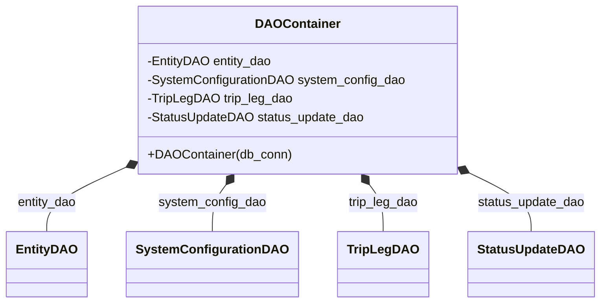

# Diagram: entity_core/entity_service/entity_service/entity/entity/update_current_planned_trip_leg/daos.py

> Auto-generated by Obscura crawlers

## Mermaid

### SVG

<svg id="container" width="732.90625" xmlns="http://www.w3.org/2000/svg" class="classDiagram" height="390" viewBox="0 0 732.90625 390" role="graphics-document document" aria-roledescription="class"><g><defs><marker id="container_class-aggregationStart" class="marker aggregation class" refX="18" refY="7" markerWidth="190" markerHeight="240" orient="auto"><path d="M 18,7 L9,13 L1,7 L9,1 Z"></path></marker></defs><defs><marker id="container_class-aggregationEnd" class="marker aggregation class" refX="1" refY="7" markerWidth="20" markerHeight="28" orient="auto"><path d="M 18,7 L9,13 L1,7 L9,1 Z"></path></marker></defs><defs><marker id="container_class-extensionStart" class="marker extension class" refX="18" refY="7" markerWidth="190" markerHeight="240" orient="auto"><path d="M 1,7 L18,13 V 1 Z"></path></marker></defs><defs><marker id="container_class-extensionEnd" class="marker extension class" refX="1" refY="7" markerWidth="20" markerHeight="28" orient="auto"><path d="M 1,1 V 13 L18,7 Z"></path></marker></defs><defs><marker id="container_class-compositionStart" class="marker composition class" refX="18" refY="7" markerWidth="190" markerHeight="240" orient="auto"><path d="M 18,7 L9,13 L1,7 L9,1 Z"></path></marker></defs><defs><marker id="container_class-compositionEnd" class="marker composition class" refX="1" refY="7" markerWidth="20" markerHeight="28" orient="auto"><path d="M 18,7 L9,13 L1,7 L9,1 Z"></path></marker></defs><defs><marker id="container_class-dependencyStart" class="marker dependency class" refX="6" refY="7" markerWidth="190" markerHeight="240" orient="auto"><path d="M 5,7 L9,13 L1,7 L9,1 Z"></path></marker></defs><defs><marker id="container_class-dependencyEnd" class="marker dependency class" refX="13" refY="7" markerWidth="20" markerHeight="28" orient="auto"><path d="M 18,7 L9,13 L14,7 L9,1 Z"></path></marker></defs><defs><marker id="container_class-lollipopStart" class="marker lollipop class" refX="13" refY="7" markerWidth="190" markerHeight="240" orient="auto"><circle stroke="black" fill="transparent" cx="7" cy="7" r="6"></circle></marker></defs><defs><marker id="container_class-lollipopEnd" class="marker lollipop class" refX="1" refY="7" markerWidth="190" markerHeight="240" orient="auto"><circle stroke="black" fill="transparent" cx="7" cy="7" r="6"></circle></marker></defs><g class="root"><g class="clusters"></g><g class="edgePaths"><path d="M145.603,218.757L130.765,225.798C115.928,232.838,86.253,246.919,71.416,260.126C56.578,273.333,56.578,285.667,56.578,291.833L56.578,298" id="id_DAOContainer_EntityDAO_1" class="edge-thickness-normal edge-pattern-solid relation" style=";;;" data-edge="true" data-et="edge" data-id="id_DAOContainer_EntityDAO_1" data-points="W3sieCI6MTYxLjE4NzUsInkiOjIxMS4zNjIzOTc1NzYzNDYzOH0seyJ4Ijo1Ni41NzgxMjUsInkiOjI2MX0seyJ4Ijo1Ni41NzgxMjUsInkiOjI5OH1d" marker-start="url(#container_class-compositionStart)"></path><path d="M274.818,238.027L272.078,241.856C269.337,245.685,263.856,253.342,261.116,263.338C258.375,273.333,258.375,285.667,258.375,291.833L258.375,298" id="id_DAOContainer_SystemConfigurationDAO_2" class="edge-thickness-normal edge-pattern-solid relation" style=";;;" data-edge="true" data-et="edge" data-id="id_DAOContainer_SystemConfigurationDAO_2" data-points="W3sieCI6Mjg0Ljg1ODEwODgzNjIwNjksInkiOjIyNH0seyJ4IjoyNTguMzc1LCJ5IjoyNjF9LHsieCI6MjU4LjM3NSwieSI6Mjk4fV0=" marker-start="url(#container_class-compositionStart)"></path><path d="M449.502,238.027L452.243,241.856C454.983,245.685,460.464,253.342,463.205,263.338C465.945,273.333,465.945,285.667,465.945,291.833L465.945,298" id="id_DAOContainer_TripLegDAO_3" class="edge-thickness-normal edge-pattern-solid relation" style=";;;" data-edge="true" data-et="edge" data-id="id_DAOContainer_TripLegDAO_3" data-points="W3sieCI6NDM5LjQ2MjIwMzY2Mzc5MzEsInkiOjIyNH0seyJ4Ijo0NjUuOTQ1MzEyNSwieSI6MjYxfSx7IngiOjQ2NS45NDUzMTI1LCJ5IjoyOTh9XQ==" marker-start="url(#container_class-compositionStart)"></path><path d="M578.512,225.904L590.027,231.753C601.542,237.602,624.572,249.301,636.087,261.317C647.602,273.333,647.602,285.667,647.602,291.833L647.602,298" id="id_DAOContainer_StatusUpdateDAO_4" class="edge-thickness-normal edge-pattern-solid relation" style=";;;" data-edge="true" data-et="edge" data-id="id_DAOContainer_StatusUpdateDAO_4" data-points="W3sieCI6NTYzLjEzMjgxMjUsInkiOjIxOC4wOTExMjgwNTAwMzIxNX0seyJ4Ijo2NDcuNjAxNTYyNSwieSI6MjYxfSx7IngiOjY0Ny42MDE1NjI1LCJ5IjoyOTh9XQ==" marker-start="url(#container_class-compositionStart)"></path></g><g class="edgeLabels"><g class="edgeLabel" transform="translate(56.578125, 261)"><g class="label" data-id="id_DAOContainer_EntityDAO_1" transform="translate(-38.546875, -12)"><foreignObject width="77.09375" height="24">

entity_dao

</foreignObject></g></g><g class="edgeLabel" transform="translate(258.375, 261)"><g class="label" data-id="id_DAOContainer_SystemConfigurationDAO_2" transform="translate(-68.828125, -12)"><foreignObject width="137.65625" height="24">

system_config_dao

</foreignObject></g></g><g class="edgeLabel" transform="translate(465.9453125, 261)"><g class="label" data-id="id_DAOContainer_TripLegDAO_3" transform="translate(-45.5703125, -12)"><foreignObject width="91.140625" height="24">

trip_leg_dao

</foreignObject></g></g><g class="edgeLabel" transform="translate(647.6015625, 261)"><g class="label" data-id="id_DAOContainer_StatusUpdateDAO_4" transform="translate(-69.3671875, -12)"><foreignObject width="138.734375" height="24">

status_update_dao

</foreignObject></g></g></g><g class="nodes"><g class="node default" id="classId-DAOContainer-0" transform="translate(362.16015625, 116)"><g class="basic label-container"><path d="M-200.97265625 -108 L200.97265625 -108 L200.97265625 108 L-200.97265625 108" stroke="none" stroke-width="0" fill="#ECECFF" style=""></path><path d="M-200.97265625 -108 C-108.89538118094877 -108, -16.81810611189755 -108, 200.97265625 -108 M-200.97265625 -108 C-114.91226490426922 -108, -28.851873558538443 -108, 200.97265625 -108 M200.97265625 -108 C200.97265625 -29.154324270993698, 200.97265625 49.691351458012605, 200.97265625 108 M200.97265625 -108 C200.97265625 -23.235084747173303, 200.97265625 61.52983050565339, 200.97265625 108 M200.97265625 108 C104.38540562499877 108, 7.798154999997536 108, -200.97265625 108 M200.97265625 108 C43.58225759416143 108, -113.80814106167713 108, -200.97265625 108 M-200.97265625 108 C-200.97265625 50.483696899992694, -200.97265625 -7.032606200014612, -200.97265625 -108 M-200.97265625 108 C-200.97265625 53.75362018808949, -200.97265625 -0.4927596238210157, -200.97265625 -108" stroke="#9370DB" stroke-width="1.3" fill="none" stroke-dasharray="0 0" style=""></path></g><g class="annotation-group text" transform="translate(0, -84)"></g><g class="label-group text" transform="translate(-50.8984375, -84)"><g class="label" style="font-weight: bolder" transform="translate(0,-12)"><foreignObject width="101.796875" height="24">

DAOContainer

</foreignObject></g></g><g class="members-group text" transform="translate(-188.97265625, -36)"><g class="label" style="" transform="translate(0,-12)"><foreignObject width="159.640625" height="24">

-EntityDAO entity_dao

</foreignObject></g><g class="label" style="" transform="translate(0,12)"><foreignObject width="327.046875" height="24">

-SystemConfigurationDAO system_config_dao

</foreignObject></g><g class="label" style="" transform="translate(0,36)"><foreignObject width="183.84375" height="24">

-TripLegDAO trip_leg_dao

</foreignObject></g><g class="label" style="" transform="translate(0,60)"><foreignObject width="277.265625" height="24">

-StatusUpdateDAO status_update_dao

</foreignObject></g></g><g class="methods-group text" transform="translate(-188.97265625, 84)"><g class="label" style="" transform="translate(0,-12)"><foreignObject width="181.265625" height="24">

+DAOContainer(db_conn)

</foreignObject></g></g><g class="divider" style=""><path d="M-200.97265625 -60 C-114.65725415931524 -60, -28.341852068630487 -60, 200.97265625 -60 M-200.97265625 -60 C-55.618014985895115 -60, 89.73662627820977 -60, 200.97265625 -60" stroke="#9370DB" stroke-width="1.3" fill="none" stroke-dasharray="0 0" style=""></path></g><g class="divider" style=""><path d="M-200.97265625 60 C-94.79153451877495 60, 11.389587212450095 60, 200.97265625 60 M-200.97265625 60 C-63.73959244935878 60, 73.49347135128244 60, 200.97265625 60" stroke="#9370DB" stroke-width="1.3" fill="none" stroke-dasharray="0 0" style=""></path></g></g><g class="node default" id="classId-EntityDAO-1" transform="translate(56.578125, 340)"><g class="basic label-container"><path d="M-48.578125 -42 L48.578125 -42 L48.578125 42 L-48.578125 42" stroke="none" stroke-width="0" fill="#ECECFF" style=""></path><path d="M-48.578125 -42 C-13.786905849381576 -42, 21.00431330123685 -42, 48.578125 -42 M-48.578125 -42 C-10.073623378655405 -42, 28.43087824268919 -42, 48.578125 -42 M48.578125 -42 C48.578125 -22.37379149323541, 48.578125 -2.7475829864708174, 48.578125 42 M48.578125 -42 C48.578125 -23.376998148369648, 48.578125 -4.753996296739295, 48.578125 42 M48.578125 42 C26.868437710698686 42, 5.158750421397372 42, -48.578125 42 M48.578125 42 C15.090851968736473 42, -18.396421062527054 42, -48.578125 42 M-48.578125 42 C-48.578125 13.210748842008492, -48.578125 -15.578502315983016, -48.578125 -42 M-48.578125 42 C-48.578125 10.749122785038995, -48.578125 -20.50175442992201, -48.578125 -42" stroke="#9370DB" stroke-width="1.3" fill="none" stroke-dasharray="0 0" style=""></path></g><g class="annotation-group text" transform="translate(0, -18)"></g><g class="label-group text" transform="translate(-36.578125, -18)"><g class="label" style="font-weight: bolder" transform="translate(0,-12)"><foreignObject width="73.15625" height="24">

EntityDAO

</foreignObject></g></g><g class="members-group text" transform="translate(-36.578125, 30)"></g><g class="methods-group text" transform="translate(-36.578125, 60)"></g><g class="divider" style=""><path d="M-48.578125 6 C-27.44979986405443 6, -6.321474728108861 6, 48.578125 6 M-48.578125 6 C-26.470830202317458 6, -4.363535404634916 6, 48.578125 6" stroke="#9370DB" stroke-width="1.3" fill="none" stroke-dasharray="0 0" style=""></path></g><g class="divider" style=""><path d="M-48.578125 24 C-28.807126504870443 24, -9.036128009740885 24, 48.578125 24 M-48.578125 24 C-24.060669810491802 24, 0.45678537901639515 24, 48.578125 24" stroke="#9370DB" stroke-width="1.3" fill="none" stroke-dasharray="0 0" style=""></path></g></g><g class="node default" id="classId-SystemConfigurationDAO-2" transform="translate(258.375, 340)"><g class="basic label-container"><path d="M-103.21875 -42 L103.21875 -42 L103.21875 42 L-103.21875 42" stroke="none" stroke-width="0" fill="#ECECFF" style=""></path><path d="M-103.21875 -42 C-38.61278976478418 -42, 25.993170470431636 -42, 103.21875 -42 M-103.21875 -42 C-30.857625378954182 -42, 41.503499242091635 -42, 103.21875 -42 M103.21875 -42 C103.21875 -23.089561440909243, 103.21875 -4.179122881818486, 103.21875 42 M103.21875 -42 C103.21875 -12.675759081532977, 103.21875 16.648481836934046, 103.21875 42 M103.21875 42 C39.971276141522836 42, -23.27619771695433 42, -103.21875 42 M103.21875 42 C24.68902881669463 42, -53.84069236661074 42, -103.21875 42 M-103.21875 42 C-103.21875 20.290175879659667, -103.21875 -1.4196482406806652, -103.21875 -42 M-103.21875 42 C-103.21875 12.808927021529357, -103.21875 -16.382145956941287, -103.21875 -42" stroke="#9370DB" stroke-width="1.3" fill="none" stroke-dasharray="0 0" style=""></path></g><g class="annotation-group text" transform="translate(0, -18)"></g><g class="label-group text" transform="translate(-91.21875, -18)"><g class="label" style="font-weight: bolder" transform="translate(0,-12)"><foreignObject width="182.4375" height="24">

SystemConfigurationDAO

</foreignObject></g></g><g class="members-group text" transform="translate(-91.21875, 30)"></g><g class="methods-group text" transform="translate(-91.21875, 60)"></g><g class="divider" style=""><path d="M-103.21875 6 C-51.220973770035506 6, 0.7768024599289873 6, 103.21875 6 M-103.21875 6 C-59.94183707428623 6, -16.664924148572453 6, 103.21875 6" stroke="#9370DB" stroke-width="1.3" fill="none" stroke-dasharray="0 0" style=""></path></g><g class="divider" style=""><path d="M-103.21875 24 C-22.968564226022607 24, 57.281621547954785 24, 103.21875 24 M-103.21875 24 C-23.238732991598354 24, 56.74128401680329 24, 103.21875 24" stroke="#9370DB" stroke-width="1.3" fill="none" stroke-dasharray="0 0" style=""></path></g></g><g class="node default" id="classId-TripLegDAO-3" transform="translate(465.9453125, 340)"><g class="basic label-container"><path d="M-54.3515625 -42 L54.3515625 -42 L54.3515625 42 L-54.3515625 42" stroke="none" stroke-width="0" fill="#ECECFF" style=""></path><path d="M-54.3515625 -42 C-15.437927410082324 -42, 23.475707679835352 -42, 54.3515625 -42 M-54.3515625 -42 C-16.67996022662757 -42, 20.991642046744857 -42, 54.3515625 -42 M54.3515625 -42 C54.3515625 -11.637379412288691, 54.3515625 18.725241175422617, 54.3515625 42 M54.3515625 -42 C54.3515625 -24.499917951775682, 54.3515625 -6.999835903551364, 54.3515625 42 M54.3515625 42 C17.384664949838175 42, -19.58223260032365 42, -54.3515625 42 M54.3515625 42 C25.397219925889292 42, -3.5571226482214158 42, -54.3515625 42 M-54.3515625 42 C-54.3515625 15.304341560684485, -54.3515625 -11.39131687863103, -54.3515625 -42 M-54.3515625 42 C-54.3515625 17.476663507203806, -54.3515625 -7.046672985592387, -54.3515625 -42" stroke="#9370DB" stroke-width="1.3" fill="none" stroke-dasharray="0 0" style=""></path></g><g class="annotation-group text" transform="translate(0, -18)"></g><g class="label-group text" transform="translate(-42.3515625, -18)"><g class="label" style="font-weight: bolder" transform="translate(0,-12)"><foreignObject width="84.703125" height="24">

TripLegDAO

</foreignObject></g></g><g class="members-group text" transform="translate(-42.3515625, 30)"></g><g class="methods-group text" transform="translate(-42.3515625, 60)"></g><g class="divider" style=""><path d="M-54.3515625 6 C-18.50812950214641 6, 17.33530349570718 6, 54.3515625 6 M-54.3515625 6 C-18.295695283446108 6, 17.760171933107785 6, 54.3515625 6" stroke="#9370DB" stroke-width="1.3" fill="none" stroke-dasharray="0 0" style=""></path></g><g class="divider" style=""><path d="M-54.3515625 24 C-19.123951173003526 24, 16.103660153992948 24, 54.3515625 24 M-54.3515625 24 C-14.308402637531188 24, 25.734757224937624 24, 54.3515625 24" stroke="#9370DB" stroke-width="1.3" fill="none" stroke-dasharray="0 0" style=""></path></g></g><g class="node default" id="classId-StatusUpdateDAO-4" transform="translate(647.6015625, 340)"><g class="basic label-container"><path d="M-77.3046875 -42 L77.3046875 -42 L77.3046875 42 L-77.3046875 42" stroke="none" stroke-width="0" fill="#ECECFF" style=""></path><path d="M-77.3046875 -42 C-36.64692656107841 -42, 4.010834377843182 -42, 77.3046875 -42 M-77.3046875 -42 C-28.548845209581522 -42, 20.206997080836956 -42, 77.3046875 -42 M77.3046875 -42 C77.3046875 -13.339292984965635, 77.3046875 15.32141403006873, 77.3046875 42 M77.3046875 -42 C77.3046875 -22.758521907879818, 77.3046875 -3.517043815759635, 77.3046875 42 M77.3046875 42 C18.765174279254794 42, -39.77433894149041 42, -77.3046875 42 M77.3046875 42 C25.68680248587703 42, -25.931082528245938 42, -77.3046875 42 M-77.3046875 42 C-77.3046875 21.52009197780976, -77.3046875 1.0401839556195185, -77.3046875 -42 M-77.3046875 42 C-77.3046875 15.086363892837749, -77.3046875 -11.827272214324502, -77.3046875 -42" stroke="#9370DB" stroke-width="1.3" fill="none" stroke-dasharray="0 0" style=""></path></g><g class="annotation-group text" transform="translate(0, -18)"></g><g class="label-group text" transform="translate(-65.3046875, -18)"><g class="label" style="font-weight: bolder" transform="translate(0,-12)"><foreignObject width="130.609375" height="24">

StatusUpdateDAO

</foreignObject></g></g><g class="members-group text" transform="translate(-65.3046875, 30)"></g><g class="methods-group text" transform="translate(-65.3046875, 60)"></g><g class="divider" style=""><path d="M-77.3046875 6 C-28.052599191669344 6, 21.19948911666131 6, 77.3046875 6 M-77.3046875 6 C-29.5174215633429 6, 18.2698443733142 6, 77.3046875 6" stroke="#9370DB" stroke-width="1.3" fill="none" stroke-dasharray="0 0" style=""></path></g><g class="divider" style=""><path d="M-77.3046875 24 C-32.115045722780096 24, 13.074596054439809 24, 77.3046875 24 M-77.3046875 24 C-26.193944035319554 24, 24.916799429360893 24, 77.3046875 24" stroke="#9370DB" stroke-width="1.3" fill="none" stroke-dasharray="0 0" style=""></path></g></g></g></g></g></svg>
