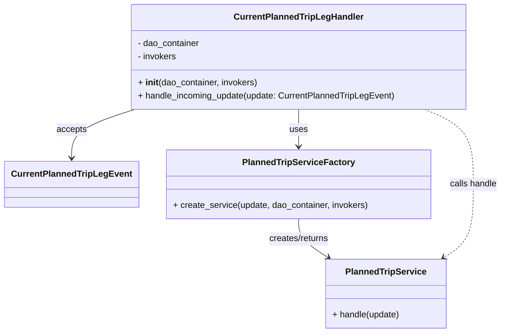
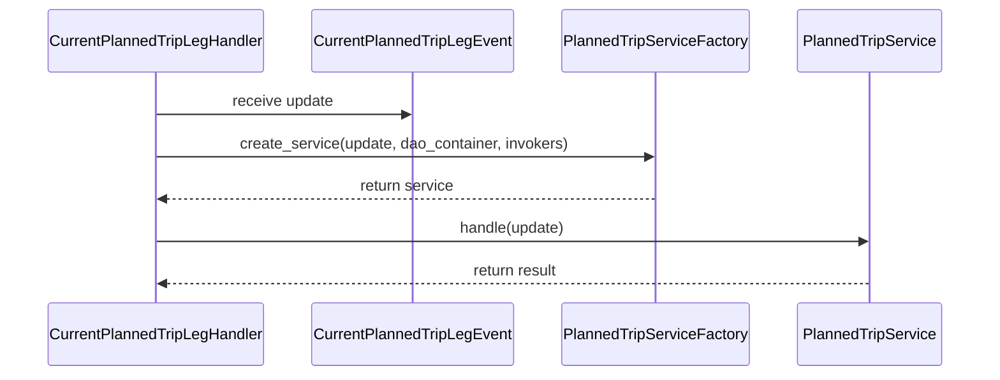

# Diagram: entity_core/entity_service/entity_service/entity/entity/update_current_planned_trip_leg/handler.py

> Auto-generated by Obscura crawlers

## Diagram 1

### SVG

<svg id="container" width="900.8515625" xmlns="http://www.w3.org/2000/svg" class="classDiagram" height="608" viewBox="0 0 900.8515625 608" role="graphics-document document" aria-roledescription="class"><g><defs><marker id="container_class-aggregationStart" class="marker aggregation class" refX="18" refY="7" markerWidth="190" markerHeight="240" orient="auto"><path d="M 18,7 L9,13 L1,7 L9,1 Z"></path></marker></defs><defs><marker id="container_class-aggregationEnd" class="marker aggregation class" refX="1" refY="7" markerWidth="20" markerHeight="28" orient="auto"><path d="M 18,7 L9,13 L1,7 L9,1 Z"></path></marker></defs><defs><marker id="container_class-extensionStart" class="marker extension class" refX="18" refY="7" markerWidth="190" markerHeight="240" orient="auto"><path d="M 1,7 L18,13 V 1 Z"></path></marker></defs><defs><marker id="container_class-extensionEnd" class="marker extension class" refX="1" refY="7" markerWidth="20" markerHeight="28" orient="auto"><path d="M 1,1 V 13 L18,7 Z"></path></marker></defs><defs><marker id="container_class-compositionStart" class="marker composition class" refX="18" refY="7" markerWidth="190" markerHeight="240" orient="auto"><path d="M 18,7 L9,13 L1,7 L9,1 Z"></path></marker></defs><defs><marker id="container_class-compositionEnd" class="marker composition class" refX="1" refY="7" markerWidth="20" markerHeight="28" orient="auto"><path d="M 18,7 L9,13 L1,7 L9,1 Z"></path></marker></defs><defs><marker id="container_class-dependencyStart" class="marker dependency class" refX="6" refY="7" markerWidth="190" markerHeight="240" orient="auto"><path d="M 5,7 L9,13 L1,7 L9,1 Z"></path></marker></defs><defs><marker id="container_class-dependencyEnd" class="marker dependency class" refX="13" refY="7" markerWidth="20" markerHeight="28" orient="auto"><path d="M 18,7 L9,13 L14,7 L9,1 Z"></path></marker></defs><defs><marker id="container_class-lollipopStart" class="marker lollipop class" refX="13" refY="7" markerWidth="190" markerHeight="240" orient="auto"><circle stroke="black" fill="transparent" cx="7" cy="7" r="6"></circle></marker></defs><defs><marker id="container_class-lollipopEnd" class="marker lollipop class" refX="1" refY="7" markerWidth="190" markerHeight="240" orient="auto"><circle stroke="black" fill="transparent" cx="7" cy="7" r="6"></circle></marker></defs><g class="root"><g class="clusters"></g><g class="edgePaths"><path d="M237.491,200L218.658,206.167C199.824,212.333,162.158,224.667,143.325,239.5C124.492,254.333,124.492,271.667,124.492,280.333L124.492,289" id="id_CurrentPlannedTripLegHandler_CurrentPlannedTripLegEvent_1" class="edge-thickness-normal edge-pattern-solid relation" style=";;;" data-edge="true" data-et="edge" data-id="id_CurrentPlannedTripLegHandler_CurrentPlannedTripLegEvent_1" data-points="W3sieCI6MjM3LjQ5MDYzMDg3NDA2MDE3LCJ5IjoyMDB9LHsieCI6MTI0LjQ5MjE4NzUsInkiOjIzN30seyJ4IjoxMjQuNDkyMTg3NSwieSI6Mjk1fV0=" marker-end="url(#container_class-dependencyEnd)"></path><path d="M530.676,200L530.676,206.167C530.676,212.333,530.676,224.667,530.676,236C530.676,247.333,530.676,257.667,530.676,262.833L530.676,268" id="id_CurrentPlannedTripLegHandler_PlannedTripServiceFactory_2" class="edge-thickness-normal edge-pattern-solid relation" style=";;;" data-edge="true" data-et="edge" data-id="id_CurrentPlannedTripLegHandler_PlannedTripServiceFactory_2" data-points="W3sieCI6NTMwLjY3NTc4MTI1LCJ5IjoyMDB9LHsieCI6NTMwLjY3NTc4MTI1LCJ5IjoyMzd9LHsieCI6NTMwLjY3NTc4MTI1LCJ5IjoyNzR9XQ==" marker-end="url(#container_class-dependencyEnd)"></path><path d="M530.676,400L530.676,406.167C530.676,412.333,530.676,424.667,539.647,436.468C548.619,448.27,566.562,459.539,575.533,465.174L584.505,470.809" id="id_PlannedTripServiceFactory_PlannedTripService_3" class="edge-thickness-normal edge-pattern-solid relation" style=";;;" data-edge="true" data-et="edge" data-id="id_PlannedTripServiceFactory_PlannedTripService_3" data-points="W3sieCI6NTMwLjY3NTc4MTI1LCJ5Ijo0MDB9LHsieCI6NTMwLjY3NTc4MTI1LCJ5Ijo0Mzd9LHsieCI6NTg5LjU4NTk5NjA5Mzc1LCJ5Ijo0NzR9XQ==" marker-end="url(#container_class-dependencyEnd)"></path><path d="M760.523,200L775.287,206.167C790.052,212.333,819.58,224.667,834.345,247.5C849.109,270.333,849.109,303.667,849.109,337C849.109,370.333,849.109,403.667,840.138,425.968C831.166,448.27,813.223,459.539,804.252,465.174L795.28,470.809" id="id_CurrentPlannedTripLegHandler_PlannedTripService_4" class="edge-thickness-normal edge-pattern-dashed relation" style=";;;" data-edge="true" data-et="edge" data-id="id_CurrentPlannedTripLegHandler_PlannedTripService_4" data-points="W3sieCI6NzYwLjUyMjU4NTc2MTI3ODIsInkiOjIwMH0seyJ4Ijo4NDkuMTA5Mzc1LCJ5IjoyMzd9LHsieCI6ODQ5LjEwOTM3NSwieSI6MzM3fSx7IngiOjg0OS4xMDkzNzUsInkiOjQzN30seyJ4Ijo3OTAuMTk5MTYwMTU2MjUsInkiOjQ3NH1d" marker-end="url(#container_class-dependencyEnd)"></path></g><g class="edgeLabels"><g class="edgeLabel" transform="translate(124.4921875, 237)"><g class="label" data-id="id_CurrentPlannedTripLegHandler_CurrentPlannedTripLegEvent_1" transform="translate(-27.421875, -12)"><foreignObject width="54.84375" height="24">

accepts

</foreignObject></g></g><g class="edgeLabel" transform="translate(530.67578125, 237)"><g class="label" data-id="id_CurrentPlannedTripLegHandler_PlannedTripServiceFactory_2" transform="translate(-16.4921875, -12)"><foreignObject width="32.984375" height="24">

uses

</foreignObject></g></g><g class="edgeLabel" transform="translate(530.67578125, 437)"><g class="label" data-id="id_PlannedTripServiceFactory_PlannedTripService_3" transform="translate(-56.359375, -12)"><foreignObject width="112.71875" height="24">

creates/returns

</foreignObject></g></g><g class="edgeLabel" transform="translate(849.109375, 337)"><g class="label" data-id="id_CurrentPlannedTripLegHandler_PlannedTripService_4" transform="translate(-43.7421875, -12)"><foreignObject width="87.484375" height="24">

calls handle

</foreignObject></g></g></g><g class="nodes"><g class="node default" id="classId-CurrentPlannedTripLegHandler-0" transform="translate(530.67578125, 104)"><g class="basic label-container"><path d="M-304.6953125 -96 L304.6953125 -96 L304.6953125 96 L-304.6953125 96" stroke="none" stroke-width="0" fill="#ECECFF" style=""></path><path d="M-304.6953125 -96 C-71.8528275596646 -96, 160.9896573806708 -96, 304.6953125 -96 M-304.6953125 -96 C-157.56717388010372 -96, -10.439035260207447 -96, 304.6953125 -96 M304.6953125 -96 C304.6953125 -24.741388920745408, 304.6953125 46.517222158509185, 304.6953125 96 M304.6953125 -96 C304.6953125 -38.04279502579401, 304.6953125 19.914409948411986, 304.6953125 96 M304.6953125 96 C85.46031585402525 96, -133.7746807919495 96, -304.6953125 96 M304.6953125 96 C87.89510683739621 96, -128.90509882520757 96, -304.6953125 96 M-304.6953125 96 C-304.6953125 28.460223821275818, -304.6953125 -39.079552357448364, -304.6953125 -96 M-304.6953125 96 C-304.6953125 41.74174970885893, -304.6953125 -12.516500582282134, -304.6953125 -96" stroke="#9370DB" stroke-width="1.3" fill="none" stroke-dasharray="0 0" style=""></path></g><g class="annotation-group text" transform="translate(0, -72)"></g><g class="label-group text" transform="translate(-113.375, -72)"><g class="label" style="font-weight: bolder" transform="translate(0,-12)"><foreignObject width="226.75" height="24">

CurrentPlannedTripLegHandler

</foreignObject></g></g><g class="members-group text" transform="translate(-292.6953125, -24)"><g class="label" style="" transform="translate(0,-12)"><foreignObject width="115.1875" height="24">

- dao_container

</foreignObject></g><g class="label" style="" transform="translate(0,12)"><foreignObject width="71.796875" height="24">

- invokers

</foreignObject></g></g><g class="methods-group text" transform="translate(-292.6953125, 48)"><g class="label" style="" transform="translate(0,-12)"><foreignObject width="219.453125" height="24">

+ <strong>init</strong>(dao_container, invokers)

</foreignObject></g><g class="label" style="" transform="translate(0,12)"><foreignObject width="472.015625" height="24">

+ handle_incoming_update(update: CurrentPlannedTripLegEvent)

</foreignObject></g></g><g class="divider" style=""><path d="M-304.6953125 -48 C-116.62341435939106 -48, 71.44848378121787 -48, 304.6953125 -48 M-304.6953125 -48 C-102.25691443897756 -48, 100.18148362204488 -48, 304.6953125 -48" stroke="#9370DB" stroke-width="1.3" fill="none" stroke-dasharray="0 0" style=""></path></g><g class="divider" style=""><path d="M-304.6953125 24 C-107.7200833904125 24, 89.255145719175 24, 304.6953125 24 M-304.6953125 24 C-147.73061518646816 24, 9.234082127063687 24, 304.6953125 24" stroke="#9370DB" stroke-width="1.3" fill="none" stroke-dasharray="0 0" style=""></path></g></g><g class="node default" id="classId-CurrentPlannedTripLegEvent-1" transform="translate(124.4921875, 337)"><g class="basic label-container"><path d="M-116.4921875 -42 L116.4921875 -42 L116.4921875 42 L-116.4921875 42" stroke="none" stroke-width="0" fill="#ECECFF" style=""></path><path d="M-116.4921875 -42 C-28.438037117097224 -42, 59.61611326580555 -42, 116.4921875 -42 M-116.4921875 -42 C-65.52786977272497 -42, -14.563552045449939 -42, 116.4921875 -42 M116.4921875 -42 C116.4921875 -9.54395050931003, 116.4921875 22.91209898137994, 116.4921875 42 M116.4921875 -42 C116.4921875 -25.181651120753912, 116.4921875 -8.363302241507824, 116.4921875 42 M116.4921875 42 C63.326536156071235 42, 10.16088481214247 42, -116.4921875 42 M116.4921875 42 C54.55736365464702 42, -7.3774601907059605 42, -116.4921875 42 M-116.4921875 42 C-116.4921875 9.531127592712863, -116.4921875 -22.937744814574273, -116.4921875 -42 M-116.4921875 42 C-116.4921875 13.734023513753833, -116.4921875 -14.531952972492334, -116.4921875 -42" stroke="#9370DB" stroke-width="1.3" fill="none" stroke-dasharray="0 0" style=""></path></g><g class="annotation-group text" transform="translate(0, -18)"></g><g class="label-group text" transform="translate(-104.4921875, -18)"><g class="label" style="font-weight: bolder" transform="translate(0,-12)"><foreignObject width="208.984375" height="24">

CurrentPlannedTripLegEvent

</foreignObject></g></g><g class="members-group text" transform="translate(-104.4921875, 30)"></g><g class="methods-group text" transform="translate(-104.4921875, 60)"></g><g class="divider" style=""><path d="M-116.4921875 6 C-50.877208156207075 6, 14.73777118758585 6, 116.4921875 6 M-116.4921875 6 C-27.229145905650242 6, 62.033895688699516 6, 116.4921875 6" stroke="#9370DB" stroke-width="1.3" fill="none" stroke-dasharray="0 0" style=""></path></g><g class="divider" style=""><path d="M-116.4921875 24 C-27.891973050572545 24, 60.70824139885491 24, 116.4921875 24 M-116.4921875 24 C-43.07927821029321 24, 30.33363107941358 24, 116.4921875 24" stroke="#9370DB" stroke-width="1.3" fill="none" stroke-dasharray="0 0" style=""></path></g></g><g class="node default" id="classId-PlannedTripServiceFactory-2" transform="translate(530.67578125, 337)"><g class="basic label-container"><path d="M-239.69140625 -63 L239.69140625 -63 L239.69140625 63 L-239.69140625 63" stroke="none" stroke-width="0" fill="#ECECFF" style=""></path><path d="M-239.69140625 -63 C-99.60943697967838 -63, 40.472532290643244 -63, 239.69140625 -63 M-239.69140625 -63 C-134.3222381079218 -63, -28.95306996584361 -63, 239.69140625 -63 M239.69140625 -63 C239.69140625 -30.07300034130209, 239.69140625 2.853999317395818, 239.69140625 63 M239.69140625 -63 C239.69140625 -25.30220106165317, 239.69140625 12.395597876693657, 239.69140625 63 M239.69140625 63 C121.41634272735055 63, 3.1412792047011067 63, -239.69140625 63 M239.69140625 63 C87.18025168325798 63, -65.33090288348404 63, -239.69140625 63 M-239.69140625 63 C-239.69140625 25.193713042794094, -239.69140625 -12.612573914411811, -239.69140625 -63 M-239.69140625 63 C-239.69140625 37.18443818168436, -239.69140625 11.36887636336872, -239.69140625 -63" stroke="#9370DB" stroke-width="1.3" fill="none" stroke-dasharray="0 0" style=""></path></g><g class="annotation-group text" transform="translate(0, -39)"></g><g class="label-group text" transform="translate(-97.4609375, -39)"><g class="label" style="font-weight: bolder" transform="translate(0,-12)"><foreignObject width="194.921875" height="24">

PlannedTripServiceFactory

</foreignObject></g></g><g class="members-group text" transform="translate(-227.69140625, 9)"></g><g class="methods-group text" transform="translate(-227.69140625, 39)"><g class="label" style="" transform="translate(0,-12)"><foreignObject width="357.921875" height="24">

+ create_service(update, dao_container, invokers)

</foreignObject></g></g><g class="divider" style=""><path d="M-239.69140625 -15 C-124.99657255154801 -15, -10.301738853096026 -15, 239.69140625 -15 M-239.69140625 -15 C-74.23888338375289 -15, 91.21363948249422 -15, 239.69140625 -15" stroke="#9370DB" stroke-width="1.3" fill="none" stroke-dasharray="0 0" style=""></path></g><g class="divider" style=""><path d="M-239.69140625 9 C-91.20481327056228 9, 57.28177970887543 9, 239.69140625 9 M-239.69140625 9 C-129.89019717526838 9, -20.088988100536767 9, 239.69140625 9" stroke="#9370DB" stroke-width="1.3" fill="none" stroke-dasharray="0 0" style=""></path></g></g><g class="node default" id="classId-PlannedTripService-3" transform="translate(689.892578125, 537)"><g class="basic label-container"><path d="M-109.578125 -63 L109.578125 -63 L109.578125 63 L-109.578125 63" stroke="none" stroke-width="0" fill="#ECECFF" style=""></path><path d="M-109.578125 -63 C-51.60311407587083 -63, 6.371896848258345 -63, 109.578125 -63 M-109.578125 -63 C-39.29897630802898 -63, 30.980172383942033 -63, 109.578125 -63 M109.578125 -63 C109.578125 -20.254416052707718, 109.578125 22.491167894584564, 109.578125 63 M109.578125 -63 C109.578125 -26.915301809631764, 109.578125 9.169396380736472, 109.578125 63 M109.578125 63 C35.36860603816123 63, -38.840912923677536 63, -109.578125 63 M109.578125 63 C60.22644195069133 63, 10.874758901382663 63, -109.578125 63 M-109.578125 63 C-109.578125 32.703373948050285, -109.578125 2.406747896100576, -109.578125 -63 M-109.578125 63 C-109.578125 20.63164005683236, -109.578125 -21.73671988633528, -109.578125 -63" stroke="#9370DB" stroke-width="1.3" fill="none" stroke-dasharray="0 0" style=""></path></g><g class="annotation-group text" transform="translate(0, -39)"></g><g class="label-group text" transform="translate(-70.859375, -39)"><g class="label" style="font-weight: bolder" transform="translate(0,-12)"><foreignObject width="141.71875" height="24">

PlannedTripService

</foreignObject></g></g><g class="members-group text" transform="translate(-97.578125, 9)"></g><g class="methods-group text" transform="translate(-97.578125, 39)"><g class="label" style="" transform="translate(0,-12)"><foreignObject width="124.296875" height="24">

+ handle(update)

</foreignObject></g></g><g class="divider" style=""><path d="M-109.578125 -15 C-22.21017964790724 -15, 65.15776570418552 -15, 109.578125 -15 M-109.578125 -15 C-22.565921902771194 -15, 64.44628119445761 -15, 109.578125 -15" stroke="#9370DB" stroke-width="1.3" fill="none" stroke-dasharray="0 0" style=""></path></g><g class="divider" style=""><path d="M-109.578125 9 C-40.05129019036228 9, 29.47554461927544 9, 109.578125 9 M-109.578125 9 C-45.80467995130322 9, 17.968765097393558 9, 109.578125 9" stroke="#9370DB" stroke-width="1.3" fill="none" stroke-dasharray="0 0" style=""></path></g></g></g></g></g></svg>

## Diagram 2

### SVG

<svg id="container" width="1093" xmlns="http://www.w3.org/2000/svg" height="411" viewBox="-50 -10 1093 411" role="graphics-document document" aria-roledescription="sequence"><g><rect x="833" y="325" fill="#eaeaea" stroke="#666" width="160" height="65" name="Service" rx="3" ry="3" class="actor actor-bottom"></rect><text x="913" y="357.5" dominant-baseline="central" alignment-baseline="central" class="actor actor-box" style="text-anchor: middle; font-size: 16px; font-weight: 400;"><tspan x="913" dy="0">PlannedTripService</tspan></text></g><g><rect x="571" y="325" fill="#eaeaea" stroke="#666" width="212" height="65" name="Factory" rx="3" ry="3" class="actor actor-bottom"></rect><text x="677" y="357.5" dominant-baseline="central" alignment-baseline="central" class="actor actor-box" style="text-anchor: middle; font-size: 16px; font-weight: 400;"><tspan x="677" dy="0">PlannedTripServiceFactory</tspan></text></g><g><rect x="295" y="325" fill="#eaeaea" stroke="#666" width="226" height="65" name="Event" rx="3" ry="3" class="actor actor-bottom"></rect><text x="408" y="357.5" dominant-baseline="central" alignment-baseline="central" class="actor actor-box" style="text-anchor: middle; font-size: 16px; font-weight: 400;"><tspan x="408" dy="0">CurrentPlannedTripLegEvent</tspan></text></g><g><rect x="0" y="325" fill="#eaeaea" stroke="#666" width="245" height="65" name="Handler" rx="3" ry="3" class="actor actor-bottom"></rect><text x="122.5" y="357.5" dominant-baseline="central" alignment-baseline="central" class="actor actor-box" style="text-anchor: middle; font-size: 16px; font-weight: 400;"><tspan x="122.5" dy="0">CurrentPlannedTripLegHandler</tspan></text></g><g><line id="actor3" x1="913" y1="65" x2="913" y2="325" class="actor-line 200" stroke-width="0.5px" stroke="#999" name="Service"></line><g id="root-3"><rect x="833" y="0" fill="#eaeaea" stroke="#666" width="160" height="65" name="Service" rx="3" ry="3" class="actor actor-top"></rect><text x="913" y="32.5" dominant-baseline="central" alignment-baseline="central" class="actor actor-box" style="text-anchor: middle; font-size: 16px; font-weight: 400;"><tspan x="913" dy="0">PlannedTripService</tspan></text></g></g><g><line id="actor2" x1="677" y1="65" x2="677" y2="325" class="actor-line 200" stroke-width="0.5px" stroke="#999" name="Factory"></line><g id="root-2"><rect x="571" y="0" fill="#eaeaea" stroke="#666" width="212" height="65" name="Factory" rx="3" ry="3" class="actor actor-top"></rect><text x="677" y="32.5" dominant-baseline="central" alignment-baseline="central" class="actor actor-box" style="text-anchor: middle; font-size: 16px; font-weight: 400;"><tspan x="677" dy="0">PlannedTripServiceFactory</tspan></text></g></g><g><line id="actor1" x1="408" y1="65" x2="408" y2="325" class="actor-line 200" stroke-width="0.5px" stroke="#999" name="Event"></line><g id="root-1"><rect x="295" y="0" fill="#eaeaea" stroke="#666" width="226" height="65" name="Event" rx="3" ry="3" class="actor actor-top"></rect><text x="408" y="32.5" dominant-baseline="central" alignment-baseline="central" class="actor actor-box" style="text-anchor: middle; font-size: 16px; font-weight: 400;"><tspan x="408" dy="0">CurrentPlannedTripLegEvent</tspan></text></g></g><g><line id="actor0" x1="122.5" y1="65" x2="122.5" y2="325" class="actor-line 200" stroke-width="0.5px" stroke="#999" name="Handler"></line><g id="root-0"><rect x="0" y="0" fill="#eaeaea" stroke="#666" width="245" height="65" name="Handler" rx="3" ry="3" class="actor actor-top"></rect><text x="122.5" y="32.5" dominant-baseline="central" alignment-baseline="central" class="actor actor-box" style="text-anchor: middle; font-size: 16px; font-weight: 400;"><tspan x="122.5" dy="0">CurrentPlannedTripLegHandler</tspan></text></g></g><g></g><defs><symbol id="computer" width="24" height="24"><path transform="scale(.5)" d="M2 2v13h20v-13h-20zm18 11h-16v-9h16v9zm-10.228 6l.466-1h3.524l.467 1h-4.457zm14.228 3h-24l2-6h2.104l-1.33 4h18.45l-1.297-4h2.073l2 6zm-5-10h-14v-7h14v7z"></path></symbol></defs><defs><symbol id="database" fill-rule="evenodd" clip-rule="evenodd"><path transform="scale(.5)" d="M12.258.001l.256.004.255.005.253.008.251.01.249.012.247.015.246.016.242.019.241.02.239.023.236.024.233.027.231.028.229.031.225.032.223.034.22.036.217.038.214.04.211.041.208.043.205.045.201.046.198.048.194.05.191.051.187.053.183.054.18.056.175.057.172.059.168.06.163.061.16.063.155.064.15.066.074.033.073.033.071.034.07.034.069.035.068.035.067.035.066.035.064.036.064.036.062.036.06.036.06.037.058.037.058.037.055.038.055.038.053.038.052.038.051.039.05.039.048.039.047.039.045.04.044.04.043.04.041.04.04.041.039.041.037.041.036.041.034.041.033.042.032.042.03.042.029.042.027.042.026.043.024.043.023.043.021.043.02.043.018.044.017.043.015.044.013.044.012.044.011.045.009.044.007.045.006.045.004.045.002.045.001.045v17l-.001.045-.002.045-.004.045-.006.045-.007.045-.009.044-.011.045-.012.044-.013.044-.015.044-.017.043-.018.044-.02.043-.021.043-.023.043-.024.043-.026.043-.027.042-.029.042-.03.042-.032.042-.033.042-.034.041-.036.041-.037.041-.039.041-.04.041-.041.04-.043.04-.044.04-.045.04-.047.039-.048.039-.05.039-.051.039-.052.038-.053.038-.055.038-.055.038-.058.037-.058.037-.06.037-.06.036-.062.036-.064.036-.064.036-.066.035-.067.035-.068.035-.069.035-.07.034-.071.034-.073.033-.074.033-.15.066-.155.064-.16.063-.163.061-.168.06-.172.059-.175.057-.18.056-.183.054-.187.053-.191.051-.194.05-.198.048-.201.046-.205.045-.208.043-.211.041-.214.04-.217.038-.22.036-.223.034-.225.032-.229.031-.231.028-.233.027-.236.024-.239.023-.241.02-.242.019-.246.016-.247.015-.249.012-.251.01-.253.008-.255.005-.256.004-.258.001-.258-.001-.256-.004-.255-.005-.253-.008-.251-.01-.249-.012-.247-.015-.245-.016-.243-.019-.241-.02-.238-.023-.236-.024-.234-.027-.231-.028-.228-.031-.226-.032-.223-.034-.22-.036-.217-.038-.214-.04-.211-.041-.208-.043-.204-.045-.201-.046-.198-.048-.195-.05-.19-.051-.187-.053-.184-.054-.179-.056-.176-.057-.172-.059-.167-.06-.164-.061-.159-.063-.155-.064-.151-.066-.074-.033-.072-.033-.072-.034-.07-.034-.069-.035-.068-.035-.067-.035-.066-.035-.064-.036-.063-.036-.062-.036-.061-.036-.06-.037-.058-.037-.057-.037-.056-.038-.055-.038-.053-.038-.052-.038-.051-.039-.049-.039-.049-.039-.046-.039-.046-.04-.044-.04-.043-.04-.041-.04-.04-.041-.039-.041-.037-.041-.036-.041-.034-.041-.033-.042-.032-.042-.03-.042-.029-.042-.027-.042-.026-.043-.024-.043-.023-.043-.021-.043-.02-.043-.018-.044-.017-.043-.015-.044-.013-.044-.012-.044-.011-.045-.009-.044-.007-.045-.006-.045-.004-.045-.002-.045-.001-.045v-17l.001-.045.002-.045.004-.045.006-.045.007-.045.009-.044.011-.045.012-.044.013-.044.015-.044.017-.043.018-.044.02-.043.021-.043.023-.043.024-.043.026-.043.027-.042.029-.042.03-.042.032-.042.033-.042.034-.041.036-.041.037-.041.039-.041.04-.041.041-.04.043-.04.044-.04.046-.04.046-.039.049-.039.049-.039.051-.039.052-.038.053-.038.055-.038.056-.038.057-.037.058-.037.06-.037.061-.036.062-.036.063-.036.064-.036.066-.035.067-.035.068-.035.069-.035.07-.034.072-.034.072-.033.074-.033.151-.066.155-.064.159-.063.164-.061.167-.06.172-.059.176-.057.179-.056.184-.054.187-.053.19-.051.195-.05.198-.048.201-.046.204-.045.208-.043.211-.041.214-.04.217-.038.22-.036.223-.034.226-.032.228-.031.231-.028.234-.027.236-.024.238-.023.241-.02.243-.019.245-.016.247-.015.249-.012.251-.01.253-.008.255-.005.256-.004.258-.001.258.001zm-9.258 20.499v.01l.001.021.003.021.004.022.005.021.006.022.007.022.009.023.01.022.011.023.012.023.013.023.015.023.016.024.017.023.018.024.019.024.021.024.022.025.023.024.024.025.052.049.056.05.061.051.066.051.07.051.075.051.079.052.084.052.088.052.092.052.097.052.102.051.105.052.11.052.114.051.119.051.123.051.127.05.131.05.135.05.139.048.144.049.147.047.152.047.155.047.16.045.163.045.167.043.171.043.176.041.178.041.183.039.187.039.19.037.194.035.197.035.202.033.204.031.209.03.212.029.216.027.219.025.222.024.226.021.23.02.233.018.236.016.24.015.243.012.246.01.249.008.253.005.256.004.259.001.26-.001.257-.004.254-.005.25-.008.247-.011.244-.012.241-.014.237-.016.233-.018.231-.021.226-.021.224-.024.22-.026.216-.027.212-.028.21-.031.205-.031.202-.034.198-.034.194-.036.191-.037.187-.039.183-.04.179-.04.175-.042.172-.043.168-.044.163-.045.16-.046.155-.046.152-.047.148-.048.143-.049.139-.049.136-.05.131-.05.126-.05.123-.051.118-.052.114-.051.11-.052.106-.052.101-.052.096-.052.092-.052.088-.053.083-.051.079-.052.074-.052.07-.051.065-.051.06-.051.056-.05.051-.05.023-.024.023-.025.021-.024.02-.024.019-.024.018-.024.017-.024.015-.023.014-.024.013-.023.012-.023.01-.023.01-.022.008-.022.006-.022.006-.022.004-.022.004-.021.001-.021.001-.021v-4.127l-.077.055-.08.053-.083.054-.085.053-.087.052-.09.052-.093.051-.095.05-.097.05-.1.049-.102.049-.105.048-.106.047-.109.047-.111.046-.114.045-.115.045-.118.044-.12.043-.122.042-.124.042-.126.041-.128.04-.13.04-.132.038-.134.038-.135.037-.138.037-.139.035-.142.035-.143.034-.144.033-.147.032-.148.031-.15.03-.151.03-.153.029-.154.027-.156.027-.158.026-.159.025-.161.024-.162.023-.163.022-.165.021-.166.02-.167.019-.169.018-.169.017-.171.016-.173.015-.173.014-.175.013-.175.012-.177.011-.178.01-.179.008-.179.008-.181.006-.182.005-.182.004-.184.003-.184.002h-.37l-.184-.002-.184-.003-.182-.004-.182-.005-.181-.006-.179-.008-.179-.008-.178-.01-.176-.011-.176-.012-.175-.013-.173-.014-.172-.015-.171-.016-.17-.017-.169-.018-.167-.019-.166-.02-.165-.021-.163-.022-.162-.023-.161-.024-.159-.025-.157-.026-.156-.027-.155-.027-.153-.029-.151-.03-.15-.03-.148-.031-.146-.032-.145-.033-.143-.034-.141-.035-.14-.035-.137-.037-.136-.037-.134-.038-.132-.038-.13-.04-.128-.04-.126-.041-.124-.042-.122-.042-.12-.044-.117-.043-.116-.045-.113-.045-.112-.046-.109-.047-.106-.047-.105-.048-.102-.049-.1-.049-.097-.05-.095-.05-.093-.052-.09-.051-.087-.052-.085-.053-.083-.054-.08-.054-.077-.054v4.127zm0-5.654v.011l.001.021.003.021.004.021.005.022.006.022.007.022.009.022.01.022.011.023.012.023.013.023.015.024.016.023.017.024.018.024.019.024.021.024.022.024.023.025.024.024.052.05.056.05.061.05.066.051.07.051.075.052.079.051.084.052.088.052.092.052.097.052.102.052.105.052.11.051.114.051.119.052.123.05.127.051.131.05.135.049.139.049.144.048.147.048.152.047.155.046.16.045.163.045.167.044.171.042.176.042.178.04.183.04.187.038.19.037.194.036.197.034.202.033.204.032.209.03.212.028.216.027.219.025.222.024.226.022.23.02.233.018.236.016.24.014.243.012.246.01.249.008.253.006.256.003.259.001.26-.001.257-.003.254-.006.25-.008.247-.01.244-.012.241-.015.237-.016.233-.018.231-.02.226-.022.224-.024.22-.025.216-.027.212-.029.21-.03.205-.032.202-.033.198-.035.194-.036.191-.037.187-.039.183-.039.179-.041.175-.042.172-.043.168-.044.163-.045.16-.045.155-.047.152-.047.148-.048.143-.048.139-.05.136-.049.131-.05.126-.051.123-.051.118-.051.114-.052.11-.052.106-.052.101-.052.096-.052.092-.052.088-.052.083-.052.079-.052.074-.051.07-.052.065-.051.06-.05.056-.051.051-.049.023-.025.023-.024.021-.025.02-.024.019-.024.018-.024.017-.024.015-.023.014-.023.013-.024.012-.022.01-.023.01-.023.008-.022.006-.022.006-.022.004-.021.004-.022.001-.021.001-.021v-4.139l-.077.054-.08.054-.083.054-.085.052-.087.053-.09.051-.093.051-.095.051-.097.05-.1.049-.102.049-.105.048-.106.047-.109.047-.111.046-.114.045-.115.044-.118.044-.12.044-.122.042-.124.042-.126.041-.128.04-.13.039-.132.039-.134.038-.135.037-.138.036-.139.036-.142.035-.143.033-.144.033-.147.033-.148.031-.15.03-.151.03-.153.028-.154.028-.156.027-.158.026-.159.025-.161.024-.162.023-.163.022-.165.021-.166.02-.167.019-.169.018-.169.017-.171.016-.173.015-.173.014-.175.013-.175.012-.177.011-.178.009-.179.009-.179.007-.181.007-.182.005-.182.004-.184.003-.184.002h-.37l-.184-.002-.184-.003-.182-.004-.182-.005-.181-.007-.179-.007-.179-.009-.178-.009-.176-.011-.176-.012-.175-.013-.173-.014-.172-.015-.171-.016-.17-.017-.169-.018-.167-.019-.166-.02-.165-.021-.163-.022-.162-.023-.161-.024-.159-.025-.157-.026-.156-.027-.155-.028-.153-.028-.151-.03-.15-.03-.148-.031-.146-.033-.145-.033-.143-.033-.141-.035-.14-.036-.137-.036-.136-.037-.134-.038-.132-.039-.13-.039-.128-.04-.126-.041-.124-.042-.122-.043-.12-.043-.117-.044-.116-.044-.113-.046-.112-.046-.109-.046-.106-.047-.105-.048-.102-.049-.1-.049-.097-.05-.095-.051-.093-.051-.09-.051-.087-.053-.085-.052-.083-.054-.08-.054-.077-.054v4.139zm0-5.666v.011l.001.02.003.022.004.021.005.022.006.021.007.022.009.023.01.022.011.023.012.023.013.023.015.023.016.024.017.024.018.023.019.024.021.025.022.024.023.024.024.025.052.05.056.05.061.05.066.051.07.051.075.052.079.051.084.052.088.052.092.052.097.052.102.052.105.051.11.052.114.051.119.051.123.051.127.05.131.05.135.05.139.049.144.048.147.048.152.047.155.046.16.045.163.045.167.043.171.043.176.042.178.04.183.04.187.038.19.037.194.036.197.034.202.033.204.032.209.03.212.028.216.027.219.025.222.024.226.021.23.02.233.018.236.017.24.014.243.012.246.01.249.008.253.006.256.003.259.001.26-.001.257-.003.254-.006.25-.008.247-.01.244-.013.241-.014.237-.016.233-.018.231-.02.226-.022.224-.024.22-.025.216-.027.212-.029.21-.03.205-.032.202-.033.198-.035.194-.036.191-.037.187-.039.183-.039.179-.041.175-.042.172-.043.168-.044.163-.045.16-.045.155-.047.152-.047.148-.048.143-.049.139-.049.136-.049.131-.051.126-.05.123-.051.118-.052.114-.051.11-.052.106-.052.101-.052.096-.052.092-.052.088-.052.083-.052.079-.052.074-.052.07-.051.065-.051.06-.051.056-.05.051-.049.023-.025.023-.025.021-.024.02-.024.019-.024.018-.024.017-.024.015-.023.014-.024.013-.023.012-.023.01-.022.01-.023.008-.022.006-.022.006-.022.004-.022.004-.021.001-.021.001-.021v-4.153l-.077.054-.08.054-.083.053-.085.053-.087.053-.09.051-.093.051-.095.051-.097.05-.1.049-.102.048-.105.048-.106.048-.109.046-.111.046-.114.046-.115.044-.118.044-.12.043-.122.043-.124.042-.126.041-.128.04-.13.039-.132.039-.134.038-.135.037-.138.036-.139.036-.142.034-.143.034-.144.033-.147.032-.148.032-.15.03-.151.03-.153.028-.154.028-.156.027-.158.026-.159.024-.161.024-.162.023-.163.023-.165.021-.166.02-.167.019-.169.018-.169.017-.171.016-.173.015-.173.014-.175.013-.175.012-.177.01-.178.01-.179.009-.179.007-.181.006-.182.006-.182.004-.184.003-.184.001-.185.001-.185-.001-.184-.001-.184-.003-.182-.004-.182-.006-.181-.006-.179-.007-.179-.009-.178-.01-.176-.01-.176-.012-.175-.013-.173-.014-.172-.015-.171-.016-.17-.017-.169-.018-.167-.019-.166-.02-.165-.021-.163-.023-.162-.023-.161-.024-.159-.024-.157-.026-.156-.027-.155-.028-.153-.028-.151-.03-.15-.03-.148-.032-.146-.032-.145-.033-.143-.034-.141-.034-.14-.036-.137-.036-.136-.037-.134-.038-.132-.039-.13-.039-.128-.041-.126-.041-.124-.041-.122-.043-.12-.043-.117-.044-.116-.044-.113-.046-.112-.046-.109-.046-.106-.048-.105-.048-.102-.048-.1-.05-.097-.049-.095-.051-.093-.051-.09-.052-.087-.052-.085-.053-.083-.053-.08-.054-.077-.054v4.153zm8.74-8.179l-.257.004-.254.005-.25.008-.247.011-.244.012-.241.014-.237.016-.233.018-.231.021-.226.022-.224.023-.22.026-.216.027-.212.028-.21.031-.205.032-.202.033-.198.034-.194.036-.191.038-.187.038-.183.04-.179.041-.175.042-.172.043-.168.043-.163.045-.16.046-.155.046-.152.048-.148.048-.143.048-.139.049-.136.05-.131.05-.126.051-.123.051-.118.051-.114.052-.11.052-.106.052-.101.052-.096.052-.092.052-.088.052-.083.052-.079.052-.074.051-.07.052-.065.051-.06.05-.056.05-.051.05-.023.025-.023.024-.021.024-.02.025-.019.024-.018.024-.017.023-.015.024-.014.023-.013.023-.012.023-.01.023-.01.022-.008.022-.006.023-.006.021-.004.022-.004.021-.001.021-.001.021.001.021.001.021.004.021.004.022.006.021.006.023.008.022.01.022.01.023.012.023.013.023.014.023.015.024.017.023.018.024.019.024.02.025.021.024.023.024.023.025.051.05.056.05.06.05.065.051.07.052.074.051.079.052.083.052.088.052.092.052.096.052.101.052.106.052.11.052.114.052.118.051.123.051.126.051.131.05.136.05.139.049.143.048.148.048.152.048.155.046.16.046.163.045.168.043.172.043.175.042.179.041.183.04.187.038.191.038.194.036.198.034.202.033.205.032.21.031.212.028.216.027.22.026.224.023.226.022.231.021.233.018.237.016.241.014.244.012.247.011.25.008.254.005.257.004.26.001.26-.001.257-.004.254-.005.25-.008.247-.011.244-.012.241-.014.237-.016.233-.018.231-.021.226-.022.224-.023.22-.026.216-.027.212-.028.21-.031.205-.032.202-.033.198-.034.194-.036.191-.038.187-.038.183-.04.179-.041.175-.042.172-.043.168-.043.163-.045.16-.046.155-.046.152-.048.148-.048.143-.048.139-.049.136-.05.131-.05.126-.051.123-.051.118-.051.114-.052.11-.052.106-.052.101-.052.096-.052.092-.052.088-.052.083-.052.079-.052.074-.051.07-.052.065-.051.06-.05.056-.05.051-.05.023-.025.023-.024.021-.024.02-.025.019-.024.018-.024.017-.023.015-.024.014-.023.013-.023.012-.023.01-.023.01-.022.008-.022.006-.023.006-.021.004-.022.004-.021.001-.021.001-.021-.001-.021-.001-.021-.004-.021-.004-.022-.006-.021-.006-.023-.008-.022-.01-.022-.01-.023-.012-.023-.013-.023-.014-.023-.015-.024-.017-.023-.018-.024-.019-.024-.02-.025-.021-.024-.023-.024-.023-.025-.051-.05-.056-.05-.06-.05-.065-.051-.07-.052-.074-.051-.079-.052-.083-.052-.088-.052-.092-.052-.096-.052-.101-.052-.106-.052-.11-.052-.114-.052-.118-.051-.123-.051-.126-.051-.131-.05-.136-.05-.139-.049-.143-.048-.148-.048-.152-.048-.155-.046-.16-.046-.163-.045-.168-.043-.172-.043-.175-.042-.179-.041-.183-.04-.187-.038-.191-.038-.194-.036-.198-.034-.202-.033-.205-.032-.21-.031-.212-.028-.216-.027-.22-.026-.224-.023-.226-.022-.231-.021-.233-.018-.237-.016-.241-.014-.244-.012-.247-.011-.25-.008-.254-.005-.257-.004-.26-.001-.26.001z"></path></symbol></defs><defs><symbol id="clock" width="24" height="24"><path transform="scale(.5)" d="M12 2c5.514 0 10 4.486 10 10s-4.486 10-10 10-10-4.486-10-10 4.486-10 10-10zm0-2c-6.627 0-12 5.373-12 12s5.373 12 12 12 12-5.373 12-12-5.373-12-12-12zm5.848 12.459c.202.038.202.333.001.372-1.907.361-6.045 1.111-6.547 1.111-.719 0-1.301-.582-1.301-1.301 0-.512.77-5.447 1.125-7.445.034-.192.312-.181.343.014l.985 6.238 5.394 1.011z"></path></symbol></defs><defs><marker id="arrowhead" refX="7.9" refY="5" markerUnits="userSpaceOnUse" markerWidth="12" markerHeight="12" orient="auto-start-reverse"><path d="M -1 0 L 10 5 L 0 10 z"></path></marker></defs><defs><marker id="crosshead" markerWidth="15" markerHeight="8" orient="auto" refX="4" refY="4.5"><path fill="none" stroke="#000000" stroke-width="1pt" d="M 1,2 L 6,7 M 6,2 L 1,7" style="stroke-dasharray: 0, 0;"></path></marker></defs><defs><marker id="filled-head" refX="15.5" refY="7" markerWidth="20" markerHeight="28" orient="auto"><path d="M 18,7 L9,13 L14,7 L9,1 Z"></path></marker></defs><defs><marker id="sequencenumber" refX="15" refY="15" markerWidth="60" markerHeight="40" orient="auto"><circle cx="15" cy="15" r="6"></circle></marker></defs><text x="264" y="80" text-anchor="middle" dominant-baseline="middle" alignment-baseline="middle" class="messageText" dy="1em" style="font-size: 16px; font-weight: 400;">receive update</text><line x1="123.5" y1="113" x2="404" y2="113" class="messageLine0" stroke-width="2" stroke="none" marker-end="url(#arrowhead)" style="fill: none;"></line><text x="398" y="128" text-anchor="middle" dominant-baseline="middle" alignment-baseline="middle" class="messageText" dy="1em" style="font-size: 16px; font-weight: 400;">create_service(update, dao_container, invokers)</text><line x1="123.5" y1="161" x2="673" y2="161" class="messageLine0" stroke-width="2" stroke="none" marker-end="url(#arrowhead)" style="fill: none;"></line><text x="401" y="176" text-anchor="middle" dominant-baseline="middle" alignment-baseline="middle" class="messageText" dy="1em" style="font-size: 16px; font-weight: 400;">return service</text><line x1="676" y1="209" x2="126.5" y2="209" class="messageLine1" stroke-width="2" stroke="none" marker-end="url(#arrowhead)" style="stroke-dasharray: 3, 3; fill: none;"></line><text x="516" y="224" text-anchor="middle" dominant-baseline="middle" alignment-baseline="middle" class="messageText" dy="1em" style="font-size: 16px; font-weight: 400;">handle(update)</text><line x1="123.5" y1="257" x2="909" y2="257" class="messageLine0" stroke-width="2" stroke="none" marker-end="url(#arrowhead)" style="fill: none;"></line><text x="519" y="272" text-anchor="middle" dominant-baseline="middle" alignment-baseline="middle" class="messageText" dy="1em" style="font-size: 16px; font-weight: 400;">return result</text><line x1="912" y1="305" x2="126.5" y2="305" class="messageLine1" stroke-width="2" stroke="none" marker-end="url(#arrowhead)" style="stroke-dasharray: 3, 3; fill: none;"></line></svg>
