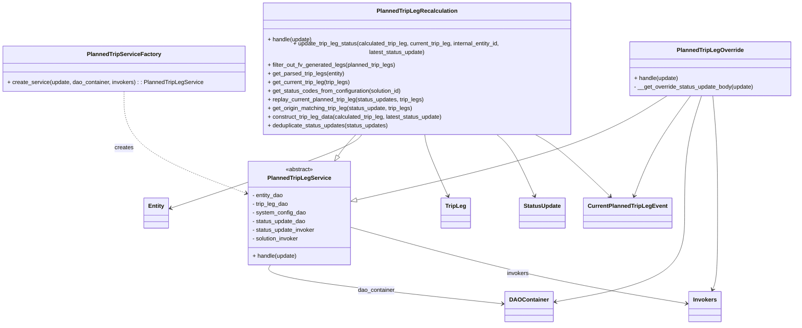

# Diagram: entity_core/entity_service/entity_service/entity/entity/update_current_planned_trip_leg/service.py


> Auto-generated by Obscura crawlers

## Diagram 1



### SVG

<svg id="container" width="2221.267578125" xmlns="http://www.w3.org/2000/svg" class="classDiagram" height="878" viewBox="0 0 2221.267578125 878" role="graphics-document document" aria-roledescription="class"><style>#container{font-family:"trebuchet ms",verdana,arial,sans-serif;font-size:16px;fill:#333;}@keyframes edge-animation-frame{from{stroke-dashoffset:0;}}@keyframes dash{to{stroke-dashoffset:0;}}#container .edge-animation-slow{stroke-dasharray:9,5!important;stroke-dashoffset:900;animation:dash 50s linear infinite;stroke-linecap:round;}#container .edge-animation-fast{stroke-dasharray:9,5!important;stroke-dashoffset:900;animation:dash 20s linear infinite;stroke-linecap:round;}#container .error-icon{fill:#552222;}#container .error-text{fill:#552222;stroke:#552222;}#container .edge-thickness-normal{stroke-width:1px;}#container .edge-thickness-thick{stroke-width:3.5px;}#container .edge-pattern-solid{stroke-dasharray:0;}#container .edge-thickness-invisible{stroke-width:0;fill:none;}#container .edge-pattern-dashed{stroke-dasharray:3;}#container .edge-pattern-dotted{stroke-dasharray:2;}#container .marker{fill:#333333;stroke:#333333;}#container .marker.cross{stroke:#333333;}#container svg{font-family:"trebuchet ms",verdana,arial,sans-serif;font-size:16px;}#container p{margin:0;}#container g.classGroup text{fill:#9370DB;stroke:none;font-family:"trebuchet ms",verdana,arial,sans-serif;font-size:10px;}#container g.classGroup text .title{font-weight:bolder;}#container .nodeLabel,#container .edgeLabel{color:#131300;}#container .edgeLabel .label rect{fill:#ECECFF;}#container .label text{fill:#131300;}#container .labelBkg{background:#ECECFF;}#container .edgeLabel .label span{background:#ECECFF;}#container .classTitle{font-weight:bolder;}#container .node rect,#container .node circle,#container .node ellipse,#container .node polygon,#container .node path{fill:#ECECFF;stroke:#9370DB;stroke-width:1px;}#container .divider{stroke:#9370DB;stroke-width:1;}#container g.clickable{cursor:pointer;}#container g.classGroup rect{fill:#ECECFF;stroke:#9370DB;}#container g.classGroup line{stroke:#9370DB;stroke-width:1;}#container .classLabel .box{stroke:none;stroke-width:0;fill:#ECECFF;opacity:0.5;}#container .classLabel .label{fill:#9370DB;font-size:10px;}#container .relation{stroke:#333333;stroke-width:1;fill:none;}#container .dashed-line{stroke-dasharray:3;}#container .dotted-line{stroke-dasharray:1 2;}#container #compositionStart,#container .composition{fill:#333333!important;stroke:#333333!important;stroke-width:1;}#container #compositionEnd,#container .composition{fill:#333333!important;stroke:#333333!important;stroke-width:1;}#container #dependencyStart,#container .dependency{fill:#333333!important;stroke:#333333!important;stroke-width:1;}#container #dependencyStart,#container .dependency{fill:#333333!important;stroke:#333333!important;stroke-width:1;}#container #extensionStart,#container .extension{fill:transparent!important;stroke:#333333!important;stroke-width:1;}#container #extensionEnd,#container .extension{fill:transparent!important;stroke:#333333!important;stroke-width:1;}#container #aggregationStart,#container .aggregation{fill:transparent!important;stroke:#333333!important;stroke-width:1;}#container #aggregationEnd,#container .aggregation{fill:transparent!important;stroke:#333333!important;stroke-width:1;}#container #lollipopStart,#container .lollipop{fill:#ECECFF!important;stroke:#333333!important;stroke-width:1;}#container #lollipopEnd,#container .lollipop{fill:#ECECFF!important;stroke:#333333!important;stroke-width:1;}#container .edgeTerminals{font-size:11px;line-height:initial;}#container .classTitleText{text-anchor:middle;font-size:18px;fill:#333;}#container .label-icon{display:inline-block;height:1em;overflow:visible;vertical-align:-0.125em;}#container .node .label-icon path{fill:currentColor;stroke:revert;stroke-width:revert;}#container :root{--mermaid-font-family:"trebuchet ms",verdana,arial,sans-serif;}</style><g><defs><marker id="container_class-aggregationStart" class="marker aggregation class" refX="18" refY="7" markerWidth="190" markerHeight="240" orient="auto"><path d="M 18,7 L9,13 L1,7 L9,1 Z"></path></marker></defs><defs><marker id="container_class-aggregationEnd" class="marker aggregation class" refX="1" refY="7" markerWidth="20" markerHeight="28" orient="auto"><path d="M 18,7 L9,13 L1,7 L9,1 Z"></path></marker></defs><defs><marker id="container_class-extensionStart" class="marker extension class" refX="18" refY="7" markerWidth="190" markerHeight="240" orient="auto"><path d="M 1,7 L18,13 V 1 Z"></path></marker></defs><defs><marker id="container_class-extensionEnd" class="marker extension class" refX="1" refY="7" markerWidth="20" markerHeight="28" orient="auto"><path d="M 1,1 V 13 L18,7 Z"></path></marker></defs><defs><marker id="container_class-compositionStart" class="marker composition class" refX="18" refY="7" markerWidth="190" markerHeight="240" orient="auto"><path d="M 18,7 L9,13 L1,7 L9,1 Z"></path></marker></defs><defs><marker id="container_class-compositionEnd" class="marker composition class" refX="1" refY="7" markerWidth="20" markerHeight="28" orient="auto"><path d="M 18,7 L9,13 L1,7 L9,1 Z"></path></marker></defs><defs><marker id="container_class-dependencyStart" class="marker dependency class" refX="6" refY="7" markerWidth="190" markerHeight="240" orient="auto"><path d="M 5,7 L9,13 L1,7 L9,1 Z"></path></marker></defs><defs><marker id="container_class-dependencyEnd" class="marker dependency class" refX="13" refY="7" markerWidth="20" markerHeight="28" orient="auto"><path d="M 18,7 L9,13 L14,7 L9,1 Z"></path></marker></defs><defs><marker id="container_class-lollipopStart" class="marker lollipop class" refX="13" refY="7" markerWidth="190" markerHeight="240" orient="auto"><circle stroke="black" fill="transparent" cx="7" cy="7" r="6"></circle></marker></defs><defs><marker id="container_class-lollipopEnd" class="marker lollipop class" refX="1" refY="7" markerWidth="190" markerHeight="240" orient="auto"><circle stroke="black" fill="transparent" cx="7" cy="7" r="6"></circle></marker></defs><g class="root"><g class="clusters"></g><g class="edgePaths"><path d="M996.577,350L990.619,356.167C984.661,362.333,972.746,374.667,964.727,384.495C956.709,394.322,952.588,401.645,950.528,405.306L948.467,408.967" id="id_PlannedTripLegRecalculation_PlannedTripLegService_1" class="edge-thickness-normal edge-pattern-solid relation" style=";;;" data-edge="true" data-et="edge" data-id="id_PlannedTripLegRecalculation_PlannedTripLegService_1" data-points="W3sieCI6OTk2LjU3Njg5NDkwNjg1MSwieSI6MzUwfSx7IngiOjk2MC44MzAwNzgxMjUsInkiOjM4N30seyJ4Ijo5NDAuMDA3MTk3NDI3NDg2MiwieSI6NDI0fV0=" marker-end="url(#container_class-extensionEnd)"></path><path d="M1859.929,254L1821.861,276.167C1783.794,298.333,1707.658,342.667,1567.262,388.808C1426.865,434.949,1222.206,482.898,1119.877,506.872L1017.547,530.847" id="id_PlannedTripLegOverride_PlannedTripLegService_2" class="edge-thickness-normal edge-pattern-solid relation" style=";;;" data-edge="true" data-et="edge" data-id="id_PlannedTripLegOverride_PlannedTripLegService_2" data-points="W3sieCI6MTg1OS45Mjg2MDc2NDcyMzU2LCJ5IjoyNTR9LHsieCI6MTYzMS41MjM0Mzc1LCJ5IjozODd9LHsieCI6MTAwMC43NTE5NTMxMjUsInkiOjUzNC43ODE1NzY5OTgwNDU4fV0=" marker-end="url(#container_class-extensionEnd)"></path><path d="M339.957,242L339.957,266.167C339.957,290.333,339.957,338.667,401.884,384.43C463.81,430.193,587.663,473.385,649.59,494.982L711.516,516.578" id="id_PlannedTripServiceFactory_PlannedTripLegService_3" class="edge-thickness-normal edge-pattern-dashed relation" style=";;;" data-edge="true" data-et="edge" data-id="id_PlannedTripServiceFactory_PlannedTripLegService_3" data-points="W3sieCI6MzM5Ljk1NzAzMTI1LCJ5IjoyNDJ9LHsieCI6MzM5Ljk1NzAzMTI1LCJ5IjozODd9LHsieCI6NzE3LjE4MTY0MDYyNSwieSI6NTE4LjU1MzY5ODYzNzM1NH1d" marker-end="url(#container_class-dependencyEnd)"></path><path d="M777.177,712L773.675,718.167C770.172,724.333,763.167,736.667,866.214,754.72C969.26,772.773,1182.359,796.545,1288.908,808.432L1395.457,820.318" id="id_PlannedTripLegService_DAOContainer_4" class="edge-thickness-normal edge-pattern-solid relation" style=";;;" data-edge="true" data-et="edge" data-id="id_PlannedTripLegService_DAOContainer_4" data-points="W3sieCI6Nzc3LjE3NzQzMjIzNDExNiwieSI6NzEyfSx7IngiOjc1Ni4xNjIxMDkzNzUsInkiOjc0OX0seyJ4IjoxNDAxLjQxOTkyMTg3NSwieSI6ODIwLjk4MzIyMDA2OTcyMzN9XQ==" marker-end="url(#container_class-dependencyEnd)"></path><path d="M1000.752,607.155L1086.357,630.796C1171.962,654.437,1343.173,701.718,1497.082,737.114C1650.992,772.509,1787.601,796.017,1855.905,807.772L1924.21,819.526" id="id_PlannedTripLegService_Invokers_5" class="edge-thickness-normal edge-pattern-solid relation" style=";;;" data-edge="true" data-et="edge" data-id="id_PlannedTripLegService_Invokers_5" data-points="W3sieCI6MTAwMC43NTE5NTMxMjUsInkiOjYwNy4xNTU0NTY0ODc4NTh9LHsieCI6MTUxNC4zODI4MTI1LCJ5Ijo3NDl9LHsieCI6MTkzMC4xMjMwNDY4NzUsInkiOjgyMC41NDM3NjQzMzI0ODM5fV0=" marker-end="url(#container_class-dependencyEnd)"></path><path d="M1013.019,350L1007.654,356.167C1002.289,362.333,991.56,374.667,902.116,408.837C812.672,443.006,644.514,499.013,560.436,527.016L476.357,555.019" id="id_PlannedTripLegRecalculation_Entity_6" class="edge-thickness-normal edge-pattern-solid relation" style=";;;" data-edge="true" data-et="edge" data-id="id_PlannedTripLegRecalculation_Entity_6" data-points="W3sieCI6MTAxMy4wMTkyMDI1OTkxNTg3LCJ5IjozNTB9LHsieCI6OTgwLjgzMDA3ODEyNSwieSI6Mzg3fSx7IngiOjQ3MC42NjQwNjI1LCJ5Ijo1NTYuOTE1MzgwMzMwMjg0NX1d" marker-end="url(#container_class-dependencyEnd)"></path><path d="M1183.981,350L1184.781,356.167C1185.582,362.333,1187.182,374.667,1200.186,403.123C1213.189,431.579,1237.594,476.158,1249.797,498.448L1262,520.737" id="id_PlannedTripLegRecalculation_TripLeg_7" class="edge-thickness-normal edge-pattern-solid relation" style=";;;" data-edge="true" data-et="edge" data-id="id_PlannedTripLegRecalculation_TripLeg_7" data-points="W3sieCI6MTE4My45ODA2NjU5NDA1MDQ5LCJ5IjozNTB9LHsieCI6MTE4OC43ODMyMDMxMjUsInkiOjM4N30seyJ4IjoxMjY0Ljg4MTMyMzM3NzA3MTgsInkiOjUyNn1d" marker-end="url(#container_class-dependencyEnd)"></path><path d="M1391.762,350L1400.056,356.167C1408.349,362.333,1424.936,374.667,1445.433,403.123C1465.929,431.579,1490.335,476.158,1502.537,498.448L1514.74,520.737" id="id_PlannedTripLegRecalculation_StatusUpdate_8" class="edge-thickness-normal edge-pattern-solid relation" style=";;;" data-edge="true" data-et="edge" data-id="id_PlannedTripLegRecalculation_StatusUpdate_8" data-points="W3sieCI6MTM5MS43NjIzMDA5MzE0OTA1LCJ5IjozNTB9LHsieCI6MTQ0MS41MjM0Mzc1LCJ5IjozODd9LHsieCI6MTUxNy42MjE1NTc3NTIwNzE4LCJ5Ijo1MjZ9XQ==" marker-end="url(#container_class-dependencyEnd)"></path><path d="M1493.913,350L1505.891,356.167C1517.868,362.333,1541.823,374.667,1579.08,403.335C1616.337,432.004,1666.897,477.007,1692.176,499.509L1717.456,522.011" id="id_PlannedTripLegRecalculation_CurrentPlannedTripLegEvent_9" class="edge-thickness-normal edge-pattern-solid relation" style=";;;" data-edge="true" data-et="edge" data-id="id_PlannedTripLegRecalculation_CurrentPlannedTripLegEvent_9" data-points="W3sieCI6MTQ5My45MTMzNDg4NTgxNzMsInkiOjM1MH0seyJ4IjoxNTY1Ljc3NzM0Mzc1LCJ5IjozODd9LHsieCI6MTcyMS45Mzc4NTYwOTQ2MTMyLCJ5Ijo1MjZ9XQ==" marker-end="url(#container_class-dependencyEnd)"></path><path d="M1933.25,254L1916.854,276.167C1900.457,298.333,1867.663,342.667,1843.192,387.06C1818.722,431.454,1802.575,475.907,1794.501,498.134L1786.428,520.361" id="id_PlannedTripLegOverride_CurrentPlannedTripLegEvent_10" class="edge-thickness-normal edge-pattern-solid relation" style=";;;" data-edge="true" data-et="edge" data-id="id_PlannedTripLegOverride_CurrentPlannedTripLegEvent_10" data-points="W3sieCI6MTkzMy4yNTAzNzU2MDA5NjE0LCJ5IjoyNTR9LHsieCI6MTgzNC44NjkxNDA2MjUsInkiOjM4N30seyJ4IjoxNzg0LjM3OTA0NjUyOTY5NiwieSI6NTI2fV0=" marker-end="url(#container_class-dependencyEnd)"></path><path d="M1964.168,254L1956.91,276.167C1949.651,298.333,1935.133,342.667,1927.874,395C1920.615,447.333,1920.615,507.667,1920.615,568C1920.615,628.333,1920.615,688.667,1856.034,730.014C1791.453,771.362,1662.291,793.724,1597.71,804.906L1533.129,816.087" id="id_PlannedTripLegOverride_DAOContainer_11" class="edge-thickness-normal edge-pattern-solid relation" style=";;;" data-edge="true" data-et="edge" data-id="id_PlannedTripLegOverride_DAOContainer_11" data-points="W3sieCI6MTk2NC4xNjg0MzgyNTEyMDIsInkiOjI1NH0seyJ4IjoxOTIwLjYxNTIzNDM3NSwieSI6Mzg3fSx7IngiOjE5MjAuNjE1MjM0Mzc1LCJ5Ijo1Njh9LHsieCI6MTkyMC42MTUyMzQzNzUsInkiOjc0OX0seyJ4IjoxNTI3LjIxNjc5Njg3NSwieSI6ODE3LjExMDIxMTI3OTY2MzF9XQ==" marker-end="url(#container_class-dependencyEnd)"></path><path d="M1995.94,254L1998.071,276.167C2000.203,298.333,2004.466,342.667,2006.597,395C2008.729,447.333,2008.729,507.667,2008.729,568C2008.729,628.333,2008.729,688.667,2006.383,724.087C2004.037,759.507,1999.345,770.014,1996.999,775.268L1994.653,780.521" id="id_PlannedTripLegOverride_Invokers_12" class="edge-thickness-normal edge-pattern-solid relation" style=";;;" data-edge="true" data-et="edge" data-id="id_PlannedTripLegOverride_Invokers_12" data-points="W3sieCI6MTk5NS45NDAwNTQwODY1Mzg2LCJ5IjoyNTR9LHsieCI6MjAwOC43Mjg1MTU2MjUsInkiOjM4N30seyJ4IjoyMDA4LjcyODUxNTYyNSwieSI6NTY4fSx7IngiOjIwMDguNzI4NTE1NjI1LCJ5Ijo3NDl9LHsieCI6MTk5Mi4yMDYyMTUzODc2NTgyLCJ5Ijo3ODZ9XQ==" marker-end="url(#container_class-dependencyEnd)"></path></g><g class="edgeLabels"><g class="edgeLabel"><g class="label" data-id="id_PlannedTripLegRecalculation_PlannedTripLegService_1" transform="translate(0, 0)"><foreignObject width="0" height="0"><div xmlns="http://www.w3.org/1999/xhtml" class="labelBkg" style="display: table-cell; white-space: nowrap; line-height: 1.5; max-width: 200px; text-align: center;"><span class="edgeLabel"></span></div></foreignObject></g></g><g class="edgeLabel"><g class="label" data-id="id_PlannedTripLegOverride_PlannedTripLegService_2" transform="translate(0, 0)"><foreignObject width="0" height="0"><div xmlns="http://www.w3.org/1999/xhtml" class="labelBkg" style="display: table-cell; white-space: nowrap; line-height: 1.5; max-width: 200px; text-align: center;"><span class="edgeLabel"></span></div></foreignObject></g></g><g class="edgeLabel" transform="translate(339.95703125, 387)"><g class="label" data-id="id_PlannedTripServiceFactory_PlannedTripLegService_3" transform="translate(-26.171875, -12)"><foreignObject width="52.34375" height="24"><div xmlns="http://www.w3.org/1999/xhtml" class="labelBkg" style="display: table-cell; white-space: nowrap; line-height: 1.5; max-width: 200px; text-align: center;"><span class="edgeLabel"><p>creates</p></span></div></foreignObject></g></g><g class="edgeLabel" transform="translate(1057.64635, 782.63277)"><g class="label" data-id="id_PlannedTripLegService_DAOContainer_4" transform="translate(-52.25, -12)"><foreignObject width="104.5" height="24"><div xmlns="http://www.w3.org/1999/xhtml" class="labelBkg" style="display: table-cell; white-space: nowrap; line-height: 1.5; max-width: 200px; text-align: center;"><span class="edgeLabel"><p>dao_container</p></span></div></foreignObject></g></g><g class="edgeLabel" transform="translate(1460.88255, 734.22534)"><g class="label" data-id="id_PlannedTripLegService_Invokers_5" transform="translate(-30.5546875, -12)"><foreignObject width="61.109375" height="24"><div xmlns="http://www.w3.org/1999/xhtml" class="labelBkg" style="display: table-cell; white-space: nowrap; line-height: 1.5; max-width: 200px; text-align: center;"><span class="edgeLabel"><p>invokers</p></span></div></foreignObject></g></g><g class="edgeLabel"><g class="label" data-id="id_PlannedTripLegRecalculation_Entity_6" transform="translate(0, 0)"><foreignObject width="0" height="0"><div xmlns="http://www.w3.org/1999/xhtml" class="labelBkg" style="display: table-cell; white-space: nowrap; line-height: 1.5; max-width: 200px; text-align: center;"><span class="edgeLabel"></span></div></foreignObject></g></g><g class="edgeLabel"><g class="label" data-id="id_PlannedTripLegRecalculation_TripLeg_7" transform="translate(0, 0)"><foreignObject width="0" height="0"><div xmlns="http://www.w3.org/1999/xhtml" class="labelBkg" style="display: table-cell; white-space: nowrap; line-height: 1.5; max-width: 200px; text-align: center;"><span class="edgeLabel"></span></div></foreignObject></g></g><g class="edgeLabel"><g class="label" data-id="id_PlannedTripLegRecalculation_StatusUpdate_8" transform="translate(0, 0)"><foreignObject width="0" height="0"><div xmlns="http://www.w3.org/1999/xhtml" class="labelBkg" style="display: table-cell; white-space: nowrap; line-height: 1.5; max-width: 200px; text-align: center;"><span class="edgeLabel"></span></div></foreignObject></g></g><g class="edgeLabel"><g class="label" data-id="id_PlannedTripLegRecalculation_CurrentPlannedTripLegEvent_9" transform="translate(0, 0)"><foreignObject width="0" height="0"><div xmlns="http://www.w3.org/1999/xhtml" class="labelBkg" style="display: table-cell; white-space: nowrap; line-height: 1.5; max-width: 200px; text-align: center;"><span class="edgeLabel"></span></div></foreignObject></g></g><g class="edgeLabel"><g class="label" data-id="id_PlannedTripLegOverride_CurrentPlannedTripLegEvent_10" transform="translate(0, 0)"><foreignObject width="0" height="0"><div xmlns="http://www.w3.org/1999/xhtml" class="labelBkg" style="display: table-cell; white-space: nowrap; line-height: 1.5; max-width: 200px; text-align: center;"><span class="edgeLabel"></span></div></foreignObject></g></g><g class="edgeLabel"><g class="label" data-id="id_PlannedTripLegOverride_DAOContainer_11" transform="translate(0, 0)"><foreignObject width="0" height="0"><div xmlns="http://www.w3.org/1999/xhtml" class="labelBkg" style="display: table-cell; white-space: nowrap; line-height: 1.5; max-width: 200px; text-align: center;"><span class="edgeLabel"></span></div></foreignObject></g></g><g class="edgeLabel"><g class="label" data-id="id_PlannedTripLegOverride_Invokers_12" transform="translate(0, 0)"><foreignObject width="0" height="0"><div xmlns="http://www.w3.org/1999/xhtml" class="labelBkg" style="display: table-cell; white-space: nowrap; line-height: 1.5; max-width: 200px; text-align: center;"><span class="edgeLabel"></span></div></foreignObject></g></g></g><g class="nodes"><g class="node default" id="classId-PlannedTripLegService-0" transform="translate(858.966796875, 568)"><g class="basic label-container"><path d="M-141.78515625 -144 L141.78515625 -144 L141.78515625 144 L-141.78515625 144" stroke="none" stroke-width="0" fill="#ECECFF" style=""></path><path d="M-141.78515625 -144 C-32.36142011614305 -144, 77.0623160177139 -144, 141.78515625 -144 M-141.78515625 -144 C-80.21372947146574 -144, -18.64230269293148 -144, 141.78515625 -144 M141.78515625 -144 C141.78515625 -73.39850698399451, 141.78515625 -2.7970139679890167, 141.78515625 144 M141.78515625 -144 C141.78515625 -39.905815448967246, 141.78515625 64.18836910206551, 141.78515625 144 M141.78515625 144 C76.64541733426891 144, 11.505678418537826 144, -141.78515625 144 M141.78515625 144 C73.08809494663414 144, 4.391033643268287 144, -141.78515625 144 M-141.78515625 144 C-141.78515625 34.130191521479716, -141.78515625 -75.73961695704057, -141.78515625 -144 M-141.78515625 144 C-141.78515625 57.838294169102085, -141.78515625 -28.32341166179583, -141.78515625 -144" stroke="#9370DB" stroke-width="1.3" fill="none" stroke-dasharray="0 0" style=""></path></g><g class="annotation-group text" transform="translate(-38.609375, -120)"><g class="label" style="" transform="translate(0,-12)"><foreignObject width="77.21875" height="24"><div xmlns="http://www.w3.org/1999/xhtml" style="display: table-cell; white-space: nowrap; line-height: 1.5; max-width: 127px; text-align: center;"><span class="nodeLabel markdown-node-label" style=""><p>«abstract»</p></span></div></foreignObject></g></g><g class="label-group text" transform="translate(-83.5859375, -96)"><g class="label" style="font-weight: bolder" transform="translate(0,-12)"><foreignObject width="167.171875" height="24"><div xmlns="http://www.w3.org/1999/xhtml" style="display: table-cell; white-space: nowrap; line-height: 1.5; max-width: 214px; text-align: center;"><span class="nodeLabel markdown-node-label" style=""><p>PlannedTripLegService</p></span></div></foreignObject></g></g><g class="members-group text" transform="translate(-129.78515625, -48)"><g class="label" style="" transform="translate(0,-12)"><foreignObject width="87.78125" height="24"><div xmlns="http://www.w3.org/1999/xhtml" style="display: table-cell; white-space: nowrap; line-height: 1.5; max-width: 145px; text-align: center;"><span class="nodeLabel markdown-node-label" style=""><p>- entity_dao</p></span></div></foreignObject></g><g class="label" style="" transform="translate(0,12)"><foreignObject width="101.828125" height="24"><div xmlns="http://www.w3.org/1999/xhtml" style="display: table-cell; white-space: nowrap; line-height: 1.5; max-width: 159px; text-align: center;"><span class="nodeLabel markdown-node-label" style=""><p>- trip_leg_dao</p></span></div></foreignObject></g><g class="label" style="" transform="translate(0,36)"><foreignObject width="148.34375" height="24"><div xmlns="http://www.w3.org/1999/xhtml" style="display: table-cell; white-space: nowrap; line-height: 1.5; max-width: 206px; text-align: center;"><span class="nodeLabel markdown-node-label" style=""><p>- system_config_dao</p></span></div></foreignObject></g><g class="label" style="" transform="translate(0,60)"><foreignObject width="149.421875" height="24"><div xmlns="http://www.w3.org/1999/xhtml" style="display: table-cell; white-space: nowrap; line-height: 1.5; max-width: 207px; text-align: center;"><span class="nodeLabel markdown-node-label" style=""><p>- status_update_dao</p></span></div></foreignObject></g><g class="label" style="" transform="translate(0,84)"><foreignObject width="175.984375" height="24"><div xmlns="http://www.w3.org/1999/xhtml" style="display: table-cell; white-space: nowrap; line-height: 1.5; max-width: 234px; text-align: center;"><span class="nodeLabel markdown-node-label" style=""><p>- status_update_invoker</p></span></div></foreignObject></g><g class="label" style="" transform="translate(0,108)"><foreignObject width="132.71875" height="24"><div xmlns="http://www.w3.org/1999/xhtml" style="display: table-cell; white-space: nowrap; line-height: 1.5; max-width: 191px; text-align: center;"><span class="nodeLabel markdown-node-label" style=""><p>- solution_invoker</p></span></div></foreignObject></g></g><g class="methods-group text" transform="translate(-129.78515625, 120)"><g class="label" style="" transform="translate(0,-12)"><foreignObject width="124.296875" height="24"><div xmlns="http://www.w3.org/1999/xhtml" style="display: table-cell; white-space: nowrap; line-height: 1.5; max-width: 182px; text-align: center;"><span class="nodeLabel markdown-node-label" style=""><p>+ handle(update)</p></span></div></foreignObject></g></g><g class="divider" style=""><path d="M-141.78515625 -72 C-76.13372497580858 -72, -10.482293701617152 -72, 141.78515625 -72 M-141.78515625 -72 C-44.53243268141905 -72, 52.720290887161894 -72, 141.78515625 -72" stroke="#9370DB" stroke-width="1.3" fill="none" stroke-dasharray="0 0" style=""></path></g><g class="divider" style=""><path d="M-141.78515625 96 C-34.740136674284244 96, 72.30488290143151 96, 141.78515625 96 M-141.78515625 96 C-74.87989487936458 96, -7.97463350872917 96, 141.78515625 96" stroke="#9370DB" stroke-width="1.3" fill="none" stroke-dasharray="0 0" style=""></path></g></g><g class="node default" id="classId-PlannedTripLegRecalculation-1" transform="translate(1161.78515625, 179)"><g class="basic label-container"><path d="M-439.87109375 -171 L439.87109375 -171 L439.87109375 171 L-439.87109375 171" stroke="none" stroke-width="0" fill="#ECECFF" style=""></path><path d="M-439.87109375 -171 C-139.5872934579599 -171, 160.6965068340802 -171, 439.87109375 -171 M-439.87109375 -171 C-152.71627549889877 -171, 134.43854275220247 -171, 439.87109375 -171 M439.87109375 -171 C439.87109375 -39.60387736627055, 439.87109375 91.7922452674589, 439.87109375 171 M439.87109375 -171 C439.87109375 -57.15011218089448, 439.87109375 56.69977563821104, 439.87109375 171 M439.87109375 171 C246.94922904177605 171, 54.0273643335521 171, -439.87109375 171 M439.87109375 171 C101.6932967242368 171, -236.4845003015264 171, -439.87109375 171 M-439.87109375 171 C-439.87109375 86.55597563266471, -439.87109375 2.1119512653294237, -439.87109375 -171 M-439.87109375 171 C-439.87109375 55.92657449107668, -439.87109375 -59.14685101784664, -439.87109375 -171" stroke="#9370DB" stroke-width="1.3" fill="none" stroke-dasharray="0 0" style=""></path></g><g class="annotation-group text" transform="translate(0, -147)"></g><g class="label-group text" transform="translate(-106.2421875, -147)"><g class="label" style="font-weight: bolder" transform="translate(0,-12)"><foreignObject width="212.484375" height="24"><div xmlns="http://www.w3.org/1999/xhtml" style="display: table-cell; white-space: nowrap; line-height: 1.5; max-width: 260px; text-align: center;"><span class="nodeLabel markdown-node-label" style=""><p>PlannedTripLegRecalculation</p></span></div></foreignObject></g></g><g class="members-group text" transform="translate(-427.87109375, -99)"></g><g class="methods-group text" transform="translate(-427.87109375, -69)"><g class="label" style="" transform="translate(0,-12)"><foreignObject width="124.296875" height="24"><div xmlns="http://www.w3.org/1999/xhtml" style="display: table-cell; white-space: nowrap; line-height: 1.5; max-width: 182px; text-align: center;"><span class="nodeLabel markdown-node-label" style=""><p>+ handle(update)</p></span></div></foreignObject></g><g class="label" style="" transform="translate(0,12)"><foreignObject width="749.5" height="24"><div xmlns="http://www.w3.org/1999/xhtml" style="display: table-cell; white-space: nowrap; line-height: 1.5; max-width: 807px; text-align: center;"><span class="nodeLabel markdown-node-label" style=""><p>+ update_trip_leg_status(calculated_trip_leg, current_trip_leg, internal_entity_id, latest_status_update)</p></span></div></foreignObject></g><g class="label" style="" transform="translate(0,36)"><foreignObject width="358.15625" height="24"><div xmlns="http://www.w3.org/1999/xhtml" style="display: table-cell; white-space: nowrap; line-height: 1.5; max-width: 416px; text-align: center;"><span class="nodeLabel markdown-node-label" style=""><p>+ filter_out_fv_generated_legs(planned_trip_legs)</p></span></div></foreignObject></g><g class="label" style="" transform="translate(0,60)"><foreignObject width="216" height="24"><div xmlns="http://www.w3.org/1999/xhtml" style="display: table-cell; white-space: nowrap; line-height: 1.5; max-width: 273px; text-align: center;"><span class="nodeLabel markdown-node-label" style=""><p>+ get_parsed_trip_legs(entity)</p></span></div></foreignObject></g><g class="label" style="" transform="translate(0,84)"><foreignObject width="231.96875" height="24"><div xmlns="http://www.w3.org/1999/xhtml" style="display: table-cell; white-space: nowrap; line-height: 1.5; max-width: 289px; text-align: center;"><span class="nodeLabel markdown-node-label" style=""><p>+ get_current_trip_leg(trip_legs)</p></span></div></foreignObject></g><g class="label" style="" transform="translate(0,108)"><foreignObject width="376.0625" height="24"><div xmlns="http://www.w3.org/1999/xhtml" style="display: table-cell; white-space: nowrap; line-height: 1.5; max-width: 433px; text-align: center;"><span class="nodeLabel markdown-node-label" style=""><p>+ get_status_codes_from_configuration(solution_id)</p></span></div></foreignObject></g><g class="label" style="" transform="translate(0,132)"><foreignObject width="440.953125" height="24"><div xmlns="http://www.w3.org/1999/xhtml" style="display: table-cell; white-space: nowrap; line-height: 1.5; max-width: 498px; text-align: center;"><span class="nodeLabel markdown-node-label" style=""><p>+ replay_current_planned_trip_leg(status_updates, trip_legs)</p></span></div></foreignObject></g><g class="label" style="" transform="translate(0,156)"><foreignObject width="408.578125" height="24"><div xmlns="http://www.w3.org/1999/xhtml" style="display: table-cell; white-space: nowrap; line-height: 1.5; max-width: 466px; text-align: center;"><span class="nodeLabel markdown-node-label" style=""><p>+ get_origin_matching_trip_leg(status_update, trip_legs)</p></span></div></foreignObject></g><g class="label" style="" transform="translate(0,180)"><foreignObject width="493.640625" height="24"><div xmlns="http://www.w3.org/1999/xhtml" style="display: table-cell; white-space: nowrap; line-height: 1.5; max-width: 551px; text-align: center;"><span class="nodeLabel markdown-node-label" style=""><p>+ construct_trip_leg_data(calculated_trip_leg, latest_status_update)</p></span></div></foreignObject></g><g class="label" style="" transform="translate(0,204)"><foreignObject width="338.71875" height="24"><div xmlns="http://www.w3.org/1999/xhtml" style="display: table-cell; white-space: nowrap; line-height: 1.5; max-width: 396px; text-align: center;"><span class="nodeLabel markdown-node-label" style=""><p>+ deduplicate_status_updates(status_updates)</p></span></div></foreignObject></g></g><g class="divider" style=""><path d="M-439.87109375 -123 C-101.90764801276407 -123, 236.05579772447186 -123, 439.87109375 -123 M-439.87109375 -123 C-97.99246953341526 -123, 243.88615468316948 -123, 439.87109375 -123" stroke="#9370DB" stroke-width="1.3" fill="none" stroke-dasharray="0 0" style=""></path></g><g class="divider" style=""><path d="M-439.87109375 -99 C-113.46102774498883 -99, 212.94903826002235 -99, 439.87109375 -99 M-439.87109375 -99 C-109.7701355848244 -99, 220.3308225803512 -99, 439.87109375 -99" stroke="#9370DB" stroke-width="1.3" fill="none" stroke-dasharray="0 0" style=""></path></g></g><g class="node default" id="classId-PlannedTripLegOverride-2" transform="translate(1988.728515625, 179)"><g class="basic label-container"><path d="M-224.5390625 -75 L224.5390625 -75 L224.5390625 75 L-224.5390625 75" stroke="none" stroke-width="0" fill="#ECECFF" style=""></path><path d="M-224.5390625 -75 C-73.24876891972573 -75, 78.04152466054853 -75, 224.5390625 -75 M-224.5390625 -75 C-50.40544040077529 -75, 123.72818169844942 -75, 224.5390625 -75 M224.5390625 -75 C224.5390625 -31.69482168265958, 224.5390625 11.61035663468084, 224.5390625 75 M224.5390625 -75 C224.5390625 -17.921115164170068, 224.5390625 39.157769671659864, 224.5390625 75 M224.5390625 75 C92.35916459883714 75, -39.82073330232572 75, -224.5390625 75 M224.5390625 75 C54.123057180760725 75, -116.29294813847855 75, -224.5390625 75 M-224.5390625 75 C-224.5390625 18.900007788676838, -224.5390625 -37.199984422646324, -224.5390625 -75 M-224.5390625 75 C-224.5390625 36.4459460506798, -224.5390625 -2.108107898640398, -224.5390625 -75" stroke="#9370DB" stroke-width="1.3" fill="none" stroke-dasharray="0 0" style=""></path></g><g class="annotation-group text" transform="translate(0, -51)"></g><g class="label-group text" transform="translate(-88.8125, -51)"><g class="label" style="font-weight: bolder" transform="translate(0,-12)"><foreignObject width="177.625" height="24"><div xmlns="http://www.w3.org/1999/xhtml" style="display: table-cell; white-space: nowrap; line-height: 1.5; max-width: 225px; text-align: center;"><span class="nodeLabel markdown-node-label" style=""><p>PlannedTripLegOverride</p></span></div></foreignObject></g></g><g class="members-group text" transform="translate(-212.5390625, -3)"></g><g class="methods-group text" transform="translate(-212.5390625, 27)"><g class="label" style="" transform="translate(0,-12)"><foreignObject width="124.296875" height="24"><div xmlns="http://www.w3.org/1999/xhtml" style="display: table-cell; white-space: nowrap; line-height: 1.5; max-width: 182px; text-align: center;"><span class="nodeLabel markdown-node-label" style=""><p>+ handle(update)</p></span></div></foreignObject></g><g class="label" style="" transform="translate(0,12)"><foreignObject width="336.265625" height="24"><div xmlns="http://www.w3.org/1999/xhtml" style="display: table-cell; white-space: nowrap; line-height: 1.5; max-width: 394px; text-align: center;"><span class="nodeLabel markdown-node-label" style=""><p>- __get_override_status_update_body(update)</p></span></div></foreignObject></g></g><g class="divider" style=""><path d="M-224.5390625 -27 C-100.415666432381 -27, 23.707729635237996 -27, 224.5390625 -27 M-224.5390625 -27 C-68.6518641726903 -27, 87.23533415461941 -27, 224.5390625 -27" stroke="#9370DB" stroke-width="1.3" fill="none" stroke-dasharray="0 0" style=""></path></g><g class="divider" style=""><path d="M-224.5390625 -3 C-51.43884077382717 -3, 121.66138095234567 -3, 224.5390625 -3 M-224.5390625 -3 C-87.54722784973188 -3, 49.444606800536235 -3, 224.5390625 -3" stroke="#9370DB" stroke-width="1.3" fill="none" stroke-dasharray="0 0" style=""></path></g></g><g class="node default" id="classId-PlannedTripServiceFactory-3" transform="translate(339.95703125, 179)"><g class="basic label-container"><path d="M-331.95703125 -63 L331.95703125 -63 L331.95703125 63 L-331.95703125 63" stroke="none" stroke-width="0" fill="#ECECFF" style=""></path><path d="M-331.95703125 -63 C-72.3597000014314 -63, 187.2376312471372 -63, 331.95703125 -63 M-331.95703125 -63 C-179.76563094270278 -63, -27.57423063540557 -63, 331.95703125 -63 M331.95703125 -63 C331.95703125 -22.789322433951646, 331.95703125 17.421355132096707, 331.95703125 63 M331.95703125 -63 C331.95703125 -29.778159766848596, 331.95703125 3.4436804663028084, 331.95703125 63 M331.95703125 63 C76.36001833573124 63, -179.23699457853752 63, -331.95703125 63 M331.95703125 63 C184.1930772747714 63, 36.42912329954282 63, -331.95703125 63 M-331.95703125 63 C-331.95703125 19.36590315859317, -331.95703125 -24.26819368281366, -331.95703125 -63 M-331.95703125 63 C-331.95703125 18.988692036104084, -331.95703125 -25.022615927791833, -331.95703125 -63" stroke="#9370DB" stroke-width="1.3" fill="none" stroke-dasharray="0 0" style=""></path></g><g class="annotation-group text" transform="translate(0, -39)"></g><g class="label-group text" transform="translate(-97.4609375, -39)"><g class="label" style="font-weight: bolder" transform="translate(0,-12)"><foreignObject width="194.921875" height="24"><div xmlns="http://www.w3.org/1999/xhtml" style="display: table-cell; white-space: nowrap; line-height: 1.5; max-width: 242px; text-align: center;"><span class="nodeLabel markdown-node-label" style=""><p>PlannedTripServiceFactory</p></span></div></foreignObject></g></g><g class="members-group text" transform="translate(-319.95703125, 9)"></g><g class="methods-group text" transform="translate(-319.95703125, 39)"><g class="label" style="" transform="translate(0,-12)"><foreignObject width="542.453125" height="24"><div xmlns="http://www.w3.org/1999/xhtml" style="display: table-cell; white-space: nowrap; line-height: 1.5; max-width: 600px; text-align: center;"><span class="nodeLabel markdown-node-label" style=""><p>+ create_service(update, dao_container, invokers) : : PlannedTripLegService</p></span></div></foreignObject></g></g><g class="divider" style=""><path d="M-331.95703125 -15 C-134.60389102022046 -15, 62.74924920955908 -15, 331.95703125 -15 M-331.95703125 -15 C-87.04109835287832 -15, 157.87483454424336 -15, 331.95703125 -15" stroke="#9370DB" stroke-width="1.3" fill="none" stroke-dasharray="0 0" style=""></path></g><g class="divider" style=""><path d="M-331.95703125 9 C-104.3064150777918 9, 123.3442010944164 9, 331.95703125 9 M-331.95703125 9 C-111.15681089413218 9, 109.64340946173564 9, 331.95703125 9" stroke="#9370DB" stroke-width="1.3" fill="none" stroke-dasharray="0 0" style=""></path></g></g><g class="node default" id="classId-DAOContainer-4" transform="translate(1464.318359375, 828)"><g class="basic label-container"><path d="M-62.8984375 -42 L62.8984375 -42 L62.8984375 42 L-62.8984375 42" stroke="none" stroke-width="0" fill="#ECECFF" style=""></path><path d="M-62.8984375 -42 C-35.23609814214261 -42, -7.573758784285218 -42, 62.8984375 -42 M-62.8984375 -42 C-22.437297239383547 -42, 18.023843021232906 -42, 62.8984375 -42 M62.8984375 -42 C62.8984375 -23.450648350668295, 62.8984375 -4.901296701336591, 62.8984375 42 M62.8984375 -42 C62.8984375 -24.32368156948093, 62.8984375 -6.6473631389618575, 62.8984375 42 M62.8984375 42 C16.648408294954905 42, -29.60162091009019 42, -62.8984375 42 M62.8984375 42 C13.309302059806654 42, -36.27983338038669 42, -62.8984375 42 M-62.8984375 42 C-62.8984375 22.237335206466465, -62.8984375 2.47467041293293, -62.8984375 -42 M-62.8984375 42 C-62.8984375 15.221914398964618, -62.8984375 -11.556171202070765, -62.8984375 -42" stroke="#9370DB" stroke-width="1.3" fill="none" stroke-dasharray="0 0" style=""></path></g><g class="annotation-group text" transform="translate(0, -18)"></g><g class="label-group text" transform="translate(-50.8984375, -18)"><g class="label" style="font-weight: bolder" transform="translate(0,-12)"><foreignObject width="101.796875" height="24"><div xmlns="http://www.w3.org/1999/xhtml" style="display: table-cell; white-space: nowrap; line-height: 1.5; max-width: 152px; text-align: center;"><span class="nodeLabel markdown-node-label" style=""><p>DAOContainer</p></span></div></foreignObject></g></g><g class="members-group text" transform="translate(-50.8984375, 30)"></g><g class="methods-group text" transform="translate(-50.8984375, 60)"></g><g class="divider" style=""><path d="M-62.8984375 6 C-35.46249110955603 6, -8.026544719112046 6, 62.8984375 6 M-62.8984375 6 C-31.09341055955315 6, 0.7116163808937017 6, 62.8984375 6" stroke="#9370DB" stroke-width="1.3" fill="none" stroke-dasharray="0 0" style=""></path></g><g class="divider" style=""><path d="M-62.8984375 24 C-32.22803796688979 24, -1.557638433779566 24, 62.8984375 24 M-62.8984375 24 C-16.60583539380056 24, 29.686766712398878 24, 62.8984375 24" stroke="#9370DB" stroke-width="1.3" fill="none" stroke-dasharray="0 0" style=""></path></g></g><g class="node default" id="classId-Invokers-5" transform="translate(1973.451171875, 828)"><g class="basic label-container"><path d="M-43.328125 -42 L43.328125 -42 L43.328125 42 L-43.328125 42" stroke="none" stroke-width="0" fill="#ECECFF" style=""></path><path d="M-43.328125 -42 C-14.27984338998878 -42, 14.768438220022439 -42, 43.328125 -42 M-43.328125 -42 C-20.519679070503994 -42, 2.2887668589920125 -42, 43.328125 -42 M43.328125 -42 C43.328125 -23.484589427178136, 43.328125 -4.969178854356272, 43.328125 42 M43.328125 -42 C43.328125 -10.784520645932535, 43.328125 20.43095870813493, 43.328125 42 M43.328125 42 C15.360900791683399 42, -12.606323416633202 42, -43.328125 42 M43.328125 42 C19.211782286600123 42, -4.904560426799755 42, -43.328125 42 M-43.328125 42 C-43.328125 20.8065468869854, -43.328125 -0.3869062260291969, -43.328125 -42 M-43.328125 42 C-43.328125 24.50821461863114, -43.328125 7.01642923726228, -43.328125 -42" stroke="#9370DB" stroke-width="1.3" fill="none" stroke-dasharray="0 0" style=""></path></g><g class="annotation-group text" transform="translate(0, -18)"></g><g class="label-group text" transform="translate(-31.328125, -18)"><g class="label" style="font-weight: bolder" transform="translate(0,-12)"><foreignObject width="62.65625" height="24"><div xmlns="http://www.w3.org/1999/xhtml" style="display: table-cell; white-space: nowrap; line-height: 1.5; max-width: 111px; text-align: center;"><span class="nodeLabel markdown-node-label" style=""><p>Invokers</p></span></div></foreignObject></g></g><g class="members-group text" transform="translate(-31.328125, 30)"></g><g class="methods-group text" transform="translate(-31.328125, 60)"></g><g class="divider" style=""><path d="M-43.328125 6 C-23.261682490396367 6, -3.195239980792735 6, 43.328125 6 M-43.328125 6 C-23.92748409561396 6, -4.526843191227918 6, 43.328125 6" stroke="#9370DB" stroke-width="1.3" fill="none" stroke-dasharray="0 0" style=""></path></g><g class="divider" style=""><path d="M-43.328125 24 C-17.476167320043196 24, 8.375790359913609 24, 43.328125 24 M-43.328125 24 C-19.365811483685047 24, 4.596502032629907 24, 43.328125 24" stroke="#9370DB" stroke-width="1.3" fill="none" stroke-dasharray="0 0" style=""></path></g></g><g class="node default" id="classId-Entity-6" transform="translate(437.3828125, 568)"><g class="basic label-container"><path d="M-33.28125 -42 L33.28125 -42 L33.28125 42 L-33.28125 42" stroke="none" stroke-width="0" fill="#ECECFF" style=""></path><path d="M-33.28125 -42 C-9.101608583456997 -42, 15.078032833086006 -42, 33.28125 -42 M-33.28125 -42 C-12.78417797759797 -42, 7.7128940448040595 -42, 33.28125 -42 M33.28125 -42 C33.28125 -14.454781538990332, 33.28125 13.090436922019336, 33.28125 42 M33.28125 -42 C33.28125 -23.199771963409837, 33.28125 -4.399543926819675, 33.28125 42 M33.28125 42 C7.90408614460685 42, -17.4730777107863 42, -33.28125 42 M33.28125 42 C14.054874400728735 42, -5.171501198542529 42, -33.28125 42 M-33.28125 42 C-33.28125 9.030547354003382, -33.28125 -23.938905291993237, -33.28125 -42 M-33.28125 42 C-33.28125 11.207854895914402, -33.28125 -19.584290208171197, -33.28125 -42" stroke="#9370DB" stroke-width="1.3" fill="none" stroke-dasharray="0 0" style=""></path></g><g class="annotation-group text" transform="translate(0, -18)"></g><g class="label-group text" transform="translate(-21.28125, -18)"><g class="label" style="font-weight: bolder" transform="translate(0,-12)"><foreignObject width="42.5625" height="24"><div xmlns="http://www.w3.org/1999/xhtml" style="display: table-cell; white-space: nowrap; line-height: 1.5; max-width: 92px; text-align: center;"><span class="nodeLabel markdown-node-label" style=""><p>Entity</p></span></div></foreignObject></g></g><g class="members-group text" transform="translate(-21.28125, 30)"></g><g class="methods-group text" transform="translate(-21.28125, 60)"></g><g class="divider" style=""><path d="M-33.28125 6 C-11.929236248257936 6, 9.422777503484127 6, 33.28125 6 M-33.28125 6 C-10.00146200103557 6, 13.27832599792886 6, 33.28125 6" stroke="#9370DB" stroke-width="1.3" fill="none" stroke-dasharray="0 0" style=""></path></g><g class="divider" style=""><path d="M-33.28125 24 C-13.654665226974203 24, 5.971919546051595 24, 33.28125 24 M-33.28125 24 C-18.952632508133547 24, -4.624015016267094 24, 33.28125 24" stroke="#9370DB" stroke-width="1.3" fill="none" stroke-dasharray="0 0" style=""></path></g></g><g class="node default" id="classId-TripLeg-7" transform="translate(1287.875, 568)"><g class="basic label-container"><path d="M-39.0546875 -42 L39.0546875 -42 L39.0546875 42 L-39.0546875 42" stroke="none" stroke-width="0" fill="#ECECFF" style=""></path><path d="M-39.0546875 -42 C-23.220506127819608 -42, -7.386324755639215 -42, 39.0546875 -42 M-39.0546875 -42 C-13.462461628395793 -42, 12.129764243208413 -42, 39.0546875 -42 M39.0546875 -42 C39.0546875 -16.208331484562112, 39.0546875 9.583337030875775, 39.0546875 42 M39.0546875 -42 C39.0546875 -15.333687779313873, 39.0546875 11.332624441372253, 39.0546875 42 M39.0546875 42 C20.983673172423707 42, 2.9126588448474138 42, -39.0546875 42 M39.0546875 42 C9.219466966923122 42, -20.615753566153757 42, -39.0546875 42 M-39.0546875 42 C-39.0546875 14.945994981834058, -39.0546875 -12.108010036331883, -39.0546875 -42 M-39.0546875 42 C-39.0546875 11.505988867926629, -39.0546875 -18.988022264146743, -39.0546875 -42" stroke="#9370DB" stroke-width="1.3" fill="none" stroke-dasharray="0 0" style=""></path></g><g class="annotation-group text" transform="translate(0, -18)"></g><g class="label-group text" transform="translate(-27.0546875, -18)"><g class="label" style="font-weight: bolder" transform="translate(0,-12)"><foreignObject width="54.109375" height="24"><div xmlns="http://www.w3.org/1999/xhtml" style="display: table-cell; white-space: nowrap; line-height: 1.5; max-width: 103px; text-align: center;"><span class="nodeLabel markdown-node-label" style=""><p>TripLeg</p></span></div></foreignObject></g></g><g class="members-group text" transform="translate(-27.0546875, 30)"></g><g class="methods-group text" transform="translate(-27.0546875, 60)"></g><g class="divider" style=""><path d="M-39.0546875 6 C-14.536979708120093 6, 9.980728083759814 6, 39.0546875 6 M-39.0546875 6 C-20.998208461961806 6, -2.9417294239236114 6, 39.0546875 6" stroke="#9370DB" stroke-width="1.3" fill="none" stroke-dasharray="0 0" style=""></path></g><g class="divider" style=""><path d="M-39.0546875 24 C-19.85195669447927 24, -0.64922588895854 24, 39.0546875 24 M-39.0546875 24 C-11.433529625678368 24, 16.187628248643264 24, 39.0546875 24" stroke="#9370DB" stroke-width="1.3" fill="none" stroke-dasharray="0 0" style=""></path></g></g><g class="node default" id="classId-StatusUpdate-8" transform="translate(1540.615234375, 568)"><g class="basic label-container"><path d="M-62.015625 -42 L62.015625 -42 L62.015625 42 L-62.015625 42" stroke="none" stroke-width="0" fill="#ECECFF" style=""></path><path d="M-62.015625 -42 C-31.170965835663655 -42, -0.32630667132730906 -42, 62.015625 -42 M-62.015625 -42 C-25.420394996178814 -42, 11.174835007642372 -42, 62.015625 -42 M62.015625 -42 C62.015625 -9.512984974641853, 62.015625 22.974030050716294, 62.015625 42 M62.015625 -42 C62.015625 -14.701045853854996, 62.015625 12.597908292290008, 62.015625 42 M62.015625 42 C22.960224605350483 42, -16.095175789299034 42, -62.015625 42 M62.015625 42 C12.63050330607502 42, -36.75461838784996 42, -62.015625 42 M-62.015625 42 C-62.015625 11.96984533174545, -62.015625 -18.0603093365091, -62.015625 -42 M-62.015625 42 C-62.015625 16.788721777085133, -62.015625 -8.422556445829734, -62.015625 -42" stroke="#9370DB" stroke-width="1.3" fill="none" stroke-dasharray="0 0" style=""></path></g><g class="annotation-group text" transform="translate(0, -18)"></g><g class="label-group text" transform="translate(-50.015625, -18)"><g class="label" style="font-weight: bolder" transform="translate(0,-12)"><foreignObject width="100.03125" height="24"><div xmlns="http://www.w3.org/1999/xhtml" style="display: table-cell; white-space: nowrap; line-height: 1.5; max-width: 148px; text-align: center;"><span class="nodeLabel markdown-node-label" style=""><p>StatusUpdate</p></span></div></foreignObject></g></g><g class="members-group text" transform="translate(-50.015625, 30)"></g><g class="methods-group text" transform="translate(-50.015625, 60)"></g><g class="divider" style=""><path d="M-62.015625 6 C-15.55043890969089 6, 30.91474718061822 6, 62.015625 6 M-62.015625 6 C-25.968304838765135 6, 10.07901532246973 6, 62.015625 6" stroke="#9370DB" stroke-width="1.3" fill="none" stroke-dasharray="0 0" style=""></path></g><g class="divider" style=""><path d="M-62.015625 24 C-23.406978401670052 24, 15.201668196659895 24, 62.015625 24 M-62.015625 24 C-12.717549256507517 24, 36.580526486984965 24, 62.015625 24" stroke="#9370DB" stroke-width="1.3" fill="none" stroke-dasharray="0 0" style=""></path></g></g><g class="node default" id="classId-CurrentPlannedTripLegEvent-9" transform="translate(1769.123046875, 568)"><g class="basic label-container"><path d="M-116.4921875 -42 L116.4921875 -42 L116.4921875 42 L-116.4921875 42" stroke="none" stroke-width="0" fill="#ECECFF" style=""></path><path d="M-116.4921875 -42 C-64.54372857980272 -42, -12.59526965960545 -42, 116.4921875 -42 M-116.4921875 -42 C-48.29964635842141 -42, 19.892894783157175 -42, 116.4921875 -42 M116.4921875 -42 C116.4921875 -21.06333321962776, 116.4921875 -0.1266664392555228, 116.4921875 42 M116.4921875 -42 C116.4921875 -21.28975661801775, 116.4921875 -0.5795132360355026, 116.4921875 42 M116.4921875 42 C32.996954812410394 42, -50.49827787517921 42, -116.4921875 42 M116.4921875 42 C32.63948108470598 42, -51.213225330588045 42, -116.4921875 42 M-116.4921875 42 C-116.4921875 16.19162929234477, -116.4921875 -9.616741415310457, -116.4921875 -42 M-116.4921875 42 C-116.4921875 24.642797759164555, -116.4921875 7.28559551832911, -116.4921875 -42" stroke="#9370DB" stroke-width="1.3" fill="none" stroke-dasharray="0 0" style=""></path></g><g class="annotation-group text" transform="translate(0, -18)"></g><g class="label-group text" transform="translate(-104.4921875, -18)"><g class="label" style="font-weight: bolder" transform="translate(0,-12)"><foreignObject width="208.984375" height="24"><div xmlns="http://www.w3.org/1999/xhtml" style="display: table-cell; white-space: nowrap; line-height: 1.5; max-width: 256px; text-align: center;"><span class="nodeLabel markdown-node-label" style=""><p>CurrentPlannedTripLegEvent</p></span></div></foreignObject></g></g><g class="members-group text" transform="translate(-104.4921875, 30)"></g><g class="methods-group text" transform="translate(-104.4921875, 60)"></g><g class="divider" style=""><path d="M-116.4921875 6 C-44.19865200384717 6, 28.094883492305655 6, 116.4921875 6 M-116.4921875 6 C-29.265119456624504 6, 57.96194858675099 6, 116.4921875 6" stroke="#9370DB" stroke-width="1.3" fill="none" stroke-dasharray="0 0" style=""></path></g><g class="divider" style=""><path d="M-116.4921875 24 C-64.51545079535805 24, -12.538714090716084 24, 116.4921875 24 M-116.4921875 24 C-63.71010079068932 24, -10.928014081378635 24, 116.4921875 24" stroke="#9370DB" stroke-width="1.3" fill="none" stroke-dasharray="0 0" style=""></path></g></g></g></g></g></svg>

## Diagram 2

```mermaid
sequenceDiagram
participant Client
participant Factory as PlannedTripServiceFactory
participant Service
participant EntityDAO as entity_dao
participant TripLegDAO as trip_leg_dao
participant SystemConfig as system_config_dao
participant StatusUpdateDAO as status_update_dao
participant SolutionInvoker as solution_invoker
participant StatusUpdateInvoker as status_update_invoker
Client->>Factory: create_service(update, dao_container, invokers)
Factory->>Factory: if update.is_override()
alt Override
Factory->>Service: return PlannedTripLegOverride
Service->>EntityDAO: get_entity_id(update.entity_external_id, update.solution_id)
EntityDAO-->>Service: internal_entity_id / null
alt entity not found
Service-->>Client: raise Exception
else entity found
Service->>TripLegDAO: get_planned_trip_leg_id_for_entity_and_location_codes(internal_entity_id, origin, destination)
TripLegDAO-->>Service: [trip_leg_id]
Service->>EntityDAO: update_current_planned_trip_leg(internal_entity_id, trip_leg_id, event_ts)
Service->>SystemConfig: get_system_configuration_setting(OVERRIDE_STATUS_UPDATE, solution_id)
SystemConfig-->>Service: override_status_update_body
Service->>SolutionInvoker: get_customer_id(solution_id)
SolutionInvoker-->>Service: shipper_org_id
Service->>StatusUpdateInvoker: send_override_milestone(body, solution_id, entity_external_id, shipper_org_id)
Service-->>Client: done
end
else Recalculation
Factory->>Service: return PlannedTripLegRecalculation
Service->>EntityDAO: get_entity_id(update.entity_external_id, update.solution_id)
EntityDAO-->>Service: internal_entity_id / null
alt entity not found
Service-->>Client: raise Exception
else entity found
Service->>SystemConfig: get_system_configuration_setting(CURRENT_PLANNED_TRIP_LEG_MILESTONE_CODES, solution_id)
SystemConfig-->>Service: status_codes
Service->>StatusUpdateDAO: get_ordered_status_updates(entity, status_codes)
StatusUpdateDAO-->>Service: status_updates
Service->>Service: deduplicate_status_updates(status_updates)
Service->>TripLegDAO: get_planned_trip_legs(entity)
TripLegDAO-->>Service: planned_trip_legs
Service->>Service: parse and filter_out_fv_generated_legs(planned_trip_legs)
Service->>Service: get_current_trip_leg(filtered_trip_legs)
Service->>Service: replay_current_planned_trip_leg(deduped_status_updates, filtered_trip_legs)
alt calculated_trip_leg_changed
Service->>TripLegDAO: clear_current_planned_trip_leg(internal_entity_id)
TripLegDAO-->>Service: ok
Service->>TripLegDAO: update_current_planned_trip_leg(internal_entity_id, planned_trip_leg_id)
TripLegDAO-->>Service: ok
Service->>TripLegDAO: update_current_planned_trip_leg_metadata(metadata)
TripLegDAO-->>Service: ok
end
Service-->>Client: done
end
```

> SVG rendering failed for this diagram.
