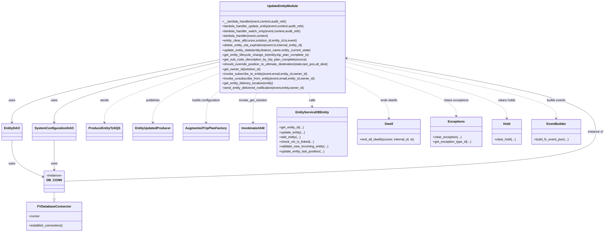

# Diagram: entity_core/entity_service/entity_service/entity/entity/update_entity.py


> Auto-generated by Obscura crawlers

## Diagram 1



### SVG

<svg id="container" width="2985.7578125" xmlns="http://www.w3.org/2000/svg" class="classDiagram" height="1174" viewBox="0 0 2985.7578125 1174" role="graphics-document document" aria-roledescription="class"><style>#container{font-family:"trebuchet ms",verdana,arial,sans-serif;font-size:16px;fill:#333;}@keyframes edge-animation-frame{from{stroke-dashoffset:0;}}@keyframes dash{to{stroke-dashoffset:0;}}#container .edge-animation-slow{stroke-dasharray:9,5!important;stroke-dashoffset:900;animation:dash 50s linear infinite;stroke-linecap:round;}#container .edge-animation-fast{stroke-dasharray:9,5!important;stroke-dashoffset:900;animation:dash 20s linear infinite;stroke-linecap:round;}#container .error-icon{fill:#552222;}#container .error-text{fill:#552222;stroke:#552222;}#container .edge-thickness-normal{stroke-width:1px;}#container .edge-thickness-thick{stroke-width:3.5px;}#container .edge-pattern-solid{stroke-dasharray:0;}#container .edge-thickness-invisible{stroke-width:0;fill:none;}#container .edge-pattern-dashed{stroke-dasharray:3;}#container .edge-pattern-dotted{stroke-dasharray:2;}#container .marker{fill:#333333;stroke:#333333;}#container .marker.cross{stroke:#333333;}#container svg{font-family:"trebuchet ms",verdana,arial,sans-serif;font-size:16px;}#container p{margin:0;}#container g.classGroup text{fill:#9370DB;stroke:none;font-family:"trebuchet ms",verdana,arial,sans-serif;font-size:10px;}#container g.classGroup text .title{font-weight:bolder;}#container .nodeLabel,#container .edgeLabel{color:#131300;}#container .edgeLabel .label rect{fill:#ECECFF;}#container .label text{fill:#131300;}#container .labelBkg{background:#ECECFF;}#container .edgeLabel .label span{background:#ECECFF;}#container .classTitle{font-weight:bolder;}#container .node rect,#container .node circle,#container .node ellipse,#container .node polygon,#container .node path{fill:#ECECFF;stroke:#9370DB;stroke-width:1px;}#container .divider{stroke:#9370DB;stroke-width:1;}#container g.clickable{cursor:pointer;}#container g.classGroup rect{fill:#ECECFF;stroke:#9370DB;}#container g.classGroup line{stroke:#9370DB;stroke-width:1;}#container .classLabel .box{stroke:none;stroke-width:0;fill:#ECECFF;opacity:0.5;}#container .classLabel .label{fill:#9370DB;font-size:10px;}#container .relation{stroke:#333333;stroke-width:1;fill:none;}#container .dashed-line{stroke-dasharray:3;}#container .dotted-line{stroke-dasharray:1 2;}#container #compositionStart,#container .composition{fill:#333333!important;stroke:#333333!important;stroke-width:1;}#container #compositionEnd,#container .composition{fill:#333333!important;stroke:#333333!important;stroke-width:1;}#container #dependencyStart,#container .dependency{fill:#333333!important;stroke:#333333!important;stroke-width:1;}#container #dependencyStart,#container .dependency{fill:#333333!important;stroke:#333333!important;stroke-width:1;}#container #extensionStart,#container .extension{fill:transparent!important;stroke:#333333!important;stroke-width:1;}#container #extensionEnd,#container .extension{fill:transparent!important;stroke:#333333!important;stroke-width:1;}#container #aggregationStart,#container .aggregation{fill:transparent!important;stroke:#333333!important;stroke-width:1;}#container #aggregationEnd,#container .aggregation{fill:transparent!important;stroke:#333333!important;stroke-width:1;}#container #lollipopStart,#container .lollipop{fill:#ECECFF!important;stroke:#333333!important;stroke-width:1;}#container #lollipopEnd,#container .lollipop{fill:#ECECFF!important;stroke:#333333!important;stroke-width:1;}#container .edgeTerminals{font-size:11px;line-height:initial;}#container .classTitleText{text-anchor:middle;font-size:18px;fill:#333;}#container .label-icon{display:inline-block;height:1em;overflow:visible;vertical-align:-0.125em;}#container .node .label-icon path{fill:currentColor;stroke:revert;stroke-width:revert;}#container :root{--mermaid-font-family:"trebuchet ms",verdana,arial,sans-serif;}</style><g><defs><marker id="container_class-aggregationStart" class="marker aggregation class" refX="18" refY="7" markerWidth="190" markerHeight="240" orient="auto"><path d="M 18,7 L9,13 L1,7 L9,1 Z"></path></marker></defs><defs><marker id="container_class-aggregationEnd" class="marker aggregation class" refX="1" refY="7" markerWidth="20" markerHeight="28" orient="auto"><path d="M 18,7 L9,13 L1,7 L9,1 Z"></path></marker></defs><defs><marker id="container_class-extensionStart" class="marker extension class" refX="18" refY="7" markerWidth="190" markerHeight="240" orient="auto"><path d="M 1,7 L18,13 V 1 Z"></path></marker></defs><defs><marker id="container_class-extensionEnd" class="marker extension class" refX="1" refY="7" markerWidth="20" markerHeight="28" orient="auto"><path d="M 1,1 V 13 L18,7 Z"></path></marker></defs><defs><marker id="container_class-compositionStart" class="marker composition class" refX="18" refY="7" markerWidth="190" markerHeight="240" orient="auto"><path d="M 18,7 L9,13 L1,7 L9,1 Z"></path></marker></defs><defs><marker id="container_class-compositionEnd" class="marker composition class" refX="1" refY="7" markerWidth="20" markerHeight="28" orient="auto"><path d="M 18,7 L9,13 L1,7 L9,1 Z"></path></marker></defs><defs><marker id="container_class-dependencyStart" class="marker dependency class" refX="6" refY="7" markerWidth="190" markerHeight="240" orient="auto"><path d="M 5,7 L9,13 L1,7 L9,1 Z"></path></marker></defs><defs><marker id="container_class-dependencyEnd" class="marker dependency class" refX="13" refY="7" markerWidth="20" markerHeight="28" orient="auto"><path d="M 18,7 L9,13 L14,7 L9,1 Z"></path></marker></defs><defs><marker id="container_class-lollipopStart" class="marker lollipop class" refX="13" refY="7" markerWidth="190" markerHeight="240" orient="auto"><circle stroke="black" fill="transparent" cx="7" cy="7" r="6"></circle></marker></defs><defs><marker id="container_class-lollipopEnd" class="marker lollipop class" refX="1" refY="7" markerWidth="190" markerHeight="240" orient="auto"><circle stroke="black" fill="transparent" cx="7" cy="7" r="6"></circle></marker></defs><g class="root"><g class="clusters"></g><g class="edgePaths"><path d="M1040.016,305.559L876.109,339.132C712.203,372.706,384.391,439.853,220.484,492.093C56.578,544.333,56.578,581.667,56.578,600.333L56.578,619" id="id_UpdateEntityModule_EntityDAO_1" class="edge-thickness-normal edge-pattern-solid relation" style=";;;" data-edge="true" data-et="edge" data-id="id_UpdateEntityModule_EntityDAO_1" data-points="W3sieCI6MTA0MC4wMTU2MjUsInkiOjMwNS41NTg5Mjc1ODUxMjU5fSx7IngiOjU2LjU3ODEyNSwieSI6NTA3fSx7IngiOjU2LjU3ODEyNSwieSI6NjI1fV0=" marker-end="url(#container_class-dependencyEnd)"></path><path d="M1040.016,317.697L909.742,349.247C779.469,380.798,518.922,443.899,388.648,494.116C258.375,544.333,258.375,581.667,258.375,600.333L258.375,619" id="id_UpdateEntityModule_SystemConfigurationDAO_2" class="edge-thickness-normal edge-pattern-solid relation" style=";;;" data-edge="true" data-et="edge" data-id="id_UpdateEntityModule_SystemConfigurationDAO_2" data-points="W3sieCI6MTA0MC4wMTU2MjUsInkiOjMxNy42OTY2NDgyNTE3NjA2fSx7IngiOjI1OC4zNzUsInkiOjUwN30seyJ4IjoyNTguMzc1LCJ5Ijo2MjV9XQ==" marker-end="url(#container_class-dependencyEnd)"></path><path d="M1040.016,339.43L949.654,367.358C859.292,395.287,678.568,451.143,588.206,497.738C497.844,544.333,497.844,581.667,497.844,600.333L497.844,619" id="id_UpdateEntityModule_ProduceEntityToSQS_3" class="edge-thickness-normal edge-pattern-dashed relation" style=";;;" data-edge="true" data-et="edge" data-id="id_UpdateEntityModule_ProduceEntityToSQS_3" data-points="W3sieCI6MTA0MC4wMTU2MjUsInkiOjMzOS40MzAxMjY5MDI3NTI5M30seyJ4Ijo0OTcuODQzNzUsInkiOjUwN30seyJ4Ijo0OTcuODQzNzUsInkiOjYyNX1d" marker-end="url(#container_class-dependencyEnd)"></path><path d="M1040.016,376.509L988.622,398.257C937.229,420.006,834.443,463.503,783.049,503.918C731.656,544.333,731.656,581.667,731.656,600.333L731.656,619" id="id_UpdateEntityModule_EntityUpdatedProducer_4" class="edge-thickness-normal edge-pattern-dashed relation" style=";;;" data-edge="true" data-et="edge" data-id="id_UpdateEntityModule_EntityUpdatedProducer_4" data-points="W3sieCI6MTA0MC4wMTU2MjUsInkiOjM3Ni41MDg1ODkwNTE2NTc3fSx7IngiOjczMS42NTYyNSwieSI6NTA3fSx7IngiOjczMS42NTYyNSwieSI6NjI1fV0=" marker-end="url(#container_class-dependencyEnd)"></path><path d="M1041.639,470L1033.007,476.167C1024.376,482.333,1007.114,494.667,998.483,519.5C989.852,544.333,989.852,581.667,989.852,600.333L989.852,619" id="id_UpdateEntityModule_AugmentedTripPlanFactory_5" class="edge-thickness-normal edge-pattern-dashed relation" style=";;;" data-edge="true" data-et="edge" data-id="id_UpdateEntityModule_AugmentedTripPlanFactory_5" data-points="W3sieCI6MTA0MS42Mzg1MTE1NDM4NDM0LCJ5Ijo0NzB9LHsieCI6OTg5Ljg1MTU2MjUsInkiOjUwN30seyJ4Ijo5ODkuODUxNTYyNSwieSI6NjI1fV0=" marker-end="url(#container_class-dependencyEnd)"></path><path d="M1238.255,470L1234.873,476.167C1231.49,482.333,1224.726,494.667,1221.343,519.5C1217.961,544.333,1217.961,581.667,1217.961,600.333L1217.961,619" id="id_UpdateEntityModule_InvokinatorIAM_6" class="edge-thickness-normal edge-pattern-dashed relation" style=";;;" data-edge="true" data-et="edge" data-id="id_UpdateEntityModule_InvokinatorIAM_6" data-points="W3sieCI6MTIzOC4yNTUxNzQzMjM2OTQsInkiOjQ3MH0seyJ4IjoxMjE3Ljk2MDkzNzUsInkiOjUwN30seyJ4IjoxMjE3Ljk2MDkzNzUsInkiOjYyNX1d" marker-end="url(#container_class-dependencyEnd)"></path><path d="M1491.659,470L1495.041,476.167C1498.424,482.333,1505.188,494.667,1508.571,506C1511.953,517.333,1511.953,527.667,1511.953,532.833L1511.953,538" id="id_UpdateEntityModule_EntityServiceDBEntity_7" class="edge-thickness-normal edge-pattern-dashed relation" style=";;;" data-edge="true" data-et="edge" data-id="id_UpdateEntityModule_EntityServiceDBEntity_7" data-points="W3sieCI6MTQ5MS42NTg4ODgxNzYzMDYsInkiOjQ3MH0seyJ4IjoxNTExLjk1MzEyNSwieSI6NTA3fSx7IngiOjE1MTEuOTUzMTI1LCJ5Ijo1NDR9XQ==" marker-end="url(#container_class-dependencyEnd)"></path><path d="M1689.898,401.602L1725.003,419.169C1760.107,436.735,1830.315,471.867,1865.419,504.6C1900.523,537.333,1900.523,567.667,1900.523,582.833L1900.523,598" id="id_UpdateEntityModule_Dwell_8" class="edge-thickness-normal edge-pattern-dashed relation" style=";;;" data-edge="true" data-et="edge" data-id="id_UpdateEntityModule_Dwell_8" data-points="W3sieCI6MTY4OS44OTg0Mzc1LCJ5Ijo0MDEuNjAyMjM5MTU5NzY4MDN9LHsieCI6MTkwMC41MjM0Mzc1LCJ5Ijo1MDd9LHsieCI6MTkwMC41MjM0Mzc1LCJ5Ijo2MDR9XQ==" marker-end="url(#container_class-dependencyEnd)"></path><path d="M1689.898,338.419L1781.73,366.516C1873.563,394.613,2057.227,450.806,2149.059,492.07C2240.891,533.333,2240.891,559.667,2240.891,572.833L2240.891,586" id="id_UpdateEntityModule_Exceptions_9" class="edge-thickness-normal edge-pattern-dashed relation" style=";;;" data-edge="true" data-et="edge" data-id="id_UpdateEntityModule_Exceptions_9" data-points="W3sieCI6MTY4OS44OTg0Mzc1LCJ5IjozMzguNDE4ODM0MzY4Njg3fSx7IngiOjIyNDAuODkwNjI1LCJ5Ijo1MDd9LHsieCI6MjI0MC44OTA2MjUsInkiOjU5Mn1d" marker-end="url(#container_class-dependencyEnd)"></path><path d="M1689.898,316.232L1823.671,348.026C1957.443,379.821,2224.987,443.411,2358.759,490.372C2492.531,537.333,2492.531,567.667,2492.531,582.833L2492.531,598" id="id_UpdateEntityModule_Hold_10" class="edge-thickness-normal edge-pattern-dashed relation" style=";;;" data-edge="true" data-et="edge" data-id="id_UpdateEntityModule_Hold_10" data-points="W3sieCI6MTY4OS44OTg0Mzc1LCJ5IjozMTYuMjMxNTQzMTAxMDI5M30seyJ4IjoyNDkyLjUzMTI1LCJ5Ijo1MDd9LHsieCI6MjQ5Mi41MzEyNSwieSI6NjA0fV0=" marker-end="url(#container_class-dependencyEnd)"></path><path d="M1689.898,302.366L1864.791,336.472C2039.684,370.578,2389.469,438.789,2564.361,488.061C2739.254,537.333,2739.254,567.667,2739.254,582.833L2739.254,598" id="id_UpdateEntityModule_EventBuilder_11" class="edge-thickness-normal edge-pattern-dashed relation" style=";;;" data-edge="true" data-et="edge" data-id="id_UpdateEntityModule_EventBuilder_11" data-points="W3sieCI6MTY4OS44OTg0Mzc1LCJ5IjozMDIuMzY2NDM3MzgyNzUyNTd9LHsieCI6MjczOS4yNTM5MDYyNSwieSI6NTA3fSx7IngiOjI3MzkuMjUzOTA2MjUsInkiOjYwNH1d" marker-end="url(#container_class-dependencyEnd)"></path><path d="M258.375,972L258.375,976.167C258.375,980.333,258.375,988.667,258.375,994.125C258.375,999.583,258.375,1002.167,258.375,1003.458L258.375,1004.75" id="id_DB_CONN_FVDatabaseConnector_12" class="edge-thickness-normal edge-pattern-solid relation" style=";;;" data-edge="true" data-et="edge" data-id="id_DB_CONN_FVDatabaseConnector_12" data-points="W3sieCI6MjU4LjM3NSwieSI6OTcyfSx7IngiOjI1OC4zNzUsInkiOjk5N30seyJ4IjoyNTguMzc1LCJ5IjoxMDIyfV0=" marker-end="url(#container_class-extensionEnd)"></path><path d="M309.922,916.249L747.885,901.374C1185.849,886.5,2061.776,856.75,2499.74,815.208C2937.703,773.667,2937.703,720.333,2937.703,667C2937.703,613.667,2937.703,560.333,2730.721,498.396C2523.74,436.46,2109.776,365.919,1902.795,330.649L1695.813,295.379" id="id_DB_CONN_UpdateEntityModule_13" class="edge-thickness-normal edge-pattern-solid relation" style=";;;" data-edge="true" data-et="edge" data-id="id_DB_CONN_UpdateEntityModule_13" data-points="W3sieCI6MzA5LjkyMTg3NSwieSI6OTE2LjI0OTI3NTQxMzAyOTJ9LHsieCI6MjkzNy43MDMxMjUsInkiOjgyN30seyJ4IjoyOTM3LjcwMzEyNSwieSI6NjY3fSx7IngiOjI5MzcuNzAzMTI1LCJ5Ijo1MDd9LHsieCI6MTY4OS44OTg0Mzc1LCJ5IjoyOTQuMzcwODU1NjE0MzA5MTZ9XQ==" marker-end="url(#container_class-dependencyEnd)"></path><path d="M56.578,709L56.578,728.667C56.578,748.333,56.578,787.667,80.708,818.215C104.838,848.763,153.098,870.526,177.228,881.407L201.359,892.289" id="id_EntityDAO_DB_CONN_14" class="edge-thickness-normal edge-pattern-solid relation" style=";;;" data-edge="true" data-et="edge" data-id="id_EntityDAO_DB_CONN_14" data-points="W3sieCI6NTYuNTc4MTI1LCJ5Ijo3MDl9LHsieCI6NTYuNTc4MTI1LCJ5Ijo4Mjd9LHsieCI6MjA2LjgyODEyNSwieSI6ODk0Ljc1NTAxMzU1MDEzNTV9XQ==" marker-end="url(#container_class-dependencyEnd)"></path><path d="M258.375,709L258.375,728.667C258.375,748.333,258.375,787.667,258.375,812.5C258.375,837.333,258.375,847.667,258.375,852.833L258.375,858" id="id_SystemConfigurationDAO_DB_CONN_15" class="edge-thickness-normal edge-pattern-solid relation" style=";;;" data-edge="true" data-et="edge" data-id="id_SystemConfigurationDAO_DB_CONN_15" data-points="W3sieCI6MjU4LjM3NSwieSI6NzA5fSx7IngiOjI1OC4zNzUsInkiOjgyN30seyJ4IjoyNTguMzc1LCJ5Ijo4NjR9XQ==" marker-end="url(#container_class-dependencyEnd)"></path></g><g class="edgeLabels"><g class="edgeLabel" transform="translate(56.578125, 507)"><g class="label" data-id="id_UpdateEntityModule_EntityDAO_1" transform="translate(-16.4921875, -12)"><foreignObject width="32.984375" height="24"><div xmlns="http://www.w3.org/1999/xhtml" class="labelBkg" style="display: table-cell; white-space: nowrap; line-height: 1.5; max-width: 200px; text-align: center;"><span class="edgeLabel"><p>uses</p></span></div></foreignObject></g></g><g class="edgeLabel" transform="translate(258.375, 507)"><g class="label" data-id="id_UpdateEntityModule_SystemConfigurationDAO_2" transform="translate(-16.4921875, -12)"><foreignObject width="32.984375" height="24"><div xmlns="http://www.w3.org/1999/xhtml" class="labelBkg" style="display: table-cell; white-space: nowrap; line-height: 1.5; max-width: 200px; text-align: center;"><span class="edgeLabel"><p>uses</p></span></div></foreignObject></g></g><g class="edgeLabel" transform="translate(497.84375, 507)"><g class="label" data-id="id_UpdateEntityModule_ProduceEntityToSQS_3" transform="translate(-21.3046875, -12)"><foreignObject width="42.609375" height="24"><div xmlns="http://www.w3.org/1999/xhtml" class="labelBkg" style="display: table-cell; white-space: nowrap; line-height: 1.5; max-width: 200px; text-align: center;"><span class="edgeLabel"><p>sends</p></span></div></foreignObject></g></g><g class="edgeLabel" transform="translate(731.65625, 507)"><g class="label" data-id="id_UpdateEntityModule_EntityUpdatedProducer_4" transform="translate(-35.28125, -12)"><foreignObject width="70.5625" height="24"><div xmlns="http://www.w3.org/1999/xhtml" class="labelBkg" style="display: table-cell; white-space: nowrap; line-height: 1.5; max-width: 200px; text-align: center;"><span class="edgeLabel"><p>publishes</p></span></div></foreignObject></g></g><g class="edgeLabel" transform="translate(989.8515625, 507)"><g class="label" data-id="id_UpdateEntityModule_AugmentedTripPlanFactory_5" transform="translate(-72.6328125, -12)"><foreignObject width="145.265625" height="24"><div xmlns="http://www.w3.org/1999/xhtml" class="labelBkg" style="display: table-cell; white-space: nowrap; line-height: 1.5; max-width: 200px; text-align: center;"><span class="edgeLabel"><p>builds configuration</p></span></div></foreignObject></g></g><g class="edgeLabel" transform="translate(1217.9609375, 507)"><g class="label" data-id="id_UpdateEntityModule_InvokinatorIAM_6" transform="translate(-73.2734375, -12)"><foreignObject width="146.546875" height="24"><div xmlns="http://www.w3.org/1999/xhtml" class="labelBkg" style="display: table-cell; white-space: nowrap; line-height: 1.5; max-width: 200px; text-align: center;"><span class="edgeLabel"><p>invoke_get_solution</p></span></div></foreignObject></g></g><g class="edgeLabel" transform="translate(1511.953125, 507)"><g class="label" data-id="id_UpdateEntityModule_EntityServiceDBEntity_7" transform="translate(-16.4453125, -12)"><foreignObject width="32.890625" height="24"><div xmlns="http://www.w3.org/1999/xhtml" class="labelBkg" style="display: table-cell; white-space: nowrap; line-height: 1.5; max-width: 200px; text-align: center;"><span class="edgeLabel"><p>calls</p></span></div></foreignObject></g></g><g class="edgeLabel" transform="translate(1900.5234375, 507)"><g class="label" data-id="id_UpdateEntityModule_Dwell_8" transform="translate(-42.9921875, -12)"><foreignObject width="85.984375" height="24"><div xmlns="http://www.w3.org/1999/xhtml" class="labelBkg" style="display: table-cell; white-space: nowrap; line-height: 1.5; max-width: 200px; text-align: center;"><span class="edgeLabel"><p>ends dwells</p></span></div></foreignObject></g></g><g class="edgeLabel" transform="translate(2240.890625, 507)"><g class="label" data-id="id_UpdateEntityModule_Exceptions_9" transform="translate(-62.703125, -12)"><foreignObject width="125.40625" height="24"><div xmlns="http://www.w3.org/1999/xhtml" class="labelBkg" style="display: table-cell; white-space: nowrap; line-height: 1.5; max-width: 200px; text-align: center;"><span class="edgeLabel"><p>clears exceptions</p></span></div></foreignObject></g></g><g class="edgeLabel" transform="translate(2492.53125, 507)"><g class="label" data-id="id_UpdateEntityModule_Hold_10" transform="translate(-43.7734375, -12)"><foreignObject width="87.546875" height="24"><div xmlns="http://www.w3.org/1999/xhtml" class="labelBkg" style="display: table-cell; white-space: nowrap; line-height: 1.5; max-width: 200px; text-align: center;"><span class="edgeLabel"><p>clears holds</p></span></div></foreignObject></g></g><g class="edgeLabel" transform="translate(2739.25390625, 507)"><g class="label" data-id="id_UpdateEntityModule_EventBuilder_11" transform="translate(-48.515625, -12)"><foreignObject width="97.03125" height="24"><div xmlns="http://www.w3.org/1999/xhtml" class="labelBkg" style="display: table-cell; white-space: nowrap; line-height: 1.5; max-width: 200px; text-align: center;"><span class="edgeLabel"><p>builds events</p></span></div></foreignObject></g></g><g class="edgeLabel"><g class="label" data-id="id_DB_CONN_FVDatabaseConnector_12" transform="translate(0, 0)"><foreignObject width="0" height="0"><div xmlns="http://www.w3.org/1999/xhtml" class="labelBkg" style="display: table-cell; white-space: nowrap; line-height: 1.5; max-width: 200px; text-align: center;"><span class="edgeLabel"></span></div></foreignObject></g></g><g class="edgeLabel" transform="translate(2937.703125, 667)"><g class="label" data-id="id_DB_CONN_UpdateEntityModule_13" transform="translate(-40.0546875, -12)"><foreignObject width="80.109375" height="24"><div xmlns="http://www.w3.org/1999/xhtml" class="labelBkg" style="display: table-cell; white-space: nowrap; line-height: 1.5; max-width: 200px; text-align: center;"><span class="edgeLabel"><p>instance of</p></span></div></foreignObject></g></g><g class="edgeLabel" transform="translate(56.578125, 827)"><g class="label" data-id="id_EntityDAO_DB_CONN_14" transform="translate(-16.4921875, -12)"><foreignObject width="32.984375" height="24"><div xmlns="http://www.w3.org/1999/xhtml" class="labelBkg" style="display: table-cell; white-space: nowrap; line-height: 1.5; max-width: 200px; text-align: center;"><span class="edgeLabel"><p>uses</p></span></div></foreignObject></g></g><g class="edgeLabel" transform="translate(258.375, 827)"><g class="label" data-id="id_SystemConfigurationDAO_DB_CONN_15" transform="translate(-16.4921875, -12)"><foreignObject width="32.984375" height="24"><div xmlns="http://www.w3.org/1999/xhtml" class="labelBkg" style="display: table-cell; white-space: nowrap; line-height: 1.5; max-width: 200px; text-align: center;"><span class="edgeLabel"><p>uses</p></span></div></foreignObject></g></g></g><g class="nodes"><g class="node default" id="classId-UpdateEntityModule-0" transform="translate(1364.95703125, 239)"><g class="basic label-container"><path d="M-324.94140625 -231 L324.94140625 -231 L324.94140625 231 L-324.94140625 231" stroke="none" stroke-width="0" fill="#ECECFF" style=""></path><path d="M-324.94140625 -231 C-132.06253357399115 -231, 60.81633910201771 -231, 324.94140625 -231 M-324.94140625 -231 C-179.10079323587124 -231, -33.26018022174247 -231, 324.94140625 -231 M324.94140625 -231 C324.94140625 -72.28365719497481, 324.94140625 86.43268561005038, 324.94140625 231 M324.94140625 -231 C324.94140625 -67.75765538745554, 324.94140625 95.48468922508891, 324.94140625 231 M324.94140625 231 C121.94489221018267 231, -81.05162182963466 231, -324.94140625 231 M324.94140625 231 C186.4906553067864 231, 48.039904363572816 231, -324.94140625 231 M-324.94140625 231 C-324.94140625 134.12944491601, -324.94140625 37.258889832019975, -324.94140625 -231 M-324.94140625 231 C-324.94140625 100.83462721102066, -324.94140625 -29.33074557795868, -324.94140625 -231" stroke="#9370DB" stroke-width="1.3" fill="none" stroke-dasharray="0 0" style=""></path></g><g class="annotation-group text" transform="translate(0, -207)"></g><g class="label-group text" transform="translate(-74.8984375, -207)"><g class="label" style="font-weight: bolder" transform="translate(0,-12)"><foreignObject width="149.796875" height="24"><div xmlns="http://www.w3.org/1999/xhtml" style="display: table-cell; white-space: nowrap; line-height: 1.5; max-width: 198px; text-align: center;"><span class="nodeLabel markdown-node-label" style=""><p>UpdateEntityModule</p></span></div></foreignObject></g></g><g class="members-group text" transform="translate(-312.94140625, -159)"></g><g class="methods-group text" transform="translate(-312.94140625, -129)"><g class="label" style="" transform="translate(0,-12)"><foreignObject width="328.09375" height="24"><div xmlns="http://www.w3.org/1999/xhtml" style="display: table-cell; white-space: nowrap; line-height: 1.5; max-width: 385px; text-align: center;"><span class="nodeLabel markdown-node-label" style=""><p>+__lambda_handler(event,context,audit_refs)</p></span></div></foreignObject></g><g class="label" style="" transform="translate(0,12)"><foreignObject width="420.75" height="24"><div xmlns="http://www.w3.org/1999/xhtml" style="display: table-cell; white-space: nowrap; line-height: 1.5; max-width: 478px; text-align: center;"><span class="nodeLabel markdown-node-label" style=""><p>+lambda_handler_update_entity(event,context,audit_refs)</p></span></div></foreignObject></g><g class="label" style="" transform="translate(0,36)"><foreignObject width="401.4375" height="24"><div xmlns="http://www.w3.org/1999/xhtml" style="display: table-cell; white-space: nowrap; line-height: 1.5; max-width: 459px; text-align: center;"><span class="nodeLabel markdown-node-label" style=""><p>+lambda_handler_watch_only(event,context,audit_refs)</p></span></div></foreignObject></g><g class="label" style="" transform="translate(0,60)"><foreignObject width="235.78125" height="24"><div xmlns="http://www.w3.org/1999/xhtml" style="display: table-cell; white-space: nowrap; line-height: 1.5; max-width: 293px; text-align: center;"><span class="nodeLabel markdown-node-label" style=""><p>+lambda_handler(event,context)</p></span></div></foreignObject></g><g class="label" style="" transform="translate(0,84)"><foreignObject width="386.921875" height="24"><div xmlns="http://www.w3.org/1999/xhtml" style="display: table-cell; white-space: nowrap; line-height: 1.5; max-width: 444px; text-align: center;"><span class="nodeLabel markdown-node-label" style=""><p>+entity_clear_all(cursor,solution_id,entity_id,ts,event)</p></span></div></foreignObject></g><g class="label" style="" transform="translate(0,108)"><foreignObject width="415.796875" height="24"><div xmlns="http://www.w3.org/1999/xhtml" style="display: table-cell; white-space: nowrap; line-height: 1.5; max-width: 473px; text-align: center;"><span class="nodeLabel markdown-node-label" style=""><p>+delete_entity_eta_expiration(event,ts,internal_entity_id)</p></span></div></foreignObject></g><g class="label" style="" transform="translate(0,132)"><foreignObject width="458.625" height="24"><div xmlns="http://www.w3.org/1999/xhtml" style="display: table-cell; white-space: nowrap; line-height: 1.5; max-width: 516px; text-align: center;"><span class="nodeLabel markdown-node-label" style=""><p>+update_entity_state(entity,feature_name,entity_current_state)</p></span></div></foreignObject></g><g class="label" style="" transform="translate(0,156)"><foreignObject width="445.828125" height="24"><div xmlns="http://www.w3.org/1999/xhtml" style="display: table-cell; white-space: nowrap; line-height: 1.5; max-width: 503px; text-align: center;"><span class="nodeLabel markdown-node-label" style=""><p>+get_entity_lifecycle_change_ts(entity,trip_plan_complete_ts)</p></span></div></foreignObject></g><g class="label" style="" transform="translate(0,180)"><foreignObject width="431.109375" height="24"><div xmlns="http://www.w3.org/1999/xhtml" style="display: table-cell; white-space: nowrap; line-height: 1.5; max-width: 488px; text-align: center;"><span class="nodeLabel markdown-node-label" style=""><p>+get_sub_code_description_by_trip_plan_complete(source)</p></span></div></foreignObject></g><g class="label" style="" transform="translate(0,204)"><foreignObject width="550.984375" height="24"><div xmlns="http://www.w3.org/1999/xhtml" style="display: table-cell; white-space: nowrap; line-height: 1.5; max-width: 608px; text-align: center;"><span class="nodeLabel markdown-node-label" style=""><p>+should_override_position_to_ultimate_destination(state,last_pos,ult_dest)</p></span></div></foreignObject></g><g class="label" style="" transform="translate(0,228)"><foreignObject width="197.359375" height="24"><div xmlns="http://www.w3.org/1999/xhtml" style="display: table-cell; white-space: nowrap; line-height: 1.5; max-width: 255px; text-align: center;"><span class="nodeLabel markdown-node-label" style=""><p>+get_owner_id(solution_id)</p></span></div></foreignObject></g><g class="label" style="" transform="translate(0,252)"><foreignObject width="438.484375" height="24"><div xmlns="http://www.w3.org/1999/xhtml" style="display: table-cell; white-space: nowrap; line-height: 1.5; max-width: 496px; text-align: center;"><span class="nodeLabel markdown-node-label" style=""><p>+invoke_subscribe_to_entity(event,email,entity_id,owner_id)</p></span></div></foreignObject></g><g class="label" style="" transform="translate(0,276)"><foreignObject width="476.40625" height="24"><div xmlns="http://www.w3.org/1999/xhtml" style="display: table-cell; white-space: nowrap; line-height: 1.5; max-width: 534px; text-align: center;"><span class="nodeLabel markdown-node-label" style=""><p>+invoke_unsubscribe_from_entity(event,email,entity_id,owner_id)</p></span></div></foreignObject></g><g class="label" style="" transform="translate(0,300)"><foreignObject width="265.234375" height="24"><div xmlns="http://www.w3.org/1999/xhtml" style="display: table-cell; white-space: nowrap; line-height: 1.5; max-width: 323px; text-align: center;"><span class="nodeLabel markdown-node-label" style=""><p>+get_entity_delivery_location(entity)</p></span></div></foreignObject></g><g class="label" style="" transform="translate(0,324)"><foreignObject width="425.984375" height="24"><div xmlns="http://www.w3.org/1999/xhtml" style="display: table-cell; white-space: nowrap; line-height: 1.5; max-width: 483px; text-align: center;"><span class="nodeLabel markdown-node-label" style=""><p>+send_entity_delivered_notification(event,entity,owner_id)</p></span></div></foreignObject></g></g><g class="divider" style=""><path d="M-324.94140625 -183 C-143.44512300588417 -183, 38.05116023823166 -183, 324.94140625 -183 M-324.94140625 -183 C-103.41169348229246 -183, 118.11801928541507 -183, 324.94140625 -183" stroke="#9370DB" stroke-width="1.3" fill="none" stroke-dasharray="0 0" style=""></path></g><g class="divider" style=""><path d="M-324.94140625 -159 C-132.69775457948805 -159, 59.5458970910239 -159, 324.94140625 -159 M-324.94140625 -159 C-154.174424070182 -159, 16.592558109636002 -159, 324.94140625 -159" stroke="#9370DB" stroke-width="1.3" fill="none" stroke-dasharray="0 0" style=""></path></g></g><g class="node default" id="classId-FVDatabaseConnector-1" transform="translate(258.375, 1094)"><g class="basic label-container"><path d="M-138.65625 -72 L138.65625 -72 L138.65625 72 L-138.65625 72" stroke="none" stroke-width="0" fill="#ECECFF" style=""></path><path d="M-138.65625 -72 C-58.32676548944916 -72, 22.002719021101683 -72, 138.65625 -72 M-138.65625 -72 C-28.36793609674504 -72, 81.92037780650992 -72, 138.65625 -72 M138.65625 -72 C138.65625 -16.849560497656526, 138.65625 38.30087900468695, 138.65625 72 M138.65625 -72 C138.65625 -24.941566627102205, 138.65625 22.11686674579559, 138.65625 72 M138.65625 72 C45.962119207445554 72, -46.73201158510889 72, -138.65625 72 M138.65625 72 C69.80038785550336 72, 0.9445257110067189 72, -138.65625 72 M-138.65625 72 C-138.65625 40.369133631982564, -138.65625 8.738267263965128, -138.65625 -72 M-138.65625 72 C-138.65625 33.559384690125384, -138.65625 -4.881230619749232, -138.65625 -72" stroke="#9370DB" stroke-width="1.3" fill="none" stroke-dasharray="0 0" style=""></path></g><g class="annotation-group text" transform="translate(0, -48)"></g><g class="label-group text" transform="translate(-80.046875, -48)"><g class="label" style="font-weight: bolder" transform="translate(0,-12)"><foreignObject width="160.09375" height="24"><div xmlns="http://www.w3.org/1999/xhtml" style="display: table-cell; white-space: nowrap; line-height: 1.5; max-width: 209px; text-align: center;"><span class="nodeLabel markdown-node-label" style=""><p>FVDatabaseConnector</p></span></div></foreignObject></g></g><g class="members-group text" transform="translate(-126.65625, 0)"><g class="label" style="" transform="translate(0,-12)"><foreignObject width="53.71875" height="24"><div xmlns="http://www.w3.org/1999/xhtml" style="display: table-cell; white-space: nowrap; line-height: 1.5; max-width: 112px; text-align: center;"><span class="nodeLabel markdown-node-label" style=""><p>+cursor</p></span></div></foreignObject></g></g><g class="methods-group text" transform="translate(-126.65625, 48)"><g class="label" style="" transform="translate(0,-12)"><foreignObject width="173.265625" height="24"><div xmlns="http://www.w3.org/1999/xhtml" style="display: table-cell; white-space: nowrap; line-height: 1.5; max-width: 231px; text-align: center;"><span class="nodeLabel markdown-node-label" style=""><p>+establish_connection()</p></span></div></foreignObject></g></g><g class="divider" style=""><path d="M-138.65625 -24 C-41.687191051867146 -24, 55.28186789626571 -24, 138.65625 -24 M-138.65625 -24 C-50.03835943936777 -24, 38.579531121264466 -24, 138.65625 -24" stroke="#9370DB" stroke-width="1.3" fill="none" stroke-dasharray="0 0" style=""></path></g><g class="divider" style=""><path d="M-138.65625 24 C-50.00015639272901 24, 38.65593721454198 24, 138.65625 24 M-138.65625 24 C-54.96028907696288 24, 28.73567184607424 24, 138.65625 24" stroke="#9370DB" stroke-width="1.3" fill="none" stroke-dasharray="0 0" style=""></path></g></g><g class="node default" id="classId-DB_CONN-2" transform="translate(258.375, 918)"><g class="basic label-container"><path d="M-51.546875 -54 L51.546875 -54 L51.546875 54 L-51.546875 54" stroke="none" stroke-width="0" fill="#ECECFF" style=""></path><path d="M-51.546875 -54 C-28.03279203102674 -54, -4.518709062053482 -54, 51.546875 -54 M-51.546875 -54 C-20.067796741231568 -54, 11.411281517536864 -54, 51.546875 -54 M51.546875 -54 C51.546875 -20.092651300871047, 51.546875 13.814697398257906, 51.546875 54 M51.546875 -54 C51.546875 -21.292153798747357, 51.546875 11.415692402505286, 51.546875 54 M51.546875 54 C24.691515728332742 54, -2.163843543334515 54, -51.546875 54 M51.546875 54 C27.87296550795346 54, 4.199056015906919 54, -51.546875 54 M-51.546875 54 C-51.546875 29.769035459992118, -51.546875 5.538070919984236, -51.546875 -54 M-51.546875 54 C-51.546875 23.17456787243753, -51.546875 -7.650864255124937, -51.546875 -54" stroke="#9370DB" stroke-width="1.3" fill="none" stroke-dasharray="0 0" style=""></path></g><g class="annotation-group text" transform="translate(-39.546875, -30)"><g class="label" style="" transform="translate(0,-12)"><foreignObject width="79.09375" height="24"><div xmlns="http://www.w3.org/1999/xhtml" style="display: table-cell; white-space: nowrap; line-height: 1.5; max-width: 129px; text-align: center;"><span class="nodeLabel markdown-node-label" style=""><p>«instance»</p></span></div></foreignObject></g></g><g class="label-group text" transform="translate(-34.40625, -6)"><g class="label" style="font-weight: bolder" transform="translate(0,-12)"><foreignObject width="68.8125" height="24"><div xmlns="http://www.w3.org/1999/xhtml" style="display: table-cell; white-space: nowrap; line-height: 1.5; max-width: 119px; text-align: center;"><span class="nodeLabel markdown-node-label" style=""><p>DB_CONN</p></span></div></foreignObject></g></g><g class="members-group text" transform="translate(-39.546875, 42)"></g><g class="methods-group text" transform="translate(-39.546875, 72)"></g><g class="divider" style=""><path d="M-51.546875 18 C-28.71479337647942 18, -5.882711752958841 18, 51.546875 18 M-51.546875 18 C-25.642188392217832 18, 0.26249821556433517 18, 51.546875 18" stroke="#9370DB" stroke-width="1.3" fill="none" stroke-dasharray="0 0" style=""></path></g><g class="divider" style=""><path d="M-51.546875 36 C-25.623564957483858 36, 0.2997450850322849 36, 51.546875 36 M-51.546875 36 C-24.625953386105156 36, 2.2949682277896883 36, 51.546875 36" stroke="#9370DB" stroke-width="1.3" fill="none" stroke-dasharray="0 0" style=""></path></g></g><g class="node default" id="classId-EntityDAO-3" transform="translate(56.578125, 667)"><g class="basic label-container"><path d="M-48.578125 -42 L48.578125 -42 L48.578125 42 L-48.578125 42" stroke="none" stroke-width="0" fill="#ECECFF" style=""></path><path d="M-48.578125 -42 C-19.5490763482205 -42, 9.479972303559002 -42, 48.578125 -42 M-48.578125 -42 C-25.559433327240846 -42, -2.5407416544816925 -42, 48.578125 -42 M48.578125 -42 C48.578125 -11.593708640080681, 48.578125 18.812582719838638, 48.578125 42 M48.578125 -42 C48.578125 -12.128875484558897, 48.578125 17.742249030882206, 48.578125 42 M48.578125 42 C21.136790017874745 42, -6.3045449642505105 42, -48.578125 42 M48.578125 42 C21.629548975802155 42, -5.319027048395689 42, -48.578125 42 M-48.578125 42 C-48.578125 12.593246672369869, -48.578125 -16.813506655260262, -48.578125 -42 M-48.578125 42 C-48.578125 13.272752225002296, -48.578125 -15.454495549995407, -48.578125 -42" stroke="#9370DB" stroke-width="1.3" fill="none" stroke-dasharray="0 0" style=""></path></g><g class="annotation-group text" transform="translate(0, -18)"></g><g class="label-group text" transform="translate(-36.578125, -18)"><g class="label" style="font-weight: bolder" transform="translate(0,-12)"><foreignObject width="73.15625" height="24"><div xmlns="http://www.w3.org/1999/xhtml" style="display: table-cell; white-space: nowrap; line-height: 1.5; max-width: 122px; text-align: center;"><span class="nodeLabel markdown-node-label" style=""><p>EntityDAO</p></span></div></foreignObject></g></g><g class="members-group text" transform="translate(-36.578125, 30)"></g><g class="methods-group text" transform="translate(-36.578125, 60)"></g><g class="divider" style=""><path d="M-48.578125 6 C-15.043019146399104 6, 18.492086707201793 6, 48.578125 6 M-48.578125 6 C-20.980046177835987 6, 6.618032644328025 6, 48.578125 6" stroke="#9370DB" stroke-width="1.3" fill="none" stroke-dasharray="0 0" style=""></path></g><g class="divider" style=""><path d="M-48.578125 24 C-20.369259724488472 24, 7.839605551023055 24, 48.578125 24 M-48.578125 24 C-24.635217943400928 24, -0.6923108868018559 24, 48.578125 24" stroke="#9370DB" stroke-width="1.3" fill="none" stroke-dasharray="0 0" style=""></path></g></g><g class="node default" id="classId-SystemConfigurationDAO-4" transform="translate(258.375, 667)"><g class="basic label-container"><path d="M-103.21875 -42 L103.21875 -42 L103.21875 42 L-103.21875 42" stroke="none" stroke-width="0" fill="#ECECFF" style=""></path><path d="M-103.21875 -42 C-42.26152007058414 -42, 18.69570985883172 -42, 103.21875 -42 M-103.21875 -42 C-61.70144062246491 -42, -20.184131244929816 -42, 103.21875 -42 M103.21875 -42 C103.21875 -21.332855100160554, 103.21875 -0.665710200321108, 103.21875 42 M103.21875 -42 C103.21875 -23.11604553918786, 103.21875 -4.232091078375717, 103.21875 42 M103.21875 42 C34.30051329993671 42, -34.61772340012658 42, -103.21875 42 M103.21875 42 C60.39966681854201 42, 17.58058363708402 42, -103.21875 42 M-103.21875 42 C-103.21875 16.976612118156332, -103.21875 -8.046775763687336, -103.21875 -42 M-103.21875 42 C-103.21875 10.129082678594944, -103.21875 -21.74183464281011, -103.21875 -42" stroke="#9370DB" stroke-width="1.3" fill="none" stroke-dasharray="0 0" style=""></path></g><g class="annotation-group text" transform="translate(0, -18)"></g><g class="label-group text" transform="translate(-91.21875, -18)"><g class="label" style="font-weight: bolder" transform="translate(0,-12)"><foreignObject width="182.4375" height="24"><div xmlns="http://www.w3.org/1999/xhtml" style="display: table-cell; white-space: nowrap; line-height: 1.5; max-width: 229px; text-align: center;"><span class="nodeLabel markdown-node-label" style=""><p>SystemConfigurationDAO</p></span></div></foreignObject></g></g><g class="members-group text" transform="translate(-91.21875, 30)"></g><g class="methods-group text" transform="translate(-91.21875, 60)"></g><g class="divider" style=""><path d="M-103.21875 6 C-24.698885340019615 6, 53.82097931996077 6, 103.21875 6 M-103.21875 6 C-55.83820190616928 6, -8.457653812338563 6, 103.21875 6" stroke="#9370DB" stroke-width="1.3" fill="none" stroke-dasharray="0 0" style=""></path></g><g class="divider" style=""><path d="M-103.21875 24 C-60.69653631964965 24, -18.174322639299305 24, 103.21875 24 M-103.21875 24 C-38.13101023878416 24, 26.956729522431687 24, 103.21875 24" stroke="#9370DB" stroke-width="1.3" fill="none" stroke-dasharray="0 0" style=""></path></g></g><g class="node default" id="classId-ProduceEntityToSQS-5" transform="translate(497.84375, 667)"><g class="basic label-container"><path d="M-86.25 -42 L86.25 -42 L86.25 42 L-86.25 42" stroke="none" stroke-width="0" fill="#ECECFF" style=""></path><path d="M-86.25 -42 C-47.081068741345184 -42, -7.912137482690369 -42, 86.25 -42 M-86.25 -42 C-17.44277181835899 -42, 51.36445636328202 -42, 86.25 -42 M86.25 -42 C86.25 -13.370770645549786, 86.25 15.258458708900427, 86.25 42 M86.25 -42 C86.25 -10.386405473271683, 86.25 21.227189053456634, 86.25 42 M86.25 42 C17.74595731485263 42, -50.75808537029474 42, -86.25 42 M86.25 42 C51.67208781440566 42, 17.094175628811314 42, -86.25 42 M-86.25 42 C-86.25 13.047369641670208, -86.25 -15.905260716659583, -86.25 -42 M-86.25 42 C-86.25 17.370249160444093, -86.25 -7.259501679111814, -86.25 -42" stroke="#9370DB" stroke-width="1.3" fill="none" stroke-dasharray="0 0" style=""></path></g><g class="annotation-group text" transform="translate(0, -18)"></g><g class="label-group text" transform="translate(-74.25, -18)"><g class="label" style="font-weight: bolder" transform="translate(0,-12)"><foreignObject width="148.5" height="24"><div xmlns="http://www.w3.org/1999/xhtml" style="display: table-cell; white-space: nowrap; line-height: 1.5; max-width: 196px; text-align: center;"><span class="nodeLabel markdown-node-label" style=""><p>ProduceEntityToSQS</p></span></div></foreignObject></g></g><g class="members-group text" transform="translate(-74.25, 30)"></g><g class="methods-group text" transform="translate(-74.25, 60)"></g><g class="divider" style=""><path d="M-86.25 6 C-40.75309278952429 6, 4.7438144209514235 6, 86.25 6 M-86.25 6 C-51.50847672457882 6, -16.76695344915764 6, 86.25 6" stroke="#9370DB" stroke-width="1.3" fill="none" stroke-dasharray="0 0" style=""></path></g><g class="divider" style=""><path d="M-86.25 24 C-40.66122957549132 24, 4.927540849017362 24, 86.25 24 M-86.25 24 C-30.15547651360083 24, 25.939046972798337 24, 86.25 24" stroke="#9370DB" stroke-width="1.3" fill="none" stroke-dasharray="0 0" style=""></path></g></g><g class="node default" id="classId-EntityUpdatedProducer-6" transform="translate(731.65625, 667)"><g class="basic label-container"><path d="M-97.5625 -42 L97.5625 -42 L97.5625 42 L-97.5625 42" stroke="none" stroke-width="0" fill="#ECECFF" style=""></path><path d="M-97.5625 -42 C-34.06468393687217 -42, 29.433132126255657 -42, 97.5625 -42 M-97.5625 -42 C-23.529847224877514 -42, 50.50280555024497 -42, 97.5625 -42 M97.5625 -42 C97.5625 -20.66931845251863, 97.5625 0.6613630949627378, 97.5625 42 M97.5625 -42 C97.5625 -23.63267082597898, 97.5625 -5.265341651957961, 97.5625 42 M97.5625 42 C20.655140322497417 42, -56.25221935500517 42, -97.5625 42 M97.5625 42 C21.400527270553695 42, -54.76144545889261 42, -97.5625 42 M-97.5625 42 C-97.5625 20.58680058051789, -97.5625 -0.8263988389642165, -97.5625 -42 M-97.5625 42 C-97.5625 9.876405488425938, -97.5625 -22.247189023148124, -97.5625 -42" stroke="#9370DB" stroke-width="1.3" fill="none" stroke-dasharray="0 0" style=""></path></g><g class="annotation-group text" transform="translate(0, -18)"></g><g class="label-group text" transform="translate(-85.5625, -18)"><g class="label" style="font-weight: bolder" transform="translate(0,-12)"><foreignObject width="171.125" height="24"><div xmlns="http://www.w3.org/1999/xhtml" style="display: table-cell; white-space: nowrap; line-height: 1.5; max-width: 220px; text-align: center;"><span class="nodeLabel markdown-node-label" style=""><p>EntityUpdatedProducer</p></span></div></foreignObject></g></g><g class="members-group text" transform="translate(-85.5625, 30)"></g><g class="methods-group text" transform="translate(-85.5625, 60)"></g><g class="divider" style=""><path d="M-97.5625 6 C-55.30469240360215 6, -13.046884807204293 6, 97.5625 6 M-97.5625 6 C-26.061161840119738 6, 45.440176319760525 6, 97.5625 6" stroke="#9370DB" stroke-width="1.3" fill="none" stroke-dasharray="0 0" style=""></path></g><g class="divider" style=""><path d="M-97.5625 24 C-24.20834236643651 24, 49.14581526712698 24, 97.5625 24 M-97.5625 24 C-43.176258681386834 24, 11.209982637226332 24, 97.5625 24" stroke="#9370DB" stroke-width="1.3" fill="none" stroke-dasharray="0 0" style=""></path></g></g><g class="node default" id="classId-AugmentedTripPlanFactory-7" transform="translate(989.8515625, 667)"><g class="basic label-container"><path d="M-110.6328125 -42 L110.6328125 -42 L110.6328125 42 L-110.6328125 42" stroke="none" stroke-width="0" fill="#ECECFF" style=""></path><path d="M-110.6328125 -42 C-30.896799226746822 -42, 48.839214046506356 -42, 110.6328125 -42 M-110.6328125 -42 C-42.10473444985037 -42, 26.423343600299262 -42, 110.6328125 -42 M110.6328125 -42 C110.6328125 -14.34518611939108, 110.6328125 13.30962776121784, 110.6328125 42 M110.6328125 -42 C110.6328125 -12.944681823397225, 110.6328125 16.11063635320555, 110.6328125 42 M110.6328125 42 C37.815185729081705 42, -35.00244104183659 42, -110.6328125 42 M110.6328125 42 C62.40494381745955 42, 14.177075134919093 42, -110.6328125 42 M-110.6328125 42 C-110.6328125 17.819344334832145, -110.6328125 -6.36131133033571, -110.6328125 -42 M-110.6328125 42 C-110.6328125 16.08493733897773, -110.6328125 -9.830125322044537, -110.6328125 -42" stroke="#9370DB" stroke-width="1.3" fill="none" stroke-dasharray="0 0" style=""></path></g><g class="annotation-group text" transform="translate(0, -18)"></g><g class="label-group text" transform="translate(-98.6328125, -18)"><g class="label" style="font-weight: bolder" transform="translate(0,-12)"><foreignObject width="197.265625" height="24"><div xmlns="http://www.w3.org/1999/xhtml" style="display: table-cell; white-space: nowrap; line-height: 1.5; max-width: 245px; text-align: center;"><span class="nodeLabel markdown-node-label" style=""><p>AugmentedTripPlanFactory</p></span></div></foreignObject></g></g><g class="members-group text" transform="translate(-98.6328125, 30)"></g><g class="methods-group text" transform="translate(-98.6328125, 60)"></g><g class="divider" style=""><path d="M-110.6328125 6 C-34.495032004198094 6, 41.64274849160381 6, 110.6328125 6 M-110.6328125 6 C-45.59217392344617 6, 19.448464653107663 6, 110.6328125 6" stroke="#9370DB" stroke-width="1.3" fill="none" stroke-dasharray="0 0" style=""></path></g><g class="divider" style=""><path d="M-110.6328125 24 C-39.7979517237022 24, 31.036909052595604 24, 110.6328125 24 M-110.6328125 24 C-52.88113654596193 24, 4.870539408076141 24, 110.6328125 24" stroke="#9370DB" stroke-width="1.3" fill="none" stroke-dasharray="0 0" style=""></path></g></g><g class="node default" id="classId-InvokinatorIAM-8" transform="translate(1217.9609375, 667)"><g class="basic label-container"><path d="M-67.4765625 -42 L67.4765625 -42 L67.4765625 42 L-67.4765625 42" stroke="none" stroke-width="0" fill="#ECECFF" style=""></path><path d="M-67.4765625 -42 C-24.538697116776618 -42, 18.399168266446765 -42, 67.4765625 -42 M-67.4765625 -42 C-37.53478993361674 -42, -7.593017367233486 -42, 67.4765625 -42 M67.4765625 -42 C67.4765625 -10.961760149524295, 67.4765625 20.07647970095141, 67.4765625 42 M67.4765625 -42 C67.4765625 -19.910211746281675, 67.4765625 2.17957650743665, 67.4765625 42 M67.4765625 42 C35.4082621285922 42, 3.3399617571843976 42, -67.4765625 42 M67.4765625 42 C29.884283167813464 42, -7.707996164373071 42, -67.4765625 42 M-67.4765625 42 C-67.4765625 15.068380333285148, -67.4765625 -11.863239333429703, -67.4765625 -42 M-67.4765625 42 C-67.4765625 9.479283073936983, -67.4765625 -23.041433852126033, -67.4765625 -42" stroke="#9370DB" stroke-width="1.3" fill="none" stroke-dasharray="0 0" style=""></path></g><g class="annotation-group text" transform="translate(0, -18)"></g><g class="label-group text" transform="translate(-55.4765625, -18)"><g class="label" style="font-weight: bolder" transform="translate(0,-12)"><foreignObject width="110.953125" height="24"><div xmlns="http://www.w3.org/1999/xhtml" style="display: table-cell; white-space: nowrap; line-height: 1.5; max-width: 159px; text-align: center;"><span class="nodeLabel markdown-node-label" style=""><p>InvokinatorIAM</p></span></div></foreignObject></g></g><g class="members-group text" transform="translate(-55.4765625, 30)"></g><g class="methods-group text" transform="translate(-55.4765625, 60)"></g><g class="divider" style=""><path d="M-67.4765625 6 C-23.097645301049475 6, 21.28127189790105 6, 67.4765625 6 M-67.4765625 6 C-15.98313333081336 6, 35.51029583837328 6, 67.4765625 6" stroke="#9370DB" stroke-width="1.3" fill="none" stroke-dasharray="0 0" style=""></path></g><g class="divider" style=""><path d="M-67.4765625 24 C-14.41486927730422 24, 38.64682394539156 24, 67.4765625 24 M-67.4765625 24 C-33.511778312053195 24, 0.4530058758936093 24, 67.4765625 24" stroke="#9370DB" stroke-width="1.3" fill="none" stroke-dasharray="0 0" style=""></path></g></g><g class="node default" id="classId-EntityServiceDBEntity-9" transform="translate(1511.953125, 667)"><g class="basic label-container"><path d="M-176.515625 -123 L176.515625 -123 L176.515625 123 L-176.515625 123" stroke="none" stroke-width="0" fill="#ECECFF" style=""></path><path d="M-176.515625 -123 C-83.58136720058224 -123, 9.352890598835529 -123, 176.515625 -123 M-176.515625 -123 C-92.75793243487911 -123, -9.000239869758218 -123, 176.515625 -123 M176.515625 -123 C176.515625 -68.67667166831409, 176.515625 -14.353343336628171, 176.515625 123 M176.515625 -123 C176.515625 -34.4878945462161, 176.515625 54.024210907567806, 176.515625 123 M176.515625 123 C73.66250205260957 123, -29.190620894780864 123, -176.515625 123 M176.515625 123 C41.12715230262461 123, -94.26132039475078 123, -176.515625 123 M-176.515625 123 C-176.515625 53.58192413359873, -176.515625 -15.836151732802534, -176.515625 -123 M-176.515625 123 C-176.515625 26.039295963542685, -176.515625 -70.92140807291463, -176.515625 -123" stroke="#9370DB" stroke-width="1.3" fill="none" stroke-dasharray="0 0" style=""></path></g><g class="annotation-group text" transform="translate(0, -99)"></g><g class="label-group text" transform="translate(-79.359375, -99)"><g class="label" style="font-weight: bolder" transform="translate(0,-12)"><foreignObject width="158.71875" height="24"><div xmlns="http://www.w3.org/1999/xhtml" style="display: table-cell; white-space: nowrap; line-height: 1.5; max-width: 205px; text-align: center;"><span class="nodeLabel markdown-node-label" style=""><p>EntityServiceDBEntity</p></span></div></foreignObject></g></g><g class="members-group text" transform="translate(-164.515625, -51)"></g><g class="methods-group text" transform="translate(-164.515625, -21)"><g class="label" style="" transform="translate(0,-12)"><foreignObject width="124.3125" height="24"><div xmlns="http://www.w3.org/1999/xhtml" style="display: table-cell; white-space: nowrap; line-height: 1.5; max-width: 182px; text-align: center;"><span class="nodeLabel markdown-node-label" style=""><p>+get_entity_id(...)</p></span></div></foreignObject></g><g class="label" style="" transform="translate(0,12)"><foreignObject width="130.859375" height="24"><div xmlns="http://www.w3.org/1999/xhtml" style="display: table-cell; white-space: nowrap; line-height: 1.5; max-width: 188px; text-align: center;"><span class="nodeLabel markdown-node-label" style=""><p>+update_entity(...)</p></span></div></foreignObject></g><g class="label" style="" transform="translate(0,36)"><foreignObject width="107.4375" height="24"><div xmlns="http://www.w3.org/1999/xhtml" style="display: table-cell; white-space: nowrap; line-height: 1.5; max-width: 165px; text-align: center;"><span class="nodeLabel markdown-node-label" style=""><p>+add_entity(...)</p></span></div></foreignObject></g><g class="label" style="" transform="translate(0,60)"><foreignObject width="174.125" height="24"><div xmlns="http://www.w3.org/1999/xhtml" style="display: table-cell; white-space: nowrap; line-height: 1.5; max-width: 231px; text-align: center;"><span class="nodeLabel markdown-node-label" style=""><p>+check_vin_is_linked(...)</p></span></div></foreignObject></g><g class="label" style="" transform="translate(0,84)"><foreignObject width="249.671875" height="24"><div xmlns="http://www.w3.org/1999/xhtml" style="display: table-cell; white-space: nowrap; line-height: 1.5; max-width: 307px; text-align: center;"><span class="nodeLabel markdown-node-label" style=""><p>+validate_new_incoming_entity(...)</p></span></div></foreignObject></g><g class="label" style="" transform="translate(0,108)"><foreignObject width="233.09375" height="24"><div xmlns="http://www.w3.org/1999/xhtml" style="display: table-cell; white-space: nowrap; line-height: 1.5; max-width: 290px; text-align: center;"><span class="nodeLabel markdown-node-label" style=""><p>+update_entity_last_position(...)</p></span></div></foreignObject></g></g><g class="divider" style=""><path d="M-176.515625 -75 C-77.89189906303085 -75, 20.731826873938303 -75, 176.515625 -75 M-176.515625 -75 C-45.61893472462222 -75, 85.27775555075556 -75, 176.515625 -75" stroke="#9370DB" stroke-width="1.3" fill="none" stroke-dasharray="0 0" style=""></path></g><g class="divider" style=""><path d="M-176.515625 -51 C-101.06944909024223 -51, -25.62327318048446 -51, 176.515625 -51 M-176.515625 -51 C-53.8907445936898 -51, 68.7341358126204 -51, 176.515625 -51" stroke="#9370DB" stroke-width="1.3" fill="none" stroke-dasharray="0 0" style=""></path></g></g><g class="node default" id="classId-Dwell-10" transform="translate(1900.5234375, 667)"><g class="basic label-container"><path d="M-162.0546875 -63 L162.0546875 -63 L162.0546875 63 L-162.0546875 63" stroke="none" stroke-width="0" fill="#ECECFF" style=""></path><path d="M-162.0546875 -63 C-70.99466665788049 -63, 20.065354184239027 -63, 162.0546875 -63 M-162.0546875 -63 C-67.98222693444878 -63, 26.09023363110245 -63, 162.0546875 -63 M162.0546875 -63 C162.0546875 -35.764852603399675, 162.0546875 -8.529705206799356, 162.0546875 63 M162.0546875 -63 C162.0546875 -28.91187856867751, 162.0546875 5.176242862644983, 162.0546875 63 M162.0546875 63 C93.33150229729118 63, 24.60831709458236 63, -162.0546875 63 M162.0546875 63 C82.11510710419093 63, 2.1755267083818524 63, -162.0546875 63 M-162.0546875 63 C-162.0546875 31.775039051811035, -162.0546875 0.5500781036220701, -162.0546875 -63 M-162.0546875 63 C-162.0546875 17.06351866388423, -162.0546875 -28.872962672231537, -162.0546875 -63" stroke="#9370DB" stroke-width="1.3" fill="none" stroke-dasharray="0 0" style=""></path></g><g class="annotation-group text" transform="translate(0, -39)"></g><g class="label-group text" transform="translate(-20.375, -39)"><g class="label" style="font-weight: bolder" transform="translate(0,-12)"><foreignObject width="40.75" height="24"><div xmlns="http://www.w3.org/1999/xhtml" style="display: table-cell; white-space: nowrap; line-height: 1.5; max-width: 90px; text-align: center;"><span class="nodeLabel markdown-node-label" style=""><p>Dwell</p></span></div></foreignObject></g></g><g class="members-group text" transform="translate(-150.0546875, 9)"></g><g class="methods-group text" transform="translate(-150.0546875, 39)"><g class="label" style="" transform="translate(0,-12)"><foreignObject width="279.734375" height="24"><div xmlns="http://www.w3.org/1999/xhtml" style="display: table-cell; white-space: nowrap; line-height: 1.5; max-width: 337px; text-align: center;"><span class="nodeLabel markdown-node-label" style=""><p>+end_all_dwells(cursor, internal_id, ts)</p></span></div></foreignObject></g></g><g class="divider" style=""><path d="M-162.0546875 -15 C-72.70841271415485 -15, 16.637862071690307 -15, 162.0546875 -15 M-162.0546875 -15 C-63.998171421851836 -15, 34.05834465629633 -15, 162.0546875 -15" stroke="#9370DB" stroke-width="1.3" fill="none" stroke-dasharray="0 0" style=""></path></g><g class="divider" style=""><path d="M-162.0546875 9 C-41.01810220097812 9, 80.01848309804376 9, 162.0546875 9 M-162.0546875 9 C-37.0131179628213 9, 88.0284515743574 9, 162.0546875 9" stroke="#9370DB" stroke-width="1.3" fill="none" stroke-dasharray="0 0" style=""></path></g></g><g class="node default" id="classId-Exceptions-11" transform="translate(2240.890625, 667)"><g class="basic label-container"><path d="M-128.3125 -75 L128.3125 -75 L128.3125 75 L-128.3125 75" stroke="none" stroke-width="0" fill="#ECECFF" style=""></path><path d="M-128.3125 -75 C-37.187547783529055 -75, 53.93740443294189 -75, 128.3125 -75 M-128.3125 -75 C-29.32000553560252 -75, 69.67248892879496 -75, 128.3125 -75 M128.3125 -75 C128.3125 -41.12624040420615, 128.3125 -7.252480808412301, 128.3125 75 M128.3125 -75 C128.3125 -32.01879646855187, 128.3125 10.962407062896261, 128.3125 75 M128.3125 75 C65.84753327830941 75, 3.3825665566188263 75, -128.3125 75 M128.3125 75 C30.02206567212737 75, -68.26836865574526 75, -128.3125 75 M-128.3125 75 C-128.3125 37.47085246483625, -128.3125 -0.05829507032750314, -128.3125 -75 M-128.3125 75 C-128.3125 44.58197369644009, -128.3125 14.163947392880182, -128.3125 -75" stroke="#9370DB" stroke-width="1.3" fill="none" stroke-dasharray="0 0" style=""></path></g><g class="annotation-group text" transform="translate(0, -51)"></g><g class="label-group text" transform="translate(-39.5625, -51)"><g class="label" style="font-weight: bolder" transform="translate(0,-12)"><foreignObject width="79.125" height="24"><div xmlns="http://www.w3.org/1999/xhtml" style="display: table-cell; white-space: nowrap; line-height: 1.5; max-width: 128px; text-align: center;"><span class="nodeLabel markdown-node-label" style=""><p>Exceptions</p></span></div></foreignObject></g></g><g class="members-group text" transform="translate(-116.3125, -3)"></g><g class="methods-group text" transform="translate(-116.3125, 27)"><g class="label" style="" transform="translate(0,-12)"><foreignObject width="143.046875" height="24"><div xmlns="http://www.w3.org/1999/xhtml" style="display: table-cell; white-space: nowrap; line-height: 1.5; max-width: 200px; text-align: center;"><span class="nodeLabel markdown-node-label" style=""><p>+clear_exception(...)</p></span></div></foreignObject></g><g class="label" style="" transform="translate(0,12)"><foreignObject width="193.0625" height="24"><div xmlns="http://www.w3.org/1999/xhtml" style="display: table-cell; white-space: nowrap; line-height: 1.5; max-width: 250px; text-align: center;"><span class="nodeLabel markdown-node-label" style=""><p>+get_exception_type_id(...)</p></span></div></foreignObject></g></g><g class="divider" style=""><path d="M-128.3125 -27 C-74.94736451961853 -27, -21.58222903923705 -27, 128.3125 -27 M-128.3125 -27 C-34.81049377234899 -27, 58.69151245530202 -27, 128.3125 -27" stroke="#9370DB" stroke-width="1.3" fill="none" stroke-dasharray="0 0" style=""></path></g><g class="divider" style=""><path d="M-128.3125 -3 C-34.35879538988931 -3, 59.59490922022138 -3, 128.3125 -3 M-128.3125 -3 C-45.42805705386699 -3, 37.45638589226601 -3, 128.3125 -3" stroke="#9370DB" stroke-width="1.3" fill="none" stroke-dasharray="0 0" style=""></path></g></g><g class="node default" id="classId-Hold-12" transform="translate(2492.53125, 667)"><g class="basic label-container"><path d="M-73.328125 -63 L73.328125 -63 L73.328125 63 L-73.328125 63" stroke="none" stroke-width="0" fill="#ECECFF" style=""></path><path d="M-73.328125 -63 C-20.59177706659859 -63, 32.14457086680282 -63, 73.328125 -63 M-73.328125 -63 C-18.010867784442333 -63, 37.306389431115335 -63, 73.328125 -63 M73.328125 -63 C73.328125 -35.235159344272034, 73.328125 -7.470318688544069, 73.328125 63 M73.328125 -63 C73.328125 -33.69273803188231, 73.328125 -4.385476063764614, 73.328125 63 M73.328125 63 C28.195568548216876 63, -16.936987903566248 63, -73.328125 63 M73.328125 63 C16.620292400824276 63, -40.08754019835145 63, -73.328125 63 M-73.328125 63 C-73.328125 26.89024951875428, -73.328125 -9.219500962491438, -73.328125 -63 M-73.328125 63 C-73.328125 37.70829281977602, -73.328125 12.41658563955204, -73.328125 -63" stroke="#9370DB" stroke-width="1.3" fill="none" stroke-dasharray="0 0" style=""></path></g><g class="annotation-group text" transform="translate(0, -39)"></g><g class="label-group text" transform="translate(-17.140625, -39)"><g class="label" style="font-weight: bolder" transform="translate(0,-12)"><foreignObject width="34.28125" height="24"><div xmlns="http://www.w3.org/1999/xhtml" style="display: table-cell; white-space: nowrap; line-height: 1.5; max-width: 84px; text-align: center;"><span class="nodeLabel markdown-node-label" style=""><p>Hold</p></span></div></foreignObject></g></g><g class="members-group text" transform="translate(-61.328125, 9)"></g><g class="methods-group text" transform="translate(-61.328125, 39)"><g class="label" style="" transform="translate(0,-12)"><foreignObject width="105.515625" height="24"><div xmlns="http://www.w3.org/1999/xhtml" style="display: table-cell; white-space: nowrap; line-height: 1.5; max-width: 163px; text-align: center;"><span class="nodeLabel markdown-node-label" style=""><p>+clear_hold(...)</p></span></div></foreignObject></g></g><g class="divider" style=""><path d="M-73.328125 -15 C-31.5689935083563 -15, 10.1901379832874 -15, 73.328125 -15 M-73.328125 -15 C-19.512283985005972 -15, 34.303557029988056 -15, 73.328125 -15" stroke="#9370DB" stroke-width="1.3" fill="none" stroke-dasharray="0 0" style=""></path></g><g class="divider" style=""><path d="M-73.328125 9 C-20.761361425568502 9, 31.805402148862996 9, 73.328125 9 M-73.328125 9 C-17.465286321742077 9, 38.397552356515845 9, 73.328125 9" stroke="#9370DB" stroke-width="1.3" fill="none" stroke-dasharray="0 0" style=""></path></g></g><g class="node default" id="classId-EventBuilder-13" transform="translate(2739.25390625, 667)"><g class="basic label-container"><path d="M-123.39453125 -63 L123.39453125 -63 L123.39453125 63 L-123.39453125 63" stroke="none" stroke-width="0" fill="#ECECFF" style=""></path><path d="M-123.39453125 -63 C-45.75091881134762 -63, 31.892693627304766 -63, 123.39453125 -63 M-123.39453125 -63 C-61.749062004475924 -63, -0.10359275895184794 -63, 123.39453125 -63 M123.39453125 -63 C123.39453125 -35.0058275321269, 123.39453125 -7.0116550642537945, 123.39453125 63 M123.39453125 -63 C123.39453125 -25.45415932929034, 123.39453125 12.091681341419317, 123.39453125 63 M123.39453125 63 C67.45551876829057 63, 11.516506286581134 63, -123.39453125 63 M123.39453125 63 C52.55013899921252 63, -18.294253251574958 63, -123.39453125 63 M-123.39453125 63 C-123.39453125 25.888712960357452, -123.39453125 -11.222574079285096, -123.39453125 -63 M-123.39453125 63 C-123.39453125 28.636848887804568, -123.39453125 -5.726302224390864, -123.39453125 -63" stroke="#9370DB" stroke-width="1.3" fill="none" stroke-dasharray="0 0" style=""></path></g><g class="annotation-group text" transform="translate(0, -39)"></g><g class="label-group text" transform="translate(-46.7421875, -39)"><g class="label" style="font-weight: bolder" transform="translate(0,-12)"><foreignObject width="93.484375" height="24"><div xmlns="http://www.w3.org/1999/xhtml" style="display: table-cell; white-space: nowrap; line-height: 1.5; max-width: 143px; text-align: center;"><span class="nodeLabel markdown-node-label" style=""><p>EventBuilder</p></span></div></foreignObject></g></g><g class="members-group text" transform="translate(-111.39453125, 9)"></g><g class="methods-group text" transform="translate(-111.39453125, 39)"><g class="label" style="" transform="translate(0,-12)"><foreignObject width="176.046875" height="24"><div xmlns="http://www.w3.org/1999/xhtml" style="display: table-cell; white-space: nowrap; line-height: 1.5; max-width: 233px; text-align: center;"><span class="nodeLabel markdown-node-label" style=""><p>+build_fv_event_json(...)</p></span></div></foreignObject></g></g><g class="divider" style=""><path d="M-123.39453125 -15 C-27.06995582341885 -15, 69.2546196031623 -15, 123.39453125 -15 M-123.39453125 -15 C-37.85790092322323 -15, 47.67872940355355 -15, 123.39453125 -15" stroke="#9370DB" stroke-width="1.3" fill="none" stroke-dasharray="0 0" style=""></path></g><g class="divider" style=""><path d="M-123.39453125 9 C-57.043293414002775 9, 9.30794442199445 9, 123.39453125 9 M-123.39453125 9 C-37.62775965637019 9, 48.139011937259625 9, 123.39453125 9" stroke="#9370DB" stroke-width="1.3" fill="none" stroke-dasharray="0 0" style=""></path></g></g></g></g></g></svg>

## Diagram 2

```mermaid
flowchart TD
    Start([Start]) --> Parse[Get event body & http_put flag]
    Parse --> Log["logging.info(event)"]
    Log --> DB[DB_CONN.establish_connection()]
    DB --> Cursor[Get cursor from DB_CONN]
    Cursor --> Auth{Determine organization_type via auth.get_user_org_types}
    Auth -->|DEALER or SHIPPER without solution_id| DealerAuth[entity_dealer_authorization]
    Auth -->|CARRIER| CarrierAuth[entity_carrier_authorization]
    Auth -->|PARTNER| PartnerAuth[entity_partner_authorization]
    Auth -->|other| DefaultAuth[require solution_id & entity_id path param]
    DealerAuth --> LoadBody[entity = get_event_body(event)]
    CarrierAuth --> LoadBody
    PartnerAuth --> LoadBody
    DefaultAuth --> LoadBody
    LoadBody --> EntityDAOcall[entity_dao = EntityDAO(DB_CONN)]
    EntityDAOcall --> CheckLinked{check_vin_is_linked(cursor,entity_id,solution_id)}
    CheckLinked -->|linked| UseLinked[entity_id = linked.external_id; remove lifeCycleState if present]
    CheckLinked -->|not linked| UseOriginal[keep entity_id]
    UseLinked --> GetCurrentState[entity_dao.get_entity_current_state(entity_id,solution_id)]
    UseOriginal --> GetCurrentState
    GetCurrentState --> IsDeleted{entity_current_state == DELETED?}
    IsDeleted -->|yes| Conflict[raise ConflictError]
    IsDeleted -->|no| GetExistingTripTs[existing_trip_plan_complete_ts = get_entity_current_trip_plan_complete_ts]
    GetExistingTripTs --> UpdateState[update_entity_state(entity, feature_name, entity_current_state)]
    UpdateState --> CaseFold[entity_new_state = case_fold_upper(entity.lifeCycleState)]
    CaseFold --> TryPatch[try update_entity(...)]
    TryPatch -->|success| Updated[retval, http_method="PUT"; is_valid=True]
    TryPatch -->|NotFound exception| AddEntity[validate_new_incoming_entity & add_entity -> http_method="POST"; is_valid=True]
    TryPatch -->|other exception| RaiseErr[re-raise exception -> http_method="PATCH"]
    Updated --> PostUpdate
    AddEntity --> PostUpdate
    PostUpdate[Post-update processing] --> BuildEvent[determine fv_event based on state changes or tripPlanComplete]
    BuildEvent --> ClearAllCheck{entity_new_state in (DELIVERED,COMPLETE,ARCHIVE) or trip_plan_complete_source triggered?}
    ClearAllCheck -->|yes| ClearAll[entity_clear_all(cursor,solution_id,entity_id,ts,event)]
    ClearAll --> MaybeOverride
    ClearAllCheck -->|no| MaybeOverride
    MaybeOverride{should_override_position_to_ultimate_destination(...)?} -->|yes| BuildPos[build_position_from_location & update_entity_last_position(force=True)]
    MaybeOverride --> EventAddCheck
    EventAddCheck -->|fv_event exists| AddEvent[entity_service.common.invoke_add_event(event, solution_id, fv_event, entity_id)]
    AddEvent --> DeliveredNotifyCheck{entity_new_state == DELIVERED and entity_current_state in (None,ACTIVE)?}
    DeliveredNotifyCheck -->|yes| SendDelivered[send_entity_delivered_notification(event, retval, owner_id)]
    DeliveredNotifyCheck -->|no| SkipNotify
    SendDelivered --> PrepareResponse
    SkipNotify --> PrepareResponse
    PrepareResponse --> ReturnResp[return make_response(retval,200)]
    ReturnResp --> FinallyBlock
    FinallyBlock[finally block] -->|if is_valid| SendSQS[ProduceEntityToSQS().send(...)]
    SendSQS --> BuildAugConfig[system_config_dao = SystemConfigurationDAO(DB_CONN); augmentation_config = AugmentedTripPlanFactory.build_configuration(...)]
    BuildAugConfig --> AugCheck{is_valid_update_for_augmentation?}
    AugCheck -->|yes| PublishAug[publish_to_fv_trip_leg_augmentation_queue(...)]
    AugCheck -->|no| SkipAug
    PublishAug --> PublishEntityUpdated[EntityUpdatedProducer().publish_entity_updated(entity_update_context)]
    SkipAug --> PublishEntityUpdated
    PublishEntityUpdated --> End([End])
```

> SVG rendering failed for this diagram.
