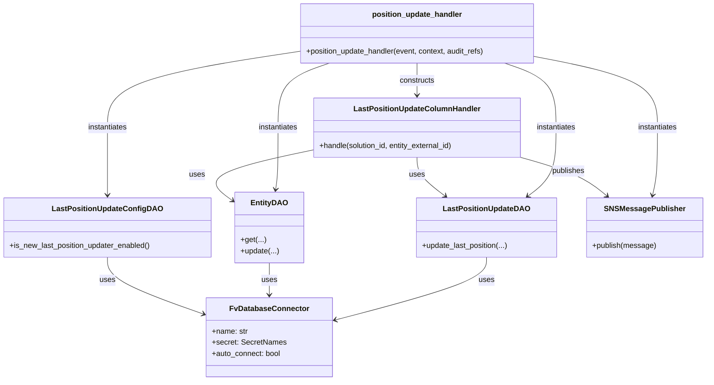

# Diagram: entity_core/entity_service/entity_service/entity/entity/update_entity_last_position_columns/api.py


> Auto-generated by Obscura crawlers

## Diagram 1



### SVG

<svg id="container" width="1495.212890625" xmlns="http://www.w3.org/2000/svg" class="classDiagram" height="808" viewBox="0 0 1495.212890625 808" role="graphics-document document" aria-roledescription="class"><style>#container{font-family:"trebuchet ms",verdana,arial,sans-serif;font-size:16px;fill:#333;}@keyframes edge-animation-frame{from{stroke-dashoffset:0;}}@keyframes dash{to{stroke-dashoffset:0;}}#container .edge-animation-slow{stroke-dasharray:9,5!important;stroke-dashoffset:900;animation:dash 50s linear infinite;stroke-linecap:round;}#container .edge-animation-fast{stroke-dasharray:9,5!important;stroke-dashoffset:900;animation:dash 20s linear infinite;stroke-linecap:round;}#container .error-icon{fill:#552222;}#container .error-text{fill:#552222;stroke:#552222;}#container .edge-thickness-normal{stroke-width:1px;}#container .edge-thickness-thick{stroke-width:3.5px;}#container .edge-pattern-solid{stroke-dasharray:0;}#container .edge-thickness-invisible{stroke-width:0;fill:none;}#container .edge-pattern-dashed{stroke-dasharray:3;}#container .edge-pattern-dotted{stroke-dasharray:2;}#container .marker{fill:#333333;stroke:#333333;}#container .marker.cross{stroke:#333333;}#container svg{font-family:"trebuchet ms",verdana,arial,sans-serif;font-size:16px;}#container p{margin:0;}#container g.classGroup text{fill:#9370DB;stroke:none;font-family:"trebuchet ms",verdana,arial,sans-serif;font-size:10px;}#container g.classGroup text .title{font-weight:bolder;}#container .nodeLabel,#container .edgeLabel{color:#131300;}#container .edgeLabel .label rect{fill:#ECECFF;}#container .label text{fill:#131300;}#container .labelBkg{background:#ECECFF;}#container .edgeLabel .label span{background:#ECECFF;}#container .classTitle{font-weight:bolder;}#container .node rect,#container .node circle,#container .node ellipse,#container .node polygon,#container .node path{fill:#ECECFF;stroke:#9370DB;stroke-width:1px;}#container .divider{stroke:#9370DB;stroke-width:1;}#container g.clickable{cursor:pointer;}#container g.classGroup rect{fill:#ECECFF;stroke:#9370DB;}#container g.classGroup line{stroke:#9370DB;stroke-width:1;}#container .classLabel .box{stroke:none;stroke-width:0;fill:#ECECFF;opacity:0.5;}#container .classLabel .label{fill:#9370DB;font-size:10px;}#container .relation{stroke:#333333;stroke-width:1;fill:none;}#container .dashed-line{stroke-dasharray:3;}#container .dotted-line{stroke-dasharray:1 2;}#container #compositionStart,#container .composition{fill:#333333!important;stroke:#333333!important;stroke-width:1;}#container #compositionEnd,#container .composition{fill:#333333!important;stroke:#333333!important;stroke-width:1;}#container #dependencyStart,#container .dependency{fill:#333333!important;stroke:#333333!important;stroke-width:1;}#container #dependencyStart,#container .dependency{fill:#333333!important;stroke:#333333!important;stroke-width:1;}#container #extensionStart,#container .extension{fill:transparent!important;stroke:#333333!important;stroke-width:1;}#container #extensionEnd,#container .extension{fill:transparent!important;stroke:#333333!important;stroke-width:1;}#container #aggregationStart,#container .aggregation{fill:transparent!important;stroke:#333333!important;stroke-width:1;}#container #aggregationEnd,#container .aggregation{fill:transparent!important;stroke:#333333!important;stroke-width:1;}#container #lollipopStart,#container .lollipop{fill:#ECECFF!important;stroke:#333333!important;stroke-width:1;}#container #lollipopEnd,#container .lollipop{fill:#ECECFF!important;stroke:#333333!important;stroke-width:1;}#container .edgeTerminals{font-size:11px;line-height:initial;}#container .classTitleText{text-anchor:middle;font-size:18px;fill:#333;}#container .label-icon{display:inline-block;height:1em;overflow:visible;vertical-align:-0.125em;}#container .node .label-icon path{fill:currentColor;stroke:revert;stroke-width:revert;}#container :root{--mermaid-font-family:"trebuchet ms",verdana,arial,sans-serif;}</style><g><defs><marker id="container_class-aggregationStart" class="marker aggregation class" refX="18" refY="7" markerWidth="190" markerHeight="240" orient="auto"><path d="M 18,7 L9,13 L1,7 L9,1 Z"></path></marker></defs><defs><marker id="container_class-aggregationEnd" class="marker aggregation class" refX="1" refY="7" markerWidth="20" markerHeight="28" orient="auto"><path d="M 18,7 L9,13 L1,7 L9,1 Z"></path></marker></defs><defs><marker id="container_class-extensionStart" class="marker extension class" refX="18" refY="7" markerWidth="190" markerHeight="240" orient="auto"><path d="M 1,7 L18,13 V 1 Z"></path></marker></defs><defs><marker id="container_class-extensionEnd" class="marker extension class" refX="1" refY="7" markerWidth="20" markerHeight="28" orient="auto"><path d="M 1,1 V 13 L18,7 Z"></path></marker></defs><defs><marker id="container_class-compositionStart" class="marker composition class" refX="18" refY="7" markerWidth="190" markerHeight="240" orient="auto"><path d="M 18,7 L9,13 L1,7 L9,1 Z"></path></marker></defs><defs><marker id="container_class-compositionEnd" class="marker composition class" refX="1" refY="7" markerWidth="20" markerHeight="28" orient="auto"><path d="M 18,7 L9,13 L1,7 L9,1 Z"></path></marker></defs><defs><marker id="container_class-dependencyStart" class="marker dependency class" refX="6" refY="7" markerWidth="190" markerHeight="240" orient="auto"><path d="M 5,7 L9,13 L1,7 L9,1 Z"></path></marker></defs><defs><marker id="container_class-dependencyEnd" class="marker dependency class" refX="13" refY="7" markerWidth="20" markerHeight="28" orient="auto"><path d="M 18,7 L9,13 L14,7 L9,1 Z"></path></marker></defs><defs><marker id="container_class-lollipopStart" class="marker lollipop class" refX="13" refY="7" markerWidth="190" markerHeight="240" orient="auto"><circle stroke="black" fill="transparent" cx="7" cy="7" r="6"></circle></marker></defs><defs><marker id="container_class-lollipopEnd" class="marker lollipop class" refX="1" refY="7" markerWidth="190" markerHeight="240" orient="auto"><circle stroke="black" fill="transparent" cx="7" cy="7" r="6"></circle></marker></defs><g class="root"><g class="clusters"></g><g class="edgePaths"><path d="M225.887,546L225.887,554.167C225.887,562.333,225.887,578.667,259.885,598.976C293.883,619.286,361.88,643.571,395.879,655.714L429.877,667.857" id="id_LastPositionUpdateConfigDAO_FvDatabaseConnector_1" class="edge-thickness-normal edge-pattern-solid relation" style=";;;" data-edge="true" data-et="edge" data-id="id_LastPositionUpdateConfigDAO_FvDatabaseConnector_1" data-points="W3sieCI6MjI1Ljg4NjcxODc1LCJ5Ijo1NDZ9LHsieCI6MjI1Ljg4NjcxODc1LCJ5Ijo1OTV9LHsieCI6NDM1LjUyNzM0Mzc1LCJ5Ijo2NjkuODc0OTMyMjYwMjU5fV0=" marker-end="url(#container_class-dependencyEnd)"></path><path d="M564.672,558L564.672,564.167C564.672,570.333,564.672,582.667,564.672,594C564.672,605.333,564.672,615.667,564.672,620.833L564.672,626" id="id_EntityDAO_FvDatabaseConnector_2" class="edge-thickness-normal edge-pattern-solid relation" style=";;;" data-edge="true" data-et="edge" data-id="id_EntityDAO_FvDatabaseConnector_2" data-points="W3sieCI6NTY0LjY3MTg3NSwieSI6NTU4fSx7IngiOjU2NC42NzE4NzUsInkiOjU5NX0seyJ4Ijo1NjQuNjcxODc1LCJ5Ijo2MzJ9XQ==" marker-end="url(#container_class-dependencyEnd)"></path><path d="M1031.729,546L1031.729,554.167C1031.729,562.333,1031.729,578.667,976.378,601.173C921.027,623.679,810.326,652.359,754.975,666.698L699.625,681.038" id="id_LastPositionUpdateDAO_FvDatabaseConnector_3" class="edge-thickness-normal edge-pattern-solid relation" style=";;;" data-edge="true" data-et="edge" data-id="id_LastPositionUpdateDAO_FvDatabaseConnector_3" data-points="W3sieCI6MTAzMS43Mjg1MTU2MjUsInkiOjU0Nn0seyJ4IjoxMDMxLjcyODUxNTYyNSwieSI6NTk1fSx7IngiOjY5My44MTY0MDYyNSwieSI6NjgyLjU0MjYyNjkwNjM2Nn1d" marker-end="url(#container_class-dependencyEnd)"></path><path d="M660.832,318.224L619.614,327.02C578.396,335.816,495.961,353.408,467.314,371.519C438.668,389.631,463.81,408.261,476.381,417.577L488.953,426.892" id="id_LastPositionUpdateColumnHandler_EntityDAO_4" class="edge-thickness-normal edge-pattern-solid relation" style=";;;" data-edge="true" data-et="edge" data-id="id_LastPositionUpdateColumnHandler_EntityDAO_4" data-points="W3sieCI6NjYwLjgzMjAzMTI1LCJ5IjozMTguMjI0MzE3ODAxOTYxNDN9LHsieCI6NDEzLjUyNTM5MDYyNSwieSI6MzcxfSx7IngiOjQ5My43NzM0Mzc1LCJ5Ijo0MzAuNDY0MDQ0MzQ4NTM0fV0=" marker-end="url(#container_class-dependencyEnd)"></path><path d="M882.125,334L882.125,340.167C882.125,346.333,882.125,358.667,892.233,372.401C902.341,386.135,922.557,401.269,932.665,408.837L942.773,416.404" id="id_LastPositionUpdateColumnHandler_LastPositionUpdateDAO_5" class="edge-thickness-normal edge-pattern-solid relation" style=";;;" data-edge="true" data-et="edge" data-id="id_LastPositionUpdateColumnHandler_LastPositionUpdateDAO_5" data-points="W3sieCI6ODgyLjEyNSwieSI6MzM0fSx7IngiOjg4Mi4xMjUsInkiOjM3MX0seyJ4Ijo5NDcuNTc2NTM4MDg1OTM3NSwieSI6NDIwfV0=" marker-end="url(#container_class-dependencyEnd)"></path><path d="M1103.418,333.426L1125.617,339.688C1147.816,345.951,1192.215,358.475,1223.199,372.254C1254.182,386.033,1271.751,401.066,1280.535,408.583L1289.32,416.099" id="id_LastPositionUpdateColumnHandler_SNSMessagePublisher_6" class="edge-thickness-normal edge-pattern-solid relation" style=";;;" data-edge="true" data-et="edge" data-id="id_LastPositionUpdateColumnHandler_SNSMessagePublisher_6" data-points="W3sieCI6MTEwMy40MTc5Njg3NSwieSI6MzMzLjQyNjAzMjI0Mjc3OTV9LHsieCI6MTIzNi42MTMyODEyNSwieSI6MzcxfSx7IngiOjEyOTMuODc4Nzg0MTc5Njg3NSwieSI6NDIwfV0=" marker-end="url(#container_class-dependencyEnd)"></path><path d="M631.012,109.266L563.491,119.555C495.97,129.844,360.928,150.422,293.408,177.378C225.887,204.333,225.887,237.667,225.887,271C225.887,304.333,225.887,337.667,225.887,361.5C225.887,385.333,225.887,399.667,225.887,406.833L225.887,414" id="id_position_update_handler_LastPositionUpdateConfigDAO_7" class="edge-thickness-normal edge-pattern-solid relation" style=";;;" data-edge="true" data-et="edge" data-id="id_position_update_handler_LastPositionUpdateConfigDAO_7" data-points="W3sieCI6NjMxLjAxMTcxODc1LCJ5IjoxMDkuMjY1NTY0MjY2MDI4NTZ9LHsieCI6MjI1Ljg4NjcxODc1LCJ5IjoxNzF9LHsieCI6MjI1Ljg4NjcxODc1LCJ5IjoyNzF9LHsieCI6MjI1Ljg4NjcxODc1LCJ5IjozNzF9LHsieCI6MjI1Ljg4NjcxODc1LCJ5Ijo0MjB9XQ==" marker-end="url(#container_class-dependencyEnd)"></path><path d="M693.625,134L675.173,140.167C656.722,146.333,619.82,158.667,601.369,181.5C582.918,204.333,582.918,237.667,582.918,271C582.918,304.333,582.918,337.667,582.074,359.513C581.23,381.359,579.543,391.719,578.699,396.898L577.855,402.078" id="id_position_update_handler_EntityDAO_8" class="edge-thickness-normal edge-pattern-solid relation" style=";;;" data-edge="true" data-et="edge" data-id="id_position_update_handler_EntityDAO_8" data-points="W3sieCI6NjkzLjYyNDU3MDMxMjUsInkiOjEzNH0seyJ4Ijo1ODIuOTE3OTY4NzUsInkiOjE3MX0seyJ4Ijo1ODIuOTE3OTY4NzUsInkiOjI3MX0seyJ4Ijo1ODIuOTE3OTY4NzUsInkiOjM3MX0seyJ4Ijo1NzYuODkwMjQxMzUwNDQ2NCwieSI6NDA4fV0=" marker-end="url(#container_class-dependencyEnd)"></path><path d="M1070.625,134L1089.077,140.167C1107.528,146.333,1144.43,158.667,1162.881,181.5C1181.332,204.333,1181.332,237.667,1181.332,271C1181.332,304.333,1181.332,337.667,1171.224,361.901C1161.116,386.135,1140.9,401.269,1130.792,408.837L1120.684,416.404" id="id_position_update_handler_LastPositionUpdateDAO_9" class="edge-thickness-normal edge-pattern-solid relation" style=";;;" data-edge="true" data-et="edge" data-id="id_position_update_handler_LastPositionUpdateDAO_9" data-points="W3sieCI6MTA3MC42MjU0Mjk2ODc1LCJ5IjoxMzR9LHsieCI6MTE4MS4zMzIwMzEyNSwieSI6MTcxfSx7IngiOjExODEuMzMyMDMxMjUsInkiOjI3MX0seyJ4IjoxMTgxLjMzMjAzMTI1LCJ5IjozNzF9LHsieCI6MTExNS44ODA0OTMxNjQwNjI1LCJ5Ijo0MjB9XQ==" marker-end="url(#container_class-dependencyEnd)"></path><path d="M1133.238,119.948L1176.89,128.457C1220.541,136.965,1307.844,153.983,1351.495,179.158C1395.146,204.333,1395.146,237.667,1395.146,271C1395.146,304.333,1395.146,337.667,1393.371,361.529C1391.595,385.392,1388.043,399.783,1386.267,406.979L1384.491,414.175" id="id_position_update_handler_SNSMessagePublisher_10" class="edge-thickness-normal edge-pattern-solid relation" style=";;;" data-edge="true" data-et="edge" data-id="id_position_update_handler_SNSMessagePublisher_10" data-points="W3sieCI6MTEzMy4yMzgyODEyNSwieSI6MTE5Ljk0NzkwNzQyNjUxMzQxfSx7IngiOjEzOTUuMTQ2NDg0Mzc1LCJ5IjoxNzF9LHsieCI6MTM5NS4xNDY0ODQzNzUsInkiOjI3MX0seyJ4IjoxMzk1LjE0NjQ4NDM3NSwieSI6MzcxfSx7IngiOjEzODMuMDUzNzEwOTM3NSwieSI6NDIwfV0=" marker-end="url(#container_class-dependencyEnd)"></path><path d="M882.125,134L882.125,140.167C882.125,146.333,882.125,158.667,882.125,170C882.125,181.333,882.125,191.667,882.125,196.833L882.125,202" id="id_position_update_handler_LastPositionUpdateColumnHandler_11" class="edge-thickness-normal edge-pattern-solid relation" style=";;;" data-edge="true" data-et="edge" data-id="id_position_update_handler_LastPositionUpdateColumnHandler_11" data-points="W3sieCI6ODgyLjEyNSwieSI6MTM0fSx7IngiOjg4Mi4xMjUsInkiOjE3MX0seyJ4Ijo4ODIuMTI1LCJ5IjoyMDh9XQ==" marker-end="url(#container_class-dependencyEnd)"></path></g><g class="edgeLabels"><g class="edgeLabel" transform="translate(225.88671875, 595)"><g class="label" data-id="id_LastPositionUpdateConfigDAO_FvDatabaseConnector_1" transform="translate(-16.4921875, -12)"><foreignObject width="32.984375" height="24"><div xmlns="http://www.w3.org/1999/xhtml" class="labelBkg" style="display: table-cell; white-space: nowrap; line-height: 1.5; max-width: 200px; text-align: center;"><span class="edgeLabel"><p>uses</p></span></div></foreignObject></g></g><g class="edgeLabel" transform="translate(564.671875, 595)"><g class="label" data-id="id_EntityDAO_FvDatabaseConnector_2" transform="translate(-16.4921875, -12)"><foreignObject width="32.984375" height="24"><div xmlns="http://www.w3.org/1999/xhtml" class="labelBkg" style="display: table-cell; white-space: nowrap; line-height: 1.5; max-width: 200px; text-align: center;"><span class="edgeLabel"><p>uses</p></span></div></foreignObject></g></g><g class="edgeLabel" transform="translate(1031.728515625, 595)"><g class="label" data-id="id_LastPositionUpdateDAO_FvDatabaseConnector_3" transform="translate(-16.4921875, -12)"><foreignObject width="32.984375" height="24"><div xmlns="http://www.w3.org/1999/xhtml" class="labelBkg" style="display: table-cell; white-space: nowrap; line-height: 1.5; max-width: 200px; text-align: center;"><span class="edgeLabel"><p>uses</p></span></div></foreignObject></g></g><g class="edgeLabel" transform="translate(488.33915, 355.03461)"><g class="label" data-id="id_LastPositionUpdateColumnHandler_EntityDAO_4" transform="translate(-16.4921875, -12)"><foreignObject width="32.984375" height="24"><div xmlns="http://www.w3.org/1999/xhtml" class="labelBkg" style="display: table-cell; white-space: nowrap; line-height: 1.5; max-width: 200px; text-align: center;"><span class="edgeLabel"><p>uses</p></span></div></foreignObject></g></g><g class="edgeLabel" transform="translate(882.125, 371)"><g class="label" data-id="id_LastPositionUpdateColumnHandler_LastPositionUpdateDAO_5" transform="translate(-16.4921875, -12)"><foreignObject width="32.984375" height="24"><div xmlns="http://www.w3.org/1999/xhtml" class="labelBkg" style="display: table-cell; white-space: nowrap; line-height: 1.5; max-width: 200px; text-align: center;"><span class="edgeLabel"><p>uses</p></span></div></foreignObject></g></g><g class="edgeLabel" transform="translate(1206.28416, 362.44425)"><g class="label" data-id="id_LastPositionUpdateColumnHandler_SNSMessagePublisher_6" transform="translate(-35.28125, -12)"><foreignObject width="70.5625" height="24"><div xmlns="http://www.w3.org/1999/xhtml" class="labelBkg" style="display: table-cell; white-space: nowrap; line-height: 1.5; max-width: 200px; text-align: center;"><span class="edgeLabel"><p>publishes</p></span></div></foreignObject></g></g><g class="edgeLabel" transform="translate(225.88671875, 271)"><g class="label" data-id="id_position_update_handler_LastPositionUpdateConfigDAO_7" transform="translate(-42.9140625, -12)"><foreignObject width="85.828125" height="24"><div xmlns="http://www.w3.org/1999/xhtml" class="labelBkg" style="display: table-cell; white-space: nowrap; line-height: 1.5; max-width: 200px; text-align: center;"><span class="edgeLabel"><p>instantiates</p></span></div></foreignObject></g></g><g class="edgeLabel" transform="translate(582.91796875, 271)"><g class="label" data-id="id_position_update_handler_EntityDAO_8" transform="translate(-42.9140625, -12)"><foreignObject width="85.828125" height="24"><div xmlns="http://www.w3.org/1999/xhtml" class="labelBkg" style="display: table-cell; white-space: nowrap; line-height: 1.5; max-width: 200px; text-align: center;"><span class="edgeLabel"><p>instantiates</p></span></div></foreignObject></g></g><g class="edgeLabel" transform="translate(1181.33203125, 271)"><g class="label" data-id="id_position_update_handler_LastPositionUpdateDAO_9" transform="translate(-42.9140625, -12)"><foreignObject width="85.828125" height="24"><div xmlns="http://www.w3.org/1999/xhtml" class="labelBkg" style="display: table-cell; white-space: nowrap; line-height: 1.5; max-width: 200px; text-align: center;"><span class="edgeLabel"><p>instantiates</p></span></div></foreignObject></g></g><g class="edgeLabel" transform="translate(1395.146484375, 271)"><g class="label" data-id="id_position_update_handler_SNSMessagePublisher_10" transform="translate(-42.9140625, -12)"><foreignObject width="85.828125" height="24"><div xmlns="http://www.w3.org/1999/xhtml" class="labelBkg" style="display: table-cell; white-space: nowrap; line-height: 1.5; max-width: 200px; text-align: center;"><span class="edgeLabel"><p>instantiates</p></span></div></foreignObject></g></g><g class="edgeLabel" transform="translate(882.125, 171)"><g class="label" data-id="id_position_update_handler_LastPositionUpdateColumnHandler_11" transform="translate(-37.84375, -12)"><foreignObject width="75.6875" height="24"><div xmlns="http://www.w3.org/1999/xhtml" class="labelBkg" style="display: table-cell; white-space: nowrap; line-height: 1.5; max-width: 200px; text-align: center;"><span class="edgeLabel"><p>constructs</p></span></div></foreignObject></g></g></g><g class="nodes"><g class="node default" id="classId-FvDatabaseConnector-0" transform="translate(564.671875, 716)"><g class="basic label-container"><path d="M-129.14453125 -84 L129.14453125 -84 L129.14453125 84 L-129.14453125 84" stroke="none" stroke-width="0" fill="#ECECFF" style=""></path><path d="M-129.14453125 -84 C-43.46164364556883 -84, 42.221243958862345 -84, 129.14453125 -84 M-129.14453125 -84 C-58.92581943439845 -84, 11.292892381203103 -84, 129.14453125 -84 M129.14453125 -84 C129.14453125 -22.57106565796051, 129.14453125 38.85786868407898, 129.14453125 84 M129.14453125 -84 C129.14453125 -16.95773973104062, 129.14453125 50.08452053791876, 129.14453125 84 M129.14453125 84 C47.250969468065605 84, -34.64259231386879 84, -129.14453125 84 M129.14453125 84 C77.42046095626966 84, 25.696390662539315 84, -129.14453125 84 M-129.14453125 84 C-129.14453125 21.22410050831327, -129.14453125 -41.55179898337346, -129.14453125 -84 M-129.14453125 84 C-129.14453125 45.51321141999793, -129.14453125 7.02642283999586, -129.14453125 -84" stroke="#9370DB" stroke-width="1.3" fill="none" stroke-dasharray="0 0" style=""></path></g><g class="annotation-group text" transform="translate(0, -60)"></g><g class="label-group text" transform="translate(-79.3046875, -60)"><g class="label" style="font-weight: bolder" transform="translate(0,-12)"><foreignObject width="158.609375" height="24"><div xmlns="http://www.w3.org/1999/xhtml" style="display: table-cell; white-space: nowrap; line-height: 1.5; max-width: 207px; text-align: center;"><span class="nodeLabel markdown-node-label" style=""><p>FvDatabaseConnector</p></span></div></foreignObject></g></g><g class="members-group text" transform="translate(-117.14453125, -12)"><g class="label" style="" transform="translate(0,-12)"><foreignObject width="76.015625" height="24"><div xmlns="http://www.w3.org/1999/xhtml" style="display: table-cell; white-space: nowrap; line-height: 1.5; max-width: 134px; text-align: center;"><span class="nodeLabel markdown-node-label" style=""><p>+name: str</p></span></div></foreignObject></g><g class="label" style="" transform="translate(0,12)"><foreignObject width="154.984375" height="24"><div xmlns="http://www.w3.org/1999/xhtml" style="display: table-cell; white-space: nowrap; line-height: 1.5; max-width: 212px; text-align: center;"><span class="nodeLabel markdown-node-label" style=""><p>+secret: SecretNames</p></span></div></foreignObject></g><g class="label" style="" transform="translate(0,36)"><foreignObject width="146.921875" height="24"><div xmlns="http://www.w3.org/1999/xhtml" style="display: table-cell; white-space: nowrap; line-height: 1.5; max-width: 205px; text-align: center;"><span class="nodeLabel markdown-node-label" style=""><p>+auto_connect: bool</p></span></div></foreignObject></g></g><g class="methods-group text" transform="translate(-117.14453125, 84)"></g><g class="divider" style=""><path d="M-129.14453125 -36 C-44.92277594799407 -36, 39.29897935401186 -36, 129.14453125 -36 M-129.14453125 -36 C-57.74957161902253 -36, 13.645388011954935 -36, 129.14453125 -36" stroke="#9370DB" stroke-width="1.3" fill="none" stroke-dasharray="0 0" style=""></path></g><g class="divider" style=""><path d="M-129.14453125 60 C-62.46669645691854 60, 4.211138336162918 60, 129.14453125 60 M-129.14453125 60 C-60.530965077091594 60, 8.082601095816813 60, 129.14453125 60" stroke="#9370DB" stroke-width="1.3" fill="none" stroke-dasharray="0 0" style=""></path></g></g><g class="node default" id="classId-LastPositionUpdateConfigDAO-1" transform="translate(225.88671875, 483)"><g class="basic label-container"><path d="M-217.88671875 -63 L217.88671875 -63 L217.88671875 63 L-217.88671875 63" stroke="none" stroke-width="0" fill="#ECECFF" style=""></path><path d="M-217.88671875 -63 C-98.7929224173026 -63, 20.30087391539479 -63, 217.88671875 -63 M-217.88671875 -63 C-95.12417166222754 -63, 27.638375425544922 -63, 217.88671875 -63 M217.88671875 -63 C217.88671875 -29.123586719624804, 217.88671875 4.752826560750393, 217.88671875 63 M217.88671875 -63 C217.88671875 -33.85991834520878, 217.88671875 -4.719836690417559, 217.88671875 63 M217.88671875 63 C98.61726288829068 63, -20.652192973418636 63, -217.88671875 63 M217.88671875 63 C120.09573012458857 63, 22.30474149917714 63, -217.88671875 63 M-217.88671875 63 C-217.88671875 21.672638802477096, -217.88671875 -19.65472239504581, -217.88671875 -63 M-217.88671875 63 C-217.88671875 19.5714535506172, -217.88671875 -23.8570928987656, -217.88671875 -63" stroke="#9370DB" stroke-width="1.3" fill="none" stroke-dasharray="0 0" style=""></path></g><g class="annotation-group text" transform="translate(0, -39)"></g><g class="label-group text" transform="translate(-110.0234375, -39)"><g class="label" style="font-weight: bolder" transform="translate(0,-12)"><foreignObject width="220.046875" height="24"><div xmlns="http://www.w3.org/1999/xhtml" style="display: table-cell; white-space: nowrap; line-height: 1.5; max-width: 266px; text-align: center;"><span class="nodeLabel markdown-node-label" style=""><p>LastPositionUpdateConfigDAO</p></span></div></foreignObject></g></g><g class="members-group text" transform="translate(-205.88671875, 9)"></g><g class="methods-group text" transform="translate(-205.88671875, 39)"><g class="label" style="" transform="translate(0,-12)"><foreignObject width="301.75" height="24"><div xmlns="http://www.w3.org/1999/xhtml" style="display: table-cell; white-space: nowrap; line-height: 1.5; max-width: 359px; text-align: center;"><span class="nodeLabel markdown-node-label" style=""><p>+is_new_last_position_updater_enabled()</p></span></div></foreignObject></g></g><g class="divider" style=""><path d="M-217.88671875 -15 C-64.62790394587918 -15, 88.63091085824163 -15, 217.88671875 -15 M-217.88671875 -15 C-128.544755581983 -15, -39.202792413965994 -15, 217.88671875 -15" stroke="#9370DB" stroke-width="1.3" fill="none" stroke-dasharray="0 0" style=""></path></g><g class="divider" style=""><path d="M-217.88671875 9 C-123.38063458136286 9, -28.87455041272571 9, 217.88671875 9 M-217.88671875 9 C-67.08632357009446 9, 83.71407160981107 9, 217.88671875 9" stroke="#9370DB" stroke-width="1.3" fill="none" stroke-dasharray="0 0" style=""></path></g></g><g class="node default" id="classId-EntityDAO-2" transform="translate(564.671875, 483)"><g class="basic label-container"><path d="M-70.8984375 -75 L70.8984375 -75 L70.8984375 75 L-70.8984375 75" stroke="none" stroke-width="0" fill="#ECECFF" style=""></path><path d="M-70.8984375 -75 C-16.506210263099426 -75, 37.88601697380115 -75, 70.8984375 -75 M-70.8984375 -75 C-17.52212123457459 -75, 35.85419503085082 -75, 70.8984375 -75 M70.8984375 -75 C70.8984375 -34.39814909661331, 70.8984375 6.203701806773381, 70.8984375 75 M70.8984375 -75 C70.8984375 -34.45499963619158, 70.8984375 6.0900007276168395, 70.8984375 75 M70.8984375 75 C23.12841680093061 75, -24.641603898138783 75, -70.8984375 75 M70.8984375 75 C25.949775477906996 75, -18.998886544186007 75, -70.8984375 75 M-70.8984375 75 C-70.8984375 28.753393572535145, -70.8984375 -17.49321285492971, -70.8984375 -75 M-70.8984375 75 C-70.8984375 34.1618516504807, -70.8984375 -6.676296699038602, -70.8984375 -75" stroke="#9370DB" stroke-width="1.3" fill="none" stroke-dasharray="0 0" style=""></path></g><g class="annotation-group text" transform="translate(0, -51)"></g><g class="label-group text" transform="translate(-36.578125, -51)"><g class="label" style="font-weight: bolder" transform="translate(0,-12)"><foreignObject width="73.15625" height="24"><div xmlns="http://www.w3.org/1999/xhtml" style="display: table-cell; white-space: nowrap; line-height: 1.5; max-width: 122px; text-align: center;"><span class="nodeLabel markdown-node-label" style=""><p>EntityDAO</p></span></div></foreignObject></g></g><g class="members-group text" transform="translate(-58.8984375, -3)"></g><g class="methods-group text" transform="translate(-58.8984375, 27)"><g class="label" style="" transform="translate(0,-12)"><foreignObject width="52.4375" height="24"><div xmlns="http://www.w3.org/1999/xhtml" style="display: table-cell; white-space: nowrap; line-height: 1.5; max-width: 110px; text-align: center;"><span class="nodeLabel markdown-node-label" style=""><p>+get(...)</p></span></div></foreignObject></g><g class="label" style="" transform="translate(0,12)"><foreignObject width="81.21875" height="24"><div xmlns="http://www.w3.org/1999/xhtml" style="display: table-cell; white-space: nowrap; line-height: 1.5; max-width: 139px; text-align: center;"><span class="nodeLabel markdown-node-label" style=""><p>+update(...)</p></span></div></foreignObject></g></g><g class="divider" style=""><path d="M-70.8984375 -27 C-21.655657539605087 -27, 27.587122420789825 -27, 70.8984375 -27 M-70.8984375 -27 C-37.80975440776343 -27, -4.721071315526856 -27, 70.8984375 -27" stroke="#9370DB" stroke-width="1.3" fill="none" stroke-dasharray="0 0" style=""></path></g><g class="divider" style=""><path d="M-70.8984375 -3 C-30.813130721131614 -3, 9.272176057736772 -3, 70.8984375 -3 M-70.8984375 -3 C-36.851713534485725 -3, -2.8049895689714504 -3, 70.8984375 -3" stroke="#9370DB" stroke-width="1.3" fill="none" stroke-dasharray="0 0" style=""></path></g></g><g class="node default" id="classId-LastPositionUpdateDAO-3" transform="translate(1031.728515625, 483)"><g class="basic label-container"><path d="M-147.359375 -63 L147.359375 -63 L147.359375 63 L-147.359375 63" stroke="none" stroke-width="0" fill="#ECECFF" style=""></path><path d="M-147.359375 -63 C-66.6957439227093 -63, 13.967887154581405 -63, 147.359375 -63 M-147.359375 -63 C-69.75391781447657 -63, 7.851539371046869 -63, 147.359375 -63 M147.359375 -63 C147.359375 -32.212990311626584, 147.359375 -1.4259806232531673, 147.359375 63 M147.359375 -63 C147.359375 -18.934621236698725, 147.359375 25.13075752660255, 147.359375 63 M147.359375 63 C67.22475004390299 63, -12.909874912194027 63, -147.359375 63 M147.359375 63 C75.6572605019119 63, 3.9551460038238133 63, -147.359375 63 M-147.359375 63 C-147.359375 28.215339484682445, -147.359375 -6.569321030635109, -147.359375 -63 M-147.359375 63 C-147.359375 24.30072803401822, -147.359375 -14.398543931963559, -147.359375 -63" stroke="#9370DB" stroke-width="1.3" fill="none" stroke-dasharray="0 0" style=""></path></g><g class="annotation-group text" transform="translate(0, -39)"></g><g class="label-group text" transform="translate(-87.09375, -39)"><g class="label" style="font-weight: bolder" transform="translate(0,-12)"><foreignObject width="174.1875" height="24"><div xmlns="http://www.w3.org/1999/xhtml" style="display: table-cell; white-space: nowrap; line-height: 1.5; max-width: 222px; text-align: center;"><span class="nodeLabel markdown-node-label" style=""><p>LastPositionUpdateDAO</p></span></div></foreignObject></g></g><g class="members-group text" transform="translate(-135.359375, 9)"></g><g class="methods-group text" transform="translate(-135.359375, 39)"><g class="label" style="" transform="translate(0,-12)"><foreignObject width="183.625" height="24"><div xmlns="http://www.w3.org/1999/xhtml" style="display: table-cell; white-space: nowrap; line-height: 1.5; max-width: 241px; text-align: center;"><span class="nodeLabel markdown-node-label" style=""><p>+update_last_position(...)</p></span></div></foreignObject></g></g><g class="divider" style=""><path d="M-147.359375 -15 C-36.95140263921988 -15, 73.45656972156024 -15, 147.359375 -15 M-147.359375 -15 C-81.92044929304271 -15, -16.481523586085416 -15, 147.359375 -15" stroke="#9370DB" stroke-width="1.3" fill="none" stroke-dasharray="0 0" style=""></path></g><g class="divider" style=""><path d="M-147.359375 9 C-87.25018815874209 9, -27.141001317484182 9, 147.359375 9 M-147.359375 9 C-43.165116496932 9, 61.029142006136 9, 147.359375 9" stroke="#9370DB" stroke-width="1.3" fill="none" stroke-dasharray="0 0" style=""></path></g></g><g class="node default" id="classId-SNSMessagePublisher-4" transform="translate(1367.505859375, 483)"><g class="basic label-container"><path d="M-119.70703125 -63 L119.70703125 -63 L119.70703125 63 L-119.70703125 63" stroke="none" stroke-width="0" fill="#ECECFF" style=""></path><path d="M-119.70703125 -63 C-35.65318256851947 -63, 48.40066611296106 -63, 119.70703125 -63 M-119.70703125 -63 C-48.838194098958866 -63, 22.03064305208227 -63, 119.70703125 -63 M119.70703125 -63 C119.70703125 -16.104087739545285, 119.70703125 30.79182452090943, 119.70703125 63 M119.70703125 -63 C119.70703125 -29.15197476668662, 119.70703125 4.696050466626758, 119.70703125 63 M119.70703125 63 C45.35321511950028 63, -29.000601010999446 63, -119.70703125 63 M119.70703125 63 C40.60912410956654 63, -38.48878303086693 63, -119.70703125 63 M-119.70703125 63 C-119.70703125 28.84871199157095, -119.70703125 -5.302576016858097, -119.70703125 -63 M-119.70703125 63 C-119.70703125 22.3750393285494, -119.70703125 -18.249921342901203, -119.70703125 -63" stroke="#9370DB" stroke-width="1.3" fill="none" stroke-dasharray="0 0" style=""></path></g><g class="annotation-group text" transform="translate(0, -39)"></g><g class="label-group text" transform="translate(-80.3046875, -39)"><g class="label" style="font-weight: bolder" transform="translate(0,-12)"><foreignObject width="160.609375" height="24"><div xmlns="http://www.w3.org/1999/xhtml" style="display: table-cell; white-space: nowrap; line-height: 1.5; max-width: 209px; text-align: center;"><span class="nodeLabel markdown-node-label" style=""><p>SNSMessagePublisher</p></span></div></foreignObject></g></g><g class="members-group text" transform="translate(-107.70703125, 9)"></g><g class="methods-group text" transform="translate(-107.70703125, 39)"><g class="label" style="" transform="translate(0,-12)"><foreignObject width="135.109375" height="24"><div xmlns="http://www.w3.org/1999/xhtml" style="display: table-cell; white-space: nowrap; line-height: 1.5; max-width: 192px; text-align: center;"><span class="nodeLabel markdown-node-label" style=""><p>+publish(message)</p></span></div></foreignObject></g></g><g class="divider" style=""><path d="M-119.70703125 -15 C-67.43894407947559 -15, -15.170856908951166 -15, 119.70703125 -15 M-119.70703125 -15 C-28.55512242506235 -15, 62.5967863998753 -15, 119.70703125 -15" stroke="#9370DB" stroke-width="1.3" fill="none" stroke-dasharray="0 0" style=""></path></g><g class="divider" style=""><path d="M-119.70703125 9 C-63.419286925813445 9, -7.13154260162689 9, 119.70703125 9 M-119.70703125 9 C-27.06868989704006 9, 65.56965145591988 9, 119.70703125 9" stroke="#9370DB" stroke-width="1.3" fill="none" stroke-dasharray="0 0" style=""></path></g></g><g class="node default" id="classId-LastPositionUpdateColumnHandler-5" transform="translate(882.125, 271)"><g class="basic label-container"><path d="M-221.29296875 -63 L221.29296875 -63 L221.29296875 63 L-221.29296875 63" stroke="none" stroke-width="0" fill="#ECECFF" style=""></path><path d="M-221.29296875 -63 C-95.27224069307857 -63, 30.748487363842855 -63, 221.29296875 -63 M-221.29296875 -63 C-53.48953247032699 -63, 114.31390380934602 -63, 221.29296875 -63 M221.29296875 -63 C221.29296875 -17.05164310299633, 221.29296875 28.89671379400734, 221.29296875 63 M221.29296875 -63 C221.29296875 -22.365552028209315, 221.29296875 18.26889594358137, 221.29296875 63 M221.29296875 63 C107.4256444568591 63, -6.441679836281793 63, -221.29296875 63 M221.29296875 63 C114.2658195720533 63, 7.238670394106606 63, -221.29296875 63 M-221.29296875 63 C-221.29296875 27.191512427610498, -221.29296875 -8.616975144779005, -221.29296875 -63 M-221.29296875 63 C-221.29296875 26.999759002519063, -221.29296875 -9.000481994961874, -221.29296875 -63" stroke="#9370DB" stroke-width="1.3" fill="none" stroke-dasharray="0 0" style=""></path></g><g class="annotation-group text" transform="translate(0, -39)"></g><g class="label-group text" transform="translate(-128.3203125, -39)"><g class="label" style="font-weight: bolder" transform="translate(0,-12)"><foreignObject width="256.640625" height="24"><div xmlns="http://www.w3.org/1999/xhtml" style="display: table-cell; white-space: nowrap; line-height: 1.5; max-width: 305px; text-align: center;"><span class="nodeLabel markdown-node-label" style=""><p>LastPositionUpdateColumnHandler</p></span></div></foreignObject></g></g><g class="members-group text" transform="translate(-209.29296875, 9)"></g><g class="methods-group text" transform="translate(-209.29296875, 39)"><g class="label" style="" transform="translate(0,-12)"><foreignObject width="290.265625" height="24"><div xmlns="http://www.w3.org/1999/xhtml" style="display: table-cell; white-space: nowrap; line-height: 1.5; max-width: 348px; text-align: center;"><span class="nodeLabel markdown-node-label" style=""><p>+handle(solution_id, entity_external_id)</p></span></div></foreignObject></g></g><g class="divider" style=""><path d="M-221.29296875 -15 C-56.09198826204724 -15, 109.10899222590552 -15, 221.29296875 -15 M-221.29296875 -15 C-49.07867936579498 -15, 123.13561001841003 -15, 221.29296875 -15" stroke="#9370DB" stroke-width="1.3" fill="none" stroke-dasharray="0 0" style=""></path></g><g class="divider" style=""><path d="M-221.29296875 9 C-88.23468527268497 9, 44.82359820463006 9, 221.29296875 9 M-221.29296875 9 C-119.7322249554643 9, -18.171481160928607 9, 221.29296875 9" stroke="#9370DB" stroke-width="1.3" fill="none" stroke-dasharray="0 0" style=""></path></g></g><g class="node default" id="classId-position_update_handler-6" transform="translate(882.125, 71)"><g class="basic label-container"><path d="M-251.11328125 -63 L251.11328125 -63 L251.11328125 63 L-251.11328125 63" stroke="none" stroke-width="0" fill="#ECECFF" style=""></path><path d="M-251.11328125 -63 C-136.0413588638399 -63, -20.96943647767978 -63, 251.11328125 -63 M-251.11328125 -63 C-81.0810841926075 -63, 88.95111286478499 -63, 251.11328125 -63 M251.11328125 -63 C251.11328125 -14.684442835943514, 251.11328125 33.63111432811297, 251.11328125 63 M251.11328125 -63 C251.11328125 -23.722035999351277, 251.11328125 15.555928001297445, 251.11328125 63 M251.11328125 63 C137.7464882408738 63, 24.379695231747576 63, -251.11328125 63 M251.11328125 63 C79.74331857537052 63, -91.62664409925895 63, -251.11328125 63 M-251.11328125 63 C-251.11328125 20.970000865279843, -251.11328125 -21.059998269440314, -251.11328125 -63 M-251.11328125 63 C-251.11328125 21.125747902600956, -251.11328125 -20.748504194798087, -251.11328125 -63" stroke="#9370DB" stroke-width="1.3" fill="none" stroke-dasharray="0 0" style=""></path></g><g class="annotation-group text" transform="translate(0, -39)"></g><g class="label-group text" transform="translate(-92.4765625, -39)"><g class="label" style="font-weight: bolder" transform="translate(0,-12)"><foreignObject width="184.953125" height="24"><div xmlns="http://www.w3.org/1999/xhtml" style="display: table-cell; white-space: nowrap; line-height: 1.5; max-width: 235px; text-align: center;"><span class="nodeLabel markdown-node-label" style=""><p>position_update_handler</p></span></div></foreignObject></g></g><g class="members-group text" transform="translate(-239.11328125, 9)"></g><g class="methods-group text" transform="translate(-239.11328125, 39)"><g class="label" style="" transform="translate(0,-12)"><foreignObject width="385.75" height="24"><div xmlns="http://www.w3.org/1999/xhtml" style="display: table-cell; white-space: nowrap; line-height: 1.5; max-width: 443px; text-align: center;"><span class="nodeLabel markdown-node-label" style=""><p>+position_update_handler(event, context, audit_refs)</p></span></div></foreignObject></g></g><g class="divider" style=""><path d="M-251.11328125 -15 C-125.00233127684903 -15, 1.1086186963019315 -15, 251.11328125 -15 M-251.11328125 -15 C-108.3665589203211 -15, 34.380163409357806 -15, 251.11328125 -15" stroke="#9370DB" stroke-width="1.3" fill="none" stroke-dasharray="0 0" style=""></path></g><g class="divider" style=""><path d="M-251.11328125 9 C-115.0664210310203 9, 20.980439187959405 9, 251.11328125 9 M-251.11328125 9 C-134.25793755710885 9, -17.402593864217692 9, 251.11328125 9" stroke="#9370DB" stroke-width="1.3" fill="none" stroke-dasharray="0 0" style=""></path></g></g></g></g></g></svg>

## Diagram 2

```mermaid
sequenceDiagram
participant Client
participant Lambda as position_update_handler
participant DB as FvDatabaseConnector
participant ConfigDAO
participant EntityDAO
participant PositionDAO
participant SNS as SNSMessagePublisher
participant Handler as LastPositionUpdateColumnHandler
participant Logger
participant Response as SQSConsumerResponse
Client->>Lambda: invoke(event, context, audit_refs)
Lambda->>DB: FvDatabaseConnector("update_last_entity_column_consumer", SecretNames.ENTITY_DATABASE, auto_connect=False)
DB-->>Lambda: DB_CONN
Lambda->>ConfigDAO: LastPositionUpdateConfigDAO(DB_CONN)
Lambda->>EntityDAO: EntityDAO(DB_CONN)
Lambda->>PositionDAO: LastPositionUpdateDAO(DB_CONN)
Lambda->>SNS: SNSMessagePublisher()
Lambda->>Handler: LastPositionUpdateColumnHandler(entity_dao, position_update_dao, config_dao, sns_message_publisher)
Lambda->>Lambda: for each record in event.Records
alt process record
Lambda->>Lambda: message_id = record.messageId
Lambda->>Lambda: message_body = JSON.parse(record.body)
Lambda->>Lambda: data = JSON.parse(message_body.Message)
Lambda->>Lambda: solution_id = data.solution_id; entity_external_id = data.entity_external_id
alt missing solution_id or entity_external_id
Lambda->>Logger: logging.error(Exception("Solution ID or External ID is missing"))
Logger-->>Lambda: logged
Lambda->>Lambda: failed_records.append(create_item_failure_object(message_id, error))
else fields present
Lambda->>ConfigDAO: is_new_last_position_updater_enabled()
ConfigDAO-->>Lambda: enabled?
alt enabled
Lambda->>Handler: handle(solution_id, entity_external_id)
Handler->>EntityDAO: read/update entity
Handler->>PositionDAO: update last position columns
Handler->>SNS: publish notification
Handler-->>Lambda: handled
else disabled
Handler-->>Lambda: skipped
end
end
end
Lambda->>Response: create_sqs_consumer_response(failed_records)
Response-->>Client: return SQS consumer response
```

> SVG rendering failed for this diagram.
