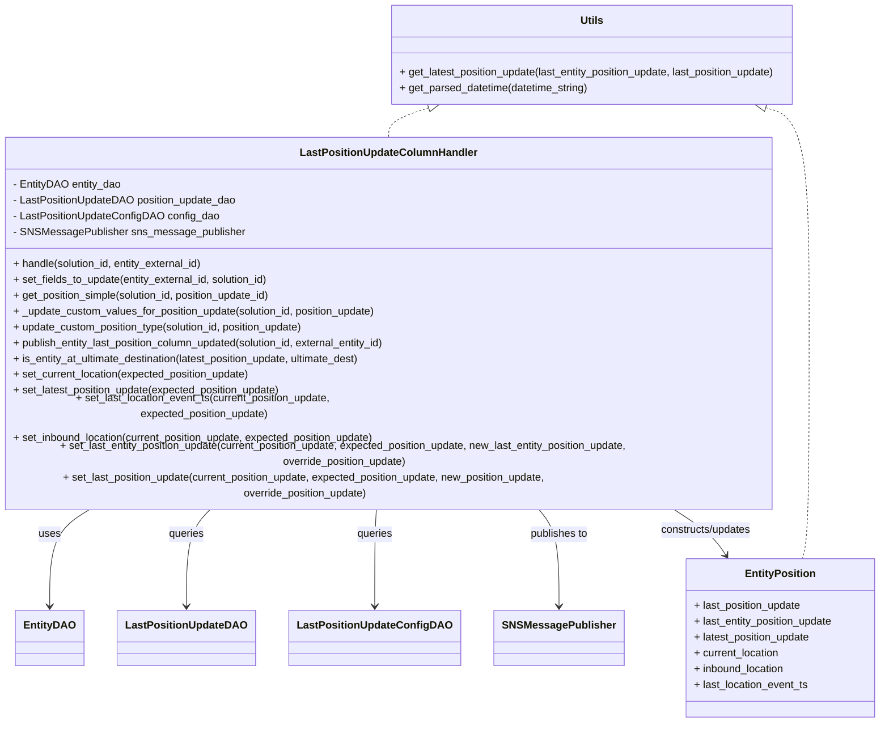

# Diagram: entity_core/entity_service/entity_service/entity/entity/update_entity_last_position_columns/handler.py


> Auto-generated by Obscura crawlers

## Diagram 1



### SVG

<svg id="container" width="1385.546875" xmlns="http://www.w3.org/2000/svg" class="classDiagram" height="1034" viewBox="0 0 1385.546875 1034" role="graphics-document document" aria-roledescription="class"><style>#container{font-family:"trebuchet ms",verdana,arial,sans-serif;font-size:16px;fill:#333;}@keyframes edge-animation-frame{from{stroke-dashoffset:0;}}@keyframes dash{to{stroke-dashoffset:0;}}#container .edge-animation-slow{stroke-dasharray:9,5!important;stroke-dashoffset:900;animation:dash 50s linear infinite;stroke-linecap:round;}#container .edge-animation-fast{stroke-dasharray:9,5!important;stroke-dashoffset:900;animation:dash 20s linear infinite;stroke-linecap:round;}#container .error-icon{fill:#552222;}#container .error-text{fill:#552222;stroke:#552222;}#container .edge-thickness-normal{stroke-width:1px;}#container .edge-thickness-thick{stroke-width:3.5px;}#container .edge-pattern-solid{stroke-dasharray:0;}#container .edge-thickness-invisible{stroke-width:0;fill:none;}#container .edge-pattern-dashed{stroke-dasharray:3;}#container .edge-pattern-dotted{stroke-dasharray:2;}#container .marker{fill:#333333;stroke:#333333;}#container .marker.cross{stroke:#333333;}#container svg{font-family:"trebuchet ms",verdana,arial,sans-serif;font-size:16px;}#container p{margin:0;}#container g.classGroup text{fill:#9370DB;stroke:none;font-family:"trebuchet ms",verdana,arial,sans-serif;font-size:10px;}#container g.classGroup text .title{font-weight:bolder;}#container .nodeLabel,#container .edgeLabel{color:#131300;}#container .edgeLabel .label rect{fill:#ECECFF;}#container .label text{fill:#131300;}#container .labelBkg{background:#ECECFF;}#container .edgeLabel .label span{background:#ECECFF;}#container .classTitle{font-weight:bolder;}#container .node rect,#container .node circle,#container .node ellipse,#container .node polygon,#container .node path{fill:#ECECFF;stroke:#9370DB;stroke-width:1px;}#container .divider{stroke:#9370DB;stroke-width:1;}#container g.clickable{cursor:pointer;}#container g.classGroup rect{fill:#ECECFF;stroke:#9370DB;}#container g.classGroup line{stroke:#9370DB;stroke-width:1;}#container .classLabel .box{stroke:none;stroke-width:0;fill:#ECECFF;opacity:0.5;}#container .classLabel .label{fill:#9370DB;font-size:10px;}#container .relation{stroke:#333333;stroke-width:1;fill:none;}#container .dashed-line{stroke-dasharray:3;}#container .dotted-line{stroke-dasharray:1 2;}#container #compositionStart,#container .composition{fill:#333333!important;stroke:#333333!important;stroke-width:1;}#container #compositionEnd,#container .composition{fill:#333333!important;stroke:#333333!important;stroke-width:1;}#container #dependencyStart,#container .dependency{fill:#333333!important;stroke:#333333!important;stroke-width:1;}#container #dependencyStart,#container .dependency{fill:#333333!important;stroke:#333333!important;stroke-width:1;}#container #extensionStart,#container .extension{fill:transparent!important;stroke:#333333!important;stroke-width:1;}#container #extensionEnd,#container .extension{fill:transparent!important;stroke:#333333!important;stroke-width:1;}#container #aggregationStart,#container .aggregation{fill:transparent!important;stroke:#333333!important;stroke-width:1;}#container #aggregationEnd,#container .aggregation{fill:transparent!important;stroke:#333333!important;stroke-width:1;}#container #lollipopStart,#container .lollipop{fill:#ECECFF!important;stroke:#333333!important;stroke-width:1;}#container #lollipopEnd,#container .lollipop{fill:#ECECFF!important;stroke:#333333!important;stroke-width:1;}#container .edgeTerminals{font-size:11px;line-height:initial;}#container .classTitleText{text-anchor:middle;font-size:18px;fill:#333;}#container .label-icon{display:inline-block;height:1em;overflow:visible;vertical-align:-0.125em;}#container .node .label-icon path{fill:currentColor;stroke:revert;stroke-width:revert;}#container :root{--mermaid-font-family:"trebuchet ms",verdana,arial,sans-serif;}</style><g><defs><marker id="container_class-aggregationStart" class="marker aggregation class" refX="18" refY="7" markerWidth="190" markerHeight="240" orient="auto"><path d="M 18,7 L9,13 L1,7 L9,1 Z"></path></marker></defs><defs><marker id="container_class-aggregationEnd" class="marker aggregation class" refX="1" refY="7" markerWidth="20" markerHeight="28" orient="auto"><path d="M 18,7 L9,13 L1,7 L9,1 Z"></path></marker></defs><defs><marker id="container_class-extensionStart" class="marker extension class" refX="18" refY="7" markerWidth="190" markerHeight="240" orient="auto"><path d="M 1,7 L18,13 V 1 Z"></path></marker></defs><defs><marker id="container_class-extensionEnd" class="marker extension class" refX="1" refY="7" markerWidth="20" markerHeight="28" orient="auto"><path d="M 1,1 V 13 L18,7 Z"></path></marker></defs><defs><marker id="container_class-compositionStart" class="marker composition class" refX="18" refY="7" markerWidth="190" markerHeight="240" orient="auto"><path d="M 18,7 L9,13 L1,7 L9,1 Z"></path></marker></defs><defs><marker id="container_class-compositionEnd" class="marker composition class" refX="1" refY="7" markerWidth="20" markerHeight="28" orient="auto"><path d="M 18,7 L9,13 L1,7 L9,1 Z"></path></marker></defs><defs><marker id="container_class-dependencyStart" class="marker dependency class" refX="6" refY="7" markerWidth="190" markerHeight="240" orient="auto"><path d="M 5,7 L9,13 L1,7 L9,1 Z"></path></marker></defs><defs><marker id="container_class-dependencyEnd" class="marker dependency class" refX="13" refY="7" markerWidth="20" markerHeight="28" orient="auto"><path d="M 18,7 L9,13 L14,7 L9,1 Z"></path></marker></defs><defs><marker id="container_class-lollipopStart" class="marker lollipop class" refX="13" refY="7" markerWidth="190" markerHeight="240" orient="auto"><circle stroke="black" fill="transparent" cx="7" cy="7" r="6"></circle></marker></defs><defs><marker id="container_class-lollipopEnd" class="marker lollipop class" refX="1" refY="7" markerWidth="190" markerHeight="240" orient="auto"><circle stroke="black" fill="transparent" cx="7" cy="7" r="6"></circle></marker></defs><g class="root"><g class="clusters"></g><g class="edgePaths"><path d="M216.577,712L206.574,718.167C196.571,724.333,176.565,736.667,166.562,761C156.559,785.333,156.559,821.667,156.559,839.833L156.559,858" id="id_LastPositionUpdateColumnHandler_EntityDAO_1" class="edge-thickness-normal edge-pattern-solid relation" style=";;;" data-edge="true" data-et="edge" data-id="id_LastPositionUpdateColumnHandler_EntityDAO_1" data-points="W3sieCI6MjE2LjU3NjU3MDYwOTg2MTYyLCJ5Ijo3MTJ9LHsieCI6MTU2LjU1ODU5Mzc1LCJ5Ijo3NDl9LHsieCI6MTU2LjU1ODU5Mzc1LCJ5Ijo4NjR9XQ==" marker-end="url(#container_class-dependencyEnd)"></path><path d="M388.941,712L383.156,718.167C377.371,724.333,365.801,736.667,360.016,761C354.23,785.333,354.23,821.667,354.23,839.833L354.23,858" id="id_LastPositionUpdateColumnHandler_LastPositionUpdateDAO_2" class="edge-thickness-normal edge-pattern-solid relation" style=";;;" data-edge="true" data-et="edge" data-id="id_LastPositionUpdateColumnHandler_LastPositionUpdateDAO_2" data-points="W3sieCI6Mzg4Ljk0MDk3MzcyNDA0ODQzLCJ5Ijo3MTJ9LHsieCI6MzU0LjIzMDQ2ODc1LCJ5Ijo3NDl9LHsieCI6MzU0LjIzMDQ2ODc1LCJ5Ijo4NjR9XQ==" marker-end="url(#container_class-dependencyEnd)"></path><path d="M625.348,712L625.348,718.167C625.348,724.333,625.348,736.667,625.348,761C625.348,785.333,625.348,821.667,625.348,839.833L625.348,858" id="id_LastPositionUpdateColumnHandler_LastPositionUpdateConfigDAO_3" class="edge-thickness-normal edge-pattern-solid relation" style=";;;" data-edge="true" data-et="edge" data-id="id_LastPositionUpdateColumnHandler_LastPositionUpdateConfigDAO_3" data-points="W3sieCI6NjI1LjM0NzY1NjI1LCJ5Ijo3MTJ9LHsieCI6NjI1LjM0NzY1NjI1LCJ5Ijo3NDl9LHsieCI6NjI1LjM0NzY1NjI1LCJ5Ijo4NjR9XQ==" marker-end="url(#container_class-dependencyEnd)"></path><path d="M855.834,712L861.475,718.167C867.115,724.333,878.395,736.667,884.036,761C889.676,785.333,889.676,821.667,889.676,839.833L889.676,858" id="id_LastPositionUpdateColumnHandler_SNSMessagePublisher_4" class="edge-thickness-normal edge-pattern-solid relation" style=";;;" data-edge="true" data-et="edge" data-id="id_LastPositionUpdateColumnHandler_SNSMessagePublisher_4" data-points="W3sieCI6ODU1LjgzNDQ2NDIwODQ3NzUsInkiOjcxMn0seyJ4Ijo4ODkuNjc1NzgxMjUsInkiOjc0OX0seyJ4Ijo4ODkuNjc1NzgxMjUsInkiOjg2NH1d" marker-end="url(#container_class-dependencyEnd)"></path><path d="M1040.587,712L1050.748,718.167C1060.91,724.333,1081.232,736.667,1095.882,748.231C1110.532,759.796,1119.509,770.591,1123.998,775.989L1128.486,781.387" id="id_LastPositionUpdateColumnHandler_EntityPosition_5" class="edge-thickness-normal edge-pattern-solid relation" style=";;;" data-edge="true" data-et="edge" data-id="id_LastPositionUpdateColumnHandler_EntityPosition_5" data-points="W3sieCI6MTA0MC41ODcwMDUyOTg0NDI4LCJ5Ijo3MTJ9LHsieCI6MTEwMS41NTQ2ODc1LCJ5Ijo3NDl9LHsieCI6MTEzMi4zMjIzNTI3MDcwMDYzLCJ5Ijo3ODZ9XQ==" marker-end="url(#container_class-dependencyEnd)"></path><path d="M690.399,163.056L679.557,166.38C668.715,169.704,647.031,176.352,636.19,183.843C625.348,191.333,625.348,199.667,625.348,203.833L625.348,208" id="id_Utils_LastPositionUpdateColumnHandler_6" class="edge-thickness-normal edge-pattern-dashed relation" style=";;;" data-edge="true" data-et="edge" data-id="id_Utils_LastPositionUpdateColumnHandler_6" data-points="W3sieCI6NzA2Ljg5MTExMzI4MTI1LCJ5IjoxNTh9LHsieCI6NjI1LjM0NzY1NjI1LCJ5IjoxODN9LHsieCI6NjI1LjM0NzY1NjI1LCJ5IjoyMDh9XQ==" marker-start="url(#container_class-extensionStart)"></path><path d="M1212.644,163.056L1223.486,166.38C1234.328,169.704,1256.012,176.352,1266.853,225.843C1277.695,275.333,1277.695,367.667,1277.695,462C1277.695,556.333,1277.695,652.667,1275.905,707C1274.114,761.333,1270.533,773.667,1268.743,779.833L1266.952,786" id="id_Utils_EntityPosition_7" class="edge-thickness-normal edge-pattern-dashed relation" style=";;;" data-edge="true" data-et="edge" data-id="id_Utils_EntityPosition_7" data-points="W3sieCI6MTE5Ni4xNTE4NTU0Njg3NSwieSI6MTU4fSx7IngiOjEyNzcuNjk1MzEyNSwieSI6MTgzfSx7IngiOjEyNzcuNjk1MzEyNSwieSI6NDYwfSx7IngiOjEyNzcuNjk1MzEyNSwieSI6NzQ5fSx7IngiOjEyNjYuOTUyMTI5Nzc3MDcsInkiOjc4Nn1d" marker-start="url(#container_class-extensionStart)"></path></g><g class="edgeLabels"><g class="edgeLabel" transform="translate(156.55859375, 749)"><g class="label" data-id="id_LastPositionUpdateColumnHandler_EntityDAO_1" transform="translate(-16.4921875, -12)"><foreignObject width="32.984375" height="24"><div xmlns="http://www.w3.org/1999/xhtml" class="labelBkg" style="display: table-cell; white-space: nowrap; line-height: 1.5; max-width: 200px; text-align: center;"><span class="edgeLabel"><p>uses</p></span></div></foreignObject></g></g><g class="edgeLabel" transform="translate(354.23046875, 749)"><g class="label" data-id="id_LastPositionUpdateColumnHandler_LastPositionUpdateDAO_2" transform="translate(-27.2421875, -12)"><foreignObject width="54.484375" height="24"><div xmlns="http://www.w3.org/1999/xhtml" class="labelBkg" style="display: table-cell; white-space: nowrap; line-height: 1.5; max-width: 200px; text-align: center;"><span class="edgeLabel"><p>queries</p></span></div></foreignObject></g></g><g class="edgeLabel" transform="translate(625.34765625, 749)"><g class="label" data-id="id_LastPositionUpdateColumnHandler_LastPositionUpdateConfigDAO_3" transform="translate(-27.2421875, -12)"><foreignObject width="54.484375" height="24"><div xmlns="http://www.w3.org/1999/xhtml" class="labelBkg" style="display: table-cell; white-space: nowrap; line-height: 1.5; max-width: 200px; text-align: center;"><span class="edgeLabel"><p>queries</p></span></div></foreignObject></g></g><g class="edgeLabel" transform="translate(889.67578125, 749)"><g class="label" data-id="id_LastPositionUpdateColumnHandler_SNSMessagePublisher_4" transform="translate(-44.84375, -12)"><foreignObject width="89.6875" height="24"><div xmlns="http://www.w3.org/1999/xhtml" class="labelBkg" style="display: table-cell; white-space: nowrap; line-height: 1.5; max-width: 200px; text-align: center;"><span class="edgeLabel"><p>publishes to</p></span></div></foreignObject></g></g><g class="edgeLabel" transform="translate(1091.63995, 742.98296)"><g class="label" data-id="id_LastPositionUpdateColumnHandler_EntityPosition_5" transform="translate(-71.171875, -12)"><foreignObject width="142.34375" height="24"><div xmlns="http://www.w3.org/1999/xhtml" class="labelBkg" style="display: table-cell; white-space: nowrap; line-height: 1.5; max-width: 200px; text-align: center;"><span class="edgeLabel"><p>constructs/updates</p></span></div></foreignObject></g></g><g class="edgeLabel"><g class="label" data-id="id_Utils_LastPositionUpdateColumnHandler_6" transform="translate(0, 0)"><foreignObject width="0" height="0"><div xmlns="http://www.w3.org/1999/xhtml" class="labelBkg" style="display: table-cell; white-space: nowrap; line-height: 1.5; max-width: 200px; text-align: center;"><span class="edgeLabel"></span></div></foreignObject></g></g><g class="edgeLabel"><g class="label" data-id="id_Utils_EntityPosition_7" transform="translate(0, 0)"><foreignObject width="0" height="0"><div xmlns="http://www.w3.org/1999/xhtml" class="labelBkg" style="display: table-cell; white-space: nowrap; line-height: 1.5; max-width: 200px; text-align: center;"><span class="edgeLabel"></span></div></foreignObject></g></g></g><g class="nodes"><g class="node default" id="classId-LastPositionUpdateColumnHandler-0" transform="translate(625.34765625, 460)"><g class="basic label-container"><path d="M-617.34765625 -252 L617.34765625 -252 L617.34765625 252 L-617.34765625 252" stroke="none" stroke-width="0" fill="#ECECFF" style=""></path><path d="M-617.34765625 -252 C-294.57690845420404 -252, 28.19383934159191 -252, 617.34765625 -252 M-617.34765625 -252 C-193.33660538800518 -252, 230.67444547398964 -252, 617.34765625 -252 M617.34765625 -252 C617.34765625 -54.81666681100316, 617.34765625 142.36666637799368, 617.34765625 252 M617.34765625 -252 C617.34765625 -82.3659632665906, 617.34765625 87.2680734668188, 617.34765625 252 M617.34765625 252 C142.42004508951413 252, -332.50756607097173 252, -617.34765625 252 M617.34765625 252 C175.52975517658712 252, -266.28814589682577 252, -617.34765625 252 M-617.34765625 252 C-617.34765625 146.52753355717073, -617.34765625 41.055067114341455, -617.34765625 -252 M-617.34765625 252 C-617.34765625 113.46319272583222, -617.34765625 -25.07361454833557, -617.34765625 -252" stroke="#9370DB" stroke-width="1.3" fill="none" stroke-dasharray="0 0" style=""></path></g><g class="annotation-group text" transform="translate(0, -228)"></g><g class="label-group text" transform="translate(-128.3203125, -228)"><g class="label" style="font-weight: bolder" transform="translate(0,-12)"><foreignObject width="256.640625" height="24"><div xmlns="http://www.w3.org/1999/xhtml" style="display: table-cell; white-space: nowrap; line-height: 1.5; max-width: 305px; text-align: center;"><span class="nodeLabel markdown-node-label" style=""><p>LastPositionUpdateColumnHandler</p></span></div></foreignObject></g></g><g class="members-group text" transform="translate(-605.34765625, -180)"><g class="label" style="" transform="translate(0,-12)"><foreignObject width="163.875" height="24"><div xmlns="http://www.w3.org/1999/xhtml" style="display: table-cell; white-space: nowrap; line-height: 1.5; max-width: 221px; text-align: center;"><span class="nodeLabel markdown-node-label" style=""><p>- EntityDAO entity_dao</p></span></div></foreignObject></g><g class="label" style="" transform="translate(0,12)"><foreignObject width="341.015625" height="24"><div xmlns="http://www.w3.org/1999/xhtml" style="display: table-cell; white-space: nowrap; line-height: 1.5; max-width: 398px; text-align: center;"><span class="nodeLabel markdown-node-label" style=""><p>- LastPositionUpdateDAO position_update_dao</p></span></div></foreignObject></g><g class="label" style="" transform="translate(0,36)"><foreignObject width="310.671875" height="24"><div xmlns="http://www.w3.org/1999/xhtml" style="display: table-cell; white-space: nowrap; line-height: 1.5; max-width: 368px; text-align: center;"><span class="nodeLabel markdown-node-label" style=""><p>- LastPositionUpdateConfigDAO config_dao</p></span></div></foreignObject></g><g class="label" style="" transform="translate(0,60)"><foreignObject width="344.859375" height="24"><div xmlns="http://www.w3.org/1999/xhtml" style="display: table-cell; white-space: nowrap; line-height: 1.5; max-width: 403px; text-align: center;"><span class="nodeLabel markdown-node-label" style=""><p>- SNSMessagePublisher sns_message_publisher</p></span></div></foreignObject></g></g><g class="methods-group text" transform="translate(-605.34765625, -60)"><g class="label" style="" transform="translate(0,-12)"><foreignObject width="294.5" height="24"><div xmlns="http://www.w3.org/1999/xhtml" style="display: table-cell; white-space: nowrap; line-height: 1.5; max-width: 352px; text-align: center;"><span class="nodeLabel markdown-node-label" style=""><p>+ handle(solution_id, entity_external_id)</p></span></div></foreignObject></g><g class="label" style="" transform="translate(0,12)"><foreignObject width="395.265625" height="24"><div xmlns="http://www.w3.org/1999/xhtml" style="display: table-cell; white-space: nowrap; line-height: 1.5; max-width: 453px; text-align: center;"><span class="nodeLabel markdown-node-label" style=""><p>+ set_fields_to_update(entity_external_id, solution_id)</p></span></div></foreignObject></g><g class="label" style="" transform="translate(0,36)"><foreignObject width="401.734375" height="24"><div xmlns="http://www.w3.org/1999/xhtml" style="display: table-cell; white-space: nowrap; line-height: 1.5; max-width: 459px; text-align: center;"><span class="nodeLabel markdown-node-label" style=""><p>+ get_position_simple(solution_id, position_update_id)</p></span></div></foreignObject></g><g class="label" style="" transform="translate(0,60)"><foreignObject width="560.796875" height="24"><div xmlns="http://www.w3.org/1999/xhtml" style="display: table-cell; white-space: nowrap; line-height: 1.5; max-width: 618px; text-align: center;"><span class="nodeLabel markdown-node-label" style=""><p>+ _update_custom_values_for_position_update(solution_id, position_update)</p></span></div></foreignObject></g><g class="label" style="" transform="translate(0,84)"><foreignObject width="451.921875" height="24"><div xmlns="http://www.w3.org/1999/xhtml" style="display: table-cell; white-space: nowrap; line-height: 1.5; max-width: 509px; text-align: center;"><span class="nodeLabel markdown-node-label" style=""><p>+ update_custom_position_type(solution_id, position_update)</p></span></div></foreignObject></g><g class="label" style="" transform="translate(0,108)"><foreignObject width="581.390625" height="24"><div xmlns="http://www.w3.org/1999/xhtml" style="display: table-cell; white-space: nowrap; line-height: 1.5; max-width: 639px; text-align: center;"><span class="nodeLabel markdown-node-label" style=""><p>+ publish_entity_last_position_column_updated(solution_id, external_entity_id)</p></span></div></foreignObject></g><g class="label" style="" transform="translate(0,132)"><foreignObject width="542.40625" height="24"><div xmlns="http://www.w3.org/1999/xhtml" style="display: table-cell; white-space: nowrap; line-height: 1.5; max-width: 600px; text-align: center;"><span class="nodeLabel markdown-node-label" style=""><p>+ is_entity_at_ultimate_destination(latest_position_update, ultimate_dest)</p></span></div></foreignObject></g><g class="label" style="" transform="translate(0,156)"><foreignObject width="365.953125" height="24"><div xmlns="http://www.w3.org/1999/xhtml" style="display: table-cell; white-space: nowrap; line-height: 1.5; max-width: 423px; text-align: center;"><span class="nodeLabel markdown-node-label" style=""><p>+ set_current_location(expected_position_update)</p></span></div></foreignObject></g><g class="label" style="" transform="translate(0,180)"><foreignObject width="414.578125" height="24"><div xmlns="http://www.w3.org/1999/xhtml" style="display: table-cell; white-space: nowrap; line-height: 1.5; max-width: 472px; text-align: center;"><span class="nodeLabel markdown-node-label" style=""><p>+ set_latest_position_update(expected_position_update)</p></span></div></foreignObject></g><g class="label" style="" transform="translate(0,204)"><foreignObject width="597.53125" height="24"><div xmlns="http://www.w3.org/1999/xhtml" style="display: table-cell; white-space: nowrap; line-height: 1.5; max-width: 655px; text-align: center;"><span class="nodeLabel markdown-node-label" style=""><p>+ set_last_location_event_ts(current_position_update, expected_position_update)</p></span></div></foreignObject></g><g class="label" style="" transform="translate(0,228)"><foreignObject width="562.703125" height="24"><div xmlns="http://www.w3.org/1999/xhtml" style="display: table-cell; white-space: nowrap; line-height: 1.5; max-width: 620px; text-align: center;"><span class="nodeLabel markdown-node-label" style=""><p>+ set_inbound_location(current_position_update, expected_position_update)</p></span></div></foreignObject></g><g class="label" style="" transform="translate(0,252)"><foreignObject width="1082.375" height="24"><div xmlns="http://www.w3.org/1999/xhtml" style="display: table-cell; white-space: nowrap; line-height: 1.5; max-width: 1140px; text-align: center;"><span class="nodeLabel markdown-node-label" style=""><p>+ set_last_entity_position_update(current_position_update, expected_position_update, new_last_entity_position_update, override_position_update)</p></span></div></foreignObject></g><g class="label" style="" transform="translate(0,276)"><foreignObject width="948.875" height="24"><div xmlns="http://www.w3.org/1999/xhtml" style="display: table-cell; white-space: nowrap; line-height: 1.5; max-width: 1006px; text-align: center;"><span class="nodeLabel markdown-node-label" style=""><p>+ set_last_position_update(current_position_update, expected_position_update, new_position_update, override_position_update)</p></span></div></foreignObject></g></g><g class="divider" style=""><path d="M-617.34765625 -204 C-308.3407295803151 -204, 0.6661970893698026 -204, 617.34765625 -204 M-617.34765625 -204 C-212.06737397707747 -204, 193.21290829584507 -204, 617.34765625 -204" stroke="#9370DB" stroke-width="1.3" fill="none" stroke-dasharray="0 0" style=""></path></g><g class="divider" style=""><path d="M-617.34765625 -84 C-363.17910201607765 -84, -109.0105477821553 -84, 617.34765625 -84 M-617.34765625 -84 C-162.44858448267297 -84, 292.45048728465406 -84, 617.34765625 -84" stroke="#9370DB" stroke-width="1.3" fill="none" stroke-dasharray="0 0" style=""></path></g></g><g class="node default" id="classId-EntityPosition-1" transform="translate(1232.109375, 906)"><g class="basic label-container"><path d="M-145.4375 -120 L145.4375 -120 L145.4375 120 L-145.4375 120" stroke="none" stroke-width="0" fill="#ECECFF" style=""></path><path d="M-145.4375 -120 C-74.92976541077805 -120, -4.422030821556092 -120, 145.4375 -120 M-145.4375 -120 C-87.23495991773578 -120, -29.032419835471543 -120, 145.4375 -120 M145.4375 -120 C145.4375 -68.37551850543305, 145.4375 -16.7510370108661, 145.4375 120 M145.4375 -120 C145.4375 -26.966612928913534, 145.4375 66.06677414217293, 145.4375 120 M145.4375 120 C74.70914211685705 120, 3.980784233714104 120, -145.4375 120 M145.4375 120 C83.8043570375776 120, 22.17121407515519 120, -145.4375 120 M-145.4375 120 C-145.4375 70.17772398255997, -145.4375 20.35544796511992, -145.4375 -120 M-145.4375 120 C-145.4375 68.63554390768803, -145.4375 17.271087815376077, -145.4375 -120" stroke="#9370DB" stroke-width="1.3" fill="none" stroke-dasharray="0 0" style=""></path></g><g class="annotation-group text" transform="translate(0, -96)"></g><g class="label-group text" transform="translate(-51.265625, -96)"><g class="label" style="font-weight: bolder" transform="translate(0,-12)"><foreignObject width="102.53125" height="24"><div xmlns="http://www.w3.org/1999/xhtml" style="display: table-cell; white-space: nowrap; line-height: 1.5; max-width: 151px; text-align: center;"><span class="nodeLabel markdown-node-label" style=""><p>EntityPosition</p></span></div></foreignObject></g></g><g class="members-group text" transform="translate(-133.4375, -48)"><g class="label" style="" transform="translate(0,-12)"><foreignObject width="166.140625" height="24"><div xmlns="http://www.w3.org/1999/xhtml" style="display: table-cell; white-space: nowrap; line-height: 1.5; max-width: 224px; text-align: center;"><span class="nodeLabel markdown-node-label" style=""><p>+ last_position_update</p></span></div></foreignObject></g><g class="label" style="" transform="translate(0,12)"><foreignObject width="215.609375" height="24"><div xmlns="http://www.w3.org/1999/xhtml" style="display: table-cell; white-space: nowrap; line-height: 1.5; max-width: 273px; text-align: center;"><span class="nodeLabel markdown-node-label" style=""><p>+ last_entity_position_update</p></span></div></foreignObject></g><g class="label" style="" transform="translate(0,36)"><foreignObject width="180.546875" height="24"><div xmlns="http://www.w3.org/1999/xhtml" style="display: table-cell; white-space: nowrap; line-height: 1.5; max-width: 238px; text-align: center;"><span class="nodeLabel markdown-node-label" style=""><p>+ latest_position_update</p></span></div></foreignObject></g><g class="label" style="" transform="translate(0,60)"><foreignObject width="132.09375" height="24"><div xmlns="http://www.w3.org/1999/xhtml" style="display: table-cell; white-space: nowrap; line-height: 1.5; max-width: 189px; text-align: center;"><span class="nodeLabel markdown-node-label" style=""><p>+ current_location</p></span></div></foreignObject></g><g class="label" style="" transform="translate(0,84)"><foreignObject width="140.53125" height="24"><div xmlns="http://www.w3.org/1999/xhtml" style="display: table-cell; white-space: nowrap; line-height: 1.5; max-width: 198px; text-align: center;"><span class="nodeLabel markdown-node-label" style=""><p>+ inbound_location</p></span></div></foreignObject></g><g class="label" style="" transform="translate(0,108)"><foreignObject width="175.53125" height="24"><div xmlns="http://www.w3.org/1999/xhtml" style="display: table-cell; white-space: nowrap; line-height: 1.5; max-width: 233px; text-align: center;"><span class="nodeLabel markdown-node-label" style=""><p>+ last_location_event_ts</p></span></div></foreignObject></g></g><g class="methods-group text" transform="translate(-133.4375, 120)"></g><g class="divider" style=""><path d="M-145.4375 -72 C-45.668420740835614 -72, 54.10065851832877 -72, 145.4375 -72 M-145.4375 -72 C-66.95290013138313 -72, 11.531699737233737 -72, 145.4375 -72" stroke="#9370DB" stroke-width="1.3" fill="none" stroke-dasharray="0 0" style=""></path></g><g class="divider" style=""><path d="M-145.4375 96 C-86.11275786106393 96, -26.788015722127838 96, 145.4375 96 M-145.4375 96 C-63.01265694434794 96, 19.412186111304123 96, 145.4375 96" stroke="#9370DB" stroke-width="1.3" fill="none" stroke-dasharray="0 0" style=""></path></g></g><g class="node default" id="classId-EntityDAO-2" transform="translate(156.55859375, 906)"><g class="basic label-container"><path d="M-48.578125 -42 L48.578125 -42 L48.578125 42 L-48.578125 42" stroke="none" stroke-width="0" fill="#ECECFF" style=""></path><path d="M-48.578125 -42 C-19.859536257615396 -42, 8.859052484769208 -42, 48.578125 -42 M-48.578125 -42 C-19.611653093129245 -42, 9.35481881374151 -42, 48.578125 -42 M48.578125 -42 C48.578125 -21.18527067716326, 48.578125 -0.37054135432651947, 48.578125 42 M48.578125 -42 C48.578125 -20.94453031446882, 48.578125 0.11093937106235785, 48.578125 42 M48.578125 42 C12.552979949521415 42, -23.47216510095717 42, -48.578125 42 M48.578125 42 C26.605251926366346 42, 4.632378852732693 42, -48.578125 42 M-48.578125 42 C-48.578125 24.7369877391009, -48.578125 7.473975478201801, -48.578125 -42 M-48.578125 42 C-48.578125 18.214660647017446, -48.578125 -5.570678705965108, -48.578125 -42" stroke="#9370DB" stroke-width="1.3" fill="none" stroke-dasharray="0 0" style=""></path></g><g class="annotation-group text" transform="translate(0, -18)"></g><g class="label-group text" transform="translate(-36.578125, -18)"><g class="label" style="font-weight: bolder" transform="translate(0,-12)"><foreignObject width="73.15625" height="24"><div xmlns="http://www.w3.org/1999/xhtml" style="display: table-cell; white-space: nowrap; line-height: 1.5; max-width: 122px; text-align: center;"><span class="nodeLabel markdown-node-label" style=""><p>EntityDAO</p></span></div></foreignObject></g></g><g class="members-group text" transform="translate(-36.578125, 30)"></g><g class="methods-group text" transform="translate(-36.578125, 60)"></g><g class="divider" style=""><path d="M-48.578125 6 C-19.227691438576674 6, 10.122742122846653 6, 48.578125 6 M-48.578125 6 C-18.628259629854853 6, 11.321605740290295 6, 48.578125 6" stroke="#9370DB" stroke-width="1.3" fill="none" stroke-dasharray="0 0" style=""></path></g><g class="divider" style=""><path d="M-48.578125 24 C-24.09918310827403 24, 0.3797587834519405 24, 48.578125 24 M-48.578125 24 C-25.150700382257764 24, -1.7232757645155274 24, 48.578125 24" stroke="#9370DB" stroke-width="1.3" fill="none" stroke-dasharray="0 0" style=""></path></g></g><g class="node default" id="classId-LastPositionUpdateDAO-3" transform="translate(354.23046875, 906)"><g class="basic label-container"><path d="M-99.09375 -42 L99.09375 -42 L99.09375 42 L-99.09375 42" stroke="none" stroke-width="0" fill="#ECECFF" style=""></path><path d="M-99.09375 -42 C-57.68553462811667 -42, -16.27731925623334 -42, 99.09375 -42 M-99.09375 -42 C-56.40530063275653 -42, -13.716851265513057 -42, 99.09375 -42 M99.09375 -42 C99.09375 -12.983288447224023, 99.09375 16.033423105551954, 99.09375 42 M99.09375 -42 C99.09375 -19.202977390923554, 99.09375 3.5940452181528926, 99.09375 42 M99.09375 42 C29.45243626128405 42, -40.1888774774319 42, -99.09375 42 M99.09375 42 C31.29931932073646 42, -36.49511135852708 42, -99.09375 42 M-99.09375 42 C-99.09375 24.938921684953435, -99.09375 7.87784336990687, -99.09375 -42 M-99.09375 42 C-99.09375 13.360443333676873, -99.09375 -15.279113332646254, -99.09375 -42" stroke="#9370DB" stroke-width="1.3" fill="none" stroke-dasharray="0 0" style=""></path></g><g class="annotation-group text" transform="translate(0, -18)"></g><g class="label-group text" transform="translate(-87.09375, -18)"><g class="label" style="font-weight: bolder" transform="translate(0,-12)"><foreignObject width="174.1875" height="24"><div xmlns="http://www.w3.org/1999/xhtml" style="display: table-cell; white-space: nowrap; line-height: 1.5; max-width: 222px; text-align: center;"><span class="nodeLabel markdown-node-label" style=""><p>LastPositionUpdateDAO</p></span></div></foreignObject></g></g><g class="members-group text" transform="translate(-87.09375, 30)"></g><g class="methods-group text" transform="translate(-87.09375, 60)"></g><g class="divider" style=""><path d="M-99.09375 6 C-57.193968085049626 6, -15.294186170099252 6, 99.09375 6 M-99.09375 6 C-30.98853889358766 6, 37.11667221282468 6, 99.09375 6" stroke="#9370DB" stroke-width="1.3" fill="none" stroke-dasharray="0 0" style=""></path></g><g class="divider" style=""><path d="M-99.09375 24 C-23.0423850152344 24, 53.0089799695312 24, 99.09375 24 M-99.09375 24 C-20.964326857073175 24, 57.16509628585365 24, 99.09375 24" stroke="#9370DB" stroke-width="1.3" fill="none" stroke-dasharray="0 0" style=""></path></g></g><g class="node default" id="classId-LastPositionUpdateConfigDAO-4" transform="translate(625.34765625, 906)"><g class="basic label-container"><path d="M-122.0234375 -42 L122.0234375 -42 L122.0234375 42 L-122.0234375 42" stroke="none" stroke-width="0" fill="#ECECFF" style=""></path><path d="M-122.0234375 -42 C-71.60617808151261 -42, -21.18891866302522 -42, 122.0234375 -42 M-122.0234375 -42 C-47.93402641763754 -42, 26.15538466472492 -42, 122.0234375 -42 M122.0234375 -42 C122.0234375 -17.603643699063532, 122.0234375 6.792712601872935, 122.0234375 42 M122.0234375 -42 C122.0234375 -24.494181380240352, 122.0234375 -6.988362760480705, 122.0234375 42 M122.0234375 42 C32.82398061576555 42, -56.3754762684689 42, -122.0234375 42 M122.0234375 42 C28.986785387534496 42, -64.04986672493101 42, -122.0234375 42 M-122.0234375 42 C-122.0234375 17.007007037564073, -122.0234375 -7.985985924871855, -122.0234375 -42 M-122.0234375 42 C-122.0234375 12.031944494177054, -122.0234375 -17.93611101164589, -122.0234375 -42" stroke="#9370DB" stroke-width="1.3" fill="none" stroke-dasharray="0 0" style=""></path></g><g class="annotation-group text" transform="translate(0, -18)"></g><g class="label-group text" transform="translate(-110.0234375, -18)"><g class="label" style="font-weight: bolder" transform="translate(0,-12)"><foreignObject width="220.046875" height="24"><div xmlns="http://www.w3.org/1999/xhtml" style="display: table-cell; white-space: nowrap; line-height: 1.5; max-width: 266px; text-align: center;"><span class="nodeLabel markdown-node-label" style=""><p>LastPositionUpdateConfigDAO</p></span></div></foreignObject></g></g><g class="members-group text" transform="translate(-110.0234375, 30)"></g><g class="methods-group text" transform="translate(-110.0234375, 60)"></g><g class="divider" style=""><path d="M-122.0234375 6 C-43.10415194893227 6, 35.81513360213546 6, 122.0234375 6 M-122.0234375 6 C-25.174866145815116 6, 71.67370520836977 6, 122.0234375 6" stroke="#9370DB" stroke-width="1.3" fill="none" stroke-dasharray="0 0" style=""></path></g><g class="divider" style=""><path d="M-122.0234375 24 C-46.73004592715233 24, 28.563345645695335 24, 122.0234375 24 M-122.0234375 24 C-26.923560291404314 24, 68.17631691719137 24, 122.0234375 24" stroke="#9370DB" stroke-width="1.3" fill="none" stroke-dasharray="0 0" style=""></path></g></g><g class="node default" id="classId-SNSMessagePublisher-5" transform="translate(889.67578125, 906)"><g class="basic label-container"><path d="M-92.3046875 -42 L92.3046875 -42 L92.3046875 42 L-92.3046875 42" stroke="none" stroke-width="0" fill="#ECECFF" style=""></path><path d="M-92.3046875 -42 C-33.18473554608605 -42, 25.935216407827895 -42, 92.3046875 -42 M-92.3046875 -42 C-36.576778027490995 -42, 19.15113144501801 -42, 92.3046875 -42 M92.3046875 -42 C92.3046875 -23.664028527967808, 92.3046875 -5.328057055935616, 92.3046875 42 M92.3046875 -42 C92.3046875 -17.32576277580096, 92.3046875 7.348474448398079, 92.3046875 42 M92.3046875 42 C44.81802139165102 42, -2.6686447166979548 42, -92.3046875 42 M92.3046875 42 C30.49386206001772 42, -31.316963379964562 42, -92.3046875 42 M-92.3046875 42 C-92.3046875 19.404243268785702, -92.3046875 -3.1915134624285955, -92.3046875 -42 M-92.3046875 42 C-92.3046875 17.163641854971434, -92.3046875 -7.6727162900571315, -92.3046875 -42" stroke="#9370DB" stroke-width="1.3" fill="none" stroke-dasharray="0 0" style=""></path></g><g class="annotation-group text" transform="translate(0, -18)"></g><g class="label-group text" transform="translate(-80.3046875, -18)"><g class="label" style="font-weight: bolder" transform="translate(0,-12)"><foreignObject width="160.609375" height="24"><div xmlns="http://www.w3.org/1999/xhtml" style="display: table-cell; white-space: nowrap; line-height: 1.5; max-width: 209px; text-align: center;"><span class="nodeLabel markdown-node-label" style=""><p>SNSMessagePublisher</p></span></div></foreignObject></g></g><g class="members-group text" transform="translate(-80.3046875, 30)"></g><g class="methods-group text" transform="translate(-80.3046875, 60)"></g><g class="divider" style=""><path d="M-92.3046875 6 C-46.92716086419864 6, -1.5496342283972808 6, 92.3046875 6 M-92.3046875 6 C-54.07516560214548 6, -15.845643704290964 6, 92.3046875 6" stroke="#9370DB" stroke-width="1.3" fill="none" stroke-dasharray="0 0" style=""></path></g><g class="divider" style=""><path d="M-92.3046875 24 C-52.94101157598859 24, -13.57733565197718 24, 92.3046875 24 M-92.3046875 24 C-43.72807757937803 24, 4.8485323412439385 24, 92.3046875 24" stroke="#9370DB" stroke-width="1.3" fill="none" stroke-dasharray="0 0" style=""></path></g></g><g class="node default" id="classId-Utils-6" transform="translate(951.521484375, 83)"><g class="basic label-container"><path d="M-313.8203125 -75 L313.8203125 -75 L313.8203125 75 L-313.8203125 75" stroke="none" stroke-width="0" fill="#ECECFF" style=""></path><path d="M-313.8203125 -75 C-158.76398367313996 -75, -3.7076548462799224 -75, 313.8203125 -75 M-313.8203125 -75 C-84.95664907442654 -75, 143.90701435114693 -75, 313.8203125 -75 M313.8203125 -75 C313.8203125 -20.143252360844848, 313.8203125 34.713495278310305, 313.8203125 75 M313.8203125 -75 C313.8203125 -16.351637814343064, 313.8203125 42.29672437131387, 313.8203125 75 M313.8203125 75 C133.4097696422663 75, -47.000773215467404 75, -313.8203125 75 M313.8203125 75 C169.28464850634765 75, 24.7489845126953 75, -313.8203125 75 M-313.8203125 75 C-313.8203125 40.31552500358122, -313.8203125 5.631050007162443, -313.8203125 -75 M-313.8203125 75 C-313.8203125 43.434465980151955, -313.8203125 11.868931960303911, -313.8203125 -75" stroke="#9370DB" stroke-width="1.3" fill="none" stroke-dasharray="0 0" style=""></path></g><g class="annotation-group text" transform="translate(0, -51)"></g><g class="label-group text" transform="translate(-16.796875, -51)"><g class="label" style="font-weight: bolder" transform="translate(0,-12)"><foreignObject width="33.59375" height="24"><div xmlns="http://www.w3.org/1999/xhtml" style="display: table-cell; white-space: nowrap; line-height: 1.5; max-width: 83px; text-align: center;"><span class="nodeLabel markdown-node-label" style=""><p>Utils</p></span></div></foreignObject></g></g><g class="members-group text" transform="translate(-301.8203125, -3)"></g><g class="methods-group text" transform="translate(-301.8203125, 27)"><g class="label" style="" transform="translate(0,-12)"><foreignObject width="586.84375" height="24"><div xmlns="http://www.w3.org/1999/xhtml" style="display: table-cell; white-space: nowrap; line-height: 1.5; max-width: 644px; text-align: center;"><span class="nodeLabel markdown-node-label" style=""><p>+ get_latest_position_update(last_entity_position_update, last_position_update)</p></span></div></foreignObject></g><g class="label" style="" transform="translate(0,12)"><foreignObject width="291.359375" height="24"><div xmlns="http://www.w3.org/1999/xhtml" style="display: table-cell; white-space: nowrap; line-height: 1.5; max-width: 349px; text-align: center;"><span class="nodeLabel markdown-node-label" style=""><p>+ get_parsed_datetime(datetime_string)</p></span></div></foreignObject></g></g><g class="divider" style=""><path d="M-313.8203125 -27 C-161.71024375488403 -27, -9.600175009768066 -27, 313.8203125 -27 M-313.8203125 -27 C-135.74705017942026 -27, 42.32621214115949 -27, 313.8203125 -27" stroke="#9370DB" stroke-width="1.3" fill="none" stroke-dasharray="0 0" style=""></path></g><g class="divider" style=""><path d="M-313.8203125 -3 C-72.85271516248537 -3, 168.11488217502927 -3, 313.8203125 -3 M-313.8203125 -3 C-67.18916182807953 -3, 179.44198884384093 -3, 313.8203125 -3" stroke="#9370DB" stroke-width="1.3" fill="none" stroke-dasharray="0 0" style=""></path></g></g></g></g></g></svg>

## Diagram 2

```mermaid
flowchart TD
A[handle(solution_id, entity_external_id)] --> B[set_fields_to_update(entity_external_id, solution_id)]
B --> C[read config_dao.get_current_location_override_code]
C --> D[entity_dao.get_entity_data(current_location_override_code)]
D --> E[build current_position_update (EntityPosition)]
E --> F[position_update_dao.get_latest_position_updates(entity_internal_id, trip_plan_complete_ts, override_ts)]
F --> G{position_ids present?}
G -->|yes| H[position_update_dao.get_position_simple_batch(position_ids) & update custom values]
G -->|no| I[skip position batch]
H --> J[determine last_position_update / last_entity_position_update / override_position_update]
J --> K[compute latest_position_update via get_latest_position_update]
K --> L[build expected_position_update (apply delivery override logic / ultimate destination)]
L --> M[set_latest_position_update -> set_current_location -> set_inbound_location -> set_last_location_event_ts]
M --> N{compare fields between current and expected}
N -->|changes detected| O[entity_dao.update(solution_id, entity_external_id, update_fields)]
O --> P[publish_entity_last_position_column_updated(solution_id, entity_external_id)]
N -->|no changes| Q[no update]
P --> R[return]
Q --> R
```

> SVG rendering failed for this diagram.
