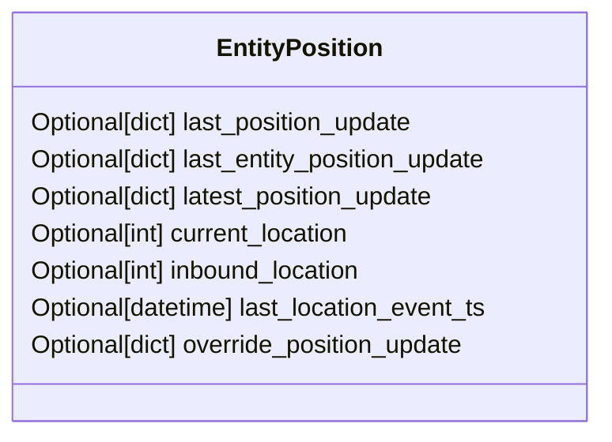

# Diagram: entity_core/entity_service/entity_service/entity/entity/update_entity_last_position_columns/models.py

> Auto-generated by Obscura crawlers

## Mermaid

### SVG

<svg id="container" width="399.671875" xmlns="http://www.w3.org/2000/svg" class="classDiagram" height="280" viewBox="0 0 399.671875 280" role="graphics-document document" aria-roledescription="class"><g><defs><marker id="container_class-aggregationStart" class="marker aggregation class" refX="18" refY="7" markerWidth="190" markerHeight="240" orient="auto"><path d="M 18,7 L9,13 L1,7 L9,1 Z"></path></marker></defs><defs><marker id="container_class-aggregationEnd" class="marker aggregation class" refX="1" refY="7" markerWidth="20" markerHeight="28" orient="auto"><path d="M 18,7 L9,13 L1,7 L9,1 Z"></path></marker></defs><defs><marker id="container_class-extensionStart" class="marker extension class" refX="18" refY="7" markerWidth="190" markerHeight="240" orient="auto"><path d="M 1,7 L18,13 V 1 Z"></path></marker></defs><defs><marker id="container_class-extensionEnd" class="marker extension class" refX="1" refY="7" markerWidth="20" markerHeight="28" orient="auto"><path d="M 1,1 V 13 L18,7 Z"></path></marker></defs><defs><marker id="container_class-compositionStart" class="marker composition class" refX="18" refY="7" markerWidth="190" markerHeight="240" orient="auto"><path d="M 18,7 L9,13 L1,7 L9,1 Z"></path></marker></defs><defs><marker id="container_class-compositionEnd" class="marker composition class" refX="1" refY="7" markerWidth="20" markerHeight="28" orient="auto"><path d="M 18,7 L9,13 L1,7 L9,1 Z"></path></marker></defs><defs><marker id="container_class-dependencyStart" class="marker dependency class" refX="6" refY="7" markerWidth="190" markerHeight="240" orient="auto"><path d="M 5,7 L9,13 L1,7 L9,1 Z"></path></marker></defs><defs><marker id="container_class-dependencyEnd" class="marker dependency class" refX="13" refY="7" markerWidth="20" markerHeight="28" orient="auto"><path d="M 18,7 L9,13 L14,7 L9,1 Z"></path></marker></defs><defs><marker id="container_class-lollipopStart" class="marker lollipop class" refX="13" refY="7" markerWidth="190" markerHeight="240" orient="auto"><circle stroke="black" fill="transparent" cx="7" cy="7" r="6"></circle></marker></defs><defs><marker id="container_class-lollipopEnd" class="marker lollipop class" refX="1" refY="7" markerWidth="190" markerHeight="240" orient="auto"><circle stroke="black" fill="transparent" cx="7" cy="7" r="6"></circle></marker></defs><g class="root"><g class="clusters"></g><g class="edgePaths"></g><g class="edgeLabels"></g><g class="nodes"><g class="node default" id="classId-EntityPosition-0" transform="translate(199.8359375, 140)"><g class="basic label-container"><path d="M-191.8359375 -132 L191.8359375 -132 L191.8359375 132 L-191.8359375 132" stroke="none" stroke-width="0" fill="#ECECFF" style=""></path><path d="M-191.8359375 -132 C-85.40432168709195 -132, 21.0272941258161 -132, 191.8359375 -132 M-191.8359375 -132 C-54.858666622419605 -132, 82.11860425516079 -132, 191.8359375 -132 M191.8359375 -132 C191.8359375 -55.82652345160426, 191.8359375 20.34695309679148, 191.8359375 132 M191.8359375 -132 C191.8359375 -53.15742881209903, 191.8359375 25.685142375801945, 191.8359375 132 M191.8359375 132 C66.18364684924205 132, -59.468643801515896 132, -191.8359375 132 M191.8359375 132 C78.74192699993444 132, -34.35208350013113 132, -191.8359375 132 M-191.8359375 132 C-191.8359375 68.63689138477329, -191.8359375 5.273782769546571, -191.8359375 -132 M-191.8359375 132 C-191.8359375 67.707759718729, -191.8359375 3.415519437457988, -191.8359375 -132" stroke="#9370DB" stroke-width="1.3" fill="none" stroke-dasharray="0 0" style=""></path></g><g class="annotation-group text" transform="translate(0, -108)"></g><g class="label-group text" transform="translate(-51.265625, -108)"><g class="label" style="font-weight: bolder" transform="translate(0,-12)"><foreignObject width="102.53125" height="24">

EntityPosition

</foreignObject></g></g><g class="members-group text" transform="translate(-179.8359375, -60)"><g class="label" style="" transform="translate(0,-12)"><foreignObject width="258.9375" height="24">

Optional[dict] last_position_update

</foreignObject></g><g class="label" style="" transform="translate(0,12)"><foreignObject width="308.40625" height="24">

Optional[dict] last_entity_position_update

</foreignObject></g><g class="label" style="" transform="translate(0,36)"><foreignObject width="273.359375" height="24">

Optional[dict] latest_position_update

</foreignObject></g><g class="label" style="" transform="translate(0,60)"><foreignObject width="217.046875" height="24">

Optional[int] current_location

</foreignObject></g><g class="label" style="" transform="translate(0,84)"><foreignObject width="225.5" height="24">

Optional[int] inbound_location

</foreignObject></g><g class="label" style="" transform="translate(0,108)"><foreignObject width="305.90625" height="24">

Optional[datetime] last_location_event_ts

</foreignObject></g><g class="label" style="" transform="translate(0,132)"><foreignObject width="293.171875" height="24">

Optional[dict] override_position_update

</foreignObject></g></g><g class="methods-group text" transform="translate(-179.8359375, 132)"></g><g class="divider" style=""><path d="M-191.8359375 -84 C-112.78060615368827 -84, -33.725274807376536 -84, 191.8359375 -84 M-191.8359375 -84 C-41.593643086981245 -84, 108.64865132603751 -84, 191.8359375 -84" stroke="#9370DB" stroke-width="1.3" fill="none" stroke-dasharray="0 0" style=""></path></g><g class="divider" style=""><path d="M-191.8359375 108 C-100.34194857739888 108, -8.847959654797762 108, 191.8359375 108 M-191.8359375 108 C-93.46684857417706 108, 4.902240351645872 108, 191.8359375 108" stroke="#9370DB" stroke-width="1.3" fill="none" stroke-dasharray="0 0" style=""></path></g></g></g></g></g></svg>
