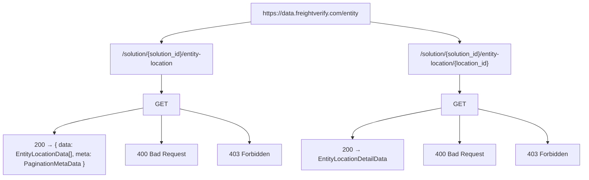
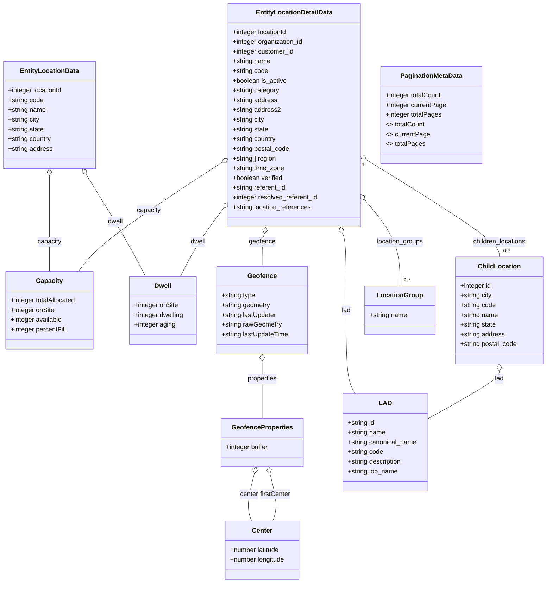

# Diagram: entity_core/entity_service/entity_service/entity/entity_location/api_documentation/EntityLocation.yaml

> Auto-generated by Obscura crawlers

## Diagram 1

### SVG

<svg id="container" width="1476.875" xmlns="http://www.w3.org/2000/svg" class="flowchart" height="454" viewBox="0 0 1476.875 454" role="graphics-document document" aria-roledescription="flowchart-v2"><g><marker id="container_flowchart-v2-pointEnd" class="marker flowchart-v2" viewBox="0 0 10 10" refX="5" refY="5" markerUnits="userSpaceOnUse" markerWidth="8" markerHeight="8" orient="auto"><path d="M 0 0 L 10 5 L 0 10 z" class="arrowMarkerPath" style="stroke-width: 1; stroke-dasharray: 1, 0;"></path></marker><marker id="container_flowchart-v2-pointStart" class="marker flowchart-v2" viewBox="0 0 10 10" refX="4.5" refY="5" markerUnits="userSpaceOnUse" markerWidth="8" markerHeight="8" orient="auto"><path d="M 0 5 L 10 10 L 10 0 z" class="arrowMarkerPath" style="stroke-width: 1; stroke-dasharray: 1, 0;"></path></marker><marker id="container_flowchart-v2-circleEnd" class="marker flowchart-v2" viewBox="0 0 10 10" refX="11" refY="5" markerUnits="userSpaceOnUse" markerWidth="11" markerHeight="11" orient="auto"><circle cx="5" cy="5" r="5" class="arrowMarkerPath" style="stroke-width: 1; stroke-dasharray: 1, 0;"></circle></marker><marker id="container_flowchart-v2-circleStart" class="marker flowchart-v2" viewBox="0 0 10 10" refX="-1" refY="5" markerUnits="userSpaceOnUse" markerWidth="11" markerHeight="11" orient="auto"><circle cx="5" cy="5" r="5" class="arrowMarkerPath" style="stroke-width: 1; stroke-dasharray: 1, 0;"></circle></marker><marker id="container_flowchart-v2-crossEnd" class="marker cross flowchart-v2" viewBox="0 0 11 11" refX="12" refY="5.2" markerUnits="userSpaceOnUse" markerWidth="11" markerHeight="11" orient="auto"><path d="M 1,1 l 9,9 M 10,1 l -9,9" class="arrowMarkerPath" style="stroke-width: 2; stroke-dasharray: 1, 0;"></path></marker><marker id="container_flowchart-v2-crossStart" class="marker cross flowchart-v2" viewBox="0 0 11 11" refX="-1" refY="5.2" markerUnits="userSpaceOnUse" markerWidth="11" markerHeight="11" orient="auto"><path d="M 1,1 l 9,9 M 10,1 l -9,9" class="arrowMarkerPath" style="stroke-width: 2; stroke-dasharray: 1, 0;"></path></marker><g class="root"><g class="clusters"></g><g class="edgePaths"><path d="M625.172,57.23L589.132,62.192C553.091,67.153,481.01,77.077,444.97,85.538C408.93,94,408.93,101,408.93,104.5L408.93,108" id="L_Server_ListEndpoint_0" class="edge-thickness-normal edge-pattern-solid edge-thickness-normal edge-pattern-solid flowchart-link" style=";" data-edge="true" data-et="edge" data-id="L_Server_ListEndpoint_0" data-points="W3sieCI6NjI1LjE3MTg3NSwieSI6NTcuMjMwMjQ3MzczMjEwODl9LHsieCI6NDA4LjkyOTY4NzUsInkiOjg3fSx7IngiOjQwOC45Mjk2ODc1LCJ5IjoxMTJ9XQ==" marker-end="url(#container_flowchart-v2-pointEnd)"></path><path d="M948.125,57.23L984.165,62.192C1020.206,67.153,1092.286,77.077,1128.327,85.538C1164.367,94,1164.367,101,1164.367,104.5L1164.367,108" id="L_Server_DetailEndpoint_0" class="edge-thickness-normal edge-pattern-solid edge-thickness-normal edge-pattern-solid flowchart-link" style=";" data-edge="true" data-et="edge" data-id="L_Server_DetailEndpoint_0" data-points="W3sieCI6OTQ4LjEyNSwieSI6NTcuMjMwMjQ3MzczMjEwODl9LHsieCI6MTE2NC4zNjcxODc1LCJ5Ijo4N30seyJ4IjoxMTY0LjM2NzE4NzUsInkiOjExMn1d" marker-end="url(#container_flowchart-v2-pointEnd)"></path><path d="M408.93,190L408.93,194.167C408.93,198.333,408.93,206.667,408.93,214.333C408.93,222,408.93,229,408.93,232.5L408.93,236" id="L_ListEndpoint_GET_List_0" class="edge-thickness-normal edge-pattern-solid edge-thickness-normal edge-pattern-solid flowchart-link" style=";" data-edge="true" data-et="edge" data-id="L_ListEndpoint_GET_List_0" data-points="W3sieCI6NDA4LjkyOTY4NzUsInkiOjE5MH0seyJ4Ijo0MDguOTI5Njg3NSwieSI6MjE1fSx7IngiOjQwOC45Mjk2ODc1LCJ5IjoyNDB9XQ==" marker-end="url(#container_flowchart-v2-pointEnd)"></path><path d="M365.461,275.343L327.551,282.619C289.641,289.895,213.82,304.448,175.91,315.224C138,326,138,333,138,336.5L138,340" id="L_GET_List_List_200_0" class="edge-thickness-normal edge-pattern-solid edge-thickness-normal edge-pattern-solid flowchart-link" style=";" data-edge="true" data-et="edge" data-id="L_GET_List_List_200_0" data-points="W3sieCI6MzY1LjQ2MDkzNzUsInkiOjI3NS4zNDMwMzE4MDU5OTIxfSx7IngiOjEzOCwieSI6MzE5fSx7IngiOjEzOCwieSI6MzQ0fV0=" marker-end="url(#container_flowchart-v2-pointEnd)"></path><path d="M408.93,294L408.93,298.167C408.93,302.333,408.93,310.667,408.93,322.333C408.93,334,408.93,349,408.93,356.5L408.93,364" id="L_GET_List_List_400_0" class="edge-thickness-normal edge-pattern-solid edge-thickness-normal edge-pattern-solid flowchart-link" style=";" data-edge="true" data-et="edge" data-id="L_GET_List_List_400_0" data-points="W3sieCI6NDA4LjkyOTY4NzUsInkiOjI5NH0seyJ4Ijo0MDguOTI5Njg3NSwieSI6MzE5fSx7IngiOjQwOC45Mjk2ODc1LCJ5IjozNjh9XQ==" marker-end="url(#container_flowchart-v2-pointEnd)"></path><path d="M452.398,277.149L482.273,284.124C512.148,291.099,571.898,305.05,601.773,319.525C631.648,334,631.648,349,631.648,356.5L631.648,364" id="L_GET_List_List_403_0" class="edge-thickness-normal edge-pattern-solid edge-thickness-normal edge-pattern-solid flowchart-link" style=";" data-edge="true" data-et="edge" data-id="L_GET_List_List_403_0" data-points="W3sieCI6NDUyLjM5ODQzNzUsInkiOjI3Ny4xNDkwMTA4MDM5ODQ4fSx7IngiOjYzMS42NDg0Mzc1LCJ5IjozMTl9LHsieCI6NjMxLjY0ODQzNzUsInkiOjM2OH1d" marker-end="url(#container_flowchart-v2-pointEnd)"></path><path d="M1164.367,190L1164.367,194.167C1164.367,198.333,1164.367,206.667,1164.367,214.333C1164.367,222,1164.367,229,1164.367,232.5L1164.367,236" id="L_DetailEndpoint_GET_Detail_0" class="edge-thickness-normal edge-pattern-solid edge-thickness-normal edge-pattern-solid flowchart-link" style=";" data-edge="true" data-et="edge" data-id="L_DetailEndpoint_GET_Detail_0" data-points="W3sieCI6MTE2NC4zNjcxODc1LCJ5IjoxOTB9LHsieCI6MTE2NC4zNjcxODc1LCJ5IjoyMTV9LHsieCI6MTE2NC4zNjcxODc1LCJ5IjoyNDB9XQ==" marker-end="url(#container_flowchart-v2-pointEnd)"></path><path d="M1120.898,275.343L1082.988,282.619C1045.078,289.895,969.258,304.448,931.348,317.224C893.438,330,893.438,341,893.438,346.5L893.438,352" id="L_GET_Detail_Detail_200_0" class="edge-thickness-normal edge-pattern-solid edge-thickness-normal edge-pattern-solid flowchart-link" style=";" data-edge="true" data-et="edge" data-id="L_GET_Detail_Detail_200_0" data-points="W3sieCI6MTEyMC44OTg0Mzc1LCJ5IjoyNzUuMzQzMDMxODA1OTkyMX0seyJ4Ijo4OTMuNDM3NSwieSI6MzE5fSx7IngiOjg5My40Mzc1LCJ5IjozNTZ9XQ==" marker-end="url(#container_flowchart-v2-pointEnd)"></path><path d="M1164.367,294L1164.367,298.167C1164.367,302.333,1164.367,310.667,1164.367,322.333C1164.367,334,1164.367,349,1164.367,356.5L1164.367,364" id="L_GET_Detail_Detail_400_0" class="edge-thickness-normal edge-pattern-solid edge-thickness-normal edge-pattern-solid flowchart-link" style=";" data-edge="true" data-et="edge" data-id="L_GET_Detail_Detail_400_0" data-points="W3sieCI6MTE2NC4zNjcxODc1LCJ5IjoyOTR9LHsieCI6MTE2NC4zNjcxODc1LCJ5IjozMTl9LHsieCI6MTE2NC4zNjcxODc1LCJ5IjozNjh9XQ==" marker-end="url(#container_flowchart-v2-pointEnd)"></path><path d="M1207.836,277.149L1237.711,284.124C1267.586,291.099,1327.336,305.05,1357.211,319.525C1387.086,334,1387.086,349,1387.086,356.5L1387.086,364" id="L_GET_Detail_Detail_403_0" class="edge-thickness-normal edge-pattern-solid edge-thickness-normal edge-pattern-solid flowchart-link" style=";" data-edge="true" data-et="edge" data-id="L_GET_Detail_Detail_403_0" data-points="W3sieCI6MTIwNy44MzU5Mzc1LCJ5IjoyNzcuMTQ5MDEwODAzOTg0OH0seyJ4IjoxMzg3LjA4NTkzNzUsInkiOjMxOX0seyJ4IjoxMzg3LjA4NTkzNzUsInkiOjM2OH1d" marker-end="url(#container_flowchart-v2-pointEnd)"></path></g><g class="edgeLabels"><g class="edgeLabel"><g class="label" data-id="L_Server_ListEndpoint_0" transform="translate(0, 0)"><foreignObject width="0" height="0">

</foreignObject></g></g><g class="edgeLabel"><g class="label" data-id="L_Server_DetailEndpoint_0" transform="translate(0, 0)"><foreignObject width="0" height="0">

</foreignObject></g></g><g class="edgeLabel"><g class="label" data-id="L_ListEndpoint_GET_List_0" transform="translate(0, 0)"><foreignObject width="0" height="0">

</foreignObject></g></g><g class="edgeLabel"><g class="label" data-id="L_GET_List_List_200_0" transform="translate(0, 0)"><foreignObject width="0" height="0">

</foreignObject></g></g><g class="edgeLabel"><g class="label" data-id="L_GET_List_List_400_0" transform="translate(0, 0)"><foreignObject width="0" height="0">

</foreignObject></g></g><g class="edgeLabel"><g class="label" data-id="L_GET_List_List_403_0" transform="translate(0, 0)"><foreignObject width="0" height="0">

</foreignObject></g></g><g class="edgeLabel"><g class="label" data-id="L_DetailEndpoint_GET_Detail_0" transform="translate(0, 0)"><foreignObject width="0" height="0">

</foreignObject></g></g><g class="edgeLabel"><g class="label" data-id="L_GET_Detail_Detail_200_0" transform="translate(0, 0)"><foreignObject width="0" height="0">

</foreignObject></g></g><g class="edgeLabel"><g class="label" data-id="L_GET_Detail_Detail_400_0" transform="translate(0, 0)"><foreignObject width="0" height="0">

</foreignObject></g></g><g class="edgeLabel"><g class="label" data-id="L_GET_Detail_Detail_403_0" transform="translate(0, 0)"><foreignObject width="0" height="0">

</foreignObject></g></g></g><g class="nodes"><g class="node default" id="flowchart-Server-0" transform="translate(786.6484375, 35)"><rect class="basic label-container" style="" x="-161.4765625" y="-27" width="322.953125" height="54"></rect><g class="label" style="" transform="translate(-131.4765625, -12)"><rect></rect><foreignObject width="262.953125" height="24">

https://data.freightverify.com/entity

</foreignObject></g></g><g class="node default" id="flowchart-ListEndpoint-2" transform="translate(408.9296875, 151)"><rect class="basic label-container" style="" x="-142.140625" y="-39" width="284.28125" height="78"></rect><g class="label" style="" transform="translate(-112.140625, -24)"><rect></rect><foreignObject width="224.28125" height="48">

/solution/{solution_id}/entity-location

</foreignObject></g></g><g class="node default" id="flowchart-DetailEndpoint-4" transform="translate(1164.3671875, 151)"><rect class="basic label-container" style="" x="-142.140625" y="-39" width="284.28125" height="78"></rect><g class="label" style="" transform="translate(-112.140625, -24)"><rect></rect><foreignObject width="224.28125" height="48">

/solution/{solution_id}/entity-location/{location_id}

</foreignObject></g></g><g class="node default" id="flowchart-GET_List-6" transform="translate(408.9296875, 267)"><rect class="basic label-container" style="" x="-43.46875" y="-27" width="86.9375" height="54"></rect><g class="label" style="" transform="translate(-13.46875, -12)"><rect></rect><foreignObject width="26.9375" height="24">

GET

</foreignObject></g></g><g class="node default" id="flowchart-List_200-8" transform="translate(138, 395)"><rect class="basic label-container" style="" x="-130" y="-51" width="260" height="102"></rect><g class="label" style="" transform="translate(-100, -36)"><rect></rect><foreignObject width="200" height="72">

200 → { data: EntityLocationData[], meta: PaginationMetaData }

</foreignObject></g></g><g class="node default" id="flowchart-List_400-10" transform="translate(408.9296875, 395)"><rect class="basic label-container" style="" x="-90.9296875" y="-27" width="181.859375" height="54"></rect><g class="label" style="" transform="translate(-60.9296875, -12)"><rect></rect><foreignObject width="121.859375" height="24">

400 Bad Request

</foreignObject></g></g><g class="node default" id="flowchart-List_403-12" transform="translate(631.6484375, 395)"><rect class="basic label-container" style="" x="-81.7890625" y="-27" width="163.578125" height="54"></rect><g class="label" style="" transform="translate(-51.7890625, -12)"><rect></rect><foreignObject width="103.578125" height="24">

403 Forbidden

</foreignObject></g></g><g class="node default" id="flowchart-GET_Detail-14" transform="translate(1164.3671875, 267)"><rect class="basic label-container" style="" x="-43.46875" y="-27" width="86.9375" height="54"></rect><g class="label" style="" transform="translate(-13.46875, -12)"><rect></rect><foreignObject width="26.9375" height="24">

GET

</foreignObject></g></g><g class="node default" id="flowchart-Detail_200-16" transform="translate(893.4375, 395)"><rect class="basic label-container" style="" x="-130" y="-39" width="260" height="78"></rect><g class="label" style="" transform="translate(-100, -24)"><rect></rect><foreignObject width="200" height="48">

200 → EntityLocationDetailData

</foreignObject></g></g><g class="node default" id="flowchart-Detail_400-18" transform="translate(1164.3671875, 395)"><rect class="basic label-container" style="" x="-90.9296875" y="-27" width="181.859375" height="54"></rect><g class="label" style="" transform="translate(-60.9296875, -12)"><rect></rect><foreignObject width="121.859375" height="24">

400 Bad Request

</foreignObject></g></g><g class="node default" id="flowchart-Detail_403-20" transform="translate(1387.0859375, 395)"><rect class="basic label-container" style="" x="-81.7890625" y="-27" width="163.578125" height="54"></rect><g class="label" style="" transform="translate(-51.7890625, -12)"><rect></rect><foreignObject width="103.578125" height="24">

403 Forbidden

</foreignObject></g></g></g></g></g></svg>

## Diagram 2

### SVG

<svg id="container" width="1356.02734375" xmlns="http://www.w3.org/2000/svg" class="classDiagram" height="1438" viewBox="0 0 1356.02734375 1438" role="graphics-document document" aria-roledescription="class"><g><defs><marker id="container_class-aggregationStart" class="marker aggregation class" refX="18" refY="7" markerWidth="190" markerHeight="240" orient="auto"><path d="M 18,7 L9,13 L1,7 L9,1 Z"></path></marker></defs><defs><marker id="container_class-aggregationEnd" class="marker aggregation class" refX="1" refY="7" markerWidth="20" markerHeight="28" orient="auto"><path d="M 18,7 L9,13 L1,7 L9,1 Z"></path></marker></defs><defs><marker id="container_class-extensionStart" class="marker extension class" refX="18" refY="7" markerWidth="190" markerHeight="240" orient="auto"><path d="M 1,7 L18,13 V 1 Z"></path></marker></defs><defs><marker id="container_class-extensionEnd" class="marker extension class" refX="1" refY="7" markerWidth="20" markerHeight="28" orient="auto"><path d="M 1,1 V 13 L18,7 Z"></path></marker></defs><defs><marker id="container_class-compositionStart" class="marker composition class" refX="18" refY="7" markerWidth="190" markerHeight="240" orient="auto"><path d="M 18,7 L9,13 L1,7 L9,1 Z"></path></marker></defs><defs><marker id="container_class-compositionEnd" class="marker composition class" refX="1" refY="7" markerWidth="20" markerHeight="28" orient="auto"><path d="M 18,7 L9,13 L1,7 L9,1 Z"></path></marker></defs><defs><marker id="container_class-dependencyStart" class="marker dependency class" refX="6" refY="7" markerWidth="190" markerHeight="240" orient="auto"><path d="M 5,7 L9,13 L1,7 L9,1 Z"></path></marker></defs><defs><marker id="container_class-dependencyEnd" class="marker dependency class" refX="13" refY="7" markerWidth="20" markerHeight="28" orient="auto"><path d="M 18,7 L9,13 L14,7 L9,1 Z"></path></marker></defs><defs><marker id="container_class-lollipopStart" class="marker lollipop class" refX="13" refY="7" markerWidth="190" markerHeight="240" orient="auto"><circle stroke="black" fill="transparent" cx="7" cy="7" r="6"></circle></marker></defs><defs><marker id="container_class-lollipopEnd" class="marker lollipop class" refX="1" refY="7" markerWidth="190" markerHeight="240" orient="auto"><circle stroke="black" fill="transparent" cx="7" cy="7" r="6"></circle></marker></defs><g class="root"><g class="clusters"></g><g class="edgePaths"><path d="M123.148,433.25L123.148,460.542C123.148,487.833,123.148,542.417,123.148,581.875C123.148,621.333,123.148,645.667,123.148,657.833L123.148,670" id="id_EntityLocationData_Capacity_1" class="edge-thickness-normal edge-pattern-solid relation" style=";;;" data-edge="true" data-et="edge" data-id="id_EntityLocationData_Capacity_1" data-points="W3sieCI6MTIzLjE0ODQzNzUsInkiOjQxNn0seyJ4IjoxMjMuMTQ4NDM3NSwieSI6NTk3fSx7IngiOjEyMy4xNDg0Mzc1LCJ5Ijo2NzB9XQ==" marker-start="url(#container_class-aggregationStart)"></path><path d="M215.452,430.597L232.915,458.331C250.377,486.065,285.302,541.532,310.102,583.433C334.903,625.333,349.579,653.667,356.917,667.833L364.255,682" id="id_EntityLocationData_Dwell_2" class="edge-thickness-normal edge-pattern-solid relation" style=";;;" data-edge="true" data-et="edge" data-id="id_EntityLocationData_Dwell_2" data-points="W3sieCI6MjA2LjI2MTI1Njk4ODgxNzg4LCJ5Ijo0MTZ9LHsieCI6MzIwLjIyNjU2MjUsInkiOjU5N30seyJ4IjozNjQuMjU1MDg1MDU5MTcxNiwieSI6NjgyfV0=" marker-start="url(#container_class-aggregationStart)"></path><path d="M556.237,399.611L505.309,432.509C454.382,465.407,352.527,531.204,292.419,576.269C232.311,621.333,213.949,645.667,204.768,657.833L195.588,670" id="id_EntityLocationDetailData_Capacity_3" class="edge-thickness-normal edge-pattern-solid relation" style=";;;" data-edge="true" data-et="edge" data-id="id_EntityLocationDetailData_Capacity_3" data-points="W3sieCI6NTcwLjcyNjU2MjUsInkiOjM5MC4yNTEwODYzMzQzNTcyfSx7IngiOjI1MC42NzE4NzUsInkiOjU5N30seyJ4IjoxOTUuNTg3Nzg2NjEyNDI2MDQsInkiOjY3MH1d" marker-start="url(#container_class-aggregationStart)"></path><path d="M560.237,512.41L549.437,526.508C538.637,540.607,517.037,568.803,498.888,597.068C480.739,625.333,466.041,653.667,458.691,667.833L451.342,682" id="id_EntityLocationDetailData_Dwell_4" class="edge-thickness-normal edge-pattern-solid relation" style=";;;" data-edge="true" data-et="edge" data-id="id_EntityLocationDetailData_Dwell_4" data-points="W3sieCI6NTcwLjcyNjU2MjUsInkiOjQ5OC43MTYxMzM2NTY5OTQ4fSx7IngiOjQ5NS40Mzc1LCJ5Ijo1OTd9LHsieCI6NDUxLjM0MjE3ODI1NDQzNzg0LCJ5Ijo2ODJ9XQ==" marker-start="url(#container_class-aggregationStart)"></path><path d="M660.592,576.715L659.731,580.096C658.869,583.477,657.145,590.238,656.284,603.786C655.422,617.333,655.422,637.667,655.422,647.833L655.422,658" id="id_EntityLocationDetailData_Geofence_5" class="edge-thickness-normal edge-pattern-solid relation" style=";;;" data-edge="true" data-et="edge" data-id="id_EntityLocationDetailData_Geofence_5" data-points="W3sieCI6NjY0Ljg1MzM0NzE0NDU2ODcsInkiOjU2MH0seyJ4Ijo2NTUuNDIxODc1LCJ5Ijo1OTd9LHsieCI6NjU1LjQyMTg3NSwieSI6NjU4fV0=" marker-start="url(#container_class-aggregationStart)"></path><path d="M855.14,575.956L856.581,579.463C858.022,582.971,860.904,589.985,862.344,621.659C863.785,653.333,863.785,709.667,863.785,766C863.785,822.333,863.785,878.667,867.567,913C871.349,947.333,878.912,959.667,882.694,965.833L886.476,972" id="id_EntityLocationDetailData_LAD_6" class="edge-thickness-normal edge-pattern-solid relation" style=";;;" data-edge="true" data-et="edge" data-id="id_EntityLocationDetailData_LAD_6" data-points="W3sieCI6ODQ4LjU4NTgyNTE3OTcxMjQsInkiOjU2MH0seyJ4Ijo4NjMuNzg1MTU2MjUsInkiOjU5N30seyJ4Ijo4NjMuNzg1MTU2MjUsInkiOjc2Nn0seyJ4Ijo4NjMuNzg1MTU2MjUsInkiOjkzNX0seyJ4Ijo4ODYuNDc1NjQxOTE4Nzg5OCwieSI6OTcyfV0=" marker-start="url(#container_class-aggregationStart)"></path><path d="M914.348,395.063L968.635,428.719C1022.921,462.375,1131.494,529.688,1185.78,569.511C1240.066,609.333,1240.066,621.667,1240.066,627.833L1240.066,634" id="id_EntityLocationDetailData_ChildLocation_7" class="edge-thickness-normal edge-pattern-solid relation" style=";;;" data-edge="true" data-et="edge" data-id="id_EntityLocationDetailData_ChildLocation_7" data-points="W3sieCI6ODk5LjY4NzUsInkiOjM4NS45NzM3MTYzODE0MTgwNn0seyJ4IjoxMjQwLjA2NjQwNjI1LCJ5Ijo1OTd9LHsieCI6MTI0MC4wNjY0MDYyNSwieSI6NjM0fV0=" marker-start="url(#container_class-aggregationStart)"></path><path d="M910.734,494.529L924.973,511.608C939.212,528.686,967.69,562.843,981.929,598.088C996.168,633.333,996.168,669.667,996.168,687.833L996.168,706" id="id_EntityLocationDetailData_LocationGroup_8" class="edge-thickness-normal edge-pattern-solid relation" style=";;;" data-edge="true" data-et="edge" data-id="id_EntityLocationDetailData_LocationGroup_8" data-points="W3sieCI6ODk5LjY4NzUsInkiOjQ4MS4yODAwNDk2OTYxMzUwNX0seyJ4Ijo5OTYuMTY3OTY4NzUsInkiOjU5N30seyJ4Ijo5OTYuMTY3OTY4NzUsInkiOjcwNn1d" marker-start="url(#container_class-aggregationStart)"></path><path d="M655.422,891.25L655.422,898.542C655.422,905.833,655.422,920.417,655.422,943.875C655.422,967.333,655.422,999.667,655.422,1015.833L655.422,1032" id="id_Geofence_GeofenceProperties_9" class="edge-thickness-normal edge-pattern-solid relation" style=";;;" data-edge="true" data-et="edge" data-id="id_Geofence_GeofenceProperties_9" data-points="W3sieCI6NjU1LjQyMTg3NSwieSI6ODc0fSx7IngiOjY1NS40MjE4NzUsInkiOjkzNX0seyJ4Ijo2NTUuNDIxODc1LCJ5IjoxMDMyfV0=" marker-start="url(#container_class-aggregationStart)"></path><path d="M635.705,1168.707L632.265,1182.089C628.825,1195.471,621.946,1222.236,620.789,1241.784C619.633,1261.333,624.199,1273.667,626.482,1279.833L628.765,1286" id="id_GeofenceProperties_Center_10" class="edge-thickness-normal edge-pattern-solid relation" style=";;;" data-edge="true" data-et="edge" data-id="id_GeofenceProperties_Center_10" data-points="W3sieCI6NjM5Ljk5OTQwMjg2NjI0MiwieSI6MTE1Mn0seyJ4Ijo2MTUuMDY2NDA2MjUsInkiOjEyNDl9LHsieCI6NjI4Ljc2NTA1MTYwNTUwNDYsInkiOjEyODZ9XQ==" marker-start="url(#container_class-aggregationStart)"></path><path d="M675.139,1168.707L678.578,1182.089C682.018,1195.471,688.898,1222.236,690.054,1241.784C691.211,1261.333,686.645,1273.667,684.362,1279.833L682.079,1286" id="id_GeofenceProperties_Center_11" class="edge-thickness-normal edge-pattern-solid relation" style=";;;" data-edge="true" data-et="edge" data-id="id_GeofenceProperties_Center_11" data-points="W3sieCI6NjcwLjg0NDM0NzEzMzc1OCwieSI6MTE1Mn0seyJ4Ijo2OTUuNzc3MzQzNzUsInkiOjEyNDl9LHsieCI6NjgyLjA3ODY5ODM5NDQ5NTQsInkiOjEyODZ9XQ==" marker-start="url(#container_class-aggregationStart)"></path><path d="M1240.066,915.25L1240.066,918.542C1240.066,921.833,1240.066,928.417,1210.921,948.05C1181.776,967.684,1123.486,1000.368,1094.34,1016.711L1065.195,1033.053" id="id_ChildLocation_LAD_12" class="edge-thickness-normal edge-pattern-solid relation" style=";;;" data-edge="true" data-et="edge" data-id="id_ChildLocation_LAD_12" data-points="W3sieCI6MTI0MC4wNjY0MDYyNSwieSI6ODk4fSx7IngiOjEyNDAuMDY2NDA2MjUsInkiOjkzNX0seyJ4IjoxMDY1LjE5NTMxMjUsInkiOjEwMzMuMDUyNzIwNDI0MTA3fV0=" marker-start="url(#container_class-aggregationStart)"></path></g><g class="edgeLabels"><g class="edgeLabel" transform="translate(123.1484375, 597)"><g class="label" data-id="id_EntityLocationData_Capacity_1" transform="translate(-29.984375, -12)"><foreignObject width="59.96875" height="24">

capacity

</foreignObject></g></g><g class="edgeLabel" transform="translate(288.74639, 547.0031)"><g class="label" data-id="id_EntityLocationData_Dwell_2" transform="translate(-19.5703125, -12)"><foreignObject width="39.140625" height="24">

dwell

</foreignObject></g></g><g class="edgeLabel" transform="translate(372.29063, 518.43672)"><g class="label" data-id="id_EntityLocationDetailData_Capacity_3" transform="translate(-29.984375, -12)"><foreignObject width="59.96875" height="24">

capacity

</foreignObject></g></g><g class="edgeLabel" transform="translate(495.4375, 597)"><g class="label" data-id="id_EntityLocationDetailData_Dwell_4" transform="translate(-19.5703125, -12)"><foreignObject width="39.140625" height="24">

dwell

</foreignObject></g></g><g class="edgeLabel" transform="translate(655.421875, 597)"><g class="label" data-id="id_EntityLocationDetailData_Geofence_5" transform="translate(-32.7421875, -12)"><foreignObject width="65.484375" height="24">

geofence

</foreignObject></g></g><g class="edgeLabel" transform="translate(863.78515625, 766)"><g class="label" data-id="id_EntityLocationDetailData_LAD_6" transform="translate(-11.4453125, -12)"><foreignObject width="22.890625" height="24">

lad

</foreignObject></g></g><g class="edgeLabel" transform="translate(1240.06640625, 597)"><g class="label" data-id="id_EntityLocationDetailData_ChildLocation_7" transform="translate(-67.1484375, -12)"><foreignObject width="134.296875" height="24">

children_locations

</foreignObject></g></g><g class="edgeLabel" transform="translate(996.16796875, 597)"><g class="label" data-id="id_EntityLocationDetailData_LocationGroup_8" transform="translate(-58.6328125, -12)"><foreignObject width="117.265625" height="24">

location_groups

</foreignObject></g></g><g class="edgeLabel" transform="translate(655.421875, 935)"><g class="label" data-id="id_Geofence_GeofenceProperties_9" transform="translate(-37.71875, -12)"><foreignObject width="75.4375" height="24">

properties

</foreignObject></g></g><g class="edgeLabel" transform="translate(622.62184, 1219.60614)"><g class="label" data-id="id_GeofenceProperties_Center_10" transform="translate(-22.9296875, -12)"><foreignObject width="45.859375" height="24">

center

</foreignObject></g></g><g class="edgeLabel" transform="translate(688.22191, 1219.60614)"><g class="label" data-id="id_GeofenceProperties_Center_11" transform="translate(-37.78125, -12)"><foreignObject width="75.5625" height="24">

firstCenter

</foreignObject></g></g><g class="edgeLabel" transform="translate(1240.06640625, 935)"><g class="label" data-id="id_ChildLocation_LAD_12" transform="translate(-11.4453125, -12)"><foreignObject width="22.890625" height="24">

lad

</foreignObject></g></g><g class="edgeTerminals" transform="translate(906.6571030703446, 407.9435730874717)"><g class="inner" transform="translate(0, 0)"><foreignObject style="width: 9px; height: 12px;">
1
</foreignObject></g></g><g class="edgeTerminals" transform="translate(899.372951507974, 504.32676300720595)"><g class="inner" transform="translate(0, 0)"><foreignObject style="width: 9px; height: 12px;">
1
</foreignObject></g></g><g class="edgeTerminals" transform="translate(1250.066408125, 611.5000016071428)"><g class="inner" transform="translate(0, 0)"></g><foreignObject style="width: 36px; height: 12px;">
0..*
</foreignObject></g><g class="edgeTerminals" transform="translate(1006.167969375, 683.5000005357143)"><g class="inner" transform="translate(0, 0)"></g><foreignObject style="width: 36px; height: 12px;">
0..*
</foreignObject></g></g><g class="nodes"><g class="node default" id="classId-EntityLocationData-0" transform="translate(123.1484375, 284)"><g class="basic label-container"><path d="M-115.1484375 -132 L115.1484375 -132 L115.1484375 132 L-115.1484375 132" stroke="none" stroke-width="0" fill="#ECECFF" style=""></path><path d="M-115.1484375 -132 C-33.49332155584656 -132, 48.16179438830687 -132, 115.1484375 -132 M-115.1484375 -132 C-51.20022136686072 -132, 12.747994766278566 -132, 115.1484375 -132 M115.1484375 -132 C115.1484375 -31.843497777481403, 115.1484375 68.3130044450372, 115.1484375 132 M115.1484375 -132 C115.1484375 -74.00264162770617, 115.1484375 -16.005283255412337, 115.1484375 132 M115.1484375 132 C63.120937133926475 132, 11.09343676785295 132, -115.1484375 132 M115.1484375 132 C61.370648808983816 132, 7.592860117967632 132, -115.1484375 132 M-115.1484375 132 C-115.1484375 44.14236235280404, -115.1484375 -43.715275294391915, -115.1484375 -132 M-115.1484375 132 C-115.1484375 76.23423507649187, -115.1484375 20.468470152983727, -115.1484375 -132" stroke="#9370DB" stroke-width="1.3" fill="none" stroke-dasharray="0 0" style=""></path></g><g class="annotation-group text" transform="translate(0, -108)"></g><g class="label-group text" transform="translate(-69.515625, -108)"><g class="label" style="font-weight: bolder" transform="translate(0,-12)"><foreignObject width="139.03125" height="24">

EntityLocationData

</foreignObject></g></g><g class="members-group text" transform="translate(-103.1484375, -60)"><g class="label" style="" transform="translate(0,-12)"><foreignObject width="136.78125" height="24">

+integer locationId

</foreignObject></g><g class="label" style="" transform="translate(0,12)"><foreignObject width="88.828125" height="24">

+string code

</foreignObject></g><g class="label" style="" transform="translate(0,36)"><foreignObject width="94.375" height="24">

+string name

</foreignObject></g><g class="label" style="" transform="translate(0,60)"><foreignObject width="79.59375" height="24">

+string city

</foreignObject></g><g class="label" style="" transform="translate(0,84)"><foreignObject width="89.953125" height="24">

+string state

</foreignObject></g><g class="label" style="" transform="translate(0,108)"><foreignObject width="109.046875" height="24">

+string country

</foreignObject></g><g class="label" style="" transform="translate(0,132)"><foreignObject width="110.90625" height="24">

+string address

</foreignObject></g></g><g class="methods-group text" transform="translate(-103.1484375, 132)"></g><g class="divider" style=""><path d="M-115.1484375 -84 C-39.478908839628986 -84, 36.19061982074203 -84, 115.1484375 -84 M-115.1484375 -84 C-61.906159923939235 -84, -8.66388234787847 -84, 115.1484375 -84" stroke="#9370DB" stroke-width="1.3" fill="none" stroke-dasharray="0 0" style=""></path></g><g class="divider" style=""><path d="M-115.1484375 108 C-23.95931413456738 108, 67.22980923086524 108, 115.1484375 108 M-115.1484375 108 C-28.871651748422536 108, 57.40513400315493 108, 115.1484375 108" stroke="#9370DB" stroke-width="1.3" fill="none" stroke-dasharray="0 0" style=""></path></g></g><g class="node default" id="classId-Capacity-1" transform="translate(123.1484375, 766)"><g class="basic label-container"><path d="M-110.1015625 -96 L110.1015625 -96 L110.1015625 96 L-110.1015625 96" stroke="none" stroke-width="0" fill="#ECECFF" style=""></path><path d="M-110.1015625 -96 C-39.386649216739045 -96, 31.32826406652191 -96, 110.1015625 -96 M-110.1015625 -96 C-47.71237493674338 -96, 14.67681262651324 -96, 110.1015625 -96 M110.1015625 -96 C110.1015625 -51.28057478254226, 110.1015625 -6.56114956508452, 110.1015625 96 M110.1015625 -96 C110.1015625 -32.152959165418395, 110.1015625 31.69408166916321, 110.1015625 96 M110.1015625 96 C25.127781604249165 96, -59.84599929150167 96, -110.1015625 96 M110.1015625 96 C56.211961726233156 96, 2.322360952466312 96, -110.1015625 96 M-110.1015625 96 C-110.1015625 22.30371117751318, -110.1015625 -51.39257764497364, -110.1015625 -96 M-110.1015625 96 C-110.1015625 28.053430329737438, -110.1015625 -39.893139340525124, -110.1015625 -96" stroke="#9370DB" stroke-width="1.3" fill="none" stroke-dasharray="0 0" style=""></path></g><g class="annotation-group text" transform="translate(0, -72)"></g><g class="label-group text" transform="translate(-31.265625, -72)"><g class="label" style="font-weight: bolder" transform="translate(0,-12)"><foreignObject width="62.53125" height="24">

Capacity

</foreignObject></g></g><g class="members-group text" transform="translate(-98.1015625, -24)"><g class="label" style="" transform="translate(0,-12)"><foreignObject width="164.9375" height="24">

+integer totalAllocated

</foreignObject></g><g class="label" style="" transform="translate(0,12)"><foreignObject width="109.546875" height="24">

+integer onSite

</foreignObject></g><g class="label" style="" transform="translate(0,36)"><foreignObject width="128.78125" height="24">

+integer available

</foreignObject></g><g class="label" style="" transform="translate(0,60)"><foreignObject width="139.640625" height="24">

+integer percentFill

</foreignObject></g></g><g class="methods-group text" transform="translate(-98.1015625, 96)"></g><g class="divider" style=""><path d="M-110.1015625 -48 C-63.33932063464708 -48, -16.57707876929416 -48, 110.1015625 -48 M-110.1015625 -48 C-22.673533706429296 -48, 64.75449508714141 -48, 110.1015625 -48" stroke="#9370DB" stroke-width="1.3" fill="none" stroke-dasharray="0 0" style=""></path></g><g class="divider" style=""><path d="M-110.1015625 72 C-45.038084361790155 72, 20.02539377641969 72, 110.1015625 72 M-110.1015625 72 C-60.010435444453634 72, -9.919308388907268 72, 110.1015625 72" stroke="#9370DB" stroke-width="1.3" fill="none" stroke-dasharray="0 0" style=""></path></g></g><g class="node default" id="classId-Dwell-2" transform="translate(407.765625, 766)"><g class="basic label-container"><path d="M-84.53125 -84 L84.53125 -84 L84.53125 84 L-84.53125 84" stroke="none" stroke-width="0" fill="#ECECFF" style=""></path><path d="M-84.53125 -84 C-22.50876143784317 -84, 39.51372712431366 -84, 84.53125 -84 M-84.53125 -84 C-31.995617229880544 -84, 20.54001554023891 -84, 84.53125 -84 M84.53125 -84 C84.53125 -19.547810738808295, 84.53125 44.90437852238341, 84.53125 84 M84.53125 -84 C84.53125 -25.95818292423094, 84.53125 32.08363415153812, 84.53125 84 M84.53125 84 C30.08075849434087 84, -24.36973301131826 84, -84.53125 84 M84.53125 84 C48.459914383743275 84, 12.38857876748655 84, -84.53125 84 M-84.53125 84 C-84.53125 27.52442996287934, -84.53125 -28.951140074241323, -84.53125 -84 M-84.53125 84 C-84.53125 44.391150743066454, -84.53125 4.7823014861329085, -84.53125 -84" stroke="#9370DB" stroke-width="1.3" fill="none" stroke-dasharray="0 0" style=""></path></g><g class="annotation-group text" transform="translate(0, -60)"></g><g class="label-group text" transform="translate(-20.375, -60)"><g class="label" style="font-weight: bolder" transform="translate(0,-12)"><foreignObject width="40.75" height="24">

Dwell

</foreignObject></g></g><g class="members-group text" transform="translate(-72.53125, -12)"><g class="label" style="" transform="translate(0,-12)"><foreignObject width="109.546875" height="24">

+integer onSite

</foreignObject></g><g class="label" style="" transform="translate(0,12)"><foreignObject width="124.6875" height="24">

+integer dwelling

</foreignObject></g><g class="label" style="" transform="translate(0,36)"><foreignObject width="102.40625" height="24">

+integer aging

</foreignObject></g></g><g class="methods-group text" transform="translate(-72.53125, 84)"></g><g class="divider" style=""><path d="M-84.53125 -36 C-36.36826822233885 -36, 11.794713555322303 -36, 84.53125 -36 M-84.53125 -36 C-37.43592117927296 -36, 9.65940764145408 -36, 84.53125 -36" stroke="#9370DB" stroke-width="1.3" fill="none" stroke-dasharray="0 0" style=""></path></g><g class="divider" style=""><path d="M-84.53125 60 C-49.26361503028207 60, -13.995980060564136 60, 84.53125 60 M-84.53125 60 C-21.443393040662855 60, 41.64446391867429 60, 84.53125 60" stroke="#9370DB" stroke-width="1.3" fill="none" stroke-dasharray="0 0" style=""></path></g></g><g class="node default" id="classId-EntityLocationDetailData-3" transform="translate(735.20703125, 284)"><g class="basic label-container"><path d="M-164.48046875 -276 L164.48046875 -276 L164.48046875 276 L-164.48046875 276" stroke="none" stroke-width="0" fill="#ECECFF" style=""></path><path d="M-164.48046875 -276 C-62.20600085818958 -276, 40.068467033620834 -276, 164.48046875 -276 M-164.48046875 -276 C-79.80533762010191 -276, 4.869793509796182 -276, 164.48046875 -276 M164.48046875 -276 C164.48046875 -95.52689266008841, 164.48046875 84.94621467982319, 164.48046875 276 M164.48046875 -276 C164.48046875 -131.20766008305483, 164.48046875 13.584679833890334, 164.48046875 276 M164.48046875 276 C54.15902398413252 276, -56.162420781734966 276, -164.48046875 276 M164.48046875 276 C64.4797912694771 276, -35.52088621104579 276, -164.48046875 276 M-164.48046875 276 C-164.48046875 69.79892103502746, -164.48046875 -136.40215792994508, -164.48046875 -276 M-164.48046875 276 C-164.48046875 80.4119286352527, -164.48046875 -115.17614272949459, -164.48046875 -276" stroke="#9370DB" stroke-width="1.3" fill="none" stroke-dasharray="0 0" style=""></path></g><g class="annotation-group text" transform="translate(0, -252)"></g><g class="label-group text" transform="translate(-91.1484375, -252)"><g class="label" style="font-weight: bolder" transform="translate(0,-12)"><foreignObject width="182.296875" height="24">

EntityLocationDetailData

</foreignObject></g></g><g class="members-group text" transform="translate(-152.48046875, -204)"><g class="label" style="" transform="translate(0,-12)"><foreignObject width="136.78125" height="24">

+integer locationId

</foreignObject></g><g class="label" style="" transform="translate(0,12)"><foreignObject width="176.09375" height="24">

+integer organization_id

</foreignObject></g><g class="label" style="" transform="translate(0,36)"><foreignObject width="152.21875" height="24">

+integer customer_id

</foreignObject></g><g class="label" style="" transform="translate(0,60)"><foreignObject width="94.375" height="24">

+string name

</foreignObject></g><g class="label" style="" transform="translate(0,84)"><foreignObject width="88.828125" height="24">

+string code

</foreignObject></g><g class="label" style="" transform="translate(0,108)"><foreignObject width="134.5" height="24">

+boolean is_active

</foreignObject></g><g class="label" style="" transform="translate(0,132)"><foreignObject width="115.765625" height="24">

+string category

</foreignObject></g><g class="label" style="" transform="translate(0,156)"><foreignObject width="110.90625" height="24">

+string address

</foreignObject></g><g class="label" style="" transform="translate(0,180)"><foreignObject width="118.65625" height="24">

+string address2

</foreignObject></g><g class="label" style="" transform="translate(0,204)"><foreignObject width="79.59375" height="24">

+string city

</foreignObject></g><g class="label" style="" transform="translate(0,228)"><foreignObject width="89.953125" height="24">

+string state

</foreignObject></g><g class="label" style="" transform="translate(0,252)"><foreignObject width="109.046875" height="24">

+string country

</foreignObject></g><g class="label" style="" transform="translate(0,276)"><foreignObject width="142.046875" height="24">

+string postal_code

</foreignObject></g><g class="label" style="" transform="translate(0,300)"><foreignObject width="110.140625" height="24">

+string[] region

</foreignObject></g><g class="label" style="" transform="translate(0,324)"><foreignObject width="128.90625" height="24">

+string time_zone

</foreignObject></g><g class="label" style="" transform="translate(0,348)"><foreignObject width="126.375" height="24">

+boolean verified

</foreignObject></g><g class="label" style="" transform="translate(0,372)"><foreignObject width="134.171875" height="24">

+string referent_id

</foreignObject></g><g class="label" style="" transform="translate(0,396)"><foreignObject width="213.8125" height="24">

+integer resolved_referent_id

</foreignObject></g><g class="label" style="" transform="translate(0,420)"><foreignObject width="196.984375" height="24">

+string location_references

</foreignObject></g></g><g class="methods-group text" transform="translate(-152.48046875, 276)"></g><g class="divider" style=""><path d="M-164.48046875 -228 C-79.20008140404161 -228, 6.080305941916777 -228, 164.48046875 -228 M-164.48046875 -228 C-45.77191255406446 -228, 72.93664364187109 -228, 164.48046875 -228" stroke="#9370DB" stroke-width="1.3" fill="none" stroke-dasharray="0 0" style=""></path></g><g class="divider" style=""><path d="M-164.48046875 252 C-69.61452706909604 252, 25.251414611807917 252, 164.48046875 252 M-164.48046875 252 C-94.3884387768153 252, -24.296408803630612 252, 164.48046875 252" stroke="#9370DB" stroke-width="1.3" fill="none" stroke-dasharray="0 0" style=""></path></g></g><g class="node default" id="classId-Geofence-4" transform="translate(655.421875, 766)"><g class="basic label-container"><path d="M-113.125 -108 L113.125 -108 L113.125 108 L-113.125 108" stroke="none" stroke-width="0" fill="#ECECFF" style=""></path><path d="M-113.125 -108 C-32.57471787970701 -108, 47.97556424058598 -108, 113.125 -108 M-113.125 -108 C-22.784961196074406 -108, 67.55507760785119 -108, 113.125 -108 M113.125 -108 C113.125 -24.83770622975409, 113.125 58.32458754049182, 113.125 108 M113.125 -108 C113.125 -29.239249441526198, 113.125 49.521501116947604, 113.125 108 M113.125 108 C42.03970160930086 108, -29.045596781398274 108, -113.125 108 M113.125 108 C39.29008194329505 108, -34.5448361134099 108, -113.125 108 M-113.125 108 C-113.125 62.312845381583315, -113.125 16.62569076316663, -113.125 -108 M-113.125 108 C-113.125 57.35504711293493, -113.125 6.710094225869867, -113.125 -108" stroke="#9370DB" stroke-width="1.3" fill="none" stroke-dasharray="0 0" style=""></path></g><g class="annotation-group text" transform="translate(0, -84)"></g><g class="label-group text" transform="translate(-34.140625, -84)"><g class="label" style="font-weight: bolder" transform="translate(0,-12)"><foreignObject width="68.28125" height="24">

Geofence

</foreignObject></g></g><g class="members-group text" transform="translate(-101.125, -36)"><g class="label" style="" transform="translate(0,-12)"><foreignObject width="85.65625" height="24">

+string type

</foreignObject></g><g class="label" style="" transform="translate(0,12)"><foreignObject width="122.25" height="24">

+string geometry

</foreignObject></g><g class="label" style="" transform="translate(0,36)"><foreignObject width="139.0625" height="24">

+string lastUpdater

</foreignObject></g><g class="label" style="" transform="translate(0,60)"><foreignObject width="149.984375" height="24">

+string rawGeometry

</foreignObject></g><g class="label" style="" transform="translate(0,84)"><foreignObject width="168.109375" height="24">

+string lastUpdateTime

</foreignObject></g></g><g class="methods-group text" transform="translate(-101.125, 108)"></g><g class="divider" style=""><path d="M-113.125 -60 C-43.32297708787851 -60, 26.479045824242974 -60, 113.125 -60 M-113.125 -60 C-65.6617253995353 -60, -18.198450799070585 -60, 113.125 -60" stroke="#9370DB" stroke-width="1.3" fill="none" stroke-dasharray="0 0" style=""></path></g><g class="divider" style=""><path d="M-113.125 84 C-44.44214107212571 84, 24.240717855748585 84, 113.125 84 M-113.125 84 C-51.51918710828619 84, 10.086625783427621 84, 113.125 84" stroke="#9370DB" stroke-width="1.3" fill="none" stroke-dasharray="0 0" style=""></path></g></g><g class="node default" id="classId-GeofenceProperties-5" transform="translate(655.421875, 1092)"><g class="basic label-container"><path d="M-102.02734375 -60 L102.02734375 -60 L102.02734375 60 L-102.02734375 60" stroke="none" stroke-width="0" fill="#ECECFF" style=""></path><path d="M-102.02734375 -60 C-30.9924645587501 -60, 40.0424146324998 -60, 102.02734375 -60 M-102.02734375 -60 C-33.19425995569904 -60, 35.63882383860192 -60, 102.02734375 -60 M102.02734375 -60 C102.02734375 -21.985623809679403, 102.02734375 16.028752380641194, 102.02734375 60 M102.02734375 -60 C102.02734375 -21.452804386673677, 102.02734375 17.094391226652647, 102.02734375 60 M102.02734375 60 C25.38981945140796 60, -51.24770484718408 60, -102.02734375 60 M102.02734375 60 C58.964300197258424 60, 15.901256644516849 60, -102.02734375 60 M-102.02734375 60 C-102.02734375 28.28005071219375, -102.02734375 -3.439898575612503, -102.02734375 -60 M-102.02734375 60 C-102.02734375 13.646618535515422, -102.02734375 -32.706762928969155, -102.02734375 -60" stroke="#9370DB" stroke-width="1.3" fill="none" stroke-dasharray="0 0" style=""></path></g><g class="annotation-group text" transform="translate(0, -36)"></g><g class="label-group text" transform="translate(-72.4453125, -36)"><g class="label" style="font-weight: bolder" transform="translate(0,-12)"><foreignObject width="144.890625" height="24">

GeofenceProperties

</foreignObject></g></g><g class="members-group text" transform="translate(-90.02734375, 12)"><g class="label" style="" transform="translate(0,-12)"><foreignObject width="107.609375" height="24">

+integer buffer

</foreignObject></g></g><g class="methods-group text" transform="translate(-90.02734375, 60)"></g><g class="divider" style=""><path d="M-102.02734375 -12 C-43.0480445793631 -12, 15.931254591273799 -12, 102.02734375 -12 M-102.02734375 -12 C-56.98981861202237 -12, -11.952293474044737 -12, 102.02734375 -12" stroke="#9370DB" stroke-width="1.3" fill="none" stroke-dasharray="0 0" style=""></path></g><g class="divider" style=""><path d="M-102.02734375 36 C-36.0850650516945 36, 29.857213646611 36, 102.02734375 36 M-102.02734375 36 C-53.31250246367658 36, -4.59766117735316 36, 102.02734375 36" stroke="#9370DB" stroke-width="1.3" fill="none" stroke-dasharray="0 0" style=""></path></g></g><g class="node default" id="classId-Center-6" transform="translate(655.421875, 1358)"><g class="basic label-container"><path d="M-93.3046875 -72 L93.3046875 -72 L93.3046875 72 L-93.3046875 72" stroke="none" stroke-width="0" fill="#ECECFF" style=""></path><path d="M-93.3046875 -72 C-31.808487683798752 -72, 29.687712132402496 -72, 93.3046875 -72 M-93.3046875 -72 C-30.50940095153865 -72, 32.2858855969227 -72, 93.3046875 -72 M93.3046875 -72 C93.3046875 -40.67847688255842, 93.3046875 -9.356953765116842, 93.3046875 72 M93.3046875 -72 C93.3046875 -34.58380569177442, 93.3046875 2.832388616451155, 93.3046875 72 M93.3046875 72 C42.048636256122414 72, -9.207414987755172 72, -93.3046875 72 M93.3046875 72 C45.738038966596875 72, -1.82860956680625 72, -93.3046875 72 M-93.3046875 72 C-93.3046875 23.74316315890382, -93.3046875 -24.513673682192362, -93.3046875 -72 M-93.3046875 72 C-93.3046875 14.454151603412726, -93.3046875 -43.09169679317455, -93.3046875 -72" stroke="#9370DB" stroke-width="1.3" fill="none" stroke-dasharray="0 0" style=""></path></g><g class="annotation-group text" transform="translate(0, -48)"></g><g class="label-group text" transform="translate(-24.046875, -48)"><g class="label" style="font-weight: bolder" transform="translate(0,-12)"><foreignObject width="48.09375" height="24">

Center

</foreignObject></g></g><g class="members-group text" transform="translate(-81.3046875, 0)"><g class="label" style="" transform="translate(0,-12)"><foreignObject width="126.015625" height="24">

+number latitude

</foreignObject></g><g class="label" style="" transform="translate(0,12)"><foreignObject width="138.5625" height="24">

+number longitude

</foreignObject></g></g><g class="methods-group text" transform="translate(-81.3046875, 72)"></g><g class="divider" style=""><path d="M-93.3046875 -24 C-38.870960355283444 -24, 15.562766789433113 -24, 93.3046875 -24 M-93.3046875 -24 C-40.231097613945 -24, 12.842492272109993 -24, 93.3046875 -24" stroke="#9370DB" stroke-width="1.3" fill="none" stroke-dasharray="0 0" style=""></path></g><g class="divider" style=""><path d="M-93.3046875 48 C-39.897553429654785 48, 13.50958064069043 48, 93.3046875 48 M-93.3046875 48 C-23.10634923790859 48, 47.09198902418282 48, 93.3046875 48" stroke="#9370DB" stroke-width="1.3" fill="none" stroke-dasharray="0 0" style=""></path></g></g><g class="node default" id="classId-LAD-7" transform="translate(960.06640625, 1092)"><g class="basic label-container"><path d="M-105.12890625 -120 L105.12890625 -120 L105.12890625 120 L-105.12890625 120" stroke="none" stroke-width="0" fill="#ECECFF" style=""></path><path d="M-105.12890625 -120 C-61.53321166205644 -120, -17.937517074112876 -120, 105.12890625 -120 M-105.12890625 -120 C-61.07998922109581 -120, -17.031072192191615 -120, 105.12890625 -120 M105.12890625 -120 C105.12890625 -62.03358670004113, 105.12890625 -4.067173400082254, 105.12890625 120 M105.12890625 -120 C105.12890625 -24.274850231730696, 105.12890625 71.45029953653861, 105.12890625 120 M105.12890625 120 C46.11114715694193 120, -12.906611936116136 120, -105.12890625 120 M105.12890625 120 C30.010156022736922 120, -45.108594204526156 120, -105.12890625 120 M-105.12890625 120 C-105.12890625 24.742778020281648, -105.12890625 -70.5144439594367, -105.12890625 -120 M-105.12890625 120 C-105.12890625 51.893497955396384, -105.12890625 -16.21300408920723, -105.12890625 -120" stroke="#9370DB" stroke-width="1.3" fill="none" stroke-dasharray="0 0" style=""></path></g><g class="annotation-group text" transform="translate(0, -96)"></g><g class="label-group text" transform="translate(-14.0390625, -96)"><g class="label" style="font-weight: bolder" transform="translate(0,-12)"><foreignObject width="28.078125" height="24">

LAD

</foreignObject></g></g><g class="members-group text" transform="translate(-93.12890625, -48)"><g class="label" style="" transform="translate(0,-12)"><foreignObject width="67.9375" height="24">

+string id

</foreignObject></g><g class="label" style="" transform="translate(0,12)"><foreignObject width="94.375" height="24">

+string name

</foreignObject></g><g class="label" style="" transform="translate(0,36)"><foreignObject width="172.21875" height="24">

+string canonical_name

</foreignObject></g><g class="label" style="" transform="translate(0,60)"><foreignObject width="88.828125" height="24">

+string code

</foreignObject></g><g class="label" style="" transform="translate(0,84)"><foreignObject width="136.46875" height="24">

+string description

</foreignObject></g><g class="label" style="" transform="translate(0,108)"><foreignObject width="125.828125" height="24">

+string lob_name

</foreignObject></g></g><g class="methods-group text" transform="translate(-93.12890625, 120)"></g><g class="divider" style=""><path d="M-105.12890625 -72 C-39.21279107860893 -72, 26.70332409278214 -72, 105.12890625 -72 M-105.12890625 -72 C-48.29657134982556 -72, 8.535763550348875 -72, 105.12890625 -72" stroke="#9370DB" stroke-width="1.3" fill="none" stroke-dasharray="0 0" style=""></path></g><g class="divider" style=""><path d="M-105.12890625 96 C-59.516378723031146 96, -13.903851196062291 96, 105.12890625 96 M-105.12890625 96 C-50.07119576448139 96, 4.986514721037224 96, 105.12890625 96" stroke="#9370DB" stroke-width="1.3" fill="none" stroke-dasharray="0 0" style=""></path></g></g><g class="node default" id="classId-ChildLocation-8" transform="translate(1240.06640625, 766)"><g class="basic label-container"><path d="M-107.9609375 -132 L107.9609375 -132 L107.9609375 132 L-107.9609375 132" stroke="none" stroke-width="0" fill="#ECECFF" style=""></path><path d="M-107.9609375 -132 C-61.29131306835217 -132, -14.621688636704334 -132, 107.9609375 -132 M-107.9609375 -132 C-46.98737590043277 -132, 13.986185699134467 -132, 107.9609375 -132 M107.9609375 -132 C107.9609375 -53.38196726841633, 107.9609375 25.236065463167336, 107.9609375 132 M107.9609375 -132 C107.9609375 -35.29228227930852, 107.9609375 61.415435441382954, 107.9609375 132 M107.9609375 132 C44.34345942780321 132, -19.27401864439358 132, -107.9609375 132 M107.9609375 132 C40.62687932818349 132, -26.707178843633017 132, -107.9609375 132 M-107.9609375 132 C-107.9609375 69.15325336910163, -107.9609375 6.306506738203268, -107.9609375 -132 M-107.9609375 132 C-107.9609375 78.8078902409616, -107.9609375 25.61578048192321, -107.9609375 -132" stroke="#9370DB" stroke-width="1.3" fill="none" stroke-dasharray="0 0" style=""></path></g><g class="annotation-group text" transform="translate(0, -108)"></g><g class="label-group text" transform="translate(-49.875, -108)"><g class="label" style="font-weight: bolder" transform="translate(0,-12)"><foreignObject width="99.75" height="24">

ChildLocation

</foreignObject></g></g><g class="members-group text" transform="translate(-95.9609375, -60)"><g class="label" style="" transform="translate(0,-12)"><foreignObject width="77.421875" height="24">

+integer id

</foreignObject></g><g class="label" style="" transform="translate(0,12)"><foreignObject width="79.59375" height="24">

+string city

</foreignObject></g><g class="label" style="" transform="translate(0,36)"><foreignObject width="88.828125" height="24">

+string code

</foreignObject></g><g class="label" style="" transform="translate(0,60)"><foreignObject width="94.375" height="24">

+string name

</foreignObject></g><g class="label" style="" transform="translate(0,84)"><foreignObject width="89.953125" height="24">

+string state

</foreignObject></g><g class="label" style="" transform="translate(0,108)"><foreignObject width="110.90625" height="24">

+string address

</foreignObject></g><g class="label" style="" transform="translate(0,132)"><foreignObject width="142.046875" height="24">

+string postal_code

</foreignObject></g></g><g class="methods-group text" transform="translate(-95.9609375, 132)"></g><g class="divider" style=""><path d="M-107.9609375 -84 C-58.34168972212486 -84, -8.722441944249724 -84, 107.9609375 -84 M-107.9609375 -84 C-60.38035772891286 -84, -12.799777957825725 -84, 107.9609375 -84" stroke="#9370DB" stroke-width="1.3" fill="none" stroke-dasharray="0 0" style=""></path></g><g class="divider" style=""><path d="M-107.9609375 108 C-34.8684025869979 108, 38.224132326004195 108, 107.9609375 108 M-107.9609375 108 C-36.97190050170579 108, 34.01713649658842 108, 107.9609375 108" stroke="#9370DB" stroke-width="1.3" fill="none" stroke-dasharray="0 0" style=""></path></g></g><g class="node default" id="classId-LocationGroup-9" transform="translate(996.16796875, 766)"><g class="basic label-container"><path d="M-85.9375 -60 L85.9375 -60 L85.9375 60 L-85.9375 60" stroke="none" stroke-width="0" fill="#ECECFF" style=""></path><path d="M-85.9375 -60 C-17.442704073336202 -60, 51.052091853327596 -60, 85.9375 -60 M-85.9375 -60 C-32.543909660919155 -60, 20.84968067816169 -60, 85.9375 -60 M85.9375 -60 C85.9375 -24.2313349464525, 85.9375 11.537330107095002, 85.9375 60 M85.9375 -60 C85.9375 -18.46957375055272, 85.9375 23.060852498894562, 85.9375 60 M85.9375 60 C41.459926815663906 60, -3.017646368672189 60, -85.9375 60 M85.9375 60 C23.769520885059706 60, -38.39845822988059 60, -85.9375 60 M-85.9375 60 C-85.9375 13.45795802351806, -85.9375 -33.08408395296388, -85.9375 -60 M-85.9375 60 C-85.9375 21.161438970553178, -85.9375 -17.677122058893644, -85.9375 -60" stroke="#9370DB" stroke-width="1.3" fill="none" stroke-dasharray="0 0" style=""></path></g><g class="annotation-group text" transform="translate(0, -36)"></g><g class="label-group text" transform="translate(-53.5, -36)"><g class="label" style="font-weight: bolder" transform="translate(0,-12)"><foreignObject width="107" height="24">

LocationGroup

</foreignObject></g></g><g class="members-group text" transform="translate(-73.9375, 12)"><g class="label" style="" transform="translate(0,-12)"><foreignObject width="94.375" height="24">

+string name

</foreignObject></g></g><g class="methods-group text" transform="translate(-73.9375, 60)"></g><g class="divider" style=""><path d="M-85.9375 -12 C-41.18144179013747 -12, 3.5746164197250607 -12, 85.9375 -12 M-85.9375 -12 C-36.869311100681365 -12, 12.19887779863727 -12, 85.9375 -12" stroke="#9370DB" stroke-width="1.3" fill="none" stroke-dasharray="0 0" style=""></path></g><g class="divider" style=""><path d="M-85.9375 36 C-24.755699144279717 36, 36.426101711440566 36, 85.9375 36 M-85.9375 36 C-34.62559275177646 36, 16.686314496447082 36, 85.9375 36" stroke="#9370DB" stroke-width="1.3" fill="none" stroke-dasharray="0 0" style=""></path></g></g><g class="node default" id="classId-PaginationMetaData-10" transform="translate(1073.4765625, 284)"><g class="basic label-container"><path d="M-123.7890625 -120 L123.7890625 -120 L123.7890625 120 L-123.7890625 120" stroke="none" stroke-width="0" fill="#ECECFF" style=""></path><path d="M-123.7890625 -120 C-63.51084487317218 -120, -3.2326272463443644 -120, 123.7890625 -120 M-123.7890625 -120 C-36.04375375163218 -120, 51.70155499673564 -120, 123.7890625 -120 M123.7890625 -120 C123.7890625 -44.28866027281721, 123.7890625 31.42267945436558, 123.7890625 120 M123.7890625 -120 C123.7890625 -50.77512819963168, 123.7890625 18.44974360073664, 123.7890625 120 M123.7890625 120 C70.91551498142466 120, 18.04196746284933 120, -123.7890625 120 M123.7890625 120 C59.579538221427256 120, -4.629986057145487 120, -123.7890625 120 M-123.7890625 120 C-123.7890625 66.50900525744154, -123.7890625 13.018010514883088, -123.7890625 -120 M-123.7890625 120 C-123.7890625 25.934199749262945, -123.7890625 -68.13160050147411, -123.7890625 -120" stroke="#9370DB" stroke-width="1.3" fill="none" stroke-dasharray="0 0" style=""></path></g><g class="annotation-group text" transform="translate(0, -96)"></g><g class="label-group text" transform="translate(-73.953125, -96)"><g class="label" style="font-weight: bolder" transform="translate(0,-12)"><foreignObject width="147.90625" height="24">

PaginationMetaData

</foreignObject></g></g><g class="members-group text" transform="translate(-111.7890625, -48)"><g class="label" style="" transform="translate(0,-12)"><foreignObject width="139.5625" height="24">

+integer totalCount

</foreignObject></g><g class="label" style="" transform="translate(0,12)"><foreignObject width="149.625" height="24">

+integer currentPage

</foreignObject></g><g class="label" style="" transform="translate(0,36)"><foreignObject width="138.328125" height="24">

+integer totalPages

</foreignObject></g><g class="label" style="" transform="translate(0,60)"><foreignObject width="96.46875" height="24">

&lt;&gt; totalCount

</foreignObject></g><g class="label" style="" transform="translate(0,84)"><foreignObject width="106.53125" height="24">

&lt;&gt; currentPage

</foreignObject></g><g class="label" style="" transform="translate(0,108)"><foreignObject width="95.234375" height="24">

&lt;&gt; totalPages

</foreignObject></g></g><g class="methods-group text" transform="translate(-111.7890625, 120)"></g><g class="divider" style=""><path d="M-123.7890625 -72 C-47.781126624812714 -72, 28.226809250374572 -72, 123.7890625 -72 M-123.7890625 -72 C-49.341473931911764 -72, 25.10611463617647 -72, 123.7890625 -72" stroke="#9370DB" stroke-width="1.3" fill="none" stroke-dasharray="0 0" style=""></path></g><g class="divider" style=""><path d="M-123.7890625 96 C-57.63246518213512 96, 8.524132135729758 96, 123.7890625 96 M-123.7890625 96 C-32.01249762940584 96, 59.764067241188314 96, 123.7890625 96" stroke="#9370DB" stroke-width="1.3" fill="none" stroke-dasharray="0 0" style=""></path></g></g></g></g></g></svg>
