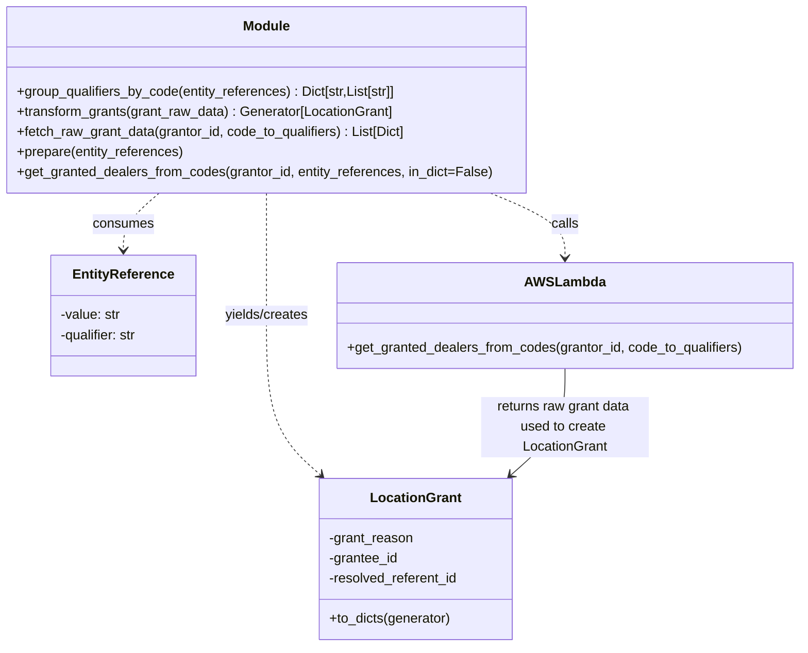

# Diagram: entity_core/entity_service/entity_service/entity/entity_location/entity_location_grants.py


> Auto-generated by Obscura crawlers

## Diagram 1

```mermaid
flowchart TD
    Start([Start]) --> GGD[get_granted_dealers_from_codes(grantor_id, entity_references, in_dict)]
    GGD --> NORM{entity_references is dict?}
    NORM -->|yes| WRAP[wrap dict in list]
    NORM -->|no| WRAP
    WRAP --> GQ[group_qualifiers_by_code(entity_references)]
    GQ -->|code_to_qualifiers| FRD[fetch_raw_grant_data(grantor_id, code_to_qualifiers)]
    FRD --> EXTFV[fv.aws.lambdas.location.get_granted_dealers_from_codes]
    EXTFV -->|grant_raw_data| TG[transform_grants(grant_raw_data)]
    subgraph PROCESS["_process_grant(grant)"]
        P_ITER[iterate grant.get("grant_reason", [])] --> P_YIELD[yield LocationGrant(grant_reason, grantee_id, resolved_referent_id)]
    end
    TG --> PROCESS
    PROCESS --> GRANTEES[grantees (Generator of LocationGrant)]
    GRANTEES --> DECIDE{in_dict?}
    DECIDE -->|true| TO_DICTS[LocationGrant.to_dicts(grantees)]
    DECIDE -->|false| RETURN_GEN[return grantees (Generator)]
    TO_DICTS --> End([End: list of dicts])
    RETURN_GEN --> End
```

> SVG rendering failed for this diagram.

## Diagram 2



### SVG

<svg id="container" width="955.4375" xmlns="http://www.w3.org/2000/svg" class="classDiagram" height="770" viewBox="0 0 955.4375 770" role="graphics-document document" aria-roledescription="class"><style>#container{font-family:"trebuchet ms",verdana,arial,sans-serif;font-size:16px;fill:#333;}@keyframes edge-animation-frame{from{stroke-dashoffset:0;}}@keyframes dash{to{stroke-dashoffset:0;}}#container .edge-animation-slow{stroke-dasharray:9,5!important;stroke-dashoffset:900;animation:dash 50s linear infinite;stroke-linecap:round;}#container .edge-animation-fast{stroke-dasharray:9,5!important;stroke-dashoffset:900;animation:dash 20s linear infinite;stroke-linecap:round;}#container .error-icon{fill:#552222;}#container .error-text{fill:#552222;stroke:#552222;}#container .edge-thickness-normal{stroke-width:1px;}#container .edge-thickness-thick{stroke-width:3.5px;}#container .edge-pattern-solid{stroke-dasharray:0;}#container .edge-thickness-invisible{stroke-width:0;fill:none;}#container .edge-pattern-dashed{stroke-dasharray:3;}#container .edge-pattern-dotted{stroke-dasharray:2;}#container .marker{fill:#333333;stroke:#333333;}#container .marker.cross{stroke:#333333;}#container svg{font-family:"trebuchet ms",verdana,arial,sans-serif;font-size:16px;}#container p{margin:0;}#container g.classGroup text{fill:#9370DB;stroke:none;font-family:"trebuchet ms",verdana,arial,sans-serif;font-size:10px;}#container g.classGroup text .title{font-weight:bolder;}#container .nodeLabel,#container .edgeLabel{color:#131300;}#container .edgeLabel .label rect{fill:#ECECFF;}#container .label text{fill:#131300;}#container .labelBkg{background:#ECECFF;}#container .edgeLabel .label span{background:#ECECFF;}#container .classTitle{font-weight:bolder;}#container .node rect,#container .node circle,#container .node ellipse,#container .node polygon,#container .node path{fill:#ECECFF;stroke:#9370DB;stroke-width:1px;}#container .divider{stroke:#9370DB;stroke-width:1;}#container g.clickable{cursor:pointer;}#container g.classGroup rect{fill:#ECECFF;stroke:#9370DB;}#container g.classGroup line{stroke:#9370DB;stroke-width:1;}#container .classLabel .box{stroke:none;stroke-width:0;fill:#ECECFF;opacity:0.5;}#container .classLabel .label{fill:#9370DB;font-size:10px;}#container .relation{stroke:#333333;stroke-width:1;fill:none;}#container .dashed-line{stroke-dasharray:3;}#container .dotted-line{stroke-dasharray:1 2;}#container #compositionStart,#container .composition{fill:#333333!important;stroke:#333333!important;stroke-width:1;}#container #compositionEnd,#container .composition{fill:#333333!important;stroke:#333333!important;stroke-width:1;}#container #dependencyStart,#container .dependency{fill:#333333!important;stroke:#333333!important;stroke-width:1;}#container #dependencyStart,#container .dependency{fill:#333333!important;stroke:#333333!important;stroke-width:1;}#container #extensionStart,#container .extension{fill:transparent!important;stroke:#333333!important;stroke-width:1;}#container #extensionEnd,#container .extension{fill:transparent!important;stroke:#333333!important;stroke-width:1;}#container #aggregationStart,#container .aggregation{fill:transparent!important;stroke:#333333!important;stroke-width:1;}#container #aggregationEnd,#container .aggregation{fill:transparent!important;stroke:#333333!important;stroke-width:1;}#container #lollipopStart,#container .lollipop{fill:#ECECFF!important;stroke:#333333!important;stroke-width:1;}#container #lollipopEnd,#container .lollipop{fill:#ECECFF!important;stroke:#333333!important;stroke-width:1;}#container .edgeTerminals{font-size:11px;line-height:initial;}#container .classTitleText{text-anchor:middle;font-size:18px;fill:#333;}#container .label-icon{display:inline-block;height:1em;overflow:visible;vertical-align:-0.125em;}#container .node .label-icon path{fill:currentColor;stroke:revert;stroke-width:revert;}#container :root{--mermaid-font-family:"trebuchet ms",verdana,arial,sans-serif;}</style><g><defs><marker id="container_class-aggregationStart" class="marker aggregation class" refX="18" refY="7" markerWidth="190" markerHeight="240" orient="auto"><path d="M 18,7 L9,13 L1,7 L9,1 Z"></path></marker></defs><defs><marker id="container_class-aggregationEnd" class="marker aggregation class" refX="1" refY="7" markerWidth="20" markerHeight="28" orient="auto"><path d="M 18,7 L9,13 L1,7 L9,1 Z"></path></marker></defs><defs><marker id="container_class-extensionStart" class="marker extension class" refX="18" refY="7" markerWidth="190" markerHeight="240" orient="auto"><path d="M 1,7 L18,13 V 1 Z"></path></marker></defs><defs><marker id="container_class-extensionEnd" class="marker extension class" refX="1" refY="7" markerWidth="20" markerHeight="28" orient="auto"><path d="M 1,1 V 13 L18,7 Z"></path></marker></defs><defs><marker id="container_class-compositionStart" class="marker composition class" refX="18" refY="7" markerWidth="190" markerHeight="240" orient="auto"><path d="M 18,7 L9,13 L1,7 L9,1 Z"></path></marker></defs><defs><marker id="container_class-compositionEnd" class="marker composition class" refX="1" refY="7" markerWidth="20" markerHeight="28" orient="auto"><path d="M 18,7 L9,13 L1,7 L9,1 Z"></path></marker></defs><defs><marker id="container_class-dependencyStart" class="marker dependency class" refX="6" refY="7" markerWidth="190" markerHeight="240" orient="auto"><path d="M 5,7 L9,13 L1,7 L9,1 Z"></path></marker></defs><defs><marker id="container_class-dependencyEnd" class="marker dependency class" refX="13" refY="7" markerWidth="20" markerHeight="28" orient="auto"><path d="M 18,7 L9,13 L14,7 L9,1 Z"></path></marker></defs><defs><marker id="container_class-lollipopStart" class="marker lollipop class" refX="13" refY="7" markerWidth="190" markerHeight="240" orient="auto"><circle stroke="black" fill="transparent" cx="7" cy="7" r="6"></circle></marker></defs><defs><marker id="container_class-lollipopEnd" class="marker lollipop class" refX="1" refY="7" markerWidth="190" markerHeight="240" orient="auto"><circle stroke="black" fill="transparent" cx="7" cy="7" r="6"></circle></marker></defs><g class="root"><g class="clusters"></g><g class="edgePaths"><path d="M186.761,230L179.485,236.167C172.209,242.333,157.657,254.667,150.381,266C143.105,277.333,143.105,287.667,143.105,292.833L143.105,298" id="id_Module_EntityReference_1" class="edge-thickness-normal edge-pattern-dashed relation" style=";;;" data-edge="true" data-et="edge" data-id="id_Module_EntityReference_1" data-points="W3sieCI6MTg2Ljc2MDc0MjE4NzUsInkiOjIzMH0seyJ4IjoxNDMuMTA1NDY4NzUsInkiOjI2N30seyJ4IjoxNDMuMTA1NDY4NzUsInkiOjMwNH1d" marker-end="url(#container_class-dependencyEnd)"></path><path d="M317.727,230L317.727,236.167C317.727,242.333,317.727,254.667,317.727,279C317.727,303.333,317.727,339.667,317.727,380C317.727,420.333,317.727,464.667,328.566,496.341C339.406,528.015,361.086,547.029,371.925,556.536L382.765,566.044" id="id_Module_LocationGrant_2" class="edge-thickness-normal edge-pattern-dashed relation" style=";;;" data-edge="true" data-et="edge" data-id="id_Module_LocationGrant_2" data-points="W3sieCI6MzE3LjcyNjU2MjUsInkiOjIzMH0seyJ4IjozMTcuNzI2NTYyNSwieSI6MjY3fSx7IngiOjMxNy43MjY1NjI1LCJ5IjozNzZ9LHsieCI6MzE3LjcyNjU2MjUsInkiOjUwOX0seyJ4IjozODcuMjc1ODUwOTE1NjA1MSwieSI6NTcwfV0=" marker-end="url(#container_class-dependencyEnd)"></path><path d="M586.232,230L601.149,236.167C616.066,242.333,645.9,254.667,660.817,267.5C675.734,280.333,675.734,293.667,675.734,300.333L675.734,307" id="id_Module_AWSLambda_3" class="edge-thickness-normal edge-pattern-dashed relation" style=";;;" data-edge="true" data-et="edge" data-id="id_Module_AWSLambda_3" data-points="W3sieCI6NTg2LjIzMjQyMTg3NSwieSI6MjMwfSx7IngiOjY3NS43MzQzNzUsInkiOjI2N30seyJ4Ijo2NzUuNzM0Mzc1LCJ5IjozMTN9XQ==" marker-end="url(#container_class-dependencyEnd)"></path><path d="M675.734,439L675.734,450.667C675.734,462.333,675.734,485.667,664.895,506.841C654.055,528.015,632.375,547.029,621.536,556.536L610.696,566.044" id="id_AWSLambda_LocationGrant_4" class="edge-thickness-normal edge-pattern-solid relation" style=";;;" data-edge="true" data-et="edge" data-id="id_AWSLambda_LocationGrant_4" data-points="W3sieCI6Njc1LjczNDM3NSwieSI6NDM5fSx7IngiOjY3NS43MzQzNzUsInkiOjUwOX0seyJ4Ijo2MDYuMTg1MDg2NTg0Mzk0OSwieSI6NTcwfV0=" marker-end="url(#container_class-dependencyEnd)"></path></g><g class="edgeLabels"><g class="edgeLabel" transform="translate(143.10546875, 267)"><g class="label" data-id="id_Module_EntityReference_1" transform="translate(-36.375, -12)"><foreignObject width="72.75" height="24"><div xmlns="http://www.w3.org/1999/xhtml" class="labelBkg" style="display: table-cell; white-space: nowrap; line-height: 1.5; max-width: 200px; text-align: center;"><span class="edgeLabel"><p>consumes</p></span></div></foreignObject></g></g><g class="edgeLabel" transform="translate(317.7265625, 376)"><g class="label" data-id="id_Module_LocationGrant_2" transform="translate(-51.3046875, -12)"><foreignObject width="102.609375" height="24"><div xmlns="http://www.w3.org/1999/xhtml" class="labelBkg" style="display: table-cell; white-space: nowrap; line-height: 1.5; max-width: 200px; text-align: center;"><span class="edgeLabel"><p>yields/creates</p></span></div></foreignObject></g></g><g class="edgeLabel" transform="translate(675.734375, 267)"><g class="label" data-id="id_Module_AWSLambda_3" transform="translate(-16.4453125, -12)"><foreignObject width="32.890625" height="24"><div xmlns="http://www.w3.org/1999/xhtml" class="labelBkg" style="display: table-cell; white-space: nowrap; line-height: 1.5; max-width: 200px; text-align: center;"><span class="edgeLabel"><p>calls</p></span></div></foreignObject></g></g><g class="edgeLabel" transform="translate(675.734375, 509)"><g class="label" data-id="id_AWSLambda_LocationGrant_4" transform="translate(-100, -36)"><foreignObject width="200" height="72"><div xmlns="http://www.w3.org/1999/xhtml" class="labelBkg" style="display: table; white-space: break-spaces; line-height: 1.5; max-width: 200px; text-align: center; width: 200px;"><span class="edgeLabel"><p>returns raw grant data used to create LocationGrant</p></span></div></foreignObject></g></g></g><g class="nodes"><g class="node default" id="classId-Module-0" transform="translate(317.7265625, 119)"><g class="basic label-container"><path d="M-309.7265625 -111 L309.7265625 -111 L309.7265625 111 L-309.7265625 111" stroke="none" stroke-width="0" fill="#ECECFF" style=""></path><path d="M-309.7265625 -111 C-152.0664675131752 -111, 5.593627473649576 -111, 309.7265625 -111 M-309.7265625 -111 C-79.90997411315948 -111, 149.90661427368104 -111, 309.7265625 -111 M309.7265625 -111 C309.7265625 -25.396962597489036, 309.7265625 60.20607480502193, 309.7265625 111 M309.7265625 -111 C309.7265625 -51.8540116716359, 309.7265625 7.291976656728195, 309.7265625 111 M309.7265625 111 C110.47748975965283 111, -88.77158298069435 111, -309.7265625 111 M309.7265625 111 C143.03409145649104 111, -23.65837958701792 111, -309.7265625 111 M-309.7265625 111 C-309.7265625 46.51487821719675, -309.7265625 -17.970243565606495, -309.7265625 -111 M-309.7265625 111 C-309.7265625 28.127614859582835, -309.7265625 -54.74477028083433, -309.7265625 -111" stroke="#9370DB" stroke-width="1.3" fill="none" stroke-dasharray="0 0" style=""></path></g><g class="annotation-group text" transform="translate(0, -87)"></g><g class="label-group text" transform="translate(-27.09375, -87)"><g class="label" style="font-weight: bolder" transform="translate(0,-12)"><foreignObject width="54.1875" height="24"><div xmlns="http://www.w3.org/1999/xhtml" style="display: table-cell; white-space: nowrap; line-height: 1.5; max-width: 104px; text-align: center;"><span class="nodeLabel markdown-node-label" style=""><p>Module</p></span></div></foreignObject></g></g><g class="members-group text" transform="translate(-297.7265625, -39)"></g><g class="methods-group text" transform="translate(-297.7265625, -9)"><g class="label" style="" transform="translate(0,-12)"><foreignObject width="457.703125" height="24"><div xmlns="http://www.w3.org/1999/xhtml" style="display: table-cell; white-space: nowrap; line-height: 1.5; max-width: 515px; text-align: center;"><span class="nodeLabel markdown-node-label" style=""><p>+group_qualifiers_by_code(entity_references) : Dict[str,List[str]]</p></span></div></foreignObject></g><g class="label" style="" transform="translate(0,12)"><foreignObject width="452.28125" height="24"><div xmlns="http://www.w3.org/1999/xhtml" style="display: table-cell; white-space: nowrap; line-height: 1.5; max-width: 510px; text-align: center;"><span class="nodeLabel markdown-node-label" style=""><p>+transform_grants(grant_raw_data) : Generator[LocationGrant]</p></span></div></foreignObject></g><g class="label" style="" transform="translate(0,36)"><foreignObject width="467.390625" height="24"><div xmlns="http://www.w3.org/1999/xhtml" style="display: table-cell; white-space: nowrap; line-height: 1.5; max-width: 525px; text-align: center;"><span class="nodeLabel markdown-node-label" style=""><p>+fetch_raw_grant_data(grantor_id, code_to_qualifiers) : List[Dict]</p></span></div></foreignObject></g><g class="label" style="" transform="translate(0,60)"><foreignObject width="200.1875" height="24"><div xmlns="http://www.w3.org/1999/xhtml" style="display: table-cell; white-space: nowrap; line-height: 1.5; max-width: 258px; text-align: center;"><span class="nodeLabel markdown-node-label" style=""><p>+prepare(entity_references)</p></span></div></foreignObject></g><g class="label" style="" transform="translate(0,84)"><foreignObject width="568.359375" height="24"><div xmlns="http://www.w3.org/1999/xhtml" style="display: table-cell; white-space: nowrap; line-height: 1.5; max-width: 626px; text-align: center;"><span class="nodeLabel markdown-node-label" style=""><p>+get_granted_dealers_from_codes(grantor_id, entity_references, in_dict=False)</p></span></div></foreignObject></g></g><g class="divider" style=""><path d="M-309.7265625 -63 C-139.37231156735345 -63, 30.9819393652931 -63, 309.7265625 -63 M-309.7265625 -63 C-77.77286299786579 -63, 154.18083650426843 -63, 309.7265625 -63" stroke="#9370DB" stroke-width="1.3" fill="none" stroke-dasharray="0 0" style=""></path></g><g class="divider" style=""><path d="M-309.7265625 -39 C-173.59977339319488 -39, -37.47298428638976 -39, 309.7265625 -39 M-309.7265625 -39 C-151.974148666805 -39, 5.7782651663899856 -39, 309.7265625 -39" stroke="#9370DB" stroke-width="1.3" fill="none" stroke-dasharray="0 0" style=""></path></g></g><g class="node default" id="classId-EntityReference-1" transform="translate(143.10546875, 376)"><g class="basic label-container"><path d="M-88.31640625 -72 L88.31640625 -72 L88.31640625 72 L-88.31640625 72" stroke="none" stroke-width="0" fill="#ECECFF" style=""></path><path d="M-88.31640625 -72 C-40.35621847024605 -72, 7.603969309507903 -72, 88.31640625 -72 M-88.31640625 -72 C-34.58138719223389 -72, 19.15363186553222 -72, 88.31640625 -72 M88.31640625 -72 C88.31640625 -31.579151156923274, 88.31640625 8.841697686153452, 88.31640625 72 M88.31640625 -72 C88.31640625 -31.024911617420877, 88.31640625 9.950176765158247, 88.31640625 72 M88.31640625 72 C48.505127678322225 72, 8.69384910664445 72, -88.31640625 72 M88.31640625 72 C51.06552104143532 72, 13.814635832870636 72, -88.31640625 72 M-88.31640625 72 C-88.31640625 42.95388973464968, -88.31640625 13.907779469299356, -88.31640625 -72 M-88.31640625 72 C-88.31640625 35.5609820886663, -88.31640625 -0.8780358226673997, -88.31640625 -72" stroke="#9370DB" stroke-width="1.3" fill="none" stroke-dasharray="0 0" style=""></path></g><g class="annotation-group text" transform="translate(0, -48)"></g><g class="label-group text" transform="translate(-57.7890625, -48)"><g class="label" style="font-weight: bolder" transform="translate(0,-12)"><foreignObject width="115.578125" height="24"><div xmlns="http://www.w3.org/1999/xhtml" style="display: table-cell; white-space: nowrap; line-height: 1.5; max-width: 164px; text-align: center;"><span class="nodeLabel markdown-node-label" style=""><p>EntityReference</p></span></div></foreignObject></g></g><g class="members-group text" transform="translate(-76.31640625, 0)"><g class="label" style="" transform="translate(0,-12)"><foreignObject width="72.6875" height="24"><div xmlns="http://www.w3.org/1999/xhtml" style="display: table-cell; white-space: nowrap; line-height: 1.5; max-width: 131px; text-align: center;"><span class="nodeLabel markdown-node-label" style=""><p>-value: str</p></span></div></foreignObject></g><g class="label" style="" transform="translate(0,12)"><foreignObject width="94.84375" height="24"><div xmlns="http://www.w3.org/1999/xhtml" style="display: table-cell; white-space: nowrap; line-height: 1.5; max-width: 153px; text-align: center;"><span class="nodeLabel markdown-node-label" style=""><p>-qualifier: str</p></span></div></foreignObject></g></g><g class="methods-group text" transform="translate(-76.31640625, 72)"></g><g class="divider" style=""><path d="M-88.31640625 -24 C-22.757772714969846 -24, 42.80086082006031 -24, 88.31640625 -24 M-88.31640625 -24 C-30.30916954734608 -24, 27.69806715530784 -24, 88.31640625 -24" stroke="#9370DB" stroke-width="1.3" fill="none" stroke-dasharray="0 0" style=""></path></g><g class="divider" style=""><path d="M-88.31640625 48 C-31.819851597570675 48, 24.67670305485865 48, 88.31640625 48 M-88.31640625 48 C-51.43531269748961 48, -14.554219144979214 48, 88.31640625 48" stroke="#9370DB" stroke-width="1.3" fill="none" stroke-dasharray="0 0" style=""></path></g></g><g class="node default" id="classId-LocationGrant-2" transform="translate(496.73046875, 666)"><g class="basic label-container"><path d="M-116.23046875 -96 L116.23046875 -96 L116.23046875 96 L-116.23046875 96" stroke="none" stroke-width="0" fill="#ECECFF" style=""></path><path d="M-116.23046875 -96 C-49.19296373108472 -96, 17.844541287830566 -96, 116.23046875 -96 M-116.23046875 -96 C-37.573073733637145 -96, 41.08432128272571 -96, 116.23046875 -96 M116.23046875 -96 C116.23046875 -41.697164410482095, 116.23046875 12.60567117903581, 116.23046875 96 M116.23046875 -96 C116.23046875 -54.162803605582354, 116.23046875 -12.325607211164709, 116.23046875 96 M116.23046875 96 C44.61877962336483 96, -26.99290950327034 96, -116.23046875 96 M116.23046875 96 C59.340970737216864 96, 2.451472724433728 96, -116.23046875 96 M-116.23046875 96 C-116.23046875 46.347267985355145, -116.23046875 -3.305464029289709, -116.23046875 -96 M-116.23046875 96 C-116.23046875 32.98383996573571, -116.23046875 -30.032320068528577, -116.23046875 -96" stroke="#9370DB" stroke-width="1.3" fill="none" stroke-dasharray="0 0" style=""></path></g><g class="annotation-group text" transform="translate(0, -72)"></g><g class="label-group text" transform="translate(-51.5234375, -72)"><g class="label" style="font-weight: bolder" transform="translate(0,-12)"><foreignObject width="103.046875" height="24"><div xmlns="http://www.w3.org/1999/xhtml" style="display: table-cell; white-space: nowrap; line-height: 1.5; max-width: 152px; text-align: center;"><span class="nodeLabel markdown-node-label" style=""><p>LocationGrant</p></span></div></foreignObject></g></g><g class="members-group text" transform="translate(-104.23046875, -24)"><g class="label" style="" transform="translate(0,-12)"><foreignObject width="101.5625" height="24"><div xmlns="http://www.w3.org/1999/xhtml" style="display: table-cell; white-space: nowrap; line-height: 1.5; max-width: 159px; text-align: center;"><span class="nodeLabel markdown-node-label" style=""><p>-grant_reason</p></span></div></foreignObject></g><g class="label" style="" transform="translate(0,12)"><foreignObject width="83.53125" height="24"><div xmlns="http://www.w3.org/1999/xhtml" style="display: table-cell; white-space: nowrap; line-height: 1.5; max-width: 141px; text-align: center;"><span class="nodeLabel markdown-node-label" style=""><p>-grantee_id</p></span></div></foreignObject></g><g class="label" style="" transform="translate(0,36)"><foreignObject width="156.9375" height="24"><div xmlns="http://www.w3.org/1999/xhtml" style="display: table-cell; white-space: nowrap; line-height: 1.5; max-width: 214px; text-align: center;"><span class="nodeLabel markdown-node-label" style=""><p>-resolved_referent_id</p></span></div></foreignObject></g></g><g class="methods-group text" transform="translate(-104.23046875, 72)"><g class="label" style="" transform="translate(0,-12)"><foreignObject width="146.078125" height="24"><div xmlns="http://www.w3.org/1999/xhtml" style="display: table-cell; white-space: nowrap; line-height: 1.5; max-width: 203px; text-align: center;"><span class="nodeLabel markdown-node-label" style=""><p>+to_dicts(generator)</p></span></div></foreignObject></g></g><g class="divider" style=""><path d="M-116.23046875 -48 C-51.98053518028955 -48, 12.2693983894209 -48, 116.23046875 -48 M-116.23046875 -48 C-55.59050733240005 -48, 5.049454085199898 -48, 116.23046875 -48" stroke="#9370DB" stroke-width="1.3" fill="none" stroke-dasharray="0 0" style=""></path></g><g class="divider" style=""><path d="M-116.23046875 48 C-50.874174518426315 48, 14.48211971314737 48, 116.23046875 48 M-116.23046875 48 C-67.30472914504898 48, -18.37898954009796 48, 116.23046875 48" stroke="#9370DB" stroke-width="1.3" fill="none" stroke-dasharray="0 0" style=""></path></g></g><g class="node default" id="classId-AWSLambda-3" transform="translate(675.734375, 376)"><g class="basic label-container"><path d="M-271.703125 -63 L271.703125 -63 L271.703125 63 L-271.703125 63" stroke="none" stroke-width="0" fill="#ECECFF" style=""></path><path d="M-271.703125 -63 C-99.76780023721608 -63, 72.16752452556784 -63, 271.703125 -63 M-271.703125 -63 C-56.637518857740076 -63, 158.42808728451985 -63, 271.703125 -63 M271.703125 -63 C271.703125 -29.014299709462207, 271.703125 4.971400581075585, 271.703125 63 M271.703125 -63 C271.703125 -26.246184100649565, 271.703125 10.50763179870087, 271.703125 63 M271.703125 63 C104.43261223520213 63, -62.83790052959574 63, -271.703125 63 M271.703125 63 C150.5684253891144 63, 29.433725778228762 63, -271.703125 63 M-271.703125 63 C-271.703125 29.204534652349153, -271.703125 -4.590930695301694, -271.703125 -63 M-271.703125 63 C-271.703125 16.593761163772207, -271.703125 -29.812477672455586, -271.703125 -63" stroke="#9370DB" stroke-width="1.3" fill="none" stroke-dasharray="0 0" style=""></path></g><g class="annotation-group text" transform="translate(0, -39)"></g><g class="label-group text" transform="translate(-45.125, -39)"><g class="label" style="font-weight: bolder" transform="translate(0,-12)"><foreignObject width="90.25" height="24"><div xmlns="http://www.w3.org/1999/xhtml" style="display: table-cell; white-space: nowrap; line-height: 1.5; max-width: 139px; text-align: center;"><span class="nodeLabel markdown-node-label" style=""><p>AWSLambda</p></span></div></foreignObject></g></g><g class="members-group text" transform="translate(-259.703125, 9)"></g><g class="methods-group text" transform="translate(-259.703125, 39)"><g class="label" style="" transform="translate(0,-12)"><foreignObject width="474.28125" height="24"><div xmlns="http://www.w3.org/1999/xhtml" style="display: table-cell; white-space: nowrap; line-height: 1.5; max-width: 532px; text-align: center;"><span class="nodeLabel markdown-node-label" style=""><p>+get_granted_dealers_from_codes(grantor_id, code_to_qualifiers)</p></span></div></foreignObject></g></g><g class="divider" style=""><path d="M-271.703125 -15 C-131.58829772110792 -15, 8.526529557784158 -15, 271.703125 -15 M-271.703125 -15 C-58.103702161878914 -15, 155.49572067624217 -15, 271.703125 -15" stroke="#9370DB" stroke-width="1.3" fill="none" stroke-dasharray="0 0" style=""></path></g><g class="divider" style=""><path d="M-271.703125 9 C-62.56844596453436 9, 146.56623307093128 9, 271.703125 9 M-271.703125 9 C-71.24791965883554 9, 129.20728568232892 9, 271.703125 9" stroke="#9370DB" stroke-width="1.3" fill="none" stroke-dasharray="0 0" style=""></path></g></g></g></g></g></svg>
