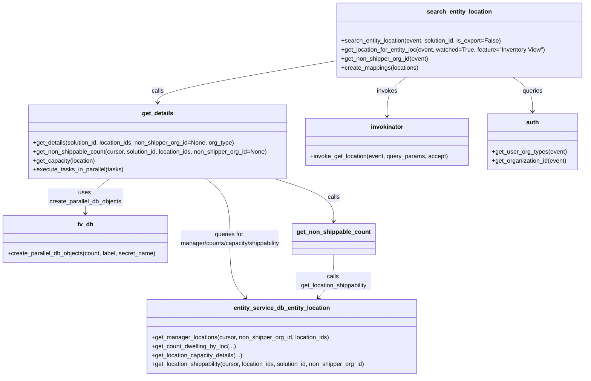

# Diagram: entity_core/entity_service/entity_service/entity/entity_location/get_search_entity_location.py


> Auto-generated by Obscura crawlers

## Diagram 1

```mermaid
flowchart LR
    SE[search_entity_location(event, solution_id)] --> GL[get_location_for_entity_loc(event)]
    SE --> NG[get_non_shipper_org_id(event)]
    SE --> CM[create_mappings(locations)]
    CM --> MAP_CHILD[map_child_id_to_parent]
    CM --> MAP_PARENT[map_parent_id_to_parent]
    SE --> GD[get_details(solution_id, location_ids, non_shipper_org_id, org_types)]
    GD --> CP[create_parallel_db_objects]
    GD --> ML[get_manager_locations(cursor, non_shipper_org_id, location_ids)]
    GD --> ET[execute_tasks_in_parallel(tasks)]
    ET --> TPE[ThreadPoolExecutor]
    ET --> TF[task functions: get_count_dwelling_by_loc, get_location_capacity_details, get_non_shippable_count]
    TF --> GNS[get_non_shippable_count(cursor, solution_id, location_ids, non_shipper_org_id)]
    GNS --> LS[get_location_shippability(cursor, location_ids, solution_id, non_shipper_org_id)]
    SE --> PAG[set_paginagtion(event, active_count)]
```

> SVG rendering failed for this diagram.

## Diagram 2

```mermaid
sequenceDiagram
    participant Client
    participant Search as search_entity_location
    participant Locator as invoke_get_location
    participant Auth as auth
    participant Mappings as create_mappings
    participant Details as get_details
    participant DB as fv.db / entity_service.db
    participant Parallel as execute_tasks_in_parallel
    participant Thread as ThreadPoolExecutor
    participant Tasks as TaskFunctions

    Client->>Search: request (event, solution_id)
    Search->>Locator: invoke_get_location(event_copy, query_params)
    Locator-->>Search: locations
    Search->>Auth: get_user_org_types(event) / get_organization_id(event)
    Auth-->>Search: org_types / org_id
    Search->>Mappings: create_mappings(locations)
    Mappings-->>Search: child/parent maps
    Search->>Details: get_details(solution_id, location_ids, non_shipper_org_id, org_types)
    Details->>DB: create_parallel_db_objects(num_connections_needed,...)
    DB-->>Details: db_connections
    Details->>DB: get_manager_locations(cursor, non_shipper_org_id, location_ids)
    DB-->>Details: manager_locations
    Details->>Parallel: execute_tasks_in_parallel(tasks)
    Parallel->>Thread: start ThreadPoolExecutor
    Thread->>Tasks: run task functions in parallel
    Tasks-->>Thread: results (dwell, capacity, shippable)
    Thread-->>Parallel: aggregated results
    Parallel-->>Details: results
    Details-->>Search: loc_details
    Search-->>Client: response (meta, data)
```

> SVG rendering failed for this diagram.

## Diagram 3



### SVG

<svg id="container" width="1580.583984375" xmlns="http://www.w3.org/2000/svg" class="classDiagram" height="1006" viewBox="0 0 1580.583984375 1006" role="graphics-document document" aria-roledescription="class"><style>#container{font-family:"trebuchet ms",verdana,arial,sans-serif;font-size:16px;fill:#333;}@keyframes edge-animation-frame{from{stroke-dashoffset:0;}}@keyframes dash{to{stroke-dashoffset:0;}}#container .edge-animation-slow{stroke-dasharray:9,5!important;stroke-dashoffset:900;animation:dash 50s linear infinite;stroke-linecap:round;}#container .edge-animation-fast{stroke-dasharray:9,5!important;stroke-dashoffset:900;animation:dash 20s linear infinite;stroke-linecap:round;}#container .error-icon{fill:#552222;}#container .error-text{fill:#552222;stroke:#552222;}#container .edge-thickness-normal{stroke-width:1px;}#container .edge-thickness-thick{stroke-width:3.5px;}#container .edge-pattern-solid{stroke-dasharray:0;}#container .edge-thickness-invisible{stroke-width:0;fill:none;}#container .edge-pattern-dashed{stroke-dasharray:3;}#container .edge-pattern-dotted{stroke-dasharray:2;}#container .marker{fill:#333333;stroke:#333333;}#container .marker.cross{stroke:#333333;}#container svg{font-family:"trebuchet ms",verdana,arial,sans-serif;font-size:16px;}#container p{margin:0;}#container g.classGroup text{fill:#9370DB;stroke:none;font-family:"trebuchet ms",verdana,arial,sans-serif;font-size:10px;}#container g.classGroup text .title{font-weight:bolder;}#container .nodeLabel,#container .edgeLabel{color:#131300;}#container .edgeLabel .label rect{fill:#ECECFF;}#container .label text{fill:#131300;}#container .labelBkg{background:#ECECFF;}#container .edgeLabel .label span{background:#ECECFF;}#container .classTitle{font-weight:bolder;}#container .node rect,#container .node circle,#container .node ellipse,#container .node polygon,#container .node path{fill:#ECECFF;stroke:#9370DB;stroke-width:1px;}#container .divider{stroke:#9370DB;stroke-width:1;}#container g.clickable{cursor:pointer;}#container g.classGroup rect{fill:#ECECFF;stroke:#9370DB;}#container g.classGroup line{stroke:#9370DB;stroke-width:1;}#container .classLabel .box{stroke:none;stroke-width:0;fill:#ECECFF;opacity:0.5;}#container .classLabel .label{fill:#9370DB;font-size:10px;}#container .relation{stroke:#333333;stroke-width:1;fill:none;}#container .dashed-line{stroke-dasharray:3;}#container .dotted-line{stroke-dasharray:1 2;}#container #compositionStart,#container .composition{fill:#333333!important;stroke:#333333!important;stroke-width:1;}#container #compositionEnd,#container .composition{fill:#333333!important;stroke:#333333!important;stroke-width:1;}#container #dependencyStart,#container .dependency{fill:#333333!important;stroke:#333333!important;stroke-width:1;}#container #dependencyStart,#container .dependency{fill:#333333!important;stroke:#333333!important;stroke-width:1;}#container #extensionStart,#container .extension{fill:transparent!important;stroke:#333333!important;stroke-width:1;}#container #extensionEnd,#container .extension{fill:transparent!important;stroke:#333333!important;stroke-width:1;}#container #aggregationStart,#container .aggregation{fill:transparent!important;stroke:#333333!important;stroke-width:1;}#container #aggregationEnd,#container .aggregation{fill:transparent!important;stroke:#333333!important;stroke-width:1;}#container #lollipopStart,#container .lollipop{fill:#ECECFF!important;stroke:#333333!important;stroke-width:1;}#container #lollipopEnd,#container .lollipop{fill:#ECECFF!important;stroke:#333333!important;stroke-width:1;}#container .edgeTerminals{font-size:11px;line-height:initial;}#container .classTitleText{text-anchor:middle;font-size:18px;fill:#333;}#container .label-icon{display:inline-block;height:1em;overflow:visible;vertical-align:-0.125em;}#container .node .label-icon path{fill:currentColor;stroke:revert;stroke-width:revert;}#container :root{--mermaid-font-family:"trebuchet ms",verdana,arial,sans-serif;}</style><g><defs><marker id="container_class-aggregationStart" class="marker aggregation class" refX="18" refY="7" markerWidth="190" markerHeight="240" orient="auto"><path d="M 18,7 L9,13 L1,7 L9,1 Z"></path></marker></defs><defs><marker id="container_class-aggregationEnd" class="marker aggregation class" refX="1" refY="7" markerWidth="20" markerHeight="28" orient="auto"><path d="M 18,7 L9,13 L1,7 L9,1 Z"></path></marker></defs><defs><marker id="container_class-extensionStart" class="marker extension class" refX="18" refY="7" markerWidth="190" markerHeight="240" orient="auto"><path d="M 1,7 L18,13 V 1 Z"></path></marker></defs><defs><marker id="container_class-extensionEnd" class="marker extension class" refX="1" refY="7" markerWidth="20" markerHeight="28" orient="auto"><path d="M 1,1 V 13 L18,7 Z"></path></marker></defs><defs><marker id="container_class-compositionStart" class="marker composition class" refX="18" refY="7" markerWidth="190" markerHeight="240" orient="auto"><path d="M 18,7 L9,13 L1,7 L9,1 Z"></path></marker></defs><defs><marker id="container_class-compositionEnd" class="marker composition class" refX="1" refY="7" markerWidth="20" markerHeight="28" orient="auto"><path d="M 18,7 L9,13 L1,7 L9,1 Z"></path></marker></defs><defs><marker id="container_class-dependencyStart" class="marker dependency class" refX="6" refY="7" markerWidth="190" markerHeight="240" orient="auto"><path d="M 5,7 L9,13 L1,7 L9,1 Z"></path></marker></defs><defs><marker id="container_class-dependencyEnd" class="marker dependency class" refX="13" refY="7" markerWidth="20" markerHeight="28" orient="auto"><path d="M 18,7 L9,13 L14,7 L9,1 Z"></path></marker></defs><defs><marker id="container_class-lollipopStart" class="marker lollipop class" refX="13" refY="7" markerWidth="190" markerHeight="240" orient="auto"><circle stroke="black" fill="transparent" cx="7" cy="7" r="6"></circle></marker></defs><defs><marker id="container_class-lollipopEnd" class="marker lollipop class" refX="1" refY="7" markerWidth="190" markerHeight="240" orient="auto"><circle stroke="black" fill="transparent" cx="7" cy="7" r="6"></circle></marker></defs><g class="root"><g class="clusters"></g><g class="edgePaths"><path d="M1101.322,206L1092.482,212.167C1083.643,218.333,1065.965,230.667,1057.126,248C1048.287,265.333,1048.287,287.667,1048.287,298.833L1048.287,310" id="id_search_entity_location_invokinator_1" class="edge-thickness-normal edge-pattern-solid relation" style=";;;" data-edge="true" data-et="edge" data-id="id_search_entity_location_invokinator_1" data-points="W3sieCI6MTEwMS4zMjE1NzYyODY3NjQ2LCJ5IjoyMDZ9LHsieCI6MTA0OC4yODcxMDkzNzUsInkiOjI0M30seyJ4IjoxMDQ4LjI4NzEwOTM3NSwieSI6MzE2fV0=" marker-end="url(#container_class-dependencyEnd)"></path><path d="M1385.128,206L1393.967,212.167C1402.806,218.333,1420.484,230.667,1429.323,246C1438.162,261.333,1438.162,279.667,1438.162,288.833L1438.162,298" id="id_search_entity_location_auth_2" class="edge-thickness-normal edge-pattern-solid relation" style=";;;" data-edge="true" data-et="edge" data-id="id_search_entity_location_auth_2" data-points="W3sieCI6MTM4NS4xMjc2NDI0NjMyMzU0LCJ5IjoyMDZ9LHsieCI6MTQzOC4xNjIxMDkzNzUsInkiOjI0M30seyJ4IjoxNDM4LjE2MjEwOTM3NSwieSI6MzA0fV0=" marker-end="url(#container_class-dependencyEnd)"></path><path d="M913.865,162.002L833.029,175.502C752.192,189.002,590.519,216.001,509.682,234.667C428.846,253.333,428.846,263.667,428.846,268.833L428.846,274" id="id_search_entity_location_get_details_3" class="edge-thickness-normal edge-pattern-solid relation" style=";;;" data-edge="true" data-et="edge" data-id="id_search_entity_location_get_details_3" data-points="W3sieCI6OTEzLjg2NTIzNDM3NSwieSI6MTYyLjAwMjQ5OTAyODY4ODQ4fSx7IngiOjQyOC44NDU3MDMxMjUsInkiOjI0M30seyJ4Ijo0MjguODQ1NzAzMTI1LCJ5IjoyODB9XQ==" marker-end="url(#container_class-dependencyEnd)"></path><path d="M296.046,478L285.091,486.167C274.136,494.333,252.226,510.667,241.271,526C230.316,541.333,230.316,555.667,230.316,562.833L230.316,570" id="id_get_details_fv_db_4" class="edge-thickness-normal edge-pattern-solid relation" style=";;;" data-edge="true" data-et="edge" data-id="id_get_details_fv_db_4" data-points="W3sieCI6Mjk2LjA0NTcwMDQ4NTY0MTksInkiOjQ3OH0seyJ4IjoyMzAuMzE2NDA2MjUsInkiOjUyN30seyJ4IjoyMzAuMzE2NDA2MjUsInkiOjU3Nn1d" marker-end="url(#container_class-dependencyEnd)"></path><path d="M561.646,478L572.601,486.167C583.555,494.333,605.465,510.667,616.42,537.5C627.375,564.333,627.375,601.667,627.375,639C627.375,676.333,627.375,713.667,634.447,739.775C641.519,765.884,655.663,780.767,662.735,788.209L669.807,795.651" id="id_get_details_entity_service_db_entity_location_5" class="edge-thickness-normal edge-pattern-solid relation" style=";;;" data-edge="true" data-et="edge" data-id="id_get_details_entity_service_db_entity_location_5" data-points="W3sieCI6NTYxLjY0NTcwNTc2NDM1ODEsInkiOjQ3OH0seyJ4Ijo2MjcuMzc1LCJ5Ijo1Mjd9LHsieCI6NjI3LjM3NSwieSI6NjM5fSx7IngiOjYyNy4zNzUsInkiOjc1MX0seyJ4Ijo2NzMuOTM5NzQzNDU0MzkxOSwieSI6ODAwfV0=" marker-end="url(#container_class-dependencyEnd)"></path><path d="M749.805,478L776.282,486.167C802.758,494.333,855.711,510.667,882.188,529.5C908.664,548.333,908.664,569.667,908.664,580.333L908.664,591" id="id_get_details_get_non_shippable_count_6" class="edge-thickness-normal edge-pattern-solid relation" style=";;;" data-edge="true" data-et="edge" data-id="id_get_details_get_non_shippable_count_6" data-points="W3sieCI6NzQ5LjgwNTI4MTM1NTU3NDQsInkiOjQ3OH0seyJ4Ijo5MDguNjY0MDYyNSwieSI6NTI3fSx7IngiOjkwOC42NjQwNjI1LCJ5Ijo1OTd9XQ==" marker-end="url(#container_class-dependencyEnd)"></path><path d="M908.664,681L908.664,692.667C908.664,704.333,908.664,727.667,901.592,746.775C894.52,765.884,880.376,780.767,873.304,788.209L866.233,795.651" id="id_get_non_shippable_count_entity_service_db_entity_location_7" class="edge-thickness-normal edge-pattern-solid relation" style=";;;" data-edge="true" data-et="edge" data-id="id_get_non_shippable_count_entity_service_db_entity_location_7" data-points="W3sieCI6OTA4LjY2NDA2MjUsInkiOjY4MX0seyJ4Ijo5MDguNjY0MDYyNSwieSI6NzUxfSx7IngiOjg2Mi4wOTkzMTkwNDU2MDgxLCJ5Ijo4MDB9XQ==" marker-end="url(#container_class-dependencyEnd)"></path></g><g class="edgeLabels"><g class="edgeLabel" transform="translate(1048.287109375, 243)"><g class="label" data-id="id_search_entity_location_invokinator_1" transform="translate(-27.5859375, -12)"><foreignObject width="55.171875" height="24"><div xmlns="http://www.w3.org/1999/xhtml" class="labelBkg" style="display: table-cell; white-space: nowrap; line-height: 1.5; max-width: 200px; text-align: center;"><span class="edgeLabel"><p>invokes</p></span></div></foreignObject></g></g><g class="edgeLabel" transform="translate(1438.162109375, 243)"><g class="label" data-id="id_search_entity_location_auth_2" transform="translate(-27.2421875, -12)"><foreignObject width="54.484375" height="24"><div xmlns="http://www.w3.org/1999/xhtml" class="labelBkg" style="display: table-cell; white-space: nowrap; line-height: 1.5; max-width: 200px; text-align: center;"><span class="edgeLabel"><p>queries</p></span></div></foreignObject></g></g><g class="edgeLabel" transform="translate(428.845703125, 243)"><g class="label" data-id="id_search_entity_location_get_details_3" transform="translate(-16.4453125, -12)"><foreignObject width="32.890625" height="24"><div xmlns="http://www.w3.org/1999/xhtml" class="labelBkg" style="display: table-cell; white-space: nowrap; line-height: 1.5; max-width: 200px; text-align: center;"><span class="edgeLabel"><p>calls</p></span></div></foreignObject></g></g><g class="edgeLabel" transform="translate(230.31640625, 527)"><g class="label" data-id="id_get_details_fv_db_4" transform="translate(-100, -24)"><foreignObject width="200" height="48"><div xmlns="http://www.w3.org/1999/xhtml" class="labelBkg" style="display: table; white-space: break-spaces; line-height: 1.5; max-width: 200px; text-align: center; width: 200px;"><span class="edgeLabel"><p>uses create_parallel_db_objects</p></span></div></foreignObject></g></g><g class="edgeLabel" transform="translate(627.375, 639)"><g class="label" data-id="id_get_details_entity_service_db_entity_location_5" transform="translate(-139.7421875, -24)"><foreignObject width="279.484375" height="48"><div xmlns="http://www.w3.org/1999/xhtml" class="labelBkg" style="display: table; white-space: break-spaces; line-height: 1.5; max-width: 200px; text-align: center; width: 200px;"><span class="edgeLabel"><p>queries for manager/counts/capacity/shippability</p></span></div></foreignObject></g></g><g class="edgeLabel" transform="translate(908.6640625, 527)"><g class="label" data-id="id_get_details_get_non_shippable_count_6" transform="translate(-16.4453125, -12)"><foreignObject width="32.890625" height="24"><div xmlns="http://www.w3.org/1999/xhtml" class="labelBkg" style="display: table-cell; white-space: nowrap; line-height: 1.5; max-width: 200px; text-align: center;"><span class="edgeLabel"><p>calls</p></span></div></foreignObject></g></g><g class="edgeLabel" transform="translate(908.6640625, 751)"><g class="label" data-id="id_get_non_shippable_count_entity_service_db_entity_location_7" transform="translate(-100, -24)"><foreignObject width="200" height="48"><div xmlns="http://www.w3.org/1999/xhtml" class="labelBkg" style="display: table; white-space: break-spaces; line-height: 1.5; max-width: 200px; text-align: center; width: 200px;"><span class="edgeLabel"><p>calls get_location_shippability</p></span></div></foreignObject></g></g></g><g class="nodes"><g class="node default" id="classId-search_entity_location-0" transform="translate(1243.224609375, 107)"><g class="basic label-container"><path d="M-329.359375 -99 L329.359375 -99 L329.359375 99 L-329.359375 99" stroke="none" stroke-width="0" fill="#ECECFF" style=""></path><path d="M-329.359375 -99 C-188.96950452409405 -99, -48.5796340481881 -99, 329.359375 -99 M-329.359375 -99 C-127.05391348184114 -99, 75.25154803631773 -99, 329.359375 -99 M329.359375 -99 C329.359375 -28.11333580282694, 329.359375 42.77332839434612, 329.359375 99 M329.359375 -99 C329.359375 -24.10190824898666, 329.359375 50.79618350202668, 329.359375 99 M329.359375 99 C156.05146508642238 99, -17.256444827155235 99, -329.359375 99 M329.359375 99 C152.14794695103123 99, -25.06348109793754 99, -329.359375 99 M-329.359375 99 C-329.359375 31.229577824557225, -329.359375 -36.54084435088555, -329.359375 -99 M-329.359375 99 C-329.359375 39.071298629764655, -329.359375 -20.85740274047069, -329.359375 -99" stroke="#9370DB" stroke-width="1.3" fill="none" stroke-dasharray="0 0" style=""></path></g><g class="annotation-group text" transform="translate(0, -75)"></g><g class="label-group text" transform="translate(-83.1875, -75)"><g class="label" style="font-weight: bolder" transform="translate(0,-12)"><foreignObject width="166.375" height="24"><div xmlns="http://www.w3.org/1999/xhtml" style="display: table-cell; white-space: nowrap; line-height: 1.5; max-width: 214px; text-align: center;"><span class="nodeLabel markdown-node-label" style=""><p>search_entity_location</p></span></div></foreignObject></g></g><g class="members-group text" transform="translate(-317.359375, -27)"></g><g class="methods-group text" transform="translate(-317.359375, 3)"><g class="label" style="" transform="translate(0,-12)"><foreignObject width="432.5" height="24"><div xmlns="http://www.w3.org/1999/xhtml" style="display: table-cell; white-space: nowrap; line-height: 1.5; max-width: 490px; text-align: center;"><span class="nodeLabel markdown-node-label" style=""><p>+search_entity_location(event, solution_id, is_export=False)</p></span></div></foreignObject></g><g class="label" style="" transform="translate(0,12)"><foreignObject width="551.53125" height="24"><div xmlns="http://www.w3.org/1999/xhtml" style="display: table-cell; white-space: nowrap; line-height: 1.5; max-width: 609px; text-align: center;"><span class="nodeLabel markdown-node-label" style=""><p>+get_location_for_entity_loc(event, watched=True, feature="Inventory View")</p></span></div></foreignObject></g><g class="label" style="" transform="translate(0,36)"><foreignObject width="234.046875" height="24"><div xmlns="http://www.w3.org/1999/xhtml" style="display: table-cell; white-space: nowrap; line-height: 1.5; max-width: 291px; text-align: center;"><span class="nodeLabel markdown-node-label" style=""><p>+get_non_shipper_org_id(event)</p></span></div></foreignObject></g><g class="label" style="" transform="translate(0,60)"><foreignObject width="208.84375" height="24"><div xmlns="http://www.w3.org/1999/xhtml" style="display: table-cell; white-space: nowrap; line-height: 1.5; max-width: 266px; text-align: center;"><span class="nodeLabel markdown-node-label" style=""><p>+create_mappings(locations)</p></span></div></foreignObject></g></g><g class="divider" style=""><path d="M-329.359375 -51 C-102.63317296599303 -51, 124.09302906801395 -51, 329.359375 -51 M-329.359375 -51 C-166.24797796974462 -51, -3.1365809394892494 -51, 329.359375 -51" stroke="#9370DB" stroke-width="1.3" fill="none" stroke-dasharray="0 0" style=""></path></g><g class="divider" style=""><path d="M-329.359375 -27 C-169.04467669615988 -27, -8.729978392319765 -27, 329.359375 -27 M-329.359375 -27 C-180.2252514186169 -27, -31.091127837233785 -27, 329.359375 -27" stroke="#9370DB" stroke-width="1.3" fill="none" stroke-dasharray="0 0" style=""></path></g></g><g class="node default" id="classId-get_details-1" transform="translate(428.845703125, 379)"><g class="basic label-container"><path d="M-350.90625 -99 L350.90625 -99 L350.90625 99 L-350.90625 99" stroke="none" stroke-width="0" fill="#ECECFF" style=""></path><path d="M-350.90625 -99 C-156.35641747762975 -99, 38.193415044740505 -99, 350.90625 -99 M-350.90625 -99 C-177.09170437327558 -99, -3.2771587465511516 -99, 350.90625 -99 M350.90625 -99 C350.90625 -34.63747247357034, 350.90625 29.725055052859318, 350.90625 99 M350.90625 -99 C350.90625 -43.44000234132223, 350.90625 12.119995317355546, 350.90625 99 M350.90625 99 C162.33627182115063 99, -26.233706357698736 99, -350.90625 99 M350.90625 99 C206.16602622314224 99, 61.42580244628448 99, -350.90625 99 M-350.90625 99 C-350.90625 54.464572938207645, -350.90625 9.92914587641529, -350.90625 -99 M-350.90625 99 C-350.90625 32.498448259313804, -350.90625 -34.00310348137239, -350.90625 -99" stroke="#9370DB" stroke-width="1.3" fill="none" stroke-dasharray="0 0" style=""></path></g><g class="annotation-group text" transform="translate(0, -75)"></g><g class="label-group text" transform="translate(-40.828125, -75)"><g class="label" style="font-weight: bolder" transform="translate(0,-12)"><foreignObject width="81.65625" height="24"><div xmlns="http://www.w3.org/1999/xhtml" style="display: table-cell; white-space: nowrap; line-height: 1.5; max-width: 130px; text-align: center;"><span class="nodeLabel markdown-node-label" style=""><p>get_details</p></span></div></foreignObject></g></g><g class="members-group text" transform="translate(-338.90625, -27)"></g><g class="methods-group text" transform="translate(-338.90625, 3)"><g class="label" style="" transform="translate(0,-12)"><foreignObject width="547.859375" height="24"><div xmlns="http://www.w3.org/1999/xhtml" style="display: table-cell; white-space: nowrap; line-height: 1.5; max-width: 605px; text-align: center;"><span class="nodeLabel markdown-node-label" style=""><p>+get_details(solution_id, location_ids, non_shipper_org_id=None, org_type)</p></span></div></foreignObject></g><g class="label" style="" transform="translate(0,12)"><foreignObject width="636.984375" height="24"><div xmlns="http://www.w3.org/1999/xhtml" style="display: table-cell; white-space: nowrap; line-height: 1.5; max-width: 694px; text-align: center;"><span class="nodeLabel markdown-node-label" style=""><p>+get_non_shippable_count(cursor, solution_id, location_ids, non_shipper_org_id=None)</p></span></div></foreignObject></g><g class="label" style="" transform="translate(0,36)"><foreignObject width="168.046875" height="24"><div xmlns="http://www.w3.org/1999/xhtml" style="display: table-cell; white-space: nowrap; line-height: 1.5; max-width: 225px; text-align: center;"><span class="nodeLabel markdown-node-label" style=""><p>+get_capacity(location)</p></span></div></foreignObject></g><g class="label" style="" transform="translate(0,60)"><foreignObject width="241.65625" height="24"><div xmlns="http://www.w3.org/1999/xhtml" style="display: table-cell; white-space: nowrap; line-height: 1.5; max-width: 299px; text-align: center;"><span class="nodeLabel markdown-node-label" style=""><p>+execute_tasks_in_parallel(tasks)</p></span></div></foreignObject></g></g><g class="divider" style=""><path d="M-350.90625 -51 C-138.51051022029705 -51, 73.8852295594059 -51, 350.90625 -51 M-350.90625 -51 C-129.05098762320694 -51, 92.80427475358613 -51, 350.90625 -51" stroke="#9370DB" stroke-width="1.3" fill="none" stroke-dasharray="0 0" style=""></path></g><g class="divider" style=""><path d="M-350.90625 -27 C-75.5114943641509 -27, 199.8832612716982 -27, 350.90625 -27 M-350.90625 -27 C-165.32304914681563 -27, 20.26015170636873 -27, 350.90625 -27" stroke="#9370DB" stroke-width="1.3" fill="none" stroke-dasharray="0 0" style=""></path></g></g><g class="node default" id="classId-entity_service_db_entity_location-2" transform="translate(768.01953125, 899)"><g class="basic label-container"><path d="M-367.26171875 -99 L367.26171875 -99 L367.26171875 99 L-367.26171875 99" stroke="none" stroke-width="0" fill="#ECECFF" style=""></path><path d="M-367.26171875 -99 C-153.0475715378299 -99, 61.16657567434021 -99, 367.26171875 -99 M-367.26171875 -99 C-92.20333800246266 -99, 182.85504274507468 -99, 367.26171875 -99 M367.26171875 -99 C367.26171875 -48.13200150183435, 367.26171875 2.735996996331295, 367.26171875 99 M367.26171875 -99 C367.26171875 -46.038642771587526, 367.26171875 6.922714456824949, 367.26171875 99 M367.26171875 99 C109.63932445022033 99, -147.98306984955934 99, -367.26171875 99 M367.26171875 99 C132.40928410867176 99, -102.44315053265649 99, -367.26171875 99 M-367.26171875 99 C-367.26171875 54.31886752411369, -367.26171875 9.637735048227384, -367.26171875 -99 M-367.26171875 99 C-367.26171875 43.27474921211956, -367.26171875 -12.450501575760882, -367.26171875 -99" stroke="#9370DB" stroke-width="1.3" fill="none" stroke-dasharray="0 0" style=""></path></g><g class="annotation-group text" transform="translate(0, -75)"></g><g class="label-group text" transform="translate(-123.8671875, -75)"><g class="label" style="font-weight: bolder" transform="translate(0,-12)"><foreignObject width="247.734375" height="24"><div xmlns="http://www.w3.org/1999/xhtml" style="display: table-cell; white-space: nowrap; line-height: 1.5; max-width: 294px; text-align: center;"><span class="nodeLabel markdown-node-label" style=""><p>entity_service_db_entity_location</p></span></div></foreignObject></g></g><g class="members-group text" transform="translate(-355.26171875, -27)"></g><g class="methods-group text" transform="translate(-355.26171875, 3)"><g class="label" style="" transform="translate(0,-12)"><foreignObject width="480.140625" height="24"><div xmlns="http://www.w3.org/1999/xhtml" style="display: table-cell; white-space: nowrap; line-height: 1.5; max-width: 538px; text-align: center;"><span class="nodeLabel markdown-node-label" style=""><p>+get_manager_locations(cursor, non_shipper_org_id, location_ids)</p></span></div></foreignObject></g><g class="label" style="" transform="translate(0,12)"><foreignObject width="225.890625" height="24"><div xmlns="http://www.w3.org/1999/xhtml" style="display: table-cell; white-space: nowrap; line-height: 1.5; max-width: 283px; text-align: center;"><span class="nodeLabel markdown-node-label" style=""><p>+get_count_dwelling_by_loc(...)</p></span></div></foreignObject></g><g class="label" style="" transform="translate(0,36)"><foreignObject width="244.5625" height="24"><div xmlns="http://www.w3.org/1999/xhtml" style="display: table-cell; white-space: nowrap; line-height: 1.5; max-width: 302px; text-align: center;"><span class="nodeLabel markdown-node-label" style=""><p>+get_location_capacity_details(...)</p></span></div></foreignObject></g><g class="label" style="" transform="translate(0,60)"><foreignObject width="586.65625" height="24"><div xmlns="http://www.w3.org/1999/xhtml" style="display: table-cell; white-space: nowrap; line-height: 1.5; max-width: 644px; text-align: center;"><span class="nodeLabel markdown-node-label" style=""><p>+get_location_shippability(cursor, location_ids, solution_id, non_shipper_org_id)</p></span></div></foreignObject></g></g><g class="divider" style=""><path d="M-367.26171875 -51 C-136.07247835671535 -51, 95.1167620365693 -51, 367.26171875 -51 M-367.26171875 -51 C-181.14324563073822 -51, 4.975227488523558 -51, 367.26171875 -51" stroke="#9370DB" stroke-width="1.3" fill="none" stroke-dasharray="0 0" style=""></path></g><g class="divider" style=""><path d="M-367.26171875 -27 C-208.0570629027295 -27, -48.852407055459025 -27, 367.26171875 -27 M-367.26171875 -27 C-175.29908293330257 -27, 16.663552883394857 -27, 367.26171875 -27" stroke="#9370DB" stroke-width="1.3" fill="none" stroke-dasharray="0 0" style=""></path></g></g><g class="node default" id="classId-fv_db-3" transform="translate(230.31640625, 639)"><g class="basic label-container"><path d="M-222.31640625 -63 L222.31640625 -63 L222.31640625 63 L-222.31640625 63" stroke="none" stroke-width="0" fill="#ECECFF" style=""></path><path d="M-222.31640625 -63 C-108.31351305361983 -63, 5.689380142760342 -63, 222.31640625 -63 M-222.31640625 -63 C-50.9899234411111 -63, 120.3365593677778 -63, 222.31640625 -63 M222.31640625 -63 C222.31640625 -14.935969526959958, 222.31640625 33.12806094608008, 222.31640625 63 M222.31640625 -63 C222.31640625 -19.0907733580217, 222.31640625 24.8184532839566, 222.31640625 63 M222.31640625 63 C59.04203448086736 63, -104.23233728826528 63, -222.31640625 63 M222.31640625 63 C57.9467682661203 63, -106.4228697177594 63, -222.31640625 63 M-222.31640625 63 C-222.31640625 17.92830224842603, -222.31640625 -27.143395503147943, -222.31640625 -63 M-222.31640625 63 C-222.31640625 17.63080311669828, -222.31640625 -27.738393766603437, -222.31640625 -63" stroke="#9370DB" stroke-width="1.3" fill="none" stroke-dasharray="0 0" style=""></path></g><g class="annotation-group text" transform="translate(0, -39)"></g><g class="label-group text" transform="translate(-20.2890625, -39)"><g class="label" style="font-weight: bolder" transform="translate(0,-12)"><foreignObject width="40.578125" height="24"><div xmlns="http://www.w3.org/1999/xhtml" style="display: table-cell; white-space: nowrap; line-height: 1.5; max-width: 90px; text-align: center;"><span class="nodeLabel markdown-node-label" style=""><p>fv_db</p></span></div></foreignObject></g></g><g class="members-group text" transform="translate(-210.31640625, 9)"></g><g class="methods-group text" transform="translate(-210.31640625, 39)"><g class="label" style="" transform="translate(0,-12)"><foreignObject width="400.34375" height="24"><div xmlns="http://www.w3.org/1999/xhtml" style="display: table-cell; white-space: nowrap; line-height: 1.5; max-width: 458px; text-align: center;"><span class="nodeLabel markdown-node-label" style=""><p>+create_parallel_db_objects(count, label, secret_name)</p></span></div></foreignObject></g></g><g class="divider" style=""><path d="M-222.31640625 -15 C-116.86462459393371 -15, -11.412842937867424 -15, 222.31640625 -15 M-222.31640625 -15 C-90.62317016568147 -15, 41.070065918637056 -15, 222.31640625 -15" stroke="#9370DB" stroke-width="1.3" fill="none" stroke-dasharray="0 0" style=""></path></g><g class="divider" style=""><path d="M-222.31640625 9 C-129.04629844052465 9, -35.7761906310493 9, 222.31640625 9 M-222.31640625 9 C-59.45579792922521 9, 103.40481039154957 9, 222.31640625 9" stroke="#9370DB" stroke-width="1.3" fill="none" stroke-dasharray="0 0" style=""></path></g></g><g class="node default" id="classId-invokinator-4" transform="translate(1048.287109375, 379)"><g class="basic label-container"><path d="M-218.53515625 -63 L218.53515625 -63 L218.53515625 63 L-218.53515625 63" stroke="none" stroke-width="0" fill="#ECECFF" style=""></path><path d="M-218.53515625 -63 C-79.69790866735948 -63, 59.13933891528103 -63, 218.53515625 -63 M-218.53515625 -63 C-67.42776776454505 -63, 83.6796207209099 -63, 218.53515625 -63 M218.53515625 -63 C218.53515625 -21.2407771647322, 218.53515625 20.5184456705356, 218.53515625 63 M218.53515625 -63 C218.53515625 -26.340912094501675, 218.53515625 10.31817581099665, 218.53515625 63 M218.53515625 63 C57.431760505785405 63, -103.67163523842919 63, -218.53515625 63 M218.53515625 63 C71.22644748050493 63, -76.08226128899014 63, -218.53515625 63 M-218.53515625 63 C-218.53515625 29.421627172522108, -218.53515625 -4.156745654955785, -218.53515625 -63 M-218.53515625 63 C-218.53515625 27.26588466343518, -218.53515625 -8.46823067312964, -218.53515625 -63" stroke="#9370DB" stroke-width="1.3" fill="none" stroke-dasharray="0 0" style=""></path></g><g class="annotation-group text" transform="translate(0, -39)"></g><g class="label-group text" transform="translate(-42.0390625, -39)"><g class="label" style="font-weight: bolder" transform="translate(0,-12)"><foreignObject width="84.078125" height="24"><div xmlns="http://www.w3.org/1999/xhtml" style="display: table-cell; white-space: nowrap; line-height: 1.5; max-width: 134px; text-align: center;"><span class="nodeLabel markdown-node-label" style=""><p>invokinator</p></span></div></foreignObject></g></g><g class="members-group text" transform="translate(-206.53515625, 9)"></g><g class="methods-group text" transform="translate(-206.53515625, 39)"><g class="label" style="" transform="translate(0,-12)"><foreignObject width="371.03125" height="24"><div xmlns="http://www.w3.org/1999/xhtml" style="display: table-cell; white-space: nowrap; line-height: 1.5; max-width: 428px; text-align: center;"><span class="nodeLabel markdown-node-label" style=""><p>+invoke_get_location(event, query_params, accept)</p></span></div></foreignObject></g></g><g class="divider" style=""><path d="M-218.53515625 -15 C-102.13144569280632 -15, 14.272264864387353 -15, 218.53515625 -15 M-218.53515625 -15 C-55.18215026192698 -15, 108.17085572614604 -15, 218.53515625 -15" stroke="#9370DB" stroke-width="1.3" fill="none" stroke-dasharray="0 0" style=""></path></g><g class="divider" style=""><path d="M-218.53515625 9 C-85.76480141797356 9, 47.00555341405288 9, 218.53515625 9 M-218.53515625 9 C-117.90282893360224 9, -17.270501617204474 9, 218.53515625 9" stroke="#9370DB" stroke-width="1.3" fill="none" stroke-dasharray="0 0" style=""></path></g></g><g class="node default" id="classId-auth-5" transform="translate(1438.162109375, 379)"><g class="basic label-container"><path d="M-121.33984375 -75 L121.33984375 -75 L121.33984375 75 L-121.33984375 75" stroke="none" stroke-width="0" fill="#ECECFF" style=""></path><path d="M-121.33984375 -75 C-51.452216528622415 -75, 18.43541069275517 -75, 121.33984375 -75 M-121.33984375 -75 C-72.02927771046228 -75, -22.718711670924577 -75, 121.33984375 -75 M121.33984375 -75 C121.33984375 -32.52406785554674, 121.33984375 9.95186428890652, 121.33984375 75 M121.33984375 -75 C121.33984375 -32.30053494509698, 121.33984375 10.398930109806045, 121.33984375 75 M121.33984375 75 C67.9027616063961 75, 14.465679462792181 75, -121.33984375 75 M121.33984375 75 C65.88248092402117 75, 10.425118098042333 75, -121.33984375 75 M-121.33984375 75 C-121.33984375 15.726598381397423, -121.33984375 -43.546803237205154, -121.33984375 -75 M-121.33984375 75 C-121.33984375 37.93088554465799, -121.33984375 0.8617710893159796, -121.33984375 -75" stroke="#9370DB" stroke-width="1.3" fill="none" stroke-dasharray="0 0" style=""></path></g><g class="annotation-group text" transform="translate(0, -51)"></g><g class="label-group text" transform="translate(-16.6640625, -51)"><g class="label" style="font-weight: bolder" transform="translate(0,-12)"><foreignObject width="33.328125" height="24"><div xmlns="http://www.w3.org/1999/xhtml" style="display: table-cell; white-space: nowrap; line-height: 1.5; max-width: 83px; text-align: center;"><span class="nodeLabel markdown-node-label" style=""><p>auth</p></span></div></foreignObject></g></g><g class="members-group text" transform="translate(-109.33984375, -3)"></g><g class="methods-group text" transform="translate(-109.33984375, 27)"><g class="label" style="" transform="translate(0,-12)"><foreignObject width="198.578125" height="24"><div xmlns="http://www.w3.org/1999/xhtml" style="display: table-cell; white-space: nowrap; line-height: 1.5; max-width: 256px; text-align: center;"><span class="nodeLabel markdown-node-label" style=""><p>+get_user_org_types(event)</p></span></div></foreignObject></g><g class="label" style="" transform="translate(0,12)"><foreignObject width="202.015625" height="24"><div xmlns="http://www.w3.org/1999/xhtml" style="display: table-cell; white-space: nowrap; line-height: 1.5; max-width: 259px; text-align: center;"><span class="nodeLabel markdown-node-label" style=""><p>+get_organization_id(event)</p></span></div></foreignObject></g></g><g class="divider" style=""><path d="M-121.33984375 -27 C-48.43850189556191 -27, 24.462839958876174 -27, 121.33984375 -27 M-121.33984375 -27 C-71.65049670444324 -27, -21.96114965888647 -27, 121.33984375 -27" stroke="#9370DB" stroke-width="1.3" fill="none" stroke-dasharray="0 0" style=""></path></g><g class="divider" style=""><path d="M-121.33984375 -3 C-54.15897063379285 -3, 13.021902482414305 -3, 121.33984375 -3 M-121.33984375 -3 C-66.93098464379452 -3, -12.52212553758902 -3, 121.33984375 -3" stroke="#9370DB" stroke-width="1.3" fill="none" stroke-dasharray="0 0" style=""></path></g></g><g class="node default" id="classId-get_non_shippable_count-6" transform="translate(908.6640625, 639)"><g class="basic label-container"><path d="M-106.546875 -42 L106.546875 -42 L106.546875 42 L-106.546875 42" stroke="none" stroke-width="0" fill="#ECECFF" style=""></path><path d="M-106.546875 -42 C-32.095687930175984 -42, 42.35549913964803 -42, 106.546875 -42 M-106.546875 -42 C-29.724861273259492 -42, 47.097152453481016 -42, 106.546875 -42 M106.546875 -42 C106.546875 -14.470453820748276, 106.546875 13.059092358503449, 106.546875 42 M106.546875 -42 C106.546875 -18.47461379511103, 106.546875 5.050772409777942, 106.546875 42 M106.546875 42 C21.757358015096315 42, -63.03215896980737 42, -106.546875 42 M106.546875 42 C53.52106742234365 42, 0.4952598446872969 42, -106.546875 42 M-106.546875 42 C-106.546875 21.91734480822136, -106.546875 1.8346896164427235, -106.546875 -42 M-106.546875 42 C-106.546875 15.783591617180644, -106.546875 -10.432816765638712, -106.546875 -42" stroke="#9370DB" stroke-width="1.3" fill="none" stroke-dasharray="0 0" style=""></path></g><g class="annotation-group text" transform="translate(0, -18)"></g><g class="label-group text" transform="translate(-94.546875, -18)"><g class="label" style="font-weight: bolder" transform="translate(0,-12)"><foreignObject width="189.09375" height="24"><div xmlns="http://www.w3.org/1999/xhtml" style="display: table-cell; white-space: nowrap; line-height: 1.5; max-width: 238px; text-align: center;"><span class="nodeLabel markdown-node-label" style=""><p>get_non_shippable_count</p></span></div></foreignObject></g></g><g class="members-group text" transform="translate(-94.546875, 30)"></g><g class="methods-group text" transform="translate(-94.546875, 60)"></g><g class="divider" style=""><path d="M-106.546875 6 C-49.195052021893034 6, 8.156770956213933 6, 106.546875 6 M-106.546875 6 C-39.931261280255924 6, 26.68435243948815 6, 106.546875 6" stroke="#9370DB" stroke-width="1.3" fill="none" stroke-dasharray="0 0" style=""></path></g><g class="divider" style=""><path d="M-106.546875 24 C-42.21878127877085 24, 22.109312442458304 24, 106.546875 24 M-106.546875 24 C-56.098831406449904 24, -5.650787812899807 24, 106.546875 24" stroke="#9370DB" stroke-width="1.3" fill="none" stroke-dasharray="0 0" style=""></path></g></g></g></g></g></svg>
