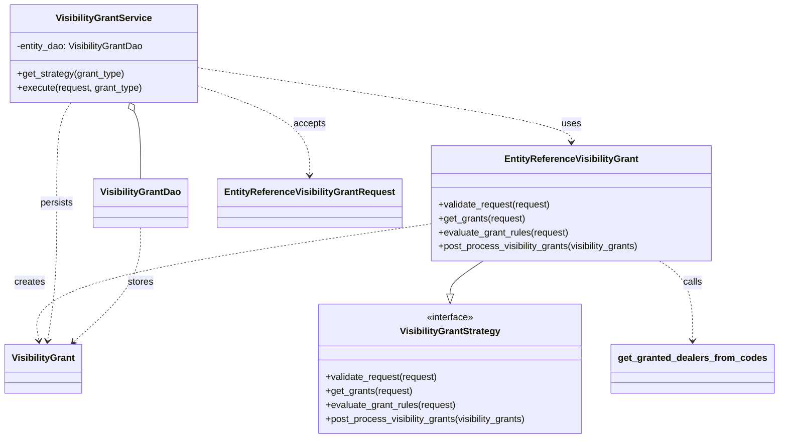
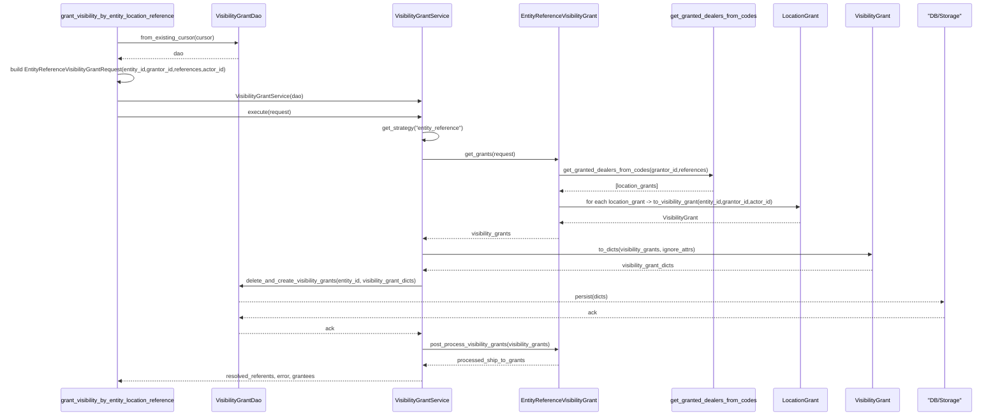

# Diagram: entity_core/entity_service/entity_service/entity/entity_visibility/entity_visibility_grants.py

> Auto-generated by Obscura crawlers

## Diagram 1

### SVG

<svg id="container" width="1309.0234375" xmlns="http://www.w3.org/2000/svg" class="classDiagram" height="752" viewBox="0 0 1309.0234375 752" role="graphics-document document" aria-roledescription="class"><g><defs><marker id="container_class-aggregationStart" class="marker aggregation class" refX="18" refY="7" markerWidth="190" markerHeight="240" orient="auto"><path d="M 18,7 L9,13 L1,7 L9,1 Z"></path></marker></defs><defs><marker id="container_class-aggregationEnd" class="marker aggregation class" refX="1" refY="7" markerWidth="20" markerHeight="28" orient="auto"><path d="M 18,7 L9,13 L1,7 L9,1 Z"></path></marker></defs><defs><marker id="container_class-extensionStart" class="marker extension class" refX="18" refY="7" markerWidth="190" markerHeight="240" orient="auto"><path d="M 1,7 L18,13 V 1 Z"></path></marker></defs><defs><marker id="container_class-extensionEnd" class="marker extension class" refX="1" refY="7" markerWidth="20" markerHeight="28" orient="auto"><path d="M 1,1 V 13 L18,7 Z"></path></marker></defs><defs><marker id="container_class-compositionStart" class="marker composition class" refX="18" refY="7" markerWidth="190" markerHeight="240" orient="auto"><path d="M 18,7 L9,13 L1,7 L9,1 Z"></path></marker></defs><defs><marker id="container_class-compositionEnd" class="marker composition class" refX="1" refY="7" markerWidth="20" markerHeight="28" orient="auto"><path d="M 18,7 L9,13 L1,7 L9,1 Z"></path></marker></defs><defs><marker id="container_class-dependencyStart" class="marker dependency class" refX="6" refY="7" markerWidth="190" markerHeight="240" orient="auto"><path d="M 5,7 L9,13 L1,7 L9,1 Z"></path></marker></defs><defs><marker id="container_class-dependencyEnd" class="marker dependency class" refX="13" refY="7" markerWidth="20" markerHeight="28" orient="auto"><path d="M 18,7 L9,13 L14,7 L9,1 Z"></path></marker></defs><defs><marker id="container_class-lollipopStart" class="marker lollipop class" refX="13" refY="7" markerWidth="190" markerHeight="240" orient="auto"><circle stroke="black" fill="transparent" cx="7" cy="7" r="6"></circle></marker></defs><defs><marker id="container_class-lollipopEnd" class="marker lollipop class" refX="1" refY="7" markerWidth="190" markerHeight="240" orient="auto"><circle stroke="black" fill="transparent" cx="7" cy="7" r="6"></circle></marker></defs><g class="root"><g class="clusters"></g><g class="edgePaths"><path d="M810.115,448L800.755,454.167C791.395,460.333,772.674,472.667,763.313,482.125C753.953,491.583,753.953,498.167,753.953,501.458L753.953,504.75" id="id_EntityReferenceVisibilityGrant_VisibilityGrantStrategy_1" class="edge-thickness-normal edge-pattern-solid relation" style=";;;" data-edge="true" data-et="edge" data-id="id_EntityReferenceVisibilityGrant_VisibilityGrantStrategy_1" data-points="W3sieCI6ODEwLjExNTIwNTY1MjU3MzUsInkiOjQ0OH0seyJ4Ijo3NTMuOTUzMTI1LCJ5Ijo0ODV9LHsieCI6NzUzLjk1MzEyNSwieSI6NTIyfV0=" marker-end="url(#container_class-extensionEnd)"></path><path d="M224.624,191.118L226.628,194.765C228.632,198.412,232.64,205.706,234.644,225.02C236.648,244.333,236.648,275.667,236.648,291.333L236.648,307" id="id_VisibilityGrantService_VisibilityGrantDao_2" class="edge-thickness-normal edge-pattern-solid relation" style=";;;" data-edge="true" data-et="edge" data-id="id_VisibilityGrantService_VisibilityGrantDao_2" data-points="W3sieCI6MjE2LjMxNzMxMDE3NTYxOTg0LCJ5IjoxNzZ9LHsieCI6MjM2LjY0ODQzNzUsInkiOjIxM30seyJ4IjoyMzYuNjQ4NDM3NSwieSI6MzA3fV0=" marker-start="url(#container_class-aggregationStart)"></path><path d="M332.25,116.819L436.939,132.849C541.629,148.88,751.008,180.94,855.697,202.137C960.387,223.333,960.387,233.667,960.387,238.833L960.387,244" id="id_VisibilityGrantService_EntityReferenceVisibilityGrant_3" class="edge-thickness-normal edge-pattern-dashed relation" style=";;;" data-edge="true" data-et="edge" data-id="id_VisibilityGrantService_EntityReferenceVisibilityGrant_3" data-points="W3sieCI6MzMyLjI1LCJ5IjoxMTYuODE5MzAxMjI4ODgwMTZ9LHsieCI6OTYwLjM4NjcxODc1LCJ5IjoyMTN9LHsieCI6OTYwLjM4NjcxODc1LCJ5IjoyNTB9XQ==" marker-end="url(#container_class-dependencyEnd)"></path><path d="M1110.658,448L1120.019,454.167C1129.379,460.333,1148.1,472.667,1157.46,495.5C1166.82,518.333,1166.82,551.667,1166.82,568.333L1166.82,585" id="id_EntityReferenceVisibilityGrant_get_granted_dealers_from_codes_4" class="edge-thickness-normal edge-pattern-dashed relation" style=";;;" data-edge="true" data-et="edge" data-id="id_EntityReferenceVisibilityGrant_get_granted_dealers_from_codes_4" data-points="W3sieCI6MTExMC42NTgyMzE4NDc0MjY2LCJ5Ijo0NDh9LHsieCI6MTE2Ni44MjAzMTI1LCJ5Ijo0ODV9LHsieCI6MTE2Ni44MjAzMTI1LCJ5Ijo1OTF9XQ==" marker-end="url(#container_class-dependencyEnd)"></path><path d="M718.273,385.124L606.708,401.77C495.143,418.416,272.013,451.708,163.05,485.033C54.086,518.357,59.289,551.714,61.891,568.393L64.493,585.072" id="id_EntityReferenceVisibilityGrant_VisibilityGrant_5" class="edge-thickness-normal edge-pattern-dashed relation" style=";;;" data-edge="true" data-et="edge" data-id="id_EntityReferenceVisibilityGrant_VisibilityGrant_5" data-points="W3sieCI6NzE4LjI3MzQzNzUsInkiOjM4NS4xMjQyNjIzNTgzMTA2Nn0seyJ4Ijo0OC44ODI4MTI1LCJ5Ijo0ODV9LHsieCI6NjUuNDE3MzM1MzA0MDU0MDUsInkiOjU5MX1d" marker-end="url(#container_class-dependencyEnd)"></path><path d="M332.25,148.623L362.965,159.352C393.68,170.082,455.109,191.541,485.824,216.937C516.539,242.333,516.539,271.667,516.539,286.333L516.539,301" id="id_VisibilityGrantService_EntityReferenceVisibilityGrantRequest_6" class="edge-thickness-normal edge-pattern-dashed relation" style=";;;" data-edge="true" data-et="edge" data-id="id_VisibilityGrantService_EntityReferenceVisibilityGrantRequest_6" data-points="W3sieCI6MzMyLjI1LCJ5IjoxNDguNjIyNTkwODY3NTY5Nn0seyJ4Ijo1MTYuNTM5MDYyNSwieSI6MjEzfSx7IngiOjUxNi41MzkwNjI1LCJ5IjozMDd9XQ==" marker-end="url(#container_class-dependencyEnd)"></path><path d="M118.021,176L114.193,182.167C110.365,188.333,102.71,200.667,98.882,229.5C95.055,258.333,95.055,303.667,95.055,349C95.055,394.333,95.055,439.667,92.453,479.012C89.851,518.357,84.648,551.714,82.047,568.393L79.445,585.072" id="id_VisibilityGrantService_VisibilityGrant_7" class="edge-thickness-normal edge-pattern-dashed relation" style=";;;" data-edge="true" data-et="edge" data-id="id_VisibilityGrantService_VisibilityGrant_7" data-points="W3sieCI6MTE4LjAyMDgyMjU3MjMxNDA1LCJ5IjoxNzZ9LHsieCI6OTUuMDU0Njg3NSwieSI6MjEzfSx7IngiOjk1LjA1NDY4NzUsInkiOjM0OX0seyJ4Ijo5NS4wNTQ2ODc1LCJ5Ijo0ODV9LHsieCI6NzguNTIwMTY0Njk1OTQ1OTUsInkiOjU5MX1d" marker-end="url(#container_class-dependencyEnd)"></path><path d="M236.648,391L236.648,406.667C236.648,422.333,236.648,453.667,217.734,486.332C198.821,518.996,160.993,552.993,142.079,569.991L123.165,586.989" id="id_VisibilityGrantDao_VisibilityGrant_8" class="edge-thickness-normal edge-pattern-dashed relation" style=";;;" data-edge="true" data-et="edge" data-id="id_VisibilityGrantDao_VisibilityGrant_8" data-points="W3sieCI6MjM2LjY0ODQzNzUsInkiOjM5MX0seyJ4IjoyMzYuNjQ4NDM3NSwieSI6NDg1fSx7IngiOjExOC43MDIxNzQ4MzEwODEwOCwieSI6NTkxfV0=" marker-end="url(#container_class-dependencyEnd)"></path></g><g class="edgeLabels"><g class="edgeLabel"><g class="label" data-id="id_EntityReferenceVisibilityGrant_VisibilityGrantStrategy_1" transform="translate(0, 0)"><foreignObject width="0" height="0">

</foreignObject></g></g><g class="edgeLabel"><g class="label" data-id="id_VisibilityGrantService_VisibilityGrantDao_2" transform="translate(0, 0)"><foreignObject width="0" height="0">

</foreignObject></g></g><g class="edgeLabel" transform="translate(960.38671875, 213)"><g class="label" data-id="id_VisibilityGrantService_EntityReferenceVisibilityGrant_3" transform="translate(-16.4921875, -12)"><foreignObject width="32.984375" height="24">

uses

</foreignObject></g></g><g class="edgeLabel" transform="translate(1166.8203125, 485)"><g class="label" data-id="id_EntityReferenceVisibilityGrant_get_granted_dealers_from_codes_4" transform="translate(-16.4453125, -12)"><foreignObject width="32.890625" height="24">

calls

</foreignObject></g></g><g class="edgeLabel" transform="translate(48.8828125, 485)"><g class="label" data-id="id_EntityReferenceVisibilityGrant_VisibilityGrant_5" transform="translate(-26.171875, -12)"><foreignObject width="52.34375" height="24">

creates

</foreignObject></g></g><g class="edgeLabel" transform="translate(516.5390625, 213)"><g class="label" data-id="id_VisibilityGrantService_EntityReferenceVisibilityGrantRequest_6" transform="translate(-27.421875, -12)"><foreignObject width="54.84375" height="24">

accepts

</foreignObject></g></g><g class="edgeLabel" transform="translate(95.0546875, 349)"><g class="label" data-id="id_VisibilityGrantService_VisibilityGrant_7" transform="translate(-28.4375, -12)"><foreignObject width="56.875" height="24">

persists

</foreignObject></g></g><g class="edgeLabel" transform="translate(236.6484375, 485)"><g class="label" data-id="id_VisibilityGrantDao_VisibilityGrant_8" transform="translate(-22.125, -12)"><foreignObject width="44.25" height="24">

stores

</foreignObject></g></g></g><g class="nodes"><g class="node default" id="classId-VisibilityGrantStrategy-0" transform="translate(753.953125, 633)"><g class="basic label-container"><path d="M-228.6640625 -111 L228.6640625 -111 L228.6640625 111 L-228.6640625 111" stroke="none" stroke-width="0" fill="#ECECFF" style=""></path><path d="M-228.6640625 -111 C-50.41167177974364 -111, 127.84071894051272 -111, 228.6640625 -111 M-228.6640625 -111 C-88.71814548951716 -111, 51.22777152096569 -111, 228.6640625 -111 M228.6640625 -111 C228.6640625 -52.74215088750193, 228.6640625 5.515698224996143, 228.6640625 111 M228.6640625 -111 C228.6640625 -62.92780187994482, 228.6640625 -14.855603759889647, 228.6640625 111 M228.6640625 111 C117.2173781552474 111, 5.770693810494805 111, -228.6640625 111 M228.6640625 111 C72.27401165182835 111, -84.11603919634331 111, -228.6640625 111 M-228.6640625 111 C-228.6640625 38.702257147909435, -228.6640625 -33.59548570418113, -228.6640625 -111 M-228.6640625 111 C-228.6640625 56.34859885781913, -228.6640625 1.6971977156382536, -228.6640625 -111" stroke="#9370DB" stroke-width="1.3" fill="none" stroke-dasharray="0 0" style=""></path></g><g class="annotation-group text" transform="translate(-41.015625, -87)"><g class="label" style="" transform="translate(0,-12)"><foreignObject width="82.03125" height="24">

«interface»

</foreignObject></g></g><g class="label-group text" transform="translate(-82.859375, -63)"><g class="label" style="font-weight: bolder" transform="translate(0,-12)"><foreignObject width="165.71875" height="24">

VisibilityGrantStrategy

</foreignObject></g></g><g class="members-group text" transform="translate(-216.6640625, -15)"></g><g class="methods-group text" transform="translate(-216.6640625, 15)"><g class="label" style="" transform="translate(0,-12)"><foreignObject width="194.609375" height="24">

+validate_request(request)

</foreignObject></g><g class="label" style="" transform="translate(0,12)"><foreignObject width="149.90625" height="24">

+get_grants(request)

</foreignObject></g><g class="label" style="" transform="translate(0,36)"><foreignObject width="225.9375" height="24">

+evaluate_grant_rules(request)

</foreignObject></g><g class="label" style="" transform="translate(0,60)"><foreignObject width="350.46875" height="24">

+post_process_visibility_grants(visibility_grants)

</foreignObject></g></g><g class="divider" style=""><path d="M-228.6640625 -39 C-124.00638626896328 -39, -19.348710037926566 -39, 228.6640625 -39 M-228.6640625 -39 C-132.38470502702808 -39, -36.105347554056124 -39, 228.6640625 -39" stroke="#9370DB" stroke-width="1.3" fill="none" stroke-dasharray="0 0" style=""></path></g><g class="divider" style=""><path d="M-228.6640625 -15 C-109.83887112798499 -15, 8.986320244030026 -15, 228.6640625 -15 M-228.6640625 -15 C-106.78069970446411 -15, 15.102663091071776 -15, 228.6640625 -15" stroke="#9370DB" stroke-width="1.3" fill="none" stroke-dasharray="0 0" style=""></path></g></g><g class="node default" id="classId-EntityReferenceVisibilityGrant-1" transform="translate(960.38671875, 349)"><g class="basic label-container"><path d="M-242.11328125 -99 L242.11328125 -99 L242.11328125 99 L-242.11328125 99" stroke="none" stroke-width="0" fill="#ECECFF" style=""></path><path d="M-242.11328125 -99 C-61.03465057024323 -99, 120.04398010951354 -99, 242.11328125 -99 M-242.11328125 -99 C-144.37751769521046 -99, -46.641754140420915 -99, 242.11328125 -99 M242.11328125 -99 C242.11328125 -50.90509417299385, 242.11328125 -2.8101883459876973, 242.11328125 99 M242.11328125 -99 C242.11328125 -35.797618528650816, 242.11328125 27.40476294269837, 242.11328125 99 M242.11328125 99 C107.87241599026348 99, -26.368449269473047 99, -242.11328125 99 M242.11328125 99 C62.24078451318675 99, -117.6317122236265 99, -242.11328125 99 M-242.11328125 99 C-242.11328125 28.296674633715426, -242.11328125 -42.40665073256915, -242.11328125 -99 M-242.11328125 99 C-242.11328125 20.148023207092763, -242.11328125 -58.703953585814475, -242.11328125 -99" stroke="#9370DB" stroke-width="1.3" fill="none" stroke-dasharray="0 0" style=""></path></g><g class="annotation-group text" transform="translate(0, -75)"></g><g class="label-group text" transform="translate(-109.7578125, -75)"><g class="label" style="font-weight: bolder" transform="translate(0,-12)"><foreignObject width="219.515625" height="24">

EntityReferenceVisibilityGrant

</foreignObject></g></g><g class="members-group text" transform="translate(-230.11328125, -27)"></g><g class="methods-group text" transform="translate(-230.11328125, 3)"><g class="label" style="" transform="translate(0,-12)"><foreignObject width="194.609375" height="24">

+validate_request(request)

</foreignObject></g><g class="label" style="" transform="translate(0,12)"><foreignObject width="149.90625" height="24">

+get_grants(request)

</foreignObject></g><g class="label" style="" transform="translate(0,36)"><foreignObject width="225.9375" height="24">

+evaluate_grant_rules(request)

</foreignObject></g><g class="label" style="" transform="translate(0,60)"><foreignObject width="350.46875" height="24">

+post_process_visibility_grants(visibility_grants)

</foreignObject></g></g><g class="divider" style=""><path d="M-242.11328125 -51 C-139.4328054548992 -51, -36.75232965979845 -51, 242.11328125 -51 M-242.11328125 -51 C-113.16784274616833 -51, 15.777595757663335 -51, 242.11328125 -51" stroke="#9370DB" stroke-width="1.3" fill="none" stroke-dasharray="0 0" style=""></path></g><g class="divider" style=""><path d="M-242.11328125 -27 C-131.28102980339958 -27, -20.44877835679918 -27, 242.11328125 -27 M-242.11328125 -27 C-128.12077041595415 -27, -14.128259581908281 -27, 242.11328125 -27" stroke="#9370DB" stroke-width="1.3" fill="none" stroke-dasharray="0 0" style=""></path></g></g><g class="node default" id="classId-VisibilityGrantService-2" transform="translate(170.16015625, 92)"><g class="basic label-container"><path d="M-162.08984375 -84 L162.08984375 -84 L162.08984375 84 L-162.08984375 84" stroke="none" stroke-width="0" fill="#ECECFF" style=""></path><path d="M-162.08984375 -84 C-52.12829733572184 -84, 57.83324907855632 -84, 162.08984375 -84 M-162.08984375 -84 C-70.02990102548233 -84, 22.030041699035337 -84, 162.08984375 -84 M162.08984375 -84 C162.08984375 -40.86127513889214, 162.08984375 2.277449722215721, 162.08984375 84 M162.08984375 -84 C162.08984375 -24.055182276221544, 162.08984375 35.88963544755691, 162.08984375 84 M162.08984375 84 C95.65794038343807 84, 29.22603701687615 84, -162.08984375 84 M162.08984375 84 C41.568692736708215 84, -78.95245827658357 84, -162.08984375 84 M-162.08984375 84 C-162.08984375 45.86668018000449, -162.08984375 7.733360360008973, -162.08984375 -84 M-162.08984375 84 C-162.08984375 44.59561480094745, -162.08984375 5.191229601894904, -162.08984375 -84" stroke="#9370DB" stroke-width="1.3" fill="none" stroke-dasharray="0 0" style=""></path></g><g class="annotation-group text" transform="translate(0, -60)"></g><g class="label-group text" transform="translate(-78.6171875, -60)"><g class="label" style="font-weight: bolder" transform="translate(0,-12)"><foreignObject width="157.234375" height="24">

VisibilityGrantService

</foreignObject></g></g><g class="members-group text" transform="translate(-150.08984375, -12)"><g class="label" style="" transform="translate(0,-12)"><foreignObject width="221.5625" height="24">

-entity_dao: VisibilityGrantDao

</foreignObject></g></g><g class="methods-group text" transform="translate(-150.08984375, 36)"><g class="label" style="" transform="translate(0,-12)"><foreignObject width="184.84375" height="24">

+get_strategy(grant_type)

</foreignObject></g><g class="label" style="" transform="translate(0,12)"><foreignObject width="215.3125" height="24">

+execute(request, grant_type)

</foreignObject></g></g><g class="divider" style=""><path d="M-162.08984375 -36 C-73.31047372829276 -36, 15.468896293414474 -36, 162.08984375 -36 M-162.08984375 -36 C-90.60187052446044 -36, -19.113897298920875 -36, 162.08984375 -36" stroke="#9370DB" stroke-width="1.3" fill="none" stroke-dasharray="0 0" style=""></path></g><g class="divider" style=""><path d="M-162.08984375 12 C-46.51001987646366 12, 69.06980399707268 12, 162.08984375 12 M-162.08984375 12 C-61.01827167633505 12, 40.053300397329906 12, 162.08984375 12" stroke="#9370DB" stroke-width="1.3" fill="none" stroke-dasharray="0 0" style=""></path></g></g><g class="node default" id="classId-VisibilityGrantDao-3" transform="translate(236.6484375, 349)"><g class="basic label-container"><path d="M-78.15625 -42 L78.15625 -42 L78.15625 42 L-78.15625 42" stroke="none" stroke-width="0" fill="#ECECFF" style=""></path><path d="M-78.15625 -42 C-41.465795162693226 -42, -4.775340325386452 -42, 78.15625 -42 M-78.15625 -42 C-44.33673001762393 -42, -10.517210035247857 -42, 78.15625 -42 M78.15625 -42 C78.15625 -13.632334694918129, 78.15625 14.735330610163743, 78.15625 42 M78.15625 -42 C78.15625 -21.284485529561554, 78.15625 -0.5689710591231076, 78.15625 42 M78.15625 42 C31.524175383237463 42, -15.107899233525075 42, -78.15625 42 M78.15625 42 C20.10500782207857 42, -37.94623435584286 42, -78.15625 42 M-78.15625 42 C-78.15625 19.99017649377767, -78.15625 -2.0196470124446577, -78.15625 -42 M-78.15625 42 C-78.15625 13.81547358133378, -78.15625 -14.36905283733244, -78.15625 -42" stroke="#9370DB" stroke-width="1.3" fill="none" stroke-dasharray="0 0" style=""></path></g><g class="annotation-group text" transform="translate(0, -18)"></g><g class="label-group text" transform="translate(-66.15625, -18)"><g class="label" style="font-weight: bolder" transform="translate(0,-12)"><foreignObject width="132.3125" height="24">

VisibilityGrantDao

</foreignObject></g></g><g class="members-group text" transform="translate(-66.15625, 30)"></g><g class="methods-group text" transform="translate(-66.15625, 60)"></g><g class="divider" style=""><path d="M-78.15625 6 C-34.81374918944666 6, 8.528751621106679 6, 78.15625 6 M-78.15625 6 C-45.20181407559777 6, -12.247378151195534 6, 78.15625 6" stroke="#9370DB" stroke-width="1.3" fill="none" stroke-dasharray="0 0" style=""></path></g><g class="divider" style=""><path d="M-78.15625 24 C-31.962385683897203 24, 14.231478632205594 24, 78.15625 24 M-78.15625 24 C-36.46005152187534 24, 5.236146956249314 24, 78.15625 24" stroke="#9370DB" stroke-width="1.3" fill="none" stroke-dasharray="0 0" style=""></path></g></g><g class="node default" id="classId-EntityReferenceVisibilityGrantRequest-4" transform="translate(516.5390625, 349)"><g class="basic label-container"><path d="M-151.734375 -42 L151.734375 -42 L151.734375 42 L-151.734375 42" stroke="none" stroke-width="0" fill="#ECECFF" style=""></path><path d="M-151.734375 -42 C-40.69176598508008 -42, 70.35084302983984 -42, 151.734375 -42 M-151.734375 -42 C-63.55918565428834 -42, 24.616003691423316 -42, 151.734375 -42 M151.734375 -42 C151.734375 -16.51767004414535, 151.734375 8.964659911709298, 151.734375 42 M151.734375 -42 C151.734375 -16.277962581311428, 151.734375 9.444074837377144, 151.734375 42 M151.734375 42 C70.29279020947052 42, -11.14879458105895 42, -151.734375 42 M151.734375 42 C50.69916468233431 42, -50.336045635331374 42, -151.734375 42 M-151.734375 42 C-151.734375 24.060192230414163, -151.734375 6.120384460828326, -151.734375 -42 M-151.734375 42 C-151.734375 22.675335505203144, -151.734375 3.3506710104062876, -151.734375 -42" stroke="#9370DB" stroke-width="1.3" fill="none" stroke-dasharray="0 0" style=""></path></g><g class="annotation-group text" transform="translate(0, -18)"></g><g class="label-group text" transform="translate(-139.734375, -18)"><g class="label" style="font-weight: bolder" transform="translate(0,-12)"><foreignObject width="279.46875" height="24">

EntityReferenceVisibilityGrantRequest

</foreignObject></g></g><g class="members-group text" transform="translate(-139.734375, 30)"></g><g class="methods-group text" transform="translate(-139.734375, 60)"></g><g class="divider" style=""><path d="M-151.734375 6 C-83.99663105102138 6, -16.258887102042763 6, 151.734375 6 M-151.734375 6 C-58.16060579728156 6, 35.413163405436876 6, 151.734375 6" stroke="#9370DB" stroke-width="1.3" fill="none" stroke-dasharray="0 0" style=""></path></g><g class="divider" style=""><path d="M-151.734375 24 C-58.74061874356228 24, 34.25313751287544 24, 151.734375 24 M-151.734375 24 C-55.03431086265002 24, 41.665753274699966 24, 151.734375 24" stroke="#9370DB" stroke-width="1.3" fill="none" stroke-dasharray="0 0" style=""></path></g></g><g class="node default" id="classId-VisibilityGrant-5" transform="translate(71.96875, 633)"><g class="basic label-container"><path d="M-63.96875 -42 L63.96875 -42 L63.96875 42 L-63.96875 42" stroke="none" stroke-width="0" fill="#ECECFF" style=""></path><path d="M-63.96875 -42 C-23.864599217276442 -42, 16.239551565447115 -42, 63.96875 -42 M-63.96875 -42 C-36.70155011910448 -42, -9.434350238208964 -42, 63.96875 -42 M63.96875 -42 C63.96875 -12.462892438160225, 63.96875 17.07421512367955, 63.96875 42 M63.96875 -42 C63.96875 -15.898824273351774, 63.96875 10.202351453296451, 63.96875 42 M63.96875 42 C18.73069273022299 42, -26.50736453955402 42, -63.96875 42 M63.96875 42 C15.564316665154863 42, -32.840116669690275 42, -63.96875 42 M-63.96875 42 C-63.96875 12.939334361195115, -63.96875 -16.12133127760977, -63.96875 -42 M-63.96875 42 C-63.96875 14.767905099455977, -63.96875 -12.464189801088047, -63.96875 -42" stroke="#9370DB" stroke-width="1.3" fill="none" stroke-dasharray="0 0" style=""></path></g><g class="annotation-group text" transform="translate(0, -18)"></g><g class="label-group text" transform="translate(-51.96875, -18)"><g class="label" style="font-weight: bolder" transform="translate(0,-12)"><foreignObject width="103.9375" height="24">

VisibilityGrant

</foreignObject></g></g><g class="members-group text" transform="translate(-51.96875, 30)"></g><g class="methods-group text" transform="translate(-51.96875, 60)"></g><g class="divider" style=""><path d="M-63.96875 6 C-27.958646764990554 6, 8.051456470018891 6, 63.96875 6 M-63.96875 6 C-37.91250802984668 6, -11.856266059693354 6, 63.96875 6" stroke="#9370DB" stroke-width="1.3" fill="none" stroke-dasharray="0 0" style=""></path></g><g class="divider" style=""><path d="M-63.96875 24 C-33.41968450396434 24, -2.8706190079286813 24, 63.96875 24 M-63.96875 24 C-33.743264712261364 24, -3.517779424522722 24, 63.96875 24" stroke="#9370DB" stroke-width="1.3" fill="none" stroke-dasharray="0 0" style=""></path></g></g><g class="node default" id="classId-get_granted_dealers_from_codes-6" transform="translate(1166.8203125, 633)"><g class="basic label-container"><path d="M-134.203125 -42 L134.203125 -42 L134.203125 42 L-134.203125 42" stroke="none" stroke-width="0" fill="#ECECFF" style=""></path><path d="M-134.203125 -42 C-42.62577393853137 -42, 48.951577122937266 -42, 134.203125 -42 M-134.203125 -42 C-42.66497045964044 -42, 48.87318408071911 -42, 134.203125 -42 M134.203125 -42 C134.203125 -9.404548493296488, 134.203125 23.190903013407024, 134.203125 42 M134.203125 -42 C134.203125 -24.497284646811366, 134.203125 -6.994569293622732, 134.203125 42 M134.203125 42 C44.29357891849823 42, -45.615967163003546 42, -134.203125 42 M134.203125 42 C45.67639965228814 42, -42.85032569542372 42, -134.203125 42 M-134.203125 42 C-134.203125 22.77362165498447, -134.203125 3.547243309968941, -134.203125 -42 M-134.203125 42 C-134.203125 18.39152594249098, -134.203125 -5.216948115018042, -134.203125 -42" stroke="#9370DB" stroke-width="1.3" fill="none" stroke-dasharray="0 0" style=""></path></g><g class="annotation-group text" transform="translate(0, -18)"></g><g class="label-group text" transform="translate(-122.203125, -18)"><g class="label" style="font-weight: bolder" transform="translate(0,-12)"><foreignObject width="244.40625" height="24">

get_granted_dealers_from_codes

</foreignObject></g></g><g class="members-group text" transform="translate(-122.203125, 30)"></g><g class="methods-group text" transform="translate(-122.203125, 60)"></g><g class="divider" style=""><path d="M-134.203125 6 C-71.23817633367872 6, -8.273227667357446 6, 134.203125 6 M-134.203125 6 C-58.6714224257676 6, 16.860280148464796 6, 134.203125 6" stroke="#9370DB" stroke-width="1.3" fill="none" stroke-dasharray="0 0" style=""></path></g><g class="divider" style=""><path d="M-134.203125 24 C-43.90409670680003 24, 46.394931586399935 24, 134.203125 24 M-134.203125 24 C-47.028671431546144 24, 40.14578213690771 24, 134.203125 24" stroke="#9370DB" stroke-width="1.3" fill="none" stroke-dasharray="0 0" style=""></path></g></g></g></g></g></svg>

## Diagram 2

### SVG

<svg id="container" width="2944.5" xmlns="http://www.w3.org/2000/svg" height="1239" viewBox="-181.5 -10 2944.5 1239" role="graphics-document document" aria-roledescription="sequence"><g><rect x="2563" y="1153" fill="#eaeaea" stroke="#666" width="150" height="65" name="Storage" rx="3" ry="3" class="actor actor-bottom"></rect><text x="2638" y="1185.5" dominant-baseline="central" alignment-baseline="central" class="actor actor-box" style="text-anchor: middle; font-size: 16px; font-weight: 400;"><tspan x="2638" dy="0">"DB/Storage"</tspan></text></g><g><rect x="2363" y="1153" fill="#eaeaea" stroke="#666" width="150" height="65" name="VGrant" rx="3" ry="3" class="actor actor-bottom"></rect><text x="2438" y="1185.5" dominant-baseline="central" alignment-baseline="central" class="actor actor-box" style="text-anchor: middle; font-size: 16px; font-weight: 400;"><tspan x="2438" dy="0">VisibilityGrant</tspan></text></g><g><rect x="2163" y="1153" fill="#eaeaea" stroke="#666" width="150" height="65" name="LocationGrant" rx="3" ry="3" class="actor actor-bottom"></rect><text x="2238" y="1185.5" dominant-baseline="central" alignment-baseline="central" class="actor actor-box" style="text-anchor: middle; font-size: 16px; font-weight: 400;"><tspan x="2238" dy="0">LocationGrant</tspan></text></g><g><rect x="1852" y="1153" fill="#eaeaea" stroke="#666" width="261" height="65" name="Lookup" rx="3" ry="3" class="actor actor-bottom"></rect><text x="1982.5" y="1185.5" dominant-baseline="central" alignment-baseline="central" class="actor actor-box" style="text-anchor: middle; font-size: 16px; font-weight: 400;"><tspan x="1982.5" dy="0">get_granted_dealers_from_codes</tspan></text></g><g><rect x="1389.5" y="1153" fill="#eaeaea" stroke="#666" width="236" height="65" name="Strategy" rx="3" ry="3" class="actor actor-bottom"></rect><text x="1507.5" y="1185.5" dominant-baseline="central" alignment-baseline="central" class="actor actor-box" style="text-anchor: middle; font-size: 16px; font-weight: 400;"><tspan x="1507.5" dy="0">EntityReferenceVisibilityGrant</tspan></text></g><g><rect x="1008.5" y="1153" fill="#eaeaea" stroke="#666" width="174" height="65" name="Service" rx="3" ry="3" class="actor actor-bottom"></rect><text x="1095.5" y="1185.5" dominant-baseline="central" alignment-baseline="central" class="actor actor-box" style="text-anchor: middle; font-size: 16px; font-weight: 400;"><tspan x="1095.5" dy="0">VisibilityGrantService</tspan></text></g><g><rect x="462.5" y="1153" fill="#eaeaea" stroke="#666" width="150" height="65" name="DAO" rx="3" ry="3" class="actor actor-bottom"></rect><text x="537.5" y="1185.5" dominant-baseline="central" alignment-baseline="central" class="actor actor-box" style="text-anchor: middle; font-size: 16px; font-weight: 400;"><tspan x="537.5" dy="0">VisibilityGrantDao</tspan></text></g><g><rect x="0" y="1153" fill="#eaeaea" stroke="#666" width="345" height="65" name="Caller" rx="3" ry="3" class="actor actor-bottom"></rect><text x="172.5" y="1185.5" dominant-baseline="central" alignment-baseline="central" class="actor actor-box" style="text-anchor: middle; font-size: 16px; font-weight: 400;"><tspan x="172.5" dy="0">grant_visibility_by_entity_location_reference</tspan></text></g><g><line id="actor7" x1="2638" y1="65" x2="2638" y2="1153" class="actor-line 200" stroke-width="0.5px" stroke="#999" name="Storage"></line><g id="root-7"><rect x="2563" y="0" fill="#eaeaea" stroke="#666" width="150" height="65" name="Storage" rx="3" ry="3" class="actor actor-top"></rect><text x="2638" y="32.5" dominant-baseline="central" alignment-baseline="central" class="actor actor-box" style="text-anchor: middle; font-size: 16px; font-weight: 400;"><tspan x="2638" dy="0">"DB/Storage"</tspan></text></g></g><g><line id="actor6" x1="2438" y1="65" x2="2438" y2="1153" class="actor-line 200" stroke-width="0.5px" stroke="#999" name="VGrant"></line><g id="root-6"><rect x="2363" y="0" fill="#eaeaea" stroke="#666" width="150" height="65" name="VGrant" rx="3" ry="3" class="actor actor-top"></rect><text x="2438" y="32.5" dominant-baseline="central" alignment-baseline="central" class="actor actor-box" style="text-anchor: middle; font-size: 16px; font-weight: 400;"><tspan x="2438" dy="0">VisibilityGrant</tspan></text></g></g><g><line id="actor5" x1="2238" y1="65" x2="2238" y2="1153" class="actor-line 200" stroke-width="0.5px" stroke="#999" name="LocationGrant"></line><g id="root-5"><rect x="2163" y="0" fill="#eaeaea" stroke="#666" width="150" height="65" name="LocationGrant" rx="3" ry="3" class="actor actor-top"></rect><text x="2238" y="32.5" dominant-baseline="central" alignment-baseline="central" class="actor actor-box" style="text-anchor: middle; font-size: 16px; font-weight: 400;"><tspan x="2238" dy="0">LocationGrant</tspan></text></g></g><g><line id="actor4" x1="1982.5" y1="65" x2="1982.5" y2="1153" class="actor-line 200" stroke-width="0.5px" stroke="#999" name="Lookup"></line><g id="root-4"><rect x="1852" y="0" fill="#eaeaea" stroke="#666" width="261" height="65" name="Lookup" rx="3" ry="3" class="actor actor-top"></rect><text x="1982.5" y="32.5" dominant-baseline="central" alignment-baseline="central" class="actor actor-box" style="text-anchor: middle; font-size: 16px; font-weight: 400;"><tspan x="1982.5" dy="0">get_granted_dealers_from_codes</tspan></text></g></g><g><line id="actor3" x1="1507.5" y1="65" x2="1507.5" y2="1153" class="actor-line 200" stroke-width="0.5px" stroke="#999" name="Strategy"></line><g id="root-3"><rect x="1389.5" y="0" fill="#eaeaea" stroke="#666" width="236" height="65" name="Strategy" rx="3" ry="3" class="actor actor-top"></rect><text x="1507.5" y="32.5" dominant-baseline="central" alignment-baseline="central" class="actor actor-box" style="text-anchor: middle; font-size: 16px; font-weight: 400;"><tspan x="1507.5" dy="0">EntityReferenceVisibilityGrant</tspan></text></g></g><g><line id="actor2" x1="1095.5" y1="65" x2="1095.5" y2="1153" class="actor-line 200" stroke-width="0.5px" stroke="#999" name="Service"></line><g id="root-2"><rect x="1008.5" y="0" fill="#eaeaea" stroke="#666" width="174" height="65" name="Service" rx="3" ry="3" class="actor actor-top"></rect><text x="1095.5" y="32.5" dominant-baseline="central" alignment-baseline="central" class="actor actor-box" style="text-anchor: middle; font-size: 16px; font-weight: 400;"><tspan x="1095.5" dy="0">VisibilityGrantService</tspan></text></g></g><g><line id="actor1" x1="537.5" y1="65" x2="537.5" y2="1153" class="actor-line 200" stroke-width="0.5px" stroke="#999" name="DAO"></line><g id="root-1"><rect x="462.5" y="0" fill="#eaeaea" stroke="#666" width="150" height="65" name="DAO" rx="3" ry="3" class="actor actor-top"></rect><text x="537.5" y="32.5" dominant-baseline="central" alignment-baseline="central" class="actor actor-box" style="text-anchor: middle; font-size: 16px; font-weight: 400;"><tspan x="537.5" dy="0">VisibilityGrantDao</tspan></text></g></g><g><line id="actor0" x1="172.5" y1="65" x2="172.5" y2="1153" class="actor-line 200" stroke-width="0.5px" stroke="#999" name="Caller"></line><g id="root-0"><rect x="0" y="0" fill="#eaeaea" stroke="#666" width="345" height="65" name="Caller" rx="3" ry="3" class="actor actor-top"></rect><text x="172.5" y="32.5" dominant-baseline="central" alignment-baseline="central" class="actor actor-box" style="text-anchor: middle; font-size: 16px; font-weight: 400;"><tspan x="172.5" dy="0">grant_visibility_by_entity_location_reference</tspan></text></g></g><g></g><defs><symbol id="computer" width="24" height="24"><path transform="scale(.5)" d="M2 2v13h20v-13h-20zm18 11h-16v-9h16v9zm-10.228 6l.466-1h3.524l.467 1h-4.457zm14.228 3h-24l2-6h2.104l-1.33 4h18.45l-1.297-4h2.073l2 6zm-5-10h-14v-7h14v7z"></path></symbol></defs><defs><symbol id="database" fill-rule="evenodd" clip-rule="evenodd"><path transform="scale(.5)" d="M12.258.001l.256.004.255.005.253.008.251.01.249.012.247.015.246.016.242.019.241.02.239.023.236.024.233.027.231.028.229.031.225.032.223.034.22.036.217.038.214.04.211.041.208.043.205.045.201.046.198.048.194.05.191.051.187.053.183.054.18.056.175.057.172.059.168.06.163.061.16.063.155.064.15.066.074.033.073.033.071.034.07.034.069.035.068.035.067.035.066.035.064.036.064.036.062.036.06.036.06.037.058.037.058.037.055.038.055.038.053.038.052.038.051.039.05.039.048.039.047.039.045.04.044.04.043.04.041.04.04.041.039.041.037.041.036.041.034.041.033.042.032.042.03.042.029.042.027.042.026.043.024.043.023.043.021.043.02.043.018.044.017.043.015.044.013.044.012.044.011.045.009.044.007.045.006.045.004.045.002.045.001.045v17l-.001.045-.002.045-.004.045-.006.045-.007.045-.009.044-.011.045-.012.044-.013.044-.015.044-.017.043-.018.044-.02.043-.021.043-.023.043-.024.043-.026.043-.027.042-.029.042-.03.042-.032.042-.033.042-.034.041-.036.041-.037.041-.039.041-.04.041-.041.04-.043.04-.044.04-.045.04-.047.039-.048.039-.05.039-.051.039-.052.038-.053.038-.055.038-.055.038-.058.037-.058.037-.06.037-.06.036-.062.036-.064.036-.064.036-.066.035-.067.035-.068.035-.069.035-.07.034-.071.034-.073.033-.074.033-.15.066-.155.064-.16.063-.163.061-.168.06-.172.059-.175.057-.18.056-.183.054-.187.053-.191.051-.194.05-.198.048-.201.046-.205.045-.208.043-.211.041-.214.04-.217.038-.22.036-.223.034-.225.032-.229.031-.231.028-.233.027-.236.024-.239.023-.241.02-.242.019-.246.016-.247.015-.249.012-.251.01-.253.008-.255.005-.256.004-.258.001-.258-.001-.256-.004-.255-.005-.253-.008-.251-.01-.249-.012-.247-.015-.245-.016-.243-.019-.241-.02-.238-.023-.236-.024-.234-.027-.231-.028-.228-.031-.226-.032-.223-.034-.22-.036-.217-.038-.214-.04-.211-.041-.208-.043-.204-.045-.201-.046-.198-.048-.195-.05-.19-.051-.187-.053-.184-.054-.179-.056-.176-.057-.172-.059-.167-.06-.164-.061-.159-.063-.155-.064-.151-.066-.074-.033-.072-.033-.072-.034-.07-.034-.069-.035-.068-.035-.067-.035-.066-.035-.064-.036-.063-.036-.062-.036-.061-.036-.06-.037-.058-.037-.057-.037-.056-.038-.055-.038-.053-.038-.052-.038-.051-.039-.049-.039-.049-.039-.046-.039-.046-.04-.044-.04-.043-.04-.041-.04-.04-.041-.039-.041-.037-.041-.036-.041-.034-.041-.033-.042-.032-.042-.03-.042-.029-.042-.027-.042-.026-.043-.024-.043-.023-.043-.021-.043-.02-.043-.018-.044-.017-.043-.015-.044-.013-.044-.012-.044-.011-.045-.009-.044-.007-.045-.006-.045-.004-.045-.002-.045-.001-.045v-17l.001-.045.002-.045.004-.045.006-.045.007-.045.009-.044.011-.045.012-.044.013-.044.015-.044.017-.043.018-.044.02-.043.021-.043.023-.043.024-.043.026-.043.027-.042.029-.042.03-.042.032-.042.033-.042.034-.041.036-.041.037-.041.039-.041.04-.041.041-.04.043-.04.044-.04.046-.04.046-.039.049-.039.049-.039.051-.039.052-.038.053-.038.055-.038.056-.038.057-.037.058-.037.06-.037.061-.036.062-.036.063-.036.064-.036.066-.035.067-.035.068-.035.069-.035.07-.034.072-.034.072-.033.074-.033.151-.066.155-.064.159-.063.164-.061.167-.06.172-.059.176-.057.179-.056.184-.054.187-.053.19-.051.195-.05.198-.048.201-.046.204-.045.208-.043.211-.041.214-.04.217-.038.22-.036.223-.034.226-.032.228-.031.231-.028.234-.027.236-.024.238-.023.241-.02.243-.019.245-.016.247-.015.249-.012.251-.01.253-.008.255-.005.256-.004.258-.001.258.001zm-9.258 20.499v.01l.001.021.003.021.004.022.005.021.006.022.007.022.009.023.01.022.011.023.012.023.013.023.015.023.016.024.017.023.018.024.019.024.021.024.022.025.023.024.024.025.052.049.056.05.061.051.066.051.07.051.075.051.079.052.084.052.088.052.092.052.097.052.102.051.105.052.11.052.114.051.119.051.123.051.127.05.131.05.135.05.139.048.144.049.147.047.152.047.155.047.16.045.163.045.167.043.171.043.176.041.178.041.183.039.187.039.19.037.194.035.197.035.202.033.204.031.209.03.212.029.216.027.219.025.222.024.226.021.23.02.233.018.236.016.24.015.243.012.246.01.249.008.253.005.256.004.259.001.26-.001.257-.004.254-.005.25-.008.247-.011.244-.012.241-.014.237-.016.233-.018.231-.021.226-.021.224-.024.22-.026.216-.027.212-.028.21-.031.205-.031.202-.034.198-.034.194-.036.191-.037.187-.039.183-.04.179-.04.175-.042.172-.043.168-.044.163-.045.16-.046.155-.046.152-.047.148-.048.143-.049.139-.049.136-.05.131-.05.126-.05.123-.051.118-.052.114-.051.11-.052.106-.052.101-.052.096-.052.092-.052.088-.053.083-.051.079-.052.074-.052.07-.051.065-.051.06-.051.056-.05.051-.05.023-.024.023-.025.021-.024.02-.024.019-.024.018-.024.017-.024.015-.023.014-.024.013-.023.012-.023.01-.023.01-.022.008-.022.006-.022.006-.022.004-.022.004-.021.001-.021.001-.021v-4.127l-.077.055-.08.053-.083.054-.085.053-.087.052-.09.052-.093.051-.095.05-.097.05-.1.049-.102.049-.105.048-.106.047-.109.047-.111.046-.114.045-.115.045-.118.044-.12.043-.122.042-.124.042-.126.041-.128.04-.13.04-.132.038-.134.038-.135.037-.138.037-.139.035-.142.035-.143.034-.144.033-.147.032-.148.031-.15.03-.151.03-.153.029-.154.027-.156.027-.158.026-.159.025-.161.024-.162.023-.163.022-.165.021-.166.02-.167.019-.169.018-.169.017-.171.016-.173.015-.173.014-.175.013-.175.012-.177.011-.178.01-.179.008-.179.008-.181.006-.182.005-.182.004-.184.003-.184.002h-.37l-.184-.002-.184-.003-.182-.004-.182-.005-.181-.006-.179-.008-.179-.008-.178-.01-.176-.011-.176-.012-.175-.013-.173-.014-.172-.015-.171-.016-.17-.017-.169-.018-.167-.019-.166-.02-.165-.021-.163-.022-.162-.023-.161-.024-.159-.025-.157-.026-.156-.027-.155-.027-.153-.029-.151-.03-.15-.03-.148-.031-.146-.032-.145-.033-.143-.034-.141-.035-.14-.035-.137-.037-.136-.037-.134-.038-.132-.038-.13-.04-.128-.04-.126-.041-.124-.042-.122-.042-.12-.044-.117-.043-.116-.045-.113-.045-.112-.046-.109-.047-.106-.047-.105-.048-.102-.049-.1-.049-.097-.05-.095-.05-.093-.052-.09-.051-.087-.052-.085-.053-.083-.054-.08-.054-.077-.054v4.127zm0-5.654v.011l.001.021.003.021.004.021.005.022.006.022.007.022.009.022.01.022.011.023.012.023.013.023.015.024.016.023.017.024.018.024.019.024.021.024.022.024.023.025.024.024.052.05.056.05.061.05.066.051.07.051.075.052.079.051.084.052.088.052.092.052.097.052.102.052.105.052.11.051.114.051.119.052.123.05.127.051.131.05.135.049.139.049.144.048.147.048.152.047.155.046.16.045.163.045.167.044.171.042.176.042.178.04.183.04.187.038.19.037.194.036.197.034.202.033.204.032.209.03.212.028.216.027.219.025.222.024.226.022.23.02.233.018.236.016.24.014.243.012.246.01.249.008.253.006.256.003.259.001.26-.001.257-.003.254-.006.25-.008.247-.01.244-.012.241-.015.237-.016.233-.018.231-.02.226-.022.224-.024.22-.025.216-.027.212-.029.21-.03.205-.032.202-.033.198-.035.194-.036.191-.037.187-.039.183-.039.179-.041.175-.042.172-.043.168-.044.163-.045.16-.045.155-.047.152-.047.148-.048.143-.048.139-.05.136-.049.131-.05.126-.051.123-.051.118-.051.114-.052.11-.052.106-.052.101-.052.096-.052.092-.052.088-.052.083-.052.079-.052.074-.051.07-.052.065-.051.06-.05.056-.051.051-.049.023-.025.023-.024.021-.025.02-.024.019-.024.018-.024.017-.024.015-.023.014-.023.013-.024.012-.022.01-.023.01-.023.008-.022.006-.022.006-.022.004-.021.004-.022.001-.021.001-.021v-4.139l-.077.054-.08.054-.083.054-.085.052-.087.053-.09.051-.093.051-.095.051-.097.05-.1.049-.102.049-.105.048-.106.047-.109.047-.111.046-.114.045-.115.044-.118.044-.12.044-.122.042-.124.042-.126.041-.128.04-.13.039-.132.039-.134.038-.135.037-.138.036-.139.036-.142.035-.143.033-.144.033-.147.033-.148.031-.15.03-.151.03-.153.028-.154.028-.156.027-.158.026-.159.025-.161.024-.162.023-.163.022-.165.021-.166.02-.167.019-.169.018-.169.017-.171.016-.173.015-.173.014-.175.013-.175.012-.177.011-.178.009-.179.009-.179.007-.181.007-.182.005-.182.004-.184.003-.184.002h-.37l-.184-.002-.184-.003-.182-.004-.182-.005-.181-.007-.179-.007-.179-.009-.178-.009-.176-.011-.176-.012-.175-.013-.173-.014-.172-.015-.171-.016-.17-.017-.169-.018-.167-.019-.166-.02-.165-.021-.163-.022-.162-.023-.161-.024-.159-.025-.157-.026-.156-.027-.155-.028-.153-.028-.151-.03-.15-.03-.148-.031-.146-.033-.145-.033-.143-.033-.141-.035-.14-.036-.137-.036-.136-.037-.134-.038-.132-.039-.13-.039-.128-.04-.126-.041-.124-.042-.122-.043-.12-.043-.117-.044-.116-.044-.113-.046-.112-.046-.109-.046-.106-.047-.105-.048-.102-.049-.1-.049-.097-.05-.095-.051-.093-.051-.09-.051-.087-.053-.085-.052-.083-.054-.08-.054-.077-.054v4.139zm0-5.666v.011l.001.02.003.022.004.021.005.022.006.021.007.022.009.023.01.022.011.023.012.023.013.023.015.023.016.024.017.024.018.023.019.024.021.025.022.024.023.024.024.025.052.05.056.05.061.05.066.051.07.051.075.052.079.051.084.052.088.052.092.052.097.052.102.052.105.051.11.052.114.051.119.051.123.051.127.05.131.05.135.05.139.049.144.048.147.048.152.047.155.046.16.045.163.045.167.043.171.043.176.042.178.04.183.04.187.038.19.037.194.036.197.034.202.033.204.032.209.03.212.028.216.027.219.025.222.024.226.021.23.02.233.018.236.017.24.014.243.012.246.01.249.008.253.006.256.003.259.001.26-.001.257-.003.254-.006.25-.008.247-.01.244-.013.241-.014.237-.016.233-.018.231-.02.226-.022.224-.024.22-.025.216-.027.212-.029.21-.03.205-.032.202-.033.198-.035.194-.036.191-.037.187-.039.183-.039.179-.041.175-.042.172-.043.168-.044.163-.045.16-.045.155-.047.152-.047.148-.048.143-.049.139-.049.136-.049.131-.051.126-.05.123-.051.118-.052.114-.051.11-.052.106-.052.101-.052.096-.052.092-.052.088-.052.083-.052.079-.052.074-.052.07-.051.065-.051.06-.051.056-.05.051-.049.023-.025.023-.025.021-.024.02-.024.019-.024.018-.024.017-.024.015-.023.014-.024.013-.023.012-.023.01-.022.01-.023.008-.022.006-.022.006-.022.004-.022.004-.021.001-.021.001-.021v-4.153l-.077.054-.08.054-.083.053-.085.053-.087.053-.09.051-.093.051-.095.051-.097.05-.1.049-.102.048-.105.048-.106.048-.109.046-.111.046-.114.046-.115.044-.118.044-.12.043-.122.043-.124.042-.126.041-.128.04-.13.039-.132.039-.134.038-.135.037-.138.036-.139.036-.142.034-.143.034-.144.033-.147.032-.148.032-.15.03-.151.03-.153.028-.154.028-.156.027-.158.026-.159.024-.161.024-.162.023-.163.023-.165.021-.166.02-.167.019-.169.018-.169.017-.171.016-.173.015-.173.014-.175.013-.175.012-.177.01-.178.01-.179.009-.179.007-.181.006-.182.006-.182.004-.184.003-.184.001-.185.001-.185-.001-.184-.001-.184-.003-.182-.004-.182-.006-.181-.006-.179-.007-.179-.009-.178-.01-.176-.01-.176-.012-.175-.013-.173-.014-.172-.015-.171-.016-.17-.017-.169-.018-.167-.019-.166-.02-.165-.021-.163-.023-.162-.023-.161-.024-.159-.024-.157-.026-.156-.027-.155-.028-.153-.028-.151-.03-.15-.03-.148-.032-.146-.032-.145-.033-.143-.034-.141-.034-.14-.036-.137-.036-.136-.037-.134-.038-.132-.039-.13-.039-.128-.041-.126-.041-.124-.041-.122-.043-.12-.043-.117-.044-.116-.044-.113-.046-.112-.046-.109-.046-.106-.048-.105-.048-.102-.048-.1-.05-.097-.049-.095-.051-.093-.051-.09-.052-.087-.052-.085-.053-.083-.053-.08-.054-.077-.054v4.153zm8.74-8.179l-.257.004-.254.005-.25.008-.247.011-.244.012-.241.014-.237.016-.233.018-.231.021-.226.022-.224.023-.22.026-.216.027-.212.028-.21.031-.205.032-.202.033-.198.034-.194.036-.191.038-.187.038-.183.04-.179.041-.175.042-.172.043-.168.043-.163.045-.16.046-.155.046-.152.048-.148.048-.143.048-.139.049-.136.05-.131.05-.126.051-.123.051-.118.051-.114.052-.11.052-.106.052-.101.052-.096.052-.092.052-.088.052-.083.052-.079.052-.074.051-.07.052-.065.051-.06.05-.056.05-.051.05-.023.025-.023.024-.021.024-.02.025-.019.024-.018.024-.017.023-.015.024-.014.023-.013.023-.012.023-.01.023-.01.022-.008.022-.006.023-.006.021-.004.022-.004.021-.001.021-.001.021.001.021.001.021.004.021.004.022.006.021.006.023.008.022.01.022.01.023.012.023.013.023.014.023.015.024.017.023.018.024.019.024.02.025.021.024.023.024.023.025.051.05.056.05.06.05.065.051.07.052.074.051.079.052.083.052.088.052.092.052.096.052.101.052.106.052.11.052.114.052.118.051.123.051.126.051.131.05.136.05.139.049.143.048.148.048.152.048.155.046.16.046.163.045.168.043.172.043.175.042.179.041.183.04.187.038.191.038.194.036.198.034.202.033.205.032.21.031.212.028.216.027.22.026.224.023.226.022.231.021.233.018.237.016.241.014.244.012.247.011.25.008.254.005.257.004.26.001.26-.001.257-.004.254-.005.25-.008.247-.011.244-.012.241-.014.237-.016.233-.018.231-.021.226-.022.224-.023.22-.026.216-.027.212-.028.21-.031.205-.032.202-.033.198-.034.194-.036.191-.038.187-.038.183-.04.179-.041.175-.042.172-.043.168-.043.163-.045.16-.046.155-.046.152-.048.148-.048.143-.048.139-.049.136-.05.131-.05.126-.051.123-.051.118-.051.114-.052.11-.052.106-.052.101-.052.096-.052.092-.052.088-.052.083-.052.079-.052.074-.051.07-.052.065-.051.06-.05.056-.05.051-.05.023-.025.023-.024.021-.024.02-.025.019-.024.018-.024.017-.023.015-.024.014-.023.013-.023.012-.023.01-.023.01-.022.008-.022.006-.023.006-.021.004-.022.004-.021.001-.021.001-.021-.001-.021-.001-.021-.004-.021-.004-.022-.006-.021-.006-.023-.008-.022-.01-.022-.01-.023-.012-.023-.013-.023-.014-.023-.015-.024-.017-.023-.018-.024-.019-.024-.02-.025-.021-.024-.023-.024-.023-.025-.051-.05-.056-.05-.06-.05-.065-.051-.07-.052-.074-.051-.079-.052-.083-.052-.088-.052-.092-.052-.096-.052-.101-.052-.106-.052-.11-.052-.114-.052-.118-.051-.123-.051-.126-.051-.131-.05-.136-.05-.139-.049-.143-.048-.148-.048-.152-.048-.155-.046-.16-.046-.163-.045-.168-.043-.172-.043-.175-.042-.179-.041-.183-.04-.187-.038-.191-.038-.194-.036-.198-.034-.202-.033-.205-.032-.21-.031-.212-.028-.216-.027-.22-.026-.224-.023-.226-.022-.231-.021-.233-.018-.237-.016-.241-.014-.244-.012-.247-.011-.25-.008-.254-.005-.257-.004-.26-.001-.26.001z"></path></symbol></defs><defs><symbol id="clock" width="24" height="24"><path transform="scale(.5)" d="M12 2c5.514 0 10 4.486 10 10s-4.486 10-10 10-10-4.486-10-10 4.486-10 10-10zm0-2c-6.627 0-12 5.373-12 12s5.373 12 12 12 12-5.373 12-12-5.373-12-12-12zm5.848 12.459c.202.038.202.333.001.372-1.907.361-6.045 1.111-6.547 1.111-.719 0-1.301-.582-1.301-1.301 0-.512.77-5.447 1.125-7.445.034-.192.312-.181.343.014l.985 6.238 5.394 1.011z"></path></symbol></defs><defs><marker id="arrowhead" refX="7.9" refY="5" markerUnits="userSpaceOnUse" markerWidth="12" markerHeight="12" orient="auto-start-reverse"><path d="M -1 0 L 10 5 L 0 10 z"></path></marker></defs><defs><marker id="crosshead" markerWidth="15" markerHeight="8" orient="auto" refX="4" refY="4.5"><path fill="none" stroke="#000000" stroke-width="1pt" d="M 1,2 L 6,7 M 6,2 L 1,7" style="stroke-dasharray: 0, 0;"></path></marker></defs><defs><marker id="filled-head" refX="15.5" refY="7" markerWidth="20" markerHeight="28" orient="auto"><path d="M 18,7 L9,13 L14,7 L9,1 Z"></path></marker></defs><defs><marker id="sequencenumber" refX="15" refY="15" markerWidth="60" markerHeight="40" orient="auto"><circle cx="15" cy="15" r="6"></circle></marker></defs><text x="354" y="80" text-anchor="middle" dominant-baseline="middle" alignment-baseline="middle" class="messageText" dy="1em" style="font-size: 16px; font-weight: 400;">from_existing_cursor(cursor)</text><line x1="173.5" y1="113" x2="533.5" y2="113" class="messageLine0" stroke-width="2" stroke="none" marker-end="url(#arrowhead)" style="fill: none;"></line><text x="357" y="128" text-anchor="middle" dominant-baseline="middle" alignment-baseline="middle" class="messageText" dy="1em" style="font-size: 16px; font-weight: 400;">dao</text><line x1="536.5" y1="161" x2="176.5" y2="161" class="messageLine1" stroke-width="2" stroke="none" marker-end="url(#arrowhead)" style="stroke-dasharray: 3, 3; fill: none;"></line><text x="174" y="176" text-anchor="middle" dominant-baseline="middle" alignment-baseline="middle" class="messageText" dy="1em" style="font-size: 16px; font-weight: 400;">build EntityReferenceVisibilityGrantRequest(entity_id,grantor_id,references,actor_id)</text><path d="M 173.5,209 C 233.5,199 233.5,239 173.5,229" class="messageLine0" stroke-width="2" stroke="none" marker-end="url(#arrowhead)" style="fill: none;"></path><text x="633" y="254" text-anchor="middle" dominant-baseline="middle" alignment-baseline="middle" class="messageText" dy="1em" style="font-size: 16px; font-weight: 400;">VisibilityGrantService(dao)</text><line x1="173.5" y1="287" x2="1091.5" y2="287" class="messageLine0" stroke-width="2" stroke="none" marker-end="url(#arrowhead)" style="fill: none;"></line><text x="633" y="302" text-anchor="middle" dominant-baseline="middle" alignment-baseline="middle" class="messageText" dy="1em" style="font-size: 16px; font-weight: 400;">execute(request)</text><line x1="173.5" y1="335" x2="1091.5" y2="335" class="messageLine0" stroke-width="2" stroke="none" marker-end="url(#arrowhead)" style="fill: none;"></line><text x="1097" y="350" text-anchor="middle" dominant-baseline="middle" alignment-baseline="middle" class="messageText" dy="1em" style="font-size: 16px; font-weight: 400;">get_strategy("entity_reference")</text><path d="M 1096.5,383 C 1156.5,373 1156.5,413 1096.5,403" class="messageLine0" stroke-width="2" stroke="none" marker-end="url(#arrowhead)" style="fill: none;"></path><text x="1300" y="428" text-anchor="middle" dominant-baseline="middle" alignment-baseline="middle" class="messageText" dy="1em" style="font-size: 16px; font-weight: 400;">get_grants(request)</text><line x1="1096.5" y1="461" x2="1503.5" y2="461" class="messageLine0" stroke-width="2" stroke="none" marker-end="url(#arrowhead)" style="fill: none;"></line><text x="1744" y="476" text-anchor="middle" dominant-baseline="middle" alignment-baseline="middle" class="messageText" dy="1em" style="font-size: 16px; font-weight: 400;">get_granted_dealers_from_codes(grantor_id,references)</text><line x1="1508.5" y1="509" x2="1978.5" y2="509" class="messageLine0" stroke-width="2" stroke="none" marker-end="url(#arrowhead)" style="fill: none;"></line><text x="1747" y="524" text-anchor="middle" dominant-baseline="middle" alignment-baseline="middle" class="messageText" dy="1em" style="font-size: 16px; font-weight: 400;">[location_grants]</text><line x1="1981.5" y1="557" x2="1511.5" y2="557" class="messageLine1" stroke-width="2" stroke="none" marker-end="url(#arrowhead)" style="stroke-dasharray: 3, 3; fill: none;"></line><text x="1871" y="572" text-anchor="middle" dominant-baseline="middle" alignment-baseline="middle" class="messageText" dy="1em" style="font-size: 16px; font-weight: 400;">for each location_grant -&gt; to_visibility_grant(entity_id,grantor_id,actor_id)</text><line x1="1508.5" y1="605" x2="2234" y2="605" class="messageLine0" stroke-width="2" stroke="none" marker-end="url(#arrowhead)" style="fill: none;"></line><text x="1874" y="620" text-anchor="middle" dominant-baseline="middle" alignment-baseline="middle" class="messageText" dy="1em" style="font-size: 16px; font-weight: 400;">VisibilityGrant</text><line x1="2237" y1="653" x2="1511.5" y2="653" class="messageLine1" stroke-width="2" stroke="none" marker-end="url(#arrowhead)" style="stroke-dasharray: 3, 3; fill: none;"></line><text x="1303" y="668" text-anchor="middle" dominant-baseline="middle" alignment-baseline="middle" class="messageText" dy="1em" style="font-size: 16px; font-weight: 400;">visibility_grants</text><line x1="1506.5" y1="701" x2="1099.5" y2="701" class="messageLine1" stroke-width="2" stroke="none" marker-end="url(#arrowhead)" style="stroke-dasharray: 3, 3; fill: none;"></line><text x="1765" y="716" text-anchor="middle" dominant-baseline="middle" alignment-baseline="middle" class="messageText" dy="1em" style="font-size: 16px; font-weight: 400;">to_dicts(visibility_grants, ignore_attrs)</text><line x1="1096.5" y1="749" x2="2434" y2="749" class="messageLine0" stroke-width="2" stroke="none" marker-end="url(#arrowhead)" style="fill: none;"></line><text x="1768" y="764" text-anchor="middle" dominant-baseline="middle" alignment-baseline="middle" class="messageText" dy="1em" style="font-size: 16px; font-weight: 400;">visibility_grant_dicts</text><line x1="2437" y1="797" x2="1099.5" y2="797" class="messageLine1" stroke-width="2" stroke="none" marker-end="url(#arrowhead)" style="stroke-dasharray: 3, 3; fill: none;"></line><text x="818" y="812" text-anchor="middle" dominant-baseline="middle" alignment-baseline="middle" class="messageText" dy="1em" style="font-size: 16px; font-weight: 400;">delete_and_create_visibility_grants(entity_id, visibility_grant_dicts)</text><line x1="1094.5" y1="845" x2="541.5" y2="845" class="messageLine0" stroke-width="2" stroke="none" marker-end="url(#arrowhead)" style="fill: none;"></line><text x="1586" y="860" text-anchor="middle" dominant-baseline="middle" alignment-baseline="middle" class="messageText" dy="1em" style="font-size: 16px; font-weight: 400;">persist(dicts)</text><line x1="538.5" y1="893" x2="2634" y2="893" class="messageLine1" stroke-width="2" stroke="none" marker-end="url(#arrowhead)" style="stroke-dasharray: 3, 3; fill: none;"></line><text x="1589" y="908" text-anchor="middle" dominant-baseline="middle" alignment-baseline="middle" class="messageText" dy="1em" style="font-size: 16px; font-weight: 400;">ack</text><line x1="2637" y1="941" x2="541.5" y2="941" class="messageLine1" stroke-width="2" stroke="none" marker-end="url(#arrowhead)" style="stroke-dasharray: 3, 3; fill: none;"></line><text x="815" y="956" text-anchor="middle" dominant-baseline="middle" alignment-baseline="middle" class="messageText" dy="1em" style="font-size: 16px; font-weight: 400;">ack</text><line x1="538.5" y1="989" x2="1091.5" y2="989" class="messageLine1" stroke-width="2" stroke="none" marker-end="url(#arrowhead)" style="stroke-dasharray: 3, 3; fill: none;"></line><text x="1300" y="1004" text-anchor="middle" dominant-baseline="middle" alignment-baseline="middle" class="messageText" dy="1em" style="font-size: 16px; font-weight: 400;">post_process_visibility_grants(visibility_grants)</text><line x1="1096.5" y1="1037" x2="1503.5" y2="1037" class="messageLine0" stroke-width="2" stroke="none" marker-end="url(#arrowhead)" style="fill: none;"></line><text x="1303" y="1052" text-anchor="middle" dominant-baseline="middle" alignment-baseline="middle" class="messageText" dy="1em" style="font-size: 16px; font-weight: 400;">processed_ship_to_grants</text><line x1="1506.5" y1="1085" x2="1099.5" y2="1085" class="messageLine1" stroke-width="2" stroke="none" marker-end="url(#arrowhead)" style="stroke-dasharray: 3, 3; fill: none;"></line><text x="636" y="1100" text-anchor="middle" dominant-baseline="middle" alignment-baseline="middle" class="messageText" dy="1em" style="font-size: 16px; font-weight: 400;">resolved_referents, error, grantees</text><line x1="1094.5" y1="1133" x2="176.5" y2="1133" class="messageLine1" stroke-width="2" stroke="none" marker-end="url(#arrowhead)" style="stroke-dasharray: 3, 3; fill: none;"></line></svg>
