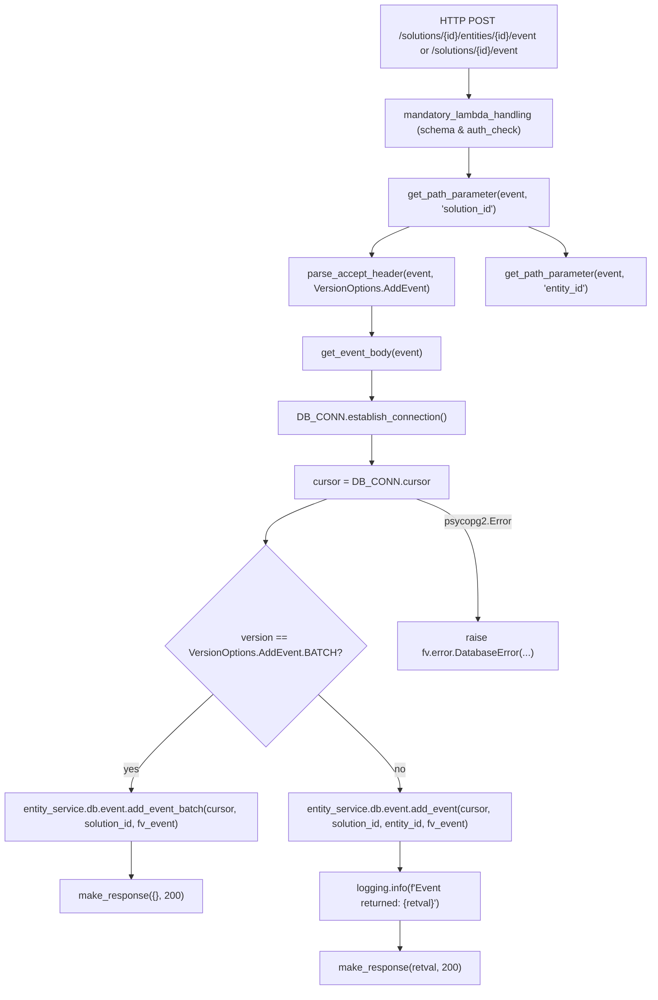
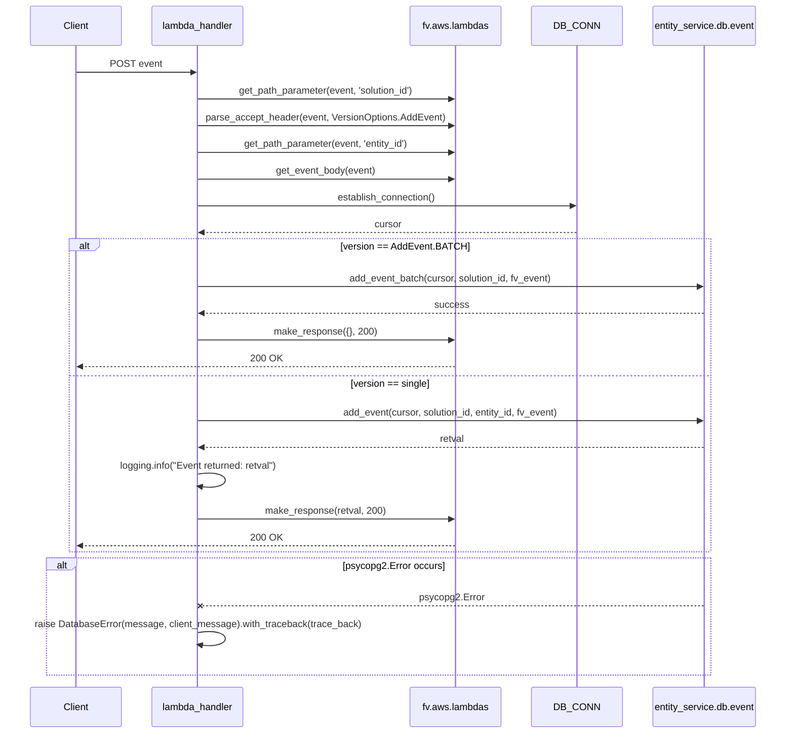

# Diagram: entity_core/entity_service/entity_service/entity/event/add_event.py

> Auto-generated by Obscura crawlers

## Diagram 1

### SVG

<svg id="container" width="1057.453125" xmlns="http://www.w3.org/2000/svg" class="flowchart" height="1589.859375" viewBox="0 0 1057.453125 1589.859375" role="graphics-document document" aria-roledescription="flowchart-v2"><g><marker id="container_flowchart-v2-pointEnd" class="marker flowchart-v2" viewBox="0 0 10 10" refX="5" refY="5" markerUnits="userSpaceOnUse" markerWidth="8" markerHeight="8" orient="auto"><path d="M 0 0 L 10 5 L 0 10 z" class="arrowMarkerPath" style="stroke-width: 1; stroke-dasharray: 1, 0;"></path></marker><marker id="container_flowchart-v2-pointStart" class="marker flowchart-v2" viewBox="0 0 10 10" refX="4.5" refY="5" markerUnits="userSpaceOnUse" markerWidth="8" markerHeight="8" orient="auto"><path d="M 0 5 L 10 10 L 10 0 z" class="arrowMarkerPath" style="stroke-width: 1; stroke-dasharray: 1, 0;"></path></marker><marker id="container_flowchart-v2-circleEnd" class="marker flowchart-v2" viewBox="0 0 10 10" refX="11" refY="5" markerUnits="userSpaceOnUse" markerWidth="11" markerHeight="11" orient="auto"><circle cx="5" cy="5" r="5" class="arrowMarkerPath" style="stroke-width: 1; stroke-dasharray: 1, 0;"></circle></marker><marker id="container_flowchart-v2-circleStart" class="marker flowchart-v2" viewBox="0 0 10 10" refX="-1" refY="5" markerUnits="userSpaceOnUse" markerWidth="11" markerHeight="11" orient="auto"><circle cx="5" cy="5" r="5" class="arrowMarkerPath" style="stroke-width: 1; stroke-dasharray: 1, 0;"></circle></marker><marker id="container_flowchart-v2-crossEnd" class="marker cross flowchart-v2" viewBox="0 0 11 11" refX="12" refY="5.2" markerUnits="userSpaceOnUse" markerWidth="11" markerHeight="11" orient="auto"><path d="M 1,1 l 9,9 M 10,1 l -9,9" class="arrowMarkerPath" style="stroke-width: 2; stroke-dasharray: 1, 0;"></path></marker><marker id="container_flowchart-v2-crossStart" class="marker cross flowchart-v2" viewBox="0 0 11 11" refX="-1" refY="5.2" markerUnits="userSpaceOnUse" markerWidth="11" markerHeight="11" orient="auto"><path d="M 1,1 l 9,9 M 10,1 l -9,9" class="arrowMarkerPath" style="stroke-width: 2; stroke-dasharray: 1, 0;"></path></marker><g class="root"><g class="clusters"></g><g class="edgePaths"><path d="M761.402,110L761.402,114.167C761.402,118.333,761.402,126.667,761.402,134.333C761.402,142,761.402,149,761.402,152.5L761.402,156" id="L_Event_Middleware_0" class="edge-thickness-normal edge-pattern-solid edge-thickness-normal edge-pattern-solid flowchart-link" style=";" data-edge="true" data-et="edge" data-id="L_Event_Middleware_0" data-points="W3sieCI6NzYxLjQwMjM0Mzc1LCJ5IjoxMTB9LHsieCI6NzYxLjQwMjM0Mzc1LCJ5IjoxMzV9LHsieCI6NzYxLjQwMjM0Mzc1LCJ5IjoxNjB9XQ==" marker-end="url(#container_flowchart-v2-pointEnd)"></path><path d="M761.402,238L761.402,242.167C761.402,246.333,761.402,254.667,761.402,262.333C761.402,270,761.402,277,761.402,280.5L761.402,284" id="L_Middleware_GetSolution_0" class="edge-thickness-normal edge-pattern-solid edge-thickness-normal edge-pattern-solid flowchart-link" style=";" data-edge="true" data-et="edge" data-id="L_Middleware_GetSolution_0" data-points="W3sieCI6NzYxLjQwMjM0Mzc1LCJ5IjoyMzh9LHsieCI6NzYxLjQwMjM0Mzc1LCJ5IjoyNjN9LHsieCI6NzYxLjQwMjM0Mzc1LCJ5IjoyODh9XQ==" marker-end="url(#container_flowchart-v2-pointEnd)"></path><path d="M665.485,366L655.238,370.167C644.99,374.333,624.495,382.667,614.248,390.333C604,398,604,405,604,408.5L604,412" id="L_GetSolution_ParseAccept_0" class="edge-thickness-normal edge-pattern-solid edge-thickness-normal edge-pattern-solid flowchart-link" style=";" data-edge="true" data-et="edge" data-id="L_GetSolution_ParseAccept_0" data-points="W3sieCI6NjY1LjQ4NTI5MDUyNzM0MzgsInkiOjM2Nn0seyJ4Ijo2MDQsInkiOjM5MX0seyJ4Ijo2MDQsInkiOjQxNn1d" marker-end="url(#container_flowchart-v2-pointEnd)"></path><path d="M857.319,366L867.567,370.167C877.814,374.333,898.31,382.667,908.557,390.333C918.805,398,918.805,405,918.805,408.5L918.805,412" id="L_GetSolution_GetEntity_0" class="edge-thickness-normal edge-pattern-solid edge-thickness-normal edge-pattern-solid flowchart-link" style=";" data-edge="true" data-et="edge" data-id="L_GetSolution_GetEntity_0" data-points="W3sieCI6ODU3LjMxOTM5Njk3MjY1NjIsInkiOjM2Nn0seyJ4Ijo5MTguODA0Njg3NSwieSI6MzkxfSx7IngiOjkxOC44MDQ2ODc1LCJ5Ijo0MTZ9XQ==" marker-end="url(#container_flowchart-v2-pointEnd)"></path><path d="M604,494L604,498.167C604,502.333,604,510.667,604,518.333C604,526,604,533,604,536.5L604,540" id="L_ParseAccept_GetBody_0" class="edge-thickness-normal edge-pattern-solid edge-thickness-normal edge-pattern-solid flowchart-link" style=";" data-edge="true" data-et="edge" data-id="L_ParseAccept_GetBody_0" data-points="W3sieCI6NjA0LCJ5Ijo0OTR9LHsieCI6NjA0LCJ5Ijo1MTl9LHsieCI6NjA0LCJ5Ijo1NDR9XQ==" marker-end="url(#container_flowchart-v2-pointEnd)"></path><path d="M604,598L604,602.167C604,606.333,604,614.667,604,622.333C604,630,604,637,604,640.5L604,644" id="L_GetBody_DBConnect_0" class="edge-thickness-normal edge-pattern-solid edge-thickness-normal edge-pattern-solid flowchart-link" style=";" data-edge="true" data-et="edge" data-id="L_GetBody_DBConnect_0" data-points="W3sieCI6NjA0LCJ5Ijo1OTh9LHsieCI6NjA0LCJ5Ijo2MjN9LHsieCI6NjA0LCJ5Ijo2NDh9XQ==" marker-end="url(#container_flowchart-v2-pointEnd)"></path><path d="M604,702L604,706.167C604,710.333,604,718.667,604,726.333C604,734,604,741,604,744.5L604,748" id="L_DBConnect_Cursor_0" class="edge-thickness-normal edge-pattern-solid edge-thickness-normal edge-pattern-solid flowchart-link" style=";" data-edge="true" data-et="edge" data-id="L_DBConnect_Cursor_0" data-points="W3sieCI6NjA0LCJ5Ijo3MDJ9LHsieCI6NjA0LCJ5Ijo3Mjd9LHsieCI6NjA0LCJ5Ijo3NTJ9XQ==" marker-end="url(#container_flowchart-v2-pointEnd)"></path><path d="M532.507,806L516.178,812.167C499.85,818.333,467.192,830.667,450.864,842.333C434.535,854,434.535,865,434.535,870.5L434.535,876" id="L_Cursor_VersionCheck_0" class="edge-thickness-normal edge-pattern-solid edge-thickness-normal edge-pattern-solid flowchart-link" style=";" data-edge="true" data-et="edge" data-id="L_Cursor_VersionCheck_0" data-points="W3sieCI6NTMyLjUwNzAxOTA0Mjk2ODgsInkiOjgwNn0seyJ4Ijo0MzQuNTM1MTU2MjUsInkiOjg0M30seyJ4Ijo0MzQuNTM1MTU2MjUsInkiOjg4MH1d" marker-end="url(#container_flowchart-v2-pointEnd)"></path><path d="M350.534,1113.858L327.926,1134.025C305.317,1154.192,260.1,1194.526,237.491,1220.193C214.883,1245.859,214.883,1256.859,214.883,1262.359L214.883,1267.859" id="L_VersionCheck_AddBatch_0" class="edge-thickness-normal edge-pattern-solid edge-thickness-normal edge-pattern-solid flowchart-link" style=";" data-edge="true" data-et="edge" data-id="L_VersionCheck_AddBatch_0" data-points="W3sieCI6MzUwLjUzNDIyMzI3OTM2ODYzLCJ5IjoxMTEzLjg1ODQ0MjAyOTM2ODd9LHsieCI6MjE0Ljg4MjgxMjUsInkiOjEyMzQuODU5Mzc1fSx7IngiOjIxNC44ODI4MTI1LCJ5IjoxMjcxLjg1OTM3NX1d" marker-end="url(#container_flowchart-v2-pointEnd)"></path><path d="M214.883,1349.859L214.883,1354.026C214.883,1358.193,214.883,1366.526,214.883,1376.193C214.883,1385.859,214.883,1396.859,214.883,1402.359L214.883,1407.859" id="L_AddBatch_ResponseBatch_0" class="edge-thickness-normal edge-pattern-solid edge-thickness-normal edge-pattern-solid flowchart-link" style=";" data-edge="true" data-et="edge" data-id="L_AddBatch_ResponseBatch_0" data-points="W3sieCI6MjE0Ljg4MjgxMjUsInkiOjEzNDkuODU5Mzc1fSx7IngiOjIxNC44ODI4MTI1LCJ5IjoxMzc0Ljg1OTM3NX0seyJ4IjoyMTQuODgyODEyNSwieSI6MTQxMS44NTkzNzV9XQ==" marker-end="url(#container_flowchart-v2-pointEnd)"></path><path d="M518.536,1113.858L541.145,1134.025C563.753,1154.192,608.97,1194.526,631.579,1220.193C654.188,1245.859,654.188,1256.859,654.188,1262.359L654.188,1267.859" id="L_VersionCheck_AddSingle_0" class="edge-thickness-normal edge-pattern-solid edge-thickness-normal edge-pattern-solid flowchart-link" style=";" data-edge="true" data-et="edge" data-id="L_VersionCheck_AddSingle_0" data-points="W3sieCI6NTE4LjUzNjA4OTIyMDYzMTMsInkiOjExMTMuODU4NDQyMDI5MzY4N30seyJ4Ijo2NTQuMTg3NSwieSI6MTIzNC44NTkzNzV9LHsieCI6NjU0LjE4NzUsInkiOjEyNzEuODU5Mzc1fV0=" marker-end="url(#container_flowchart-v2-pointEnd)"></path><path d="M654.188,1349.859L654.188,1354.026C654.188,1358.193,654.188,1366.526,654.188,1374.193C654.188,1381.859,654.188,1388.859,654.188,1392.359L654.188,1395.859" id="L_AddSingle_Log_0" class="edge-thickness-normal edge-pattern-solid edge-thickness-normal edge-pattern-solid flowchart-link" style=";" data-edge="true" data-et="edge" data-id="L_AddSingle_Log_0" data-points="W3sieCI6NjU0LjE4NzUsInkiOjEzNDkuODU5Mzc1fSx7IngiOjY1NC4xODc1LCJ5IjoxMzc0Ljg1OTM3NX0seyJ4Ijo2NTQuMTg3NSwieSI6MTM5OS44NTkzNzV9XQ==" marker-end="url(#container_flowchart-v2-pointEnd)"></path><path d="M654.188,1477.859L654.188,1482.026C654.188,1486.193,654.188,1494.526,654.188,1502.193C654.188,1509.859,654.188,1516.859,654.188,1520.359L654.188,1523.859" id="L_Log_ResponseSingle_0" class="edge-thickness-normal edge-pattern-solid edge-thickness-normal edge-pattern-solid flowchart-link" style=";" data-edge="true" data-et="edge" data-id="L_Log_ResponseSingle_0" data-points="W3sieCI6NjU0LjE4NzUsInkiOjE0NzcuODU5Mzc1fSx7IngiOjY1NC4xODc1LCJ5IjoxNTAyLjg1OTM3NX0seyJ4Ijo2NTQuMTg3NSwieSI6MTUyNy44NTkzNzV9XQ==" marker-end="url(#container_flowchart-v2-pointEnd)"></path><path d="M675.493,806L691.822,812.167C708.15,818.333,740.808,830.667,757.136,862.322C773.465,893.977,773.465,944.953,773.465,970.441L773.465,995.93" id="L_Cursor_DBError_0" class="edge-thickness-normal edge-pattern-solid edge-thickness-normal edge-pattern-solid flowchart-link" style=";" data-edge="true" data-et="edge" data-id="L_Cursor_DBError_0" data-points="W3sieCI6Njc1LjQ5Mjk4MDk1NzAzMTIsInkiOjgwNn0seyJ4Ijo3NzMuNDY0ODQzNzUsInkiOjg0M30seyJ4Ijo3NzMuNDY0ODQzNzUsInkiOjk5OS45Mjk2ODc1fV0=" marker-end="url(#container_flowchart-v2-pointEnd)"></path></g><g class="edgeLabels"><g class="edgeLabel"><g class="label" data-id="L_Event_Middleware_0" transform="translate(0, 0)"><foreignObject width="0" height="0">

</foreignObject></g></g><g class="edgeLabel"><g class="label" data-id="L_Middleware_GetSolution_0" transform="translate(0, 0)"><foreignObject width="0" height="0">

</foreignObject></g></g><g class="edgeLabel"><g class="label" data-id="L_GetSolution_ParseAccept_0" transform="translate(0, 0)"><foreignObject width="0" height="0">

</foreignObject></g></g><g class="edgeLabel"><g class="label" data-id="L_GetSolution_GetEntity_0" transform="translate(0, 0)"><foreignObject width="0" height="0">

</foreignObject></g></g><g class="edgeLabel"><g class="label" data-id="L_ParseAccept_GetBody_0" transform="translate(0, 0)"><foreignObject width="0" height="0">

</foreignObject></g></g><g class="edgeLabel"><g class="label" data-id="L_GetBody_DBConnect_0" transform="translate(0, 0)"><foreignObject width="0" height="0">

</foreignObject></g></g><g class="edgeLabel"><g class="label" data-id="L_DBConnect_Cursor_0" transform="translate(0, 0)"><foreignObject width="0" height="0">

</foreignObject></g></g><g class="edgeLabel"><g class="label" data-id="L_Cursor_VersionCheck_0" transform="translate(0, 0)"><foreignObject width="0" height="0">

</foreignObject></g></g><g class="edgeLabel" transform="translate(214.8828125, 1234.859375)"><g class="label" data-id="L_VersionCheck_AddBatch_0" transform="translate(-12.0078125, -12)"><foreignObject width="24.015625" height="24">

yes

</foreignObject></g></g><g class="edgeLabel"><g class="label" data-id="L_AddBatch_ResponseBatch_0" transform="translate(0, 0)"><foreignObject width="0" height="0">

</foreignObject></g></g><g class="edgeLabel" transform="translate(654.1875, 1234.859375)"><g class="label" data-id="L_VersionCheck_AddSingle_0" transform="translate(-9.3671875, -12)"><foreignObject width="18.734375" height="24">

no

</foreignObject></g></g><g class="edgeLabel"><g class="label" data-id="L_AddSingle_Log_0" transform="translate(0, 0)"><foreignObject width="0" height="0">

</foreignObject></g></g><g class="edgeLabel"><g class="label" data-id="L_Log_ResponseSingle_0" transform="translate(0, 0)"><foreignObject width="0" height="0">

</foreignObject></g></g><g class="edgeLabel" transform="translate(773.46484375, 843)"><g class="label" data-id="L_Cursor_DBError_0" transform="translate(-53.28125, -12)"><foreignObject width="106.5625" height="24">

psycopg2.Error

</foreignObject></g></g></g><g class="nodes"><g class="node default" id="flowchart-Event-0" transform="translate(761.40234375, 59)"><rect class="basic label-container" style="" x="-157.5078125" y="-51" width="315.015625" height="102"></rect><g class="label" style="" transform="translate(-127.5078125, -36)"><rect></rect><foreignObject width="255.015625" height="72">

HTTP POST /solutions/{id}/entities/{id}/event or /solutions/{id}/event

</foreignObject></g></g><g class="node default" id="flowchart-Middleware-1" transform="translate(761.40234375, 199)"><rect class="basic label-container" style="" x="-138.9765625" y="-39" width="277.953125" height="78"></rect><g class="label" style="" transform="translate(-108.9765625, -24)"><rect></rect><foreignObject width="217.953125" height="48">

mandatory_lambda_handling (schema &amp; auth_check)

</foreignObject></g></g><g class="node default" id="flowchart-GetSolution-3" transform="translate(761.40234375, 327)"><rect class="basic label-container" style="" x="-130.6484375" y="-39" width="261.296875" height="78"></rect><g class="label" style="" transform="translate(-100.6484375, -24)"><rect></rect><foreignObject width="201.296875" height="48">

get_path_parameter(event, 'solution_id')

</foreignObject></g></g><g class="node default" id="flowchart-ParseAccept-5" transform="translate(604, 455)"><rect class="basic label-container" style="" x="-134.15625" y="-39" width="268.3125" height="78"></rect><g class="label" style="" transform="translate(-104.15625, -24)"><rect></rect><foreignObject width="208.3125" height="48">

parse_accept_header(event, VersionOptions.AddEvent)

</foreignObject></g></g><g class="node default" id="flowchart-GetEntity-7" transform="translate(918.8046875, 455)"><rect class="basic label-container" style="" x="-130.6484375" y="-39" width="261.296875" height="78"></rect><g class="label" style="" transform="translate(-100.6484375, -24)"><rect></rect><foreignObject width="201.296875" height="48">

get_path_parameter(event, 'entity_id')

</foreignObject></g></g><g class="node default" id="flowchart-GetBody-9" transform="translate(604, 571)"><rect class="basic label-container" style="" x="-113.109375" y="-27" width="226.21875" height="54"></rect><g class="label" style="" transform="translate(-83.109375, -12)"><rect></rect><foreignObject width="166.21875" height="24">

get_event_body(event)

</foreignObject></g></g><g class="node default" id="flowchart-DBConnect-11" transform="translate(604, 675)"><rect class="basic label-container" style="" x="-148.9609375" y="-27" width="297.921875" height="54"></rect><g class="label" style="" transform="translate(-118.9609375, -12)"><rect></rect><foreignObject width="237.921875" height="24">

DB_CONN.establish_connection()

</foreignObject></g></g><g class="node default" id="flowchart-Cursor-13" transform="translate(604, 779)"><rect class="basic label-container" style="" x="-120.2890625" y="-27" width="240.578125" height="54"></rect><g class="label" style="" transform="translate(-90.2890625, -12)"><rect></rect><foreignObject width="180.578125" height="24">

cursor = DB_CONN.cursor

</foreignObject></g></g><g class="node default" id="flowchart-VersionCheck-15" transform="translate(434.53515625, 1038.9296875)"><polygon points="158.9296875,0 317.859375,-158.9296875 158.9296875,-317.859375 0,-158.9296875" class="label-container" transform="translate(-158.4296875, 158.9296875)"></polygon><g class="label" style="" transform="translate(-119.9296875, -24)"><rect></rect><foreignObject width="239.859375" height="48">

version == VersionOptions.AddEvent.BATCH?

</foreignObject></g></g><g class="node default" id="flowchart-AddBatch-17" transform="translate(214.8828125, 1310.859375)"><rect class="basic label-container" style="" x="-206.8828125" y="-39" width="413.765625" height="78"></rect><g class="label" style="" transform="translate(-176.8828125, -24)"><rect></rect><foreignObject width="353.765625" height="48">

entity_service.db.event.add_event_batch(cursor, solution_id, fv_event)

</foreignObject></g></g><g class="node default" id="flowchart-ResponseBatch-19" transform="translate(214.8828125, 1438.859375)"><rect class="basic label-container" style="" x="-114.015625" y="-27" width="228.03125" height="54"></rect><g class="label" style="" transform="translate(-84.015625, -12)"><rect></rect><foreignObject width="168.03125" height="24">

make_response({}, 200)

</foreignObject></g></g><g class="node default" id="flowchart-AddSingle-21" transform="translate(654.1875, 1310.859375)"><rect class="basic label-container" style="" x="-182.421875" y="-39" width="364.84375" height="78"></rect><g class="label" style="" transform="translate(-152.421875, -24)"><rect></rect><foreignObject width="304.84375" height="48">

entity_service.db.event.add_event(cursor, solution_id, entity_id, fv_event)

</foreignObject></g></g><g class="node default" id="flowchart-Log-23" transform="translate(654.1875, 1438.859375)"><rect class="basic label-container" style="" x="-130" y="-39" width="260" height="78"></rect><g class="label" style="" transform="translate(-100, -24)"><rect></rect><foreignObject width="200" height="48">

logging.info(f'Event returned: {retval}')

</foreignObject></g></g><g class="node default" id="flowchart-ResponseSingle-25" transform="translate(654.1875, 1554.859375)"><rect class="basic label-container" style="" x="-129.375" y="-27" width="258.75" height="54"></rect><g class="label" style="" transform="translate(-99.375, -12)"><rect></rect><foreignObject width="198.75" height="24">

make_response(retval, 200)

</foreignObject></g></g><g class="node default" id="flowchart-DBError-27" transform="translate(773.46484375, 1038.9296875)"><rect class="basic label-container" style="" x="-130" y="-39" width="260" height="78"></rect><g class="label" style="" transform="translate(-100, -24)"><rect></rect><foreignObject width="200" height="48">

raise fv.error.DatabaseError(...)

</foreignObject></g></g></g></g></g></svg>

## Diagram 2

### SVG

<svg id="container" width="1356" xmlns="http://www.w3.org/2000/svg" height="1280" viewBox="-52 -10 1356 1280" role="graphics-document document" aria-roledescription="sequence"><g><rect x="1067" y="1194" fill="#eaeaea" stroke="#666" width="187" height="65" name="EV" rx="3" ry="3" class="actor actor-bottom"></rect><text x="1160.5" y="1226.5" dominant-baseline="central" alignment-baseline="central" class="actor actor-box" style="text-anchor: middle; font-size: 16px; font-weight: 400;"><tspan x="1160.5" dy="0">entity_service.db.event</tspan></text></g><g><rect x="867" y="1194" fill="#eaeaea" stroke="#666" width="150" height="65" name="DB" rx="3" ry="3" class="actor actor-bottom"></rect><text x="942" y="1226.5" dominant-baseline="central" alignment-baseline="central" class="actor actor-box" style="text-anchor: middle; font-size: 16px; font-weight: 400;"><tspan x="942" dy="0">DB_CONN</tspan></text></g><g><rect x="667" y="1194" fill="#eaeaea" stroke="#666" width="150" height="65" name="AW" rx="3" ry="3" class="actor actor-bottom"></rect><text x="742" y="1226.5" dominant-baseline="central" alignment-baseline="central" class="actor actor-box" style="text-anchor: middle; font-size: 16px; font-weight: 400;"><tspan x="742" dy="0">fv.aws.lambdas</tspan></text></g><g><rect x="200" y="1194" fill="#eaeaea" stroke="#666" width="150" height="65" name="Lambda" rx="3" ry="3" class="actor actor-bottom"></rect><text x="275" y="1226.5" dominant-baseline="central" alignment-baseline="central" class="actor actor-box" style="text-anchor: middle; font-size: 16px; font-weight: 400;"><tspan x="275" dy="0">lambda_handler</tspan></text></g><g><rect x="0" y="1194" fill="#eaeaea" stroke="#666" width="150" height="65" name="Client" rx="3" ry="3" class="actor actor-bottom"></rect><text x="75" y="1226.5" dominant-baseline="central" alignment-baseline="central" class="actor actor-box" style="text-anchor: middle; font-size: 16px; font-weight: 400;"><tspan x="75" dy="0">Client</tspan></text></g><g><line id="actor4" x1="1160.5" y1="65" x2="1160.5" y2="1194" class="actor-line 200" stroke-width="0.5px" stroke="#999" name="EV"></line><g id="root-4"><rect x="1067" y="0" fill="#eaeaea" stroke="#666" width="187" height="65" name="EV" rx="3" ry="3" class="actor actor-top"></rect><text x="1160.5" y="32.5" dominant-baseline="central" alignment-baseline="central" class="actor actor-box" style="text-anchor: middle; font-size: 16px; font-weight: 400;"><tspan x="1160.5" dy="0">entity_service.db.event</tspan></text></g></g><g><line id="actor3" x1="942" y1="65" x2="942" y2="1194" class="actor-line 200" stroke-width="0.5px" stroke="#999" name="DB"></line><g id="root-3"><rect x="867" y="0" fill="#eaeaea" stroke="#666" width="150" height="65" name="DB" rx="3" ry="3" class="actor actor-top"></rect><text x="942" y="32.5" dominant-baseline="central" alignment-baseline="central" class="actor actor-box" style="text-anchor: middle; font-size: 16px; font-weight: 400;"><tspan x="942" dy="0">DB_CONN</tspan></text></g></g><g><line id="actor2" x1="742" y1="65" x2="742" y2="1194" class="actor-line 200" stroke-width="0.5px" stroke="#999" name="AW"></line><g id="root-2"><rect x="667" y="0" fill="#eaeaea" stroke="#666" width="150" height="65" name="AW" rx="3" ry="3" class="actor actor-top"></rect><text x="742" y="32.5" dominant-baseline="central" alignment-baseline="central" class="actor actor-box" style="text-anchor: middle; font-size: 16px; font-weight: 400;"><tspan x="742" dy="0">fv.aws.lambdas</tspan></text></g></g><g><line id="actor1" x1="275" y1="65" x2="275" y2="1194" class="actor-line 200" stroke-width="0.5px" stroke="#999" name="Lambda"></line><g id="root-1"><rect x="200" y="0" fill="#eaeaea" stroke="#666" width="150" height="65" name="Lambda" rx="3" ry="3" class="actor actor-top"></rect><text x="275" y="32.5" dominant-baseline="central" alignment-baseline="central" class="actor actor-box" style="text-anchor: middle; font-size: 16px; font-weight: 400;"><tspan x="275" dy="0">lambda_handler</tspan></text></g></g><g><line id="actor0" x1="75" y1="65" x2="75" y2="1194" class="actor-line 200" stroke-width="0.5px" stroke="#999" name="Client"></line><g id="root-0"><rect x="0" y="0" fill="#eaeaea" stroke="#666" width="150" height="65" name="Client" rx="3" ry="3" class="actor actor-top"></rect><text x="75" y="32.5" dominant-baseline="central" alignment-baseline="central" class="actor actor-box" style="text-anchor: middle; font-size: 16px; font-weight: 400;"><tspan x="75" dy="0">Client</tspan></text></g></g><g></g><defs><symbol id="computer" width="24" height="24"><path transform="scale(.5)" d="M2 2v13h20v-13h-20zm18 11h-16v-9h16v9zm-10.228 6l.466-1h3.524l.467 1h-4.457zm14.228 3h-24l2-6h2.104l-1.33 4h18.45l-1.297-4h2.073l2 6zm-5-10h-14v-7h14v7z"></path></symbol></defs><defs><symbol id="database" fill-rule="evenodd" clip-rule="evenodd"><path transform="scale(.5)" d="M12.258.001l.256.004.255.005.253.008.251.01.249.012.247.015.246.016.242.019.241.02.239.023.236.024.233.027.231.028.229.031.225.032.223.034.22.036.217.038.214.04.211.041.208.043.205.045.201.046.198.048.194.05.191.051.187.053.183.054.18.056.175.057.172.059.168.06.163.061.16.063.155.064.15.066.074.033.073.033.071.034.07.034.069.035.068.035.067.035.066.035.064.036.064.036.062.036.06.036.06.037.058.037.058.037.055.038.055.038.053.038.052.038.051.039.05.039.048.039.047.039.045.04.044.04.043.04.041.04.04.041.039.041.037.041.036.041.034.041.033.042.032.042.03.042.029.042.027.042.026.043.024.043.023.043.021.043.02.043.018.044.017.043.015.044.013.044.012.044.011.045.009.044.007.045.006.045.004.045.002.045.001.045v17l-.001.045-.002.045-.004.045-.006.045-.007.045-.009.044-.011.045-.012.044-.013.044-.015.044-.017.043-.018.044-.02.043-.021.043-.023.043-.024.043-.026.043-.027.042-.029.042-.03.042-.032.042-.033.042-.034.041-.036.041-.037.041-.039.041-.04.041-.041.04-.043.04-.044.04-.045.04-.047.039-.048.039-.05.039-.051.039-.052.038-.053.038-.055.038-.055.038-.058.037-.058.037-.06.037-.06.036-.062.036-.064.036-.064.036-.066.035-.067.035-.068.035-.069.035-.07.034-.071.034-.073.033-.074.033-.15.066-.155.064-.16.063-.163.061-.168.06-.172.059-.175.057-.18.056-.183.054-.187.053-.191.051-.194.05-.198.048-.201.046-.205.045-.208.043-.211.041-.214.04-.217.038-.22.036-.223.034-.225.032-.229.031-.231.028-.233.027-.236.024-.239.023-.241.02-.242.019-.246.016-.247.015-.249.012-.251.01-.253.008-.255.005-.256.004-.258.001-.258-.001-.256-.004-.255-.005-.253-.008-.251-.01-.249-.012-.247-.015-.245-.016-.243-.019-.241-.02-.238-.023-.236-.024-.234-.027-.231-.028-.228-.031-.226-.032-.223-.034-.22-.036-.217-.038-.214-.04-.211-.041-.208-.043-.204-.045-.201-.046-.198-.048-.195-.05-.19-.051-.187-.053-.184-.054-.179-.056-.176-.057-.172-.059-.167-.06-.164-.061-.159-.063-.155-.064-.151-.066-.074-.033-.072-.033-.072-.034-.07-.034-.069-.035-.068-.035-.067-.035-.066-.035-.064-.036-.063-.036-.062-.036-.061-.036-.06-.037-.058-.037-.057-.037-.056-.038-.055-.038-.053-.038-.052-.038-.051-.039-.049-.039-.049-.039-.046-.039-.046-.04-.044-.04-.043-.04-.041-.04-.04-.041-.039-.041-.037-.041-.036-.041-.034-.041-.033-.042-.032-.042-.03-.042-.029-.042-.027-.042-.026-.043-.024-.043-.023-.043-.021-.043-.02-.043-.018-.044-.017-.043-.015-.044-.013-.044-.012-.044-.011-.045-.009-.044-.007-.045-.006-.045-.004-.045-.002-.045-.001-.045v-17l.001-.045.002-.045.004-.045.006-.045.007-.045.009-.044.011-.045.012-.044.013-.044.015-.044.017-.043.018-.044.02-.043.021-.043.023-.043.024-.043.026-.043.027-.042.029-.042.03-.042.032-.042.033-.042.034-.041.036-.041.037-.041.039-.041.04-.041.041-.04.043-.04.044-.04.046-.04.046-.039.049-.039.049-.039.051-.039.052-.038.053-.038.055-.038.056-.038.057-.037.058-.037.06-.037.061-.036.062-.036.063-.036.064-.036.066-.035.067-.035.068-.035.069-.035.07-.034.072-.034.072-.033.074-.033.151-.066.155-.064.159-.063.164-.061.167-.06.172-.059.176-.057.179-.056.184-.054.187-.053.19-.051.195-.05.198-.048.201-.046.204-.045.208-.043.211-.041.214-.04.217-.038.22-.036.223-.034.226-.032.228-.031.231-.028.234-.027.236-.024.238-.023.241-.02.243-.019.245-.016.247-.015.249-.012.251-.01.253-.008.255-.005.256-.004.258-.001.258.001zm-9.258 20.499v.01l.001.021.003.021.004.022.005.021.006.022.007.022.009.023.01.022.011.023.012.023.013.023.015.023.016.024.017.023.018.024.019.024.021.024.022.025.023.024.024.025.052.049.056.05.061.051.066.051.07.051.075.051.079.052.084.052.088.052.092.052.097.052.102.051.105.052.11.052.114.051.119.051.123.051.127.05.131.05.135.05.139.048.144.049.147.047.152.047.155.047.16.045.163.045.167.043.171.043.176.041.178.041.183.039.187.039.19.037.194.035.197.035.202.033.204.031.209.03.212.029.216.027.219.025.222.024.226.021.23.02.233.018.236.016.24.015.243.012.246.01.249.008.253.005.256.004.259.001.26-.001.257-.004.254-.005.25-.008.247-.011.244-.012.241-.014.237-.016.233-.018.231-.021.226-.021.224-.024.22-.026.216-.027.212-.028.21-.031.205-.031.202-.034.198-.034.194-.036.191-.037.187-.039.183-.04.179-.04.175-.042.172-.043.168-.044.163-.045.16-.046.155-.046.152-.047.148-.048.143-.049.139-.049.136-.05.131-.05.126-.05.123-.051.118-.052.114-.051.11-.052.106-.052.101-.052.096-.052.092-.052.088-.053.083-.051.079-.052.074-.052.07-.051.065-.051.06-.051.056-.05.051-.05.023-.024.023-.025.021-.024.02-.024.019-.024.018-.024.017-.024.015-.023.014-.024.013-.023.012-.023.01-.023.01-.022.008-.022.006-.022.006-.022.004-.022.004-.021.001-.021.001-.021v-4.127l-.077.055-.08.053-.083.054-.085.053-.087.052-.09.052-.093.051-.095.05-.097.05-.1.049-.102.049-.105.048-.106.047-.109.047-.111.046-.114.045-.115.045-.118.044-.12.043-.122.042-.124.042-.126.041-.128.04-.13.04-.132.038-.134.038-.135.037-.138.037-.139.035-.142.035-.143.034-.144.033-.147.032-.148.031-.15.03-.151.03-.153.029-.154.027-.156.027-.158.026-.159.025-.161.024-.162.023-.163.022-.165.021-.166.02-.167.019-.169.018-.169.017-.171.016-.173.015-.173.014-.175.013-.175.012-.177.011-.178.01-.179.008-.179.008-.181.006-.182.005-.182.004-.184.003-.184.002h-.37l-.184-.002-.184-.003-.182-.004-.182-.005-.181-.006-.179-.008-.179-.008-.178-.01-.176-.011-.176-.012-.175-.013-.173-.014-.172-.015-.171-.016-.17-.017-.169-.018-.167-.019-.166-.02-.165-.021-.163-.022-.162-.023-.161-.024-.159-.025-.157-.026-.156-.027-.155-.027-.153-.029-.151-.03-.15-.03-.148-.031-.146-.032-.145-.033-.143-.034-.141-.035-.14-.035-.137-.037-.136-.037-.134-.038-.132-.038-.13-.04-.128-.04-.126-.041-.124-.042-.122-.042-.12-.044-.117-.043-.116-.045-.113-.045-.112-.046-.109-.047-.106-.047-.105-.048-.102-.049-.1-.049-.097-.05-.095-.05-.093-.052-.09-.051-.087-.052-.085-.053-.083-.054-.08-.054-.077-.054v4.127zm0-5.654v.011l.001.021.003.021.004.021.005.022.006.022.007.022.009.022.01.022.011.023.012.023.013.023.015.024.016.023.017.024.018.024.019.024.021.024.022.024.023.025.024.024.052.05.056.05.061.05.066.051.07.051.075.052.079.051.084.052.088.052.092.052.097.052.102.052.105.052.11.051.114.051.119.052.123.05.127.051.131.05.135.049.139.049.144.048.147.048.152.047.155.046.16.045.163.045.167.044.171.042.176.042.178.04.183.04.187.038.19.037.194.036.197.034.202.033.204.032.209.03.212.028.216.027.219.025.222.024.226.022.23.02.233.018.236.016.24.014.243.012.246.01.249.008.253.006.256.003.259.001.26-.001.257-.003.254-.006.25-.008.247-.01.244-.012.241-.015.237-.016.233-.018.231-.02.226-.022.224-.024.22-.025.216-.027.212-.029.21-.03.205-.032.202-.033.198-.035.194-.036.191-.037.187-.039.183-.039.179-.041.175-.042.172-.043.168-.044.163-.045.16-.045.155-.047.152-.047.148-.048.143-.048.139-.05.136-.049.131-.05.126-.051.123-.051.118-.051.114-.052.11-.052.106-.052.101-.052.096-.052.092-.052.088-.052.083-.052.079-.052.074-.051.07-.052.065-.051.06-.05.056-.051.051-.049.023-.025.023-.024.021-.025.02-.024.019-.024.018-.024.017-.024.015-.023.014-.023.013-.024.012-.022.01-.023.01-.023.008-.022.006-.022.006-.022.004-.021.004-.022.001-.021.001-.021v-4.139l-.077.054-.08.054-.083.054-.085.052-.087.053-.09.051-.093.051-.095.051-.097.05-.1.049-.102.049-.105.048-.106.047-.109.047-.111.046-.114.045-.115.044-.118.044-.12.044-.122.042-.124.042-.126.041-.128.04-.13.039-.132.039-.134.038-.135.037-.138.036-.139.036-.142.035-.143.033-.144.033-.147.033-.148.031-.15.03-.151.03-.153.028-.154.028-.156.027-.158.026-.159.025-.161.024-.162.023-.163.022-.165.021-.166.02-.167.019-.169.018-.169.017-.171.016-.173.015-.173.014-.175.013-.175.012-.177.011-.178.009-.179.009-.179.007-.181.007-.182.005-.182.004-.184.003-.184.002h-.37l-.184-.002-.184-.003-.182-.004-.182-.005-.181-.007-.179-.007-.179-.009-.178-.009-.176-.011-.176-.012-.175-.013-.173-.014-.172-.015-.171-.016-.17-.017-.169-.018-.167-.019-.166-.02-.165-.021-.163-.022-.162-.023-.161-.024-.159-.025-.157-.026-.156-.027-.155-.028-.153-.028-.151-.03-.15-.03-.148-.031-.146-.033-.145-.033-.143-.033-.141-.035-.14-.036-.137-.036-.136-.037-.134-.038-.132-.039-.13-.039-.128-.04-.126-.041-.124-.042-.122-.043-.12-.043-.117-.044-.116-.044-.113-.046-.112-.046-.109-.046-.106-.047-.105-.048-.102-.049-.1-.049-.097-.05-.095-.051-.093-.051-.09-.051-.087-.053-.085-.052-.083-.054-.08-.054-.077-.054v4.139zm0-5.666v.011l.001.02.003.022.004.021.005.022.006.021.007.022.009.023.01.022.011.023.012.023.013.023.015.023.016.024.017.024.018.023.019.024.021.025.022.024.023.024.024.025.052.05.056.05.061.05.066.051.07.051.075.052.079.051.084.052.088.052.092.052.097.052.102.052.105.051.11.052.114.051.119.051.123.051.127.05.131.05.135.05.139.049.144.048.147.048.152.047.155.046.16.045.163.045.167.043.171.043.176.042.178.04.183.04.187.038.19.037.194.036.197.034.202.033.204.032.209.03.212.028.216.027.219.025.222.024.226.021.23.02.233.018.236.017.24.014.243.012.246.01.249.008.253.006.256.003.259.001.26-.001.257-.003.254-.006.25-.008.247-.01.244-.013.241-.014.237-.016.233-.018.231-.02.226-.022.224-.024.22-.025.216-.027.212-.029.21-.03.205-.032.202-.033.198-.035.194-.036.191-.037.187-.039.183-.039.179-.041.175-.042.172-.043.168-.044.163-.045.16-.045.155-.047.152-.047.148-.048.143-.049.139-.049.136-.049.131-.051.126-.05.123-.051.118-.052.114-.051.11-.052.106-.052.101-.052.096-.052.092-.052.088-.052.083-.052.079-.052.074-.052.07-.051.065-.051.06-.051.056-.05.051-.049.023-.025.023-.025.021-.024.02-.024.019-.024.018-.024.017-.024.015-.023.014-.024.013-.023.012-.023.01-.022.01-.023.008-.022.006-.022.006-.022.004-.022.004-.021.001-.021.001-.021v-4.153l-.077.054-.08.054-.083.053-.085.053-.087.053-.09.051-.093.051-.095.051-.097.05-.1.049-.102.048-.105.048-.106.048-.109.046-.111.046-.114.046-.115.044-.118.044-.12.043-.122.043-.124.042-.126.041-.128.04-.13.039-.132.039-.134.038-.135.037-.138.036-.139.036-.142.034-.143.034-.144.033-.147.032-.148.032-.15.03-.151.03-.153.028-.154.028-.156.027-.158.026-.159.024-.161.024-.162.023-.163.023-.165.021-.166.02-.167.019-.169.018-.169.017-.171.016-.173.015-.173.014-.175.013-.175.012-.177.01-.178.01-.179.009-.179.007-.181.006-.182.006-.182.004-.184.003-.184.001-.185.001-.185-.001-.184-.001-.184-.003-.182-.004-.182-.006-.181-.006-.179-.007-.179-.009-.178-.01-.176-.01-.176-.012-.175-.013-.173-.014-.172-.015-.171-.016-.17-.017-.169-.018-.167-.019-.166-.02-.165-.021-.163-.023-.162-.023-.161-.024-.159-.024-.157-.026-.156-.027-.155-.028-.153-.028-.151-.03-.15-.03-.148-.032-.146-.032-.145-.033-.143-.034-.141-.034-.14-.036-.137-.036-.136-.037-.134-.038-.132-.039-.13-.039-.128-.041-.126-.041-.124-.041-.122-.043-.12-.043-.117-.044-.116-.044-.113-.046-.112-.046-.109-.046-.106-.048-.105-.048-.102-.048-.1-.05-.097-.049-.095-.051-.093-.051-.09-.052-.087-.052-.085-.053-.083-.053-.08-.054-.077-.054v4.153zm8.74-8.179l-.257.004-.254.005-.25.008-.247.011-.244.012-.241.014-.237.016-.233.018-.231.021-.226.022-.224.023-.22.026-.216.027-.212.028-.21.031-.205.032-.202.033-.198.034-.194.036-.191.038-.187.038-.183.04-.179.041-.175.042-.172.043-.168.043-.163.045-.16.046-.155.046-.152.048-.148.048-.143.048-.139.049-.136.05-.131.05-.126.051-.123.051-.118.051-.114.052-.11.052-.106.052-.101.052-.096.052-.092.052-.088.052-.083.052-.079.052-.074.051-.07.052-.065.051-.06.05-.056.05-.051.05-.023.025-.023.024-.021.024-.02.025-.019.024-.018.024-.017.023-.015.024-.014.023-.013.023-.012.023-.01.023-.01.022-.008.022-.006.023-.006.021-.004.022-.004.021-.001.021-.001.021.001.021.001.021.004.021.004.022.006.021.006.023.008.022.01.022.01.023.012.023.013.023.014.023.015.024.017.023.018.024.019.024.02.025.021.024.023.024.023.025.051.05.056.05.06.05.065.051.07.052.074.051.079.052.083.052.088.052.092.052.096.052.101.052.106.052.11.052.114.052.118.051.123.051.126.051.131.05.136.05.139.049.143.048.148.048.152.048.155.046.16.046.163.045.168.043.172.043.175.042.179.041.183.04.187.038.191.038.194.036.198.034.202.033.205.032.21.031.212.028.216.027.22.026.224.023.226.022.231.021.233.018.237.016.241.014.244.012.247.011.25.008.254.005.257.004.26.001.26-.001.257-.004.254-.005.25-.008.247-.011.244-.012.241-.014.237-.016.233-.018.231-.021.226-.022.224-.023.22-.026.216-.027.212-.028.21-.031.205-.032.202-.033.198-.034.194-.036.191-.038.187-.038.183-.04.179-.041.175-.042.172-.043.168-.043.163-.045.16-.046.155-.046.152-.048.148-.048.143-.048.139-.049.136-.05.131-.05.126-.051.123-.051.118-.051.114-.052.11-.052.106-.052.101-.052.096-.052.092-.052.088-.052.083-.052.079-.052.074-.051.07-.052.065-.051.06-.05.056-.05.051-.05.023-.025.023-.024.021-.024.02-.025.019-.024.018-.024.017-.023.015-.024.014-.023.013-.023.012-.023.01-.023.01-.022.008-.022.006-.023.006-.021.004-.022.004-.021.001-.021.001-.021-.001-.021-.001-.021-.004-.021-.004-.022-.006-.021-.006-.023-.008-.022-.01-.022-.01-.023-.012-.023-.013-.023-.014-.023-.015-.024-.017-.023-.018-.024-.019-.024-.02-.025-.021-.024-.023-.024-.023-.025-.051-.05-.056-.05-.06-.05-.065-.051-.07-.052-.074-.051-.079-.052-.083-.052-.088-.052-.092-.052-.096-.052-.101-.052-.106-.052-.11-.052-.114-.052-.118-.051-.123-.051-.126-.051-.131-.05-.136-.05-.139-.049-.143-.048-.148-.048-.152-.048-.155-.046-.16-.046-.163-.045-.168-.043-.172-.043-.175-.042-.179-.041-.183-.04-.187-.038-.191-.038-.194-.036-.198-.034-.202-.033-.205-.032-.21-.031-.212-.028-.216-.027-.22-.026-.224-.023-.226-.022-.231-.021-.233-.018-.237-.016-.241-.014-.244-.012-.247-.011-.25-.008-.254-.005-.257-.004-.26-.001-.26.001z"></path></symbol></defs><defs><symbol id="clock" width="24" height="24"><path transform="scale(.5)" d="M12 2c5.514 0 10 4.486 10 10s-4.486 10-10 10-10-4.486-10-10 4.486-10 10-10zm0-2c-6.627 0-12 5.373-12 12s5.373 12 12 12 12-5.373 12-12-5.373-12-12-12zm5.848 12.459c.202.038.202.333.001.372-1.907.361-6.045 1.111-6.547 1.111-.719 0-1.301-.582-1.301-1.301 0-.512.77-5.447 1.125-7.445.034-.192.312-.181.343.014l.985 6.238 5.394 1.011z"></path></symbol></defs><defs><marker id="arrowhead" refX="7.9" refY="5" markerUnits="userSpaceOnUse" markerWidth="12" markerHeight="12" orient="auto-start-reverse"><path d="M -1 0 L 10 5 L 0 10 z"></path></marker></defs><defs><marker id="crosshead" markerWidth="15" markerHeight="8" orient="auto" refX="4" refY="4.5"><path fill="none" stroke="#000000" stroke-width="1pt" d="M 1,2 L 6,7 M 6,2 L 1,7" style="stroke-dasharray: 0, 0;"></path></marker></defs><defs><marker id="filled-head" refX="15.5" refY="7" markerWidth="20" markerHeight="28" orient="auto"><path d="M 18,7 L9,13 L14,7 L9,1 Z"></path></marker></defs><defs><marker id="sequencenumber" refX="15" refY="15" markerWidth="60" markerHeight="40" orient="auto"><circle cx="15" cy="15" r="6"></circle></marker></defs><g><line x1="64" y1="411" x2="1171.5" y2="411" class="loopLine"></line><line x1="1171.5" y1="411" x2="1171.5" y2="963" class="loopLine"></line><line x1="64" y1="963" x2="1171.5" y2="963" class="loopLine"></line><line x1="64" y1="411" x2="64" y2="963" class="loopLine"></line><line x1="64" y1="653" x2="1171.5" y2="653" class="loopLine" style="stroke-dasharray: 3, 3;"></line><polygon points="64,411 114,411 114,424 105.6,431 64,431" class="labelBox"></polygon><text x="89" y="424" text-anchor="middle" dominant-baseline="middle" alignment-baseline="middle" class="labelText" style="font-size: 16px; font-weight: 400;">alt</text><text x="642.75" y="429" text-anchor="middle" class="loopText" style="font-size: 16px; font-weight: 400;"><tspan x="642.75">[version == AddEvent.BATCH]</tspan></text><text x="617.75" y="671" text-anchor="middle" class="loopText" style="font-size: 16px; font-weight: 400;">[version == single]</text></g><g><line x1="-2" y1="973" x2="1171.5" y2="973" class="loopLine"></line><line x1="1171.5" y1="973" x2="1171.5" y2="1174" class="loopLine"></line><line x1="-2" y1="1174" x2="1171.5" y2="1174" class="loopLine"></line><line x1="-2" y1="973" x2="-2" y2="1174" class="loopLine"></line><polygon points="-2,973 48,973 48,986 39.6,993 -2,993" class="labelBox"></polygon><text x="23" y="986" text-anchor="middle" dominant-baseline="middle" alignment-baseline="middle" class="labelText" style="font-size: 16px; font-weight: 400;">alt</text><text x="609.75" y="991" text-anchor="middle" class="loopText" style="font-size: 16px; font-weight: 400;"><tspan x="609.75">[psycopg2.Error occurs]</tspan></text></g><text x="174" y="80" text-anchor="middle" dominant-baseline="middle" alignment-baseline="middle" class="messageText" dy="1em" style="font-size: 16px; font-weight: 400;">POST event</text><line x1="76" y1="113" x2="271" y2="113" class="messageLine0" stroke-width="2" stroke="none" marker-end="url(#arrowhead)" style="fill: none;"></line><text x="507" y="128" text-anchor="middle" dominant-baseline="middle" alignment-baseline="middle" class="messageText" dy="1em" style="font-size: 16px; font-weight: 400;">get_path_parameter(event, 'solution_id')</text><line x1="276" y1="161" x2="738" y2="161" class="messageLine0" stroke-width="2" stroke="none" marker-end="url(#arrowhead)" style="fill: none;"></line><text x="507" y="176" text-anchor="middle" dominant-baseline="middle" alignment-baseline="middle" class="messageText" dy="1em" style="font-size: 16px; font-weight: 400;">parse_accept_header(event, VersionOptions.AddEvent)</text><line x1="276" y1="209" x2="738" y2="209" class="messageLine0" stroke-width="2" stroke="none" marker-end="url(#arrowhead)" style="fill: none;"></line><text x="507" y="224" text-anchor="middle" dominant-baseline="middle" alignment-baseline="middle" class="messageText" dy="1em" style="font-size: 16px; font-weight: 400;">get_path_parameter(event, 'entity_id')</text><line x1="276" y1="257" x2="738" y2="257" class="messageLine0" stroke-width="2" stroke="none" marker-end="url(#arrowhead)" style="fill: none;"></line><text x="507" y="272" text-anchor="middle" dominant-baseline="middle" alignment-baseline="middle" class="messageText" dy="1em" style="font-size: 16px; font-weight: 400;">get_event_body(event)</text><line x1="276" y1="305" x2="738" y2="305" class="messageLine0" stroke-width="2" stroke="none" marker-end="url(#arrowhead)" style="fill: none;"></line><text x="607" y="320" text-anchor="middle" dominant-baseline="middle" alignment-baseline="middle" class="messageText" dy="1em" style="font-size: 16px; font-weight: 400;">establish_connection()</text><line x1="276" y1="353" x2="938" y2="353" class="messageLine0" stroke-width="2" stroke="none" marker-end="url(#arrowhead)" style="fill: none;"></line><text x="610" y="368" text-anchor="middle" dominant-baseline="middle" alignment-baseline="middle" class="messageText" dy="1em" style="font-size: 16px; font-weight: 400;">cursor</text><line x1="941" y1="401" x2="279" y2="401" class="messageLine1" stroke-width="2" stroke="none" marker-end="url(#arrowhead)" style="stroke-dasharray: 3, 3; fill: none;"></line><text x="716" y="461" text-anchor="middle" dominant-baseline="middle" alignment-baseline="middle" class="messageText" dy="1em" style="font-size: 16px; font-weight: 400;">add_event_batch(cursor, solution_id, fv_event)</text><line x1="276" y1="494" x2="1156.5" y2="494" class="messageLine0" stroke-width="2" stroke="none" marker-end="url(#arrowhead)" style="fill: none;"></line><text x="719" y="509" text-anchor="middle" dominant-baseline="middle" alignment-baseline="middle" class="messageText" dy="1em" style="font-size: 16px; font-weight: 400;">success</text><line x1="1159.5" y1="542" x2="279" y2="542" class="messageLine1" stroke-width="2" stroke="none" marker-end="url(#arrowhead)" style="stroke-dasharray: 3, 3; fill: none;"></line><text x="507" y="557" text-anchor="middle" dominant-baseline="middle" alignment-baseline="middle" class="messageText" dy="1em" style="font-size: 16px; font-weight: 400;">make_response({}, 200)</text><line x1="276" y1="590" x2="738" y2="590" class="messageLine0" stroke-width="2" stroke="none" marker-end="url(#arrowhead)" style="fill: none;"></line><text x="410" y="605" text-anchor="middle" dominant-baseline="middle" alignment-baseline="middle" class="messageText" dy="1em" style="font-size: 16px; font-weight: 400;">200 OK</text><line x1="741" y1="638" x2="79" y2="638" class="messageLine1" stroke-width="2" stroke="none" marker-end="url(#arrowhead)" style="stroke-dasharray: 3, 3; fill: none;"></line><text x="716" y="698" text-anchor="middle" dominant-baseline="middle" alignment-baseline="middle" class="messageText" dy="1em" style="font-size: 16px; font-weight: 400;">add_event(cursor, solution_id, entity_id, fv_event)</text><line x1="276" y1="731" x2="1156.5" y2="731" class="messageLine0" stroke-width="2" stroke="none" marker-end="url(#arrowhead)" style="fill: none;"></line><text x="719" y="746" text-anchor="middle" dominant-baseline="middle" alignment-baseline="middle" class="messageText" dy="1em" style="font-size: 16px; font-weight: 400;">retval</text><line x1="1159.5" y1="779" x2="279" y2="779" class="messageLine1" stroke-width="2" stroke="none" marker-end="url(#arrowhead)" style="stroke-dasharray: 3, 3; fill: none;"></line><text x="276" y="794" text-anchor="middle" dominant-baseline="middle" alignment-baseline="middle" class="messageText" dy="1em" style="font-size: 16px; font-weight: 400;">logging.info("Event returned: retval")</text><path d="M 276,827 C 336,817 336,857 276,847" class="messageLine0" stroke-width="2" stroke="none" marker-end="url(#arrowhead)" style="fill: none;"></path><text x="507" y="872" text-anchor="middle" dominant-baseline="middle" alignment-baseline="middle" class="messageText" dy="1em" style="font-size: 16px; font-weight: 400;">make_response(retval, 200)</text><line x1="276" y1="905" x2="738" y2="905" class="messageLine0" stroke-width="2" stroke="none" marker-end="url(#arrowhead)" style="fill: none;"></line><text x="410" y="920" text-anchor="middle" dominant-baseline="middle" alignment-baseline="middle" class="messageText" dy="1em" style="font-size: 16px; font-weight: 400;">200 OK</text><line x1="741" y1="953" x2="79" y2="953" class="messageLine1" stroke-width="2" stroke="none" marker-end="url(#arrowhead)" style="stroke-dasharray: 3, 3; fill: none;"></line><text x="719" y="1023" text-anchor="middle" dominant-baseline="middle" alignment-baseline="middle" class="messageText" dy="1em" style="font-size: 16px; font-weight: 400;">psycopg2.Error</text><line x1="1159.5" y1="1056" x2="279" y2="1056" class="messageLine1" stroke-width="2" stroke="none" marker-end="url(#crosshead)" style="stroke-dasharray: 3, 3; fill: none;"></line><text x="276" y="1071" text-anchor="middle" dominant-baseline="middle" alignment-baseline="middle" class="messageText" dy="1em" style="font-size: 16px; font-weight: 400;">raise DatabaseError(message, client_message).with_traceback(trace_back)</text><path d="M 276,1104 C 336,1094 336,1134 276,1124" class="messageLine0" stroke-width="2" stroke="none" marker-end="url(#arrowhead)" style="fill: none;"></path></svg>
