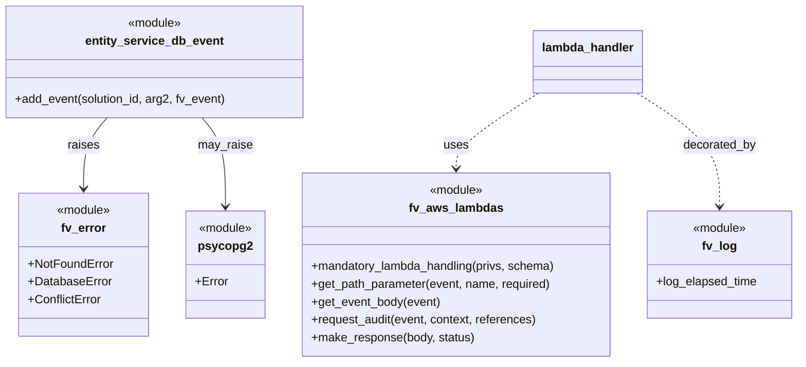

# Diagram: entity_core/entity_service/entity_service/entity/event/add_trip_leg_event.py


> Auto-generated by Obscura crawlers

## Diagram 1

```mermaid
flowchart TD
A[lambda_handler(event, context)]
A --> B[logging.info("add_trp_leg_event event")]
B --> C[get_path_parameter(event, "entity_id")]
C --> D[get_path_parameter(event, "solution_id")]
D --> E[fv_event = get_event_body(event)]
E --> F[references = {ENTITY_ID: entity_id, SOLUTION_ID: solution_id}]
F --> G[request_audit(event, context, references)]
G --> H{try}
H --> I[retval = entity_service.db.event.add_event(solution_id, None, fv_event)]
I --> J[fv.aws.lambdas.make_response(retval, 200)]
J --> K[return response]
I -->|NameError| L[raise fv.error.NotFoundError(message, client_message)]
I -->|psycopg2.Error| M[raise fv.error.DatabaseError(message, client_message)]
I -->|Exception| N[raise fv.error.ConflictError(message, client_message)]
```

> SVG rendering failed for this diagram.

## Diagram 2



### SVG

<svg id="container" width="1074.25" xmlns="http://www.w3.org/2000/svg" class="classDiagram" height="486" viewBox="0 0 1074.25 486" role="graphics-document document" aria-roledescription="class"><style>#container{font-family:"trebuchet ms",verdana,arial,sans-serif;font-size:16px;fill:#333;}@keyframes edge-animation-frame{from{stroke-dashoffset:0;}}@keyframes dash{to{stroke-dashoffset:0;}}#container .edge-animation-slow{stroke-dasharray:9,5!important;stroke-dashoffset:900;animation:dash 50s linear infinite;stroke-linecap:round;}#container .edge-animation-fast{stroke-dasharray:9,5!important;stroke-dashoffset:900;animation:dash 20s linear infinite;stroke-linecap:round;}#container .error-icon{fill:#552222;}#container .error-text{fill:#552222;stroke:#552222;}#container .edge-thickness-normal{stroke-width:1px;}#container .edge-thickness-thick{stroke-width:3.5px;}#container .edge-pattern-solid{stroke-dasharray:0;}#container .edge-thickness-invisible{stroke-width:0;fill:none;}#container .edge-pattern-dashed{stroke-dasharray:3;}#container .edge-pattern-dotted{stroke-dasharray:2;}#container .marker{fill:#333333;stroke:#333333;}#container .marker.cross{stroke:#333333;}#container svg{font-family:"trebuchet ms",verdana,arial,sans-serif;font-size:16px;}#container p{margin:0;}#container g.classGroup text{fill:#9370DB;stroke:none;font-family:"trebuchet ms",verdana,arial,sans-serif;font-size:10px;}#container g.classGroup text .title{font-weight:bolder;}#container .nodeLabel,#container .edgeLabel{color:#131300;}#container .edgeLabel .label rect{fill:#ECECFF;}#container .label text{fill:#131300;}#container .labelBkg{background:#ECECFF;}#container .edgeLabel .label span{background:#ECECFF;}#container .classTitle{font-weight:bolder;}#container .node rect,#container .node circle,#container .node ellipse,#container .node polygon,#container .node path{fill:#ECECFF;stroke:#9370DB;stroke-width:1px;}#container .divider{stroke:#9370DB;stroke-width:1;}#container g.clickable{cursor:pointer;}#container g.classGroup rect{fill:#ECECFF;stroke:#9370DB;}#container g.classGroup line{stroke:#9370DB;stroke-width:1;}#container .classLabel .box{stroke:none;stroke-width:0;fill:#ECECFF;opacity:0.5;}#container .classLabel .label{fill:#9370DB;font-size:10px;}#container .relation{stroke:#333333;stroke-width:1;fill:none;}#container .dashed-line{stroke-dasharray:3;}#container .dotted-line{stroke-dasharray:1 2;}#container #compositionStart,#container .composition{fill:#333333!important;stroke:#333333!important;stroke-width:1;}#container #compositionEnd,#container .composition{fill:#333333!important;stroke:#333333!important;stroke-width:1;}#container #dependencyStart,#container .dependency{fill:#333333!important;stroke:#333333!important;stroke-width:1;}#container #dependencyStart,#container .dependency{fill:#333333!important;stroke:#333333!important;stroke-width:1;}#container #extensionStart,#container .extension{fill:transparent!important;stroke:#333333!important;stroke-width:1;}#container #extensionEnd,#container .extension{fill:transparent!important;stroke:#333333!important;stroke-width:1;}#container #aggregationStart,#container .aggregation{fill:transparent!important;stroke:#333333!important;stroke-width:1;}#container #aggregationEnd,#container .aggregation{fill:transparent!important;stroke:#333333!important;stroke-width:1;}#container #lollipopStart,#container .lollipop{fill:#ECECFF!important;stroke:#333333!important;stroke-width:1;}#container #lollipopEnd,#container .lollipop{fill:#ECECFF!important;stroke:#333333!important;stroke-width:1;}#container .edgeTerminals{font-size:11px;line-height:initial;}#container .classTitleText{text-anchor:middle;font-size:18px;fill:#333;}#container .label-icon{display:inline-block;height:1em;overflow:visible;vertical-align:-0.125em;}#container .node .label-icon path{fill:currentColor;stroke:revert;stroke-width:revert;}#container :root{--mermaid-font-family:"trebuchet ms",verdana,arial,sans-serif;}</style><g><defs><marker id="container_class-aggregationStart" class="marker aggregation class" refX="18" refY="7" markerWidth="190" markerHeight="240" orient="auto"><path d="M 18,7 L9,13 L1,7 L9,1 Z"></path></marker></defs><defs><marker id="container_class-aggregationEnd" class="marker aggregation class" refX="1" refY="7" markerWidth="20" markerHeight="28" orient="auto"><path d="M 18,7 L9,13 L1,7 L9,1 Z"></path></marker></defs><defs><marker id="container_class-extensionStart" class="marker extension class" refX="18" refY="7" markerWidth="190" markerHeight="240" orient="auto"><path d="M 1,7 L18,13 V 1 Z"></path></marker></defs><defs><marker id="container_class-extensionEnd" class="marker extension class" refX="1" refY="7" markerWidth="20" markerHeight="28" orient="auto"><path d="M 1,1 V 13 L18,7 Z"></path></marker></defs><defs><marker id="container_class-compositionStart" class="marker composition class" refX="18" refY="7" markerWidth="190" markerHeight="240" orient="auto"><path d="M 18,7 L9,13 L1,7 L9,1 Z"></path></marker></defs><defs><marker id="container_class-compositionEnd" class="marker composition class" refX="1" refY="7" markerWidth="20" markerHeight="28" orient="auto"><path d="M 18,7 L9,13 L1,7 L9,1 Z"></path></marker></defs><defs><marker id="container_class-dependencyStart" class="marker dependency class" refX="6" refY="7" markerWidth="190" markerHeight="240" orient="auto"><path d="M 5,7 L9,13 L1,7 L9,1 Z"></path></marker></defs><defs><marker id="container_class-dependencyEnd" class="marker dependency class" refX="13" refY="7" markerWidth="20" markerHeight="28" orient="auto"><path d="M 18,7 L9,13 L14,7 L9,1 Z"></path></marker></defs><defs><marker id="container_class-lollipopStart" class="marker lollipop class" refX="13" refY="7" markerWidth="190" markerHeight="240" orient="auto"><circle stroke="black" fill="transparent" cx="7" cy="7" r="6"></circle></marker></defs><defs><marker id="container_class-lollipopEnd" class="marker lollipop class" refX="1" refY="7" markerWidth="190" markerHeight="240" orient="auto"><circle stroke="black" fill="transparent" cx="7" cy="7" r="6"></circle></marker></defs><g class="root"><g class="clusters"></g><g class="edgePaths"><path d="M722.955,125L704.408,136.667C685.861,148.333,648.766,171.667,630.219,188.5C611.672,205.333,611.672,215.667,611.672,220.833L611.672,226" id="id_lambda_handler_fv_aws_lambdas_1" class="edge-thickness-normal edge-pattern-dashed relation" style=";;;" data-edge="true" data-et="edge" data-id="id_lambda_handler_fv_aws_lambdas_1" data-points="W3sieCI6NzIyLjk1NDgzMzk4NDM3NSwieSI6MTI1fSx7IngiOjYxMS42NzE4NzUsInkiOjE5NX0seyJ4Ijo2MTEuNjcxODc1LCJ5IjoyMzJ9XQ==" marker-end="url(#container_class-dependencyEnd)"></path><path d="M856.494,125L875.042,136.667C893.589,148.333,930.683,171.667,949.23,197C967.777,222.333,967.777,249.667,967.777,263.333L967.777,277" id="id_lambda_handler_fv_log_2" class="edge-thickness-normal edge-pattern-dashed relation" style=";;;" data-edge="true" data-et="edge" data-id="id_lambda_handler_fv_log_2" data-points="W3sieCI6ODU2LjQ5NDM4NDc2NTYyNSwieSI6MTI1fSx7IngiOjk2Ny43NzczNDM3NSwieSI6MTk1fSx7IngiOjk2Ny43NzczNDM3NSwieSI6MjgzfV0=" marker-end="url(#container_class-dependencyEnd)"></path><path d="M143.349,158L138.122,164.167C132.895,170.333,122.442,182.667,117.215,198.5C111.988,214.333,111.988,233.667,111.988,243.333L111.988,253" id="id_entity_service_db_event_fv_error_3" class="edge-thickness-normal edge-pattern-solid relation" style=";;;" data-edge="true" data-et="edge" data-id="id_entity_service_db_event_fv_error_3" data-points="W3sieCI6MTQzLjM0ODk4MTU4NDgyMTQ0LCJ5IjoxNTh9LHsieCI6MTExLjk4ODI4MTI1LCJ5IjoxOTV9LHsieCI6MTExLjk4ODI4MTI1LCJ5IjoyNTl9XQ==" marker-end="url(#container_class-dependencyEnd)"></path><path d="M270.487,158L275.714,164.167C280.941,170.333,291.394,182.667,296.621,202.5C301.848,222.333,301.848,249.667,301.848,263.333L301.848,277" id="id_entity_service_db_event_psycopg2_4" class="edge-thickness-normal edge-pattern-solid relation" style=";;;" data-edge="true" data-et="edge" data-id="id_entity_service_db_event_psycopg2_4" data-points="W3sieCI6MjcwLjQ4Njk1NTkxNTE3ODU2LCJ5IjoxNTh9LHsieCI6MzAxLjg0NzY1NjI1LCJ5IjoxOTV9LHsieCI6MzAxLjg0NzY1NjI1LCJ5IjoyODN9XQ==" marker-end="url(#container_class-dependencyEnd)"></path></g><g class="edgeLabels"><g class="edgeLabel" transform="translate(611.671875, 195)"><g class="label" data-id="id_lambda_handler_fv_aws_lambdas_1" transform="translate(-16.4921875, -12)"><foreignObject width="32.984375" height="24"><div xmlns="http://www.w3.org/1999/xhtml" class="labelBkg" style="display: table-cell; white-space: nowrap; line-height: 1.5; max-width: 200px; text-align: center;"><span class="edgeLabel"><p>uses</p></span></div></foreignObject></g></g><g class="edgeLabel" transform="translate(967.77734375, 195)"><g class="label" data-id="id_lambda_handler_fv_log_2" transform="translate(-49.375, -12)"><foreignObject width="98.75" height="24"><div xmlns="http://www.w3.org/1999/xhtml" class="labelBkg" style="display: table-cell; white-space: nowrap; line-height: 1.5; max-width: 200px; text-align: center;"><span class="edgeLabel"><p>decorated_by</p></span></div></foreignObject></g></g><g class="edgeLabel" transform="translate(111.98828125, 195)"><g class="label" data-id="id_entity_service_db_event_fv_error_3" transform="translate(-21.25, -12)"><foreignObject width="42.5" height="24"><div xmlns="http://www.w3.org/1999/xhtml" class="labelBkg" style="display: table-cell; white-space: nowrap; line-height: 1.5; max-width: 200px; text-align: center;"><span class="edgeLabel"><p>raises</p></span></div></foreignObject></g></g><g class="edgeLabel" transform="translate(301.84765625, 195)"><g class="label" data-id="id_entity_service_db_event_psycopg2_4" transform="translate(-36.4609375, -12)"><foreignObject width="72.921875" height="24"><div xmlns="http://www.w3.org/1999/xhtml" class="labelBkg" style="display: table-cell; white-space: nowrap; line-height: 1.5; max-width: 200px; text-align: center;"><span class="edgeLabel"><p>may_raise</p></span></div></foreignObject></g></g></g><g class="nodes"><g class="node default" id="classId-fv_aws_lambdas-0" transform="translate(611.671875, 355)"><g class="basic label-container"><path d="M-207.6328125 -123 L207.6328125 -123 L207.6328125 123 L-207.6328125 123" stroke="none" stroke-width="0" fill="#ECECFF" style=""></path><path d="M-207.6328125 -123 C-67.94932513901216 -123, 71.73416222197568 -123, 207.6328125 -123 M-207.6328125 -123 C-50.219800694671704 -123, 107.19321111065659 -123, 207.6328125 -123 M207.6328125 -123 C207.6328125 -38.31620220057614, 207.6328125 46.367595598847714, 207.6328125 123 M207.6328125 -123 C207.6328125 -29.223609100079642, 207.6328125 64.55278179984072, 207.6328125 123 M207.6328125 123 C53.47213252669809 123, -100.68854744660382 123, -207.6328125 123 M207.6328125 123 C66.99064848467589 123, -73.65151553064823 123, -207.6328125 123 M-207.6328125 123 C-207.6328125 66.08903136718163, -207.6328125 9.178062734363266, -207.6328125 -123 M-207.6328125 123 C-207.6328125 41.82576367323563, -207.6328125 -39.348472653528745, -207.6328125 -123" stroke="#9370DB" stroke-width="1.3" fill="none" stroke-dasharray="0 0" style=""></path></g><g class="annotation-group text" transform="translate(-36.6015625, -99)"><g class="label" style="" transform="translate(0,-12)"><foreignObject width="73.203125" height="24"><div xmlns="http://www.w3.org/1999/xhtml" style="display: table-cell; white-space: nowrap; line-height: 1.5; max-width: 123px; text-align: center;"><span class="nodeLabel markdown-node-label" style=""><p>«module»</p></span></div></foreignObject></g></g><g class="label-group text" transform="translate(-60.0625, -75)"><g class="label" style="font-weight: bolder" transform="translate(0,-12)"><foreignObject width="120.125" height="24"><div xmlns="http://www.w3.org/1999/xhtml" style="display: table-cell; white-space: nowrap; line-height: 1.5; max-width: 168px; text-align: center;"><span class="nodeLabel markdown-node-label" style=""><p>fv_aws_lambdas</p></span></div></foreignObject></g></g><g class="members-group text" transform="translate(-195.6328125, -27)"></g><g class="methods-group text" transform="translate(-195.6328125, 3)"><g class="label" style="" transform="translate(0,-12)"><foreignObject width="331.203125" height="24"><div xmlns="http://www.w3.org/1999/xhtml" style="display: table-cell; white-space: nowrap; line-height: 1.5; max-width: 389px; text-align: center;"><span class="nodeLabel markdown-node-label" style=""><p>+mandatory_lambda_handling(privs, schema)</p></span></div></foreignObject></g><g class="label" style="" transform="translate(0,12)"><foreignObject width="324.703125" height="24"><div xmlns="http://www.w3.org/1999/xhtml" style="display: table-cell; white-space: nowrap; line-height: 1.5; max-width: 382px; text-align: center;"><span class="nodeLabel markdown-node-label" style=""><p>+get_path_parameter(event, name, required)</p></span></div></foreignObject></g><g class="label" style="" transform="translate(0,36)"><foreignObject width="174.203125" height="24"><div xmlns="http://www.w3.org/1999/xhtml" style="display: table-cell; white-space: nowrap; line-height: 1.5; max-width: 232px; text-align: center;"><span class="nodeLabel markdown-node-label" style=""><p>+get_event_body(event)</p></span></div></foreignObject></g><g class="label" style="" transform="translate(0,60)"><foreignObject width="305.46875" height="24"><div xmlns="http://www.w3.org/1999/xhtml" style="display: table-cell; white-space: nowrap; line-height: 1.5; max-width: 363px; text-align: center;"><span class="nodeLabel markdown-node-label" style=""><p>+request_audit(event, context, references)</p></span></div></foreignObject></g><g class="label" style="" transform="translate(0,84)"><foreignObject width="219.96875" height="24"><div xmlns="http://www.w3.org/1999/xhtml" style="display: table-cell; white-space: nowrap; line-height: 1.5; max-width: 277px; text-align: center;"><span class="nodeLabel markdown-node-label" style=""><p>+make_response(body, status)</p></span></div></foreignObject></g></g><g class="divider" style=""><path d="M-207.6328125 -51 C-109.01355111401884 -51, -10.394289728037677 -51, 207.6328125 -51 M-207.6328125 -51 C-121.61429569808739 -51, -35.59577889617478 -51, 207.6328125 -51" stroke="#9370DB" stroke-width="1.3" fill="none" stroke-dasharray="0 0" style=""></path></g><g class="divider" style=""><path d="M-207.6328125 -27 C-77.11547678570636 -27, 53.401858928587274 -27, 207.6328125 -27 M-207.6328125 -27 C-82.15061584215154 -27, 43.331580815696924 -27, 207.6328125 -27" stroke="#9370DB" stroke-width="1.3" fill="none" stroke-dasharray="0 0" style=""></path></g></g><g class="node default" id="classId-fv_log-1" transform="translate(967.77734375, 355)"><g class="basic label-container"><path d="M-98.47265625 -72 L98.47265625 -72 L98.47265625 72 L-98.47265625 72" stroke="none" stroke-width="0" fill="#ECECFF" style=""></path><path d="M-98.47265625 -72 C-54.533483391286694 -72, -10.594310532573388 -72, 98.47265625 -72 M-98.47265625 -72 C-38.5904217091438 -72, 21.291812831712406 -72, 98.47265625 -72 M98.47265625 -72 C98.47265625 -39.67897788719974, 98.47265625 -7.3579557743994854, 98.47265625 72 M98.47265625 -72 C98.47265625 -34.09766695113174, 98.47265625 3.804666097736515, 98.47265625 72 M98.47265625 72 C27.21723769564875 72, -44.0381808587025 72, -98.47265625 72 M98.47265625 72 C57.33972211024715 72, 16.206787970494304 72, -98.47265625 72 M-98.47265625 72 C-98.47265625 15.589431414048946, -98.47265625 -40.82113717190211, -98.47265625 -72 M-98.47265625 72 C-98.47265625 27.298624653659743, -98.47265625 -17.402750692680513, -98.47265625 -72" stroke="#9370DB" stroke-width="1.3" fill="none" stroke-dasharray="0 0" style=""></path></g><g class="annotation-group text" transform="translate(-36.6015625, -48)"><g class="label" style="" transform="translate(0,-12)"><foreignObject width="73.203125" height="24"><div xmlns="http://www.w3.org/1999/xhtml" style="display: table-cell; white-space: nowrap; line-height: 1.5; max-width: 123px; text-align: center;"><span class="nodeLabel markdown-node-label" style=""><p>«module»</p></span></div></foreignObject></g></g><g class="label-group text" transform="translate(-22.2109375, -24)"><g class="label" style="font-weight: bolder" transform="translate(0,-12)"><foreignObject width="44.421875" height="24"><div xmlns="http://www.w3.org/1999/xhtml" style="display: table-cell; white-space: nowrap; line-height: 1.5; max-width: 94px; text-align: center;"><span class="nodeLabel markdown-node-label" style=""><p>fv_log</p></span></div></foreignObject></g></g><g class="members-group text" transform="translate(-86.47265625, 24)"><g class="label" style="" transform="translate(0,-12)"><foreignObject width="136.34375" height="24"><div xmlns="http://www.w3.org/1999/xhtml" style="display: table-cell; white-space: nowrap; line-height: 1.5; max-width: 194px; text-align: center;"><span class="nodeLabel markdown-node-label" style=""><p>+log_elapsed_time</p></span></div></foreignObject></g></g><g class="methods-group text" transform="translate(-86.47265625, 72)"></g><g class="divider" style=""><path d="M-98.47265625 0 C-32.36623821269413 0, 33.740179824611744 0, 98.47265625 0 M-98.47265625 0 C-23.95408383880367 0, 50.56448857239266 0, 98.47265625 0" stroke="#9370DB" stroke-width="1.3" fill="none" stroke-dasharray="0 0" style=""></path></g><g class="divider" style=""><path d="M-98.47265625 48 C-53.66151107708904 48, -8.850365904178076 48, 98.47265625 48 M-98.47265625 48 C-46.46641928571138 48, 5.539817678577236 48, 98.47265625 48" stroke="#9370DB" stroke-width="1.3" fill="none" stroke-dasharray="0 0" style=""></path></g></g><g class="node default" id="classId-entity_service_db_event-2" transform="translate(206.91796875, 83)"><g class="basic label-container"><path d="M-198.91796875 -75 L198.91796875 -75 L198.91796875 75 L-198.91796875 75" stroke="none" stroke-width="0" fill="#ECECFF" style=""></path><path d="M-198.91796875 -75 C-59.125909638306524 -75, 80.66614947338695 -75, 198.91796875 -75 M-198.91796875 -75 C-73.27681135554322 -75, 52.36434603891357 -75, 198.91796875 -75 M198.91796875 -75 C198.91796875 -40.77624503601085, 198.91796875 -6.552490072021698, 198.91796875 75 M198.91796875 -75 C198.91796875 -44.83436424160533, 198.91796875 -14.668728483210657, 198.91796875 75 M198.91796875 75 C41.98840317167935 75, -114.9411624066413 75, -198.91796875 75 M198.91796875 75 C49.070984237509464 75, -100.77600027498107 75, -198.91796875 75 M-198.91796875 75 C-198.91796875 19.431175165905962, -198.91796875 -36.137649668188075, -198.91796875 -75 M-198.91796875 75 C-198.91796875 17.401314814379994, -198.91796875 -40.19737037124001, -198.91796875 -75" stroke="#9370DB" stroke-width="1.3" fill="none" stroke-dasharray="0 0" style=""></path></g><g class="annotation-group text" transform="translate(-36.6015625, -51)"><g class="label" style="" transform="translate(0,-12)"><foreignObject width="73.203125" height="24"><div xmlns="http://www.w3.org/1999/xhtml" style="display: table-cell; white-space: nowrap; line-height: 1.5; max-width: 123px; text-align: center;"><span class="nodeLabel markdown-node-label" style=""><p>«module»</p></span></div></foreignObject></g></g><g class="label-group text" transform="translate(-89.1953125, -27)"><g class="label" style="font-weight: bolder" transform="translate(0,-12)"><foreignObject width="178.390625" height="24"><div xmlns="http://www.w3.org/1999/xhtml" style="display: table-cell; white-space: nowrap; line-height: 1.5; max-width: 226px; text-align: center;"><span class="nodeLabel markdown-node-label" style=""><p>entity_service_db_event</p></span></div></foreignObject></g></g><g class="members-group text" transform="translate(-186.91796875, 21)"></g><g class="methods-group text" transform="translate(-186.91796875, 51)"><g class="label" style="" transform="translate(0,-12)"><foreignObject width="284.640625" height="24"><div xmlns="http://www.w3.org/1999/xhtml" style="display: table-cell; white-space: nowrap; line-height: 1.5; max-width: 342px; text-align: center;"><span class="nodeLabel markdown-node-label" style=""><p>+add_event(solution_id, arg2, fv_event)</p></span></div></foreignObject></g></g><g class="divider" style=""><path d="M-198.91796875 -3 C-61.1517342680869 -3, 76.6145002138262 -3, 198.91796875 -3 M-198.91796875 -3 C-48.27320170239571 -3, 102.37156534520858 -3, 198.91796875 -3" stroke="#9370DB" stroke-width="1.3" fill="none" stroke-dasharray="0 0" style=""></path></g><g class="divider" style=""><path d="M-198.91796875 21 C-70.68133668211578 21, 57.55529538576843 21, 198.91796875 21 M-198.91796875 21 C-107.67503007331713 21, -16.432091396634263 21, 198.91796875 21" stroke="#9370DB" stroke-width="1.3" fill="none" stroke-dasharray="0 0" style=""></path></g></g><g class="node default" id="classId-fv_error-3" transform="translate(111.98828125, 355)"><g class="basic label-container"><path d="M-87.66796875 -96 L87.66796875 -96 L87.66796875 96 L-87.66796875 96" stroke="none" stroke-width="0" fill="#ECECFF" style=""></path><path d="M-87.66796875 -96 C-33.093742538790266 -96, 21.480483672419467 -96, 87.66796875 -96 M-87.66796875 -96 C-34.37692621323846 -96, 18.914116323523075 -96, 87.66796875 -96 M87.66796875 -96 C87.66796875 -45.326809843809585, 87.66796875 5.3463803123808304, 87.66796875 96 M87.66796875 -96 C87.66796875 -21.75574209578822, 87.66796875 52.48851580842356, 87.66796875 96 M87.66796875 96 C50.42172288244814 96, 13.175477014896273 96, -87.66796875 96 M87.66796875 96 C21.49867691382906 96, -44.67061492234188 96, -87.66796875 96 M-87.66796875 96 C-87.66796875 34.73243061911703, -87.66796875 -26.535138761765936, -87.66796875 -96 M-87.66796875 96 C-87.66796875 28.73811412018017, -87.66796875 -38.52377175963966, -87.66796875 -96" stroke="#9370DB" stroke-width="1.3" fill="none" stroke-dasharray="0 0" style=""></path></g><g class="annotation-group text" transform="translate(-36.6015625, -72)"><g class="label" style="" transform="translate(0,-12)"><foreignObject width="73.203125" height="24"><div xmlns="http://www.w3.org/1999/xhtml" style="display: table-cell; white-space: nowrap; line-height: 1.5; max-width: 123px; text-align: center;"><span class="nodeLabel markdown-node-label" style=""><p>«module»</p></span></div></foreignObject></g></g><g class="label-group text" transform="translate(-29.1875, -48)"><g class="label" style="font-weight: bolder" transform="translate(0,-12)"><foreignObject width="58.375" height="24"><div xmlns="http://www.w3.org/1999/xhtml" style="display: table-cell; white-space: nowrap; line-height: 1.5; max-width: 108px; text-align: center;"><span class="nodeLabel markdown-node-label" style=""><p>fv_error</p></span></div></foreignObject></g></g><g class="members-group text" transform="translate(-75.66796875, 0)"><g class="label" style="" transform="translate(0,-12)"><foreignObject width="114.734375" height="24"><div xmlns="http://www.w3.org/1999/xhtml" style="display: table-cell; white-space: nowrap; line-height: 1.5; max-width: 173px; text-align: center;"><span class="nodeLabel markdown-node-label" style=""><p>+NotFoundError</p></span></div></foreignObject></g><g class="label" style="" transform="translate(0,12)"><foreignObject width="111.078125" height="24"><div xmlns="http://www.w3.org/1999/xhtml" style="display: table-cell; white-space: nowrap; line-height: 1.5; max-width: 169px; text-align: center;"><span class="nodeLabel markdown-node-label" style=""><p>+DatabaseError</p></span></div></foreignObject></g><g class="label" style="" transform="translate(0,36)"><foreignObject width="98.546875" height="24"><div xmlns="http://www.w3.org/1999/xhtml" style="display: table-cell; white-space: nowrap; line-height: 1.5; max-width: 157px; text-align: center;"><span class="nodeLabel markdown-node-label" style=""><p>+ConflictError</p></span></div></foreignObject></g></g><g class="methods-group text" transform="translate(-75.66796875, 96)"></g><g class="divider" style=""><path d="M-87.66796875 -24 C-31.88387744375663 -24, 23.900213862486737 -24, 87.66796875 -24 M-87.66796875 -24 C-26.224935879471047 -24, 35.218096991057905 -24, 87.66796875 -24" stroke="#9370DB" stroke-width="1.3" fill="none" stroke-dasharray="0 0" style=""></path></g><g class="divider" style=""><path d="M-87.66796875 72 C-43.123770002255 72, 1.4204287454899998 72, 87.66796875 72 M-87.66796875 72 C-52.33960860128584 72, -17.011248452571678 72, 87.66796875 72" stroke="#9370DB" stroke-width="1.3" fill="none" stroke-dasharray="0 0" style=""></path></g></g><g class="node default" id="classId-psycopg2-4" transform="translate(301.84765625, 355)"><g class="basic label-container"><path d="M-52.19140625 -72 L52.19140625 -72 L52.19140625 72 L-52.19140625 72" stroke="none" stroke-width="0" fill="#ECECFF" style=""></path><path d="M-52.19140625 -72 C-26.189579243452936 -72, -0.1877522369058724 -72, 52.19140625 -72 M-52.19140625 -72 C-16.511615222038238 -72, 19.168175805923525 -72, 52.19140625 -72 M52.19140625 -72 C52.19140625 -32.076489588720506, 52.19140625 7.847020822558989, 52.19140625 72 M52.19140625 -72 C52.19140625 -30.757223978857184, 52.19140625 10.485552042285633, 52.19140625 72 M52.19140625 72 C20.617308080154142 72, -10.956790089691715 72, -52.19140625 72 M52.19140625 72 C27.186074034151673 72, 2.1807418183033462 72, -52.19140625 72 M-52.19140625 72 C-52.19140625 35.797187551952305, -52.19140625 -0.40562489609538943, -52.19140625 -72 M-52.19140625 72 C-52.19140625 20.79773296790421, -52.19140625 -30.40453406419158, -52.19140625 -72" stroke="#9370DB" stroke-width="1.3" fill="none" stroke-dasharray="0 0" style=""></path></g><g class="annotation-group text" transform="translate(-36.6015625, -48)"><g class="label" style="" transform="translate(0,-12)"><foreignObject width="73.203125" height="24"><div xmlns="http://www.w3.org/1999/xhtml" style="display: table-cell; white-space: nowrap; line-height: 1.5; max-width: 123px; text-align: center;"><span class="nodeLabel markdown-node-label" style=""><p>«module»</p></span></div></foreignObject></g></g><g class="label-group text" transform="translate(-34.234375, -24)"><g class="label" style="font-weight: bolder" transform="translate(0,-12)"><foreignObject width="68.46875" height="24"><div xmlns="http://www.w3.org/1999/xhtml" style="display: table-cell; white-space: nowrap; line-height: 1.5; max-width: 117px; text-align: center;"><span class="nodeLabel markdown-node-label" style=""><p>psycopg2</p></span></div></foreignObject></g></g><g class="members-group text" transform="translate(-40.19140625, 24)"><g class="label" style="" transform="translate(0,-12)"><foreignObject width="43.78125" height="24"><div xmlns="http://www.w3.org/1999/xhtml" style="display: table-cell; white-space: nowrap; line-height: 1.5; max-width: 102px; text-align: center;"><span class="nodeLabel markdown-node-label" style=""><p>+Error</p></span></div></foreignObject></g></g><g class="methods-group text" transform="translate(-40.19140625, 72)"></g><g class="divider" style=""><path d="M-52.19140625 0 C-19.57051848957458 0, 13.050369270850837 0, 52.19140625 0 M-52.19140625 0 C-10.508935308535442 0, 31.173535632929116 0, 52.19140625 0" stroke="#9370DB" stroke-width="1.3" fill="none" stroke-dasharray="0 0" style=""></path></g><g class="divider" style=""><path d="M-52.19140625 48 C-29.34720906836973 48, -6.503011886739458 48, 52.19140625 48 M-52.19140625 48 C-25.528621294970886 48, 1.1341636600582277 48, 52.19140625 48" stroke="#9370DB" stroke-width="1.3" fill="none" stroke-dasharray="0 0" style=""></path></g></g><g class="node default" id="classId-lambda_handler-5" transform="translate(789.724609375, 83)"><g class="basic label-container"><path d="M-71.9765625 -42 L71.9765625 -42 L71.9765625 42 L-71.9765625 42" stroke="none" stroke-width="0" fill="#ECECFF" style=""></path><path d="M-71.9765625 -42 C-42.24626341062927 -42, -12.515964321258537 -42, 71.9765625 -42 M-71.9765625 -42 C-31.850516407518867 -42, 8.275529684962265 -42, 71.9765625 -42 M71.9765625 -42 C71.9765625 -11.656590663249073, 71.9765625 18.686818673501854, 71.9765625 42 M71.9765625 -42 C71.9765625 -10.816013302857538, 71.9765625 20.367973394284924, 71.9765625 42 M71.9765625 42 C43.04579304928493 42, 14.115023598569863 42, -71.9765625 42 M71.9765625 42 C41.50795835877056 42, 11.039354217541117 42, -71.9765625 42 M-71.9765625 42 C-71.9765625 20.99361620722234, -71.9765625 -0.012767585555323535, -71.9765625 -42 M-71.9765625 42 C-71.9765625 12.616246307017352, -71.9765625 -16.767507385965295, -71.9765625 -42" stroke="#9370DB" stroke-width="1.3" fill="none" stroke-dasharray="0 0" style=""></path></g><g class="annotation-group text" transform="translate(0, -18)"></g><g class="label-group text" transform="translate(-59.9765625, -18)"><g class="label" style="font-weight: bolder" transform="translate(0,-12)"><foreignObject width="119.953125" height="24"><div xmlns="http://www.w3.org/1999/xhtml" style="display: table-cell; white-space: nowrap; line-height: 1.5; max-width: 170px; text-align: center;"><span class="nodeLabel markdown-node-label" style=""><p>lambda_handler</p></span></div></foreignObject></g></g><g class="members-group text" transform="translate(-59.9765625, 30)"></g><g class="methods-group text" transform="translate(-59.9765625, 60)"></g><g class="divider" style=""><path d="M-71.9765625 6 C-21.019595656344002 6, 29.937371187311996 6, 71.9765625 6 M-71.9765625 6 C-28.36201438456228 6, 15.252533730875442 6, 71.9765625 6" stroke="#9370DB" stroke-width="1.3" fill="none" stroke-dasharray="0 0" style=""></path></g><g class="divider" style=""><path d="M-71.9765625 24 C-35.438866674632294 24, 1.098829150735412 24, 71.9765625 24 M-71.9765625 24 C-22.42657064597912 24, 27.123421208041762 24, 71.9765625 24" stroke="#9370DB" stroke-width="1.3" fill="none" stroke-dasharray="0 0" style=""></path></g></g></g></g></g></svg>
