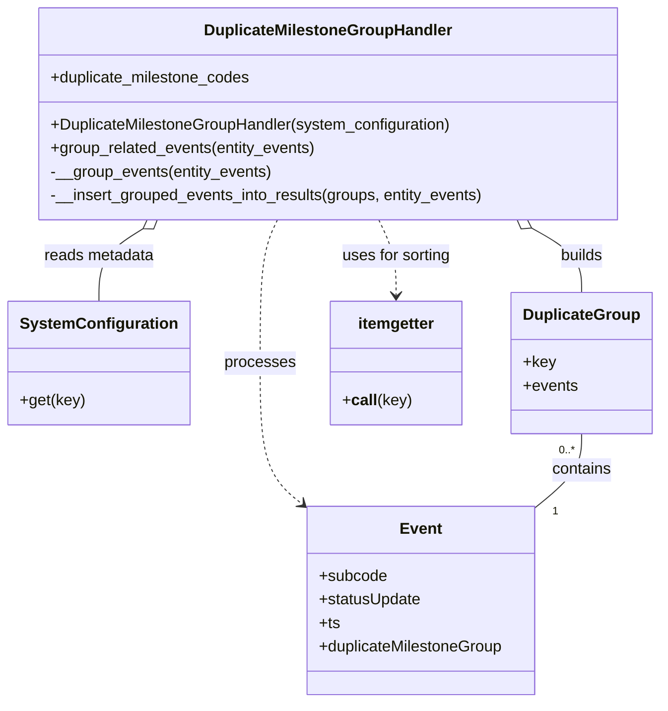

# Diagram: entity_core/entity_service/entity_service/entity/event/duplicate_milestone_group_handler.py

> Auto-generated by Obscura crawlers

## Mermaid

### SVG

<svg id="container" width="652.359375" xmlns="http://www.w3.org/2000/svg" class="classDiagram" height="716" viewBox="0 0 652.359375 716" role="graphics-document document" aria-roledescription="class"><g><defs><marker id="container_class-aggregationStart" class="marker aggregation class" refX="18" refY="7" markerWidth="190" markerHeight="240" orient="auto"><path d="M 18,7 L9,13 L1,7 L9,1 Z"></path></marker></defs><defs><marker id="container_class-aggregationEnd" class="marker aggregation class" refX="1" refY="7" markerWidth="20" markerHeight="28" orient="auto"><path d="M 18,7 L9,13 L1,7 L9,1 Z"></path></marker></defs><defs><marker id="container_class-extensionStart" class="marker extension class" refX="18" refY="7" markerWidth="190" markerHeight="240" orient="auto"><path d="M 1,7 L18,13 V 1 Z"></path></marker></defs><defs><marker id="container_class-extensionEnd" class="marker extension class" refX="1" refY="7" markerWidth="20" markerHeight="28" orient="auto"><path d="M 1,1 V 13 L18,7 Z"></path></marker></defs><defs><marker id="container_class-compositionStart" class="marker composition class" refX="18" refY="7" markerWidth="190" markerHeight="240" orient="auto"><path d="M 18,7 L9,13 L1,7 L9,1 Z"></path></marker></defs><defs><marker id="container_class-compositionEnd" class="marker composition class" refX="1" refY="7" markerWidth="20" markerHeight="28" orient="auto"><path d="M 18,7 L9,13 L1,7 L9,1 Z"></path></marker></defs><defs><marker id="container_class-dependencyStart" class="marker dependency class" refX="6" refY="7" markerWidth="190" markerHeight="240" orient="auto"><path d="M 5,7 L9,13 L1,7 L9,1 Z"></path></marker></defs><defs><marker id="container_class-dependencyEnd" class="marker dependency class" refX="13" refY="7" markerWidth="20" markerHeight="28" orient="auto"><path d="M 18,7 L9,13 L14,7 L9,1 Z"></path></marker></defs><defs><marker id="container_class-lollipopStart" class="marker lollipop class" refX="13" refY="7" markerWidth="190" markerHeight="240" orient="auto"><circle stroke="black" fill="transparent" cx="7" cy="7" r="6"></circle></marker></defs><defs><marker id="container_class-lollipopEnd" class="marker lollipop class" refX="1" refY="7" markerWidth="190" markerHeight="240" orient="auto"><circle stroke="black" fill="transparent" cx="7" cy="7" r="6"></circle></marker></defs><g class="root"><g class="clusters"></g><g class="edgePaths"><path d="M139.289,233.288L132.061,237.907C124.833,242.526,110.378,251.763,103.15,264.048C95.922,276.333,95.922,291.667,95.922,299.333L95.922,307" id="id_DuplicateMilestoneGroupHandler_SystemConfiguration_1" class="edge-thickness-normal edge-pattern-solid relation" style=";;;" data-edge="true" data-et="edge" data-id="id_DuplicateMilestoneGroupHandler_SystemConfiguration_1" data-points="W3sieCI6MTUzLjgyNTA4MDgxODk2NTUyLCJ5IjoyMjR9LHsieCI6OTUuOTIxODc1LCJ5IjoyNjF9LHsieCI6OTUuOTIxODc1LCJ5IjozMDd9XQ==" marker-start="url(#container_class-aggregationStart)"></path><path d="M272.037,224L269.137,230.167C266.236,236.333,260.434,248.667,257.534,273C254.633,297.333,254.633,333.667,254.633,370C254.633,406.333,254.633,442.667,261.302,466.362C267.971,490.057,281.309,501.114,287.979,506.642L294.648,512.171" id="id_DuplicateMilestoneGroupHandler_Event_2" class="edge-thickness-normal edge-pattern-dashed relation" style=";;;" data-edge="true" data-et="edge" data-id="id_DuplicateMilestoneGroupHandler_Event_2" data-points="W3sieCI6MjcyLjAzNzM2NTMwMTcyNDE1LCJ5IjoyMjR9LHsieCI6MjU0LjYzMjgxMjUsInkiOjI2MX0seyJ4IjoyNTQuNjMyODEyNSwieSI6MzcwfSx7IngiOjI1NC42MzI4MTI1LCJ5Ijo0Nzl9LHsieCI6Mjk5LjI2Njg4NzkyMjkzMjMsInkiOjUxNn1d" marker-end="url(#container_class-dependencyEnd)"></path><path d="M526.001,232.586L534.254,237.321C542.506,242.057,559.011,251.529,567.263,262.431C575.516,273.333,575.516,285.667,575.516,291.833L575.516,298" id="id_DuplicateMilestoneGroupHandler_DuplicateGroup_3" class="edge-thickness-normal edge-pattern-solid relation" style=";;;" data-edge="true" data-et="edge" data-id="id_DuplicateMilestoneGroupHandler_DuplicateGroup_3" data-points="W3sieCI6NTExLjAzOTczNTk5MTM3OTMsInkiOjIyNH0seyJ4Ijo1NzUuNTE1NjI1LCJ5IjoyNjF9LHsieCI6NTc1LjUxNTYyNSwieSI6Mjk4fV0=" marker-start="url(#container_class-aggregationStart)"></path><path d="M373.642,224L376.543,230.167C379.444,236.333,385.245,248.667,388.146,261.5C391.047,274.333,391.047,287.667,391.047,294.333L391.047,301" id="id_DuplicateMilestoneGroupHandler_itemgetter_4" class="edge-thickness-normal edge-pattern-dashed relation" style=";;;" data-edge="true" data-et="edge" data-id="id_DuplicateMilestoneGroupHandler_itemgetter_4" data-points="W3sieCI6MzczLjY0MjMyMjE5ODI3NTg1LCJ5IjoyMjR9LHsieCI6MzkxLjA0Njg3NSwieSI6MjYxfSx7IngiOjM5MS4wNDY4NzUsInkiOjMwN31d" marker-end="url(#container_class-dependencyEnd)"></path><path d="M575.516,442L575.516,448.167C575.516,454.333,575.516,466.667,568.077,479C560.638,491.333,545.76,503.667,538.321,509.833L530.882,516" id="id_DuplicateGroup_Event_5" class="edge-thickness-normal edge-pattern-solid relation" style=";;;" data-edge="true" data-et="edge" data-id="id_DuplicateGroup_Event_5" data-points="W3sieCI6NTc1LjUxNTYyNSwieSI6NDQyfSx7IngiOjU3NS41MTU2MjUsInkiOjQ3OX0seyJ4Ijo1MzAuODgxNTQ5NTc3MDY3NiwieSI6NTE2fV0="></path></g><g class="edgeLabels"><g class="edgeLabel" transform="translate(95.921875, 261)"><g class="label" data-id="id_DuplicateMilestoneGroupHandler_SystemConfiguration_1" transform="translate(-56.84375, -12)"><foreignObject width="113.6875" height="24">

reads metadata

</foreignObject></g></g><g class="edgeLabel" transform="translate(254.6328125, 370)"><g class="label" data-id="id_DuplicateMilestoneGroupHandler_Event_2" transform="translate(-35.7890625, -12)"><foreignObject width="71.578125" height="24">

processes

</foreignObject></g></g><g class="edgeLabel" transform="translate(575.515625, 261)"><g class="label" data-id="id_DuplicateMilestoneGroupHandler_DuplicateGroup_3" transform="translate(-22.4921875, -12)"><foreignObject width="44.984375" height="24">

builds

</foreignObject></g></g><g class="edgeLabel" transform="translate(391.046875, 261)"><g class="label" data-id="id_DuplicateMilestoneGroupHandler_itemgetter_4" transform="translate(-56.578125, -12)"><foreignObject width="113.15625" height="24">

uses for sorting

</foreignObject></g></g><g class="edgeLabel" transform="translate(575.515625, 479)"><g class="label" data-id="id_DuplicateGroup_Event_5" transform="translate(-30.890625, -12)"><foreignObject width="61.78125" height="24">

contains

</foreignObject></g></g><g class="edgeTerminals" transform="translate(560.5156275, 459.5000021428571)"><g class="inner" transform="translate(0, 0)"><foreignObject style="width: 36px; height: 12px;">
0..*
</foreignObject></g></g><g class="edgeTerminals" transform="translate(548.9272834633049, 511.37966173449297)"><g class="inner" transform="translate(0, 0)"></g><foreignObject style="width: 9px; height: 12px;">
1
</foreignObject></g></g><g class="nodes"><g class="node default" id="classId-DuplicateMilestoneGroupHandler-0" transform="translate(322.83984375, 116)"><g class="basic label-container"><path d="M-296.72265625 -108 L296.72265625 -108 L296.72265625 108 L-296.72265625 108" stroke="none" stroke-width="0" fill="#ECECFF" style=""></path><path d="M-296.72265625 -108 C-160.39935465309415 -108, -24.0760530561883 -108, 296.72265625 -108 M-296.72265625 -108 C-105.80126655527616 -108, 85.12012313944768 -108, 296.72265625 -108 M296.72265625 -108 C296.72265625 -30.12342912240426, 296.72265625 47.75314175519148, 296.72265625 108 M296.72265625 -108 C296.72265625 -38.300267624406374, 296.72265625 31.399464751187253, 296.72265625 108 M296.72265625 108 C177.78087121182415 108, 58.8390861736483 108, -296.72265625 108 M296.72265625 108 C141.84367269291042 108, -13.035310864179166 108, -296.72265625 108 M-296.72265625 108 C-296.72265625 35.977359036008224, -296.72265625 -36.04528192798355, -296.72265625 -108 M-296.72265625 108 C-296.72265625 47.1246129783034, -296.72265625 -13.750774043393207, -296.72265625 -108" stroke="#9370DB" stroke-width="1.3" fill="none" stroke-dasharray="0 0" style=""></path></g><g class="annotation-group text" transform="translate(0, -84)"></g><g class="label-group text" transform="translate(-121.7421875, -84)"><g class="label" style="font-weight: bolder" transform="translate(0,-12)"><foreignObject width="243.484375" height="24">

DuplicateMilestoneGroupHandler

</foreignObject></g></g><g class="members-group text" transform="translate(-284.72265625, -36)"><g class="label" style="" transform="translate(0,-12)"><foreignObject width="206.140625" height="24">

+duplicate_milestone_codes

</foreignObject></g></g><g class="methods-group text" transform="translate(-284.72265625, 12)"><g class="label" style="" transform="translate(0,-12)"><foreignObject width="414.296875" height="24">

+DuplicateMilestoneGroupHandler(system_configuration)

</foreignObject></g><g class="label" style="" transform="translate(0,12)"><foreignObject width="273.171875" height="24">

+group_related_events(entity_events)

</foreignObject></g><g class="label" style="" transform="translate(0,36)"><foreignObject width="227.109375" height="24">

-__group_events(entity_events)

</foreignObject></g><g class="label" style="" transform="translate(0,60)"><foreignObject width="447.703125" height="24">

-__insert_grouped_events_into_results(groups, entity_events)

</foreignObject></g></g><g class="divider" style=""><path d="M-296.72265625 -60 C-161.0173961820748 -60, -25.31213611414961 -60, 296.72265625 -60 M-296.72265625 -60 C-64.86682730148934 -60, 166.98900164702133 -60, 296.72265625 -60" stroke="#9370DB" stroke-width="1.3" fill="none" stroke-dasharray="0 0" style=""></path></g><g class="divider" style=""><path d="M-296.72265625 -12 C-163.34448626020912 -12, -29.966316270418247 -12, 296.72265625 -12 M-296.72265625 -12 C-166.62294273831415 -12, -36.5232292266283 -12, 296.72265625 -12" stroke="#9370DB" stroke-width="1.3" fill="none" stroke-dasharray="0 0" style=""></path></g></g><g class="node default" id="classId-SystemConfiguration-1" transform="translate(95.921875, 370)"><g class="basic label-container"><path d="M-87.921875 -63 L87.921875 -63 L87.921875 63 L-87.921875 63" stroke="none" stroke-width="0" fill="#ECECFF" style=""></path><path d="M-87.921875 -63 C-41.47569797544176 -63, 4.970479049116477 -63, 87.921875 -63 M-87.921875 -63 C-24.50892360153444 -63, 38.90402779693112 -63, 87.921875 -63 M87.921875 -63 C87.921875 -19.069554463817347, 87.921875 24.860891072365305, 87.921875 63 M87.921875 -63 C87.921875 -34.73471956158363, 87.921875 -6.4694391231672626, 87.921875 63 M87.921875 63 C39.09408312960805 63, -9.733708740783896 63, -87.921875 63 M87.921875 63 C48.332211069599495 63, 8.74254713919899 63, -87.921875 63 M-87.921875 63 C-87.921875 24.75514519094871, -87.921875 -13.48970961810258, -87.921875 -63 M-87.921875 63 C-87.921875 18.87603487975197, -87.921875 -25.24793024049606, -87.921875 -63" stroke="#9370DB" stroke-width="1.3" fill="none" stroke-dasharray="0 0" style=""></path></g><g class="annotation-group text" transform="translate(0, -39)"></g><g class="label-group text" transform="translate(-75.921875, -39)"><g class="label" style="font-weight: bolder" transform="translate(0,-12)"><foreignObject width="151.84375" height="24">

SystemConfiguration

</foreignObject></g></g><g class="members-group text" transform="translate(-75.921875, 9)"></g><g class="methods-group text" transform="translate(-75.921875, 39)"><g class="label" style="" transform="translate(0,-12)"><foreignObject width="65.5" height="24">

+get(key)

</foreignObject></g></g><g class="divider" style=""><path d="M-87.921875 -15 C-22.302755907468892 -15, 43.316363185062215 -15, 87.921875 -15 M-87.921875 -15 C-20.22881600509554 -15, 47.46424298980892 -15, 87.921875 -15" stroke="#9370DB" stroke-width="1.3" fill="none" stroke-dasharray="0 0" style=""></path></g><g class="divider" style=""><path d="M-87.921875 9 C-24.014049208909242 9, 39.893776582181516 9, 87.921875 9 M-87.921875 9 C-48.35786275356974 9, -8.793850507139481 9, 87.921875 9" stroke="#9370DB" stroke-width="1.3" fill="none" stroke-dasharray="0 0" style=""></path></g></g><g class="node default" id="classId-Event-2" transform="translate(415.07421875, 612)"><g class="basic label-container"><path d="M-117.46484375 -96 L117.46484375 -96 L117.46484375 96 L-117.46484375 96" stroke="none" stroke-width="0" fill="#ECECFF" style=""></path><path d="M-117.46484375 -96 C-56.2320540197372 -96, 5.000735710525603 -96, 117.46484375 -96 M-117.46484375 -96 C-44.709841522093555 -96, 28.04516070581289 -96, 117.46484375 -96 M117.46484375 -96 C117.46484375 -20.35602377488678, 117.46484375 55.28795245022644, 117.46484375 96 M117.46484375 -96 C117.46484375 -39.73234775367678, 117.46484375 16.535304492646446, 117.46484375 96 M117.46484375 96 C55.77394494054673 96, -5.916953868906546 96, -117.46484375 96 M117.46484375 96 C46.264467764293656 96, -24.93590822141269 96, -117.46484375 96 M-117.46484375 96 C-117.46484375 19.24762211023645, -117.46484375 -57.5047557795271, -117.46484375 -96 M-117.46484375 96 C-117.46484375 40.60002416357117, -117.46484375 -14.79995167285766, -117.46484375 -96" stroke="#9370DB" stroke-width="1.3" fill="none" stroke-dasharray="0 0" style=""></path></g><g class="annotation-group text" transform="translate(0, -72)"></g><g class="label-group text" transform="translate(-20.2109375, -72)"><g class="label" style="font-weight: bolder" transform="translate(0,-12)"><foreignObject width="40.421875" height="24">

Event

</foreignObject></g></g><g class="members-group text" transform="translate(-105.46484375, -24)"><g class="label" style="" transform="translate(0,-12)"><foreignObject width="69.234375" height="24">

+subcode

</foreignObject></g><g class="label" style="" transform="translate(0,12)"><foreignObject width="105.015625" height="24">

+statusUpdate

</foreignObject></g><g class="label" style="" transform="translate(0,36)"><foreignObject width="21.15625" height="24">

+ts

</foreignObject></g><g class="label" style="" transform="translate(0,60)"><foreignObject width="190.71875" height="24">

+duplicateMilestoneGroup

</foreignObject></g></g><g class="methods-group text" transform="translate(-105.46484375, 96)"></g><g class="divider" style=""><path d="M-117.46484375 -48 C-50.43257150209931 -48, 16.599700745801385 -48, 117.46484375 -48 M-117.46484375 -48 C-36.543478301271364 -48, 44.37788714745727 -48, 117.46484375 -48" stroke="#9370DB" stroke-width="1.3" fill="none" stroke-dasharray="0 0" style=""></path></g><g class="divider" style=""><path d="M-117.46484375 72 C-54.02359378502443 72, 9.417656179951138 72, 117.46484375 72 M-117.46484375 72 C-64.66640555067889 72, -11.867967351357791 72, 117.46484375 72" stroke="#9370DB" stroke-width="1.3" fill="none" stroke-dasharray="0 0" style=""></path></g></g><g class="node default" id="classId-DuplicateGroup-3" transform="translate(575.515625, 370)"><g class="basic label-container"><path d="M-68.84375 -72 L68.84375 -72 L68.84375 72 L-68.84375 72" stroke="none" stroke-width="0" fill="#ECECFF" style=""></path><path d="M-68.84375 -72 C-30.716603134926075 -72, 7.41054373014785 -72, 68.84375 -72 M-68.84375 -72 C-22.236143060268603 -72, 24.371463879462794 -72, 68.84375 -72 M68.84375 -72 C68.84375 -19.079824812546136, 68.84375 33.84035037490773, 68.84375 72 M68.84375 -72 C68.84375 -21.946285329114545, 68.84375 28.10742934177091, 68.84375 72 M68.84375 72 C30.435947553946704 72, -7.971854892106592 72, -68.84375 72 M68.84375 72 C17.069529961455217 72, -34.704690077089566 72, -68.84375 72 M-68.84375 72 C-68.84375 16.231564463294788, -68.84375 -39.536871073410424, -68.84375 -72 M-68.84375 72 C-68.84375 42.934622231229454, -68.84375 13.869244462458902, -68.84375 -72" stroke="#9370DB" stroke-width="1.3" fill="none" stroke-dasharray="0 0" style=""></path></g><g class="annotation-group text" transform="translate(0, -48)"></g><g class="label-group text" transform="translate(-56.84375, -48)"><g class="label" style="font-weight: bolder" transform="translate(0,-12)"><foreignObject width="113.6875" height="24">

DuplicateGroup

</foreignObject></g></g><g class="members-group text" transform="translate(-56.84375, 0)"><g class="label" style="" transform="translate(0,-12)"><foreignObject width="32.5625" height="24">

+key

</foreignObject></g><g class="label" style="" transform="translate(0,12)"><foreignObject width="55.796875" height="24">

+events

</foreignObject></g></g><g class="methods-group text" transform="translate(-56.84375, 72)"></g><g class="divider" style=""><path d="M-68.84375 -24 C-20.4595765133516 -24, 27.9245969732968 -24, 68.84375 -24 M-68.84375 -24 C-17.455727828438555 -24, 33.93229434312289 -24, 68.84375 -24" stroke="#9370DB" stroke-width="1.3" fill="none" stroke-dasharray="0 0" style=""></path></g><g class="divider" style=""><path d="M-68.84375 48 C-35.168993055451274 48, -1.4942361109025484 48, 68.84375 48 M-68.84375 48 C-37.7719324795942 48, -6.70011495918839 48, 68.84375 48" stroke="#9370DB" stroke-width="1.3" fill="none" stroke-dasharray="0 0" style=""></path></g></g><g class="node default" id="classId-itemgetter-4" transform="translate(391.046875, 370)"><g class="basic label-container"><path d="M-65.625 -63 L65.625 -63 L65.625 63 L-65.625 63" stroke="none" stroke-width="0" fill="#ECECFF" style=""></path><path d="M-65.625 -63 C-21.055611659021302 -63, 23.513776681957395 -63, 65.625 -63 M-65.625 -63 C-21.13395069957889 -63, 23.35709860084222 -63, 65.625 -63 M65.625 -63 C65.625 -34.912669364027494, 65.625 -6.82533872805498, 65.625 63 M65.625 -63 C65.625 -36.07592422944052, 65.625 -9.151848458881034, 65.625 63 M65.625 63 C31.219409844115226 63, -3.1861803117695473 63, -65.625 63 M65.625 63 C27.3881852218992 63, -10.848629556201601 63, -65.625 63 M-65.625 63 C-65.625 16.465974568512266, -65.625 -30.06805086297547, -65.625 -63 M-65.625 63 C-65.625 14.537805764271816, -65.625 -33.92438847145637, -65.625 -63" stroke="#9370DB" stroke-width="1.3" fill="none" stroke-dasharray="0 0" style=""></path></g><g class="annotation-group text" transform="translate(0, -39)"></g><g class="label-group text" transform="translate(-38.6875, -39)"><g class="label" style="font-weight: bolder" transform="translate(0,-12)"><foreignObject width="77.375" height="24">

itemgetter

</foreignObject></g></g><g class="members-group text" transform="translate(-53.625, 9)"></g><g class="methods-group text" transform="translate(-53.625, 39)"><g class="label" style="" transform="translate(0,-12)"><foreignObject width="68.5625" height="24">

+<strong>call</strong>(key)

</foreignObject></g></g><g class="divider" style=""><path d="M-65.625 -15 C-20.707169206415593 -15, 24.210661587168815 -15, 65.625 -15 M-65.625 -15 C-27.79834526113433 -15, 10.02830947773134 -15, 65.625 -15" stroke="#9370DB" stroke-width="1.3" fill="none" stroke-dasharray="0 0" style=""></path></g><g class="divider" style=""><path d="M-65.625 9 C-20.37619453044652 9, 24.872610939106963 9, 65.625 9 M-65.625 9 C-21.783191796354778 9, 22.058616407290444 9, 65.625 9" stroke="#9370DB" stroke-width="1.3" fill="none" stroke-dasharray="0 0" style=""></path></g></g></g></g></g></svg>
