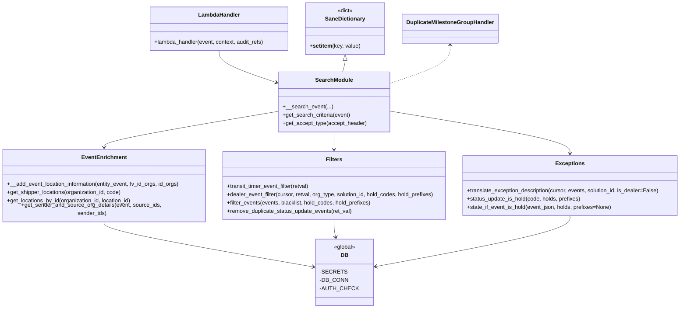

# Diagram: entity_core/entity_service/entity_service/entity/event/get_event.py


> Auto-generated by Obscura crawlers

## Diagram 1

```mermaid
flowchart LR
  LH[lambda_handler(event, context, audit_refs)] --> P1{event_id present?}
  P1 -- no --> Search[__search_event(cursor, solution_id, entity_id, event, accept_type, organization_type)]
  P1 -- yes --> GetEv[__get_event(cursor, solution_id, entity_id, event_id, event, accept_type, organization_type)]
  Search --> S1[get_search_criteria(event)]
  Search --> DBSeq[get sequence_number(cursor, solution_id)]
  Search --> QueryDB[entity_service.db.event.search_events(...)]
  QueryDB --> Sort1[sort_events_by_event_time_sequence_and_received_time]
  Sort1 --> BlacklistGlobal[remove_global_blacklisted_events(cursor, entity_events, solution_id)]
  BlacklistGlobal --> HoldDetection[for each event: state_if_event_is_hold(...)]
  HoldDetection --> DetailCheck{get_detail?}
  DetailCheck -- yes --> DetailFilters[transit_timer_event_filter -> dealer_event_filter -> enrich events]
  DetailFilters --> SenderSource[get_sender_and_source_ids_from_entities -> get_sender_and_source_org_details]
  SenderSource --> Enrich[__add_event_location_information(...)]
  HoldDetection --> DealerDup[if dealer -> remove_duplicate_status_update_events else translate_exception_description]
  DealerDup --> DuplicateGroup[DuplicateMilestoneGroupHandler.group_related_events(...)]
  DuplicateGroup --> Sort2[sort_events_by_event_time_sequence_and_received_time]
  Sort2 --> Respond[fv.aws.lambdas.make_response(entity_events,200)]
  GetEv --> GetSingle[entity_service.db.event.get_event(...)]
  GetSingle --> SingleDetail{get_detail?}
  SingleDetail -- yes --> GetSenderSourceSingle[get_sender_and_source_ids_from_entities([retval]) -> get_sender_and_source_org_details]
  GetSenderSourceSingle --> EnrichSingle[__add_event_location_information(retval,...)]
  GetSingle --> TranslateIfNotDealer[translate_exception_description if not dealer]
  GetSingle --> Respond
```

> SVG rendering failed for this diagram.

## Diagram 2



### SVG

<svg id="container" width="1983.7109375" xmlns="http://www.w3.org/2000/svg" class="classDiagram" height="880" viewBox="0 0 1983.7109375 880" role="graphics-document document" aria-roledescription="class"><style>#container{font-family:"trebuchet ms",verdana,arial,sans-serif;font-size:16px;fill:#333;}@keyframes edge-animation-frame{from{stroke-dashoffset:0;}}@keyframes dash{to{stroke-dashoffset:0;}}#container .edge-animation-slow{stroke-dasharray:9,5!important;stroke-dashoffset:900;animation:dash 50s linear infinite;stroke-linecap:round;}#container .edge-animation-fast{stroke-dasharray:9,5!important;stroke-dashoffset:900;animation:dash 20s linear infinite;stroke-linecap:round;}#container .error-icon{fill:#552222;}#container .error-text{fill:#552222;stroke:#552222;}#container .edge-thickness-normal{stroke-width:1px;}#container .edge-thickness-thick{stroke-width:3.5px;}#container .edge-pattern-solid{stroke-dasharray:0;}#container .edge-thickness-invisible{stroke-width:0;fill:none;}#container .edge-pattern-dashed{stroke-dasharray:3;}#container .edge-pattern-dotted{stroke-dasharray:2;}#container .marker{fill:#333333;stroke:#333333;}#container .marker.cross{stroke:#333333;}#container svg{font-family:"trebuchet ms",verdana,arial,sans-serif;font-size:16px;}#container p{margin:0;}#container g.classGroup text{fill:#9370DB;stroke:none;font-family:"trebuchet ms",verdana,arial,sans-serif;font-size:10px;}#container g.classGroup text .title{font-weight:bolder;}#container .nodeLabel,#container .edgeLabel{color:#131300;}#container .edgeLabel .label rect{fill:#ECECFF;}#container .label text{fill:#131300;}#container .labelBkg{background:#ECECFF;}#container .edgeLabel .label span{background:#ECECFF;}#container .classTitle{font-weight:bolder;}#container .node rect,#container .node circle,#container .node ellipse,#container .node polygon,#container .node path{fill:#ECECFF;stroke:#9370DB;stroke-width:1px;}#container .divider{stroke:#9370DB;stroke-width:1;}#container g.clickable{cursor:pointer;}#container g.classGroup rect{fill:#ECECFF;stroke:#9370DB;}#container g.classGroup line{stroke:#9370DB;stroke-width:1;}#container .classLabel .box{stroke:none;stroke-width:0;fill:#ECECFF;opacity:0.5;}#container .classLabel .label{fill:#9370DB;font-size:10px;}#container .relation{stroke:#333333;stroke-width:1;fill:none;}#container .dashed-line{stroke-dasharray:3;}#container .dotted-line{stroke-dasharray:1 2;}#container #compositionStart,#container .composition{fill:#333333!important;stroke:#333333!important;stroke-width:1;}#container #compositionEnd,#container .composition{fill:#333333!important;stroke:#333333!important;stroke-width:1;}#container #dependencyStart,#container .dependency{fill:#333333!important;stroke:#333333!important;stroke-width:1;}#container #dependencyStart,#container .dependency{fill:#333333!important;stroke:#333333!important;stroke-width:1;}#container #extensionStart,#container .extension{fill:transparent!important;stroke:#333333!important;stroke-width:1;}#container #extensionEnd,#container .extension{fill:transparent!important;stroke:#333333!important;stroke-width:1;}#container #aggregationStart,#container .aggregation{fill:transparent!important;stroke:#333333!important;stroke-width:1;}#container #aggregationEnd,#container .aggregation{fill:transparent!important;stroke:#333333!important;stroke-width:1;}#container #lollipopStart,#container .lollipop{fill:#ECECFF!important;stroke:#333333!important;stroke-width:1;}#container #lollipopEnd,#container .lollipop{fill:#ECECFF!important;stroke:#333333!important;stroke-width:1;}#container .edgeTerminals{font-size:11px;line-height:initial;}#container .classTitleText{text-anchor:middle;font-size:18px;fill:#333;}#container .label-icon{display:inline-block;height:1em;overflow:visible;vertical-align:-0.125em;}#container .node .label-icon path{fill:currentColor;stroke:revert;stroke-width:revert;}#container :root{--mermaid-font-family:"trebuchet ms",verdana,arial,sans-serif;}</style><g><defs><marker id="container_class-aggregationStart" class="marker aggregation class" refX="18" refY="7" markerWidth="190" markerHeight="240" orient="auto"><path d="M 18,7 L9,13 L1,7 L9,1 Z"></path></marker></defs><defs><marker id="container_class-aggregationEnd" class="marker aggregation class" refX="1" refY="7" markerWidth="20" markerHeight="28" orient="auto"><path d="M 18,7 L9,13 L1,7 L9,1 Z"></path></marker></defs><defs><marker id="container_class-extensionStart" class="marker extension class" refX="18" refY="7" markerWidth="190" markerHeight="240" orient="auto"><path d="M 1,7 L18,13 V 1 Z"></path></marker></defs><defs><marker id="container_class-extensionEnd" class="marker extension class" refX="1" refY="7" markerWidth="20" markerHeight="28" orient="auto"><path d="M 1,1 V 13 L18,7 Z"></path></marker></defs><defs><marker id="container_class-compositionStart" class="marker composition class" refX="18" refY="7" markerWidth="190" markerHeight="240" orient="auto"><path d="M 18,7 L9,13 L1,7 L9,1 Z"></path></marker></defs><defs><marker id="container_class-compositionEnd" class="marker composition class" refX="1" refY="7" markerWidth="20" markerHeight="28" orient="auto"><path d="M 18,7 L9,13 L1,7 L9,1 Z"></path></marker></defs><defs><marker id="container_class-dependencyStart" class="marker dependency class" refX="6" refY="7" markerWidth="190" markerHeight="240" orient="auto"><path d="M 5,7 L9,13 L1,7 L9,1 Z"></path></marker></defs><defs><marker id="container_class-dependencyEnd" class="marker dependency class" refX="13" refY="7" markerWidth="20" markerHeight="28" orient="auto"><path d="M 18,7 L9,13 L14,7 L9,1 Z"></path></marker></defs><defs><marker id="container_class-lollipopStart" class="marker lollipop class" refX="13" refY="7" markerWidth="190" markerHeight="240" orient="auto"><circle stroke="black" fill="transparent" cx="7" cy="7" r="6"></circle></marker></defs><defs><marker id="container_class-lollipopEnd" class="marker lollipop class" refX="1" refY="7" markerWidth="190" markerHeight="240" orient="auto"><circle stroke="black" fill="transparent" cx="7" cy="7" r="6"></circle></marker></defs><g class="root"><g class="clusters"></g><g class="edgePaths"><path d="M644.672,146L644.672,152.167C644.672,158.333,644.672,170.667,672.178,186.167C699.684,201.668,754.697,220.336,782.203,229.67L809.709,239.004" id="id_LambdaHandler_SearchModule_1" class="edge-thickness-normal edge-pattern-solid relation" style=";;;" data-edge="true" data-et="edge" data-id="id_LambdaHandler_SearchModule_1" data-points="W3sieCI6NjQ0LjY3MTg3NSwieSI6MTQ2fSx7IngiOjY0NC42NzE4NzUsInkiOjE4M30seyJ4Ijo4MTUuMzkwNjI1LCJ5IjoyNDAuOTMxOTk0MzY2Mzk3MjJ9XQ==" marker-end="url(#container_class-dependencyEnd)"></path><path d="M974.723,382L974.723,386.167C974.723,390.333,974.723,398.667,974.723,406C974.723,413.333,974.723,419.667,974.723,422.833L974.723,426" id="id_SearchModule_Filters_2" class="edge-thickness-normal edge-pattern-solid relation" style=";;;" data-edge="true" data-et="edge" data-id="id_SearchModule_Filters_2" data-points="W3sieCI6OTc0LjcyMjY1NjI1LCJ5IjozODJ9LHsieCI6OTc0LjcyMjY1NjI1LCJ5Ijo0MDd9LHsieCI6OTc0LjcyMjY1NjI1LCJ5Ijo0MzJ9XQ==" marker-end="url(#container_class-dependencyEnd)"></path><path d="M815.391,321.567L729.993,335.806C644.596,350.044,473.802,378.522,388.405,395.928C303.008,413.333,303.008,419.667,303.008,422.833L303.008,426" id="id_SearchModule_EventEnrichment_3" class="edge-thickness-normal edge-pattern-solid relation" style=";;;" data-edge="true" data-et="edge" data-id="id_SearchModule_EventEnrichment_3" data-points="W3sieCI6ODE1LjM5MDYyNSwieSI6MzIxLjU2NjYxMTgwODYyODh9LHsieCI6MzAzLjAwNzgxMjUsInkiOjQwN30seyJ4IjozMDMuMDA3ODEyNSwieSI6NDMyfV0=" marker-end="url(#container_class-dependencyEnd)"></path><path d="M1134.055,320.906L1222.307,335.255C1310.56,349.604,1487.065,378.302,1575.318,397.818C1663.57,417.333,1663.57,427.667,1663.57,432.833L1663.57,438" id="id_SearchModule_Exceptions_4" class="edge-thickness-normal edge-pattern-solid relation" style=";;;" data-edge="true" data-et="edge" data-id="id_SearchModule_Exceptions_4" data-points="W3sieCI6MTEzNC4wNTQ2ODc1LCJ5IjozMjAuOTA1ODU1MDAwMTQxNzR9LHsieCI6MTY2My41NzAzMTI1LCJ5Ijo0MDd9LHsieCI6MTY2My41NzAzMTI1LCJ5Ijo0NDR9XQ==" marker-end="url(#container_class-dependencyEnd)"></path><path d="M303.008,630L303.008,634.167C303.008,638.333,303.008,646.667,406.753,668.619C510.499,690.571,717.99,726.141,821.735,743.926L925.481,761.712" id="id_EventEnrichment_DB_5" class="edge-thickness-normal edge-pattern-solid relation" style=";;;" data-edge="true" data-et="edge" data-id="id_EventEnrichment_DB_5" data-points="W3sieCI6MzAzLjAwNzgxMjUsInkiOjYzMH0seyJ4IjozMDMuMDA3ODEyNSwieSI6NjU1fSx7IngiOjkzMS4zOTQ1MzEyNSwieSI6NzYyLjcyNTQyNDc2MDYzOTd9XQ==" marker-end="url(#container_class-dependencyEnd)"></path><path d="M974.723,630L974.723,634.167C974.723,638.333,974.723,646.667,975.626,654.038C976.529,661.408,978.335,667.817,979.238,671.021L980.141,674.225" id="id_Filters_DB_6" class="edge-thickness-normal edge-pattern-solid relation" style=";;;" data-edge="true" data-et="edge" data-id="id_Filters_DB_6" data-points="W3sieCI6OTc0LjcyMjY1NjI1LCJ5Ijo2MzB9LHsieCI6OTc0LjcyMjY1NjI1LCJ5Ijo2NTV9LHsieCI6OTgxLjc2OTI0MDcwMjQ3OTQsInkiOjY4MH1d" marker-end="url(#container_class-dependencyEnd)"></path><path d="M1663.57,618L1663.57,624.167C1663.57,630.333,1663.57,642.667,1568.336,666.433C1473.101,690.2,1282.631,725.4,1187.397,743L1092.162,760.599" id="id_Exceptions_DB_7" class="edge-thickness-normal edge-pattern-solid relation" style=";;;" data-edge="true" data-et="edge" data-id="id_Exceptions_DB_7" data-points="W3sieCI6MTY2My41NzAzMTI1LCJ5Ijo2MTh9LHsieCI6MTY2My41NzAzMTI1LCJ5Ijo2NTV9LHsieCI6MTA4Ni4yNjE3MTg3NSwieSI6NzYxLjY4OTg0MDk0NDA3Mzl9XQ==" marker-end="url(#container_class-dependencyEnd)"></path><path d="M1008.828,175.25L1008.828,176.542C1008.828,177.833,1008.828,180.417,1007.559,185.875C1006.291,191.333,1003.753,199.667,1002.484,203.833L1001.215,208" id="id_SaneDictionary_SearchModule_8" class="edge-thickness-normal edge-pattern-solid relation" style=";;;" data-edge="true" data-et="edge" data-id="id_SaneDictionary_SearchModule_8" data-points="W3sieCI6MTAwOC44MjgxMjUsInkiOjE1OH0seyJ4IjoxMDA4LjgyODEyNSwieSI6MTgzfSx7IngiOjEwMDEuMjE1Mjk3MTU0MDE3OSwieSI6MjA4fV0=" marker-start="url(#container_class-extensionStart)"></path><path d="M1304.773,131L1304.773,139.667C1304.773,148.333,1304.773,165.667,1276.32,183.989C1247.867,202.311,1190.961,221.621,1162.508,231.277L1134.055,240.932" id="id_DuplicateMilestoneGroupHandler_SearchModule_9" class="edge-thickness-normal edge-pattern-dashed relation" style=";;;" data-edge="true" data-et="edge" data-id="id_DuplicateMilestoneGroupHandler_SearchModule_9" data-points="W3sieCI6MTMwNC43NzM0Mzc1LCJ5IjoxMjV9LHsieCI6MTMwNC43NzM0Mzc1LCJ5IjoxODN9LHsieCI6MTEzNC4wNTQ2ODc1LCJ5IjoyNDAuOTMxOTk0MzY2Mzk3MjJ9XQ==" marker-start="url(#container_class-dependencyStart)"></path></g><g class="edgeLabels"><g class="edgeLabel"><g class="label" data-id="id_LambdaHandler_SearchModule_1" transform="translate(0, 0)"><foreignObject width="0" height="0"><div xmlns="http://www.w3.org/1999/xhtml" class="labelBkg" style="display: table-cell; white-space: nowrap; line-height: 1.5; max-width: 200px; text-align: center;"><span class="edgeLabel"></span></div></foreignObject></g></g><g class="edgeLabel"><g class="label" data-id="id_SearchModule_Filters_2" transform="translate(0, 0)"><foreignObject width="0" height="0"><div xmlns="http://www.w3.org/1999/xhtml" class="labelBkg" style="display: table-cell; white-space: nowrap; line-height: 1.5; max-width: 200px; text-align: center;"><span class="edgeLabel"></span></div></foreignObject></g></g><g class="edgeLabel"><g class="label" data-id="id_SearchModule_EventEnrichment_3" transform="translate(0, 0)"><foreignObject width="0" height="0"><div xmlns="http://www.w3.org/1999/xhtml" class="labelBkg" style="display: table-cell; white-space: nowrap; line-height: 1.5; max-width: 200px; text-align: center;"><span class="edgeLabel"></span></div></foreignObject></g></g><g class="edgeLabel"><g class="label" data-id="id_SearchModule_Exceptions_4" transform="translate(0, 0)"><foreignObject width="0" height="0"><div xmlns="http://www.w3.org/1999/xhtml" class="labelBkg" style="display: table-cell; white-space: nowrap; line-height: 1.5; max-width: 200px; text-align: center;"><span class="edgeLabel"></span></div></foreignObject></g></g><g class="edgeLabel"><g class="label" data-id="id_EventEnrichment_DB_5" transform="translate(0, 0)"><foreignObject width="0" height="0"><div xmlns="http://www.w3.org/1999/xhtml" class="labelBkg" style="display: table-cell; white-space: nowrap; line-height: 1.5; max-width: 200px; text-align: center;"><span class="edgeLabel"></span></div></foreignObject></g></g><g class="edgeLabel"><g class="label" data-id="id_Filters_DB_6" transform="translate(0, 0)"><foreignObject width="0" height="0"><div xmlns="http://www.w3.org/1999/xhtml" class="labelBkg" style="display: table-cell; white-space: nowrap; line-height: 1.5; max-width: 200px; text-align: center;"><span class="edgeLabel"></span></div></foreignObject></g></g><g class="edgeLabel"><g class="label" data-id="id_Exceptions_DB_7" transform="translate(0, 0)"><foreignObject width="0" height="0"><div xmlns="http://www.w3.org/1999/xhtml" class="labelBkg" style="display: table-cell; white-space: nowrap; line-height: 1.5; max-width: 200px; text-align: center;"><span class="edgeLabel"></span></div></foreignObject></g></g><g class="edgeLabel"><g class="label" data-id="id_SaneDictionary_SearchModule_8" transform="translate(0, 0)"><foreignObject width="0" height="0"><div xmlns="http://www.w3.org/1999/xhtml" class="labelBkg" style="display: table-cell; white-space: nowrap; line-height: 1.5; max-width: 200px; text-align: center;"><span class="edgeLabel"></span></div></foreignObject></g></g><g class="edgeLabel"><g class="label" data-id="id_DuplicateMilestoneGroupHandler_SearchModule_9" transform="translate(0, 0)"><foreignObject width="0" height="0"><div xmlns="http://www.w3.org/1999/xhtml" class="labelBkg" style="display: table-cell; white-space: nowrap; line-height: 1.5; max-width: 200px; text-align: center;"><span class="edgeLabel"></span></div></foreignObject></g></g></g><g class="nodes"><g class="node default" id="classId-SaneDictionary-0" transform="translate(1008.828125, 83)"><g class="basic label-container"><path d="M-112.203125 -75 L112.203125 -75 L112.203125 75 L-112.203125 75" stroke="none" stroke-width="0" fill="#ECECFF" style=""></path><path d="M-112.203125 -75 C-28.432161649238537 -75, 55.338801701522925 -75, 112.203125 -75 M-112.203125 -75 C-48.272150002928704 -75, 15.658824994142591 -75, 112.203125 -75 M112.203125 -75 C112.203125 -34.077761041561054, 112.203125 6.844477916877892, 112.203125 75 M112.203125 -75 C112.203125 -43.35481202277501, 112.203125 -11.709624045550022, 112.203125 75 M112.203125 75 C36.99071234082534 75, -38.22170031834932 75, -112.203125 75 M112.203125 75 C40.58663424481169 75, -31.029856510376618 75, -112.203125 75 M-112.203125 75 C-112.203125 26.59597615069186, -112.203125 -21.808047698616278, -112.203125 -75 M-112.203125 75 C-112.203125 37.87085282016865, -112.203125 0.741705640337301, -112.203125 -75" stroke="#9370DB" stroke-width="1.3" fill="none" stroke-dasharray="0 0" style=""></path></g><g class="annotation-group text" transform="translate(-22.7265625, -51)"><g class="label" style="" transform="translate(0,-12)"><foreignObject width="45.453125" height="24"><div xmlns="http://www.w3.org/1999/xhtml" style="display: table-cell; white-space: nowrap; line-height: 1.5; max-width: 95px; text-align: center;"><span class="nodeLabel markdown-node-label" style=""><p>«dict»</p></span></div></foreignObject></g></g><g class="label-group text" transform="translate(-55.65625, -27)"><g class="label" style="font-weight: bolder" transform="translate(0,-12)"><foreignObject width="111.3125" height="24"><div xmlns="http://www.w3.org/1999/xhtml" style="display: table-cell; white-space: nowrap; line-height: 1.5; max-width: 160px; text-align: center;"><span class="nodeLabel markdown-node-label" style=""><p>SaneDictionary</p></span></div></foreignObject></g></g><g class="members-group text" transform="translate(-100.203125, 21)"></g><g class="methods-group text" transform="translate(-100.203125, 51)"><g class="label" style="" transform="translate(0,-12)"><foreignObject width="144.75" height="24"><div xmlns="http://www.w3.org/1999/xhtml" style="display: table-cell; white-space: nowrap; line-height: 1.5; max-width: 233px; text-align: center;"><span class="nodeLabel markdown-node-label" style=""><p>+<strong>setitem</strong>(key, value)</p></span></div></foreignObject></g></g><g class="divider" style=""><path d="M-112.203125 -3 C-50.3828644457533 -3, 11.437396108493402 -3, 112.203125 -3 M-112.203125 -3 C-42.43298417070008 -3, 27.337156658599838 -3, 112.203125 -3" stroke="#9370DB" stroke-width="1.3" fill="none" stroke-dasharray="0 0" style=""></path></g><g class="divider" style=""><path d="M-112.203125 21 C-27.925502770730574 21, 56.35211945853885 21, 112.203125 21 M-112.203125 21 C-47.75530925638917 21, 16.692506487221664 21, 112.203125 21" stroke="#9370DB" stroke-width="1.3" fill="none" stroke-dasharray="0 0" style=""></path></g></g><g class="node default" id="classId-LambdaHandler-1" transform="translate(644.671875, 83)"><g class="basic label-container"><path d="M-201.953125 -63 L201.953125 -63 L201.953125 63 L-201.953125 63" stroke="none" stroke-width="0" fill="#ECECFF" style=""></path><path d="M-201.953125 -63 C-64.00823560226468 -63, 73.93665379547065 -63, 201.953125 -63 M-201.953125 -63 C-61.60611342836913 -63, 78.74089814326175 -63, 201.953125 -63 M201.953125 -63 C201.953125 -28.45194198827825, 201.953125 6.0961160234435, 201.953125 63 M201.953125 -63 C201.953125 -14.7822821555024, 201.953125 33.4354356889952, 201.953125 63 M201.953125 63 C116.1799629779553 63, 30.406800955910597 63, -201.953125 63 M201.953125 63 C47.58513189763539 63, -106.78286120472922 63, -201.953125 63 M-201.953125 63 C-201.953125 32.07554640285912, -201.953125 1.1510928057182284, -201.953125 -63 M-201.953125 63 C-201.953125 27.246104909469793, -201.953125 -8.507790181060415, -201.953125 -63" stroke="#9370DB" stroke-width="1.3" fill="none" stroke-dasharray="0 0" style=""></path></g><g class="annotation-group text" transform="translate(0, -39)"></g><g class="label-group text" transform="translate(-58.21875, -39)"><g class="label" style="font-weight: bolder" transform="translate(0,-12)"><foreignObject width="116.4375" height="24"><div xmlns="http://www.w3.org/1999/xhtml" style="display: table-cell; white-space: nowrap; line-height: 1.5; max-width: 167px; text-align: center;"><span class="nodeLabel markdown-node-label" style=""><p>LambdaHandler</p></span></div></foreignObject></g></g><g class="members-group text" transform="translate(-189.953125, 9)"></g><g class="methods-group text" transform="translate(-189.953125, 39)"><g class="label" style="" transform="translate(0,-12)"><foreignObject width="321.6875" height="24"><div xmlns="http://www.w3.org/1999/xhtml" style="display: table-cell; white-space: nowrap; line-height: 1.5; max-width: 379px; text-align: center;"><span class="nodeLabel markdown-node-label" style=""><p>+lambda_handler(event, context, audit_refs)</p></span></div></foreignObject></g></g><g class="divider" style=""><path d="M-201.953125 -15 C-51.685314154717474 -15, 98.58249669056505 -15, 201.953125 -15 M-201.953125 -15 C-97.11165818809715 -15, 7.729808623805695 -15, 201.953125 -15" stroke="#9370DB" stroke-width="1.3" fill="none" stroke-dasharray="0 0" style=""></path></g><g class="divider" style=""><path d="M-201.953125 9 C-71.60148940110378 9, 58.750146197792446 9, 201.953125 9 M-201.953125 9 C-114.10445475962729 9, -26.255784519254576 9, 201.953125 9" stroke="#9370DB" stroke-width="1.3" fill="none" stroke-dasharray="0 0" style=""></path></g></g><g class="node default" id="classId-SearchModule-2" transform="translate(974.72265625, 295)"><g class="basic label-container"><path d="M-159.33203125 -87 L159.33203125 -87 L159.33203125 87 L-159.33203125 87" stroke="none" stroke-width="0" fill="#ECECFF" style=""></path><path d="M-159.33203125 -87 C-64.66511229007108 -87, 30.001806669857842 -87, 159.33203125 -87 M-159.33203125 -87 C-89.90664345818593 -87, -20.48125566637185 -87, 159.33203125 -87 M159.33203125 -87 C159.33203125 -17.764378655195998, 159.33203125 51.471242689608005, 159.33203125 87 M159.33203125 -87 C159.33203125 -19.872815313537615, 159.33203125 47.25436937292477, 159.33203125 87 M159.33203125 87 C79.48161186854733 87, -0.36880751290533453 87, -159.33203125 87 M159.33203125 87 C63.006210020406456 87, -33.31961120918709 87, -159.33203125 87 M-159.33203125 87 C-159.33203125 45.82977527350178, -159.33203125 4.659550547003562, -159.33203125 -87 M-159.33203125 87 C-159.33203125 45.43064339146913, -159.33203125 3.861286782938265, -159.33203125 -87" stroke="#9370DB" stroke-width="1.3" fill="none" stroke-dasharray="0 0" style=""></path></g><g class="annotation-group text" transform="translate(0, -63)"></g><g class="label-group text" transform="translate(-51.8046875, -63)"><g class="label" style="font-weight: bolder" transform="translate(0,-12)"><foreignObject width="103.609375" height="24"><div xmlns="http://www.w3.org/1999/xhtml" style="display: table-cell; white-space: nowrap; line-height: 1.5; max-width: 153px; text-align: center;"><span class="nodeLabel markdown-node-label" style=""><p>SearchModule</p></span></div></foreignObject></g></g><g class="members-group text" transform="translate(-147.33203125, -15)"></g><g class="methods-group text" transform="translate(-147.33203125, 15)"><g class="label" style="" transform="translate(0,-12)"><foreignObject width="140.875" height="24"><div xmlns="http://www.w3.org/1999/xhtml" style="display: table-cell; white-space: nowrap; line-height: 1.5; max-width: 198px; text-align: center;"><span class="nodeLabel markdown-node-label" style=""><p>+__search_event(...)</p></span></div></foreignObject></g><g class="label" style="" transform="translate(0,12)"><foreignObject width="197.015625" height="24"><div xmlns="http://www.w3.org/1999/xhtml" style="display: table-cell; white-space: nowrap; line-height: 1.5; max-width: 254px; text-align: center;"><span class="nodeLabel markdown-node-label" style=""><p>+get_search_criteria(event)</p></span></div></foreignObject></g><g class="label" style="" transform="translate(0,36)"><foreignObject width="242.859375" height="24"><div xmlns="http://www.w3.org/1999/xhtml" style="display: table-cell; white-space: nowrap; line-height: 1.5; max-width: 300px; text-align: center;"><span class="nodeLabel markdown-node-label" style=""><p>+get_accept_type(accept_header)</p></span></div></foreignObject></g></g><g class="divider" style=""><path d="M-159.33203125 -39 C-68.77716829050804 -39, 21.777694668983912 -39, 159.33203125 -39 M-159.33203125 -39 C-35.29664894549806 -39, 88.73873335900387 -39, 159.33203125 -39" stroke="#9370DB" stroke-width="1.3" fill="none" stroke-dasharray="0 0" style=""></path></g><g class="divider" style=""><path d="M-159.33203125 -15 C-81.53760298137594 -15, -3.7431747127518804 -15, 159.33203125 -15 M-159.33203125 -15 C-75.68100927334004 -15, 7.970012703319924 -15, 159.33203125 -15" stroke="#9370DB" stroke-width="1.3" fill="none" stroke-dasharray="0 0" style=""></path></g></g><g class="node default" id="classId-EventEnrichment-3" transform="translate(303.0078125, 531)"><g class="basic label-container"><path d="M-295.0078125 -99 L295.0078125 -99 L295.0078125 99 L-295.0078125 99" stroke="none" stroke-width="0" fill="#ECECFF" style=""></path><path d="M-295.0078125 -99 C-146.69653122213668 -99, 1.6147500557266312 -99, 295.0078125 -99 M-295.0078125 -99 C-134.0727975547346 -99, 26.862217390530816 -99, 295.0078125 -99 M295.0078125 -99 C295.0078125 -53.897993729863195, 295.0078125 -8.79598745972639, 295.0078125 99 M295.0078125 -99 C295.0078125 -32.61068592802897, 295.0078125 33.77862814394206, 295.0078125 99 M295.0078125 99 C139.8540721436185 99, -15.299668212762981 99, -295.0078125 99 M295.0078125 99 C170.5630430490384 99, 46.118273598076854 99, -295.0078125 99 M-295.0078125 99 C-295.0078125 45.61460939193465, -295.0078125 -7.7707812161307, -295.0078125 -99 M-295.0078125 99 C-295.0078125 29.650146252687918, -295.0078125 -39.699707494624164, -295.0078125 -99" stroke="#9370DB" stroke-width="1.3" fill="none" stroke-dasharray="0 0" style=""></path></g><g class="annotation-group text" transform="translate(0, -75)"></g><g class="label-group text" transform="translate(-61.75, -75)"><g class="label" style="font-weight: bolder" transform="translate(0,-12)"><foreignObject width="123.5" height="24"><div xmlns="http://www.w3.org/1999/xhtml" style="display: table-cell; white-space: nowrap; line-height: 1.5; max-width: 173px; text-align: center;"><span class="nodeLabel markdown-node-label" style=""><p>EventEnrichment</p></span></div></foreignObject></g></g><g class="members-group text" transform="translate(-283.0078125, -27)"></g><g class="methods-group text" transform="translate(-283.0078125, 3)"><g class="label" style="" transform="translate(0,-12)"><foreignObject width="504.265625" height="24"><div xmlns="http://www.w3.org/1999/xhtml" style="display: table-cell; white-space: nowrap; line-height: 1.5; max-width: 562px; text-align: center;"><span class="nodeLabel markdown-node-label" style=""><p>+__add_event_location_information(entity_event, fv_id_orgs, id_orgs)</p></span></div></foreignObject></g><g class="label" style="" transform="translate(0,12)"><foreignObject width="333.796875" height="24"><div xmlns="http://www.w3.org/1999/xhtml" style="display: table-cell; white-space: nowrap; line-height: 1.5; max-width: 391px; text-align: center;"><span class="nodeLabel markdown-node-label" style=""><p>+get_shipper_locations(organization_id, code)</p></span></div></foreignObject></g><g class="label" style="" transform="translate(0,36)"><foreignObject width="365.328125" height="24"><div xmlns="http://www.w3.org/1999/xhtml" style="display: table-cell; white-space: nowrap; line-height: 1.5; max-width: 423px; text-align: center;"><span class="nodeLabel markdown-node-label" style=""><p>+get_locations_by_id(organization_id, location_id)</p></span></div></foreignObject></g><g class="label" style="" transform="translate(0,60)"><foreignObject width="491.109375" height="24"><div xmlns="http://www.w3.org/1999/xhtml" style="display: table-cell; white-space: nowrap; line-height: 1.5; max-width: 548px; text-align: center;"><span class="nodeLabel markdown-node-label" style=""><p>+get_sender_and_source_org_details(event, source_ids, sender_ids)</p></span></div></foreignObject></g></g><g class="divider" style=""><path d="M-295.0078125 -51 C-70.29774570017489 -51, 154.41232109965023 -51, 295.0078125 -51 M-295.0078125 -51 C-93.40947878386996 -51, 108.18885493226009 -51, 295.0078125 -51" stroke="#9370DB" stroke-width="1.3" fill="none" stroke-dasharray="0 0" style=""></path></g><g class="divider" style=""><path d="M-295.0078125 -27 C-121.99172445208387 -27, 51.024363595832256 -27, 295.0078125 -27 M-295.0078125 -27 C-80.24592765078057 -27, 134.51595719843885 -27, 295.0078125 -27" stroke="#9370DB" stroke-width="1.3" fill="none" stroke-dasharray="0 0" style=""></path></g></g><g class="node default" id="classId-Filters-4" transform="translate(974.72265625, 531)"><g class="basic label-container"><path d="M-326.70703125 -99 L326.70703125 -99 L326.70703125 99 L-326.70703125 99" stroke="none" stroke-width="0" fill="#ECECFF" style=""></path><path d="M-326.70703125 -99 C-120.00545370379749 -99, 86.69612384240503 -99, 326.70703125 -99 M-326.70703125 -99 C-106.69152121567791 -99, 113.32398881864418 -99, 326.70703125 -99 M326.70703125 -99 C326.70703125 -45.58343184891714, 326.70703125 7.833136302165727, 326.70703125 99 M326.70703125 -99 C326.70703125 -37.480782949719476, 326.70703125 24.038434100561048, 326.70703125 99 M326.70703125 99 C113.94624952107336 99, -98.81453220785329 99, -326.70703125 99 M326.70703125 99 C121.36696806620299 99, -83.97309511759403 99, -326.70703125 99 M-326.70703125 99 C-326.70703125 25.96783870387715, -326.70703125 -47.0643225922457, -326.70703125 -99 M-326.70703125 99 C-326.70703125 31.075720598397496, -326.70703125 -36.84855880320501, -326.70703125 -99" stroke="#9370DB" stroke-width="1.3" fill="none" stroke-dasharray="0 0" style=""></path></g><g class="annotation-group text" transform="translate(0, -75)"></g><g class="label-group text" transform="translate(-22.6328125, -75)"><g class="label" style="font-weight: bolder" transform="translate(0,-12)"><foreignObject width="45.265625" height="24"><div xmlns="http://www.w3.org/1999/xhtml" style="display: table-cell; white-space: nowrap; line-height: 1.5; max-width: 94px; text-align: center;"><span class="nodeLabel markdown-node-label" style=""><p>Filters</p></span></div></foreignObject></g></g><g class="members-group text" transform="translate(-314.70703125, -27)"></g><g class="methods-group text" transform="translate(-314.70703125, 3)"><g class="label" style="" transform="translate(0,-12)"><foreignObject width="242.75" height="24"><div xmlns="http://www.w3.org/1999/xhtml" style="display: table-cell; white-space: nowrap; line-height: 1.5; max-width: 300px; text-align: center;"><span class="nodeLabel markdown-node-label" style=""><p>+transit_timer_event_filter(retval)</p></span></div></foreignObject></g><g class="label" style="" transform="translate(0,12)"><foreignObject width="606.78125" height="24"><div xmlns="http://www.w3.org/1999/xhtml" style="display: table-cell; white-space: nowrap; line-height: 1.5; max-width: 664px; text-align: center;"><span class="nodeLabel markdown-node-label" style=""><p>+dealer_event_filter(cursor, retval, org_type, solution_id, hold_codes, hold_prefixes)</p></span></div></foreignObject></g><g class="label" style="" transform="translate(0,36)"><foreignObject width="421.65625" height="24"><div xmlns="http://www.w3.org/1999/xhtml" style="display: table-cell; white-space: nowrap; line-height: 1.5; max-width: 479px; text-align: center;"><span class="nodeLabel markdown-node-label" style=""><p>+filter_events(events, blacklist, hold_codes, hold_prefixes)</p></span></div></foreignObject></g><g class="label" style="" transform="translate(0,60)"><foreignObject width="363.796875" height="24"><div xmlns="http://www.w3.org/1999/xhtml" style="display: table-cell; white-space: nowrap; line-height: 1.5; max-width: 421px; text-align: center;"><span class="nodeLabel markdown-node-label" style=""><p>+remove_duplicate_status_update_events(ret_val)</p></span></div></foreignObject></g></g><g class="divider" style=""><path d="M-326.70703125 -51 C-67.64988783928163 -51, 191.40725557143674 -51, 326.70703125 -51 M-326.70703125 -51 C-175.7039531681648 -51, -24.700875086329575 -51, 326.70703125 -51" stroke="#9370DB" stroke-width="1.3" fill="none" stroke-dasharray="0 0" style=""></path></g><g class="divider" style=""><path d="M-326.70703125 -27 C-101.42368250174601 -27, 123.85966624650797 -27, 326.70703125 -27 M-326.70703125 -27 C-97.34006579146816 -27, 132.02689966706367 -27, 326.70703125 -27" stroke="#9370DB" stroke-width="1.3" fill="none" stroke-dasharray="0 0" style=""></path></g></g><g class="node default" id="classId-Exceptions-5" transform="translate(1663.5703125, 531)"><g class="basic label-container"><path d="M-312.140625 -87 L312.140625 -87 L312.140625 87 L-312.140625 87" stroke="none" stroke-width="0" fill="#ECECFF" style=""></path><path d="M-312.140625 -87 C-183.14048573432927 -87, -54.14034646865855 -87, 312.140625 -87 M-312.140625 -87 C-124.94323642910146 -87, 62.25415214179708 -87, 312.140625 -87 M312.140625 -87 C312.140625 -36.910361974782305, 312.140625 13.17927605043539, 312.140625 87 M312.140625 -87 C312.140625 -34.14384898392027, 312.140625 18.712302032159457, 312.140625 87 M312.140625 87 C100.01866293547775 87, -112.1032991290445 87, -312.140625 87 M312.140625 87 C186.8930117689476 87, 61.645398537895204 87, -312.140625 87 M-312.140625 87 C-312.140625 17.888002960923643, -312.140625 -51.223994078152714, -312.140625 -87 M-312.140625 87 C-312.140625 45.974883822777116, -312.140625 4.949767645554232, -312.140625 -87" stroke="#9370DB" stroke-width="1.3" fill="none" stroke-dasharray="0 0" style=""></path></g><g class="annotation-group text" transform="translate(0, -63)"></g><g class="label-group text" transform="translate(-39.5625, -63)"><g class="label" style="font-weight: bolder" transform="translate(0,-12)"><foreignObject width="79.125" height="24"><div xmlns="http://www.w3.org/1999/xhtml" style="display: table-cell; white-space: nowrap; line-height: 1.5; max-width: 128px; text-align: center;"><span class="nodeLabel markdown-node-label" style=""><p>Exceptions</p></span></div></foreignObject></g></g><g class="members-group text" transform="translate(-300.140625, -15)"></g><g class="methods-group text" transform="translate(-300.140625, 15)"><g class="label" style="" transform="translate(0,-12)"><foreignObject width="560.71875" height="24"><div xmlns="http://www.w3.org/1999/xhtml" style="display: table-cell; white-space: nowrap; line-height: 1.5; max-width: 618px; text-align: center;"><span class="nodeLabel markdown-node-label" style=""><p>+translate_exception_description(cursor, events, solution_id, is_dealer=False)</p></span></div></foreignObject></g><g class="label" style="" transform="translate(0,12)"><foreignObject width="330.921875" height="24"><div xmlns="http://www.w3.org/1999/xhtml" style="display: table-cell; white-space: nowrap; line-height: 1.5; max-width: 388px; text-align: center;"><span class="nodeLabel markdown-node-label" style=""><p>+status_update_is_hold(code, holds, prefixes)</p></span></div></foreignObject></g><g class="label" style="" transform="translate(0,36)"><foreignObject width="421.109375" height="24"><div xmlns="http://www.w3.org/1999/xhtml" style="display: table-cell; white-space: nowrap; line-height: 1.5; max-width: 478px; text-align: center;"><span class="nodeLabel markdown-node-label" style=""><p>+state_if_event_is_hold(event_json, holds, prefixes=None)</p></span></div></foreignObject></g></g><g class="divider" style=""><path d="M-312.140625 -39 C-148.57688029187761 -39, 14.98686441624477 -39, 312.140625 -39 M-312.140625 -39 C-172.42226307544527 -39, -32.703901150890545 -39, 312.140625 -39" stroke="#9370DB" stroke-width="1.3" fill="none" stroke-dasharray="0 0" style=""></path></g><g class="divider" style=""><path d="M-312.140625 -15 C-67.6052258091905 -15, 176.930173381619 -15, 312.140625 -15 M-312.140625 -15 C-144.6924489209152 -15, 22.755727158169577 -15, 312.140625 -15" stroke="#9370DB" stroke-width="1.3" fill="none" stroke-dasharray="0 0" style=""></path></g></g><g class="node default" id="classId-DB-6" transform="translate(1008.828125, 776)"><g class="basic label-container"><path d="M-77.43359375 -96 L77.43359375 -96 L77.43359375 96 L-77.43359375 96" stroke="none" stroke-width="0" fill="#ECECFF" style=""></path><path d="M-77.43359375 -96 C-38.57469291151265 -96, 0.28420792697470176 -96, 77.43359375 -96 M-77.43359375 -96 C-43.750622719680095 -96, -10.06765168936019 -96, 77.43359375 -96 M77.43359375 -96 C77.43359375 -51.55787084991752, 77.43359375 -7.115741699835041, 77.43359375 96 M77.43359375 -96 C77.43359375 -25.088630986333385, 77.43359375 45.82273802733323, 77.43359375 96 M77.43359375 96 C38.75293402808825 96, 0.07227430617649588 96, -77.43359375 96 M77.43359375 96 C39.816273780940705 96, 2.1989538118814096 96, -77.43359375 96 M-77.43359375 96 C-77.43359375 23.853582727623916, -77.43359375 -48.29283454475217, -77.43359375 -96 M-77.43359375 96 C-77.43359375 25.137902469664738, -77.43359375 -45.724195060670525, -77.43359375 -96" stroke="#9370DB" stroke-width="1.3" fill="none" stroke-dasharray="0 0" style=""></path></g><g class="annotation-group text" transform="translate(-31.5546875, -72)"><g class="label" style="" transform="translate(0,-12)"><foreignObject width="63.109375" height="24"><div xmlns="http://www.w3.org/1999/xhtml" style="display: table-cell; white-space: nowrap; line-height: 1.5; max-width: 113px; text-align: center;"><span class="nodeLabel markdown-node-label" style=""><p>«global»</p></span></div></foreignObject></g></g><g class="label-group text" transform="translate(-10.1484375, -48)"><g class="label" style="font-weight: bolder" transform="translate(0,-12)"><foreignObject width="20.296875" height="24"><div xmlns="http://www.w3.org/1999/xhtml" style="display: table-cell; white-space: nowrap; line-height: 1.5; max-width: 70px; text-align: center;"><span class="nodeLabel markdown-node-label" style=""><p>DB</p></span></div></foreignObject></g></g><g class="members-group text" transform="translate(-65.43359375, 0)"><g class="label" style="" transform="translate(0,-12)"><foreignObject width="66.78125" height="24"><div xmlns="http://www.w3.org/1999/xhtml" style="display: table-cell; white-space: nowrap; line-height: 1.5; max-width: 124px; text-align: center;"><span class="nodeLabel markdown-node-label" style=""><p>-SECRETS</p></span></div></foreignObject></g><g class="label" style="" transform="translate(0,12)"><foreignObject width="75.421875" height="24"><div xmlns="http://www.w3.org/1999/xhtml" style="display: table-cell; white-space: nowrap; line-height: 1.5; max-width: 133px; text-align: center;"><span class="nodeLabel markdown-node-label" style=""><p>-DB_CONN</p></span></div></foreignObject></g><g class="label" style="" transform="translate(0,36)"><foreignObject width="99.3125" height="24"><div xmlns="http://www.w3.org/1999/xhtml" style="display: table-cell; white-space: nowrap; line-height: 1.5; max-width: 157px; text-align: center;"><span class="nodeLabel markdown-node-label" style=""><p>-AUTH_CHECK</p></span></div></foreignObject></g></g><g class="methods-group text" transform="translate(-65.43359375, 96)"></g><g class="divider" style=""><path d="M-77.43359375 -24 C-36.80069598995448 -24, 3.8322017700910465 -24, 77.43359375 -24 M-77.43359375 -24 C-36.739831246169814 -24, 3.953931257660372 -24, 77.43359375 -24" stroke="#9370DB" stroke-width="1.3" fill="none" stroke-dasharray="0 0" style=""></path></g><g class="divider" style=""><path d="M-77.43359375 72 C-24.75697991299863 72, 27.91963392400274 72, 77.43359375 72 M-77.43359375 72 C-20.889431746999847 72, 35.654730256000306 72, 77.43359375 72" stroke="#9370DB" stroke-width="1.3" fill="none" stroke-dasharray="0 0" style=""></path></g></g><g class="node default" id="classId-DuplicateMilestoneGroupHandler-7" transform="translate(1304.7734375, 83)"><g class="basic label-container"><path d="M-133.7421875 -42 L133.7421875 -42 L133.7421875 42 L-133.7421875 42" stroke="none" stroke-width="0" fill="#ECECFF" style=""></path><path d="M-133.7421875 -42 C-26.957673756308367 -42, 79.82683998738327 -42, 133.7421875 -42 M-133.7421875 -42 C-37.7930063925305 -42, 58.156174714939 -42, 133.7421875 -42 M133.7421875 -42 C133.7421875 -12.271686007875598, 133.7421875 17.456627984248804, 133.7421875 42 M133.7421875 -42 C133.7421875 -16.816019434204414, 133.7421875 8.367961131591173, 133.7421875 42 M133.7421875 42 C71.9607481910255 42, 10.179308882051004 42, -133.7421875 42 M133.7421875 42 C29.790252038751746 42, -74.16168342249651 42, -133.7421875 42 M-133.7421875 42 C-133.7421875 16.871102325804248, -133.7421875 -8.257795348391504, -133.7421875 -42 M-133.7421875 42 C-133.7421875 20.88011469190861, -133.7421875 -0.23977061618278128, -133.7421875 -42" stroke="#9370DB" stroke-width="1.3" fill="none" stroke-dasharray="0 0" style=""></path></g><g class="annotation-group text" transform="translate(0, -18)"></g><g class="label-group text" transform="translate(-121.7421875, -18)"><g class="label" style="font-weight: bolder" transform="translate(0,-12)"><foreignObject width="243.484375" height="24"><div xmlns="http://www.w3.org/1999/xhtml" style="display: table-cell; white-space: nowrap; line-height: 1.5; max-width: 292px; text-align: center;"><span class="nodeLabel markdown-node-label" style=""><p>DuplicateMilestoneGroupHandler</p></span></div></foreignObject></g></g><g class="members-group text" transform="translate(-121.7421875, 30)"></g><g class="methods-group text" transform="translate(-121.7421875, 60)"></g><g class="divider" style=""><path d="M-133.7421875 6 C-71.37902367657108 6, -9.015859853142146 6, 133.7421875 6 M-133.7421875 6 C-41.232952333829175 6, 51.27628283234165 6, 133.7421875 6" stroke="#9370DB" stroke-width="1.3" fill="none" stroke-dasharray="0 0" style=""></path></g><g class="divider" style=""><path d="M-133.7421875 24 C-47.91120481005035 24, 37.9197778798993 24, 133.7421875 24 M-133.7421875 24 C-37.997517684605626 24, 57.74715213078875 24, 133.7421875 24" stroke="#9370DB" stroke-width="1.3" fill="none" stroke-dasharray="0 0" style=""></path></g></g></g></g></g></svg>
