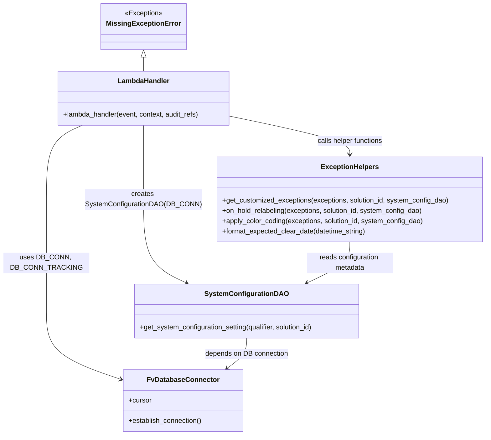

# Diagram: entity_core/entity_service/entity_service/entity/exception/get_exception.py


> Auto-generated by Obscura crawlers

## Diagram 1

```mermaid
flowchart TD
Start([Lambda invoked])
Validate[Check solution_id or internal_entity_id]
Validate -->|missing| BadReq[Raise BadRequestError]
Validate -->|present| DB_CONN[Establish DB_CONN]
DB_CONN --> Params[Get features, path & query parameters]
Params --> OrgType{Organization type?}
OrgType -->|Dealer or dealerOrgId| DealerAuth[entity_dealer_authorization -> may set solution_id]
OrgType -->|Carrier/Partner| CarrierAuth[entity_carrier_authorization -> set solution_id]
OrgType --> AfterAuth[Proceed]
AfterAuth --> InternalCheck{internal_entity_id present?}
InternalCheck -->|Yes| GetForInternal[get_exceptions_for_entity(cursor, internal_ids=internal_entity_id, is_dealer=True)]
GetForInternal --> Sort[Sort by activatedEventDate]
Sort --> Customize[get_customized_exceptions(sorted_exceptions, solution_id, SystemConfigurationDAO(DB_CONN))]
Customize --> ReturnInternal[Return response 200]
InternalCheck -->|No| EntityIdCheck{entity_id is None?}
EntityIdCheck -->|Yes| CountPath[Handle count for solution_id]
CountPath --> Audit[Update audit_refs with solution_id]
CountPath -->|Non-dealer & no dealer_org_id| TrackingDB[Establish DB_CONN_TRACKING and query filter_result_lookup]
TrackingDB -->|has_stored_data| ReturnStored[Return stored json_dumps(resp)]
TrackingDB -->|no stored data| GetCounts[get_exception_counts(cursor, solution_id, status, lifecycle_state)]
GetCounts --> Translate[field_name_translator(camel_to_snake)]
Translate --> ReturnCounts[Return json_dumps(resp)]
EntityIdCheck -->|No| DetailPath[entity_id provided -> update audit_refs]
DetailPath --> DetailTry{exception_id present?}
DetailTry -->|Yes| GetException[get_exception(cursor, exception_id, solution_id, entity_id)]
DetailTry -->|No| GetExceptions[get_exceptions_for_entity(cursor, solution_id, entity_id, status)]
GetException --> Color[apply_color_coding(retval, solution_id, SystemConfigurationDAO(DB_CONN))]
GetExceptions --> Color
Color -->|retval None & exception_id| NotFound[Raise NotFoundError]
Color --> ReturnDetail[Return json_dumps(retval) 200]
DBError[psycopg2.Error -> raise DatabaseError]:::error
GetCounts --> DBError
GetException --> DBError
GetExceptions --> DBError
classDef error fill:#fdd,stroke:#900
```

> SVG rendering failed for this diagram.

## Diagram 2



### SVG

<svg id="container" width="1124.15625" xmlns="http://www.w3.org/2000/svg" class="classDiagram" height="1014" viewBox="0 0 1124.15625 1014" role="graphics-document document" aria-roledescription="class"><style>#container{font-family:"trebuchet ms",verdana,arial,sans-serif;font-size:16px;fill:#333;}@keyframes edge-animation-frame{from{stroke-dashoffset:0;}}@keyframes dash{to{stroke-dashoffset:0;}}#container .edge-animation-slow{stroke-dasharray:9,5!important;stroke-dashoffset:900;animation:dash 50s linear infinite;stroke-linecap:round;}#container .edge-animation-fast{stroke-dasharray:9,5!important;stroke-dashoffset:900;animation:dash 20s linear infinite;stroke-linecap:round;}#container .error-icon{fill:#552222;}#container .error-text{fill:#552222;stroke:#552222;}#container .edge-thickness-normal{stroke-width:1px;}#container .edge-thickness-thick{stroke-width:3.5px;}#container .edge-pattern-solid{stroke-dasharray:0;}#container .edge-thickness-invisible{stroke-width:0;fill:none;}#container .edge-pattern-dashed{stroke-dasharray:3;}#container .edge-pattern-dotted{stroke-dasharray:2;}#container .marker{fill:#333333;stroke:#333333;}#container .marker.cross{stroke:#333333;}#container svg{font-family:"trebuchet ms",verdana,arial,sans-serif;font-size:16px;}#container p{margin:0;}#container g.classGroup text{fill:#9370DB;stroke:none;font-family:"trebuchet ms",verdana,arial,sans-serif;font-size:10px;}#container g.classGroup text .title{font-weight:bolder;}#container .nodeLabel,#container .edgeLabel{color:#131300;}#container .edgeLabel .label rect{fill:#ECECFF;}#container .label text{fill:#131300;}#container .labelBkg{background:#ECECFF;}#container .edgeLabel .label span{background:#ECECFF;}#container .classTitle{font-weight:bolder;}#container .node rect,#container .node circle,#container .node ellipse,#container .node polygon,#container .node path{fill:#ECECFF;stroke:#9370DB;stroke-width:1px;}#container .divider{stroke:#9370DB;stroke-width:1;}#container g.clickable{cursor:pointer;}#container g.classGroup rect{fill:#ECECFF;stroke:#9370DB;}#container g.classGroup line{stroke:#9370DB;stroke-width:1;}#container .classLabel .box{stroke:none;stroke-width:0;fill:#ECECFF;opacity:0.5;}#container .classLabel .label{fill:#9370DB;font-size:10px;}#container .relation{stroke:#333333;stroke-width:1;fill:none;}#container .dashed-line{stroke-dasharray:3;}#container .dotted-line{stroke-dasharray:1 2;}#container #compositionStart,#container .composition{fill:#333333!important;stroke:#333333!important;stroke-width:1;}#container #compositionEnd,#container .composition{fill:#333333!important;stroke:#333333!important;stroke-width:1;}#container #dependencyStart,#container .dependency{fill:#333333!important;stroke:#333333!important;stroke-width:1;}#container #dependencyStart,#container .dependency{fill:#333333!important;stroke:#333333!important;stroke-width:1;}#container #extensionStart,#container .extension{fill:transparent!important;stroke:#333333!important;stroke-width:1;}#container #extensionEnd,#container .extension{fill:transparent!important;stroke:#333333!important;stroke-width:1;}#container #aggregationStart,#container .aggregation{fill:transparent!important;stroke:#333333!important;stroke-width:1;}#container #aggregationEnd,#container .aggregation{fill:transparent!important;stroke:#333333!important;stroke-width:1;}#container #lollipopStart,#container .lollipop{fill:#ECECFF!important;stroke:#333333!important;stroke-width:1;}#container #lollipopEnd,#container .lollipop{fill:#ECECFF!important;stroke:#333333!important;stroke-width:1;}#container .edgeTerminals{font-size:11px;line-height:initial;}#container .classTitleText{text-anchor:middle;font-size:18px;fill:#333;}#container .label-icon{display:inline-block;height:1em;overflow:visible;vertical-align:-0.125em;}#container .node .label-icon path{fill:currentColor;stroke:revert;stroke-width:revert;}#container :root{--mermaid-font-family:"trebuchet ms",verdana,arial,sans-serif;}</style><g><defs><marker id="container_class-aggregationStart" class="marker aggregation class" refX="18" refY="7" markerWidth="190" markerHeight="240" orient="auto"><path d="M 18,7 L9,13 L1,7 L9,1 Z"></path></marker></defs><defs><marker id="container_class-aggregationEnd" class="marker aggregation class" refX="1" refY="7" markerWidth="20" markerHeight="28" orient="auto"><path d="M 18,7 L9,13 L1,7 L9,1 Z"></path></marker></defs><defs><marker id="container_class-extensionStart" class="marker extension class" refX="18" refY="7" markerWidth="190" markerHeight="240" orient="auto"><path d="M 1,7 L18,13 V 1 Z"></path></marker></defs><defs><marker id="container_class-extensionEnd" class="marker extension class" refX="1" refY="7" markerWidth="20" markerHeight="28" orient="auto"><path d="M 1,1 V 13 L18,7 Z"></path></marker></defs><defs><marker id="container_class-compositionStart" class="marker composition class" refX="18" refY="7" markerWidth="190" markerHeight="240" orient="auto"><path d="M 18,7 L9,13 L1,7 L9,1 Z"></path></marker></defs><defs><marker id="container_class-compositionEnd" class="marker composition class" refX="1" refY="7" markerWidth="20" markerHeight="28" orient="auto"><path d="M 18,7 L9,13 L1,7 L9,1 Z"></path></marker></defs><defs><marker id="container_class-dependencyStart" class="marker dependency class" refX="6" refY="7" markerWidth="190" markerHeight="240" orient="auto"><path d="M 5,7 L9,13 L1,7 L9,1 Z"></path></marker></defs><defs><marker id="container_class-dependencyEnd" class="marker dependency class" refX="13" refY="7" markerWidth="20" markerHeight="28" orient="auto"><path d="M 18,7 L9,13 L14,7 L9,1 Z"></path></marker></defs><defs><marker id="container_class-lollipopStart" class="marker lollipop class" refX="13" refY="7" markerWidth="190" markerHeight="240" orient="auto"><circle stroke="black" fill="transparent" cx="7" cy="7" r="6"></circle></marker></defs><defs><marker id="container_class-lollipopEnd" class="marker lollipop class" refX="1" refY="7" markerWidth="190" markerHeight="240" orient="auto"><circle stroke="black" fill="transparent" cx="7" cy="7" r="6"></circle></marker></defs><g class="root"><g class="clusters"></g><g class="edgePaths"><path d="M190.842,292L177.035,298.167C163.228,304.333,135.614,316.667,121.807,345.5C108,374.333,108,419.667,108,467C108,514.333,108,563.667,108,607C108,650.333,108,687.667,108,723C108,758.333,108,791.667,135.978,818.113C163.956,844.56,219.912,864.12,247.889,873.9L275.867,883.68" id="id_LambdaHandler_FvDatabaseConnector_1" class="edge-thickness-normal edge-pattern-solid relation" style=";;;" data-edge="true" data-et="edge" data-id="id_LambdaHandler_FvDatabaseConnector_1" data-points="W3sieCI6MTkwLjg0MjQyMTg3NSwieSI6MjkyfSx7IngiOjEwOCwieSI6MzI5fSx7IngiOjEwOCwieSI6NDY1fSx7IngiOjEwOCwieSI6NjEzfSx7IngiOjEwOCwieSI6NzI1fSx7IngiOjEwOCwieSI6ODI1fSx7IngiOjI4MS41MzEyNSwieSI6ODg1LjY2MDM5NDYxMzIxNjV9XQ==" marker-end="url(#container_class-dependencyEnd)"></path><path d="M331.898,292L331.898,298.167C331.898,304.333,331.898,316.667,331.898,345.5C331.898,374.333,331.898,419.667,331.898,467C331.898,514.333,331.898,563.667,348.286,596.073C364.674,628.479,397.45,643.958,413.838,651.698L430.226,659.438" id="id_LambdaHandler_SystemConfigurationDAO_2" class="edge-thickness-normal edge-pattern-solid relation" style=";;;" data-edge="true" data-et="edge" data-id="id_LambdaHandler_SystemConfigurationDAO_2" data-points="W3sieCI6MzMxLjg5ODQzNzUsInkiOjI5Mn0seyJ4IjozMzEuODk4NDM3NSwieSI6MzI5fSx7IngiOjMzMS44OTg0Mzc1LCJ5Ijo0NjV9LHsieCI6MzMxLjg5ODQzNzUsInkiOjYxM30seyJ4Ijo0MzUuNjUwODc4OTA2MjUsInkiOjY2Mn1d" marker-end="url(#container_class-dependencyEnd)"></path><path d="M533.852,271.579L579.242,281.15C624.633,290.72,715.414,309.86,760.805,324.597C806.195,339.333,806.195,349.667,806.195,354.833L806.195,360" id="id_LambdaHandler_ExceptionHelpers_3" class="edge-thickness-normal edge-pattern-solid relation" style=";;;" data-edge="true" data-et="edge" data-id="id_LambdaHandler_ExceptionHelpers_3" data-points="W3sieCI6NTMzLjg1MTU2MjUsInkiOjI3MS41Nzk0NzYxOTgzMTk4N30seyJ4Ijo4MDYuMTk1MzEyNSwieSI6MzI5fSx7IngiOjgwNi4xOTUzMTI1LCJ5IjozNjZ9XQ==" marker-end="url(#container_class-dependencyEnd)"></path><path d="M806.195,564L806.195,572.167C806.195,580.333,806.195,596.667,789.807,612.573C773.42,628.479,740.644,643.958,724.256,651.698L707.868,659.438" id="id_ExceptionHelpers_SystemConfigurationDAO_4" class="edge-thickness-normal edge-pattern-solid relation" style=";;;" data-edge="true" data-et="edge" data-id="id_ExceptionHelpers_SystemConfigurationDAO_4" data-points="W3sieCI6ODA2LjE5NTMxMjUsInkiOjU2NH0seyJ4Ijo4MDYuMTk1MzEyNSwieSI6NjEzfSx7IngiOjcwMi40NDI4NzEwOTM3NSwieSI6NjYyfV0=" marker-end="url(#container_class-dependencyEnd)"></path><path d="M569.047,788L569.047,794.167C569.047,800.333,569.047,812.667,561.412,824.41C553.777,836.154,538.506,847.307,530.871,852.884L523.236,858.461" id="id_SystemConfigurationDAO_FvDatabaseConnector_5" class="edge-thickness-normal edge-pattern-solid relation" style=";;;" data-edge="true" data-et="edge" data-id="id_SystemConfigurationDAO_FvDatabaseConnector_5" data-points="W3sieCI6NTY5LjA0Njg3NSwieSI6Nzg4fSx7IngiOjU2OS4wNDY4NzUsInkiOjgyNX0seyJ4Ijo1MTguMzkwNjYwODM3MTU2LCJ5Ijo4NjJ9XQ==" marker-end="url(#container_class-dependencyEnd)"></path><path d="M331.898,133.25L331.898,134.542C331.898,135.833,331.898,138.417,331.898,143.875C331.898,149.333,331.898,157.667,331.898,161.833L331.898,166" id="id_MissingExceptionError_LambdaHandler_6" class="edge-thickness-normal edge-pattern-solid relation" style=";;;" data-edge="true" data-et="edge" data-id="id_MissingExceptionError_LambdaHandler_6" data-points="W3sieCI6MzMxLjg5ODQzNzUsInkiOjExNn0seyJ4IjozMzEuODk4NDM3NSwieSI6MTQxfSx7IngiOjMzMS44OTg0Mzc1LCJ5IjoxNjZ9XQ==" marker-start="url(#container_class-extensionStart)"></path></g><g class="edgeLabels"><g class="edgeLabel" transform="translate(108, 613)"><g class="label" data-id="id_LambdaHandler_FvDatabaseConnector_1" transform="translate(-100, -24)"><foreignObject width="200" height="48"><div xmlns="http://www.w3.org/1999/xhtml" class="labelBkg" style="display: table; white-space: break-spaces; line-height: 1.5; max-width: 200px; text-align: center; width: 200px;"><span class="edgeLabel"><p>uses DB_CONN, DB_CONN_TRACKING</p></span></div></foreignObject></g></g><g class="edgeLabel" transform="translate(331.8984375, 465)"><g class="label" data-id="id_LambdaHandler_SystemConfigurationDAO_2" transform="translate(-129.3359375, -24)"><foreignObject width="258.671875" height="48"><div xmlns="http://www.w3.org/1999/xhtml" class="labelBkg" style="display: table; white-space: break-spaces; line-height: 1.5; max-width: 200px; text-align: center; width: 200px;"><span class="edgeLabel"><p>creates SystemConfigurationDAO(DB_CONN)</p></span></div></foreignObject></g></g><g class="edgeLabel" transform="translate(806.1953125, 329)"><g class="label" data-id="id_LambdaHandler_ExceptionHelpers_3" transform="translate(-78.3671875, -12)"><foreignObject width="156.734375" height="24"><div xmlns="http://www.w3.org/1999/xhtml" class="labelBkg" style="display: table-cell; white-space: nowrap; line-height: 1.5; max-width: 200px; text-align: center;"><span class="edgeLabel"><p>calls helper functions</p></span></div></foreignObject></g></g><g class="edgeLabel" transform="translate(806.1953125, 613)"><g class="label" data-id="id_ExceptionHelpers_SystemConfigurationDAO_4" transform="translate(-100, -24)"><foreignObject width="200" height="48"><div xmlns="http://www.w3.org/1999/xhtml" class="labelBkg" style="display: table; white-space: break-spaces; line-height: 1.5; max-width: 200px; text-align: center; width: 200px;"><span class="edgeLabel"><p>reads configuration metadata</p></span></div></foreignObject></g></g><g class="edgeLabel" transform="translate(569.046875, 825)"><g class="label" data-id="id_SystemConfigurationDAO_FvDatabaseConnector_5" transform="translate(-97.6015625, -12)"><foreignObject width="195.203125" height="24"><div xmlns="http://www.w3.org/1999/xhtml" class="labelBkg" style="display: table-cell; white-space: nowrap; line-height: 1.5; max-width: 200px; text-align: center;"><span class="edgeLabel"><p>depends on DB connection</p></span></div></foreignObject></g></g><g class="edgeLabel"><g class="label" data-id="id_MissingExceptionError_LambdaHandler_6" transform="translate(0, 0)"><foreignObject width="0" height="0"><div xmlns="http://www.w3.org/1999/xhtml" class="labelBkg" style="display: table-cell; white-space: nowrap; line-height: 1.5; max-width: 200px; text-align: center;"><span class="edgeLabel"></span></div></foreignObject></g></g></g><g class="nodes"><g class="node default" id="classId-FvDatabaseConnector-0" transform="translate(419.81640625, 934)"><g class="basic label-container"><path d="M-138.28515625 -72 L138.28515625 -72 L138.28515625 72 L-138.28515625 72" stroke="none" stroke-width="0" fill="#ECECFF" style=""></path><path d="M-138.28515625 -72 C-48.56250330298042 -72, 41.160149644039166 -72, 138.28515625 -72 M-138.28515625 -72 C-30.519926231491652 -72, 77.2453037870167 -72, 138.28515625 -72 M138.28515625 -72 C138.28515625 -26.813793503345373, 138.28515625 18.372412993309254, 138.28515625 72 M138.28515625 -72 C138.28515625 -33.349856348988524, 138.28515625 5.3002873020229515, 138.28515625 72 M138.28515625 72 C77.00071359393854 72, 15.716270937877098 72, -138.28515625 72 M138.28515625 72 C52.530020905930655 72, -33.22511443813869 72, -138.28515625 72 M-138.28515625 72 C-138.28515625 17.238730730113822, -138.28515625 -37.522538539772356, -138.28515625 -72 M-138.28515625 72 C-138.28515625 42.612137260984476, -138.28515625 13.224274521968951, -138.28515625 -72" stroke="#9370DB" stroke-width="1.3" fill="none" stroke-dasharray="0 0" style=""></path></g><g class="annotation-group text" transform="translate(0, -48)"></g><g class="label-group text" transform="translate(-79.3046875, -48)"><g class="label" style="font-weight: bolder" transform="translate(0,-12)"><foreignObject width="158.609375" height="24"><div xmlns="http://www.w3.org/1999/xhtml" style="display: table-cell; white-space: nowrap; line-height: 1.5; max-width: 207px; text-align: center;"><span class="nodeLabel markdown-node-label" style=""><p>FvDatabaseConnector</p></span></div></foreignObject></g></g><g class="members-group text" transform="translate(-126.28515625, 0)"><g class="label" style="" transform="translate(0,-12)"><foreignObject width="53.71875" height="24"><div xmlns="http://www.w3.org/1999/xhtml" style="display: table-cell; white-space: nowrap; line-height: 1.5; max-width: 112px; text-align: center;"><span class="nodeLabel markdown-node-label" style=""><p>+cursor</p></span></div></foreignObject></g></g><g class="methods-group text" transform="translate(-126.28515625, 48)"><g class="label" style="" transform="translate(0,-12)"><foreignObject width="173.265625" height="24"><div xmlns="http://www.w3.org/1999/xhtml" style="display: table-cell; white-space: nowrap; line-height: 1.5; max-width: 231px; text-align: center;"><span class="nodeLabel markdown-node-label" style=""><p>+establish_connection()</p></span></div></foreignObject></g></g><g class="divider" style=""><path d="M-138.28515625 -24 C-66.63145815383862 -24, 5.022239942322756 -24, 138.28515625 -24 M-138.28515625 -24 C-61.452741253762994 -24, 15.379673742474012 -24, 138.28515625 -24" stroke="#9370DB" stroke-width="1.3" fill="none" stroke-dasharray="0 0" style=""></path></g><g class="divider" style=""><path d="M-138.28515625 24 C-36.17845981940211 24, 65.92823661119579 24, 138.28515625 24 M-138.28515625 24 C-49.61575642967222 24, 39.053643390655566 24, 138.28515625 24" stroke="#9370DB" stroke-width="1.3" fill="none" stroke-dasharray="0 0" style=""></path></g></g><g class="node default" id="classId-SystemConfigurationDAO-1" transform="translate(569.046875, 725)"><g class="basic label-container"><path d="M-263.4609375 -63 L263.4609375 -63 L263.4609375 63 L-263.4609375 63" stroke="none" stroke-width="0" fill="#ECECFF" style=""></path><path d="M-263.4609375 -63 C-151.35618721674393 -63, -39.251436933487895 -63, 263.4609375 -63 M-263.4609375 -63 C-97.60939368748237 -63, 68.24215012503527 -63, 263.4609375 -63 M263.4609375 -63 C263.4609375 -23.106838727238014, 263.4609375 16.786322545523973, 263.4609375 63 M263.4609375 -63 C263.4609375 -31.7843209820706, 263.4609375 -0.5686419641412002, 263.4609375 63 M263.4609375 63 C66.00933318976723 63, -131.44227112046553 63, -263.4609375 63 M263.4609375 63 C113.18988248833045 63, -37.08117252333909 63, -263.4609375 63 M-263.4609375 63 C-263.4609375 22.31076525340886, -263.4609375 -18.37846949318228, -263.4609375 -63 M-263.4609375 63 C-263.4609375 24.29199008213235, -263.4609375 -14.416019835735298, -263.4609375 -63" stroke="#9370DB" stroke-width="1.3" fill="none" stroke-dasharray="0 0" style=""></path></g><g class="annotation-group text" transform="translate(0, -39)"></g><g class="label-group text" transform="translate(-91.21875, -39)"><g class="label" style="font-weight: bolder" transform="translate(0,-12)"><foreignObject width="182.4375" height="24"><div xmlns="http://www.w3.org/1999/xhtml" style="display: table-cell; white-space: nowrap; line-height: 1.5; max-width: 229px; text-align: center;"><span class="nodeLabel markdown-node-label" style=""><p>SystemConfigurationDAO</p></span></div></foreignObject></g></g><g class="members-group text" transform="translate(-251.4609375, 9)"></g><g class="methods-group text" transform="translate(-251.4609375, 39)"><g class="label" style="" transform="translate(0,-12)"><foreignObject width="411.703125" height="24"><div xmlns="http://www.w3.org/1999/xhtml" style="display: table-cell; white-space: nowrap; line-height: 1.5; max-width: 469px; text-align: center;"><span class="nodeLabel markdown-node-label" style=""><p>+get_system_configuration_setting(qualifier, solution_id)</p></span></div></foreignObject></g></g><g class="divider" style=""><path d="M-263.4609375 -15 C-90.3469743869176 -15, 82.76698872616481 -15, 263.4609375 -15 M-263.4609375 -15 C-136.4128710859228 -15, -9.364804671845576 -15, 263.4609375 -15" stroke="#9370DB" stroke-width="1.3" fill="none" stroke-dasharray="0 0" style=""></path></g><g class="divider" style=""><path d="M-263.4609375 9 C-156.98266101451537 9, -50.50438452903077 9, 263.4609375 9 M-263.4609375 9 C-113.39550192451341 9, 36.66993365097318 9, 263.4609375 9" stroke="#9370DB" stroke-width="1.3" fill="none" stroke-dasharray="0 0" style=""></path></g></g><g class="node default" id="classId-MissingExceptionError-2" transform="translate(331.8984375, 62)"><g class="basic label-container"><path d="M-93.3828125 -54 L93.3828125 -54 L93.3828125 54 L-93.3828125 54" stroke="none" stroke-width="0" fill="#ECECFF" style=""></path><path d="M-93.3828125 -54 C-34.54715137423568 -54, 24.288509751528636 -54, 93.3828125 -54 M-93.3828125 -54 C-49.2835850917209 -54, -5.184357683441803 -54, 93.3828125 -54 M93.3828125 -54 C93.3828125 -14.071986180553608, 93.3828125 25.856027638892783, 93.3828125 54 M93.3828125 -54 C93.3828125 -22.70234343354506, 93.3828125 8.59531313290988, 93.3828125 54 M93.3828125 54 C36.31347077380902 54, -20.755870952381954 54, -93.3828125 54 M93.3828125 54 C23.295000261658785 54, -46.79281197668243 54, -93.3828125 54 M-93.3828125 54 C-93.3828125 31.799035043695568, -93.3828125 9.598070087391136, -93.3828125 -54 M-93.3828125 54 C-93.3828125 15.780258535333402, -93.3828125 -22.439482929333195, -93.3828125 -54" stroke="#9370DB" stroke-width="1.3" fill="none" stroke-dasharray="0 0" style=""></path></g><g class="annotation-group text" transform="translate(-44.5, -30)"><g class="label" style="" transform="translate(0,-12)"><foreignObject width="89" height="24"><div xmlns="http://www.w3.org/1999/xhtml" style="display: table-cell; white-space: nowrap; line-height: 1.5; max-width: 139px; text-align: center;"><span class="nodeLabel markdown-node-label" style=""><p>«Exception»</p></span></div></foreignObject></g></g><g class="label-group text" transform="translate(-81.3828125, -6)"><g class="label" style="font-weight: bolder" transform="translate(0,-12)"><foreignObject width="162.765625" height="24"><div xmlns="http://www.w3.org/1999/xhtml" style="display: table-cell; white-space: nowrap; line-height: 1.5; max-width: 211px; text-align: center;"><span class="nodeLabel markdown-node-label" style=""><p>MissingExceptionError</p></span></div></foreignObject></g></g><g class="members-group text" transform="translate(-81.3828125, 42)"></g><g class="methods-group text" transform="translate(-81.3828125, 72)"></g><g class="divider" style=""><path d="M-93.3828125 18 C-35.78293742599813 18, 21.816937648003744 18, 93.3828125 18 M-93.3828125 18 C-26.756020255399747 18, 39.870771989200506 18, 93.3828125 18" stroke="#9370DB" stroke-width="1.3" fill="none" stroke-dasharray="0 0" style=""></path></g><g class="divider" style=""><path d="M-93.3828125 36 C-40.30836572643278 36, 12.766081047134435 36, 93.3828125 36 M-93.3828125 36 C-22.87126817250052 36, 47.64027615499896 36, 93.3828125 36" stroke="#9370DB" stroke-width="1.3" fill="none" stroke-dasharray="0 0" style=""></path></g></g><g class="node default" id="classId-LambdaHandler-3" transform="translate(331.8984375, 229)"><g class="basic label-container"><path d="M-201.953125 -63 L201.953125 -63 L201.953125 63 L-201.953125 63" stroke="none" stroke-width="0" fill="#ECECFF" style=""></path><path d="M-201.953125 -63 C-92.47411093047779 -63, 17.004903139044416 -63, 201.953125 -63 M-201.953125 -63 C-50.460251736876955 -63, 101.03262152624609 -63, 201.953125 -63 M201.953125 -63 C201.953125 -31.295813857995956, 201.953125 0.4083722840080881, 201.953125 63 M201.953125 -63 C201.953125 -33.740397021387366, 201.953125 -4.4807940427747255, 201.953125 63 M201.953125 63 C50.22652095907992 63, -101.50008308184016 63, -201.953125 63 M201.953125 63 C49.52128184963328 63, -102.91056130073343 63, -201.953125 63 M-201.953125 63 C-201.953125 34.36186326825816, -201.953125 5.723726536516317, -201.953125 -63 M-201.953125 63 C-201.953125 26.046138784947864, -201.953125 -10.907722430104272, -201.953125 -63" stroke="#9370DB" stroke-width="1.3" fill="none" stroke-dasharray="0 0" style=""></path></g><g class="annotation-group text" transform="translate(0, -39)"></g><g class="label-group text" transform="translate(-58.21875, -39)"><g class="label" style="font-weight: bolder" transform="translate(0,-12)"><foreignObject width="116.4375" height="24"><div xmlns="http://www.w3.org/1999/xhtml" style="display: table-cell; white-space: nowrap; line-height: 1.5; max-width: 167px; text-align: center;"><span class="nodeLabel markdown-node-label" style=""><p>LambdaHandler</p></span></div></foreignObject></g></g><g class="members-group text" transform="translate(-189.953125, 9)"></g><g class="methods-group text" transform="translate(-189.953125, 39)"><g class="label" style="" transform="translate(0,-12)"><foreignObject width="321.6875" height="24"><div xmlns="http://www.w3.org/1999/xhtml" style="display: table-cell; white-space: nowrap; line-height: 1.5; max-width: 379px; text-align: center;"><span class="nodeLabel markdown-node-label" style=""><p>+lambda_handler(event, context, audit_refs)</p></span></div></foreignObject></g></g><g class="divider" style=""><path d="M-201.953125 -15 C-76.03262931348121 -15, 49.88786637303758 -15, 201.953125 -15 M-201.953125 -15 C-89.30475217485984 -15, 23.343620650280315 -15, 201.953125 -15" stroke="#9370DB" stroke-width="1.3" fill="none" stroke-dasharray="0 0" style=""></path></g><g class="divider" style=""><path d="M-201.953125 9 C-85.10822372806118 9, 31.736677543877647 9, 201.953125 9 M-201.953125 9 C-68.43003576305435 9, 65.0930534738913 9, 201.953125 9" stroke="#9370DB" stroke-width="1.3" fill="none" stroke-dasharray="0 0" style=""></path></g></g><g class="node default" id="classId-ExceptionHelpers-4" transform="translate(806.1953125, 465)"><g class="basic label-container"><path d="M-309.9609375 -99 L309.9609375 -99 L309.9609375 99 L-309.9609375 99" stroke="none" stroke-width="0" fill="#ECECFF" style=""></path><path d="M-309.9609375 -99 C-171.9626222773668 -99, -33.96430705473358 -99, 309.9609375 -99 M-309.9609375 -99 C-164.42072925289412 -99, -18.88052100578824 -99, 309.9609375 -99 M309.9609375 -99 C309.9609375 -22.844116302750848, 309.9609375 53.311767394498304, 309.9609375 99 M309.9609375 -99 C309.9609375 -38.41144316905486, 309.9609375 22.177113661890274, 309.9609375 99 M309.9609375 99 C114.23020037804343 99, -81.50053674391313 99, -309.9609375 99 M309.9609375 99 C108.90672622099888 99, -92.14748505800225 99, -309.9609375 99 M-309.9609375 99 C-309.9609375 53.39929726451568, -309.9609375 7.798594529031362, -309.9609375 -99 M-309.9609375 99 C-309.9609375 42.09617498404345, -309.9609375 -14.807650031913099, -309.9609375 -99" stroke="#9370DB" stroke-width="1.3" fill="none" stroke-dasharray="0 0" style=""></path></g><g class="annotation-group text" transform="translate(0, -75)"></g><g class="label-group text" transform="translate(-63.984375, -75)"><g class="label" style="font-weight: bolder" transform="translate(0,-12)"><foreignObject width="127.96875" height="24"><div xmlns="http://www.w3.org/1999/xhtml" style="display: table-cell; white-space: nowrap; line-height: 1.5; max-width: 177px; text-align: center;"><span class="nodeLabel markdown-node-label" style=""><p>ExceptionHelpers</p></span></div></foreignObject></g></g><g class="members-group text" transform="translate(-297.9609375, -27)"></g><g class="methods-group text" transform="translate(-297.9609375, 3)"><g class="label" style="" transform="translate(0,-12)"><foreignObject width="531.9375" height="24"><div xmlns="http://www.w3.org/1999/xhtml" style="display: table-cell; white-space: nowrap; line-height: 1.5; max-width: 589px; text-align: center;"><span class="nodeLabel markdown-node-label" style=""><p>+get_customized_exceptions(exceptions, solution_id, system_config_dao)</p></span></div></foreignObject></g><g class="label" style="" transform="translate(0,12)"><foreignObject width="473.71875" height="24"><div xmlns="http://www.w3.org/1999/xhtml" style="display: table-cell; white-space: nowrap; line-height: 1.5; max-width: 531px; text-align: center;"><span class="nodeLabel markdown-node-label" style=""><p>+on_hold_relabeling(exceptions, solution_id, system_config_dao)</p></span></div></foreignObject></g><g class="label" style="" transform="translate(0,36)"><foreignObject width="471.984375" height="24"><div xmlns="http://www.w3.org/1999/xhtml" style="display: table-cell; white-space: nowrap; line-height: 1.5; max-width: 529px; text-align: center;"><span class="nodeLabel markdown-node-label" style=""><p>+apply_color_coding(exceptions, solution_id, system_config_dao)</p></span></div></foreignObject></g><g class="label" style="" transform="translate(0,60)"><foreignObject width="338.890625" height="24"><div xmlns="http://www.w3.org/1999/xhtml" style="display: table-cell; white-space: nowrap; line-height: 1.5; max-width: 396px; text-align: center;"><span class="nodeLabel markdown-node-label" style=""><p>+format_expected_clear_date(datetime_string)</p></span></div></foreignObject></g></g><g class="divider" style=""><path d="M-309.9609375 -51 C-153.63752439911826 -51, 2.6858887017634743 -51, 309.9609375 -51 M-309.9609375 -51 C-76.12942170513821 -51, 157.70209408972357 -51, 309.9609375 -51" stroke="#9370DB" stroke-width="1.3" fill="none" stroke-dasharray="0 0" style=""></path></g><g class="divider" style=""><path d="M-309.9609375 -27 C-63.07881707400401 -27, 183.80330335199199 -27, 309.9609375 -27 M-309.9609375 -27 C-159.68067505397923 -27, -9.400412607958458 -27, 309.9609375 -27" stroke="#9370DB" stroke-width="1.3" fill="none" stroke-dasharray="0 0" style=""></path></g></g></g></g></g></svg>
