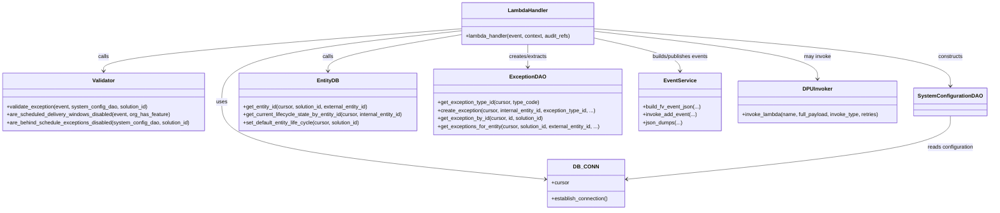
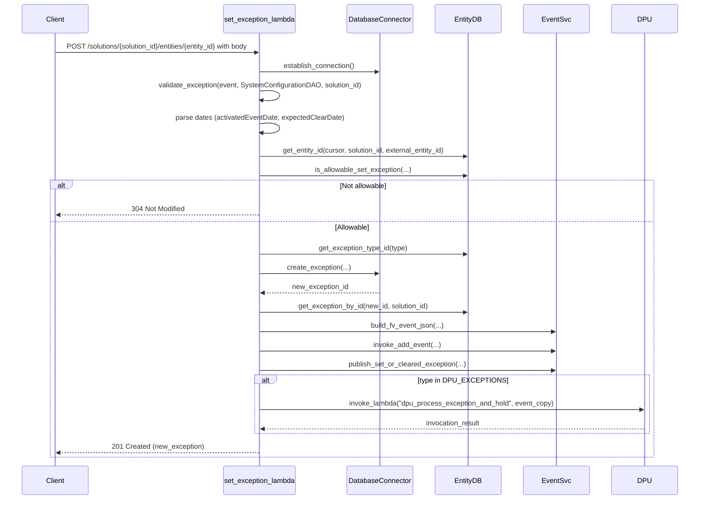

# Diagram: entity_core/entity_service/entity_service/entity/exception/set_exception.py


> Auto-generated by Obscura crawlers

## Diagram 1

```mermaid
flowchart TD
    A[Event received] --> B[Establish DB connection]
    B --> C[Get path params: solution_id, entity_id]
    C --> D[Update audit_refs]
    D --> E[validate_exception(event, system_config_dao, solution_id)]
    E --> F[Parse activatedEventDate / expectedClearDate]
    F --> G[get_entity_id(cursor, solution_id, external_entity_id)]
    G --> H{is_allowable_set_exception(cursor, solution_id, internal_entity_id, group_type)?}
    H -- No --> I[Return 304 Not Modified]
    H -- Yes --> J{get_group_check(cursor, group_type)?}
    J -- False --> K[active_exceptions_of_same_type = get_exceptions_for_entity(...)]
    K -- Found --> L[Raise IntegrityError -> ConflictError]
    K -- Not found --> M[Continue to create exception]
    J -- True --> M
    M --> N[get_exception_type_id(...) & create_exception(...)]
    N --> O[get_exception_by_id(cursor, new_id, solution_id)]
    O --> P[Build fv_event JSON]
    P --> Q[invoke_add_event(event, solution_id, fv_event, entity_id)]
    Q --> R[publish_set_or_cleared_exception(...)]
    R --> S{type in DPU_EXCEPTIONS setting?}
    S -- Yes --> T[Prepare event_copy and invoke dpu_process_exception_and_hold]
    S -- No --> U[Skip DPU invoke]
    T --> V[Return 201 Created with new_exception]
    U --> V
```

> SVG rendering failed for this diagram.

## Diagram 2



### SVG

<svg id="container" width="2991.3125" xmlns="http://www.w3.org/2000/svg" class="classDiagram" height="632" viewBox="0 0 2991.3125 632" role="graphics-document document" aria-roledescription="class"><style>#container{font-family:"trebuchet ms",verdana,arial,sans-serif;font-size:16px;fill:#333;}@keyframes edge-animation-frame{from{stroke-dashoffset:0;}}@keyframes dash{to{stroke-dashoffset:0;}}#container .edge-animation-slow{stroke-dasharray:9,5!important;stroke-dashoffset:900;animation:dash 50s linear infinite;stroke-linecap:round;}#container .edge-animation-fast{stroke-dasharray:9,5!important;stroke-dashoffset:900;animation:dash 20s linear infinite;stroke-linecap:round;}#container .error-icon{fill:#552222;}#container .error-text{fill:#552222;stroke:#552222;}#container .edge-thickness-normal{stroke-width:1px;}#container .edge-thickness-thick{stroke-width:3.5px;}#container .edge-pattern-solid{stroke-dasharray:0;}#container .edge-thickness-invisible{stroke-width:0;fill:none;}#container .edge-pattern-dashed{stroke-dasharray:3;}#container .edge-pattern-dotted{stroke-dasharray:2;}#container .marker{fill:#333333;stroke:#333333;}#container .marker.cross{stroke:#333333;}#container svg{font-family:"trebuchet ms",verdana,arial,sans-serif;font-size:16px;}#container p{margin:0;}#container g.classGroup text{fill:#9370DB;stroke:none;font-family:"trebuchet ms",verdana,arial,sans-serif;font-size:10px;}#container g.classGroup text .title{font-weight:bolder;}#container .nodeLabel,#container .edgeLabel{color:#131300;}#container .edgeLabel .label rect{fill:#ECECFF;}#container .label text{fill:#131300;}#container .labelBkg{background:#ECECFF;}#container .edgeLabel .label span{background:#ECECFF;}#container .classTitle{font-weight:bolder;}#container .node rect,#container .node circle,#container .node ellipse,#container .node polygon,#container .node path{fill:#ECECFF;stroke:#9370DB;stroke-width:1px;}#container .divider{stroke:#9370DB;stroke-width:1;}#container g.clickable{cursor:pointer;}#container g.classGroup rect{fill:#ECECFF;stroke:#9370DB;}#container g.classGroup line{stroke:#9370DB;stroke-width:1;}#container .classLabel .box{stroke:none;stroke-width:0;fill:#ECECFF;opacity:0.5;}#container .classLabel .label{fill:#9370DB;font-size:10px;}#container .relation{stroke:#333333;stroke-width:1;fill:none;}#container .dashed-line{stroke-dasharray:3;}#container .dotted-line{stroke-dasharray:1 2;}#container #compositionStart,#container .composition{fill:#333333!important;stroke:#333333!important;stroke-width:1;}#container #compositionEnd,#container .composition{fill:#333333!important;stroke:#333333!important;stroke-width:1;}#container #dependencyStart,#container .dependency{fill:#333333!important;stroke:#333333!important;stroke-width:1;}#container #dependencyStart,#container .dependency{fill:#333333!important;stroke:#333333!important;stroke-width:1;}#container #extensionStart,#container .extension{fill:transparent!important;stroke:#333333!important;stroke-width:1;}#container #extensionEnd,#container .extension{fill:transparent!important;stroke:#333333!important;stroke-width:1;}#container #aggregationStart,#container .aggregation{fill:transparent!important;stroke:#333333!important;stroke-width:1;}#container #aggregationEnd,#container .aggregation{fill:transparent!important;stroke:#333333!important;stroke-width:1;}#container #lollipopStart,#container .lollipop{fill:#ECECFF!important;stroke:#333333!important;stroke-width:1;}#container #lollipopEnd,#container .lollipop{fill:#ECECFF!important;stroke:#333333!important;stroke-width:1;}#container .edgeTerminals{font-size:11px;line-height:initial;}#container .classTitleText{text-anchor:middle;font-size:18px;fill:#333;}#container .label-icon{display:inline-block;height:1em;overflow:visible;vertical-align:-0.125em;}#container .node .label-icon path{fill:currentColor;stroke:revert;stroke-width:revert;}#container :root{--mermaid-font-family:"trebuchet ms",verdana,arial,sans-serif;}</style><g><defs><marker id="container_class-aggregationStart" class="marker aggregation class" refX="18" refY="7" markerWidth="190" markerHeight="240" orient="auto"><path d="M 18,7 L9,13 L1,7 L9,1 Z"></path></marker></defs><defs><marker id="container_class-aggregationEnd" class="marker aggregation class" refX="1" refY="7" markerWidth="20" markerHeight="28" orient="auto"><path d="M 18,7 L9,13 L1,7 L9,1 Z"></path></marker></defs><defs><marker id="container_class-extensionStart" class="marker extension class" refX="18" refY="7" markerWidth="190" markerHeight="240" orient="auto"><path d="M 1,7 L18,13 V 1 Z"></path></marker></defs><defs><marker id="container_class-extensionEnd" class="marker extension class" refX="1" refY="7" markerWidth="20" markerHeight="28" orient="auto"><path d="M 1,1 V 13 L18,7 Z"></path></marker></defs><defs><marker id="container_class-compositionStart" class="marker composition class" refX="18" refY="7" markerWidth="190" markerHeight="240" orient="auto"><path d="M 18,7 L9,13 L1,7 L9,1 Z"></path></marker></defs><defs><marker id="container_class-compositionEnd" class="marker composition class" refX="1" refY="7" markerWidth="20" markerHeight="28" orient="auto"><path d="M 18,7 L9,13 L1,7 L9,1 Z"></path></marker></defs><defs><marker id="container_class-dependencyStart" class="marker dependency class" refX="6" refY="7" markerWidth="190" markerHeight="240" orient="auto"><path d="M 5,7 L9,13 L1,7 L9,1 Z"></path></marker></defs><defs><marker id="container_class-dependencyEnd" class="marker dependency class" refX="13" refY="7" markerWidth="20" markerHeight="28" orient="auto"><path d="M 18,7 L9,13 L14,7 L9,1 Z"></path></marker></defs><defs><marker id="container_class-lollipopStart" class="marker lollipop class" refX="13" refY="7" markerWidth="190" markerHeight="240" orient="auto"><circle stroke="black" fill="transparent" cx="7" cy="7" r="6"></circle></marker></defs><defs><marker id="container_class-lollipopEnd" class="marker lollipop class" refX="1" refY="7" markerWidth="190" markerHeight="240" orient="auto"><circle stroke="black" fill="transparent" cx="7" cy="7" r="6"></circle></marker></defs><g class="root"><g class="clusters"></g><g class="edgePaths"><path d="M1407.309,92.607L1285.188,105.672C1163.068,118.738,918.827,144.869,796.706,180.601C674.586,216.333,674.586,261.667,674.586,307C674.586,352.333,674.586,397.667,838.077,436.493C1001.568,475.32,1328.551,507.64,1492.042,523.8L1655.533,539.96" id="id_LambdaHandler_DB_CONN_1" class="edge-thickness-normal edge-pattern-solid relation" style=";;;" data-edge="true" data-et="edge" data-id="id_LambdaHandler_DB_CONN_1" data-points="W3sieCI6MTQwNy4zMDg1OTM3NSwieSI6OTIuNjA2NzU3MDIyMTk2MDR9LHsieCI6Njc0LjU4NTkzNzUsInkiOjE3MX0seyJ4Ijo2NzQuNTg1OTM3NSwieSI6MzA3fSx7IngiOjY3NC41ODU5Mzc1LCJ5Ijo0NDN9LHsieCI6MTY2MS41MDM5MDYyNSwieSI6NTQwLjU1MDM3NjM2NTk4NzJ9XQ==" marker-end="url(#container_class-dependencyEnd)"></path><path d="M1811.215,86.891L1989.361,100.91C2167.508,114.928,2523.801,142.964,2701.947,171.649C2880.094,200.333,2880.094,229.667,2880.094,244.333L2880.094,259" id="id_LambdaHandler_SystemConfigurationDAO_2" class="edge-thickness-normal edge-pattern-solid relation" style=";;;" data-edge="true" data-et="edge" data-id="id_LambdaHandler_SystemConfigurationDAO_2" data-points="W3sieCI6MTgxMS4yMTQ4NDM3NSwieSI6ODYuODkxNDA5NzI0ODA1MDR9LHsieCI6Mjg4MC4wOTM3NSwieSI6MTcxfSx7IngiOjI4ODAuMDkzNzUsInkiOjI2NX1d" marker-end="url(#container_class-dependencyEnd)"></path><path d="M1407.309,86.61L1225.348,100.675C1043.388,114.74,679.467,142.87,497.507,164.102C315.547,185.333,315.547,199.667,315.547,206.833L315.547,214" id="id_LambdaHandler_Validator_3" class="edge-thickness-normal edge-pattern-solid relation" style=";;;" data-edge="true" data-et="edge" data-id="id_LambdaHandler_Validator_3" data-points="W3sieCI6MTQwNy4zMDg1OTM3NSwieSI6ODYuNjEwMzI3NTc1MzI2NjJ9LHsieCI6MzE1LjU0Njg3NSwieSI6MTcxfSx7IngiOjMxNS41NDY4NzUsInkiOjIyMH1d" marker-end="url(#container_class-dependencyEnd)"></path><path d="M1407.309,104.117L1339.332,115.264C1271.355,126.411,1135.402,148.706,1067.426,167.02C999.449,185.333,999.449,199.667,999.449,206.833L999.449,214" id="id_LambdaHandler_EntityDB_4" class="edge-thickness-normal edge-pattern-solid relation" style=";;;" data-edge="true" data-et="edge" data-id="id_LambdaHandler_EntityDB_4" data-points="W3sieCI6MTQwNy4zMDg1OTM3NSwieSI6MTA0LjExNzI0OTE1NDQ1MzIyfSx7IngiOjk5OS40NDkyMTg3NSwieSI6MTcxfSx7IngiOjk5OS40NDkyMTg3NSwieSI6MjIwfV0=" marker-end="url(#container_class-dependencyEnd)"></path><path d="M1609.262,134L1609.262,140.167C1609.262,146.333,1609.262,158.667,1609.262,170C1609.262,181.333,1609.262,191.667,1609.262,196.833L1609.262,202" id="id_LambdaHandler_ExceptionDAO_5" class="edge-thickness-normal edge-pattern-solid relation" style=";;;" data-edge="true" data-et="edge" data-id="id_LambdaHandler_ExceptionDAO_5" data-points="W3sieCI6MTYwOS4yNjE3MTg3NSwieSI6MTM0fSx7IngiOjE2MDkuMjYxNzE4NzUsInkiOjE3MX0seyJ4IjoxNjA5LjI2MTcxODc1LCJ5IjoyMDh9XQ==" marker-end="url(#container_class-dependencyEnd)"></path><path d="M1811.215,114.913L1854.205,124.261C1897.195,133.609,1983.176,152.304,2026.166,168.819C2069.156,185.333,2069.156,199.667,2069.156,206.833L2069.156,214" id="id_LambdaHandler_EventService_6" class="edge-thickness-normal edge-pattern-solid relation" style=";;;" data-edge="true" data-et="edge" data-id="id_LambdaHandler_EventService_6" data-points="W3sieCI6MTgxMS4yMTQ4NDM3NSwieSI6MTE0LjkxMjkyMTYxMDc2MzMzfSx7IngiOjIwNjkuMTU2MjUsInkiOjE3MX0seyJ4IjoyMDY5LjE1NjI1LCJ5IjoyMjB9XQ==" marker-end="url(#container_class-dependencyEnd)"></path><path d="M1811.215,94.068L1923.469,106.89C2035.724,119.712,2260.233,145.356,2372.488,169.345C2484.742,193.333,2484.742,215.667,2484.742,226.833L2484.742,238" id="id_LambdaHandler_DPUInvoker_7" class="edge-thickness-normal edge-pattern-solid relation" style=";;;" data-edge="true" data-et="edge" data-id="id_LambdaHandler_DPUInvoker_7" data-points="W3sieCI6MTgxMS4yMTQ4NDM3NSwieSI6OTQuMDY3NjkwNTA5MjI5MzF9LHsieCI6MjQ4NC43NDIxODc1LCJ5IjoxNzF9LHsieCI6MjQ4NC43NDIxODc1LCJ5IjoyNDR9XQ==" marker-end="url(#container_class-dependencyEnd)"></path><path d="M2880.094,349L2880.094,364.667C2880.094,380.333,2880.094,411.667,2716.603,443.493C2553.111,475.32,2226.129,507.64,2062.638,523.8L1899.147,539.96" id="id_SystemConfigurationDAO_DB_CONN_8" class="edge-thickness-normal edge-pattern-solid relation" style=";;;" data-edge="true" data-et="edge" data-id="id_SystemConfigurationDAO_DB_CONN_8" data-points="W3sieCI6Mjg4MC4wOTM3NSwieSI6MzQ5fSx7IngiOjI4ODAuMDkzNzUsInkiOjQ0M30seyJ4IjoxODkzLjE3NTc4MTI1LCJ5Ijo1NDAuNTUwMzc2MzY1OTg3Mn1d" marker-end="url(#container_class-dependencyEnd)"></path></g><g class="edgeLabels"><g class="edgeLabel" transform="translate(674.5859375, 307)"><g class="label" data-id="id_LambdaHandler_DB_CONN_1" transform="translate(-16.4921875, -12)"><foreignObject width="32.984375" height="24"><div xmlns="http://www.w3.org/1999/xhtml" class="labelBkg" style="display: table-cell; white-space: nowrap; line-height: 1.5; max-width: 200px; text-align: center;"><span class="edgeLabel"><p>uses</p></span></div></foreignObject></g></g><g class="edgeLabel" transform="translate(2880.09375, 171)"><g class="label" data-id="id_LambdaHandler_SystemConfigurationDAO_2" transform="translate(-37.84375, -12)"><foreignObject width="75.6875" height="24"><div xmlns="http://www.w3.org/1999/xhtml" class="labelBkg" style="display: table-cell; white-space: nowrap; line-height: 1.5; max-width: 200px; text-align: center;"><span class="edgeLabel"><p>constructs</p></span></div></foreignObject></g></g><g class="edgeLabel" transform="translate(315.546875, 171)"><g class="label" data-id="id_LambdaHandler_Validator_3" transform="translate(-16.4453125, -12)"><foreignObject width="32.890625" height="24"><div xmlns="http://www.w3.org/1999/xhtml" class="labelBkg" style="display: table-cell; white-space: nowrap; line-height: 1.5; max-width: 200px; text-align: center;"><span class="edgeLabel"><p>calls</p></span></div></foreignObject></g></g><g class="edgeLabel" transform="translate(999.44921875, 171)"><g class="label" data-id="id_LambdaHandler_EntityDB_4" transform="translate(-16.4453125, -12)"><foreignObject width="32.890625" height="24"><div xmlns="http://www.w3.org/1999/xhtml" class="labelBkg" style="display: table-cell; white-space: nowrap; line-height: 1.5; max-width: 200px; text-align: center;"><span class="edgeLabel"><p>calls</p></span></div></foreignObject></g></g><g class="edgeLabel" transform="translate(1609.26171875, 171)"><g class="label" data-id="id_LambdaHandler_ExceptionDAO_5" transform="translate(-58.59375, -12)"><foreignObject width="117.1875" height="24"><div xmlns="http://www.w3.org/1999/xhtml" class="labelBkg" style="display: table-cell; white-space: nowrap; line-height: 1.5; max-width: 200px; text-align: center;"><span class="edgeLabel"><p>creates/extracts</p></span></div></foreignObject></g></g><g class="edgeLabel" transform="translate(2069.15625, 171)"><g class="label" data-id="id_LambdaHandler_EventService_6" transform="translate(-87.71875, -12)"><foreignObject width="175.4375" height="24"><div xmlns="http://www.w3.org/1999/xhtml" class="labelBkg" style="display: table-cell; white-space: nowrap; line-height: 1.5; max-width: 200px; text-align: center;"><span class="edgeLabel"><p>builds/publishes events</p></span></div></foreignObject></g></g><g class="edgeLabel" transform="translate(2484.7421875, 171)"><g class="label" data-id="id_LambdaHandler_DPUInvoker_7" transform="translate(-40.9921875, -12)"><foreignObject width="81.984375" height="24"><div xmlns="http://www.w3.org/1999/xhtml" class="labelBkg" style="display: table-cell; white-space: nowrap; line-height: 1.5; max-width: 200px; text-align: center;"><span class="edgeLabel"><p>may invoke</p></span></div></foreignObject></g></g><g class="edgeLabel" transform="translate(2880.09375, 443)"><g class="label" data-id="id_SystemConfigurationDAO_DB_CONN_8" transform="translate(-70.1484375, -12)"><foreignObject width="140.296875" height="24"><div xmlns="http://www.w3.org/1999/xhtml" class="labelBkg" style="display: table-cell; white-space: nowrap; line-height: 1.5; max-width: 200px; text-align: center;"><span class="edgeLabel"><p>reads configuration</p></span></div></foreignObject></g></g></g><g class="nodes"><g class="node default" id="classId-LambdaHandler-0" transform="translate(1609.26171875, 71)"><g class="basic label-container"><path d="M-201.953125 -63 L201.953125 -63 L201.953125 63 L-201.953125 63" stroke="none" stroke-width="0" fill="#ECECFF" style=""></path><path d="M-201.953125 -63 C-44.41298558238438 -63, 113.12715383523124 -63, 201.953125 -63 M-201.953125 -63 C-58.624943673867506 -63, 84.70323765226499 -63, 201.953125 -63 M201.953125 -63 C201.953125 -35.432848976779965, 201.953125 -7.865697953559923, 201.953125 63 M201.953125 -63 C201.953125 -28.605402797899693, 201.953125 5.7891944042006145, 201.953125 63 M201.953125 63 C97.15512697874445 63, -7.6428710425111035 63, -201.953125 63 M201.953125 63 C111.25224595373479 63, 20.55136690746957 63, -201.953125 63 M-201.953125 63 C-201.953125 34.38971808313461, -201.953125 5.779436166269214, -201.953125 -63 M-201.953125 63 C-201.953125 13.420874963711945, -201.953125 -36.15825007257611, -201.953125 -63" stroke="#9370DB" stroke-width="1.3" fill="none" stroke-dasharray="0 0" style=""></path></g><g class="annotation-group text" transform="translate(0, -39)"></g><g class="label-group text" transform="translate(-58.21875, -39)"><g class="label" style="font-weight: bolder" transform="translate(0,-12)"><foreignObject width="116.4375" height="24"><div xmlns="http://www.w3.org/1999/xhtml" style="display: table-cell; white-space: nowrap; line-height: 1.5; max-width: 167px; text-align: center;"><span class="nodeLabel markdown-node-label" style=""><p>LambdaHandler</p></span></div></foreignObject></g></g><g class="members-group text" transform="translate(-189.953125, 9)"></g><g class="methods-group text" transform="translate(-189.953125, 39)"><g class="label" style="" transform="translate(0,-12)"><foreignObject width="321.6875" height="24"><div xmlns="http://www.w3.org/1999/xhtml" style="display: table-cell; white-space: nowrap; line-height: 1.5; max-width: 379px; text-align: center;"><span class="nodeLabel markdown-node-label" style=""><p>+lambda_handler(event, context, audit_refs)</p></span></div></foreignObject></g></g><g class="divider" style=""><path d="M-201.953125 -15 C-72.38707847828476 -15, 57.17896804343047 -15, 201.953125 -15 M-201.953125 -15 C-96.70462378569115 -15, 8.54387742861769 -15, 201.953125 -15" stroke="#9370DB" stroke-width="1.3" fill="none" stroke-dasharray="0 0" style=""></path></g><g class="divider" style=""><path d="M-201.953125 9 C-67.22950437723358 9, 67.49411624553284 9, 201.953125 9 M-201.953125 9 C-58.73312997126814 9, 84.48686505746372 9, 201.953125 9" stroke="#9370DB" stroke-width="1.3" fill="none" stroke-dasharray="0 0" style=""></path></g></g><g class="node default" id="classId-Validator-1" transform="translate(315.546875, 307)"><g class="basic label-container"><path d="M-307.546875 -87 L307.546875 -87 L307.546875 87 L-307.546875 87" stroke="none" stroke-width="0" fill="#ECECFF" style=""></path><path d="M-307.546875 -87 C-150.3409381517661 -87, 6.864998696467808 -87, 307.546875 -87 M-307.546875 -87 C-72.01040640267672 -87, 163.52606219464656 -87, 307.546875 -87 M307.546875 -87 C307.546875 -39.70471090999049, 307.546875 7.590578180019023, 307.546875 87 M307.546875 -87 C307.546875 -31.248648472621383, 307.546875 24.502703054757234, 307.546875 87 M307.546875 87 C62.24074449700572 87, -183.06538600598856 87, -307.546875 87 M307.546875 87 C121.67534459855656 87, -64.19618580288687 87, -307.546875 87 M-307.546875 87 C-307.546875 27.18038626860318, -307.546875 -32.63922746279364, -307.546875 -87 M-307.546875 87 C-307.546875 46.8726001119662, -307.546875 6.7452002239324, -307.546875 -87" stroke="#9370DB" stroke-width="1.3" fill="none" stroke-dasharray="0 0" style=""></path></g><g class="annotation-group text" transform="translate(0, -63)"></g><g class="label-group text" transform="translate(-33.1875, -63)"><g class="label" style="font-weight: bolder" transform="translate(0,-12)"><foreignObject width="66.375" height="24"><div xmlns="http://www.w3.org/1999/xhtml" style="display: table-cell; white-space: nowrap; line-height: 1.5; max-width: 116px; text-align: center;"><span class="nodeLabel markdown-node-label" style=""><p>Validator</p></span></div></foreignObject></g></g><g class="members-group text" transform="translate(-295.546875, -15)"></g><g class="methods-group text" transform="translate(-295.546875, 15)"><g class="label" style="" transform="translate(0,-12)"><foreignObject width="430.796875" height="24"><div xmlns="http://www.w3.org/1999/xhtml" style="display: table-cell; white-space: nowrap; line-height: 1.5; max-width: 488px; text-align: center;"><span class="nodeLabel markdown-node-label" style=""><p>+validate_exception(event, system_config_dao, solution_id)</p></span></div></foreignObject></g><g class="label" style="" transform="translate(0,12)"><foreignObject width="496.71875" height="24"><div xmlns="http://www.w3.org/1999/xhtml" style="display: table-cell; white-space: nowrap; line-height: 1.5; max-width: 554px; text-align: center;"><span class="nodeLabel markdown-node-label" style=""><p>+are_scheduled_delivery_windows_disabled(event, org_has_feature)</p></span></div></foreignObject></g><g class="label" style="" transform="translate(0,36)"><foreignObject width="557.90625" height="24"><div xmlns="http://www.w3.org/1999/xhtml" style="display: table-cell; white-space: nowrap; line-height: 1.5; max-width: 615px; text-align: center;"><span class="nodeLabel markdown-node-label" style=""><p>+are_behind_schedule_exceptions_disabled(system_config_dao, solution_id)</p></span></div></foreignObject></g></g><g class="divider" style=""><path d="M-307.546875 -39 C-136.4186622961302 -39, 34.709550407739584 -39, 307.546875 -39 M-307.546875 -39 C-150.47576409586722 -39, 6.59534680826556 -39, 307.546875 -39" stroke="#9370DB" stroke-width="1.3" fill="none" stroke-dasharray="0 0" style=""></path></g><g class="divider" style=""><path d="M-307.546875 -15 C-149.485572156584 -15, 8.575730686832003 -15, 307.546875 -15 M-307.546875 -15 C-126.32124194985403 -15, 54.904391100291946 -15, 307.546875 -15" stroke="#9370DB" stroke-width="1.3" fill="none" stroke-dasharray="0 0" style=""></path></g></g><g class="node default" id="classId-DB_CONN-2" transform="translate(1777.33984375, 552)"><g class="basic label-container"><path d="M-115.8359375 -72 L115.8359375 -72 L115.8359375 72 L-115.8359375 72" stroke="none" stroke-width="0" fill="#ECECFF" style=""></path><path d="M-115.8359375 -72 C-24.258139523887067 -72, 67.31965845222587 -72, 115.8359375 -72 M-115.8359375 -72 C-41.13550248066146 -72, 33.564932538677084 -72, 115.8359375 -72 M115.8359375 -72 C115.8359375 -28.976933307503728, 115.8359375 14.046133384992544, 115.8359375 72 M115.8359375 -72 C115.8359375 -34.29020746223755, 115.8359375 3.419585075524907, 115.8359375 72 M115.8359375 72 C67.79858230278762 72, 19.761227105575244 72, -115.8359375 72 M115.8359375 72 C46.18556666299426 72, -23.464804174011476 72, -115.8359375 72 M-115.8359375 72 C-115.8359375 23.818794939325073, -115.8359375 -24.362410121349853, -115.8359375 -72 M-115.8359375 72 C-115.8359375 33.500394121561385, -115.8359375 -4.99921175687723, -115.8359375 -72" stroke="#9370DB" stroke-width="1.3" fill="none" stroke-dasharray="0 0" style=""></path></g><g class="annotation-group text" transform="translate(0, -48)"></g><g class="label-group text" transform="translate(-34.40625, -48)"><g class="label" style="font-weight: bolder" transform="translate(0,-12)"><foreignObject width="68.8125" height="24"><div xmlns="http://www.w3.org/1999/xhtml" style="display: table-cell; white-space: nowrap; line-height: 1.5; max-width: 119px; text-align: center;"><span class="nodeLabel markdown-node-label" style=""><p>DB_CONN</p></span></div></foreignObject></g></g><g class="members-group text" transform="translate(-103.8359375, 0)"><g class="label" style="" transform="translate(0,-12)"><foreignObject width="53.71875" height="24"><div xmlns="http://www.w3.org/1999/xhtml" style="display: table-cell; white-space: nowrap; line-height: 1.5; max-width: 112px; text-align: center;"><span class="nodeLabel markdown-node-label" style=""><p>+cursor</p></span></div></foreignObject></g></g><g class="methods-group text" transform="translate(-103.8359375, 48)"><g class="label" style="" transform="translate(0,-12)"><foreignObject width="173.265625" height="24"><div xmlns="http://www.w3.org/1999/xhtml" style="display: table-cell; white-space: nowrap; line-height: 1.5; max-width: 231px; text-align: center;"><span class="nodeLabel markdown-node-label" style=""><p>+establish_connection()</p></span></div></foreignObject></g></g><g class="divider" style=""><path d="M-115.8359375 -24 C-67.00204147620967 -24, -18.16814545241934 -24, 115.8359375 -24 M-115.8359375 -24 C-31.75724038157911 -24, 52.32145673684178 -24, 115.8359375 -24" stroke="#9370DB" stroke-width="1.3" fill="none" stroke-dasharray="0 0" style=""></path></g><g class="divider" style=""><path d="M-115.8359375 24 C-58.60714990036008 24, -1.3783623007201555 24, 115.8359375 24 M-115.8359375 24 C-39.46829324575302 24, 36.899351008493966 24, 115.8359375 24" stroke="#9370DB" stroke-width="1.3" fill="none" stroke-dasharray="0 0" style=""></path></g></g><g class="node default" id="classId-SystemConfigurationDAO-3" transform="translate(2880.09375, 307)"><g class="basic label-container"><path d="M-103.21875 -42 L103.21875 -42 L103.21875 42 L-103.21875 42" stroke="none" stroke-width="0" fill="#ECECFF" style=""></path><path d="M-103.21875 -42 C-51.9054084699693 -42, -0.5920669399386043 -42, 103.21875 -42 M-103.21875 -42 C-37.7367485375122 -42, 27.745252924975603 -42, 103.21875 -42 M103.21875 -42 C103.21875 -20.695286423754503, 103.21875 0.6094271524909942, 103.21875 42 M103.21875 -42 C103.21875 -12.402329995667387, 103.21875 17.195340008665227, 103.21875 42 M103.21875 42 C48.82157594088296 42, -5.575598118234083 42, -103.21875 42 M103.21875 42 C30.803798388098187 42, -41.611153223803626 42, -103.21875 42 M-103.21875 42 C-103.21875 10.638599169193611, -103.21875 -20.722801661612777, -103.21875 -42 M-103.21875 42 C-103.21875 16.508213784098203, -103.21875 -8.983572431803594, -103.21875 -42" stroke="#9370DB" stroke-width="1.3" fill="none" stroke-dasharray="0 0" style=""></path></g><g class="annotation-group text" transform="translate(0, -18)"></g><g class="label-group text" transform="translate(-91.21875, -18)"><g class="label" style="font-weight: bolder" transform="translate(0,-12)"><foreignObject width="182.4375" height="24"><div xmlns="http://www.w3.org/1999/xhtml" style="display: table-cell; white-space: nowrap; line-height: 1.5; max-width: 229px; text-align: center;"><span class="nodeLabel markdown-node-label" style=""><p>SystemConfigurationDAO</p></span></div></foreignObject></g></g><g class="members-group text" transform="translate(-91.21875, 30)"></g><g class="methods-group text" transform="translate(-91.21875, 60)"></g><g class="divider" style=""><path d="M-103.21875 6 C-49.881919409143066 6, 3.454911181713868 6, 103.21875 6 M-103.21875 6 C-39.04381700625622 6, 25.13111598748756 6, 103.21875 6" stroke="#9370DB" stroke-width="1.3" fill="none" stroke-dasharray="0 0" style=""></path></g><g class="divider" style=""><path d="M-103.21875 24 C-47.49525419262382 24, 8.228241614752363 24, 103.21875 24 M-103.21875 24 C-31.264358478946264 24, 40.69003304210747 24, 103.21875 24" stroke="#9370DB" stroke-width="1.3" fill="none" stroke-dasharray="0 0" style=""></path></g></g><g class="node default" id="classId-EntityDB-4" transform="translate(999.44921875, 307)"><g class="basic label-container"><path d="M-273.37109375 -87 L273.37109375 -87 L273.37109375 87 L-273.37109375 87" stroke="none" stroke-width="0" fill="#ECECFF" style=""></path><path d="M-273.37109375 -87 C-67.28327213733982 -87, 138.80454947532036 -87, 273.37109375 -87 M-273.37109375 -87 C-127.94070055430305 -87, 17.4896926413939 -87, 273.37109375 -87 M273.37109375 -87 C273.37109375 -19.560745283250412, 273.37109375 47.878509433499175, 273.37109375 87 M273.37109375 -87 C273.37109375 -35.85209504740212, 273.37109375 15.295809905195753, 273.37109375 87 M273.37109375 87 C117.52047716909067 87, -38.330139411818664 87, -273.37109375 87 M273.37109375 87 C89.96031774850746 87, -93.45045825298507 87, -273.37109375 87 M-273.37109375 87 C-273.37109375 33.023323742656004, -273.37109375 -20.953352514687992, -273.37109375 -87 M-273.37109375 87 C-273.37109375 43.81689349656213, -273.37109375 0.6337869931242608, -273.37109375 -87" stroke="#9370DB" stroke-width="1.3" fill="none" stroke-dasharray="0 0" style=""></path></g><g class="annotation-group text" transform="translate(0, -63)"></g><g class="label-group text" transform="translate(-31.4296875, -63)"><g class="label" style="font-weight: bolder" transform="translate(0,-12)"><foreignObject width="62.859375" height="24"><div xmlns="http://www.w3.org/1999/xhtml" style="display: table-cell; white-space: nowrap; line-height: 1.5; max-width: 112px; text-align: center;"><span class="nodeLabel markdown-node-label" style=""><p>EntityDB</p></span></div></foreignObject></g></g><g class="members-group text" transform="translate(-261.37109375, -15)"></g><g class="methods-group text" transform="translate(-261.37109375, 15)"><g class="label" style="" transform="translate(0,-12)"><foreignObject width="386.875" height="24"><div xmlns="http://www.w3.org/1999/xhtml" style="display: table-cell; white-space: nowrap; line-height: 1.5; max-width: 444px; text-align: center;"><span class="nodeLabel markdown-node-label" style=""><p>+get_entity_id(cursor, solution_id, external_entity_id)</p></span></div></foreignObject></g><g class="label" style="" transform="translate(0,12)"><foreignObject width="491.3125" height="24"><div xmlns="http://www.w3.org/1999/xhtml" style="display: table-cell; white-space: nowrap; line-height: 1.5; max-width: 549px; text-align: center;"><span class="nodeLabel markdown-node-label" style=""><p>+get_current_lifecycle_state_by_entity_id(cursor, internal_entity_id)</p></span></div></foreignObject></g><g class="label" style="" transform="translate(0,36)"><foreignObject width="359.71875" height="24"><div xmlns="http://www.w3.org/1999/xhtml" style="display: table-cell; white-space: nowrap; line-height: 1.5; max-width: 417px; text-align: center;"><span class="nodeLabel markdown-node-label" style=""><p>+set_default_entity_life_cycle(cursor, solution_id)</p></span></div></foreignObject></g></g><g class="divider" style=""><path d="M-273.37109375 -39 C-146.01707883170582 -39, -18.663063913411634 -39, 273.37109375 -39 M-273.37109375 -39 C-64.70516586208566 -39, 143.96076202582867 -39, 273.37109375 -39" stroke="#9370DB" stroke-width="1.3" fill="none" stroke-dasharray="0 0" style=""></path></g><g class="divider" style=""><path d="M-273.37109375 -15 C-96.94764254173 -15, 79.47580866653999 -15, 273.37109375 -15 M-273.37109375 -15 C-145.44534556061598 -15, -17.519597371231953 -15, 273.37109375 -15" stroke="#9370DB" stroke-width="1.3" fill="none" stroke-dasharray="0 0" style=""></path></g></g><g class="node default" id="classId-ExceptionDAO-5" transform="translate(1609.26171875, 307)"><g class="basic label-container"><path d="M-286.44140625 -99 L286.44140625 -99 L286.44140625 99 L-286.44140625 99" stroke="none" stroke-width="0" fill="#ECECFF" style=""></path><path d="M-286.44140625 -99 C-82.22843757304213 -99, 121.98453110391574 -99, 286.44140625 -99 M-286.44140625 -99 C-108.5649230460906 -99, 69.3115601578188 -99, 286.44140625 -99 M286.44140625 -99 C286.44140625 -48.87799805608134, 286.44140625 1.244003887837323, 286.44140625 99 M286.44140625 -99 C286.44140625 -42.3426926107374, 286.44140625 14.314614778525197, 286.44140625 99 M286.44140625 99 C145.131371937406 99, 3.8213376248119744 99, -286.44140625 99 M286.44140625 99 C109.61207010938278 99, -67.21726603123443 99, -286.44140625 99 M-286.44140625 99 C-286.44140625 20.816430675354965, -286.44140625 -57.36713864929007, -286.44140625 -99 M-286.44140625 99 C-286.44140625 25.2364646365871, -286.44140625 -48.5270707268258, -286.44140625 -99" stroke="#9370DB" stroke-width="1.3" fill="none" stroke-dasharray="0 0" style=""></path></g><g class="annotation-group text" transform="translate(0, -75)"></g><g class="label-group text" transform="translate(-50.9921875, -75)"><g class="label" style="font-weight: bolder" transform="translate(0,-12)"><foreignObject width="101.984375" height="24"><div xmlns="http://www.w3.org/1999/xhtml" style="display: table-cell; white-space: nowrap; line-height: 1.5; max-width: 151px; text-align: center;"><span class="nodeLabel markdown-node-label" style=""><p>ExceptionDAO</p></span></div></foreignObject></g></g><g class="members-group text" transform="translate(-274.44140625, -27)"></g><g class="methods-group text" transform="translate(-274.44140625, 3)"><g class="label" style="" transform="translate(0,-12)"><foreignObject width="308.5" height="24"><div xmlns="http://www.w3.org/1999/xhtml" style="display: table-cell; white-space: nowrap; line-height: 1.5; max-width: 366px; text-align: center;"><span class="nodeLabel markdown-node-label" style=""><p>+get_exception_type_id(cursor, type_code)</p></span></div></foreignObject></g><g class="label" style="" transform="translate(0,12)"><foreignObject width="483.28125" height="24"><div xmlns="http://www.w3.org/1999/xhtml" style="display: table-cell; white-space: nowrap; line-height: 1.5; max-width: 541px; text-align: center;"><span class="nodeLabel markdown-node-label" style=""><p>+create_exception(cursor, internal_entity_id, exception_type_id, ...)</p></span></div></foreignObject></g><g class="label" style="" transform="translate(0,36)"><foreignObject width="324.140625" height="24"><div xmlns="http://www.w3.org/1999/xhtml" style="display: table-cell; white-space: nowrap; line-height: 1.5; max-width: 382px; text-align: center;"><span class="nodeLabel markdown-node-label" style=""><p>+get_exception_by_id(cursor, id, solution_id)</p></span></div></foreignObject></g><g class="label" style="" transform="translate(0,60)"><foreignObject width="497.890625" height="24"><div xmlns="http://www.w3.org/1999/xhtml" style="display: table-cell; white-space: nowrap; line-height: 1.5; max-width: 555px; text-align: center;"><span class="nodeLabel markdown-node-label" style=""><p>+get_exceptions_for_entity(cursor, solution_id, external_entity_id, ...)</p></span></div></foreignObject></g></g><g class="divider" style=""><path d="M-286.44140625 -51 C-116.73696626093923 -51, 52.96747372812155 -51, 286.44140625 -51 M-286.44140625 -51 C-162.52307468120722 -51, -38.60474311241447 -51, 286.44140625 -51" stroke="#9370DB" stroke-width="1.3" fill="none" stroke-dasharray="0 0" style=""></path></g><g class="divider" style=""><path d="M-286.44140625 -27 C-104.57886315703064 -27, 77.28367993593872 -27, 286.44140625 -27 M-286.44140625 -27 C-119.70226969991865 -27, 47.03686685016271 -27, 286.44140625 -27" stroke="#9370DB" stroke-width="1.3" fill="none" stroke-dasharray="0 0" style=""></path></g></g><g class="node default" id="classId-EventService-6" transform="translate(2069.15625, 307)"><g class="basic label-container"><path d="M-123.453125 -87 L123.453125 -87 L123.453125 87 L-123.453125 87" stroke="none" stroke-width="0" fill="#ECECFF" style=""></path><path d="M-123.453125 -87 C-72.27839873355678 -87, -21.10367246711357 -87, 123.453125 -87 M-123.453125 -87 C-31.240702578143427 -87, 60.971719843713146 -87, 123.453125 -87 M123.453125 -87 C123.453125 -50.99057413418583, 123.453125 -14.981148268371655, 123.453125 87 M123.453125 -87 C123.453125 -28.951263727490073, 123.453125 29.097472545019855, 123.453125 87 M123.453125 87 C35.089874115482104 87, -53.27337676903579 87, -123.453125 87 M123.453125 87 C52.2481060240233 87, -18.9569129519534 87, -123.453125 87 M-123.453125 87 C-123.453125 26.2365438344587, -123.453125 -34.5269123310826, -123.453125 -87 M-123.453125 87 C-123.453125 44.74343810322669, -123.453125 2.486876206453374, -123.453125 -87" stroke="#9370DB" stroke-width="1.3" fill="none" stroke-dasharray="0 0" style=""></path></g><g class="annotation-group text" transform="translate(0, -63)"></g><g class="label-group text" transform="translate(-46.859375, -63)"><g class="label" style="font-weight: bolder" transform="translate(0,-12)"><foreignObject width="93.71875" height="24"><div xmlns="http://www.w3.org/1999/xhtml" style="display: table-cell; white-space: nowrap; line-height: 1.5; max-width: 142px; text-align: center;"><span class="nodeLabel markdown-node-label" style=""><p>EventService</p></span></div></foreignObject></g></g><g class="members-group text" transform="translate(-111.453125, -15)"></g><g class="methods-group text" transform="translate(-111.453125, 15)"><g class="label" style="" transform="translate(0,-12)"><foreignObject width="176.046875" height="24"><div xmlns="http://www.w3.org/1999/xhtml" style="display: table-cell; white-space: nowrap; line-height: 1.5; max-width: 233px; text-align: center;"><span class="nodeLabel markdown-node-label" style=""><p>+build_fv_event_json(...)</p></span></div></foreignObject></g><g class="label" style="" transform="translate(0,12)"><foreignObject width="161.4375" height="24"><div xmlns="http://www.w3.org/1999/xhtml" style="display: table-cell; white-space: nowrap; line-height: 1.5; max-width: 219px; text-align: center;"><span class="nodeLabel markdown-node-label" style=""><p>+invoke_add_event(...)</p></span></div></foreignObject></g><g class="label" style="" transform="translate(0,36)"><foreignObject width="117.953125" height="24"><div xmlns="http://www.w3.org/1999/xhtml" style="display: table-cell; white-space: nowrap; line-height: 1.5; max-width: 175px; text-align: center;"><span class="nodeLabel markdown-node-label" style=""><p>+json_dumps(...)</p></span></div></foreignObject></g></g><g class="divider" style=""><path d="M-123.453125 -39 C-43.37955182920888 -39, 36.69402134158224 -39, 123.453125 -39 M-123.453125 -39 C-62.25827800928251 -39, -1.0634310185650264 -39, 123.453125 -39" stroke="#9370DB" stroke-width="1.3" fill="none" stroke-dasharray="0 0" style=""></path></g><g class="divider" style=""><path d="M-123.453125 -15 C-53.14533057916768 -15, 17.162463841664646 -15, 123.453125 -15 M-123.453125 -15 C-27.906867635524563 -15, 67.63938972895087 -15, 123.453125 -15" stroke="#9370DB" stroke-width="1.3" fill="none" stroke-dasharray="0 0" style=""></path></g></g><g class="node default" id="classId-DPUInvoker-7" transform="translate(2484.7421875, 307)"><g class="basic label-container"><path d="M-242.1328125 -63 L242.1328125 -63 L242.1328125 63 L-242.1328125 63" stroke="none" stroke-width="0" fill="#ECECFF" style=""></path><path d="M-242.1328125 -63 C-124.83677622715241 -63, -7.540739954304826 -63, 242.1328125 -63 M-242.1328125 -63 C-128.73194454995416 -63, -15.331076599908329 -63, 242.1328125 -63 M242.1328125 -63 C242.1328125 -18.322903952106856, 242.1328125 26.35419209578629, 242.1328125 63 M242.1328125 -63 C242.1328125 -17.6043191773416, 242.1328125 27.791361645316798, 242.1328125 63 M242.1328125 63 C137.10973338227836 63, 32.08665426455673 63, -242.1328125 63 M242.1328125 63 C51.681682063588624 63, -138.76944837282275 63, -242.1328125 63 M-242.1328125 63 C-242.1328125 20.347025849801895, -242.1328125 -22.30594830039621, -242.1328125 -63 M-242.1328125 63 C-242.1328125 20.776625228245535, -242.1328125 -21.44674954350893, -242.1328125 -63" stroke="#9370DB" stroke-width="1.3" fill="none" stroke-dasharray="0 0" style=""></path></g><g class="annotation-group text" transform="translate(0, -39)"></g><g class="label-group text" transform="translate(-42.78125, -39)"><g class="label" style="font-weight: bolder" transform="translate(0,-12)"><foreignObject width="85.5625" height="24"><div xmlns="http://www.w3.org/1999/xhtml" style="display: table-cell; white-space: nowrap; line-height: 1.5; max-width: 135px; text-align: center;"><span class="nodeLabel markdown-node-label" style=""><p>DPUInvoker</p></span></div></foreignObject></g></g><g class="members-group text" transform="translate(-230.1328125, 9)"></g><g class="methods-group text" transform="translate(-230.1328125, 39)"><g class="label" style="" transform="translate(0,-12)"><foreignObject width="417.484375" height="24"><div xmlns="http://www.w3.org/1999/xhtml" style="display: table-cell; white-space: nowrap; line-height: 1.5; max-width: 475px; text-align: center;"><span class="nodeLabel markdown-node-label" style=""><p>+invoke_lambda(name, full_payload, invoke_type, retries)</p></span></div></foreignObject></g></g><g class="divider" style=""><path d="M-242.1328125 -15 C-143.26311726339884 -15, -44.39342202679765 -15, 242.1328125 -15 M-242.1328125 -15 C-143.08419586535024 -15, -44.03557923070045 -15, 242.1328125 -15" stroke="#9370DB" stroke-width="1.3" fill="none" stroke-dasharray="0 0" style=""></path></g><g class="divider" style=""><path d="M-242.1328125 9 C-129.66862509874613 9, -17.204437697492267 9, 242.1328125 9 M-242.1328125 9 C-80.33820320193755 9, 81.45640609612491 9, 242.1328125 9" stroke="#9370DB" stroke-width="1.3" fill="none" stroke-dasharray="0 0" style=""></path></g></g></g></g></g></svg>

## Diagram 3



### SVG

<svg id="container" width="1656.5" xmlns="http://www.w3.org/2000/svg" height="1202" viewBox="-50 -10 1656.5 1202" role="graphics-document document" aria-roledescription="sequence"><g><rect x="1406.5" y="1116" fill="#eaeaea" stroke="#666" width="150" height="65" name="DPU" rx="3" ry="3" class="actor actor-bottom"></rect><text x="1481.5" y="1148.5" dominant-baseline="central" alignment-baseline="central" class="actor actor-box" style="text-anchor: middle; font-size: 16px; font-weight: 400;"><tspan x="1481.5" dy="0">DPU</tspan></text></g><g><rect x="1206.5" y="1116" fill="#eaeaea" stroke="#666" width="150" height="65" name="EventSvc" rx="3" ry="3" class="actor actor-bottom"></rect><text x="1281.5" y="1148.5" dominant-baseline="central" alignment-baseline="central" class="actor actor-box" style="text-anchor: middle; font-size: 16px; font-weight: 400;"><tspan x="1281.5" dy="0">EventSvc</tspan></text></g><g><rect x="1006.5" y="1116" fill="#eaeaea" stroke="#666" width="150" height="65" name="EntityDB" rx="3" ry="3" class="actor actor-bottom"></rect><text x="1081.5" y="1148.5" dominant-baseline="central" alignment-baseline="central" class="actor actor-box" style="text-anchor: middle; font-size: 16px; font-weight: 400;"><tspan x="1081.5" dy="0">EntityDB</tspan></text></g><g><rect x="794.5" y="1116" fill="#eaeaea" stroke="#666" width="162" height="65" name="DB" rx="3" ry="3" class="actor actor-bottom"></rect><text x="875.5" y="1148.5" dominant-baseline="central" alignment-baseline="central" class="actor actor-box" style="text-anchor: middle; font-size: 16px; font-weight: 400;"><tspan x="875.5" dy="0">DatabaseConnector</tspan></text></g><g><rect x="491" y="1116" fill="#eaeaea" stroke="#666" width="184" height="65" name="Lambda" rx="3" ry="3" class="actor actor-bottom"></rect><text x="583" y="1148.5" dominant-baseline="central" alignment-baseline="central" class="actor actor-box" style="text-anchor: middle; font-size: 16px; font-weight: 400;"><tspan x="583" dy="0">set_exception_lambda</tspan></text></g><g><rect x="0" y="1116" fill="#eaeaea" stroke="#666" width="150" height="65" name="Client" rx="3" ry="3" class="actor actor-bottom"></rect><text x="75" y="1148.5" dominant-baseline="central" alignment-baseline="central" class="actor actor-box" style="text-anchor: middle; font-size: 16px; font-weight: 400;"><tspan x="75" dy="0">Client</tspan></text></g><g><line id="actor5" x1="1481.5" y1="65" x2="1481.5" y2="1116" class="actor-line 200" stroke-width="0.5px" stroke="#999" name="DPU"></line><g id="root-5"><rect x="1406.5" y="0" fill="#eaeaea" stroke="#666" width="150" height="65" name="DPU" rx="3" ry="3" class="actor actor-top"></rect><text x="1481.5" y="32.5" dominant-baseline="central" alignment-baseline="central" class="actor actor-box" style="text-anchor: middle; font-size: 16px; font-weight: 400;"><tspan x="1481.5" dy="0">DPU</tspan></text></g></g><g><line id="actor4" x1="1281.5" y1="65" x2="1281.5" y2="1116" class="actor-line 200" stroke-width="0.5px" stroke="#999" name="EventSvc"></line><g id="root-4"><rect x="1206.5" y="0" fill="#eaeaea" stroke="#666" width="150" height="65" name="EventSvc" rx="3" ry="3" class="actor actor-top"></rect><text x="1281.5" y="32.5" dominant-baseline="central" alignment-baseline="central" class="actor actor-box" style="text-anchor: middle; font-size: 16px; font-weight: 400;"><tspan x="1281.5" dy="0">EventSvc</tspan></text></g></g><g><line id="actor3" x1="1081.5" y1="65" x2="1081.5" y2="1116" class="actor-line 200" stroke-width="0.5px" stroke="#999" name="EntityDB"></line><g id="root-3"><rect x="1006.5" y="0" fill="#eaeaea" stroke="#666" width="150" height="65" name="EntityDB" rx="3" ry="3" class="actor actor-top"></rect><text x="1081.5" y="32.5" dominant-baseline="central" alignment-baseline="central" class="actor actor-box" style="text-anchor: middle; font-size: 16px; font-weight: 400;"><tspan x="1081.5" dy="0">EntityDB</tspan></text></g></g><g><line id="actor2" x1="875.5" y1="65" x2="875.5" y2="1116" class="actor-line 200" stroke-width="0.5px" stroke="#999" name="DB"></line><g id="root-2"><rect x="794.5" y="0" fill="#eaeaea" stroke="#666" width="162" height="65" name="DB" rx="3" ry="3" class="actor actor-top"></rect><text x="875.5" y="32.5" dominant-baseline="central" alignment-baseline="central" class="actor actor-box" style="text-anchor: middle; font-size: 16px; font-weight: 400;"><tspan x="875.5" dy="0">DatabaseConnector</tspan></text></g></g><g><line id="actor1" x1="583" y1="65" x2="583" y2="1116" class="actor-line 200" stroke-width="0.5px" stroke="#999" name="Lambda"></line><g id="root-1"><rect x="491" y="0" fill="#eaeaea" stroke="#666" width="184" height="65" name="Lambda" rx="3" ry="3" class="actor actor-top"></rect><text x="583" y="32.5" dominant-baseline="central" alignment-baseline="central" class="actor actor-box" style="text-anchor: middle; font-size: 16px; font-weight: 400;"><tspan x="583" dy="0">set_exception_lambda</tspan></text></g></g><g><line id="actor0" x1="75" y1="65" x2="75" y2="1116" class="actor-line 200" stroke-width="0.5px" stroke="#999" name="Client"></line><g id="root-0"><rect x="0" y="0" fill="#eaeaea" stroke="#666" width="150" height="65" name="Client" rx="3" ry="3" class="actor actor-top"></rect><text x="75" y="32.5" dominant-baseline="central" alignment-baseline="central" class="actor actor-box" style="text-anchor: middle; font-size: 16px; font-weight: 400;"><tspan x="75" dy="0">Client</tspan></text></g></g><style>#container{font-family:"trebuchet ms",verdana,arial,sans-serif;font-size:16px;fill:#333;}@keyframes edge-animation-frame{from{stroke-dashoffset:0;}}@keyframes dash{to{stroke-dashoffset:0;}}#container .edge-animation-slow{stroke-dasharray:9,5!important;stroke-dashoffset:900;animation:dash 50s linear infinite;stroke-linecap:round;}#container .edge-animation-fast{stroke-dasharray:9,5!important;stroke-dashoffset:900;animation:dash 20s linear infinite;stroke-linecap:round;}#container .error-icon{fill:#552222;}#container .error-text{fill:#552222;stroke:#552222;}#container .edge-thickness-normal{stroke-width:1px;}#container .edge-thickness-thick{stroke-width:3.5px;}#container .edge-pattern-solid{stroke-dasharray:0;}#container .edge-thickness-invisible{stroke-width:0;fill:none;}#container .edge-pattern-dashed{stroke-dasharray:3;}#container .edge-pattern-dotted{stroke-dasharray:2;}#container .marker{fill:#333333;stroke:#333333;}#container .marker.cross{stroke:#333333;}#container svg{font-family:"trebuchet ms",verdana,arial,sans-serif;font-size:16px;}#container p{margin:0;}#container .actor{stroke:hsl(259.6261682243, 59.7765363128%, 87.9019607843%);fill:#ECECFF;}#container text.actor&gt;tspan{fill:black;stroke:none;}#container .actor-line{stroke:hsl(259.6261682243, 59.7765363128%, 87.9019607843%);}#container .innerArc{stroke-width:1.5;stroke-dasharray:none;}#container .messageLine0{stroke-width:1.5;stroke-dasharray:none;stroke:#333;}#container .messageLine1{stroke-width:1.5;stroke-dasharray:2,2;stroke:#333;}#container #arrowhead path{fill:#333;stroke:#333;}#container .sequenceNumber{fill:white;}#container #sequencenumber{fill:#333;}#container #crosshead path{fill:#333;stroke:#333;}#container .messageText{fill:#333;stroke:none;}#container .labelBox{stroke:hsl(259.6261682243, 59.7765363128%, 87.9019607843%);fill:#ECECFF;}#container .labelText,#container .labelText&gt;tspan{fill:black;stroke:none;}#container .loopText,#container .loopText&gt;tspan{fill:black;stroke:none;}#container .loopLine{stroke-width:2px;stroke-dasharray:2,2;stroke:hsl(259.6261682243, 59.7765363128%, 87.9019607843%);fill:hsl(259.6261682243, 59.7765363128%, 87.9019607843%);}#container .note{stroke:#aaaa33;fill:#fff5ad;}#container .noteText,#container .noteText&gt;tspan{fill:black;stroke:none;}#container .activation0{fill:#f4f4f4;stroke:#666;}#container .activation1{fill:#f4f4f4;stroke:#666;}#container .activation2{fill:#f4f4f4;stroke:#666;}#container .actorPopupMenu{position:absolute;}#container .actorPopupMenuPanel{position:absolute;fill:#ECECFF;box-shadow:0px 8px 16px 0px rgba(0,0,0,0.2);filter:drop-shadow(3px 5px 2px rgb(0 0 0 / 0.4));}#container .actor-man line{stroke:hsl(259.6261682243, 59.7765363128%, 87.9019607843%);fill:#ECECFF;}#container .actor-man circle,#container line{stroke:hsl(259.6261682243, 59.7765363128%, 87.9019607843%);fill:#ECECFF;stroke-width:2px;}#container :root{--mermaid-font-family:"trebuchet ms",verdana,arial,sans-serif;}</style><g></g><defs><symbol id="computer" width="24" height="24"><path transform="scale(.5)" d="M2 2v13h20v-13h-20zm18 11h-16v-9h16v9zm-10.228 6l.466-1h3.524l.467 1h-4.457zm14.228 3h-24l2-6h2.104l-1.33 4h18.45l-1.297-4h2.073l2 6zm-5-10h-14v-7h14v7z"></path></symbol></defs><defs><symbol id="database" fill-rule="evenodd" clip-rule="evenodd"><path transform="scale(.5)" d="M12.258.001l.256.004.255.005.253.008.251.01.249.012.247.015.246.016.242.019.241.02.239.023.236.024.233.027.231.028.229.031.225.032.223.034.22.036.217.038.214.04.211.041.208.043.205.045.201.046.198.048.194.05.191.051.187.053.183.054.18.056.175.057.172.059.168.06.163.061.16.063.155.064.15.066.074.033.073.033.071.034.07.034.069.035.068.035.067.035.066.035.064.036.064.036.062.036.06.036.06.037.058.037.058.037.055.038.055.038.053.038.052.038.051.039.05.039.048.039.047.039.045.04.044.04.043.04.041.04.04.041.039.041.037.041.036.041.034.041.033.042.032.042.03.042.029.042.027.042.026.043.024.043.023.043.021.043.02.043.018.044.017.043.015.044.013.044.012.044.011.045.009.044.007.045.006.045.004.045.002.045.001.045v17l-.001.045-.002.045-.004.045-.006.045-.007.045-.009.044-.011.045-.012.044-.013.044-.015.044-.017.043-.018.044-.02.043-.021.043-.023.043-.024.043-.026.043-.027.042-.029.042-.03.042-.032.042-.033.042-.034.041-.036.041-.037.041-.039.041-.04.041-.041.04-.043.04-.044.04-.045.04-.047.039-.048.039-.05.039-.051.039-.052.038-.053.038-.055.038-.055.038-.058.037-.058.037-.06.037-.06.036-.062.036-.064.036-.064.036-.066.035-.067.035-.068.035-.069.035-.07.034-.071.034-.073.033-.074.033-.15.066-.155.064-.16.063-.163.061-.168.06-.172.059-.175.057-.18.056-.183.054-.187.053-.191.051-.194.05-.198.048-.201.046-.205.045-.208.043-.211.041-.214.04-.217.038-.22.036-.223.034-.225.032-.229.031-.231.028-.233.027-.236.024-.239.023-.241.02-.242.019-.246.016-.247.015-.249.012-.251.01-.253.008-.255.005-.256.004-.258.001-.258-.001-.256-.004-.255-.005-.253-.008-.251-.01-.249-.012-.247-.015-.245-.016-.243-.019-.241-.02-.238-.023-.236-.024-.234-.027-.231-.028-.228-.031-.226-.032-.223-.034-.22-.036-.217-.038-.214-.04-.211-.041-.208-.043-.204-.045-.201-.046-.198-.048-.195-.05-.19-.051-.187-.053-.184-.054-.179-.056-.176-.057-.172-.059-.167-.06-.164-.061-.159-.063-.155-.064-.151-.066-.074-.033-.072-.033-.072-.034-.07-.034-.069-.035-.068-.035-.067-.035-.066-.035-.064-.036-.063-.036-.062-.036-.061-.036-.06-.037-.058-.037-.057-.037-.056-.038-.055-.038-.053-.038-.052-.038-.051-.039-.049-.039-.049-.039-.046-.039-.046-.04-.044-.04-.043-.04-.041-.04-.04-.041-.039-.041-.037-.041-.036-.041-.034-.041-.033-.042-.032-.042-.03-.042-.029-.042-.027-.042-.026-.043-.024-.043-.023-.043-.021-.043-.02-.043-.018-.044-.017-.043-.015-.044-.013-.044-.012-.044-.011-.045-.009-.044-.007-.045-.006-.045-.004-.045-.002-.045-.001-.045v-17l.001-.045.002-.045.004-.045.006-.045.007-.045.009-.044.011-.045.012-.044.013-.044.015-.044.017-.043.018-.044.02-.043.021-.043.023-.043.024-.043.026-.043.027-.042.029-.042.03-.042.032-.042.033-.042.034-.041.036-.041.037-.041.039-.041.04-.041.041-.04.043-.04.044-.04.046-.04.046-.039.049-.039.049-.039.051-.039.052-.038.053-.038.055-.038.056-.038.057-.037.058-.037.06-.037.061-.036.062-.036.063-.036.064-.036.066-.035.067-.035.068-.035.069-.035.07-.034.072-.034.072-.033.074-.033.151-.066.155-.064.159-.063.164-.061.167-.06.172-.059.176-.057.179-.056.184-.054.187-.053.19-.051.195-.05.198-.048.201-.046.204-.045.208-.043.211-.041.214-.04.217-.038.22-.036.223-.034.226-.032.228-.031.231-.028.234-.027.236-.024.238-.023.241-.02.243-.019.245-.016.247-.015.249-.012.251-.01.253-.008.255-.005.256-.004.258-.001.258.001zm-9.258 20.499v.01l.001.021.003.021.004.022.005.021.006.022.007.022.009.023.01.022.011.023.012.023.013.023.015.023.016.024.017.023.018.024.019.024.021.024.022.025.023.024.024.025.052.049.056.05.061.051.066.051.07.051.075.051.079.052.084.052.088.052.092.052.097.052.102.051.105.052.11.052.114.051.119.051.123.051.127.05.131.05.135.05.139.048.144.049.147.047.152.047.155.047.16.045.163.045.167.043.171.043.176.041.178.041.183.039.187.039.19.037.194.035.197.035.202.033.204.031.209.03.212.029.216.027.219.025.222.024.226.021.23.02.233.018.236.016.24.015.243.012.246.01.249.008.253.005.256.004.259.001.26-.001.257-.004.254-.005.25-.008.247-.011.244-.012.241-.014.237-.016.233-.018.231-.021.226-.021.224-.024.22-.026.216-.027.212-.028.21-.031.205-.031.202-.034.198-.034.194-.036.191-.037.187-.039.183-.04.179-.04.175-.042.172-.043.168-.044.163-.045.16-.046.155-.046.152-.047.148-.048.143-.049.139-.049.136-.05.131-.05.126-.05.123-.051.118-.052.114-.051.11-.052.106-.052.101-.052.096-.052.092-.052.088-.053.083-.051.079-.052.074-.052.07-.051.065-.051.06-.051.056-.05.051-.05.023-.024.023-.025.021-.024.02-.024.019-.024.018-.024.017-.024.015-.023.014-.024.013-.023.012-.023.01-.023.01-.022.008-.022.006-.022.006-.022.004-.022.004-.021.001-.021.001-.021v-4.127l-.077.055-.08.053-.083.054-.085.053-.087.052-.09.052-.093.051-.095.05-.097.05-.1.049-.102.049-.105.048-.106.047-.109.047-.111.046-.114.045-.115.045-.118.044-.12.043-.122.042-.124.042-.126.041-.128.04-.13.04-.132.038-.134.038-.135.037-.138.037-.139.035-.142.035-.143.034-.144.033-.147.032-.148.031-.15.03-.151.03-.153.029-.154.027-.156.027-.158.026-.159.025-.161.024-.162.023-.163.022-.165.021-.166.02-.167.019-.169.018-.169.017-.171.016-.173.015-.173.014-.175.013-.175.012-.177.011-.178.01-.179.008-.179.008-.181.006-.182.005-.182.004-.184.003-.184.002h-.37l-.184-.002-.184-.003-.182-.004-.182-.005-.181-.006-.179-.008-.179-.008-.178-.01-.176-.011-.176-.012-.175-.013-.173-.014-.172-.015-.171-.016-.17-.017-.169-.018-.167-.019-.166-.02-.165-.021-.163-.022-.162-.023-.161-.024-.159-.025-.157-.026-.156-.027-.155-.027-.153-.029-.151-.03-.15-.03-.148-.031-.146-.032-.145-.033-.143-.034-.141-.035-.14-.035-.137-.037-.136-.037-.134-.038-.132-.038-.13-.04-.128-.04-.126-.041-.124-.042-.122-.042-.12-.044-.117-.043-.116-.045-.113-.045-.112-.046-.109-.047-.106-.047-.105-.048-.102-.049-.1-.049-.097-.05-.095-.05-.093-.052-.09-.051-.087-.052-.085-.053-.083-.054-.08-.054-.077-.054v4.127zm0-5.654v.011l.001.021.003.021.004.021.005.022.006.022.007.022.009.022.01.022.011.023.012.023.013.023.015.024.016.023.017.024.018.024.019.024.021.024.022.024.023.025.024.024.052.05.056.05.061.05.066.051.07.051.075.052.079.051.084.052.088.052.092.052.097.052.102.052.105.052.11.051.114.051.119.052.123.05.127.051.131.05.135.049.139.049.144.048.147.048.152.047.155.046.16.045.163.045.167.044.171.042.176.042.178.04.183.04.187.038.19.037.194.036.197.034.202.033.204.032.209.03.212.028.216.027.219.025.222.024.226.022.23.02.233.018.236.016.24.014.243.012.246.01.249.008.253.006.256.003.259.001.26-.001.257-.003.254-.006.25-.008.247-.01.244-.012.241-.015.237-.016.233-.018.231-.02.226-.022.224-.024.22-.025.216-.027.212-.029.21-.03.205-.032.202-.033.198-.035.194-.036.191-.037.187-.039.183-.039.179-.041.175-.042.172-.043.168-.044.163-.045.16-.045.155-.047.152-.047.148-.048.143-.048.139-.05.136-.049.131-.05.126-.051.123-.051.118-.051.114-.052.11-.052.106-.052.101-.052.096-.052.092-.052.088-.052.083-.052.079-.052.074-.051.07-.052.065-.051.06-.05.056-.051.051-.049.023-.025.023-.024.021-.025.02-.024.019-.024.018-.024.017-.024.015-.023.014-.023.013-.024.012-.022.01-.023.01-.023.008-.022.006-.022.006-.022.004-.021.004-.022.001-.021.001-.021v-4.139l-.077.054-.08.054-.083.054-.085.052-.087.053-.09.051-.093.051-.095.051-.097.05-.1.049-.102.049-.105.048-.106.047-.109.047-.111.046-.114.045-.115.044-.118.044-.12.044-.122.042-.124.042-.126.041-.128.04-.13.039-.132.039-.134.038-.135.037-.138.036-.139.036-.142.035-.143.033-.144.033-.147.033-.148.031-.15.03-.151.03-.153.028-.154.028-.156.027-.158.026-.159.025-.161.024-.162.023-.163.022-.165.021-.166.02-.167.019-.169.018-.169.017-.171.016-.173.015-.173.014-.175.013-.175.012-.177.011-.178.009-.179.009-.179.007-.181.007-.182.005-.182.004-.184.003-.184.002h-.37l-.184-.002-.184-.003-.182-.004-.182-.005-.181-.007-.179-.007-.179-.009-.178-.009-.176-.011-.176-.012-.175-.013-.173-.014-.172-.015-.171-.016-.17-.017-.169-.018-.167-.019-.166-.02-.165-.021-.163-.022-.162-.023-.161-.024-.159-.025-.157-.026-.156-.027-.155-.028-.153-.028-.151-.03-.15-.03-.148-.031-.146-.033-.145-.033-.143-.033-.141-.035-.14-.036-.137-.036-.136-.037-.134-.038-.132-.039-.13-.039-.128-.04-.126-.041-.124-.042-.122-.043-.12-.043-.117-.044-.116-.044-.113-.046-.112-.046-.109-.046-.106-.047-.105-.048-.102-.049-.1-.049-.097-.05-.095-.051-.093-.051-.09-.051-.087-.053-.085-.052-.083-.054-.08-.054-.077-.054v4.139zm0-5.666v.011l.001.02.003.022.004.021.005.022.006.021.007.022.009.023.01.022.011.023.012.023.013.023.015.023.016.024.017.024.018.023.019.024.021.025.022.024.023.024.024.025.052.05.056.05.061.05.066.051.07.051.075.052.079.051.084.052.088.052.092.052.097.052.102.052.105.051.11.052.114.051.119.051.123.051.127.05.131.05.135.05.139.049.144.048.147.048.152.047.155.046.16.045.163.045.167.043.171.043.176.042.178.04.183.04.187.038.19.037.194.036.197.034.202.033.204.032.209.03.212.028.216.027.219.025.222.024.226.021.23.02.233.018.236.017.24.014.243.012.246.01.249.008.253.006.256.003.259.001.26-.001.257-.003.254-.006.25-.008.247-.01.244-.013.241-.014.237-.016.233-.018.231-.02.226-.022.224-.024.22-.025.216-.027.212-.029.21-.03.205-.032.202-.033.198-.035.194-.036.191-.037.187-.039.183-.039.179-.041.175-.042.172-.043.168-.044.163-.045.16-.045.155-.047.152-.047.148-.048.143-.049.139-.049.136-.049.131-.051.126-.05.123-.051.118-.052.114-.051.11-.052.106-.052.101-.052.096-.052.092-.052.088-.052.083-.052.079-.052.074-.052.07-.051.065-.051.06-.051.056-.05.051-.049.023-.025.023-.025.021-.024.02-.024.019-.024.018-.024.017-.024.015-.023.014-.024.013-.023.012-.023.01-.022.01-.023.008-.022.006-.022.006-.022.004-.022.004-.021.001-.021.001-.021v-4.153l-.077.054-.08.054-.083.053-.085.053-.087.053-.09.051-.093.051-.095.051-.097.05-.1.049-.102.048-.105.048-.106.048-.109.046-.111.046-.114.046-.115.044-.118.044-.12.043-.122.043-.124.042-.126.041-.128.04-.13.039-.132.039-.134.038-.135.037-.138.036-.139.036-.142.034-.143.034-.144.033-.147.032-.148.032-.15.03-.151.03-.153.028-.154.028-.156.027-.158.026-.159.024-.161.024-.162.023-.163.023-.165.021-.166.02-.167.019-.169.018-.169.017-.171.016-.173.015-.173.014-.175.013-.175.012-.177.01-.178.01-.179.009-.179.007-.181.006-.182.006-.182.004-.184.003-.184.001-.185.001-.185-.001-.184-.001-.184-.003-.182-.004-.182-.006-.181-.006-.179-.007-.179-.009-.178-.01-.176-.01-.176-.012-.175-.013-.173-.014-.172-.015-.171-.016-.17-.017-.169-.018-.167-.019-.166-.02-.165-.021-.163-.023-.162-.023-.161-.024-.159-.024-.157-.026-.156-.027-.155-.028-.153-.028-.151-.03-.15-.03-.148-.032-.146-.032-.145-.033-.143-.034-.141-.034-.14-.036-.137-.036-.136-.037-.134-.038-.132-.039-.13-.039-.128-.041-.126-.041-.124-.041-.122-.043-.12-.043-.117-.044-.116-.044-.113-.046-.112-.046-.109-.046-.106-.048-.105-.048-.102-.048-.1-.05-.097-.049-.095-.051-.093-.051-.09-.052-.087-.052-.085-.053-.083-.053-.08-.054-.077-.054v4.153zm8.74-8.179l-.257.004-.254.005-.25.008-.247.011-.244.012-.241.014-.237.016-.233.018-.231.021-.226.022-.224.023-.22.026-.216.027-.212.028-.21.031-.205.032-.202.033-.198.034-.194.036-.191.038-.187.038-.183.04-.179.041-.175.042-.172.043-.168.043-.163.045-.16.046-.155.046-.152.048-.148.048-.143.048-.139.049-.136.05-.131.05-.126.051-.123.051-.118.051-.114.052-.11.052-.106.052-.101.052-.096.052-.092.052-.088.052-.083.052-.079.052-.074.051-.07.052-.065.051-.06.05-.056.05-.051.05-.023.025-.023.024-.021.024-.02.025-.019.024-.018.024-.017.023-.015.024-.014.023-.013.023-.012.023-.01.023-.01.022-.008.022-.006.023-.006.021-.004.022-.004.021-.001.021-.001.021.001.021.001.021.004.021.004.022.006.021.006.023.008.022.01.022.01.023.012.023.013.023.014.023.015.024.017.023.018.024.019.024.02.025.021.024.023.024.023.025.051.05.056.05.06.05.065.051.07.052.074.051.079.052.083.052.088.052.092.052.096.052.101.052.106.052.11.052.114.052.118.051.123.051.126.051.131.05.136.05.139.049.143.048.148.048.152.048.155.046.16.046.163.045.168.043.172.043.175.042.179.041.183.04.187.038.191.038.194.036.198.034.202.033.205.032.21.031.212.028.216.027.22.026.224.023.226.022.231.021.233.018.237.016.241.014.244.012.247.011.25.008.254.005.257.004.26.001.26-.001.257-.004.254-.005.25-.008.247-.011.244-.012.241-.014.237-.016.233-.018.231-.021.226-.022.224-.023.22-.026.216-.027.212-.028.21-.031.205-.032.202-.033.198-.034.194-.036.191-.038.187-.038.183-.04.179-.041.175-.042.172-.043.168-.043.163-.045.16-.046.155-.046.152-.048.148-.048.143-.048.139-.049.136-.05.131-.05.126-.051.123-.051.118-.051.114-.052.11-.052.106-.052.101-.052.096-.052.092-.052.088-.052.083-.052.079-.052.074-.051.07-.052.065-.051.06-.05.056-.05.051-.05.023-.025.023-.024.021-.024.02-.025.019-.024.018-.024.017-.023.015-.024.014-.023.013-.023.012-.023.01-.023.01-.022.008-.022.006-.023.006-.021.004-.022.004-.021.001-.021.001-.021-.001-.021-.001-.021-.004-.021-.004-.022-.006-.021-.006-.023-.008-.022-.01-.022-.01-.023-.012-.023-.013-.023-.014-.023-.015-.024-.017-.023-.018-.024-.019-.024-.02-.025-.021-.024-.023-.024-.023-.025-.051-.05-.056-.05-.06-.05-.065-.051-.07-.052-.074-.051-.079-.052-.083-.052-.088-.052-.092-.052-.096-.052-.101-.052-.106-.052-.11-.052-.114-.052-.118-.051-.123-.051-.126-.051-.131-.05-.136-.05-.139-.049-.143-.048-.148-.048-.152-.048-.155-.046-.16-.046-.163-.045-.168-.043-.172-.043-.175-.042-.179-.041-.183-.04-.187-.038-.191-.038-.194-.036-.198-.034-.202-.033-.205-.032-.21-.031-.212-.028-.216-.027-.22-.026-.224-.023-.226-.022-.231-.021-.233-.018-.237-.016-.241-.014-.244-.012-.247-.011-.25-.008-.254-.005-.257-.004-.26-.001-.26.001z"></path></symbol></defs><defs><symbol id="clock" width="24" height="24"><path transform="scale(.5)" d="M12 2c5.514 0 10 4.486 10 10s-4.486 10-10 10-10-4.486-10-10 4.486-10 10-10zm0-2c-6.627 0-12 5.373-12 12s5.373 12 12 12 12-5.373 12-12-5.373-12-12-12zm5.848 12.459c.202.038.202.333.001.372-1.907.361-6.045 1.111-6.547 1.111-.719 0-1.301-.582-1.301-1.301 0-.512.77-5.447 1.125-7.445.034-.192.312-.181.343.014l.985 6.238 5.394 1.011z"></path></symbol></defs><defs><marker id="arrowhead" refX="7.9" refY="5" markerUnits="userSpaceOnUse" markerWidth="12" markerHeight="12" orient="auto-start-reverse"><path d="M -1 0 L 10 5 L 0 10 z"></path></marker></defs><defs><marker id="crosshead" markerWidth="15" markerHeight="8" orient="auto" refX="4" refY="4.5"><path fill="none" stroke="#000000" stroke-width="1pt" d="M 1,2 L 6,7 M 6,2 L 1,7" style="stroke-dasharray: 0, 0;"></path></marker></defs><defs><marker id="filled-head" refX="15.5" refY="7" markerWidth="20" markerHeight="28" orient="auto"><path d="M 18,7 L9,13 L14,7 L9,1 Z"></path></marker></defs><defs><marker id="sequencenumber" refX="15" refY="15" markerWidth="60" markerHeight="40" orient="auto"><circle cx="15" cy="15" r="6"></circle></marker></defs><g><line x1="572" y1="897" x2="1492.5" y2="897" class="loopLine"></line><line x1="1492.5" y1="897" x2="1492.5" y2="1038" class="loopLine"></line><line x1="572" y1="1038" x2="1492.5" y2="1038" class="loopLine"></line><line x1="572" y1="897" x2="572" y2="1038" class="loopLine"></line><polygon points="572,897 622,897 622,910 613.6,917 572,917" class="labelBox"></polygon><text x="597" y="910" text-anchor="middle" dominant-baseline="middle" alignment-baseline="middle" class="labelText" style="font-size: 16px; font-weight: 400;">alt</text><text x="1057.25" y="915" text-anchor="middle" class="loopText" style="font-size: 16px; font-weight: 400;"><tspan x="1057.25">[type in DPU_EXCEPTIONS]</tspan></text></g><g><line x1="64" y1="423" x2="1502.5" y2="423" class="loopLine"></line><line x1="1502.5" y1="423" x2="1502.5" y2="1096" class="loopLine"></line><line x1="64" y1="1096" x2="1502.5" y2="1096" class="loopLine"></line><line x1="64" y1="423" x2="64" y2="1096" class="loopLine"></line><line x1="64" y1="521" x2="1502.5" y2="521" class="loopLine" style="stroke-dasharray: 3, 3;"></line><polygon points="64,423 114,423 114,436 105.6,443 64,443" class="labelBox"></polygon><text x="89" y="436" text-anchor="middle" dominant-baseline="middle" alignment-baseline="middle" class="labelText" style="font-size: 16px; font-weight: 400;">alt</text><text x="808.25" y="441" text-anchor="middle" class="loopText" style="font-size: 16px; font-weight: 400;"><tspan x="808.25">[Not allowable]</tspan></text><text x="783.25" y="539" text-anchor="middle" class="loopText" style="font-size: 16px; font-weight: 400;">[Allowable]</text></g><text x="328" y="80" text-anchor="middle" dominant-baseline="middle" alignment-baseline="middle" class="messageText" dy="1em" style="font-size: 16px; font-weight: 400;">POST /solutions/{solution_id}/entities/{entity_id} with body</text><line x1="76" y1="113" x2="579" y2="113" class="messageLine0" stroke-width="2" stroke="none" marker-end="url(#arrowhead)" style="fill: none;"></line><text x="728" y="128" text-anchor="middle" dominant-baseline="middle" alignment-baseline="middle" class="messageText" dy="1em" style="font-size: 16px; font-weight: 400;">establish_connection()</text><line x1="584" y1="161" x2="871.5" y2="161" class="messageLine0" stroke-width="2" stroke="none" marker-end="url(#arrowhead)" style="fill: none;"></line><text x="584" y="176" text-anchor="middle" dominant-baseline="middle" alignment-baseline="middle" class="messageText" dy="1em" style="font-size: 16px; font-weight: 400;">validate_exception(event, SystemConfigurationDAO, solution_id)</text><path d="M 584,209 C 644,199 644,239 584,229" class="messageLine0" stroke-width="2" stroke="none" marker-end="url(#arrowhead)" style="fill: none;"></path><text x="584" y="254" text-anchor="middle" dominant-baseline="middle" alignment-baseline="middle" class="messageText" dy="1em" style="font-size: 16px; font-weight: 400;">parse dates (activatedEventDate, expectedClearDate)</text><path d="M 584,287 C 644,277 644,317 584,307" class="messageLine0" stroke-width="2" stroke="none" marker-end="url(#arrowhead)" style="fill: none;"></path><text x="831" y="332" text-anchor="middle" dominant-baseline="middle" alignment-baseline="middle" class="messageText" dy="1em" style="font-size: 16px; font-weight: 400;">get_entity_id(cursor, solution_id, external_entity_id)</text><line x1="584" y1="365" x2="1077.5" y2="365" class="messageLine0" stroke-width="2" stroke="none" marker-end="url(#arrowhead)" style="fill: none;"></line><text x="831" y="380" text-anchor="middle" dominant-baseline="middle" alignment-baseline="middle" class="messageText" dy="1em" style="font-size: 16px; font-weight: 400;">is_allowable_set_exception(...)</text><line x1="584" y1="413" x2="1077.5" y2="413" class="messageLine0" stroke-width="2" stroke="none" marker-end="url(#arrowhead)" style="fill: none;"></line><text x="331" y="473" text-anchor="middle" dominant-baseline="middle" alignment-baseline="middle" class="messageText" dy="1em" style="font-size: 16px; font-weight: 400;">304 Not Modified</text><line x1="582" y1="506" x2="79" y2="506" class="messageLine1" stroke-width="2" stroke="none" marker-end="url(#arrowhead)" style="stroke-dasharray: 3, 3; fill: none;"></line><text x="831" y="566" text-anchor="middle" dominant-baseline="middle" alignment-baseline="middle" class="messageText" dy="1em" style="font-size: 16px; font-weight: 400;">get_exception_type_id(type)</text><line x1="584" y1="599" x2="1077.5" y2="599" class="messageLine0" stroke-width="2" stroke="none" marker-end="url(#arrowhead)" style="fill: none;"></line><text x="728" y="614" text-anchor="middle" dominant-baseline="middle" alignment-baseline="middle" class="messageText" dy="1em" style="font-size: 16px; font-weight: 400;">create_exception(...)</text><line x1="584" y1="647" x2="871.5" y2="647" class="messageLine0" stroke-width="2" stroke="none" marker-end="url(#arrowhead)" style="fill: none;"></line><text x="731" y="662" text-anchor="middle" dominant-baseline="middle" alignment-baseline="middle" class="messageText" dy="1em" style="font-size: 16px; font-weight: 400;">new_exception_id</text><line x1="874.5" y1="695" x2="587" y2="695" class="messageLine1" stroke-width="2" stroke="none" marker-end="url(#arrowhead)" style="stroke-dasharray: 3, 3; fill: none;"></line><text x="831" y="710" text-anchor="middle" dominant-baseline="middle" alignment-baseline="middle" class="messageText" dy="1em" style="font-size: 16px; font-weight: 400;">get_exception_by_id(new_id, solution_id)</text><line x1="584" y1="743" x2="1077.5" y2="743" class="messageLine0" stroke-width="2" stroke="none" marker-end="url(#arrowhead)" style="fill: none;"></line><text x="931" y="758" text-anchor="middle" dominant-baseline="middle" alignment-baseline="middle" class="messageText" dy="1em" style="font-size: 16px; font-weight: 400;">build_fv_event_json(...)</text><line x1="584" y1="791" x2="1277.5" y2="791" class="messageLine0" stroke-width="2" stroke="none" marker-end="url(#arrowhead)" style="fill: none;"></line><text x="931" y="806" text-anchor="middle" dominant-baseline="middle" alignment-baseline="middle" class="messageText" dy="1em" style="font-size: 16px; font-weight: 400;">invoke_add_event(...)</text><line x1="584" y1="839" x2="1277.5" y2="839" class="messageLine0" stroke-width="2" stroke="none" marker-end="url(#arrowhead)" style="fill: none;"></line><text x="931" y="854" text-anchor="middle" dominant-baseline="middle" alignment-baseline="middle" class="messageText" dy="1em" style="font-size: 16px; font-weight: 400;">publish_set_or_cleared_exception(...)</text><line x1="584" y1="887" x2="1277.5" y2="887" class="messageLine0" stroke-width="2" stroke="none" marker-end="url(#arrowhead)" style="fill: none;"></line><text x="1031" y="947" text-anchor="middle" dominant-baseline="middle" alignment-baseline="middle" class="messageText" dy="1em" style="font-size: 16px; font-weight: 400;">invoke_lambda("dpu_process_exception_and_hold", event_copy)</text><line x1="584" y1="980" x2="1477.5" y2="980" class="messageLine0" stroke-width="2" stroke="none" marker-end="url(#arrowhead)" style="fill: none;"></line><text x="1034" y="995" text-anchor="middle" dominant-baseline="middle" alignment-baseline="middle" class="messageText" dy="1em" style="font-size: 16px; font-weight: 400;">invocation_result</text><line x1="1480.5" y1="1028" x2="587" y2="1028" class="messageLine1" stroke-width="2" stroke="none" marker-end="url(#arrowhead)" style="stroke-dasharray: 3, 3; fill: none;"></line><text x="331" y="1053" text-anchor="middle" dominant-baseline="middle" alignment-baseline="middle" class="messageText" dy="1em" style="font-size: 16px; font-weight: 400;">201 Created (new_exception)</text><line x1="582" y1="1086" x2="79" y2="1086" class="messageLine1" stroke-width="2" stroke="none" marker-end="url(#arrowhead)" style="stroke-dasharray: 3, 3; fill: none;"></line></svg>
