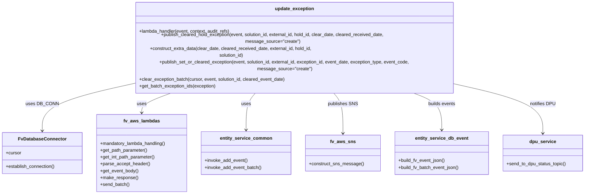
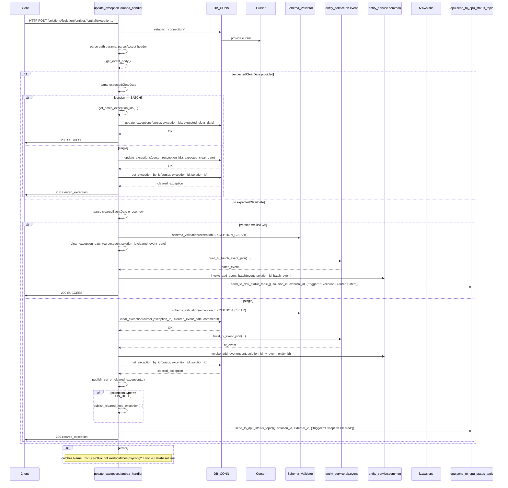

# Diagram: entity_core/entity_service/entity_service/entity/exception/update_exception.py


> Auto-generated by Obscura crawlers

## Diagram 1



### SVG

<svg id="container" width="2027.1171875" xmlns="http://www.w3.org/2000/svg" class="classDiagram" height="606" viewBox="0 0 2027.1171875 606" role="graphics-document document" aria-roledescription="class"><style>#container{font-family:"trebuchet ms",verdana,arial,sans-serif;font-size:16px;fill:#333;}@keyframes edge-animation-frame{from{stroke-dashoffset:0;}}@keyframes dash{to{stroke-dashoffset:0;}}#container .edge-animation-slow{stroke-dasharray:9,5!important;stroke-dashoffset:900;animation:dash 50s linear infinite;stroke-linecap:round;}#container .edge-animation-fast{stroke-dasharray:9,5!important;stroke-dashoffset:900;animation:dash 20s linear infinite;stroke-linecap:round;}#container .error-icon{fill:#552222;}#container .error-text{fill:#552222;stroke:#552222;}#container .edge-thickness-normal{stroke-width:1px;}#container .edge-thickness-thick{stroke-width:3.5px;}#container .edge-pattern-solid{stroke-dasharray:0;}#container .edge-thickness-invisible{stroke-width:0;fill:none;}#container .edge-pattern-dashed{stroke-dasharray:3;}#container .edge-pattern-dotted{stroke-dasharray:2;}#container .marker{fill:#333333;stroke:#333333;}#container .marker.cross{stroke:#333333;}#container svg{font-family:"trebuchet ms",verdana,arial,sans-serif;font-size:16px;}#container p{margin:0;}#container g.classGroup text{fill:#9370DB;stroke:none;font-family:"trebuchet ms",verdana,arial,sans-serif;font-size:10px;}#container g.classGroup text .title{font-weight:bolder;}#container .nodeLabel,#container .edgeLabel{color:#131300;}#container .edgeLabel .label rect{fill:#ECECFF;}#container .label text{fill:#131300;}#container .labelBkg{background:#ECECFF;}#container .edgeLabel .label span{background:#ECECFF;}#container .classTitle{font-weight:bolder;}#container .node rect,#container .node circle,#container .node ellipse,#container .node polygon,#container .node path{fill:#ECECFF;stroke:#9370DB;stroke-width:1px;}#container .divider{stroke:#9370DB;stroke-width:1;}#container g.clickable{cursor:pointer;}#container g.classGroup rect{fill:#ECECFF;stroke:#9370DB;}#container g.classGroup line{stroke:#9370DB;stroke-width:1;}#container .classLabel .box{stroke:none;stroke-width:0;fill:#ECECFF;opacity:0.5;}#container .classLabel .label{fill:#9370DB;font-size:10px;}#container .relation{stroke:#333333;stroke-width:1;fill:none;}#container .dashed-line{stroke-dasharray:3;}#container .dotted-line{stroke-dasharray:1 2;}#container #compositionStart,#container .composition{fill:#333333!important;stroke:#333333!important;stroke-width:1;}#container #compositionEnd,#container .composition{fill:#333333!important;stroke:#333333!important;stroke-width:1;}#container #dependencyStart,#container .dependency{fill:#333333!important;stroke:#333333!important;stroke-width:1;}#container #dependencyStart,#container .dependency{fill:#333333!important;stroke:#333333!important;stroke-width:1;}#container #extensionStart,#container .extension{fill:transparent!important;stroke:#333333!important;stroke-width:1;}#container #extensionEnd,#container .extension{fill:transparent!important;stroke:#333333!important;stroke-width:1;}#container #aggregationStart,#container .aggregation{fill:transparent!important;stroke:#333333!important;stroke-width:1;}#container #aggregationEnd,#container .aggregation{fill:transparent!important;stroke:#333333!important;stroke-width:1;}#container #lollipopStart,#container .lollipop{fill:#ECECFF!important;stroke:#333333!important;stroke-width:1;}#container #lollipopEnd,#container .lollipop{fill:#ECECFF!important;stroke:#333333!important;stroke-width:1;}#container .edgeTerminals{font-size:11px;line-height:initial;}#container .classTitleText{text-anchor:middle;font-size:18px;fill:#333;}#container .label-icon{display:inline-block;height:1em;overflow:visible;vertical-align:-0.125em;}#container .node .label-icon path{fill:currentColor;stroke:revert;stroke-width:revert;}#container :root{--mermaid-font-family:"trebuchet ms",verdana,arial,sans-serif;}</style><g><defs><marker id="container_class-aggregationStart" class="marker aggregation class" refX="18" refY="7" markerWidth="190" markerHeight="240" orient="auto"><path d="M 18,7 L9,13 L1,7 L9,1 Z"></path></marker></defs><defs><marker id="container_class-aggregationEnd" class="marker aggregation class" refX="1" refY="7" markerWidth="20" markerHeight="28" orient="auto"><path d="M 18,7 L9,13 L1,7 L9,1 Z"></path></marker></defs><defs><marker id="container_class-extensionStart" class="marker extension class" refX="18" refY="7" markerWidth="190" markerHeight="240" orient="auto"><path d="M 1,7 L18,13 V 1 Z"></path></marker></defs><defs><marker id="container_class-extensionEnd" class="marker extension class" refX="1" refY="7" markerWidth="20" markerHeight="28" orient="auto"><path d="M 1,1 V 13 L18,7 Z"></path></marker></defs><defs><marker id="container_class-compositionStart" class="marker composition class" refX="18" refY="7" markerWidth="190" markerHeight="240" orient="auto"><path d="M 18,7 L9,13 L1,7 L9,1 Z"></path></marker></defs><defs><marker id="container_class-compositionEnd" class="marker composition class" refX="1" refY="7" markerWidth="20" markerHeight="28" orient="auto"><path d="M 18,7 L9,13 L1,7 L9,1 Z"></path></marker></defs><defs><marker id="container_class-dependencyStart" class="marker dependency class" refX="6" refY="7" markerWidth="190" markerHeight="240" orient="auto"><path d="M 5,7 L9,13 L1,7 L9,1 Z"></path></marker></defs><defs><marker id="container_class-dependencyEnd" class="marker dependency class" refX="13" refY="7" markerWidth="20" markerHeight="28" orient="auto"><path d="M 18,7 L9,13 L14,7 L9,1 Z"></path></marker></defs><defs><marker id="container_class-lollipopStart" class="marker lollipop class" refX="13" refY="7" markerWidth="190" markerHeight="240" orient="auto"><circle stroke="black" fill="transparent" cx="7" cy="7" r="6"></circle></marker></defs><defs><marker id="container_class-lollipopEnd" class="marker lollipop class" refX="1" refY="7" markerWidth="190" markerHeight="240" orient="auto"><circle stroke="black" fill="transparent" cx="7" cy="7" r="6"></circle></marker></defs><g class="root"><g class="clusters"></g><g class="edgePaths"><path d="M437.893,237.683L389.291,246.569C340.69,255.455,243.488,273.228,194.886,297.78C146.285,322.333,146.285,353.667,146.285,369.333L146.285,385" id="id_update_exception_FvDatabaseConnector_1" class="edge-thickness-normal edge-pattern-solid relation" style=";;;" data-edge="true" data-et="edge" data-id="id_update_exception_FvDatabaseConnector_1" data-points="W3sieCI6NDM3Ljg5MjU3ODEyNSwieSI6MjM3LjY4Mjg1NTUxNjc0NDk1fSx7IngiOjE0Ni4yODUxNTYyNSwieSI6MjkxfSx7IngiOjE0Ni4yODUxNTYyNSwieSI6MzkxfV0=" marker-end="url(#container_class-dependencyEnd)"></path><path d="M614.91,254L594.532,260.167C574.154,266.333,533.397,278.667,513.019,290C492.641,301.333,492.641,311.667,492.641,316.833L492.641,322" id="id_update_exception_fv_aws_lambdas_2" class="edge-thickness-normal edge-pattern-solid relation" style=";;;" data-edge="true" data-et="edge" data-id="id_update_exception_fv_aws_lambdas_2" data-points="W3sieCI6NjE0LjkwOTk5NzU1ODU5MzgsInkiOjI1NH0seyJ4Ijo0OTIuNjQwNjI1LCJ5IjoyOTF9LHsieCI6NDkyLjY0MDYyNSwieSI6MzI4fV0=" marker-end="url(#container_class-dependencyEnd)"></path><path d="M893.738,254L887.339,260.167C880.94,266.333,868.142,278.667,861.743,300C855.344,321.333,855.344,351.667,855.344,366.833L855.344,382" id="id_update_exception_entity_service_common_3" class="edge-thickness-normal edge-pattern-solid relation" style=";;;" data-edge="true" data-et="edge" data-id="id_update_exception_entity_service_common_3" data-points="W3sieCI6ODkzLjczODAyNDkwMjM0MzgsInkiOjI1NH0seyJ4Ijo4NTUuMzQzNzUsInkiOjI5MX0seyJ4Ijo4NTUuMzQzNzUsInkiOjM4OH1d" marker-end="url(#container_class-dependencyEnd)"></path><path d="M1149.008,254L1155.407,260.167C1161.806,266.333,1174.604,278.667,1181.003,302C1187.402,325.333,1187.402,359.667,1187.402,376.833L1187.402,394" id="id_update_exception_fv_aws_sns_4" class="edge-thickness-normal edge-pattern-solid relation" style=";;;" data-edge="true" data-et="edge" data-id="id_update_exception_fv_aws_sns_4" data-points="W3sieCI6MTE0OS4wMDgwNjg4NDc2NTYyLCJ5IjoyNTR9LHsieCI6MTE4Ny40MDIzNDM3NSwieSI6MjkxfSx7IngiOjExODcuNDAyMzQzNzUsInkiOjQwMH1d" marker-end="url(#container_class-dependencyEnd)"></path><path d="M1410.96,254L1430.492,260.167C1450.024,266.333,1489.088,278.667,1508.62,300C1528.152,321.333,1528.152,351.667,1528.152,366.833L1528.152,382" id="id_update_exception_entity_service_db_event_5" class="edge-thickness-normal edge-pattern-solid relation" style=";;;" data-edge="true" data-et="edge" data-id="id_update_exception_entity_service_db_event_5" data-points="W3sieCI6MTQxMC45NTk2MzEzNDc2NTYzLCJ5IjoyNTR9LHsieCI6MTUyOC4xNTIzNDM3NSwieSI6MjkxfSx7IngiOjE1MjguMTUyMzQzNzUsInkiOjM4OH1d" marker-end="url(#container_class-dependencyEnd)"></path><path d="M1604.854,239.691L1650.761,248.242C1696.668,256.794,1788.482,273.897,1834.39,299.615C1880.297,325.333,1880.297,359.667,1880.297,376.833L1880.297,394" id="id_update_exception_dpu_service_6" class="edge-thickness-normal edge-pattern-solid relation" style=";;;" data-edge="true" data-et="edge" data-id="id_update_exception_dpu_service_6" data-points="W3sieCI6MTYwNC44NTM1MTU2MjUsInkiOjIzOS42OTA1MTcwNjY5MTQ2OH0seyJ4IjoxODgwLjI5Njg3NSwieSI6MjkxfSx7IngiOjE4ODAuMjk2ODc1LCJ5Ijo0MDB9XQ==" marker-end="url(#container_class-dependencyEnd)"></path></g><g class="edgeLabels"><g class="edgeLabel" transform="translate(146.28515625, 291)"><g class="label" data-id="id_update_exception_FvDatabaseConnector_1" transform="translate(-53.09375, -12)"><foreignObject width="106.1875" height="24"><div xmlns="http://www.w3.org/1999/xhtml" class="labelBkg" style="display: table-cell; white-space: nowrap; line-height: 1.5; max-width: 200px; text-align: center;"><span class="edgeLabel"><p>uses DB_CONN</p></span></div></foreignObject></g></g><g class="edgeLabel" transform="translate(492.640625, 291)"><g class="label" data-id="id_update_exception_fv_aws_lambdas_2" transform="translate(-16.4921875, -12)"><foreignObject width="32.984375" height="24"><div xmlns="http://www.w3.org/1999/xhtml" class="labelBkg" style="display: table-cell; white-space: nowrap; line-height: 1.5; max-width: 200px; text-align: center;"><span class="edgeLabel"><p>uses</p></span></div></foreignObject></g></g><g class="edgeLabel" transform="translate(855.34375, 291)"><g class="label" data-id="id_update_exception_entity_service_common_3" transform="translate(-16.4921875, -12)"><foreignObject width="32.984375" height="24"><div xmlns="http://www.w3.org/1999/xhtml" class="labelBkg" style="display: table-cell; white-space: nowrap; line-height: 1.5; max-width: 200px; text-align: center;"><span class="edgeLabel"><p>uses</p></span></div></foreignObject></g></g><g class="edgeLabel" transform="translate(1187.40234375, 291)"><g class="label" data-id="id_update_exception_fv_aws_sns_4" transform="translate(-51.5859375, -12)"><foreignObject width="103.171875" height="24"><div xmlns="http://www.w3.org/1999/xhtml" class="labelBkg" style="display: table-cell; white-space: nowrap; line-height: 1.5; max-width: 200px; text-align: center;"><span class="edgeLabel"><p>publishes SNS</p></span></div></foreignObject></g></g><g class="edgeLabel" transform="translate(1528.15234375, 291)"><g class="label" data-id="id_update_exception_entity_service_db_event_5" transform="translate(-48.515625, -12)"><foreignObject width="97.03125" height="24"><div xmlns="http://www.w3.org/1999/xhtml" class="labelBkg" style="display: table-cell; white-space: nowrap; line-height: 1.5; max-width: 200px; text-align: center;"><span class="edgeLabel"><p>builds events</p></span></div></foreignObject></g></g><g class="edgeLabel" transform="translate(1880.296875, 291)"><g class="label" data-id="id_update_exception_dpu_service_6" transform="translate(-44.421875, -12)"><foreignObject width="88.84375" height="24"><div xmlns="http://www.w3.org/1999/xhtml" class="labelBkg" style="display: table-cell; white-space: nowrap; line-height: 1.5; max-width: 200px; text-align: center;"><span class="edgeLabel"><p>notifies DPU</p></span></div></foreignObject></g></g></g><g class="nodes"><g class="node default" id="classId-update_exception-0" transform="translate(1021.373046875, 131)"><g class="basic label-container"><path d="M-583.48046875 -123 L583.48046875 -123 L583.48046875 123 L-583.48046875 123" stroke="none" stroke-width="0" fill="#ECECFF" style=""></path><path d="M-583.48046875 -123 C-279.47274113680334 -123, 24.53498647639333 -123, 583.48046875 -123 M-583.48046875 -123 C-159.21933281534035 -123, 265.0418031193193 -123, 583.48046875 -123 M583.48046875 -123 C583.48046875 -37.79779836260421, 583.48046875 47.40440327479158, 583.48046875 123 M583.48046875 -123 C583.48046875 -62.713897676004954, 583.48046875 -2.427795352009909, 583.48046875 123 M583.48046875 123 C334.9327735672151 123, 86.38507838443024 123, -583.48046875 123 M583.48046875 123 C325.2526090634442 123, 67.0247493768884 123, -583.48046875 123 M-583.48046875 123 C-583.48046875 58.019246613071516, -583.48046875 -6.961506773856968, -583.48046875 -123 M-583.48046875 123 C-583.48046875 53.31250456690486, -583.48046875 -16.374990866190274, -583.48046875 -123" stroke="#9370DB" stroke-width="1.3" fill="none" stroke-dasharray="0 0" style=""></path></g><g class="annotation-group text" transform="translate(0, -99)"></g><g class="label-group text" transform="translate(-65.5390625, -99)"><g class="label" style="font-weight: bolder" transform="translate(0,-12)"><foreignObject width="131.078125" height="24"><div xmlns="http://www.w3.org/1999/xhtml" style="display: table-cell; white-space: nowrap; line-height: 1.5; max-width: 180px; text-align: center;"><span class="nodeLabel markdown-node-label" style=""><p>update_exception</p></span></div></foreignObject></g></g><g class="members-group text" transform="translate(-571.48046875, -51)"></g><g class="methods-group text" transform="translate(-571.48046875, -21)"><g class="label" style="" transform="translate(0,-12)"><foreignObject width="321.6875" height="24"><div xmlns="http://www.w3.org/1999/xhtml" style="display: table-cell; white-space: nowrap; line-height: 1.5; max-width: 379px; text-align: center;"><span class="nodeLabel markdown-node-label" style=""><p>+lambda_handler(event, context, audit_refs)</p></span></div></foreignObject></g><g class="label" style="" transform="translate(0,12)"><foreignObject width="984" height="24"><div xmlns="http://www.w3.org/1999/xhtml" style="display: table-cell; white-space: nowrap; line-height: 1.5; max-width: 1041px; text-align: center;"><span class="nodeLabel markdown-node-label" style=""><p>+publish_cleared_hold_exception(event, solution_id, external_id, hold_id, clear_date, cleared_received_date, message_source="create")</p></span></div></foreignObject></g><g class="label" style="" transform="translate(0,36)"><foreignObject width="661.3125" height="24"><div xmlns="http://www.w3.org/1999/xhtml" style="display: table-cell; white-space: nowrap; line-height: 1.5; max-width: 719px; text-align: center;"><span class="nodeLabel markdown-node-label" style=""><p>+construct_extra_data(clear_date, cleared_received_date, external_id, hold_id, solution_id)</p></span></div></foreignObject></g><g class="label" style="" transform="translate(0,60)"><foreignObject width="1077.421875" height="24"><div xmlns="http://www.w3.org/1999/xhtml" style="display: table-cell; white-space: nowrap; line-height: 1.5; max-width: 1135px; text-align: center;"><span class="nodeLabel markdown-node-label" style=""><p>+publish_set_or_cleared_exception(event, solution_id, external_id, exception_id, event_date, exception_type, event_code, message_source="create")</p></span></div></foreignObject></g><g class="label" style="" transform="translate(0,84)"><foreignObject width="514.140625" height="24"><div xmlns="http://www.w3.org/1999/xhtml" style="display: table-cell; white-space: nowrap; line-height: 1.5; max-width: 572px; text-align: center;"><span class="nodeLabel markdown-node-label" style=""><p>+clear_exception_batch(cursor, event, solution_id, cleared_event_date)</p></span></div></foreignObject></g><g class="label" style="" transform="translate(0,108)"><foreignObject width="269.21875" height="24"><div xmlns="http://www.w3.org/1999/xhtml" style="display: table-cell; white-space: nowrap; line-height: 1.5; max-width: 327px; text-align: center;"><span class="nodeLabel markdown-node-label" style=""><p>+get_batch_exception_ids(exception)</p></span></div></foreignObject></g></g><g class="divider" style=""><path d="M-583.48046875 -75 C-267.2934337165675 -75, 48.89360131686499 -75, 583.48046875 -75 M-583.48046875 -75 C-281.7985859941535 -75, 19.883296761693032 -75, 583.48046875 -75" stroke="#9370DB" stroke-width="1.3" fill="none" stroke-dasharray="0 0" style=""></path></g><g class="divider" style=""><path d="M-583.48046875 -51 C-189.10108459023746 -51, 205.27829956952507 -51, 583.48046875 -51 M-583.48046875 -51 C-292.29820585939615 -51, -1.1159429687922966 -51, 583.48046875 -51" stroke="#9370DB" stroke-width="1.3" fill="none" stroke-dasharray="0 0" style=""></path></g></g><g class="node default" id="classId-FvDatabaseConnector-1" transform="translate(146.28515625, 463)"><g class="basic label-container"><path d="M-138.28515625 -72 L138.28515625 -72 L138.28515625 72 L-138.28515625 72" stroke="none" stroke-width="0" fill="#ECECFF" style=""></path><path d="M-138.28515625 -72 C-76.85402046057752 -72, -15.422884671155046 -72, 138.28515625 -72 M-138.28515625 -72 C-77.45360375093472 -72, -16.62205125186945 -72, 138.28515625 -72 M138.28515625 -72 C138.28515625 -14.880780401357462, 138.28515625 42.238439197285075, 138.28515625 72 M138.28515625 -72 C138.28515625 -19.459101713140164, 138.28515625 33.08179657371967, 138.28515625 72 M138.28515625 72 C82.5729173767225 72, 26.860678503445 72, -138.28515625 72 M138.28515625 72 C31.756696960738438 72, -74.77176232852312 72, -138.28515625 72 M-138.28515625 72 C-138.28515625 33.12683436032561, -138.28515625 -5.74633127934878, -138.28515625 -72 M-138.28515625 72 C-138.28515625 33.885232011699266, -138.28515625 -4.229535976601468, -138.28515625 -72" stroke="#9370DB" stroke-width="1.3" fill="none" stroke-dasharray="0 0" style=""></path></g><g class="annotation-group text" transform="translate(0, -48)"></g><g class="label-group text" transform="translate(-79.3046875, -48)"><g class="label" style="font-weight: bolder" transform="translate(0,-12)"><foreignObject width="158.609375" height="24"><div xmlns="http://www.w3.org/1999/xhtml" style="display: table-cell; white-space: nowrap; line-height: 1.5; max-width: 207px; text-align: center;"><span class="nodeLabel markdown-node-label" style=""><p>FvDatabaseConnector</p></span></div></foreignObject></g></g><g class="members-group text" transform="translate(-126.28515625, 0)"><g class="label" style="" transform="translate(0,-12)"><foreignObject width="53.71875" height="24"><div xmlns="http://www.w3.org/1999/xhtml" style="display: table-cell; white-space: nowrap; line-height: 1.5; max-width: 112px; text-align: center;"><span class="nodeLabel markdown-node-label" style=""><p>+cursor</p></span></div></foreignObject></g></g><g class="methods-group text" transform="translate(-126.28515625, 48)"><g class="label" style="" transform="translate(0,-12)"><foreignObject width="173.265625" height="24"><div xmlns="http://www.w3.org/1999/xhtml" style="display: table-cell; white-space: nowrap; line-height: 1.5; max-width: 231px; text-align: center;"><span class="nodeLabel markdown-node-label" style=""><p>+establish_connection()</p></span></div></foreignObject></g></g><g class="divider" style=""><path d="M-138.28515625 -24 C-75.52504308570998 -24, -12.764929921419963 -24, 138.28515625 -24 M-138.28515625 -24 C-52.680288950501364 -24, 32.92457834899727 -24, 138.28515625 -24" stroke="#9370DB" stroke-width="1.3" fill="none" stroke-dasharray="0 0" style=""></path></g><g class="divider" style=""><path d="M-138.28515625 24 C-55.577727942329304 24, 27.129700365341392 24, 138.28515625 24 M-138.28515625 24 C-71.09156346140117 24, -3.8979706728023302 24, 138.28515625 24" stroke="#9370DB" stroke-width="1.3" fill="none" stroke-dasharray="0 0" style=""></path></g></g><g class="node default" id="classId-fv_aws_lambdas-2" transform="translate(492.640625, 463)"><g class="basic label-container"><path d="M-158.0703125 -135 L158.0703125 -135 L158.0703125 135 L-158.0703125 135" stroke="none" stroke-width="0" fill="#ECECFF" style=""></path><path d="M-158.0703125 -135 C-66.71990593150468 -135, 24.630500636990632 -135, 158.0703125 -135 M-158.0703125 -135 C-47.033937544246285 -135, 64.00243741150743 -135, 158.0703125 -135 M158.0703125 -135 C158.0703125 -29.509602124583054, 158.0703125 75.98079575083389, 158.0703125 135 M158.0703125 -135 C158.0703125 -61.44965383280196, 158.0703125 12.100692334396086, 158.0703125 135 M158.0703125 135 C62.060995946910054 135, -33.94832060617989 135, -158.0703125 135 M158.0703125 135 C77.81973119373738 135, -2.430850112525235 135, -158.0703125 135 M-158.0703125 135 C-158.0703125 69.65034124455586, -158.0703125 4.300682489111722, -158.0703125 -135 M-158.0703125 135 C-158.0703125 37.57613006701041, -158.0703125 -59.84773986597918, -158.0703125 -135" stroke="#9370DB" stroke-width="1.3" fill="none" stroke-dasharray="0 0" style=""></path></g><g class="annotation-group text" transform="translate(0, -111)"></g><g class="label-group text" transform="translate(-60.0625, -111)"><g class="label" style="font-weight: bolder" transform="translate(0,-12)"><foreignObject width="120.125" height="24"><div xmlns="http://www.w3.org/1999/xhtml" style="display: table-cell; white-space: nowrap; line-height: 1.5; max-width: 168px; text-align: center;"><span class="nodeLabel markdown-node-label" style=""><p>fv_aws_lambdas</p></span></div></foreignObject></g></g><g class="members-group text" transform="translate(-146.0703125, -63)"></g><g class="methods-group text" transform="translate(-146.0703125, -33)"><g class="label" style="" transform="translate(0,-12)"><foreignObject width="232.078125" height="24"><div xmlns="http://www.w3.org/1999/xhtml" style="display: table-cell; white-space: nowrap; line-height: 1.5; max-width: 289px; text-align: center;"><span class="nodeLabel markdown-node-label" style=""><p>+mandatory_lambda_handling()</p></span></div></foreignObject></g><g class="label" style="" transform="translate(0,12)"><foreignObject width="165.984375" height="24"><div xmlns="http://www.w3.org/1999/xhtml" style="display: table-cell; white-space: nowrap; line-height: 1.5; max-width: 223px; text-align: center;"><span class="nodeLabel markdown-node-label" style=""><p>+get_path_parameter()</p></span></div></foreignObject></g><g class="label" style="" transform="translate(0,36)"><foreignObject width="193.96875" height="24"><div xmlns="http://www.w3.org/1999/xhtml" style="display: table-cell; white-space: nowrap; line-height: 1.5; max-width: 251px; text-align: center;"><span class="nodeLabel markdown-node-label" style=""><p>+get_int_path_parameter()</p></span></div></foreignObject></g><g class="label" style="" transform="translate(0,60)"><foreignObject width="173" height="24"><div xmlns="http://www.w3.org/1999/xhtml" style="display: table-cell; white-space: nowrap; line-height: 1.5; max-width: 230px; text-align: center;"><span class="nodeLabel markdown-node-label" style=""><p>+parse_accept_header()</p></span></div></foreignObject></g><g class="label" style="" transform="translate(0,84)"><foreignObject width="133.859375" height="24"><div xmlns="http://www.w3.org/1999/xhtml" style="display: table-cell; white-space: nowrap; line-height: 1.5; max-width: 191px; text-align: center;"><span class="nodeLabel markdown-node-label" style=""><p>+get_event_body()</p></span></div></foreignObject></g><g class="label" style="" transform="translate(0,108)"><foreignObject width="131.84375" height="24"><div xmlns="http://www.w3.org/1999/xhtml" style="display: table-cell; white-space: nowrap; line-height: 1.5; max-width: 189px; text-align: center;"><span class="nodeLabel markdown-node-label" style=""><p>+make_response()</p></span></div></foreignObject></g><g class="label" style="" transform="translate(0,132)"><foreignObject width="102.421875" height="24"><div xmlns="http://www.w3.org/1999/xhtml" style="display: table-cell; white-space: nowrap; line-height: 1.5; max-width: 160px; text-align: center;"><span class="nodeLabel markdown-node-label" style=""><p>+send_batch()</p></span></div></foreignObject></g></g><g class="divider" style=""><path d="M-158.0703125 -87 C-36.1663156042309 -87, 85.7376812915382 -87, 158.0703125 -87 M-158.0703125 -87 C-60.97464876057842 -87, 36.121014978843164 -87, 158.0703125 -87" stroke="#9370DB" stroke-width="1.3" fill="none" stroke-dasharray="0 0" style=""></path></g><g class="divider" style=""><path d="M-158.0703125 -63 C-41.501443844101615 -63, 75.06742481179677 -63, 158.0703125 -63 M-158.0703125 -63 C-57.727878744413275 -63, 42.61455501117345 -63, 158.0703125 -63" stroke="#9370DB" stroke-width="1.3" fill="none" stroke-dasharray="0 0" style=""></path></g></g><g class="node default" id="classId-entity_service_common-3" transform="translate(855.34375, 463)"><g class="basic label-container"><path d="M-154.6328125 -75 L154.6328125 -75 L154.6328125 75 L-154.6328125 75" stroke="none" stroke-width="0" fill="#ECECFF" style=""></path><path d="M-154.6328125 -75 C-63.31842573594615 -75, 27.9959610281077 -75, 154.6328125 -75 M-154.6328125 -75 C-63.5578606075338 -75, 27.517091284932405 -75, 154.6328125 -75 M154.6328125 -75 C154.6328125 -21.63749627469408, 154.6328125 31.72500745061184, 154.6328125 75 M154.6328125 -75 C154.6328125 -42.85290315379885, 154.6328125 -10.705806307597697, 154.6328125 75 M154.6328125 75 C76.3526016066212 75, -1.927609286757587 75, -154.6328125 75 M154.6328125 75 C57.59939327097787 75, -39.43402595804426 75, -154.6328125 75 M-154.6328125 75 C-154.6328125 43.48724814046952, -154.6328125 11.974496280939043, -154.6328125 -75 M-154.6328125 75 C-154.6328125 38.86890368163306, -154.6328125 2.737807363266114, -154.6328125 -75" stroke="#9370DB" stroke-width="1.3" fill="none" stroke-dasharray="0 0" style=""></path></g><g class="annotation-group text" transform="translate(0, -51)"></g><g class="label-group text" transform="translate(-86.421875, -51)"><g class="label" style="font-weight: bolder" transform="translate(0,-12)"><foreignObject width="172.84375" height="24"><div xmlns="http://www.w3.org/1999/xhtml" style="display: table-cell; white-space: nowrap; line-height: 1.5; max-width: 221px; text-align: center;"><span class="nodeLabel markdown-node-label" style=""><p>entity_service_common</p></span></div></foreignObject></g></g><g class="members-group text" transform="translate(-142.6328125, -3)"></g><g class="methods-group text" transform="translate(-142.6328125, 27)"><g class="label" style="" transform="translate(0,-12)"><foreignObject width="149.90625" height="24"><div xmlns="http://www.w3.org/1999/xhtml" style="display: table-cell; white-space: nowrap; line-height: 1.5; max-width: 207px; text-align: center;"><span class="nodeLabel markdown-node-label" style=""><p>+invoke_add_event()</p></span></div></foreignObject></g><g class="label" style="" transform="translate(0,12)"><foreignObject width="198.84375" height="24"><div xmlns="http://www.w3.org/1999/xhtml" style="display: table-cell; white-space: nowrap; line-height: 1.5; max-width: 256px; text-align: center;"><span class="nodeLabel markdown-node-label" style=""><p>+invoke_add_event_batch()</p></span></div></foreignObject></g></g><g class="divider" style=""><path d="M-154.6328125 -27 C-75.31597437051454 -27, 4.000863758970922 -27, 154.6328125 -27 M-154.6328125 -27 C-76.66462040267629 -27, 1.3035716946474167 -27, 154.6328125 -27" stroke="#9370DB" stroke-width="1.3" fill="none" stroke-dasharray="0 0" style=""></path></g><g class="divider" style=""><path d="M-154.6328125 -3 C-51.655319719396715 -3, 51.32217306120657 -3, 154.6328125 -3 M-154.6328125 -3 C-36.99132105821485 -3, 80.6501703835703 -3, 154.6328125 -3" stroke="#9370DB" stroke-width="1.3" fill="none" stroke-dasharray="0 0" style=""></path></g></g><g class="node default" id="classId-fv_aws_sns-4" transform="translate(1187.40234375, 463)"><g class="basic label-container"><path d="M-127.42578125 -63 L127.42578125 -63 L127.42578125 63 L-127.42578125 63" stroke="none" stroke-width="0" fill="#ECECFF" style=""></path><path d="M-127.42578125 -63 C-33.56203835510833 -63, 60.301704539783344 -63, 127.42578125 -63 M-127.42578125 -63 C-75.29542036765731 -63, -23.16505948531463 -63, 127.42578125 -63 M127.42578125 -63 C127.42578125 -31.208624987939974, 127.42578125 0.5827500241200525, 127.42578125 63 M127.42578125 -63 C127.42578125 -22.855529889470013, 127.42578125 17.288940221059974, 127.42578125 63 M127.42578125 63 C50.306684609295644 63, -26.812412031408712 63, -127.42578125 63 M127.42578125 63 C60.35212465178289 63, -6.721531946434226 63, -127.42578125 63 M-127.42578125 63 C-127.42578125 16.954659300850125, -127.42578125 -29.09068139829975, -127.42578125 -63 M-127.42578125 63 C-127.42578125 28.760803440017582, -127.42578125 -5.478393119964835, -127.42578125 -63" stroke="#9370DB" stroke-width="1.3" fill="none" stroke-dasharray="0 0" style=""></path></g><g class="annotation-group text" transform="translate(0, -39)"></g><g class="label-group text" transform="translate(-41.2578125, -39)"><g class="label" style="font-weight: bolder" transform="translate(0,-12)"><foreignObject width="82.515625" height="24"><div xmlns="http://www.w3.org/1999/xhtml" style="display: table-cell; white-space: nowrap; line-height: 1.5; max-width: 131px; text-align: center;"><span class="nodeLabel markdown-node-label" style=""><p>fv_aws_sns</p></span></div></foreignObject></g></g><g class="members-group text" transform="translate(-115.42578125, 9)"></g><g class="methods-group text" transform="translate(-115.42578125, 39)"><g class="label" style="" transform="translate(0,-12)"><foreignObject width="189.59375" height="24"><div xmlns="http://www.w3.org/1999/xhtml" style="display: table-cell; white-space: nowrap; line-height: 1.5; max-width: 247px; text-align: center;"><span class="nodeLabel markdown-node-label" style=""><p>+construct_sns_message()</p></span></div></foreignObject></g></g><g class="divider" style=""><path d="M-127.42578125 -15 C-61.86092726110273 -15, 3.7039267277945385 -15, 127.42578125 -15 M-127.42578125 -15 C-62.45030195221034 -15, 2.5251773455793227 -15, 127.42578125 -15" stroke="#9370DB" stroke-width="1.3" fill="none" stroke-dasharray="0 0" style=""></path></g><g class="divider" style=""><path d="M-127.42578125 9 C-37.27509249697407 9, 52.875596256051864 9, 127.42578125 9 M-127.42578125 9 C-40.074796114425354 9, 47.27618902114929 9, 127.42578125 9" stroke="#9370DB" stroke-width="1.3" fill="none" stroke-dasharray="0 0" style=""></path></g></g><g class="node default" id="classId-entity_service_db_event-5" transform="translate(1528.15234375, 463)"><g class="basic label-container"><path d="M-163.32421875 -75 L163.32421875 -75 L163.32421875 75 L-163.32421875 75" stroke="none" stroke-width="0" fill="#ECECFF" style=""></path><path d="M-163.32421875 -75 C-82.70574253557169 -75, -2.0872663211433746 -75, 163.32421875 -75 M-163.32421875 -75 C-74.52998433333798 -75, 14.264250083324043 -75, 163.32421875 -75 M163.32421875 -75 C163.32421875 -30.273064201273684, 163.32421875 14.453871597452633, 163.32421875 75 M163.32421875 -75 C163.32421875 -19.207853042402654, 163.32421875 36.58429391519469, 163.32421875 75 M163.32421875 75 C51.667972562749725 75, -59.98827362450055 75, -163.32421875 75 M163.32421875 75 C55.63143395828192 75, -52.061350833436165 75, -163.32421875 75 M-163.32421875 75 C-163.32421875 40.90866211814157, -163.32421875 6.817324236283142, -163.32421875 -75 M-163.32421875 75 C-163.32421875 28.682959160093297, -163.32421875 -17.634081679813406, -163.32421875 -75" stroke="#9370DB" stroke-width="1.3" fill="none" stroke-dasharray="0 0" style=""></path></g><g class="annotation-group text" transform="translate(0, -51)"></g><g class="label-group text" transform="translate(-89.1953125, -51)"><g class="label" style="font-weight: bolder" transform="translate(0,-12)"><foreignObject width="178.390625" height="24"><div xmlns="http://www.w3.org/1999/xhtml" style="display: table-cell; white-space: nowrap; line-height: 1.5; max-width: 226px; text-align: center;"><span class="nodeLabel markdown-node-label" style=""><p>entity_service_db_event</p></span></div></foreignObject></g></g><g class="members-group text" transform="translate(-151.32421875, -3)"></g><g class="methods-group text" transform="translate(-151.32421875, 27)"><g class="label" style="" transform="translate(0,-12)"><foreignObject width="164.515625" height="24"><div xmlns="http://www.w3.org/1999/xhtml" style="display: table-cell; white-space: nowrap; line-height: 1.5; max-width: 222px; text-align: center;"><span class="nodeLabel markdown-node-label" style=""><p>+build_fv_event_json()</p></span></div></foreignObject></g><g class="label" style="" transform="translate(0,12)"><foreignObject width="213.453125" height="24"><div xmlns="http://www.w3.org/1999/xhtml" style="display: table-cell; white-space: nowrap; line-height: 1.5; max-width: 271px; text-align: center;"><span class="nodeLabel markdown-node-label" style=""><p>+build_fv_batch_event_json()</p></span></div></foreignObject></g></g><g class="divider" style=""><path d="M-163.32421875 -27 C-62.149579542909436 -27, 39.02505966418113 -27, 163.32421875 -27 M-163.32421875 -27 C-86.5708447582622 -27, -9.817470766524394 -27, 163.32421875 -27" stroke="#9370DB" stroke-width="1.3" fill="none" stroke-dasharray="0 0" style=""></path></g><g class="divider" style=""><path d="M-163.32421875 -3 C-52.996422024539484 -3, 57.33137470092103 -3, 163.32421875 -3 M-163.32421875 -3 C-63.81437850468336 -3, 35.69546174063328 -3, 163.32421875 -3" stroke="#9370DB" stroke-width="1.3" fill="none" stroke-dasharray="0 0" style=""></path></g></g><g class="node default" id="classId-dpu_service-6" transform="translate(1880.296875, 463)"><g class="basic label-container"><path d="M-138.8203125 -63 L138.8203125 -63 L138.8203125 63 L-138.8203125 63" stroke="none" stroke-width="0" fill="#ECECFF" style=""></path><path d="M-138.8203125 -63 C-57.02876450564075 -63, 24.762783488718497 -63, 138.8203125 -63 M-138.8203125 -63 C-42.48941574957314 -63, 53.84148100085372 -63, 138.8203125 -63 M138.8203125 -63 C138.8203125 -25.733198667652132, 138.8203125 11.533602664695735, 138.8203125 63 M138.8203125 -63 C138.8203125 -30.610470477396866, 138.8203125 1.7790590452062673, 138.8203125 63 M138.8203125 63 C27.780998302348692 63, -83.25831589530262 63, -138.8203125 63 M138.8203125 63 C79.00287576298604 63, 19.185439025972073 63, -138.8203125 63 M-138.8203125 63 C-138.8203125 28.051428655972465, -138.8203125 -6.8971426880550695, -138.8203125 -63 M-138.8203125 63 C-138.8203125 18.799471794253158, -138.8203125 -25.401056411493684, -138.8203125 -63" stroke="#9370DB" stroke-width="1.3" fill="none" stroke-dasharray="0 0" style=""></path></g><g class="annotation-group text" transform="translate(0, -39)"></g><g class="label-group text" transform="translate(-44.25, -39)"><g class="label" style="font-weight: bolder" transform="translate(0,-12)"><foreignObject width="88.5" height="24"><div xmlns="http://www.w3.org/1999/xhtml" style="display: table-cell; white-space: nowrap; line-height: 1.5; max-width: 138px; text-align: center;"><span class="nodeLabel markdown-node-label" style=""><p>dpu_service</p></span></div></foreignObject></g></g><g class="members-group text" transform="translate(-126.8203125, 9)"></g><g class="methods-group text" transform="translate(-126.8203125, 39)"><g class="label" style="" transform="translate(0,-12)"><foreignObject width="209.390625" height="24"><div xmlns="http://www.w3.org/1999/xhtml" style="display: table-cell; white-space: nowrap; line-height: 1.5; max-width: 267px; text-align: center;"><span class="nodeLabel markdown-node-label" style=""><p>+send_to_dpu_status_topic()</p></span></div></foreignObject></g></g><g class="divider" style=""><path d="M-138.8203125 -15 C-54.821547923194075 -15, 29.17721665361185 -15, 138.8203125 -15 M-138.8203125 -15 C-53.54755886284619 -15, 31.725194774307624 -15, 138.8203125 -15" stroke="#9370DB" stroke-width="1.3" fill="none" stroke-dasharray="0 0" style=""></path></g><g class="divider" style=""><path d="M-138.8203125 9 C-46.955934318358175 9, 44.90844386328365 9, 138.8203125 9 M-138.8203125 9 C-74.14574725917961 9, -9.47118201835923 9, 138.8203125 9" stroke="#9370DB" stroke-width="1.3" fill="none" stroke-dasharray="0 0" style=""></path></g></g></g></g></g></svg>

## Diagram 2



### SVG

<svg id="container" width="2717" xmlns="http://www.w3.org/2000/svg" height="2580" viewBox="-50 -10 2717 2580" role="graphics-document document" aria-roledescription="sequence"><g><rect x="2373" y="2494" fill="#eaeaea" stroke="#666" width="244" height="65" name="DPU" rx="3" ry="3" class="actor actor-bottom"></rect><text x="2495" y="2526.5" dominant-baseline="central" alignment-baseline="central" class="actor actor-box" style="text-anchor: middle; font-size: 16px; font-weight: 400;"><tspan x="2495" dy="0">dpu.send_to_dpu_status_topic</tspan></text></g><g><rect x="2173" y="2494" fill="#eaeaea" stroke="#666" width="150" height="65" name="SNS" rx="3" ry="3" class="actor actor-bottom"></rect><text x="2248" y="2526.5" dominant-baseline="central" alignment-baseline="central" class="actor actor-box" style="text-anchor: middle; font-size: 16px; font-weight: 400;"><tspan x="2248" dy="0">fv.aws.sns</tspan></text></g><g><rect x="1936" y="2494" fill="#eaeaea" stroke="#666" width="187" height="65" name="EntityService" rx="3" ry="3" class="actor actor-bottom"></rect><text x="2029.5" y="2526.5" dominant-baseline="central" alignment-baseline="central" class="actor actor-box" style="text-anchor: middle; font-size: 16px; font-weight: 400;"><tspan x="2029.5" dy="0">entity_service.common</tspan></text></g><g><rect x="1699" y="2494" fill="#eaeaea" stroke="#666" width="187" height="65" name="EventBuilder" rx="3" ry="3" class="actor actor-bottom"></rect><text x="1792.5" y="2526.5" dominant-baseline="central" alignment-baseline="central" class="actor actor-box" style="text-anchor: middle; font-size: 16px; font-weight: 400;"><tspan x="1792.5" dy="0">entity_service.db.event</tspan></text></g><g><rect x="1498" y="2494" fill="#eaeaea" stroke="#666" width="151" height="65" name="Validator" rx="3" ry="3" class="actor actor-bottom"></rect><text x="1573.5" y="2526.5" dominant-baseline="central" alignment-baseline="central" class="actor actor-box" style="text-anchor: middle; font-size: 16px; font-weight: 400;"><tspan x="1573.5" dy="0">Schema_Validator</tspan></text></g><g><rect x="1298" y="2494" fill="#eaeaea" stroke="#666" width="150" height="65" name="Cursor" rx="3" ry="3" class="actor actor-bottom"></rect><text x="1373" y="2526.5" dominant-baseline="central" alignment-baseline="central" class="actor actor-box" style="text-anchor: middle; font-size: 16px; font-weight: 400;"><tspan x="1373" dy="0">Cursor</tspan></text></g><g><rect x="1098" y="2494" fill="#eaeaea" stroke="#666" width="150" height="65" name="DB" rx="3" ry="3" class="actor actor-bottom"></rect><text x="1173" y="2526.5" dominant-baseline="central" alignment-baseline="central" class="actor actor-box" style="text-anchor: middle; font-size: 16px; font-weight: 400;"><tspan x="1173" dy="0">DB_CONN</tspan></text></g><g><rect x="457" y="2494" fill="#eaeaea" stroke="#666" width="274" height="65" name="Lambda" rx="3" ry="3" class="actor actor-bottom"></rect><text x="594" y="2526.5" dominant-baseline="central" alignment-baseline="central" class="actor actor-box" style="text-anchor: middle; font-size: 16px; font-weight: 400;"><tspan x="594" dy="0">update_exception.lambda_handler</tspan></text></g><g><rect x="0" y="2494" fill="#eaeaea" stroke="#666" width="150" height="65" name="Client" rx="3" ry="3" class="actor actor-bottom"></rect><text x="75" y="2526.5" dominant-baseline="central" alignment-baseline="central" class="actor actor-box" style="text-anchor: middle; font-size: 16px; font-weight: 400;"><tspan x="75" dy="0">Client</tspan></text></g><g><line id="actor8" x1="2495" y1="65" x2="2495" y2="2494" class="actor-line 200" stroke-width="0.5px" stroke="#999" name="DPU"></line><g id="root-8"><rect x="2373" y="0" fill="#eaeaea" stroke="#666" width="244" height="65" name="DPU" rx="3" ry="3" class="actor actor-top"></rect><text x="2495" y="32.5" dominant-baseline="central" alignment-baseline="central" class="actor actor-box" style="text-anchor: middle; font-size: 16px; font-weight: 400;"><tspan x="2495" dy="0">dpu.send_to_dpu_status_topic</tspan></text></g></g><g><line id="actor7" x1="2248" y1="65" x2="2248" y2="2494" class="actor-line 200" stroke-width="0.5px" stroke="#999" name="SNS"></line><g id="root-7"><rect x="2173" y="0" fill="#eaeaea" stroke="#666" width="150" height="65" name="SNS" rx="3" ry="3" class="actor actor-top"></rect><text x="2248" y="32.5" dominant-baseline="central" alignment-baseline="central" class="actor actor-box" style="text-anchor: middle; font-size: 16px; font-weight: 400;"><tspan x="2248" dy="0">fv.aws.sns</tspan></text></g></g><g><line id="actor6" x1="2029.5" y1="65" x2="2029.5" y2="2494" class="actor-line 200" stroke-width="0.5px" stroke="#999" name="EntityService"></line><g id="root-6"><rect x="1936" y="0" fill="#eaeaea" stroke="#666" width="187" height="65" name="EntityService" rx="3" ry="3" class="actor actor-top"></rect><text x="2029.5" y="32.5" dominant-baseline="central" alignment-baseline="central" class="actor actor-box" style="text-anchor: middle; font-size: 16px; font-weight: 400;"><tspan x="2029.5" dy="0">entity_service.common</tspan></text></g></g><g><line id="actor5" x1="1792.5" y1="65" x2="1792.5" y2="2494" class="actor-line 200" stroke-width="0.5px" stroke="#999" name="EventBuilder"></line><g id="root-5"><rect x="1699" y="0" fill="#eaeaea" stroke="#666" width="187" height="65" name="EventBuilder" rx="3" ry="3" class="actor actor-top"></rect><text x="1792.5" y="32.5" dominant-baseline="central" alignment-baseline="central" class="actor actor-box" style="text-anchor: middle; font-size: 16px; font-weight: 400;"><tspan x="1792.5" dy="0">entity_service.db.event</tspan></text></g></g><g><line id="actor4" x1="1573.5" y1="65" x2="1573.5" y2="2494" class="actor-line 200" stroke-width="0.5px" stroke="#999" name="Validator"></line><g id="root-4"><rect x="1498" y="0" fill="#eaeaea" stroke="#666" width="151" height="65" name="Validator" rx="3" ry="3" class="actor actor-top"></rect><text x="1573.5" y="32.5" dominant-baseline="central" alignment-baseline="central" class="actor actor-box" style="text-anchor: middle; font-size: 16px; font-weight: 400;"><tspan x="1573.5" dy="0">Schema_Validator</tspan></text></g></g><g><line id="actor3" x1="1373" y1="65" x2="1373" y2="2494" class="actor-line 200" stroke-width="0.5px" stroke="#999" name="Cursor"></line><g id="root-3"><rect x="1298" y="0" fill="#eaeaea" stroke="#666" width="150" height="65" name="Cursor" rx="3" ry="3" class="actor actor-top"></rect><text x="1373" y="32.5" dominant-baseline="central" alignment-baseline="central" class="actor actor-box" style="text-anchor: middle; font-size: 16px; font-weight: 400;"><tspan x="1373" dy="0">Cursor</tspan></text></g></g><g><line id="actor2" x1="1173" y1="65" x2="1173" y2="2494" class="actor-line 200" stroke-width="0.5px" stroke="#999" name="DB"></line><g id="root-2"><rect x="1098" y="0" fill="#eaeaea" stroke="#666" width="150" height="65" name="DB" rx="3" ry="3" class="actor actor-top"></rect><text x="1173" y="32.5" dominant-baseline="central" alignment-baseline="central" class="actor actor-box" style="text-anchor: middle; font-size: 16px; font-weight: 400;"><tspan x="1173" dy="0">DB_CONN</tspan></text></g></g><g><line id="actor1" x1="594" y1="65" x2="594" y2="2494" class="actor-line 200" stroke-width="0.5px" stroke="#999" name="Lambda"></line><g id="root-1"><rect x="457" y="0" fill="#eaeaea" stroke="#666" width="274" height="65" name="Lambda" rx="3" ry="3" class="actor actor-top"></rect><text x="594" y="32.5" dominant-baseline="central" alignment-baseline="central" class="actor actor-box" style="text-anchor: middle; font-size: 16px; font-weight: 400;"><tspan x="594" dy="0">update_exception.lambda_handler</tspan></text></g></g><g><line id="actor0" x1="75" y1="65" x2="75" y2="2494" class="actor-line 200" stroke-width="0.5px" stroke="#999" name="Client"></line><g id="root-0"><rect x="0" y="0" fill="#eaeaea" stroke="#666" width="150" height="65" name="Client" rx="3" ry="3" class="actor actor-top"></rect><text x="75" y="32.5" dominant-baseline="central" alignment-baseline="central" class="actor actor-box" style="text-anchor: middle; font-size: 16px; font-weight: 400;"><tspan x="75" dy="0">Client</tspan></text></g></g><style>#container{font-family:"trebuchet ms",verdana,arial,sans-serif;font-size:16px;fill:#333;}@keyframes edge-animation-frame{from{stroke-dashoffset:0;}}@keyframes dash{to{stroke-dashoffset:0;}}#container .edge-animation-slow{stroke-dasharray:9,5!important;stroke-dashoffset:900;animation:dash 50s linear infinite;stroke-linecap:round;}#container .edge-animation-fast{stroke-dasharray:9,5!important;stroke-dashoffset:900;animation:dash 20s linear infinite;stroke-linecap:round;}#container .error-icon{fill:#552222;}#container .error-text{fill:#552222;stroke:#552222;}#container .edge-thickness-normal{stroke-width:1px;}#container .edge-thickness-thick{stroke-width:3.5px;}#container .edge-pattern-solid{stroke-dasharray:0;}#container .edge-thickness-invisible{stroke-width:0;fill:none;}#container .edge-pattern-dashed{stroke-dasharray:3;}#container .edge-pattern-dotted{stroke-dasharray:2;}#container .marker{fill:#333333;stroke:#333333;}#container .marker.cross{stroke:#333333;}#container svg{font-family:"trebuchet ms",verdana,arial,sans-serif;font-size:16px;}#container p{margin:0;}#container .actor{stroke:hsl(259.6261682243, 59.7765363128%, 87.9019607843%);fill:#ECECFF;}#container text.actor&gt;tspan{fill:black;stroke:none;}#container .actor-line{stroke:hsl(259.6261682243, 59.7765363128%, 87.9019607843%);}#container .innerArc{stroke-width:1.5;stroke-dasharray:none;}#container .messageLine0{stroke-width:1.5;stroke-dasharray:none;stroke:#333;}#container .messageLine1{stroke-width:1.5;stroke-dasharray:2,2;stroke:#333;}#container #arrowhead path{fill:#333;stroke:#333;}#container .sequenceNumber{fill:white;}#container #sequencenumber{fill:#333;}#container #crosshead path{fill:#333;stroke:#333;}#container .messageText{fill:#333;stroke:none;}#container .labelBox{stroke:hsl(259.6261682243, 59.7765363128%, 87.9019607843%);fill:#ECECFF;}#container .labelText,#container .labelText&gt;tspan{fill:black;stroke:none;}#container .loopText,#container .loopText&gt;tspan{fill:black;stroke:none;}#container .loopLine{stroke-width:2px;stroke-dasharray:2,2;stroke:hsl(259.6261682243, 59.7765363128%, 87.9019607843%);fill:hsl(259.6261682243, 59.7765363128%, 87.9019607843%);}#container .note{stroke:#aaaa33;fill:#fff5ad;}#container .noteText,#container .noteText&gt;tspan{fill:black;stroke:none;}#container .activation0{fill:#f4f4f4;stroke:#666;}#container .activation1{fill:#f4f4f4;stroke:#666;}#container .activation2{fill:#f4f4f4;stroke:#666;}#container .actorPopupMenu{position:absolute;}#container .actorPopupMenuPanel{position:absolute;fill:#ECECFF;box-shadow:0px 8px 16px 0px rgba(0,0,0,0.2);filter:drop-shadow(3px 5px 2px rgb(0 0 0 / 0.4));}#container .actor-man line{stroke:hsl(259.6261682243, 59.7765363128%, 87.9019607843%);fill:#ECECFF;}#container .actor-man circle,#container line{stroke:hsl(259.6261682243, 59.7765363128%, 87.9019607843%);fill:#ECECFF;stroke-width:2px;}#container :root{--mermaid-font-family:"trebuchet ms",verdana,arial,sans-serif;}</style><g></g><defs><symbol id="computer" width="24" height="24"><path transform="scale(.5)" d="M2 2v13h20v-13h-20zm18 11h-16v-9h16v9zm-10.228 6l.466-1h3.524l.467 1h-4.457zm14.228 3h-24l2-6h2.104l-1.33 4h18.45l-1.297-4h2.073l2 6zm-5-10h-14v-7h14v7z"></path></symbol></defs><defs><symbol id="database" fill-rule="evenodd" clip-rule="evenodd"><path transform="scale(.5)" d="M12.258.001l.256.004.255.005.253.008.251.01.249.012.247.015.246.016.242.019.241.02.239.023.236.024.233.027.231.028.229.031.225.032.223.034.22.036.217.038.214.04.211.041.208.043.205.045.201.046.198.048.194.05.191.051.187.053.183.054.18.056.175.057.172.059.168.06.163.061.16.063.155.064.15.066.074.033.073.033.071.034.07.034.069.035.068.035.067.035.066.035.064.036.064.036.062.036.06.036.06.037.058.037.058.037.055.038.055.038.053.038.052.038.051.039.05.039.048.039.047.039.045.04.044.04.043.04.041.04.04.041.039.041.037.041.036.041.034.041.033.042.032.042.03.042.029.042.027.042.026.043.024.043.023.043.021.043.02.043.018.044.017.043.015.044.013.044.012.044.011.045.009.044.007.045.006.045.004.045.002.045.001.045v17l-.001.045-.002.045-.004.045-.006.045-.007.045-.009.044-.011.045-.012.044-.013.044-.015.044-.017.043-.018.044-.02.043-.021.043-.023.043-.024.043-.026.043-.027.042-.029.042-.03.042-.032.042-.033.042-.034.041-.036.041-.037.041-.039.041-.04.041-.041.04-.043.04-.044.04-.045.04-.047.039-.048.039-.05.039-.051.039-.052.038-.053.038-.055.038-.055.038-.058.037-.058.037-.06.037-.06.036-.062.036-.064.036-.064.036-.066.035-.067.035-.068.035-.069.035-.07.034-.071.034-.073.033-.074.033-.15.066-.155.064-.16.063-.163.061-.168.06-.172.059-.175.057-.18.056-.183.054-.187.053-.191.051-.194.05-.198.048-.201.046-.205.045-.208.043-.211.041-.214.04-.217.038-.22.036-.223.034-.225.032-.229.031-.231.028-.233.027-.236.024-.239.023-.241.02-.242.019-.246.016-.247.015-.249.012-.251.01-.253.008-.255.005-.256.004-.258.001-.258-.001-.256-.004-.255-.005-.253-.008-.251-.01-.249-.012-.247-.015-.245-.016-.243-.019-.241-.02-.238-.023-.236-.024-.234-.027-.231-.028-.228-.031-.226-.032-.223-.034-.22-.036-.217-.038-.214-.04-.211-.041-.208-.043-.204-.045-.201-.046-.198-.048-.195-.05-.19-.051-.187-.053-.184-.054-.179-.056-.176-.057-.172-.059-.167-.06-.164-.061-.159-.063-.155-.064-.151-.066-.074-.033-.072-.033-.072-.034-.07-.034-.069-.035-.068-.035-.067-.035-.066-.035-.064-.036-.063-.036-.062-.036-.061-.036-.06-.037-.058-.037-.057-.037-.056-.038-.055-.038-.053-.038-.052-.038-.051-.039-.049-.039-.049-.039-.046-.039-.046-.04-.044-.04-.043-.04-.041-.04-.04-.041-.039-.041-.037-.041-.036-.041-.034-.041-.033-.042-.032-.042-.03-.042-.029-.042-.027-.042-.026-.043-.024-.043-.023-.043-.021-.043-.02-.043-.018-.044-.017-.043-.015-.044-.013-.044-.012-.044-.011-.045-.009-.044-.007-.045-.006-.045-.004-.045-.002-.045-.001-.045v-17l.001-.045.002-.045.004-.045.006-.045.007-.045.009-.044.011-.045.012-.044.013-.044.015-.044.017-.043.018-.044.02-.043.021-.043.023-.043.024-.043.026-.043.027-.042.029-.042.03-.042.032-.042.033-.042.034-.041.036-.041.037-.041.039-.041.04-.041.041-.04.043-.04.044-.04.046-.04.046-.039.049-.039.049-.039.051-.039.052-.038.053-.038.055-.038.056-.038.057-.037.058-.037.06-.037.061-.036.062-.036.063-.036.064-.036.066-.035.067-.035.068-.035.069-.035.07-.034.072-.034.072-.033.074-.033.151-.066.155-.064.159-.063.164-.061.167-.06.172-.059.176-.057.179-.056.184-.054.187-.053.19-.051.195-.05.198-.048.201-.046.204-.045.208-.043.211-.041.214-.04.217-.038.22-.036.223-.034.226-.032.228-.031.231-.028.234-.027.236-.024.238-.023.241-.02.243-.019.245-.016.247-.015.249-.012.251-.01.253-.008.255-.005.256-.004.258-.001.258.001zm-9.258 20.499v.01l.001.021.003.021.004.022.005.021.006.022.007.022.009.023.01.022.011.023.012.023.013.023.015.023.016.024.017.023.018.024.019.024.021.024.022.025.023.024.024.025.052.049.056.05.061.051.066.051.07.051.075.051.079.052.084.052.088.052.092.052.097.052.102.051.105.052.11.052.114.051.119.051.123.051.127.05.131.05.135.05.139.048.144.049.147.047.152.047.155.047.16.045.163.045.167.043.171.043.176.041.178.041.183.039.187.039.19.037.194.035.197.035.202.033.204.031.209.03.212.029.216.027.219.025.222.024.226.021.23.02.233.018.236.016.24.015.243.012.246.01.249.008.253.005.256.004.259.001.26-.001.257-.004.254-.005.25-.008.247-.011.244-.012.241-.014.237-.016.233-.018.231-.021.226-.021.224-.024.22-.026.216-.027.212-.028.21-.031.205-.031.202-.034.198-.034.194-.036.191-.037.187-.039.183-.04.179-.04.175-.042.172-.043.168-.044.163-.045.16-.046.155-.046.152-.047.148-.048.143-.049.139-.049.136-.05.131-.05.126-.05.123-.051.118-.052.114-.051.11-.052.106-.052.101-.052.096-.052.092-.052.088-.053.083-.051.079-.052.074-.052.07-.051.065-.051.06-.051.056-.05.051-.05.023-.024.023-.025.021-.024.02-.024.019-.024.018-.024.017-.024.015-.023.014-.024.013-.023.012-.023.01-.023.01-.022.008-.022.006-.022.006-.022.004-.022.004-.021.001-.021.001-.021v-4.127l-.077.055-.08.053-.083.054-.085.053-.087.052-.09.052-.093.051-.095.05-.097.05-.1.049-.102.049-.105.048-.106.047-.109.047-.111.046-.114.045-.115.045-.118.044-.12.043-.122.042-.124.042-.126.041-.128.04-.13.04-.132.038-.134.038-.135.037-.138.037-.139.035-.142.035-.143.034-.144.033-.147.032-.148.031-.15.03-.151.03-.153.029-.154.027-.156.027-.158.026-.159.025-.161.024-.162.023-.163.022-.165.021-.166.02-.167.019-.169.018-.169.017-.171.016-.173.015-.173.014-.175.013-.175.012-.177.011-.178.01-.179.008-.179.008-.181.006-.182.005-.182.004-.184.003-.184.002h-.37l-.184-.002-.184-.003-.182-.004-.182-.005-.181-.006-.179-.008-.179-.008-.178-.01-.176-.011-.176-.012-.175-.013-.173-.014-.172-.015-.171-.016-.17-.017-.169-.018-.167-.019-.166-.02-.165-.021-.163-.022-.162-.023-.161-.024-.159-.025-.157-.026-.156-.027-.155-.027-.153-.029-.151-.03-.15-.03-.148-.031-.146-.032-.145-.033-.143-.034-.141-.035-.14-.035-.137-.037-.136-.037-.134-.038-.132-.038-.13-.04-.128-.04-.126-.041-.124-.042-.122-.042-.12-.044-.117-.043-.116-.045-.113-.045-.112-.046-.109-.047-.106-.047-.105-.048-.102-.049-.1-.049-.097-.05-.095-.05-.093-.052-.09-.051-.087-.052-.085-.053-.083-.054-.08-.054-.077-.054v4.127zm0-5.654v.011l.001.021.003.021.004.021.005.022.006.022.007.022.009.022.01.022.011.023.012.023.013.023.015.024.016.023.017.024.018.024.019.024.021.024.022.024.023.025.024.024.052.05.056.05.061.05.066.051.07.051.075.052.079.051.084.052.088.052.092.052.097.052.102.052.105.052.11.051.114.051.119.052.123.05.127.051.131.05.135.049.139.049.144.048.147.048.152.047.155.046.16.045.163.045.167.044.171.042.176.042.178.04.183.04.187.038.19.037.194.036.197.034.202.033.204.032.209.03.212.028.216.027.219.025.222.024.226.022.23.02.233.018.236.016.24.014.243.012.246.01.249.008.253.006.256.003.259.001.26-.001.257-.003.254-.006.25-.008.247-.01.244-.012.241-.015.237-.016.233-.018.231-.02.226-.022.224-.024.22-.025.216-.027.212-.029.21-.03.205-.032.202-.033.198-.035.194-.036.191-.037.187-.039.183-.039.179-.041.175-.042.172-.043.168-.044.163-.045.16-.045.155-.047.152-.047.148-.048.143-.048.139-.05.136-.049.131-.05.126-.051.123-.051.118-.051.114-.052.11-.052.106-.052.101-.052.096-.052.092-.052.088-.052.083-.052.079-.052.074-.051.07-.052.065-.051.06-.05.056-.051.051-.049.023-.025.023-.024.021-.025.02-.024.019-.024.018-.024.017-.024.015-.023.014-.023.013-.024.012-.022.01-.023.01-.023.008-.022.006-.022.006-.022.004-.021.004-.022.001-.021.001-.021v-4.139l-.077.054-.08.054-.083.054-.085.052-.087.053-.09.051-.093.051-.095.051-.097.05-.1.049-.102.049-.105.048-.106.047-.109.047-.111.046-.114.045-.115.044-.118.044-.12.044-.122.042-.124.042-.126.041-.128.04-.13.039-.132.039-.134.038-.135.037-.138.036-.139.036-.142.035-.143.033-.144.033-.147.033-.148.031-.15.03-.151.03-.153.028-.154.028-.156.027-.158.026-.159.025-.161.024-.162.023-.163.022-.165.021-.166.02-.167.019-.169.018-.169.017-.171.016-.173.015-.173.014-.175.013-.175.012-.177.011-.178.009-.179.009-.179.007-.181.007-.182.005-.182.004-.184.003-.184.002h-.37l-.184-.002-.184-.003-.182-.004-.182-.005-.181-.007-.179-.007-.179-.009-.178-.009-.176-.011-.176-.012-.175-.013-.173-.014-.172-.015-.171-.016-.17-.017-.169-.018-.167-.019-.166-.02-.165-.021-.163-.022-.162-.023-.161-.024-.159-.025-.157-.026-.156-.027-.155-.028-.153-.028-.151-.03-.15-.03-.148-.031-.146-.033-.145-.033-.143-.033-.141-.035-.14-.036-.137-.036-.136-.037-.134-.038-.132-.039-.13-.039-.128-.04-.126-.041-.124-.042-.122-.043-.12-.043-.117-.044-.116-.044-.113-.046-.112-.046-.109-.046-.106-.047-.105-.048-.102-.049-.1-.049-.097-.05-.095-.051-.093-.051-.09-.051-.087-.053-.085-.052-.083-.054-.08-.054-.077-.054v4.139zm0-5.666v.011l.001.02.003.022.004.021.005.022.006.021.007.022.009.023.01.022.011.023.012.023.013.023.015.023.016.024.017.024.018.023.019.024.021.025.022.024.023.024.024.025.052.05.056.05.061.05.066.051.07.051.075.052.079.051.084.052.088.052.092.052.097.052.102.052.105.051.11.052.114.051.119.051.123.051.127.05.131.05.135.05.139.049.144.048.147.048.152.047.155.046.16.045.163.045.167.043.171.043.176.042.178.04.183.04.187.038.19.037.194.036.197.034.202.033.204.032.209.03.212.028.216.027.219.025.222.024.226.021.23.02.233.018.236.017.24.014.243.012.246.01.249.008.253.006.256.003.259.001.26-.001.257-.003.254-.006.25-.008.247-.01.244-.013.241-.014.237-.016.233-.018.231-.02.226-.022.224-.024.22-.025.216-.027.212-.029.21-.03.205-.032.202-.033.198-.035.194-.036.191-.037.187-.039.183-.039.179-.041.175-.042.172-.043.168-.044.163-.045.16-.045.155-.047.152-.047.148-.048.143-.049.139-.049.136-.049.131-.051.126-.05.123-.051.118-.052.114-.051.11-.052.106-.052.101-.052.096-.052.092-.052.088-.052.083-.052.079-.052.074-.052.07-.051.065-.051.06-.051.056-.05.051-.049.023-.025.023-.025.021-.024.02-.024.019-.024.018-.024.017-.024.015-.023.014-.024.013-.023.012-.023.01-.022.01-.023.008-.022.006-.022.006-.022.004-.022.004-.021.001-.021.001-.021v-4.153l-.077.054-.08.054-.083.053-.085.053-.087.053-.09.051-.093.051-.095.051-.097.05-.1.049-.102.048-.105.048-.106.048-.109.046-.111.046-.114.046-.115.044-.118.044-.12.043-.122.043-.124.042-.126.041-.128.04-.13.039-.132.039-.134.038-.135.037-.138.036-.139.036-.142.034-.143.034-.144.033-.147.032-.148.032-.15.03-.151.03-.153.028-.154.028-.156.027-.158.026-.159.024-.161.024-.162.023-.163.023-.165.021-.166.02-.167.019-.169.018-.169.017-.171.016-.173.015-.173.014-.175.013-.175.012-.177.01-.178.01-.179.009-.179.007-.181.006-.182.006-.182.004-.184.003-.184.001-.185.001-.185-.001-.184-.001-.184-.003-.182-.004-.182-.006-.181-.006-.179-.007-.179-.009-.178-.01-.176-.01-.176-.012-.175-.013-.173-.014-.172-.015-.171-.016-.17-.017-.169-.018-.167-.019-.166-.02-.165-.021-.163-.023-.162-.023-.161-.024-.159-.024-.157-.026-.156-.027-.155-.028-.153-.028-.151-.03-.15-.03-.148-.032-.146-.032-.145-.033-.143-.034-.141-.034-.14-.036-.137-.036-.136-.037-.134-.038-.132-.039-.13-.039-.128-.041-.126-.041-.124-.041-.122-.043-.12-.043-.117-.044-.116-.044-.113-.046-.112-.046-.109-.046-.106-.048-.105-.048-.102-.048-.1-.05-.097-.049-.095-.051-.093-.051-.09-.052-.087-.052-.085-.053-.083-.053-.08-.054-.077-.054v4.153zm8.74-8.179l-.257.004-.254.005-.25.008-.247.011-.244.012-.241.014-.237.016-.233.018-.231.021-.226.022-.224.023-.22.026-.216.027-.212.028-.21.031-.205.032-.202.033-.198.034-.194.036-.191.038-.187.038-.183.04-.179.041-.175.042-.172.043-.168.043-.163.045-.16.046-.155.046-.152.048-.148.048-.143.048-.139.049-.136.05-.131.05-.126.051-.123.051-.118.051-.114.052-.11.052-.106.052-.101.052-.096.052-.092.052-.088.052-.083.052-.079.052-.074.051-.07.052-.065.051-.06.05-.056.05-.051.05-.023.025-.023.024-.021.024-.02.025-.019.024-.018.024-.017.023-.015.024-.014.023-.013.023-.012.023-.01.023-.01.022-.008.022-.006.023-.006.021-.004.022-.004.021-.001.021-.001.021.001.021.001.021.004.021.004.022.006.021.006.023.008.022.01.022.01.023.012.023.013.023.014.023.015.024.017.023.018.024.019.024.02.025.021.024.023.024.023.025.051.05.056.05.06.05.065.051.07.052.074.051.079.052.083.052.088.052.092.052.096.052.101.052.106.052.11.052.114.052.118.051.123.051.126.051.131.05.136.05.139.049.143.048.148.048.152.048.155.046.16.046.163.045.168.043.172.043.175.042.179.041.183.04.187.038.191.038.194.036.198.034.202.033.205.032.21.031.212.028.216.027.22.026.224.023.226.022.231.021.233.018.237.016.241.014.244.012.247.011.25.008.254.005.257.004.26.001.26-.001.257-.004.254-.005.25-.008.247-.011.244-.012.241-.014.237-.016.233-.018.231-.021.226-.022.224-.023.22-.026.216-.027.212-.028.21-.031.205-.032.202-.033.198-.034.194-.036.191-.038.187-.038.183-.04.179-.041.175-.042.172-.043.168-.043.163-.045.16-.046.155-.046.152-.048.148-.048.143-.048.139-.049.136-.05.131-.05.126-.051.123-.051.118-.051.114-.052.11-.052.106-.052.101-.052.096-.052.092-.052.088-.052.083-.052.079-.052.074-.051.07-.052.065-.051.06-.05.056-.05.051-.05.023-.025.023-.024.021-.024.02-.025.019-.024.018-.024.017-.023.015-.024.014-.023.013-.023.012-.023.01-.023.01-.022.008-.022.006-.023.006-.021.004-.022.004-.021.001-.021.001-.021-.001-.021-.001-.021-.004-.021-.004-.022-.006-.021-.006-.023-.008-.022-.01-.022-.01-.023-.012-.023-.013-.023-.014-.023-.015-.024-.017-.023-.018-.024-.019-.024-.02-.025-.021-.024-.023-.024-.023-.025-.051-.05-.056-.05-.06-.05-.065-.051-.07-.052-.074-.051-.079-.052-.083-.052-.088-.052-.092-.052-.096-.052-.101-.052-.106-.052-.11-.052-.114-.052-.118-.051-.123-.051-.126-.051-.131-.05-.136-.05-.139-.049-.143-.048-.148-.048-.152-.048-.155-.046-.16-.046-.163-.045-.168-.043-.172-.043-.175-.042-.179-.041-.183-.04-.187-.038-.191-.038-.194-.036-.198-.034-.202-.033-.205-.032-.21-.031-.212-.028-.216-.027-.22-.026-.224-.023-.226-.022-.231-.021-.233-.018-.237-.016-.241-.014-.244-.012-.247-.011-.25-.008-.254-.005-.257-.004-.26-.001-.26.001z"></path></symbol></defs><defs><symbol id="clock" width="24" height="24"><path transform="scale(.5)" d="M12 2c5.514 0 10 4.486 10 10s-4.486 10-10 10-10-4.486-10-10 4.486-10 10-10zm0-2c-6.627 0-12 5.373-12 12s5.373 12 12 12 12-5.373 12-12-5.373-12-12-12zm5.848 12.459c.202.038.202.333.001.372-1.907.361-6.045 1.111-6.547 1.111-.719 0-1.301-.582-1.301-1.301 0-.512.77-5.447 1.125-7.445.034-.192.312-.181.343.014l.985 6.238 5.394 1.011z"></path></symbol></defs><defs><marker id="arrowhead" refX="7.9" refY="5" markerUnits="userSpaceOnUse" markerWidth="12" markerHeight="12" orient="auto-start-reverse"><path d="M -1 0 L 10 5 L 0 10 z"></path></marker></defs><defs><marker id="crosshead" markerWidth="15" markerHeight="8" orient="auto" refX="4" refY="4.5"><path fill="none" stroke="#000000" stroke-width="1pt" d="M 1,2 L 6,7 M 6,2 L 1,7" style="stroke-dasharray: 0, 0;"></path></marker></defs><defs><marker id="filled-head" refX="15.5" refY="7" markerWidth="20" markerHeight="28" orient="auto"><path d="M 18,7 L9,13 L14,7 L9,1 Z"></path></marker></defs><defs><marker id="sequencenumber" refX="15" refY="15" markerWidth="60" markerHeight="40" orient="auto"><circle cx="15" cy="15" r="6"></circle></marker></defs><g><line x1="64" y1="498" x2="1184" y2="498" class="loopLine"></line><line x1="1184" y1="498" x2="1184" y2="1050" class="loopLine"></line><line x1="64" y1="1050" x2="1184" y2="1050" class="loopLine"></line><line x1="64" y1="498" x2="64" y2="1050" class="loopLine"></line><line x1="64" y1="770" x2="1184" y2="770" class="loopLine" style="stroke-dasharray: 3, 3;"></line><polygon points="64,498 114,498 114,511 105.6,518 64,518" class="labelBox"></polygon><text x="89" y="511" text-anchor="middle" dominant-baseline="middle" alignment-baseline="middle" class="labelText" style="font-size: 16px; font-weight: 400;">alt</text><text x="649" y="516" text-anchor="middle" class="loopText" style="font-size: 16px; font-weight: 400;"><tspan x="649">[version == BATCH]</tspan></text><text x="624" y="788" text-anchor="middle" class="loopText" style="font-size: 16px; font-weight: 400;">[single]</text></g><g><line x1="456" y1="2101" x2="734" y2="2101" class="loopLine"></line><line x1="734" y1="2101" x2="734" y2="2254" class="loopLine"></line><line x1="456" y1="2254" x2="734" y2="2254" class="loopLine"></line><line x1="456" y1="2101" x2="456" y2="2254" class="loopLine"></line><polygon points="456,2101 506,2101 506,2114 497.6,2121 456,2121" class="labelBox"></polygon><text x="481" y="2114" text-anchor="middle" dominant-baseline="middle" alignment-baseline="middle" class="labelText" style="font-size: 16px; font-weight: 400;">alt</text><text x="620" y="2119" text-anchor="middle" class="loopText" style="font-size: 16px; font-weight: 400;"><tspan x="620">[exception.type == ON_HOLD]</tspan></text></g><g><line x1="64" y1="1183" x2="2506" y2="1183" class="loopLine"></line><line x1="2506" y1="1183" x2="2506" y2="2360" class="loopLine"></line><line x1="64" y1="2360" x2="2506" y2="2360" class="loopLine"></line><line x1="64" y1="1183" x2="64" y2="2360" class="loopLine"></line><line x1="64" y1="1599" x2="2506" y2="1599" class="loopLine" style="stroke-dasharray: 3, 3;"></line><polygon points="64,1183 114,1183 114,1196 105.6,1203 64,1203" class="labelBox"></polygon><text x="89" y="1196" text-anchor="middle" dominant-baseline="middle" alignment-baseline="middle" class="labelText" style="font-size: 16px; font-weight: 400;">alt</text><text x="1310" y="1201" text-anchor="middle" class="loopText" style="font-size: 16px; font-weight: 400;"><tspan x="1310">[version == BATCH]</tspan></text><text x="1285" y="1617" text-anchor="middle" class="loopText" style="font-size: 16px; font-weight: 400;">[single]</text></g><g><line x1="54" y1="375" x2="2516" y2="375" class="loopLine"></line><line x1="2516" y1="375" x2="2516" y2="2370" class="loopLine"></line><line x1="54" y1="2370" x2="2516" y2="2370" class="loopLine"></line><line x1="54" y1="375" x2="54" y2="2370" class="loopLine"></line><line x1="54" y1="1065" x2="2516" y2="1065" class="loopLine" style="stroke-dasharray: 3, 3;"></line><polygon points="54,375 104,375 104,388 95.6,395 54,395" class="labelBox"></polygon><text x="79" y="388" text-anchor="middle" dominant-baseline="middle" alignment-baseline="middle" class="labelText" style="font-size: 16px; font-weight: 400;">alt</text><text x="1310" y="393" text-anchor="middle" class="loopText" style="font-size: 16px; font-weight: 400;"><tspan x="1310">[expectedClearDate provided]</tspan></text><text x="1285" y="1083" text-anchor="middle" class="loopText" style="font-size: 16px; font-weight: 400;">[no expectedClearDate]</text></g><g><rect x="296" y="2425" fill="#EDF2AE" stroke="#666" width="596" height="39" class="note"></rect><text x="594" y="2430" text-anchor="middle" dominant-baseline="middle" alignment-baseline="middle" class="noteText" dy="1em" style="font-size: 16px; font-weight: 400;"><tspan x="594">catches NameError -&gt; NotFoundError\ncatches psycopg2.Error -&gt; DatabaseError</tspan></text></g><g><line x1="286" y1="2380" x2="902" y2="2380" class="loopLine"></line><line x1="902" y1="2380" x2="902" y2="2474" class="loopLine"></line><line x1="286" y1="2474" x2="902" y2="2474" class="loopLine"></line><line x1="286" y1="2380" x2="286" y2="2474" class="loopLine"></line><polygon points="286,2380 336,2380 336,2393 327.6,2400 286,2400" class="labelBox"></polygon><text x="311" y="2393" text-anchor="middle" dominant-baseline="middle" alignment-baseline="middle" class="labelText" style="font-size: 16px; font-weight: 400;">alt</text><text x="619" y="2398" text-anchor="middle" class="loopText" style="font-size: 16px; font-weight: 400;"><tspan x="619">[errors]</tspan></text></g><text x="333" y="80" text-anchor="middle" dominant-baseline="middle" alignment-baseline="middle" class="messageText" dy="1em" style="font-size: 16px; font-weight: 400;">HTTP POST /solutions/{solution}/entities/{entity}/exception...</text><line x1="76" y1="113" x2="590" y2="113" class="messageLine0" stroke-width="2" stroke="none" marker-end="url(#arrowhead)" style="fill: none;"></line><text x="882" y="128" text-anchor="middle" dominant-baseline="middle" alignment-baseline="middle" class="messageText" dy="1em" style="font-size: 16px; font-weight: 400;">establish_connection()</text><line x1="595" y1="161" x2="1169" y2="161" class="messageLine0" stroke-width="2" stroke="none" marker-end="url(#arrowhead)" style="fill: none;"></line><text x="1272" y="176" text-anchor="middle" dominant-baseline="middle" alignment-baseline="middle" class="messageText" dy="1em" style="font-size: 16px; font-weight: 400;">provide cursor</text><line x1="1174" y1="209" x2="1369" y2="209" class="messageLine0" stroke-width="2" stroke="none" marker-end="url(#arrowhead)" style="fill: none;"></line><text x="595" y="224" text-anchor="middle" dominant-baseline="middle" alignment-baseline="middle" class="messageText" dy="1em" style="font-size: 16px; font-weight: 400;">parse path params, parse Accept header</text><path d="M 595,257 C 655,247 655,287 595,277" class="messageLine0" stroke-width="2" stroke="none" marker-end="url(#arrowhead)" style="fill: none;"></path><text x="595" y="302" text-anchor="middle" dominant-baseline="middle" alignment-baseline="middle" class="messageText" dy="1em" style="font-size: 16px; font-weight: 400;">get_event_body()</text><path d="M 595,335 C 655,325 655,365 595,355" class="messageLine0" stroke-width="2" stroke="none" marker-end="url(#arrowhead)" style="fill: none;"></path><text x="595" y="425" text-anchor="middle" dominant-baseline="middle" alignment-baseline="middle" class="messageText" dy="1em" style="font-size: 16px; font-weight: 400;">parse expectedClearDate</text><path d="M 595,458 C 655,448 655,488 595,478" class="messageLine0" stroke-width="2" stroke="none" marker-end="url(#arrowhead)" style="fill: none;"></path><text x="595" y="548" text-anchor="middle" dominant-baseline="middle" alignment-baseline="middle" class="messageText" dy="1em" style="font-size: 16px; font-weight: 400;">get_batch_exception_ids(...)</text><path d="M 595,581 C 655,571 655,611 595,601" class="messageLine0" stroke-width="2" stroke="none" marker-end="url(#arrowhead)" style="fill: none;"></path><text x="882" y="626" text-anchor="middle" dominant-baseline="middle" alignment-baseline="middle" class="messageText" dy="1em" style="font-size: 16px; font-weight: 400;">update_exceptions(cursor, exception_ids, expected_clear_date)</text><line x1="595" y1="659" x2="1169" y2="659" class="messageLine0" stroke-width="2" stroke="none" marker-end="url(#arrowhead)" style="fill: none;"></line><text x="885" y="674" text-anchor="middle" dominant-baseline="middle" alignment-baseline="middle" class="messageText" dy="1em" style="font-size: 16px; font-weight: 400;">OK</text><line x1="1172" y1="707" x2="598" y2="707" class="messageLine1" stroke-width="2" stroke="none" marker-end="url(#arrowhead)" style="stroke-dasharray: 3, 3; fill: none;"></line><text x="336" y="722" text-anchor="middle" dominant-baseline="middle" alignment-baseline="middle" class="messageText" dy="1em" style="font-size: 16px; font-weight: 400;">200 SUCCESS</text><line x1="593" y1="755" x2="79" y2="755" class="messageLine0" stroke-width="2" stroke="none" marker-end="url(#arrowhead)" style="fill: none;"></line><text x="882" y="815" text-anchor="middle" dominant-baseline="middle" alignment-baseline="middle" class="messageText" dy="1em" style="font-size: 16px; font-weight: 400;">update_exceptions(cursor, (exception_id,), expected_clear_date)</text><line x1="595" y1="848" x2="1169" y2="848" class="messageLine0" stroke-width="2" stroke="none" marker-end="url(#arrowhead)" style="fill: none;"></line><text x="885" y="863" text-anchor="middle" dominant-baseline="middle" alignment-baseline="middle" class="messageText" dy="1em" style="font-size: 16px; font-weight: 400;">OK</text><line x1="1172" y1="896" x2="598" y2="896" class="messageLine1" stroke-width="2" stroke="none" marker-end="url(#arrowhead)" style="stroke-dasharray: 3, 3; fill: none;"></line><text x="882" y="911" text-anchor="middle" dominant-baseline="middle" alignment-baseline="middle" class="messageText" dy="1em" style="font-size: 16px; font-weight: 400;">get_exception_by_id(cursor, exception_id, solution_id)</text><line x1="595" y1="944" x2="1169" y2="944" class="messageLine0" stroke-width="2" stroke="none" marker-end="url(#arrowhead)" style="fill: none;"></line><text x="885" y="959" text-anchor="middle" dominant-baseline="middle" alignment-baseline="middle" class="messageText" dy="1em" style="font-size: 16px; font-weight: 400;">cleared_exception</text><line x1="1172" y1="992" x2="598" y2="992" class="messageLine1" stroke-width="2" stroke="none" marker-end="url(#arrowhead)" style="stroke-dasharray: 3, 3; fill: none;"></line><text x="336" y="1007" text-anchor="middle" dominant-baseline="middle" alignment-baseline="middle" class="messageText" dy="1em" style="font-size: 16px; font-weight: 400;">200 cleared_exception</text><line x1="593" y1="1040" x2="79" y2="1040" class="messageLine0" stroke-width="2" stroke="none" marker-end="url(#arrowhead)" style="fill: none;"></line><text x="595" y="1110" text-anchor="middle" dominant-baseline="middle" alignment-baseline="middle" class="messageText" dy="1em" style="font-size: 16px; font-weight: 400;">parse clearedEventDate or use now</text><path d="M 595,1143 C 655,1133 655,1173 595,1163" class="messageLine0" stroke-width="2" stroke="none" marker-end="url(#arrowhead)" style="fill: none;"></path><text x="1082" y="1233" text-anchor="middle" dominant-baseline="middle" alignment-baseline="middle" class="messageText" dy="1em" style="font-size: 16px; font-weight: 400;">schema_validation(exception, EXCEPTION_CLEAR)</text><line x1="595" y1="1266" x2="1569.5" y2="1266" class="messageLine0" stroke-width="2" stroke="none" marker-end="url(#arrowhead)" style="fill: none;"></line><text x="595" y="1281" text-anchor="middle" dominant-baseline="middle" alignment-baseline="middle" class="messageText" dy="1em" style="font-size: 16px; font-weight: 400;">clear_exception_batch(cursor,event,solution_id,cleared_event_date)</text><path d="M 595,1314 C 655,1304 655,1344 595,1334" class="messageLine0" stroke-width="2" stroke="none" marker-end="url(#arrowhead)" style="fill: none;"></path><text x="1192" y="1359" text-anchor="middle" dominant-baseline="middle" alignment-baseline="middle" class="messageText" dy="1em" style="font-size: 16px; font-weight: 400;">build_fv_batch_event_json(...)</text><line x1="595" y1="1392" x2="1788.5" y2="1392" class="messageLine0" stroke-width="2" stroke="none" marker-end="url(#arrowhead)" style="fill: none;"></line><text x="1195" y="1407" text-anchor="middle" dominant-baseline="middle" alignment-baseline="middle" class="messageText" dy="1em" style="font-size: 16px; font-weight: 400;">batch_event</text><line x1="1791.5" y1="1440" x2="598" y2="1440" class="messageLine1" stroke-width="2" stroke="none" marker-end="url(#arrowhead)" style="stroke-dasharray: 3, 3; fill: none;"></line><text x="1310" y="1455" text-anchor="middle" dominant-baseline="middle" alignment-baseline="middle" class="messageText" dy="1em" style="font-size: 16px; font-weight: 400;">invoke_add_event_batch(event, solution_id, batch_event)</text><line x1="595" y1="1488" x2="2025.5" y2="1488" class="messageLine0" stroke-width="2" stroke="none" marker-end="url(#arrowhead)" style="fill: none;"></line><text x="1543" y="1503" text-anchor="middle" dominant-baseline="middle" alignment-baseline="middle" class="messageText" dy="1em" style="font-size: 16px; font-weight: 400;">send_to_dpu_status_topic({}, solution_id, external_id, {"trigger":"Exception Cleared Batch"})</text><line x1="595" y1="1536" x2="2491" y2="1536" class="messageLine0" stroke-width="2" stroke="none" marker-end="url(#arrowhead)" style="fill: none;"></line><text x="336" y="1551" text-anchor="middle" dominant-baseline="middle" alignment-baseline="middle" class="messageText" dy="1em" style="font-size: 16px; font-weight: 400;">200 SUCCESS</text><line x1="593" y1="1584" x2="79" y2="1584" class="messageLine0" stroke-width="2" stroke="none" marker-end="url(#arrowhead)" style="fill: none;"></line><text x="1082" y="1644" text-anchor="middle" dominant-baseline="middle" alignment-baseline="middle" class="messageText" dy="1em" style="font-size: 16px; font-weight: 400;">schema_validation(exception, EXCEPTION_CLEAR)</text><line x1="595" y1="1677" x2="1569.5" y2="1677" class="messageLine0" stroke-width="2" stroke="none" marker-end="url(#arrowhead)" style="fill: none;"></line><text x="882" y="1692" text-anchor="middle" dominant-baseline="middle" alignment-baseline="middle" class="messageText" dy="1em" style="font-size: 16px; font-weight: 400;">clear_exception(cursor,[exception_id], cleared_event_date, comments)</text><line x1="595" y1="1725" x2="1169" y2="1725" class="messageLine0" stroke-width="2" stroke="none" marker-end="url(#arrowhead)" style="fill: none;"></line><text x="885" y="1740" text-anchor="middle" dominant-baseline="middle" alignment-baseline="middle" class="messageText" dy="1em" style="font-size: 16px; font-weight: 400;">OK</text><line x1="1172" y1="1773" x2="598" y2="1773" class="messageLine1" stroke-width="2" stroke="none" marker-end="url(#arrowhead)" style="stroke-dasharray: 3, 3; fill: none;"></line><text x="1192" y="1788" text-anchor="middle" dominant-baseline="middle" alignment-baseline="middle" class="messageText" dy="1em" style="font-size: 16px; font-weight: 400;">build_fv_event_json(...)</text><line x1="595" y1="1821" x2="1788.5" y2="1821" class="messageLine0" stroke-width="2" stroke="none" marker-end="url(#arrowhead)" style="fill: none;"></line><text x="1195" y="1836" text-anchor="middle" dominant-baseline="middle" alignment-baseline="middle" class="messageText" dy="1em" style="font-size: 16px; font-weight: 400;">fv_event</text><line x1="1791.5" y1="1869" x2="598" y2="1869" class="messageLine1" stroke-width="2" stroke="none" marker-end="url(#arrowhead)" style="stroke-dasharray: 3, 3; fill: none;"></line><text x="1310" y="1884" text-anchor="middle" dominant-baseline="middle" alignment-baseline="middle" class="messageText" dy="1em" style="font-size: 16px; font-weight: 400;">invoke_add_event(event, solution_id, fv_event, entity_id)</text><line x1="595" y1="1917" x2="2025.5" y2="1917" class="messageLine0" stroke-width="2" stroke="none" marker-end="url(#arrowhead)" style="fill: none;"></line><text x="882" y="1932" text-anchor="middle" dominant-baseline="middle" alignment-baseline="middle" class="messageText" dy="1em" style="font-size: 16px; font-weight: 400;">get_exception_by_id(cursor, exception_id, solution_id)</text><line x1="595" y1="1965" x2="1169" y2="1965" class="messageLine0" stroke-width="2" stroke="none" marker-end="url(#arrowhead)" style="fill: none;"></line><text x="885" y="1980" text-anchor="middle" dominant-baseline="middle" alignment-baseline="middle" class="messageText" dy="1em" style="font-size: 16px; font-weight: 400;">cleared_exception</text><line x1="1172" y1="2013" x2="598" y2="2013" class="messageLine1" stroke-width="2" stroke="none" marker-end="url(#arrowhead)" style="stroke-dasharray: 3, 3; fill: none;"></line><text x="595" y="2028" text-anchor="middle" dominant-baseline="middle" alignment-baseline="middle" class="messageText" dy="1em" style="font-size: 16px; font-weight: 400;">publish_set_or_cleared_exception(...)</text><path d="M 595,2061 C 655,2051 655,2091 595,2081" class="messageLine0" stroke-width="2" stroke="none" marker-end="url(#arrowhead)" style="fill: none;"></path><text x="595" y="2151" text-anchor="middle" dominant-baseline="middle" alignment-baseline="middle" class="messageText" dy="1em" style="font-size: 16px; font-weight: 400;">publish_cleared_hold_exception(...)</text><path d="M 595,2184 C 655,2174 655,2214 595,2204" class="messageLine0" stroke-width="2" stroke="none" marker-end="url(#arrowhead)" style="fill: none;"></path><text x="1543" y="2269" text-anchor="middle" dominant-baseline="middle" alignment-baseline="middle" class="messageText" dy="1em" style="font-size: 16px; font-weight: 400;">send_to_dpu_status_topic({}, solution_id, external_id, {"trigger":"Exception Cleared"})</text><line x1="595" y1="2302" x2="2491" y2="2302" class="messageLine0" stroke-width="2" stroke="none" marker-end="url(#arrowhead)" style="fill: none;"></line><text x="336" y="2317" text-anchor="middle" dominant-baseline="middle" alignment-baseline="middle" class="messageText" dy="1em" style="font-size: 16px; font-weight: 400;">200 cleared_exception</text><line x1="593" y1="2350" x2="79" y2="2350" class="messageLine0" stroke-width="2" stroke="none" marker-end="url(#arrowhead)" style="fill: none;"></line></svg>

## Diagram 3

```mermaid
flowchart LR
Start([Start]) --> GetBody[Get event body & path params]
GetBody --> CheckExpected{expectedClearDate present?}
CheckExpected -- Yes --> ParseExpected[Parse expectedClearDate]
ParseExpected --> VersionCheck1{version == BATCH?}
VersionCheck1 -- Yes --> GetBatchIds[get_batch_exception_ids(event)]
GetBatchIds --> UpdateExceptionsBatch[update_exceptions(cursor, exception_ids, expected_clear_date)]
UpdateExceptionsBatch --> RespondSuccess1[Respond 200 SUCCESS]
VersionCheck1 -- No --> UpdateExceptionSingle[update_exceptions(cursor,(exception_id,), expected_clear_date)]
UpdateExceptionSingle --> FetchClearedException[get_exception_by_id(...)]
FetchClearedException --> RespondCleared1[Respond 200 cleared_exception]
CheckExpected -- No --> ParseClearedDate[Parse clearedEventDate or now]
ParseClearedDate --> VersionCheck2{version == BATCH?}
VersionCheck2 -- Yes --> ValidateBatch[schema_validation(EXCEPTION_CLEAR)]
ValidateBatch --> ClearBatch[clear_exception_batch(...)]
ClearBatch --> BuildBatchEvent[build_fv_batch_event_json(...)]
BuildBatchEvent --> AddEventBatch[invoke_add_event_batch(...)]
AddEventBatch --> DPU_Batch[send_to_dpu_status_topic(...)]
DPU_Batch --> RespondSuccess2[Respond 200 SUCCESS]
VersionCheck2 -- No --> ValidateSingle[schema_validation(EXCEPTION_CLEAR)]
ValidateSingle --> ClearSingle[clear_exception(cursor,[exception_id],...,comments)]
ClearSingle --> BuildEvent[build_fv_event_json(...)]
BuildEvent --> AddEvent[invoke_add_event(...)]
AddEvent --> PublishSetOrCleared[publish_set_or_cleared_exception(...)]
PublishSetOrCleared --> OnHoldCheck{type == ON_HOLD?}
OnHoldCheck -- Yes --> PublishClearedHold[publish_cleared_hold_exception(...)]
PublishClearedHold --> DPU_Single[send_to_dpu_status_topic(...)]
OnHoldCheck -- No --> DPU_Single
DPU_Single --> FetchCleared[get_exception_by_id(...)]
FetchCleared --> RespondCleared2[Respond 200 cleared_exception]
RespondSuccess1 --> End([End])
RespondCleared1 --> End
RespondSuccess2 --> End
RespondCleared2 --> End
End --> Error[Error handling: NotFoundError, DatabaseError]
```

> SVG rendering failed for this diagram.
