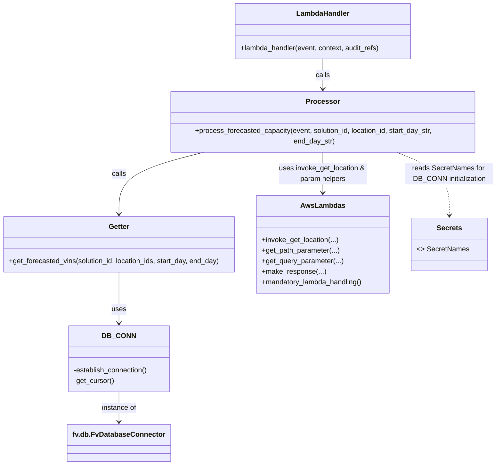

# Diagram: entity_core/entity_service/entity_service/entity/forecasted_capacity/get_forecasted_capacity.py


> Auto-generated by Obscura crawlers

## Diagram 1

```mermaid
flowchart TD
    LH[lambda_handler(event, context, audit_refs)] -->|gets params| PFC[process_forecasted_capacity(event, solution_id, location_id, start_day_str, end_day_str)]
    PFC -->|invoke| IGL[invoke_get_location(event, query_params, path_params, accept)]
    IGL -->|location or null| PFC
    PFC -->|validate dates & build ids| GFV[get_forecasted_vins(solution_id, location_ids, start_day, end_day)]
    GFV -->|establish connection| DB[DB_CONN (FvDatabaseConnector)]
    DB -->|mogrify & execute| SQL[SELECT ... FROM entity_forecasted_counts]
    SQL -->|rows| GFV
    GFV -->|data| PFC
    PFC -->|response| MR[make_response(response)]
    MR --> LH
```

> SVG rendering failed for this diagram.

## Diagram 2

```mermaid
sequenceDiagram
    participant Lambda as lambda_handler
    participant Proc as process_forecasted_capacity
    participant Invoker as invoke_get_location
    participant Getter as get_forecasted_vins
    participant DB as FvDatabaseConnector
    Lambda->>Proc: call with event, context, audit_refs
    Proc->>Invoker: invoke_get_location(event, query_params, path_params, accept)
    Invoker-->>Proc: location (or null)
    Proc->>Proc: parse and validate start/end dates
    Proc->>Getter: get_forecasted_vins(solution_id, locations_ids, start_day, end_day)
    Getter->>DB: establish_connection(); get_cursor(); mogrify(query, replaces); execute
    DB-->>Getter: fetchall rows
    Getter-->>Proc: [{"date":..., "count":...}, ...]
    Proc-->>Lambda: {"data": [...]}
    Lambda->>Lambda: make_response(response)
    Lambda-->>Caller: HTTP response
```

> SVG rendering failed for this diagram.

## Diagram 3



### SVG

<svg id="container" width="1136.30859375" xmlns="http://www.w3.org/2000/svg" class="classDiagram" height="1044" viewBox="0 0 1136.30859375 1044" role="graphics-document document" aria-roledescription="class"><style>#container{font-family:"trebuchet ms",verdana,arial,sans-serif;font-size:16px;fill:#333;}@keyframes edge-animation-frame{from{stroke-dashoffset:0;}}@keyframes dash{to{stroke-dashoffset:0;}}#container .edge-animation-slow{stroke-dasharray:9,5!important;stroke-dashoffset:900;animation:dash 50s linear infinite;stroke-linecap:round;}#container .edge-animation-fast{stroke-dasharray:9,5!important;stroke-dashoffset:900;animation:dash 20s linear infinite;stroke-linecap:round;}#container .error-icon{fill:#552222;}#container .error-text{fill:#552222;stroke:#552222;}#container .edge-thickness-normal{stroke-width:1px;}#container .edge-thickness-thick{stroke-width:3.5px;}#container .edge-pattern-solid{stroke-dasharray:0;}#container .edge-thickness-invisible{stroke-width:0;fill:none;}#container .edge-pattern-dashed{stroke-dasharray:3;}#container .edge-pattern-dotted{stroke-dasharray:2;}#container .marker{fill:#333333;stroke:#333333;}#container .marker.cross{stroke:#333333;}#container svg{font-family:"trebuchet ms",verdana,arial,sans-serif;font-size:16px;}#container p{margin:0;}#container g.classGroup text{fill:#9370DB;stroke:none;font-family:"trebuchet ms",verdana,arial,sans-serif;font-size:10px;}#container g.classGroup text .title{font-weight:bolder;}#container .nodeLabel,#container .edgeLabel{color:#131300;}#container .edgeLabel .label rect{fill:#ECECFF;}#container .label text{fill:#131300;}#container .labelBkg{background:#ECECFF;}#container .edgeLabel .label span{background:#ECECFF;}#container .classTitle{font-weight:bolder;}#container .node rect,#container .node circle,#container .node ellipse,#container .node polygon,#container .node path{fill:#ECECFF;stroke:#9370DB;stroke-width:1px;}#container .divider{stroke:#9370DB;stroke-width:1;}#container g.clickable{cursor:pointer;}#container g.classGroup rect{fill:#ECECFF;stroke:#9370DB;}#container g.classGroup line{stroke:#9370DB;stroke-width:1;}#container .classLabel .box{stroke:none;stroke-width:0;fill:#ECECFF;opacity:0.5;}#container .classLabel .label{fill:#9370DB;font-size:10px;}#container .relation{stroke:#333333;stroke-width:1;fill:none;}#container .dashed-line{stroke-dasharray:3;}#container .dotted-line{stroke-dasharray:1 2;}#container #compositionStart,#container .composition{fill:#333333!important;stroke:#333333!important;stroke-width:1;}#container #compositionEnd,#container .composition{fill:#333333!important;stroke:#333333!important;stroke-width:1;}#container #dependencyStart,#container .dependency{fill:#333333!important;stroke:#333333!important;stroke-width:1;}#container #dependencyStart,#container .dependency{fill:#333333!important;stroke:#333333!important;stroke-width:1;}#container #extensionStart,#container .extension{fill:transparent!important;stroke:#333333!important;stroke-width:1;}#container #extensionEnd,#container .extension{fill:transparent!important;stroke:#333333!important;stroke-width:1;}#container #aggregationStart,#container .aggregation{fill:transparent!important;stroke:#333333!important;stroke-width:1;}#container #aggregationEnd,#container .aggregation{fill:transparent!important;stroke:#333333!important;stroke-width:1;}#container #lollipopStart,#container .lollipop{fill:#ECECFF!important;stroke:#333333!important;stroke-width:1;}#container #lollipopEnd,#container .lollipop{fill:#ECECFF!important;stroke:#333333!important;stroke-width:1;}#container .edgeTerminals{font-size:11px;line-height:initial;}#container .classTitleText{text-anchor:middle;font-size:18px;fill:#333;}#container .label-icon{display:inline-block;height:1em;overflow:visible;vertical-align:-0.125em;}#container .node .label-icon path{fill:currentColor;stroke:revert;stroke-width:revert;}#container :root{--mermaid-font-family:"trebuchet ms",verdana,arial,sans-serif;}</style><g><defs><marker id="container_class-aggregationStart" class="marker aggregation class" refX="18" refY="7" markerWidth="190" markerHeight="240" orient="auto"><path d="M 18,7 L9,13 L1,7 L9,1 Z"></path></marker></defs><defs><marker id="container_class-aggregationEnd" class="marker aggregation class" refX="1" refY="7" markerWidth="20" markerHeight="28" orient="auto"><path d="M 18,7 L9,13 L1,7 L9,1 Z"></path></marker></defs><defs><marker id="container_class-extensionStart" class="marker extension class" refX="18" refY="7" markerWidth="190" markerHeight="240" orient="auto"><path d="M 1,7 L18,13 V 1 Z"></path></marker></defs><defs><marker id="container_class-extensionEnd" class="marker extension class" refX="1" refY="7" markerWidth="20" markerHeight="28" orient="auto"><path d="M 1,1 V 13 L18,7 Z"></path></marker></defs><defs><marker id="container_class-compositionStart" class="marker composition class" refX="18" refY="7" markerWidth="190" markerHeight="240" orient="auto"><path d="M 18,7 L9,13 L1,7 L9,1 Z"></path></marker></defs><defs><marker id="container_class-compositionEnd" class="marker composition class" refX="1" refY="7" markerWidth="20" markerHeight="28" orient="auto"><path d="M 18,7 L9,13 L1,7 L9,1 Z"></path></marker></defs><defs><marker id="container_class-dependencyStart" class="marker dependency class" refX="6" refY="7" markerWidth="190" markerHeight="240" orient="auto"><path d="M 5,7 L9,13 L1,7 L9,1 Z"></path></marker></defs><defs><marker id="container_class-dependencyEnd" class="marker dependency class" refX="13" refY="7" markerWidth="20" markerHeight="28" orient="auto"><path d="M 18,7 L9,13 L14,7 L9,1 Z"></path></marker></defs><defs><marker id="container_class-lollipopStart" class="marker lollipop class" refX="13" refY="7" markerWidth="190" markerHeight="240" orient="auto"><circle stroke="black" fill="transparent" cx="7" cy="7" r="6"></circle></marker></defs><defs><marker id="container_class-lollipopEnd" class="marker lollipop class" refX="1" refY="7" markerWidth="190" markerHeight="240" orient="auto"><circle stroke="black" fill="transparent" cx="7" cy="7" r="6"></circle></marker></defs><g class="root"><g class="clusters"></g><g class="edgePaths"><path d="M743.41,134L743.41,140.167C743.41,146.333,743.41,158.667,743.41,170C743.41,181.333,743.41,191.667,743.41,196.833L743.41,202" id="id_LambdaHandler_Processor_1" class="edge-thickness-normal edge-pattern-solid relation" style=";;;" data-edge="true" data-et="edge" data-id="id_LambdaHandler_Processor_1" data-points="W3sieCI6NzQzLjQxMDE1NjI1LCJ5IjoxMzR9LHsieCI6NzQzLjQxMDE1NjI1LCJ5IjoxNzF9LHsieCI6NzQzLjQxMDE1NjI1LCJ5IjoyMDh9XQ==" marker-end="url(#container_class-dependencyEnd)"></path><path d="M743.41,334L743.41,342.167C743.41,350.333,743.41,366.667,743.41,382C743.41,397.333,743.41,411.667,743.41,418.833L743.41,426" id="id_Processor_AwsLambdas_2" class="edge-thickness-normal edge-pattern-solid relation" style=";;;" data-edge="true" data-et="edge" data-id="id_Processor_AwsLambdas_2" data-points="W3sieCI6NzQzLjQxMDE1NjI1LCJ5IjozMzR9LHsieCI6NzQzLjQxMDE1NjI1LCJ5IjozODN9LHsieCI6NzQzLjQxMDE1NjI1LCJ5Ijo0MzJ9XQ==" marker-end="url(#container_class-dependencyEnd)"></path><path d="M479.824,334L445.655,342.167C411.487,350.333,343.15,366.667,308.981,390C274.813,413.333,274.813,443.667,274.813,458.833L274.813,474" id="id_Processor_Getter_3" class="edge-thickness-normal edge-pattern-solid relation" style=";;;" data-edge="true" data-et="edge" data-id="id_Processor_Getter_3" data-points="W3sieCI6NDc5LjgyMzk3NDYwOTM3NSwieSI6MzM0fSx7IngiOjI3NC44MTI1LCJ5IjozODN9LHsieCI6Mjc0LjgxMjUsInkiOjQ4MH1d" marker-end="url(#container_class-dependencyEnd)"></path><path d="M274.813,606L274.813,620.167C274.813,634.333,274.813,662.667,274.813,682C274.813,701.333,274.813,711.667,274.813,716.833L274.813,722" id="id_Getter_DB_CONN_4" class="edge-thickness-normal edge-pattern-solid relation" style=";;;" data-edge="true" data-et="edge" data-id="id_Getter_DB_CONN_4" data-points="W3sieCI6Mjc0LjgxMjUsInkiOjYwNn0seyJ4IjoyNzQuODEyNSwieSI6NjkxfSx7IngiOjI3NC44MTI1LCJ5Ijo3Mjh9XQ==" marker-end="url(#container_class-dependencyEnd)"></path><path d="M274.813,878L274.813,884.167C274.813,890.333,274.813,902.667,274.813,914C274.813,925.333,274.813,935.667,274.813,940.833L274.813,946" id="id_DB_CONN_fv.db.FvDatabaseConnector_5" class="edge-thickness-normal edge-pattern-solid relation" style=";;;" data-edge="true" data-et="edge" data-id="id_DB_CONN_fv.db.FvDatabaseConnector_5" data-points="W3sieCI6Mjc0LjgxMjUsInkiOjg3OH0seyJ4IjoyNzQuODEyNSwieSI6OTE1fSx7IngiOjI3NC44MTI1LCJ5Ijo5NTJ9XQ==" marker-end="url(#container_class-dependencyEnd)"></path><path d="M903.666,334L924.439,342.167C945.213,350.333,986.761,366.667,1007.535,390.5C1028.309,414.333,1028.309,445.667,1028.309,461.333L1028.309,477" id="id_Processor_Secrets_6" class="edge-thickness-normal edge-pattern-dashed relation" style=";;;" data-edge="true" data-et="edge" data-id="id_Processor_Secrets_6" data-points="W3sieCI6OTAzLjY2NTUyNzM0Mzc1LCJ5IjozMzR9LHsieCI6MTAyOC4zMDg1OTM3NSwieSI6MzgzfSx7IngiOjEwMjguMzA4NTkzNzUsInkiOjQ4M31d" marker-end="url(#container_class-dependencyEnd)"></path></g><g class="edgeLabels"><g class="edgeLabel" transform="translate(743.41015625, 171)"><g class="label" data-id="id_LambdaHandler_Processor_1" transform="translate(-16.4453125, -12)"><foreignObject width="32.890625" height="24"><div xmlns="http://www.w3.org/1999/xhtml" class="labelBkg" style="display: table-cell; white-space: nowrap; line-height: 1.5; max-width: 200px; text-align: center;"><span class="edgeLabel"><p>calls</p></span></div></foreignObject></g></g><g class="edgeLabel" transform="translate(743.41015625, 383)"><g class="label" data-id="id_Processor_AwsLambdas_2" transform="translate(-100, -24)"><foreignObject width="200" height="48"><div xmlns="http://www.w3.org/1999/xhtml" class="labelBkg" style="display: table; white-space: break-spaces; line-height: 1.5; max-width: 200px; text-align: center; width: 200px;"><span class="edgeLabel"><p>uses invoke_get_location &amp; param helpers</p></span></div></foreignObject></g></g><g class="edgeLabel" transform="translate(274.8125, 383)"><g class="label" data-id="id_Processor_Getter_3" transform="translate(-16.4453125, -12)"><foreignObject width="32.890625" height="24"><div xmlns="http://www.w3.org/1999/xhtml" class="labelBkg" style="display: table-cell; white-space: nowrap; line-height: 1.5; max-width: 200px; text-align: center;"><span class="edgeLabel"><p>calls</p></span></div></foreignObject></g></g><g class="edgeLabel" transform="translate(274.8125, 691)"><g class="label" data-id="id_Getter_DB_CONN_4" transform="translate(-16.4921875, -12)"><foreignObject width="32.984375" height="24"><div xmlns="http://www.w3.org/1999/xhtml" class="labelBkg" style="display: table-cell; white-space: nowrap; line-height: 1.5; max-width: 200px; text-align: center;"><span class="edgeLabel"><p>uses</p></span></div></foreignObject></g></g><g class="edgeLabel" transform="translate(274.8125, 915)"><g class="label" data-id="id_DB_CONN_fv.db.FvDatabaseConnector_5" transform="translate(-40.0546875, -12)"><foreignObject width="80.109375" height="24"><div xmlns="http://www.w3.org/1999/xhtml" class="labelBkg" style="display: table-cell; white-space: nowrap; line-height: 1.5; max-width: 200px; text-align: center;"><span class="edgeLabel"><p>instance of</p></span></div></foreignObject></g></g><g class="edgeLabel" transform="translate(1028.30859375, 383)"><g class="label" data-id="id_Processor_Secrets_6" transform="translate(-100, -24)"><foreignObject width="200" height="48"><div xmlns="http://www.w3.org/1999/xhtml" class="labelBkg" style="display: table; white-space: break-spaces; line-height: 1.5; max-width: 200px; text-align: center; width: 200px;"><span class="edgeLabel"><p>reads SecretNames for DB_CONN initialization</p></span></div></foreignObject></g></g></g><g class="nodes"><g class="node default" id="classId-LambdaHandler-0" transform="translate(743.41015625, 71)"><g class="basic label-container"><path d="M-201.953125 -63 L201.953125 -63 L201.953125 63 L-201.953125 63" stroke="none" stroke-width="0" fill="#ECECFF" style=""></path><path d="M-201.953125 -63 C-55.898131476283 -63, 90.156862047434 -63, 201.953125 -63 M-201.953125 -63 C-99.18756178685994 -63, 3.5780014262801103 -63, 201.953125 -63 M201.953125 -63 C201.953125 -37.586082474457456, 201.953125 -12.172164948914912, 201.953125 63 M201.953125 -63 C201.953125 -30.512935163053555, 201.953125 1.9741296738928895, 201.953125 63 M201.953125 63 C52.498791229104455 63, -96.95554254179109 63, -201.953125 63 M201.953125 63 C99.90786432008234 63, -2.1373963598353214 63, -201.953125 63 M-201.953125 63 C-201.953125 14.994854672878347, -201.953125 -33.010290654243306, -201.953125 -63 M-201.953125 63 C-201.953125 33.747820335996806, -201.953125 4.49564067199362, -201.953125 -63" stroke="#9370DB" stroke-width="1.3" fill="none" stroke-dasharray="0 0" style=""></path></g><g class="annotation-group text" transform="translate(0, -39)"></g><g class="label-group text" transform="translate(-58.21875, -39)"><g class="label" style="font-weight: bolder" transform="translate(0,-12)"><foreignObject width="116.4375" height="24"><div xmlns="http://www.w3.org/1999/xhtml" style="display: table-cell; white-space: nowrap; line-height: 1.5; max-width: 167px; text-align: center;"><span class="nodeLabel markdown-node-label" style=""><p>LambdaHandler</p></span></div></foreignObject></g></g><g class="members-group text" transform="translate(-189.953125, 9)"></g><g class="methods-group text" transform="translate(-189.953125, 39)"><g class="label" style="" transform="translate(0,-12)"><foreignObject width="321.6875" height="24"><div xmlns="http://www.w3.org/1999/xhtml" style="display: table-cell; white-space: nowrap; line-height: 1.5; max-width: 379px; text-align: center;"><span class="nodeLabel markdown-node-label" style=""><p>+lambda_handler(event, context, audit_refs)</p></span></div></foreignObject></g></g><g class="divider" style=""><path d="M-201.953125 -15 C-82.97405270531047 -15, 36.00501958937906 -15, 201.953125 -15 M-201.953125 -15 C-71.0058999033194 -15, 59.941325193361195 -15, 201.953125 -15" stroke="#9370DB" stroke-width="1.3" fill="none" stroke-dasharray="0 0" style=""></path></g><g class="divider" style=""><path d="M-201.953125 9 C-55.94675435158072 9, 90.05961629683856 9, 201.953125 9 M-201.953125 9 C-95.9095432977799 9, 10.13403840444019 9, 201.953125 9" stroke="#9370DB" stroke-width="1.3" fill="none" stroke-dasharray="0 0" style=""></path></g></g><g class="node default" id="classId-Processor-1" transform="translate(743.41015625, 271)"><g class="basic label-container"><path d="M-352.3046875 -63 L352.3046875 -63 L352.3046875 63 L-352.3046875 63" stroke="none" stroke-width="0" fill="#ECECFF" style=""></path><path d="M-352.3046875 -63 C-141.2978348075933 -63, 69.70901788481342 -63, 352.3046875 -63 M-352.3046875 -63 C-73.38708907113744 -63, 205.53050935772512 -63, 352.3046875 -63 M352.3046875 -63 C352.3046875 -24.112291682873952, 352.3046875 14.775416634252096, 352.3046875 63 M352.3046875 -63 C352.3046875 -25.606079235570782, 352.3046875 11.787841528858436, 352.3046875 63 M352.3046875 63 C72.02945786385015 63, -208.2457717722997 63, -352.3046875 63 M352.3046875 63 C171.9365129272594 63, -8.4316616454812 63, -352.3046875 63 M-352.3046875 63 C-352.3046875 31.46415271551119, -352.3046875 -0.07169456897761961, -352.3046875 -63 M-352.3046875 63 C-352.3046875 25.394788362711417, -352.3046875 -12.210423274577167, -352.3046875 -63" stroke="#9370DB" stroke-width="1.3" fill="none" stroke-dasharray="0 0" style=""></path></g><g class="annotation-group text" transform="translate(0, -39)"></g><g class="label-group text" transform="translate(-35.921875, -39)"><g class="label" style="font-weight: bolder" transform="translate(0,-12)"><foreignObject width="71.84375" height="24"><div xmlns="http://www.w3.org/1999/xhtml" style="display: table-cell; white-space: nowrap; line-height: 1.5; max-width: 121px; text-align: center;"><span class="nodeLabel markdown-node-label" style=""><p>Processor</p></span></div></foreignObject></g></g><g class="members-group text" transform="translate(-340.3046875, 9)"></g><g class="methods-group text" transform="translate(-340.3046875, 39)"><g class="label" style="" transform="translate(0,-12)"><foreignObject width="644.6875" height="24"><div xmlns="http://www.w3.org/1999/xhtml" style="display: table-cell; white-space: nowrap; line-height: 1.5; max-width: 702px; text-align: center;"><span class="nodeLabel markdown-node-label" style=""><p>+process_forecasted_capacity(event, solution_id, location_id, start_day_str, end_day_str)</p></span></div></foreignObject></g></g><g class="divider" style=""><path d="M-352.3046875 -15 C-139.09987672601477 -15, 74.10493404797046 -15, 352.3046875 -15 M-352.3046875 -15 C-79.10376710418893 -15, 194.09715329162213 -15, 352.3046875 -15" stroke="#9370DB" stroke-width="1.3" fill="none" stroke-dasharray="0 0" style=""></path></g><g class="divider" style=""><path d="M-352.3046875 9 C-105.23246699623925 9, 141.8397535075215 9, 352.3046875 9 M-352.3046875 9 C-80.17264652847524 9, 191.95939444304952 9, 352.3046875 9" stroke="#9370DB" stroke-width="1.3" fill="none" stroke-dasharray="0 0" style=""></path></g></g><g class="node default" id="classId-Getter-2" transform="translate(274.8125, 543)"><g class="basic label-container"><path d="M-266.8125 -63 L266.8125 -63 L266.8125 63 L-266.8125 63" stroke="none" stroke-width="0" fill="#ECECFF" style=""></path><path d="M-266.8125 -63 C-106.63068404065658 -63, 53.55113191868685 -63, 266.8125 -63 M-266.8125 -63 C-99.98009495586479 -63, 66.85231008827043 -63, 266.8125 -63 M266.8125 -63 C266.8125 -31.42656144424463, 266.8125 0.14687711151074012, 266.8125 63 M266.8125 -63 C266.8125 -31.38967750531568, 266.8125 0.22064498936863686, 266.8125 63 M266.8125 63 C157.39736295305684 63, 47.98222590611368 63, -266.8125 63 M266.8125 63 C136.60229914979914 63, 6.392098299598274 63, -266.8125 63 M-266.8125 63 C-266.8125 28.542891394629187, -266.8125 -5.914217210741626, -266.8125 -63 M-266.8125 63 C-266.8125 15.6059975603847, -266.8125 -31.7880048792306, -266.8125 -63" stroke="#9370DB" stroke-width="1.3" fill="none" stroke-dasharray="0 0" style=""></path></g><g class="annotation-group text" transform="translate(0, -39)"></g><g class="label-group text" transform="translate(-23.234375, -39)"><g class="label" style="font-weight: bolder" transform="translate(0,-12)"><foreignObject width="46.46875" height="24"><div xmlns="http://www.w3.org/1999/xhtml" style="display: table-cell; white-space: nowrap; line-height: 1.5; max-width: 96px; text-align: center;"><span class="nodeLabel markdown-node-label" style=""><p>Getter</p></span></div></foreignObject></g></g><g class="members-group text" transform="translate(-254.8125, 9)"></g><g class="methods-group text" transform="translate(-254.8125, 39)"><g class="label" style="" transform="translate(0,-12)"><foreignObject width="486.390625" height="24"><div xmlns="http://www.w3.org/1999/xhtml" style="display: table-cell; white-space: nowrap; line-height: 1.5; max-width: 544px; text-align: center;"><span class="nodeLabel markdown-node-label" style=""><p>+get_forecasted_vins(solution_id, location_ids, start_day, end_day)</p></span></div></foreignObject></g></g><g class="divider" style=""><path d="M-266.8125 -15 C-71.52240270298819 -15, 123.76769459402362 -15, 266.8125 -15 M-266.8125 -15 C-122.66505099047666 -15, 21.482398019046684 -15, 266.8125 -15" stroke="#9370DB" stroke-width="1.3" fill="none" stroke-dasharray="0 0" style=""></path></g><g class="divider" style=""><path d="M-266.8125 9 C-125.49041557126017 9, 15.831668857479656 9, 266.8125 9 M-266.8125 9 C-65.12385654256894 9, 136.5647869148621 9, 266.8125 9" stroke="#9370DB" stroke-width="1.3" fill="none" stroke-dasharray="0 0" style=""></path></g></g><g class="node default" id="classId-AwsLambdas-3" transform="translate(743.41015625, 543)"><g class="basic label-container"><path d="M-151.78515625 -111 L151.78515625 -111 L151.78515625 111 L-151.78515625 111" stroke="none" stroke-width="0" fill="#ECECFF" style=""></path><path d="M-151.78515625 -111 C-70.07769093669197 -111, 11.62977437661607 -111, 151.78515625 -111 M-151.78515625 -111 C-85.49611712027728 -111, -19.207077990554552 -111, 151.78515625 -111 M151.78515625 -111 C151.78515625 -60.749630260514074, 151.78515625 -10.499260521028148, 151.78515625 111 M151.78515625 -111 C151.78515625 -36.324872337618174, 151.78515625 38.35025532476365, 151.78515625 111 M151.78515625 111 C66.67506578299397 111, -18.435024684012063 111, -151.78515625 111 M151.78515625 111 C73.11574680420995 111, -5.553662641580104 111, -151.78515625 111 M-151.78515625 111 C-151.78515625 29.473926445635783, -151.78515625 -52.052147108728434, -151.78515625 -111 M-151.78515625 111 C-151.78515625 42.61023569100445, -151.78515625 -25.779528617991105, -151.78515625 -111" stroke="#9370DB" stroke-width="1.3" fill="none" stroke-dasharray="0 0" style=""></path></g><g class="annotation-group text" transform="translate(0, -87)"></g><g class="label-group text" transform="translate(-47.4921875, -87)"><g class="label" style="font-weight: bolder" transform="translate(0,-12)"><foreignObject width="94.984375" height="24"><div xmlns="http://www.w3.org/1999/xhtml" style="display: table-cell; white-space: nowrap; line-height: 1.5; max-width: 143px; text-align: center;"><span class="nodeLabel markdown-node-label" style=""><p>AwsLambdas</p></span></div></foreignObject></g></g><g class="members-group text" transform="translate(-139.78515625, -39)"></g><g class="methods-group text" transform="translate(-139.78515625, -9)"><g class="label" style="" transform="translate(0,-12)"><foreignObject width="175.59375" height="24"><div xmlns="http://www.w3.org/1999/xhtml" style="display: table-cell; white-space: nowrap; line-height: 1.5; max-width: 233px; text-align: center;"><span class="nodeLabel markdown-node-label" style=""><p>+invoke_get_location(...)</p></span></div></foreignObject></g><g class="label" style="" transform="translate(0,12)"><foreignObject width="177.515625" height="24"><div xmlns="http://www.w3.org/1999/xhtml" style="display: table-cell; white-space: nowrap; line-height: 1.5; max-width: 235px; text-align: center;"><span class="nodeLabel markdown-node-label" style=""><p>+get_path_parameter(...)</p></span></div></foreignObject></g><g class="label" style="" transform="translate(0,36)"><foreignObject width="185.15625" height="24"><div xmlns="http://www.w3.org/1999/xhtml" style="display: table-cell; white-space: nowrap; line-height: 1.5; max-width: 243px; text-align: center;"><span class="nodeLabel markdown-node-label" style=""><p>+get_query_parameter(...)</p></span></div></foreignObject></g><g class="label" style="" transform="translate(0,60)"><foreignObject width="143.375" height="24"><div xmlns="http://www.w3.org/1999/xhtml" style="display: table-cell; white-space: nowrap; line-height: 1.5; max-width: 201px; text-align: center;"><span class="nodeLabel markdown-node-label" style=""><p>+make_response(...)</p></span></div></foreignObject></g><g class="label" style="" transform="translate(0,84)"><foreignObject width="232.078125" height="24"><div xmlns="http://www.w3.org/1999/xhtml" style="display: table-cell; white-space: nowrap; line-height: 1.5; max-width: 289px; text-align: center;"><span class="nodeLabel markdown-node-label" style=""><p>+mandatory_lambda_handling()</p></span></div></foreignObject></g></g><g class="divider" style=""><path d="M-151.78515625 -63 C-42.65765360253606 -63, 66.46984904492788 -63, 151.78515625 -63 M-151.78515625 -63 C-40.23345028680126 -63, 71.31825567639748 -63, 151.78515625 -63" stroke="#9370DB" stroke-width="1.3" fill="none" stroke-dasharray="0 0" style=""></path></g><g class="divider" style=""><path d="M-151.78515625 -39 C-62.95807939195201 -39, 25.868997466095976 -39, 151.78515625 -39 M-151.78515625 -39 C-79.277027756309 -39, -6.7688992626179925 -39, 151.78515625 -39" stroke="#9370DB" stroke-width="1.3" fill="none" stroke-dasharray="0 0" style=""></path></g></g><g class="node default" id="classId-DB_CONN-4" transform="translate(274.8125, 803)"><g class="basic label-container"><path d="M-115.0703125 -75 L115.0703125 -75 L115.0703125 75 L-115.0703125 75" stroke="none" stroke-width="0" fill="#ECECFF" style=""></path><path d="M-115.0703125 -75 C-45.203285190649 -75, 24.663742118702004 -75, 115.0703125 -75 M-115.0703125 -75 C-42.26375602919035 -75, 30.542800441619306 -75, 115.0703125 -75 M115.0703125 -75 C115.0703125 -20.46867407211198, 115.0703125 34.06265185577604, 115.0703125 75 M115.0703125 -75 C115.0703125 -35.58026169523162, 115.0703125 3.83947660953676, 115.0703125 75 M115.0703125 75 C32.78073199863482 75, -49.50884850273036 75, -115.0703125 75 M115.0703125 75 C61.36696598034087 75, 7.663619460681744 75, -115.0703125 75 M-115.0703125 75 C-115.0703125 40.978701627790436, -115.0703125 6.957403255580871, -115.0703125 -75 M-115.0703125 75 C-115.0703125 34.82597749553644, -115.0703125 -5.348045008927116, -115.0703125 -75" stroke="#9370DB" stroke-width="1.3" fill="none" stroke-dasharray="0 0" style=""></path></g><g class="annotation-group text" transform="translate(0, -51)"></g><g class="label-group text" transform="translate(-34.40625, -51)"><g class="label" style="font-weight: bolder" transform="translate(0,-12)"><foreignObject width="68.8125" height="24"><div xmlns="http://www.w3.org/1999/xhtml" style="display: table-cell; white-space: nowrap; line-height: 1.5; max-width: 119px; text-align: center;"><span class="nodeLabel markdown-node-label" style=""><p>DB_CONN</p></span></div></foreignObject></g></g><g class="members-group text" transform="translate(-103.0703125, -3)"></g><g class="methods-group text" transform="translate(-103.0703125, 27)"><g class="label" style="" transform="translate(0,-12)"><foreignObject width="171.734375" height="24"><div xmlns="http://www.w3.org/1999/xhtml" style="display: table-cell; white-space: nowrap; line-height: 1.5; max-width: 229px; text-align: center;"><span class="nodeLabel markdown-node-label" style=""><p>-establish_connection()</p></span></div></foreignObject></g><g class="label" style="" transform="translate(0,12)"><foreignObject width="93.109375" height="24"><div xmlns="http://www.w3.org/1999/xhtml" style="display: table-cell; white-space: nowrap; line-height: 1.5; max-width: 150px; text-align: center;"><span class="nodeLabel markdown-node-label" style=""><p>-get_cursor()</p></span></div></foreignObject></g></g><g class="divider" style=""><path d="M-115.0703125 -27 C-38.865935085337 -27, 37.338442329326 -27, 115.0703125 -27 M-115.0703125 -27 C-26.672292149483198 -27, 61.725728201033604 -27, 115.0703125 -27" stroke="#9370DB" stroke-width="1.3" fill="none" stroke-dasharray="0 0" style=""></path></g><g class="divider" style=""><path d="M-115.0703125 -3 C-32.99340802364078 -3, 49.083496452718435 -3, 115.0703125 -3 M-115.0703125 -3 C-24.737463251860376 -3, 65.59538599627925 -3, 115.0703125 -3" stroke="#9370DB" stroke-width="1.3" fill="none" stroke-dasharray="0 0" style=""></path></g></g><g class="node default" id="classId-Secrets-5" transform="translate(1028.30859375, 543)"><g class="basic label-container"><path d="M-83.11328125 -60 L83.11328125 -60 L83.11328125 60 L-83.11328125 60" stroke="none" stroke-width="0" fill="#ECECFF" style=""></path><path d="M-83.11328125 -60 C-44.31536105944765 -60, -5.5174408688953065 -60, 83.11328125 -60 M-83.11328125 -60 C-36.95332851773568 -60, 9.206624214528645 -60, 83.11328125 -60 M83.11328125 -60 C83.11328125 -20.06275047465961, 83.11328125 19.874499050680782, 83.11328125 60 M83.11328125 -60 C83.11328125 -32.30408177037383, 83.11328125 -4.608163540747661, 83.11328125 60 M83.11328125 60 C49.01692478310304 60, 14.920568316206086 60, -83.11328125 60 M83.11328125 60 C42.551213985159556 60, 1.9891467203191127 60, -83.11328125 60 M-83.11328125 60 C-83.11328125 24.03575438244181, -83.11328125 -11.928491235116383, -83.11328125 -60 M-83.11328125 60 C-83.11328125 30.67173857980747, -83.11328125 1.3434771596149417, -83.11328125 -60" stroke="#9370DB" stroke-width="1.3" fill="none" stroke-dasharray="0 0" style=""></path></g><g class="annotation-group text" transform="translate(0, -36)"></g><g class="label-group text" transform="translate(-27.1640625, -36)"><g class="label" style="font-weight: bolder" transform="translate(0,-12)"><foreignObject width="54.328125" height="24"><div xmlns="http://www.w3.org/1999/xhtml" style="display: table-cell; white-space: nowrap; line-height: 1.5; max-width: 103px; text-align: center;"><span class="nodeLabel markdown-node-label" style=""><p>Secrets</p></span></div></foreignObject></g></g><g class="members-group text" transform="translate(-71.11328125, 12)"><g class="label" style="" transform="translate(0,-12)"><foreignObject width="115.0625" height="24"><div xmlns="http://www.w3.org/1999/xhtml" style="display: table-cell; white-space: nowrap; line-height: 1.5; max-width: 205px; text-align: center;"><span class="nodeLabel markdown-node-label" style=""><p>&lt;&gt; SecretNames</p></span></div></foreignObject></g></g><g class="methods-group text" transform="translate(-71.11328125, 60)"></g><g class="divider" style=""><path d="M-83.11328125 -12 C-43.544089047270944 -12, -3.974896844541888 -12, 83.11328125 -12 M-83.11328125 -12 C-21.29218844116042 -12, 40.52890436767916 -12, 83.11328125 -12" stroke="#9370DB" stroke-width="1.3" fill="none" stroke-dasharray="0 0" style=""></path></g><g class="divider" style=""><path d="M-83.11328125 36 C-30.41517378834922 36, 22.282933673301557 36, 83.11328125 36 M-83.11328125 36 C-20.289576241234535 36, 42.53412876753093 36, 83.11328125 36" stroke="#9370DB" stroke-width="1.3" fill="none" stroke-dasharray="0 0" style=""></path></g></g><g class="node default" id="classId-fv.db.FvDatabaseConnector-6" transform="translate(274.8125, 994)"><g class="basic label-container"><path d="M-111.1953125 -42 L111.1953125 -42 L111.1953125 42 L-111.1953125 42" stroke="none" stroke-width="0" fill="#ECECFF" style=""></path><path d="M-111.1953125 -42 C-47.807140586985476 -42, 15.581031326029049 -42, 111.1953125 -42 M-111.1953125 -42 C-31.963148395153326 -42, 47.26901570969335 -42, 111.1953125 -42 M111.1953125 -42 C111.1953125 -11.492947007955326, 111.1953125 19.014105984089348, 111.1953125 42 M111.1953125 -42 C111.1953125 -17.308762065572772, 111.1953125 7.382475868854456, 111.1953125 42 M111.1953125 42 C37.305590995901525 42, -36.58413050819695 42, -111.1953125 42 M111.1953125 42 C50.46947837413976 42, -10.256355751720477 42, -111.1953125 42 M-111.1953125 42 C-111.1953125 14.373692021052339, -111.1953125 -13.252615957895323, -111.1953125 -42 M-111.1953125 42 C-111.1953125 12.368977272996155, -111.1953125 -17.26204545400769, -111.1953125 -42" stroke="#9370DB" stroke-width="1.3" fill="none" stroke-dasharray="0 0" style=""></path></g><g class="annotation-group text" transform="translate(0, -18)"></g><g class="label-group text" transform="translate(-99.1953125, -18)"><g class="label" style="font-weight: bolder" transform="translate(0,-12)"><foreignObject width="198.390625" height="24"><div xmlns="http://www.w3.org/1999/xhtml" style="display: table-cell; white-space: nowrap; line-height: 1.5; max-width: 246px; text-align: center;"><span class="nodeLabel markdown-node-label" style=""><p>fv.db.FvDatabaseConnector</p></span></div></foreignObject></g></g><g class="members-group text" transform="translate(-99.1953125, 30)"></g><g class="methods-group text" transform="translate(-99.1953125, 60)"></g><g class="divider" style=""><path d="M-111.1953125 6 C-34.58878267172712 6, 42.01774715654577 6, 111.1953125 6 M-111.1953125 6 C-35.7149052568372 6, 39.7655019863256 6, 111.1953125 6" stroke="#9370DB" stroke-width="1.3" fill="none" stroke-dasharray="0 0" style=""></path></g><g class="divider" style=""><path d="M-111.1953125 24 C-57.56481805941339 24, -3.934323618826781 24, 111.1953125 24 M-111.1953125 24 C-36.1244619017524 24, 38.946388696495205 24, 111.1953125 24" stroke="#9370DB" stroke-width="1.3" fill="none" stroke-dasharray="0 0" style=""></path></g></g></g></g></g></svg>
