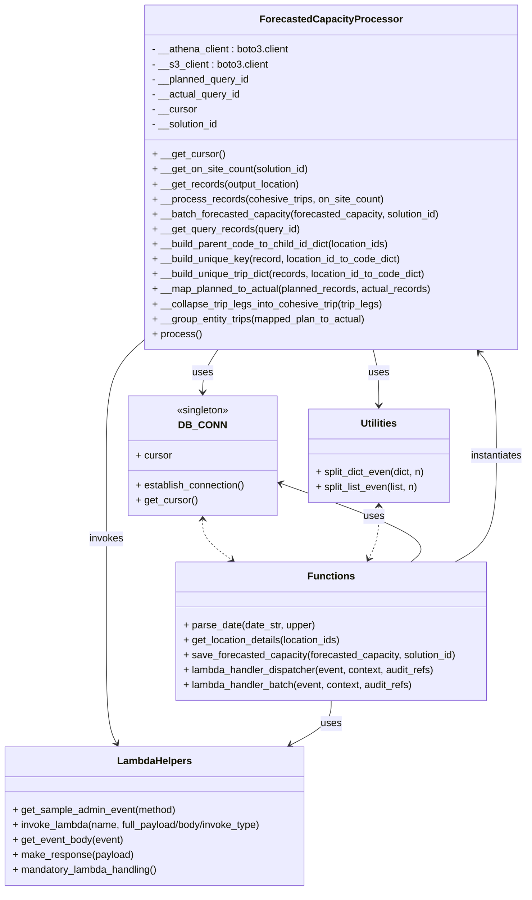

# Diagram: entity_core/entity_service/entity_service/entity/forecasted_capacity/process_forecasted_capacity.py


> Auto-generated by Obscura crawlers

## Diagram 1



### SVG

<svg id="container" width="864.4921875" xmlns="http://www.w3.org/2000/svg" class="classDiagram" height="1426" viewBox="0 0 864.4921875 1426" role="graphics-document document" aria-roledescription="class"><style>#container{font-family:"trebuchet ms",verdana,arial,sans-serif;font-size:16px;fill:#333;}@keyframes edge-animation-frame{from{stroke-dashoffset:0;}}@keyframes dash{to{stroke-dashoffset:0;}}#container .edge-animation-slow{stroke-dasharray:9,5!important;stroke-dashoffset:900;animation:dash 50s linear infinite;stroke-linecap:round;}#container .edge-animation-fast{stroke-dasharray:9,5!important;stroke-dashoffset:900;animation:dash 20s linear infinite;stroke-linecap:round;}#container .error-icon{fill:#552222;}#container .error-text{fill:#552222;stroke:#552222;}#container .edge-thickness-normal{stroke-width:1px;}#container .edge-thickness-thick{stroke-width:3.5px;}#container .edge-pattern-solid{stroke-dasharray:0;}#container .edge-thickness-invisible{stroke-width:0;fill:none;}#container .edge-pattern-dashed{stroke-dasharray:3;}#container .edge-pattern-dotted{stroke-dasharray:2;}#container .marker{fill:#333333;stroke:#333333;}#container .marker.cross{stroke:#333333;}#container svg{font-family:"trebuchet ms",verdana,arial,sans-serif;font-size:16px;}#container p{margin:0;}#container g.classGroup text{fill:#9370DB;stroke:none;font-family:"trebuchet ms",verdana,arial,sans-serif;font-size:10px;}#container g.classGroup text .title{font-weight:bolder;}#container .nodeLabel,#container .edgeLabel{color:#131300;}#container .edgeLabel .label rect{fill:#ECECFF;}#container .label text{fill:#131300;}#container .labelBkg{background:#ECECFF;}#container .edgeLabel .label span{background:#ECECFF;}#container .classTitle{font-weight:bolder;}#container .node rect,#container .node circle,#container .node ellipse,#container .node polygon,#container .node path{fill:#ECECFF;stroke:#9370DB;stroke-width:1px;}#container .divider{stroke:#9370DB;stroke-width:1;}#container g.clickable{cursor:pointer;}#container g.classGroup rect{fill:#ECECFF;stroke:#9370DB;}#container g.classGroup line{stroke:#9370DB;stroke-width:1;}#container .classLabel .box{stroke:none;stroke-width:0;fill:#ECECFF;opacity:0.5;}#container .classLabel .label{fill:#9370DB;font-size:10px;}#container .relation{stroke:#333333;stroke-width:1;fill:none;}#container .dashed-line{stroke-dasharray:3;}#container .dotted-line{stroke-dasharray:1 2;}#container #compositionStart,#container .composition{fill:#333333!important;stroke:#333333!important;stroke-width:1;}#container #compositionEnd,#container .composition{fill:#333333!important;stroke:#333333!important;stroke-width:1;}#container #dependencyStart,#container .dependency{fill:#333333!important;stroke:#333333!important;stroke-width:1;}#container #dependencyStart,#container .dependency{fill:#333333!important;stroke:#333333!important;stroke-width:1;}#container #extensionStart,#container .extension{fill:transparent!important;stroke:#333333!important;stroke-width:1;}#container #extensionEnd,#container .extension{fill:transparent!important;stroke:#333333!important;stroke-width:1;}#container #aggregationStart,#container .aggregation{fill:transparent!important;stroke:#333333!important;stroke-width:1;}#container #aggregationEnd,#container .aggregation{fill:transparent!important;stroke:#333333!important;stroke-width:1;}#container #lollipopStart,#container .lollipop{fill:#ECECFF!important;stroke:#333333!important;stroke-width:1;}#container #lollipopEnd,#container .lollipop{fill:#ECECFF!important;stroke:#333333!important;stroke-width:1;}#container .edgeTerminals{font-size:11px;line-height:initial;}#container .classTitleText{text-anchor:middle;font-size:18px;fill:#333;}#container .label-icon{display:inline-block;height:1em;overflow:visible;vertical-align:-0.125em;}#container .node .label-icon path{fill:currentColor;stroke:revert;stroke-width:revert;}#container :root{--mermaid-font-family:"trebuchet ms",verdana,arial,sans-serif;}</style><g><defs><marker id="container_class-aggregationStart" class="marker aggregation class" refX="18" refY="7" markerWidth="190" markerHeight="240" orient="auto"><path d="M 18,7 L9,13 L1,7 L9,1 Z"></path></marker></defs><defs><marker id="container_class-aggregationEnd" class="marker aggregation class" refX="1" refY="7" markerWidth="20" markerHeight="28" orient="auto"><path d="M 18,7 L9,13 L1,7 L9,1 Z"></path></marker></defs><defs><marker id="container_class-extensionStart" class="marker extension class" refX="18" refY="7" markerWidth="190" markerHeight="240" orient="auto"><path d="M 1,7 L18,13 V 1 Z"></path></marker></defs><defs><marker id="container_class-extensionEnd" class="marker extension class" refX="1" refY="7" markerWidth="20" markerHeight="28" orient="auto"><path d="M 1,1 V 13 L18,7 Z"></path></marker></defs><defs><marker id="container_class-compositionStart" class="marker composition class" refX="18" refY="7" markerWidth="190" markerHeight="240" orient="auto"><path d="M 18,7 L9,13 L1,7 L9,1 Z"></path></marker></defs><defs><marker id="container_class-compositionEnd" class="marker composition class" refX="1" refY="7" markerWidth="20" markerHeight="28" orient="auto"><path d="M 18,7 L9,13 L1,7 L9,1 Z"></path></marker></defs><defs><marker id="container_class-dependencyStart" class="marker dependency class" refX="6" refY="7" markerWidth="190" markerHeight="240" orient="auto"><path d="M 5,7 L9,13 L1,7 L9,1 Z"></path></marker></defs><defs><marker id="container_class-dependencyEnd" class="marker dependency class" refX="13" refY="7" markerWidth="20" markerHeight="28" orient="auto"><path d="M 18,7 L9,13 L14,7 L9,1 Z"></path></marker></defs><defs><marker id="container_class-lollipopStart" class="marker lollipop class" refX="13" refY="7" markerWidth="190" markerHeight="240" orient="auto"><circle stroke="black" fill="transparent" cx="7" cy="7" r="6"></circle></marker></defs><defs><marker id="container_class-lollipopEnd" class="marker lollipop class" refX="1" refY="7" markerWidth="190" markerHeight="240" orient="auto"><circle stroke="black" fill="transparent" cx="7" cy="7" r="6"></circle></marker></defs><g class="root"><g class="clusters"></g><g class="edgePaths"><path d="M357.609,560L353.52,566.167C349.43,572.333,341.25,584.667,337.16,596C333.07,607.333,333.07,617.667,333.07,622.833L333.07,628" id="id_ForecastedCapacityProcessor_DB_CONN_1" class="edge-thickness-normal edge-pattern-solid relation" style=";;;" data-edge="true" data-et="edge" data-id="id_ForecastedCapacityProcessor_DB_CONN_1" data-points="W3sieCI6MzU3LjYwOTQ1NjEyMDIwNzcsInkiOjU2MH0seyJ4IjozMzMuMDcwMzEyNSwieSI6NTk3fSx7IngiOjMzMy4wNzAzMTI1LCJ5Ijo2MzR9XQ==" marker-end="url(#container_class-dependencyEnd)"></path><path d="M611.007,560L612.579,566.167C614.15,572.333,617.294,584.667,618.866,599.5C620.438,614.333,620.438,631.667,620.438,640.333L620.438,649" id="id_ForecastedCapacityProcessor_Utilities_2" class="edge-thickness-normal edge-pattern-solid relation" style=";;;" data-edge="true" data-et="edge" data-id="id_ForecastedCapacityProcessor_Utilities_2" data-points="W3sieCI6NjExLjAwNjcyMDQ5NzIwNDUsInkiOjU2MH0seyJ4Ijo2MjAuNDM3NSwieSI6NTk3fSx7IngiOjYyMC40Mzc1LCJ5Ijo2NTV9XQ==" marker-end="url(#container_class-dependencyEnd)"></path><path d="M242.26,540.077L231.205,549.564C220.15,559.052,198.04,578.026,186.985,609.68C175.93,641.333,175.93,685.667,175.93,730C175.93,774.333,175.93,818.667,175.93,865.5C175.93,912.333,175.93,961.667,175.93,1011C175.93,1060.333,175.93,1109.667,178.735,1139.617C181.539,1169.567,187.149,1180.134,189.954,1185.417L192.759,1190.7" id="id_ForecastedCapacityProcessor_LambdaHelpers_3" class="edge-thickness-normal edge-pattern-solid relation" style=";;;" data-edge="true" data-et="edge" data-id="id_ForecastedCapacityProcessor_LambdaHelpers_3" data-points="W3sieCI6MjQyLjI1OTc2NTYyNSwieSI6NTQwLjA3NzM0Nzc3MDQ0MTR9LHsieCI6MTc1LjkyOTY4NzUsInkiOjU5N30seyJ4IjoxNzUuOTI5Njg3NSwieSI6NzMwfSx7IngiOjE3NS45Mjk2ODc1LCJ5Ijo4NjN9LHsieCI6MTc1LjkyOTY4NzUsInkiOjEwMTF9LHsieCI6MTc1LjkyOTY4NzUsInkiOjExNTl9LHsieCI6MTk1LjU3MjI2NTYyNSwieSI6MTE5Nn1d" marker-end="url(#container_class-dependencyEnd)"></path><path d="M672.92,900L680.268,893.833C687.616,887.667,702.312,875.333,666.972,854.379C631.632,833.425,546.256,803.85,503.568,789.062L460.88,774.275" id="id_Functions_DB_CONN_4" class="edge-thickness-normal edge-pattern-solid relation" style=";;;" data-edge="true" data-et="edge" data-id="id_Functions_DB_CONN_4" data-points="W3sieCI6NjcyLjkyMDQxMDE1NjI1LCJ5Ijo5MDB9LHsieCI6NzE3LjAwNzgxMjUsInkiOjg2M30seyJ4Ijo0NTUuMjEwOTM3NSwieSI6NzcyLjMxMDgwMDkxMTYwNjd9XQ==" marker-end="url(#container_class-dependencyEnd)"></path><path d="M540.658,1122L540.658,1128.167C540.658,1134.333,540.658,1146.667,529.623,1158.541C518.588,1170.415,496.518,1181.829,485.483,1187.536L474.448,1193.244" id="id_Functions_LambdaHelpers_5" class="edge-thickness-normal edge-pattern-solid relation" style=";;;" data-edge="true" data-et="edge" data-id="id_Functions_LambdaHelpers_5" data-points="W3sieCI6NTQwLjY1ODIwMzEyNSwieSI6MTEyMn0seyJ4Ijo1NDAuNjU4MjAzMTI1LCJ5IjoxMTU5fSx7IngiOjQ2OS4xMTg2NTIzNDM3NSwieSI6MTE5Nn1d" marker-end="url(#container_class-dependencyEnd)"></path><path d="M745.348,900L756.72,893.833C768.091,887.667,790.835,875.333,802.206,847C813.578,818.667,813.578,774.333,813.578,730C813.578,685.667,813.578,641.333,808.858,613.754C804.138,586.174,794.699,575.348,789.979,569.935L785.259,564.522" id="id_Functions_ForecastedCapacityProcessor_6" class="edge-thickness-normal edge-pattern-solid relation" style=";;;" data-edge="true" data-et="edge" data-id="id_Functions_ForecastedCapacityProcessor_6" data-points="W3sieCI6NzQ1LjM0ODE0NDUzMTI1LCJ5Ijo5MDB9LHsieCI6ODEzLjU3ODEyNSwieSI6ODYzfSx7IngiOjgxMy41NzgxMjUsInkiOjczMH0seyJ4Ijo4MTMuNTc4MTI1LCJ5Ijo1OTd9LHsieCI6NzgxLjMxNjAyNTYwOTAyNTYsInkiOjU2MH1d" marker-end="url(#container_class-dependencyEnd)"></path><path d="M333.07,832L333.07,837.167C333.07,842.333,333.07,852.667,340.906,863.419C348.741,874.172,364.411,885.345,372.247,890.931L380.082,896.517" id="id_DB_CONN_Functions_7" class="edge-thickness-normal edge-pattern-dashed relation" style=";;;" data-edge="true" data-et="edge" data-id="id_DB_CONN_Functions_7" data-points="W3sieCI6MzMzLjA3MDMxMjUsInkiOjgyNn0seyJ4IjozMzMuMDcwMzEyNSwieSI6ODYzfSx7IngiOjM4NC45NjcyODUxNTYyNSwieSI6OTAwfV0=" marker-start="url(#container_class-dependencyStart)" marker-end="url(#container_class-dependencyEnd)"></path><path d="M620.438,811L620.438,819.667C620.438,828.333,620.438,845.667,617.588,859.62C614.738,873.573,609.039,884.146,606.189,889.432L603.34,894.718" id="id_Utilities_Functions_8" class="edge-thickness-normal edge-pattern-dashed relation" style=";;;" data-edge="true" data-et="edge" data-id="id_Utilities_Functions_8" data-points="W3sieCI6NjIwLjQzNzUsInkiOjgwNX0seyJ4Ijo2MjAuNDM3NSwieSI6ODYzfSx7IngiOjYwMC40OTI2NzU3ODEyNSwieSI6OTAwfV0=" marker-start="url(#container_class-dependencyStart)" marker-end="url(#container_class-dependencyEnd)"></path></g><g class="edgeLabels"><g class="edgeLabel" transform="translate(333.0703125, 597)"><g class="label" data-id="id_ForecastedCapacityProcessor_DB_CONN_1" transform="translate(-16.4921875, -12)"><foreignObject width="32.984375" height="24"><div xmlns="http://www.w3.org/1999/xhtml" class="labelBkg" style="display: table-cell; white-space: nowrap; line-height: 1.5; max-width: 200px; text-align: center;"><span class="edgeLabel"><p>uses</p></span></div></foreignObject></g></g><g class="edgeLabel" transform="translate(620.4375, 597)"><g class="label" data-id="id_ForecastedCapacityProcessor_Utilities_2" transform="translate(-16.4921875, -12)"><foreignObject width="32.984375" height="24"><div xmlns="http://www.w3.org/1999/xhtml" class="labelBkg" style="display: table-cell; white-space: nowrap; line-height: 1.5; max-width: 200px; text-align: center;"><span class="edgeLabel"><p>uses</p></span></div></foreignObject></g></g><g class="edgeLabel" transform="translate(175.9296875, 863)"><g class="label" data-id="id_ForecastedCapacityProcessor_LambdaHelpers_3" transform="translate(-27.5859375, -12)"><foreignObject width="55.171875" height="24"><div xmlns="http://www.w3.org/1999/xhtml" class="labelBkg" style="display: table-cell; white-space: nowrap; line-height: 1.5; max-width: 200px; text-align: center;"><span class="edgeLabel"><p>invokes</p></span></div></foreignObject></g></g><g class="edgeLabel" transform="translate(613.30205, 827.07523)"><g class="label" data-id="id_Functions_DB_CONN_4" transform="translate(-16.4921875, -12)"><foreignObject width="32.984375" height="24"><div xmlns="http://www.w3.org/1999/xhtml" class="labelBkg" style="display: table-cell; white-space: nowrap; line-height: 1.5; max-width: 200px; text-align: center;"><span class="edgeLabel"><p>uses</p></span></div></foreignObject></g></g><g class="edgeLabel" transform="translate(540.658203125, 1159)"><g class="label" data-id="id_Functions_LambdaHelpers_5" transform="translate(-16.4921875, -12)"><foreignObject width="32.984375" height="24"><div xmlns="http://www.w3.org/1999/xhtml" class="labelBkg" style="display: table-cell; white-space: nowrap; line-height: 1.5; max-width: 200px; text-align: center;"><span class="edgeLabel"><p>uses</p></span></div></foreignObject></g></g><g class="edgeLabel" transform="translate(813.578125, 730)"><g class="label" data-id="id_Functions_ForecastedCapacityProcessor_6" transform="translate(-42.9140625, -12)"><foreignObject width="85.828125" height="24"><div xmlns="http://www.w3.org/1999/xhtml" class="labelBkg" style="display: table-cell; white-space: nowrap; line-height: 1.5; max-width: 200px; text-align: center;"><span class="edgeLabel"><p>instantiates</p></span></div></foreignObject></g></g><g class="edgeLabel"><g class="label" data-id="id_DB_CONN_Functions_7" transform="translate(0, 0)"><foreignObject width="0" height="0"><div xmlns="http://www.w3.org/1999/xhtml" class="labelBkg" style="display: table-cell; white-space: nowrap; line-height: 1.5; max-width: 200px; text-align: center;"><span class="edgeLabel"></span></div></foreignObject></g></g><g class="edgeLabel"><g class="label" data-id="id_Utilities_Functions_8" transform="translate(0, 0)"><foreignObject width="0" height="0"><div xmlns="http://www.w3.org/1999/xhtml" class="labelBkg" style="display: table-cell; white-space: nowrap; line-height: 1.5; max-width: 200px; text-align: center;"><span class="edgeLabel"></span></div></foreignObject></g></g></g><g class="nodes"><g class="node default" id="classId-ForecastedCapacityProcessor-0" transform="translate(540.658203125, 284)"><g class="basic label-container"><path d="M-298.3984375 -276 L298.3984375 -276 L298.3984375 276 L-298.3984375 276" stroke="none" stroke-width="0" fill="#ECECFF" style=""></path><path d="M-298.3984375 -276 C-137.1977444161531 -276, 24.002948667693772 -276, 298.3984375 -276 M-298.3984375 -276 C-137.9546000698233 -276, 22.4892373603534 -276, 298.3984375 -276 M298.3984375 -276 C298.3984375 -81.81931018442617, 298.3984375 112.36137963114766, 298.3984375 276 M298.3984375 -276 C298.3984375 -112.46672236249972, 298.3984375 51.06655527500055, 298.3984375 276 M298.3984375 276 C95.61957746283062 276, -107.15928257433876 276, -298.3984375 276 M298.3984375 276 C126.00218748814888 276, -46.394062523702246 276, -298.3984375 276 M-298.3984375 276 C-298.3984375 115.19772662898325, -298.3984375 -45.604546742033506, -298.3984375 -276 M-298.3984375 276 C-298.3984375 95.87739477456239, -298.3984375 -84.24521045087522, -298.3984375 -276" stroke="#9370DB" stroke-width="1.3" fill="none" stroke-dasharray="0 0" style=""></path></g><g class="annotation-group text" transform="translate(0, -252)"></g><g class="label-group text" transform="translate(-106.9375, -252)"><g class="label" style="font-weight: bolder" transform="translate(0,-12)"><foreignObject width="213.875" height="24"><div xmlns="http://www.w3.org/1999/xhtml" style="display: table-cell; white-space: nowrap; line-height: 1.5; max-width: 261px; text-align: center;"><span class="nodeLabel markdown-node-label" style=""><p>ForecastedCapacityProcessor</p></span></div></foreignObject></g></g><g class="members-group text" transform="translate(-286.3984375, -204)"><g class="label" style="" transform="translate(0,-12)"><foreignObject width="224.34375" height="24"><div xmlns="http://www.w3.org/1999/xhtml" style="display: table-cell; white-space: nowrap; line-height: 1.5; max-width: 282px; text-align: center;"><span class="nodeLabel markdown-node-label" style=""><p>- __athena_client : boto3.client</p></span></div></foreignObject></g><g class="label" style="" transform="translate(0,12)"><foreignObject width="189.140625" height="24"><div xmlns="http://www.w3.org/1999/xhtml" style="display: table-cell; white-space: nowrap; line-height: 1.5; max-width: 247px; text-align: center;"><span class="nodeLabel markdown-node-label" style=""><p>- __s3_client : boto3.client</p></span></div></foreignObject></g><g class="label" style="" transform="translate(0,36)"><foreignObject width="158.59375" height="24"><div xmlns="http://www.w3.org/1999/xhtml" style="display: table-cell; white-space: nowrap; line-height: 1.5; max-width: 216px; text-align: center;"><span class="nodeLabel markdown-node-label" style=""><p>- __planned_query_id</p></span></div></foreignObject></g><g class="label" style="" transform="translate(0,60)"><foreignObject width="143.09375" height="24"><div xmlns="http://www.w3.org/1999/xhtml" style="display: table-cell; white-space: nowrap; line-height: 1.5; max-width: 200px; text-align: center;"><span class="nodeLabel markdown-node-label" style=""><p>- __actual_query_id</p></span></div></foreignObject></g><g class="label" style="" transform="translate(0,84)"><foreignObject width="72.578125" height="24"><div xmlns="http://www.w3.org/1999/xhtml" style="display: table-cell; white-space: nowrap; line-height: 1.5; max-width: 131px; text-align: center;"><span class="nodeLabel markdown-node-label" style=""><p>- __cursor</p></span></div></foreignObject></g><g class="label" style="" transform="translate(0,108)"><foreignObject width="109.40625" height="24"><div xmlns="http://www.w3.org/1999/xhtml" style="display: table-cell; white-space: nowrap; line-height: 1.5; max-width: 167px; text-align: center;"><span class="nodeLabel markdown-node-label" style=""><p>- __solution_id</p></span></div></foreignObject></g></g><g class="methods-group text" transform="translate(-286.3984375, -36)"><g class="label" style="" transform="translate(0,-12)"><foreignObject width="115.515625" height="24"><div xmlns="http://www.w3.org/1999/xhtml" style="display: table-cell; white-space: nowrap; line-height: 1.5; max-width: 173px; text-align: center;"><span class="nodeLabel markdown-node-label" style=""><p>+ __get_cursor()</p></span></div></foreignObject></g><g class="label" style="" transform="translate(0,12)"><foreignObject width="254.109375" height="24"><div xmlns="http://www.w3.org/1999/xhtml" style="display: table-cell; white-space: nowrap; line-height: 1.5; max-width: 311px; text-align: center;"><span class="nodeLabel markdown-node-label" style=""><p>+ __get_on_site_count(solution_id)</p></span></div></foreignObject></g><g class="label" style="" transform="translate(0,36)"><foreignObject width="240.265625" height="24"><div xmlns="http://www.w3.org/1999/xhtml" style="display: table-cell; white-space: nowrap; line-height: 1.5; max-width: 298px; text-align: center;"><span class="nodeLabel markdown-node-label" style=""><p>+ __get_records(output_location)</p></span></div></foreignObject></g><g class="label" style="" transform="translate(0,60)"><foreignObject width="370.859375" height="24"><div xmlns="http://www.w3.org/1999/xhtml" style="display: table-cell; white-space: nowrap; line-height: 1.5; max-width: 428px; text-align: center;"><span class="nodeLabel markdown-node-label" style=""><p>+ __process_records(cohesive_trips, on_site_count)</p></span></div></foreignObject></g><g class="label" style="" transform="translate(0,84)"><foreignObject width="465.859375" height="24"><div xmlns="http://www.w3.org/1999/xhtml" style="display: table-cell; white-space: nowrap; line-height: 1.5; max-width: 523px; text-align: center;"><span class="nodeLabel markdown-node-label" style=""><p>+ __batch_forecasted_capacity(forecasted_capacity, solution_id)</p></span></div></foreignObject></g><g class="label" style="" transform="translate(0,108)"><foreignObject width="236.671875" height="24"><div xmlns="http://www.w3.org/1999/xhtml" style="display: table-cell; white-space: nowrap; line-height: 1.5; max-width: 294px; text-align: center;"><span class="nodeLabel markdown-node-label" style=""><p>+ __get_query_records(query_id)</p></span></div></foreignObject></g><g class="label" style="" transform="translate(0,132)"><foreignObject width="388.359375" height="24"><div xmlns="http://www.w3.org/1999/xhtml" style="display: table-cell; white-space: nowrap; line-height: 1.5; max-width: 446px; text-align: center;"><span class="nodeLabel markdown-node-label" style=""><p>+ __build_parent_code_to_child_id_dict(location_ids)</p></span></div></foreignObject></g><g class="label" style="" transform="translate(0,156)"><foreignObject width="404.65625" height="24"><div xmlns="http://www.w3.org/1999/xhtml" style="display: table-cell; white-space: nowrap; line-height: 1.5; max-width: 462px; text-align: center;"><span class="nodeLabel markdown-node-label" style=""><p>+ __build_unique_key(record, location_id_to_code_dict)</p></span></div></foreignObject></g><g class="label" style="" transform="translate(0,180)"><foreignObject width="448.375" height="24"><div xmlns="http://www.w3.org/1999/xhtml" style="display: table-cell; white-space: nowrap; line-height: 1.5; max-width: 506px; text-align: center;"><span class="nodeLabel markdown-node-label" style=""><p>+ __build_unique_trip_dict(records, location_id_to_code_dict)</p></span></div></foreignObject></g><g class="label" style="" transform="translate(0,204)"><foreignObject width="450.984375" height="24"><div xmlns="http://www.w3.org/1999/xhtml" style="display: table-cell; white-space: nowrap; line-height: 1.5; max-width: 508px; text-align: center;"><span class="nodeLabel markdown-node-label" style=""><p>+ __map_planned_to_actual(planned_records, actual_records)</p></span></div></foreignObject></g><g class="label" style="" transform="translate(0,228)"><foreignObject width="373.8125" height="24"><div xmlns="http://www.w3.org/1999/xhtml" style="display: table-cell; white-space: nowrap; line-height: 1.5; max-width: 431px; text-align: center;"><span class="nodeLabel markdown-node-label" style=""><p>+ __collapse_trip_legs_into_cohesive_trip(trip_legs)</p></span></div></foreignObject></g><g class="label" style="" transform="translate(0,252)"><foreignObject width="347.453125" height="24"><div xmlns="http://www.w3.org/1999/xhtml" style="display: table-cell; white-space: nowrap; line-height: 1.5; max-width: 405px; text-align: center;"><span class="nodeLabel markdown-node-label" style=""><p>+ __group_entity_trips(mapped_plan_to_actual)</p></span></div></foreignObject></g><g class="label" style="" transform="translate(0,276)"><foreignObject width="77.96875" height="24"><div xmlns="http://www.w3.org/1999/xhtml" style="display: table-cell; white-space: nowrap; line-height: 1.5; max-width: 135px; text-align: center;"><span class="nodeLabel markdown-node-label" style=""><p>+ process()</p></span></div></foreignObject></g></g><g class="divider" style=""><path d="M-298.3984375 -228 C-169.09371157153302 -228, -39.78898564306604 -228, 298.3984375 -228 M-298.3984375 -228 C-143.67332889709502 -228, 11.051779705809963 -228, 298.3984375 -228" stroke="#9370DB" stroke-width="1.3" fill="none" stroke-dasharray="0 0" style=""></path></g><g class="divider" style=""><path d="M-298.3984375 -60 C-178.59473653992546 -60, -58.791035579850956 -60, 298.3984375 -60 M-298.3984375 -60 C-161.0297998733379 -60, -23.661162246675815 -60, 298.3984375 -60" stroke="#9370DB" stroke-width="1.3" fill="none" stroke-dasharray="0 0" style=""></path></g></g><g class="node default" id="classId-DB_CONN-1" transform="translate(333.0703125, 730)"><g class="basic label-container"><path d="M-122.140625 -96 L122.140625 -96 L122.140625 96 L-122.140625 96" stroke="none" stroke-width="0" fill="#ECECFF" style=""></path><path d="M-122.140625 -96 C-67.19114268027361 -96, -12.241660360547229 -96, 122.140625 -96 M-122.140625 -96 C-64.42539074246727 -96, -6.710156484934529 -96, 122.140625 -96 M122.140625 -96 C122.140625 -25.772197216045654, 122.140625 44.45560556790869, 122.140625 96 M122.140625 -96 C122.140625 -39.5629535370748, 122.140625 16.874092925850405, 122.140625 96 M122.140625 96 C35.01753217730011 96, -52.10556064539978 96, -122.140625 96 M122.140625 96 C56.818824407981964 96, -8.502976184036072 96, -122.140625 96 M-122.140625 96 C-122.140625 57.17235588255538, -122.140625 18.34471176511076, -122.140625 -96 M-122.140625 96 C-122.140625 41.35391877494072, -122.140625 -13.292162450118553, -122.140625 -96" stroke="#9370DB" stroke-width="1.3" fill="none" stroke-dasharray="0 0" style=""></path></g><g class="annotation-group text" transform="translate(-42.765625, -72)"><g class="label" style="" transform="translate(0,-12)"><foreignObject width="85.53125" height="24"><div xmlns="http://www.w3.org/1999/xhtml" style="display: table-cell; white-space: nowrap; line-height: 1.5; max-width: 136px; text-align: center;"><span class="nodeLabel markdown-node-label" style=""><p>«singleton»</p></span></div></foreignObject></g></g><g class="label-group text" transform="translate(-34.40625, -48)"><g class="label" style="font-weight: bolder" transform="translate(0,-12)"><foreignObject width="68.8125" height="24"><div xmlns="http://www.w3.org/1999/xhtml" style="display: table-cell; white-space: nowrap; line-height: 1.5; max-width: 119px; text-align: center;"><span class="nodeLabel markdown-node-label" style=""><p>DB_CONN</p></span></div></foreignObject></g></g><g class="members-group text" transform="translate(-110.140625, 0)"><g class="label" style="" transform="translate(0,-12)"><foreignObject width="57.953125" height="24"><div xmlns="http://www.w3.org/1999/xhtml" style="display: table-cell; white-space: nowrap; line-height: 1.5; max-width: 116px; text-align: center;"><span class="nodeLabel markdown-node-label" style=""><p>+ cursor</p></span></div></foreignObject></g></g><g class="methods-group text" transform="translate(-110.140625, 48)"><g class="label" style="" transform="translate(0,-12)"><foreignObject width="177.515625" height="24"><div xmlns="http://www.w3.org/1999/xhtml" style="display: table-cell; white-space: nowrap; line-height: 1.5; max-width: 235px; text-align: center;"><span class="nodeLabel markdown-node-label" style=""><p>+ establish_connection()</p></span></div></foreignObject></g><g class="label" style="" transform="translate(0,12)"><foreignObject width="98.890625" height="24"><div xmlns="http://www.w3.org/1999/xhtml" style="display: table-cell; white-space: nowrap; line-height: 1.5; max-width: 156px; text-align: center;"><span class="nodeLabel markdown-node-label" style=""><p>+ get_cursor()</p></span></div></foreignObject></g></g><g class="divider" style=""><path d="M-122.140625 -24 C-72.8492424225563 -24, -23.55785984511259 -24, 122.140625 -24 M-122.140625 -24 C-55.76421336770147 -24, 10.612198264597055 -24, 122.140625 -24" stroke="#9370DB" stroke-width="1.3" fill="none" stroke-dasharray="0 0" style=""></path></g><g class="divider" style=""><path d="M-122.140625 24 C-50.570259258085215 24, 21.00010648382957 24, 122.140625 24 M-122.140625 24 C-47.27867244689813 24, 27.583280106203745 24, 122.140625 24" stroke="#9370DB" stroke-width="1.3" fill="none" stroke-dasharray="0 0" style=""></path></g></g><g class="node default" id="classId-Utilities-2" transform="translate(620.4375, 730)"><g class="basic label-container"><path d="M-115.2265625 -75 L115.2265625 -75 L115.2265625 75 L-115.2265625 75" stroke="none" stroke-width="0" fill="#ECECFF" style=""></path><path d="M-115.2265625 -75 C-47.506063588996994 -75, 20.21443532200601 -75, 115.2265625 -75 M-115.2265625 -75 C-35.42542368569703 -75, 44.37571512860595 -75, 115.2265625 -75 M115.2265625 -75 C115.2265625 -20.411941266795935, 115.2265625 34.17611746640813, 115.2265625 75 M115.2265625 -75 C115.2265625 -15.086198734160142, 115.2265625 44.827602531679716, 115.2265625 75 M115.2265625 75 C55.18022600479176 75, -4.8661104904164745 75, -115.2265625 75 M115.2265625 75 C29.04184796310726 75, -57.14286657378548 75, -115.2265625 75 M-115.2265625 75 C-115.2265625 17.023861935938527, -115.2265625 -40.952276128122946, -115.2265625 -75 M-115.2265625 75 C-115.2265625 17.08666466945273, -115.2265625 -40.82667066109454, -115.2265625 -75" stroke="#9370DB" stroke-width="1.3" fill="none" stroke-dasharray="0 0" style=""></path></g><g class="annotation-group text" transform="translate(0, -51)"></g><g class="label-group text" transform="translate(-28.8125, -51)"><g class="label" style="font-weight: bolder" transform="translate(0,-12)"><foreignObject width="57.625" height="24"><div xmlns="http://www.w3.org/1999/xhtml" style="display: table-cell; white-space: nowrap; line-height: 1.5; max-width: 107px; text-align: center;"><span class="nodeLabel markdown-node-label" style=""><p>Utilities</p></span></div></foreignObject></g></g><g class="members-group text" transform="translate(-103.2265625, -3)"></g><g class="methods-group text" transform="translate(-103.2265625, 27)"><g class="label" style="" transform="translate(0,-12)"><foreignObject width="177.640625" height="24"><div xmlns="http://www.w3.org/1999/xhtml" style="display: table-cell; white-space: nowrap; line-height: 1.5; max-width: 235px; text-align: center;"><span class="nodeLabel markdown-node-label" style=""><p>+ split_dict_even(dict, n)</p></span></div></foreignObject></g><g class="label" style="" transform="translate(0,12)"><foreignObject width="167.6875" height="24"><div xmlns="http://www.w3.org/1999/xhtml" style="display: table-cell; white-space: nowrap; line-height: 1.5; max-width: 225px; text-align: center;"><span class="nodeLabel markdown-node-label" style=""><p>+ split_list_even(list, n)</p></span></div></foreignObject></g></g><g class="divider" style=""><path d="M-115.2265625 -27 C-63.95949080949493 -27, -12.69241911898986 -27, 115.2265625 -27 M-115.2265625 -27 C-49.24490977647446 -27, 16.736742947051084 -27, 115.2265625 -27" stroke="#9370DB" stroke-width="1.3" fill="none" stroke-dasharray="0 0" style=""></path></g><g class="divider" style=""><path d="M-115.2265625 -3 C-64.7735186643504 -3, -14.320474828700796 -3, 115.2265625 -3 M-115.2265625 -3 C-40.112397103215784 -3, 35.00176829356843 -3, 115.2265625 -3" stroke="#9370DB" stroke-width="1.3" fill="none" stroke-dasharray="0 0" style=""></path></g></g><g class="node default" id="classId-LambdaHelpers-3" transform="translate(254.5, 1307)"><g class="basic label-container"><path d="M-246.5 -111 L246.5 -111 L246.5 111 L-246.5 111" stroke="none" stroke-width="0" fill="#ECECFF" style=""></path><path d="M-246.5 -111 C-71.48176871691922 -111, 103.53646256616156 -111, 246.5 -111 M-246.5 -111 C-68.05834231642356 -111, 110.38331536715287 -111, 246.5 -111 M246.5 -111 C246.5 -54.48436591998071, 246.5 2.0312681600385787, 246.5 111 M246.5 -111 C246.5 -57.07443929628868, 246.5 -3.1488785925773612, 246.5 111 M246.5 111 C71.24371026278169 111, -104.01257947443662 111, -246.5 111 M246.5 111 C82.53605134772582 111, -81.42789730454837 111, -246.5 111 M-246.5 111 C-246.5 25.98747593525711, -246.5 -59.02504812948578, -246.5 -111 M-246.5 111 C-246.5 46.94149090553303, -246.5 -17.11701818893394, -246.5 -111" stroke="#9370DB" stroke-width="1.3" fill="none" stroke-dasharray="0 0" style=""></path></g><g class="annotation-group text" transform="translate(0, -87)"></g><g class="label-group text" transform="translate(-57.421875, -87)"><g class="label" style="font-weight: bolder" transform="translate(0,-12)"><foreignObject width="114.84375" height="24"><div xmlns="http://www.w3.org/1999/xhtml" style="display: table-cell; white-space: nowrap; line-height: 1.5; max-width: 164px; text-align: center;"><span class="nodeLabel markdown-node-label" style=""><p>LambdaHelpers</p></span></div></foreignObject></g></g><g class="members-group text" transform="translate(-234.5, -39)"></g><g class="methods-group text" transform="translate(-234.5, -9)"><g class="label" style="" transform="translate(0,-12)"><foreignObject width="264.421875" height="24"><div xmlns="http://www.w3.org/1999/xhtml" style="display: table-cell; white-space: nowrap; line-height: 1.5; max-width: 322px; text-align: center;"><span class="nodeLabel markdown-node-label" style=""><p>+ get_sample_admin_event(method)</p></span></div></foreignObject></g><g class="label" style="" transform="translate(0,12)"><foreignObject width="411.578125" height="24"><div xmlns="http://www.w3.org/1999/xhtml" style="display: table-cell; white-space: nowrap; line-height: 1.5; max-width: 469px; text-align: center;"><span class="nodeLabel markdown-node-label" style=""><p>+ invoke_lambda(name, full_payload/body/invoke_type)</p></span></div></foreignObject></g><g class="label" style="" transform="translate(0,36)"><foreignObject width="178.4375" height="24"><div xmlns="http://www.w3.org/1999/xhtml" style="display: table-cell; white-space: nowrap; line-height: 1.5; max-width: 236px; text-align: center;"><span class="nodeLabel markdown-node-label" style=""><p>+ get_event_body(event)</p></span></div></foreignObject></g><g class="label" style="" transform="translate(0,60)"><foreignObject width="193.828125" height="24"><div xmlns="http://www.w3.org/1999/xhtml" style="display: table-cell; white-space: nowrap; line-height: 1.5; max-width: 251px; text-align: center;"><span class="nodeLabel markdown-node-label" style=""><p>+ make_response(payload)</p></span></div></foreignObject></g><g class="label" style="" transform="translate(0,84)"><foreignObject width="236.3125" height="24"><div xmlns="http://www.w3.org/1999/xhtml" style="display: table-cell; white-space: nowrap; line-height: 1.5; max-width: 294px; text-align: center;"><span class="nodeLabel markdown-node-label" style=""><p>+ mandatory_lambda_handling()</p></span></div></foreignObject></g></g><g class="divider" style=""><path d="M-246.5 -63 C-76.80699649822577 -63, 92.88600700354846 -63, 246.5 -63 M-246.5 -63 C-53.741459529320224 -63, 139.01708094135955 -63, 246.5 -63" stroke="#9370DB" stroke-width="1.3" fill="none" stroke-dasharray="0 0" style=""></path></g><g class="divider" style=""><path d="M-246.5 -39 C-50.04375994842371 -39, 146.41248010315257 -39, 246.5 -39 M-246.5 -39 C-55.86384481449005 -39, 134.7723103710199 -39, 246.5 -39" stroke="#9370DB" stroke-width="1.3" fill="none" stroke-dasharray="0 0" style=""></path></g></g><g class="node default" id="classId-Functions-4" transform="translate(540.658203125, 1011)"><g class="basic label-container"><path d="M-249.94921875 -111 L249.94921875 -111 L249.94921875 111 L-249.94921875 111" stroke="none" stroke-width="0" fill="#ECECFF" style=""></path><path d="M-249.94921875 -111 C-144.47291697208294 -111, -38.996615194165855 -111, 249.94921875 -111 M-249.94921875 -111 C-100.90900134418123 -111, 48.13121606163753 -111, 249.94921875 -111 M249.94921875 -111 C249.94921875 -41.87810267583272, 249.94921875 27.243794648334557, 249.94921875 111 M249.94921875 -111 C249.94921875 -47.23027931707238, 249.94921875 16.53944136585524, 249.94921875 111 M249.94921875 111 C85.65138925596011 111, -78.64644023807978 111, -249.94921875 111 M249.94921875 111 C117.23907379647864 111, -15.47107115704273 111, -249.94921875 111 M-249.94921875 111 C-249.94921875 27.89640935124534, -249.94921875 -55.20718129750932, -249.94921875 -111 M-249.94921875 111 C-249.94921875 59.922267199139476, -249.94921875 8.844534398278952, -249.94921875 -111" stroke="#9370DB" stroke-width="1.3" fill="none" stroke-dasharray="0 0" style=""></path></g><g class="annotation-group text" transform="translate(0, -87)"></g><g class="label-group text" transform="translate(-35.1328125, -87)"><g class="label" style="font-weight: bolder" transform="translate(0,-12)"><foreignObject width="70.265625" height="24"><div xmlns="http://www.w3.org/1999/xhtml" style="display: table-cell; white-space: nowrap; line-height: 1.5; max-width: 120px; text-align: center;"><span class="nodeLabel markdown-node-label" style=""><p>Functions</p></span></div></foreignObject></g></g><g class="members-group text" transform="translate(-237.94921875, -39)"></g><g class="methods-group text" transform="translate(-237.94921875, -9)"><g class="label" style="" transform="translate(0,-12)"><foreignObject width="212.953125" height="24"><div xmlns="http://www.w3.org/1999/xhtml" style="display: table-cell; white-space: nowrap; line-height: 1.5; max-width: 270px; text-align: center;"><span class="nodeLabel markdown-node-label" style=""><p>+ parse_date(date_str, upper)</p></span></div></foreignObject></g><g class="label" style="" transform="translate(0,12)"><foreignObject width="258.828125" height="24"><div xmlns="http://www.w3.org/1999/xhtml" style="display: table-cell; white-space: nowrap; line-height: 1.5; max-width: 316px; text-align: center;"><span class="nodeLabel markdown-node-label" style=""><p>+ get_location_details(location_ids)</p></span></div></foreignObject></g><g class="label" style="" transform="translate(0,36)"><foreignObject width="440.765625" height="24"><div xmlns="http://www.w3.org/1999/xhtml" style="display: table-cell; white-space: nowrap; line-height: 1.5; max-width: 498px; text-align: center;"><span class="nodeLabel markdown-node-label" style=""><p>+ save_forecasted_capacity(forecasted_capacity, solution_id)</p></span></div></foreignObject></g><g class="label" style="" transform="translate(0,60)"><foreignObject width="409.703125" height="24"><div xmlns="http://www.w3.org/1999/xhtml" style="display: table-cell; white-space: nowrap; line-height: 1.5; max-width: 467px; text-align: center;"><span class="nodeLabel markdown-node-label" style=""><p>+ lambda_handler_dispatcher(event, context, audit_refs)</p></span></div></foreignObject></g><g class="label" style="" transform="translate(0,84)"><foreignObject width="373.578125" height="24"><div xmlns="http://www.w3.org/1999/xhtml" style="display: table-cell; white-space: nowrap; line-height: 1.5; max-width: 431px; text-align: center;"><span class="nodeLabel markdown-node-label" style=""><p>+ lambda_handler_batch(event, context, audit_refs)</p></span></div></foreignObject></g></g><g class="divider" style=""><path d="M-249.94921875 -63 C-90.10534788350841 -63, 69.73852298298317 -63, 249.94921875 -63 M-249.94921875 -63 C-86.51837408152656 -63, 76.91247058694688 -63, 249.94921875 -63" stroke="#9370DB" stroke-width="1.3" fill="none" stroke-dasharray="0 0" style=""></path></g><g class="divider" style=""><path d="M-249.94921875 -39 C-145.7156365488786 -39, -41.48205434775721 -39, 249.94921875 -39 M-249.94921875 -39 C-85.10938168304094 -39, 79.73045538391813 -39, 249.94921875 -39" stroke="#9370DB" stroke-width="1.3" fill="none" stroke-dasharray="0 0" style=""></path></g></g></g></g></g></svg>

## Diagram 2

```mermaid
flowchart TD
    A[lambda_handler_dispatcher receives event] --> B{event.succeeded?}
    B -- no --> E[Raise Exception: Query execution failed]
    B -- yes --> C[Extract planned_query_id & actual_query_id & solution_id]
    C --> D{planned and actual present?}
    D -- no --> E2[Raise Exception: planned and actual query ids are required]
    D -- yes --> F[Instantiate ForecastedCapacityProcessor(solution_id, planned, actual)]
    F --> G[process()]
    G --> H[__get_query_records(planned_query_id) -> Athena]
    G --> I[__get_query_records(actual_query_id) -> Athena]
    H --> J[planned_records]
    I --> K[actual_records]
    J --> L[__map_planned_to_actual(planned, actual)]
    K --> L
    L --> M[__build_parent_code_to_child_id_dict(unique_location_ids) -> get_location_details]
    M --> N[__build_unique_trip_dict(...)]
    N --> O[__group_entity_trips(mapped_plan_to_actual)]
    O --> P[__collapse_trip_legs_into_cohesive_trip(...) -> cohesive_trips]
    P --> Q[__process_records(cohesive_trips, on_site_count) -> forecasted_capacity]
    Q --> R[__batch_forecasted_capacity -> invoke process_forecasted_capacity_batch (Event) for chunks]
    R --> S[process_forecasted_capacity_batch lambda triggers lambda_handler_batch]
    S --> T[lambda_handler_batch gets body; calls save_forecasted_capacity]
    T --> U[save_forecasted_capacity inserts/updates entity_forecasted_counts via DB_CONN.cursor]
    U --> V[Return ok response]
    E --> Z[End]
    E2 --> Z
    V --> Z
```

> SVG rendering failed for this diagram.
